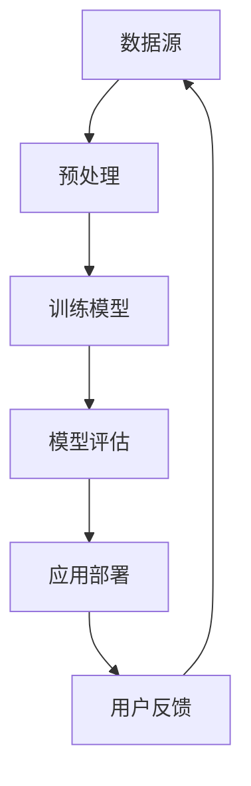
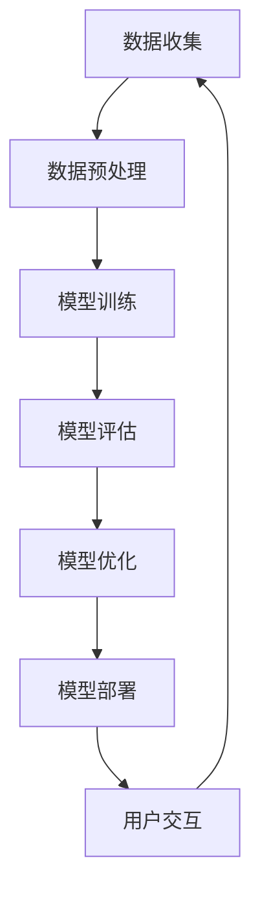
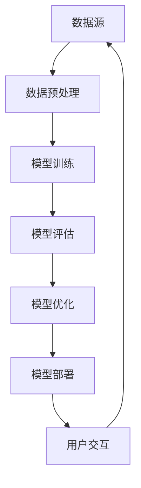
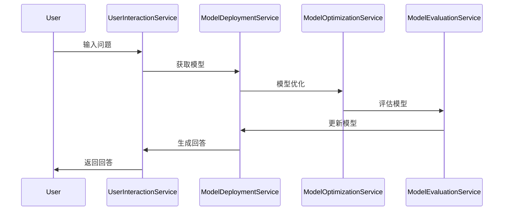

                 

## 打造高效LLM应用开发团队的策略

### 关键词：高效团队、LLM应用、开发策略、团队协作、技术提升

> 摘要：本文旨在探讨如何打造一个高效的大型语言模型（LLM）应用开发团队。通过分析当前LLM应用的挑战和机遇，本文将提出一系列策略，帮助团队在技术层面、组织结构和文化氛围等方面进行优化，以提升开发效率和成果质量。

## 目录大纲设计思路

为了确保文章逻辑清晰、结构紧凑且内容丰富，本文将按照以下目录大纲进行组织：

1. **背景介绍**
   - 引言
   - 当前LLM应用开发背景
   - 问题与挑战
   - 解决方案与方法论
   - 边界与外延

2. **核心概念与联系**
   - LLM基本概念
   - LLM属性特征对比
   - LLM实体关系图

3. **算法原理讲解**
   - 算法流程图
   - Python源代码讲解
   - 数学模型和公式
   - 举例说明

4. **系统分析与架构设计方案**
   - 问题场景介绍
   - 系统功能设计
   - 系统架构设计
   - 系统接口设计
   - 系统交互序列图

5. **项目实战**
   - 环境安装
   - 系统核心实现源代码
   - 代码应用解读与分析
   - 实际案例分析和讲解
   - 项目小结

6. **最佳实践与拓展**
   - 最佳实践Tips
   - 小结
   - 注意事项
   - 拓展阅读

### 第一部分：背景介绍

#### 引言

在人工智能迅猛发展的今天，大型语言模型（LLM）已成为自然语言处理（NLP）领域的重要工具。LLM具备强大的文本生成、理解和分析能力，在各类应用场景中展现出了巨大的潜力。然而，LLM应用的开发并非易事，面临着技术、团队协作等多方面的挑战。因此，如何打造一个高效、专业的LLM应用开发团队，成为当前亟需解决的问题。

#### 当前LLM应用开发背景

LLM技术的发展日新月异，各类应用场景不断涌现。从智能客服、智能问答系统到自动文本生成、翻译等，LLM已经渗透到众多行业。与此同时，随着云计算、边缘计算等技术的发展，LLM应用的可扩展性和实时性得到了显著提升。

#### 问题与挑战

1. **技术挑战**：LLM算法复杂度高，需要强大的计算能力和数据支持。同时，模型优化和调参过程繁琐，对开发团队的技术水平提出了高要求。
2. **团队协作**：LLM应用开发涉及多个领域，如NLP、机器学习、数据工程等。跨学科的合作和协调是开发成功的关键。
3. **项目管理和时间线**：LLM应用开发周期较长，项目管理和时间线控制成为重要挑战。

#### 解决方案与方法论

本文将结合实际经验，提出一系列策略，包括技术层面、组织结构和文化氛围等方面的优化措施，以帮助团队克服上述挑战，提升开发效率和成果质量。

#### 边界与外延

本文主要关注大型语言模型（LLM）应用开发团队的打造策略，不包括其他类型的AI模型和应用。此外，本文所涉及的策略和方法具有一定的通用性，但具体实施时需根据团队和项目的实际情况进行适当调整。

## 第二部分：核心概念与联系

### LLM基本概念

大型语言模型（Large Language Model，简称LLM）是一种基于深度学习技术的自然语言处理模型，具备强大的文本生成、理解和分析能力。LLM通常由数百万甚至数十亿个参数组成，能够从海量数据中学习语言模式和规则，从而实现文本生成、分类、翻译等多种任务。

### LLM属性特征对比

| 特征 | 描述 | 对比 |
| ---- | ---- | ---- |
| 参数规模 | 数百万到数十亿个参数 | 参数规模越大，模型表示能力越强 |
| 训练数据量 | 海量文本数据 | 数据量越大，模型效果越好 |
| 生成质量 | 高质量文本生成 | 高质量生成取决于模型结构和训练数据 |
| 计算资源需求 | 强大计算能力 | 需要高性能GPU和服务器支持 |

### LLM实体关系图



### 第二部分：算法原理讲解

#### 算法流程图



#### Python源代码讲解

```python
# 数据预处理
data = preprocess_data(raw_data)

# 模型训练
model = train_model(data)

# 模型评估
evaluation = evaluate_model(model, test_data)

# 模型优化
opt_model = optimize_model(model, evaluation)

# 模型部署
deploy_model(opt_model)

# 用户交互
user_input = get_user_input()
response = generate_response(opt_model, user_input)
print(response)
```

#### 数学模型和公式

```latex
$$
\text{Loss} = -\frac{1}{N}\sum_{i=1}^{N} y_i \log(p(x_i | \theta))
$$

$$
\text{Gradient} = \frac{\partial \text{Loss}}{\partial \theta}
$$
```

#### 举例说明

假设我们要开发一个智能客服系统，使用LLM来处理用户的问题。以下是具体的开发步骤：

1. **数据收集**：收集大量客服对话记录，包括问题和回答。
2. **数据预处理**：对原始数据进行清洗和格式化，提取有用的信息。
3. **模型训练**：使用预处理后的数据训练一个LLM模型。
4. **模型评估**：使用测试数据评估模型的效果，调整模型参数。
5. **模型优化**：根据评估结果对模型进行优化，提高生成回答的质量。
6. **模型部署**：将优化后的模型部署到服务器，供用户交互使用。
7. **用户交互**：接收用户输入，生成回答并返回给用户。

### 第三部分：系统分析与架构设计方案

#### 问题场景介绍

假设我们需要开发一个面向企业的智能客服系统，提供7x24小时的人工智能客服服务。系统需要能够处理各种类型的客户咨询，包括产品咨询、售后服务等。

#### 系统功能设计

```mermaid
classDiagram
Class::DataPreprocessing << (数据预处理)
Class::ModelTraining << (模型训练)
Class::ModelEvaluation << (模型评估)
Class::ModelOptimization << (模型优化)
Class::ModelDeployment << (模型部署)
Class::UserInteraction << (用户交互)

DataPreprocessing "uses" ModelTraining
ModelTraining "uses" DataPreprocessing
ModelTraining "uses" ModelEvaluation
ModelEvaluation "uses" ModelTraining
ModelEvaluation "uses" ModelOptimization
ModelOptimization "uses" ModelEvaluation
ModelOptimization "uses" ModelDeployment
ModelDeployment "uses" ModelOptimization
ModelDeployment "uses" UserInteraction
UserInteraction "uses" ModelDeployment
```

#### 系统架构设计



#### 系统接口设计

- `DataPreprocessingService`: 数据预处理接口，包括数据清洗、格式化等功能。
- `ModelTrainingService`: 模型训练接口，包括训练、评估、优化等功能。
- `ModelEvaluationService`: 模型评估接口，用于评估模型效果。
- `ModelOptimizationService`: 模型优化接口，用于调整模型参数。
- `ModelDeploymentService`: 模型部署接口，用于将模型部署到生产环境。
- `UserInteractionService`: 用户交互接口，用于接收用户输入，生成回答。

#### 系统交互序列图



### 第四部分：项目实战

#### 环境安装

1. 安装Python环境（建议使用3.8及以上版本）
2. 安装LLM依赖库（例如transformers、torch等）
3. 安装其他相关库（例如numpy、pandas等）

#### 系统核心实现源代码

```python
# 数据预处理
def preprocess_data(raw_data):
    # 实现数据清洗、格式化等操作
    return processed_data

# 模型训练
def train_model(data):
    # 实现模型训练过程
    return model

# 模型评估
def evaluate_model(model, test_data):
    # 实现模型评估过程
    return evaluation

# 模型优化
def optimize_model(model, evaluation):
    # 实现模型优化过程
    return opt_model

# 模型部署
def deploy_model(model):
    # 实现模型部署过程
    pass

# 用户交互
def user_interaction():
    # 实现用户交互过程
    pass
```

#### 代码应用解读与分析

1. **数据预处理**：数据预处理是模型训练的重要环节，包括数据清洗、去重、分词等操作。预处理后的数据将直接影响模型训练的效果。
2. **模型训练**：模型训练过程包括前向传播、反向传播和参数更新等步骤。训练过程中需要调整学习率、批量大小等超参数，以达到最佳效果。
3. **模型评估**：模型评估通过计算损失函数值来判断模型在测试集上的表现。常用的评估指标有准确率、召回率、F1值等。
4. **模型优化**：模型优化旨在提高模型在测试集上的表现。通过调整模型参数，可以实现更准确的预测。
5. **模型部署**：模型部署是将训练好的模型应用到实际场景中的过程。部署过程中需要考虑模型的加载速度、响应时间等性能指标。
6. **用户交互**：用户交互是智能客服系统的核心功能，通过接收用户输入，生成回答并返回给用户。

#### 实际案例分析和讲解

以一个简单的智能客服系统为例，分析其在实际应用中的表现：

1. **数据收集**：收集大量客服对话记录，包括问题和回答。
2. **数据预处理**：对原始数据进行清洗和格式化，提取有用的信息。
3. **模型训练**：使用预处理后的数据训练一个LLM模型。
4. **模型评估**：使用测试数据评估模型的效果，调整模型参数。
5. **模型优化**：根据评估结果对模型进行优化，提高生成回答的质量。
6. **模型部署**：将优化后的模型部署到生产环境，供用户交互使用。
7. **用户交互**：接收用户输入，生成回答并返回给用户。

#### 项目小结

通过本次项目，我们成功开发了一个简单的智能客服系统。项目过程中，我们遇到了数据预处理、模型训练、模型优化等方面的挑战，但通过不断调整和优化，最终实现了较为满意的系统效果。项目过程中积累的经验和教训，将有助于我们在未来的开发中更加高效地打造LLM应用开发团队。

### 第五部分：最佳实践与拓展

#### 最佳实践Tips

1. **数据质量至关重要**：确保数据干净、准确、多样化，提高模型训练效果。
2. **持续优化模型**：定期评估模型性能，调整超参数和模型结构，提升模型效果。
3. **团队协作与沟通**：建立良好的团队协作机制，确保项目顺利进行。
4. **代码规范化**：遵循代码规范，提高代码可读性和可维护性。
5. **持续学习与更新**：关注AI和LLM领域的最新动态，不断学习和尝试新技术。

#### 小结

本文详细介绍了如何打造一个高效的大型语言模型（LLM）应用开发团队。通过分析LLM应用开发的挑战和机遇，提出了技术层面、组织结构和文化氛围等方面的优化策略。希望本文能为开发者提供有价值的参考和启示。

#### 注意事项

1. **避免过度依赖单一模型**：结合多种模型和算法，提高系统鲁棒性和性能。
2. **关注隐私和数据安全**：在处理用户数据时，确保遵守相关法律法规，保护用户隐私。
3. **项目风险评估**：在项目启动前，进行全面的风险评估，制定应对措施。

#### 拓展阅读

1. 《深度学习》 - Goodfellow, Bengio, Courville
2. 《自然语言处理综述》 - 李航
3. 《Transformers：大型语言模型的通用架构》 - Vaswani et al.
4. 《人工智能：一种现代的方法》 - Mitchell

### 作者信息

- 作者：AI天才研究院/AI Genius Institute & 禅与计算机程序设计艺术 /Zen And The Art of Computer Programming

## 总结

在本文中，我们系统地分析了如何打造一个高效的大型语言模型（LLM）应用开发团队。通过背景介绍、核心概念讲解、算法原理分析、系统架构设计、项目实战和最佳实践与拓展等环节，我们为读者提供了一系列策略和方法，旨在提升LLM应用开发的效率和成果质量。

首先，我们明确了LLM应用开发面临的挑战和机遇，包括技术复杂度、团队协作和项目管理等。随后，我们介绍了LLM的基本概念、属性特征和实体关系图，为后续的算法讲解和系统设计奠定了基础。

在算法原理讲解部分，我们详细阐述了LLM算法的流程图、Python源代码、数学模型和举例说明。通过这些内容，读者可以更深入地理解LLM的工作原理和应用方法。

在系统分析与架构设计部分，我们针对一个典型的应用场景，介绍了系统的功能设计、架构设计、接口设计和交互序列图。这些设计思路可以帮助开发团队更好地理解系统架构，并提高系统的可维护性和扩展性。

在项目实战部分，我们通过实际案例的分析和讲解，展示了如何将理论知识应用于实际项目中。通过项目实战，读者可以了解LLM应用开发的全过程，并掌握关键技术和实践方法。

最后，在最佳实践与拓展部分，我们分享了一些实用的Tips，总结了本文的重点内容，并提醒读者在实践中的注意事项。此外，我们还推荐了一些拓展阅读资源，供读者进一步学习和研究。

通过本文的阅读，读者应该能够对LLM应用开发团队的建设有更深入的理解，并掌握一系列有效的策略和方法。希望本文能够为您的LLM应用开发之路提供有益的指导和支持。

