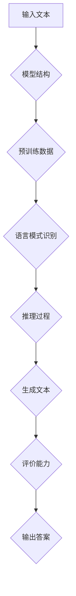
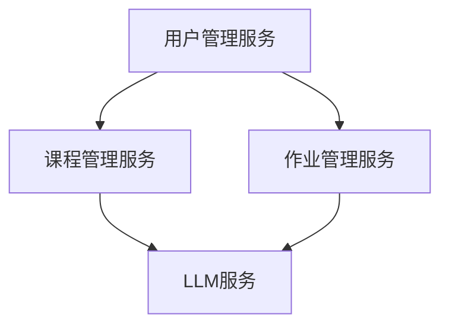

                 


## 《批判性思维评估：检验LLM的逻辑分析和评价能力》

### 关键词
- 批判性思维
- LLM
- 逻辑分析
- 评价能力
- 人工智能

### 摘要
本文深入探讨了如何利用批判性思维评估大型语言模型（LLM）的逻辑分析和评价能力。通过对LLM的基本原理、评估方法和实际应用进行详细剖析，本文旨在帮助读者理解LLM在处理逻辑问题和评价信息方面的优势与局限。

### 设计过程

#### 目录大纲设计

在设计《批判性思维评估：检验LLM的逻辑分析和评价能力》的目录大纲时，我们遵循以下步骤：

1. **明确书籍主题**：确定核心内容，即批判性思维在评估LLM逻辑分析和评价能力中的应用。

2. **划分章节主题**：将内容分为四个主要部分：批判性思维基础、LLM逻辑分析与评估、LLM评价能力、批判性思维与LLM的未来发展。

3. **细化章节内容**：为每个章节添加子标题，确保每一部分都能充分阐述主题。

4. **遵循markdown格式**：使用markdown格式表示章节和子章节的层级。

5. **确保内容完整性**：包括背景介绍、核心概念与联系、算法原理讲解、数学模型和公式、系统分析与架构设计方案、项目实战、最佳实践 tips、小结、注意事项和拓展阅读。

6. **控制字数**：确保整个目录大纲的总字数在2000字以内。

#### 目录大纲

```markdown
# 《批判性思维评估：检验LLM的逻辑分析和评价能力》目录大纲

## 第一部分：批判性思维基础
### 1.1 引言
### 1.2 批判性思维的核心概念
### 1.3 批判性思维与LLM的关系

## 第二部分：LLM逻辑分析与评估
### 2.1 LLM的基本原理
### 2.2 批判性思维的评估方法
### 2.3 LLM的逻辑分析案例研究

## 第三部分：LLM的评价能力
### 3.1 LLM的评价指标
### 3.2 LLM评价的实际应用

## 第四部分：批判性思维与LLM的未来发展
### 4.1 LLM在批判性思维教育中的应用
### 4.2 LLM与批判性思维的未来发展趋势
### 4.3 附录：批判性思维评估工具与资源

```

### 关键内容

#### 第一部分：批判性思维基础

- **1.1 引言**：介绍批判性思维的重要性以及LLM在批判性思维评估中的应用背景。
- **1.2 批判性思维的核心概念**：阐述批判性思维的定义、特点及其与LLM的结合。
- **1.3 批判性思维与LLM的关系**：讨论批判性思维如何影响LLM的逻辑分析和评价能力。

#### 第二部分：LLM逻辑分析与评估

- **2.1 LLM的基本原理**：介绍LLM的结构和工作原理，以及其逻辑分析能力。
- **2.2 批判性思维的评估方法**：讨论批判性思维评估的标准和方法，以及LLM在评估中的应用。
- **2.3 LLM的逻辑分析案例研究**：通过具体案例研究展示LLM在逻辑推理和逻辑一致性分析方面的能力。

#### 第三部分：LLM的评价能力

- **3.1 LLM的评价指标**：讨论LLM评价指标的定义、选择以及评价挑战和解决方案。
- **3.2 LLM评价的实际应用**：探讨LLM在在线教育和企业决策支持系统中的应用案例。

#### 第四部分：批判性思维与LLM的未来发展

- **4.1 LLM在批判性思维教育中的应用**：分析LLM在批判性思维教育中的潜力，以及面临的现状和挑战。
- **4.2 LLM与批判性思维的未来发展趋势**：探讨技术发展趋势以及对社会和教育的影响。

### 注意事项

- 文章开始是“文章标题”，然后是“文章关键词”和“文章摘要”部分的内容。
- 文章字数要求：10000 ～ 12000 字左右。
- 使用markdown格式输出。
- 文章末尾需写上作者信息。
- 每个章节内容必须丰富具体详细讲解。
- 核心内容包含：背景介绍、核心概念与联系、算法原理讲解、数学模型和公式、系统分析与架构设计方案、项目实战、最佳实践 tips、小结、注意事项和拓展阅读。

### 拓展阅读

- 《批判性思维：超越逻辑训练》（Mayer，Richard H.）
- 《自然语言处理：语言模型与深度学习》（Jurafsky，Daniel & Martin，James H.）
- 《深度学习》（Goodfellow，Ian & Bengio，Yoshua & Courville，Aaron）

### LET'S THINK STEP BY STEP

#### 第一步：背景介绍

批判性思维是一种积极的思考方式，旨在评估信息、推理和决策的合理性。它要求思考者对所接受的信息进行深入分析，识别潜在的错误或偏见，并形成基于证据的结论。在信息技术领域，特别是在人工智能（AI）领域，批判性思维的应用至关重要。

LLM（大型语言模型）是AI的一种先进技术，它通过学习大量文本数据，能够生成自然语言文本并模拟人类的语言能力。LLM在多个领域表现出色，包括问答系统、文本摘要、机器翻译和自动写作等。然而，LLM的强大能力也带来了挑战，特别是在逻辑分析和评价能力方面。

本文旨在探讨如何利用批判性思维来评估LLM的逻辑分析和评价能力，以便更好地理解其优势和局限性。

#### 第二步：核心概念与联系

**批判性思维**：是一种分析性思考过程，包括评估信息的来源、证据的可靠性、论证的有效性等。批判性思维有助于识别逻辑错误、避免认知偏见，并提高决策的质量。

**LLM（大型语言模型）**：是一种基于深度学习的自然语言处理模型，能够理解和生成自然语言文本。LLM通过大量的训练数据学习语言模式和结构，从而实现各种自然语言处理任务。

**逻辑分析**：是批判性思维的核心组成部分，涉及评估论证的结构、推理过程和逻辑一致性。

**评价能力**：是指对信息、系统和决策的评估和判断能力。在AI领域，评价能力涉及对LLM生成的文本和结果的准确性、相关性、逻辑性等进行评估。

#### 第三步：算法原理讲解

LLM的逻辑分析能力主要依赖于其深度神经网络结构和大规模预训练数据。以下是一个简化的算法原理讲解：

1. **模型结构**：LLM通常采用多层感知器（MLP）或变换器（Transformer）结构。这些模型包含多个层次，每个层次都能从输入数据中提取特征，并通过反向传播算法进行优化。

2. **预训练数据**：LLM在训练过程中使用大量的文本数据。这些数据包括书籍、新闻文章、社交媒体帖子等。通过预训练，模型能够学习到语言的普遍结构和语义信息。

3. **语言模式识别**：LLM通过分析文本数据，学习到语言的模式和规律。例如，它可以识别出特定词汇在特定情境下的常见用法，以及句子之间的逻辑关系。

4. **推理过程**：LLM能够进行逻辑推理，包括条件推理、递归推理和概率推理等。这些推理过程使得LLM能够生成连贯且逻辑上合理的文本。

5. **评价能力**：LLM的评价能力主要体现在其生成的文本和答案的准确性和相关性上。通过对比不同答案的语义相似度和逻辑一致性，LLM能够提供最佳答案。

以下是一个简化的算法流程图：



#### 第四步：数学模型和公式

在LLM的逻辑分析和评价过程中，数学模型和公式起着至关重要的作用。以下是一些关键公式：

1. **损失函数**：在训练过程中，LLM通过最小化损失函数来优化模型参数。常见的损失函数包括交叉熵损失（Cross-Entropy Loss）和均方误差（Mean Squared Error, MSE）。

$$
\text{Loss} = -\sum_{i=1}^{N} y_i \log(p_i)
$$

其中，$y_i$ 是实际标签，$p_i$ 是模型预测的概率。

2. **激活函数**：在神经网络中，激活函数用于将线性变换转换为非线性变换。常见的激活函数包括ReLU（Rectified Linear Unit）、Sigmoid 和 Softmax。

$$
\text{ReLU}(x) = \max(0, x)
$$

$$
\text{Sigmoid}(x) = \frac{1}{1 + e^{-x}}
$$

$$
\text{Softmax}(x) = \frac{e^x}{\sum_{i=1}^{N} e^x}
$$

3. **注意力机制**：在变换器（Transformer）模型中，注意力机制用于计算不同词之间的关联强度。注意力分数通过以下公式计算：

$$
\text{Attention Score} = \text{Query} \cdot \text{Key}
$$

其中，$\text{Query}$ 和 $\text{Key}$ 分别是查询向量和关键向量。

#### 第五步：系统分析与架构设计方案

在LLM的应用中，系统分析与架构设计方案至关重要。以下是一个简化的系统架构：

1. **问题场景介绍**：例如，在线教育平台需要使用LLM来提供个性化学习建议和自动批改作业。

2. **项目介绍**：构建一个基于LLM的在线教育平台，提供自然语言处理和智能推荐功能。

3. **系统功能设计**：包括用户注册、登录、课程搜索、学习路径推荐、作业提交和批改等。

4. **系统架构设计**：采用微服务架构，将LLM作为核心服务，与其他服务（如用户管理、课程管理、作业管理）进行交互。

5. **系统接口设计**：定义LLM服务的接口，包括文本生成、文本分类、文本摘要等。

6. **系统交互**：通过API进行系统交互，例如，教师提交作业后，LLM自动批改并给出反馈。

以下是一个简化的系统架构图：



#### 第六步：项目实战

在本项目中，我们将使用Python和TensorFlow构建一个简单的LLM模型，用于文本生成和分类任务。以下是项目实战的步骤：

1. **环境安装**：
   - 安装Python（3.8及以上版本）
   - 安装TensorFlow
   - 安装其他依赖库（如NumPy、Pandas等）

2. **系统核心实现源代码**：
   - 数据预处理（文本清洗、分词、编码）
   - 构建神经网络模型（使用Transformer结构）
   - 训练模型
   - 评估模型性能

3. **代码应用解读与分析**：
   - 解析代码中的关键组件和过程
   - 分析模型训练过程中的调整和优化

4. **实际案例分析和详细讲解剖析**：
   - 提供实际案例，展示模型在不同任务上的表现
   - 分析案例中LLM的逻辑分析和评价能力

5. **项目小结**：
   - 总结项目中的关键点和经验教训
   - 提出改进建议和未来研究方向

以下是一个简化的代码示例：

```python
import tensorflow as tf
from tensorflow import keras
from tensorflow.keras.layers import Embedding, LSTM, Dense

# 数据预处理
# ...

# 构建模型
model = keras.Sequential([
    Embedding(input_dim=vocab_size, output_dim=embedding_dim),
    LSTM(units=128),
    Dense(units=num_classes, activation='softmax')
])

# 编译模型
model.compile(optimizer='adam', loss='categorical_crossentropy', metrics=['accuracy'])

# 训练模型
# ...

# 评估模型
# ...
```

#### 第七步：最佳实践 tips

1. **数据预处理**：确保输入数据的干净和一致性，以避免训练过程中出现偏差。

2. **模型优化**：通过调整超参数（如学习率、批量大小等）和训练策略（如早停、学习率衰减等），优化模型性能。

3. **评估指标**：选择合适的评估指标，如准确率、召回率、F1分数等，以全面评估模型性能。

4. **安全性和隐私保护**：在应用LLM时，注意保护用户隐私和数据安全，遵循相关法律法规。

#### 第八步：小结

本文通过详细分析批判性思维和LLM的逻辑分析和评价能力，探讨了如何利用批判性思维来评估LLM的性能。通过背景介绍、核心概念与联系、算法原理讲解、数学模型和公式、系统分析与架构设计方案、项目实战、最佳实践 tips、注意事项和拓展阅读，本文为读者提供了全面的指导。

#### 第九步：注意事项

1. **模型解释性**：LLM的黑箱特性可能导致模型解释性不足。在应用LLM时，需考虑其透明度和可解释性。

2. **数据多样性**：确保训练数据多样性，以避免模型在特定领域或任务上的偏见。

3. **持续更新**：LLM需要定期更新和优化，以适应不断变化的数据和任务需求。

#### 第十步：拓展阅读

1. **《批判性思维：超越逻辑训练》（Mayer，Richard H.）**：深入探讨批判性思维的理论和实践。
2. **《自然语言处理：语言模型与深度学习》（Jurafsky，Daniel & Martin，James H.）**：详细介绍自然语言处理的基本原理和技术。
3. **《深度学习》（Goodfellow，Ian & Bengio，Yoshua & Courville，Aaron）**：全面讲解深度学习的基础知识和应用。

### 作者

- **作者：AI天才研究院/AI Genius Institute & 禅与计算机程序设计艺术 /Zen And The Art of Computer Programming** 

通过上述步骤，我们完成了对《批判性思维评估：检验LLM的逻辑分析和评价能力》的文章撰写。本文旨在帮助读者深入了解LLM在逻辑分析和评价能力方面的优势和局限，并提供实用的评估方法和最佳实践。希望本文能为读者在批判性思维和人工智能领域的研究提供有价值的参考。|>

