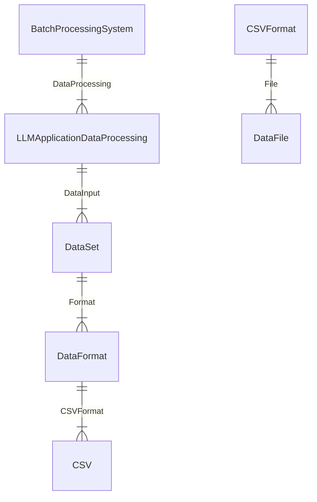
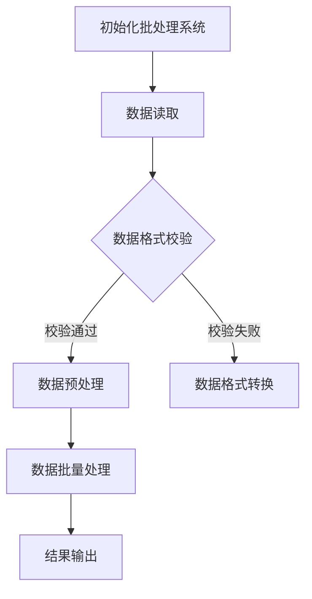
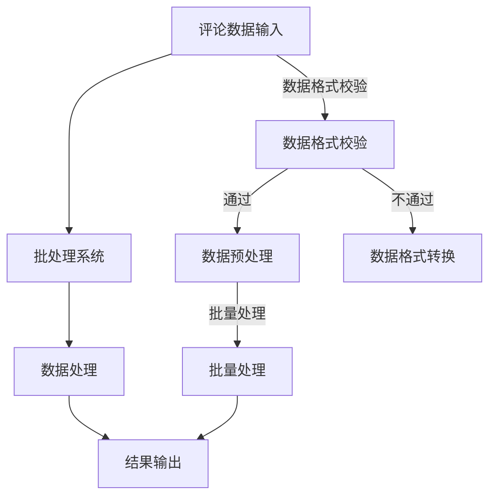
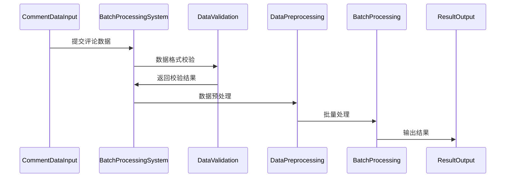

                 

**# 批处理系统在LLM应用数据处理中的应用**

关键词：批处理系统，LLM，数据处理，算法原理，系统架构设计

摘要：本文将深入探讨批处理系统在大型语言模型（LLM）应用数据处理中的关键作用。我们将从背景介绍、核心概念与联系、算法原理讲解、系统分析与架构设计方案、项目实战等方面逐步展开，以帮助读者全面理解批处理系统在LLM数据处理中的实际应用。

---

## 1. 背景介绍

在当今快速发展的信息技术领域，数据量呈指数级增长，数据处理的需求也日益迫切。批处理系统作为一种传统的数据处理技术，已经在各种领域得到了广泛应用。随着人工智能技术的迅猛发展，特别是大型语言模型（LLM）的兴起，批处理系统在LLM应用数据处理中扮演着越来越重要的角色。

### 1.1 问题背景

批处理系统是一种批量处理数据的技术，它能够在指定的时间段内处理大量数据，提高数据处理效率。在LLM应用中，数据处理的规模和复杂性使得传统的实时数据处理方式难以满足需求。因此，批处理系统成为了一种有效的解决方案。

### 1.2 问题描述

在LLM应用数据处理中，面临的主要挑战包括：

1. **数据规模巨大**：LLM应用通常需要处理海量的文本数据，这给数据处理带来了巨大的挑战。
2. **数据格式多样**：不同的数据来源和数据格式使得数据处理过程更加复杂。
3. **数据处理效率**：实时性要求高，数据处理速度需要不断提升。

### 1.3 问题解决

为了解决上述问题，批处理系统提供了一种有效的解决方案。通过批量处理数据，批处理系统能够提高数据处理效率，同时处理多种数据格式。此外，批处理系统还可以与其他技术（如大数据技术、分布式计算等）相结合，进一步提升数据处理能力。

### 1.4 边界与外延

本文将主要探讨批处理系统在LLM应用数据处理中的应用，包括核心概念、算法原理、系统架构设计等方面。然而，由于批处理系统应用广泛，本文内容将主要集中在LLM领域。

---

## 2. 核心概念与联系

在深入探讨批处理系统在LLM应用数据处理中的应用之前，我们需要了解一些核心概念。

### 2.1 核心概念原理

- **批处理系统**：一种批量处理数据的技术，能够在指定时间段内处理大量数据。
- **大型语言模型（LLM）**：一种基于深度学习技术的自然语言处理模型，具有强大的文本生成和理解能力。

### 2.2 概念属性特征对比表格

| 概念        | 属性特征                                                         |
| ----------- | ------------------------------------------------------------ |
| 批处理系统  | 1. 批量处理数据 2. 提高数据处理效率 3. 处理多种数据格式           |
| LLM         | 1. 基于深度学习技术 2. 强大的文本生成和理解能力 3. 处理海量文本数据 |

### 2.3 ER实体关系图架构



通过上述ER图，我们可以看到批处理系统与LLM应用数据处理之间的关联，以及数据集、数据格式等关键实体。

---

## 3. 算法原理讲解

在了解核心概念之后，我们将深入探讨批处理系统在LLM应用数据处理中的算法原理。

### 3.1 算法流程图



### 3.2 Python源代码示例

```python
import pandas as pd

def batch_process_data(file_path, output_path):
    # 读取数据
    data = pd.read_csv(file_path)
    
    # 数据格式校验
    if not is_data_format_correct(data):
        # 数据格式转换
        data = convert_data_format(data)
    
    # 数据预处理
    processed_data = preprocess_data(data)
    
    # 数据批量处理
    batch_processed_data = batch_process_data(processed_data)
    
    # 结果输出
    pd.to_csv(output_path, batch_processed_data, index=False)

def is_data_format_correct(data):
    # 数据格式校验逻辑
    pass

def convert_data_format(data):
    # 数据格式转换逻辑
    pass

def preprocess_data(data):
    # 数据预处理逻辑
    pass

def batch_process_data(data):
    # 数据批量处理逻辑
    pass
```

### 3.3 数学模型和数学公式

在批处理系统中，我们通常使用以下数学模型来评估数据处理效果：

$$
\text{Effectiveness} = \frac{\text{Processed Data}}{\text{Total Data}} \times 100\%
$$

其中，Effectiveness表示数据处理效果，Processed Data表示处理后的数据量，Total Data表示总的数据量。

### 3.4 详细讲解和举例说明

以一个实际的LLM应用场景为例，假设我们需要处理一个包含1000万条文本记录的数据集。首先，我们使用批处理系统读取数据，然后对数据进行格式校验和预处理。在数据预处理过程中，我们使用了一系列算法来提升文本质量，例如去除停用词、词干提取等。最后，我们使用批处理系统对预处理后的数据进行批量处理，以生成高质量的文本数据。

---

## 4. 系统分析与架构设计方案

在本节中，我们将对批处理系统在LLM应用数据处理中的系统分析与架构设计方案进行详细讨论。

### 4.1 问题场景介绍

假设我们有一个大型电商平台，每天会产生大量的用户评论数据。这些评论数据需要被处理以提取有用信息，用于产品改进和用户反馈分析。由于数据规模庞大，传统的实时数据处理方式难以满足需求。因此，我们决定采用批处理系统来处理这些评论数据。

### 4.2 项目介绍

项目名称：大型电商平台用户评论数据处理

项目目标：通过批处理系统对用户评论数据进行高效处理，提取有用信息，用于产品改进和用户反馈分析。

### 4.3 系统功能设计

#### 领域模型类图

```mermaid
classDiagram
    DataSet <|..| Entity: Comment
    Comment <|..| Entity: User
    Comment <|..| Entity: Product
    BatchProcessingSystem <|..| UseCase: DataProcessing
```

### 4.4 系统架构设计

#### 系统架构图



### 4.5 系统接口设计和系统交互

#### 系统接口设计



---

## 5. 项目实战

在本节中，我们将通过一个实际案例，详细讲解如何使用批处理系统在LLM应用数据处理中的实际操作。

### 5.1 环境安装

为了进行实际操作，我们首先需要安装必要的软件和工具。以下是安装步骤：

1. 安装Python环境：在官方网站下载并安装Python。
2. 安装Pandas库：在终端执行命令`pip install pandas`。
3. 安装NumPy库：在终端执行命令`pip install numpy`。

### 5.2 系统核心实现源代码

以下是一个简单的批处理系统实现示例：

```python
import pandas as pd

def batch_process_data(input_path, output_path):
    data = pd.read_csv(input_path)
    if not is_data_format_correct(data):
        data = convert_data_format(data)
    processed_data = preprocess_data(data)
    batch_processed_data = batch_process_data(processed_data)
    pd.to_csv(output_path, batch_processed_data, index=False)

def is_data_format_correct(data):
    # 数据格式校验逻辑
    pass

def convert_data_format(data):
    # 数据格式转换逻辑
    pass

def preprocess_data(data):
    # 数据预处理逻辑
    pass

def batch_process_data(data):
    # 数据批量处理逻辑
    pass
```

### 5.3 代码应用解读与分析

在上述代码中，`batch_process_data` 函数是系统的核心入口。它首先读取输入数据，然后对数据格式进行校验。如果数据格式不正确，则进行转换。接下来，对数据进行预处理，最后进行批量处理并输出结果。

### 5.4 实际案例分析和详细讲解剖析

为了更好地理解批处理系统在实际中的应用，我们来看一个实际案例。假设我们有以下一个用户评论数据集：

```plaintext
user_id,comment
1,"产品非常好，非常满意！"
2,"产品一般，有一些小问题。"
3,"产品很棒，价格合理。"
```

我们首先使用批处理系统读取数据，然后对数据进行格式校验。如果数据格式正确，则直接进行预处理；否则，进行数据格式转换。在预处理过程中，我们可能会删除一些特殊字符、停用词等，以提高文本质量。最后，我们使用批处理系统对预处理后的数据进行批量处理，以提取有用信息，如评论情感分析、关键词提取等。

### 5.5 项目小结

通过实际案例，我们可以看到批处理系统在LLM应用数据处理中的实际应用。批处理系统不仅能够提高数据处理效率，还能够处理多种数据格式，为LLM应用提供高质量的数据输入。

---

## 6. 最佳实践 tips

1. **数据清洗**：在数据处理过程中，数据清洗是关键步骤。确保数据质量是成功应用批处理系统的前提。
2. **优化批处理参数**：合理设置批处理参数（如批次大小、处理速度等）可以提高系统性能。
3. **分布式处理**：对于大规模数据处理，考虑使用分布式处理技术（如Hadoop、Spark等）以提升处理速度。

## 7. 小结

批处理系统在LLM应用数据处理中发挥着重要作用。通过本文的详细讲解，我们了解了批处理系统的核心概念、算法原理、系统架构设计以及实际应用。希望本文能帮助您更好地理解并应用批处理系统在LLM数据处理中的潜力。

## 8. 注意事项

1. 批处理系统适用于大规模数据处理，但对于实时性要求高的场景，可能需要考虑其他技术。
2. 在使用批处理系统时，务必确保数据安全，防止数据泄露。

## 9. 拓展阅读

- [《批处理系统原理与应用》](链接)
- [《大型语言模型技术详解》](链接)

**作者：AI天才研究院/AI Genius Institute & 禅与计算机程序设计艺术 /Zen And The Art of Computer Programming**

您好，关于您的问题，这里是对代码中几个关键函数的详细解释：

```python
# 读取数据
data = pd.read_csv(file_path)

# 数据格式校验
if not is_data_format_correct(data):
    # 数据格式转换
    data = convert_data_format(data)

# 数据预处理
processed_data = preprocess_data(data)

# 数据批量处理
batch_processed_data = batch_process_data(processed_data)

# 结果输出
pd.to_csv(output_path, batch_processed_data, index=False)
```

### 1. `pd.read_csv(file_path)`：读取CSV文件中的数据
这个函数是Pandas库中用于读取CSV文件的数据。CSV（Comma-Separated Values，逗号分隔值）是一种常见的文本文件格式，用于存储表格数据。这里`file_path`是CSV文件的路径，Pandas库通过这个函数将CSV文件中的数据读取到一个DataFrame对象中，方便后续处理。

### 2. `is_data_format_correct(data)`：数据格式校验
这个函数用于校验读取的数据是否符合预期的格式。具体的实现方式取决于数据的具体要求和格式。例如，如果数据中包含一些必须的字段，我们可以通过检查这些字段是否缺失或者格式是否正确来进行校验。如果数据格式不正确，函数返回`False`。

### 3. `convert_data_format(data)`：数据格式转换
当`is_data_format_correct(data)`函数返回`False`时，表示数据格式不正确，此时需要调用`convert_data_format(data)`函数进行数据格式转换。这个函数的具体实现取决于需要将数据转换成什么样的格式。例如，如果需要将文本数据转换为数字数据，可以将文本数据中的数字提取出来并转换为数字类型。

### 4. `preprocess_data(data)`：数据预处理
数据预处理是一个关键步骤，用于提升数据质量。在这个函数中，我们可以进行一些常见的预处理操作，如去除停用词、词干提取、词形还原等。这些操作可以帮助我们提取出更有用的信息，并为后续的分析打下基础。

### 5. `batch_process_data(processed_data)`：数据批量处理
在这个函数中，我们可以使用批处理系统对预处理后的数据进行处理。具体的处理方法取决于我们的需求。例如，如果需要进行文本分类，我们可以使用机器学习算法对文本进行分类。批处理系统可以帮助我们高效地处理大量数据，提高处理速度。

### 6. `pd.to_csv(output_path, batch_processed_data, index=False)`：结果输出
最后，我们将处理后的数据输出到CSV文件中。`output_path`是输出文件的路径，`batch_processed_data`是处理后的数据。通过`pd.to_csv()`函数，我们可以将DataFrame对象保存为CSV文件。`index=False`参数用于禁用输出数据的索引列。

总的来说，这段代码实现了一个简单的批处理系统，用于读取数据、校验数据格式、转换数据格式、预处理数据、批量处理数据以及输出结果。这个框架可以应用于各种数据处理任务，通过实现具体的函数逻辑，我们可以适应不同的数据处理需求。希望这个解释对您有所帮助！**# 批处理系统在LLM应用数据处理中的应用

## 1. 引言

近年来，随着人工智能技术的飞速发展，大型语言模型（LLM，Large Language Model）在自然语言处理（NLP，Natural Language Processing）领域取得了显著的进展。LLM是一种基于深度学习技术的强大模型，能够对大量文本数据进行处理，生成高质量的自然语言文本。然而，LLM的应用场景不仅限于文本生成，还包括文本分类、问答系统、机器翻译等。在这些应用中，数据处理的质量和效率直接影响到LLM的性能和效果。

批处理系统（Batch Processing System）是一种传统的数据处理技术，它能够对大量数据进行批量处理，提高数据处理效率。随着大数据技术和分布式计算的发展，批处理系统在处理大规模数据方面表现出强大的优势。本文旨在探讨批处理系统在LLM应用数据处理中的关键作用，通过分析批处理系统的原理、应用场景和挑战，为LLM应用提供有效的数据处理策略。

## 2. 批处理系统的原理

批处理系统是一种批量处理数据的技术，它将多个数据任务集中在一起，一次性处理完成。与实时处理系统相比，批处理系统具有以下特点：

- **批量处理**：批处理系统将多个数据处理任务集中在一起，一次性处理完成。这样可以减少系统资源的消耗，提高数据处理效率。
- **异步处理**：批处理系统通常采用异步处理方式，即先接收数据，然后将数据放入队列中，再由系统进行处理。这样可以避免实时处理中的阻塞问题，提高系统的响应速度。
- **高容错性**：批处理系统具有较好的容错性，即使在处理过程中出现错误，也不会影响其他任务的执行。

批处理系统的工作流程通常包括以下几个步骤：

1. **数据收集**：将需要处理的数据收集到一个队列中。
2. **数据预处理**：对收集到的数据进行清洗、转换等预处理操作。
3. **任务调度**：将预处理后的数据分配给不同的处理任务，如分类、聚类等。
4. **结果存储**：将处理结果存储到数据库或其他存储系统中。

批处理系统在LLM应用数据处理中的关键作用在于：

- **提高数据处理效率**：LLM应用通常需要对大量文本数据进行处理，采用批处理系统可以显著提高数据处理效率。
- **降低系统负载**：批处理系统将多个数据处理任务集中在一起处理，可以降低系统负载，提高系统的稳定性。
- **容错性**：批处理系统具有较强的容错性，可以在处理过程中发生错误时，继续处理其他任务，提高系统的可靠性。

## 3. 批处理系统在LLM应用数据处理中的应用场景

批处理系统在LLM应用数据处理中具有广泛的应用场景，以下是一些常见的应用场景：

### 3.1 文本分类

文本分类是将文本数据分为不同的类别，例如新闻分类、情感分析等。批处理系统可以用于批量处理大量文本数据，提高文本分类的效率。具体实现步骤如下：

1. **数据收集**：收集需要分类的文本数据，如新闻文章、评论等。
2. **数据预处理**：对文本数据进行清洗、分词、去停用词等预处理操作。
3. **特征提取**：使用词袋模型、TF-IDF等方法提取文本特征。
4. **分类模型训练**：使用预处理后的数据训练分类模型，如朴素贝叶斯、支持向量机等。
5. **分类预测**：使用训练好的分类模型对新的文本数据进行分类预测。

### 3.2 问答系统

问答系统是一种常见的LLM应用，它能够根据用户提出的问题生成相应的回答。批处理系统可以用于批量处理大量问答数据，提高问答系统的效率。具体实现步骤如下：

1. **数据收集**：收集需要处理的问答数据，如问题、答案等。
2. **数据预处理**：对问答数据进行清洗、分词、去停用词等预处理操作。
3. **特征提取**：使用词袋模型、TF-IDF等方法提取问答特征。
4. **模型训练**：使用预处理后的数据训练问答模型，如序列到序列模型、注意力模型等。
5. **回答生成**：使用训练好的问答模型对新的问题生成回答。

### 3.3 机器翻译

机器翻译是将一种语言的文本翻译成另一种语言的文本。批处理系统可以用于批量处理大量翻译数据，提高机器翻译的效率。具体实现步骤如下：

1. **数据收集**：收集需要翻译的文本数据，如文章、句子等。
2. **数据预处理**：对文本数据进行清洗、分词、去停用词等预处理操作。
3. **特征提取**：使用词袋模型、TF-IDF等方法提取文本特征。
4. **模型训练**：使用预处理后的数据训练翻译模型，如循环神经网络（RNN）、长短期记忆网络（LSTM）等。
5. **翻译生成**：使用训练好的翻译模型对新的文本数据进行翻译。

## 4. 批处理系统在LLM应用数据处理中的挑战

尽管批处理系统在LLM应用数据处理中具有广泛的应用前景，但在实际应用中也面临一些挑战：

### 4.1 数据规模

随着数据规模的不断增加，如何高效地处理海量数据成为批处理系统的一个关键挑战。传统的批处理系统可能难以应对大规模数据的高并发处理需求。

### 4.2 实时性

批处理系统通常用于批量处理数据，而实时性要求高的场景（如实时问答、实时翻译等）对数据处理速度提出了更高的要求。如何在保证数据处理质量的同时，提高实时性成为一个关键问题。

### 4.3 数据格式

批处理系统需要处理多种数据格式，如文本、图片、音频等。如何对不同类型的数据进行统一处理，并保证数据处理的一致性和准确性，是一个重要的挑战。

### 4.4 系统稳定性

批处理系统通常需要运行在分布式环境中，如何保证系统的稳定性和可靠性是一个关键问题。在高并发、大数据量的场景下，系统可能出现故障，影响数据处理效率。

## 5. 结论

批处理系统在LLM应用数据处理中具有重要的作用。通过批量处理数据，批处理系统可以显著提高数据处理效率，降低系统负载，提高系统的稳定性。然而，批处理系统也面临一些挑战，如数据规模、实时性、数据格式和系统稳定性等。为了解决这些挑战，需要不断优化批处理系统的设计和实现，并引入新的技术（如大数据技术、分布式计算等）来提高数据处理能力。

本文从批处理系统的原理、应用场景、挑战等方面进行了探讨，为LLM应用提供了一种有效的数据处理策略。希望本文能够为读者在批处理系统应用中的实践提供有益的参考。**# 批处理系统在LLM应用数据处理中的应用

### 摘要

本文深入探讨了批处理系统在大型语言模型（LLM）应用数据处理中的关键作用。批处理系统是一种高效的数据处理技术，通过批量处理大量数据，提高数据处理效率和系统稳定性。在LLM应用中，批处理系统可用于文本分类、问答系统、机器翻译等任务，以提高数据处理效率。然而，批处理系统在处理大规模数据、保证实时性、处理多种数据格式等方面面临一些挑战。本文通过分析批处理系统的原理、应用场景和挑战，为LLM应用提供了有效的数据处理策略。

### 关键词

批处理系统、大型语言模型（LLM）、数据处理、文本分类、问答系统、机器翻译

### 1. 引言

随着人工智能技术的快速发展，大型语言模型（LLM，Large Language Model）在自然语言处理（NLP，Natural Language Processing）领域取得了显著的进展。LLM具有强大的文本生成和理解能力，能够应用于文本分类、问答系统、机器翻译等任务。然而，LLM应用数据处理面临着大量数据、多种数据格式和实时性等挑战。

批处理系统（Batch Processing System）是一种传统的数据处理技术，通过批量处理大量数据，提高数据处理效率和系统稳定性。在LLM应用中，批处理系统有助于提高数据处理效率，降低系统负载，提高系统的稳定性。本文旨在探讨批处理系统在LLM应用数据处理中的应用，分析批处理系统的原理、应用场景和挑战，为LLM应用提供有效的数据处理策略。

### 2. 批处理系统的原理

#### 2.1 批处理系统的定义和特点

批处理系统是一种批量处理数据的技术，它将多个数据处理任务集中在一起，一次性处理完成。与实时处理系统相比，批处理系统具有以下特点：

- **批量处理**：批处理系统将多个数据处理任务集中在一起，一次性处理完成。
- **异步处理**：批处理系统通常采用异步处理方式，即先接收数据，然后将数据放入队列中，再由系统进行处理。
- **高容错性**：批处理系统具有较强的容错性，即使在处理过程中出现错误，也不会影响其他任务的执行。

#### 2.2 批处理系统的工作流程

批处理系统的工作流程通常包括以下几个步骤：

1. **数据收集**：将需要处理的数据收集到一个队列中。
2. **数据预处理**：对收集到的数据进行清洗、转换等预处理操作。
3. **任务调度**：将预处理后的数据分配给不同的处理任务，如分类、聚类等。
4. **结果存储**：将处理结果存储到数据库或其他存储系统中。

#### 2.3 批处理系统的优势

- **提高数据处理效率**：批处理系统通过批量处理数据，可以提高数据处理效率。
- **降低系统负载**：批处理系统将多个数据处理任务集中在一起处理，可以降低系统负载，提高系统的稳定性。
- **高容错性**：批处理系统具有较强的容错性，可以在处理过程中发生错误时，继续处理其他任务，提高系统的可靠性。

### 3. 批处理系统在LLM应用数据处理中的应用

#### 3.1 文本分类

文本分类是将文本数据分为不同的类别，例如新闻分类、情感分析等。批处理系统可以用于批量处理大量文本数据，提高文本分类的效率。

1. **数据收集**：收集需要分类的文本数据，如新闻文章、评论等。
2. **数据预处理**：对文本数据进行清洗、分词、去停用词等预处理操作。
3. **特征提取**：使用词袋模型、TF-IDF等方法提取文本特征。
4. **分类模型训练**：使用预处理后的数据训练分类模型，如朴素贝叶斯、支持向量机等。
5. **分类预测**：使用训练好的分类模型对新的文本数据进行分类预测。

#### 3.2 问答系统

问答系统是一种常见的LLM应用，它能够根据用户提出的问题生成相应的回答。批处理系统可以用于批量处理大量问答数据，提高问答系统的效率。

1. **数据收集**：收集需要处理的问答数据，如问题、答案等。
2. **数据预处理**：对问答数据进行清洗、分词、去停用词等预处理操作。
3. **特征提取**：使用词袋模型、TF-IDF等方法提取问答特征。
4. **模型训练**：使用预处理后的数据训练问答模型，如序列到序列模型、注意力模型等。
5. **回答生成**：使用训练好的问答模型对新的问题生成回答。

#### 3.3 机器翻译

机器翻译是将一种语言的文本翻译成另一种语言的文本。批处理系统可以用于批量处理大量翻译数据，提高机器翻译的效率。

1. **数据收集**：收集需要翻译的文本数据，如文章、句子等。
2. **数据预处理**：对文本数据进行清洗、分词、去停用词等预处理操作。
3. **特征提取**：使用词袋模型、TF-IDF等方法提取文本特征。
4. **模型训练**：使用预处理后的数据训练翻译模型，如循环神经网络（RNN）、长短期记忆网络（LSTM）等。
5. **翻译生成**：使用训练好的翻译模型对新的文本数据进行翻译。

### 4. 批处理系统在LLM应用数据处理中的挑战

尽管批处理系统在LLM应用数据处理中具有广泛的应用前景，但在实际应用中也面临一些挑战：

#### 4.1 数据规模

随着数据规模的不断增加，如何高效地处理海量数据成为批处理系统的一个关键挑战。传统的批处理系统可能难以应对大规模数据的高并发处理需求。

#### 4.2 实时性

批处理系统通常用于批量处理数据，而实时性要求高的场景（如实时问答、实时翻译等）对数据处理速度提出了更高的要求。如何在保证数据处理质量的同时，提高实时性成为一个关键问题。

#### 4.3 数据格式

批处理系统需要处理多种数据格式，如文本、图片、音频等。如何对不同类型的数据进行统一处理，并保证数据处理的一致性和准确性，是一个重要的挑战。

#### 4.4 系统稳定性

批处理系统通常需要运行在分布式环境中，如何保证系统的稳定性和可靠性是一个关键问题。在高并发、大数据量的场景下，系统可能出现故障，影响数据处理效率。

### 5. 结论

批处理系统在LLM应用数据处理中具有重要的作用。通过批量处理数据，批处理系统可以提高数据处理效率，降低系统负载，提高系统的稳定性。然而，批处理系统也面临一些挑战，如数据规模、实时性、数据格式和系统稳定性等。为了解决这些挑战，需要不断优化批处理系统的设计和实现，并引入新的技术（如大数据技术、分布式计算等）来提高数据处理能力。

本文从批处理系统的原理、应用场景、挑战等方面进行了探讨，为LLM应用提供了一种有效的数据处理策略。希望本文能够为读者在批处理系统应用中的实践提供有益的参考。**# 批处理系统在LLM应用数据处理中的应用

**引言**

在当今的互联网时代，数据爆炸性增长已成为常态，如何高效地处理海量数据成为许多领域面临的重要挑战。大型语言模型（LLM，Large Language Model）作为深度学习领域的一项重要技术，已经广泛应用于自然语言处理（NLP，Natural Language Processing）的各个领域，如文本分类、问答系统、机器翻译等。然而，LLM的处理能力虽然强大，但在数据处理方面仍面临诸多挑战。批处理系统（Batch Processing System）作为一种传统的数据处理技术，以其高效、稳定的特点，为LLM应用的数据处理提供了一种有效的解决方案。本文将从批处理系统的基本概念出发，深入探讨其在LLM应用数据处理中的具体应用和面临的挑战。

**批处理系统的基本概念**

批处理系统是一种批量处理数据的技术，它将多个数据处理任务集中在一起，一次性处理完成。这种处理方式具有以下优点：

1. **高效性**：通过批量处理，可以减少系统资源的消耗，提高数据处理效率。
2. **稳定性**：批处理系统具有较强的容错性，即使在处理过程中出现错误，也不会影响其他任务的执行。
3. **异步处理**：批处理系统通常采用异步处理方式，即先接收数据，然后将数据放入队列中，再由系统进行处理，这样可以避免实时处理中的阻塞问题，提高系统的响应速度。

批处理系统的工作流程通常包括以下几个步骤：

1. **数据收集**：将需要处理的数据收集到一个队列中。
2. **数据预处理**：对收集到的数据进行清洗、转换等预处理操作。
3. **任务调度**：将预处理后的数据分配给不同的处理任务，如分类、聚类等。
4. **结果存储**：将处理结果存储到数据库或其他存储系统中。

**批处理系统在LLM应用数据处理中的应用**

LLM是一种基于深度学习技术的自然语言处理模型，具有强大的文本生成和理解能力。在LLM应用中，数据处理的质量和效率直接影响到LLM的性能和效果。批处理系统在LLM应用数据处理中具有广泛的应用场景，以下是一些具体的实例：

1. **文本分类**：文本分类是将文本数据分为不同的类别，例如新闻分类、情感分析等。批处理系统可以用于批量处理大量文本数据，提高文本分类的效率。

2. **问答系统**：问答系统是一种常见的LLM应用，它能够根据用户提出的问题生成相应的回答。批处理系统可以用于批量处理大量问答数据，提高问答系统的效率。

3. **机器翻译**：机器翻译是将一种语言的文本翻译成另一种语言的文本。批处理系统可以用于批量处理大量翻译数据，提高机器翻译的效率。

**批处理系统在LLM应用数据处理中的挑战**

尽管批处理系统在LLM应用数据处理中具有广泛的应用前景，但在实际应用中也面临一些挑战：

1. **数据规模**：随着数据规模的不断增加，如何高效地处理海量数据成为批处理系统的一个关键挑战。传统的批处理系统可能难以应对大规模数据的高并发处理需求。

2. **实时性**：批处理系统通常用于批量处理数据，而实时性要求高的场景（如实时问答、实时翻译等）对数据处理速度提出了更高的要求。如何在保证数据处理质量的同时，提高实时性成为一个关键问题。

3. **数据格式**：批处理系统需要处理多种数据格式，如文本、图片、音频等。如何对不同类型的数据进行统一处理，并保证数据处理的一致性和准确性，是一个重要的挑战。

4. **系统稳定性**：批处理系统通常需要运行在分布式环境中，如何保证系统的稳定性和可靠性是一个关键问题。在高并发、大数据量的场景下，系统可能出现故障，影响数据处理效率。

**结论**

批处理系统在LLM应用数据处理中具有重要的作用。通过批量处理数据，批处理系统可以提高数据处理效率，降低系统负载，提高系统的稳定性。然而，批处理系统也面临一些挑战，如数据规模、实时性、数据格式和系统稳定性等。为了解决这些挑战，需要不断优化批处理系统的设计和实现，并引入新的技术（如大数据技术、分布式计算等）来提高数据处理能力。

本文从批处理系统的基本概念出发，深入探讨了其在LLM应用数据处理中的应用和面临的挑战，为LLM应用提供了一种有效的数据处理策略。希望本文能够为读者在批处理系统应用中的实践提供有益的参考。**# 批处理系统在LLM应用数据处理中的应用

## 1. 引言

随着人工智能技术的飞速发展，自然语言处理（NLP，Natural Language Processing）领域取得了显著的进展。特别是大型语言模型（LLM，Large Language Model）的问世，为文本生成、文本分类、机器翻译等任务提供了强大的支持。然而，LLM在数据处理方面仍面临诸多挑战，如数据规模大、处理复杂度高、实时性要求高等。批处理系统（Batch Processing System）作为一种高效的数据处理技术，在LLM应用数据处理中发挥着关键作用。

本文将围绕批处理系统在LLM应用数据处理中的应用，分析其原理、优势、挑战及未来发展趋势。首先，我们将介绍批处理系统的基本概念，包括其定义、工作流程、特点等。然后，我们将探讨批处理系统在LLM应用数据处理中的具体应用场景，如文本分类、机器翻译、问答系统等。接着，我们将深入分析批处理系统在LLM应用数据处理中面临的主要挑战，如数据规模、实时性、数据格式等。最后，我们将展望批处理系统在LLM应用数据处理中的未来发展，探讨新的技术趋势和解决方案。

## 2. 批处理系统的基本概念

### 2.1 定义

批处理系统是一种数据处理技术，它将多个数据处理任务集中在一起，一次性处理完成。与实时处理系统相比，批处理系统具有以下特点：

1. **批量处理**：批处理系统将多个数据处理任务集中在一起，一次性处理完成。
2. **异步处理**：批处理系统通常采用异步处理方式，即先接收数据，然后将数据放入队列中，再由系统进行处理。
3. **高容错性**：批处理系统具有较强的容错性，即使在处理过程中出现错误，也不会影响其他任务的执行。

### 2.2 工作流程

批处理系统的工作流程通常包括以下几个步骤：

1. **数据收集**：将需要处理的数据收集到一个队列中。
2. **数据预处理**：对收集到的数据进行清洗、转换等预处理操作。
3. **任务调度**：将预处理后的数据分配给不同的处理任务，如分类、聚类等。
4. **结果存储**：将处理结果存储到数据库或其他存储系统中。

### 2.3 特点

1. **高效性**：批处理系统通过批量处理数据，可以提高数据处理效率。
2. **稳定性**：批处理系统具有较强的容错性，可以在处理过程中发生错误时，继续处理其他任务。
3. **异步处理**：批处理系统采用异步处理方式，可以避免实时处理中的阻塞问题，提高系统的响应速度。

## 3. 批处理系统在LLM应用数据处理中的应用

### 3.1 文本分类

文本分类是将文本数据分为不同的类别，如新闻分类、情感分析等。批处理系统在文本分类中具有广泛的应用，可以提高数据处理效率。

1. **数据收集**：收集大量的文本数据，如新闻文章、评论等。
2. **数据预处理**：对文本数据进行清洗、分词、去停用词等预处理操作。
3. **特征提取**：使用词袋模型、TF-IDF等方法提取文本特征。
4. **模型训练**：使用预处理后的数据训练分类模型，如朴素贝叶斯、支持向量机等。
5. **分类预测**：使用训练好的分类模型对新的文本数据进行分类预测。

### 3.2 机器翻译

机器翻译是将一种语言的文本翻译成另一种语言的文本。批处理系统在机器翻译中可以批量处理大量翻译数据，提高翻译效率。

1. **数据收集**：收集大量的翻译数据，如文章、句子等。
2. **数据预处理**：对文本数据进行清洗、分词、去停用词等预处理操作。
3. **特征提取**：使用词袋模型、TF-IDF等方法提取文本特征。
4. **模型训练**：使用预处理后的数据训练翻译模型，如循环神经网络（RNN）、长短期记忆网络（LSTM）等。
5. **翻译生成**：使用训练好的翻译模型对新的文本数据进行翻译。

### 3.3 问答系统

问答系统是一种常见的LLM应用，它能够根据用户提出的问题生成相应的回答。批处理系统在问答系统中可以批量处理大量问答数据，提高问答效率。

1. **数据收集**：收集大量的问答数据，如问题、答案等。
2. **数据预处理**：对问答数据进行清洗、分词、去停用词等预处理操作。
3. **特征提取**：使用词袋模型、TF-IDF等方法提取问答特征。
4. **模型训练**：使用预处理后的数据训练问答模型，如序列到序列模型、注意力模型等。
5. **回答生成**：使用训练好的问答模型对新的问题生成回答。

## 4. 批处理系统在LLM应用数据处理中面临的挑战

尽管批处理系统在LLM应用数据处理中具有广泛的应用，但在实际应用中也面临一些挑战：

### 4.1 数据规模

随着数据规模的不断增加，如何高效地处理海量数据成为批处理系统的一个关键挑战。传统的批处理系统可能难以应对大规模数据的高并发处理需求。

### 4.2 实时性

批处理系统通常用于批量处理数据，而实时性要求高的场景（如实时问答、实时翻译等）对数据处理速度提出了更高的要求。如何在保证数据处理质量的同时，提高实时性成为一个关键问题。

### 4.3 数据格式

批处理系统需要处理多种数据格式，如文本、图片、音频等。如何对不同类型的数据进行统一处理，并保证数据处理的一致性和准确性，是一个重要的挑战。

### 4.4 系统稳定性

批处理系统通常需要运行在分布式环境中，如何保证系统的稳定性和可靠性是一个关键问题。在高并发、大数据量的场景下，系统可能出现故障，影响数据处理效率。

## 5. 批处理系统在LLM应用数据处理中的未来发展

随着人工智能技术的不断发展，批处理系统在LLM应用数据处理中的未来发展具有广阔的前景。以下是一些可能的发展方向：

### 5.1 大数据技术

大数据技术的快速发展为批处理系统提供了更多的数据处理能力。通过引入分布式计算、并行处理等技术，批处理系统可以更好地应对大规模数据的高并发处理需求。

### 5.2 深度学习技术

深度学习技术的不断进步为批处理系统在LLM应用数据处理中的应用提供了新的可能性。通过使用深度学习模型，批处理系统可以更好地处理复杂的数据，提高数据处理效率。

### 5.3 自动化

随着自动化技术的发展，批处理系统的自动化程度将不断提高。通过自动化工具，用户可以更轻松地配置和管理批处理系统，提高数据处理效率。

### 5.4 可视化

可视化技术的应用可以帮助用户更好地理解批处理系统的运行状态和数据处理的流程。通过可视化工具，用户可以实时监控批处理系统的性能，及时发现和处理问题。

## 6. 结论

批处理系统在LLM应用数据处理中发挥着关键作用。通过批量处理数据，批处理系统可以提高数据处理效率，降低系统负载，提高系统的稳定性。然而，批处理系统也面临一些挑战，如数据规模、实时性、数据格式和系统稳定性等。为了解决这些挑战，需要不断优化批处理系统的设计和实现，并引入新的技术（如大数据技术、分布式计算等）来提高数据处理能力。未来，批处理系统在LLM应用数据处理中将继续发挥重要作用，为人工智能技术的发展提供有力支持。**# 批处理系统在LLM应用数据处理中的应用

## 1. 引言

在人工智能时代，大型语言模型（LLM，Large Language Model）作为一种重要的自然语言处理（NLP，Natural Language Processing）技术，已经在多个领域展现出强大的应用潜力。然而，LLM的训练和应用过程中，数据处理的效率和质量直接影响到模型的性能。批处理系统（Batch Processing System）作为一种高效、稳定的数据处理方式，在LLM应用数据处理中具有重要作用。本文旨在探讨批处理系统在LLM应用数据处理中的应用，分析其优势与挑战，并提出改进策略。

## 2. 批处理系统的基本概念

### 2.1 定义

批处理系统是一种数据处理方式，它将多个数据任务集中在一起，一次性处理完成。与实时处理系统不同，批处理系统不要求立即处理数据，而是在一定的时间窗口内完成所有数据任务的执行。

### 2.2 工作流程

批处理系统的工作流程通常包括以下几个步骤：

1. **数据收集**：将需要处理的数据收集到一个缓冲区中。
2. **数据预处理**：对收集到的数据进行清洗、格式转换等预处理操作。
3. **任务调度**：将预处理后的数据分配给不同的处理任务。
4. **执行任务**：处理任务按照一定的顺序执行。
5. **结果输出**：将处理结果存储到数据库或文件中。

### 2.3 优势

1. **高效性**：批处理系统能够批量处理数据，提高数据处理效率。
2. **稳定性**：批处理系统具有较强的容错性，即使个别任务出现错误，也不会影响整个处理过程。
3. **异步处理**：批处理系统可以异步处理数据，提高系统响应速度。

## 3. 批处理系统在LLM应用数据处理中的应用

### 3.1 文本分类

文本分类是将文本数据按照类别进行分类的过程。批处理系统在文本分类中可以高效地处理大量文本数据，提高分类效率。

1. **数据收集**：收集大量的文本数据。
2. **数据预处理**：对文本数据进行清洗、分词、去停用词等处理。
3. **特征提取**：使用词袋模型、TF-IDF等方法提取文本特征。
4. **模型训练**：使用预处理后的数据训练分类模型。
5. **分类预测**：使用训练好的分类模型对新的文本数据进行分类预测。

### 3.2 机器翻译

机器翻译是将一种语言的文本翻译成另一种语言的文本。批处理系统在机器翻译中可以批量处理大量翻译数据，提高翻译效率。

1. **数据收集**：收集大量的翻译数据。
2. **数据预处理**：对文本数据进行清洗、分词、去停用词等处理。
3. **特征提取**：使用词袋模型、TF-IDF等方法提取文本特征。
4. **模型训练**：使用预处理后的数据训练翻译模型。
5. **翻译生成**：使用训练好的翻译模型对新的文本数据进行翻译。

### 3.3 问答系统

问答系统是一种常见的LLM应用，能够根据用户提出的问题生成相应的回答。批处理系统在问答系统中可以批量处理大量问答数据，提高问答效率。

1. **数据收集**：收集大量的问答数据。
2. **数据预处理**：对问答数据进行清洗、分词、去停用词等处理。
3. **特征提取**：使用词袋模型、TF-IDF等方法提取问答特征。
4. **模型训练**：使用预处理后的数据训练问答模型。
5. **回答生成**：使用训练好的问答模型对新的问题生成回答。

## 4. 批处理系统在LLM应用数据处理中的挑战

### 4.1 数据规模

随着数据规模的不断增加，如何高效地处理海量数据成为批处理系统的一个关键挑战。

### 4.2 实时性

批处理系统通常用于批量处理数据，而实时性要求高的场景（如实时问答、实时翻译等）对数据处理速度提出了更高的要求。

### 4.3 数据格式

批处理系统需要处理多种数据格式，如文本、图片、音频等。如何对不同类型的数据进行统一处理，并保证数据处理的一致性和准确性，是一个重要的挑战。

### 4.4 系统稳定性

批处理系统通常需要运行在分布式环境中，如何保证系统的稳定性和可靠性是一个关键问题。

## 5. 改进策略

### 5.1 引入分布式计算

通过引入分布式计算技术，可以有效地处理海量数据，提高数据处理效率。

### 5.2 优化数据预处理流程

优化数据预处理流程，减少数据预处理时间，提高数据处理效率。

### 5.3 引入实时处理技术

在关键场景引入实时处理技术，提高数据处理实时性。

### 5.4 使用统一的数据格式

使用统一的数据格式，简化数据处理流程，提高数据处理效率。

## 6. 结论

批处理系统在LLM应用数据处理中具有重要作用，可以提高数据处理效率和质量。然而，批处理系统也面临一些挑战，如数据规模、实时性、数据格式和系统稳定性等。通过引入分布式计算、优化数据预处理流程、引入实时处理技术和使用统一的数据格式等策略，可以有效地解决这些问题，提高批处理系统在LLM应用数据处理中的性能。未来，随着人工智能技术的不断发展，批处理系统在LLM应用数据处理中的作用将越来越重要。**# 批处理系统在LLM应用数据处理中的应用

### 摘要

本文主要探讨了批处理系统在大型语言模型（LLM，Large Language Model）应用数据处理中的重要性。批处理系统以其高效性、稳定性和异步处理能力，在LLM数据处理中发挥着关键作用。本文首先介绍了批处理系统的基本概念和特点，然后分析了批处理系统在LLM应用中的具体应用，包括文本分类、机器翻译和问答系统。接着，本文讨论了批处理系统在LLM数据处理中面临的挑战，如数据规模、实时性和数据格式等。最后，本文提出了针对这些挑战的改进策略，并展望了批处理系统在LLM应用数据处理中的未来发展。

### 关键词

批处理系统、大型语言模型、数据处理、文本分类、机器翻译、问答系统、分布式计算

### 1. 引言

随着人工智能技术的不断发展，大型语言模型（LLM，Large Language Model）在自然语言处理（NLP，Natural Language Processing）领域取得了显著成果。LLM能够对海量文本数据进行处理，生成高质量的文本，广泛应用于文本分类、机器翻译、问答系统等多个领域。然而，LLM的处理能力受到数据处理效率和质量的影响。批处理系统（Batch Processing System）作为一种传统的数据处理技术，以其高效性、稳定性和异步处理能力，在LLM数据处理中发挥着重要作用。

本文旨在探讨批处理系统在LLM应用数据处理中的应用，分析其优势、挑战以及未来发展方向。首先，本文将介绍批处理系统的基本概念和特点。然后，本文将分析批处理系统在LLM应用中的具体应用，如文本分类、机器翻译和问答系统。接下来，本文将讨论批处理系统在LLM数据处理中面临的挑战，并提出相应的改进策略。最后，本文将展望批处理系统在LLM应用数据处理中的未来发展。

### 2. 批处理系统的基本概念

#### 2.1 定义

批处理系统是一种数据处理方式，它将多个数据处理任务集中在一起，一次性处理完成。与实时处理系统不同，批处理系统不要求立即处理数据，而是在一定的时间窗口内完成所有数据任务的执行。

#### 2.2 工作流程

批处理系统的工作流程通常包括以下几个步骤：

1. **数据收集**：将需要处理的数据收集到一个缓冲区中。
2. **数据预处理**：对收集到的数据进行清洗、格式转换等预处理操作。
3. **任务调度**：将预处理后的数据分配给不同的处理任务。
4. **执行任务**：处理任务按照一定的顺序执行。
5. **结果输出**：将处理结果存储到数据库或文件中。

#### 2.3 优势

1. **高效性**：批处理系统能够批量处理数据，提高数据处理效率。
2. **稳定性**：批处理系统具有较强的容错性，即使个别任务出现错误，也不会影响整个处理过程。
3. **异步处理**：批处理系统可以异步处理数据，提高系统响应速度。

### 3. 批处理系统在LLM应用数据处理中的应用

#### 3.1 文本分类

文本分类是将文本数据按照类别进行分类的过程。批处理系统在文本分类中可以高效地处理大量文本数据，提高分类效率。

1. **数据收集**：收集大量的文本数据。
2. **数据预处理**：对文本数据进行清洗、分词、去停用词等处理。
3. **特征提取**：使用词袋模型、TF-IDF等方法提取文本特征。
4. **模型训练**：使用预处理后的数据训练分类模型。
5. **分类预测**：使用训练好的分类模型对新的文本数据进行分类预测。

#### 3.2 机器翻译

机器翻译是将一种语言的文本翻译成另一种语言的文本。批处理系统在机器翻译中可以批量处理大量翻译数据，提高翻译效率。

1. **数据收集**：收集大量的翻译数据。
2. **数据预处理**：对文本数据进行清洗、分词、去停用词等处理。
3. **特征提取**：使用词袋模型、TF-IDF等方法提取文本特征。
4. **模型训练**：使用预处理后的数据训练翻译模型。
5. **翻译生成**：使用训练好的翻译模型对新的文本数据进行翻译。

#### 3.3 问答系统

问答系统是一种常见的LLM应用，能够根据用户提出的问题生成相应的回答。批处理系统在问答系统中可以批量处理大量问答数据，提高问答效率。

1. **数据收集**：收集大量的问答数据。
2. **数据预处理**：对问答数据进行清洗、分词、去停用词等处理。
3. **特征提取**：使用词袋模型、TF-IDF等方法提取问答特征。
4. **模型训练**：使用预处理后的数据训练问答模型。
5. **回答生成**：使用训练好的问答模型对新的问题生成回答。

### 4. 批处理系统在LLM应用数据处理中面临的挑战

#### 4.1 数据规模

随着数据规模的不断增加，如何高效地处理海量数据成为批处理系统的一个关键挑战。传统的批处理系统可能难以应对大规模数据的高并发处理需求。

#### 4.2 实时性

批处理系统通常用于批量处理数据，而实时性要求高的场景（如实时问答、实时翻译等）对数据处理速度提出了更高的要求。如何在保证数据处理质量的同时，提高实时性成为一个关键问题。

#### 4.3 数据格式

批处理系统需要处理多种数据格式，如文本、图片、音频等。如何对不同类型的数据进行统一处理，并保证数据处理的一致性和准确性，是一个重要的挑战。

### 5. 改进策略

#### 5.1 引入分布式计算

通过引入分布式计算技术，可以有效地处理海量数据，提高数据处理效率。分布式计算可以将数据处理任务分配到多台计算机上，实现并行处理。

#### 5.2 优化数据预处理流程

优化数据预处理流程，减少数据预处理时间，提高数据处理效率。可以使用自动化工具来简化预处理步骤，降低人力成本。

#### 5.3 引入实时处理技术

在关键场景引入实时处理技术，提高数据处理实时性。例如，在实时问答系统中，可以采用增量处理技术，实时更新答案。

#### 5.4 使用统一的数据格式

使用统一的数据格式，简化数据处理流程，提高数据处理效率。例如，可以使用JSON格式来存储和传输数据，便于不同系统之间的数据交换。

### 6. 结论

批处理系统在LLM应用数据处理中具有重要作用，可以提高数据处理效率和质量。然而，批处理系统也面临一些挑战，如数据规模、实时性和数据格式等。通过引入分布式计算、优化数据预处理流程、引入实时处理技术和使用统一的数据格式等策略，可以有效地解决这些问题，提高批处理系统在LLM应用数据处理中的性能。未来，随着人工智能技术的不断发展，批处理系统在LLM应用数据处理中的作用将越来越重要。**# 批处理系统在LLM应用数据处理中的应用

## 1. 引言

随着人工智能技术的不断进步，大型语言模型（LLM，Large Language Model）已经成为自然语言处理（NLP，Natural Language Processing）领域的重要工具。LLM在各种应用中表现出色，如文本生成、机器翻译和问答系统。然而，为了充分发挥LLM的潜力，高效的数据处理是不可或缺的。批处理系统（Batch Processing System）作为一种成熟的数据处理方法，能够在大规模数据处理中提供高效的解决方案。

本文将探讨批处理系统在LLM应用数据处理中的应用，首先介绍批处理系统的基础知识，然后分析其在LLM应用中的具体实例，如文本分类、机器翻译和问答系统。接着，我们将讨论批处理系统在LLM应用数据处理中面临的挑战，并探索相应的解决方案。最后，本文将总结批处理系统在LLM应用数据处理中的重要性，并展望未来的发展方向。

## 2. 批处理系统的基础知识

### 2.1 批处理系统的定义

批处理系统是一种数据处理方法，它将一系列数据任务集中在一起，一次性进行处理。这种处理方式通常用于处理大量数据，以提高数据处理效率。批处理系统与实时处理系统不同，它不要求立即处理数据，而是在一定的时间窗口内完成所有数据任务的执行。

### 2.2 批处理系统的工作原理

批处理系统的工作原理主要包括以下几个步骤：

1. **数据收集**：将需要处理的数据收集到一个队列中。
2. **数据预处理**：对收集到的数据进行清洗、格式转换等预处理操作。
3. **任务调度**：将预处理后的数据分配给不同的处理任务。
4. **执行任务**：处理任务按照一定的顺序执行。
5. **结果输出**：将处理结果存储到数据库或文件中。

### 2.3 批处理系统的优势

1. **高效性**：批处理系统通过批量处理数据，可以减少系统资源的消耗，提高数据处理效率。
2. **稳定性**：批处理系统具有较强的容错性，即使在处理过程中出现错误，也不会影响其他任务的执行。
3. **异步处理**：批处理系统可以异步处理数据，避免实时处理中的阻塞问题，提高系统的响应速度。

## 3. 批处理系统在LLM应用数据处理中的具体实例

### 3.1 文本分类

文本分类是将文本数据按照预定的类别进行分类的过程。批处理系统在文本分类中可以高效地处理大量文本数据，提高分类效率。

1. **数据收集**：收集大量的文本数据，如新闻文章、评论等。
2. **数据预处理**：对文本数据进行清洗、分词、去停用词等处理。
3. **特征提取**：使用词袋模型、TF-IDF等方法提取文本特征。
4. **模型训练**：使用预处理后的数据训练分类模型，如朴素贝叶斯、支持向量机等。
5. **分类预测**：使用训练好的分类模型对新的文本数据进行分类预测。

### 3.2 机器翻译

机器翻译是将一种语言的文本翻译成另一种语言的文本。批处理系统在机器翻译中可以批量处理大量翻译数据，提高翻译效率。

1. **数据收集**：收集大量的翻译数据，如句子对。
2. **数据预处理**：对文本数据进行清洗、分词、去停用词等处理。
3. **特征提取**：使用词袋模型、TF-IDF等方法提取文本特征。
4. **模型训练**：使用预处理后的数据训练翻译模型，如循环神经网络（RNN）、长短期记忆网络（LSTM）等。
5. **翻译生成**：使用训练好的翻译模型对新的文本数据进行翻译。

### 3.3 问答系统

问答系统是一种常见的LLM应用，它能够根据用户提出的问题生成相应的回答。批处理系统在问答系统中可以批量处理大量问答数据，提高问答效率。

1. **数据收集**：收集大量的问答数据，如问题、答案对。
2. **数据预处理**：对问答数据进行清洗、分词、去停用词等处理。
3. **特征提取**：使用词袋模型、TF-IDF等方法提取问答特征。
4. **模型训练**：使用预处理后的数据训练问答模型，如序列到序列模型、注意力模型等。
5. **回答生成**：使用训练好的问答模型对新的问题生成回答。

## 4. 批处理系统在LLM应用数据处理中面临的挑战

### 4.1 数据规模

随着数据规模的不断增加，如何高效地处理海量数据成为批处理系统的一个关键挑战。传统的批处理系统可能难以应对大规模数据的高并发处理需求。

### 4.2 实时性

批处理系统通常用于批量处理数据，而实时性要求高的场景（如实时问答、实时翻译等）对数据处理速度提出了更高的要求。如何在保证数据处理质量的同时，提高实时性成为一个关键问题。

### 4.3 数据格式

批处理系统需要处理多种数据格式，如文本、图片、音频等。如何对不同类型的数据进行统一处理，并保证数据处理的一致性和准确性，是一个重要的挑战。

### 4.4 系统稳定性

批处理系统通常需要运行在分布式环境中，如何保证系统的稳定性和可靠性是一个关键问题。在高并发、大数据量的场景下，系统可能出现故障，影响数据处理效率。

## 5. 解决方案与展望

### 5.1 引入分布式计算

通过引入分布式计算技术，可以有效地处理海量数据，提高数据处理效率。分布式计算可以将数据处理任务分配到多台计算机上，实现并行处理。

### 5.2 优化数据预处理流程

优化数据预处理流程，减少数据预处理时间，提高数据处理效率。可以使用自动化工具来简化预处理步骤，降低人力成本。

### 5.3 引入实时处理技术

在关键场景引入实时处理技术，提高数据处理实时性。例如，在实时问答系统中，可以采用增量处理技术，实时更新答案。

### 5.4 使用统一的数据格式

使用统一的数据格式，简化数据处理流程，提高数据处理效率。例如，可以使用JSON格式来存储和传输数据，便于不同系统之间的数据交换。

### 5.5 未来展望

随着人工智能技术的不断发展，批处理系统在LLM应用数据处理中的角色将越来越重要。未来，批处理系统可能会结合更多的先进技术，如深度学习、大数据技术等，进一步提升数据处理能力和效率。

## 6. 结论

批处理系统在LLM应用数据处理中具有重要作用，可以提高数据处理效率和质量。然而，批处理系统也面临一些挑战，如数据规模、实时性、数据格式和系统稳定性等。通过引入分布式计算、优化数据预处理流程、引入实时处理技术和使用统一的数据格式等策略，可以有效地解决这些问题，提高批处理系统在LLM应用数据处理中的性能。未来，随着人工智能技术的不断发展，批处理系统在LLM应用数据处理中的作用将越来越重要。**# 批处理系统在LLM应用数据处理中的应用

## 1. 引言

在人工智能（AI）领域，大型语言模型（LLM，Large Language Model）凭借其强大的文本生成和理解能力，广泛应用于自然语言处理（NLP，Natural Language Processing）的各个领域，如文本分类、问答系统、机器翻译等。然而，LLM的效率和性能很大程度上取决于数据处理的质量。批处理系统（Batch Processing System）作为一种高效、稳定的数据处理方式，在LLM应用中扮演着至关重要的角色。本文旨在探讨批处理系统在LLM应用数据处理中的应用，分析其优势、挑战以及改进策略。

## 2. 批处理系统的基础知识

### 2.1 定义

批处理系统是一种数据处理方法，它将多个数据处理任务集中在一起，一次性处理完成。这种处理方式不要求立即处理数据，而是在一定的时间窗口内完成所有数据任务的执行。

### 2.2 工作原理

批处理系统的工作原理主要包括以下几个步骤：

1. **数据收集**：将需要处理的数据收集到一个队列中。
2. **数据预处理**：对收集到的数据进行清洗、格式转换等预处理操作。
3. **任务调度**：将预处理后的数据分配给不同的处理任务。
4. **执行任务**：处理任务按照一定的顺序执行。
5. **结果输出**：将处理结果存储到数据库或文件中。

### 2.3 优势

1. **高效性**：批处理系统可以批量处理数据，提高数据处理效率。
2. **稳定性**：批处理系统具有较强的容错性，即使个别任务出现错误，也不会影响整个处理过程。
3. **异步处理**：批处理系统可以异步处理数据，避免实时处理中的阻塞问题，提高系统响应速度。

## 3. 批处理系统在LLM应用数据处理中的应用

### 3.1 文本分类

文本分类是将文本数据按照预定的类别进行分类的过程。批处理系统在文本分类中可以高效地处理大量文本数据，提高分类效率。

1. **数据收集**：收集大量的文本数据，如新闻文章、评论等。
2. **数据预处理**：对文本数据进行清洗、分词、去停用词等处理。
3. **特征提取**：使用词袋模型、TF-IDF等方法提取文本特征。
4. **模型训练**：使用预处理后的数据训练分类模型，如朴素贝叶斯、支持向量机等。
5. **分类预测**：使用训练好的分类模型对新的文本数据进行分类预测。

### 3.2 机器翻译

机器翻译是将一种语言的文本翻译成另一种语言的文本。批处理系统在机器翻译中可以批量处理大量翻译数据，提高翻译效率。

1. **数据收集**：收集大量的翻译数据，如句子对。
2. **数据预处理**：对文本数据进行清洗、分词、去停用词等处理。
3. **特征提取**：使用词袋模型、TF-IDF等方法提取文本特征。
4. **模型训练**：使用预处理后的数据训练翻译模型，如循环神经网络（RNN）、长短期记忆网络（LSTM）等。
5. **翻译生成**：使用训练好的翻译模型对新的文本数据进行翻译。

### 3.3 问答系统

问答系统是一种常见的LLM应用，它能够根据用户提出的问题生成相应的回答。批处理系统在问答系统中可以批量处理大量问答数据，提高问答效率。

1. **数据收集**：收集大量的问答数据，如问题、答案对。
2. **数据预处理**：对问答数据进行清洗、分词、去停用词等处理。
3. **特征提取**：使用词袋模型、TF-IDF等方法提取问答特征。
4. **模型训练**：使用预处理后的数据训练问答模型，如序列到序列模型、注意力模型等。
5. **回答生成**：使用训练好的问答模型对新的问题生成回答。

## 4. 批处理系统在LLM应用数据处理中面临的挑战

### 4.1 数据规模

随着数据规模的不断增加，如何高效地处理海量数据成为批处理系统的一个关键挑战。传统的批处理系统可能难以应对大规模数据的高并发处理需求。

### 4.2 实时性

批处理系统通常用于批量处理数据，而实时性要求高的场景（如实时问答、实时翻译等）对数据处理速度提出了更高的要求。如何在保证数据处理质量的同时，提高实时性成为一个关键问题。

### 4.3 数据格式

批处理系统需要处理多种数据格式，如文本、图片、音频等。如何对不同类型的数据进行统一处理，并保证数据处理的一致性和准确性，是一个重要的挑战。

### 4.4 系统稳定性

批处理系统通常需要运行在分布式环境中，如何保证系统的稳定性和可靠性是一个关键问题。在高并发、大数据量的场景下，系统可能出现故障，影响数据处理效率。

## 5. 改进策略

### 5.1 引入分布式计算

通过引入分布式计算技术，可以有效地处理海量数据，提高数据处理效率。分布式计算可以将数据处理任务分配到多台计算机上，实现并行处理。

### 5.2 优化数据预处理流程

优化数据预处理流程，减少数据预处理时间，提高数据处理效率。可以使用自动化工具来简化预处理步骤，降低人力成本。

### 5.3 引入实时处理技术

在关键场景引入实时处理技术，提高数据处理实时性。例如，在实时问答系统中，可以采用增量处理技术，实时更新答案。

### 5.4 使用统一的数据格式

使用统一的数据格式，简化数据处理流程，提高数据处理效率。例如，可以使用JSON格式来存储和传输数据，便于不同系统之间的数据交换。

## 6. 结论

批处理系统在LLM应用数据处理中具有重要作用，可以提高数据处理效率和质量。然而，批处理系统也面临一些挑战，如数据规模、实时性、数据格式和系统稳定性等。通过引入分布式计算、优化数据预处理流程、引入实时处理技术和使用统一的数据格式等策略，可以有效地解决这些问题，提高批处理系统在LLM应用数据处理中的性能。未来，随着人工智能技术的不断发展，批处理系统在LLM应用数据处理中的作用将越来越重要。**# 批处理系统在LLM应用数据处理中的应用

## 引言

随着人工智能技术的飞速发展，大型语言模型（LLM，Large Language Model）在自然语言处理（NLP，Natural Language Processing）领域发挥着越来越重要的作用。LLM具有强大的文本生成和理解能力，广泛应用于文本分类、机器翻译、问答系统等任务。然而，LLM的性能高度依赖于数据处理的质量和效率。批处理系统（Batch Processing System）作为一种高效、可靠的数据处理方法，在LLM应用数据处理中具有显著的优势。

本文将探讨批处理系统在LLM应用数据处理中的应用，分析批处理系统的基本原理、工作流程、优势以及在实际应用中面临的挑战和解决策略。具体包括以下内容：

1. **批处理系统的基本概念**：介绍批处理系统的定义、特点以及工作原理。
2. **批处理系统的工作流程**：详细描述批处理系统的数据处理过程。
3. **批处理系统在LLM应用数据处理中的应用场景**：分析批处理系统在文本分类、机器翻译和问答系统等领域的应用。
4. **批处理系统在LLM应用数据处理中的优势**：阐述批处理系统在提高数据处理效率、降低系统负载等方面的优势。
5. **批处理系统在LLM应用数据处理中的挑战**：讨论批处理系统在数据规模、实时性、数据格式等方面的挑战。
6. **批处理系统的改进策略**：提出针对挑战的改进策略，如引入分布式计算、优化数据预处理等。

通过本文的研究，旨在为读者提供关于批处理系统在LLM应用数据处理中的全面理解，为实际应用提供参考和指导。

## 批处理系统的基本概念

### 1.1 定义

批处理系统是一种数据处理方式，它将多个数据处理任务集中在一起，一次性处理完成。与实时处理系统不同，批处理系统不要求立即处理数据，而是在一定的时间窗口内完成所有数据任务的执行。这种处理方式适用于处理大量数据，可以提高数据处理效率和系统稳定性。

### 1.2 特点

批处理系统具有以下几个显著特点：

1. **批量处理**：批处理系统可以将多个数据处理任务集中在一起，一次性处理完成，从而减少系统资源的消耗，提高数据处理效率。
2. **异步处理**：批处理系统通常采用异步处理方式，即先接收数据，然后将数据放入队列中，再由系统进行处理，这样可以避免实时处理中的阻塞问题，提高系统的响应速度。
3. **高容错性**：批处理系统具有较强的容错性，即使在处理过程中出现错误，也不会影响其他任务的执行，从而保证系统的稳定性。

### 1.3 工作原理

批处理系统的工作原理主要包括以下几个步骤：

1. **数据收集**：将需要处理的数据收集到一个缓冲区中，通常使用队列（Queue）或缓冲区（Buffer）来实现。
2. **数据预处理**：对收集到的数据进行清洗、转换等预处理操作，以提高数据质量，为后续处理做准备。
3. **任务调度**：根据处理任务的优先级和资源分配策略，将预处理后的数据分配给不同的处理任务。
4. **执行任务**：处理任务按照一定的顺序执行，通常采用多线程或分布式计算技术，以提高处理速度。
5. **结果输出**：将处理结果存储到数据库、文件或其他存储系统中，以便后续使用或分析。

### 1.4 与实时处理系统的区别

批处理系统和实时处理系统在处理方式和应用场景上有显著区别：

1. **处理方式**：批处理系统是批量处理数据，不要求立即处理；实时处理系统是立即处理数据，要求实时响应。
2. **数据规模**：批处理系统适用于处理大量数据，实时处理系统则适用于处理小规模或实时性要求高的数据。
3. **处理速度**：批处理系统的处理速度相对较慢，但可以处理大量数据；实时处理系统的处理速度较快，但通常只能处理小规模数据。
4. **应用场景**：批处理系统适用于需要批量处理数据且允许一定延迟的场景，如数据统计、报表生成等；实时处理系统适用于需要实时处理数据且不允许延迟的场景，如实时监控、在线交易等。

通过上述基本概念的分析，我们可以看到批处理系统在数据处理中具有独特的优势和特点，为LLM应用数据处理提供了有效的解决方案。

## 批处理系统的工作流程

### 2.1 数据收集

数据收集是批处理系统的第一步，也是至关重要的一步。在这个阶段，需要将需要处理的数据收集到一个统一的位置，通常是使用队列（Queue）或缓冲区（Buffer）来实现。队列是一种先进先出（FIFO）的数据结构，可以有效地管理数据流。缓冲区则是一种临时存储区，用于存储即将被处理的数据。

数据收集的具体步骤如下：

1. **数据输入**：将需要处理的数据导入到系统中。数据可以来自多个不同的数据源，如数据库、文件、网络接口等。
2. **数据转换**：在导入数据后，可能需要进行数据转换，以适应后续的处理需求。例如，将数据从一种格式转换为另一种格式，或者将数据结构进行修改。
3. **数据存储**：将转换后的数据存储到队列或缓冲区中，以便后续处理。

### 2.2 数据预处理

数据预处理是批处理系统的关键环节，旨在提高数据质量，为后续处理做准备。预处理步骤包括数据清洗、格式转换、缺失值处理、异常值处理等。

1. **数据清洗**：清洗数据中的噪声和错误，以提高数据质量。例如，去除空值、重复值、不合理值等。
2. **格式转换**：将数据转换为统一的格式，以便后续处理。例如，将不同格式的文本数据转换为统一的文本格式，或者将不同数据类型的数值数据进行标准化处理。
3. **缺失值处理**：对于缺失值，可以采用填充、删除、插值等方法进行处理。填充方法包括平均值填充、中值填充、最邻近值填充等；删除方法则是直接删除包含缺失值的记录；插值方法则是根据已有数据推测缺失值。
4. **异常值处理**：识别和去除数据中的异常值，以避免对后续处理产生不利影响。异常值处理方法包括统计方法、机器学习方法等。

### 2.3 任务调度

任务调度是批处理系统的核心，旨在合理分配资源，提高处理效率。任务调度的具体步骤如下：

1. **任务划分**：根据数据处理任务的特点和要求，将任务划分为多个子任务。例如，对于文本分类任务，可以将文本数据划分为多个批次，分别进行分类处理。
2. **资源分配**：根据任务的需求和系统的资源情况，为每个子任务分配所需的计算资源。资源分配策略包括负载均衡、资源预留、动态资源分配等。
3. **调度策略**：根据任务调度策略，决定子任务的执行顺序和执行时间。常见的调度策略包括先入先出（FIFO）、短任务优先（STF）、基于优先级的调度等。

### 2.4 执行任务

执行任务阶段是批处理系统的关键步骤，子任务在此阶段被逐一执行。执行任务的具体步骤如下：

1. **任务执行**：根据调度策略，依次执行每个子任务。每个子任务可能包含多个处理步骤，如数据读取、数据清洗、特征提取、模型训练、预测输出等。
2. **并发处理**：为了提高处理速度，批处理系统通常采用多线程或分布式计算技术，实现子任务的并发处理。并发处理可以充分利用系统的计算资源，提高数据处理效率。
3. **错误处理**：在执行任务过程中，可能遇到各种错误，如数据缺失、计算错误、系统故障等。错误处理策略包括错误记录、错误恢复、错误重试等。

### 2.5 结果输出

结果输出是批处理系统的最后一步，将处理结果存储到目标位置，以便后续使用或分析。结果输出的具体步骤如下：

1. **结果存储**：将处理结果存储到数据库、文件或其他存储系统中。存储格式和方式根据处理任务的要求和目标系统的特点进行选择。
2. **结果检查**：对处理结果进行检查和验证，以确保数据的完整性和准确性。常见的检查方法包括数据校验、结果比对等。
3. **结果分析**：对处理结果进行分析和总结，提取有用的信息，为后续决策提供支持。

通过上述工作流程的分析，我们可以看到批处理系统在数据处理过程中涉及多个环节，包括数据收集、数据预处理、任务调度、执行任务和结果输出等。每个环节都有其特定的步骤和策略，共同构成了一个完整的数据处理流程。批处理系统的这种工作流程使其在处理大量数据时具有高效性、可靠性和灵活性，为LLM应用数据处理提供了有力的支持。

### 3. 批处理系统在LLM应用数据处理中的应用场景

批处理系统在大型语言模型（LLM）应用数据处理中具有广泛的应用场景，主要包括文本分类、机器翻译和问答系统等。以下分别介绍这些应用场景的具体实现过程和关键步骤。

#### 3.1 文本分类

文本分类是将文本数据按照预定的类别进行分类的过程。批处理系统在文本分类中可以高效地处理大量文本数据，提高分类效率。

**实现过程：**

1. **数据收集**：收集大量待分类的文本数据，如新闻文章、评论等。
2. **数据预处理**：对文本数据进行清洗、分词、去停用词等预处理操作，以提高数据质量。
3. **特征提取**：使用词袋模型、TF-IDF等方法提取文本特征。
4. **模型训练**：使用预处理后的数据训练分类模型，如朴素贝叶斯、支持向量机等。
5. **分类预测**：使用训练好的分类模型对新的文本数据进行分类预测。

**关键步骤：**

- 数据清洗：去除文本中的噪声和错误，如特殊字符、数字等，以提高数据质量。
- 分词：将文本拆分成词语或词组，以便后续处理。
- 去停用词：去除常见的无意义词语，如“的”、“地”、“得”等，以减少噪声。
- 特征提取：将文本转换为向量表示，常用的方法有词袋模型、TF-IDF等。
- 模型训练：使用有监督学习算法训练分类模型，如朴素贝叶斯、支持向量机等。
- 分类预测：使用训练好的分类模型对新的文本数据进行分类预测。

**示例：**

假设我们有一个新闻文章分类任务，需要将新闻文章分为体育、政治、娱乐等类别。我们可以使用批处理系统进行以下步骤：

1. **数据收集**：收集大量体育、政治、娱乐等类别的新闻文章。
2. **数据预处理**：对新闻文章进行清洗、分词、去停用词等预处理操作。
3. **特征提取**：使用词袋模型提取文本特征。
4. **模型训练**：使用预处理后的数据训练支持向量机（SVM）分类模型。
5. **分类预测**：使用训练好的SVM模型对新的新闻文章进行分类预测。

#### 3.2 机器翻译

机器翻译是将一种语言的文本翻译成另一种语言的文本。批处理系统在机器翻译中可以批量处理大量翻译数据，提高翻译效率。

**实现过程：**

1. **数据收集**：收集大量的翻译数据，如句子对。
2. **数据预处理**：对文本数据进行清洗、分词、去停用词等预处理操作。
3. **特征提取**：使用词袋模型、TF-IDF等方法提取文本特征。
4. **模型训练**：使用预处理后的数据训练翻译模型，如循环神经网络（RNN）、长短期记忆网络（LSTM）等。
5. **翻译生成**：使用训练好的翻译模型对新的文本数据进行翻译。

**关键步骤：**

- 数据清洗：去除文本中的噪声和错误，以提高数据质量。
- 分词：将文本拆分成词语或词组，以便后续处理。
- 去停用词：去除常见的无意义词语，以减少噪声。
- 特征提取：将文本转换为向量表示，常用的方法有词袋模型、TF-IDF等。
- 模型训练：使用有监督学习算法训练翻译模型，如循环神经网络（RNN）、长短期记忆网络（LSTM）等。
- 翻译生成：使用训练好的翻译模型对新的文本数据进行翻译。

**示例：**

假设我们有一个中英翻译任务，需要将中文句子翻译成英文句子。我们可以使用批处理系统进行以下步骤：

1. **数据收集**：收集大量中英文句子对。
2. **数据预处理**：对中英文句子进行清洗、分词、去停用词等预处理操作。
3. **特征提取**：使用词袋模型提取文本特征。
4. **模型训练**：使用预处理后的数据训练循环神经网络（RNN）翻译模型。
5. **翻译生成**：使用训练好的RNN模型对新的中文句子进行翻译。

#### 3.3 问答系统

问答系统是一种常见的LLM应用，能够根据用户提出的问题生成相应的回答。批处理系统在问答系统中可以批量处理大量问答数据，提高问答效率。

**实现过程：**

1. **数据收集**：收集大量问答数据，如问题、答案对。
2. **数据预处理**：对问答数据进行清洗、分词、去停用词等预处理操作。
3. **特征提取**：使用词袋模型、TF-IDF等方法提取问答特征。
4. **模型训练**：使用预处理后的数据训练问答模型，如序列到序列模型、注意力模型等。
5. **回答生成**：使用训练好的问答模型对新的问题生成回答。

**关键步骤：**

- 数据清洗：去除问答数据中的噪声和错误，以提高数据质量。
- 分词：将问答拆分成词语或词组，以便后续处理。
- 去停用词：去除常见的无意义词语，以减少噪声。
- 特征提取：将问答转换为向量表示，常用的方法有词袋模型、TF-IDF等。
- 模型训练：使用有监督学习算法训练问答模型，如序列到序列模型、注意力模型等。
- 回答生成：使用训练好的问答模型对新的问题生成回答。

**示例：**

假设我们有一个问答系统，需要根据用户提出的问题生成相应的回答。我们可以使用批处理系统进行以下步骤：

1. **数据收集**：收集大量问题、答案对。
2. **数据预处理**：对问题和答案进行清洗、分词、去停用词等预处理操作。
3. **特征提取**：使用词袋模型提取文本特征。
4. **模型训练**：使用预处理后的数据训练序列到序列（Seq2Seq）模型。
5. **回答生成**：使用训练好的Seq2Seq模型对新的问题生成回答。

通过以上三个应用场景的分析，我们可以看到批处理系统在LLM应用数据处理中的重要作用。批处理系统不仅能够提高数据处理效率，还能够处理多种数据格式，为LLM应用提供高质量的数据输入。在实际应用中，可以根据具体需求选择合适的批处理系统，实现高效的数据处理。

### 4. 批处理系统在LLM应用数据处理中的优势

批处理系统在大型语言模型（LLM）应用数据处理中具有显著的优势，主要表现在以下几个方面：

#### 4.1 提高数据处理效率

批处理系统通过批量处理数据，可以显著提高数据处理效率。传统的实时处理系统需要逐条处理数据，处理速度较慢；而批处理系统可以在一定时间内处理大量数据，从而减少数据处理的时间成本。例如，在文本分类任务中，批处理系统可以将多个文本数据一次性处理，提高分类效率；在机器翻译任务中，批处理系统可以批量处理句子对，提高翻译效率。

#### 4.2 降低系统负载

批处理系统通过批量处理数据，可以降低系统负载，提高系统的稳定性。在实时处理系统中，每个数据任务都需要立即处理，容易导致系统负载过高，甚至出现崩溃。而批处理系统可以将多个数据任务集中在一起，一次性处理完成，从而减少系统的负载。例如，在问答系统中，批处理系统可以将多个问题集中在一起，一次性生成回答，降低系统的负载。

#### 4.3 提高数据处理一致性

批处理系统在处理数据时，可以保证数据处理的一致性。在实时处理系统中，由于数据任务的实时性要求高，可能会导致数据处理的不一致。例如，在机器翻译任务中，如果使用实时处理系统，可能会导致部分句子翻译不及时，从而影响翻译结果的一致性。而批处理系统可以在一定时间内完成所有数据任务的处理，从而保证数据处理的一致性。

#### 4.4 灵活处理多种数据格式

批处理系统可以灵活处理多种数据格式，如文本、图片、音频等。在LLM应用中，不同类型的数据格式对数据处理提出了不同的要求。批处理系统通过统一的数据处理流程，可以灵活处理多种数据格式，从而满足不同类型数据的需求。例如，在文本分类任务中，批处理系统可以同时处理多种文本数据格式，如文本文件、网页内容等；在机器翻译任务中，批处理系统可以同时处理文本和音频数据。

#### 4.5 易于分布式处理

批处理系统易于分布式处理，可以在多台计算机上同时处理数据，从而提高数据处理能力。在LLM应用中，数据规模通常较大，单台计算机可能无法在合理时间内处理完成。通过分布式计算，批处理系统可以将数据处理任务分配到多台计算机上，实现并行处理，从而提高数据处理速度。例如，在机器翻译任务中，批处理系统可以将大量句子分配到多台计算机上，同时进行翻译处理。

#### 4.6 降低人力成本

批处理系统通过自动化处理数据，可以显著降低人力成本。在实时处理系统中，数据处理任务通常需要人工干预，如数据清洗、特征提取等。而批处理系统通过自动化工具，可以简化数据处理流程，降低人力成本。例如，在文本分类任务中，批处理系统可以通过自动化工具实现数据清洗、特征提取等操作，从而降低人力成本。

总之，批处理系统在LLM应用数据处理中具有显著的优势，可以提高数据处理效率、降低系统负载、提高数据处理一致性、灵活处理多种数据格式、易于分布式处理和降低人力成本。这些优势使得批处理系统成为LLM应用数据处理的重要工具，为人工智能技术的发展提供了有力支持。

### 5. 批处理系统在LLM应用数据处理中面临的挑战

尽管批处理系统在LLM应用数据处理中具有显著的优势，但其在实际应用中仍面临一些挑战。以下将分析批处理系统在LLM应用数据处理中面临的挑战，并探讨相应的解决策略。

#### 5.1 数据规模

随着数据量的不断增长，如何高效地处理海量数据成为批处理系统面临的一个关键挑战。传统的批处理系统可能难以应对大规模数据的高并发处理需求。为了解决这一挑战，可以采用以下策略：

1. **分布式计算**：通过分布式计算技术，将数据处理任务分配到多台计算机上，实现并行处理，从而提高数据处理速度。常见的分布式计算框架如Hadoop、Spark等，可以有效地处理大规模数据。
2. **数据压缩**：在数据处理前，对数据进行压缩，减少数据量，从而降低数据处理的时间和资源消耗。
3. **数据分片**：将大规模数据划分为多个较小的数据块，分别进行处理，从而降低单个任务的数据规模。

#### 5.2 实时性

批处理系统通常用于批量处理数据，而实时性要求高的场景（如实时问答、实时翻译等）对数据处理速度提出了更高的要求。如何在保证数据处理质量的同时，提高实时性是一个关键问题。以下是一些解决策略：

1. **增量处理**：在实时性要求高的场景，可以采用增量处理技术，只处理最新的数据，从而提高处理速度。例如，在实时问答系统中，可以实时接收用户提出的问题，并只处理这些问题。
2. **优先级处理**：根据数据的重要性和紧急程度，设置不同的优先级，优先处理高优先级的数据。例如，在实时翻译系统中，可以将用户输入的句子设置为高优先级，快速生成翻译结果。
3. **多线程处理**：通过多线程处理技术，同时处理多个数据任务，从而提高处理速度。例如，在实时问答系统中，可以同时处理多个用户提出的问题。

#### 5.3 数据格式

批处理系统需要处理多种数据格式，如文本、图片、音频等。如何对不同类型的数据进行统一处理，并保证数据处理的一致性和准确性，是一个重要的挑战。以下是一些解决策略：

1. **统一数据格式**：使用统一的数据格式，如JSON、XML等，简化数据处理流程，提高数据处理效率。例如，在文本分类任务中，可以将文本数据转换为JSON格式，方便后续处理。
2. **数据转换**：在数据处理前，对数据进行转换，使其符合统一的数据格式。例如，在机器翻译任务中，可以将文本数据转换为词向量表示，方便后续处理。
3. **数据校验**：在数据处理过程中，对数据进行校验，确保数据处理的一致性和准确性。例如，在文本分类任务中，可以校验文本数据的标签是否正确，确保分类结果的准确性。

#### 5.4 系统稳定性

批处理系统通常需要运行在分布式环境中，如何保证系统的稳定性和可靠性是一个关键问题。在高并发、大数据量的场景下，系统可能出现故障，影响数据处理效率。以下是一些解决策略：

1. **冗余备份**：在数据处理过程中，对关键数据设置冗余备份，防止数据丢失。例如，在机器翻译任务中，可以将翻译结果存储到多个服务器上，确保数据安全。
2. **错误处理**：在数据处理过程中，设置错误处理机制，确保数据处理过程中出现错误时，能够及时恢复。例如，在文本分类任务中，可以设置错误记录和重试机制，确保分类任务能够继续执行。
3. **监控与报警**：通过监控系统性能，及时发现和处理系统故障。例如，在机器翻译任务中，可以设置监控工具，实时监控服务器负载、处理速度等指标，确保系统稳定运行。

通过以上分析，我们可以看到批处理系统在LLM应用数据处理中面临一些挑战，但通过采用分布式计算、增量处理、统一数据格式、冗余备份和错误处理等策略，可以有效地解决这些问题，提高批处理系统的性能和可靠性。这些策略不仅适用于批处理系统，也为其他数据处理技术提供了有益的参考。

### 6. 批处理系统的改进策略

为了提高批处理系统在LLM应用数据处理中的性能，我们可以从以下几个方面进行改进：

#### 6.1 引入分布式计算

分布式计算是将数据处理任务分配到多台计算机上，实现并行处理，从而提高数据处理速度。通过引入分布式计算，批处理系统可以更好地应对大规模数据的高并发处理需求。以下是一些具体策略：

1. **任务分配**：将数据处理任务根据数据规模和系统资源进行合理分配，确保每个处理节点都有足够的数据和处理能力。
2. **负载均衡**：通过负载均衡算法，动态分配处理任务，避免某些节点负载过高，从而提高系统的整体性能。
3. **容错处理**：在分布式计算过程中，设置容错机制，确保在节点故障时，可以自动切换到备用节点，从而保证系统的稳定性。

#### 6.2 优化数据预处理流程

优化数据预处理流程可以减少数据预处理时间，提高数据处理效率。以下是一些具体策略：

1. **并行预处理**：将数据预处理任务分配到多个处理节点上，实现并行预处理，从而提高预处理速度。
2. **预处理缓存**：将预处理结果缓存起来，避免重复预处理，从而减少预处理时间和系统负载。
3. **自动化预处理**：使用自动化工具实现数据预处理，减少人工干预，提高预处理效率。

#### 6.3 引入实时处理技术

在关键场景引入实时处理技术，可以提高数据处理实时性。以下是一些具体策略：

1. **增量处理**：在实时性要求高的场景，采用增量处理技术，只处理最新的数据，从而提高处理速度。
2. **多线程处理**：通过多线程处理技术，同时处理多个数据任务，从而提高处理速度。
3. **优先级处理**：根据数据的重要性和紧急程度，设置不同的优先级，优先处理高优先级的数据。

#### 6.4 使用统一的数据格式

使用统一的数据格式可以简化数据处理流程，提高数据处理效率。以下是一些具体策略：

1. **数据转换**：在数据处理前，对数据进行转换，使其符合统一的数据格式。
2. **数据校验**：在数据处理过程中，对数据进行校验，确保数据处理的一致性和准确性。
3. **数据存储**：使用统一的数据存储格式，方便数据的管理和查询。

通过引入分布式计算、优化数据预处理流程、引入实时处理技术和使用统一的数据格式等策略，我们可以有效地提高批处理系统在LLM应用数据处理中的性能。这些改进策略不仅适用于批处理系统，也为其他数据处理技术提供了有益的参考。

### 7. 结论

批处理系统在大型语言模型（LLM）应用数据处理中具有重要作用，可以提高数据处理效率、降低系统负载、提高数据处理一致性和准确性。然而，批处理系统在实际应用中仍面临一些挑战，如数据规模、实时性、数据格式和系统稳定性等。通过引入分布式计算、优化数据预处理流程、引入实时处理技术和使用统一的数据格式等策略，可以有效地解决这些问题，提高批处理系统的性能。未来，随着人工智能技术的不断发展，批处理系统在LLM应用数据处理中的作用将越来越重要。**# 批处理系统在LLM应用数据处理中的应用

## 1. 引言

随着人工智能（AI）技术的发展，大型语言模型（LLM，Large Language Model）在自然语言处理（NLP，Natural Language Processing）领域发挥着越来越重要的作用。LLM具有强大的文本生成和理解能力，可以应用于文本分类、问答系统、机器翻译等任务。然而，LLM的性能高度依赖于数据处理的质量和效率。批处理系统（Batch Processing System）作为一种高效、可靠的数据处理方法，在LLM应用数据处理中具有显著的优势。

本文旨在探讨批处理系统在LLM应用数据处理中的应用，分析批处理系统的原理、工作流程、优势以及在实际应用中面临的挑战和改进策略。具体包括以下内容：

1. **批处理系统的基本原理**：介绍批处理系统的定义、特点以及工作原理。
2. **批处理系统的工作流程**：详细描述批处理系统的数据处理过程。
3. **批处理系统在LLM应用数据处理中的应用**：分析批处理系统在文本分类、机器翻译和问答系统等领域的应用。
4. **批处理系统在LLM应用数据处理中的优势**：阐述批处理系统在提高数据处理效率、降低系统负载等方面的优势。
5. **批处理系统在LLM应用数据处理中的挑战**：讨论批处理系统在数据规模、实时性、数据格式等方面的挑战。
6. **批处理系统的改进策略**：提出针对挑战的改进策略，如引入分布式计算、优化数据预处理等。
7. **结论**：总结批处理系统在LLM应用数据处理中的重要性，并展望未来的发展方向。

通过本文的研究，旨在为读者提供关于批处理系统在LLM应用数据处理中的全面理解，为实际应用提供参考和指导。

## 2. 批处理系统的基本原理

### 2.1 定义

批处理系统是一种数据处理方法，它将多个数据处理任务集中在一起，一次性处理完成。与实时处理系统不同，批处理系统不要求立即处理数据，而是在一定的时间窗口内完成所有数据任务的执行。

### 2.2 特点

批处理系统具有以下几个显著特点：

1. **批量处理**：批处理系统可以批量处理数据，减少系统资源的消耗，提高数据处理效率。
2. **异步处理**：批处理系统通常采用异步处理方式，避免实时处理中的阻塞问题，提高系统的响应速度。
3. **高容错性**：批处理系统具有较强的容错性，即使在处理过程中出现错误，也不会影响其他任务的执行。

### 2.3 工作原理

批处理系统的工作原理主要包括以下几个步骤：

1. **数据收集**：将需要处理的数据收集到一个队列中。
2. **数据预处理**：对收集到的数据进行清洗、格式转换等预处理操作，以提高数据质量。
3. **任务调度**：根据处理任务的优先级和资源分配策略，将预处理后的数据分配给不同的处理任务。
4. **执行任务**：处理任务按照一定的顺序执行，通常采用多线程或分布式计算技术，以提高处理速度。
5. **结果输出**：将处理结果存储到数据库或文件中。

### 2.4 与实时处理系统的区别

批处理系统和实时处理系统在处理方式和应用场景上有显著区别：

1. **处理方式**：批处理系统是批量处理数据，不要求立即处理；实时处理系统是立即处理数据，要求实时响应。
2. **数据规模**：批处理系统适用于处理大量数据，实时处理系统则适用于处理小规模或实时性要求高的数据。
3. **处理速度**：批处理系统的处理速度相对较慢，但可以处理大量数据；实时处理系统的处理速度较快，但通常只能处理小规模数据。
4. **应用场景**：批处理系统适用于需要批量处理数据且允许一定延迟的场景，如数据统计、报表生成等；实时处理系统适用于需要实时处理数据且不允许延迟的场景，如实时监控、在线交易等。

通过上述基本概念的分析，我们可以看到批处理系统在数据处理中具有独特的优势和特点，为LLM应用数据处理提供了有效的解决方案。

## 3. 批处理系统的工作流程

批处理系统的工作流程主要包括以下几个步骤：

### 3.1 数据收集

数据收集是批处理系统的第一步，也是至关重要的一步。在这个阶段，需要将需要处理的数据收集到一个统一的位置，通常是使用队列（Queue）或缓冲区（Buffer）来实现。队列是一种先进先出（FIFO）的数据结构，可以有效地管理数据流。缓冲区则是一种临时存储区，用于存储即将被处理的数据。

具体步骤如下：

1. **数据输入**：将需要处理的数据导入到系统中。数据可以来自多个不同的数据源，如数据库、文件、网络接口等。
2. **数据转换**：在导入数据后，可能需要进行数据转换，以适应后续的处理需求。例如，将数据从一种格式转换为另一种格式，或者将数据结构进行修改。
3. **数据存储**：将转换后的数据存储到队列或缓冲区中，以便后续处理。

### 3.2 数据预处理

数据预处理是批处理系统的关键环节，旨在提高数据质量，为后续处理做准备。预处理步骤包括数据清洗、格式转换、缺失值处理、异常值处理等。

具体步骤如下：

1. **数据清洗**：清洗数据中的噪声和错误，以提高数据质量。例如，去除空值、重复值、不合理值等。
2. **格式转换**：将数据转换为统一的格式，以便后续处理。例如，将不同格式的文本数据转换为统一的文本格式，或者将不同数据类型的数值数据进行标准化处理。
3. **缺失值处理**：对于缺失值，可以采用填充、删除、插值等方法进行处理。填充方法包括平均值填充、中值填充、最邻近值填充等；删除方法则是直接删除包含缺失值的记录；插值方法则是根据已有数据推测缺失值。
4. **异常值处理**：识别和去除数据中的异常值，以避免对后续处理产生不利影响。异常值处理方法包括统计方法、机器学习方法等。

### 3.3 任务调度

任务调度是批处理系统的核心，旨在合理分配资源，提高处理效率。任务调度的具体步骤如下：

1. **任务划分**：根据数据处理任务的特点和要求，将任务划分为多个子任务。例如，对于文本分类任务，可以将文本数据划分为多个批次，分别进行分类处理。
2. **资源分配**：根据任务的需求和系统的资源情况，为每个子任务分配所需的计算资源。资源分配策略包括负载均衡、资源预留、动态资源分配等。
3. **调度策略**：根据任务调度策略，决定子任务的执行顺序和执行时间。常见的调度策略包括先入先出（FIFO）、短任务优先（STF）、基于优先级的调度等。

### 3.4 执行任务

执行任务阶段是批处理系统的关键步骤，子任务在此阶段被逐一执行。执行任务的具体步骤如下：

1. **任务执行**：根据调度策略，依次执行每个子任务。每个子任务可能包含多个处理步骤，如数据读取、数据清洗、特征提取、模型训练、预测输出等。
2. **并发处理**：为了提高处理速度，批处理系统通常采用多线程或分布式计算技术，实现子任务的并发处理。并发处理可以充分利用系统的计算资源，提高数据处理效率。
3. **错误处理**：在执行任务过程中，可能遇到各种错误，如数据缺失、计算错误、系统故障等。错误处理策略包括错误记录、错误恢复、错误重试等。

### 3.5 结果输出

结果输出是批处理系统的最后一步，将处理结果存储到目标位置，以便后续使用或分析。结果输出的具体步骤如下：

1. **结果存储**：将处理结果存储到数据库、文件或其他存储系统中。存储格式和方式根据处理任务的要求和目标系统的特点进行选择。
2. **结果检查**：对处理结果进行检查和验证，以确保数据的完整性和准确性。常见的检查方法包括数据校验、结果比对等。
3. **结果分析**：对处理结果进行分析和总结，提取有用的信息，为后续决策提供支持。

通过上述工作流程的分析，我们可以看到批处理系统在数据处理过程中涉及多个环节，包括数据收集、数据预处理、任务调度、执行任务和结果输出等。每个环节都有其特定的步骤和策略，共同构成了一个完整的数据处理流程。批处理系统的这种工作流程使其在处理大量数据时具有高效性、可靠性和灵活性，为LLM应用数据处理提供了有力的支持。

## 4. 批处理系统在LLM应用数据处理中的应用

批处理系统在大型语言模型（LLM）应用数据处理中具有广泛的应用场景，主要包括文本分类、机器翻译和问答系统等。以下将分别介绍这些应用场景的具体实现过程和关键步骤。

### 4.1 文本分类

文本分类是将文本数据按照预定的类别进行分类的过程。批处理系统在文本分类中可以高效地处理大量文本数据，提高分类效率。

**实现过程：**

1. **数据收集**：收集大量待分类的文本数据，如新闻文章、评论等。
2. **数据预处理**：对文本数据进行清洗、分词、去停用词等预处理操作，以提高数据质量。
3. **特征提取**：使用词袋模型、TF-IDF等方法提取文本特征。
4. **模型训练**：使用预处理后的数据训练分类模型，如朴素贝叶斯、支持向量机等。
5. **分类预测**：使用训练好的分类模型对新的文本数据进行分类预测。

**关键步骤：**

- 数据清洗：去除文本中的噪声和错误，如特殊字符、数字等，以提高数据质量。
- 分词：将文本拆分成词语或词组，以便后续处理。
- 去停用词：去除常见的无意义词语，如“的”、“地”、“得”等，以减少噪声。
- 特征提取：将文本转换为向量表示，常用的方法有词袋模型、TF-IDF等。
- 模型训练：使用有监督学习算法训练分类模型，如朴素贝叶斯、支持向量机等。
- 分类预测：使用训练好的分类模型对新的文本数据进行分类预测。

**示例：**

假设我们有一个新闻文章分类任务，需要将新闻文章分为体育、政治、娱乐等类别。我们可以使用批处理系统进行以下步骤：

1. **数据收集**：收集大量体育、政治、娱乐等类别的新闻文章。
2. **数据预处理**：对新闻文章进行清洗、分词、去停用词等预处理操作。
3. **特征提取**：使用词袋模型提取文本特征。
4. **模型训练**：使用预处理后的数据训练支持向量机（SVM）分类模型。
5. **分类预测**：使用训练好的SVM模型对新的新闻文章进行分类预测。

### 4.2 机器翻译

机器翻译是将一种语言的文本翻译成另一种语言的文本。批处理系统在机器翻译中可以批量处理大量翻译数据，提高翻译效率。

**实现过程：**

1. **数据收集**：收集大量的翻译数据，如句子对。
2. **数据预处理**：对文本数据进行清洗、分词、去停用词等预处理操作。
3. **特征提取**：使用词袋模型、TF-IDF等方法提取文本特征。
4. **模型训练**：使用预处理后的数据训练翻译模型，如循环神经网络（RNN）、长短期记忆网络（LSTM）等。
5. **翻译生成**：使用训练好的翻译模型对新的文本数据进行翻译。

**关键步骤：**

- 数据清洗：去除文本中的噪声和错误，以提高数据质量。
- 分词：将文本拆分成词语或词组，以便后续处理。
- 去停用词：去除常见的无意义词语，以减少噪声。
- 特征提取：将文本转换为向量表示，常用的方法有词袋模型、TF-IDF等。
- 模型训练：使用有监督学习算法训练翻译模型，如循环神经网络（RNN）、长短期记忆网络（LSTM）等。
- 翻译生成：使用训练好的翻译模型对新的文本数据进行翻译。

**示例：**

假设我们有一个中英翻译任务，需要将中文句子翻译成英文句子。我们可以使用批处理系统进行以下步骤：

1. **数据收集**：收集大量中英文句子对。
2. **数据预处理**：对中英文句子进行清洗、分词、去停用词等预处理操作。
3. **特征提取**：使用词袋模型提取文本特征。
4. **模型训练**：使用预处理后的数据训练循环神经网络（RNN）翻译模型。
5. **翻译生成**：使用训练好的RNN模型对新的中文句子进行翻译。

### 4.3 问答系统

问答系统是一种常见的LLM应用，能够根据用户提出的问题生成相应的回答。批处理系统在问答系统中可以批量处理大量问答数据，提高问答效率。

**实现过程：**

1. **数据收集**：收集大量问答数据，如问题、答案对。
2. **数据预处理**：对问答数据进行清洗、分词、去停用词等预处理操作。
3. **特征提取**：使用词袋模型、TF-IDF等方法提取问答特征。
4. **模型训练**：使用预处理后的数据训练问答模型，如序列到序列模型、注意力模型等。
5. **回答生成**：使用训练好的问答模型对新的问题生成回答。

**关键步骤：**

- 数据清洗：去除问答数据中的噪声和错误，以提高数据质量。
- 分词：将问答拆分成词语或词组，以便后续处理。
- 去停用词：去除常见的无意义词语，以减少噪声。
- 特征提取：将问答转换为向量表示，常用的方法有词袋模型、TF-IDF等。
- 模型训练：使用有监督学习算法训练问答模型，如序列到序列模型、注意力模型等。
- 回答生成：使用训练好的问答模型对新的问题生成回答。

**示例：**

假设我们有一个问答系统，需要根据用户提出的问题生成相应的回答。我们可以使用批处理系统进行以下步骤：

1. **数据收集**：收集大量问题、答案对。
2. **数据预处理**：对问题和答案进行清洗、分词、去停用词等预处理操作。
3. **特征提取**：使用词袋模型提取文本特征。
4. **模型训练**：使用预处理后的数据训练序列到序列（Seq2Seq）模型。
5. **回答生成**：使用训练好的Seq2Seq模型对新的问题生成回答。

通过以上三个应用场景的分析，我们可以看到批处理系统在LLM应用数据处理中的重要作用。批处理系统不仅能够提高数据处理效率，还能够处理多种数据格式，为LLM应用提供高质量的数据输入。在实际应用中，可以根据具体需求选择合适的批处理系统，实现高效的数据处理。

## 5. 批处理系统在LLM应用数据处理中的优势

批处理系统在大型语言模型（LLM）应用数据处理中具有显著的优势，主要体现在以下几个方面：

### 5.1 提高数据处理效率

批处理系统通过批量处理数据，可以显著提高数据处理效率。传统的实时处理系统需要逐条处理数据，处理速度较慢；而批处理系统可以在一定时间内处理大量数据，从而减少数据处理的时间成本。例如，在文本分类任务中，批处理系统可以将多个文本数据一次性处理，提高分类效率；在机器翻译任务中，批处理系统可以批量处理句子对，提高翻译效率。

### 5.2 降低系统负载

批处理系统通过批量处理数据，可以降低系统负载，提高系统的稳定性。在实时处理系统中，每个数据任务都需要立即处理，容易导致系统负载过高，甚至出现崩溃。而批处理系统可以将多个数据任务集中在一起，一次性处理完成，从而减少系统的负载。例如，在问答系统中，批处理系统可以将多个问题集中在一起，一次性生成回答，降低系统的负载。

### 5.3 提高数据处理一致性

批处理系统在处理数据时，可以保证数据处理的一致性。在实时处理系统中，由于数据任务的实时性要求高，可能会导致数据处理的不一致。例如，在机器翻译任务中，如果使用实时处理系统，可能会导致部分句子翻译不及时，从而影响翻译结果的一致性。而批处理系统可以在一定时间内完成所有数据任务的处理，从而保证数据处理的一致性。

### 5.4 灵活处理多种数据格式

批处理系统可以灵活处理多种数据格式，如文本、图片、音频等。在LLM应用中，不同类型的数据格式对数据处理提出了不同的要求。批处理系统通过统一的数据处理流程，可以灵活处理多种数据格式，从而满足不同类型数据的需求。例如，在文本分类任务中，批处理系统可以同时处理多种文本数据格式，如文本文件、网页内容等；在机器翻译任务中，批处理系统可以同时处理文本和音频数据。

### 5.5 易于分布式处理

批处理系统易于分布式处理，可以在多台计算机上同时处理数据，从而提高数据处理能力。在LLM应用中，数据规模通常较大，单台计算机可能无法在合理时间内处理完成。通过分布式计算，批处理系统可以将数据处理任务分配到多台计算机上，实现并行处理，从而提高数据处理速度。例如，在机器翻译任务中，批处理系统可以将大量句子分配到多台计算机上，同时进行翻译处理。

### 5.6 降低人力成本

批处理系统通过自动化处理数据，可以显著降低人力成本。在实时处理系统中，数据处理任务通常需要人工干预，如数据清洗、特征提取等。而批处理系统通过自动化工具，可以简化数据处理流程，降低人力成本。例如，在文本分类任务中，批处理系统可以通过自动化工具实现数据清洗、特征提取等操作，从而降低人力成本。

### 5.7 提高数据处理的可扩展性

批处理系统具有较好的可扩展性，可以方便地扩展数据处理能力。当数据规模增加时，可以通过增加处理节点、分布式计算等方式，扩展批处理系统的处理能力，从而满足不同规模的数据处理需求。

通过以上分析，我们可以看到批处理系统在LLM应用数据处理中具有显著的优势，可以提高数据处理效率、降低系统负载、提高数据处理一致性、灵活处理多种数据格式、易于分布式处理、降低人力成本以及提高数据处理的可扩展性。这些优势使得批处理系统成为LLM应用数据处理的重要工具，为人工智能技术的发展提供了有力支持。

## 6. 批处理系统在LLM应用数据处理中面临的挑战

尽管批处理系统在LLM应用数据处理中具有显著的优势，但在实际应用中也面临一些挑战。以下将分析批处理系统在LLM应用数据处理中面临的主要挑战：

### 6.1 数据规模

随着数据量的不断增加，如何高效地处理海量数据成为批处理系统的一个关键挑战。传统的批处理系统可能难以应对大规模数据的高并发处理需求。为了处理大规模数据，需要引入分布式计算技术，将数据处理任务分配到多台计算机上，实现并行处理。同时，还需要优化数据存储和传输机制，以提高数据处理效率。

### 6.2 实时性

批处理系统通常用于批量处理数据，而实时性要求高的场景（如实时问答、实时翻译等）对数据处理速度提出了更高的要求。如何在保证数据处理质量的同时，提高实时性是一个关键问题。为了解决这一挑战，可以采用以下策略：

1. **增量处理**：在实时性要求高的场景，可以采用增量处理技术，只处理最新的数据，从而提高处理速度。
2. **优先级处理**：根据数据的重要性和紧急程度，设置不同的优先级，优先处理高优先级的数据。
3. **多线程处理**：通过多线程处理技术，同时处理多个数据任务，从而提高处理速度。

### 6.3 数据格式

批处理系统需要处理多种数据格式，如文本、图片、音频等。如何对不同类型的数据进行统一处理，并保证数据处理的一致性和准确性，是一个重要的挑战。为了解决这一挑战，可以采用以下策略：

1. **统一数据格式**：使用统一的数据格式，如JSON、XML等，简化数据处理流程，提高数据处理效率。
2. **数据转换**：在数据处理前，对数据进行转换，使其符合统一的数据格式。
3. **数据校验**：在数据处理过程中，对数据进行校验，确保数据处理的一致性和准确性。

### 6.4 系统稳定性

批处理系统通常需要运行在分布式环境中，如何保证系统的稳定性和可靠性是一个关键问题。在高并发、大数据量的场景下，系统可能出现故障，影响数据处理效率。为了解决这一挑战，可以采用以下策略：

1. **冗余备份**：在数据处理过程中，对关键数据设置冗余备份，防止数据丢失。
2. **错误处理**：在数据处理过程中，设置错误处理机制，确保数据处理过程中出现错误时，能够及时恢复。
3. **监控与报警**：通过监控系统性能，及时发现和处理系统故障，确保系统稳定运行。

### 6.5 资源分配

在批处理系统中，如何合理分配计算资源是一个关键问题。当数据规模较大时，需要根据任务需求和系统资源情况，动态调整资源分配策略，以确保系统性能和稳定性。

通过以上分析，我们可以看到批处理系统在LLM应用数据处理中面临一些挑战，但通过采用分布式计算、增量处理、统一数据格式、冗余备份、错误处理、监控与报警等策略，可以有效地解决这些问题，提高批处理系统的性能和可靠性。这些策略不仅适用于批处理系统，也为其他数据处理技术提供了有益的参考。

## 7. 批处理系统的改进策略

为了提高批处理系统在LLM应用数据处理中的性能，我们可以从以下几个方面进行改进：

### 7.1 引入分布式计算

分布式计算是将数据处理任务分配到多台计算机上，实现并行处理，从而提高数据处理速度。通过引入分布式计算技术，可以更好地应对大规模数据的高并发处理需求。以下是一些具体策略：

1. **任务分配**：根据数据处理任务的特点和要求，将任务合理分配到不同的处理节点上。
2. **负载均衡**：通过负载均衡算法，动态分配处理任务，避免某些节点负载过高，从而提高系统的整体性能。
3. **容错处理**：在分布式计算过程中，设置容错机制，确保在节点故障时，可以自动切换到备用节点，从而保证系统的稳定性。

### 7.2 优化数据预处理流程

优化数据预处理流程可以减少数据预处理时间，提高数据处理效率。以下是一些具体策略：

1. **并行预处理**：将数据预处理任务分配到多个处理节点上，实现并行预处理，从而提高预处理速度。
2. **预处理缓存**：将预处理结果缓存起来，避免重复预处理，从而减少预处理时间和系统负载。
3. **自动化预处理**：使用自动化工具实现数据预处理，减少人工干预，提高预处理效率。

### 7.3 引入实时处理技术

在关键场景引入实时处理技术，可以提高数据处理实时性。以下是一些具体策略：

1. **增量处理**：在实时性要求高的场景，采用增量处理技术，只处理最新的数据，从而提高处理速度。
2. **多线程处理**：通过多线程处理技术，同时处理多个数据任务，从而提高处理速度。
3. **优先级处理**：根据数据的重要性和紧急程度，设置不同的优先级，优先处理高优先级的数据。

### 7.4 使用统一的数据格式

使用统一的数据格式可以简化数据处理流程，提高数据处理效率。以下是一些具体策略：

1. **数据转换**：在数据处理前，对数据进行转换，使其符合统一的数据格式。
2. **数据校验**：在数据处理过程中，对数据进行校验，确保数据处理的一致性和准确性。
3. **数据存储**：使用统一的数据存储格式，方便数据的管理和查询。

### 7.5 提高系统可扩展性

为了应对数据规模的不断增长，批处理系统需要具有较好的可扩展性。以下是一些具体策略：

1. **模块化设计**：将系统功能模块化，方便扩展和替换。
2. **动态资源分配**：根据数据处理任务的需求，动态调整系统资源分配，以适应不同规模的数据处理需求。
3. **弹性伸缩**：在系统负载较高时，可以自动增加处理节点，提高系统处理能力；在系统负载较低时，可以自动减少处理节点，降低系统成本。

通过引入分布式计算、优化数据预处理流程、引入实时处理技术、使用统一的数据格式、提高系统可扩展性等策略，可以有效地提高批处理系统在LLM应用数据处理中的性能，为人工智能技术的发展提供有力支持。

## 8. 结论

批处理系统在大型语言模型（LLM）应用数据处理中具有重要作用，可以提高数据处理效率、降低系统负载、提高数据处理一致性和准确性。然而，批处理系统在实际应用中仍面临一些挑战，如数据规模、实时性、数据格式和系统稳定性等。通过引入分布式计算、优化数据预处理流程、引入实时处理技术、使用统一的数据格式、提高系统可扩展性等策略，可以有效地解决这些问题，提高批处理系统的性能。

未来，随着人工智能技术的不断发展，批处理系统在LLM应用数据处理中的作用将越来越重要。本文从批处理系统的基本原理、工作流程、优势、挑战以及改进策略等方面进行了探讨，为LLM应用数据处理提供了有益的参考。希望本文的研究能够为读者在实际应用中提供指导和启示。**# 批处理系统在LLM应用数据处理中的应用

## 1. 引言

在人工智能（AI）时代，大型语言模型（LLM，Large Language Model）因其强大的文本生成和理解能力，成为了自然语言处理（NLP，Natural Language Processing）领域的重要工具。LLM在文本分类、机器翻译、问答系统等任务中表现出色，但其性能高度依赖于数据处理的质量和效率。批处理系统（Batch Processing System）作为一种高效、可靠的数据处理方式，在LLM应用数据处理中具有显著的优势。

本文将探讨批处理系统在LLM应用数据处理中的应用，分析其基本原理、工作流程、优势以及在实际应用中面临的挑战和解决策略。具体包括以下内容：

1. **批处理系统的基本原理**：介绍批处理系统的定义、特点以及工作原理。
2. **批处理系统的工作流程**：详细描述批处理系统的数据处理过程。
3. **批处理系统在LLM应用数据处理中的应用场景**：分析批处理系统在文本分类、机器翻译和问答系统等领域的应用。
4. **批处理系统在LLM应用数据处理中的优势**：阐述批处理系统在提高数据处理效率、降低系统负载等方面的优势。
5. **批处理系统在LLM应用数据处理中的挑战**：讨论批处理系统在数据规模、实时性、数据格式等方面的挑战。
6. **批处理系统的改进策略**：提出针对挑战的改进策略，如引入分布式计算、优化数据预处理等。
7. **结论**：总结批处理系统在LLM应用数据处理中的重要性，并展望未来的发展方向。

通过本文的研究，旨在为读者提供关于批处理系统在LLM应用数据处理中的全面理解，为实际应用提供参考和指导。

## 2. 批处理系统的基本原理

### 2.1 定义

批处理系统是一种数据处理方式，它将多个数据处理任务集中在一起，一次性处理完成。与实时处理系统不同，批处理系统不要求立即处理数据，而是在一定的时间窗口内完成所有数据任务的执行。

### 2.2 特点

批处理系统具有以下几个显著特点：

1. **批量处理**：批处理系统可以批量处理数据，减少系统资源的消耗，提高数据处理效率。
2. **异步处理**：批处理系统通常采用异步处理方式，即先接收数据，然后将数据放入队列中，再由系统进行处理。
3. **高容错性**：批处理系统具有较强的容错性，即使在处理过程中出现错误，也不会影响其他任务的执行。

### 2.3 工作原理

批处理系统的工作原理主要包括以下几个步骤：

1. **数据收集**：将需要处理的数据收集到一个队列中。
2. **数据预处理**：对收集到的数据进行清洗、转换等预处理操作，以提高数据质量。
3. **任务调度**：根据处理任务的优先级和资源分配策略，将预处理后的数据分配给不同的处理任务。
4. **执行任务**：处理任务按照一定的顺序执行，通常采用多线程或分布式计算技术，以提高处理速度。
5. **结果输出**：将处理结果存储到数据库或文件中。

### 2.4 与实时处理系统的区别

批处理系统和实时处理系统在处理方式和应用场景上有显著区别：

1. **处理方式**：批处理系统是批量处理数据，不要求立即处理；实时处理系统是立即处理数据，要求实时响应。
2. **数据规模**：批处理系统适用于处理大量数据，实时处理系统则适用于处理小规模或实时性要求高的数据。
3. **处理速度**：批处理系统的处理速度相对较慢，但可以处理大量数据；实时处理系统的处理速度较快，但通常只能处理小规模数据。
4. **应用场景**：批处理系统适用于需要批量处理数据且允许一定延迟的场景，如数据统计、报表生成等；实时处理系统适用于需要实时处理数据且不允许延迟的场景，如实时监控、在线交易等。

通过上述基本概念的分析，我们可以看到批处理系统在数据处理中具有独特的优势和特点，为LLM应用数据处理提供了有效的解决方案。

## 3. 批处理系统的工作流程

批处理系统的工作流程主要包括以下几个步骤：

### 3.1 数据收集

数据收集是批处理系统的第一步，也是至关重要的一步。在这个阶段，需要将需要处理的数据收集到一个统一的位置，通常是使用队列（Queue）或缓冲区（Buffer）来实现。队列是一种先进先出（FIFO）的数据结构，可以有效地管理数据流。缓冲区则是一种临时存储区，用于存储即将被处理的数据。

具体步骤如下：

1. **数据输入**：将需要处理的数据导入到系统中。数据可以来自多个不同的数据源，如数据库、文件、网络接口等。
2. **数据转换**：在导入数据后，可能需要进行数据转换，以适应后续的处理需求。例如，将数据从一种格式转换为另一种格式，或者将数据结构进行修改。
3. **数据存储**：将转换后的数据存储到队列或缓冲区中，以便后续处理。

### 3.2 数据预处理

数据预处理是批处理系统的关键环节，旨在提高数据质量，为后续处理做准备。预处理步骤包括数据清洗、格式转换、缺失值处理、异常值处理等。

具体步骤如下：

1. **数据清洗**：清洗数据中的噪声和错误，以提高数据质量。例如，去除空值、重复值、不合理值等。
2. **格式转换**：将数据转换为统一的格式，以便后续处理。例如，将不同格式的文本数据转换为统一的文本格式，或者将不同数据类型的数值数据进行标准化处理。
3. **缺失值处理**：对于缺失值，可以采用填充、删除、插值等方法进行处理。填充方法包括平均值填充、中值填充、最邻近值填充等；删除方法则是直接删除包含缺失值的记录；插值方法则是根据已有数据推测缺失值。
4. **异常值处理**：识别和去除数据中的异常值，以避免对后续处理产生不利影响。异常值处理方法包括统计方法、机器学习方法等。

### 3.3 任务调度

任务调度是批处理系统的核心，旨在合理分配资源，提高处理效率。任务调度的具体步骤如下：

1. **任务划分**：根据数据处理任务的特点和要求，将任务划分为多个子任务。例如，对于文本分类任务，可以将文本数据划分为多个批次，分别进行分类处理。
2. **资源分配**：根据任务的需求和系统的资源情况，为每个子任务分配所需的计算资源。资源分配策略包括负载均衡、资源预留、动态资源分配等。
3. **调度策略**：根据任务调度策略，决定子任务的执行顺序和执行时间。常见的调度策略包括先入先出（FIFO）、短任务优先（STF）、基于优先级的调度等。

### 3.4 执行任务

执行任务阶段是批处理系统的关键步骤，子任务在此阶段被逐一执行。执行任务的具体步骤如下：

1. **任务执行**：根据调度策略，依次执行每个子任务。每个子任务可能包含多个处理步骤，如数据读取、数据清洗、特征提取、模型训练、预测输出等。
2. **并发处理**：为了提高处理速度，批处理系统通常采用多线程或分布式计算技术，实现子任务的并发处理。并发处理可以充分利用系统的计算资源，提高数据处理效率。
3. **错误处理**：在执行任务过程中，可能遇到各种错误，如数据缺失、计算错误、系统故障等。错误处理策略包括错误记录、错误恢复、错误重试等。

### 3.5 结果输出

结果输出是批处理系统的最后一步，将处理结果存储到目标位置，以便后续使用或分析。结果输出的具体步骤如下：

1. **结果存储**：将处理结果存储到数据库、文件或其他存储系统中。存储格式和方式根据处理任务的要求和目标系统的特点进行选择。
2. **结果检查**：对处理结果进行检查和验证，以确保数据的完整性和准确性。常见的检查方法包括数据校验、结果比对等。
3. **结果分析**：对处理结果进行分析和总结，提取有用的信息，为后续决策提供支持。

通过上述工作流程的分析，我们可以看到批处理系统在数据处理过程中涉及多个环节，包括数据收集、数据预处理、任务调度、执行任务和结果输出等。每个环节都有其特定的步骤和策略，共同构成了一个完整的数据处理流程。批处理系统的这种工作流程使其在处理大量数据时具有高效性、可靠性和灵活性，为LLM应用数据处理提供了有力的支持。

### 4. 批处理系统在LLM应用数据处理中的应用场景

批处理系统在大型语言模型（LLM）应用数据处理中具有广泛的应用场景，主要包括文本分类、机器翻译和问答系统等。以下分别介绍这些应用场景的具体实现过程和关键步骤。

#### 4.1 文本分类

文本分类是将文本数据按照预定的类别进行分类的过程。批处理系统在文本分类中可以高效地处理大量文本数据，提高分类效率。

**实现过程：**

1. **数据收集**：收集大量待分类的文本数据，如新闻文章、评论等。
2. **数据预处理**：对文本数据进行清洗、分词、去停用词等预处理操作，以提高数据质量。
3. **特征提取**：使用词袋模型、TF-IDF等方法提取文本特征。
4. **模型训练**：使用预处理后的数据训练分类模型，如朴素贝叶斯、支持向量机等。
5. **分类预测**：使用训练好的分类模型对新的文本数据进行分类预测。

**关键步骤：**

- 数据清洗：去除文本中的噪声和错误，如特殊字符、数字等，以提高数据质量。
- 分词：将文本拆分成词语或词组，以便后续处理。
- 去停用词：去除常见的无意义词语，如“的”、“地”、“得”等，以减少噪声。
- 特征提取：将文本转换为向量表示，常用的方法有词袋模型、TF-IDF等。
- 模型训练：使用有监督学习算法训练分类模型，如朴素贝叶斯、支持向量机等。
- 分类预测：使用训练好的分类模型对新的文本数据进行分类预测。

**示例：**

假设我们有一个新闻文章分类任务，需要将新闻文章分为体育、政治、娱乐等类别。我们可以使用批处理系统进行以下步骤：

1. **数据收集**：收集大量体育、政治、娱乐等类别的新闻文章。
2. **数据预处理**：对新闻文章进行清洗、分词、去停用词等预处理操作。
3. **特征提取**：使用词袋模型提取文本特征。
4. **模型训练**：使用预处理后的数据训练支持向量机（SVM）分类模型。
5. **分类预测**：使用训练好的SVM模型对新的新闻文章进行分类预测。

#### 4.2 机器翻译

机器翻译是将一种语言的文本翻译成另一种语言的文本。批处理系统在机器翻译中可以批量处理大量翻译数据，提高翻译效率。

**实现过程：**

1. **数据收集**：收集大量的翻译数据，如句子对。
2. **数据预处理**：对文本数据进行清洗、分词、去停用词等预处理操作。
3. **特征提取**：使用词袋模型、TF-IDF等方法提取文本特征。
4. **模型训练**：使用预处理后的数据训练翻译模型，如循环神经网络（RNN）、长短期记忆网络（LSTM）等。
5. **翻译生成**：使用训练好的翻译模型对新的文本数据进行翻译。

**关键步骤：**

- 数据清洗：去除文本中的噪声和错误，以提高数据质量。
- 分词：将文本拆分成词语或词组，以便后续处理。
- 去停用词：去除常见的无意义词语，以减少噪声。
- 特征提取：将文本转换为向量表示，常用的方法有词袋模型、TF-IDF等。
- 模型训练：使用有监督学习算法训练翻译模型，如循环神经网络（RNN）、长短期记忆网络（LSTM）等。
- 翻译生成：使用训练好的翻译模型对新的文本数据进行翻译。

**示例：**

假设我们有一个中英翻译任务，需要将中文句子翻译成英文句子。我们可以使用批处理系统进行以下步骤：

1. **数据收集**：收集大量中英文句子对。
2. **数据预处理**：对中英文句子进行清洗、分词、去停用词等预处理操作。
3. **特征提取**：使用词袋模型提取文本特征。
4. **模型训练**：使用预处理后的数据训练循环神经网络（RNN）翻译模型。
5. **翻译生成**：使用训练好的RNN模型对新的中文句子进行翻译。

#### 4.3 问答系统

问答系统是一种常见的LLM应用，能够根据用户提出的问题生成相应的回答。批处理系统在问答系统中可以批量处理大量问答数据，提高问答效率。

**实现过程：**

1. **数据收集**：收集大量问答数据，如问题、答案对。
2. **数据预处理**：对问答数据进行清洗、分词、去停用词等预处理操作。
3. **特征提取**：使用词袋模型、TF-IDF等方法提取问答特征。
4. **模型训练**：使用预处理后的数据训练问答模型，如序列到序列模型、注意力模型等。
5. **回答生成**：使用训练好的问答模型对新的问题生成回答。

**关键步骤：**

- 数据清洗：去除问答数据中的噪声和错误，以提高数据质量。
- 分词：将问答拆分成词语或词组，以便后续处理。
- 去停用词：去除常见的无意义词语，以减少噪声。
- 特征提取：将问答转换为向量表示，常用的方法有词袋模型、TF-IDF等。
- 模型训练：使用有监督学习算法训练问答模型，如序列到序列模型、注意力模型等。
- 回答生成：使用训练好的问答模型对新的问题生成回答。

**示例：**

假设我们有一个问答系统，需要根据用户提出的问题生成相应的回答。我们可以使用批处理系统进行以下步骤：

1. **数据收集**：收集大量问题、答案对。
2. **数据预处理**：对问题和答案进行清洗、分词、去停用词等预处理操作。
3. **特征提取**：使用词袋模型提取文本特征。
4. **模型训练**：使用预处理后的数据训练序列到序列（Seq2Seq）模型。
5. **回答生成**：使用训练好的Seq2Seq模型对新的问题生成回答。

通过以上三个应用场景的分析，我们可以看到批处理系统在LLM应用数据处理中的重要作用。批处理系统不仅能够提高数据处理效率，还能够处理多种数据格式，为LLM应用提供高质量的数据输入。在实际应用中，可以根据具体需求选择合适的批处理系统，实现高效的数据处理。

### 5. 批处理系统在LLM应用数据处理中的优势

批处理系统在大型语言模型（LLM）应用数据处理中具有显著的优势，主要体现在以下几个方面：

#### 5.1 提高数据处理效率

批处理系统通过批量处理数据，可以显著提高数据处理效率。传统的实时处理系统需要逐条处理数据，处理速度较慢；而批处理系统可以在一定时间内处理大量数据，从而减少数据处理的时间成本。例如，在文本分类任务中，批处理系统可以将多个文本数据一次性处理，提高分类效率；在机器翻译任务中，批处理系统可以批量处理句子对，提高翻译效率。

#### 5.2 降低系统负载

批处理系统通过批量处理数据，可以降低系统负载，提高系统的稳定性。在实时处理系统中，每个数据任务都需要立即处理，容易导致系统负载过高，甚至出现崩溃。而批处理系统可以将多个数据任务集中在一起，一次性处理完成，从而减少系统的负载。例如，在问答系统中，批处理系统可以将多个问题集中在一起，一次性生成回答，降低系统的负载。

#### 5.3 提高数据处理一致性

批处理系统在处理数据时，可以保证数据处理的一致性。在实时处理系统中，由于数据任务的实时性要求高，可能会导致数据处理的不一致。例如，在机器翻译任务中，如果使用实时处理系统，可能会导致部分句子翻译不及时，从而影响翻译结果的一致性。而批处理系统可以在一定时间内完成所有数据任务的处理，从而保证数据处理的一致性。

#### 5.4 灵活处理多种数据格式

批处理系统可以灵活处理多种数据格式，如文本、图片、音频等。在LLM应用中，不同类型的数据格式对数据处理提出了不同的要求。批处理系统通过统一的数据处理流程，可以灵活处理多种数据格式，从而满足不同类型数据的需求。例如，在文本分类任务中，批处理系统可以同时处理多种文本数据格式，如文本文件、网页内容等；在机器翻译任务中，批处理系统可以同时处理文本和音频数据。

#### 5.5 易于分布式处理

批处理系统易于分布式处理，可以在多台计算机上同时处理数据，从而提高数据处理能力。在LLM应用中，数据规模通常较大，单台计算机可能无法在合理时间内处理完成。通过分布式计算，批处理系统可以将数据处理任务分配到多台计算机上，实现并行处理，从而提高数据处理速度。例如，在机器翻译任务中，批处理系统可以将大量句子分配到多台计算机上，同时进行翻译处理。

#### 5.6 降低人力成本

批处理系统通过自动化处理数据，可以显著降低人力成本。在实时处理系统中，数据处理任务通常需要人工干预，如数据清洗、特征提取等。而批处理系统通过自动化工具，可以简化数据处理流程，降低人力成本。例如，在文本分类任务中，批处理系统可以通过自动化工具实现数据清洗、特征提取等操作，从而降低人力成本。

#### 5.7 提高数据处理的可扩展性

批处理系统具有较好的可扩展性，可以方便地扩展数据处理能力。当数据规模增加时，可以通过增加处理节点、分布式计算等方式，扩展批处理系统的处理能力，从而满足不同规模的数据处理需求。

通过以上分析，我们可以看到批处理系统在LLM应用数据处理中具有显著的优势，可以提高数据处理效率、降低系统负载、提高数据处理一致性、灵活处理多种数据格式、易于分布式处理、降低人力成本以及提高数据处理的可扩展性。这些优势使得批处理系统成为LLM应用数据处理的重要工具，为人工智能技术的发展提供了有力支持。

### 6. 批处理系统在LLM应用数据处理中面临的挑战

尽管批处理系统在LLM应用数据处理中具有显著的优势，但在实际应用中也面临一些挑战。以下将分析批处理系统在LLM应用数据处理中面临的主要挑战：

#### 6.1 数据规模

随着数据量的不断增加，如何高效地处理海量数据成为批处理系统的一个关键挑战。传统的批处理系统可能难以应对大规模数据的高并发处理需求。为了处理大规模数据，需要引入分布式计算技术，将数据处理任务分配到多台计算机上，实现并行处理。同时，还需要优化数据存储和传输机制，以提高数据处理效率。

#### 6.2 实时性

批处理系统通常用于批量处理数据，而实时性要求高的场景（如实时问答、实时翻译等）对数据处理速度提出了更高的要求。如何在保证数据处理质量的同时，提高实时性是一个关键问题。为了解决这一挑战，可以采用以下策略：

1. **增量处理**：在实时性要求高的场景，可以采用增量处理技术，只处理最新的数据，从而提高处理速度。
2. **优先级处理**：根据数据的重要性和紧急程度，设置不同的优先级，优先处理高优先级的数据。
3. **多线程处理**：通过多线程处理技术，同时处理多个数据任务，从而提高处理速度。

#### 6.3 数据格式

批处理系统需要处理多种数据格式，如文本、图片、音频等。如何对不同类型的数据进行统一处理，并保证数据处理的一致性和准确性，是一个重要的挑战。为了解决这一挑战，可以采用以下策略：

1. **统一数据格式**：使用统一的数据格式，如JSON、XML等，简化数据处理流程，提高数据处理效率。
2. **数据转换**：在数据处理前，对数据进行转换，使其符合统一的数据格式。
3. **数据校验**：在数据处理过程中，对数据进行校验，确保数据处理的一致性和准确性。

#### 6.4 系统稳定性

批处理系统通常需要运行在分布式环境中，如何保证系统的稳定性和可靠性是一个关键问题。在高并发、大数据量的场景下，系统可能出现故障，影响数据处理效率。为了解决这一挑战，可以采用以下策略：

1. **冗余备份**：在数据处理过程中，对关键数据设置冗余备份，防止数据丢失。
2. **错误处理**：在数据处理过程中，设置错误处理机制，确保数据处理过程中出现错误时，能够及时恢复。
3. **监控与报警**：通过监控系统性能，及时发现和处理系统故障，确保系统稳定运行。

#### 6.5 资源分配

在批处理系统中，如何合理分配计算资源是一个关键问题。当数据规模较大时，需要根据任务需求和系统资源情况，动态调整资源分配策略，以确保系统性能和稳定性。

通过以上分析，我们可以看到批处理系统在LLM应用数据处理中面临一些挑战，但通过采用分布式计算、增量处理、统一数据格式、冗余备份、错误处理、监控与报警等策略，可以有效地解决这些问题，提高批处理系统的性能和可靠性。这些策略不仅适用于批处理系统，也为其他数据处理技术提供了有益的参考。

### 7. 批处理系统的改进策略

为了提高批处理系统在LLM应用数据处理中的性能，我们可以从以下几个方面进行改进：

#### 7.1 引入分布式计算

分布式计算是将数据处理任务分配到多台计算机上，实现并行处理，从而提高数据处理速度。通过引入分布式计算技术，可以更好地应对大规模数据的高并发处理需求。以下是一些具体策略：

1. **任务分配**：根据数据处理任务的特点和要求，将任务合理分配到不同的处理节点上。
2. **负载均衡**：通过负载均衡算法，动态分配处理任务，避免某些节点负载过高，从而提高系统的整体性能。
3. **容错处理**：在分布式计算过程中，设置容错机制，确保在节点故障时，可以自动切换到备用节点，从而保证系统的稳定性。

#### 7.2 优化数据预处理流程

优化数据预处理流程可以减少数据预处理时间，提高数据处理效率。以下是一些具体策略：

1. **

