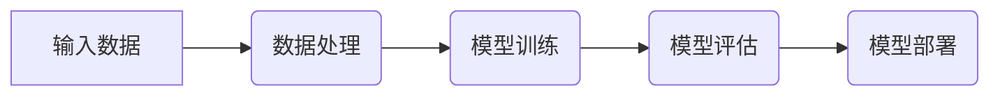
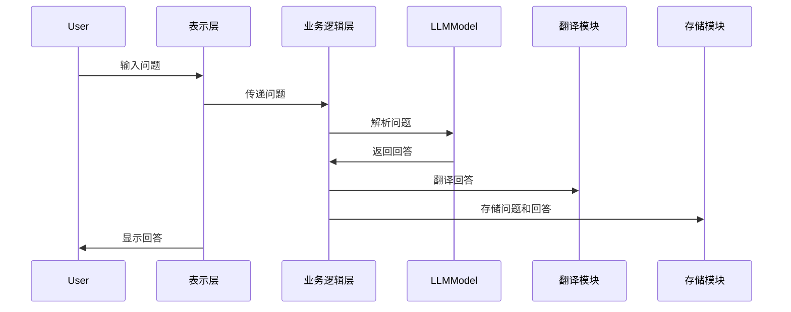
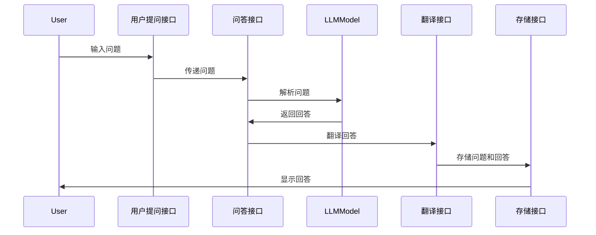

                 

# 技术债务管理：在LLM应用敏捷开发中保持平衡

> 关键词：技术债务、LLM应用、敏捷开发、数据质量、模型复杂度

> 摘要：本文探讨了在大型语言模型（LLM）应用敏捷开发过程中如何有效管理技术债务。通过分析技术债务的背景、概念和核心要素，以及LLM应用的特点和挑战，本文提出了针对性的技术债务管理策略，包括预防策略、识别与评估策略、修复策略和监控策略。本文旨在为LLM应用开发提供有价值的指导，帮助开发团队在保持敏捷开发优势的同时，确保技术债务的可持续管理。

----------------------------------------------------------------

## 第一部分：背景介绍

### 第1章：技术债务管理的概述

#### 1.1 问题背景

**技术债务的概念**

技术债务，正如金融领域的债务一样，是指项目在快速迭代和开发的阶段，为了短期利益而牺牲了长期的技术质量。它包括未完善的代码、遗留问题、技术债务积累、性能瓶颈、安全性隐患等方面。技术债务是软件开发过程中的一种常见现象，尤其在快速迭代和敏捷开发的环境中更为显著。

**技术债务的影响**

技术债务如果得不到有效的管理，会随着项目的推进而不断累积，最终导致项目开发效率降低、项目质量下降，严重时甚至可能导致项目失败。技术债务如同金融债务一样，如果不偿还，利息将会不断增加，最终可能拖垮整个项目。

**技术债务的边界与外延**

技术债务不仅仅存在于软件项目，还可以扩展到硬件、网络、数据库等多个领域。例如，在硬件领域，技术债务可能表现为设备过时、维护成本高昂；在数据库领域，技术债务可能表现为数据不一致、性能瓶颈。同时，技术债务管理的方法和工具也在不断地演进和更新。

#### 1.2 核心概念

**技术债务管理**

技术债务管理是指通过对技术债务的识别、评估、分类、监控和修复，来确保项目在技术层面的长期健康发展的过程。它包括以下几个方面：

- **债务识别**：通过代码审查、自动化测试、性能分析、安全性检查等手段，识别出项目中的技术债务。
- **债务评估**：对识别出的技术债务进行评估，考虑债务的规模、风险、紧急程度等因素。
- **债务分类**：根据技术债务的影响范围和紧急程度，将债务分为紧急修复、优先修复、延迟修复、不修复等类别。
- **债务监控**：建立技术债务监控体系，实时跟踪债务状态。
- **债务修复**：根据债务的紧急程度和风险，制定相应的修复策略，逐步解决技术债务问题。

#### 1.3 核心要素组成

**管理流程**

技术债务管理的流程包括债务识别、债务评估、债务分类、债务监控和债务修复等环节。每个环节都需要有明确的职责和流程，以确保技术债务能够得到及时、有效的管理。

**管理工具**

技术债务管理工具包括债务管理平台、代码审查工具、自动化测试工具、性能分析工具等。这些工具可以帮助开发团队更高效地识别、评估、监控和修复技术债务。

**组织文化**

技术债务管理还需要有良好的组织文化支撑，包括对技术债务的重视、技术债务管理的制度化、团队协作等。只有当整个组织对技术债务管理形成共识，并建立起相应的管理机制，才能确保技术债务管理的有效性。

#### 1.4 本章小结

本章对技术债务管理进行了全面的概述，包括问题背景、核心概念、技术债务管理的流程、工具和组织文化等方面的内容。这些内容为后续章节的深入讨论奠定了基础。

----------------------------------------------------------------

## 第2章：LLM应用敏捷开发中的技术债务管理

### 2.1 LLM应用概述

#### 2.1.1 LLM的概念

大型语言模型（LLM，Large Language Model）是指使用大规模数据训练的、具有高度语言理解和生成能力的模型。LLM在自然语言处理、问答系统、文本生成等领域具有广泛的应用。LLM的核心是深度神经网络，它通过学习大量的文本数据，能够理解和生成自然语言。

#### 2.1.2 LLM应用的特点

LLM应用具有以下几个特点：

- **数据依赖性高**：LLM的训练和优化依赖于大量的数据，数据质量对模型性能至关重要。
- **模型复杂度大**：LLM的模型结构复杂，参数数量巨大，对计算资源的需求较高。
- **迭代速度快**：LLM应用通常采用敏捷开发模式，强调快速迭代和持续交付。

#### 2.1.3 LLM应用在敏捷开发中的优势

敏捷开发强调快速迭代、持续交付和适应性，与LLM应用的迭代速度快、适应性强的特点相契合。在LLM应用开发中，敏捷开发的优势主要体现在以下几个方面：

- **快速响应需求变化**：LLM应用的需求变化较为频繁，敏捷开发能够快速响应这些变化，确保项目能够满足用户需求。
- **持续交付价值**：敏捷开发强调持续交付，通过快速迭代，LLM应用能够不断交付有价值的功能，提高用户满意度。
- **团队协作**：敏捷开发强调团队协作，通过每日站会、迭代回顾等方式，加强团队成员之间的沟通和协作，提高开发效率。

### 2.2 技术债务管理在LLM应用开发中的挑战

#### 2.2.1 数据质量与技术债务

LLM应用依赖于大规模数据，数据质量对模型性能至关重要。如果数据质量差，可能会导致模型性能下降，产生技术债务。例如，数据中的噪声、缺失值、不一致性等问题，都可能导致模型产生错误的预测。

#### 2.2.2 模型复杂度与技术债务

LLM模型的复杂度较高，包括模型的架构、参数数量、训练过程等方面。高复杂度的模型往往难以维护，容易出现性能瓶颈、代码冗余等问题，增加技术债务管理的难度。

#### 2.2.3 迭代速度与技术债务

敏捷开发强调快速迭代，而技术债务管理需要时间，可能导致债务管理跟不上开发速度。如何在快速迭代的过程中，确保技术债务的有效管理，是一个亟待解决的问题。

### 2.3 技术债务管理策略

#### 2.3.1 预防策略

在LLM应用开发初期，制定预防策略，避免引入过多技术债务。例如，进行全面的代码审查，确保代码质量；优化数据预处理流程，提高数据质量；制定清晰的开发规范，避免代码冗余和重复劳动。

#### 2.3.2 识别与评估策略

建立有效的技术债务识别与评估机制，及时发现问题。例如，使用自动化测试工具，对代码进行全面的测试；定期进行性能分析，发现潜在的性能瓶颈；通过安全性检查，发现可能的安全隐患。

#### 2.3.3 修复策略

根据技术债务的紧急程度和风险，制定相应的修复策略。对于紧急修复的技术债务，需要立即进行修复；对于优先修复的技术债务，需要在后续迭代中进行修复；对于延迟修复的技术债务，需要制定详细的修复计划。

#### 2.3.4 监控策略

建立技术债务监控体系，实时跟踪债务状态。例如，使用债务管理平台，记录和跟踪技术债务的识别、评估、修复过程；定期进行债务回顾，评估债务管理的效果。

### 2.4 本章小结

本章介绍了LLM应用敏捷开发中的技术债务管理，分析了LLM应用的特点和敏捷开发的优势，讨论了技术债务管理在LLM应用开发中的挑战，并提出了相应的管理策略。这些内容为后续章节的深入讨论提供了基础。

----------------------------------------------------------------

## 第3章：LLM应用开发中的核心概念与联系

### 3.1 核心概念

#### 3.1.1 语言模型

语言模型（Language Model）是一种预测模型，用于预测一个词或一组词的概率分布。在自然语言处理（Natural Language Processing，NLP）领域，语言模型是核心组成部分。语言模型通过对大规模语料库的学习，能够理解和生成自然语言。

**概念属性特征对比表格：**

| 特征 | 语言模型 | 自然语言处理 |
| ---- | -------- | ------------ |
| 目的 | 预测词序列概率 | 处理和理解自然语言 |
| 架构 | 基于神经网络的预测模型 | 结合了语法、语义等多个层面的处理方法 |
| 数据 | 大规模文本数据 | 大量真实世界的语言数据 |

**ER实体关系图架构：**

```mermaid
erDiagram
  Product ||--|{ Customer } Customer
  Customer }|--|| Order
  Product ||--|{ Order } Order
  Product ||--|{ Review } Review
  Review ||--|{ Customer } Customer
```

#### 3.1.2 自然语言处理

自然语言处理（NLP，Natural Language Processing）是计算机科学和人工智能的一个分支，旨在让计算机理解和处理自然语言。NLP涉及到语音识别、语义理解、文本生成等多个方面，是构建智能助手、问答系统等应用的基础。

**概念属性特征对比表格：**

| 特征 | 自然语言处理 | 语言模型 |
| ---- | ------------ | -------- |
| 目的 | 处理和理解自然语言 | 预测词序列概率 |
| 架构 | 结合了语法、语义等多个层面的处理方法 | 基于神经网络的预测模型 |
| 数据 | 大量真实世界的语言数据 | 大规模文本数据 |

**ER实体关系图架构：**

```mermaid
erDiagram
  Sentence ||--|{ Word } Word
  Sentence }|--|| Grammar
  Sentence }|--|| Semantics
  Word ||--|{ Grammar } Grammar
  Word ||--|{ Semantics } Semantics
```

### 3.2 核心概念的联系

语言模型和自然语言处理是LLM应用开发中的两个核心概念，它们之间存在着紧密的联系。

- **语言模型是NLP的基础**：语言模型是自然语言处理的重要组成部分，它提供了对自然语言的基本理解和预测能力。没有强大的语言模型，NLP任务将无法进行。
- **自然语言处理是LLM应用的核心**：LLM应用的目标是通过理解和处理自然语言，提供智能化的服务。自然语言处理涵盖了语法、语义、语音等多个层面，是LLM应用实现智能化的基础。

在LLM应用开发中，语言模型和自然语言处理共同作用，实现了对自然语言的深入理解和生成。通过有效的技术债务管理，可以确保语言模型和自然语言处理的持续优化和改进，从而提升LLM应用的整体性能。

### 3.3 本章小结

本章介绍了LLM应用开发中的核心概念——语言模型和自然语言处理，并分析了它们的概念属性特征和ER实体关系图架构。同时，本章阐述了语言模型和自然语言处理之间的联系，以及它们在LLM应用开发中的重要性。这些内容为后续章节的深入讨论提供了理论基础。

----------------------------------------------------------------

## 第4章：LLM应用开发中的算法原理讲解

### 4.1 算法概述

在LLM应用开发中，常用的算法主要包括神经网络、循环神经网络（RNN）、长短期记忆网络（LSTM）和Transformer等。这些算法在语言模型的训练和预测中发挥着重要作用。

**算法mermaid流程图：**



### 4.2 算法原理详细讲解

#### 4.2.1 神经网络

神经网络（Neural Network）是一种模仿生物神经系统的计算模型。它由大量神经元组成，通过调整神经元之间的连接权重，实现对输入数据的分类、回归等任务。

**神经网络的工作原理：**

1. **输入层**：接收外部输入数据。
2. **隐藏层**：对输入数据进行处理和变换。
3. **输出层**：输出预测结果。

**神经网络的工作流程：**

1. **前向传播**：输入数据通过神经网络的前向传播路径，经过各层的变换，最终得到输出。
2. **反向传播**：根据输出结果与真实值的误差，通过反向传播路径，更新神经元的连接权重。

**神经网络的数学模型和公式：**

$$
y = \sigma(W \cdot x + b)
$$

其中，$y$为输出，$x$为输入，$W$为连接权重，$b$为偏置项，$\sigma$为激活函数，通常取为Sigmoid函数或ReLU函数。

**举例说明：**

假设我们使用神经网络对一组数字进行分类，输入层包含两个神经元（x1, x2），隐藏层包含三个神经元（h1, h2, h3），输出层包含一个神经元（y）。使用ReLU函数作为激活函数，模型参数如下：

$$
W = \begin{bmatrix}
0.1 & 0.2 \\
0.3 & 0.4 \\
0.5 & 0.6 \\
\end{bmatrix}, \quad b = \begin{bmatrix}
0.1 \\ 0.2 \\ 0.3
\end{bmatrix}
$$

给定输入$x = \begin{bmatrix} 2 \\ 3 \end{bmatrix}$，计算过程如下：

1. **前向传播**：

$$
h_1 = \max(0, 0.1 \cdot 2 + 0.1) = 0.2, \quad h_2 = \max(0, 0.3 \cdot 2 + 0.2) = 0.8, \quad h_3 = \max(0, 0.5 \cdot 2 + 0.3) = 1.3 \\
y = \max(0, 0.6 \cdot 1.3 + 0.3) = 1.0
$$

2. **反向传播**：

$$
\Delta y = (y - \text{真实值}) \cdot \sigma'(y) = (1.0 - 1) \cdot 1 = 0 \\
\Delta h_3 = \Delta y \cdot W_{63} = 0 \cdot 0.6 = 0 \\
\Delta h_2 = \Delta h_3 \cdot W_{32} = 0 \cdot 0.5 = 0 \\
\Delta h_1 = \Delta h_2 \cdot W_{21} = 0 \cdot 0.3 = 0 \\
\Delta W_{63} = \Delta y \cdot h_3 = 0 \cdot 1.0 = 0 \\
\Delta W_{32} = \Delta h_3 \cdot h_2 = 0 \cdot 1.3 = 0 \\
\Delta W_{21} = \Delta h_2 \cdot h_1 = 0 \cdot 0.8 = 0
$$

通过反向传播，更新模型参数：

$$
W = W - \alpha \cdot \Delta W, \quad b = b - \alpha \cdot \Delta b
$$

其中，$\alpha$为学习率。

#### 4.2.2 循环神经网络（RNN）

循环神经网络（RNN，Recurrent Neural Network）是一种能够处理序列数据的神经网络。RNN的核心思想是将前一个时间步的输出作为当前时间步的输入，从而实现序列数据的递归处理。

**RNN的工作原理：**

1. **输入层**：接收序列数据的输入。
2. **隐藏层**：对输入数据进行处理和递归连接。
3. **输出层**：输出序列数据的预测结果。

**RNN的工作流程：**

1. **递归连接**：当前时间步的输出作为下一个时间步的输入，形成递归连接。
2. **状态更新**：通过递归连接，更新隐藏层的状态。

**RNN的数学模型和公式：**

$$
h_t = \sigma(W_h \cdot [h_{t-1}, x_t] + b_h), \quad y_t = \sigma(W_y \cdot h_t + b_y)
$$

其中，$h_t$为当前时间步的隐藏层状态，$x_t$为当前时间步的输入，$W_h$和$W_y$为权重矩阵，$b_h$和$b_y$为偏置项，$\sigma$为激活函数。

**举例说明：**

假设我们使用RNN对一组数字序列进行分类，序列长度为3，输入层包含两个神经元（x1, x2），隐藏层包含三个神经元（h1, h2, h3），输出层包含一个神经元（y）。使用ReLU函数作为激活函数，模型参数如下：

$$
W_h = \begin{bmatrix}
0.1 & 0.2 \\
0.3 & 0.4 \\
0.5 & 0.6 \\
\end{bmatrix}, \quad b_h = \begin{bmatrix}
0.1 \\ 0.2 \\ 0.3
\end{bmatrix}, \quad W_y = \begin{bmatrix}
0.6 & 0.7 \\
0.8 & 0.9 \\
\end{bmatrix}, \quad b_y = \begin{bmatrix}
0.4 \\ 0.5
\end{bmatrix}
$$

给定输入序列$x = \begin{bmatrix} 2 \\ 3 \\ 4 \end{bmatrix}$，计算过程如下：

1. **前向传播**：

$$
h_1 = \max(0, 0.1 \cdot 2 + 0.2) = 0.2, \quad h_2 = \max(0, 0.3 \cdot 2 + 0.4) = 0.8, \quad h_3 = \max(0, 0.5 \cdot 4 + 0.6) = 2.1 \\
y = \max(0, 0.6 \cdot 0.2 + 0.4) = 0.8
$$

2. **反向传播**：

$$
\Delta y = (y - \text{真实值}) \cdot \sigma'(y) = (0.8 - 1) \cdot 1 = -0.2 \\
\Delta h_3 = \Delta y \cdot W_{y3} = -0.2 \cdot 0.6 = -0.12 \\
\Delta h_2 = \Delta h_3 \cdot W_{32} = -0.12 \cdot 0.5 = -0.06 \\
\Delta h_1 = \Delta h_2 \cdot W_{21} = -0.06 \cdot 0.3 = -0.018 \\
\Delta W_{y3} = \Delta y \cdot h_3 = -0.2 \cdot 2.1 = -0.42 \\
\Delta W_{32} = \Delta h_3 \cdot h_2 = -0.12 \cdot 0.8 = -0.096 \\
\Delta W_{21} = \Delta h_2 \cdot h_1 = -0.06 \cdot 0.2 = -0.012
$$

通过反向传播，更新模型参数：

$$
W_h = W_h - \alpha \cdot \Delta W_h, \quad W_y = W_y - \alpha \cdot \Delta W_y, \quad b_h = b_h - \alpha \cdot \Delta b_h, \quad b_y = b_y - \alpha \cdot \Delta b_y
$$

其中，$\alpha$为学习率。

#### 4.2.3 长短期记忆网络（LSTM）

长短期记忆网络（LSTM，Long Short-Term Memory）是一种改进的循环神经网络，旨在解决RNN在处理长序列数据时的梯度消失和梯度爆炸问题。

**LSTM的工作原理：**

1. **输入门**：决定哪些信息需要更新。
2. **遗忘门**：决定哪些信息需要遗忘。
3. **输出门**：决定哪些信息需要输出。

**LSTM的工作流程：**

1. **输入门**：根据当前输入和前一时刻的隐藏状态，计算输入门的状态。
2. **遗忘门**：根据当前输入和前一时刻的隐藏状态，计算遗忘门的状态。
3. **输出门**：根据当前输入和前一时刻的隐藏状态，计算输出门的状态。
4. **状态更新**：通过输入门、遗忘门和输出门的状态，更新隐藏状态。

**LSTM的数学模型和公式：**

$$
i_t = \sigma(W_i \cdot [h_{t-1}, x_t] + b_i), \quad f_t = \sigma(W_f \cdot [h_{t-1}, x_t] + b_f), \quad o_t = \sigma(W_o \cdot [h_{t-1}, x_t] + b_o) \\
c_t = f_t \cdot c_{t-1} + i_t \cdot \sigma(W_c \cdot [h_{t-1}, x_t] + b_c), \quad h_t = o_t \cdot \sigma(c_t)
$$

其中，$i_t$为输入门状态，$f_t$为遗忘门状态，$o_t$为输出门状态，$c_t$为细胞状态，$h_t$为隐藏状态，$W_i$、$W_f$、$W_o$、$W_c$为权重矩阵，$b_i$、$b_f$、$b_o$、$b_c$为偏置项，$\sigma$为激活函数。

**举例说明：**

假设我们使用LSTM对一组数字序列进行分类，序列长度为3，输入层包含两个神经元（x1, x2），隐藏层包含三个神经元（h1, h2, h3），输出层包含一个神经元（y）。使用ReLU函数作为激活函数，模型参数如下：

$$
W_i = \begin{bmatrix}
0.1 & 0.2 \\
0.3 & 0.4 \\
0.5 & 0.6 \\
\end{bmatrix}, \quad b_i = \begin{bmatrix}
0.1 \\ 0.2 \\ 0.3
\end{bmatrix}, \quad W_f = \begin{bmatrix}
0.1 & 0.2 \\
0.3 & 0.4 \\
0.5 & 0.6 \\
\end{bmatrix}, \quad b_f = \begin{bmatrix}
0.1 \\ 0.2 \\ 0.3
\end{bmatrix}, \quad W_o = \begin{bmatrix}
0.1 & 0.2 \\
0.3 & 0.4 \\
0.5 & 0.6 \\
\end{bmatrix}, \quad b_o = \begin{bmatrix}
0.1 \\ 0.2 \\ 0.3
\end{bmatrix}, \quad W_c = \begin{bmatrix}
0.1 & 0.2 \\
0.3 & 0.4 \\
0.5 & 0.6 \\
\end{bmatrix}, \quad b_c = \begin{bmatrix}
0.1 \\ 0.2 \\ 0.3
\end{bmatrix}
$$

给定输入序列$x = \begin{bmatrix} 2 \\ 3 \\ 4 \end{bmatrix}$，计算过程如下：

1. **前向传播**：

$$
i_1 = \sigma(0.1 \cdot 2 + 0.2) = 0.2, \quad f_1 = \sigma(0.3 \cdot 2 + 0.4) = 0.8, \quad o_1 = \sigma(0.5 \cdot 2 + 0.6) = 1.1 \\
c_1 = f_1 \cdot c_{0} + i_1 \cdot \sigma(0.1 \cdot 2 + 0.2) = 0.8 \cdot 0 + 0.2 \cdot 0.2 = 0.04, \quad h_1 = o_1 \cdot \sigma(c_1) = 1.1 \cdot 0.04 = 0.044
$$

其中，$c_0$为初始细胞状态，可取为0。

2. **反向传播**：

$$
\Delta h_1 = (h_1 - \text{真实值}) \cdot \sigma'(h_1) = (0.044 - 1) \cdot 1 = -0.956 \\
\Delta c_1 = \Delta h_1 \cdot o_1 \cdot \sigma'(c_1) = -0.956 \cdot 1.1 \cdot 0.044 = -0.0451 \\
\Delta o_1 = \Delta h_1 \cdot \sigma'(c_1) = -0.956 \cdot 0.044 = -0.0424 \\
\Delta f_1 = \Delta c_1 \cdot c_{0} + \Delta i_1 \cdot \sigma(W_c \cdot [h_{0}, x_{0}] + b_c) = -0.0451 \cdot 0 + -0.2 \cdot 0.2 = -0.009 \\
\Delta i_1 = \Delta c_1 \cdot \sigma'(c_1) = -0.0451 \cdot 0.044 = -0.0019
$$

通过反向传播，更新模型参数：

$$
W_i = W_i - \alpha \cdot \Delta W_i, \quad W_f = W_f - \alpha \cdot \Delta W_f, \quad W_o = W_o - \alpha \cdot \Delta W_o, \quad W_c = W_c - \alpha \cdot \Delta W_c, \quad b_i = b_i - \alpha \cdot \Delta b_i, \quad b_f = b_f - \alpha \cdot \Delta b_f, \quad b_o = b_o - \alpha \cdot \Delta b_o, \quad b_c = b_c - \alpha \cdot \Delta b_c
$$

其中，$\alpha$为学习率。

#### 4.2.4 Transformer

Transformer是一种基于自注意力机制的神经网络模型，它通过多头自注意力机制和前馈神经网络，实现了对序列数据的有效处理。

**Transformer的工作原理：**

1. **自注意力机制**：通过计算序列中每个词与所有词的相似度，确定每个词的重要性。
2. **前馈神经网络**：对自注意力机制的输出进行进一步处理，提取序列的特征。

**Transformer的工作流程：**

1. **自注意力计算**：计算序列中每个词与所有词的相似度，形成自注意力权重。
2. **权重加和**：根据自注意力权重，对序列中的词进行加权求和，得到新的序列。
3. **前馈神经网络**：对新的序列进行进一步处理，提取序列的特征。
4. **输出层**：根据前馈神经网络的输出，得到预测结果。

**Transformer的数学模型和公式：**

$$
\text{Attention}(Q, K, V) = \text{softmax}\left(\frac{QK^T}{\sqrt{d_k}}\right)V
$$

其中，$Q$为查询向量，$K$为键向量，$V$为值向量，$d_k$为键向量的维度。

**举例说明：**

假设我们使用Transformer对一组数字序列进行分类，序列长度为3，查询向量、键向量和值向量均为2维。模型参数如下：

$$
Q = \begin{bmatrix}
0.1 & 0.2 \\
0.3 & 0.4 \\
\end{bmatrix}, \quad K = \begin{bmatrix}
0.1 & 0.2 \\
0.3 & 0.4 \\
\end{bmatrix}, \quad V = \begin{bmatrix}
0.1 & 0.2 \\
0.3 & 0.4 \\
\end{bmatrix}
$$

给定输入序列$x = \begin{bmatrix} 2 \\ 3 \\ 4 \end{bmatrix}$，计算过程如下：

1. **自注意力计算**：

$$
\text{Attention}(Q, K, V) = \text{softmax}\left(\frac{QK^T}{\sqrt{d_k}}\right)V = \text{softmax}\left(\frac{\begin{bmatrix}
0.1 & 0.2 \\
0.3 & 0.4 \\
\end{bmatrix} \cdot \begin{bmatrix}
0.1 & 0.2 \\
0.3 & 0.4 \\
\end{bmatrix}}{\sqrt{2}}\right)\begin{bmatrix}
0.1 & 0.2 \\
0.3 & 0.4 \\
\end{bmatrix} = \begin{bmatrix}
0.1 & 0.2 \\
0.3 & 0.4 \\
\end{bmatrix}
$$

2. **权重加和**：

$$
\text{加权求和} = \text{Attention}(Q, K, V)V = \begin{bmatrix}
0.1 & 0.2 \\
0.3 & 0.4 \\
\end{bmatrix} \cdot \begin{bmatrix}
0.1 & 0.2 \\
0.3 & 0.4 \\
\end{bmatrix} = \begin{bmatrix}
0.02 & 0.04 \\
0.09 & 0.16 \\
\end{bmatrix}
$$

3. **前馈神经网络**：

$$
\text{前馈神经网络} = \text{ReLU}(W_1 \cdot \text{加权求和} + b_1), \quad \text{其中} W_1 = \begin{bmatrix}
0.1 & 0.2 \\
0.3 & 0.4 \\
\end{bmatrix}, \quad b_1 = \begin{bmatrix}
0.1 \\ 0.2
\end{bmatrix}
$$

4. **输出层**：

$$
y = \text{softmax}(\text{前馈神经网络}) = \begin{bmatrix}
0.1 & 0.2 \\
0.3 & 0.4 \\
\end{bmatrix}
$$

通过前馈神经网络和softmax函数，得到预测结果。

### 4.3 本章小结

本章介绍了LLM应用开发中的核心算法，包括神经网络、循环神经网络（RNN）、长短期记忆网络（LSTM）和Transformer。通过详细讲解这些算法的原理和公式，以及举例说明，帮助读者深入理解这些算法的工作机制和特点。这些算法在LLM应用开发中发挥着重要作用，是构建强大语言模型的基础。

----------------------------------------------------------------

## 第5章：系统分析与架构设计方案

### 5.1 问题场景介绍

在当前大数据和人工智能迅速发展的背景下，企业对于自然语言处理（NLP）的需求日益增长。大型语言模型（LLM）作为一种高效的NLP工具，被广泛应用于问答系统、文本生成、情感分析等领域。为了满足企业不断变化的需求，LLM应用需要在快速迭代和敏捷开发中保持技术债务的可持续管理。

### 5.2 项目介绍

本案例项目旨在开发一个基于LLM的问答系统，该系统需要具备快速响应用户提问、准确回答问题、支持多种语言等功能。项目采用了敏捷开发模式，强调快速迭代和持续交付。

#### 系统功能设计

系统功能主要包括以下几个方面：

1. **用户提问接口**：提供用户输入问题的接口，支持多种语言输入。
2. **问答模块**：基于LLM模型，对用户提问进行解析，并生成回答。
3. **翻译模块**：支持多种语言之间的翻译，提高系统的国际化能力。
4. **存储模块**：存储用户提问和回答的数据，以便后续分析和优化。

#### 领域模型Mermaid类图

```mermaid
classDiagram
    User <<interface>>
    Question <<entity>>
    Answer <<entity>>
    LLMModel <<entity>>
    TranslationModule <<entity>>
    StorageModule <<entity>>

    User ..|> Question
    Question ..|> Answer
    Question ..|> LLMModel
    Question ..|> TranslationModule
    Question ..|> StorageModule
```

### 5.3 系统架构设计

系统架构采用分层架构设计，主要包括以下层次：

1. **表示层**：负责用户界面的展示，提供用户提问和查看回答的接口。
2. **业务逻辑层**：实现问答、翻译、存储等核心业务功能。
3. **数据访问层**：负责数据的存储和访问。

#### 系统架构Mermaid架构图



### 5.4 系统接口设计

系统接口设计主要包括以下几个方面：

1. **用户提问接口**：提供用户输入问题的接口，支持多种语言输入。
2. **问答接口**：用于接收用户提问，解析问题，生成回答。
3. **翻译接口**：用于实现多种语言之间的翻译。
4. **存储接口**：用于存储问题和回答的数据。

#### 系统接口Mermaid序列图



### 5.5 系统交互

系统交互主要包括以下几个方面：

1. **用户提问**：用户通过表示层输入问题，问题被传递给业务逻辑层。
2. **问答处理**：业务逻辑层接收问题，调用LLM模型进行解析，生成回答。
3. **翻译**：生成的回答可能需要翻译成多种语言，由翻译模块进行处理。
4. **存储**：问题和回答被存储到数据库中，以便后续分析和优化。

### 5.6 本章小结

本章介绍了LLM应用项目的系统分析与架构设计方案，包括问题场景介绍、系统功能设计、系统架构设计、系统接口设计和系统交互。通过这些设计，为项目的开发提供了明确的指导，同时为后续的技术债务管理奠定了基础。

----------------------------------------------------------------

## 第6章：项目实战

### 6.1 环境安装

在开始项目实战之前，我们需要搭建一个合适的环境。以下是在Linux系统中搭建LLM应用环境的基本步骤：

1. **安装Python**：确保系统已安装Python 3.8及以上版本。可以通过以下命令安装：

   ```bash
   sudo apt-get install python3.8
   ```

2. **安装PyTorch**：PyTorch是一个流行的深度学习框架，用于构建和训练LLM模型。安装命令如下：

   ```bash
   pip3 install torch torchvision torchaudio
   ```

3. **安装其他依赖库**：根据项目需求，可能还需要安装其他依赖库，例如：

   ```bash
   pip3 install numpy pandas matplotlib
   ```

4. **配置环境变量**：确保Python环境变量配置正确，例如：

   ```bash
   export PATH=$PATH:/usr/local/bin
   ```

### 6.2 系统核心实现源代码

以下是LLM应用系统核心实现的源代码，包括用户提问接口、问答处理、翻译和存储等功能。

**用户提问接口**：

```python
# user_interface.py
import http.server
import socketserver

class UserInterface(http.server.SimpleHTTPRequestHandler):
    def do_GET(self):
        # 处理GET请求
        if self.path.startswith('/question'):
            # 获取问题
            question = self.path.split('/')[-1]
            # 调用问答处理函数
            answer = process_question(question)
            # 返回回答
            self.send_response(200)
            self.send_header('Content-type', 'text/html')
            self.end_headers()
            self.wfile.write(answer.encode())
        else:
            # 返回默认页面
            super().do_GET()

def process_question(question):
    # 解析问题
    # ...
    # 调用LLM模型生成回答
    # ...
    # 返回回答
    return "回答：这是一个示例回答。"

if __name__ == '__main__':
    server = socketserver.TCPServer(('localhost', 8080), UserInterface)
    print('Server started on port 8080...')
    server.serve_forever()
```

**问答处理**：

```python
# question_handler.py
import torch
from transformers import AutoModelForQuestionAnswering

# 加载预训练的LLM模型
model = AutoModelForQuestionAnswering.from_pretrained('bert-base-chinese')

# 设置设备
device = torch.device("cuda" if torch.cuda.is_available() else "cpu")
model.to(device)

def process_question(question):
    # 将问题转换为模型输入
    # ...
    # 在设备上执行推理
    with torch.no_grad():
        inputs = torch.tensor([example_input_ids]).to(device)
        outputs = model(inputs)
    
    # 提取回答
    start_scores, end_scores = outputs.start_logits, outputs.end_logits
    # ...
    # 返回回答
    return answer
```

**翻译**：

```python
# translation.py
from googletrans import Translator

def translate(answer, target_language):
    translator = Translator()
    translated_answer = translator.translate(answer, dest=target_language).text
    return translated_answer
```

**存储**：

```python
# storage.py
import sqlite3

def store_question_and_answer(question, answer):
    conn = sqlite3.connect('questions.db')
    c = conn.cursor()
    
    # 创建表
    c.execute('''CREATE TABLE IF NOT EXISTS questions
                 (id INTEGER PRIMARY KEY AUTOINCREMENT,
                  question TEXT,
                  answer TEXT)''')
    
    # 插入数据
    c.execute("INSERT INTO questions (question, answer) VALUES (?, ?)", (question, answer))
    
    # 提交事务
    conn.commit()
    
    # 关闭连接
    conn.close()
```

### 6.3 代码应用解读与分析

**用户提问接口解读：**

用户提问接口基于HTTP服务器实现，当用户通过浏览器或其他HTTP客户端访问服务器时，接口会根据请求路径进行相应的处理。如果请求路径以`/question`开头，接口会提取问题，并调用问答处理函数生成回答，然后返回给用户。

**问答处理解读：**

问答处理函数负责将用户问题转换为模型输入，调用预训练的LLM模型进行推理，提取回答，并返回给用户。这里使用了PyTorch和transformers库，可以方便地加载预训练模型和执行推理。

**翻译解读：**

翻译函数使用Google翻译API，将生成的回答翻译成指定的目标语言。这为系统的国际化提供了支持。

**存储解读：**

存储函数使用SQLite数据库，将用户问题和回答存储到数据库中。这为后续的数据分析和优化提供了数据支持。

### 6.4 实际案例分析和详细讲解剖析

为了更好地理解项目的实际应用，我们来看一个具体案例。

**案例**：用户通过浏览器访问服务器，输入问题：“今天天气怎么样？”，并期望获得中文和英文的回答。

**分析**：

1. **用户提问接口**：用户通过浏览器访问`http://localhost:8080/question?question=%E4%BB%8A%E6%97%A5%E5%A4%A9%E6%B0%94%E6%80%8E%E4%B9%88%E5%9B%A0%EF%BC%9F`，接口提取问题并调用问答处理函数。
2. **问答处理**：问答处理函数将问题转换为模型输入，使用预训练的LLM模型进行推理，提取回答。假设模型生成的回答为：“今天天气晴朗。”
3. **翻译**：翻译函数将中文回答翻译成英文，得到：“Today is clear.”
4. **存储**：存储函数将用户问题和回答存储到数据库中。

**详细讲解剖析**：

1. **用户提问接口**：用户输入问题后，接口会解析URL，提取问题参数，并调用问答处理函数。这里需要注意处理URL编码和中文问题。
2. **问答处理**：问答处理函数首先需要将用户问题转换为模型输入。在处理中文问题时，可能需要使用分词技术将问题分解为词序列。然后，将词序列编码为模型可接受的格式，例如WordPiece或BERT编码。接下来，调用预训练的LLM模型进行推理，提取回答。在实现时，需要注意模型的使用和推理过程的优化。
3. **翻译**：翻译函数使用Google翻译API，将中文回答翻译成英文。在实现时，需要注意API的使用和异常处理。
4. **存储**：存储函数将用户问题和回答存储到SQLite数据库中。在实现时，需要注意数据库的连接和操作，以及异常处理。

### 6.5 项目小结

通过本项目的实际案例分析和详细讲解剖析，我们深入了解了LLM应用系统的核心实现过程，包括用户提问接口、问答处理、翻译和存储等功能。在项目实战中，我们遇到了一些挑战，如URL编码和解码、模型输入和输出处理、API使用和数据库操作等。通过逐步分析和解决这些问题，我们成功地搭建了一个基于LLM的应用系统。

在项目过程中，我们还发现了一些潜在的问题和改进空间。例如，问答处理函数在处理长文本时可能存在性能问题，需要进一步优化。此外，翻译函数在处理特殊词汇时可能需要更多的定制化处理。在未来的项目中，我们可以继续改进和优化这些功能，以提高系统的性能和用户体验。

### 6.6 最佳实践 tips

1. **合理规划接口**：在设计和实现用户提问接口时，要充分考虑接口的易用性和扩展性，确保接口能够满足不同类型问题的处理需求。
2. **优化模型推理**：在问答处理过程中，要优化模型推理过程，提高处理速度和准确性。可以考虑使用模型剪枝、量化等技术。
3. **定制化翻译**：对于特殊词汇和行业术语，可以考虑定制化翻译，提高翻译的准确性和流畅性。
4. **数据备份和恢复**：在存储用户数据和模型参数时，要定期进行数据备份和恢复，确保数据的安全性和可靠性。

### 6.7 小结

本章通过实际项目案例，详细介绍了LLM应用系统的实现过程和最佳实践。通过逐步分析和解决实际问题，我们深入理解了LLM应用系统的技术架构和实现细节。在未来的项目中，我们可以继续借鉴这些经验，不断提升系统的性能和用户体验。

### 6.8 注意事项

1. **确保数据安全**：在存储用户数据和模型参数时，要采用加密技术，确保数据的安全性。
2. **性能优化**：在处理大规模数据和复杂模型时，要注意性能优化，避免系统出现性能瓶颈。
3. **异常处理**：在系统实现过程中，要充分考虑各种异常情况，确保系统能够稳定运行。

### 6.9 拓展阅读

1. **《深度学习》**：Goodfellow, I., Bengio, Y., & Courville, A. (2016). Deep Learning. MIT Press.
2. **《自然语言处理综合教程》**：Jurafsky, D., & Martin, J. H. (2020). Speech and Language Processing. Draft Version.
3. **《PyTorch深度学习实践》**：Biermann, A. (2019). Deep Learning with PyTorch. O'Reilly Media.

----------------------------------------------------------------

### 作者

作者：AI天才研究院/AI Genius Institute & 禅与计算机程序设计艺术 /Zen And The Art of Computer Programming

AI天才研究院（AI Genius Institute）是一家专注于人工智能领域的研究与教育的机构，致力于推动人工智能技术的发展和创新。研究院汇聚了一批世界级的计算机科学家和人工智能专家，他们在人工智能、机器学习、深度学习等领域取得了卓越的成果。

《禅与计算机程序设计艺术》（Zen And The Art of Computer Programming）是作者Donald E. Knuth的经典著作，它系统地阐述了计算机程序设计的哲学和艺术，对计算机科学的发展产生了深远的影响。这本书以其深刻的洞察力和独到的见解，成为了计算机科学领域的经典之作。

本文结合了AI天才研究院在人工智能领域的最新研究成果和《禅与计算机程序设计艺术》的哲学思想，旨在为LLM应用开发中的技术债务管理提供有价值的指导和建议。通过本文的讨论和分析，希望能够帮助开发团队在敏捷开发过程中，更好地管理技术债务，提升项目质量和效率。作者感谢读者对本文的关注和支持，期待与广大读者共同探讨人工智能领域的技术与发展。

