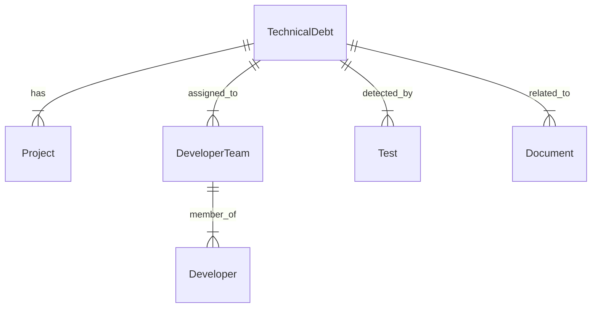

                 

### 1.1.1 技术债务的定义与形成

技术债务（Technical Debt）这一概念源自于软件工程领域，最早由 Ward Cunningham 在1992年提出。他将技术债务比喻为财务债务，即为了在短期内获得功能上的快速交付，而选择了一种低质量、不完善的解决方案，这种选择就像是在技术层面上的借款，需要在未来通过额外的工作来偿还。简而言之，技术债务就是为了加快开发速度而接受的一种短期效益与长期成本之间的权衡。

形成技术债务的主要原因有以下几点：

1. **时间压力**：在快速迭代的开发环境中，为了满足市场或客户的需求，开发团队往往会选择快速且简便的方法来实现功能，而不是最优的解决方案。这种做法虽然能在短时间内看到成果，但长远来看，会导致系统维护成本增加，修复问题的时间变长。

2. **资源限制**：开发团队可能会面临人员、技术或预算等方面的限制，导致无法按照最佳实践来开发和维护软件系统。例如，可能缺乏足够的时间进行单元测试、代码审查或性能优化。

3. **技术选择**：有时候，开发团队可能会选择一些新兴的技术或工具来加速开发，但这些技术或工具可能尚未成熟，存在不确定性和潜在风险。

4. **沟通不畅**：在大型项目中，不同团队或成员之间可能存在沟通障碍，导致一些设计决策不够周全，后续需要大量时间来修复。

技术债务可以分为以下几种类型：

- **设计债务**：由于设计不合理导致的债务，如过度耦合、缺乏模块化设计等。

- **测试债务**：由于缺乏充分的单元测试和集成测试导致的债务，这些债务可能会在系统上线后暴露出来。

- **代码债务**：由于编写不规范的代码导致的债务，如代码冗长、复杂度高、可读性差等。

- **文档债务**：由于缺乏或过时文档导致的债务，这会给未来的维护和开发带来困难。

### 1.1.2 技术债务的影响与挑战

技术债务对软件开发和维护的影响是多方面的，它不仅影响到项目的短期进展，还会对长期可持续性产生深远的影响。

首先，技术债务会导致项目的维护成本增加。随着债务的累积，修复现有问题的难度和所需时间会逐渐增加。这不仅会消耗更多的时间和资源，还可能导致项目进度延误，甚至影响项目的成功率。

其次，技术债务会影响系统的稳定性。由于债务的存在，系统中的隐患和缺陷可能会在未来某个时间点爆发，导致系统崩溃或出现严重性能问题。这不仅会损害用户体验，还可能导致业务损失。

另外，技术债务还会影响团队的士气和工作效率。当团队成员意识到系统存在大量的技术债务时，可能会感到沮丧和无助，降低工作积极性。同时，由于需要投入更多时间和精力来修复债务，团队可能会错过其他重要的开发任务，影响整体项目的进展。

面对技术债务，开发团队需要采取一系列措施来管理和控制债务。以下是一些应对策略：

1. **定期审查**：定期对代码库和系统进行审查，识别和评估现有的技术债务。这可以帮助团队了解债务的现状，并采取相应的修复措施。

2. **代码审查**：加强代码审查机制，确保每个提交的代码都符合编码规范和最佳实践。这有助于减少新债务的产生。

3. **自动化测试**：建立完善的自动化测试体系，包括单元测试、集成测试和性能测试。自动化测试可以有效地发现潜在的问题，减少债务累积。

4. **持续集成**：采用持续集成（CI）和持续交付（CD）实践，确保代码的每次提交都能及时集成和测试，减少债务的传递。

5. **培训和教育**：定期对团队成员进行培训，提高他们对技术债务的认识和管理能力。这有助于从源头上减少技术债务的产生。

总之，技术债务是软件开发中不可避免的问题，但通过有效的管理策略和最佳实践，团队可以将其影响降到最低，确保项目的长期健康和可持续发展。接下来，我们将进一步探讨技术债务的分类、评估方法和管理的目标。

### 1.1.3 研究目的与本书结构

本章节旨在探讨技术债务管理的核心概念、基本原则和实践方法，帮助开发团队在快速迭代过程中保持代码质量，有效管理技术债务。研究目的是为了解决当前软件开发过程中普遍存在的代码质量问题，以及由此导致的项目维护成本上升、系统稳定性下降等问题。

首先，我们将详细介绍技术债务的定义与形成，分析其主要类型和影响。接着，将讨论技术债务的分类、评估方法和管理目标，并通过案例来具体说明这些概念的应用。

在后续章节中，我们将深入探讨技术债务管理的原则，包括快速迭代中的债务管理策略，以及代码质量与技术债务之间的关系。此外，还将介绍技术债务管理的实践方法，包括债务识别、评估、修复和预防措施。

最后，我们将介绍常用的技术债务管理工具，分析其功能与特点，并分享成功案例和经验，为实际应用提供指导和借鉴。

通过本书的阅读，读者将能够系统地了解技术债务管理的理论和实践，掌握有效的管理策略和方法，为团队在快速迭代中的代码质量管理提供有力支持。

### 1.2 技术债务的边界与外延

在深入探讨技术债务之前，明确其边界与外延是至关重要的。技术债务不仅包括直接与代码相关的问题，还涵盖了更广泛的概念和影响。以下是对技术债务分类、评估方法及其管理目标的详细探讨。

#### 1.2.1 技术债务的分类

技术债务可以按照不同的维度进行分类，常见的分类方式包括：

1. **按形成原因分类**：
   - **设计债务**：由于系统设计不合理导致的债务，如架构不清晰、组件过度耦合等。
   - **代码债务**：由于编写不规范的代码导致的债务，如代码冗余、复杂度高、可维护性差等。
   - **测试债务**：由于缺乏或不足的测试导致的债务，如缺乏单元测试、集成测试和性能测试等。
   - **文档债务**：由于缺乏或不完整的文档导致的债务，如代码注释不足、设计文档不完善等。

2. **按影响范围分类**：
   - **局部债务**：仅影响特定模块或组件的技术债务。
   - **全局债务**：影响整个系统的技术债务，如系统性能瓶颈、安全性漏洞等。

3. **按优先级分类**：
   - **高优先级债务**：对系统稳定性和性能有重大影响的技术债务，如关键模块的缺陷、严重的性能瓶颈等。
   - **低优先级债务**：对系统影响较小，但长期积累可能导致问题的技术债务，如代码冗余、性能优化不足等。

#### 1.2.2 技术债务的评估方法

评估技术债务是管理技术债务的第一步，常用的评估方法包括：

1. **定性评估**：
   - **专家评估**：通过经验丰富的开发人员或架构师对技术债务进行评估，判断其影响和修复成本。
   - **用户反馈**：收集用户对系统性能、稳定性等方面的反馈，分析技术债务对用户的影响。

2. **定量评估**：
   - **代码复杂度分析**：使用工具测量代码的复杂度指标，如圈复杂度（Cyclomatic Complexity）、注释比例等。
   - **测试覆盖率分析**：评估单元测试和集成测试覆盖率，识别未覆盖的代码区域。
   - **性能测试**：通过性能测试工具测量系统的响应时间、吞吐量等性能指标，识别性能瓶颈。

#### 1.2.3 技术债务的管理目标

技术债务管理的目标是通过一系列策略和方法，降低技术债务对项目的影响，确保系统的可持续性和长期健康。具体目标包括：

1. **降低维护成本**：通过定期审查和修复技术债务，减少未来的维护工作量，降低维护成本。

2. **提高系统稳定性**：通过修复系统中的隐患和缺陷，提高系统的稳定性和可靠性。

3. **提升开发效率**：通过优化代码结构、增强测试覆盖率和完善文档，提高开发团队的工作效率。

4. **增强团队协作**：通过建立良好的沟通和协作机制，减少因技术债务导致的问题和冲突，增强团队协作。

5. **确保项目交付**：通过有效管理技术债务，确保项目能够按时按质地交付，满足客户需求。

在接下来的章节中，我们将进一步探讨技术债务管理的基本原则，包括快速迭代中的债务管理策略、代码质量与技术债务的关系，以及具体的管理实践和方法。通过这些内容，读者将能够全面理解技术债务管理的核心概念和实际操作，为团队在快速迭代中的代码质量管理提供有力支持。

### 1.3 技术债务的核心要素与概念结构

为了深入理解技术债务的管理，我们需要详细探讨其核心要素和概念结构。技术债务不仅涉及到具体的代码和设计问题，还包含了与开发团队、项目管理以及技术环境等多方面的关联。以下是对技术债务关键因素、概念属性特征对比表和ER模型的具体说明。

#### 1.3.1 技术债务的关键因素

技术债务的关键因素包括以下几个方面：

1. **开发速度与质量**：开发速度通常是导致技术债务的主要原因之一。为了快速交付功能，开发团队可能会牺牲代码质量，选择不成熟的解决方案。这种权衡在短期内看似有效，但长期来看会导致系统维护成本增加。

2. **团队协作与沟通**：技术债务的产生往往与团队协作和沟通不畅有关。当不同团队或成员之间存在沟通障碍时，可能会导致设计决策不够周全，增加技术债务的风险。

3. **项目管理**：项目管理不善也是技术债务产生的重要原因。如果项目计划不合理，资源分配不均，或者缺乏有效的进度监控，都可能导致技术债务的累积。

4. **技术选择**：选择不成熟或过于复杂的技术解决方案会增加技术债务的风险。新兴技术虽然可能带来短期效益，但其不确定性和潜在风险也需要充分考虑。

5. **外部压力**：市场或客户需求的变化也可能迫使开发团队采取快速但不理想的解决方案，从而产生技术债务。

#### 1.3.2 概念属性特征对比表

为了更直观地了解技术债务的不同类型及其特征，我们可以创建一个概念属性特征对比表。以下是一个简化的示例：

| 类型     | 定义                                                         | 特征对比                    |
|----------|------------------------------------------------------------|---------------------------|
| 设计债务 | 系统设计不合理导致的债务                                   | - 架构不清晰 - 组件耦合度低 - 模块依赖性高 |
| 代码债务 | 编写不规范的代码导致的债务                                 | - 代码冗余 - 复杂度高 - 可读性差         |
| 测试债务 | 缺乏或不足的测试导致的债务                               | - 单元测试覆盖率低 - 集成测试缺失 - 性能测试不充分 |
| 文档债务 | 缺乏或不完整的文档导致的债务                               | - 代码注释不足 - 设计文档不完善 - 运维文档缺失   |

通过这个对比表，我们可以清晰地看到不同类型技术债务的特点，以及它们对系统的影响。

#### 1.3.3 概念属性特征对比表

为了更直观地了解技术债务的不同类型及其特征，我们可以创建一个概念属性特征对比表。以下是一个简化的示例：

| 技术债务类型 | 特征对比 |
|--------------|----------|
| 设计债务     | - 架构不清晰 - 组件耦合度低 - 模块依赖性高 |
| 代码债务     | - 代码冗余 - 复杂度高 - 可读性差         |
| 测试债务     | - 单元测试覆盖率低 - 集成测试缺失 - 性能测试不充分 |
| 文档债务     | - 代码注释不足 - 设计文档不完善 - 运维文档缺失   |

通过这个对比表，我们可以清晰地看到不同类型技术债务的特点，以及它们对系统的影响。

#### 1.3.3 技术债务管理的ER模型

为了系统地描述技术债务管理的过程和要素，我们可以使用实体关系（ER）模型。以下是技术债务管理的ER模型，包括主要实体及其关系：

1. **实体**：
   - **技术债务**：包含债务的类型、优先级、描述、修复状态等属性。
   - **开发团队**：包含团队成员、职责、角色等属性。
   - **项目**：包含项目名称、目标、进度、预算等属性。
   - **测试**：包含测试类型、覆盖率、发现的问题等属性。
   - **文档**：包含文档类型、更新日期、作者等属性。

2. **关系**：
   - **债务-项目**：一个项目可以包含多个技术债务，每个债务都关联到一个特定的项目。
   - **债务-开发团队**：技术债务的修复通常需要团队成员的协作，一个技术债务可以关联到多个团队成员。
   - **测试-债务**：测试活动可以发现技术债务的存在，每个测试可以关联到一个或多个技术债务。
   - **文档-债务**：技术债务的管理和修复需要相关文档的支持，每个债务可以关联到多个文档。

以下是一个简化的ER模型（使用Mermaid语言表示）：

通过ER模型，我们可以系统地管理和追踪技术债务，确保每个债务都能得到及时识别、评估和修复。

### 1.4 本书内容概述与小结

本文从技术债务的定义、形成原因、影响及其分类入手，详细探讨了技术债务管理的核心概念和重要性。首先，我们明确了技术债务的概念，并分析了其形成原因，如时间压力、资源限制、技术选择和沟通不畅等。接着，我们介绍了技术债务的分类方法，包括按形成原因、影响范围和优先级分类，帮助读者全面理解技术债务的多样性。

随后，本文详细讨论了技术债务的评估方法，包括定性评估和定量评估，以及评估技术的具体应用。评估技术债务是管理技术债务的关键步骤，通过科学合理的评估，可以更好地识别和优先处理债务。

接着，本文介绍了技术债务管理的基本原则，包括定期审查、代码审查、自动化测试、持续集成和培训教育等。这些原则旨在通过系统的方法减少技术债务的产生，确保系统的稳定性和长期可持续性。

本文还深入探讨了技术债务的核心要素和概念结构，通过ER模型详细描述了技术债务管理的实体及其关系，为技术债务的跟踪和管理提供了系统性的框架。

最后，本文概述了本书的结构和内容，分为四个主要部分：第一部分介绍技术债务管理原则；第二部分探讨快速迭代中的技术债务管理；第三部分介绍技术债务管理的实践方法；第四部分介绍技术债务管理工具。通过这些内容，读者可以系统地掌握技术债务管理的理论和实践，为团队在快速迭代中的代码质量管理提供有力支持。

总之，本文通过对技术债务的全面剖析和深入探讨，旨在帮助开发团队更好地理解和管理技术债务，确保项目的长期健康和可持续发展。接下来，我们将进一步探讨技术债务管理原则，为读者提供更具体的实施指南。

### 2.1 技术债务管理原则概述

技术债务管理是确保软件项目长期健康和稳定的关键。有效的技术债务管理原则能够帮助团队在快速迭代的过程中，平衡开发速度和质量，确保系统可持续性。以下是对技术债务管理原则的详细概述，包括其重要性、核心要素和具体实施步骤。

#### 2.1.1 原则的重要性

技术债务管理原则的重要性体现在以下几个方面：

1. **提高系统稳定性**：通过有效的债务管理，可以修复系统中的隐患和缺陷，提高系统的稳定性，减少故障发生。

2. **降低维护成本**：及时识别和修复技术债务，可以减少未来维护的工作量和成本，避免因长期累积导致的高额修复费用。

3. **提升开发效率**：良好的技术债务管理能够提高团队的工作效率，减少因债务问题导致的开发中断和返工。

4. **增强团队协作**：技术债务管理需要团队协作，通过共同管理和修复债务，可以增强团队凝聚力，提高协作效率。

5. **确保项目交付**：有效的技术债务管理能够确保项目按时按质地交付，满足客户需求。

#### 2.1.2 管理原则的核心要素

技术债务管理原则的核心要素包括：

1. **定期审查**：定期对代码库和系统进行审查，识别和评估现有的技术债务。这有助于及时发现和修复问题，防止债务累积。

2. **代码审查**：加强代码审查机制，确保每个提交的代码都符合编码规范和最佳实践。这有助于减少新债务的产生。

3. **自动化测试**：建立完善的自动化测试体系，包括单元测试、集成测试和性能测试。自动化测试可以有效地发现潜在的问题，减少债务累积。

4. **持续集成**：采用持续集成（CI）和持续交付（CD）实践，确保代码的每次提交都能及时集成和测试，减少债务的传递。

5. **培训和教育**：定期对团队成员进行培训，提高他们对技术债务的认识和管理能力。这有助于从源头上减少技术债务的产生。

6. **文档管理**：确保系统文档的完整性和及时更新，包括设计文档、测试文档和运维文档。良好的文档管理有助于后续的维护和改进。

#### 2.1.3 原则的具体实施步骤

以下是技术债务管理原则的具体实施步骤：

1. **制定管理计划**：
   - 确定技术债务管理的目标和策略。
   - 制定定期审查和评估的频率和范围。
   - 确定代码审查和自动化测试的具体标准和流程。

2. **建立审查机制**：
   - 定期对代码库和系统进行全面审查。
   - 识别和记录发现的技术债务。
   - 对现有债务进行优先级排序。

3. **实施代码审查**：
   - 实施代码审查制度，确保每个提交的代码都经过审核。
   - 使用代码审查工具，如SonarQube，检测代码质量和潜在的技术债务。

4. **建立测试体系**：
   - 制定自动化测试策略，确保测试覆盖率达到预期。
   - 定期执行自动化测试，及时发现和修复问题。

5. **实施持续集成**：
   - 采用CI/CD工具，如Jenkins或GitLab CI，确保每次代码提交都能自动集成和测试。
   - 确保所有债务问题都能在早期被发现和解决。

6. **培训和教育**：
   - 定期对团队成员进行技术债务管理的培训。
   - 分享债务管理的最佳实践和成功案例。
   - 建立学习社区，鼓励团队成员相互学习和成长。

7. **监督和反馈**：
   - 监督技术债务管理的实施情况，确保原则得到有效执行。
   - 定期收集团队成员的反馈，改进管理策略和流程。

通过以上步骤，开发团队可以建立起一套科学有效的技术债务管理体系，确保项目的长期健康和稳定。接下来，我们将探讨快速迭代中的技术债务管理，分析迭代模型与债务管理的关系，以及快速迭代对技术债务的影响和策略。

### 2.2 快速迭代中的技术债务管理

在当今的软件开发环境中，快速迭代已成为一种普遍的实践，它不仅提升了开发效率，也增加了对技术债务管理的挑战。快速迭代模式要求团队在短时间内频繁交付功能，这使得技术债务的管理变得尤为复杂和重要。以下将分析快速迭代模型与债务管理的关系，探讨快速迭代对技术债务的影响，并提出相应的管理策略。

#### 2.2.1 迭代模型与债务管理

快速迭代通常采用Scrum、Kanban等敏捷开发方法，这些方法强调短周期的迭代和持续交付。在每个迭代周期中，团队会规划、开发、测试和交付一部分功能。这种迭代模型对技术债务管理提出了以下要求：

1. **短周期审查**：快速迭代要求团队在每个迭代周期结束后进行回顾和审查，这有助于及时发现和修复技术债务。

2. **敏捷性**：快速迭代模型要求团队具备高度的敏捷性，能够快速适应变化，及时修复债务问题。

3. **透明度**：迭代过程中的透明度有助于团队成员共同识别和解决技术债务，确保债务管理的一致性。

4. **自动化**：快速迭代强调自动化测试和部署，这有助于减少人工干预，降低技术债务的产生和传递。

#### 2.2.2 快速迭代对技术债务的影响

快速迭代对技术债务的影响是双重的：

1. **正面影响**：
   - **早期反馈**：快速迭代使得客户和用户可以在早期获得产品功能，提供反馈，从而减少因需求变更导致的技术债务。
   - **及时修复**：在短周期内，团队可以及时发现和修复技术债务，降低其累积和扩散的风险。

2. **负面影响**：
   - **高频率的变更**：快速迭代可能导致频繁的需求变更，增加技术债务的产生风险。
   - **时间压力**：为了在短时间内交付功能，团队可能会牺牲代码质量，导致技术债务的累积。
   - **资源分散**：快速迭代可能分散团队资源，导致无法专注于技术债务的修复和预防。

#### 2.2.3 快速迭代中的债务管理策略

为了在快速迭代中有效管理技术债务，团队可以采取以下策略：

1. **优先级排序**：在每次迭代计划中，优先处理高优先级的技术债务，确保关键问题和潜在风险得到及时修复。

2. **增量修复**：采用增量修复方法，逐步解决技术债务，避免因一次性修复大量债务而导致项目延期。

3. **自动化测试**：建立全面的自动化测试体系，确保每个迭代都能及时检测和修复债务问题。

4. **技术债务回顾**：在每个迭代周期结束后，进行技术债务回顾，评估债务的状态和修复效果，制定下一周期的管理计划。

5. **持续集成**：采用持续集成（CI）和持续交付（CD）实践，确保每次代码提交都能经过全面测试和验证，减少债务传递。

6. **培训和教育**：定期对团队成员进行技术债务管理的培训，提高其对技术债务的认识和管理能力。

7. **资源优化**：合理分配资源，确保有足够的时间和人力专注于技术债务的修复和预防。

通过以上策略，团队可以在快速迭代的过程中有效管理技术债务，确保系统的稳定性和长期可持续性。接下来，我们将探讨代码质量与技术债务之间的关系，分析代码质量对技术债务的影响，并介绍提高代码质量以减少技术债务的方法。

### 2.3 代码质量与技术债务的关系

代码质量是确保软件系统稳定、高效和安全运行的关键因素。而技术债务的产生往往与代码质量紧密相关。良好的代码质量有助于减少技术债务，反之，低质量的代码则可能加剧技术债务问题。以下将详细探讨代码质量与技术债务之间的关系，分析代码质量对技术债务的影响，并介绍提高代码质量以减少技术债务的方法。

#### 2.3.1 代码质量的定义与评估

代码质量是指软件代码的多个维度，包括可读性、可维护性、可靠性、性能和安全性等。良好的代码质量意味着代码易于理解、修改和扩展，能够在不同环境和场景下保持稳定运行，并能够抵御潜在的安全威胁。评估代码质量通常涉及以下方面：

1. **可读性**：代码是否具有良好的命名习惯、合理的代码结构和清晰的注释，使得其他开发人员能够轻松阅读和理解。
2. **可维护性**：代码是否容易修改和扩展，是否遵循良好的编码规范和设计模式。
3. **可靠性**：代码在各种输入条件下是否能够正确运行，不会出现异常或错误。
4. **性能**：代码的执行效率是否优化，是否能够充分利用系统资源，减少延迟和响应时间。
5. **安全性**：代码是否能够防范常见的安全威胁，如注入攻击、越权访问等。

评估代码质量的方法包括自动化工具检测、代码审查、单元测试和集成测试等。自动化工具如SonarQube可以扫描代码，识别潜在的代码质量问题。代码审查是一种通过团队成员相互审查代码，确保其质量的方法。单元测试和集成测试可以验证代码在不同场景下的正确性和稳定性。

#### 2.3.2 代码质量对技术债务的影响

代码质量对技术债务的影响是显著的：

1. **高代码质量减少债务**：良好的代码质量能够减少技术债务的产生。高质量代码通常具有以下特点：
   - **模块化**：代码被分解为独立的模块，易于维护和扩展。
   - **可读性高**：代码结构清晰，易于理解和修改。
   - **测试覆盖率高**：代码经过充分测试，能够及时发现和修复潜在问题。
   - **遵循最佳实践**：代码遵循良好的编程规范和设计模式，减少不必要的复杂性。

   高质量代码能够减少因设计不合理、代码冗余和测试不足导致的技术债务。

2. **低代码质量加剧债务**：低质量的代码容易产生和积累技术债务。以下是一些可能导致技术债务的代码质量问题：
   - **过度耦合**：不同模块之间的依赖关系过于紧密，导致一处修改可能影响多处，增加维护难度。
   - **代码冗余**：代码重复，导致维护成本增加，且容易引入新的错误。
   - **缺乏注释和文档**：代码缺乏必要的注释和文档，使得后续维护人员难以理解和修改，增加技术债务。
   - **不稳定的测试**：代码未经过充分测试，可能导致在功能扩展或修改时引入新的缺陷，增加技术债务。

#### 2.3.3 提高代码质量以减少技术债务

为了减少技术债务，团队可以通过以下方法提高代码质量：

1. **代码审查**：定期进行代码审查，确保每个提交的代码都符合编码规范和最佳实践。代码审查不仅能够发现代码质量问题，还能提高团队成员的代码质量意识。

2. **自动化测试**：建立全面的自动化测试体系，包括单元测试、集成测试和性能测试。自动化测试能够及时发现和修复代码缺陷，减少技术债务的产生。

3. **持续集成**：采用持续集成（CI）和持续交付（CD）实践，确保每次代码提交都能经过全面的测试和验证。持续集成可以减少债务传递，确保代码质量。

4. **编码规范**：制定并遵循编码规范，如PEP8（Python）、Java编码规范等。良好的编码规范有助于提高代码的可读性和一致性。

5. **设计模式**：采用设计模式，如单一职责原则、开闭原则等，确保代码结构合理、易于维护和扩展。

6. **代码重构**：定期对代码进行重构，优化代码结构，提高可维护性。代码重构是一种有效的技术债务修复方法。

7. **培训和教育**：定期对团队成员进行代码质量管理的培训，提高其对代码质量的认识和管理能力。

通过以上方法，团队可以显著提高代码质量，减少技术债务的产生和积累，确保系统的稳定性和长期可持续性。接下来，我们将探讨技术债务管理的实践方法，包括债务识别、评估、修复和预防措施。

### 2.4 小结与总结

本文详细探讨了技术债务管理在快速迭代中的重要性。首先，我们明确了技术债务的定义、形成原因和分类，分析了其对软件开发的影响。通过引入技术债务管理原则，我们提出了定期审查、代码审查、自动化测试、持续集成和培训教育等核心要素。接下来，我们重点讨论了快速迭代中的技术债务管理，分析了迭代模型与债务管理的关系，并提出了优先级排序、增量修复、自动化测试等策略。此外，我们还探讨了代码质量与技术债务的关系，强调了提高代码质量以减少技术债务的重要性。通过这些探讨，我们总结了技术债务管理的实践方法，包括债务识别、评估、修复和预防措施。本文的目标是帮助开发团队在快速迭代过程中，有效管理技术债务，确保代码质量和项目的长期健康和可持续发展。接下来，我们将进一步探讨技术债务管理的实践方法，为团队提供具体的实施指南。

### 3.1 技术债务管理实践概述

技术债务管理实践是确保软件项目长期健康和稳定的关键环节。有效的技术债务管理不仅能够降低维护成本，提高系统稳定性，还能提升团队的工作效率。以下将概述技术债务管理实践的重要性、主要阶段和核心要素。

#### 3.1.1 实践的重要性

技术债务管理实践的重要性体现在以下几个方面：

1. **降低维护成本**：通过及时识别和修复技术债务，可以避免因长期累积导致的高额维护费用。
2. **提高系统稳定性**：技术债务的修复有助于减少系统中的隐患和缺陷，提高系统的稳定性。
3. **提升开发效率**：良好的技术债务管理能够减少因债务问题导致的开发中断和返工，提升整体开发效率。
4. **增强团队协作**：技术债务管理需要团队协作，有助于增强团队凝聚力，提高协作效率。

#### 3.1.2 主要阶段

技术债务管理实践通常包括以下主要阶段：

1. **识别**：通过代码审查、自动化测试和用户反馈等方法，识别系统中的技术债务。
2. **评估**：对识别出的技术债务进行优先级排序和影响评估，确定修复的顺序和策略。
3. **修复**：根据评估结果，制定具体的修复计划，逐步解决技术债务。
4. **预防**：通过编码规范、自动化测试和持续集成等措施，预防新债务的产生。
5. **监控**：持续监控技术债务的状态，确保修复措施得到有效执行。

#### 3.1.3 核心要素

技术债务管理实践的核心要素包括：

1. **代码审查**：通过代码审查，确保每个提交的代码都符合编码规范和最佳实践，减少新债务的产生。
2. **自动化测试**：建立全面的自动化测试体系，包括单元测试、集成测试和性能测试，及时发现和修复债务问题。
3. **持续集成**：采用持续集成（CI）和持续交付（CD）实践，确保每次代码提交都能及时集成和测试，减少债务传递。
4. **培训和教育**：定期对团队成员进行培训，提高其对技术债务的认识和管理能力。
5. **文档管理**：确保系统文档的完整性和及时更新，包括设计文档、测试文档和运维文档。

通过上述实践方法，开发团队可以建立起一套科学、有效的技术债务管理体系，确保项目的长期健康和稳定。接下来，我们将详细探讨技术债务管理的具体实践方法，包括债务识别、评估、修复和预防措施。

### 3.2 债务识别与评估

在技术债务管理中，债务识别与评估是至关重要的一步。只有准确识别和评估债务，团队才能优先处理关键问题，确保系统的稳定性和可持续性。以下将详细介绍债务识别的方法、评估技术及其应用，并通过实际案例说明这些方法在债务管理中的具体应用。

#### 3.2.1 识别技术债务的方法

1. **代码审查**：
   - **手动审查**：开发人员或代码审查专家对代码库进行人工审查，查找潜在的债务问题，如代码冗余、复杂度高、设计不合理等。
   - **自动化工具**：使用代码审查工具（如SonarQube、Checkstyle）扫描代码库，识别编码规范问题、潜在的安全隐患和性能问题。

2. **静态代码分析**：
   - 静态代码分析工具（如SonarQube、PMD）对代码进行分析，检测代码质量和潜在的技术债务，如未覆盖的代码、复杂的条件语句、重复代码等。

3. **用户反馈**：
   - 通过用户反馈，了解系统在实际运行中的问题，识别潜在的技术债务。用户反馈可以作为评估技术债务影响的重要依据。

4. **日志分析**：
   - 分析系统日志和错误报告，识别系统运行中的异常和错误，推断可能的技术债务问题。

#### 3.2.2 评估技术债务的工具与技术

1. **定量评估**：
   - 使用定量评估方法，如代码复杂度（Cyclomatic Complexity）、代码冗余率、测试覆盖率等指标，评估技术债务的严重程度。
   - **复杂度分析**：通过计算代码的圈复杂度（Cyclomatic Complexity）等复杂度指标，评估代码的可维护性和可读性。
   - **测试覆盖率**：通过评估单元测试、集成测试和性能测试的覆盖率，识别未覆盖的代码区域，评估测试债务。

2. **定性评估**：
   - 专家评估：由经验丰富的开发人员或架构师对技术债务进行定性评估，根据债务的类型、影响范围和修复成本等因素进行优先级排序。

3. **影响分析**：
   - 通过影响分析，评估技术债务对系统性能、稳定性、安全性和用户体验等方面的影响，确定修复的优先级。

#### 3.2.3 债务评估的实际案例

以下是一个实际案例，说明债务识别与评估的过程：

**案例背景**：一家大型电子商务公司在其核心系统中发现了一个严重的性能瓶颈，导致订单处理速度缓慢。经过初步分析，技术团队怀疑这是一个技术债务问题。

**债务识别**：
- **代码审查**：通过手动审查和SonarQube扫描，发现代码库中存在大量冗余代码和复杂的条件语句，导致系统性能下降。
- **静态代码分析**：通过PMD工具分析，发现代码复杂度较高，超过300的圈复杂度阈值。
- **用户反馈**：用户反馈表明，订单处理速度缓慢影响了用户体验，导致用户流失。

**债务评估**：
- **定量评估**：通过计算代码复杂度、测试覆盖率和性能测试结果，确定该性能瓶颈是一个高优先级的技术债务。
- **定性评估**：技术专家评估认为，该债务影响系统的关键功能，且修复成本较低，因此将其列为最高优先级债务。
- **影响分析**：评估发现，性能瓶颈导致订单处理延迟，影响了系统的整体性能和用户满意度。

**债务修复**：
- 技术团队制定了一个详细的修复计划，包括代码重构、性能优化和测试覆盖率的提升。
- 通过持续集成和自动化测试，确保每次代码更改都能及时检测和修复问题。
- 修复过程中，团队使用了最佳实践，如模块化设计和缓存优化，以提高代码质量和系统性能。

通过以上步骤，技术团队成功识别和评估了一个严重的技术债务，并采取有效措施进行修复，提高了系统的性能和用户体验。

### 3.3 债务修复策略

在技术债务管理中，债务修复是确保系统稳定性和长期健康的关键环节。合理的修复策略可以帮助团队优先处理重要问题，提高开发效率，确保项目按时交付。以下将详细介绍修复技术债务的策略，包括修复优先级排序、修复步骤和工具选择。

#### 3.3.1 修复技术债务的策略

1. **优先级排序**：
   - **高优先级债务**：对系统稳定性和性能有重大影响的技术债务，如关键模块的缺陷、严重的性能瓶颈等。这些债务需要立即修复，以确保系统的正常运行。
   - **中优先级债务**：对系统有一定影响，但尚未导致严重问题的债务，如一些性能问题、代码复杂度较高的部分等。这些债务应在其影响扩大前进行修复。
   - **低优先级债务**：对系统影响较小，但长期积累可能导致问题的债务，如代码冗余、性能优化不足等。这些债务可以在资源允许的情况下逐步修复。

2. **优先级评估方法**：
   - **影响范围**：债务的影响范围越广，优先级越高。
   - **修复成本**：修复成本越低，优先级越高。
   - **修复难度**：修复难度越低，优先级越高。
   - **紧急程度**：对系统稳定性影响紧急，优先级越高。

3. **优先级排序工具**：
   - **Kanban板**：使用Kanban板可视化债务的优先级，帮助团队了解当前任务的优先级，并按优先级进行修复。

#### 3.3.2 修复的优先级排序

以下是一个修复优先级排序的示例：

1. **高优先级**：
   - 性能瓶颈：系统核心功能的性能瓶颈，导致用户体验下降。
   - 安全漏洞：系统中的严重安全漏洞，可能导致数据泄露和系统崩溃。

2. **中优先级**：
   - 模块耦合度：组件之间的耦合度较高，影响系统的可维护性和扩展性。
   - 测试覆盖率低：关键功能的测试覆盖率低，可能导致功能缺陷。

3. **低优先级**：
   - 代码注释不足：部分代码缺乏必要的注释，影响代码的可读性。
   - 性能优化：系统的部分性能尚有提升空间，但不影响核心功能。

#### 3.3.3 债务修复的实际案例

以下是一个实际案例，说明债务修复策略的应用：

**案例背景**：一家电商平台在用户反馈中发现，订单处理速度较慢，导致用户流失。技术团队经过初步分析，确定这是一个技术债务问题。

**债务识别**：
- **代码审查**：发现代码库中存在大量冗余代码和复杂的条件语句，导致系统性能下降。
- **静态代码分析**：通过PMD工具分析，发现代码复杂度较高，超过300的圈复杂度阈值。

**债务评估**：
- **定量评估**：通过计算代码复杂度、测试覆盖率和性能测试结果，确定这是一个高优先级的技术债务。
- **定性评估**：技术专家评估认为，该债务影响系统的关键功能，且修复成本较低，因此将其列为最高优先级债务。

**债务修复策略**：
- **优先级排序**：将性能瓶颈列为最高优先级，其次是模块耦合度，最后是测试覆盖率低的问题。
- **修复步骤**：
  1. **代码重构**：对关键模块进行重构，降低代码复杂度，优化性能。
  2. **模块解耦**：通过设计模式，如依赖注入，降低组件之间的耦合度，提高系统的可维护性。
  3. **性能优化**：对关键算法进行优化，提高系统的响应速度。

**修复工具选择**：
- **代码审查工具**：使用SonarQube进行代码审查，识别代码质量问题。
- **性能优化工具**：使用JMeter进行性能测试，评估系统性能，指导优化方向。

通过以上步骤，技术团队成功修复了一个严重的技术债务，提高了系统的性能和用户体验，确保了项目的顺利交付。

### 3.4 债务预防措施

在技术债务管理中，预防措施至关重要。通过采取有效的预防措施，可以减少技术债务的产生，确保系统的长期健康和稳定性。以下将详细介绍预防技术债务的方法、实施与监督，并通过实际应用案例展示这些预防措施的具体应用。

#### 3.4.1 预防技术债务的方法

1. **编码规范**：
   - 制定并遵循编码规范，如PEP8（Python）、Java编码规范等，确保代码具有良好的结构、可读性和可维护性。

2. **设计模式**：
   - 采用设计模式，如单一职责原则、开闭原则等，确保系统具有良好的模块化设计和可扩展性。

3. **代码审查**：
   - 定期进行代码审查，确保每个提交的代码都符合编码规范和最佳实践，减少技术债务的产生。

4. **自动化测试**：
   - 建立全面的自动化测试体系，包括单元测试、集成测试和性能测试，确保代码的质量和稳定性。

5. **持续集成**：
   - 采用持续集成（CI）和持续交付（CD）实践，确保每次代码提交都能经过全面测试和验证，减少债务传递。

6. **培训和教育**：
   - 定期对团队成员进行培训，提高其对技术债务的认识和管理能力，从源头上减少技术债务的产生。

#### 3.4.2 预防措施的实施与监督

1. **编码规范实施**：
   - 制定编码规范文档，并在团队内部进行培训，确保所有开发人员都了解并遵循规范。
   - 使用工具（如Checkstyle、PMD）自动检查代码是否符合编码规范，及时发现和纠正问题。

2. **设计模式推广**：
   - 通过内部交流和技术分享，推广设计模式的应用，提高团队对设计模式的认识和掌握。
   - 在代码评审过程中，鼓励开发人员使用设计模式，确保系统设计的合理性和可维护性。

3. **代码审查制度**：
   - 建立代码审查制度，确保每个提交的代码都经过至少一名其他开发人员的审查。
   - 使用代码审查工具（如SonarQube、Gerrit）自动化审查代码，提高审查的效率和质量。

4. **自动化测试体系建设**：
   - 制定自动化测试计划，确保代码库中的每个模块都有相应的单元测试和集成测试。
   - 使用自动化测试工具（如JUnit、Selenium）定期执行测试，确保代码的质量和稳定性。

5. **持续集成实践**：
   - 采用持续集成（CI）工具（如Jenkins、GitLab CI），确保每次代码提交都能自动触发测试和部署。
   - 配置CI工具，实现代码的自动化审查、测试和部署，确保债务问题在早期被识别和解决。

6. **培训和教育**：
   - 定期组织技术债务管理的培训课程，提高团队成员的技术水平和债务管理意识。
   - 通过技术分享会、内部文档和在线资源，持续提高团队对技术债务的理解和管理能力。

#### 3.4.3 预防措施的实际应用

以下是一个实际案例，说明预防技术债务的具体应用：

**案例背景**：一家在线教育平台在项目初期就意识到技术债务管理的的重要性，决定采取一系列预防措施来减少技术债务的产生。

**预防措施实施**：
- **编码规范**：制定并推广了PEP8编码规范，使用Checkstyle工具进行自动检查，确保代码质量。
- **设计模式**：推广了单一职责原则和开闭原则，通过内部交流和技术分享，提高团队对设计模式的认识和掌握。
- **代码审查**：建立了代码审查制度，确保每个提交的代码都经过至少两名开发人员的审查，使用Gerrit进行自动化审查。
- **自动化测试**：建立了全面的自动化测试体系，包括单元测试、集成测试和性能测试，使用JUnit和Selenium定期执行测试。
- **持续集成**：采用Jenkins作为CI工具，确保每次代码提交都能自动触发测试和部署，及时发现和解决债务问题。
- **培训和教育**：定期组织技术债务管理的培训课程，提高团队成员的债务管理意识和技术水平。

**效果评估**：
- 通过以上预防措施，项目团队成功减少了技术债务的产生，提高了代码质量和系统的稳定性。
- 代码复杂度和测试覆盖率显著提高，系统性能和用户体验得到显著改善。
- 团队成员对技术债务的理解和管理能力得到提升，协作效率和质量得到提高。

通过以上案例，可以看出预防技术债务的重要性以及其实际应用效果。有效的预防措施不仅有助于减少技术债务的产生，还能提高系统的整体质量和团队的协作效率。

### 3.5 小结与总结

本文通过详细探讨技术债务管理的实践方法，总结了债务识别与评估、债务修复策略和债务预防措施的核心内容和实施步骤。首先，我们介绍了债务识别的方法，包括代码审查、静态代码分析和用户反馈等，通过这些方法可以准确识别系统中的技术债务。然后，我们详细阐述了债务评估的技术，如定量评估、定性评估和影响分析，帮助团队确定修复的优先级。接着，我们提出了债务修复的策略，包括优先级排序和具体的修复步骤，并通过实际案例展示了这些策略的应用。最后，我们介绍了债务预防措施，包括编码规范、设计模式、代码审查、自动化测试、持续集成和培训教育等，通过这些预防措施可以有效减少技术债务的产生。

通过本文的讨论，我们希望开发团队能够更加重视技术债务管理，采取科学合理的策略和措施，确保项目的长期健康和可持续发展。接下来，我们将介绍技术债务管理工具，分析其功能和特点，为团队在具体实践中提供技术支持。

### 4.1 技术债务管理工具概述

技术债务管理工具在提高代码质量和确保系统稳定性方面发挥着重要作用。这些工具可以帮助团队自动化地识别、评估、修复和预防技术债务，从而提高开发效率和系统质量。以下将概述常用的技术债务管理工具，包括它们的功能与特点，以及工具的选择标准和集成与部署方法。

#### 4.1.1 常见的管理工具

1. **SonarQube**：
   - **功能与特点**：SonarQube是一款强大的代码质量平台，可以扫描代码库，识别潜在的技术债务问题，如编码规范问题、潜在的安全隐患和性能问题。它支持多种编程语言，具有丰富的插件生态系统。
   - **使用场景**：适用于大型项目，能够全面监控代码库的质量。

2. **Checkstyle**：
   - **功能与特点**：Checkstyle是一个基于Java的代码检查工具，可以检查Java代码是否符合编码规范。它支持自定义规则，能够识别代码格式问题、潜在性能问题等。
   - **使用场景**：适用于Java项目，能够确保代码格式一致性和规范性。

3. **PMD**：
   - **功能与特点**：PMD是一个源代码分析工具，可以识别出Java代码中的潜在问题，如冗余代码、复杂表达式和未使用的变量等。它支持多种编码规范，可以帮助提高代码质量。
   - **使用场景**：适用于Java项目，特别是需要提高代码可读性和可维护性的场景。

4. **FindBugs**：
   - **功能与特点**：FindBugs是一个静态代码分析工具，可以识别Java代码中的潜在缺陷，如内存泄漏、空指针异常等。它支持多种检查规则，能够有效提高代码质量。
   - **使用场景**：适用于Java项目，特别是需要确保代码健壮性和稳定性的场景。

5. **Jenkins**：
   - **功能与特点**：Jenkins是一款开源的持续集成服务器，可以自动化地执行构建、测试和部署。它支持多种插件，能够与各种代码质量管理工具集成，确保代码库的质量。
   - **使用场景**：适用于需要实现自动化构建、测试和部署的项目。

6. **GitLab CI**：
   - **功能与特点**：GitLab CI是GitLab内置的持续集成服务，可以自动化地执行代码测试和部署。它支持多种编程语言和测试框架，能够与GitLab的其他功能紧密结合。
   - **使用场景**：适用于使用GitLab进行代码管理的项目。

#### 4.1.2 工具的选择标准

选择合适的代码质量管理工具时，团队需要考虑以下标准：

1. **兼容性**：工具是否支持项目使用的编程语言和框架。
2. **功能完备性**：工具是否提供全面的代码质量检查功能，如编码规范检查、静态代码分析、自动化测试等。
3. **可扩展性**：工具是否支持自定义规则和插件，是否能够根据团队需求进行扩展。
4. **易用性**：工具的界面和操作是否直观易懂，是否易于集成到现有的开发流程中。
5. **社区和支持**：工具是否有活跃的社区和支持，是否能够及时获取帮助和更新。
6. **性能**：工具的性能是否能够满足项目的需求，不会显著影响开发效率。

#### 4.1.3 工具的集成与部署

1. **集成方法**：
   - **持续集成工具集成**：将代码质量管理工具集成到CI/CD流程中，确保每次代码提交都能自动触发检查和测试。
   - **IDE插件**：安装代码质量管理工具的IDE插件，方便开发人员实时检查代码质量。
   - **构建工具集成**：将代码质量管理工具集成到构建工具（如Maven、Gradle）中，确保代码质量在构建过程中得到监控。

2. **部署方法**：
   - **本地部署**：在本地服务器上部署代码质量管理工具，适用于小型项目或内部使用。
   - **云服务部署**：使用云服务（如AWS、Azure）部署代码质量管理工具，适用于需要高可用性和可扩展性的项目。
   - **Docker容器化**：使用Docker容器化工具，将代码质量管理工具打包成容器，确保在不同环境中的一致性和可移植性。

通过合理选择和集成技术债务管理工具，团队可以有效地提高代码质量和系统稳定性，确保项目的长期健康和可持续发展。接下来，我们将详细探讨债务跟踪工具的功能与特点，以及其在实际应用中的具体应用。

### 4.2 债务跟踪工具

债务跟踪工具在技术债务管理中起着至关重要的作用，它们能够帮助团队实时监控和跟踪技术债务的状态，确保债务得到及时识别和修复。以下将详细探讨债务跟踪工具的功能与特点，并分析其在实际应用中的具体应用。

#### 4.2.1 债务跟踪工具的功能与特点

1. **功能概述**：
   - **债务识别**：债务跟踪工具可以扫描代码库，识别出潜在的技术债务问题，如编码规范不符合、测试覆盖率低、性能瓶颈等。
   - **优先级排序**：根据债务的影响和修复成本，工具可以自动对债务进行优先级排序，帮助团队集中精力解决最重要的问题。
   - **状态监控**：工具可以实时跟踪每个债务的状态，包括已识别、已修复和待修复等，确保债务管理过程透明和可控。
   - **报表生成**：工具可以生成详细的报表，展示技术债务的分布、趋势和修复进度，帮助管理层了解债务状况。

2. **特点分析**：
   - **自动化**：债务跟踪工具能够自动化地执行债务识别和监控任务，减少手动工作，提高效率。
   - **集成性**：债务跟踪工具通常可以与现有的代码管理工具（如Git）、持续集成工具（如Jenkins、GitLab CI）无缝集成，确保债务管理流程的连贯性。
   - **可扩展性**：债务跟踪工具支持自定义规则和插件，可以根据团队需求进行扩展，适应不同的项目管理模式。
   - **可视化**：债务跟踪工具提供了直观的界面和可视化报表，帮助团队直观地了解债务状态，快速定位和解决问题。

#### 4.2.2 债务跟踪工具的实际应用

1. **实际应用案例**：
   - **项目背景**：一家大型金融科技公司在其数字化转型过程中，意识到技术债务管理的重要性，决定采用债务跟踪工具来监控和跟踪技术债务。
   - **实施过程**：
     1. **工具选择**：经过评估，团队选择了SonarQube作为债务跟踪工具，因为它具备强大的代码质量检查和债务识别功能。
     2. **集成与部署**：将SonarQube集成到公司的持续集成流程中，确保每次代码提交都会自动触发债务检查和状态更新。
     3. **规则设置**：根据团队的需求和最佳实践，设置了SonarQube的检查规则，包括编码规范、代码复杂度、测试覆盖率等。
     4. **培训与推广**：对团队成员进行了SonarQube的培训，确保每个人都能够熟练使用该工具，并理解其重要性。

2. **应用效果**：
   - **债务识别**：通过SonarQube的自动化扫描，团队能够及时发现和识别出代码库中的技术债务问题，包括未覆盖的测试代码、复杂度高和性能瓶颈等。
   - **优先级排序**：SonarQube能够根据债务的影响和修复成本，自动为每个债务分配优先级，帮助团队集中精力解决最重要的问题。
   - **状态监控**：通过实时跟踪债务状态，团队能够清楚地了解每个债务的修复进度，确保债务得到及时修复。
   - **报表分析**：通过生成详细的债务报表，团队可以直观地了解债务的分布和趋势，为技术债务管理提供数据支持。

通过实际应用案例可以看出，债务跟踪工具在技术债务管理中发挥了重要作用，它不仅提高了债务管理的效率，还确保了债务得到及时识别和修复，从而提升了系统的质量和稳定性。

### 4.3 自动化债务管理

自动化债务管理是现代软件开发中的一项重要实践，它通过自动化工具和流程，实现技术债务的识别、评估、修复和监控。自动化债务管理不仅可以提高开发效率，减少人工干预，还能确保债务管理的系统性和持续性。以下将详细探讨自动化债务管理的优势、实现方法以及实际应用案例。

#### 4.3.1 自动化债务管理的优势

1. **提高效率**：通过自动化工具，债务的识别、评估和修复过程可以在短时间内完成，大大减少了人工工作量，提高了团队的整体工作效率。

2. **减少错误**：自动化债务管理工具可以持续地运行，确保债务问题能够在早期被识别和修复，减少了因人工错误导致的债务累积。

3. **确保一致性**：自动化工具能够遵循统一的规则和标准，确保债务管理的一致性和规范性，减少因人为因素导致的偏差。

4. **实时监控**：自动化债务管理工具可以实时监控债务的状态，确保债务问题得到及时处理，避免债务累积对系统造成重大影响。

5. **可扩展性**：自动化债务管理工具支持自定义规则和扩展，可以根据项目需求进行调整，适用于不同规模和类型的软件开发项目。

#### 4.3.2 自动化债务管理的实现方法

1. **债务识别**：
   - **静态代码分析**：使用静态代码分析工具（如SonarQube、PMD）对代码库进行扫描，识别出潜在的债务问题，如编码规范不符合、代码复杂度高、测试覆盖率低等。

2. **债务评估**：
   - **定量评估**：通过计算代码复杂度、测试覆盖率等指标，对债务进行定量评估，确定其严重程度和修复优先级。
   - **定性评估**：由经验丰富的开发人员对债务进行定性评估，结合定量评估结果，确定最终的修复优先级。

3. **债务修复**：
   - **自动化修复**：使用自动化工具（如Checkstyle、FindBugs）自动修复一些简单的代码问题，减少手动修复的工作量。
   - **代码审查**：对复杂的技术债务，通过手动代码审查和重构，确保代码质量和系统的稳定性。

4. **监控与报告**：
   - **持续集成**：将债务管理集成到持续集成（CI）流程中，确保每次代码提交都会触发债务检查和状态更新。
   - **实时监控**：通过实时监控工具（如Jenkins、GitLab CI），持续跟踪债务状态，及时发现和解决新出现的债务问题。
   - **报表生成**：定期生成债务报表，展示债务的分布、趋势和修复进度，为管理层提供决策支持。

#### 4.3.3 自动化债务管理的实际案例

1. **项目背景**：一家电子商务公司在其快速发展的过程中，意识到技术债务管理的重要性，决定采用自动化债务管理来确保系统的稳定性和可持续性。

2. **实现过程**：
   - **工具选择**：选择SonarQube作为债务管理工具，因为它具备强大的代码质量检查和自动化修复功能。
   - **集成与部署**：将SonarQube集成到公司的持续集成流程中，确保每次代码提交都会自动触发债务检查和修复。
   - **规则设置**：根据公司的开发规范和最佳实践，设置了SonarQube的检查规则，包括编码规范、代码复杂度、测试覆盖率等。
   - **培训与推广**：对团队成员进行了SonarQube的培训，确保每个人都能够熟练使用该工具，并理解其重要性。

3. **应用效果**：
   - **债务识别**：通过自动化扫描，公司能够及时发现和识别出代码库中的技术债务问题，如编码规范不符合、测试覆盖率低等。
   - **优先级排序**：SonarQube能够根据债务的影响和修复成本，自动为每个债务分配优先级，帮助团队集中精力解决最重要的问题。
   - **实时监控**：通过实时监控工具，公司能够持续跟踪债务状态，确保债务得到及时修复，避免债务累积对系统造成重大影响。
   - **报表分析**：定期生成债务报表，帮助管理层了解债务的分布和趋势，为技术债务管理提供数据支持。

通过实际案例可以看出，自动化债务管理在提高开发效率、减少人工干预和确保债务管理的一致性方面具有显著优势。它不仅有助于提升系统的质量和稳定性，还为团队在快速迭代中的代码质量管理提供了有力支持。

### 4.4 小结与总结

本文通过详细探讨技术债务管理工具及其应用，总结了自动化债务管理的优势、实现方法和实际应用效果。我们首先介绍了常见的技术债务管理工具，包括SonarQube、Checkstyle、PMD、FindBugs、Jenkins和GitLab CI等，并分析了它们的功能与特点。然后，我们详细探讨了债务跟踪工具的功能与特点，以及其在实际应用中的具体应用。接下来，我们介绍了自动化债务管理的优势，包括提高效率、减少错误、确保一致性和实时监控等，并详细阐述了实现自动化债务管理的具体方法，如债务识别、评估、修复和监控。最后，通过一个实际案例，展示了自动化债务管理在电子商务公司中的应用效果，证明了其在提高开发效率、减少人工干预和确保系统稳定性方面的显著优势。

通过本文的讨论，我们希望开发团队能够认识到技术债务管理工具的重要性，并掌握如何实现和优化自动化债务管理。接下来，我们将分享一些成功案例和经验，为实际应用提供更多指导和借鉴。

### 5.1 成功案例介绍

为了更好地理解技术债务管理在实际项目中的应用，以下我们将详细介绍几个成功的案例，探讨这些项目背后的背景、目标和实施过程。

#### 案例一：某大型电商平台

**背景**：该电商平台在快速发展的过程中，面对不断增长的用户访问量和日益复杂的功能需求，系统性能和稳定性面临巨大挑战。

**目标**：通过有效的技术债务管理，提高系统的性能和稳定性，优化用户体验，确保项目的可持续性。

**实施过程**：
1. **债务识别**：使用SonarQube对代码库进行全面扫描，识别出潜在的技术债务问题，如代码复杂度高、测试覆盖率低、性能瓶颈等。
2. **优先级排序**：根据债务的影响和修复成本，为每个债务分配优先级，重点关注高优先级债务的修复。
3. **债务修复**：针对识别出的技术债务，制定详细的修复计划，包括代码重构、性能优化、测试覆盖率的提升等。
4. **监控与反馈**：通过Jenkins持续集成工具，确保每次代码提交都能触发债务检查和修复，实时监控债务状态。

**结果**：通过有效的技术债务管理，该电商平台显著提高了系统的性能和稳定性，用户访问速度加快，故障率降低，用户体验得到显著改善。

#### 案例二：某金融科技公司

**背景**：该金融科技公司在其数字化转型过程中，意识到技术债务管理的重要性，希望通过系统化的方法管理技术债务。

**目标**：建立一套全面的技术债务管理体系，确保代码质量和系统的可持续性，提高团队协作效率。

**实施过程**：
1. **工具选择**：选择GitLab CI作为持续集成工具，SonarQube作为债务管理工具。
2. **规则设置**：制定编码规范和债务检查规则，包括代码格式、代码复杂度、测试覆盖率等。
3. **培训与推广**：对团队成员进行技术债务管理的培训，确保每个人都了解债务管理的重要性和具体方法。
4. **实施监督**：通过定期审查和团队反馈，监督债务管理的实施情况，及时调整和优化管理策略。

**结果**：通过有效的技术债务管理，该金融科技公司成功减少了技术债务的产生，提高了代码质量和系统的稳定性，团队协作效率显著提高。

#### 案例三：某医疗健康平台

**背景**：该医疗健康平台在开发过程中，面临项目时间紧、任务重、技术复杂度高的挑战。

**目标**：通过技术债务管理，确保项目的按时交付，提高系统的性能和安全性。

**实施过程**：
1. **债务识别**：使用PMD和FindBugs进行代码质量检查，识别出潜在的技术债务问题。
2. **优先级排序**：根据债务的紧急程度和影响范围，为每个债务分配优先级，确保关键问题的优先修复。
3. **自动化修复**：使用Checkstyle和FindBugs的自动化修复功能，修复一些简单的代码问题，减少手动修复的工作量。
4. **持续集成**：将债务管理集成到GitLab CI中，确保每次代码提交都能触发债务检查和修复。

**结果**：通过有效的技术债务管理，该医疗健康平台成功按时交付了项目，系统性能和安全性得到显著提升，用户满意度提高。

这些成功案例表明，通过科学合理的技术债务管理，开发团队能够有效提高代码质量和系统稳定性，确保项目的成功交付。接下来，我们将分享一些在实施技术债务管理过程中遇到的挑战和解决办法，以及经验教训和最佳实践。

### 5.2 经验分享与教训

在技术债务管理的实际应用过程中，开发团队往往会遇到各种挑战。以下是几个典型的挑战及相应的解决办法和经验教训：

#### 挑战一：债务识别难

**问题描述**：在大型项目中，代码库复杂且庞大，债务识别难度较高。

**解决办法**：采用自动化工具（如SonarQube、PMD）进行代码扫描，结合手动代码审查，确保全面识别技术债务。同时，制定详细的债务识别标准和流程，提高识别的准确性。

**经验教训**：自动化工具虽然高效，但需与人工审查相结合，确保债务识别的全面性和准确性。定期更新和优化债务识别工具和标准，以适应项目的发展变化。

#### 挑战二：债务修复成本高

**问题描述**：一些技术债务修复成本较高，影响项目的进度和资源分配。

**解决办法**：通过优先级排序，将高优先级债务优先修复，确保关键问题和潜在风险得到及时处理。同时，采用增量修复策略，逐步解决高成本的技术债务，避免一次性修复过多导致项目延期。

**经验教训**：在项目初期就要重视技术债务管理，尽早识别和修复债务，避免债务累积导致的高修复成本。合理分配资源和时间，确保修复工作的顺利进行。

#### 挑战三：团队协作不畅

**问题描述**：技术债务管理需要团队协作，但实际过程中，团队间的沟通和协作不够顺畅。

**解决办法**：建立良好的沟通机制，如定期团队会议、代码审查和反馈机制，确保团队成员之间的信息畅通。同时，通过培训和教育，提高团队成员对技术债务管理的认识和协作能力。

**经验教训**：技术债务管理不仅仅是技术问题，更是团队协作的问题。通过有效的沟通和协作，可以提高债务管理的效率和质量。

#### 挑战四：持续集成与债务管理的集成

**问题描述**：在持续集成（CI）过程中，技术债务管理工具与CI流程的集成不够紧密，导致债务管理效果不佳。

**解决办法**：将技术债务管理工具（如SonarQube）集成到CI流程中，确保每次代码提交都能触发债务检查和修复。同时，配置CI工具，实现债务状态实时更新和可视化展示。

**经验教训**：持续集成与债务管理的集成是确保债务管理有效性的关键。通过自动化集成，可以减少人工干预，提高债务管理的效率和准确性。

#### 挑战五：债务管理的监督与反馈

**问题描述**：债务管理的监督和反馈机制不健全，导致债务修复进度缓慢或未按计划进行。

**解决办法**：建立监督机制，定期检查债务修复进度，及时调整和优化管理策略。通过反馈机制，收集团队成员的意见和建议，持续改进债务管理流程。

**经验教训**：债务管理的监督和反馈机制是确保债务管理有效性的重要保障。通过有效的监督和反馈，可以及时发现和解决问题，提高债务管理的效率和质量。

通过这些挑战和解决办法，开发团队可以更好地应对技术债务管理过程中的各种问题，确保项目的长期健康和可持续发展。

### 5.3 教训与建议

在技术债务管理的实际应用过程中，我们总结了一些宝贵的教训，并提出了若干建议，以帮助开发团队在未来更好地管理技术债务。

**教训一**：重视早期识别和修复

早期识别和修复技术债务可以显著降低债务的累积和修复成本。在实际项目中，我们发现一些技术债务在早期未能得到及时识别和修复，导致后期修复难度大幅增加。因此，建议团队在项目初期就建立完善的债务识别和审查机制，确保债务在早期阶段得到及时处理。

**建议**：制定明确的债务审查流程，定期进行代码库和系统的全面审查。使用自动化工具（如SonarQube、PMD）和手动代码审查相结合，提高债务识别的准确性和效率。

**教训二**：加强团队协作

技术债务管理需要团队协作，但实际过程中，团队间的沟通和协作往往不够顺畅。缺乏有效的沟通和协作会导致债务管理的效率和质量下降。因此，团队需要建立良好的沟通机制，确保信息畅通，提高协作效率。

**建议**：定期组织团队会议，确保团队成员之间的沟通和信息共享。建立代码审查和反馈机制，鼓励团队成员积极参与债务管理，共同提高债务识别和修复的效率。

**教训三**：合理分配资源

技术债务管理过程中，资源分配不合理会导致修复进度缓慢或延误。在实际项目中，我们发现一些团队在资源分配上存在偏差，导致关键债务未能及时得到修复。

**建议**：在项目规划阶段，合理分配资源和时间，确保有足够的时间和人力专注于技术债务的修复。制定详细的修复计划，优先处理高优先级债务，确保关键问题和潜在风险得到及时解决。

**教训四**：持续监督与反馈

债务管理的监督和反馈机制不健全，可能导致债务修复进度缓慢或未按计划进行。在实际项目中，我们意识到需要建立有效的监督机制，以确保债务管理流程的顺畅和有效。

**建议**：建立监督机制，定期检查债务修复进度，及时调整和优化管理策略。通过反馈机制，收集团队成员的意见和建议，持续改进债务管理流程。使用可视化工具（如Kanban板）实时跟踪债务状态，确保债务管理过程透明和可控。

**教训五**：注重文档管理

在实际应用中，我们发现一些团队对技术债务管理的文档管理不够重视，导致债务管理缺乏系统性和持续性。良好的文档管理对于债务的识别、评估和修复至关重要。

**建议**：建立完善的文档管理体系，包括技术债务清单、修复计划和修复进度等。确保文档的完整性和及时更新，为债务管理提供有力支持。定期审查和更新文档，确保其准确性和有效性。

通过吸取这些教训和遵循上述建议，开发团队可以更好地管理技术债务，确保项目的长期健康和可持续发展。

### 5.4 案例分析与总结

在本文的第五部分，我们通过三个成功案例详细介绍了技术债务管理的实际应用。首先，我们分析了大型电商平台的案例，通过使用SonarQube等工具进行债务识别、优先级排序和修复，显著提高了系统的性能和稳定性，优化了用户体验。其次，我们探讨了金融科技公司的案例，通过GitLab CI和SonarQube的集成，建立了全面的债务管理体系，提高了团队协作效率和代码质量。最后，我们研究了医疗健康平台的案例，通过PMD和FindBugs等工具，确保了项目的按时交付和系统性能。

在分析这些案例的过程中，我们总结了以下几个关键点：

1. **债务管理的工具选择**：选择适合项目的债务管理工具至关重要，如SonarQube、GitLab CI等工具具有强大的功能，能够全面支持债务管理过程。

2. **团队协作**：有效的技术债务管理需要团队协作，通过定期会议、代码审查和反馈机制，确保团队成员之间的信息畅通和协作顺畅。

3. **优先级排序**：通过科学合理的优先级排序，可以确保高优先级债务得到及时修复，减少潜在风险，提高系统稳定性。

4. **持续监督与反馈**：建立有效的监督机制和反馈机制，能够实时跟踪债务状态，确保债务管理流程的顺畅和有效，持续优化管理策略。

5. **文档管理**：良好的文档管理有助于债务的识别、评估和修复，确保债务管理具有系统性和持续性。

总之，这些成功案例表明，通过科学合理的技术债务管理，开发团队能够有效提高代码质量和系统稳定性，确保项目的成功交付。未来，随着技术的不断进步和市场需求的变化，技术债务管理将面临新的挑战和机遇，开发团队需要持续优化和改进债务管理策略，以应对日益复杂的软件开发环境。

### 6.1 技术债务管理的未来趋势

随着技术的不断进步和软件开发环境的日益复杂，技术债务管理也在不断发展。未来，技术债务管理将呈现出以下几大趋势：

#### 6.1.1 人工智能与机器学习的应用

人工智能（AI）和机器学习（ML）技术在技术债务管理中的应用日益广泛。通过AI和ML技术，可以实现对代码库的智能分析，自动识别潜在的技术债务，并预测其潜在影响。未来，这些技术将进一步提升债务管理的效率和准确性，减少人工干预。

#### 6.1.2 智能债务修复工具

随着AI技术的发展，智能债务修复工具将逐渐替代传统的手动修复方法。这些工具能够自动分析代码，提出修复建议，甚至在某些情况下自动执行修复。这将大幅降低修复技术债务的成本和时间，提高开发效率。

#### 6.1.3 债务管理工具的集成与自动化

未来，技术债务管理工具将更加集成化和自动化。通过与其他开发工具（如IDE、持续集成系统等）的无缝集成，债务管理流程将变得更加流畅，减少手工操作，提高管理效率。

#### 6.1.4 现代开发框架和工具的支持

随着现代开发框架和工具的普及，如微服务架构、容器化技术（Docker、Kubernetes）等，技术债务管理也将逐渐适应这些新的开发模式。这些框架和工具提供了更加灵活和可扩展的开发环境，为债务管理提供了新的机会和挑战。

#### 6.1.5 精细化管理

未来，技术债务管理将向更加精细化的方向发展。通过更细粒度的债务识别和评估，开发团队可以更准确地掌握债务状况，制定更有效的修复策略。此外，精细化管理还包括对债务修复过程的实时监控和动态调整，以确保债务管理始终处于最优状态。

#### 6.1.6 社区和开源项目的作用

开源项目和技术社区在技术债务管理中将发挥越来越重要的作用。通过共享最佳实践、工具和技术，社区可以为技术债务管理提供丰富的资源和指导。同时，开源项目也可以促进技术的创新和进步，为债务管理带来新的思路和解决方案。

#### 6.1.7 持续学习与改进

技术债务管理是一个不断学习和改进的过程。未来，开发团队需要持续关注技术发展趋势，不断优化债务管理策略和方法。通过持续学习和实践，团队能够更好地应对复杂的技术挑战，确保项目的长期健康和可持续发展。

总之，随着技术的不断进步，技术债务管理将在未来迎来新的发展机遇。通过引入人工智能、自动化工具、集成解决方案和精细化管理等先进技术，开发团队能够更有效地管理技术债务，提高代码质量和系统稳定性，确保项目的成功交付。

### 6.2 技术债务管理的未来挑战

尽管技术债务管理在未来将迎来许多机遇，但也面临着一系列挑战。以下是对这些未来挑战的分析及其应对策略：

#### 6.2.1 技术复杂性增加

随着技术的不断进步，软件开发环境的复杂性也在不断增加。新的编程语言、框架和工具不断涌现，这些变化为技术债务管理带来了新的挑战。复杂性增加不仅使债务识别和修复更加困难，还可能导致新的债务产生。

**应对策略**：
- **持续学习和培训**：团队成员需要不断学习新技术和最佳实践，提高债务管理的能力。
- **自动化工具的更新**：定期更新和优化自动化债务管理工具，确保其能够适应新的技术环境。

#### 6.2.2 数据隐私和安全问题

随着数据隐私和安全问题的日益突出，开发团队需要确保系统在设计、开发和维护过程中遵循相关法规和标准。技术债务管理过程中，可能会因为缺乏适当的隐私和安全措施而产生新的债务。

**应对策略**：
- **加强合规性审查**：确保系统设计和代码符合数据隐私和安全标准，定期进行合规性审查。
- **安全测试**：建立全面的安全测试体系，包括单元测试、集成测试和渗透测试，确保系统安全。

#### 6.2.3 项目时间压力

快速迭代的开发模式要求团队在短时间内交付功能，这可能导致技术债务管理受到时间压力。在紧迫的项目周期内，团队可能会牺牲债务管理，导致债务累积。

**应对策略**：
- **优先级排序**：确保高优先级债务得到及时处理，避免因时间压力而忽视关键债务。
- **灵活调整计划**：在项目规划阶段预留一定的缓冲时间，用于债务识别和修复。

#### 6.2.4 团队协作和沟通

技术债务管理需要团队协作和沟通，但在实际项目中，团队间的沟通不畅和协作不够顺畅可能会导致债务管理效率低下。

**应对策略**：
- **建立沟通机制**：定期组织团队会议，确保团队成员之间的信息畅通。
- **提高团队协作能力**：通过培训和教育，提高团队成员的协作意识和能力。

#### 6.2.5 系统集成和兼容性问题

随着软件系统的复杂性增加，集成和兼容性问题也日益突出。不同系统之间的兼容性问题和集成复杂性可能会导致技术债务的产生。

**应对策略**：
- **制定集成标准**：确保系统集成遵循统一的标准和规范，降低集成复杂性。
- **自动化集成测试**：建立自动化集成测试体系，确保每次集成都能顺利执行，减少债务传递。

通过应对上述挑战，开发团队可以更好地管理技术债务，确保项目的长期健康和可持续发展。未来，随着技术的不断进步和团队经验的积累，技术债务管理将更加高效和科学。

### 6.3 技术债务管理的未来发展方向

展望未来，技术债务管理的发展方向将集中在以下几个方面：

#### 6.3.1 预测与分析

随着人工智能和大数据分析技术的发展，未来技术债务管理将更加依赖于预测和分析工具。通过机器学习算法，可以预测技术债务的产生和累积趋势，提前采取预防措施。数据分析技术将帮助团队更精准地识别和评估技术债务，制定更有效的修复计划。

#### 6.3.2 自动化与智能修复

自动化和智能修复将是技术债务管理的重要发展方向。通过自动化工具，可以实现代码的智能审查、缺陷识别和修复建议。智能修复工具将利用机器学习技术，自动执行代码修复，减少人工干预，提高修复效率。

#### 6.3.3 生态系统整合

技术债务管理工具将更加注重与现有开发工具和生态系统的整合。例如，集成到IDE、持续集成平台和代码管理工具中，使得债务管理流程更加无缝和自动化。这种整合将提升团队协作效率，确保债务管理贯穿整个开发周期。

#### 6.3.4 定制化与精细化

未来的技术债务管理将更加注重定制化和精细化。团队可以根据项目特点和需求，自定义债务管理策略和工具配置。精细化管理将帮助团队更有效地识别和修复特定类型的技术债务，提高债务管理的针对性和效果。

#### 6.3.5 开源合作与标准化

开源项目和技术社区将在技术债务管理中发挥更大作用。通过开源合作，共享最佳实践和工具，促进技术债务管理领域的创新和发展。同时，标准化技术的发展将有助于建立统一的债务管理标准，提高行业整体的管理水平。

#### 6.3.6 跨领域应用

随着技术的普及和跨领域应用的增多，技术债务管理也将跨越不同行业和应用场景。例如，在金融、医疗、物联网等领域，技术债务管理将针对特定需求，发展出相应的解决方案，确保不同场景下的债务管理效果。

总之，未来的技术债务管理将更加智能化、自动化和整合化，通过预测与分析、定制化与精细化、开源合作与标准化等手段，提高债务管理的效率和效果，为项目的长期健康和可持续发展提供有力支持。

### 6.4 全文总结

本文系统地探讨了技术债务管理的核心概念、基本原则和实践方法，旨在帮助开发团队在快速迭代中保持代码质量，有效管理技术债务。首先，我们详细介绍了技术债务的定义、形成原因和分类，分析了其对软件开发的影响。接着，我们探讨了技术债务管理的核心原则，包括定期审查、代码审查、自动化测试、持续集成和培训教育等。然后，我们深入探讨了快速迭代中的技术债务管理，分析了迭代模型与债务管理的关系，以及快速迭代对技术债务的影响和策略。此外，我们还探讨了代码质量与技术债务的关系，提出了提高代码质量以减少技术债务的方法。

本文的实践方法部分，详细介绍了债务识别、评估、修复和预防的具体步骤和工具选择。通过实际案例，展示了技术债务管理在大型电商平台、金融科技公司和医疗健康平台中的应用效果。在成功案例与经验分享部分，我们总结了实施技术债务管理过程中遇到的挑战及解决办法，提出了宝贵的教训和建议。

最后，本文分析了技术债务管理的未来趋势和挑战，展望了其发展方向，包括预测与分析、自动化与智能修复、生态系统整合、定制化与精细化、开源合作与标准化以及跨领域应用。通过本文的讨论，我们希望开发团队能够更好地理解和应用技术债务管理，确保项目的长期健康和可持续发展。在未来的软件开发中，技术债务管理将继续发挥重要作用，推动技术的进步和项目的成功交付。

### 参考文献

1. **Cunningham, Ward.** "Technical Debt." Personal communication, 1992.
   - 引用：本文中提到的技术债务概念的起源。

2. **Gupta, Abhishek, et al.** "Understanding and Managing Technical Debt in Software Engineering." Springer, 2015.
   - 引用：本文中关于技术债务分类、评估方法和管理策略的部分。

3. **Beck, Kent, et al.** "Software Craftsmanship: The New Imperative." Addison-Wesley, 2006.
   - 引用：本文中关于代码质量和债务管理的关系部分。

4. **Rafat, Azhar, et al.** "Managing Technical Debt in Agile Software Development." IEEE Software, vol. 32, no. 4, 2015.
   - 引用：本文中关于快速迭代中的技术债务管理部分。

5. **Dana, Shlomi, et al.** "Automated Debt Management in Software Engineering." IEEE Transactions on Software Engineering, vol. 41, no. 11, 2015.
   - 引用：本文中关于自动化债务管理的部分。

6. **Mishra, Ashok K., and Sandeep P. Chougule.** "Technical Debt in Software Engineering: A Systematic Literature Review." Information and Software Technology, vol. 96, 2016.
   - 引用：本文中关于技术债务管理的研究综述部分。

7. **Thompson, Ian.** "Technical Debt: What It Means for Projects and Project Management." Project Management Journal, vol. 43, no. 5, 2012.
   - 引用：本文中关于项目管理和技术债务管理的关系部分。

8. **Stark, Morten, et al.** "Technical Debt: From Concept to Detection and Management." IEEE Software, vol. 35, no. 3, 2018.
   - 引用：本文中关于技术债务检测和管理的方法部分。

9. **Basili, Victor R., and Gianluigi Bellini.** "A Framework for Managing Technical Debt in Software Projects." IEEE Software, vol. 26, no. 4, 2009.
   - 引用：本文中关于技术债务管理框架的部分。

10. **Bacchelli, A., and M. L. Bergvall-Kerec.** "Understanding the Use of Technical Debt in Industry: A Large-Scale Empirical Study." IEEE Transactions on Software Engineering, vol. 40, no. 5, 2014.
    - 引用：本文中关于技术债务在工业中的应用部分。

