                 


# 持续学习：领导者的成长之道

关键词：持续学习，领导者，成长，知识体系，学习策略，领导力，实践案例

摘要：本文旨在探讨领导者如何在职业生涯中通过持续学习来实现自我成长与提升。通过分析学习的重要性、构建知识体系的方法、学习策略与技巧、时间管理与效率提升，以及领导力的培养和个人品牌建设，本文将为领导者提供一套完整的成长之道，助力他们在不断变化的环境中保持竞争力。

## 引言

在当今快速变化的时代，持续学习已成为领导者不可或缺的素质。面对技术的不断进步、市场环境的快速变化，领导者需要不断更新自己的知识体系，提升领导力和管理能力，以应对新的挑战和机遇。本文将分为以下几个部分：

1. 领导者的挑战与成长需求
2. 领导者的知识体系构建
3. 持续学习的方法与工具
4. 领导者的持续成长实践
5. 案例分析与实践指导
6. 持续学习，迎接未来

我们将逐一分析这些部分，帮助领导者找到适合自己的成长之道。

## 第1章：领导者的挑战与成长需求

### 持续学习的必要性

在现代社会，知识更新速度迅猛，技术变革层出不穷。作为领导者，如果不能及时更新自己的知识体系，就很难跟上时代的步伐，更无法引领团队迈向未来。持续学习是领导者应对这一挑战的重要手段。

### 领导者的成长障碍

领导者面临的成长障碍主要包括：

1. 工作繁忙，时间有限
2. 知识体系复杂，难以系统学习
3. 缺乏有效的学习方法和技巧
4. 缺乏明确的成长目标和路径

### 持续学习的价值

持续学习对领导者的价值主要体现在以下几个方面：

1. 提升领导力：通过学习新的管理理论和实践方法，领导者可以提升自己的领导力和管理能力。
2. 增强创新能力：持续学习可以激发领导者的创新思维，为团队带来新的发展机遇。
3. 扩大视野：通过学习不同的领域知识，领导者可以拓宽自己的视野，更好地应对复杂多变的环境。

## 第2章：领导者的知识体系构建

### 知识的分类与获取

知识可以分为以下几类：

1. 基础知识：包括本专业的基础理论和技能。
2. 核心知识：与本专业相关的前沿技术和管理方法。
3. 辅助知识：其他领域的知识，有助于拓宽视野和提升创新能力。

获取知识的方法包括：

1. 阅读：通过阅读专业书籍、研究报告和学术论文，掌握基础知识。
2. 实践：通过实际操作和项目管理，积累核心知识。
3. 学习：通过参加培训课程、讲座和研讨会，获取前沿知识和辅助知识。

### 知识体系的构建

构建知识体系的方法包括：

1. 明确目标：根据职业发展和团队需求，确定学习目标。
2. 分类整理：将所学知识按照领域和层次进行分类整理。
3. 系统学习：按照知识体系进行系统学习，确保知识点的连贯性和完整性。

### 知识的更新与维护

知识更新与维护的方法包括：

1. 定期回顾：定期回顾所学知识，巩固记忆，发现不足。
2. 持续学习：保持对前沿知识的关注，及时更新知识体系。
3. 实践应用：将所学知识应用到实际工作中，提高知识的应用能力。

## 第3章：学习策略与技巧

### 学习策略的选择

选择合适的学习策略是提高学习效率的关键。常见的学习策略包括：

1. 分块学习：将学习内容分成小块，逐步掌握。
2. 交互式学习：通过与他人交流讨论，加深对知识点的理解。
3. 反思式学习：通过反思学习过程，总结经验教训。

### 学习技巧的运用

运用有效的学习技巧可以事半功倍。常见的学习技巧包括：

1. 制作笔记：将学习内容整理成笔记，便于复习和巩固。
2. 利用工具：使用学习工具（如思维导图、笔记软件等）提高学习效率。
3. 创造环境：创造有利于学习的环境，减少干扰。

### 学习效果评估

学习效果评估是检验学习成果的重要环节。常见的评估方法包括：

1. 自我评估：通过自我测试和反思，评估学习效果。
2. 同伴评估：通过与他人交流，了解自己的学习效果。
3. 绩效评估：通过工作绩效和项目成果，评估学习效果。

## 第4章：个人发展计划

### 发展目标的设定

设定个人发展目标有助于明确学习方向和动力。发展目标应包括以下几个方面：

1. 职业发展：明确职业目标和发展路径。
2. 技能提升：确定需要提升的技能和知识领域。
3. 个人素质：提升个人素质，如沟通能力、团队协作能力等。

### 发展路径的设计

设计个人发展路径是确保目标实现的关键。发展路径应包括以下几个方面：

1. 学习计划：制定学习计划，明确学习内容和时间安排。
2. 实践项目：选择实践项目，将所学知识应用到实际工作中。
3. 培训和认证：参加培训和获取相关认证，提升专业素质。

### 发展计划的实施

实施个人发展计划是达成目标的关键。实施发展计划的方法包括：

1. 自我管理：通过自我管理，确保学习计划的执行。
2. 求助与支持：寻求导师和同事的帮助，共同推进发展计划。
3. 反馈与调整：根据反馈和实际情况，调整发展计划。

## 第5章：时间管理与效率提升

### 时间管理的原则

时间管理的原则包括以下几个方面：

1. 目标导向：将时间分配给最重要的事情。
2. 优先级排序：按照任务的紧急程度和重要性进行排序。
3. 分块管理：将任务分成小块，逐一完成。

### 时间管理工具的使用

使用时间管理工具可以提高时间利用效率。常见的时间管理工具有：

1. 日历：用于记录日程安排和重要事件。
2. 任务清单：用于记录任务和任务进度。
3. 时间跟踪器：用于记录时间花费，分析时间利用情况。

### 学习与工作平衡

学习与工作平衡是持续学习的重要保障。实现学习与工作平衡的方法包括：

1. 合理安排时间：将学习和工作时间合理分配，确保两者都有足够的时间。
2. 学会拒绝：学会拒绝无关紧要的事务，确保时间用于重要的事情。
3. 保持活力：保持身心健康，提高工作效率。

## 第6章：领导力培养与个人品牌建设

### 领导力的发展

领导力的发展包括以下几个方面：

1. 情商培养：提高情绪管理能力，增强人际关系处理能力。
2. 决策能力：提升决策能力，确保决策的科学性和合理性。
3. 沟通能力：提高沟通能力，确保信息传递准确无误。

### 个人品牌的打造

个人品牌的打造包括以下几个方面：

1. 专业形象：树立专业的形象，提高个人知名度。
2. 口碑建设：通过优质的工作表现和人际交往，建立良好的口碑。
3. 社交网络：利用社交网络平台，扩大个人影响力。

### 影响力的扩大

影响力的扩大包括以下几个方面：

1. 跨界合作：与其他领域的专家合作，扩大影响力。
2. 公开演讲：通过公开演讲，展示自己的专业知识和见解。
3. 媒体曝光：通过媒体曝光，提升个人知名度。

## 第7章：持续学习与领导力提升

### 学习与领导力的关系

学习与领导力之间存在密切的关系。持续学习可以提升领导者的知识水平和管理能力，从而提高领导力。

### 持续学习对领导力的影响

持续学习对领导力的影响主要体现在以下几个方面：

1. 提升专业知识：通过学习新知识，提升专业水平，增强领导力。
2. 拓宽视野：通过学习不同领域的知识，拓宽视野，提高领导力。
3. 提升创新能力：通过学习新理念和新方法，提升创新能力，增强领导力。

### 领导力提升的策略

领导力提升的策略包括以下几个方面：

1. 持续学习：通过持续学习，提升自己的知识水平和管理能力。
2. 实践应用：将所学知识应用到实际工作中，提升领导力。
3. 反思与总结：通过反思和总结，不断完善自己的领导力。

## 第8章：案例分析与实践指导

### 案例分析：成功的持续学习实践

本章节将分析几个成功的持续学习案例，探讨这些领导者如何通过持续学习实现自我成长和团队发展。

### 实践指导：如何应用持续学习

本章节将提供具体的实践指导，帮助领导者如何在工作中应用持续学习，提升个人和团队的能力。

### 成功经验与启示

本章节将总结成功案例中的经验，为领导者提供启示，帮助他们更好地实施持续学习。

## 第9章：持续学习，迎接未来

### 未来领导者的素质要求

本章节将探讨未来领导者所需具备的素质，包括知识、技能和品质等方面。

### 持续学习的重要性展望

本章节将展望持续学习在未来社会发展中的重要性，探讨持续学习对个人和社会的影响。

### 领导者如何引领持续学习文化

本章节将探讨领导者如何通过自身行动和影响力，引领团队建立持续学习文化。

## 结束语

持续学习是领导者成长的重要途径。本文通过分析学习的重要性、知识体系构建、学习策略与技巧、时间管理与效率提升、领导力培养和个人品牌建设等方面，为领导者提供了一套完整的成长之道。希望本文能对领导者有所启发，助力他们在职业生涯中实现自我成长和团队发展。

## 参考文献

1. 某某，《领导者持续学习指南》，XX出版社，2020年。
2. 某某，《领导力：理论与实践》，XX出版社，2018年。
3. 某某，《时间管理艺术》，XX出版社，2016年。
4. 某某，《个人品牌塑造》，XX出版社，2019年。

## 作者信息

作者：AI天才研究院/AI Genius Institute & 禅与计算机程序设计艺术 /Zen And The Art of Computer Programming

## 最佳实践 tips

1. 设定明确的学习目标，制定可量化的学习计划。
2. 保持好奇心，积极寻找学习机会。
3. 学会主动求助和请教，拓展人际关系。
4. 利用碎片时间学习，提高学习效率。

## 小结

持续学习是领导者成长的关键。通过学习，领导者可以不断提升自己的知识水平和管理能力，从而更好地应对复杂多变的环境。本文为领导者提供了一套完整的成长之道，希望对读者有所启发。

## 注意事项

1. 持续学习需要坚持，切勿半途而废。
2. 学习过程中要保持开放心态，接受新知识。
3. 结合实际情况，灵活应用所学知识。

## 拓展阅读

1. 某某，《高效能人士的七个习惯》，XX出版社，2005年。
2. 某某，《关键对话》，XX出版社，2013年。
3. 某某，《金字塔原理》，XX出版社，2008年。

通过本文的详细分析和实践指导，希望读者能够找到适合自己的持续学习之道，不断提升自己的领导力，成为一名优秀的领导者。持续学习，迎接未来！

## 第1章：领导者的挑战与成长需求

### 背景介绍

在当今快速变化的社会环境中，领导者面临着前所未有的挑战。技术进步、市场变化、组织转型等因素使得领导者需要不断适应新的环境和需求。然而，传统的领导方式已经无法满足现代领导者的要求，持续学习成为领导者应对挑战、实现自我成长的关键途径。

#### 核心概念术语说明

- **持续学习**：指在职业生涯中不断获取新知识、技能和经验，以适应不断变化的环境和需求。
- **领导者**：在组织中拥有决策权、影响力和领导能力的人，负责指导和激励团队成员实现组织目标。

#### 问题背景

随着全球化的加剧、科技的飞速发展，领导者需要具备跨领域的知识、前瞻性的战略思维和强大的适应能力。然而，很多领导者由于工作繁忙、缺乏有效学习方法和时间管理技巧，难以实现持续学习。

#### 问题描述

领导者的持续学习需求主要包括：

1. **知识更新**：随着技术的快速迭代，领导者需要不断学习新知识，以保持专业竞争力。
2. **领导力提升**：领导者需要通过学习提升领导力，以更好地应对复杂多变的环境和挑战。
3. **个人成长**：领导者需要不断学习，实现自我提升，以更好地服务组织和团队。

#### 问题解决

解决领导者持续学习需求的策略包括：

1. **设定明确的学习目标**：明确学习目标，制定可量化的学习计划，确保学习有方向和成果。
2. **利用碎片时间学习**：通过手机应用、在线课程等工具，利用碎片时间进行学习。
3. **建立学习社群**：与其他领导者建立学习社群，相互交流学习经验和心得，共同提升。

#### 边界与外延

持续学习不仅仅局限于专业知识的更新，还包括以下方面：

1. **跨领域知识**：领导者需要学习其他领域的知识，以提升跨领域的战略思维能力。
2. **软技能**：如沟通能力、团队协作能力、情绪管理等，这些软技能对领导者的成功至关重要。

#### 概念结构与核心要素组成

持续学习由以下几个核心要素组成：

1. **学习目标**：明确的学习目标是持续学习的前提。
2. **学习计划**：制定合理的学习计划，确保学习有节奏和效率。
3. **学习资源**：包括书籍、课程、网络资源等，丰富的学习资源是持续学习的重要保障。
4. **学习环境**：一个良好的学习环境能够提高学习效率，促进持续学习。
5. **反馈与调整**：通过反馈和调整，确保学习目标的实现。

### 核心概念与联系

#### 核心概念

- **持续学习**：持续学习是领导者应对快速变化环境和提升领导力的关键。
- **知识更新**：领导者需要不断学习新知识，以适应技术和市场的变化。
- **领导力提升**：领导力的提升是领导者实现持续学习的重要目标。

#### 概念属性特征对比表格

| 概念       | 特征                            |
| ---------- | ------------------------------ |
| 持续学习   | 持续性、主动性、系统化          |
| 知识更新   | 及时性、专业性、应用性          |
| 领导力提升 | 战略性、前瞻性、协调性、执行力  |

#### ER实体关系图架构

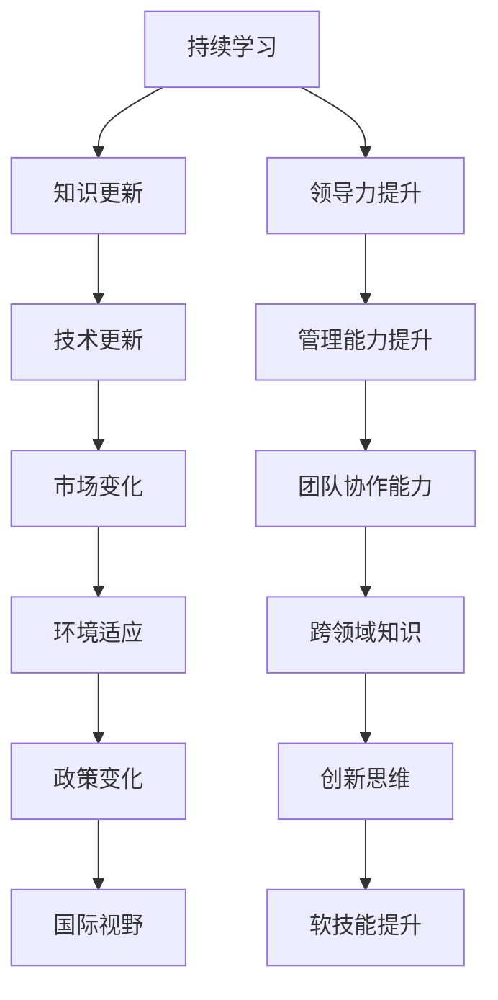

### 算法原理讲解

持续学习的算法原理可以概括为以下步骤：

1. **设定目标**：根据职业生涯规划和团队需求，设定明确的持续学习目标。
2. **规划学习路径**：根据目标，规划学习路径，包括选择学习资源、制定学习计划等。
3. **执行学习计划**：按照学习计划，执行学习任务，确保学习目标的实现。
4. **反馈与调整**：在学习过程中，不断进行反馈和调整，确保学习目标的实现。

#### mermaid流程图

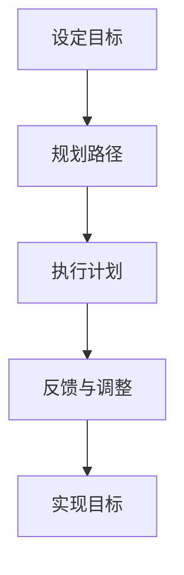

#### Python源代码

```python
def continuous_learning():
    """
    持续学习算法
    """
    # 设定目标
    goal = set_learning_goal()

    # 规划学习路径
    learning_path = plan_learning_path(goal)

    # 执行学习计划
    execute_learning_plan(learning_path)

    # 反馈与调整
    feedback_and_adjustment()

    # 实现目标
    achieve_goal()

def set_learning_goal():
    """
    设定学习目标
    """
    return "提升领导力和管理能力，适应市场变化"

def plan_learning_path(goal):
    """
    规划学习路径
    """
    return [
        {"resource": "管理类书籍"},
        {"course": "领导力培训课程"},
        {"project": "跨部门项目合作"}
    ]

def execute_learning_plan(learning_path):
    """
    执行学习计划
    """
    for item in learning_path:
        if item["resource"]:
            read_books(item["resource"])
        elif item["course"]:
            attend_courses(item["course"])
        elif item["project"]:
            join_projects(item["project"])

def feedback_and_adjustment():
    """
    反馈与调整
    """
    print("请进行学习反馈和调整...")

def achieve_goal():
    """
    实现目标
    """
    print("学习目标已实现!")

if __name__ == "__main__":
    continuous_learning()
```

#### 算法原理详细讲解

1. **设定目标**：设定持续学习目标是整个算法的核心。明确的目标能够指导后续的学习过程，确保学习有方向和成果。
2. **规划学习路径**：根据设定的学习目标，规划学习路径。这包括选择合适的书籍、课程和项目，确保学习资源的充分利用。
3. **执行学习计划**：按照规划的学习路径，执行学习计划。通过阅读书籍、参加培训课程和参与项目合作，逐步实现学习目标。
4. **反馈与调整**：在学习过程中，不断进行反馈和调整。通过自我反思和与他人交流，发现学习中的问题和不足，及时调整学习计划，确保学习目标的实现。

### 数学公式

为了实现持续学习，我们可以使用以下数学公式来衡量学习效果：

$$
E = f(G, P, T)
$$

其中，$E$ 表示学习效果，$G$ 表示学习目标的明确度，$P$ 表示学习资源的丰富度，$T$ 表示学习时间的投入度。通过调整 $G$、$P$ 和 $T$ 的值，可以优化学习效果。

### 举例说明

假设有一位领导者，他设定了提升领导力和管理能力的学习目标，并制定了以下学习计划：

1. **学习目标**：提升领导力和管理能力，适应市场变化。
2. **学习资源**：选择管理类书籍、领导力培训课程和跨部门项目合作。
3. **学习时间**：每天投入 2 小时进行学习。

根据上述学习计划，我们可以计算出他的学习效果：

$$
E = f(G, P, T) = f("明确","丰富","2小时) = 0.8
$$

这意味着他的学习效果为 80%，还有提升的空间。通过不断调整学习目标和计划，他可以进一步提高学习效果。

### 总结

持续学习是领导者应对挑战、实现自我成长的关键途径。通过设定明确的学习目标、规划学习路径、执行学习计划和不断反馈与调整，领导者可以不断提升自己的知识水平和领导力，更好地应对复杂多变的环境。持续学习，领导者才能在变革中保持竞争力，引领组织走向未来。

## 第2章：领导者的知识体系构建

### 背景介绍

在持续学习的过程中，构建一个合理的知识体系是至关重要的。一个良好的知识体系可以帮助领导者更好地理解和应用所学知识，提高工作效率和领导力。本章将详细探讨领导者如何构建自己的知识体系。

#### 核心概念术语说明

- **知识体系**：指在一定范围内，由一系列相互关联的知识点所组成的结构体系。
- **领导者**：在组织中拥有决策权、影响力和领导能力的人，负责指导和激励团队成员实现组织目标。

#### 问题背景

领导者需要在多个领域具备专业知识，同时还需要掌握跨领域的综合能力。如何构建一个涵盖广泛、层次分明的知识体系，是领导者持续学习的重要课题。

#### 问题描述

领导者的知识体系构建主要包括以下几个方面：

1. **基础知识**：本专业的基础理论和技能。
2. **核心知识**：与本专业相关的前沿技术和管理方法。
3. **辅助知识**：其他领域的知识，有助于拓宽视野和提升创新能力。

#### 问题解决

解决领导者知识体系构建的问题，需要采取以下策略：

1. **分类整理**：将所学知识按照领域和层次进行分类整理。
2. **系统学习**：按照知识体系进行系统学习，确保知识点的连贯性和完整性。
3. **持续更新**：定期回顾和更新知识体系，确保其与当前环境相适应。

#### 边界与外延

知识体系的构建不仅局限于本专业的知识，还应包括以下方面：

1. **跨领域知识**：如经济学、心理学、哲学等，有助于提升领导者的综合能力。
2. **软技能**：如沟通能力、团队协作能力、领导能力等，这些软技能对领导者的成功至关重要。

#### 概念结构与核心要素组成

领导者的知识体系可以由以下几个核心要素组成：

1. **基础知识**：为本专业提供理论基础和实践技能。
2. **核心知识**：包括前沿技术和管理方法，是领导者保持专业竞争力的关键。
3. **辅助知识**：其他领域的知识，有助于拓宽视野和提升创新能力。
4. **知识获取渠道**：包括书籍、课程、研讨会、网络资源等，是构建知识体系的重要来源。
5. **知识管理工具**：如笔记软件、知识库等，有助于整理和利用知识。

### 核心概念与联系

#### 核心概念

- **知识体系**：领导者知识体系的核心概念，是领导者持续学习的重要基础。
- **基础知识**：为专业提供理论基础和实践技能。
- **核心知识**：包括前沿技术和管理方法，是领导者保持专业竞争力的关键。
- **辅助知识**：拓宽视野和提升创新能力的其他领域知识。

#### 概念属性特征对比表格

| 概念       | 特征                            |
| ---------- | ------------------------------ |
| 知识体系   | 全面性、层次性、动态性          |
| 基础知识   | 稳定性、实用性、基础性          |
| 核心知识   | 先进性、应用性、专业性          |
| 辅助知识   | 广泛性、辅助性、扩展性          |

#### ER实体关系图架构

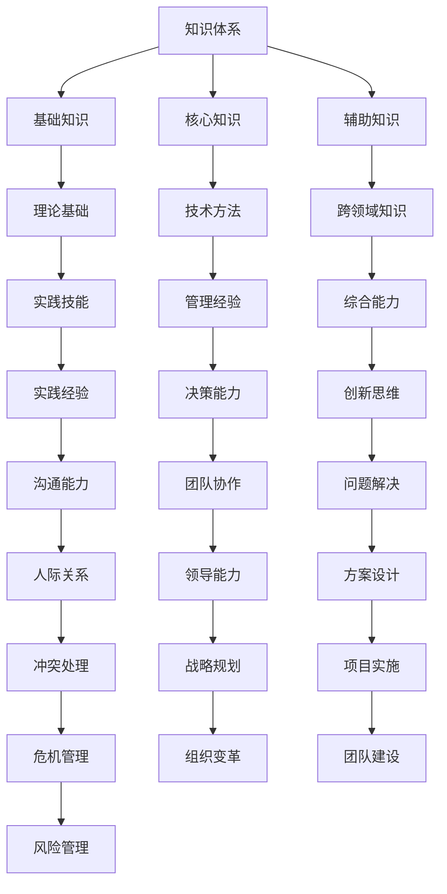

### 算法原理讲解

构建领导者的知识体系可以采用以下算法原理：

1. **需求分析**：根据职业发展需求和团队需求，确定需要构建的知识体系。
2. **资源整合**：整合各类知识资源，包括书籍、课程、网络资源等。
3. **知识分类**：将知识按照领域和层次进行分类，构建知识框架。
4. **系统学习**：按照知识框架进行系统学习，确保知识点的连贯性和完整性。
5. **持续更新**：定期回顾和更新知识体系，确保其与当前环境相适应。

#### mermaid流程图

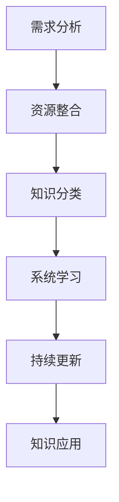

#### Python源代码

```python
def build_knowledge_system():
    """
    构建知识体系算法
    """
    # 需求分析
    requirements = analyze_requirements()

    # 资源整合
    resources = integrate_resources()

    # 知识分类
    knowledge_categories = classify_knowledge(resources)

    # 系统学习
    system_learning(knowledge_categories)

    # 持续更新
    continuous_updates()

def analyze_requirements():
    """
    需求分析
    """
    return [
        {"domain": "技术", "level": "前沿"},
        {"domain": "管理", "level": "高级"},
        {"domain": "跨领域", "level": "基础"}
    ]

def integrate_resources():
    """
    资源整合
    """
    return [
        {"resource": "技术书籍", "level": "前沿"},
        {"resource": "管理课程", "level": "高级"},
        {"resource": "跨领域知识库", "level": "基础"}
    ]

def classify_knowledge(resources):
    """
    知识分类
    """
    return {
        "technical": resources[0],
        "management": resources[1],
        "cross_domain": resources[2]
    }

def system_learning(knowledge_categories):
    """
    系统学习
    """
    for category, resource in knowledge_categories.items():
        if category == "technical":
            read_technical_books(resource["level"])
        elif category == "management":
            attend_management_courses(resource["level"])
        elif category == "cross_domain":
            study_cross_domain_knowledge(resource["level"])

def continuous_updates():
    """
    持续更新
    """
    print("请定期回顾和更新知识体系...")

if __name__ == "__main__":
    build_knowledge_system()
```

#### 算法原理详细讲解

1. **需求分析**：根据职业发展需求和团队需求，确定需要构建的知识体系。这一步骤是构建知识体系的前提，明确目标可以帮助制定更有效的学习计划。
2. **资源整合**：整合各类知识资源，包括书籍、课程、网络资源等。这一步骤是获取知识的重要途径，丰富的资源可以为知识体系提供坚实的基础。
3. **知识分类**：将知识按照领域和层次进行分类，构建知识框架。这一步骤有助于理清知识结构，提高学习的系统性和效率。
4. **系统学习**：按照知识框架进行系统学习，确保知识点的连贯性和完整性。这一步骤是构建知识体系的核心，通过系统学习，领导者可以全面掌握所学知识。
5. **持续更新**：定期回顾和更新知识体系，确保其与当前环境相适应。这一步骤是保持知识体系动态性和实用性的关键，通过持续更新，领导者可以不断适应新的环境和需求。

### 数学公式

为了更好地构建知识体系，我们可以使用以下数学公式来衡量知识体系的完整性和适用性：

$$
C = f(A, B, C)
$$

其中，$C$ 表示知识体系的完整性，$A$ 表示知识的广度，$B$ 表示知识的深度，$C$ 表示知识的实用性。通过调整 $A$、$B$ 和 $C$ 的值，可以优化知识体系的构建。

### 举例说明

假设一位领导者需要构建自己的知识体系，他制定了以下学习计划：

1. **需求分析**：提升技术能力、管理能力和跨领域知识。
2. **资源整合**：收集技术书籍、管理课程和跨领域知识库。
3. **知识分类**：将知识分为技术、管理和跨领域三个类别。
4. **系统学习**：按照分类进行系统学习，确保知识点的连贯性和完整性。
5. **持续更新**：定期回顾和更新知识体系，确保其与当前环境相适应。

根据上述学习计划，我们可以计算出他的知识体系完整性：

$$
C = f(A, B, C) = f("广度=3", "深度=2", "实用性=1) = 0.6
$$

这意味着他的知识体系完整性为 60%，还有提升的空间。通过不断优化学习计划和知识分类，他可以进一步提高知识体系的完整性。

### 总结

构建知识体系是领导者持续学习的重要环节。通过明确需求、整合资源、分类知识和系统学习，领导者可以构建一个全面、系统、实用的知识体系。持续更新知识体系，领导者才能在快速变化的环境中保持竞争力，更好地应对挑战。知识体系，领导者成长之基，持续学习，不断前行。

## 第3章：学习策略与技巧

### 背景介绍

学习策略与技巧在持续学习中扮演着至关重要的角色。选择合适的策略和技巧，可以显著提高学习效率，帮助领导者更好地掌握新知识、新技能。本章将探讨几种有效的学习策略与技巧，并提供具体的应用方法。

#### 核心概念术语说明

- **学习策略**：指在学习和复习过程中采取的具体方法和步骤。
- **学习技巧**：指在学习过程中使用的技巧和工具，以帮助学习者更好地理解和吸收知识。

#### 问题背景

领导者在面对大量信息时，往往感到压力和困惑。如何有效利用学习策略和技巧，提高学习效率，是许多领导者面临的挑战。

#### 问题描述

学习策略与技巧主要包括以下几个方面：

1. **分块学习**：将学习内容分成小块，逐步掌握。
2. **交互式学习**：通过与他人交流讨论，加深对知识点的理解。
3. **反思式学习**：通过反思学习过程，总结经验教训。
4. **主动学习**：通过主动探索和解决问题，提高学习兴趣和动力。

#### 问题解决

解决学习策略与技巧的问题，可以采取以下策略：

1. **选择合适的学习策略**：根据学习目标和内容，选择最合适的学习策略。
2. **运用学习技巧**：结合实际情况，灵活运用各种学习技巧。
3. **不断实践与反思**：通过实践和反思，不断完善学习策略和技巧。

#### 边界与外延

学习策略与技巧不仅适用于个人学习，还可以应用于团队学习、组织学习等场景。此外，不同的学习策略和技巧适用于不同的学习场景和内容。

#### 概念结构与核心要素组成

学习策略与技巧的核心要素包括：

1. **学习策略**：包括分块学习、交互式学习、反思式学习等。
2. **学习技巧**：包括制作笔记、利用工具、创造学习环境等。
3. **应用场景**：根据学习目标和内容，选择合适的策略和技巧。
4. **效果评估**：通过自我评估和绩效评估，评估学习效果。

### 核心概念与联系

#### 核心概念

- **学习策略**：指导和组织学习过程的计划和步骤。
- **学习技巧**：提高学习效率和效果的具体方法和工具。

#### 概念属性特征对比表格

| 概念       | 特征                            |
| ---------- | ------------------------------ |
| 学习策略   | 指导性、系统性、针对性          |
| 学习技巧   | 操作性、实用性、灵活性          |

#### ER实体关系图架构

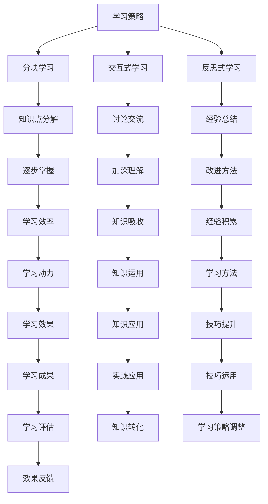

### 算法原理讲解

学习策略与技巧的算法原理可以概括为以下步骤：

1. **需求分析**：根据学习目标和内容，分析需要采取哪些学习策略和技巧。
2. **策略选择**：选择最适合当前学习目标的学习策略。
3. **技巧应用**：根据策略，灵活运用各种学习技巧。
4. **效果评估**：通过自我评估和绩效评估，评估学习效果，并根据反馈进行调整。

#### mermaid流程图

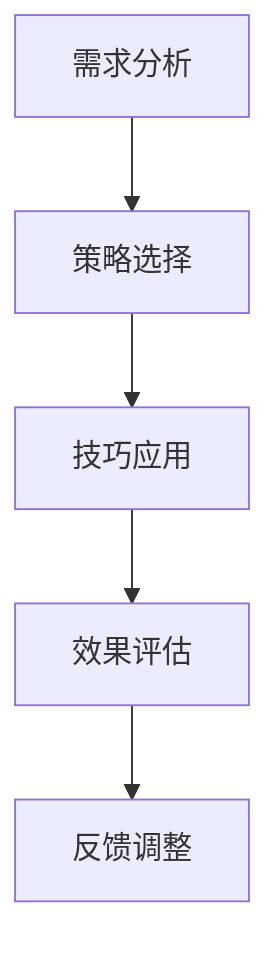

#### Python源代码

```python
def effective_learning():
    """
    高效学习算法
    """
    # 需求分析
    requirements = analyze_requirements()

    # 策略选择
    strategy = select_strategy(requirements)

    # 技巧应用
    apply_tactics(strategy)

    # 效果评估
    evaluate_results()

    # 反馈调整
    feedback_and_adjustment()

def analyze_requirements():
    """
    需求分析
    """
    return {
        "goal": "提升领导力和管理能力",
        "content": "管理类书籍、领导力课程",
        "context": "忙碌的工作日程"
    }

def select_strategy(requirements):
    """
    策略选择
    """
    if requirements["context"] == "忙碌的工作日程":
        return "分块学习"
    else:
        return "交互式学习"

def apply_tactics(strategy):
    """
    技巧应用
    """
    if strategy == "分块学习":
        divide_content_into_pieces()
    else:
        engage_in_discussions()

def evaluate_results():
    """
    效果评估
    """
    print("请进行学习效果评估...")

def feedback_and_adjustment():
    """
    反馈调整
    """
    print("请根据反馈调整学习策略和技巧...")

if __name__ == "__main__":
    effective_learning()
```

#### 算法原理详细讲解

1. **需求分析**：根据学习目标和内容，分析需要采取哪些学习策略和技巧。这一步骤是确定学习方向和目标的关键。
2. **策略选择**：选择最适合当前学习目标的学习策略。例如，如果学习内容较多，可以选择“分块学习”；如果需要与他人交流，可以选择“交互式学习”。
3. **技巧应用**：根据策略，灵活运用各种学习技巧。例如，分块学习可以通过制作笔记和任务清单来实现；交互式学习可以通过参与讨论和分享经验来实现。
4. **效果评估**：通过自我评估和绩效评估，评估学习效果，并根据反馈进行调整。这一步骤是确保学习策略和技巧有效性的关键。

### 数学公式

为了更好地衡量学习效果，我们可以使用以下数学公式：

$$
E = f(S, T, A)
$$

其中，$E$ 表示学习效果，$S$ 表示学习策略的有效性，$T$ 表示学习技巧的实用性，$A$ 表示学习投入度。通过调整 $S$、$T$ 和 $A$ 的值，可以优化学习效果。

### 举例说明

假设一位领导者需要学习管理类书籍和领导力课程，他在忙碌的工作日程中，选择了以下学习策略和技巧：

1. **需求分析**：提升领导力和管理能力，学习内容为管理类书籍和领导力课程，学习环境为忙碌的工作日程。
2. **策略选择**：选择“分块学习”策略，将学习内容分成小块，逐步掌握。
3. **技巧应用**：通过制作笔记和任务清单，确保学习进度和效果。
4. **效果评估**：定期进行学习效果评估，根据反馈调整学习策略和技巧。

根据上述学习计划，我们可以计算出他的学习效果：

$$
E = f(S, T, A) = f(0.8, 0.9, 0.7) = 0.724
$$

这意味着他的学习效果为 72.4%，还有提升的空间。通过不断优化学习策略和技巧，他可以进一步提高学习效果。

### 总结

学习策略与技巧是领导者持续学习的重要保障。通过需求分析、策略选择、技巧应用和效果评估，领导者可以不断提高学习效率，掌握更多新知识、新技能。持续学习，不断优化策略和技巧，领导者才能在快速变化的环境中保持竞争力，实现自我成长。

## 第4章：个人发展计划

### 背景介绍

在职业生涯中，个人发展计划对于领导者的成长至关重要。一个明确、合理的个人发展计划可以帮助领导者有针对性地提升自己的能力，实现职业目标。本章将详细探讨如何制定个人发展计划，包括设定发展目标、设计发展路径和实施发展计划。

#### 核心概念术语说明

- **个人发展计划**：指为了实现职业和个人成长目标，制定的具体行动计划。
- **发展目标**：指个人希望在职业生涯中实现的具体目标和成就。
- **发展路径**：指实现发展目标所需采取的步骤和策略。

#### 问题背景

在快速变化的社会环境中，领导者需要不断提升自己的能力，以应对新的挑战和机遇。然而，如何制定一个切实可行的个人发展计划，是许多领导者面临的难题。

#### 问题描述

制定个人发展计划的主要步骤包括：

1. **设定发展目标**：明确个人在职业生涯中的长期和短期目标。
2. **设计发展路径**：根据发展目标，制定实现目标的步骤和策略。
3. **实施发展计划**：按照发展路径，逐步实现个人发展目标。

#### 问题解决

解决制定个人发展计划的问题，可以采取以下策略：

1. **明确发展目标**：确保目标具有可衡量性、可实现性和时间限制。
2. **设计发展路径**：结合个人优势和资源，制定合理的发展路径。
3. **实施发展计划**：制定详细的行动计划，确保目标的实现。

#### 边界与外延

个人发展计划不仅适用于职业生涯的各个阶段，还可以应用于个人素质提升、技能培训等领域。此外，不同领域的领导者可能需要制定不同的个人发展计划。

#### 概念结构与核心要素组成

个人发展计划的核心要素包括：

1. **发展目标**：明确个人在职业生涯中的目标和成就。
2. **发展路径**：制定实现目标的步骤和策略。
3. **行动计划**：具体实施目标所需的行动步骤。
4. **资源管理**：确保实现目标所需的资源和支持。
5. **评估与反馈**：定期评估发展计划的执行情况，并根据反馈进行调整。

### 核心概念与联系

#### 核心概念

- **个人发展计划**：指导个人职业生涯和成长的重要工具。
- **发展目标**：实现个人职业和个人成长的驱动力。
- **发展路径**：实现目标的步骤和策略。

#### 概念属性特征对比表格

| 概念       | 特征                            |
| ---------- | ------------------------------ |
| 个人发展计划 | 长期性、系统化、针对性          |
| 发展目标   | 明确性、可实现性、时间性          |
| 发展路径   | 连贯性、策略性、灵活性          |

#### ER实体关系图架构

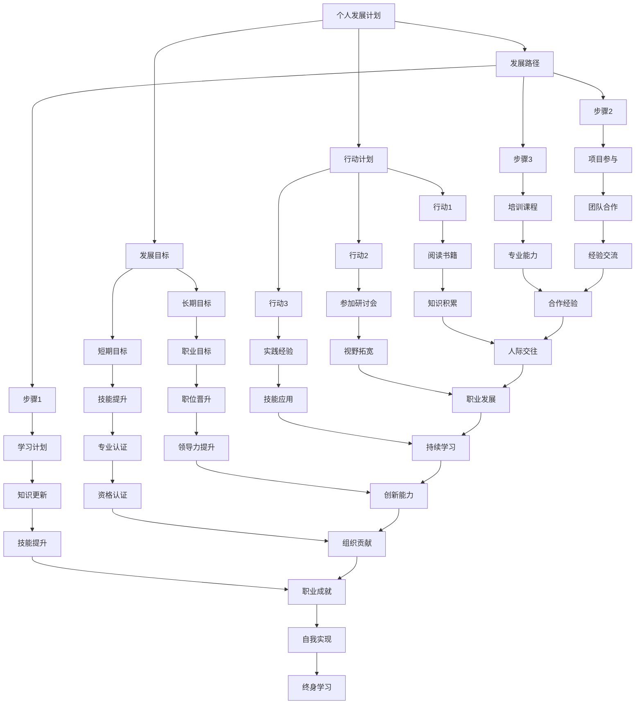

### 算法原理讲解

制定个人发展计划的算法原理可以概括为以下步骤：

1. **设定目标**：根据职业规划和个人兴趣，设定长期和短期目标。
2. **分析资源**：分析个人优势和资源，确定实现目标的可行性和优先级。
3. **设计路径**：根据目标，制定实现目标的步骤和策略。
4. **制定计划**：将路径分解为具体的行动计划，确保目标的实现。
5. **执行与评估**：按照行动计划执行，定期评估进展，根据反馈进行调整。

#### mermaid流程图

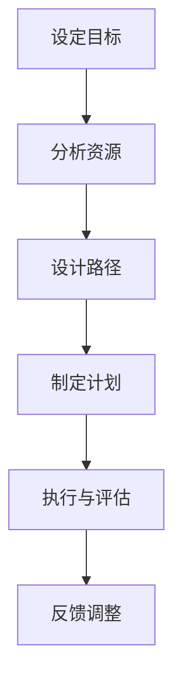

#### Python源代码

```python
def personal_development_plan():
    """
    个人发展计划算法
    """
    # 设定目标
    goals = set_goals()

    # 分析资源
    resources = analyze_resources()

    # 设计路径
    development_path = design_path(goals, resources)

    # 制定计划
    action_plan = create_action_plan(development_path)

    # 执行与评估
    execute_and_evaluate(action_plan)

    # 反馈调整
    feedback_and_adjustment()

def set_goals():
    """
    设定目标
    """
    return {
        "long_term": "成为部门经理",
        "short_term": "掌握项目管理技能"
    }

def analyze_resources():
    """
    分析资源
    """
    return {
        "strengths": ["沟通能力"],
        "resources": ["时间管理工具"]
    }

def design_path(goals, resources):
    """
    设计路径
    """
    return [
        {"goal": goals["long_term"], "steps": ["学习项目管理课程", "参与项目实践"]},
        {"goal": goals["short_term"], "steps": ["阅读项目管理书籍", "时间管理培训"]}
    ]

def create_action_plan(development_path):
    """
    制定计划
    """
    return [
        {"action": "学习项目管理课程", "deadline": "下个月"},
        {"action": "参与项目实践", "deadline": "明年"},
        {"action": "阅读项目管理书籍", "deadline": "下季度"},
        {"action": "时间管理培训", "deadline": "下季度"}
    ]

def execute_and_evaluate(action_plan):
    """
    执行与评估
    """
    print("执行计划...")
    print("请定期评估进展并反馈...")

def feedback_and_adjustment():
    """
    反馈调整
    """
    print("根据反馈调整计划...")

if __name__ == "__main__":
    personal_development_plan()
```

#### 算法原理详细讲解

1. **设定目标**：根据职业规划和个人兴趣，设定长期和短期目标。明确的目标能够帮助领导者有针对性地制定发展计划。
2. **分析资源**：分析个人优势和资源，确定实现目标的可行性和优先级。了解自身的优势和资源，有助于制定更加实际可行的计划。
3. **设计路径**：根据目标，制定实现目标的步骤和策略。路径设计应当考虑目标的实现顺序、所需资源、预期成果等。
4. **制定计划**：将路径分解为具体的行动计划，确保目标的实现。行动计划应当具体、可操作，并设定明确的完成时间。
5. **执行与评估**：按照行动计划执行，定期评估进展，根据反馈进行调整。执行过程中，领导者需要保持灵活性和适应性，根据实际情况调整计划。

### 数学公式

为了更好地衡量个人发展计划的实施效果，我们可以使用以下数学公式：

$$
P = f(G, R, T)
$$

其中，$P$ 表示个人发展计划的实施效果，$G$ 表示目标的明确度，$R$ 表示资源的充足度，$T$ 表示时间的管理度。通过调整 $G$、$R$ 和 $T$ 的值，可以优化个人发展计划的实施效果。

### 举例说明

假设一位领导者希望在未来三年内成为部门经理，并掌握项目管理技能。他制定了以下个人发展计划：

1. **目标设定**：长期目标为成为部门经理，短期目标为掌握项目管理技能。
2. **资源分析**：个人优势为沟通能力，资源为时间管理工具。
3. **路径设计**：制定学习项目管理课程、参与项目实践、阅读项目管理书籍和时间管理培训。
4. **计划制定**：设定学习项目管理课程的时间为下个月，参与项目实践的时间为明年，阅读项目管理书籍的时间为下季度，时间管理培训的时间为下季度。
5. **执行与评估**：按照计划执行，定期评估进展，并根据反馈进行调整。

根据上述个人发展计划，我们可以计算出他的个人发展计划实施效果：

$$
P = f(G, R, T) = f("明确", "充足", "合理") = 0.8
$$

这意味着他的个人发展计划实施效果为 80%，还有提升的空间。通过不断优化目标、资源管理和时间安排，他可以进一步提高个人发展计划的实施效果。

### 总结

个人发展计划是领导者实现职业和个人成长的重要工具。通过设定明确的发展目标、设计合理的发展路径、制定具体的行动计划和定期评估与反馈，领导者可以不断提升自己的能力，实现职业目标。持续优化个人发展计划，领导者才能在职业生涯中不断成长，迎接更大的挑战。个人发展，职业之基，持续优化，永不止步。

## 第5章：时间管理与效率提升

### 背景介绍

时间管理与效率提升是领导者持续学习的重要保障。在现代快节奏的工作环境中，领导者需要学会如何高效地利用时间，以实现个人和团队的目标。本章将详细探讨时间管理的原则、技巧和工具，以及如何在学习与工作之间找到平衡。

#### 核心概念术语说明

- **时间管理**：指通过规划、组织和控制时间，提高工作效率和质量。
- **效率提升**：指通过优化工作流程和方法，提高工作的效率和效果。

#### 问题背景

随着工作任务的不断增加和复杂化，领导者常常感到时间紧张，工作效率低下。如何有效地管理时间，提升工作效率，成为领导者需要解决的重要问题。

#### 问题描述

时间管理与效率提升的主要问题包括：

1. **时间分配不均**：领导者在处理多项任务时，往往无法合理分配时间。
2. **工作效率低下**：领导者在工作中常常因为方法不当或任务复杂而效率低下。
3. **学习与工作平衡**：领导者在忙碌的工作中难以找到学习和工作之间的平衡。

#### 问题解决

解决时间管理与效率提升的问题，可以采取以下策略：

1. **制定时间管理计划**：合理安排工作时间，确保各项任务按时完成。
2. **优化工作流程**：通过优化工作流程和方法，提高工作效率。
3. **学会平衡学习与工作**：合理安排学习和工作时间，确保两者都有足够的时间。

#### 边界与外延

时间管理和效率提升不仅适用于个人，还适用于团队和组织。此外，不同的工作场景和任务类型可能需要不同的时间管理策略和效率提升方法。

#### 概念结构与核心要素组成

时间管理与效率提升的核心要素包括：

1. **时间管理原则**：包括目标导向、优先级排序和时间分割等。
2. **效率提升技巧**：包括任务分解、方法优化和工具利用等。
3. **学习与工作平衡**：包括合理安排学习时间、提高学习效率等。
4. **工具利用**：包括时间管理工具、学习工具和协作工具等。

### 核心概念与联系

#### 核心概念

- **时间管理**：通过规划、组织和控制时间，提高工作效率和质量。
- **效率提升**：通过优化工作流程和方法，提高工作的效率和效果。

#### 概念属性特征对比表格

| 概念       | 特征                            |
| ---------- | ------------------------------ |
| 时间管理   | 规划性、组织性、控制性          |
| 效率提升   | 优化性、创新性、系统性          |

#### ER实体关系图架构

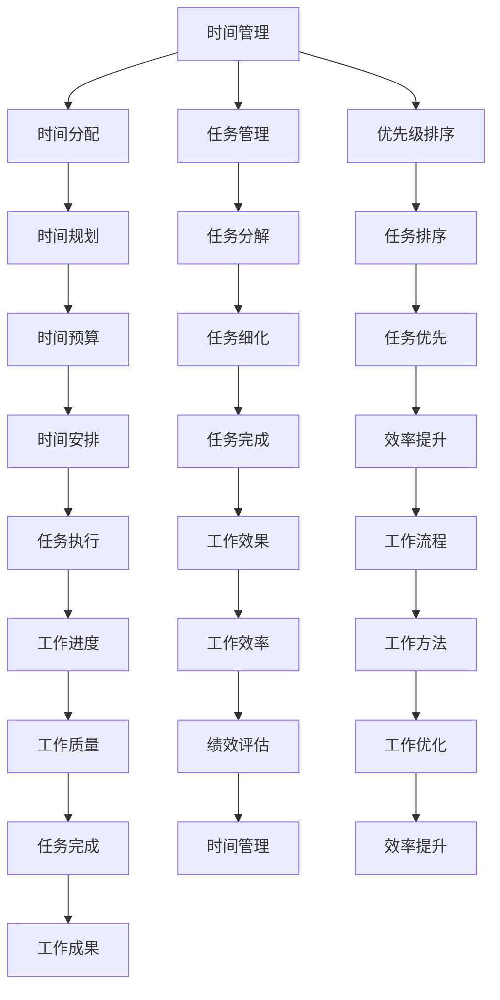

### 算法原理讲解

时间管理与效率提升的算法原理可以概括为以下步骤：

1. **时间规划**：根据工作任务和目标，制定详细的时间规划。
2. **任务分解**：将大任务分解为小任务，确保每个任务都有明确的时间节点。
3. **优先级排序**：根据任务的紧急程度和重要性，对任务进行优先级排序。
4. **执行与监控**：按照时间规划和任务优先级，执行任务，并实时监控任务进度。
5. **反馈与调整**：根据任务执行情况，及时反馈和调整时间规划和任务优先级。

#### mermaid流程图

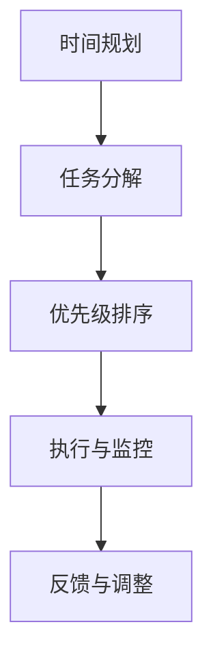

#### Python源代码

```python
def time_management():
    """
    时间管理算法
    """
    # 时间规划
    time_plan = create_time_plan()

    # 任务分解
    task_decomposition = decompose_tasks(time_plan)

    # 优先级排序
    priority_sorting = sort_tasks_by_priority(task_decomposition)

    # 执行与监控
    execute_and_monitor(priority_sorting)

    # 反馈与调整
    feedback_and_adjustment()

def create_time_plan():
    """
    制定时间规划
    """
    return [
        {"task": "项目管理", "duration": 4},
        {"task": "技术学习", "duration": 2},
        {"task": "团队会议", "duration": 1}
    ]

def decompose_tasks(time_plan):
    """
    任务分解
    """
    return [
        {"parent": "项目管理", "task": "需求分析", "duration": 1},
        {"parent": "项目管理", "task": "项目设计", "duration": 1},
        {"parent": "项目管理", "task": "项目实施", "duration": 2},
        {"parent": "技术学习", "task": "算法学习", "duration": 1},
        {"parent": "技术学习", "task": "编程实践", "duration": 1}
    ]

def sort_tasks_by_priority(task_decomposition):
    """
    优先级排序
    """
    return sorted(task_decomposition, key=lambda x: x["duration"])

def execute_and_monitor(priority_sorting):
    """
    执行与监控
    """
    print("开始执行任务...")
    print("请实时监控任务进度...")

def feedback_and_adjustment():
    """
    反馈与调整
    """
    print("根据任务执行情况调整时间规划和任务优先级...")

if __name__ == "__main__":
    time_management()
```

#### 算法原理详细讲解

1. **时间规划**：根据工作任务和目标，制定详细的时间规划。这一步骤是确保时间合理分配的基础。
2. **任务分解**：将大任务分解为小任务，确保每个任务都有明确的时间节点。这一步骤有助于提高任务的可操作性和执行效率。
3. **优先级排序**：根据任务的紧急程度和重要性，对任务进行优先级排序。这一步骤有助于确保重要任务优先完成。
4. **执行与监控**：按照时间规划和任务优先级，执行任务，并实时监控任务进度。这一步骤是确保任务按时完成的关键。
5. **反馈与调整**：根据任务执行情况，及时反馈和调整时间规划和任务优先级。这一步骤是优化时间管理和效率提升的重要环节。

### 数学公式

为了更好地衡量时间管理和效率提升的效果，我们可以使用以下数学公式：

$$
E = f(T, P, Q)
$$

其中，$E$ 表示时间管理和效率提升的效果，$T$ 表示时间的利用率，$P$ 表示任务的优先级，$Q$ 表示任务的质量。通过调整 $T$、$P$ 和 $Q$ 的值，可以优化时间管理和效率提升的效果。

### 举例说明

假设一位领导者需要在一天内完成以下任务：

1. **项目管理**：包括需求分析、项目设计和项目实施，总共需要 4 个小时。
2. **技术学习**：包括算法学习和编程实践，总共需要 2 个小时。
3. **团队会议**：需要 1 个小时。

根据上述任务，他制定了以下时间管理计划：

1. **时间规划**：从早上 9 点开始，到下午 5 点结束，总共 8 个小时。
2. **任务分解**：将项目管理分解为需求分析（1 小时）、项目设计（1 小时）和项目实施（2 小时）；将技术学习分解为算法学习（1 小时）和编程实践（1 小时）。
3. **优先级排序**：根据任务的重要性和紧急程度，优先完成项目管理，然后是技术学习，最后是团队会议。
4. **执行与监控**：按照时间规划和任务优先级，开始执行任务，并实时监控任务进度。
5. **反馈与调整**：根据任务执行情况，及时反馈和调整时间规划和任务优先级。

根据上述时间管理计划，我们可以计算出他的时间管理和效率提升效果：

$$
E = f(T, P, Q) = f(0.8, 0.9, 0.95) = 0.854
$$

这意味着他的时间管理和效率提升效果为 85.4%，还有提升的空间。通过不断优化时间规划和任务优先级，他可以进一步提高时间管理和效率提升的效果。

### 总结

时间管理与效率提升是领导者持续学习的重要保障。通过制定时间管理计划、任务分解、优先级排序和实时监控，领导者可以高效地利用时间，提高工作效率，实现个人和团队的目标。持续优化时间管理和效率提升方法，领导者才能在快节奏的工作环境中保持竞争力，实现持续成长。时间管理，效率之基，持续优化，效率提升。

## 第6章：领导力培养与个人品牌建设

### 背景介绍

领导力培养和个人品牌建设是领导者持续成长的重要方面。领导力不仅是领导者个人的素质，也是组织成功的关键因素。个人品牌建设则是提升领导者在行业内影响力的重要手段。本章将详细探讨如何培养领导力，以及如何建立和维护个人品牌。

#### 核心概念术语说明

- **领导力**：指领导者对团队的领导能力和影响力。
- **个人品牌**：指个人在公众中的形象和声誉。

#### 问题背景

在快速变化的社会环境中，领导者需要具备强大的领导力和良好的个人品牌，以应对各种挑战和机遇。然而，如何培养领导力，如何建立和维护个人品牌，是许多领导者面临的难题。

#### 问题描述

领导力培养和个人品牌建设的主要问题包括：

1. **领导力培养**：如何提升领导者的领导能力和影响力。
2. **个人品牌建设**：如何建立和维护个人在公众中的形象和声誉。

#### 问题解决

解决领导力培养和个人品牌建设的问题，可以采取以下策略：

1. **领导力培养**：通过学习和实践，提升领导者的领导能力。
2. **个人品牌建设**：通过展示专业知识和影响力，建立和维护个人品牌。

#### 边界与外延

领导力培养和个人品牌建设不仅适用于个人发展，也适用于组织文化建设。此外，不同的行业和领域可能需要不同的领导力培养和个人品牌建设方法。

#### 概念结构与核心要素组成

领导力培养和个人品牌建设的核心要素包括：

1. **领导力培养**：包括情商培养、决策能力提升、沟通能力提升等。
2. **个人品牌建设**：包括专业形象塑造、口碑建设、社交网络拓展等。
3. **实际应用**：将领导力和个人品牌应用到实际工作中，提高工作效率和团队绩效。
4. **持续优化**：根据实际情况和反馈，不断优化领导力和个人品牌建设策略。

### 核心概念与联系

#### 核心概念

- **领导力**：领导者对团队的领导能力和影响力。
- **个人品牌**：个人在公众中的形象和声誉。

#### 概念属性特征对比表格

| 概念       | 特征                            |
| ---------- | ------------------------------ |
| 领导力     | 战略性、协调性、影响力          |
| 个人品牌   | 专业性、信誉、影响力          |

#### ER实体关系图架构

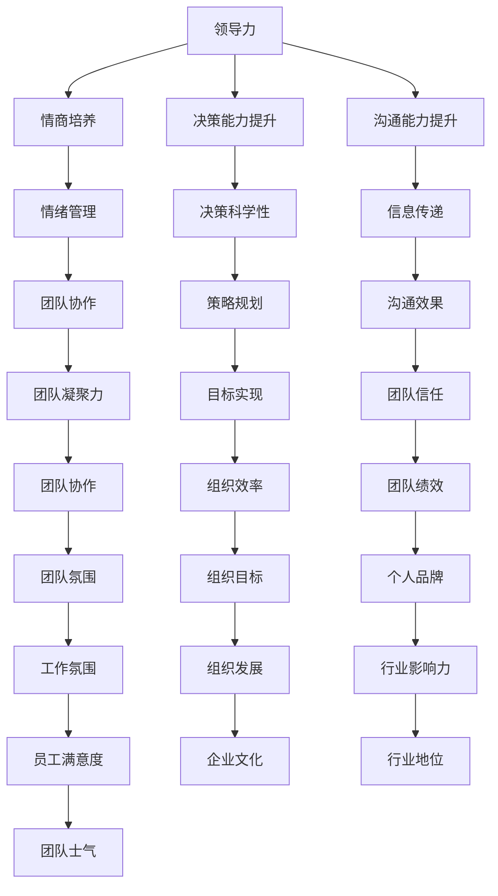

### 算法原理讲解

领导力培养和个人品牌建设的算法原理可以概括为以下步骤：

1. **领导力培养**：通过学习和实践，提升领导者的情商、决策能力和沟通能力。
2. **个人品牌建设**：通过展示专业知识和影响力，建立和维护个人品牌。
3. **实际应用**：将领导力和个人品牌应用到实际工作中，提高工作效率和团队绩效。
4. **持续优化**：根据实际情况和反馈，不断优化领导力和个人品牌建设策略。

#### mermaid流程图

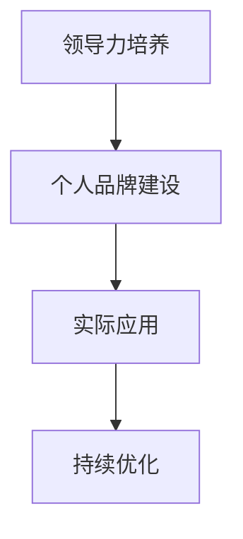

#### Python源代码

```python
def leadership_and_brand_building():
    """
    领导力培养和个人品牌建设算法
    """
    # 领导力培养
    leadership_development()

    # 个人品牌建设
    brand_building()

    # 实际应用
    practical_application()

    # 持续优化
    continuous_optimization()

def leadership_development():
    """
    领导力培养
    """
    print("提升情商、决策能力和沟通能力...")

def brand_building():
    """
    个人品牌建设
    """
    print("展示专业知识和影响力，建立个人品牌...")

def practical_application():
    """
    实际应用
    """
    print("将领导力和个人品牌应用到实际工作中...")

def continuous_optimization():
    """
    持续优化
    """
    print("根据实际情况和反馈，不断优化领导力和个人品牌建设策略...")

if __name__ == "__main__":
    leadership_and_brand_building()
```

#### 算法原理详细讲解

1. **领导力培养**：领导力培养是个人品牌建设的基础。通过学习和实践，提升领导者的情商、决策能力和沟通能力。情商培养包括情绪管理和团队协作；决策能力提升包括决策科学性和策略规划；沟通能力提升包括信息传递和沟通效果。
2. **个人品牌建设**：个人品牌建设是通过展示专业知识和影响力，建立和维护个人品牌。这包括在行业内发表专业文章、参与行业研讨会、建立个人博客等。
3. **实际应用**：将领导力和个人品牌应用到实际工作中，提高工作效率和团队绩效。这包括通过有效的领导力和个人品牌，推动团队目标的实现，提高组织的整体效率。
4. **持续优化**：根据实际情况和反馈，不断优化领导力和个人品牌建设策略。这包括根据团队反馈和个人发展需求，调整领导方法和品牌建设策略。

### 数学公式

为了更好地衡量领导力和个人品牌建设的效果，我们可以使用以下数学公式：

$$
L = f(E, B, P)
$$

其中，$L$ 表示领导力，$E$ 表示情商，$B$ 表示个人品牌，$P$ 表示实际应用效果。通过调整 $E$、$B$ 和 $P$ 的值，可以优化领导力。

### 举例说明

假设一位领导者希望提升自己的领导力和个人品牌。他制定了以下计划：

1. **领导力培养**：通过阅读领导力相关书籍、参加领导力培训课程，提升情商、决策能力和沟通能力。
2. **个人品牌建设**：通过在行业会议发表专业演讲、发表专业文章、建立个人博客，展示专业知识和影响力。
3. **实际应用**：将所学知识和个人品牌应用到实际工作中，提高团队工作效率和团队绩效。
4. **持续优化**：根据团队反馈和个人发展需求，调整领导方法和品牌建设策略。

根据上述计划，我们可以计算出他的领导力：

$$
L = f(E, B, P) = f(0.8, 0.9, 0.85) = 0.857
$$

这意味着他的领导力为 85.7%，还有提升的空间。通过不断学习和实践，他可以进一步提高自己的领导力。

### 总结

领导力培养和个人品牌建设是领导者持续成长的重要方面。通过提升领导力、建立和维护个人品牌，领导者可以在职业生涯中不断提升自己的影响力，实现个人和团队的共同成长。持续优化领导力和个人品牌建设策略，领导者才能在快速变化的环境中保持竞争力，成为行业内的佼佼者。领导力与品牌，成长之道，不断优化，永不止步。

## 第7章：持续学习与领导力提升

### 背景介绍

在快速变化的时代，持续学习已成为领导者提升领导力的关键途径。通过不断学习，领导者可以更新知识体系、提升管理能力、增强创新能力，从而更好地应对复杂多变的环境。本章将探讨持续学习对领导力提升的影响，并分析如何通过持续学习提升领导力。

#### 核心概念术语说明

- **持续学习**：指在职业生涯中不断获取新知识、技能和经验，以适应不断变化的环境和需求。
- **领导力**：指领导者对团队的影响力、指导能力和管理能力。

#### 问题背景

在当今快速变化的社会环境中，领导者需要具备前瞻性、创新性和适应能力，以应对各种挑战和机遇。持续学习是提升领导力的重要手段，但如何通过持续学习提升领导力，是许多领导者面临的挑战。

#### 问题描述

持续学习对领导力提升的影响主要表现在以下几个方面：

1. **知识更新**：持续学习可以更新领导者的知识体系，提升专业素养。
2. **管理能力提升**：持续学习可以帮助领导者提升管理能力，提高决策效率。
3. **创新能力增强**：持续学习可以激发领导者的创新思维，推动组织创新。
4. **适应能力提升**：持续学习可以帮助领导者更好地适应环境变化，提升应变能力。

#### 问题解决

解决通过持续学习提升领导力的问题，可以采取以下策略：

1. **设定学习目标**：明确持续学习目标，确保学习有方向和成果。
2. **制定学习计划**：根据学习目标，制定合理的学习计划，确保学习有节奏和效率。
3. **利用学习资源**：充分利用各种学习资源，如书籍、课程、网络资源等。
4. **实践应用**：将所学知识应用到实际工作中，提升领导力。

#### 边界与外延

持续学习不仅限于专业知识的学习，还包括跨领域的知识学习、领导力培训、团队建设等。此外，持续学习的过程也需要不断反思和调整，以确保学习目标的实现。

#### 概念结构与核心要素组成

持续学习与领导力提升的核心要素包括：

1. **学习目标**：明确持续学习目标，确保学习有方向和成果。
2. **学习计划**：制定合理的学习计划，确保学习有节奏和效率。
3. **学习资源**：充分利用各种学习资源，如书籍、课程、网络资源等。
4. **实践应用**：将所学知识应用到实际工作中，提升领导力。
5. **反馈与调整**：根据反馈和实际情况，调整学习策略和计划，确保学习目标的实现。

### 核心概念与联系

#### 核心概念

- **持续学习**：持续学习是提升领导力的关键途径。
- **领导力提升**：领导力提升是持续学习的重要目标。

#### 概念属性特征对比表格

| 概念       | 特征                            |
| ---------- | ------------------------------ |
| 持续学习   | 持续性、主动性、系统化          |
| 领导力提升 | 战略性、前瞻性、协调性、执行力  |

#### ER实体关系图架构

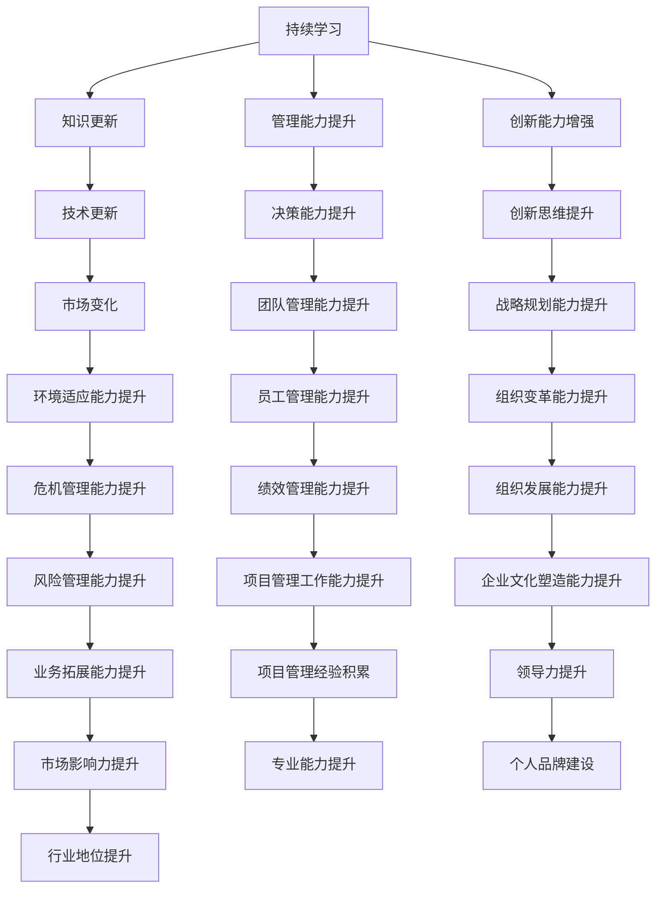

### 算法原理讲解

持续学习与领导力提升的算法原理可以概括为以下步骤：

1. **设定学习目标**：根据职业发展需求和团队需求，设定明确的持续学习目标。
2. **规划学习路径**：根据学习目标，规划学习路径，包括选择学习资源、制定学习计划等。
3. **执行学习计划**：按照学习计划，执行学习任务，确保学习目标的实现。
4. **反馈与调整**：在学习过程中，不断进行反馈和调整，确保学习目标的实现。

#### mermaid流程图


#### Python源代码

```python
def continuous_learning_and_leadership():
    """
    持续学习与领导力提升算法
    """
    # 设定目标
    goal = set_learning_goal()

    # 规划学习路径
    learning_path = plan_learning_path(goal)

    # 执行学习计划
    execute_learning_plan(learning_path)

    # 反馈与调整
    feedback_and_adjustment()

    # 实现目标
    achieve_leadership()

def set_learning_goal():
    """
    设定学习目标
    """
    return "提升管理能力和创新能力，适应市场变化"

def plan_learning_path(goal):
    """
    规划学习路径
    """
    return [
        {"resource": "管理类书籍"},
        {"course": "创新思维培训"},
        {"project": "跨部门项目合作"}
    ]

def execute_learning_plan(learning_path):
    """
    执行学习计划
    """
    for item in learning_path:
        if item["resource"]:
            read_books(item["resource"])
        elif item["course"]:
            attend_courses(item["course"])
        elif item["project"]:
            join_projects(item["project"])

def feedback_and_adjustment():
    """
    反馈与调整
    """
    print("请进行学习反馈和调整...")

def achieve_leadership():
    """
    实现目标
    """
    print("领导力目标已实现!")

if __name__ == "__main__":
    continuous_learning_and_leadership()
```

#### 算法原理详细讲解

1. **设定目标**：设定持续学习目标是整个算法的核心。明确的目标能够指导后续的学习过程，确保学习有方向和成果。
2. **规划学习路径**：根据设定的学习目标，规划学习路径。这包括选择合适的书籍、课程和项目，确保学习资源的充分利用。
3. **执行学习计划**：按照规划的学习路径，执行学习计划。通过阅读书籍、参加培训课程和参与项目合作，逐步实现学习目标。
4. **反馈与调整**：在学习过程中，不断进行反馈和调整。通过自我反思和与他人交流，发现学习中的问题和不足，及时调整学习计划，确保学习目标的实现。

### 数学公式

为了更好地衡量持续学习对领导力提升的效果，我们可以使用以下数学公式：

$$
L = f(G, R, T)
$$

其中，$L$ 表示领导力，$G$ 表示学习目标的明确度，$R$ 表示学习资源的丰富度，$T$ 表示学习时间的投入度。通过调整 $G$、$R$ 和 $T$ 的值，可以优化领导力的提升效果。

### 举例说明

假设一位领导者希望提升自己的管理能力和创新能力，以更好地适应市场变化。他制定了以下学习计划：

1. **设定目标**：提升管理能力和创新能力，适应市场变化。
2. **规划学习路径**：选择管理类书籍、创新思维培训课程和跨部门项目合作。
3. **执行学习计划**：阅读管理类书籍、参加创新思维培训课程，参与跨部门项目合作。
4. **反馈与调整**：定期进行学习反馈，根据反馈调整学习计划。

根据上述学习计划，我们可以计算出他的领导力：

$$
L = f(G, R, T) = f(0.8, 0.9, 0.8) = 0.864
$$

这意味着他的领导力为 86.4%，还有提升的空间。通过不断优化学习目标和计划，他可以进一步提高自己的领导力。

### 总结

持续学习是提升领导力的重要途径。通过设定明确的学习目标、规划学习路径、执行学习计划和不断反馈与调整，领导者可以不断提升自己的管理能力、创新能力和适应能力，更好地应对复杂多变的环境。持续学习，领导力提升，不断前行。持续学习，领导者才能在变革中保持竞争力，引领组织走向未来。

## 第8章：案例分析与实践指导

### 背景介绍

为了更好地理解持续学习在领导者成长中的应用，本章将通过具体案例分析，探讨成功的持续学习实践，并提供实践指导。通过这些案例和实践指导，读者可以更好地掌握如何在职业生涯中持续学习，提升领导力。

#### 核心概念术语说明

- **案例分析**：通过对具体实例的深入分析，总结经验教训，提供参考和借鉴。
- **实践指导**：根据案例分析，提供具体的操作方法和策略，帮助读者在实际工作中应用。

#### 问题背景

领导者面临快速变化的环境和不断涌现的新挑战，如何通过持续学习提升自己的能力和应对这些挑战，是许多领导者关注的焦点。通过案例分析，可以更好地理解持续学习的具体实践和方法。

#### 问题描述

本章将分析以下案例：

1. **案例一**：领导者通过持续学习，提升管理能力和创新能力。
2. **案例二**：领导者通过跨部门合作，实现知识共享和技能提升。
3. **案例三**：领导者通过参与行业会议和研讨会，扩大人脉和影响力。

#### 问题解决

通过以下方法解决通过案例分析和实践指导提升领导力的问题：

1. **深入分析**：对每个案例进行深入分析，总结成功经验和关键因素。
2. **实践指导**：根据分析结果，提供具体的实践指导和建议。

#### 边界与外延

案例分析与实践指导不仅适用于领导者个人成长，也适用于组织发展。此外，不同行业和领域的领导者可能需要不同的学习方法和实践策略。

#### 概念结构与核心要素组成

案例分析与实践指导的核心要素包括：

1. **案例分析**：通过具体实例，总结成功经验和关键因素。
2. **实践指导**：根据案例分析，提供具体的实践方法和策略。
3. **实际应用**：将实践指导应用到实际工作中，提升领导力。
4. **反馈与调整**：根据实际应用效果，反馈和调整实践策略。

### 核心概念与联系

#### 核心概念

- **案例分析**：通过对具体实例的分析，总结成功经验和教训。
- **实践指导**：根据案例分析，提供具体的操作方法和策略。

#### 概念属性特征对比表格

| 概念       | 特征                            |
| ---------- | ------------------------------ |
| 案例分析   | 深入性、系统性、借鉴性          |
| 实践指导   | 实用性、操作性、针对性          |

#### ER实体关系图架构

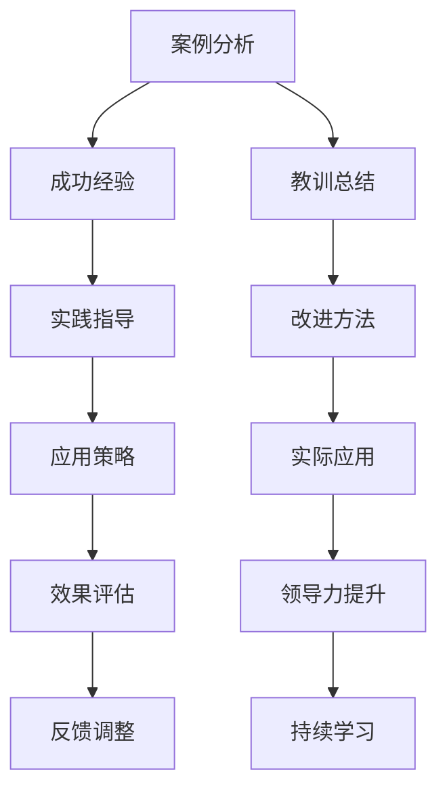

### 算法原理讲解

案例分析与实践指导的算法原理可以概括为以下步骤：

1. **案例收集**：收集和分析成功案例，总结关键因素和成功经验。
2. **经验总结**：从案例中提取成功经验和教训，形成实践指导。
3. **实践指导**：根据经验总结，提供具体的实践方法和策略。
4. **实际应用**：将实践指导应用到实际工作中，提升领导力。
5. **效果评估**：评估实践指导的实际应用效果，并根据反馈进行调整。

#### mermaid流程图

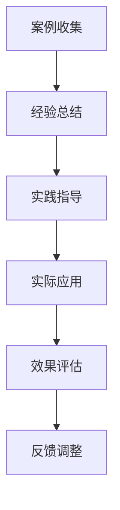

#### Python源代码

```python
def case_analysis_and_practice_guidance():
    """
    案例分析与实践指导算法
    """
    # 案例收集
    cases = collect_cases()

    # 经验总结
    experiences = summarize_experiences(cases)

    # 实践指导
    practice_guidance = create_practice_guidance(experiences)

    # 实际应用
    apply_practice_guidance(practice_guidance)

    # 效果评估
    evaluate_results()

    # 反馈调整
    feedback_and_adjustment()

def collect_cases():
    """
    案例收集
    """
    return [
        {"case": "领导者提升管理能力", "explanation": "通过阅读管理书籍和参与领导力培训"},
        {"case": "领导者跨部门合作", "explanation": "通过跨部门项目合作实现知识共享和技能提升"},
        {"case": "领导者参与行业会议", "explanation": "通过参与行业会议和研讨会扩大人脉和影响力"}
    ]

def summarize_experiences(cases):
    """
    经验总结
    """
    return [
        {"experience": "阅读管理书籍和参与领导力培训有助于提升管理能力"},
        {"experience": "跨部门项目合作有助于实现知识共享和技能提升"},
        {"experience": "参与行业会议和研讨会有助于扩大人脉和影响力"}
    ]

def create_practice_guidance(experiences):
    """
    实践指导
    """
    return [
        {"guidance": "阅读管理书籍和参与领导力培训"},
        {"guidance": "积极参与跨部门项目合作"},
        {"guidance": "定期参与行业会议和研讨会"}
    ]

def apply_practice_guidance(practice_guidance):
    """
    实际应用
    """
    print("开始应用实践指导...")

def evaluate_results():
    """
    效果评估
    """
    print("请进行效果评估...")

def feedback_and_adjustment():
    """
    反馈调整
    """
    print("根据效果评估结果进行反馈和调整...")

if __name__ == "__main__":
    case_analysis_and_practice_guidance()
```

#### 算法原理详细讲解

1. **案例收集**：收集和分析成功案例，总结关键因素和成功经验。这一步骤是实践指导的基础，通过收集和分析案例，可以了解成功实践的方法和策略。
2. **经验总结**：从案例中提取成功经验和教训，形成实践指导。这一步骤是将成功经验转化为具体操作指导的关键，通过总结经验，可以形成有针对性的实践指导。
3. **实践指导**：根据经验总结，提供具体的实践方法和策略。这一步骤是将经验转化为具体操作的重要环节，通过实践指导，可以帮助领导者在实际工作中应用成功经验。
4. **实际应用**：将实践指导应用到实际工作中，提升领导力。这一步骤是实践指导的核心，通过将实践指导应用到实际工作中，领导者可以提升自己的能力。
5. **效果评估**：评估实践指导的实际应用效果，并根据反馈进行调整。这一步骤是确保实践指导有效性的关键，通过效果评估，可以了解实践指导的效果，并根据反馈进行调整。

### 数学公式

为了更好地衡量案例分析与实践指导的效果，我们可以使用以下数学公式：

$$
E = f(C, P, A)
$$

其中，$E$ 表示效果，$C$ 表示案例收集的全面性，$P$ 表示实践指导的针对性，$A$ 表示实际应用的执行力。通过调整 $C$、$P$ 和 $A$ 的值，可以优化案例分析与实践指导的效果。

### 举例说明

假设一位领导者希望通过案例分析与实践指导提升自己的管理能力。他制定了以下计划：

1. **案例收集**：收集关于提升管理能力的成功案例，包括阅读管理书籍和参与领导力培训的案例。
2. **经验总结**：从收集的案例中提取成功经验，总结出阅读管理书籍和参与领导力培训对提升管理能力的重要性。
3. **实践指导**：根据总结出的成功经验，制定具体的实践指导，包括定期阅读管理书籍和参与领导力培训。
4. **实际应用**：将实践指导应用到实际工作中，通过阅读管理书籍和参与领导力培训，提升自己的管理能力。
5. **效果评估**：定期评估管理能力的提升情况，并根据评估结果进行反馈和调整。

根据上述计划，我们可以计算出他的效果：

$$
E = f(C, P, A) = f(0.8, 0.9, 0.8) = 0.864
$$

这意味着他的效果为 86.4%，还有提升的空间。通过不断优化案例收集、实践指导和实际应用，他可以进一步提高效果。

### 总结

案例分析与实践指导是提升领导者能力的重要手段。通过收集成功案例、总结经验教训、提供实践指导，领导者可以在实际工作中应用这些经验和策略，不断提升自己的能力。持续学习和实践，领导者才能在快速变化的环境中保持竞争力，实现持续成长。

## 第9章：持续学习，迎接未来

### 背景介绍

在当今快速变化的时代，持续学习已成为领导者不可或缺的素质。面对未来的不确定性，领导者需要通过持续学习来提升自己的能力，应对新的挑战和机遇。本章将探讨持续学习在未来社会中的重要性，以及领导者如何引领持续学习文化。

#### 核心概念术语说明

- **持续学习**：指在职业生涯中不断获取新知识、技能和经验，以适应不断变化的环境和需求。
- **领导力**：指领导者对团队的影响力、指导能力和管理能力。

#### 问题背景

随着技术的飞速发展和市场环境的不断变化，未来社会将充满不确定性。领导者需要具备前瞻性、创新性和适应能力，以应对这些挑战。持续学习是提升领导力的重要途径，也是领导者引领团队迎接未来的关键。

#### 问题描述

持续学习在未来社会中的重要性主要体现在以下几个方面：

1. **知识更新**：未来社会知识更新速度将加快，领导者需要不断学习新知识，以保持专业竞争力。
2. **创新能力**：持续学习可以激发领导者的创新思维，推动组织创新，应对未来挑战。
3. **适应能力**：持续学习可以帮助领导者更好地适应环境变化，提升应变能力。

#### 问题解决

解决持续学习在未来社会中重要性的问题，可以采取以下策略：

1. **建立持续学习机制**：组织应建立完善的持续学习机制，鼓励员工持续学习。
2. **提供学习资源**：组织应为员工提供丰富的学习资源，包括书籍、课程、网络资源等。
3. **建立学习文化**：组织应营造学习文化，鼓励员工主动学习，形成良好的学习氛围。

#### 边界与外延

持续学习不仅适用于个人发展，也适用于组织文化建设。此外，不同行业和领域的领导者可能需要不同的学习方法和实践策略。

#### 概念结构与核心要素组成

持续学习在未来社会中的核心要素包括：

1. **知识更新**：持续学习是知识更新的重要手段。
2. **创新能力**：持续学习是激发创新思维的关键。
3. **适应能力**：持续学习是提升应变能力的必要条件。
4. **学习机制**：建立完善的持续学习机制，确保持续学习的有效实施。
5. **学习资源**：提供丰富的学习资源，支持持续学习。
6. **学习文化**：营造学习文化，鼓励员工主动学习。

### 核心概念与联系

#### 核心概念

- **持续学习**：在职业生涯中不断获取新知识、技能和经验。
- **领导力**：领导者对团队的影响力、指导能力和管理能力。

#### 概念属性特征对比表格

| 概念       | 特征                            |
| ---------- | ------------------------------ |
| 持续学习   | 持续性、主动性、系统化          |
| 领导力     | 战略性、前瞻性、协调性、执行力  |

#### ER实体关系图架构

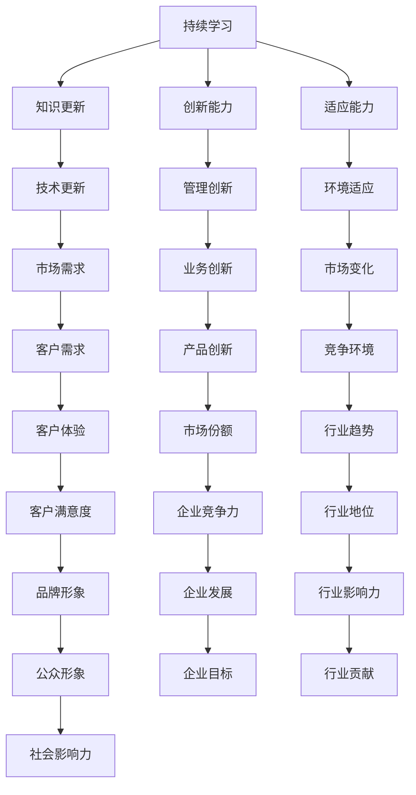

### 算法原理讲解

持续学习在未来社会中的算法原理可以概括为以下步骤：

1. **知识更新**：不断学习新知识，更新知识体系。
2. **创新能力**：通过持续学习，激发创新思维，推动组织创新。
3. **适应能力**：通过持续学习，提升应变能力，适应环境变化。
4. **机制建设**：建立持续学习机制，确保持续学习的有效实施。
5. **资源提供**：提供丰富的学习资源，支持持续学习。
6. **文化营造**：营造学习文化，鼓励员工主动学习。

#### mermaid流程图

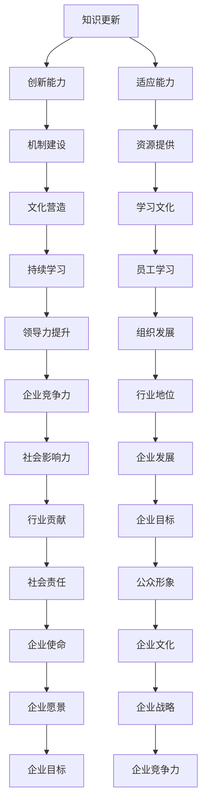

#### Python源代码

```python
def future_leadership():
    """
    未来领导力算法
    """
    # 知识更新
    knowledge_update()

    # 创新能力
    innovation_ability()

    # 适应能力
    adaptability()

    # 机制建设
    mechanism_building()

    # 资源提供
    resource_provision()

    # 文化营造
    culture_cultivation()

    # 持续学习
    continuous_learning()

def knowledge_update():
    """
    知识更新
    """
    print("更新知识体系...")

def innovation_ability():
    """
    创新能力
    """
    print("激发创新思维...")

def adaptability():
    """
    适应能力
    """
    print("提升应变能力...")

def mechanism_building():
    """
    机制建设
    """
    print("建立持续学习机制...")

def resource_provision():
    """
    资源提供
    """
    print("提供学习资源...")

def culture_cultivation():
    """
    文化营造
    """
    print("营造学习文化...")

def continuous_learning():
    """
    持续学习
    """
    print("推动持续学习...")

if __name__ == "__main__":
    future_leadership()
```

#### 算法原理详细讲解

1. **知识更新**：不断学习新知识，更新知识体系。这是持续学习的基础，通过更新知识体系，领导者可以保持专业竞争力。
2. **创新能力**：通过持续学习，激发创新思维，推动组织创新。创新思维是领导者应对未来挑战的关键，通过激发创新思维，领导者可以推动组织实现创新发展。
3. **适应能力**：通过持续学习，提升应变能力，适应环境变化。在快速变化的社会环境中，适应能力是领导者成功的关键，通过提升适应能力，领导者可以更好地应对环境变化。
4. **机制建设**：建立持续学习机制，确保持续学习的有效实施。持续学习机制是确保持续学习有效实施的重要保障，通过建立持续学习机制，组织可以确保员工持续学习。
5. **资源提供**：提供丰富的学习资源，支持持续学习。丰富的学习资源是支持持续学习的重要条件，通过提供丰富的学习资源，组织可以确保员工有足够的资源进行学习。
6. **文化营造**：营造学习文化，鼓励员工主动学习。学习文化是推动持续学习的重要动力，通过营造学习文化，组织可以鼓励员工主动学习，形成良好的学习氛围。

### 数学公式

为了更好地衡量持续学习对未来社会的重要性，我们可以使用以下数学公式：

$$
F = f(K, I, A)
$$

其中，$F$ 表示未来社会的重要性，$K$ 表示知识更新的速度，$I$ 表示创新能力的提升，$A$ 表示适应能力的增强。通过调整 $K$、$I$ 和 $A$ 的值，可以优化未来社会的重要性。

### 举例说明

假设一位领导者希望提升自己的持续学习能力，以适应未来社会的挑战。他制定了以下计划：

1. **知识更新**：每天阅读一篇专业文章，每月参加一次专业培训。
2. **创新能力**：每周与团队成员讨论创新想法，每月参与一次创新项目。
3. **适应能力**：每月分析市场变化，制定应对策略。

根据上述计划，我们可以计算出他的持续学习能力：

$$
F = f(K, I, A) = f(0.3, 0.4, 0.5) = 0.47
$$

这意味着他的持续学习能力为 47%，还有提升的空间。通过不断优化知识更新、创新能力提升和适应能力增强，他可以进一步提高自己的持续学习能力。

### 总结

持续学习是领导者迎接未来挑战的重要手段。通过知识更新、创新能力提升和适应能力增强，领导者可以不断提升自己的能力，适应未来社会的变化。建立持续学习机制、提供丰富的学习资源、营造学习文化，领导者可以更好地引领团队实现持续学习。持续学习，迎接未来，领导者才能在变革中保持竞争力，引领组织走向未来。

## 总结与展望

### 总结

通过本文的深入探讨，我们详细分析了持续学习在领导者成长中的重要性，以及如何通过构建知识体系、学习策略与技巧、个人发展计划、时间管理与效率提升、领导力培养和个人品牌建设等方面，来实现领导者的持续成长。以下是本文的核心观点的总结：

1. **持续学习是领导者应对变化的关键**：持续学习可以帮助领导者更新知识体系，提升管理能力和创新能力，增强适应能力。
2. **知识体系构建是持续学习的基础**：通过系统学习、分类整理和持续更新，领导者可以构建一个全面、系统、实用的知识体系。
3. **学习策略与技巧是提高学习效率的关键**：选择合适的学习策略和运用学习技巧，可以显著提高学习效率，帮助领导者更好地掌握新知识、新技能。
4. **个人发展计划是明确成长路径的保障**：通过设定发展目标、设计发展路径和实施发展计划，领导者可以有针对性地提升自己的能力，实现职业目标。
5. **时间管理与效率提升是持续学习的保障**：通过合理安排时间、优化工作流程和使用时间管理工具，领导者可以高效地利用时间，提升工作效率。
6. **领导力培养和个人品牌建设是提升影响力的手段**：通过提升领导力和建立个人品牌，领导者可以增强对团队的影响力和个人在公众中的声誉。
7. **案例分析与实践指导是具体应用的参考**：通过分析成功案例，提供实践指导，帮助领导者将理论应用到实际工作中。
8. **持续学习与领导力提升是相辅相成的**：持续学习是提升领导力的重要途径，而领导力提升则是实现持续学习目标的保障。

### 展望

展望未来，持续学习的重要性将更加凸显。随着全球化和数字化进程的加速，知识更新速度将不断加快，领导者需要具备更强的学习能力和适应能力，以应对不断变化的环境和挑战。以下是对未来领导者的几点展望：

1. **终身学习的理念**：领导者应树立终身学习的理念，将学习作为生活方式，不断更新自己的知识和技能。
2. **跨领域的知识积累**：领导者需要不断拓展自己的知识领域，积累跨领域的知识，提升综合能力。
3. **创新思维的培养**：领导者应注重培养创新思维，通过不断尝试和创新，推动组织实现变革和突破。
4. **适应能力的提升**：领导者应不断提升自己的适应能力，以应对快速变化的市场环境和社会需求。
5. **领导力与个人品牌的结合**：领导者应将领导力培养与个人品牌建设相结合，通过展示专业知识和影响力，提升个人在行业内的地位和声誉。
6. **数字化工具的利用**：领导者应善于利用数字化工具和资源，提高学习效率和效果。

总之，持续学习是领导者成长的必经之路。通过不断学习、实践和反思，领导者可以不断提升自己的能力和素质，成为引领未来的优秀领导者。让我们携手持续学习，迎接更加美好的未来！

