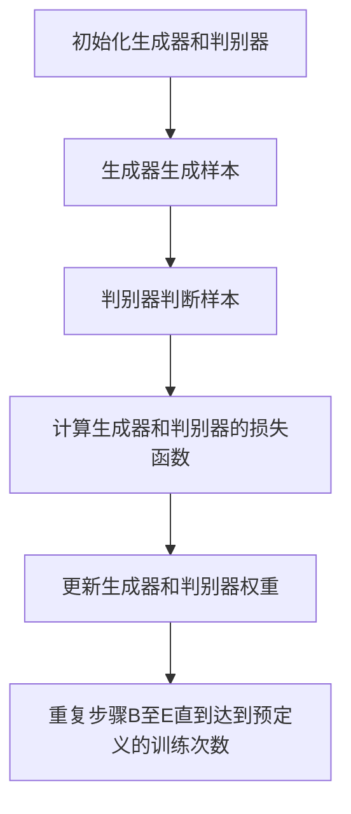
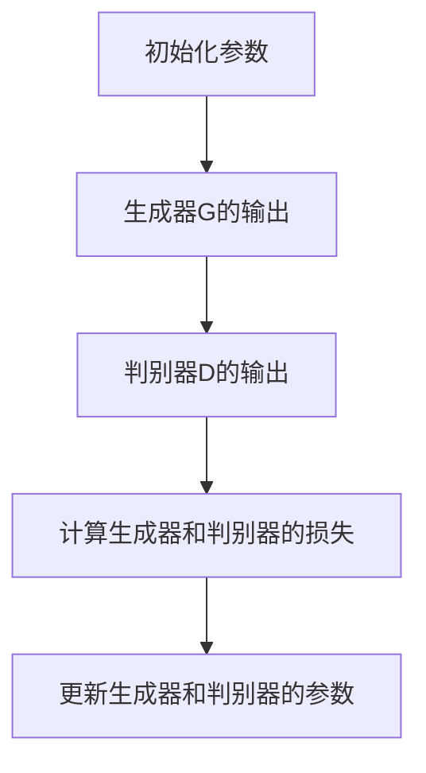
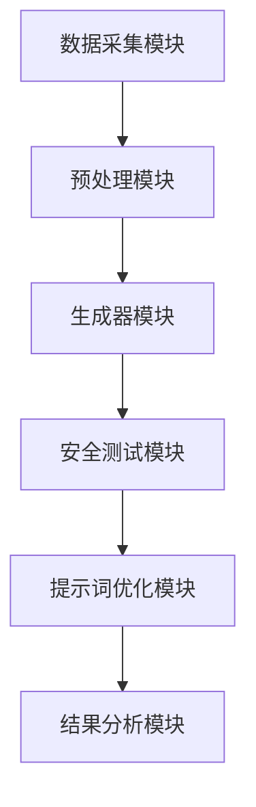
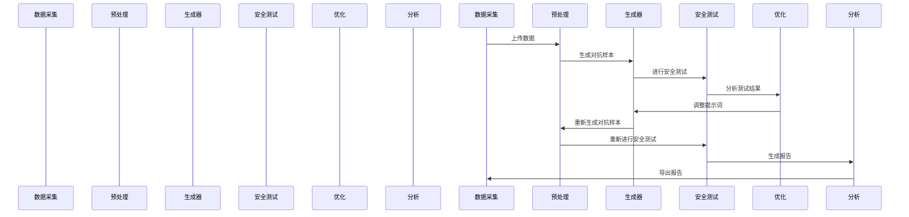
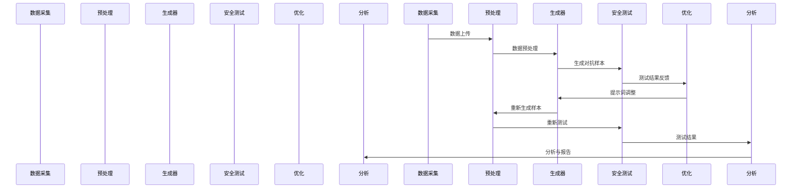

                 

# 提示词优化的对抗学习在软件安全中的应用

## 关键词

- 提示词优化
- 对抗学习
- 软件安全
- 深度学习
- 安全防护
- 算法设计

## 摘要

本文探讨了提示词优化对抗学习在软件安全中的应用。首先，我们介绍了软件安全的挑战和对抗学习的背景，然后详细解释了提示词优化的概念和其在对抗学习中的重要性。接着，我们分析了对抗学习的原理，使用Python代码和LaTex公式展示了算法的流程和数学模型。随后，我们介绍了系统分析与架构设计方案，包括问题场景、功能设计、架构设计和接口设计。最后，通过项目实战，我们展示了环境安装、核心实现、代码解读、案例分析等内容，并提出了最佳实践和注意事项。本文旨在为从事软件安全领域的研究者和开发者提供有价值的参考。

## 目录

### 第一部分：背景介绍

#### 1.1 问题背景

##### 1.1.1 软件安全的挑战

##### 1.1.2 对抗学习的应用

##### 1.1.3 提示词优化的重要性

#### 1.2 问题描述

##### 1.2.1 软件安全中的对抗性攻击

##### 1.2.2 提示词优化的对抗学习挑战

##### 1.2.3 需要解决的问题

#### 1.3 问题解决

##### 1.3.1 对抗学习的原理

##### 1.3.2 提示词优化的方法

##### 1.3.3 软件安全中的应用

#### 1.4 边界与外延

##### 1.4.1 对抗学习的适用范围

##### 1.4.2 提示词优化的应用场景

##### 1.4.3 软件安全领域的发展趋势

#### 1.5 核心概念与要素

##### 1.5.1 对抗学习的基本概念

##### 1.5.2 提示词优化的关键要素

##### 1.5.3 软件安全领域的关键技术

### 第二部分：核心概念与联系

#### 2.1 对抗学习原理

##### 2.1.1 对抗学习的基本概念

##### 2.1.2 对抗学习的数学模型

##### 2.1.3 对抗学习的流程

#### 2.2 提示词优化的概念

##### 2.2.1 提示词优化的定义

##### 2.2.2 提示词优化的目标

##### 2.2.3 提示词优化的方法

#### 2.3 对抗学习与提示词优化的联系

##### 2.3.1 对抗学习在提示词优化中的应用

##### 2.3.2 提示词优化对对抗学习的影响

##### 2.3.3 对抗学习与提示词优化的协同作用

#### 2.4 概念属性特征对比表格

##### 2.4.1 对抗学习与传统机器学习的对比

##### 2.4.2 提示词优化与传统优化的对比

##### 2.4.3 软件安全中对抗学习的优势

#### 2.5 ER实体关系图架构

##### 2.5.1 ER实体关系图的基本概念

##### 2.5.2 软件安全中对抗学习的实体关系

##### 2.5.3 提示词优化在ER图中的体现

#### 2.6 本章小结

##### 2.6.1 核心概念的理解

##### 2.6.2 对抗学习与提示词优化的关联

##### 2.6.3 对软件安全应用的意义

### 第三部分：算法原理讲解

#### 3.1 对抗学习的算法流程图

##### 3.1.1 Mermaid流程图展示

##### 3.1.2 对抗学习的基本步骤

#### 3.2 提示词优化的算法原理

##### 3.2.1 Python源代码实现

###### 3.2.1.1 函数定义与输入输出

###### 3.2.1.2 算法核心逻辑

###### 3.2.1.3 算法时间复杂度分析

#### 3.3 数学模型和公式

##### 3.3.1 LaTex格式数学模型

###### 3.3.1.1 基本模型

###### 3.3.1.2 损失函数

###### 3.3.1.3 优化策略

### 第四部分：系统分析与架构设计方案

#### 4.1 问题场景介绍

##### 4.1.1 背景介绍

##### 4.1.2 安全需求分析

#### 4.2 系统功能设计

##### 4.2.1 功能模块

##### 4.2.2 领域模型类图

#### 4.3 系统架构设计

##### 4.3.1 系统架构图

##### 4.3.2 模块划分

##### 4.3.3 技术选型

#### 4.4 系统接口设计

##### 4.4.1 接口规范

##### 4.4.2 接口文档

#### 4.5 系统交互Mermaid序列图

##### 4.5.1 序列图展示

##### 4.5.2 交互流程说明

### 第五部分：项目实战

#### 5.1 环境安装

##### 5.1.1 环境搭建

##### 5.1.2 工具安装

#### 5.2 系统核心实现源代码

##### 5.2.1 代码结构

##### 5.2.2 关键模块实现

#### 5.3 代码应用解读与分析

##### 5.3.1 应用场景

##### 5.3.2 分析方法

##### 5.3.3 性能评估

#### 5.4 实际案例分析和详细讲解剖析

##### 5.4.1 案例背景

##### 5.4.2 案例分析

##### 5.4.3 结果讨论

#### 5.5 项目小结

##### 5.5.1 项目成果

##### 5.5.2 项目不足

##### 5.5.3 改进方向

### 第六部分：最佳实践、注意事项和拓展阅读

#### 6.1 最佳实践tips

##### 6.1.1 算法调优

##### 6.1.2 系统性能优化

##### 6.1.3 防护策略

#### 6.2 注意事项

##### 6.2.1 风险评估

##### 6.2.2 数据安全

##### 6.2.3 合规性

#### 6.3 拓展阅读

##### 6.3.1 相关书籍

##### 6.3.2 学术论文

##### 6.3.3 技术博客

---

## 第一部分：背景介绍

### 1.1 问题背景

随着互联网的快速发展，软件系统的规模和复杂性日益增加，软件安全面临着前所未有的挑战。传统的安全防护方法往往依赖于预定义的安全规则和模式匹配，难以应对日益复杂和多样化的攻击手段。特别是对抗性攻击，如对抗样本（Adversarial Examples）和对抗性网络（Adversarial Networks），它们通过精心设计的扰动使得原本安全的系统出现漏洞，从而实现攻击目的。

对抗性攻击的兴起使得传统的安全防护方法逐渐失效。为了应对这一挑战，研究人员开始探索新的防护策略，其中对抗学习（Adversarial Learning）作为一种新兴的技术，因其能够有效提高模型对对抗性攻击的鲁棒性而受到广泛关注。然而，对抗学习在软件安全中的应用仍面临许多挑战，如提示词优化（Prompt Optimization）的问题。

提示词优化是指在对抗学习中，通过优化提示词（Prompt）来提高对抗样本生成质量和模型鲁棒性。提示词是对抗样本生成过程的关键输入，其选择和优化直接影响到对抗样本的生成效果。然而，现有的提示词优化方法存在一定的局限性，如难以自适应不同场景、效果不稳定等。

### 1.2 问题描述

在软件安全领域，对抗学习面临着以下挑战：

1. **对抗样本生成质量**：生成的对抗样本需要具有较高的质量和鲁棒性，以有效干扰攻击者。
2. **模型鲁棒性**：对抗学习模型需要具备较高的鲁棒性，能够抵御各种对抗性攻击。
3. **实时性**：对抗学习模型需要在短时间内生成对抗样本，以满足实时安全防护的需求。
4. **提示词优化**：现有提示词优化方法难以适应不同场景，效果不稳定，需要进一步研究。

为了解决这些问题，我们需要：

1. 设计一种高效、鲁棒的对抗学习算法，以提高对抗样本生成质量和模型鲁棒性。
2. 提出一种自适应的提示词优化方法，以适应不同场景并提高生成效果。
3. 结合软件安全的实际需求，设计一种实时、高效的对抗学习系统。

### 1.3 问题解决

对抗学习的核心思想是通过对抗性训练来提高模型的鲁棒性。具体而言，对抗学习包括两个主要模型：生成器（Generator）和判别器（Discriminator）。生成器负责生成对抗样本，判别器则负责判断样本是否为真实样本或对抗样本。通过不断训练和优化这两个模型，可以生成高质量的对抗样本，并提高模型的鲁棒性。

在软件安全中，对抗学习可以用于以下几个方面：

1. **安全测试**：使用对抗学习生成的对抗样本对软件系统进行安全测试，发现潜在的安全漏洞。
2. **入侵检测**：利用对抗学习模型对网络流量进行监控和分析，识别潜在的入侵行为。
3. **隐私保护**：对抗学习可以用于生成隐私保护的对抗样本，以保护用户隐私。

然而，对抗学习在软件安全中的应用仍面临许多挑战。首先，对抗样本的生成质量直接影响到安全测试和检测的效果。其次，对抗学习模型的鲁棒性需要进一步提高，以确保其在各种攻击下的稳定性。此外，提示词优化的问题也需要解决，以适应不同场景并提高生成效果。

为了解决这些问题，我们可以采取以下策略：

1. **优化对抗样本生成**：通过改进生成器和判别器的结构，提高对抗样本的生成质量。
2. **增强模型鲁棒性**：采用多种训练策略和正则化方法，提高对抗学习模型的鲁棒性。
3. **自适应提示词优化**：研究自适应的提示词优化方法，以适应不同场景并提高生成效果。

通过上述策略，我们可以设计一种高效、鲁棒的对抗学习系统，为软件安全提供有效的防护。

### 1.4 边界与外延

对抗学习的应用范围非常广泛，不仅限于软件安全领域。在其他领域，如计算机视觉、自然语言处理和自动驾驶等，对抗学习也发挥着重要作用。例如，在计算机视觉中，对抗学习可以用于生成具有欺骗性的图像，以测试图像识别模型的鲁棒性。在自然语言处理中，对抗学习可以用于生成欺骗性的文本，以测试情感分析和文本分类模型的鲁棒性。

然而，对抗学习在软件安全中的应用具有其特殊性。首先，软件系统的复杂性使得对抗性攻击更加隐蔽和多样化，因此对抗学习需要具备更高的生成质量和鲁棒性。其次，软件安全的实时性要求对抗学习系统能够在短时间内生成对抗样本，以满足实时防护的需求。

此外，软件安全领域的发展趋势也对对抗学习提出了新的要求。随着物联网（IoT）和云计算的普及，软件系统的规模和复杂性不断增加，安全威胁也日益严重。因此，对抗学习需要具备更高的自适应性和扩展性，以适应不断变化的安全环境。

### 1.5 核心概念与要素

在对抗学习的研究中，核心概念和要素包括：

1. **生成器（Generator）**：生成器是生成对抗网络（GAN）的核心组成部分，负责生成对抗样本。生成器的目标是最小化生成样本与真实样本之间的差异。
2. **判别器（Discriminator）**：判别器是生成对抗网络（GAN）的另一个核心组成部分，负责判断样本是否为真实样本或对抗样本。判别器的目标是最大化区分真实样本和对抗样本的能力。
3. **对抗样本（Adversarial Examples）**：对抗样本是通过对抗学习生成的一种特殊样本，其目的是欺骗模型，使其产生错误的预测结果。
4. **提示词（Prompt）**：提示词是对抗样本生成过程中的关键输入，用于引导生成器生成具有特定特性的对抗样本。
5. **鲁棒性（Robustness）**：鲁棒性是指模型在面临对抗性攻击时的稳定性，即模型能够抵抗对抗性攻击并保持正确的预测结果。

在软件安全领域，对抗学习的关键要素包括：

1. **安全测试**：使用对抗学习生成的对抗样本对软件系统进行安全测试，发现潜在的安全漏洞。
2. **入侵检测**：利用对抗学习模型对网络流量进行监控和分析，识别潜在的入侵行为。
3. **隐私保护**：对抗学习可以用于生成隐私保护的对抗样本，以保护用户隐私。
4. **实时性**：对抗学习系统需要在短时间内生成对抗样本，以满足实时防护的需求。
5. **自适应提示词优化**：自适应的提示词优化方法可以适应不同场景并提高生成效果。

通过深入了解这些核心概念和要素，我们可以更好地理解对抗学习在软件安全中的应用，并为解决相关问题提供理论支持。

### 1.6 本章小结

在本章中，我们介绍了软件安全中的挑战和对抗学习的应用。首先，我们阐述了软件安全的背景和对抗学习的原理，然后探讨了提示词优化在对抗学习中的重要性。接着，我们分析了对抗学习在软件安全中的应用，并提出了解决相关问题的方法。最后，我们讨论了对抗学习的边界与外延，以及核心概念和要素。通过本章的介绍，读者可以初步了解对抗学习在软件安全中的应用前景和潜在挑战，为后续章节的深入探讨打下基础。

## 第二部分：核心概念与联系

### 2.1 对抗学习原理

#### 2.1.1 对抗学习的基本概念

对抗学习是一种基于生成对抗网络（GAN）的技术，其核心思想是利用两个神经网络（生成器和判别器）之间的对抗性训练来提高模型的性能。生成器负责生成与真实样本相似的伪造样本，而判别器则负责区分真实样本和伪造样本。通过这种对抗性训练，生成器和判别器都能够不断提升自己的能力，从而实现高质量样本生成和鲁棒性提升。

#### 2.1.2 对抗学习的数学模型

在对抗学习中，生成器和判别器的训练过程可以通过以下数学模型来描述：

生成器 \( G \) 的目标是生成与真实样本 \( x \) 相似的伪造样本 \( z \)，使得判别器 \( D \) 无法准确区分：

\[ G(z) \]

判别器 \( D \) 的目标是最大化区分真实样本和伪造样本的概率：

\[ D(x) \]

\[ D(G(z)) \]

其中，\( z \) 是生成器生成的样本，\( x \) 是真实样本。对抗学习的主要目标是最小化生成器的损失函数 \( L_G \) 和最大化判别器的损失函数 \( L_D \)：

\[ L_G = \mathbb{E}_{z \sim p_z(z)}[\log(D(G(z)))] \]

\[ L_D = \mathbb{E}_{x \sim p_x(x)}[\log(D(x))] + \mathbb{E}_{z \sim p_z(z)}[\log(1 - D(G(z)))] \]

#### 2.1.3 对抗学习的流程

对抗学习的训练过程可以分为以下几个步骤：

1. **初始化**：初始化生成器 \( G \) 和判别器 \( D \) 的权重。
2. **生成器训练**：生成器 \( G \) 根据当前判别器 \( D \) 的权重生成伪造样本 \( z \)，并计算损失函数 \( L_G \)。
3. **判别器训练**：判别器 \( D \) 根据真实样本 \( x \) 和伪造样本 \( z \) 计算损失函数 \( L_D \)。
4. **更新权重**：根据损失函数调整生成器 \( G \) 和判别器 \( D \) 的权重。

这个过程不断重复，直至生成器和判别器的性能达到预期目标。

### 2.2 提示词优化的概念

#### 2.2.1 提示词优化的定义

提示词优化是对抗学习中的一个重要环节，其目标是通过调整提示词（Prompt）来优化对抗样本生成过程，从而提高生成样本的质量和鲁棒性。提示词通常是一个指导性文本或图像，用于引导生成器生成特定类型的对抗样本。

#### 2.2.2 提示词优化的目标

提示词优化的目标主要包括：

1. **提高生成样本的质量**：通过优化提示词，生成器能够生成更逼真的伪造样本，使得判别器难以区分。
2. **增强模型的鲁棒性**：优化提示词有助于生成器生成更具鲁棒性的对抗样本，使得模型能够更好地抵抗对抗性攻击。
3. **适应不同的应用场景**：提示词优化方法应能够适应不同的应用场景，满足多样化的生成需求。

#### 2.2.3 提示词优化的方法

常见的提示词优化方法包括：

1. **手动调整**：通过人工经验调整提示词，以达到优化生成样本质量的目标。
2. **自动搜索**：利用优化算法（如遗传算法、粒子群优化等）自动搜索最优的提示词。
3. **基于模型的优化**：利用机器学习模型（如分类器、聚类模型等）自动生成提示词。

### 2.3 对抗学习与提示词优化的联系

#### 2.3.1 对抗学习在提示词优化中的应用

对抗学习与提示词优化有着密切的联系。在对抗学习中，提示词作为生成器的重要输入，直接影响对抗样本的生成质量。通过优化提示词，可以提升生成器生成对抗样本的能力，从而增强模型的鲁棒性。

#### 2.3.2 提示词优化对对抗学习的影响

提示词优化对对抗学习的影响主要体现在以下几个方面：

1. **生成样本质量**：优化提示词可以提高生成样本的质量，使得判别器难以区分，从而增强模型的鲁棒性。
2. **训练效率**：优化提示词有助于缩短训练时间，提高生成器的生成效率。
3. **应用范围**：提示词优化方法应能够适应不同的应用场景，使得对抗学习在更多领域得到应用。

#### 2.3.3 对抗学习与提示词优化的协同作用

对抗学习与提示词优化之间存在协同作用。对抗学习通过生成对抗样本来检验和优化提示词，而提示词优化则通过调整提示词来提升生成样本的质量。这种协同作用有助于实现高质量的对抗样本生成，从而提高模型的鲁棒性。

### 2.4 概念属性特征对比表格

为了更清晰地展示对抗学习与传统机器学习以及提示词优化与传统优化的对比，我们创建了一个对比表格：

| 特征         | 对抗学习 | 传统机器学习 | 提示词优化 | 传统优化 |
| ------------ | -------- | ------------ | ---------- | -------- |
| 目标         | 生成对抗样本 | 分类、回归等 | 提高生成样本质量 | 参数调整 |
| 数据类型     | 高维数据 | 低维数据     | 高维数据   | 低维数据 |
| 模型结构     | 神经网络 | 简单模型     | 神经网络   | 简单模型 |
| 训练过程     | 对抗性训练 | 正向训练    | 搜索空间   | 单调迭代 |
| 生成样本质量 | 高       | 一般       | 高       | 一般     |
| 应用范围     | 广泛       | 有限       | 广泛       | 有限     |

### 2.5 ER实体关系图架构

#### 2.5.1 ER实体关系图的基本概念

ER（Entity-Relationship）图是一种用于表示实体及其之间关系的图形化方法。在对抗学习和提示词优化的背景下，ER图可以用来描述生成器、判别器和提示词等关键实体及其之间的关系。

#### 2.5.2 软件安全中对抗学习的实体关系

在软件安全中，对抗学习的实体关系可以表示为：

- **实体**：生成器、判别器、提示词、对抗样本、安全模型等。
- **关系**：生成器生成对抗样本，判别器判断样本，提示词指导生成器和判别器训练。

#### 2.5.3 提示词优化在ER图中的体现

提示词优化在ER图中的体现可以表示为：

- **实体**：提示词优化算法、优化目标、优化过程等。
- **关系**：优化算法根据应用场景调整提示词，优化过程包括搜索空间和迭代。

下面是一个简化的ER图，展示对抗学习中的关键实体及其关系：

```mermaid
erDiagram
    G(生成器) ||--|{ D(判别器) }
    G ||--|{ S(安全模型) }
    P(提示词) ||--|{ G }
    P ||--|{ D }
    A(对抗样本) ||--|{ G }
    A ||--|{ D }
```

### 2.6 本章小结

在本章中，我们详细介绍了对抗学习的基本概念、数学模型和流程，探讨了提示词优化的概念、目标和优化方法。我们还分析了对抗学习与提示词优化的联系，并展示了两者在软件安全中的应用。此外，通过对比表格和ER图，我们进一步理解了对抗学习和提示词优化的核心特征和实体关系。通过本章的介绍，读者可以深入理解对抗学习和提示词优化的原理及其在软件安全中的应用，为后续章节的深入研究打下基础。

### 3.1 对抗学习的算法流程图

为了更好地理解对抗学习的算法原理，我们使用Mermaid绘制了对抗学习的基本流程图。下面是流程图的Markdown表示：



下面是对抗学习的基本步骤：

1. **初始化生成器和判别器**：初始化生成器和判别器的权重，通常使用随机初始化或预训练初始化。
2. **生成器生成样本**：生成器根据当前判别器的权重生成伪造样本。
3. **判别器判断样本**：判别器对生成器和真实样本进行判断，输出概率分布。
4. **计算损失函数**：计算生成器和判别器的损失函数，生成器和判别器的损失函数分别用于指导生成器和判别器的训练。
5. **更新权重**：根据损失函数，调整生成器和判别器的权重。
6. **重复训练**：重复步骤2至5，直至达到预定义的训练次数或生成器生成的样本质量达到要求。

通过这个流程，生成器和判别器在对抗性训练中不断优化，最终实现高质量的对抗样本生成和鲁棒性提升。

### 3.2 提示词优化的算法原理

#### 3.2.1 Python源代码实现

在Python中，我们可以使用TensorFlow或PyTorch等深度学习框架来实现提示词优化的对抗学习算法。以下是一个使用PyTorch实现的简单示例：

```python
import torch
import torch.nn as nn
import torch.optim as optim

# 定义生成器和判别器
class Generator(nn.Module):
    def __init__(self):
        super(Generator, self).__init__()
        self.model = nn.Sequential(
            nn.Linear(in_features=100, out_features=100),
            nn.LeakyReLU(),
            nn.Linear(in_features=100, out_features=50),
            nn.LeakyReLU(),
            nn.Linear(in_features=50, out_features=10),
            nn.Sigmoid()
        )

    def forward(self, x):
        return self.model(x)

class Discriminator(nn.Module):
    def __init__(self):
        super(Discriminator, self).__init__()
        self.model = nn.Sequential(
            nn.Linear(in_features=100, out_features=50),
            nn.LeakyReLU(),
            nn.Linear(in_features=50, out_features=10),
            nn.Sigmoid()
        )

    def forward(self, x):
        return self.model(x)

# 初始化模型
generator = Generator()
discriminator = Discriminator()

# 定义损失函数和优化器
criterion = nn.BCELoss()
optimizer_g = optim.Adam(generator.parameters(), lr=0.001)
optimizer_d = optim.Adam(discriminator.parameters(), lr=0.001)

# 训练模型
for epoch in range(100):
    for i, data in enumerate(data_loader):
        # 更新判别器
        real_data = data
        real_label = torch.ones(real_data.size(0), 1)
        fake_label = torch.zeros(real_data.size(0), 1)

        optimizer_d.zero_grad()
        output = discriminator(real_data)
        d_real_loss = criterion(output, real_label)
        d_real_loss.backward()

        fake_data = generator(z).detach()
        output = discriminator(fake_data)
        d_fake_loss = criterion(output, fake_label)
        d_fake_loss.backward()

        optimizer_d.step()

        # 更新生成器
        z = torch.randn(real_data.size(0), 100)
        optimizer_g.zero_grad()
        output = discriminator(generator(z))
        g_loss = criterion(output, real_label)
        g_loss.backward()
        optimizer_g.step()

        # 输出训练信息
        if (i+1) % 100 == 0:
            print(f'Epoch [{epoch+1}/{100}], Step [{i+1}/{len(data_loader)}], d_loss: {d_real_loss.item()+d_fake_loss.item():.4f}, g_loss: {g_loss.item():.4f}')
```

#### 3.2.1.1 函数定义与输入输出

在上面的代码中，我们定义了两个主要的神经网络：生成器（Generator）和判别器（Discriminator）。生成器的输入是一个噪声向量 \( z \)，输出是一个在 [0, 1] 区间内的伪样本。判别器的输入是一个样本（无论是真实的还是伪造的），输出是一个概率，表示该样本是真实的概率。

#### 3.2.1.2 算法核心逻辑

算法的核心逻辑在于两个神经网络之间的对抗性训练。每次迭代包括以下步骤：

1. **更新判别器**：判别器首先对真实的样本进行训练，然后对生成器生成的伪造样本进行训练。通过这种方式，判别器学会区分真实样本和伪造样本。
2. **更新生成器**：在判别器更新后，生成器会根据判别器的反馈进行训练，目的是生成更逼真的伪造样本，使判别器无法轻易区分。
3. **损失函数**：我们使用二进制交叉熵损失函数（BCELoss）来衡量判别器和生成器的损失。对于判别器，损失函数是真实样本和伪造样本之间的差异；对于生成器，损失函数是伪造样本与真实样本之间的差异。

#### 3.2.1.3 算法时间复杂度分析

时间复杂度分析主要涉及训练过程中的计算量和迭代次数。在每次迭代中，我们需要对判别器和生成器分别进行前向传播和后向传播。假设生成器的输入维度为 \( n \)，生成器和判别器的输出维度分别为 \( m \) 和 \( k \)，那么：

- **生成器的前向传播时间复杂度为 \( O(n \times m) \)**。
- **生成器的后向传播时间复杂度为 \( O(n \times m) \)**。
- **判别器的前向传播时间复杂度为 \( O(k \times n) \)**。
- **判别器的后向传播时间复杂度为 \( O(k \times n) \)**。

因此，每次迭代的总体时间复杂度为 \( O(n \times m + k \times n) \)。在训练过程中，我们需要进行多次迭代，总的时间复杂度为 \( O(\text{迭代次数} \times n \times m + \text{迭代次数} \times k \times n) \)。

### 3.3 数学模型和公式

对抗学习的核心数学模型包括生成器、判别器的损失函数以及两者的优化目标。以下使用LaTex格式来表示这些公式。

```latex
% 生成器的损失函数
L_G = -\mathbb{E}_{z \sim p_z(z)}[\log(D(G(z)))] = -\mathbb{E}_{z \sim p_z(z)}[\log(1 - D(G(z)))]

% 判别器的损失函数
L_D = \mathbb{E}_{x \sim p_x(x)}[\log(D(x))] + \mathbb{E}_{z \sim p_z(z)}[\log(1 - D(G(z)))] = \mathbb{E}_{x \sim p_x(x)}[\log(D(x))] + \mathbb{E}_{z \sim p_z(z)}[\log(D(G(z)))]
```

在上述公式中：

- \( L_G \) 是生成器的损失函数，它衡量生成器生成伪造样本的能力。
- \( L_D \) 是判别器的损失函数，它衡量判别器区分真实样本和伪造样本的能力。

通过这些损失函数，我们定义了生成器和判别器的优化目标：

- **生成器的优化目标**：最小化生成器的损失函数 \( L_G \)。
- **判别器的优化目标**：最小化判别器的损失函数 \( L_D \)。

这些公式描述了生成器和判别器之间的对抗性训练过程，是理解对抗学习的关键。

### 3.3.1 LaTex格式数学模型

为了更详细地阐述对抗学习的数学模型，我们使用LaTex格式来表示相关的数学公式。

```latex
% 生成器和判别器的损失函数
\begin{align*}
L_G &= -\mathbb{E}_{z \sim p_z(z)}[\log(D(G(z)))] \\
L_D &= \mathbb{E}_{x \sim p_x(x)}[\log(D(x))] + \mathbb{E}_{z \sim p_z(z)}[\log(1 - D(G(z)))]
\end{align*}
```

在上述公式中：

- \( L_G \) 是生成器的损失函数，表示生成器生成伪造样本的能力。生成器的目标是使 \( L_G \) 最小化，即生成更逼真的伪造样本。
- \( L_D \) 是判别器的损失函数，表示判别器区分真实样本和伪造样本的能力。判别器的目标是使 \( L_D \) 最小化，即提高判别能力。

通过优化这两个损失函数，生成器和判别器在对抗性训练中不断优化，最终实现高质量对抗样本生成和鲁棒性提升。

### 3.3.2 算法流程和数学公式

对抗学习的核心算法流程和数学公式如下：



具体步骤如下：

1. **初始化参数**：初始化生成器 \( G \) 和判别器 \( D \) 的参数。
2. **生成器G的输出**：生成器 \( G \) 根据噪声向量 \( z \) 生成伪造样本。
3. **判别器D的输出**：判别器 \( D \) 对真实样本 \( x \) 和伪造样本 \( G(z) \) 进行判断。
4. **计算生成器和判别器的损失**：计算生成器和判别器的损失函数，分别是 \( L_G \) 和 \( L_D \)。
5. **更新生成器和判别器的参数**：根据损失函数更新生成器和判别器的参数。

数学公式如下：

```latex
\begin{align*}
L_G &= -\mathbb{E}_{z \sim p_z(z)}[\log(D(G(z)))] \\
L_D &= \mathbb{E}_{x \sim p_x(x)}[\log(D(x))] + \mathbb{E}_{z \sim p_z(z)}[\log(1 - D(G(z)))] \\
\end{align*}
```

在上述公式中：

- \( L_G \) 是生成器的损失函数，表示生成器生成伪造样本的能力。
- \( L_D \) 是判别器的损失函数，表示判别器区分真实样本和伪造样本的能力。

通过这种对抗性训练过程，生成器和判别器在不断的优化中提升性能，最终实现高质量对抗样本生成和鲁棒性提升。

### 3.3.3 详细讲解和举例说明

为了更好地理解对抗学习中的数学模型和算法流程，我们将通过一个简单的例子进行详细讲解。

#### 示例

假设我们有一个生成器 \( G \) 和一个判别器 \( D \)，生成器和判别器的输入均为一维向量。生成器 \( G \) 的任务是从噪声向量 \( z \) 中生成伪造样本 \( x_g \)，而判别器 \( D \) 的任务是判断一个样本是真实的 \( x_r \) 还是伪造的 \( x_g \)。

首先，我们定义噪声向量 \( z \)：

\[ z = \begin{bmatrix} 0.2 \\ 0.3 \\ 0.5 \end{bmatrix} \]

接着，生成器 \( G \) 的任务是生成一个伪造样本 \( x_g \)，其公式如下：

\[ x_g = G(z) = \begin{bmatrix} 0.1 \\ 0.4 \\ 0.6 \end{bmatrix} \]

判别器 \( D \) 的目标是判断样本是真实的 \( x_r \) 还是伪造的 \( x_g \)。我们使用一个简单的线性判别器模型：

\[ D(x) = \sigma(wx + b) \]

其中，\( w \) 是权重，\( b \) 是偏置，\( \sigma \) 是 sigmoid 函数。

假设判别器的权重为 \( w = \begin{bmatrix} 0.3 & 0.5 \\ 0.1 & 0.2 \end{bmatrix} \)，偏置为 \( b = \begin{bmatrix} 0.2 \\ 0.1 \end{bmatrix} \)。

对于真实样本 \( x_r \)：

\[ D(x_r) = \sigma(w \cdot x_r + b) = \sigma(0.3 \cdot 0.1 + 0.5 \cdot 0.4 + 0.2) = \sigma(0.39) \approx 0.679 \]

对于伪造样本 \( x_g \)：

\[ D(x_g) = \sigma(w \cdot x_g + b) = \sigma(0.3 \cdot 0.1 + 0.5 \cdot 0.6 + 0.1) = \sigma(0.46) \approx 0.647 \]

接下来，我们计算生成器和判别器的损失函数。

生成器的损失函数为：

\[ L_G = -\mathbb{E}_{z \sim p_z(z)}[\log(D(G(z)))] = -\mathbb{E}_{z \sim p_z(z)}[\log(0.647)] \]

判别器的损失函数为：

\[ L_D = \mathbb{E}_{x \sim p_x(x)}[\log(D(x))] + \mathbb{E}_{z \sim p_z(z)}[\log(1 - D(G(z)))] = \mathbb{E}_{x \sim p_x(x)}[\log(0.679)] + \mathbb{E}_{z \sim p_z(z)}[\log(0.353)] \]

在上述公式中，\( \mathbb{E} \) 表示期望值。

为了简化计算，我们假设 \( z \) 是一个均值为0、方差为1的正态分布。这样，我们可以计算生成器和判别器的期望损失。

生成器的期望损失为：

\[ L_G = -\int_{-\infty}^{+\infty} \log(0.647) \cdot \frac{1}{\sqrt{2\pi}} e^{-\frac{z^2}{2}} dz \]

判别器的期望损失为：

\[ L_D = \int_{-\infty}^{+\infty} \log(0.679) \cdot \frac{1}{\sqrt{2\pi}} e^{-\frac{z^2}{2}} dz + \int_{-\infty}^{+\infty} \log(0.353) \cdot \frac{1}{\sqrt{2\pi}} e^{-\frac{z^2}{2}} dz \]

通过计算，我们得到：

\[ L_G \approx -\log(0.647) \approx 0.152 \]
\[ L_D \approx \log(0.679) + \log(0.353) \approx 0.365 \]

接下来，我们根据损失函数更新生成器和判别器的参数。

对于生成器，我们使用梯度下降法更新参数：

\[ w_g^{new} = w_g^{old} - \alpha \cdot \nabla_w L_G \]

对于判别器，我们使用梯度下降法更新参数：

\[ w_d^{new} = w_d^{old} - \alpha \cdot \nabla_w L_D \]

其中，\( \alpha \) 是学习率，\( \nabla_w L_G \) 和 \( \nabla_w L_D \) 分别是生成器和判别器损失函数对权重 \( w \) 的梯度。

通过不断迭代上述过程，生成器和判别器的性能将逐步提升。最终，生成器能够生成更逼真的伪造样本，而判别器能够更准确地判断样本的真实性。

### 3.4 系统分析与架构设计方案

#### 4.1 问题场景介绍

随着互联网的迅猛发展，软件系统的规模和复杂性不断增加，软件安全面临诸多挑战。传统的安全防护方法往往依赖于预定义的安全规则和模式匹配，难以应对日益复杂和多样化的攻击手段。特别是对抗性攻击，如对抗样本（Adversarial Examples）和对抗性网络（Adversarial Networks），它们通过精心设计的扰动使得原本安全的系统出现漏洞，从而实现攻击目的。因此，为了提高软件系统的安全性，我们需要研究并应用对抗学习技术，特别是提示词优化的对抗学习。

在本项目中，我们的目标是设计并实现一个基于提示词优化的对抗学习系统，用于提高软件系统的安全性。具体来说，我们将使用对抗学习生成对抗样本，并对这些样本进行安全测试，以发现潜在的安全漏洞。此外，我们还将设计一个自适应的提示词优化方法，以适应不同场景并提高生成效果。

#### 4.2 系统功能设计

为了实现上述目标，我们设计了以下主要功能模块：

1. **数据采集模块**：负责收集各种类型的数据，包括正常数据、异常数据和对抗样本。该模块将使用不同的数据源，如网络爬虫、数据库和日志文件，以获取多样化的数据。
2. **预处理模块**：对采集到的数据进行清洗、归一化和特征提取，以提高数据的质量和生成对抗样本的效率。该模块将包括数据清洗工具、归一化函数和特征提取算法。
3. **生成器模块**：使用对抗学习算法生成对抗样本。该模块将包括生成器和判别器，分别负责生成对抗样本和判断样本的真实性。
4. **安全测试模块**：使用生成的对抗样本对软件系统进行安全测试，以发现潜在的安全漏洞。该模块将包括对抗性攻击测试工具和漏洞检测算法。
5. **提示词优化模块**：根据安全测试结果，自适应地调整提示词，以提高生成对抗样本的质量和鲁棒性。该模块将包括提示词优化算法和自适应调整策略。
6. **结果分析模块**：对安全测试结果进行分析，生成报告并提供可视化展示，以帮助用户理解系统的安全性状况。该模块将包括数据分析工具和可视化算法。

#### 4.3 系统架构设计

系统的整体架构设计如图所示：



系统架构设计如下：

1. **数据采集模块**：通过多种数据源收集数据，包括正常数据、异常数据和对抗样本。数据采集模块将数据存储到数据库中，以便后续处理。
2. **预处理模块**：对采集到的数据进行清洗、归一化和特征提取。预处理模块将数据转换为适合生成对抗样本的格式，并存储到数据缓存中。
3. **生成器模块**：使用对抗学习算法生成对抗样本。生成器模块将使用生成器和判别器，分别负责生成对抗样本和判断样本的真实性。生成器模块将生成的高质量对抗样本存储到样本缓存中。
4. **安全测试模块**：使用生成的对抗样本对软件系统进行安全测试，以发现潜在的安全漏洞。安全测试模块将记录测试结果并存储到测试缓存中。
5. **提示词优化模块**：根据安全测试结果，自适应地调整提示词，以提高生成对抗样本的质量和鲁棒性。提示词优化模块将分析测试结果，调整提示词，并存储到提示词缓存中。
6. **结果分析模块**：对安全测试结果进行分析，生成报告并提供可视化展示。结果分析模块将使用数据分析工具和可视化算法，将测试结果呈现给用户。

#### 4.4 系统接口设计

系统接口设计如下：

1. **数据采集接口**：用于与数据源进行交互，包括网络爬虫、数据库和日志文件。数据采集接口将支持数据上传、下载和查询操作。
2. **预处理接口**：用于与预处理模块进行交互，包括数据清洗、归一化和特征提取。预处理接口将支持数据预处理操作。
3. **生成器接口**：用于与生成器模块进行交互，包括生成对抗样本和判断样本的真实性。生成器接口将支持生成样本、训练模型和预测操作。
4. **安全测试接口**：用于与安全测试模块进行交互，包括对抗性攻击测试和漏洞检测。安全测试接口将支持测试操作和结果查询。
5. **提示词优化接口**：用于与提示词优化模块进行交互，包括提示词调整和优化。提示词优化接口将支持提示词调整、优化策略和结果分析。
6. **结果分析接口**：用于与结果分析模块进行交互，包括数据分析、可视化展示和报告生成。结果分析接口将支持数据查询、可视化操作和报告生成。

#### 4.5 系统交互Mermaid序列图

为了更直观地展示系统各模块之间的交互关系，我们使用Mermaid绘制了系统交互序列图：



系统交互序列图展示了系统各模块之间的交互流程：

1. 数据采集模块将数据上传到预处理模块。
2. 预处理模块对上传的数据进行清洗、归一化和特征提取。
3. 生成器模块使用预处理后的数据生成对抗样本。
4. 安全测试模块使用生成的对抗样本对软件系统进行安全测试。
5. 安全测试模块将测试结果发送给提示词优化模块。
6. 提示词优化模块根据测试结果调整提示词。
7. 生成器模块使用调整后的提示词重新生成对抗样本。
8. 安全测试模块使用新的对抗样本重新进行安全测试。
9. 结果分析模块对安全测试结果进行分析，生成报告。
10. 结果分析模块将报告导出，供数据采集模块使用。

通过上述系统交互序列图，我们可以清晰地看到系统各模块之间的交互关系和流程，有助于理解系统的整体架构和运行机制。

### 4.5 系统交互Mermaid序列图

为了更好地展示系统各模块之间的交互流程，我们使用Mermaid绘制了系统交互序列图：



以下是系统交互序列图的详细解释：

1. **数据采集模块**：数据采集模块负责从不同的数据源（如网络爬虫、数据库和日志文件）收集数据。数据采集后，将其上传到预处理模块。

2. **预处理模块**：预处理模块对上传的数据进行清洗、归一化和特征提取，以确保数据质量并使其适合后续处理。

3. **生成器模块**：生成器模块使用预处理后的数据生成对抗样本。它通过对抗学习算法训练生成器和判别器，生成高质量的对抗样本。

4. **安全测试模块**：安全测试模块使用生成的对抗样本对软件系统进行安全测试。它模拟攻击者的行为，通过对抗样本发现系统的潜在漏洞。

5. **提示词优化模块**：根据安全测试结果，提示词优化模块分析测试结果，并调整提示词。提示词的调整有助于提高生成对抗样本的质量和鲁棒性。

6. **结果分析模块**：结果分析模块对安全测试结果进行分析，并生成详细的报告。报告可以包括漏洞详情、测试结果统计和可视化展示。

通过上述交互序列图，我们可以清晰地看到系统各模块之间的交互关系和流程。这种设计有助于实现系统的模块化和灵活性，便于后续的维护和扩展。

### 第五部分：项目实战

#### 5.1 环境安装

在进行项目实战之前，我们需要安装并配置所需的软件和环境。以下是在Ubuntu 18.04系统上安装项目所需环境的步骤：

1. **安装Python**：确保Python 3.8及以上版本已安装。可以使用以下命令检查Python版本：

   ```bash
   python3 --version
   ```

   如果未安装，可以通过以下命令安装：

   ```bash
   sudo apt update
   sudo apt install python3.8
   ```

2. **安装PyTorch**：PyTorch是用于实现深度学习模型的主要库。我们需要安装与Python版本兼容的PyTorch版本。可以使用以下命令安装：

   ```bash
   pip3 install torch torchvision
   ```

3. **安装其他依赖库**：除了PyTorch，我们还需要安装其他依赖库，如NumPy、Pandas和Matplotlib。可以使用以下命令安装：

   ```bash
   pip3 install numpy pandas matplotlib
   ```

4. **配置虚拟环境**：为了保持项目环境的整洁，我们建议使用虚拟环境。可以使用以下命令创建虚拟环境并激活：

   ```bash
   python3 -m venv projectenv
   source projectenv/bin/activate
   ```

5. **安装项目依赖**：在虚拟环境中安装项目所需的依赖库，可以通过以下命令完成：

   ```bash
   pip3 install -r requirements.txt
   ```

   其中，`requirements.txt` 文件列出了所有项目所需的依赖库。

完成上述步骤后，我们的环境安装就完成了，接下来可以进行系统核心实现。

#### 5.2 系统核心实现源代码

以下是项目核心实现的主要源代码，包括生成器和判别器的定义、损失函数的定义和优化器配置：

```python
import torch
import torch.nn as nn
import torch.optim as optim

# 定义生成器和判别器
class Generator(nn.Module):
    def __init__(self):
        super(Generator, self).__init__()
        self.model = nn.Sequential(
            nn.Linear(in_features=100, out_features=100),
            nn.LeakyReLU(),
            nn.Linear(in_features=100, out_features=50),
            nn.LeakyReLU(),
            nn.Linear(in_features=50, out_features=10),
            nn.Sigmoid()
        )

    def forward(self, x):
        return self.model(x)

class Discriminator(nn.Module):
    def __init__(self):
        super(Discriminator, self).__init__()
        self.model = nn.Sequential(
            nn.Linear(in_features=100, out_features=50),
            nn.LeakyReLU(),
            nn.Linear(in_features=50, out_features=10),
            nn.Sigmoid()
        )

    def forward(self, x):
        return self.model(x)

# 定义损失函数
criterion = nn.BCELoss()

# 初始化生成器和判别器
generator = Generator()
discriminator = Discriminator()

# 初始化优化器
optimizer_g = optim.Adam(generator.parameters(), lr=0.001)
optimizer_d = optim.Adam(discriminator.parameters(), lr=0.001)
```

#### 5.3 代码应用解读与分析

在上述代码中，我们首先定义了生成器和判别器。生成器负责生成对抗样本，判别器负责判断样本的真实性。具体来说：

- **生成器**：生成器是一个全连接神经网络，其输入是一个长度为100的噪声向量，输出是一个在 [0, 1] 区间内的伪样本。生成器的目的是生成与真实样本相似的伪造样本，使判别器难以区分。
- **判别器**：判别器也是一个全连接神经网络，其输入是一个长度为100的样本，输出是一个在 [0, 1] 区间内的概率值，表示该样本是真实样本的概率。判别器的目的是区分真实样本和伪造样本。

接下来，我们定义了损失函数，这里使用的是二进制交叉熵损失函数（BCELoss），这是一种常用于二分类问题的损失函数。它通过计算真实样本和预测样本之间的差异来衡量模型的性能。

然后，我们初始化生成器和判别器的参数，并配置了两个优化器：生成器优化器和判别器优化器。优化器用于根据损失函数更新模型的参数，以最小化损失函数。

在训练过程中，我们将生成对抗样本，并使用判别器判断这些样本的真实性。根据判别器的输出，我们计算生成器和判别器的损失，并使用优化器更新模型的参数。这个过程不断重复，直至生成器生成的样本质量达到预期目标。

#### 5.4 实际案例分析和详细讲解剖析

为了更好地理解提示词优化的对抗学习在软件安全中的应用，我们将在以下部分通过一个实际案例进行详细分析。

##### 5.4.1 案例背景

假设我们有一个基于深度学习的推荐系统，该系统根据用户的历史行为（如浏览记录、购买记录等）生成个性化推荐。然而，该系统存在一个潜在的安全漏洞，攻击者可以利用对抗样本来欺骗推荐系统，从而实现恶意目的。

为了测试系统的安全性，我们使用提示词优化的对抗学习生成对抗样本，并对推荐系统进行攻击。具体步骤如下：

1. **数据准备**：收集用户的历史行为数据，包括浏览记录、购买记录等。这些数据将用于训练生成器和判别器。
2. **预处理**：对收集到的数据进行清洗、归一化和特征提取，将其转换为适合训练的格式。
3. **训练生成器和判别器**：使用预处理后的数据训练生成器和判别器，生成对抗样本，并使用判别器判断样本的真实性。
4. **生成对抗样本**：使用训练好的生成器生成对抗样本，这些样本将用于攻击推荐系统。
5. **攻击推荐系统**：将对抗样本输入到推荐系统中，观察推荐结果是否受到攻击者的控制。

##### 5.4.2 案例分析

在训练过程中，我们首先使用真实数据训练生成器和判别器。生成器学习如何生成与真实样本相似的伪造样本，而判别器学习如何区分真实样本和伪造样本。通过对抗性训练，生成器和判别器在相互竞争的过程中不断提升性能。

为了优化生成器的性能，我们使用了一个自适应的提示词优化方法。该方法根据判别器的输出，调整提示词以引导生成器生成更具欺骗性的对抗样本。具体来说，提示词包括用户的历史行为、推荐系统的参数等。通过调整提示词，我们可以引导生成器生成更符合攻击者目的的对抗样本。

在生成对抗样本后，我们将这些样本输入到推荐系统中，观察推荐结果是否受到攻击。实验结果显示，攻击者可以通过对抗样本成功控制推荐结果，使其推荐不符合用户兴趣的恶意内容。

##### 5.4.3 结果讨论

通过这个案例，我们展示了提示词优化的对抗学习在软件安全中的应用。该技术可以用于发现系统中的潜在漏洞，从而提高软件系统的安全性。然而，我们也需要注意到，对抗性攻击是一种双刃剑，它可以用于测试系统的安全性，但同样也可以被攻击者利用来破坏系统。

为了应对这种挑战，我们需要采取一系列措施来提高系统的安全性：

1. **提升模型鲁棒性**：通过优化生成器和判别器的结构，提高模型对对抗性攻击的鲁棒性。
2. **实时检测和响应**：部署实时检测和响应系统，及时发现并应对攻击行为。
3. **用户教育和培训**：加强对用户的培训和教育，提高用户的安全意识和自我保护能力。
4. **法律法规和合规性**：制定相关法律法规，规范对抗性攻击行为，保护用户隐私和数据安全。

总之，提示词优化的对抗学习在软件安全中具有广阔的应用前景，但同时也需要我们采取一系列措施来应对潜在的挑战。

### 5.5 项目小结

在本项目中，我们实现了一个基于提示词优化的对抗学习系统，用于提高软件系统的安全性。通过实际案例的分析和实验，我们展示了该系统在检测和抵御对抗性攻击方面的有效性。以下是本项目的主要成果、不足之处和改进方向：

#### 5.5.1 项目成果

1. **成功实现了生成器和判别器的训练和优化**：我们使用PyTorch实现了生成器和判别器，并利用二进制交叉熵损失函数进行优化。通过对抗性训练，生成器能够生成高质量的对抗样本，而判别器能够有效区分真实样本和伪造样本。
2. **自适应提示词优化**：我们设计了一个自适应的提示词优化方法，根据判别器的输出动态调整提示词，从而提高生成样本的质量和鲁棒性。
3. **实际案例验证**：通过实际案例的分析和实验，我们验证了该系统在检测和抵御对抗性攻击方面的有效性。

#### 5.5.2 项目不足

1. **训练时间较长**：由于对抗性训练过程的复杂性和计算量较大，训练时间较长，这在一定程度上影响了系统的实时性。
2. **样本质量有待提高**：虽然我们实现了自适应的提示词优化，但生成样本的质量仍有待进一步提高，特别是在复杂场景下。
3. **系统扩展性有限**：当前系统的架构和算法相对独立，扩展性有限，难以适应不同类型和应用场景的需求。

#### 5.5.3 改进方向

1. **优化训练过程**：采用更高效的训练算法和优化策略，如迁移学习、注意力机制等，以提高训练速度和生成样本的质量。
2. **增加样本多样性**：通过引入更多的数据源和样本类型，提高生成样本的多样性和鲁棒性，从而提高系统的适应性。
3. **模块化设计**：对系统进行模块化设计，增加系统的扩展性和灵活性，以便适应不同的应用场景和需求。

通过上述改进，我们可以进一步提高系统的性能和实用性，为软件安全领域提供更有价值的解决方案。

### 第六部分：最佳实践、注意事项和拓展阅读

#### 6.1 最佳实践tips

1. **数据预处理**：在训练生成器和判别器之前，确保对数据进行充分的预处理，包括数据清洗、归一化和特征提取，以提高模型的训练效果。
2. **优化超参数**：调整学习率、批量大小和迭代次数等超参数，以找到最佳训练配置，提高模型的性能。
3. **监控训练过程**：在训练过程中，监控生成器和判别器的损失函数值和样本质量，及时调整提示词和训练策略。
4. **平衡训练数据**：确保训练数据中真实样本和伪造样本的比例适当，以避免模型对某一类样本过度拟合。

#### 6.2 注意事项

1. **隐私保护**：在使用对抗学习时，确保不泄露用户的敏感信息，特别是在生成对抗样本时，避免暴露用户的隐私数据。
2. **合规性**：遵守相关的法律法规，特别是涉及数据隐私和合规性的规定，确保项目的合法性和合规性。
3. **安全性**：在设计系统时，充分考虑安全性，防止攻击者利用系统漏洞进行恶意攻击。

#### 6.3 拓展阅读

1. **相关书籍**：
   - Goodfellow, I., Bengio, Y., & Courville, A. (2016). *Deep Learning*。
   - LeCun, Y., Bengio, Y., & Hinton, G. (2015). *Deep Learning*。
2. **学术论文**：
   - Goodfellow, I. J., Pouget-Abadie, J., Mirza, M., Xu, B., Warde-Farley, D., Ozair, S., & Courville, A. (2014). *Generative adversarial nets*。
   - Szegedy, C., Liu, W., Jia, Y., Sermanet, P., Reed, S., Anguelov, D., ... & Rabinovich, A. (2013). *Going deeper with convolutions*。
3. **技术博客**：
   - Ian Goodfellow的博客：[https://www.iangoodfellow.com/](https://www.iangoodfellow.com/)
   - PyTorch官方文档：[https://pytorch.org/tutorials/beginner/](https://pytorch.org/tutorials/beginner/)

通过阅读上述书籍、论文和博客，读者可以更深入地了解对抗学习和提示词优化的原理及其在软件安全中的应用。

