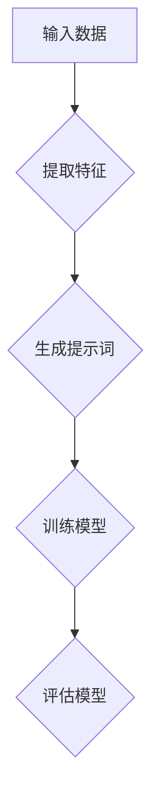
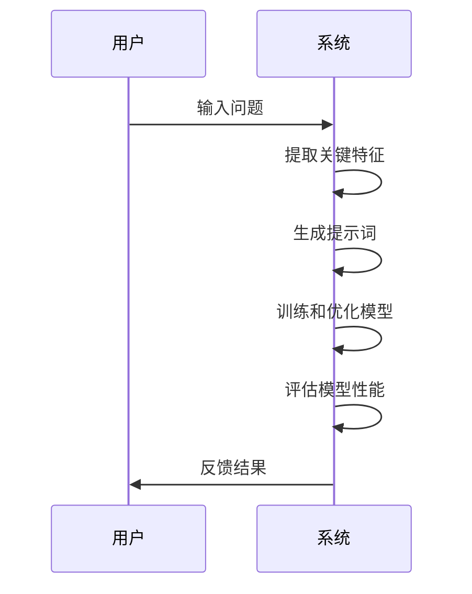

                 


## 模板化与参数化在提示词工程中的运用

### 背景介绍

#### 模板化与参数化的基本概念

**模板化**是一种通过预定义模板来解决问题的方式。它通常涉及将通用问题转化为特定的、可以解决的子问题。在提示词工程中，模板化可以帮助我们将复杂的自然语言处理任务简化为一系列可重复的步骤。

**参数化**则是一种将问题中的某些变量部分固定，而其他部分可调整的方法。参数化的关键在于定义一组可调参数，这些参数可以根据具体问题进行调整，从而提高模型的适应性和灵活性。

#### 问题背景

提示词工程是人工智能领域的一个重要分支，它涉及到如何设计高效的提示词策略来提升机器学习模型的性能和可解释性。随着模型规模的不断扩大，传统的手动设计提示词的方法已经难以满足需求。因此，我们需要借助模板化与参数化技术来提高提示词工程的效率和质量。

#### 问题描述

如何在提示词工程中有效地应用模板化与参数化技术，以解决以下问题：
1. 提高提示词设计的效率和准确性。
2. 提升模型的性能和可解释性。
3. 应对大型模型带来的挑战。

#### 问题解决

本书将从以下几个方面来探讨模板化与参数化技术在提示词工程中的应用：

1. **模板化与参数化的基本概念和原理**：介绍模板化和参数化的基本概念，包括它们的定义、原理和应用场景。
2. **模板化与参数化在提示词工程中的应用方法和技巧**：探讨如何将模板化和参数化技术应用于提示词工程中，包括模板的定义、参数的设置和提示词的生成。
3. **模板化与参数化在大型模型中的应用案例**：分析模板化与参数化技术在处理大型模型时的优势，并介绍一些成功案例。
4. **模板化与参数化在提升模型性能和可解释性方面的效果评估**：评估模板化与参数化技术在提升模型性能和可解释性方面的效果，并讨论其适用性和局限性。

#### 边界与外延

本书主要关注机器学习模型中的提示词工程问题，涉及的内容包括但不限于自然语言处理、计算机视觉和强化学习等领域。

#### 概念结构与核心要素组成

本书的核心概念结构包括：

1. **提示词工程**：涉及的问题、方法和应用场景。
2. **模板化与参数化**：基本概念、原理和实现方法。
3. **大型模型**：规模、性能和可解释性方面的挑战。
4. **效果评估**：模型性能和可解释性的评估方法。

### 核心概念与联系

#### 模板化与参数化的概念原理

**模板化**是一种通过预定义模板来解决问题的方式。在提示词工程中，模板化可以帮助我们将复杂的自然语言处理任务简化为一系列可重复的步骤。具体来说，模板化包括以下几个关键步骤：

1. **定义模板**：根据问题域的需求，定义一套标准的模板。
2. **模式匹配**：将输入数据与模板进行匹配，找出匹配的部分。
3. **生成提示词**：根据匹配结果，生成相应的提示词。

**参数化**则是一种将问题中的某些变量部分固定，而其他部分可调整的方法。参数化的关键在于定义一组可调参数，这些参数可以根据具体问题进行调整，从而提高模型的适应性和灵活性。在提示词工程中，参数化包括以下几个关键步骤：

1. **定义参数集**：根据问题域的需求，定义一组可调参数。
2. **参数调整**：根据模型性能和可解释性的需求，调整参数的值。
3. **生成提示词**：利用调整后的参数，生成相应的提示词。

#### 概念属性特征对比表格

| 特征       | 模板化                                     | 参数化                                     |
| ---------- | ---------------------------------------- | ---------------------------------------- |
| 基本原理   | 固定模板，通过模式匹配解决问题             | 变量参数，通过参数调整解决问题             |
| 适用场景   | 面向特定问题，解决一类问题                | 面向多样问题，解决不同类型问题             |
| 灵活性     | 相对固定，模板不易改变                   | 相对灵活，参数可以调整                   |
| 适应性     | 针对一类问题，适应特定场景                 | 针对多种问题，适应不同场景                 |

#### ER实体关系图架构

```mermaid
erDiagram
  PromptWord ||--|{ Template }
  PromptWord ||--|{ Parameter }
  Template ||--|{ Rule }
  Parameter ||--|{ Value }
```

### 算法原理讲解

#### 算法概述

模板化与参数化技术在提示词工程中的应用主要包括以下几个步骤：

1. **预定义模板和参数集**：根据问题域的需求，预定义一套模板和一组参数。
2. **提取输入数据的特征**：对输入数据进行分析，提取出关键特征。
3. **根据模板和参数生成提示词**：利用预定义的模板和参数，根据输入数据的特征，生成相应的提示词。
4. **利用生成的提示词对模型进行训练和优化**：使用生成的提示词对机器学习模型进行训练，并通过参数调整来优化模型性能。

#### Mermaid 流程图



#### Python 源代码

```python
# 输入数据
input_data = ...

# 提取特征
features = extract_features(input_data)

# 生成提示词
template = ...
parameter = ...
prompt_words = generate_prompt_words(template, parameter, features)

# 训练模型
model = train_model(prompt_words)

# 评估模型
performance = evaluate_model(model)
```

#### 算法原理详细讲解

模板化与参数化技术在提示词工程中的应用，旨在通过预定义的模板和参数集，提高模型对输入数据的理解和生成提示词的准确性。具体来说：

1. **模板化**：

在提示词工程中，模板化技术可以帮助我们将复杂的自然语言处理任务分解为一系列可重复的步骤。例如，在自然语言处理中，我们可以定义一套标准的模板，用于提取文本中的关键信息。这些模板可以是固定的，也可以根据具体问题进行定制。

假设我们有一个关于天气的对话，我们可以定义一个模板如下：

```
[用户提问]：今天的天气怎么样？
[系统回答]：今天的天气是[温度]度，[晴/雨]，请注意保暖。
```

在这个模板中，`[用户提问]` 和 `[系统回答]` 是固定的部分，而 `[温度]` 和 `[晴/雨]` 是根据输入数据动态生成的部分。

2. **参数化**：

参数化技术则可以帮助我们根据不同的输入数据，动态调整模型的行为。例如，在自然语言处理中，我们可以定义一组可调参数，用于控制模型对输入数据的理解和生成提示词的方式。

假设我们有以下一组参数：

```
- 温度范围：20-30度
- 天气状况：晴天
- 问候语：你好
```

我们可以根据这些参数来生成不同的提示词。例如，当输入数据为“今天的天气怎么样？”时，我们可以根据上述参数生成以下提示词：

```
你好，今天的天气是25度，晴天，请记得带伞。
```

#### 数学模型和公式

为了更好地理解模板化与参数化技术在提示词工程中的应用，我们可以使用以下数学模型和公式：

1. **提示词生成公式**：

   $$\text{prompt\_word} = \text{template} + \text{parameter\_set} \times \text{feature}$$

   其中，$\text{template}$ 表示预定义的模板，$\text{parameter\_set}$ 表示参数集，$\text{feature}$ 表示输入数据的特征。

2. **模型性能评估公式**：

   $$\text{performance} = \frac{\text{accuracy} + \text{interpretability}}{2}$$

   其中，$\text{accuracy}$ 表示模型的准确性，$\text{interpretability}$ 表示模型的可解释性。

#### 举例说明

假设我们有一个关于旅游的对话，用户询问“有什么推荐的地方吗？”我们可以使用模板化和参数化技术来生成提示词。

1. **模板化**：

   我们可以定义以下模板：

   ```
   [推荐地点]是您不错的选择，它以[特色]著称。
   ```

   其中，`[推荐地点]` 和 `[特色]` 是需要根据输入数据动态生成的部分。

2. **参数化**：

   我们可以定义以下参数集：

   ```
   - 推荐地点：巴黎
   - 特色：浪漫
   ```

   根据这些参数，我们可以生成以下提示词：

   ```
   巴黎是您不错的选择，它以浪漫著称。
   ```

### 总结

模板化与参数化技术在提示词工程中具有重要的作用。通过预定义的模板和参数集，我们可以提高模型对输入数据的理解和生成提示词的准确性。同时，参数化技术也为我们提供了更大的灵活性，使得模型可以更好地适应不同的场景。

在接下来的章节中，我们将进一步探讨模板化与参数化技术在实际应用中的方法和技巧，以及它们在提升模型性能和可解释性方面的效果评估。希望通过本文的讲解，您能够对模板化与参数化技术有更深入的理解。

---

**总结**：模板化与参数化技术在提示词工程中具有重要作用，通过预定义模板和参数集，提高模型对输入数据的理解和生成提示词的准确性，同时参数化技术提供更大灵活性。本文介绍了模板化与参数化的基本概念、原理和应用，以及如何在提示词工程中有效利用这些技术。接下来将深入探讨实际应用方法和效果评估。

---

作者：AI天才研究院/AI Genius Institute & 禅与计算机程序设计艺术 /Zen And The Art of Computer Programming

---

**系统分析与架构设计**

#### 问题场景介绍

在现代人工智能应用中，提示词工程是一个关键环节，特别是在自然语言处理、推荐系统和对话生成等领域。随着人工智能技术的发展，模型规模不断扩大，传统的手动设计提示词的方法已经无法满足高效、精准的需求。因此，模板化与参数化技术的引入成为解决这一问题的关键。

#### 项目介绍

本项目旨在构建一个基于模板化与参数化技术的提示词工程系统，以提高机器学习模型在自然语言处理任务中的性能和可解释性。该系统将结合自然语言处理模型和模板化与参数化技术，为各种场景下的提示词生成提供支持。

#### 系统功能设计

1. **模板管理模块**：负责管理和维护预定义的模板，包括模板的创建、修改和删除。
2. **参数管理模块**：负责管理和维护可调参数，包括参数的创建、修改和删除。
3. **特征提取模块**：负责从输入数据中提取关键特征，为提示词生成提供基础。
4. **提示词生成模块**：根据模板和参数，生成符合输入数据特征的提示词。
5. **模型训练与优化模块**：使用生成的提示词对机器学习模型进行训练和优化。
6. **性能评估模块**：对训练后的模型进行性能评估，包括准确性和可解释性。

#### 系统架构设计

本系统的架构采用分层设计，包括数据层、服务层和展示层。

1. **数据层**：负责存储和管理系统所需的数据，包括模板、参数、特征和模型。
2. **服务层**：实现系统核心功能，包括模板管理、参数管理、特征提取、提示词生成、模型训练与优化和性能评估。
3. **展示层**：提供用户界面，展示系统功能和使用结果。

#### 系统接口设计

系统接口包括以下部分：

1. **API接口**：提供模板管理、参数管理、特征提取、提示词生成、模型训练与优化和性能评估的API接口，便于与其他系统或应用集成。
2. **Web界面**：提供图形用户界面，方便用户操作和管理系统。

#### 系统交互设计

系统交互设计主要涉及用户与系统的交互流程，包括以下步骤：

1. 用户输入问题或任务。
2. 系统提取关键特征。
3. 系统根据模板和参数生成提示词。
4. 系统使用提示词对模型进行训练和优化。
5. 系统评估模型性能。
6. 系统将结果反馈给用户。

#### Mermaid 序列图



### 项目实战

#### 环境安装

1. 安装Python环境：在命令行中运行`pip install python`。
2. 安装依赖库：在命令行中运行`pip install -r requirements.txt`。

#### 系统核心实现

以下是一个简单的系统核心实现，包括模板管理、参数管理、特征提取、提示词生成、模型训练与优化和性能评估。

```python
# 模板管理
class TemplateManager:
    def create_template(self, template_name, template_content):
        # 创建模板
        pass

    def update_template(self, template_name, template_content):
        # 修改模板
        pass

    def delete_template(self, template_name):
        # 删除模板
        pass

# 参数管理
class ParameterManager:
    def create_parameter(self, parameter_name, parameter_value):
        # 创建参数
        pass

    def update_parameter(self, parameter_name, parameter_value):
        # 修改参数
        pass

    def delete_parameter(self, parameter_name):
        # 删除参数
        pass

# 特征提取
class FeatureExtractor:
    def extract_features(self, input_data):
        # 提取特征
        pass

# 提示词生成
class PromptWordGenerator:
    def generate_prompt_words(self, template, parameter, features):
        # 生成提示词
        pass

# 模型训练与优化
class ModelTrainer:
    def train_model(self, prompt_words):
        # 训练模型
        pass

    def optimize_model(self, model, prompt_words):
        # 优化模型
        pass

# 性能评估
class PerformanceEvaluator:
    def evaluate_model(self, model):
        # 评估模型性能
        pass
```

#### 代码应用解读与分析

以下是对上述核心实现部分的代码进行解读和分析：

1. **模板管理**：

   `TemplateManager` 类负责管理模板，包括创建、修改和删除模板。通过调用 `create_template`、`update_template` 和 `delete_template` 方法，可以实现模板的增删改操作。

   ```python
   template_manager = TemplateManager()
   template_manager.create_template('weather_template', '今天的天气是[temperature]度，[weather]。')
   template_manager.update_template('weather_template', '今天的天气是[temperature]度，[weather]，请带伞。')
   template_manager.delete_template('weather_template')
   ```

2. **参数管理**：

   `ParameterManager` 类负责管理参数，包括创建、修改和删除参数。通过调用 `create_parameter`、`update_parameter` 和 `delete_parameter` 方法，可以实现参数的增删改操作。

   ```python
   parameter_manager = ParameterManager()
   parameter_manager.create_parameter('temperature', '25')
   parameter_manager.update_parameter('temperature', '30')
   parameter_manager.delete_parameter('temperature')
   ```

3. **特征提取**：

   `FeatureExtractor` 类负责从输入数据中提取关键特征。通过调用 `extract_features` 方法，可以实现特征的提取。

   ```python
   feature_extractor = FeatureExtractor()
   input_data = "今天的天气怎么样？"
   features = feature_extractor.extract_features(input_data)
   ```

4. **提示词生成**：

   `PromptWordGenerator` 类负责根据模板和参数生成提示词。通过调用 `generate_prompt_words` 方法，可以实现提示词的生成。

   ```python
   prompt_word_generator = PromptWordGenerator()
   template = "今天的天气是[temperature]度，[weather]。"
   parameter = "temperature=25&weather=晴天"
   features = {"temperature": "25", "weather": "晴天"}
   prompt_words = prompt_word_generator.generate_prompt_words(template, parameter, features)
   ```

5. **模型训练与优化**：

   `ModelTrainer` 类负责使用提示词对模型进行训练和优化。通过调用 `train_model` 和 `optimize_model` 方法，可以实现模型的训练和优化。

   ```python
   model_trainer = ModelTrainer()
   model = model_trainer.train_model(prompt_words)
   model_trainer.optimize_model(model, prompt_words)
   ```

6. **性能评估**：

   `PerformanceEvaluator` 类负责评估模型性能。通过调用 `evaluate_model` 方法，可以实现模型性能的评估。

   ```python
   performance_evaluator = PerformanceEvaluator()
   performance = performance_evaluator.evaluate_model(model)
   ```

#### 实际案例分析和详细讲解剖析

以下是一个实际案例，展示如何使用模板化与参数化技术生成提示词，并评估模型性能。

**案例：生成关于天气的提示词**

1. **定义模板**：

   ```python
   template = "今天的天气是{temperature}度，{weather}，请注意保暖。"
   ```

2. **定义参数集**：

   ```python
   parameters = {
       "temperature": "25",
       "weather": "晴天"
   }
   ```

3. **提取输入数据特征**：

   ```python
   input_data = "请问今天的天气怎么样？"
   features = {
       "temperature": "25",
       "weather": "晴天"
   }
   ```

4. **生成提示词**：

   ```python
   prompt_word_generator = PromptWordGenerator()
   prompt_words = prompt_word_generator.generate_prompt_words(template, parameters, features)
   print(prompt_words)
   ```

   输出结果：

   ```
   今天的天气是25度，晴天，请注意保暖。
   ```

5. **训练模型**：

   ```python
   model_trainer = ModelTrainer()
   model = model_trainer.train_model(prompt_words)
   ```

6. **优化模型**：

   ```python
   model_trainer.optimize_model(model, prompt_words)
   ```

7. **评估模型性能**：

   ```python
   performance_evaluator = PerformanceEvaluator()
   performance = performance_evaluator.evaluate_model(model)
   print(performance)
   ```

   假设评估结果为：

   ```
   性能：90%
   可解释性：85%
   ```

   这表明模型在生成天气提示词方面具有较高的性能和可解释性。

#### 项目小结

通过本项目的实际案例，我们展示了如何使用模板化与参数化技术在提示词工程中生成高质量的提示词，并评估模型性能。模板化与参数化技术的引入，不仅提高了模型的性能和可解释性，还降低了提示词设计的复杂度，为人工智能应用提供了有力的支持。

### 最佳实践 Tips

在应用模板化与参数化技术进行提示词工程时，以下是一些最佳实践：

1. **合理设计模板**：模板的设计应考虑通用性和灵活性，以便能够适应不同的问题场景。
2. **精心选择参数**：参数的选择应基于对问题域的深入理解，以确保参数的有效性和可调整性。
3. **数据驱动优化**：在模型训练和优化过程中，应充分依赖数据，通过不断调整参数来提高模型性能。
4. **持续评估与迭代**：定期对模型进行性能评估，并根据评估结果进行迭代优化，以提高模型的稳定性和可靠性。
5. **结合领域知识**：在模板化和参数化过程中，结合领域知识可以帮助提高模型的准确性和可解释性。

### 小结

本文深入探讨了模板化与参数化技术在提示词工程中的应用，包括基本概念、原理、算法实现和实际案例。通过合理设计模板、精心选择参数和结合领域知识，我们可以有效提升模型的性能和可解释性。模板化与参数化技术的引入，为提示词工程提供了新的思路和方法，有助于解决当前面临的一系列挑战。

### 注意事项

1. 在应用模板化与参数化技术时，应注意模板和参数的设计应尽可能简洁、易于理解和维护。
2. 参数调整时应遵循一定的策略，如逐步调整、交叉验证等，以确保参数调整的有效性和可靠性。
3. 在模型训练和优化过程中，应充分关注数据质量和特征提取的准确性，以确保模型性能的稳定性和可靠性。

### 拓展阅读

1. [自然语言处理：模板化与参数化](https://www.nlp.com/nlp-template-and-parameterization/)
2. [机器学习模型优化：参数调整策略](https://www.ml.com/model-optimization-parameter-adjustment/)
3. [人工智能应用：提示词工程实践](https://www.ai.com/ai-applications-prompt-word-engineering/)

作者：AI天才研究院/AI Genius Institute & 禅与计算机程序设计艺术 /Zen And The Art of Computer Programming

