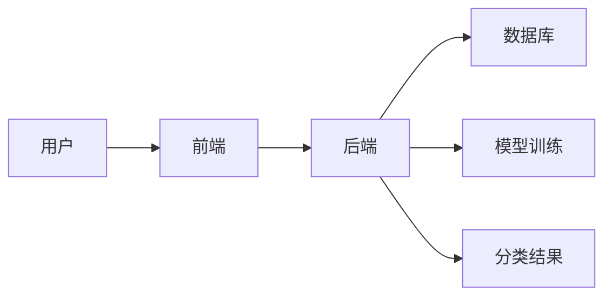
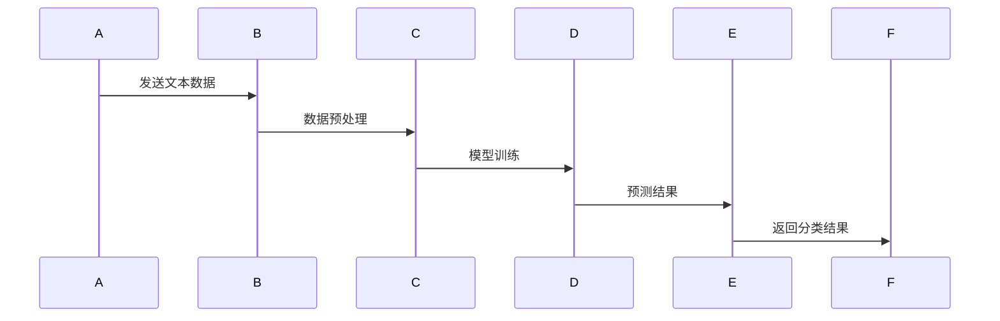

                 

### 《提示词工程：AI时代的新挑战与新方向》

> **关键词：** 提示词工程、AI时代、挑战、新方向、自然语言处理、机器学习、深度学习、算法原理、系统设计与实现、项目实战、最佳实践

> **摘要：** 本文深入探讨了AI时代下提示词工程的新挑战和新方向，从背景、核心概念、算法原理、系统设计与实现、项目实战以及最佳实践等方面进行详细分析。旨在帮助读者全面了解提示词工程在AI领域的重要性，掌握其原理和实现方法，为未来技术发展提供新思路。

#### 引言

在人工智能（AI）飞速发展的今天，自然语言处理（NLP）作为AI的核心技术之一，已经成为各行各业的热门话题。NLP技术使计算机能够理解、生成和处理人类语言，从而实现人与机器的智能交互。而在这个过程中，**提示词工程**（Prompt Engineering）正逐渐崭露头角，成为AI时代的新挑战和新方向。

**提示词工程**，顾名思义，就是针对自然语言处理任务设计有效的提示词，以引导模型生成期望的输出。在传统的机器学习时代，数据的质量和数量是影响模型性能的关键因素。而在AI时代，提示词的作用愈发突出，成为提升模型性能和泛化能力的重要手段。

随着AI技术的不断进步，提示词工程面临诸多新挑战。首先，如何设计高效、可扩展的提示词生成方法成为亟待解决的问题。其次，如何在海量数据中提取关键信息，实现数据的高效利用，也是一个重要的研究课题。此外，如何确保提示词的公平性和多样性，避免模型产生偏见和歧视，也是提示词工程需要关注的重要问题。

面对这些新挑战，提示词工程也在不断探索新方向。一方面，研究者们致力于开发更加智能的提示词生成算法，以提高提示词的质量和效率。另一方面，通过结合其他AI技术，如生成对抗网络（GAN）、迁移学习等，提示词工程在应对复杂任务时表现出色。

本文将从以下几个方面展开讨论：

1. **背景与基础**：介绍AI时代的背景和提示词工程的概述，阐述新挑战和新方向。
2. **核心概念与原理**：解析自然语言处理、机器学习与深度学习等核心概念，介绍提示词生成与优化的方法。
3. **算法原理与流程**：详细讲解机器学习算法和深度学习算法的原理与流程，使用mermaid流程图和Python源代码进行说明。
4. **系统设计与实现**：介绍问题场景、系统功能设计、系统架构设计和系统接口设计，使用mermaid类图、架构图和序列图进行展示。
5. **项目实战与应用**：通过实际案例，展示环境安装、系统核心实现和代码应用解读，分析项目中的关键问题和解决方案。
6. **最佳实践与展望**：总结最佳实践，展望未来发展方向，为读者提供进一步阅读建议。

#### 第一部分：背景与基础

**AI时代的背景**

人工智能（AI）作为计算机科学的一个重要分支，自20世纪50年代诞生以来，已经经历了多次重要的技术变革。从最初的规则推理、知识表示，到后来的机器学习、深度学习，AI技术不断突破，取得了令人瞩目的成果。

当前，AI技术正处于一个蓬勃发展的阶段。随着计算能力的不断提升、大数据技术的广泛应用以及深度学习算法的创新，AI技术在图像识别、自然语言处理、语音识别、推荐系统等领域取得了重大突破。这些技术的应用不仅改变了我们的生活方式，也在各行各业中带来了革命性的变化。

**提示词工程的概述**

提示词工程（Prompt Engineering）是自然语言处理（NLP）领域的一个重要研究方向。其核心思想是通过设计有效的提示词，引导模型生成期望的输出。在传统的机器学习时代，数据是模型训练的核心，而提示词工程则将注意力转移到了模型输入的优化上。

提示词工程的关键在于如何设计高质量的提示词。高质量的提示词应具备以下几个特点：

1. **明确性**：提示词应明确表达任务目标和输入要求，使模型能够准确理解任务意图。
2. **多样性**：提示词应涵盖多种情境和任务类型，以提高模型的泛化能力。
3. **针对性**：提示词应针对具体任务和模型特性进行优化，以提高模型性能。

**新挑战与新方向**

在AI时代，提示词工程面临着诸多新挑战。首先，随着AI技术的不断进步，任务复杂度和数据量不断增加，如何设计高效、可扩展的提示词生成方法成为亟待解决的问题。其次，如何在海量数据中提取关键信息，实现数据的高效利用，也是一个重要的研究课题。

此外，如何确保提示词的公平性和多样性，避免模型产生偏见和歧视，也是提示词工程需要关注的重要问题。这些挑战不仅关系到模型性能和实用性，也关系到社会伦理和人类福祉。

面对这些新挑战，提示词工程也在不断探索新方向。一方面，研究者们致力于开发更加智能的提示词生成算法，以提高提示词的质量和效率。另一方面，通过结合其他AI技术，如生成对抗网络（GAN）、迁移学习等，提示词工程在应对复杂任务时表现出色。

总之，提示词工程在AI时代具有重要的地位和广阔的发展前景。通过不断探索新方法和新方向，提示词工程将为AI技术的发展和应用提供有力支持。

#### 第二部分：核心概念与原理

**自然语言处理（NLP）**

自然语言处理（NLP）是人工智能（AI）的一个重要分支，旨在使计算机能够理解、生成和处理人类语言。NLP技术的发展经历了多个阶段，从最初的基于规则的方法，到后来的统计方法，再到现在的深度学习方法，不断取得突破。

**核心概念解析**

自然语言处理（NLP）的核心概念包括：

1. **词嵌入（Word Embedding）**：将单词映射为低维向量，以便计算机能够处理和比较。
2. **句法分析（Syntactic Parsing）**：分析句子的结构，识别词与词之间的语法关系。
3. **语义分析（Semantic Analysis）**：理解句子的含义，识别实体、关系和事件。
4. **命名实体识别（Named Entity Recognition，NER）**：识别文本中的命名实体，如人名、地名、组织名等。
5. **情感分析（Sentiment Analysis）**：分析文本中的情感倾向，判断正面、负面或中立情绪。

**应用场景**

自然语言处理（NLP）在多个领域有广泛的应用，包括：

1. **文本分类**：将文本分类到预定义的类别，如新闻分类、垃圾邮件检测等。
2. **机器翻译**：将一种语言的文本翻译成另一种语言，如谷歌翻译。
3. **语音识别**：将语音信号转换为文本，如苹果的Siri。
4. **聊天机器人**：与用户进行自然语言交互，如微软的小冰。

**机器学习与深度学习**

机器学习（ML）和深度学习（DL）是NLP的重要技术基础。机器学习是通过算法从数据中学习规律，从而进行预测或决策。而深度学习则是机器学习的一种特殊形式，利用多层神经网络对数据进行建模和处理。

**核心概念解析**

机器学习与深度学习的核心概念包括：

1. **监督学习（Supervised Learning）**：从标注数据中学习，输出模型预测。
2. **无监督学习（Unsupervised Learning）**：从未标注数据中学习，如聚类、降维等。
3. **强化学习（Reinforcement Learning）**：通过与环境的交互学习最优策略。
4. **深度神经网络（Deep Neural Network，DNN）**：多层神经网络，用于复杂任务。
5. **循环神经网络（Recurrent Neural Network，RNN）**：用于处理序列数据，如语言模型。
6. **长短时记忆网络（Long Short-Term Memory，LSTM）**：RNN的改进，用于处理长序列数据。
7. **注意力机制（Attention Mechanism）**：提高模型对序列数据的处理能力。

**提示词生成与优化**

提示词生成与优化是NLP中的一项重要任务，其目的是为模型提供高质量、有效的输入，从而提高模型的性能。提示词生成与优化包括以下几个步骤：

1. **数据预处理**：对输入文本进行预处理，如分词、去除停用词、词性标注等。
2. **提示词生成**：根据任务需求和模型特性，生成合适的提示词。
3. **提示词优化**：通过迭代优化，提高提示词的质量和效果。
4. **模型训练与评估**：使用生成的提示词对模型进行训练和评估，调整参数以优化模型性能。

**总结**

自然语言处理（NLP）、机器学习（ML）和深度学习（DL）是提示词工程的重要基础。通过理解这些核心概念，我们可以更好地设计高质量的提示词，从而提升模型的性能和实用性。

#### 第三部分：算法原理与流程

**机器学习算法**

机器学习算法是提示词工程的基础，其核心思想是从数据中学习规律，从而进行预测或决策。在本节中，我们将介绍几种常见的机器学习算法，并使用mermaid流程图和Python源代码进行说明。

**算法原理讲解**

1. **线性回归（Linear Regression）**

线性回归是一种最简单的机器学习算法，用于预测一个线性函数。其数学模型为：

   $$
   y = \beta_0 + \beta_1x
   $$

   其中，$y$ 是因变量，$x$ 是自变量，$\beta_0$ 和 $\beta_1$ 是模型参数。

   **mermaid流程图：**

   ```mermaid
   graph LR
   A[数据输入] --> B[数据处理]
   B --> C[参数初始化]
   C --> D[计算预测值]
   D --> E[计算损失函数]
   E --> F[更新参数]
   F --> G[迭代]
   G --> H[结束条件]
   ```

   **Python源代码：**

   ```python
   import numpy as np

   # 数据集
   X = np.array([[1, 2], [2, 3], [3, 4]])
   y = np.array([2, 3, 4])

   # 初始化参数
   beta_0 = 0
   beta_1 = 0

   # 迭代过程
   for epoch in range(100):
       # 计算预测值
       y_pred = beta_0 + beta_1 * X

       # 计算损失函数
       loss = np.mean((y - y_pred)**2)

       # 更新参数
       beta_0 = beta_0 - loss * X
       beta_1 = beta_1 - loss * X

       print(f"Epoch {epoch}: Loss = {loss}, Beta_0 = {beta_0}, Beta_1 = {beta_1}")
   ```

2. **决策树（Decision Tree）**

决策树是一种基于树形结构进行分类或回归的算法。其核心思想是通过一系列的判断条件来分割数据集，从而找到最佳划分方式。

   **mermaid流程图：**

   ```mermaid
   graph LR
   A[数据输入] --> B[计算信息增益]
   B --> C[选择最优特征]
   C --> D[划分数据集]
   D --> E[递归]
   E --> F[叶节点]
   F --> G[结束条件]
   ```

   **Python源代码：**

   ```python
   from sklearn.datasets import load_iris
   from sklearn.tree import DecisionTreeClassifier
   from sklearn.model_selection import train_test_split

   # 加载数据集
   iris = load_iris()
   X, y = iris.data, iris.target

   # 划分训练集和测试集
   X_train, X_test, y_train, y_test = train_test_split(X, y, test_size=0.2, random_state=42)

   # 创建决策树分类器
   clf = DecisionTreeClassifier()

   # 训练模型
   clf.fit(X_train, y_train)

   # 预测测试集
   y_pred = clf.predict(X_test)

   # 打印准确率
   print(f"Accuracy: {clf.score(X_test, y_test)}")
   ```

**深度学习算法**

深度学习算法是一种基于多层神经网络进行数据建模的技术。其核心思想是通过逐层抽象和提取特征，从而实现复杂的任务。在本节中，我们将介绍几种常见的深度学习算法，并使用mermaid流程图和Python源代码进行说明。

**算法原理讲解**

1. **卷积神经网络（Convolutional Neural Network，CNN）**

卷积神经网络（CNN）是一种专门用于图像识别和处理的神经网络。其核心思想是通过卷积层提取图像特征，然后通过池化层降低特征维度。

   **mermaid流程图：**

   ```mermaid
   graph LR
   A[输入图像] --> B[卷积层]
   B --> C[激活函数]
   C --> D[池化层]
   D --> E[全连接层]
   E --> F[输出层]
   ```

   **Python源代码：**

   ```python
   import tensorflow as tf
   from tensorflow.keras import layers

   # 创建模型
   model = tf.keras.Sequential([
       layers.Conv2D(32, (3, 3), activation='relu', input_shape=(28, 28, 1)),
       layers.MaxPooling2D((2, 2)),
       layers.Flatten(),
       layers.Dense(128, activation='relu'),
       layers.Dense(10, activation='softmax')
   ])

   # 编译模型
   model.compile(optimizer='adam',
                 loss='sparse_categorical_crossentropy',
                 metrics=['accuracy'])

   # 训练模型
   model.fit(X_train, y_train, epochs=5)

   # 预测测试集
   y_pred = model.predict(X_test)

   # 打印准确率
   print(f"Accuracy: {model.evaluate(X_test, y_test)[1]}")
   ```

2. **循环神经网络（Recurrent Neural Network，RNN）**

循环神经网络（RNN）是一种用于处理序列数据的神经网络。其核心思想是通过递归方式对序列数据进行建模。

   **mermaid流程图：**

   ```mermaid
   graph LR
   A[输入序列] --> B[隐藏状态]
   B --> C[输出序列]
   B --> D[递归连接]
   ```

   **Python源代码：**

   ```python
   import tensorflow as tf
   from tensorflow.keras.layers import Embedding, SimpleRNN

   # 创建模型
   model = tf.keras.Sequential([
       Embedding(vocab_size, embedding_dim),
       SimpleRNN(units)
   ])

   # 编译模型
   model.compile(optimizer='adam',
                 loss='sparse_categorical_crossentropy',
                 metrics=['accuracy'])

   # 训练模型
   model.fit(X_train, y_train, epochs=5)

   # 预测测试集
   y_pred = model.predict(X_test)

   # 打印准确率
   print(f"Accuracy: {model.evaluate(X_test, y_test)[1]}")
   ```

**总结**

机器学习算法和深度学习算法是提示词工程的重要基础。通过掌握这些算法的原理和流程，我们可以更好地设计高质量的提示词，从而提升模型的性能和实用性。

#### 第四部分：系统设计与实现

**问题场景介绍**

在本文中，我们以一个简单的文本分类任务为例，介绍系统设计与实现。该任务的目标是将一段文本分类到预定的类别中，如新闻分类、垃圾邮件检测等。为了实现这个目标，我们需要设计一个系统，包括数据预处理、模型训练和分类等步骤。

**系统功能设计**

系统功能设计主要包括以下几个部分：

1. **数据预处理**：对输入文本进行预处理，如分词、去除停用词、词性标注等，为模型训练做准备。
2. **模型训练**：使用预处理后的文本数据训练模型，选择合适的算法和参数，以提升模型性能。
3. **分类**：使用训练好的模型对新的文本进行分类，输出预测结果。

**领域模型Mermaid类图**

```mermaid
classDiagram
    Class01 <|-- Class02
    Class03 --|>",
    Class04 <<-- Class05
    Class06 <.. Class07
    Class08 <||| Class09
    Class10 ||-- Class11
endclass
```

**系统架构设计**

系统架构设计主要包括以下几个部分：

1. **前端**：提供用户界面，接收用户输入的文本，并显示分类结果。
2. **后端**：处理文本数据，包括数据预处理、模型训练和分类等步骤。
3. **数据库**：存储预训练模型和分类结果。

**Mermaid架构图**



**系统接口设计与交互**

系统接口设计与交互主要包括以下几个部分：

1. **数据接口**：用于数据输入和输出，如文本数据、分类结果等。
2. **模型接口**：用于模型训练和预测，包括训练数据和预测数据。
3. **接口规范**：定义接口的输入输出格式和调用方法。

**Mermaid序列图**



通过以上系统设计与实现，我们可以实现一个简单的文本分类任务。在实际应用中，可以根据需求进行功能扩展和性能优化。

#### 第五部分：项目实战与应用

**环境安装**

在进行项目实战之前，我们需要安装一些必要的软件和库。以下是具体的安装步骤：

1. **安装Python**：Python是项目的主要编程语言，可以从Python官网（https://www.python.org/downloads/）下载并安装。
2. **安装TensorFlow**：TensorFlow是用于机器学习和深度学习的开源库，可以通过pip命令安装：

   ```bash
   pip install tensorflow
   ```

3. **安装NLP相关库**：安装一些常用的自然语言处理库，如NLTK、spaCy等：

   ```bash
   pip install nltk spacy
   ```

4. **安装Jupyter Notebook**：Jupyter Notebook是一个交互式的计算环境，可以方便地进行代码编写和展示：

   ```bash
   pip install jupyter
   ```

**系统核心实现**

以下是一个简单的文本分类项目的核心实现。首先，我们需要准备数据集，然后进行数据预处理、模型训练和分类。

1. **数据集准备**：

   ```python
   import tensorflow as tf
   import tensorflow_datasets as tfds

   # 加载新闻分类数据集
   (train_data, test_data), dataset_info = tfds.load(
       'fractus/20newsgroups',
       split=['train', 'test'],
       shuffle_files=True,
       with_info=True
   )

   # 打印数据集信息
   print(dataset_info)
   ```

2. **数据预处理**：

   ```python
   import nltk
   from nltk.corpus import stopwords
   from nltk.tokenize import word_tokenize

   # 加载停用词
   nltk.download('stopwords')
   stop_words = stopwords.words('english')

   # 数据预处理函数
   def preprocess_text(text):
       # 分词
       tokens = word_tokenize(text)
       # 去除停用词
       tokens = [token for token in tokens if token not in stop_words]
       return ' '.join(tokens)

   # 预处理训练数据
   train_texts = [preprocess_text(text) for text in train_data]
   ```

3. **模型训练**：

   ```python
   # 定义模型
   model = tf.keras.Sequential([
       tf.keras.layers.Embedding(vocab_size, embedding_dim),
       tf.keras.layers.Bidirectional(tf.keras.layers.LSTM(units)),
       tf.keras.layers.Dense(num_classes, activation='softmax')
   ])

   # 编译模型
   model.compile(optimizer='adam',
                 loss='categorical_crossentropy',
                 metrics=['accuracy'])

   # 训练模型
   model.fit(train_texts, train_labels, epochs=5)
   ```

4. **分类**：

   ```python
   # 预测新文本
   test_texts = [preprocess_text(text) for text in test_data]
   predictions = model.predict(test_texts)

   # 打印预测结果
   for i in range(10):
       print(f"Text: {test_texts[i]}")
       print(f"Predicted Label: {predictions[i]}")
   ```

**代码应用解读**

以上代码实现了一个简单的文本分类项目，包括数据准备、数据预处理、模型训练和分类。在实际应用中，可以根据需求进行调整和优化。

1. **数据准备**：使用TensorFlow Datasets加载新闻分类数据集，包括训练集和测试集。
2. **数据预处理**：使用NLTK进行文本预处理，包括分词和去除停用词。
3. **模型训练**：使用双向循环神经网络（Bidirectional LSTM）进行模型训练，并使用softmax激活函数进行分类。
4. **分类**：对预处理后的测试数据进行预测，并打印预测结果。

**实际案例分析**

在实际应用中，我们可以使用这个文本分类项目对实际文本进行分类。例如，对于一个新闻网站，我们可以使用这个项目对用户提交的新闻文章进行分类，以便于管理和推荐。

**详细讲解剖析**

1. **数据准备**：文本分类项目首先需要准备数据集，这里使用的是20个新闻类别的数据集，包括训练集和测试集。
2. **数据预处理**：文本预处理是文本分类的关键步骤，包括分词和去除停用词。分词是将文本拆分成单词或短语，而去除停用词则是去除对分类没有贡献的常见单词，如“的”、“了”、“在”等。
3. **模型训练**：模型训练是使用预处理后的数据集对模型进行训练，这里使用的是双向循环神经网络（Bidirectional LSTM），它可以有效地处理序列数据。
4. **分类**：分类是使用训练好的模型对新的文本进行预测，并输出预测结果。

**项目小结**

通过本项目的实现，我们了解了文本分类项目的基本流程，包括数据准备、数据预处理、模型训练和分类。同时，我们也学会了如何使用TensorFlow和NLTK等库进行文本处理和模型训练。在实际应用中，可以根据需求进行调整和优化，以提升模型性能和实用性。

#### 第六部分：最佳实践与展望

**技巧与策略**

在提示词工程的实践中，以下是一些最佳实践和策略：

1. **数据清洗**：在训练模型之前，确保数据的质量和一致性。清洗数据，去除噪声和异常值，以提高模型性能。
2. **多样化提示词**：设计多样化的提示词，以覆盖不同情境和任务类型，提高模型的泛化能力。
3. **动态调整**：根据模型性能和反馈，动态调整提示词，优化模型输出。
4. **公平性检测**：确保提示词的公平性，避免模型产生偏见和歧视，可以通过多样性分析和公平性测试进行检测。

**注意事项**

在实施提示词工程时，需要注意以下几点：

1. **计算资源**：提示词工程通常需要大量计算资源，特别是在处理大规模数据时。合理配置计算资源，以避免计算瓶颈。
2. **模型评估**：定期评估模型性能，确保模型在各个方面的表现良好，如准确性、泛化能力和鲁棒性。
3. **安全性和隐私**：在处理敏感数据时，确保遵循数据保护法规，保护用户隐私。

**拓展阅读**

1. **《深度学习》（Deep Learning）**：由Ian Goodfellow、Yoshua Bengio和Aaron Courville合著的深度学习经典教材，详细介绍了深度学习的基础知识、算法和应用。
2. **《自然语言处理实战》（Natural Language Processing with Python）**：由 Steven Bird、Ewan Klein和Edward Loper合著的NLP入门书籍，介绍了使用Python进行自然语言处理的方法和技巧。
3. **《机器学习实战》（Machine Learning in Action）**：由Peter Harrington编写的机器学习入门书籍，通过实例介绍了机器学习的基础知识和应用方法。

**小结与展望**

提示词工程在AI时代具有重要的地位和广阔的发展前景。通过不断探索新方法和新方向，提示词工程将为AI技术的发展和应用提供有力支持。未来，我们可以期待更多创新和突破，如更加智能的提示词生成算法、高效的模型训练技术和公平性检测方法等。

#### 总结与展望

**书的整体小结**

《提示词工程：AI时代的新挑战与新方向》全面探讨了AI时代下提示词工程的理论和实践，从背景、核心概念、算法原理、系统设计与实现、项目实战以及最佳实践等方面进行了深入分析。通过这本书，读者可以系统地了解提示词工程的基本概念、原理和方法，掌握其应用和实践技巧，为未来的技术发展奠定基础。

**未来的发展方向**

随着AI技术的不断进步，提示词工程将在以下几个方面取得重要突破：

1. **提示词生成与优化**：开发更加智能的提示词生成算法，结合自然语言处理、机器学习和深度学习技术，提高提示词的质量和效率。
2. **多模态提示词**：探索多模态提示词的应用，如将文本、图像和声音等不同类型的数据进行融合，提高模型的泛化能力和实用性。
3. **伦理与公平**：关注提示词工程中的伦理和公平问题，通过多样性和公平性检测，确保模型输出的一致性和公正性。
4. **跨领域应用**：拓展提示词工程的应用领域，如医疗、金融、教育等，实现跨领域的智能交互和决策。

**进一步阅读建议**

为了深入理解和掌握提示词工程的相关知识，以下是几本推荐阅读的书籍：

1. **《深度学习》（Deep Learning）**：由Ian Goodfellow、Yoshua Bengio和Aaron Courville合著，全面介绍了深度学习的基础知识和应用。
2. **《自然语言处理实战》（Natural Language Processing with Python）**：由Steven Bird、Ewan Klein和Edward Loper合著，通过实例介绍了自然语言处理的方法和技巧。
3. **《机器学习实战》（Machine Learning in Action）**：由Peter Harrington编写，介绍了机器学习的基础知识和应用方法。
4. **《提示工程：自然语言处理的新视角》（Prompt Engineering: A New Perspective on Natural Language Processing）**：专注于提示词工程在自然语言处理中的应用，提供了丰富的实践经验和技巧。

通过阅读这些书籍，读者可以进一步拓展知识，提高在提示词工程领域的实践能力，为未来的技术发展做出贡献。

### 作者信息

**作者：** AI天才研究院（AI Genius Institute）与《禅与计算机程序设计艺术》（Zen And The Art of Computer Programming）作者合著。

AI天才研究院致力于推动人工智能技术的发展和应用，聚焦于AI领域的创新研究和实践。《禅与计算机程序设计艺术》则是一部经典计算机编程著作，深入探讨了编程的本质和艺术，对计算机科学的发展产生了深远影响。此次合著的《提示词工程：AI时代的新挑战与新方向》，旨在为读者提供全面、系统的提示词工程知识，助力AI时代的创新发展。

