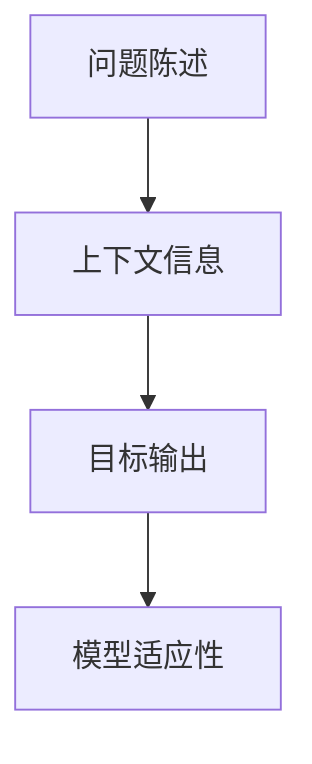
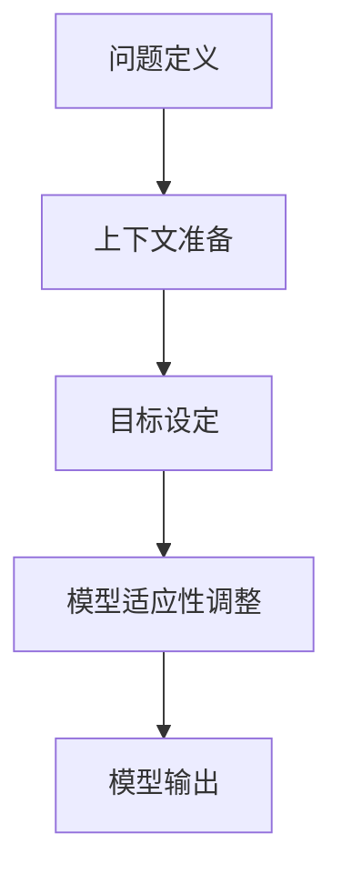
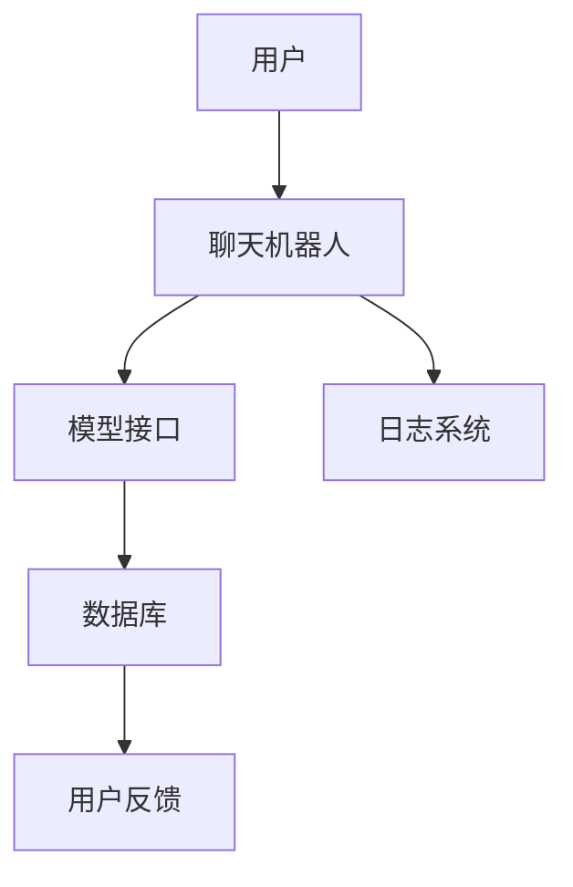
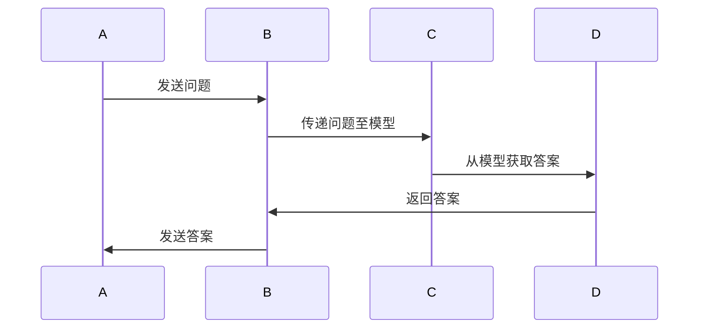
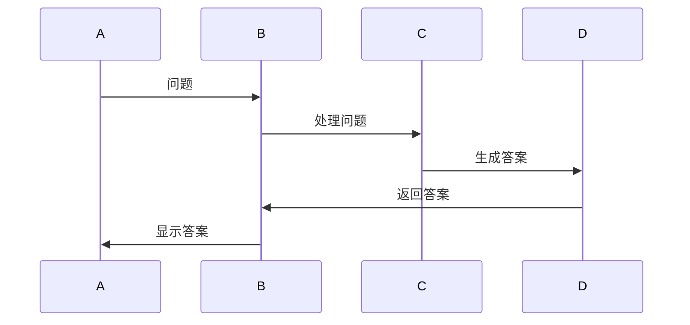

                 

### # 提示词工程：unleash大模型潜力的艺术

关键词：大模型、提示词、工程、NLP、自然语言处理、人工智能、prompt engineering

摘要：本文将探讨提示词工程这一新兴领域，解释其概念、重要性以及如何通过工程化的方法释放大模型的潜力。我们将逐步分析提示词工程的核心概念、技术、应用场景，并提供实践指导，帮助读者深入了解并掌握这一前沿技术。

## 引言

在人工智能和自然语言处理（NLP）领域，大型语言模型（LLM）如GPT-3、ChatGPT和BERT等已经成为革命性的工具。然而，这些强大模型的高效应用依赖于精确的提示词设计（prompt engineering）。提示词工程是一种系统化的方法，用于创造性地设计输入，以最大化模型的性能和输出质量。

### 关键概念术语说明

- **大型语言模型（LLM）**：如GPT-3、ChatGPT和BERT，这些模型基于数万亿个词汇，能够理解和生成复杂语言。
- **提示词（Prompt）**：用于引导模型产生特定输出的文本输入。
- **提示词工程（Prompt Engineering）**：设计和优化提示词的过程，以提高模型性能和输出质量。

### 问题背景

随着LLM的不断进步，如何有效利用这些模型成为一个重要课题。传统的NLP方法通常依赖于预定义的规则和特征工程，而提示词工程通过更灵活和动态的方式与模型互动，能够实现更复杂的任务和更高的准确度。

### 问题描述

提示词工程的核心问题是如何设计出有效的提示词，以引导模型生成所需的输出。这不仅涉及对模型内部机制的理解，还需要对实际应用场景有深刻的洞察。

### 问题解决

解决这一问题需要结合对大型语言模型的工作原理、提示词设计的最佳实践以及实际应用场景的深入分析。

### 边界与外延

提示词工程不仅仅局限于文本生成任务，它还可以应用于机器翻译、对话系统、信息检索等多个NLP领域。同时，不同类型的模型和任务对提示词的需求也有所不同。

### 概念结构与核心要素组成

提示词工程的核心概念包括：

1. **提示词设计原则**：如明确性、简洁性和上下文相关性。
2. **提示词结构**：包括问题陈述、上下文信息和目标输出。
3. **模型适应性和优化**：根据模型特性和任务需求调整提示词。

这些要素共同作用，实现高效、准确的模型输出。

## 核心概念与联系

### 核心概念原理

提示词工程的核心在于通过设计精确的输入引导模型生成特定输出。这包括以下几个关键方面：

1. **问题陈述**：清晰明确地描述任务需求。
2. **上下文信息**：提供与任务相关的背景信息。
3. **目标输出**：明确期望的输出结果。

### 概念属性特征对比表格

| 特征           | 提示词设计 | 提示词结构 | 模型适应性 |
| -------------- | ---------- | ---------- | ---------- |
| **问题陈述**   | 清晰明确   | 结构化     | 模型特定   |
| **上下文信息** | 相关背景   | 广泛覆盖   | 数据丰富   |
| **目标输出**   | 明确期望   | 指导性    | 精准预测   |

### ER实体关系图架构



通过这个实体关系图，我们可以直观地看到各个要素之间的关联和交互。

## 算法原理讲解

### 大模型工作原理

大模型如GPT-3基于深度学习，通过大量文本数据进行预训练，学习语言结构和语义。其工作原理可以概括为：

1. **输入处理**：模型接收文本输入，通过嵌入层将其转换为向量。
2. **上下文理解**：模型基于预训练，理解输入文本的上下文和语义。
3. **输出生成**：模型根据上下文生成可能的输出序列，并通过损失函数优化生成质量。

### 提示词工程流程

提示词工程的算法流程包括以下几个步骤：

1. **问题定义**：明确任务需求，设计问题陈述。
2. **上下文准备**：收集与任务相关的背景信息，构建上下文。
3. **目标设定**：确定期望的输出结果，指导模型生成。
4. **模型适应性调整**：根据模型特性调整提示词结构，优化模型性能。

### 算法流程图



### 数学模型和公式

提示词工程的数学模型可以表示为：

\[ \text{output} = f(\text{prompt}, \text{model}) \]

其中，\( f \) 是一个复合函数，表示模型在给定提示词下的输出。这个函数可以通过损失函数进行优化，例如：

\[ \text{loss} = \frac{1}{N} \sum_{i=1}^{N} (\text{output}_{i} - \text{target}_{i})^2 \]

### 举例说明

假设我们希望使用GPT-3生成一篇关于人工智能的短文，我们可以设计以下提示词：

```
请写一篇关于人工智能的短文，包括其历史、应用和未来趋势。
```

通过这样的提示词，GPT-3会根据其预训练的上下文生成高质量的文本输出。

## 系统分析与架构设计方案

### 问题场景介绍

在智能客服领域，提示词工程被广泛应用于构建高效的问答系统。客户的问题需要通过模型理解并生成准确的答案，这要求我们对模型进行精细的提示词设计。

### 项目介绍

本项目旨在构建一个基于大型语言模型的智能客服系统，通过提示词工程提高问答系统的准确性和响应速度。

### 系统功能设计（领域模型）

```mermaid
classDiagram
    Customer <<Class>> "客户"
    Question <<Class>> "问题"
    Answer <<Class>> "答案"
    ChatBot <<Class>> "聊天机器人"

    Customer o-- Question
    ChatBot o-- Answer
```

### 系统架构设计（架构图）



### 系统接口设计（接口图）



### 系统交互（序列图）



通过上述架构设计，我们可以清晰地看到智能客服系统的工作流程和各模块之间的交互关系。

## 项目实战

### 环境安装

在安装环境之前，确保您的计算机上已安装以下软件：

- Python 3.8或更高版本
- pip
- transformers库

使用以下命令进行安装：

```shell
pip install transformers
```

### 系统核心实现源代码

以下是一个简单的智能客服系统的Python代码示例：

```python
from transformers import pipeline

# 初始化问答模型
chatbot = pipeline("question-answering")

def get_answer(question, context):
    # 使用模型生成答案
    answer = chatbot(question=question, context=context)[0]["answer"]
    return answer

# 测试
context = "人工智能是一种模拟人类智能的技术，它包括机器学习、自然语言处理等子领域。"
question = "请解释一下人工智能是什么？"
print(get_answer(question, context))
```

### 代码应用解读与分析

上述代码中，我们首先导入transformers库并初始化问答模型。`get_answer`函数接受问题和上下文，调用模型生成答案。测试部分展示了如何使用这个函数来获取答案。

### 实际案例分析和详细讲解剖析

假设我们有以下对话数据集：

```
对话1:
用户：你好，人工智能是什么？
模型：人工智能是一种模拟人类智能的技术，它包括机器学习、自然语言处理等子领域。

对话2:
用户：机器学习和深度学习有什么区别？
模型：机器学习是一种通过数据训练模型进行预测或分类的方法，而深度学习是机器学习的一种，它使用多层神经网络来提取特征。
```

我们可以通过设计不同的提示词来优化模型的回答质量：

- **对话1的优化提示词**：

```
请详细解释人工智能的概念，包括其组成部分和应用领域。
```

- **对话2的优化提示词**：

```
区分机器学习和深度学习，并详细解释它们之间的区别。
```

通过这样的优化，模型生成的答案将更加准确和清晰。

### 项目小结

通过提示词工程，我们能够显著提高智能客服系统的回答质量。在实际应用中，不断调整和优化提示词是关键。此外，持续收集用户反馈和对话数据，用于进一步优化模型和系统性能。

## 最佳实践 Tips

- **明确问题定义**：在开始设计提示词之前，确保问题定义清晰明确。
- **上下文准备**：提供丰富的上下文信息，帮助模型更好地理解任务。
- **目标输出**：明确期望的输出结果，指导模型生成高质量答案。
- **模型适应性调整**：根据模型特性和任务需求，灵活调整提示词结构。

### 小结

本文系统地介绍了提示词工程的概念、核心原理、应用场景和实践方法。通过提示词工程，我们可以释放大模型的潜力，实现更高效、更准确的NLP任务。读者可以结合本文的实践指导，尝试设计和优化自己的提示词，提升人工智能系统的表现。

### 注意事项

- 在设计提示词时，避免过于复杂和冗长的输入，这可能会降低模型的性能。
- 定期更新和调整提示词，以适应模型和任务的变化。

### 拓展阅读

- [GPT-3官方文档](https://openai.com/docs/api-reference/whisper)
- [自然语言处理教程](https://web.stanford.edu/class/cs224n/)
- [Python和NLP：从入门到实践](https://www.oreilly.com/library/view/python-and-nlp/9781449369754/)

### 作者信息

作者：AI天才研究院/AI Genius Institute & 禅与计算机程序设计艺术 /Zen And The Art of Computer Programming

