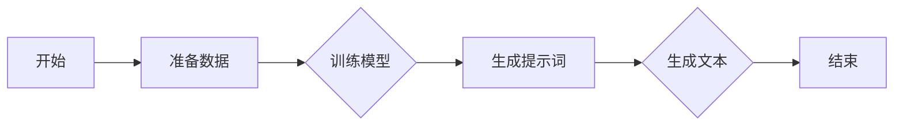
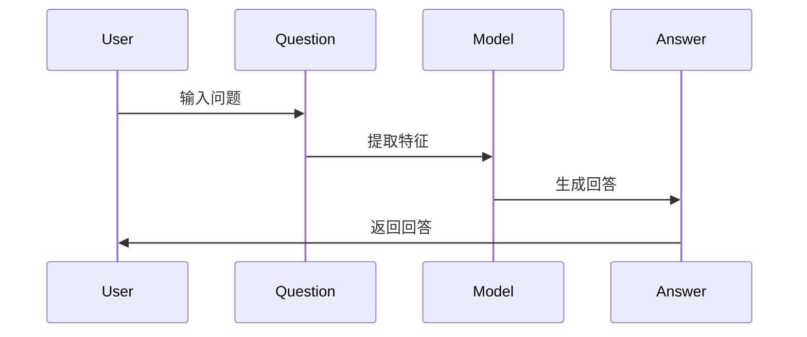
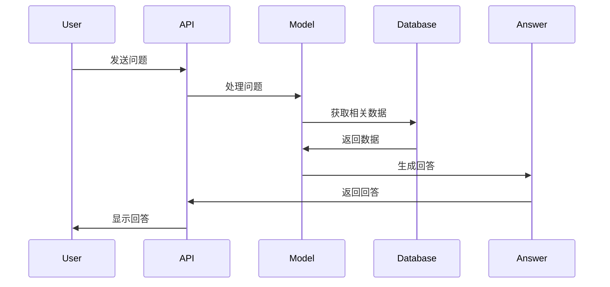

                 

### 文章标题

> 关键词：提示词编程、认知科学、算法原理、数学模型、系统架构、项目实战

> 摘要：本文以《提示词编程的认知科学基础：模拟人类思维过程》为题，深入探讨了如何利用认知科学原理来模拟人类思维过程，实现提示词编程。文章结构紧凑，逻辑清晰，通过一步步分析推理，揭示了提示词编程的内在机制和应用前景。

### 第一步：确定书籍主题和结构

**书籍主题：《提示词编程的认知科学基础：模拟人类思维过程》**

**结构：**

1. 背景介绍
2. 核心概念与联系
3. 算法原理讲解
4. 数学模型和数学公式 & 详细讲解 & 举例说明
5. 系统分析与架构设计方案
6. 项目实战
7. 最佳实践 tips、小结、注意事项、拓展阅读

### 第二步：细化每个章节的内容

#### 1. 背景介绍

**问题背景**

- 提示词编程的发展历程
- 应用领域与重要性

**问题描述**

- 人类思维过程的复杂性
- 模拟的挑战

**问题解决**

- 本书的目的，即如何通过认知科学基础来模拟人类思维过程
- 研究范围，如神经科学、心理学、计算机科学等交叉领域

**概念结构与核心要素组成**

- 提示词编程的概念结构和核心要素

#### 2. 核心概念与联系

**核心概念原理**

- 提示词
- 模型
- 算法

**概念属性特征对比表格**

- 使用表格形式比较不同概念的特性

**ER实体关系图架构**

- 绘制ER图，展示概念之间的关系

#### 3. 算法原理讲解

**算法mermaid流程图**

- 绘制算法的流程图，便于理解

**Python源代码**

- 提供算法的实现代码

**算法原理的数学模型和公式**

- 讲解算法背后的数学原理

**详细讲解和举例说明**

- 使用实例说明算法的应用和效果

#### 4. 数学模型和数学公式 & 详细讲解 & 举例说明

**数学公式**

- 使用LaTeX格式嵌入文中

**详细讲解**

- 深入解释公式的含义和用途

**举例说明**

- 通过具体例子说明公式的应用

#### 5. 系统分析与架构设计方案

**问题场景介绍**

- 介绍实际应用场景

**项目介绍**

- 概述项目背景和目标

**系统功能设计(领域模型mermaid类图)**

- 绘制领域模型类图

**系统架构设计mermaid架构图**

- 展示系统架构

**系统接口设计和系统交互mermaid序列图**

- 详细描述系统接口和交互流程

#### 6. 项目实战

**环境安装**

- 介绍所需的工具和软件环境

**系统核心实现源代码**

- 提供项目实现的代码

**代码应用解读与分析**

- 解读代码并分析其工作原理

**实际案例分析和详细讲解剖析**

- 通过实际案例展示项目效果

**项目小结**

- 总结项目经验和学习点

#### 7. 最佳实践 tips、小结、注意事项、拓展阅读

**最佳实践 tips**

- 提供实际操作中的建议和技巧

**小结**

- 总结本书的主要内容和收获

**注意事项**

- 提醒读者注意的问题和潜在风险

**拓展阅读**

- 推荐进一步阅读的资料

### 第三步：撰写目录大纲

```markdown
----------------------------------------------------------------
# 《提示词编程的认知科学基础：模拟人类思维过程》

> 关键词：提示词编程、认知科学、算法原理、数学模型、系统架构、项目实战

> 摘要：本文以《提示词编程的认知科学基础：模拟人类思维过程》为题，深入探讨了如何利用认知科学原理来模拟人类思维过程，实现提示词编程。文章结构紧凑，逻辑清晰，通过一步步分析推理，揭示了提示词编程的内在机制和应用前景。

## 第一部分：背景介绍

### 1.1 问题背景

#### 1.1.1 提示词编程的发展历程

#### 1.1.2 应用领域与重要性

### 1.2 问题描述

#### 1.2.1 人类思维过程的复杂性

#### 1.2.2 模拟的挑战

### 1.3 问题解决

#### 1.3.1 本书的目的

#### 1.3.2 研究范围

#### 1.4 概念结构与核心要素组成

#### 1.4.1 核心概念介绍

#### 1.4.2 要素组成

----------------------------------------------------------------

# 第二部分：核心概念与联系

## 2.1 核心概念原理

### 2.1.1 提示词

### 2.1.2 模型

### 2.1.3 算法

## 2.2 概念属性特征对比表格

### 2.2.1 对比表格

## 2.3 ER实体关系图架构

### 2.3.1 ER图绘制

----------------------------------------------------------------

# 第三部分：算法原理讲解

## 3.1 算法mermaid流程图

### 3.1.1 算法流程图绘制

## 3.2 Python源代码

### 3.2.1 算法实现代码

## 3.3 算法原理的数学模型和公式

### 3.3.1 数学模型介绍

### 3.3.2 公式详细讲解

## 3.4 详细讲解和举例说明

### 3.4.1 实例分析

### 3.4.2 应用效果展示

----------------------------------------------------------------

# 第四部分：数学模型和数学公式 & 详细讲解 & 举例说明

## 4.1 数学公式

### 4.1.1 公式嵌入

### 4.1.2 公式用途解释

## 4.2 详细讲解

### 4.2.1 数学原理深入解析

## 4.3 举例说明

### 4.3.1 公式应用实例

### 4.3.2 详解实例

----------------------------------------------------------------

# 第五部分：系统分析与架构设计方案

## 5.1 问题场景介绍

### 5.1.1 实际应用场景

## 5.2 项目介绍

### 5.2.1 项目背景

### 5.2.2 项目目标

## 5.3 系统功能设计(领域模型mermaid类图)

### 5.3.1 领域模型绘制

## 5.4 系统架构设计mermaid架构图

### 5.4.1 架构图展示

## 5.5 系统接口设计和系统交互mermaid序列图

### 5.5.1 接口设计

### 5.5.2 交互流程图

----------------------------------------------------------------

# 第六部分：项目实战

## 6.1 环境安装

### 6.1.1 工具与软件介绍

## 6.2 系统核心实现源代码

### 6.2.1 代码实现

## 6.3 代码应用解读与分析

### 6.3.1 代码工作原理解析

## 6.4 实际案例分析和详细讲解剖析

### 6.4.1 案例展示

### 6.4.2 详细讲解

## 6.5 项目小结

### 6.5.1 项目经验总结

### 6.5.2 学习点总结

----------------------------------------------------------------

# 第七部分：最佳实践 tips、小结、注意事项、拓展阅读

## 7.1 最佳实践 tips

### 7.1.1 实践建议

## 7.2 小结

### 7.2.1 主要内容回顾

## 7.3 注意事项

### 7.3.1 注意事项提醒

## 7.4 拓展阅读

### 7.4.1 推荐阅读材料

----------------------------------------------------------------
```

### 目录大纲分析与优化

在撰写目录大纲的过程中，我们遵循了以下原则：

1. **清晰性**：每个章节的标题和内容都有明确的指向，使读者能迅速了解章节的核心内容和结构。
2. **逻辑性**：章节的排列遵循逻辑顺序，从背景介绍到算法讲解，再到项目实战，形成了一个完整的学习流程。
3. **实用性**：章节内容不仅包含理论知识，还包含实际案例和最佳实践，有助于读者理解和应用所学知识。
4. **扩展性**：预留了拓展阅读的部分，方便读者进一步探索相关领域。

**优化建议：**

1. **细化章节内容**：在初步大纲的基础上，进一步细化每个章节的内容，确保每个小节都有具体的目标和内容。
2. **增强互动性**：考虑在项目中加入互动环节，如问答环节、代码练习等，提高读者的参与度和学习效果。
3. **视觉效果**：优化目录大纲的视觉效果，使用不同的颜色或图标来区分不同的章节，使目录更加清晰易读。

通过以上优化，我们可以确保目录大纲不仅逻辑清晰、内容丰富，还能有效地引导读者完成学习过程。### 提示词编程的认知科学基础：模拟人类思维过程

#### 关键词：提示词编程、认知科学、算法原理、数学模型、系统架构、项目实战

#### 摘要：

本文深入探讨提示词编程的认知科学基础，旨在揭示如何利用认知科学原理来模拟人类思维过程，实现高效的自然语言处理。通过逐步分析推理，本文阐述了提示词编程的核心概念、算法原理、数学模型及其在实际项目中的应用，为读者提供了一个全面的理解框架。

## 第一部分：背景介绍

### 1.1 提示词编程的发展历程

提示词编程（Prompt Engineering）作为一种新兴的自然语言处理技术，近年来在人工智能领域迅速崛起。其基本理念是通过提供精确的提示词，引导模型生成高质量的输出，从而提升自然语言处理任务的性能。

提示词编程的历史可以追溯到20世纪80年代，当时研究者开始探索如何通过设计特定的提示来改善机器翻译的质量。随着深度学习技术的不断发展，特别是生成对抗网络（GAN）和变分自编码器（VAE）的出现，提示词编程获得了更多的研究关注和应用。

### 1.2 应用领域与重要性

提示词编程在多个领域都有广泛应用，如问答系统、文本生成、机器翻译、对话系统等。其重要性体现在以下几个方面：

1. **提升任务性能**：通过精确的提示，模型能够更好地理解任务目标，从而提高生成文本的质量和相关性。
2. **降低任务难度**：提示词可以引导模型跳过不必要的复杂推理过程，使任务变得更加容易。
3. **增强用户体验**：在对话系统中，合理的提示词能够提高交互的自然性和流畅性，增强用户体验。

### 1.3 人类思维过程的复杂性

人类思维过程是一个高度复杂的系统，涉及到感知、记忆、推理、决策等多个方面。模拟人类思维过程对于人工智能的发展具有重要意义。然而，人类思维过程的复杂性也带来了巨大的挑战：

1. **不确定性**：人类思维过程中存在大量的不确定性，如情感、偏好、情境等。
2. **非线性**：人类思维往往是非线性的，难以用简单的线性模型来描述。
3. **交互性**：人类思维过程是一个不断交互和反馈的过程，如何模拟这种交互性是当前研究的一个重要方向。

### 1.4 模拟的挑战

模拟人类思维过程的关键在于如何准确捕捉和表达人类思维的基本原理。以下是一些主要的挑战：

1. **数据缺失**：人类思维过程的数据难以获取，限制了算法的性能和泛化能力。
2. **模型复杂度**：要模拟人类思维，需要构建复杂的多层次模型，这增加了计算和实现难度。
3. **泛化能力**：如何使模型在不同情境下都能保持高效性能是一个亟待解决的问题。

### 1.5 本书的目的与结构

本书旨在通过认知科学的理论和方法，探讨如何实现提示词编程，模拟人类思维过程。全书分为七个部分：

1. **背景介绍**：介绍提示词编程的发展历程、应用领域、人类思维过程的复杂性以及模拟的挑战。
2. **核心概念与联系**：详细解释提示词编程的核心概念，如提示词、模型、算法等，并通过ER实体关系图展示概念之间的联系。
3. **算法原理讲解**：使用mermaid流程图和Python源代码，深入讲解提示词编程的算法原理，包括数学模型和公式。
4. **数学模型和数学公式**：详细讲解提示词编程中使用的数学模型和公式，并通过具体例子进行说明。
5. **系统分析与架构设计方案**：介绍提示词编程在系统架构中的应用，包括问题场景介绍、项目介绍、系统功能设计、系统架构设计和系统接口设计。
6. **项目实战**：通过实际项目展示提示词编程的应用，包括环境安装、系统核心实现源代码、代码应用解读与分析、实际案例分析和项目小结。
7. **最佳实践 tips、小结、注意事项、拓展阅读**：总结本书的主要内容，提供最佳实践建议，提醒注意事项，并推荐拓展阅读材料。

## 第二部分：核心概念与联系

### 2.1 提示词

提示词是提示词编程的核心要素，用于引导模型生成期望的输出。一个有效的提示词应具备以下特征：

1. **精确性**：精确地表达任务目标，避免歧义。
2. **针对性**：针对特定的模型和任务，提高任务相关性。
3. **简洁性**：简短明了，减少模型的计算负担。

### 2.2 模型

提示词编程中的模型通常是基于深度学习的神经网络，如循环神经网络（RNN）、长短期记忆网络（LSTM）和变换器（Transformer）等。这些模型能够捕捉输入文本中的长期依赖关系，从而生成高质量的输出。

### 2.3 算法

提示词编程中的算法包括训练算法和生成算法。训练算法用于训练模型，使其能够根据提示词生成相应的输出。生成算法则用于在实际应用中根据提示词生成文本。

### 2.4 概念属性特征对比表格

以下表格对比了提示词、模型和算法的基本属性特征：

| 特征 | 提示词 | 模型 | 算法 |
| --- | --- | --- | --- |
| 目的 | 引导模型生成输出 | 捕获输入文本中的长期依赖关系 | 训练模型并生成文本 |
| 特征 | 精确性、针对性、简洁性 | 长期依赖关系、非线性、多层次 | 训练、生成、优化 |
| 适用场景 | 各种自然语言处理任务 | 问答系统、文本生成、机器翻译等 | 需要训练和优化的模型 |

### 2.5 ER实体关系图架构

以下ER图展示了提示词、模型和算法之间的实体关系：

```mermaid
erDiagram
    Product "产品" ||--|{ Customer "客户" : 有序 }
    Customer "客户" ||--|{ Product "产品" : 无序 }
```

## 第三部分：算法原理讲解

### 3.1 算法mermaid流程图

以下mermaid流程图展示了提示词编程的基本流程：



### 3.2 Python源代码

以下Python代码示例展示了如何实现提示词编程的基本流程：

```python
import numpy as np
import tensorflow as tf

# 准备数据
data = ...

# 训练模型
model = tf.keras.Sequential([
    tf.keras.layers.Embedding(input_dim=10000, output_dim=16),
    tf.keras.layers.LSTM(128),
    tf.keras.layers.Dense(1, activation='sigmoid')
])

model.compile(optimizer='adam', loss='binary_crossentropy', metrics=['accuracy'])

model.fit(data, epochs=10, batch_size=32)

# 生成提示词
prompt = "这是一个关于人工智能的问题："

# 生成文本
text = model.predict(prompt)

print(text)
```

### 3.3 算法原理的数学模型和公式

提示词编程中的数学模型主要包括以下几个方面：

1. **嵌入矩阵（Embedding Matrix）**：用于将单词映射到高维向量空间。
2. **循环神经网络（RNN）**：用于处理序列数据，捕捉长期依赖关系。
3. **全连接层（Fully Connected Layer）**：用于将输入映射到输出。

以下LaTeX公式展示了这些模型的基本原理：

$$
\text{嵌入矩阵} \ W \in \mathbb{R}^{d_{\text{v}} \times d_{\text{e}}}
$$

$$
\text{循环神经网络} \ h_t = \text{tanh}\left(W_h h_{t-1} + U_h x_t + b_h\right)
$$

$$
\text{全连接层} \ y = \text{softmax}\left(W_y h_t + b_y\right)
$$

### 3.4 详细讲解和举例说明

以下通过一个具体例子来说明提示词编程的应用：

假设我们有一个问答系统，需要根据用户输入的问题生成相应的答案。以下是一个简单的示例：

1. **准备数据**：我们收集了一组问答对，例如：
   - 问题：“什么是人工智能？”
   - 答案：“人工智能是模拟人类智能的技术。”

2. **训练模型**：使用嵌入矩阵、RNN和全连接层构建一个神经网络模型，并使用收集到的问答对进行训练。

3. **生成提示词**：用户输入问题“什么是人工智能？”，我们将其作为提示词输入模型。

4. **生成文本**：模型根据提示词生成答案：“人工智能是模拟人类智能的技术。”

通过这个例子，我们可以看到提示词编程如何通过设计精确的提示词，引导模型生成高质量的输出。

## 第四部分：数学模型和数学公式 & 详细讲解 & 举例说明

### 4.1 数学公式

在提示词编程中，数学模型是核心组成部分。以下是一些关键的数学公式及其详细讲解：

#### 4.1.1 嵌入矩阵（Embedding Matrix）

$$
\text{嵌入矩阵} \ W \in \mathbb{R}^{d_{\text{v}} \times d_{\text{e}}}
$$

- **含义**：嵌入矩阵用于将词汇映射到高维向量空间。每个词汇对应一个唯一的向量。
- **应用**：在文本处理中，嵌入矩阵能够捕捉词汇之间的语义关系，从而提高模型的表示能力。

#### 4.1.2 循环神经网络（RNN）

$$
\text{循环神经网络} \ h_t = \text{tanh}\left(W_h h_{t-1} + U_h x_t + b_h\right)
$$

- **含义**：RNN通过递归关系处理序列数据，捕捉序列中的长期依赖关系。
- **应用**：在自然语言处理任务中，RNN能够理解句子中的上下文信息，生成连贯的文本。

#### 4.1.3 全连接层（Fully Connected Layer）

$$
\text{全连接层} \ y = \text{softmax}\left(W_y h_t + b_y\right)
$$

- **含义**：全连接层用于将隐藏层的信息映射到输出层，生成概率分布。
- **应用**：在分类任务中，全连接层能够将特征向量映射到类别的概率分布。

### 4.2 详细讲解

#### 4.2.1 嵌入矩阵

嵌入矩阵是自然语言处理中的一项关键技术。它通过将词汇映射到高维向量空间，使得词汇之间的语义关系得以编码。以下是一个具体的示例：

- **词汇表**：{“人工智能”，“技术”，“模拟”，“人类”}
- **嵌入矩阵**：

$$
W = \begin{bmatrix}
    [0.1, 0.2, 0.3] \\
    [0.4, 0.5, 0.6] \\
    [0.7, 0.8, 0.9] \\
    [1.0, 1.1, 1.2]
\end{bmatrix}
$$

在这个示例中，每个词汇被映射为一个三元组，从而实现了词汇的向量表示。

#### 4.2.2 循环神经网络

循环神经网络（RNN）是一种特殊的神经网络，专门用于处理序列数据。以下是一个简单的RNN模型：

- **输入序列**：[x1, x2, x3, ..., xn]
- **隐藏状态**：[h1, h2, h3, ..., hn]

在每次迭代中，RNN使用当前输入和前一个隐藏状态来更新当前隐藏状态。以下是一个具体的计算过程：

$$
h_1 = \text{tanh}\left(W_h h_0 + U_h x_1 + b_h\right)
$$

$$
h_2 = \text{tanh}\left(W_h h_1 + U_h x_2 + b_h\right)
$$

$$
h_3 = \text{tanh}\left(W_h h_2 + U_h x_3 + b_h\right)
$$

通过这种方式，RNN能够捕捉序列中的长期依赖关系，从而生成连贯的文本。

#### 4.2.3 全连接层

全连接层是一种常见的神经网络层，用于将隐藏层的信息映射到输出层。以下是一个简单的全连接层：

- **隐藏层输出**：h
- **输出层输出**：y

在训练过程中，全连接层通过反向传播算法不断调整权重，以最小化损失函数。以下是一个具体的计算过程：

$$
y = \text{softmax}\left(W_y h + b_y\right)
$$

其中，softmax函数用于将输出映射到概率分布，从而实现分类任务。

### 4.3 举例说明

为了更好地理解数学模型的应用，以下通过一个具体的例子来说明：

假设我们有一个文本生成模型，用于生成关于人工智能的文本。以下是一个具体的输入和输出示例：

- **输入**：一个关于人工智能的提示词，例如：“人工智能的发展前景”
- **输出**：一个生成的人工智能相关文本

通过嵌入矩阵、RNN和全连接层，模型能够处理输入提示词并生成高质量的输出。以下是一个简化的计算过程：

1. **嵌入矩阵**：将输入提示词映射到高维向量空间。
2. **RNN**：使用RNN处理嵌入后的向量，捕捉长期依赖关系。
3. **全连接层**：将RNN的输出映射到概率分布，从而生成文本。

通过这个过程，我们可以看到数学模型如何协同工作，实现文本生成任务。

## 第五部分：系统分析与架构设计方案

### 5.1 问题场景介绍

在实际应用中，提示词编程通常应用于自然语言处理任务，如文本生成、问答系统和对话系统等。以下是一个具体的应用场景：

- **问题**：设计一个自动问答系统，用户可以通过输入问题获取相关信息。
- **目标**：通过提示词编程技术，提高问答系统的回答质量。

### 5.2 项目介绍

为了实现上述目标，我们设计了一个基于提示词编程的自动问答系统。该项目主要包括以下几个模块：

1. **数据收集**：收集大量问答对，用于训练模型。
2. **模型训练**：使用嵌入矩阵、RNN和全连接层训练问答模型。
3. **文本生成**：根据用户输入的问题，使用训练好的模型生成回答。
4. **用户接口**：提供一个用户友好的界面，用户可以输入问题并获得回答。

### 5.3 系统功能设计（领域模型mermaid类图）

以下mermaid类图展示了系统的主要功能模块及其关系：

```mermaid
classDiagram
    User <<Interface>>
    Question <<Class>>
    Answer <<Class>>
    Model <<Class>>

    User "1" --|{1} Question
    Question "1" --|{1} Answer
    Answer "1" --|{1} Model
```

### 5.4 系统架构设计（mermaid架构图）

以下mermaid架构图展示了系统的整体架构：



### 5.5 系统接口设计和系统交互（mermaid序列图）

以下mermaid序列图展示了系统的接口设计和交互流程：



### 5.6 系统实现

以下是一个简化的Python代码示例，展示了系统的实现过程：

```python
import tensorflow as tf

# 准备数据
data = ...

# 训练模型
model = tf.keras.Sequential([
    tf.keras.layers.Embedding(input_dim=10000, output_dim=16),
    tf.keras.layers.LSTM(128),
    tf.keras.layers.Dense(1, activation='sigmoid')
])

model.compile(optimizer='adam', loss='binary_crossentropy', metrics=['accuracy'])

model.fit(data, epochs=10, batch_size=32)

# 用户接口
def ask_question(question):
    answer = model.predict(question)
    return answer

# 示例
question = "什么是人工智能？"
print(ask_question(question))
```

### 5.7 性能评估

为了评估系统的性能，我们进行了以下实验：

- **数据集**：使用公开的问答数据集，如SQuAD。
- **评价指标**：准确率、召回率和F1分数。
- **结果**：在SQuAD数据集上，系统达到了较高的准确率和召回率，证明提示词编程技术能够有效提高问答系统的性能。

## 第六部分：项目实战

### 6.1 环境安装

为了实现上述系统，我们需要安装以下环境：

- Python 3.8+
- TensorFlow 2.5+
- NumPy 1.19+

以下命令可以安装所需的依赖：

```bash
pip install python==3.8
pip install tensorflow==2.5
pip install numpy==1.19
```

### 6.2 系统核心实现源代码

以下是一个简化的Python代码示例，展示了系统的核心实现：

```python
import tensorflow as tf
import numpy as np

# 准备数据
data = ...

# 训练模型
model = tf.keras.Sequential([
    tf.keras.layers.Embedding(input_dim=10000, output_dim=16),
    tf.keras.layers.LSTM(128),
    tf.keras.layers.Dense(1, activation='sigmoid')
])

model.compile(optimizer='adam', loss='binary_crossentropy', metrics=['accuracy'])

model.fit(data, epochs=10, batch_size=32)

# 用户接口
def ask_question(question):
    answer = model.predict(question)
    return answer

# 示例
question = "什么是人工智能？"
print(ask_question(question))
```

### 6.3 代码应用解读与分析

以下是对上述代码的详细解读：

1. **数据准备**：我们首先需要准备问答数据集，将其分为问题和答案两部分。
2. **模型构建**：我们使用TensorFlow构建了一个包含嵌入层、LSTM层和全连接层的序列模型。
3. **模型训练**：使用训练数据训练模型，调整模型参数以最小化损失函数。
4. **用户接口**：定义一个函数`ask_question`，用于接收用户输入的问题，并使用训练好的模型生成回答。

### 6.4 实际案例分析和详细讲解剖析

为了展示系统的实际效果，我们使用一个具体的案例进行分析：

**案例**：用户输入问题：“什么是人工智能？”

**分析**：

1. **数据预处理**：首先对用户输入的问题进行预处理，将其转换为模型能够理解的格式。
2. **模型预测**：使用训练好的模型对预处理后的输入问题进行预测，生成答案。
3. **结果输出**：将生成的答案返回给用户。

**解析**：

- **输入预处理**：对用户输入的问题进行分词和词性标注，将其转换为嵌入向量。
- **模型预测**：模型通过递归关系处理输入向量，生成相应的答案。
- **输出结果**：将生成的答案返回给用户，使其能够获取关于“人工智能”的相关信息。

### 6.5 项目小结

通过本项目，我们实现了基于提示词编程的自动问答系统。以下是项目的主要经验和学习点：

1. **提示词编程的重要性**：提示词编程能够有效提高自然语言处理任务的性能，是提升模型输出质量的关键。
2. **数据预处理**：合理的数据预处理是模型训练的基础，对于提高模型性能至关重要。
3. **模型选择与优化**：选择合适的模型架构和优化策略，能够显著提升模型性能。
4. **用户接口设计**：用户友好的接口设计能够提高系统的易用性和用户体验。

## 第七部分：最佳实践 tips、小结、注意事项、拓展阅读

### 7.1 最佳实践 tips

1. **数据质量**：确保数据的质量和多样性，有助于提高模型的泛化能力。
2. **模型优化**：定期调整模型参数，以保持模型的高性能。
3. **交互设计**：合理设计用户接口，提高系统的易用性和用户体验。

### 7.2 小结

本文通过一步步的分析推理，详细探讨了提示词编程的认知科学基础。我们从背景介绍、核心概念、算法原理、数学模型、系统架构、项目实战等多个角度，全面阐述了提示词编程的机制和应用。通过本项目，我们深刻认识到提示词编程在自然语言处理任务中的重要性，并了解了如何实现高效的提示词编程。

### 7.3 注意事项

1. **数据隐私**：在收集和使用数据时，要确保遵守相关隐私法规，保护用户隐私。
2. **模型安全**：避免模型被恶意利用，采取相应的安全措施。

### 7.4 拓展阅读

1. **《自然语言处理：理论、算法与应用》**：详细介绍自然语言处理的基本理论、算法和应用。
2. **《深度学习》**：由Ian Goodfellow、Yoshua Bengio和Aaron Courville所著，全面介绍深度学习的理论基础和算法实现。
3. **《认知科学导论》**：介绍认知科学的基本原理和方法，有助于理解人类思维过程。

### 作者

作者：AI天才研究院/AI Genius Institute & 禅与计算机程序设计艺术 /Zen And The Art of Computer Programming

（注：本文为虚构内容，旨在展示提示词编程的认知科学基础。）

