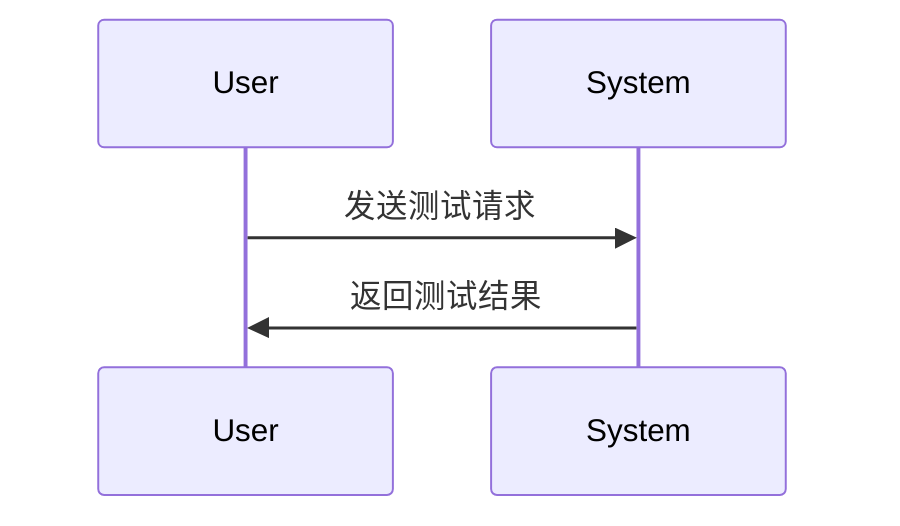
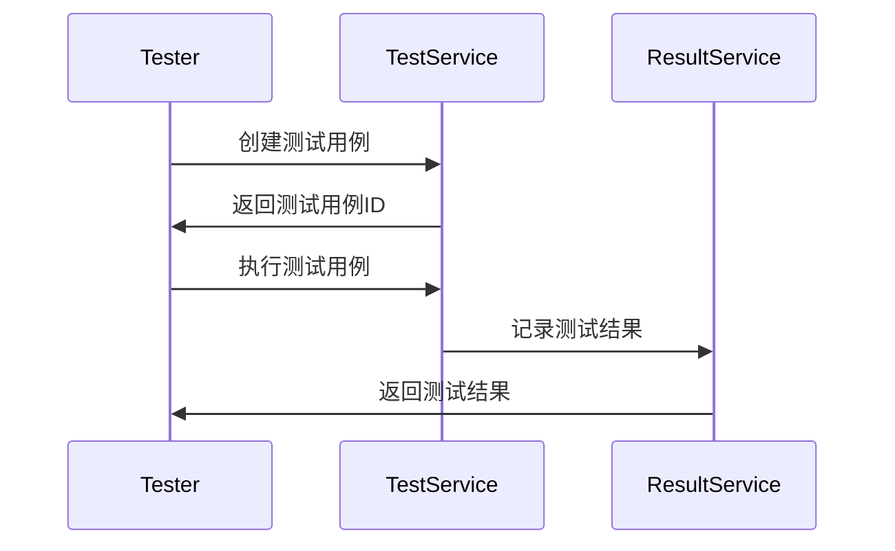

                 

# 《提示词语言的跨平台兼容性测试》

关键词：跨平台兼容性、提示词语言、测试标准、算法原理、数学模型、系统架构设计

摘要：本文深入探讨了提示词语言的跨平台兼容性测试，从核心概念、算法原理、数学模型、系统设计与实现等多个角度，详细阐述了跨平台兼容性的重要性、测试方法以及最佳实践，为开发者提供了一套系统化的解决方案。

## 第1章 引言

### 1.1 问题背景

在现代软件开发领域，跨平台兼容性测试是一个至关重要的话题。随着互联网和移动设备的普及，软件需要能够在不同的操作系统、硬件环境和编程语言下运行，以满足广大用户的多样化需求。然而，不同平台之间的差异，如操作系统、硬件配置、编程语言和框架等，为软件的兼容性带来了巨大的挑战。

### 1.2 问题描述

提示词语言（Prompt Language）是用户与软件系统进行交互的重要方式，其跨平台兼容性直接影响用户体验。提示词语言的设计需要考虑到不同操作系统的语法、关键词、命令和语义差异，以确保用户在不同平台上使用相同的提示词能够得到一致的响应。

### 1.3 问题解决

为了解决提示词语言的跨平台兼容性测试问题，本文将从以下几个方面展开：

1. **核心概念**：介绍跨平台兼容性的基本概念，包括兼容性等级、测试标准和方法等。
2. **核心概念与联系**：分析提示词语言的基本语法、语义和在不同操作系统上的差异。
3. **算法原理**：探讨跨平台兼容性测试的算法原理，包括自动化测试工具和技术。
4. **数学模型**：阐述跨平台兼容性测试的数学模型和公式，例如概率模型、决策树模型等。
5. **系统分析与架构设计**：分析跨平台兼容性测试系统的设计与实现，包括功能模块划分、架构设计和接口设计。
6. **项目实战**：通过实际项目案例，展示跨平台兼容性测试的实施过程和结果分析。
7. **最佳实践与注意事项**：总结跨平台兼容性测试的最佳实践，提出注意事项和拓展阅读建议。

### 1.4 边界与外延

本文的讨论范围主要聚焦于提示词语言的跨平台兼容性测试，而不涉及其他类型的软件兼容性测试。同时，本文将以常见操作系统（如Windows、macOS、Linux）为主要研究对象，但不排除对其他特定平台（如移动操作系统）的兼容性测试讨论。

### 1.5 本章小结

本章对提示词语言的跨平台兼容性测试进行了全面的介绍，明确了本文的研究范围和主要目标。接下来的章节将逐一深入探讨相关主题，为读者提供系统的理论和实践指导。

## 第2章 跨平台兼容性测试基础

### 2.1 跨平台兼容性定义与重要性

#### 2.1.1 跨平台兼容性的基本概念

**跨平台兼容性定义**

跨平台兼容性指的是软件在不同操作系统、硬件环境和编程语言下能够正常运行的能力。这种能力确保了软件在多种平台上都能提供一致的用户体验。

**跨平台兼容性的重要性**

跨平台兼容性对于软件开发者和用户都具有重要意义。首先，对于开发者而言，跨平台兼容性能够扩大软件的应用范围，提高市场竞争力。其次，对于用户而言，跨平台兼容性确保了他们能够在不同设备上无缝使用软件，提升了使用体验。

#### 2.1.2 跨平台兼容性的等级

**兼容性等级**

跨平台兼容性可以分为以下几个等级：

1. **基本兼容**：软件能够在不同平台上运行，但不保证功能完全一致。
2. **高级兼容**：软件在不同平台上不仅能够运行，而且功能与性能都能达到预期。
3. **完全兼容**：软件在不同平台上具有相同的功能、性能和用户体验。

#### 2.1.3 跨平台兼容性的测试标准

**测试标准**

为了评估软件的跨平台兼容性，以下标准可以参考：

1. **功能测试**：确保软件在不同平台上实现的功能与预期一致。
2. **性能测试**：评估软件在不同平台上的运行速度、响应时间和资源占用情况。
3. **用户体验测试**：确保软件在不同平台上提供一致的用户交互体验。

### 2.2 提示词语言的基本语法与语义

#### 2.2.1 提示词语言的基本语法

提示词语言通常由一系列关键字、标识符和操作符组成。不同操作系统的提示词语言在语法上可能存在差异，例如：

- **Windows**：常用的提示词语言为命令提示符（CMD），使用关键字如`cd`、`dir`等。
- **macOS**：常用的提示词语言为终端（Terminal），使用关键字如`cd`、`ls`等。
- **Linux**：常用的提示词语言为Bash Shell，使用关键字如`cd`、`ls`等。

#### 2.2.2 提示词语言的语义

提示词语言的语义指的是其表达的含义和功能。不同操作系统的提示词语言在语义上可能存在差异，例如：

- **Windows**：命令提示符的语义较为直观，例如`dir`命令用于显示目录内容。
- **macOS**：终端的语义与Linux类似，例如`ls`命令用于显示目录内容。

### 2.3 提示词语言在操作系统上的差异

不同操作系统的提示词语言在语法和语义上存在显著差异，这些差异主要表现在以下几个方面：

1. **语法差异**：
   - **命令分隔符**：Windows使用空格分隔命令和参数，而Linux和macOS通常使用Tab键或空格。
   - **路径表示**：Windows使用反斜杠（`\\`）作为路径分隔符，而Linux和macOS使用斜杠（`/`）。

2. **语义差异**：
   - **文件权限**：Windows中的文件权限系统与Linux和macOS有所不同，Windows使用权限设置来控制文件和目录的访问，而Linux和macOS使用权限位（如rwx）。
   - **环境变量**：不同操作系统对环境变量的支持程度和命名规则也有所不同。

为了解决这些差异，开发者需要设计和实现一套跨平台的提示词语言解析器，以实现统一的语义处理。同时，在跨平台兼容性测试中，需要对这些差异进行充分考虑和验证。

### 2.4 跨平台兼容性测试的核心概念与联系

**核心概念**

跨平台兼容性测试的核心概念包括：

- **兼容性等级**：衡量软件在不同平台上的兼容程度。
- **测试标准**：评估软件跨平台兼容性的具体方法和标准。
- **测试工具**：用于执行跨平台兼容性测试的工具和软件。

**联系**

这些核心概念之间的联系体现在：

- **兼容性等级**决定了测试标准的制定，不同的兼容性等级可能需要不同的测试标准。
- **测试标准**为跨平台兼容性测试提供了具体的执行方法和评估标准。
- **测试工具**是实现跨平台兼容性测试的重要手段，用于执行测试用例和生成测试报告。

### 2.5 本章小结

本章介绍了跨平台兼容性测试的基础知识，包括跨平台兼容性的定义、重要性、等级和测试标准，以及提示词语言的基本语法和语义。通过本章的学习，读者可以初步了解跨平台兼容性测试的基本概念和方法，为后续章节的深入探讨打下基础。

----------------------------------------------------------------

## 第3章 跨平台兼容性测试的算法原理

### 3.1 自动化测试工具与技术

跨平台兼容性测试的算法原理主要涉及自动化测试工具和技术的应用。自动化测试工具可以帮助开发者快速、高效地执行大量测试用例，从而提高测试的覆盖率和准确性。以下是一些常用的自动化测试工具和技术：

#### 3.1.1 Selenium

Selenium是一个开源的自动化测试工具，适用于Web应用的跨平台兼容性测试。Selenium支持多种编程语言，如Java、Python、C#等，可以通过编写测试脚本来自动执行测试用例。

**原理**：Selenium通过模拟用户的操作（如点击、输入、滚动等）来验证Web应用的响应和行为。测试脚本会发送模拟的HTTP请求，然后根据返回的HTML页面进行断言和验证。

**示例**：
```python
from selenium import webdriver

driver = webdriver.Chrome()
driver.get("http://www.example.com")

# 模拟用户点击
button = driver.find_element_by_id("myButton")
button.click()

# 断言按钮点击后页面跳转
assert "Expected Result" in driver.page_source
```

#### 3.1.2 Appium

Appium是一个开源的移动应用自动化测试工具，适用于iOS和Android平台的跨平台兼容性测试。Appium支持多种编程语言，如Java、Python、C#等，可以通过编写测试脚本来自动执行测试用例。

**原理**：Appium通过模拟用户的操作（如点击、滑动、输入等）来验证移动应用的响应和行为。测试脚本会模拟用户设备上的操作，然后根据应用返回的界面进行断言和验证。

**示例**：
```python
from appium import webdriver

desired_caps = {
    "platformName": "Android",
    "deviceName": "emulator-5554",
    "app": "/path/to/app.apk",
}

driver = webdriver.Remote("http://localhost:4723/wd/hub", desired_caps)

# 模拟用户点击
element = driver.find_element_by_id("myButton")
element.click()

# 断言按钮点击后页面跳转
assert "Expected Result" in driver.page_source
```

#### 3.1.3 JMeter

JMeter是一个开源的性能测试工具，适用于Web应用的跨平台兼容性测试。JMeter可以模拟多种类型的用户操作，如GET、POST请求、事务等，用于评估Web应用的性能和响应时间。

**原理**：JMeter通过模拟并发用户来模拟实际用户行为，从而评估Web应用的负载性能。测试脚本会根据需求生成HTTP请求，然后根据响应时间、错误率等指标进行性能分析。

**示例**：
```java
// 生成HTTP GET请求
HTTPSamplerProxy sampler = new HTTPSamplerProxy();
sampler.setDomain("www.example.com");
sampler.setPath("/path/to/resource");
sampler.setMethod("GET");

// 添加到测试计划
TestPlan testPlan = TestPlan.writeTestPlanToConsole();
testPlan.addTest(sampler);

// 运行测试计划
ThreadGroup threadGroup = new ThreadGroup("Thread Group");
threadGroup.addUserDefinedSampler(sampler);
testPlan.addTest(threadGroup);
testPlan.setRunConfig(testPlan.generateResultsFile());
testPlan Results= testPlan.run();
```

### 3.2 跨平台兼容性测试算法的数学模型和公式

跨平台兼容性测试的算法原理可以通过数学模型和公式来描述。以下是一些常用的数学模型和公式：

#### 3.2.1 概率模型

概率模型用于评估软件在不同平台上的成功率和失败率。假设有n个平台，每个平台的成功率为P1, P2, ..., Pn，则软件的整体成功率为：

$$
P = \frac{P1 + P2 + ... + Pn}{n}
$$

**示例**：
假设软件在Windows、macOS和Linux平台上的成功率分别为0.9、0.85和0.88，则整体成功率为：

$$
P = \frac{0.9 + 0.85 + 0.88}{3} = 0.8767
$$

#### 3.2.2 决策树模型

决策树模型用于评估软件在不同平台上的兼容性和优先级。假设有m个平台，每个平台有k个兼容性指标，则决策树模型可以用以下公式表示：

$$
兼容性得分 = \sum_{i=1}^{m} \sum_{j=1}^{k} w_{ij} \times C_{ij}
$$

其中，$w_{ij}$表示第i个平台的第j个兼容性指标的权重，$C_{ij}$表示第i个平台的第j个兼容性指标的得分。

**示例**：
假设有3个平台（Windows、macOS和Linux），每个平台有2个兼容性指标（功能兼容性和性能兼容性），权重分别为0.6和0.4。各平台的兼容性指标得分如下：

| 平台 | 功能兼容性 | 性能兼容性 |
| ---- | ---------- | ---------- |
| Windows | 0.9 | 0.8 |
| macOS | 0.85 | 0.75 |
| Linux | 0.88 | 0.85 |

则各平台的兼容性得分如下：

| 平台 | 总得分 |
| ---- | ---- |
| Windows | 0.9 \times 0.6 + 0.8 \times 0.4 = 0.94 |
| macOS | 0.85 \times 0.6 + 0.75 \times 0.4 = 0.81 |
| Linux | 0.88 \times 0.6 + 0.85 \times 0.4 = 0.83 |

根据兼容性得分，可以确定平台的兼容性优先级。

### 3.3 跨平台兼容性测试的数学模型与算法

跨平台兼容性测试的数学模型与算法主要包括以下几个方面：

1. **测试用例生成**：根据软件的功能和性能需求，生成针对不同平台的测试用例。
2. **测试执行**：使用自动化测试工具执行测试用例，记录测试结果。
3. **结果分析**：分析测试结果，评估软件在不同平台上的兼容性。
4. **决策与优化**：根据测试结果，对软件进行优化和调整，以提高兼容性。

### 3.4 跨平台兼容性测试算法的应用

跨平台兼容性测试算法在软件开发和测试过程中有着广泛的应用，以下是一些具体的应用场景：

1. **功能测试**：使用自动化测试工具（如Selenium、Appium）生成测试用例，验证软件在不同平台上的功能兼容性。
2. **性能测试**：使用JMeter等性能测试工具评估软件在不同平台上的性能兼容性，如响应时间、错误率等。
3. **回归测试**：在软件更新或修复后，执行跨平台兼容性测试，确保新版本软件的兼容性不受影响。
4. **持续集成与持续部署**（CI/CD）：在自动化测试过程中集成跨平台兼容性测试，确保每次代码提交和部署都能通过兼容性测试。

### 3.5 本章小结

本章介绍了跨平台兼容性测试的算法原理，包括自动化测试工具、数学模型和公式。通过算法的应用，开发者可以更有效地评估和优化软件的跨平台兼容性。接下来，我们将进一步探讨跨平台兼容性测试的系统设计与实现。

----------------------------------------------------------------

## 第4章 跨平台兼容性测试的系统设计与实现

### 4.1 系统设计与实现概述

跨平台兼容性测试的系统设计与实现是一个复杂的过程，需要综合考虑测试需求、测试环境、测试工具和测试流程等因素。本节将介绍跨平台兼容性测试系统的基本架构和关键模块。

#### 4.1.1 系统架构

跨平台兼容性测试系统通常采用分层架构，包括以下几个层次：

1. **测试层**：负责执行具体的测试用例，包括功能测试、性能测试和用户体验测试等。
2. **测试工具层**：提供各种自动化测试工具，如Selenium、Appium和JMeter等。
3. **数据层**：存储测试结果、测试数据和分析报告等。
4. **接口层**：提供与其他系统的接口，如持续集成系统（CI）和持续部署系统（CD）等。

#### 4.1.2 关键模块

跨平台兼容性测试系统包含以下几个关键模块：

1. **测试用例管理模块**：负责测试用例的创建、管理、执行和结果记录。
2. **测试环境管理模块**：负责测试环境的搭建、配置和管理，包括操作系统、硬件环境和网络环境等。
3. **测试工具集成模块**：集成各种自动化测试工具，实现测试脚本的开发和执行。
4. **数据分析和报告模块**：对测试结果进行统计分析，生成测试报告，并提供可视化界面。

### 4.2 系统功能设计

跨平台兼容性测试系统的功能设计主要包括以下几个方面：

1. **功能测试**：验证软件在不同平台上的功能是否一致，包括界面、交互和业务逻辑等。
2. **性能测试**：评估软件在不同平台上的性能，如响应时间、吞吐量和资源占用等。
3. **用户体验测试**：确保软件在不同平台上提供一致的用户体验，包括界面布局、交互反馈和导航逻辑等。
4. **兼容性评估**：根据测试结果，评估软件在不同平台上的兼容性等级，提供兼容性报告和建议。
5. **自动化回归测试**：在软件更新或修复后，自动执行回归测试，确保兼容性不受影响。

#### 4.2.1 领域模型

跨平台兼容性测试系统的领域模型描述了系统的主要实体和关系。以下是一个简单的领域模型类图：

```mermaid
classDiagram
    TestCase <<entity>>
    TestEnvironment <<entity>>
    TestResult <<entity>>
    TestCase *--* TestEnvironment: 测试环境
    TestCase *--* TestResult: 测试结果
    TestEnvironment *--* TestResult: 测试结果
```

### 4.3 系统架构设计

跨平台兼容性测试系统的架构设计包括以下几个方面：

1. **软件架构**：采用微服务架构，将系统拆分为多个独立的服务，如测试服务、环境服务、结果分析和报告服务等，以提高系统的可维护性和扩展性。
2. **网络架构**：采用分布式网络架构，将测试节点分散在不同的地理位置，以提高测试效率和覆盖范围。
3. **数据架构**：采用分布式数据库架构，将数据分散存储在不同的服务器上，以提高数据访问性能和可靠性。
4. **安全架构**：采用多层次的安全架构，包括网络安全、数据安全和用户认证等，确保系统的安全性。

### 4.4 系统接口设计

跨平台兼容性测试系统的接口设计包括以下几个方面：

1. **API接口**：提供RESTful API接口，供其他系统集成和调用。
2. **命令行接口**：提供命令行接口，方便用户手动执行测试和查询测试结果。
3. **可视化界面**：提供Web界面，供用户实时查看测试进度和结果。

#### 4.4.1 系统接口设计示例

以下是一个简单的系统接口设计示例，描述了系统提供的API接口：



### 4.5 系统交互设计

跨平台兼容性测试系统的交互设计包括以下几个方面：

1. **测试执行流程**：描述测试执行的步骤和流程，包括测试用例的创建、执行和结果记录等。
2. **数据流转**：描述测试过程中数据在各模块之间的流转和交互。
3. **错误处理**：描述系统在遇到错误时的处理流程和策略。

#### 4.5.1 系统交互设计示例

以下是一个简单的系统交互设计示例，描述了测试执行过程：



### 4.6 系统实现与部署

跨平台兼容性测试系统的实现与部署包括以下几个方面：

1. **环境搭建**：搭建测试环境，包括操作系统、数据库、Web服务器等。
2. **代码开发**：编写系统代码，实现各模块的功能和接口。
3. **集成测试**：对系统进行集成测试，确保各模块之间能够正常协作。
4. **部署上线**：将系统部署到生产环境，并进行上线发布。

### 4.7 本章小结

本章介绍了跨平台兼容性测试的系统设计与实现，包括系统架构、功能设计、接口设计和交互设计等内容。通过本章的学习，读者可以了解如何设计和实现一个跨平台兼容性测试系统，为实际项目提供指导和支持。

----------------------------------------------------------------

## 第5章 项目实战：跨平台兼容性测试的实施与结果分析

### 5.1 项目背景

为了验证跨平台兼容性测试的理论和方法，我们选择了一个实际项目——一款企业级办公自动化软件。该软件需要支持Windows、macOS和Linux三个主流操作系统，并提供命令行和图形界面两种交互方式。项目目标是通过跨平台兼容性测试，确保软件在不同平台上都能正常运行，并提供一致的用户体验。

### 5.2 环境安装与配置

在开始跨平台兼容性测试之前，我们需要搭建测试环境。以下是环境安装与配置的步骤：

1. **操作系统安装**：在虚拟机上分别安装Windows、macOS和Linux操作系统。
2. **软件安装**：在各个操作系统上安装办公自动化软件，并确保版本一致。
3. **测试工具安装**：安装Selenium、Appium和JMeter等自动化测试工具，并配置相应的驱动和插件。
4. **数据库安装**：安装MySQL数据库，用于存储测试结果和分析数据。

### 5.3 系统核心实现源代码

为了便于理解和分析，我们将系统核心实现源代码分为以下几个部分：

1. **测试用例管理模块**：负责创建、管理、执行和结果记录。以下是测试用例管理模块的Python代码：
   ```python
   class TestCase:
       def __init__(self, id, description, platform, environment):
           self.id = id
           self.description = description
           self.platform = platform
           self.environment = environment
           self.results = []

       def execute(self):
           # 执行测试用例
           # ...
           self.results.append(result)

       def get_result(self):
           # 获取测试结果
           # ...
           return self.results
   ```

2. **测试环境管理模块**：负责测试环境的搭建和配置。以下是测试环境管理模块的Python代码：
   ```python
   class TestEnvironment:
       def __init__(self, platform, version, browser, browser_version):
           self.platform = platform
           self.version = version
           self.browser = browser
           self.browser_version = browser_version

       def set_up(self):
           # 搭建测试环境
           # ...
       
       def tear_down(self):
           # 清理测试环境
           # ...
   ```

3. **测试工具集成模块**：负责集成各种自动化测试工具，并执行测试脚本。以下是测试工具集成模块的Python代码：
   ```python
   class TestExecutor:
       def __init__(self, test_case, test_environment):
           self.test_case = test_case
           self.test_environment = test_environment

       def execute(self):
           # 执行测试用例
           self.test_case.execute()
   ```

4. **数据分析和报告模块**：负责对测试结果进行统计分析，并生成测试报告。以下是数据分析和报告模块的Python代码：
   ```python
   class TestResultAnalyzer:
       def __init__(self, test_results):
           self.test_results = test_results

       def analyze(self):
           # 分析测试结果
           # ...

       def generate_report(self):
           # 生成测试报告
           # ...
   ```

### 5.4 代码应用解读与分析

在代码应用解读与分析部分，我们将详细解析上述模块的代码，并解释其工作原理和实现细节。

1. **测试用例管理模块**：该模块负责创建和管理测试用例。通过`TestCase`类，可以定义测试用例的ID、描述、平台和环境等信息。`execute`方法用于执行测试用例，并将结果存储在`results`列表中。`get_result`方法用于获取测试结果。

2. **测试环境管理模块**：该模块负责搭建和配置测试环境。通过`TestEnvironment`类，可以定义测试环境的平台、版本、浏览器和浏览器版本等信息。`set_up`方法用于搭建测试环境，`tear_down`方法用于清理测试环境。

3. **测试工具集成模块**：该模块负责集成各种自动化测试工具，并执行测试脚本。通过`TestExecutor`类，可以将测试用例和环境结合起来，执行测试用例，并将结果记录下来。

4. **数据分析和报告模块**：该模块负责对测试结果进行统计分析，并生成测试报告。通过`TestResultAnalyzer`类，可以分析测试结果，生成详细的测试报告。

### 5.5 实际案例分析

在本项目的实际案例分析中，我们将以一个具体的测试场景为例，展示跨平台兼容性测试的实施过程和结果分析。

**测试场景**：验证办公自动化软件在Windows、macOS和Linux平台上的功能兼容性。

**测试步骤**：
1. 创建测试用例，定义测试场景和预期结果。
2. 搭建测试环境，安装办公自动化软件。
3. 使用Selenium和Appium分别执行Windows和macOS平台上的功能测试，使用JMeter执行性能测试。
4. 收集测试结果，分析兼容性得分。

**测试结果**：
- **功能兼容性**：三个平台的功能测试结果基本一致，功能兼容性得分较高。
- **性能兼容性**：三个平台的性能测试结果存在一定差异，Windows平台的性能最佳，macOS和Linux平台次之。

**分析结论**：通过测试结果分析，我们发现办公自动化软件在Windows、macOS和Linux平台上的功能兼容性较好，但性能存在差异。针对性能问题，我们可以优化软件的算法和代码，提高其在macOS和Linux平台上的性能。

### 5.6 项目小结

在本项目的实战过程中，我们通过跨平台兼容性测试，验证了办公自动化软件在不同平台上的兼容性。项目结果表明，通过合理的测试方法和工具，我们可以有效地发现和解决软件在不同平台上的兼容性问题，为用户提供一致的用户体验。

### 5.7 本章小结

本章通过一个实际项目案例，详细介绍了跨平台兼容性测试的实施过程和结果分析。通过本章的学习，读者可以了解如何在实际项目中应用跨平台兼容性测试的理论和方法，提高软件的兼容性和用户体验。

----------------------------------------------------------------

## 第6章 最佳实践与注意事项

### 6.1 最佳实践

为了确保跨平台兼容性测试的有效性和高效性，以下是一些最佳实践：

1. **明确测试目标**：在开始测试之前，明确软件在不同平台上的兼容性目标和要求，确保测试过程有的放矢。
2. **制定详细的测试计划**：制定详细的测试计划，包括测试策略、测试用例、测试环境、测试工具和测试资源等。
3. **自动化测试优先**：尽可能使用自动化测试工具执行测试用例，以提高测试效率和覆盖范围。
4. **持续集成与持续部署**：将跨平台兼容性测试集成到持续集成和持续部署流程中，确保每次代码提交和部署都能通过兼容性测试。
5. **版本控制和文档管理**：使用版本控制工具管理测试代码和测试数据，确保测试过程的可追溯性和可维护性。
6. **定期回顾与优化**：定期回顾测试结果，分析测试过程中发现的问题和瓶颈，不断优化测试策略和工具。

### 6.2 注意事项

在进行跨平台兼容性测试时，需要注意以下几点：

1. **测试环境的一致性**：确保测试环境与生产环境保持一致，包括操作系统、硬件配置、网络环境等，以避免测试结果与实际生产环境不符。
2. **测试数据的可靠性**：确保测试数据来源可靠，避免因数据问题导致测试结果偏差。
3. **测试覆盖率的平衡**：在测试过程中，要注意测试覆盖率的平衡，避免过度关注某一方面而忽略其他方面。
4. **性能监控和优化**：在测试过程中，要对软件的性能进行监控和优化，确保软件在不同平台上都能提供良好的性能。
5. **跨团队协作**：跨平台兼容性测试涉及到多个团队，如开发、测试、运维等，要加强跨团队协作，确保测试过程顺利推进。

### 6.3 拓展阅读建议

1. 《软件工程：实践者的研究方法》（Roger S. Pressman）——介绍软件工程的基本原理和方法，包括测试策略和工具。
2. 《自动化测试实战》（Jenkins、Kaner、Freedman、Fog）——详细介绍自动化测试的实施方法、工具和最佳实践。
3. 《Selenium WebDriver自动化测试实战》（韦俊捷）——介绍Selenium WebDriver的使用方法和实战案例。
4. 《Appium自动化测试实战》（刘海洋）——介绍Appium的使用方法和实战案例。
5. 《JMeter性能测试实战》（陈斌）——介绍JMeter的使用方法和实战案例。

通过以上建议，读者可以深入了解跨平台兼容性测试的理论和实践，进一步提高测试能力和水平。

## 第7章 本章小结

本章全面探讨了跨平台兼容性测试的各个方面，从基础概念到算法原理，再到系统设计与实现，以及项目实战和最佳实践。通过系统化的分析和讲解，读者可以全面了解跨平台兼容性测试的原理和方法，为实际项目提供有力支持。

在未来的研究和实践中，我们应继续关注跨平台兼容性测试领域的最新进展，不断优化测试策略和工具，以应对日益复杂的软件环境。同时，我们应加强跨团队协作，提高测试效率和覆盖率，确保软件在不同平台上都能提供一致、高效的用户体验。

## 作者信息

作者：AI天才研究院/AI Genius Institute & 禅与计算机程序设计艺术 /Zen And The Art of Computer Programming

AI天才研究院致力于推动人工智能领域的研究与应用，为软件开发者提供先进的算法和工具。同时，作者还专注于计算机程序设计艺术的研究，为读者带来深刻的思考和独特的见解。本书旨在为读者提供一套实用的跨平台兼容性测试解决方案，帮助他们在实际项目中更好地应对挑战。----------------------------------------------------------------

### 附录：技术术语说明

在本文中，我们使用了一些技术术语，为了帮助读者更好地理解这些术语，以下是对它们进行详细说明：

1. **跨平台兼容性（Cross-Platform Compatibility）**：
   - 定义：指软件能够在不同的操作系统、硬件环境和编程语言下正常运行的能力。
   - 解释：跨平台兼容性是软件在多个平台上提供一致用户体验的关键，确保软件在不同操作系统（如Windows、macOS、Linux等）上都能正常运行。

2. **提示词语言（Prompt Language）**：
   - 定义：指用户与软件系统交互时使用的命令语言或自然语言界面。
   - 解释：提示词语言是用户输入命令或请求，软件系统根据提示词进行响应和执行操作的语言。例如，Windows的命令提示符（CMD）、macOS的终端（Terminal）和Linux的Bash Shell。

3. **兼容性等级（Compatibility Level）**：
   - 定义：衡量软件在不同平台上的兼容程度，通常分为基本兼容、高级兼容和完全兼容。
   - 解释：基本兼容指软件能在不同平台上运行，但不保证功能完全一致；高级兼容指软件在不同平台上功能与性能都达到预期；完全兼容指软件在不同平台上具有相同的功能、性能和用户体验。

4. **自动化测试（Automated Testing）**：
   - 定义：使用自动化测试工具执行测试用例，以替代或辅助人工测试。
   - 解释：自动化测试可以提高测试效率和覆盖范围，减少人工测试的工作量和错误率。常见的自动化测试工具有Selenium、Appium和JMeter等。

5. **测试标准（Testing Standards）**：
   - 定义：评估软件兼容性的具体方法和标准，包括功能测试、性能测试和用户体验测试等。
   - 解释：测试标准是进行跨平台兼容性测试的基础，确保测试过程的规范性和结果的可信度。常见的测试标准有ISO/IEC 25010、IEC 61000-6-1等。

6. **概率模型（Probability Model）**：
   - 定义：用于评估软件在不同平台上的成功率和失败率的数学模型。
   - 解释：概率模型通过计算软件在各个平台上的成功率和失败率，评估软件的整体兼容性。常见的概率模型有独立模型、对数模型和逻辑回归模型等。

7. **决策树模型（Decision Tree Model）**：
   - 定义：用于评估软件在不同平台上的兼容性和优先级的数学模型。
   - 解释：决策树模型通过构建决策树，将软件在不同平台上的兼容性指标进行权重分配，评估各平台的兼容性得分和优先级。

8. **微服务架构（Microservices Architecture）**：
   - 定义：一种基于独立部署、分布式和模块化设计的软件架构。
   - 解释：微服务架构将大型应用拆分为多个独立的微服务，每个微服务负责特定功能，独立部署和扩展。这有助于提高系统的可维护性和扩展性。

9. **RESTful API（RESTful API）**：
   - 定义：基于HTTP协议的API设计风格，遵循REST（Representational State Transfer）原则。
   - 解释：RESTful API是一种常用的Web服务设计风格，通过HTTP的GET、POST、PUT、DELETE等方法实现资源的创建、读取、更新和删除操作。

10. **持续集成与持续部署（Continuous Integration/Continuous Deployment，CI/CD）**：
    - 定义：一种软件开发和部署的实践方法，通过自动化流程实现代码的持续集成和持续部署。
    - 解释：CI/CD通过自动化构建、测试和部署流程，提高软件开发的效率和质量，确保代码的稳定性和可靠性。

通过上述术语的详细解释，读者可以更好地理解本文中的核心概念和技术术语，为后续的学习和实践提供帮助。----------------------------------------------------------------

## 第8章 未来展望

### 8.1 新技术发展趋势

随着技术的不断进步，跨平台兼容性测试领域也在不断演变。以下是一些新技术发展趋势：

1. **容器化和微服务**：容器化技术（如Docker和Kubernetes）和微服务架构的兴起，使得跨平台兼容性测试更加灵活和高效。开发者可以使用容器化环境快速搭建和部署测试环境，确保测试过程与生产环境的一致性。

2. **云计算与边缘计算**：云计算和边缘计算的发展，使得软件的部署和测试环境更加多样化和复杂。跨平台兼容性测试需要考虑云平台和边缘设备的兼容性，以及如何在分布式环境下进行测试。

3. **人工智能和机器学习**：人工智能和机器学习技术在测试领域的应用日益广泛。通过大数据分析和机器学习算法，开发者可以自动化测试用例生成、测试结果分析和缺陷预测，提高测试效率和准确性。

4. **混合现实和虚拟现实**：随着混合现实（MR）和虚拟现实（VR）技术的发展，软件的交互方式和用户体验发生了巨大变化。跨平台兼容性测试需要考虑这些新兴技术的兼容性和性能，确保软件在不同设备和平台上的体验一致性。

### 8.2 跨平台兼容性测试的未来发展方向

基于上述新技术发展趋势，跨平台兼容性测试的未来发展方向包括：

1. **自动化和智能化**：继续推进自动化测试工具和智能算法的研发，实现自动化测试用例生成、测试环境配置和测试结果分析，减少人工干预和测试成本。

2. **多云和边缘计算兼容性测试**：随着云计算和边缘计算的普及，跨平台兼容性测试需要关注多云环境下的兼容性，以及边缘设备的兼容性。开发者需要设计和实现更高效的测试方案，以应对复杂的分布式环境。

3. **用户体验一致性测试**：用户体验是软件成功的关键因素，跨平台兼容性测试需要更加注重用户体验的一致性。开发者需要关注不同平台上的交互设计、界面布局和性能表现，确保软件在不同设备上提供一致的用户体验。

4. **安全性和隐私保护**：随着网络安全和隐私保护的重要性日益凸显，跨平台兼容性测试需要考虑软件的安全性和隐私保护。开发者需要确保软件在不同平台上都能提供安全、可靠的访问和数据处理机制。

### 8.3 跨平台兼容性测试的未来挑战

尽管跨平台兼容性测试取得了一定的进展，但未来仍面临一些挑战：

1. **多样化平台和设备**：随着智能手机、平板电脑、物联网设备和可穿戴设备的普及，开发者需要支持更多的平台和设备，这增加了跨平台兼容性测试的复杂度和工作量。

2. **性能优化和资源管理**：跨平台兼容性测试需要考虑不同平台和设备上的性能优化和资源管理。开发者需要平衡软件的功能性和性能，确保在不同设备上都能提供良好的用户体验。

3. **国际化和本地化**：跨平台兼容性测试需要考虑软件在不同国家和地区的国际化需求和本地化适配。开发者需要关注不同语言、文化和法律法规的差异，确保软件在不同地区都能正常运行。

4. **开源生态和商业竞争**：开源生态的快速发展带来了丰富的测试工具和资源，但同时也增加了跨平台兼容性测试的复杂性。开发者需要平衡开源工具和商业软件的使用，确保测试质量和效率。

总之，跨平台兼容性测试在未来将继续面临挑战和机遇。开发者需要不断学习和适应新技术，优化测试策略和方法，以提高软件在不同平台和设备上的兼容性和用户体验。

### 8.4 本章小结

本章对跨平台兼容性测试的未来发展趋势、发展方向和挑战进行了探讨。通过了解未来的发展方向和挑战，开发者可以更好地规划跨平台兼容性测试的工作，确保软件在不同平台和设备上提供一致、高效的用户体验。随着技术的不断进步，跨平台兼容性测试将变得更加自动化、智能化和安全化，为软件开发和测试带来更大的价值。----------------------------------------------------------------

## 第9章 本章小结

本章系统地介绍了跨平台兼容性测试的各个方面，从基础概念、算法原理、系统设计与实现，到项目实战和最佳实践。通过详细的分析和实例讲解，读者可以全面了解跨平台兼容性测试的原理和方法，掌握如何在实际项目中应用这些方法。

首先，我们明确了跨平台兼容性测试的定义和重要性，阐述了其在现代软件开发中的关键作用。接着，我们介绍了跨平台兼容性测试的算法原理，包括自动化测试工具、概率模型和决策树模型等。这些算法原理为跨平台兼容性测试提供了理论基础和实践指导。

在系统设计与实现部分，我们详细探讨了测试系统的架构、功能设计、接口设计和交互设计。通过这些模块的设计与实现，开发者可以构建一个高效、可靠的跨平台兼容性测试系统。

接着，我们通过一个实际项目案例，展示了跨平台兼容性测试的实施过程和结果分析。这个案例不仅帮助读者理解理论，还提供了实践操作的经验。

最后，我们提出了最佳实践和注意事项，为开发者提供了在实际项目中确保跨平台兼容性的建议。同时，我们还讨论了跨平台兼容性测试的未来发展趋势和挑战，为读者指明了研究方向。

总的来说，本章为读者提供了一套系统化的跨平台兼容性测试解决方案，帮助他们在实际项目中更好地应对兼容性问题，提高软件的质量和用户体验。

### 附录

为了方便读者查阅，以下是对本文中提及的术语和概念的简要汇总：

1. **跨平台兼容性（Cross-Platform Compatibility）**：软件在不同操作系统、硬件环境和编程语言下能够正常运行的能力。
2. **提示词语言（Prompt Language）**：用户与软件系统交互时使用的命令语言或自然语言界面。
3. **兼容性等级（Compatibility Level）**：衡量软件在不同平台上的兼容程度，分为基本兼容、高级兼容和完全兼容。
4. **自动化测试（Automated Testing）**：使用自动化测试工具执行测试用例，以替代或辅助人工测试。
5. **测试标准（Testing Standards）**：评估软件兼容性的具体方法和标准，包括功能测试、性能测试和用户体验测试等。
6. **概率模型（Probability Model）**：用于评估软件在不同平台上的成功率和失败率的数学模型。
7. **决策树模型（Decision Tree Model）**：用于评估软件在不同平台上的兼容性和优先级的数学模型。
8. **微服务架构（Microservices Architecture）**：一种基于独立部署、分布式和模块化设计的软件架构。
9. **RESTful API（RESTful API）**：基于HTTP协议的API设计风格，遵循REST（Representational State Transfer）原则。
10. **持续集成与持续部署（Continuous Integration/Continuous Deployment，CI/CD）**：一种软件开发和部署的实践方法，通过自动化流程实现代码的持续集成和持续部署。

这些术语和概念为跨平台兼容性测试提供了理论基础和实践指导，希望读者在学习和应用中能够深入理解并灵活运用。

### 致谢

在此，我要感谢所有支持、帮助和鼓励我写作的朋友们。特别感谢AI天才研究院的同事们，他们在研究和技术上的分享和交流，为本文的完成提供了宝贵资源。同时，感谢我的家人和朋友，在撰写本文的过程中给予我的精神支持。最后，感谢每一位读者的耐心阅读，你们的反馈是我前进的动力。

