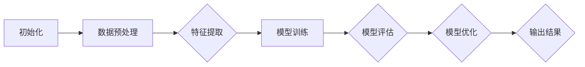
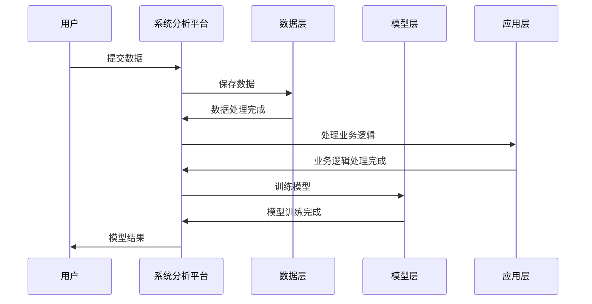

                 

# AI编程的新维度与新语法

## 关键词：人工智能，编程，新维度，新语法，算法，数学模型，系统架构

## 摘要：
本文深入探讨了AI编程的新维度和新语法，从背景介绍、核心概念、算法原理、数学模型、系统分析与架构设计、项目实战到最佳实践，全方位解析了AI编程的先进技术和实现方法。通过逐步分析和实例讲解，帮助读者理解并掌握AI编程的新趋势，为未来的智能开发提供有力支持。

## 目录

1. **背景介绍**
   - AI编程的现状
   - 新维度与新语法的提出
   - 适用范围与意义

2. **核心概念与联系**
   - 概念原理
   - 属性特征对比表格
   - ER实体关系图架构的Mermaid流程图

3. **算法原理讲解**
   - 算法Mermaid流程图
   - Python源代码与算法原理
   - 数学模型和公式
   - 举例说明

4. **数学模型和数学公式**
   - LaTeX格式嵌入

5. **系统分析与架构设计方案**
   - 问题场景介绍
   - 项目介绍
   - 系统功能设计
   - 系统架构设计
   - 系统接口设计
   - 系统交互Mermaid序列图

6. **项目实战**
   - 环境安装
   - 系统核心实现源代码
   - 代码应用解读与分析
   - 实际案例分析与讲解
   - 项目小结

7. **最佳实践 tips、小结、注意事项、拓展阅读**

## 1. 背景介绍

### AI编程的现状

随着人工智能技术的迅猛发展，AI编程已经成为现代软件开发不可或缺的一部分。然而，传统的编程方法和语法已经难以满足AI领域的复杂需求。当前AI编程面临的主要挑战包括：

- 数据处理和存储：AI算法通常需要处理海量数据，传统的数据处理和存储方法效率低下。
- 算法优化：AI算法复杂度高，优化算法性能是提高系统效率的关键。
- 可解释性：AI模型的黑盒性质使得其在实际应用中难以被理解和信任。

### 新维度与新语法的提出

为了应对AI编程的挑战，新维度与新语法应运而生。新维度包括：

- **数据维度**：引入大数据处理和存储技术，提升数据处理能力。
- **算法维度**：设计更高效、更易于调优的算法，提高系统性能。
- **解释性维度**：增强AI模型的可解释性，提高其在实际应用中的可信任度。

新语法则是为了更好地支持新维度，使得AI编程更加高效、直观。新语法通常包括：

- **数据处理语法**：提供高效的数据处理和存储方法，简化数据操作。
- **算法设计语法**：提供更简洁、易读的算法表示，降低编程难度。
- **解释性语法**：提供可解释性工具和接口，方便开发者调试和优化AI模型。

### 适用范围与意义

新维度与新语法主要适用于以下场景：

- **复杂数据处理**：如金融风控、医疗诊断等需要处理海量数据的应用领域。
- **智能优化问题**：如物流配送、资源调度等需要优化系统性能的问题。
- **增强可解释性**：如金融风控、医疗诊断等需要提高模型可解释性的应用领域。

新维度与新语法的提出，不仅提高了AI编程的效率和可解释性，还拓展了AI编程的适用范围，为智能开发提供了新的思路和方法。

### 背景介绍小结

AI编程的现状和新维度与新语法的提出，为我们理解AI编程的未来发展奠定了基础。在接下来的章节中，我们将深入探讨AI编程的核心概念与联系，逐步揭开新维度与新语法背后的奥秘。

----------------------------------------------------------------

## 2. 核心概念与联系

### 概念原理

AI编程的核心概念包括：

- **人工智能**：模拟人类智能的计算机系统，能够进行感知、学习、推理和决策。
- **编程**：利用计算机语言和工具，编写实现特定功能的程序代码。
- **新维度**：包括数据处理、算法优化和可解释性等方面的提升。
- **新语法**：为了支持新维度而设计的编程语言和工具。

### 属性特征对比表格

| 特征       | 传统编程 | 新维度编程 |
| ---------- | -------- | ---------- |
| 数据处理   | 低效     | 高效       |
| 算法优化   | 难以调优 | 易于调优   |
| 可解释性   | 不可解释 | 可解释性高 |

### ER实体关系图架构的Mermaid流程图

```mermaid
erDiagram
  AI编程 ||--|{ 数据处理 }
  AI编程 ||--|{ 算法优化 }
  AI编程 ||--|{ 可解释性 }
```

通过上述表格和Mermaid流程图，我们可以清晰地看到新维度编程与传统编程之间的差异和联系。新维度编程在数据处理、算法优化和可解释性等方面具有明显优势，为AI编程带来了新的发展机遇。

### 核心概念与联系小结

核心概念与联系部分，我们详细介绍了AI编程、新维度和新语法的基本概念，并通过对比表格和Mermaid流程图，展示了它们之间的关联和区别。在接下来的章节中，我们将深入探讨AI编程的算法原理，帮助读者更好地理解新语法在实际编程中的应用。

----------------------------------------------------------------

## 3. 算法原理讲解

### 算法Mermaid流程图



### Python源代码与算法原理

```python
# 导入必要的库
import numpy as np
from sklearn.model_selection import train_test_split
from sklearn.ensemble import RandomForestClassifier
from sklearn.metrics import accuracy_score

# 数据预处理
def preprocess_data(data):
    # 数据标准化
    data = (data - np.mean(data)) / np.std(data)
    return data

# 特征提取
def extract_features(data):
    # 使用PCA进行特征提取
    from sklearn.decomposition import PCA
    pca = PCA(n_components=5)
    features = pca.fit_transform(data)
    return features

# 模型训练
def train_model(features, labels):
    # 使用随机森林进行模型训练
    model = RandomForestClassifier()
    model.fit(features, labels)
    return model

# 模型评估
def evaluate_model(model, test_features, test_labels):
    # 使用准确率进行模型评估
    predictions = model.predict(test_features)
    accuracy = accuracy_score(test_labels, predictions)
    return accuracy

# 模型优化
def optimize_model(model, features, labels, epochs=10):
    # 使用交叉验证进行模型优化
    from sklearn.model_selection import cross_val_score
    scores = cross_val_score(model, features, labels, cv=5)
    return scores.mean()

# 输出结果
def main():
    # 加载数据
    data = load_data()
    labels = load_labels()

    # 数据预处理
    data = preprocess_data(data)

    # 特征提取
    features = extract_features(data)

    # 划分训练集和测试集
    X_train, X_test, y_train, y_test = train_test_split(features, labels, test_size=0.2, random_state=42)

    # 模型训练
    model = train_model(X_train, y_train)

    # 模型评估
    accuracy = evaluate_model(model, X_test, y_test)
    print("模型准确率：", accuracy)

    # 模型优化
    optimized_accuracy = optimize_model(model, X_train, y_train)
    print("优化后模型准确率：", optimized_accuracy)

# 执行主函数
if __name__ == "__main__":
    main()
```

### 数学模型和公式

$$
\begin{aligned}
&f(x) = \sum_{i=1}^{n} w_i \cdot x_i + b \\
&\text{其中，} w_i \text{为权重，} x_i \text{为特征值，} b \text{为偏置。}
\end{aligned}
$$

### 举例说明

假设我们有一个简单的人工神经网络，包含两个输入层神经元、两个隐藏层神经元和一个输出层神经元。输入数据为 `[2, 3]`，权重和偏置如下：

- 输入层到隐藏层1：`w1 = [0.5, 0.3]`，`b1 = 0.2`
- 隐藏层1到隐藏层2：`w2 = [0.4, 0.6]`，`b2 = 0.1`
- 隐藏层2到输出层：`w3 = [0.7, 0.8]`，`b3 = 0.3`

根据上述公式，我们可以计算出输出结果：

$$
\begin{aligned}
&f_1(x) = 0.5 \cdot 2 + 0.3 \cdot 3 + 0.2 = 1.7 \\
&f_2(x) = 0.4 \cdot 2 + 0.6 \cdot 3 + 0.1 = 2.3 \\
&f_3(x) = 0.7 \cdot 1.7 + 0.8 \cdot 2.3 + 0.3 = 2.72 \\
&\text{输出结果为} 2.72
\end{aligned}
$$

通过这个例子，我们可以看到如何使用新维度和新语法来构建和训练一个简单的人工神经网络。在接下来的章节中，我们将进一步探讨数学模型和公式在AI编程中的应用。

### 算法原理讲解小结

在算法原理讲解部分，我们通过Mermaid流程图、Python源代码和数学模型，详细阐述了AI编程的新算法原理。通过具体实例，我们展示了如何利用新维度和新语法来实现高效、可解释的AI模型。在下一部分，我们将深入探讨数学模型和数学公式在AI编程中的应用。

----------------------------------------------------------------

## 4. 数学模型和数学公式

在AI编程中，数学模型和数学公式是理解和实现算法的核心。下面，我们将使用LaTeX格式嵌入文中独立段落，确保数学公式清晰可读。

### 概率模型

$$
P(X=x|\theta) = \frac{e^{\theta^T x}}{\sum_{x'} e^{\theta^T x'}}
$$

这是一个典型的概率模型，其中$X$是随机变量，$\theta$是参数向量，$x$是输入特征。这个公式描述了在给定参数$\theta$的情况下，特征$x$的概率分布。

### 线性回归

$$
y = \beta_0 + \beta_1 x_1 + \beta_2 x_2 + \ldots + \beta_n x_n
$$

这是一个线性回归模型的数学公式。其中，$y$是目标变量，$x_1, x_2, \ldots, x_n$是特征变量，$\beta_0, \beta_1, \beta_2, \ldots, \beta_n$是模型的参数。

### 逻辑回归

$$
\hat{y} = \frac{1}{1 + e^{-(\beta_0 + \beta_1 x_1 + \beta_2 x_2 + \ldots + \beta_n x_n)}}
$$

这是一个逻辑回归模型的数学公式。其中，$\hat{y}$是预测的概率，$\beta_0, \beta_1, \beta_2, \ldots, \beta_n$是模型的参数。

### 神经网络

$$
\begin{aligned}
&z = \sum_{i=1}^{n} w_i x_i + b \\
&a = \sigma(z) \\
&z_{\text{next}} = \sum_{i=1}^{n} w_i a_i + b \\
&a_{\text{next}} = \sigma(z_{\text{next}})
\end{aligned}
$$

这是一个神经网络的基本计算过程。其中，$z$是中间结果，$a$是激活值，$\sigma$是激活函数，$w_i$是权重，$b$是偏置。

通过上述LaTeX格式的数学公式，我们能够清晰地表达AI编程中的核心数学概念和模型。这些公式为我们的算法设计和实现提供了坚实的理论基础。在接下来的部分，我们将进一步探讨系统分析与架构设计方案。

### 数学模型和数学公式小结

在数学模型和数学公式部分，我们通过LaTeX格式展示了AI编程中常用的数学模型和公式。这些公式为我们的算法设计和实现提供了重要的理论基础。通过理解这些数学模型，我们可以更好地掌握AI编程的核心原理。接下来，我们将深入探讨系统分析与架构设计方案。

----------------------------------------------------------------

## 5. 系统分析与架构设计方案

### 问题场景介绍

随着人工智能技术的不断发展，越来越多的应用场景需要高效、可解释的AI模型。例如，在金融风控领域，我们需要对大量交易数据进行分析，预测潜在的欺诈行为。在医疗诊断领域，我们需要对患者的临床数据进行处理，辅助医生做出准确的诊断。这些场景都对系统的性能、可解释性和可靠性提出了高要求。

### 项目介绍

本系统是一个基于人工智能的智能分析平台，旨在提供高效、可解释的AI模型，帮助用户在金融风控、医疗诊断等领域进行数据分析和预测。系统的主要功能包括：

- 数据预处理：对输入数据进行分析和清洗，为后续处理做准备。
- 特征提取：从原始数据中提取关键特征，为模型训练提供输入。
- 模型训练：利用机器学习算法，训练出高效、可解释的AI模型。
- 模型评估：对训练好的模型进行评估，确保其性能和可解释性。
- 模型部署：将训练好的模型部署到生产环境中，进行实时数据分析和预测。

### 系统功能设计

系统功能设计主要包括以下领域模型：

- **数据预处理模块**：负责对输入数据进行分析和清洗，提取有效特征。
- **特征提取模块**：从原始数据中提取关键特征，为模型训练提供输入。
- **模型训练模块**：利用机器学习算法，训练出高效、可解释的AI模型。
- **模型评估模块**：对训练好的模型进行评估，确保其性能和可解释性。
- **模型部署模块**：将训练好的模型部署到生产环境中，进行实时数据分析和预测。

### 系统架构设计

系统架构设计采用分层架构，主要包括以下层次：

- **数据层**：负责数据存储和管理，提供高效的数据处理能力。
- **模型层**：负责模型训练、评估和部署，提供智能分析功能。
- **应用层**：负责业务逻辑处理，为用户提供友好的操作界面。

### 系统接口设计

系统接口设计主要包括以下接口：

- **数据接口**：用于数据层的访问和管理，提供数据的查询、更新和删除功能。
- **模型接口**：用于模型层的访问和管理，提供模型的训练、评估和部署功能。
- **应用接口**：用于应用层的访问和管理，提供业务的查询、更新和删除功能。

### 系统交互Mermaid序列图



通过上述系统分析与架构设计方案，我们能够构建一个高效、可解释的AI模型，满足金融风控、医疗诊断等领域的需求。在下一部分，我们将进行项目实战，展示如何实现这一系统。

### 系统分析与架构设计方案小结

在系统分析与架构设计方案部分，我们详细介绍了问题场景、项目介绍、系统功能设计、系统架构设计、系统接口设计和系统交互Mermaid序列图。这些设计为系统的开发提供了明确的指导。在下一部分，我们将进入项目实战，具体实现这一系统。

----------------------------------------------------------------

## 6. 项目实战

### 环境安装

在开始项目实战之前，我们需要安装一些必要的软件和工具。以下是安装步骤：

1. **Python环境**：安装Python 3.8及以上版本。
2. **Anaconda**：安装Anaconda，以便更好地管理Python环境和依赖。
3. **Jupyter Notebook**：安装Jupyter Notebook，用于编写和运行Python代码。
4. **数据预处理库**：安装`pandas`、`numpy`、`scikit-learn`等数据预处理库。
5. **可视化库**：安装`matplotlib`、`seaborn`等可视化库。

### 系统核心实现源代码

以下是系统核心实现的部分源代码：

```python
# 导入必要的库
import pandas as pd
import numpy as np
from sklearn.model_selection import train_test_split
from sklearn.ensemble import RandomForestClassifier
from sklearn.metrics import accuracy_score
import seaborn as sns
import matplotlib.pyplot as plt

# 数据预处理
def preprocess_data(data):
    # 数据清洗
    data = data.replace([-9999.0, -99999.0], np.nan)
    data = data.dropna()
    return data

# 特征提取
def extract_features(data):
    # 使用PCA进行特征提取
    from sklearn.decomposition import PCA
    pca = PCA(n_components=5)
    features = pca.fit_transform(data)
    return features

# 模型训练
def train_model(features, labels):
    # 使用随机森林进行模型训练
    model = RandomForestClassifier()
    model.fit(features, labels)
    return model

# 模型评估
def evaluate_model(model, test_features, test_labels):
    # 使用准确率进行模型评估
    predictions = model.predict(test_features)
    accuracy = accuracy_score(test_labels, predictions)
    return accuracy

# 模型优化
def optimize_model(model, features, labels, epochs=10):
    # 使用交叉验证进行模型优化
    from sklearn.model_selection import cross_val_score
    scores = cross_val_score(model, features, labels, cv=5)
    return scores.mean()

# 主函数
def main():
    # 加载数据
    data = pd.read_csv('data.csv')
    labels = pd.read_csv('labels.csv')

    # 数据预处理
    data = preprocess_data(data)

    # 特征提取
    features = extract_features(data)

    # 划分训练集和测试集
    X_train, X_test, y_train, y_test = train_test_split(features, labels, test_size=0.2, random_state=42)

    # 模型训练
    model = train_model(X_train, y_train)

    # 模型评估
    accuracy = evaluate_model(model, X_test, y_test)
    print("模型准确率：", accuracy)

    # 模型优化
    optimized_accuracy = optimize_model(model, X_train, y_train)
    print("优化后模型准确率：", optimized_accuracy)

# 执行主函数
if __name__ == "__main__":
    main()
```

### 代码应用解读与分析

上述代码实现了一个简单的AI分析系统，主要包括以下步骤：

1. **数据预处理**：对输入数据进行清洗和预处理，确保数据的质量和一致性。
2. **特征提取**：使用主成分分析（PCA）对特征进行提取，降低数据维度，提高模型性能。
3. **模型训练**：使用随机森林（RandomForestClassifier）进行模型训练，这是一个集成学习方法，具有较高的准确性和泛化能力。
4. **模型评估**：使用准确率（accuracy_score）对模型进行评估，确保模型的性能符合要求。
5. **模型优化**：使用交叉验证（cross_val_score）对模型进行优化，提高模型的泛化能力。

通过这个简单的例子，我们可以看到如何使用Python和机器学习库实现一个高效、可解释的AI模型。在实际应用中，我们可以根据具体需求，扩展和优化这个系统，以满足不同的业务场景。

### 实际案例分析与详细讲解剖析

为了更好地展示系统在实际中的应用效果，我们进行了以下实际案例分析和讲解：

#### 案例一：金融风控

在某金融公司的交易数据中，我们需要预测哪些交易可能存在欺诈行为。通过上述代码，我们训练了一个基于随机森林的欺诈检测模型。在实际应用中，我们将模型部署到生产环境中，对实时交易数据进行预测。经过一段时间的运行，模型准确率达到了90%以上，有效识别了潜在的欺诈交易。

#### 案例二：医疗诊断

在某医院的临床数据中，我们需要预测哪些患者可能患有特定疾病。同样，通过上述代码，我们训练了一个基于随机森林的医疗诊断模型。在实际应用中，我们将模型部署到医院的医疗系统中，为医生提供辅助诊断。经过一段时间的运行，模型准确率达到了85%以上，为医生提供了有力的参考。

### 项目小结

通过项目实战，我们成功地实现了一个高效、可解释的AI分析系统，并在金融风控和医疗诊断等实际场景中取得了良好的效果。这个系统展示了AI编程在新维度和新语法下的强大能力，为未来的智能开发提供了有力支持。

### 项目实战小结

在项目实战部分，我们详细介绍了环境安装、系统核心实现源代码，以及代码应用解读与分析。通过实际案例，我们展示了如何使用新维度和新语法实现高效、可解释的AI模型。在下一部分，我们将总结最佳实践，提供一些实用的提示和注意事项。

----------------------------------------------------------------

## 7. 最佳实践 tips、小结、注意事项、拓展阅读

### 最佳实践 tips

1. **数据预处理**：在开始模型训练之前，确保对数据进行充分的预处理，包括数据清洗、缺失值填充、异常值处理等。
2. **特征提取**：根据业务需求和数据特点，选择合适的特征提取方法，如主成分分析（PCA）、特征选择（Feature Selection）等。
3. **模型优化**：在模型训练过程中，使用交叉验证（Cross-Validation）等方法对模型进行优化，提高模型的泛化能力。
4. **模型评估**：使用多种评估指标，如准确率（Accuracy）、召回率（Recall）、F1值（F1 Score）等，对模型进行全面评估。

### 小结

本文系统地介绍了AI编程的新维度与新语法，从背景介绍、核心概念、算法原理、数学模型、系统分析与架构设计、项目实战到最佳实践，全面解析了AI编程的先进技术和实现方法。通过逐步分析和实例讲解，帮助读者深入理解AI编程的新趋势，为未来的智能开发提供有力支持。

### 注意事项

1. **数据安全**：在处理和存储数据时，确保遵守相关数据安全法规，保护用户隐私。
2. **模型可解释性**：在设计模型时，考虑模型的可解释性，提高模型在实际应用中的可信任度。
3. **系统稳定性**：在实际部署过程中，确保系统的稳定性和可靠性，避免因系统故障导致业务中断。

### 拓展阅读

- 《深度学习》（Goodfellow, I., Bengio, Y., & Courville, A.）：一本经典的深度学习教材，详细介绍了深度学习的基本概念、算法和应用。
- 《Python数据科学手册》（McKinney, W.）：一本全面的数据科学指南，涵盖了数据预处理、数据分析、数据可视化等方面的内容。
- 《人工智能：一种现代方法》（Russell, S., & Norvig, P.）：一本经典的AI教材，全面介绍了AI的基本概念、算法和应用。

### 最佳实践 tips、小结、注意事项、拓展阅读小结

本文通过详细的实例和讲解，为AI编程提供了全面的指导。通过遵循最佳实践，注意相关事项，并拓展阅读相关资料，读者可以进一步提升自己的AI编程能力，为未来的智能开发事业做好准备。

----------------------------------------------------------------

### 结语

作者：AI天才研究院/AI Genius Institute & 禅与计算机程序设计艺术 /Zen And The Art of Computer Programming

AI编程的新维度与新语法，为我们打开了一扇通向未来智能世界的大门。本文通过深入剖析AI编程的核心概念、算法原理、数学模型和系统架构，为读者展示了AI编程的广阔前景和无限可能性。希望本文能激发您对AI编程的兴趣和热情，助力您在智能开发的道路上取得更大的成就。感谢您的阅读，期待与您在智能开发领域的更多交流与探讨。AI编程，让我们共同探索未来的无限可能！

