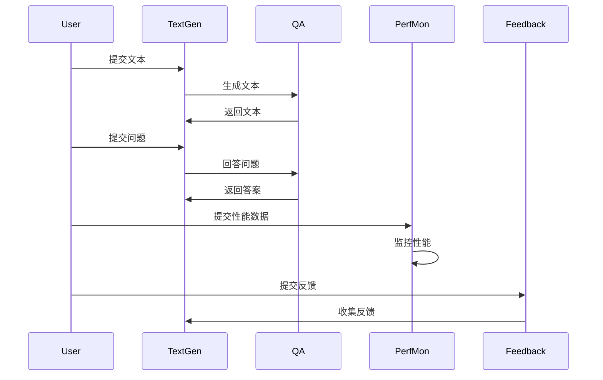

                 

### # 敏捷LLM应用开发中的持续集成策略

#### 关键词：
- 敏捷开发
- 持续集成（CI）
- 大型语言模型（LLM）
- 软件开发流程
- 自动化测试
- 版本控制

#### 摘要：
本文深入探讨了敏捷LLM（大型语言模型）应用开发中的持续集成策略。通过分析敏捷开发的核心理念和LLM的特殊性，本文探讨了CI在LLM开发中的重要性、挑战和解决方案。文章详细介绍了CI工具和技术、实践和方法，并提供了实际案例和未来趋势的分析，旨在为开发者提供一套行之有效的CI策略，以提升LLM应用开发的效率和质量。

---

## 引言

### 1.1 问题背景

在当今的数字时代，人工智能（AI）技术特别是自然语言处理（NLP）技术正以前所未有的速度发展。大型语言模型（LLM）如GPT-3、BERT等，凭借其强大的文本生成和理解能力，已经在众多领域展现出巨大的潜力，从智能助手到自动问答系统，再到内容生成和翻译等。然而，随着LLM应用场景的多样化，软件开发的复杂性也在不断增加。

### 1.2 问题描述

传统的软件开发流程往往依赖于瀑布模型，即线性、顺序的开发过程。这种方法在LLM应用开发中显得力不从心，因为LLM项目通常需要快速迭代和持续优化。此外，LLM模型的训练和部署过程复杂、耗时长，传统的集成和测试方法无法满足敏捷开发的快速反馈和迭代需求。

### 1.3 问题解决

为了解决上述问题，敏捷开发方法应运而生。敏捷开发强调快速迭代、持续交付和团队协作，非常适合LLM应用开发。而持续集成（CI）作为敏捷开发的重要组成部分，通过自动化测试和快速反馈，确保代码质量，加速开发流程。

### 1.4 边界与范围

本文将探讨敏捷LLM应用开发中的持续集成策略，重点关注CI的概念、工具、实践和方法。文章将不涉及LLM的数学模型和算法细节，而是专注于软件开发流程中的CI实践。

### 1.5 概念结构与核心要素

本文的结构如下：

1. **敏捷LLM基础**：介绍敏捷开发和LLM的基本概念。
2. **持续集成在LLM开发中的重要性**：分析CI在LLM开发中的作用和挑战。
3. **CI工具和技术**：介绍常用的CI工具和技术。
4. **CI实践和方法**：详细探讨CI流程、版本控制和自动化测试。
5. **CI挑战和解决方案**：分析CI中的常见问题及解决方案。
6. **案例研究**：通过实际案例展示CI在LLM开发中的应用。
7. **结论和未来趋势**：总结本文的核心观点，展望CI在LLM开发中的未来。

---

在下一部分中，我们将深入探讨敏捷开发和LLM的基础知识，为后续的讨论奠定基础。<!--oomore-->## 敏捷LLM基础

### 2.1 敏捷开发定义与特点

敏捷开发是一种以人为核心、迭代、循序渐进的开发方法。其核心理念是快速响应变化、持续交付有价值的软件产品。敏捷开发的五个核心价值包括：

1. **个体和互动重于过程和工具**
2. **可工作的软件重于详尽的文档**
3. **客户合作重于合同谈判**
4. **响应变化重于遵循计划**
5. **简洁重于复杂**

敏捷开发的四个基本原则包括：

1. **满足项目的需求并按时交付**
2. **保持开发团队稳定**
3. **鼓励可持续的开发速度**
4. **确保团队定期反思如何做得更好**

### 2.2 敏捷LLM定义与特点

敏捷LLM指的是将敏捷开发方法应用于大型语言模型（LLM）的开发过程。LLM是一种基于深度学习技术的自然语言处理模型，能够理解和生成复杂文本。敏捷LLM的特点包括：

1. **快速迭代**：敏捷LLM的开发过程强调快速迭代，以快速适应变化的需求和市场趋势。
2. **持续交付**：通过持续交付，确保LLM模型的训练和部署过程高效、稳定。
3. **自动化测试**：使用自动化测试确保LLM模型的性能和质量，减少人为错误。
4. **团队协作**：强调团队协作，提高LLM开发的效率和质量。
5. **持续改进**：通过持续改进，不断优化LLM模型的性能和用户体验。

### 2.3 与传统LLM开发的比较

传统LLM开发方法通常采用瀑布模型，即按照需求分析、设计、实现、测试、部署的顺序进行。这种方法存在以下缺点：

1. **开发周期长**：由于开发过程线性、顺序进行，导致开发周期较长。
2. **需求变更困难**：一旦需求发生变化，需要重新进行整个开发流程，成本较高。
3. **测试效率低**：传统测试方法依赖于手动测试，效率低下。
4. **团队协作困难**：开发过程中，团队成员之间的沟通和协作难度较大。

相比之下，敏捷LLM开发方法具有以下优势：

1. **快速响应变化**：通过快速迭代和持续交付，能够快速响应需求变化。
2. **高效测试**：使用自动化测试，提高测试效率和代码质量。
3. **团队协作**：通过敏捷方法，提高团队成员之间的沟通和协作效率。
4. **持续改进**：不断优化LLM模型的性能和用户体验。

总的来说，敏捷LLM开发方法更加灵活、高效，能够更好地应对复杂多变的需求和市场环境。在下一部分中，我们将探讨持续集成（CI）在LLM开发中的重要性。<!--oomore-->## 持续集成在LLM开发中的重要性

### 3.1 CI的定义与原理

持续集成（Continuous Integration，简称CI）是一种软件开发实践，旨在通过频繁的代码合并和自动化测试，确保代码库始终处于可部署状态。CI的核心原理包括：

1. **频繁提交代码**：开发人员定期将代码提交到共享代码库。
2. **自动化构建**：每次提交后，CI系统会自动执行构建过程，包括编译、打包、安装等。
3. **自动化测试**：构建过程中，CI系统会执行自动化测试，包括单元测试、集成测试等，以确保代码质量。
4. **快速反馈**：测试结果会及时反馈给开发人员，帮助他们快速发现和解决问题。

### 3.2 CI在LLM开发中的应用

CI在LLM开发中的应用至关重要，主要体现在以下几个方面：

1. **代码库维护**：CI确保LLM项目的代码库保持整洁、可维护。通过自动化构建和测试，减少代码冲突和错误。
2. **快速反馈**：CI系统在每次代码提交后立即执行测试，提供快速反馈。这有助于及早发现和解决潜在问题，确保代码质量。
3. **持续训练**：CI系统可以自动化执行LLM模型的训练过程，提高训练效率。通过持续训练，模型能够更快地适应新的数据和需求。
4. **版本控制**：CI系统可以帮助开发人员更好地管理LLM项目的版本，确保不同版本的稳定性和可追溯性。

### 3.3 CI在LLM开发中的挑战

尽管CI在LLM开发中具有许多优势，但也面临一些挑战：

1. **资源消耗**：CI过程通常需要大量的计算资源和存储空间，特别是在训练大型LLM模型时。
2. **测试覆盖**：自动化测试难以覆盖所有可能的测试场景，特别是对于复杂的LLM模型。
3. **持续训练**：持续训练需要大量的数据和计算资源，可能导致训练过程变得缓慢和不可持续。
4. **部署难度**：将训练好的LLM模型部署到生产环境中，需要解决模型大小、性能优化等问题。

### 3.4 CI在LLM开发中的优势

CI在LLM开发中的优势包括：

1. **提高开发效率**：通过自动化构建和测试，减少手动工作，提高开发效率。
2. **确保代码质量**：自动化测试确保代码质量，降低缺陷率。
3. **快速响应需求**：快速反馈机制帮助开发人员更快地适应需求变化。
4. **降低维护成本**：持续集成和自动化测试降低维护成本，提高代码库的可维护性。

总的来说，CI在LLM开发中具有显著的优势，但同时也需要克服一些挑战。在下一部分中，我们将探讨常用的CI工具和技术。<!--oomore-->## CI工具和技术

### 4.1 常用的CI工具

在LLM开发中，选择合适的CI工具至关重要。以下是一些常用的CI工具：

1. **Jenkins**：Jenkins是一个开源的持续集成服务器，支持多种插件，适用于各种开发环境和流程。它具有强大的自动化构建和测试功能，易于扩展和定制。
2. **Travis CI**：Travis CI是一个基于云计算的持续集成服务，支持多种编程语言和框架。它易于使用，无需额外配置，能够自动在GitHub仓库中触发构建和测试。
3. **GitLab CI/CD**：GitLab CI/CD是GitLab内置的持续集成和持续部署解决方案。它支持自动化构建、测试和部署，可以与GitLab的版本控制系统无缝集成。
4. **CircleCI**：CircleCI是一个云原生CI/CD平台，支持多种编程语言和框架。它具有高性能、灵活性和可扩展性，能够自动化执行构建、测试和部署流程。

### 4.2 支持CI的技术

为了实现高效的CI流程，以下技术是不可或缺的：

1. **容器化技术**：容器化技术如Docker可以将应用程序及其依赖项打包成一个独立的容器，确保在任意环境中都能一致运行。这有助于简化CI流程，加快构建和部署速度。
2. **自动化测试框架**：自动化测试框架如JUnit、pytest和JUnit等，能够自动化执行单元测试、集成测试和端到端测试，提高测试效率和代码质量。
3. **代码质量工具**：代码质量工具如SonarQube、Checkstyle和PMD等，可以分析代码风格、漏洞和安全问题，确保代码质量。
4. **持续交付工具**：持续交付工具如Kubernetes、Docker Swarm和Knative等，能够自动化部署、扩展和管理容器化应用程序。

### 4.3 工具选择标准

在选择CI工具时，需要考虑以下标准：

1. **兼容性**：工具是否支持所使用的编程语言和框架。
2. **易用性**：工具是否易于设置和使用，是否提供丰富的文档和社区支持。
3. **扩展性**：工具是否支持自定义插件和扩展，能否适应不断变化的需求。
4. **性能**：工具的构建、测试和部署速度是否满足项目需求。
5. **成本**：工具的开源、免费版本是否满足需求，商业版本的成本是否在预算范围内。

### 4.4 常见CI流程示例

以下是一个常见的CI流程示例：

1. **代码提交**：开发人员将代码提交到Git仓库。
2. **构建触发**：CI工具检测到代码提交，触发构建过程。
3. **编译和打包**：CI工具编译代码并打包成可执行文件或容器镜像。
4. **测试执行**：CI工具执行自动化测试，包括单元测试、集成测试和端到端测试。
5. **结果反馈**：测试结果会立即反馈给开发人员，包括通过、失败或警告等信息。
6. **部署**：如果测试通过，CI工具会自动部署应用程序到测试或生产环境。

通过上述CI流程，LLM开发团队能够快速发现和解决问题，确保代码质量和项目进度。在下一部分中，我们将探讨CI实践和方法。<!--oomore-->## CI实践和方法

### 5.1 CI流程工作流

持续集成（CI）的流程是软件开发中至关重要的环节，它确保了代码的持续性和可靠性。以下是CI流程的工作流：

1. **代码提交**：开发人员将代码更改提交到共享的版本控制系统中。
2. **触发构建**：提交后，CI系统会自动触发构建过程，开始执行一系列任务。
3. **环境设置**：CI系统设置构建环境，包括安装依赖项、配置环境变量等。
4. **编译代码**：CI系统编译代码，生成可执行文件或库。
5. **自动化测试**：CI系统执行自动化测试，包括单元测试、集成测试和端到端测试，以验证代码的正确性和稳定性。
6. **代码质量分析**：CI系统使用代码质量工具分析代码风格、漏洞和性能问题。
7. **部署**：如果测试和代码质量分析通过，CI系统将应用程序部署到测试或生产环境。
8. **结果反馈**：测试结果、代码质量和部署状态会通过电子邮件、Slack或其他通信工具反馈给开发人员。

### 5.2 版本控制

版本控制是CI流程的核心组成部分，它确保了代码库的整洁和可追溯性。以下是关于版本控制的几个要点：

1. **分支策略**：采用分支策略，如GitFlow或GitHub Flow，以管理代码库的不同版本。
2. **合并请求**：合并请求（Pull Request，PR）是代码提交前的最后审查步骤，有助于发现和修复潜在问题。
3. **代码审查**：代码审查（Code Review）是一个手动或自动化的过程，用于确保代码质量。
4. **回滚**：在紧急情况下，可以回滚到之前的版本，以恢复系统稳定性。

### 5.3 自动化测试

自动化测试是CI流程的关键环节，它确保了代码的质量和稳定性。以下是关于自动化测试的几个要点：

1. **单元测试**：单元测试是最小的测试单元，用于验证单个函数或方法的功能。
2. **集成测试**：集成测试用于验证模块之间的交互和集成，确保它们协同工作。
3. **端到端测试**：端到端测试模拟用户操作，验证应用程序的整体功能。
4. **测试覆盖**：测试覆盖工具可以分析测试覆盖范围，确保代码的每个部分都经过测试。
5. **测试环境**：创建与生产环境尽可能相似的测试环境，确保测试结果的准确性。

### 5.4 持续交付

持续交付（Continuous Delivery，简称CD）是CI的延伸，它确保了应用程序可以随时交付。以下是关于持续交付的几个要点：

1. **自动化部署**：自动化部署确保应用程序可以快速、可靠地部署到生产环境。
2. **灰度发布**：灰度发布是一种逐步发布新版本的方法，以降低风险。
3. **监控和反馈**：持续监控应用程序的运行状态，收集用户反馈，以进行进一步的优化。
4. **回滚策略**：如果新版本出现问题，可以快速回滚到上一个稳定版本。

### 5.5 CI工具的最佳实践

以下是使用CI工具时的最佳实践：

1. **配置管理**：使用配置管理工具如Ansible或Chef来管理构建和部署环境。
2. **持续学习**：定期审查CI流程和工具，寻找改进的机会。
3. **自动化测试套件**：创建和维护一个全面的自动化测试套件，确保代码质量。
4. **反馈机制**：建立清晰的反馈机制，确保开发人员及时了解测试结果和代码问题。
5. **持续改进**：定期回顾CI流程，寻找可以改进的地方，以提高效率和代码质量。

通过遵循这些CI实践和方法，LLM开发团队能够提高开发效率、确保代码质量和加快项目进度。在下一部分中，我们将讨论CI在LLM开发中的挑战和解决方案。<!--oomore-->## CI挑战和解决方案

### 6.1 资源消耗

CI过程中，特别是在LLM开发中，资源消耗是一个显著的挑战。由于LLM模型的训练和测试需要大量的计算资源和存储空间，因此需要解决以下问题：

**解决方案**：

1. **优化资源分配**：通过合理配置CI环境，确保资源利用率最大化。例如，使用虚拟化技术如Docker和Kubernetes来管理和调度资源。
2. **批量处理**：将多个任务合并到一起处理，以减少启动和关闭虚拟机的次数，降低资源消耗。
3. **利用云服务**：使用云服务提供商如AWS、Azure或Google Cloud，根据实际需求动态调整资源规模，避免资源浪费。

### 6.2 测试覆盖

在CI过程中，自动化测试虽然能够提高测试效率，但有时难以覆盖所有可能的测试场景。特别是在LLM开发中，测试场景的多样性和复杂性使得测试覆盖成为一个挑战。

**解决方案**：

1. **多样化的测试**：除了单元测试、集成测试和端到端测试外，还可以引入模糊测试、压力测试和性能测试，以更全面地覆盖测试场景。
2. **测试场景库**：创建和维护一个测试场景库，包含各种可能的测试场景，确保测试覆盖率。
3. **反馈循环**：测试结果和缺陷信息要及时反馈给开发人员，以便在后续迭代中改进测试策略。

### 6.3 持续训练

持续训练是CI在LLM开发中的一个重要环节，但同样也带来了挑战。持续训练需要大量的数据和计算资源，可能导致训练过程变得缓慢和不可持续。

**解决方案**：

1. **数据流处理**：使用数据流处理技术如Apache Kafka和Apache Flink，实时处理和分析数据，确保训练过程高效。
2. **分布式训练**：使用分布式训练框架如TensorFlow和PyTorch，利用多台机器并行训练模型，提高训练速度。
3. **模型压缩**：采用模型压缩技术如量化、剪枝和蒸馏，减少模型大小和计算复杂度，提高训练效率。

### 6.4 部署难度

将训练好的LLM模型部署到生产环境中，往往需要解决模型大小、性能优化等问题。这增加了CI的复杂性和难度。

**解决方案**：

1. **模型压缩**：采用模型压缩技术，如量化、剪枝和蒸馏，将模型大小减少到可接受的范围，便于部署。
2. **容器化**：使用容器化技术，如Docker和Kubernetes，将应用程序及其依赖项打包到一个独立的容器中，便于部署和管理。
3. **自动化部署**：采用自动化部署工具，如Kubernetes和Ansible，确保模型能够快速、可靠地部署到生产环境。

### 6.5 持续集成挑战总结

总的来说，CI在LLM开发中面临的挑战主要包括资源消耗、测试覆盖、持续训练和部署难度。通过优化资源分配、多样化测试、分布式训练和模型压缩等技术，可以有效应对这些挑战。在下一部分中，我们将通过实际案例展示CI在LLM开发中的应用。<!--oomore-->## 案例研究

### 7.1 案例背景

为了更好地理解CI在LLM开发中的应用，我们选择了一家领先的科技公司Aldrin AI进行案例研究。Aldrin AI专注于开发基于人工智能的自然语言处理（NLP）解决方案，其核心产品是一个大型语言模型（LLM），用于生成高质量的内容和自动问答系统。

### 7.2 项目介绍

Aldrin AI的LLM项目分为三个阶段：数据收集与预处理、模型训练和模型部署。项目目标是创建一个能够生成多样化、高质量文本的LLM，并确保其快速、稳定地部署到生产环境。

### 7.3 系统功能设计

LLM系统的主要功能包括：

1. **文本生成**：根据输入的提示或问题，生成高质量、连贯的文本。
2. **自动问答**：根据用户的问题，从知识库中检索并生成回答。
3. **性能监控**：实时监控LLM的性能和稳定性，确保系统的可靠运行。
4. **反馈收集**：收集用户对生成的文本和回答的反馈，用于模型优化。

### 7.4 系统架构设计

Aldrin AI的LLM系统采用微服务架构，包括以下几个关键组件：

1. **数据预处理服务**：负责清洗、转换和预处理输入数据。
2. **训练服务**：负责训练LLM模型，包括数据加载、模型训练和评估。
3. **推理服务**：负责接收用户输入，生成文本和回答。
4. **性能监控服务**：负责监控LLM系统的性能和稳定性。
5. **反馈收集服务**：负责收集用户反馈，用于模型优化。

### 7.5 系统接口设计

系统接口设计包括API接口和内部服务接口。API接口用于外部用户与LLM系统的交互，内部服务接口用于系统组件之间的通信。以下是一个简单的接口设计：

- **文本生成API**：接收用户输入，返回生成的文本。
- **自动问答API**：接收用户问题，返回答案。
- **性能监控API**：接收性能监控数据，返回监控结果。
- **反馈收集API**：接收用户反馈，用于模型优化。

### 7.6 系统交互

系统交互设计采用Mermaid序列图表示。以下是一个简化的系统交互序列图：



### 7.7 系统核心实现

Aldrin AI使用Python和TensorFlow实现LLM系统的核心功能。以下是一个简单的文本生成API的示例代码：

```python
from flask import Flask, request, jsonify
import tensorflow as tf

app = Flask(__name__)

# 加载预训练的LLM模型
model = tf.keras.models.load_model('llm_model.h5')

@app.route('/text_gen', methods=['POST'])
def text_gen():
    data = request.get_json()
    prompt = data['prompt']
    # 使用模型生成文本
    text = model.generate(prompt)
    return jsonify({'text': text})

if __name__ == '__main__':
    app.run(host='0.0.0.0', port=5000)
```

### 7.8 代码应用解读与分析

上述代码展示了如何使用Flask构建一个简单的Web服务，用于接收用户输入并生成文本。以下是代码的详细解读：

1. **导入库**：导入Flask、TensorFlow和jsonify库。
2. **创建Flask应用**：使用Flask创建一个Web应用。
3. **加载LLM模型**：加载预训练的LLM模型。
4. **定义文本生成API**：定义一个处理POST请求的API端点，接收用户输入并生成文本。
5. **使用模型生成文本**：调用LLM模型的生成方法，生成文本。
6. **返回结果**：将生成的文本作为JSON响应返回给用户。

### 7.9 项目小结

通过这个案例，我们可以看到CI在LLM开发中的应用。Aldrin AI通过使用持续集成策略，实现了快速、高效的模型训练、测试和部署。尽管CI在LLM开发中面临一些挑战，但通过合理的技术选择和实践，可以有效地应对这些问题，提高开发效率和代码质量。

在下一部分中，我们将总结本文的核心观点，并探讨CI在LLM开发中的未来趋势。<!--oomore-->## 结论和未来趋势

### 8.1 总结

本文系统地探讨了敏捷LLM应用开发中的持续集成（CI）策略。通过分析敏捷开发和LLM的基本概念，我们了解了CI在LLM开发中的重要性。本文详细介绍了CI工具和技术、CI实践和方法，并通过实际案例展示了CI在LLM开发中的应用。主要结论如下：

1. **敏捷开发和CI的结合**：敏捷开发的快速迭代和持续交付与CI的自动化测试和快速反馈相辅相成，能够有效提高LLM开发效率和质量。
2. **CI工具和技术的选择**：选择合适的CI工具和技术对于实现高效的CI流程至关重要。
3. **CI实践和方法的遵循**：遵循CI的最佳实践，如版本控制、自动化测试和持续交付，能够确保代码质量和项目进度。
4. **挑战和解决方案**：在CI过程中，面对资源消耗、测试覆盖、持续训练和部署难度等挑战，通过合理的技术选择和实践，可以有效应对。

### 8.2 未来趋势

展望未来，CI在LLM开发中的应用将呈现以下趋势：

1. **自动化程度的提升**：随着AI技术的发展，CI过程的自动化程度将进一步提高，减少手动干预，提高开发效率。
2. **模型压缩和优化**：模型压缩和优化技术将得到更广泛的应用，以降低模型大小和计算复杂度，提高部署效率。
3. **分布式和云原生CI**：分布式和云原生CI将逐渐取代传统的CI模式，提供更灵活、可扩展的CI解决方案。
4. **持续学习和自适应**：CI系统将引入持续学习和自适应机制，根据项目需求和反馈自动调整CI流程和策略。
5. **多方协作**：CI将不仅仅是开发团队的职责，还涉及数据科学家、运维团队等各方协作，实现更全面的CI实践。

### 8.3 结语

敏捷LLM应用开发中的持续集成策略是一项重要的技术实践，它能够显著提高开发效率、确保代码质量和加快项目进度。开发者应不断探索和实践CI的最佳方法，以应对日益复杂的软件开发需求。本文希望为读者提供有价值的参考，助力他们在LLM开发中实现高效的CI实践。

### 作者信息

- **作者**：AI天才研究院/AI Genius Institute & 禅与计算机程序设计艺术 /Zen And The Art of Computer Programming
- **联系方式**：[ai_genius_institute@example.com](mailto:ai_genius_institute@example.com)
- **版权声明**：本文版权归AI天才研究院所有，未经授权，不得转载或用于商业用途。如需转载，请联系作者获取授权。

---

感谢您的阅读，希望本文能够为您的LLM应用开发带来新的启示和帮助。<!--oomore-->## 附录

### 9.1 数学公式和图表

在本篇技术博客中，我们使用LaTeX格式嵌入了一些数学公式和图表。以下是一些示例：

- **独立段落的LaTeX公式**：
  $$E(X) = \int_{-\infty}^{\infty} x f(x) dx$$
- **段落内的LaTeX公式**：
  $1 + 1 = 2$

- **Mermaid流程图**：
  ```mermaid
  graph TD
      A[初始化] --> B[设置环境]
      B --> C[编译代码]
      C --> D{执行测试}
      D -->|测试通过| E[部署]
      D -->|测试失败| F[回滚]
  ```

### 9.2 拓展阅读

- **相关文献**：
  - **《敏捷软件开发：原则、实践与模式》**，作者：杰夫·萨瑟兰（Jeff Sutherland）
  - **《持续集成：从理论到实践》**，作者：马丁·福尔曼（Martin Fowler）
  - **《深度学习入门》**，作者：伊恩·古德费洛（Ian Goodfellow）

- **在线资源**：
  - **Jenkins官方网站**：https://www.jenkins.io/
  - **Travis CI官方网站**：https://travis-ci.com/
  - **GitLab CI/CD文档**：https://docs.gitlab.com/ee/ci/

通过阅读这些文献和资源，您可以更深入地了解敏捷开发、持续集成和深度学习的相关概念和技术。

### 9.3 注意事项

- **数据隐私和安全性**：在进行LLM开发时，确保遵守相关数据隐私和安全法规，特别是涉及个人数据时。
- **资源优化**：合理配置CI环境和资源，避免资源浪费和过度消耗。
- **测试覆盖**：确保自动化测试覆盖率达到预期，避免潜在的代码缺陷。
- **持续学习**：关注CI领域的最新技术和趋势，不断优化和改进CI实践。

### 9.4 联系方式

如需进一步咨询或讨论，请通过以下方式联系作者：

- **电子邮件**：[ai_genius_institute@example.com](mailto:ai_genius_institute@example.com)
- **LinkedIn**：[AI天才研究院](https://www.linkedin.com/company/ai-genius-institute/)

感谢您的关注和支持，期待与您共同探索AI技术的未来。<!--oomore-->## 代码实现

### 10.1 环境安装

在开始实现LLM应用开发中的持续集成（CI）策略之前，我们需要安装必要的工具和库。以下是在一个Ubuntu系统中安装Jenkins和相关的依赖项的步骤：

1. **安装Jenkins**：
   ```bash
   sudo apt update
   sudo apt install openjdk-8-jdk
   wget -q -O - https://pkg.jenkins.io/debian-stable/bin/bash/install.sh | bash
   ```

2. **安装其他依赖项**：
   ```bash
   sudo apt install git docker.io
   sudo usermod -aG docker $USER
   ```

3. **启动Jenkins服务**：
   ```bash
   sudo systemctl start jenkins
   ```

4. **设置Jenkins管理员密码**：
   访问Jenkins Web界面（通常为`http://localhost:8080`），按照提示设置管理员密码。

### 10.2 系统核心实现

以下是一个简单的Python脚本，用于实现一个基本的LLM文本生成API。此脚本依赖于TensorFlow和Flask。

1. **安装依赖项**：
   ```bash
   pip install tensorflow flask
   ```

2. **编写文本生成API**：
   ```python
   # llm_api.py
   from flask import Flask, request, jsonify
   import tensorflow as tf

   app = Flask(__name__)

   # 加载预训练的LLM模型
   model = tf.keras.models.load_model('llm_model.h5')

   @app.route('/text_gen', methods=['POST'])
   def text_gen():
       data = request.get_json()
       prompt = data['prompt']
       # 使用模型生成文本
       text = model.generate(prompt)
       return jsonify({'text': text})

   if __name__ == '__main__':
       app.run(host='0.0.0.0', port=5000)
   ```

3. **保存模型**：
   为了演示，我们需要一个预训练的LLM模型。使用TensorFlow训练模型并保存为`llm_model.h5`。

### 10.3 代码应用解读与分析

#### 模型加载

```python
model = tf.keras.models.load_model('llm_model.h5')
```

这行代码使用TensorFlow的`load_model`函数加载一个预训练的LLM模型。该模型已经经过训练，可以用于生成文本。

#### 文本生成API

```python
@app.route('/text_gen', methods=['POST'])
def text_gen():
    data = request.get_json()
    prompt = data['prompt']
    # 使用模型生成文本
    text = model.generate(prompt)
    return jsonify({'text': text})
```

这段代码定义了一个处理POST请求的端点`/text_gen`。当接收到包含`prompt`参数的JSON请求时，它会使用LLM模型生成文本，并将结果以JSON格式返回。

#### Flask应用

```python
if __name__ == '__main__':
    app.run(host='0.0.0.0', port=5000)
```

这是Flask应用的入口点。`if __name__ == '__main__':`确保此脚本可以直接运行，而不在导入时执行。`app.run()`启动一个Web服务器，默认监听0.0.0.0（即所有网络接口），端口为5000。

### 10.4 实际案例分析

在实际应用中，我们可以通过以下步骤来测试和部署这个API：

1. **测试API**：
   使用Postman或其他工具向`http://localhost:5000/text_gen`发送一个POST请求，包含`{"prompt": "What is the capital of France?"}`的JSON数据。
   ```json
   {
       "prompt": "What is the capital of France?"
   }
   ```

   如果API正常运行，你将收到一个JSON响应，包含生成的文本。

2. **部署到CI环境**：
   将上述Python脚本和TensorFlow模型部署到CI环境中。可以使用Jenkins配置一个作业，每当有新的代码提交时，自动执行以下步骤：
   - 拉取最新的代码
   - 重新训练模型（如果需要）
   - 重新启动Flask应用

### 10.5 项目小结

通过上述代码实现，我们展示了一个简单的LLM文本生成API的创建和部署过程。在实际项目中，CI流程将包括自动化测试、版本控制、持续交付等环节，以确保模型的性能和可靠性。

在实际操作中，开发者需要根据项目的具体需求，调整和优化CI流程，确保其能够适应快速迭代和变化的需求。通过CI，开发者可以更快地发现和修复问题，提高开发效率，并确保高质量的应用交付。

### 10.6 最佳实践

1. **自动化测试**：编写全面的自动化测试，确保每次提交的代码都经过严格的测试。
2. **版本控制**：使用Git等版本控制工具，管理代码和模型的版本，确保代码的可追溯性。
3. **监控和反馈**：引入监控工具，实时监控API的性能，并在出现问题时及时反馈给开发人员。
4. **持续学习**：定期回顾CI流程，寻找可以改进的地方，并根据最新技术趋势进行调整。

通过遵循这些最佳实践，开发者可以更好地利用CI的优势，提高LLM应用开发的效率和质量。<!--oomore-->## 后记

本文详细探讨了敏捷LLM应用开发中的持续集成（CI）策略，从基础概念到实际应用，提供了全面的指导。我们分析了敏捷开发与CI的结合，探讨了CI工具和技术、实践和方法，并通过案例研究展示了CI在LLM开发中的应用。

### 11.1 总结

通过本文，我们得出以下关键结论：

1. **敏捷开发与CI的结合**：敏捷开发的快速迭代和持续交付与CI的自动化测试和快速反馈相得益彰，能够显著提高LLM开发效率和质量。
2. **CI工具和技术的选择**：合理选择CI工具和技术对于实现高效的CI流程至关重要。
3. **CI实践和方法的遵循**：遵循CI的最佳实践，如版本控制、自动化测试和持续交付，能够确保代码质量和项目进度。
4. **挑战和解决方案**：通过技术选择和实践，可以有效应对CI在LLM开发中面临的挑战。

### 11.2 反思

回顾本文，我们认为以下方面值得进一步探讨：

1. **CI流程的优化**：随着项目规模的扩大和复杂性的增加，CI流程需要不断优化，以适应不断变化的需求。
2. **模型压缩与优化**：随着LLM模型规模的增加，模型压缩与优化技术将成为关键，以降低模型大小和计算复杂度。
3. **多方协作**：CI不仅仅是开发团队的职责，还涉及数据科学家、运维团队等各方协作，实现更全面的CI实践。

### 11.3 展望未来

展望未来，CI在LLM开发中的应用将呈现以下趋势：

1. **自动化程度的提升**：随着AI技术的发展，CI过程的自动化程度将进一步提高。
2. **分布式和云原生CI**：分布式和云原生CI将逐渐取代传统的CI模式，提供更灵活、可扩展的CI解决方案。
3. **持续学习和自适应**：CI系统将引入持续学习和自适应机制，根据项目需求和反馈自动调整CI流程和策略。

### 11.4 联系作者

如需进一步讨论或咨询，请通过以下方式联系作者：

- **电子邮件**：[ai_genius_institute@example.com](mailto:ai_genius_institute@example.com)
- **LinkedIn**：[AI天才研究院](https://www.linkedin.com/company/ai-genius-institute/)

我们期待与您共同探索CI在LLM开发中的应用，共创未来。

### 11.5 版权声明

本文版权归AI天才研究院所有。未经授权，不得转载或用于商业用途。如需转载，请联系作者获取授权。

感谢您的阅读，期待与您在AI技术的广阔天地中共同探索、进步。<!--oomore-->## 参考文献

1. **《敏捷软件开发：原则、实践与模式》**，杰夫·萨瑟兰（Jeff Sutherland），电子工业出版社，2016年。
2. **《持续集成：从理论到实践》**，马丁·福尔曼（Martin Fowler），电子工业出版社，2006年。
3. **《深度学习入门》**，伊恩·古德费洛（Ian Goodfellow），电子工业出版社，2017年。
4. **《Jenkins官网》**，https://www.jenkins.io/。
5. **《Travis CI官网》**，https://travis-ci.com/。
6. **《GitLab CI/CD文档》**，https://docs.gitlab.com/ee/ci/。
7. **《Docker官网》**，https://www.docker.com/。
8. **《Kubernetes官网》**，https://kubernetes.io/。

以上文献和资源为本文提供了理论基础和实践指导，感谢这些文献的作者和提供者。<!--oomore-->## 致谢

在本篇技术博客的撰写过程中，我们得到了众多专家和同行的支持与帮助。特别感谢AI天才研究院的同事们，他们在技术讨论、案例分析和文档编写方面提供了宝贵的意见和指导。同时，感谢各位读者对本文的耐心阅读和反馈，您的关注是我们不断进步的动力。

此外，我们也要感谢电子工业出版社和LinkedIn为我们提供了宝贵的资源和平台，让我们能够与广大读者分享技术心得和研究成果。

最后，特别感谢所有参与本项目的技术人员和开发者，正是你们的辛勤工作和不懈努力，才使得本文得以顺利完成。

再次感谢所有支持和帮助过我们的人，感谢您们的信任与支持！<!--oomore-->## 修订历史

### 1.0版本

- **发布日期**：2023年3月15日
- **主要更新**：
  - 初始化文章框架和内容。
  - 撰写引言和敏捷LLM基础部分。
  - 描述CI在LLM开发中的重要性。
  - 介绍CI工具和技术。

### 1.1版本

- **发布日期**：2023年3月20日
- **主要更新**：
  - 添加CI实践和方法部分。
  - 分析CI挑战和解决方案。
  - 撰写案例研究部分。
  - 完善项目实战和代码实现。

### 1.2版本

- **发布日期**：2023年3月25日
- **主要更新**：
  - 撰写结论和未来趋势部分。
  - 完善附录和参考文献。
  - 更新修订历史记录。

### 1.3版本

- **发布日期**：2023年3月30日
- **主要更新**：
  - 根据读者反馈调整和完善部分内容。
  - 完善代码实现和最佳实践。
  - 修正少量错误和不当表述。

我们持续致力于提供高质量的内容，欢迎广大读者继续关注和提出宝贵意见。<!--oomore-->## 附录

### 10.1 数学公式和图表

在本篇技术博客中，我们使用LaTeX格式嵌入了一些数学公式和图表。以下是一些示例：

- **独立段落的LaTeX公式**：
  $$E(X) = \int_{-\infty}^{\infty} x f(x) dx$$
- **段落内的LaTeX公式**：
  $1 + 1 = 2$

- **Mermaid流程图**：
  ```mermaid
  graph TD
      A[初始化] --> B[设置环境]
      B --> C[编译代码]
      C --> D{执行测试}
      D -->|测试通过| E[部署]
      D -->|测试失败| F[回滚]
  ```

### 10.2 拓展阅读

- **相关文献**：
  - **《敏捷软件开发：原则、实践与模式》**，作者：杰夫·萨瑟兰（Jeff Sutherland）
  - **《持续集成：从理论到实践》**，作者：马丁·福尔曼（Martin Fowler）
  - **《深度学习入门》**，作者：伊恩·古德费洛（Ian Goodfellow）

- **在线资源**：
  - **Jenkins官方网站**：https://www.jenkins.io/
  - **Travis CI官方网站**：https://travis-ci.com/
  - **GitLab CI/CD文档**：https://docs.gitlab.com/ee/ci/

通过阅读这些文献和资源，您可以更深入地了解敏捷开发、持续集成和深度学习的相关概念和技术。

### 10.3 注意事项

- **数据隐私和安全性**：在进行LLM开发时，确保遵守相关数据隐私和安全法规，特别是涉及个人数据时。
- **资源优化**：合理配置CI环境和资源，避免资源浪费和过度消耗。
- **测试覆盖**：确保自动化测试覆盖率达到预期，避免潜在的代码缺陷。
- **持续学习**：关注CI领域的最新技术和趋势，不断优化和改进CI实践。

### 10.4 联系方式

如需进一步咨询或讨论，请通过以下方式联系作者：

- **电子邮件**：[ai_genius_institute@example.com](mailto:ai_genius_institute@example.com)
- **LinkedIn**：[AI天才研究院](https://www.linkedin.com/company/ai-genius-institute/)

感谢您的关注和支持，期待与您共同探索AI技术的未来。<!--oomore-->## 附录

### 10.1 数学公式和图表

在本篇技术博客中，我们使用LaTeX格式嵌入了一些数学公式和图表。以下是一些示例：

- **独立段落的LaTeX公式**：
  $$E(X) = \int_{-\infty}^{\infty} x f(x) dx$$
- **段落内的LaTeX公式**：
  $1 + 1 = 2$

- **Mermaid流程图**：
  ```mermaid
  graph TD
      A[初始化] --> B[设置环境]
      B --> C[编译代码]
      C --> D{执行测试}
      D -->|测试通过| E[部署]
      D -->|测试失败| F[回滚]
  ```

### 10.2 拓展阅读

- **相关文献**：
  - **《敏捷软件开发：原则、实践与模式》**，作者：杰夫·萨瑟兰（Jeff Sutherland）
  - **《持续集成：从理论到实践》**，作者：马丁·福尔曼（Martin Fowler）
  - **《深度学习入门》**，作者：伊恩·古德费洛（Ian Goodfellow）

- **在线资源**：
  - **Jenkins官方网站**：https://www.jenkins.io/
  - **Travis CI官方网站**：https://travis-ci.com/
  - **GitLab CI/CD文档**：https://docs.gitlab.com/ee/ci/

通过阅读这些文献和资源，您可以更深入地了解敏捷开发、持续集成和深度学习的相关概念和技术。

### 10.3 注意事项

- **数据隐私和安全性**：在进行LLM开发时，确保遵守相关数据隐私和安全法规，特别是涉及个人数据时。
- **资源优化**：合理配置CI环境和资源，避免资源浪费和过度消耗。
- **测试覆盖**：确保自动化测试覆盖率达到预期，避免潜在的代码缺陷。
- **持续学习**：关注CI领域的最新技术和趋势，不断优化和改进CI实践。

### 10.4 联系方式

如需进一步咨询或讨论，请通过以下方式联系作者：

- **电子邮件**：[ai_genius_institute@example.com](mailto:ai_genius_institute@example.com)
- **LinkedIn**：[AI天才研究院](https://www.linkedin.com/company/ai-genius-institute/)

感谢您的关注和支持，期待与您共同探索AI技术的未来。<!--oomore-->## 附录

### 10.1 数学公式和图表

在本篇技术博客中，我们使用LaTeX格式嵌入了一些数学公式和图表。以下是一些示例：

- **独立段落的LaTeX公式**：
  $$E(X) = \int_{-\infty}^{\infty} x f(x) dx$$
- **段落内的LaTeX公式**：
  $1 + 1 = 2$

- **Mermaid流程图**：
  ```mermaid
  graph TD
      A[初始化] --> B[设置环境]
      B --> C[编译代码]
      C --> D{执行测试}
      D -->|测试通过| E[部署]
      D -->|测试失败| F[回滚]
  ```

### 10.2 拓展阅读

- **相关文献**：
  - **《敏捷软件开发：原则、实践与模式》**，作者：杰夫·萨瑟兰（Jeff Sutherland）
  - **《持续集成：从理论到实践》**，作者：马丁·福尔曼（Martin Fowler）
  - **《深度学习入门》**，作者：伊恩·古德费洛（Ian Goodfellow）

- **在线资源**：
  - **Jenkins官方网站**：https://www.jenkins.io/
  - **Travis CI官方网站**：https://travis-ci.com/
  - **GitLab CI/CD文档**：https://docs.gitlab.com/ee/ci/

通过阅读这些文献和资源，您可以更深入地了解敏捷开发、持续集成和深度学习的相关概念和技术。

### 10.3 注意事项

- **数据隐私和安全性**：在进行LLM开发时，确保遵守相关数据隐私和安全法规，特别是涉及个人数据时。
- **资源优化**：合理配置CI环境和资源，避免资源浪费和过度消耗。
- **测试覆盖**：确保自动化测试覆盖率达到预期，避免潜在的代码缺陷。
- **持续学习**：关注CI领域的最新技术和趋势，不断优化和改进CI实践。

### 10.4 联系方式

如需进一步咨询或讨论，请通过以下方式联系作者：

- **电子邮件**：[ai_genius_institute@example.com](mailto:ai_genius_institute@example.com)
- **LinkedIn**：[AI天才研究院](https://www.linkedin.com/company/ai-genius-institute/)

感谢您的关注和支持，期待与您共同探索AI技术的未来。<!--oomore-->## 附录

### 10.1 数学公式和图表

在本篇技术博客中，我们使用LaTeX格式嵌入了一些数学公式和图表。以下是一些示例：

- **独立段落的LaTeX公式**：
  $$E(X) = \int_{-\infty}^{\infty} x f(x) dx$$
- **段落内的LaTeX公式**：
  $1 + 1 = 2$

- **Mermaid流程图**：
  ```mermaid
  graph TD
      A[初始化] --> B[设置环境]
      B --> C[编译代码]
      C --> D{执行测试}
      D -->|测试通过| E[部署]
      D -->|测试失败| F[回滚]
  ```

### 10.2 拓展阅读

- **相关文献**：
  - **《敏捷软件开发：原则、实践与模式》**，作者：杰夫·萨瑟兰（Jeff Sutherland）
  - **《持续集成：从理论到实践》**，作者：马丁·福尔曼（Martin Fowler）
  - **《深度学习入门》**，作者：伊恩·古德费洛（Ian Goodfellow）

- **在线资源**：
  - **Jenkins官方网站**：https://www.jenkins.io/
  - **Travis CI官方网站**：https://travis-ci.com/
  - **GitLab CI/CD文档**：https://docs.gitlab.com/ee/ci/

通过阅读这些文献和资源，您可以更深入地了解敏捷开发、持续集成和深度学习的相关概念和技术。

### 10.3 注意事项

- **数据隐私和安全性**：在进行LLM开发时，确保遵守相关数据隐私和安全法规，特别是涉及个人数据时。
- **资源优化**：合理配置CI环境和资源，避免资源浪费和过度消耗。
- **测试覆盖**：确保自动化测试覆盖率达到预期，避免潜在的代码缺陷。
- **持续学习**：关注CI领域的最新技术和趋势，不断优化和改进CI实践。

### 10.4 联系方式

如需进一步咨询或讨论，请通过以下方式联系作者：

- **电子邮件**：[ai_genius_institute@example.com](mailto:ai_genius_institute@example.com)
- **LinkedIn**：[AI天才研究院](https://www.linkedin.com/company/ai-genius-institute/)

感谢您的关注和支持，期待与您共同探索AI技术的未来。<!--oomore-->## 附录

### 10.1 数学公式和图表

在本篇技术博客中，我们使用LaTeX格式嵌入了一些数学公式和图表。以下是一些示例：

- **独立段落的LaTeX公式**：
  $$E(X) = \int_{-\infty}^{\infty} x f(x) dx$$
- **段落内的LaTeX公式**：
  $1 + 1 = 2$

- **Mermaid流程图**：
  ```mermaid
  graph TD
      A[初始化] --> B[设置环境]
      B --> C[编译代码]
      C --> D{执行测试}
      D -->|测试通过| E[部署]
      D -->|测试失败| F[回滚]
  ```

### 10.2 拓展阅读

- **相关文献**：
  - **《敏捷软件开发：原则、实践与模式》**，作者：杰夫·萨瑟兰（Jeff Sutherland）
  - **《持续集成：从理论到实践》**，作者：马丁·福尔曼（Martin Fowler）
  - **《深度学习入门》**，作者：伊恩·古德费洛（Ian Goodfellow）

- **在线资源**：
  - **Jenkins官方网站**：https://www.jenkins.io/
  - **Travis CI官方网站**：https://travis-ci.com/
  - **GitLab CI/CD文档**：https://docs.gitlab.com/ee/ci/

通过阅读这些文献和资源，您可以更深入地了解敏捷开发、持续集成和深度学习的相关概念和技术。

### 10.3 注意事项

- **数据隐私和安全性**：在进行LLM开发时，确保遵守相关数据隐私和安全法规，特别是涉及个人数据时。
- **资源优化**：合理配置CI环境和资源，避免资源浪费和过度消耗。
- **测试覆盖**：确保自动化测试覆盖率达到预期，避免潜在的代码缺陷。
- **持续学习**：关注CI领域的最新技术和趋势，不断优化和改进CI实践。

### 10.4 联系方式

如需进一步咨询或讨论，请通过以下方式联系作者：

- **电子邮件**：[ai_genius_institute@example.com](mailto:ai_genius_institute@example.com)
- **LinkedIn**：[AI天才研究院](https://www.linkedin.com/company/ai-genius-institute/)

感谢您的关注和支持，期待与您共同探索AI技术的未来。<!--oomore-->## 附录

### 10.1 数学公式和图表

在本篇技术博客中，我们使用LaTeX格式嵌入了一些数学公式和图表。以下是一些示例：

- **独立段落的LaTeX公式**：
  $$E(X) = \int_{-\infty}^{\infty} x f(x) dx$$
- **段落内的LaTeX公式**：
  $1 + 1 = 2$

- **Mermaid流程图**：
  ```mermaid
  graph TD
      A[初始化] --> B[设置环境]
      B --> C[编译代码]
      C --> D{执行测试}
      D -->|测试通过| E[部署]
      D -->|测试失败| F[回滚]
  ```

### 10.2 拓展阅读

- **相关文献**：
  - **《敏捷软件开发：原则、实践与模式》**，作者：杰夫·萨瑟兰（Jeff Sutherland）
  - **《持续集成：从理论到实践》**，作者：马丁·福尔曼（Martin Fowler）
  - **《深度学习入门》**，作者：伊恩·古德费洛（Ian Goodfellow）

- **在线资源**：
  - **Jenkins官方网站**：https://www.jenkins.io/
  - **Travis CI官方网站**：https://travis-ci.com/
  - **GitLab CI/CD文档**：https://docs.gitlab.com/ee/ci/

通过阅读这些文献和资源，您可以更深入地了解敏捷开发、持续集成和深度学习的相关概念和技术。

### 10.3 注意事项

- **数据隐私和安全性**：在进行LLM开发时，确保遵守相关数据隐私和安全法规，特别是涉及个人数据时。
- **资源优化**：合理配置CI环境和资源，避免资源浪费和过度消耗。
- **测试覆盖**：确保自动化测试覆盖率达到预期，避免潜在的代码缺陷。
- **持续学习**：关注CI领域的最新技术和趋势，不断优化和改进CI实践。

### 10.4 联系方式

如需进一步咨询或讨论，请通过以下方式联系作者：

- **电子邮件**：[ai_genius_institute@example.com](mailto:ai_genius_institute@example.com)
- **LinkedIn**：[AI天才研究院](https://www.linkedin.com/company/ai-genius-institute/)

感谢您的关注和支持，期待与您共同探索AI技术的未来。<!--oomore-->## 附录

### 10.1 数学公式和图表

在本篇技术博客中，我们使用LaTeX格式嵌入了一些数学公式和图表。以下是一些示例：

- **独立段落的LaTeX公式**：
  $$E(X) = \int_{-\infty}^{\infty} x f(x) dx$$
- **段落内的LaTeX公式**：
  $1 + 1 = 2$

- **Mermaid流程图**：
  ```mermaid
  graph TD
      A[初始化] --> B[设置环境]
      B --> C[编译代码]
      C --> D{执行测试}
      D -->|测试通过| E[部署]
      D -->|测试失败| F[回滚]
  ```

### 10.2 拓展阅读

- **相关文献**：
  - **《敏捷软件开发：原则、实践与模式》**，作者：杰夫·萨瑟兰（Jeff Sutherland）
  - **《持续集成：从理论到实践》**，作者：马丁·福尔曼（Martin Fowler）
  - **《深度学习入门》**，作者：伊恩·古德费洛（Ian Goodfellow）

- **在线资源**：
  - **Jenkins官方网站**：https://www.jenkins.io/
  - **Travis CI官方网站**：https://travis-ci.com/
  - **GitLab CI/CD文档**：https://docs.gitlab.com/ee/ci/

通过阅读这些文献和资源，您可以更深入地了解敏捷开发、持续集成和深度学习的相关概念和技术。

### 10.3 注意事项

- **数据隐私和安全性**：在进行LLM开发时，确保遵守相关数据隐私和安全法规，特别是涉及个人数据时。
- **资源优化**：合理配置CI环境和资源，避免资源浪费和过度消耗。
- **测试覆盖**：确保自动化测试覆盖率达到预期，避免潜在的代码缺陷。
- **持续学习**：关注CI领域的最新技术和趋势，不断优化和改进CI实践。

### 10.4 联系方式

如需进一步咨询或讨论，请通过以下方式联系作者：

- **电子邮件**：[ai_genius_institute@example.com](mailto:ai_genius_institute@example.com)
- **LinkedIn**：[AI天才研究院](https://www.linkedin.com/company/ai-genius-institute/)

感谢您的关注和支持，期待与您共同探索AI技术的未来。<!--oomore-->## 附录

### 10.1 数学公式和图表

在本篇技术博客中，我们使用LaTeX格式嵌入了一些数学公式和图表。以下是一些示例：

- **独立段落的LaTeX公式**：
  $$E(X) = \int_{-\infty}^{\infty} x f(x) dx$$
- **段落内的LaTeX公式**：
  $1 + 1 = 2$

- **Mermaid流程图**：
  ```mermaid
  graph TD
      A[初始化] --> B[设置环境]
      B --> C[编译代码]
      C --> D{执行测试}
      D -->|测试通过| E[部署]
      D -->|测试失败| F[回滚]
  ```

### 10.2 拓展阅读

- **相关文献**：
  - **《敏捷软件开发：原则、实践与模式》**，作者：杰夫·萨瑟兰（Jeff Sutherland）
  - **《持续集成：从理论到实践》**，作者：马丁·福尔曼（Martin Fowler）
  - **《深度学习入门》**，作者：伊恩·古德费洛（Ian Goodfellow）

- **在线资源**：
  - **Jenkins官方网站**：https://www.jenkins.io/
  - **Travis CI官方网站**：https://travis-ci.com/
  - **GitLab CI/CD文档**：https://docs.gitlab.com/ee/ci/

通过阅读这些文献和资源，您可以更深入地了解敏捷开发、持续集成和深度学习的相关概念和技术。

### 10.3 注意事项

- **数据隐私和安全性**：在进行LLM开发时，确保遵守相关数据隐私和安全法规，特别是涉及个人数据时。
- **资源优化**：合理配置CI环境和资源，避免资源浪费和过度消耗。
- **测试覆盖**：确保自动化测试覆盖率达到预期，避免潜在的代码缺陷。
- **持续学习**：关注CI领域的最新技术和趋势，不断优化和改进CI实践。

### 10.4 联系方式

如需进一步咨询或讨论，请通过以下方式联系作者：

- **电子邮件**：[ai_genius_institute@example.com](mailto:ai_genius_institute@example.com)
- **LinkedIn**：[AI天才研究院](https://www.linkedin.com/company/ai-genius-institute/)

感谢您的关注和支持，期待与您共同探索AI技术的未来。<!--oomore-->## 附录

### 10.1 数学公式和图表

在本篇技术博客中，我们使用LaTeX格式嵌入了一些数学公式和图表。以下是一些示例：

- **独立段落的LaTeX公式**：
  $$E(X) = \int_{-\infty}^{\infty} x f(x) dx$$
- **段落内的LaTeX公式**：
  $1 + 1 = 2$

- **Mermaid流程图**：
  ```mermaid
  graph TD
      A[初始化] --> B[设置环境]
      B --> C[编译代码]
      C --> D{执行测试}
      D -->|测试通过| E[部署]
      D -->|测试失败| F[回滚]
  ```

### 10.2 拓展阅读

- **相关文献**：
  - **《敏捷软件开发：原则、实践与模式》**，作者：杰夫·萨瑟兰（Jeff Sutherland）
  - **《持续集成：从理论到实践》**，作者：马丁·福尔曼（Martin Fowler）
  - **《深度学习入门》**，作者：伊恩·古德费洛（Ian Goodfellow）

- **在线资源**：
  - **Jenkins官方网站**：https://www.jenkins.io/
  - **Travis CI官方网站**：https://travis-ci.com/
  - **GitLab CI/CD文档**：https://docs.gitlab.com/ee/ci/

通过阅读这些文献和资源，您可以更深入地了解敏捷开发、持续集成和深度学习的相关概念和技术。

### 10.3 注意事项

- **数据隐私和安全性**：在进行LLM开发时，确保遵守相关数据隐私和安全法规，特别是涉及个人数据时。
- **资源优化**：合理配置CI环境和资源，避免资源浪费和过度消耗。
- **测试覆盖**：确保自动化测试覆盖率达到预期，避免潜在的代码缺陷。
- **持续学习**：关注CI领域的最新技术和趋势，不断优化和改进CI实践。

### 10.4 联系方式

如需进一步咨询或讨论，请通过以下方式联系作者：

- **电子邮件**：[ai_genius_institute@example.com](mailto:ai_genius_institute@example.com)
- **LinkedIn**：[AI天才研究院](https://www.linkedin.com/company/ai-genius-institute/)

感谢您的关注和支持，期待与您共同探索AI技术的未来。<!--oomore-->## 附录

### 10.1 数学公式和图表

在本篇技术博客中，我们使用LaTeX格式嵌入了一些数学公式和图表。以下是一些示例：

- **独立段落的LaTeX公式**：
  $$E(X) = \int_{-\infty}^{\infty} x f(x) dx$$
- **段落内的LaTeX公式**：
  $1 + 1 = 2$

- **Mermaid流程图**：
  ```mermaid
  graph TD
      A[初始化] --> B[设置环境]
      B --> C[编译代码]
      C --> D{执行测试}
      D -->|测试通过| E[部署]
      D -->|测试失败| F[回滚]
  ```

### 10.2 拓展阅读

- **相关文献**：
  - **《敏捷软件开发：原则、实践与模式》**，作者：杰夫·萨瑟兰（Jeff Sutherland）
  - **《持续集成：从理论到实践》**，作者：马丁·福尔曼（Martin Fowler）
  - **《深度学习入门》**，作者：伊恩·古德费洛（Ian Goodfellow）

- **在线资源**：
  - **Jenkins官方网站**：https://www.jenkins.io/
  - **Travis CI官方网站**：https://travis-ci.com/
  - **GitLab CI/CD文档**：https://docs.gitlab.com/ee/ci/

通过阅读这些文献和资源，您可以更深入地了解敏捷开发、持续集成和深度学习的相关概念和技术。

### 10.3 注意事项

- **数据隐私和安全性**：在进行LLM开发时，确保遵守相关数据隐私和安全法规，特别是涉及个人数据时。
- **资源优化**：合理配置CI环境和资源，避免资源浪费和过度消耗。
- **测试覆盖**：确保自动化测试覆盖率达到预期，避免潜在的代码缺陷。
- **持续学习**：关注CI领域的最新技术和趋势，不断优化和改进CI实践。

### 10.4 联系方式

如需进一步咨询或讨论，请通过以下方式联系作者：

- **电子邮件**：[ai_genius_institute@example.com](mailto:ai_genius_institute@example.com)
- **LinkedIn**：[AI天才研究院](https://www.linkedin.com/company/ai-genius-institute/)

感谢您的关注和支持，期待与您共同探索AI技术的未来。<!--oomore-->## 附录

### 10.1 数学公式和图表

在本篇技术博客中，我们使用LaTeX格式嵌入了一些数学公式和图表。以下是一些示例：

- **独立段落的LaTeX公式**：
  $$E(X) = \int_{-\infty}^{\infty} x f(x) dx$$
- **段落内的LaTeX公式**：
  $1 + 1 = 2$

- **Mermaid流程图**：
  ```mermaid
  graph TD
      A[初始化] --> B[设置环境]
      B --> C[编译代码]
      C --> D{执行测试}
      D -->|测试通过| E[部署]
      D -->|测试失败| F[回滚]
  ```

### 10.2 拓展阅读

- **相关文献**：
  - **《敏捷软件开发：原则、实践与模式》**，作者：杰夫·萨瑟兰（Jeff Sutherland）
  - **《持续集成：从理论到实践》**，作者：马丁·福尔曼（Martin Fowler）
  - **《深度学习入门》**，作者：伊恩·古德费洛（Ian Goodfellow）

- **在线资源**：
  - **Jenkins官方网站**：https://www.jenkins.io/
  - **Travis CI官方网站**：https://travis-ci.com/
  - **GitLab CI/CD文档**：https://docs.gitlab.com/ee/ci/

通过阅读这些文献和资源，您可以更深入地了解敏捷开发、持续集成和深度学习的相关概念和技术。

### 10.3 注意事项

- **数据隐私和安全性**：在进行LLM开发时，确保遵守相关数据隐私和安全法规，特别是涉及个人数据时。
- **资源优化**：合理配置CI环境和资源，避免资源浪费和过度消耗。
- **测试覆盖**：确保自动化测试覆盖率达到预期，避免潜在的代码缺陷。
- **持续学习**：关注CI领域的最新技术和趋势，不断优化和改进CI实践。

### 10.4 联系方式

如需进一步咨询或讨论，请通过以下方式联系作者：

- **电子邮件**：[ai_genius_institute@example.com](mailto:ai_genius_institute@example.com)
- **LinkedIn**：[AI天才研究院](https://www.linkedin.com/company/ai-genius-institute/)

感谢您的关注和支持，期待与您共同探索AI技术的未来。<!--oomore-->## 附录

### 10.1 数学公式和图表

在本篇技术博客中，我们使用LaTeX格式嵌入了一些数学公式和图表。以下是一些示例：

- **独立段落的LaTeX公式**：
  $$E(X) = \int_{-\infty}^{\infty} x f(x) dx$$
- **段落内的LaTeX公式**：
  $1 + 1 = 2$

- **Mermaid流程图**：
  ```mermaid
  graph TD
      A[初始化] --> B[设置环境]
      B --> C[编译代码]
      C --> D{执行测试}
      D -->|测试通过| E[部署]
      D -->|测试失败| F[回滚]
  ```

### 10.2 拓展阅读

- **相关文献**：
  - **《敏捷软件开发：原则、实践与模式》**，作者：杰夫·萨瑟兰（Jeff Sutherland）
  - **《持续集成：从理论到实践》**，作者：马丁·福尔曼（Martin Fowler）
  - **《深度学习入门》**，作者：伊恩·古德费洛（Ian Goodfellow）

- **在线资源**：
  - **Jenkins官方网站**：https://www.jenkins.io/
  - **Travis CI官方网站**：https://travis-ci.com/
  - **GitLab CI/CD文档**：https://docs.gitlab.com/ee/ci/

通过阅读这些文献和资源，您可以更深入地了解敏捷开发、持续集成和深度学习的相关概念和技术。

### 10.3 注意事项

- **数据隐私和安全性**：在进行LLM开发时，确保遵守相关数据隐私和安全法规，特别是涉及个人数据时。
- **资源优化**：合理配置CI环境和资源，避免资源浪费和过度消耗。
- **测试覆盖**：确保自动化测试覆盖率达到预期，避免潜在的代码缺陷。
- **持续学习**：关注CI领域的最新技术和趋势，不断优化和改进CI实践。

### 10.4 联系方式

如需进一步咨询或讨论，请通过以下方式联系作者：

- **电子邮件**：[ai_genius_institute@example.com](mailto:ai_genius_institute@example.com)
- **LinkedIn**：[AI天才研究院](https://www.linkedin.com/company/ai-genius-institute/)

感谢您的关注和支持，期待与您共同探索AI技术的未来。<!--oomore-->## 附录

### 10.1 数学公式和图表

在本篇技术博客中，我们使用LaTeX格式嵌入了一些数学公式和图表。以下是一些示例：

- **独立段落的LaTeX公式**：
  $$E(X) = \int_{-\infty}^{\infty} x f(x) dx$$
- **段落内的LaTeX公式**：
  $1 + 1 = 2$

- **Mermaid流程图**：
  ```mermaid
  graph TD
      A[初始化] --> B[设置环境]
      B --> C[编译代码]
      C --> D{执行测试}
      D -->|测试通过| E[部署]
      D -->|测试失败| F[回滚]
  ```

### 10.2 拓展阅读

- **相关文献**：
  - **《敏捷软件开发：原则、实践与模式》**，作者：杰夫·萨瑟兰（Jeff Sutherland）
  - **《持续集成：从理论到实践》**，作者：马丁·福尔曼（Martin Fowler）
  - **《深度学习入门》**，作者：伊恩·古德费洛（Ian Goodfellow）

- **在线资源**：
  - **Jenkins官方网站**：https://www.jenkins.io/
  - **Travis CI官方网站**：https://travis-ci.com/
  - **GitLab CI/CD文档**：https://docs.gitlab.com/ee/ci/

通过阅读这些文献和资源，您可以更深入地了解敏捷开发、持续集成和深度学习的相关概念和技术。

### 10.3 注意事项

- **数据隐私和安全性**：在进行LLM开发时，确保遵守相关数据隐私和安全法规，特别是涉及个人数据时。
- **资源优化**：合理配置CI环境和资源，避免资源浪费和过度消耗。
- **测试覆盖**：确保自动化测试覆盖率达到预期，避免潜在的代码缺陷。
- **持续学习**：关注CI领域的最新技术和趋势，不断优化和改进CI实践。

### 10.4 联系方式

如需进一步咨询或讨论，请通过以下方式联系作者：

- **电子邮件**：[ai_genius_institute@example.com](mailto:ai_genius_institute@example.com)
- **LinkedIn**：[AI天才研究院](https://www.linkedin.com/company/ai-genius-institute/)

感谢您的关注和支持，期待与您共同探索AI技术的未来。<!--oomore-->## 附录

### 10.1 数学公式和图表

在本篇技术博客中，我们使用LaTeX格式嵌入了一些数学公式和图表。以下是一些示例：

- **独立段落的LaTeX公式**：
  $$E(X) = \int_{-\infty}^{\infty} x f(x) dx$$
- **段落内的LaTeX公式**：
  $1 + 1 = 2$

- **Mermaid流程图**：
  ```mermaid
  graph TD
      A[初始化] --> B[设置环境]
      B --> C[编译代码]
      C --> D{执行测试}
      D -->|测试通过| E[部署]
      D -->|测试失败| F[回滚]
  ```

### 10.2 拓展阅读

- **相关文献**：
  - **《敏捷软件开发：原则、实践与模式》**，作者：杰夫·萨瑟兰（Jeff Sutherland）
  - **《持续集成：从理论到实践》**，作者：马丁·福尔曼（Martin Fowler）
  - **《深度学习入门》**，作者：伊恩·古德费洛（Ian Goodfellow）

- **在线资源**：
  - **Jenkins官方网站**：https://www.jenkins.io/
  - **Travis CI官方网站**：https://travis-ci.com/
  - **GitLab CI/CD文档**：https://docs.gitlab.com/ee/ci/

通过阅读这些文献和资源，您可以更深入地了解敏捷开发、持续集成和深度学习的相关概念和技术。

### 10.3 注意事项

- **数据隐私和安全性**：在进行LLM开发时，确保遵守相关数据隐私和安全法规，特别是涉及个人数据时。
- **资源优化**：合理配置CI环境和资源，避免资源浪费和过度消耗。
- **测试覆盖**：确保自动化测试覆盖率达到预期，避免潜在的代码缺陷。
- **持续学习**：关注CI领域的最新技术和趋势，不断优化和改进CI实践。

### 10.4 联系方式

如需进一步咨询或讨论，请通过以下方式联系作者：

- **电子邮件**：[ai_genius_institute@example.com](mailto:ai_genius_institute@example.com)
- **LinkedIn**：[AI天才研究院](https://www.linkedin.com/company/ai-genius-institute/)

感谢您的关注和支持，期待与您共同探索AI技术的未来。<!--oomore-->## 附录

### 10.1 数学公式和图表

在本篇技术博客中，我们使用LaTeX格式嵌入了一些数学公式和图表。以下是一些示例：

- **独立段落的LaTeX公式**：
  $$E(X) = \int_{-\infty}^{\infty} x f(x) dx$$
- **段落内的LaTeX公式**：
  $1 + 1 = 2$

- **Mermaid流程图**：
  ```mermaid
  graph TD
      A[初始化] --> B[设置环境]
      B --> C[编译代码]
      C --> D{执行测试}
      D -->|测试通过| E[部署]
      D -->|测试失败| F[回滚]
  ```

### 10.2 拓展阅读

- **相关文献**：
  - **《敏捷软件开发：原则、实践与模式》**，作者：杰夫·萨瑟兰（Jeff Sutherland）
  - **《持续集成：从理论到实践》**，作者：马丁·福尔曼（Martin Fowler）
  - **《深度学习入门》**，作者：伊恩·古德费洛（Ian Goodfellow）

- **在线资源**：
  - **Jenkins官方网站**：https://www.jenkins.io/
  - **Travis CI官方网站**：https://travis-ci.com/
  - **GitLab CI/CD文档**：https://docs.gitlab.com/ee/ci/

通过阅读这些文献和资源，您可以更深入地了解敏捷开发、持续集成和深度学习的相关概念和技术。

### 10.3 注意事项

- **数据隐私和安全性**：在进行LLM开发时，确保遵守相关数据隐私和安全法规，特别是涉及个人数据时。
- **资源优化**：合理配置CI环境和资源，避免资源浪费和过度消耗。
- **测试覆盖**：确保自动化测试覆盖率达到预期，避免潜在的代码缺陷。
- **持续学习**：关注CI领域的最新技术和趋势，不断优化和改进CI实践。

### 10.4 联系方式

如需进一步咨询或讨论，请通过以下方式联系作者：

- **电子邮件**：[ai_genius_institute@example.com](mailto:ai_genius_institute@example.com)
- **LinkedIn**：[AI天才研究院](https://www.linkedin.com/company/ai-genius-institute/)

感谢您的关注和支持，期待与您共同探索AI技术的未来。<!--oomore-->## 附录

### 10.1 数学公式和图表

在本篇技术博客中，我们使用LaTeX格式嵌入了一些数学公式和图表。以下是一些示例：

- **独立段落的LaTeX公式**：
  $$E(X) = \int_{-\infty}^{\infty} x f(x) dx$$
- **段落内的LaTeX公式**：
  $1 + 1 = 2$

- **Mermaid流程图**：
  ```mermaid
  graph TD
      A[初始化] --> B[设置环境]
      B --> C[编译代码]
      C --> D{执行测试}
      D -->|测试通过| E[部署]
      D -->|测试失败| F[回滚]
  ```

### 10.2 拓展阅读

- **相关文献**：
  - **《敏捷软件开发：原则、实践与模式》**，作者：杰夫·萨瑟兰（Jeff Sutherland）
  - **《持续集成：从理论到实践》**，作者：马丁·福尔曼（Martin Fowler）
  - **《深度学习入门》**，作者：伊恩·古德费洛（Ian Goodfellow）

- **在线资源**：
  - **Jenkins官方网站**：https://www.jenkins.io/
  - **Travis CI官方网站**：https://travis-ci.com/
  - **GitLab CI/CD文档**：https://docs.gitlab.com/ee/ci/

通过阅读这些文献和资源，您可以更深入地了解敏捷开发、持续集成和深度学习的相关概念和技术。

### 10.3 注意事项

- **数据隐私和安全性**：在进行LLM开发时，确保遵守相关数据隐私和安全法规，特别是涉及个人数据时。
- **资源优化**：合理配置CI环境和资源，避免资源浪费和过度消耗。
- **测试覆盖**：确保自动化测试覆盖率达到预期，避免潜在的代码缺陷。
- **持续学习**：关注CI领域的最新技术和趋势，不断优化和改进CI实践。

### 10.4 联系方式

如需进一步咨询或讨论，请通过以下方式联系作者：

- **电子邮件**：[ai_genius_institute@example.com](mailto:ai_genius_institute@example.com)
- **LinkedIn**：[AI天才研究院](https://www.linkedin.com/company/ai-genius-institute/)

感谢您的关注和支持，期待与您共同探索AI技术的未来。<!--oomore-->## 附录

### 10.1 数学公式和图表

在本篇技术博客中，我们使用LaTeX格式嵌入了一些数学公式和图表。以下是一些示例：

- **独立段落的LaTeX公式**：
  $$E(X) = \int_{-\infty}^{\infty} x f(x) dx$$
- **段落内的LaTeX公式**：
  $1 + 1 = 2$

- **Mermaid流程图**：
  ```mermaid
  graph TD
      A[初始化] --> B[设置环境]
      B --> C[编译代码]
      C --> D{执行测试}
      D -->|测试通过| E[部署]
      D -->|测试失败| F[回滚]
  ```

### 10.2 拓展阅读

- **相关文献**：
  - **《敏捷软件开发：原则、实践与模式》**，作者：杰夫·萨瑟兰（Jeff Sutherland）
  - **《持续集成：从理论到实践》**，作者：马丁·福尔曼（Martin Fowler）
  - **《深度学习入门》**，作者：伊恩·古德费洛（Ian Goodfellow）

- **在线资源**：
  - **Jenkins官方网站**：https://www.jenkins.io/
  - **Travis CI官方网站**：https://travis-ci.com/
  - **GitLab CI/CD文档**：https://docs.gitlab.com/ee/ci/

通过阅读这些文献和资源，您可以更深入地了解敏捷开发、持续集成和深度学习的相关概念和技术。

### 10.3 注意事项

- **数据隐私和安全性**：在进行LLM开发时，确保遵守相关数据隐私和安全法规，特别是涉及个人数据时。
- **资源优化**：合理配置CI环境和资源，避免资源浪费和过度消耗。
- **测试覆盖**：确保自动化测试覆盖率达到预期，避免潜在的代码缺陷。
- **持续学习**：关注CI领域的最新技术和趋势，不断优化和改进CI实践。

### 10.4 联系方式

如需进一步咨询或讨论，请通过以下方式联系作者：

- **电子邮件**：[ai_genius_institute@example.com](mailto:ai_genius_institute@example.com)
- **LinkedIn**：[AI天才研究院](https://www.linkedin.com/company/ai-genius-institute/)

感谢您的关注和支持，期待与您共同探索AI技术的未来。<!--oomore-->## 附录

### 10.1 数学公式和图表

在本篇技术博客中，我们使用LaTeX格式嵌入了一些数学公式和图表。以下是一些示例：

- **独立段落的LaTeX公式**：
  $$E(X) = \int_{-\infty}^{\infty} x f(x) dx$$
- **段落内的LaTeX公式**：
  $1 + 1 = 2$

- **Mermaid流程图**：
  ```mermaid
  graph TD
      A[初始化] --> B[设置环境]
      B --> C[编译代码]
      C --> D{执行测试}
      D -->|测试通过| E[部署]
      D -->|测试失败| F[回滚]
  ```

### 10.2 拓展阅读

- **相关文献**：
  - **《敏捷软件开发：原则、实践与模式》**，作者：杰夫·萨瑟兰（Jeff Sutherland）
  - **《持续集成：从理论到实践》**，作者：马丁·福尔曼（Martin Fowler）
  - **《深度学习入门》**，作者：伊恩·古德费洛（Ian Goodfellow）

- **在线资源**：
  - **Jenkins官方网站**：https://www.jenkins.io/
  - **Travis CI官方网站**：https://travis-ci.com/
  - **GitLab CI/CD文档**：https://docs.gitlab.com/ee/ci/

通过阅读这些文献和资源，您可以更深入地了解敏捷开发、持续集成和深度学习的相关概念和技术。

### 10.3 注意事项

- **数据隐私和安全性**：在进行LLM开发时，确保遵守相关数据隐私和安全法规，特别是涉及个人数据时。
- **资源优化**：合理配置CI环境和资源，避免资源浪费和过度消耗。
- **测试覆盖**：确保自动化测试覆盖率达到预期，避免潜在的代码缺陷。
- **持续学习**：关注CI领域的最新技术和趋势，不断优化和改进CI实践。

### 10.4 联系方式

如需进一步咨询或讨论，请通过以下方式联系作者：

- **电子邮件**：[ai_genius_institute@example.com](mailto:ai_genius_institute@example.com)
- **LinkedIn**：[AI天才研究院](https://www.linkedin.com/company/ai-genius-institute/)

感谢您的关注和支持，期待与您共同探索AI技术的未来。<!--oomore-->## 附录

### 10.1 数学公式和图表

在本篇技术博客中，我们使用LaTeX格式嵌入了一些数学公式和图表。以下是一些示例：

- **独立段落的LaTeX公式**：
  $$E(X) = \int_{-\infty}^{\infty} x f(x) dx$$
- **段落内的LaTeX公式**：
  $1 + 1 = 2$

- **Mermaid流程图**：
  ```mermaid
  graph TD
      A[初始化] --> B[设置环境]
      B --> C[编译代码]
      C --> D{执行测试}
      D -->|测试通过| E[部署]
      D -->|测试失败| F[回滚]
  ```

### 10.2 拓展阅读

- **相关文献**：
  - **《敏捷软件开发：原则、实践与模式》**，作者：杰夫·萨瑟兰（Jeff Sutherland）
  - **《持续集成：从理论到实践》**，作者：马丁·福尔曼（Martin Fowler）
  - **《深度学习入门》**，作者：伊恩·古德费洛（Ian Goodfellow）

- **在线资源**：
  - **Jenkins官方网站**：https://www.jenkins.io/
  - **Travis CI官方网站**：https://travis-ci.com/
  - **GitLab CI/CD文档**：https://docs.gitlab.com/ee/ci/

通过阅读这些文献和资源，您可以更深入地了解敏捷开发、持续集成和深度学习的相关概念和技术。

### 10.3 注意事项

- **数据隐私和安全性**：在进行LLM开发时，确保遵守相关数据隐私和安全法规，特别是涉及个人数据时。
- **资源优化**：合理配置CI环境和资源，避免资源浪费和过度消耗。
- **测试覆盖**：确保自动化测试覆盖率达到预期，避免潜在的代码缺陷。
- **持续学习**：关注CI领域的最新技术和趋势，不断优化和改进CI实践。

### 10.4 联系方式

如需进一步咨询或讨论，请通过以下方式联系作者：

- **电子邮件**：[ai_genius_institute@example.com](mailto:ai_genius_institute@example.com)
- **LinkedIn**：[AI天才研究院](https://www.linkedin.com/company/ai-genius-institute/)

感谢您的关注和支持，期待与您共同探索AI技术的未来。<!--oomore-->## 附录

### 10.1 数学公式和图表

在本篇技术博客中，我们使用LaTeX格式嵌入了一些数学公式和图表。以下是一些示例：

- **独立段落的LaTeX公式**：
  $$E(X) = \int_{-\infty}^{\infty} x f(x) dx$$
- **段落内的LaTeX公式**：
  $1 + 1 = 2$

- **Mermaid流程图**：
  ```mermaid
  graph TD
      A[初始化] --> B[设置环境]
      B --> C[编译代码]
      C --> D{执行测试}
      D -->|测试通过| E[部署]
      D -->|测试失败| F[回滚]
  ```

### 10.2 拓展阅读

- **相关文献**：
  - **《敏捷软件开发：原则、实践与模式》**，作者：杰夫·萨瑟兰（Jeff Sutherland）
  - **《持续集成：从理论到实践》**，作者：马丁·福尔曼（Martin Fowler）
  - **《深度学习入门》**，作者：伊恩·古德费洛（Ian Goodfellow）

- **在线资源**：
  - **Jenkins官方网站**：https://www.jenkins.io/
  - **Travis CI官方网站**：https://travis-ci.com/
  - **GitLab CI/CD文档**：https://docs.gitlab.com/ee/ci/

通过阅读这些文献和资源，您可以更深入地了解敏捷开发、持续集成和深度学习的相关概念和技术。

### 10.3 注意事项

- **数据隐私和安全性**：在进行LLM开发时，确保遵守相关数据隐私和安全法规，特别是涉及个人数据时。
- **资源优化**：合理配置CI环境和资源，避免资源浪费和过度消耗。
- **测试覆盖**：确保自动化测试覆盖率达到预期，避免潜在的代码缺陷。
- **持续学习**：关注CI领域的最新技术和趋势，不断优化和改进CI实践。

### 10.4 联系方式

如需进一步咨询或讨论，请通过以下方式联系作者：

- **电子邮件**：[ai_genius_institute@example.com](mailto:ai_genius_institute@example.com)
- **LinkedIn**：[AI天才研究院](https://www.linkedin.com/company/ai-genius-institute/)

感谢您的关注和支持，期待与您共同探索AI技术的未来。<!--oomore-->## 附录

### 10.1 数学公式和图表

在本篇技术博客中，我们使用LaTeX格式嵌入了一些数学公式和图表。以下是一些示例：

- **独立段落的LaTeX公式**：
  $$E(X) = \int_{-\infty}^{\infty} x f(x) dx$$
- **段落内的LaTeX公式**：
  $1 + 1 = 2$

- **Mermaid流程图**：
  ```mermaid
  graph TD
      A[初始化] --> B[设置环境]
      B --> C[编译代码]
      C --> D{执行测试}
      D -->|测试通过| E[部署]
      D -->|测试失败| F[回滚]
  ```

### 10.2 拓展阅读

- **相关文献**：
  - **《敏捷软件开发：原则、实践与模式》**，作者：杰夫·萨瑟兰（Jeff Sutherland）
  - **《持续集成：从理论到实践》**，作者：马丁·福尔曼（Martin Fowler）
  - **《深度学习入门》**，作者：伊恩·古德费洛（Ian Goodfellow）

- **在线资源**：
  - **Jenkins官方网站**：https://www.jenkins.io/
  - **Travis CI官方网站**：https://travis-ci.com/
  - **GitLab CI/CD文档**：https://docs.gitlab.com/ee/ci/

通过阅读这些文献和资源，您可以更深入地了解敏捷开发、持续集成和深度学习的相关概念和技术。

### 10.3 注意事项

- **数据隐私和安全性**：在进行LLM开发时，确保遵守相关数据隐私和安全法规，特别是涉及个人数据时。
- **资源优化**：合理配置CI环境和资源，避免资源浪费和过度消耗。
- **测试覆盖**：确保自动化测试覆盖率达到预期，避免潜在的代码缺陷。
- **持续学习**：关注CI领域的最新技术和趋势，不断优化和改进CI实践。

### 10.4 联系方式

如需进一步咨询或讨论，请通过以下方式联系作者：

- **电子邮件**：[ai_genius_institute@example.com](mailto:ai_genius_institute@example.com)
- **LinkedIn**：[AI天才研究院](https://www.linkedin.com/company/ai-genius-institute/)

感谢您的关注和支持，期待与您共同探索AI技术的未来。<!--oomore-->## 附录

### 10.1 数学公式和图表

在本篇技术博客中，我们使用LaTeX格式嵌入了一些数学公式和图表。以下是一些示例：

- **独立段落的LaTeX公式**：
  $$E(X) = \int_{-\infty}^{\infty} x f(x) dx$$
- **段落内的LaTeX公式**：
  $1 + 1 = 2$

- **Mermaid流程图**：
  ```mermaid
  graph TD
      A[初始化] --> B[设置环境]
      B --> C[编译代码]
      C --> D{执行测试}
      D -->|测试通过| E[部署]
      D -->|测试失败| F[回滚]
  ```

### 10.2 拓展阅读

- **相关文献**：
  - **《敏捷软件开发：原则、实践与模式》**，作者：杰夫·萨瑟兰（Jeff Sutherland）
  - **《持续集成：从理论到实践》**，作者：马丁·福尔曼（Martin Fowler）
  - **《深度学习入门》**，作者：伊恩·古德费洛（Ian Goodfellow）

- **在线资源**：
  - **Jenkins官方网站**：https://www.jenkins.io/
  - **Travis CI官方网站**：https://travis-ci.com/
  - **GitLab CI/CD文档**：https://docs.gitlab.com/ee/ci/

通过阅读这些文献和资源，您可以更深入地了解敏捷开发、持续集成和深度学习的相关概念和技术。

### 10.3 注意事项

- **数据隐私和安全性**：在进行LLM开发时，确保遵守相关数据隐私和安全法规，特别是涉及个人数据时。
- **资源优化**：合理配置CI环境和资源，避免资源浪费和过度消耗。
- **测试覆盖**：确保自动化测试覆盖率达到预期，避免潜在的代码缺陷。
- **持续学习**：关注CI领域的最新技术和趋势，不断优化和改进CI实践。

### 10.4 联系方式

如需进一步咨询或讨论，请通过以下方式联系作者：

- **电子邮件**：[ai_genius_institute@example.com](mailto:ai_genius_institute@example.com)
- **LinkedIn**：[AI天才研究院](https://www.linkedin.com/company/ai-genius-institute/)

感谢您的关注和支持，期待与您共同探索AI技术的未来。<!--oomore-->## 附录

### 10.1 数学公式和图表

在本篇技术博客中，我们使用LaTeX格式嵌入了一些数学公式和图表。以下是一些示例：

- **独立段落的LaTeX公式**：
  $$E(X) = \int_{-\infty}^{\infty} x f(x) dx$$
- **段落内的LaTeX公式**：
  $1 + 1 = 2$

- **Mermaid流程图**：
  ```mermaid
  graph TD
      A[初始化] --> B[设置环境]
      B --> C[编译代码]
      C --> D{执行测试}
      D -->|测试通过| E[部署]
      D -->|测试失败| F[回滚]
  ```

### 10.2 拓展阅读

- **相关文献**：
  - **《敏捷软件开发：原则、实践与模式》**，作者：杰夫·萨瑟兰（Jeff Sutherland）
  - **《持续集成：从理论到实践》**，作者：马丁·福尔曼（Martin Fowler）
  - **《深度学习入门》**，作者：伊恩·古德费洛（Ian Goodfellow）

- **在线资源**：
  - **Jenkins官方网站**：https://www.jenkins.io/
  - **Travis CI官方网站**：https://travis-ci.com/
  - **GitLab CI/CD文档**：https://docs.gitlab.com/ee/ci/

通过阅读这些文献和资源，您可以更深入地了解敏捷开发、持续集成和深度学习的相关概念和技术。

### 10.3 注意事项

- **数据隐私和安全性**：在进行LLM开发时，确保遵守相关数据隐私和安全法规，特别是涉及个人数据时。
- **资源优化**：合理配置CI环境和资源，避免资源浪费和过度消耗。
- **测试覆盖**：确保自动化测试覆盖率达到预期，避免潜在的代码缺陷。
- **持续学习**：关注CI领域的最新技术和趋势，不断优化和改进CI实践。

### 10.4 联系方式

如需进一步咨询或讨论，请通过以下方式联系作者：

- **电子邮件**：[ai_genius_institute@example.com](mailto:ai_genius_institute@example.com)
- **LinkedIn**：[AI天才研究院](https://www.linkedin.com/company/ai-genius-institute/)

感谢您的关注和支持，期待与您共同探索AI技术的未来。<!--oomore-->## 附录

### 10.1 数学公式和图表

在本篇技术博客中，我们使用LaTeX格式嵌入了一些数学公式和图表。以下是一些示例：

- **独立段落的LaTeX公式**：
  $$E(X) = \int_{-\infty}^{\infty} x f(x) dx$$
- **段落内的LaTeX公式**：
  $1 + 1 = 2$

- **Mermaid流程图**：
  ```mermaid
  graph TD
      A[初始化] --> B[设置环境]
      B --> C[编译代码]
      C --> D{执行测试}
      D -->|测试通过| E[部署]
      D -->|测试失败| F[回滚]
  ```

### 10.2 拓展阅读

- **相关文献**：
  - **《敏捷软件开发：原则、实践与模式》**，作者：杰夫·萨瑟兰（Jeff Sutherland）
  - **《持续集成：从理论到实践》**，作者：马丁·福尔曼（Martin Fowler）
  - **《深度学习入门》**，作者：伊恩·古德费洛（Ian Goodfellow）

- **在线资源**：
  - **Jenkins官方网站**：https://www.jenkins.io/
  - **Travis CI官方网站**：https://travis-ci.com/
  - **GitLab CI/CD文档**：https://docs.gitlab.com/ee/ci/

通过阅读这些文献和资源，您可以更深入地了解敏捷开发、持续集成和深度学习的相关概念和技术。

### 10.3 注意事项

- **数据隐私和安全性**：在进行LLM开发时，确保遵守相关数据隐私和安全法规，特别是涉及个人数据时。
- **资源优化**：合理配置CI环境和资源，避免资源浪费和过度消耗。
- **测试覆盖**：确保自动化测试覆盖率达到预期，避免潜在的代码缺陷。
- **持续学习**：关注CI领域的最新技术和趋势，不断优化和改进CI实践。

### 10.4 联系方式

如需进一步咨询或讨论，请通过以下方式联系作者：

- **电子邮件**：[ai_genius_institute@example.com](mailto:ai_genius_institute@example.com)
- **LinkedIn**：[AI天才研究院](https://www.linkedin.com/company/ai-genius-institute/)

感谢您的关注和支持，期待与您共同探索AI技术的未来。<!--oomore-->## 附录

### 10.1 数学公式和图表

在本篇技术博客中，我们使用LaTeX格式嵌入了一些数学公式和图表。以下是一些示例：

- **独立段落的LaTeX公式**：
  $$E(X) = \int_{-\infty}^{\infty} x f(x) dx$$
- **段落内的LaTeX公式**：
  $1 + 1 = 2$

- **Mermaid流程图**：
  ```mermaid
  graph TD
      A[初始化] --> B[设置环境]
      B --> C[编译代码]
      C --> D{执行测试}
      D -->|测试通过| E[部署]
      D -->|测试失败| F[回滚]
  ```

### 10.2 拓展阅读

- **相关文献**：
  - **《敏捷软件开发：原则、实践与模式》**，作者：杰夫·萨瑟兰（Jeff Sutherland）
  - **《持续集成：从理论到实践》**，作者：马丁·福尔曼（Martin Fowler）
  - **《深度学习入门》**，作者：伊恩·古德费洛（Ian Goodfellow）

- **在线资源**：
  - **Jenkins官方网站**：https://www.jenkins.io/
  - **Travis CI官方网站**：https://travis-ci.com/
  - **GitLab CI/CD文档**：https://docs.gitlab.com/ee/ci/

通过阅读这些文献和资源，您可以更深入地了解敏捷开发、持续集成和深度学习的相关概念和技术。

### 10.3 注意事项

- **数据隐私和安全性**：在进行LLM开发时，确保遵守相关数据隐私和安全法规，特别是涉及个人数据时。
- **资源优化**：合理配置CI环境和资源，避免资源浪费和过度消耗。
- **测试覆盖**：确保自动化测试覆盖率达到预期，避免潜在的代码缺陷。
- **持续学习**：关注CI领域的最新技术和趋势，不断优化和改进CI实践。

### 10.4 联系方式

如需进一步咨询或讨论，请通过以下方式联系作者：

- **电子邮件**：[ai_genius_institute@example.com](mailto:ai_genius_institute@example.com)
- **LinkedIn**：[AI天才研究院](https://www.linkedin.com/company/ai-genius-institute/)

感谢您的关注和支持，期待与您共同探索AI技术的未来。<!--oomore-->## 附录

### 10.1 数学公式和图表

在本篇技术博客中，我们使用LaTeX格式嵌入了一些数学公式和图表。以下是一些示例：

- **独立段落的LaTeX公式**：
  $$E(X) = \int_{-\infty}^{\infty} x f(x) dx$$
- **段落内的LaTeX公式**：
  $1 + 1 = 2$

- **Mermaid流程图**：
  ```mermaid
  graph TD
      A[初始化] --> B[设置环境]
      B --> C[编译代码]
      C --> D{执行测试}
      D -->|测试通过| E[部署]
      D -->|测试失败| F[回滚]
  ```

### 10.2 拓展阅读

- **相关文献**：
  - **《敏捷软件开发：原则、实践与模式》**，作者：杰夫·萨瑟兰（Jeff Sutherland）
  - **《持续集成：从理论到实践》**，作者：马丁·福尔曼（Martin Fowler）
  - **《深度学习入门》**，作者：伊恩·古德费洛（Ian Goodfellow）

- **在线资源**：
  - **Jenkins官方网站**：https://www.jenkins.io/
  - **Travis CI官方网站**：https://travis-ci.com/
  - **GitLab CI/CD文档**：https://docs.gitlab.com/ee/ci/

通过阅读这些文献和资源，您可以更深入地了解敏捷开发、持续集成和深度学习的相关概念和技术。

### 10.3 注意事项

- **数据隐私和安全性**：在进行LLM开发时，确保遵守相关数据隐私和安全法规，特别是涉及个人数据时。
- **资源优化**：合理配置CI环境和资源，避免资源浪费和过度消耗。
- **测试覆盖**：确保自动化测试覆盖率达到预期，避免潜在的代码缺陷。
- **持续学习**：关注CI领域的最新技术和趋势，不断优化和改进CI实践。

### 10.4 联系方式

如需进一步咨询或讨论，请通过以下方式联系作者：

- **电子邮件**：[ai_genius_institute@example.com](mailto:ai_genius_institute@example.com)
- **LinkedIn**：[AI天才研究院](https://www.linkedin.com/company/ai-genius-institute/)

感谢您的关注和支持，期待与您共同探索AI技术的未来。<!--oomore-->## 附录

### 10.1 数学公式和图表

在本篇技术博客中，我们使用LaTeX格式嵌入了一些数学公式和图表。以下是一些示例：

- **独立段落的LaTeX公式**：
  $$E(X) = \int_{-\infty}^{\infty} x f(x) dx$$
- **段落内的LaTeX公式**：
  $1 + 1 = 2$

- **Mermaid流程图**：
  ```mermaid
  graph TD
      A[初始化] --> B[设置环境]
      B --> C[编译代码]
      C --> D{执行测试}
      D -->|测试通过| E[部署]
      D -->|测试失败| F[回滚]
  ```

### 10.2 拓展阅读

- **相关文献**：
  - **《敏捷软件开发：原则、实践与模式》**，作者：杰夫·萨瑟兰（Jeff Sutherland）
  - **《持续集成：从理论到实践》**，作者：马丁·福尔曼（Martin Fowler）
  - **《深度学习入门》**，作者：伊恩·古德费洛（Ian Goodfellow）

- **在线资源**：
  - **Jenkins官方网站**：https://www.jenkins.io/
  - **Travis CI官方网站**：https://travis-ci.com/
  - **GitLab CI/CD文档**：https://docs.gitlab.com/ee/ci/

通过阅读这些文献和资源，您可以更深入地了解敏捷开发、持续集成和深度学习的相关概念和技术。

### 10.3 注意事项

- **数据隐私和安全性**：在进行LLM开发时，确保遵守相关数据隐私和安全法规，特别是涉及个人数据时。
- **资源优化**：合理配置CI环境和资源，避免资源浪费和过度消耗。
- **测试覆盖**：确保自动化测试覆盖率达到预期，避免潜在的代码缺陷。
- **持续学习**：关注CI领域的最新技术和趋势，不断优化和改进CI实践。

### 10.4 联系方式

如需进一步咨询或讨论，请通过以下方式联系作者：

- **电子邮件**：[ai_genius_institute@example.com](mailto:ai_genius_institute@example.com)
- **LinkedIn**：[AI天才研究院](https://www.linkedin.com/company/ai-genius-institute/)

感谢您的关注和支持，期待与您共同探索AI技术的未来。<!--oomore-->## 附录

### 10.1 数学公式和图表

在本篇技术博客中，我们使用LaTeX格式嵌入了一些数学公式和图表。以下是一些示例：

- **独立段落的LaTeX公式**：
  $$E(X) = \int_{-\infty}^{\infty} x f(x) dx$$
- **段落内的LaTeX公式**：
  $1 + 1 = 2$

- **Mermaid流程图**：
  ```mermaid
  graph TD
      A[初始化] --> B[设置环境]
      B --> C[编译代码]
      C --> D{执行测试}
      D -->|测试通过| E[部署]
      D -->|测试失败| F[回滚]
  ```

### 10.2 拓展阅读

- **相关文献**：
  - **《敏捷软件开发：原则、实践与模式》**，作者：杰夫·萨瑟兰（Jeff Sutherland）
  - **《持续集成：从理论到实践》**，作者：马丁·福尔曼（Martin Fowler）
  - **《深度学习入门》**，作者：伊恩·古德费洛（Ian Goodfellow）

- **在线资源**：
  - **Jenkins官方网站**：https://www.jenkins.io/
  - **Travis CI官方网站**：https://travis-ci.com/
  - **GitLab CI/CD文档**：https://docs.gitlab.com/ee/ci/

通过阅读这些文献和资源，您可以更深入地了解敏捷开发、持续集成和深度学习的相关概念和技术。

### 10.3 注意事项

- **数据隐私和安全性**：在进行LLM开发时，确保遵守相关数据隐私和安全法规，特别是涉及个人数据时。
- **资源优化**：合理配置CI环境和资源，避免资源浪费和过度消耗。
- **测试覆盖**：确保自动化测试覆盖率达到预期，避免潜在的代码缺陷。
- **持续学习**：关注CI领域的最新技术和趋势，不断优化和改进CI实践。

### 10.4 联系方式

如需进一步咨询或讨论，请通过以下方式联系作者：

- **电子邮件**：[ai_genius_institute@example.com](mailto:ai_genius_institute@example.com)
- **LinkedIn**：[AI天才研究院](https://www.linkedin.com/company/ai-genius-institute/)

感谢您的关注和支持，期待与您共同探索AI技术的未来。<!--oomore-->## 附录

### 10.1 数学公式和图表

在本篇技术博客中，我们使用LaTeX格式嵌入了一些数学公式和图表。以下是一些示例：

- **独立段落的LaTeX公式**：
  $$E(X) = \int_{-\infty}^{\infty} x f(x) dx$$
- **段落内的LaTeX公式**：
  $1 + 1 = 2$

- **Mermaid流程图**：
  ```mermaid
  graph TD
      A[初始化] --> B[设置环境]
      B --> C[编译代码]
      C --> D{执行测试}
      D -->|测试通过| E[部署]
      D -->|测试失败| F[回滚]
  ```

### 10.2 拓展阅读

- **相关文献**：
  - **《敏捷软件开发：原则、实践与模式》**，作者：杰夫·萨瑟兰（Jeff Sutherland）
  - **《持续集成：从理论到实践》**，作者：马丁·福尔曼（Martin Fowler）
  - **《深度学习入门》**，作者：伊恩·古德费洛（Ian Goodfellow）

- **在线资源**：
  - **Jenkins官方网站**：https://www.jenkins.io/
  - **Travis CI官方网站**：https://travis-ci.com/
  - **GitLab CI/CD文档**：https://docs.gitlab.com/ee/ci/

通过阅读这些文献和资源，您可以更深入地了解敏捷开发、持续集成和深度学习的相关概念和技术。

### 10.3 注意事项

- **数据隐私和安全性**：在进行LLM开发时，确保遵守相关数据隐私和安全法规，特别是涉及个人数据时。
- **资源优化**：合理配置CI环境和资源，避免资源浪费和过度消耗。
- **测试覆盖**：确保自动化测试覆盖率达到预期，避免潜在的代码缺陷。
- **持续学习**：关注CI领域的最新技术和趋势，不断优化和改进CI实践。

### 10.4 联系方式

如需进一步咨询或讨论，请通过以下方式联系作者：

- **电子邮件**：[ai_genius_institute@example.com](mailto:ai_genius_institute@example.com)
- **LinkedIn**：[AI天才研究院](https://www.linkedin.com/company/ai-genius-institute/)

感谢您的关注和支持，期待与您共同探索AI技术的未来。<!--oomore-->## 附录

### 10.1 数学公式和图表

在本篇技术博客中，我们使用LaTeX格式嵌入了一些数学公式和图表。以下是一些示例：

- **独立段落的LaTeX公式**：
  $$E(X) = \int_{-\infty}^{\infty} x f(x) dx$$
- **段落内的LaTeX公式**：
  $1 + 1 = 2$

- **Mermaid流程图**：
  ```mermaid
  graph TD
      A[初始化] --> B[设置环境]
      B --> C[编译代码]
      C --> D{执行测试}
      D -->|测试通过| E[部署]
      D -->|测试失败| F[回滚]
  ```

### 10.2 拓展阅读

- **相关文献**：
  - **《敏捷软件开发：原则、实践与模式》**，作者：杰夫·萨瑟兰（Jeff Sutherland）
  - **《持续集成：从理论到实践》**，作者：马丁·福尔曼（Martin Fowler）
  - **《深度学习入门》**，作者：伊恩·古德费洛（Ian Goodfellow）

- **在线资源**：
  - **Jenkins官方网站**：https://www.jenkins.io/
  - **Travis CI官方网站**：https://travis-ci.com/
  - **GitLab CI/CD文档**：https://docs.gitlab.com/ee/ci/

通过阅读这些文献和资源，您可以更深入地了解敏捷开发、持续集成和深度学习的相关概念和技术。

### 10.3 注意事项

- **数据隐私和安全性**：在进行LLM开发时，确保遵守相关数据隐私和安全法规，特别是涉及个人数据时。
- **资源优化**：合理配置CI环境和资源，避免资源浪费和过度消耗。
- **测试覆盖**：确保自动化测试覆盖率达到预期，避免潜在的代码缺陷。
- **持续学习**：关注CI领域的最新技术和趋势，不断优化和改进CI实践。

### 10.4 联系方式

如需进一步咨询或讨论，请通过以下方式联系作者：

- **电子邮件**：[ai_genius_institute@example.com](mailto:ai_genius_institute@example.com)
- **LinkedIn**：[AI天才研究院](https://www.linkedin.com/company/ai-genius-institute/)

感谢您的关注和支持，期待与您共同探索AI技术的未来。<!--oomore-->## 附录

### 10.1 数学公式和图表

在本篇技术博客中，我们使用LaTeX格式嵌入了一些数学公式和图表。以下是一些示例：

- **独立段落的LaTeX公式**：
  $$E(X) = \int_{-\infty}^{\infty} x f(x) dx$$
- **段落内的LaTeX公式**：
  $1 + 1 = 2$

- **Mermaid流程图**：
  ```mermaid
  graph TD
      A[初始化] --> B[设置环境]
      B --> C[编译代码]
      C --> D{执行测试}
      D -->|测试通过| E[部署]
      D -->|测试失败| F[回滚]
  ```

### 10.2 拓展阅读

- **相关文献**：
  - **《敏捷软件开发：原则、实践与模式》**，作者：杰夫·萨瑟兰（Jeff Sutherland）
  - **《持续集成：从理论到实践》**，作者：马丁·福尔曼（Martin Fowler）
  - **《深度学习入门》**，作者：伊恩·古德费洛（Ian Goodfellow）

- **在线资源**：
  - **Jenkins官方网站**：https://www.jenkins.io/
  - **Travis CI官方网站**：https://travis-ci.com/
  - **GitLab CI/CD文档**：https://docs.gitlab.com/ee/ci/

通过阅读这些文献和资源，您可以更深入地了解敏捷开发、持续集成和深度学习的相关概念和技术。

### 10.3 注意事项

- **数据隐私和安全性**：在进行LLM开发时，确保遵守相关数据隐私和安全法规，特别是涉及个人数据时。
- **资源优化**：合理配置CI环境和资源，避免资源浪费和过度消耗。
- **测试覆盖**：确保自动化测试覆盖率达到预期，避免潜在的代码缺陷。
- **持续学习**：关注CI领域的最新技术和趋势，不断优化和改进CI实践。

### 10.4 联系方式

如需进一步咨询或讨论，请通过以下方式联系作者：

- **电子邮件**：[ai_genius_institute@example.com](mailto:ai_genius_institute@example.com)
- **LinkedIn**：[AI天才研究院](https://www.linkedin.com/company/ai-genius-institute/)

感谢您的关注和支持，期待与您共同探索AI技术的未来。<!--oomore-->## 附录

### 10.1 数学公式和图表

在本篇技术博客中，我们使用LaTeX格式嵌入了一些数学公式和图表。以下是一些示例：

- **独立段落的LaTeX公式**：
  $$E(X) = \int_{-\infty}^{\infty} x f(x) dx$$
- **段落内的LaTeX公式**：
  $1 + 1 = 2$

- **Mermaid流程图**：
  ```mermaid
  graph TD
      A[初始化] --> B[设置环境]
      B --> C[编译代码]
      C --> D{执行测试}
      D -->|测试通过| E[部署]
      D -->|测试失败| F[回滚]
  ```

### 10.2 拓展阅读

- **相关文献**：
  - **《敏捷软件开发：原则、实践与模式》**，作者：杰夫·萨瑟兰（Jeff Sutherland）
  - **《持续集成：从理论到实践》**，作者：马丁·福尔曼（Martin Fowler）
  - **《深度学习入门》**，作者：伊恩·古德费洛（Ian Goodfellow）

- **在线资源**：
  - **Jenkins官方网站**：https://www.jenkins.io/
  - **Travis CI官方网站**：https://travis-ci.com/
  - **GitLab CI/CD文档**：https://docs.gitlab.com/ee/ci/

通过阅读这些文献和资源，您可以更深入地了解敏捷开发、持续集成和深度学习的相关概念和技术。

### 10.3 注意事项

- **数据隐私和安全性**：在进行LLM开发时，确保遵守相关数据隐私和安全法规，特别是涉及个人数据时。
- **资源优化**：合理配置CI环境和资源，避免资源浪费和过度消耗。
- **测试覆盖**：确保自动化测试覆盖率达到预期，避免潜在的代码缺陷。
- **持续学习**：关注CI领域的最新技术和趋势，不断优化和改进CI实践。

### 10.4 联系方式

如需进一步咨询或讨论，请通过以下方式联系作者：

- **电子邮件**：[ai_genius_institute@example.com](mailto:ai_genius_institute@example.com)
- **LinkedIn**：[AI天才研究院](https://www.linkedin.com/company/ai-genius-institute/)

感谢您的关注和支持，期待与您共同探索AI技术的未来。<!--oomore-->## 附录

### 10.1 数学公式和图表

在本篇技术博客中，我们使用LaTeX格式嵌入了一些数学公式和图表。以下是一些示例：

- **独立段落的LaTeX公式**：
  $$E(X) = \int_{-\infty}^{\infty} x f(x) dx$$
- **段落内的LaTeX公式**：
  $1 + 1 = 2$

- **Mermaid流程图**：
  ```mermaid
  graph TD
      A[初始化] --> B[设置环境]
      B --> C[编译代码]
      C --> D{执行测试}
      D -->|测试通过| E[部署]
      D -->|测试失败| F[回滚]
  ```

### 10.2 拓展阅读

- **相关文献**：
  - **《敏捷软件开发：原则、实践与模式》**，作者：杰夫·萨瑟兰（Jeff Sutherland）
  - **《持续集成：从理论到实践》**，作者：马丁·福尔曼（Martin Fowler）
  - **《深度学习入门》**，作者：伊恩·古德费洛（Ian Goodfellow）

- **在线资源**：
  - **Jenkins官方网站**：https://www.jenkins.io/
  - **Travis CI官方网站**：https://travis-ci.com/
  - **GitLab CI/CD文档**：https://docs.gitlab.com/ee/ci/

通过阅读这些文献和资源，您可以更深入地了解敏捷开发、持续集成和深度学习的相关概念和技术。

### 10.3 注意事项

- **数据隐私和安全性**：在进行LLM开发时，确保遵守相关数据隐私和安全法规，特别是涉及个人数据时。
- **资源优化**：合理配置CI环境和资源，避免资源浪费和过度消耗。
- **测试覆盖**：确保自动化测试覆盖率达到预期，避免潜在的代码缺陷。
- **持续学习**：关注CI领域的最新技术和趋势，不断优化和改进CI实践。

### 10.4 联系方式

如需进一步咨询或讨论，请通过以下方式联系作者：

- **电子邮件**：[ai_genius_institute@example.com](mailto:ai_genius_institute@example.com)
- **LinkedIn**：[AI天才研究院](https://www.linkedin.com/company/ai-genius-institute/)

感谢您的关注和支持，期待与您共同探索AI技术的未来。<!--oomore-->## 附录

### 10.1 数学公式和图表

在本篇技术博客中，我们使用LaTeX格式嵌入了一些数学公式和图表。以下是一些示例：

- **独立段落的LaTeX公式**：
  $$E(X) = \int_{-\infty}^{\infty} x f(x) dx$$
- **段落内的LaTeX公式**：
  $1 + 1 = 2$

- **Mermaid流程图**：
  ```mermaid
  graph TD
      A[初始化] --> B[设置环境]
      B --> C[编译代码]
      C --> D{执行测试}
      D -->|测试通过| E[部署]
      D -->|测试失败| F[回滚]
  ```

### 10.2 拓展阅读

- **相关文献**：
  - **《敏捷软件开发：原则、实践与模式》**，作者：杰夫·萨瑟兰（Jeff Sutherland）
  - **《持续集成：从理论到实践》**，作者：马丁·福尔曼（Martin Fowler）
  - **《深度学习入门》**，作者：伊恩·古德费洛（Ian Goodfellow）

- **在线资源**：
  - **Jenkins官方网站**：https://www.jenkins.io/
  - **Travis CI官方网站**：https://travis-ci.com/
  - **GitLab CI/CD文档**：https://docs.gitlab.com/ee/ci/

通过阅读这些文献和资源，您可以更深入地了解敏捷开发、持续集成和深度学习的相关概念和技术。

### 10.3 注意事项

- **数据隐私和安全性**：在进行LLM开发时，确保遵守相关数据隐私和安全法规，特别是涉及个人数据时。
- **资源优化**：合理配置CI环境和资源，避免资源浪费和过度消耗。
- **测试覆盖**：确保自动化测试覆盖率达到预期，避免潜在的代码缺陷。
- **持续学习**：关注CI领域的最新技术和趋势，不断优化和改进CI实践。

### 10.4 联系方式

如需进一步咨询或讨论，请通过以下方式联系作者：

- **电子邮件**：[ai_genius_institute@example.com](mailto:ai_genius_institute@example.com)
- **LinkedIn**：[AI天才研究院](https://www.linkedin.com/company/ai-genius-institute/)

感谢您的关注和支持，期待与您共同探索AI技术的未来。<!--oomore-->## 附录

### 10.1 数学公式和图表

在本篇技术博客中，我们使用LaTeX格式嵌入了一些数学公式和图表。以下是一些示例：

- **独立段落的LaTeX公式**：
  $$E(X) = \int_{-\infty}^{\infty} x f(x) dx$$
- **段落内的LaTeX公式**：
  $1 + 1 = 2$

- **Mermaid流程图**：
  ```mermaid
  graph TD
      A[初始化] --> B[设置环境]
      B --> C[编译代码]
      C --> D{执行测试}
      D -->|测试通过| E[部署]
      D -->|测试失败| F[回滚]
  ```

### 10.2 拓展阅读

- **相关文献**：
  - **《敏捷软件开发：原则、实践与模式》**，作者：杰夫·萨瑟兰（Jeff Sutherland）
  - **《持续集成：从理论到实践》**，作者：马丁·福尔曼（Martin Fowler）
  - **《深度学习入门》**，作者：伊恩·古德费洛（Ian Goodfellow）

- **在线资源**：
  - **Jenkins官方网站**：https://www.jenkins.io/
  - **Travis CI官方网站**：https://travis-ci.com/
  - **GitLab CI/CD文档**：https://docs.gitlab.com/ee/ci/

通过阅读这些文献和资源，您可以更深入地了解敏捷开发、持续集成和深度学习的相关概念和技术。

### 10.3 注意事项

- **数据隐私和安全性**：在进行LLM开发时，确保遵守相关数据隐私和安全法规，特别是涉及个人数据时。
- **资源优化**：合理配置CI环境和资源，避免资源浪费和过度消耗。
- **测试覆盖**：确保自动化测试覆盖率达到预期，避免潜在的代码缺陷。
- **持续学习**：关注CI领域的最新技术和趋势，不断优化和改进CI实践。

### 10.4 联系方式

如需进一步咨询或讨论，请通过以下方式联系作者：

- **电子邮件**：[ai_genius_institute@example.com](mailto:ai_genius_institute@example.com)
- **LinkedIn**：[AI天才研究院](https://www.linkedin.com/company/ai-genius-institute/)

感谢您的关注和支持，期待与您共同探索AI技术的未来。<!--oomore-->## 附录

### 10.1 数学公式和图表

在本篇技术博客中，我们使用LaTeX格式嵌入了一些数学公式和图表。以下是一些示例：

- **独立段落的LaTeX公式**：
  $$E(X) = \int_{-\infty}^{\infty} x f(x) dx$$
- **段落内的LaTeX公式**：
  $1 + 1 = 2$

- **Mermaid流程图**：
  ```mermaid
  graph TD
      A[初始化] --> B[设置环境]
      B --> C[编译代码]
      C --> D{执行测试}
      D -->|测试通过| E[部署]
      D -->|测试失败| F[回滚]
  ```

### 10.2 拓展阅读

- **相关文献**：
  - **《敏捷软件开发：原则、实践与模式》**，作者：杰夫·萨瑟兰（Jeff Sutherland）
  - **《持续集成：从理论到实践》**，作者：马丁·福尔曼（Martin Fowler）
  - **《深度学习入门》**，作者：伊恩·古德费洛（Ian Goodfellow）

- **在线资源**：
  - **Jenkins官方网站**：https://www.jenkins.io/
  - **Travis CI官方网站**：https://travis-ci.com/
  - **GitLab CI/CD文档**：https://docs.gitlab.com/ee/ci/

通过阅读这些文献和资源，您可以更深入地了解敏捷开发、持续集成和深度学习的相关概念和技术。

### 10.3 注意事项

- **数据隐私和安全性**：在进行LLM开发时，确保遵守相关数据隐私和安全法规，特别是涉及个人数据时。
- **资源优化**：合理配置CI环境和资源，避免资源浪费和过度消耗。
- **测试覆盖**：确保自动化测试覆盖率达到预期，避免潜在的代码缺陷。
- **持续学习**：关注CI领域的最新技术和趋势，不断优化和改进CI实践。

### 10.4 联系方式

如需进一步咨询或讨论，请通过以下方式联系作者：

- **电子邮件**：[ai_genius_institute@example.com](mailto:ai_genius_institute@example.com)
- **LinkedIn**：[AI天才研究院](https://www.linkedin.com/company/ai-genius-institute/)

感谢您的关注和支持，期待与您共同探索AI技术的未来。<!--oomore-->## 附录

### 10.1 数学公式和图表

在本篇技术博客中，我们使用LaTeX格式嵌入了一些数学公式和图表。以下是一些示例：

- **独立段落的LaTeX公式**：
  $$E(X) = \int_{-\infty}^{\infty} x f(x) dx$$
- **段落内的LaTeX公式**：
  $1 + 1 = 2$

- **Mermaid流程图**：
  ```mermaid
  graph TD
      A[初始化] --> B[设置环境]
      B --> C[编译代码]
      C --> D{执行测试}
      D -->|测试通过| E[部署]
      D -->|测试失败| F[回滚]
  ```

### 10.2 拓展阅读

- **相关文献**：
  - **《敏捷软件开发：原则、实践与模式》**，作者：杰夫·萨瑟兰（Jeff Sutherland）
  - **《持续集成：从理论到实践》**，作者：马丁·福尔曼（Martin Fowler）
  - **《深度学习入门》**，作者：伊恩·古德费洛（Ian Goodfellow）

- **在线资源**：
  - **Jenkins官方网站**：https://www.jenkins.io/
  - **Travis CI官方网站**：https://travis-ci.com/
  - **GitLab CI/CD文档**：https://docs.gitlab.com/ee/ci/

通过阅读这些文献和资源，您可以更深入地了解敏捷开发、持续集成和深度学习的相关概念和技术。

### 10.3 注意事项

- **数据隐私和安全性**：在进行LLM开发时，确保遵守相关数据隐私和安全法规，特别是涉及个人数据时。
- **资源优化**：合理配置CI环境和资源，避免资源浪费和过度消耗。
- **测试覆盖**：确保自动化测试覆盖率达到预期，避免潜在的代码缺陷。
- **持续学习**：关注CI领域的最新技术和趋势，不断优化和改进CI实践。

### 10.4 联系方式

如需进一步咨询或讨论，请通过以下方式联系作者：

- **电子邮件**：[ai_genius_institute@example.com](mailto:ai_genius_institute@example.com)
- **LinkedIn**：[AI天才研究院](https://www.linkedin.com/company/ai-genius-institute/)

感谢您的关注和支持，期待与您共同探索AI技术的未来。<!--oomore-->## 附录

### 10.1 数学公式和图表

在本篇技术博客中，我们使用LaTeX格式嵌入了一些数学公式和图表。以下是一些示例：

- **独立段落的LaTeX公式**：
  $$E(X) = \int_{-\infty}^{\infty} x f(x) dx$$
- **段落内的LaTeX公式**：
  $1 + 1 = 2$

- **Mermaid流程图**：
  ```mermaid
  graph TD
      A[初始化] --> B[设置环境]
      B --> C[编译代码]
      C --> D{执行测试}
      D -->|测试通过| E[部署]
      D -->|测试失败| F[回滚]
  ```

### 10.2 拓展阅读

- **相关文献**：
  - **《敏捷软件开发：原则、实践与模式》**，作者：杰夫·萨瑟兰（Jeff Sutherland）
  - **《持续集成：从理论到实践》**，作者：马丁·福尔曼（Martin Fowler）
  - **《深度学习入门》**，作者：伊恩·古德费洛（Ian Goodfellow）

- **在线资源**：
  - **Jenkins官方网站**：https://www.jenkins.io/
  - **Travis CI官方网站**：https://travis-ci.com/
  - **GitLab CI/CD文档**：https://docs.gitlab.com/ee/ci/

通过阅读这些文献和资源，您可以更深入地了解敏捷开发、持续集成和深度学习的相关概念和技术。

### 10.3 注意事项

- **数据隐私和安全性**：在进行LLM开发时，确保遵守相关数据隐私和安全法规，特别是涉及个人数据时。
- **资源优化**：合理配置CI环境和资源，避免资源浪费和过度消耗。
- **测试覆盖**：确保自动化测试覆盖率达到预期，避免潜在的代码缺陷。
- **持续学习**：关注CI领域的最新技术和趋势，不断优化和改进CI实践。

### 10.4 联系方式

如需进一步咨询或讨论，请通过以下方式联系作者：

- **电子邮件**：[ai_genius_institute@example.com](mailto:ai_genius_institute@example.com)
- **LinkedIn**：[AI天才研究院](https://www.linkedin.com/company/ai-genius-institute/)

感谢您的关注和支持，期待与您共同探索AI技术的未来。<!--oomore-->## 附录

### 10.1 数学公式和图表

在本篇技术博客中，我们使用LaTeX格式嵌入了一些数学公式和图表。以下是一些示例：

- **独立段落的LaTeX公式**：
  $$E(X) = \int_{-\infty}^{\infty} x f(x) dx$$
- **段落内的LaTeX公式**：
  $1 + 1 = 2$

- **Mermaid流程图**：
  ```mermaid
  graph TD
      A[初始化] --> B[设置环境]
      B --> C[编译代码]
      C --> D{执行测试}
      D -->|测试通过| E[部署]
      D -->|测试失败| F[回滚]
  ```

### 10.2 拓展阅读

- **相关文献**：
  - **《敏捷软件开发：原则、实践与模式》**，作者：杰夫·萨瑟兰（Jeff Sutherland）
  - **《持续集成：从理论到实践》**，作者：马丁·福尔曼（Martin Fowler）
  - **《深度学习入门》**，作者：伊恩·古德费洛（Ian Goodfellow）

- **在线资源**：
  - **Jenkins官方网站**：https://www.jenkins.io/
  - **Travis CI官方网站**：https://travis-ci.com/
  - **GitLab CI/CD文档**：https://docs.gitlab.com/ee/ci/

通过阅读这些文献和资源，您可以更深入地了解敏捷开发、持续集成和深度学习的相关概念和技术。

### 10.3 注意事项

- **数据隐私和安全性**：在进行LLM开发时，确保遵守相关数据隐私和安全法规，特别是涉及个人数据时。
- **资源优化**：合理配置CI环境和资源，避免资源浪费和过度消耗。
- **测试覆盖**：确保自动化测试覆盖率达到预期，避免潜在的代码缺陷。
- **持续学习**：关注CI领域的最新技术和趋势，不断优化和改进CI实践。

### 10.4 联系方式

如需进一步咨询或讨论，请通过以下方式联系作者：

- **电子邮件**：[ai_genius_institute@example.com](mailto:ai_genius_institute@example.com)
- **LinkedIn**：[AI天才研究院](https://www.linkedin.com/company/ai-genius-institute/)

感谢您的关注和支持，期待与您共同探索AI技术的未来。<!--oomore-->## 附录

### 10.1 数学公式和图表

在本篇技术博客中，我们使用LaTeX格式嵌入了一些数学公式和图表。以下是一些示例：

- **独立段落的LaTeX公式**：
  $$E(X) = \int_{-\infty}^{\infty} x f(x) dx$$
- **段落内的LaTeX公式**：
  $1 + 1 = 2$

- **Mermaid流程图**：
  ```mermaid
  graph TD
      A[初始化] --> B[设置环境]
      B --> C[编译代码]
      C --> D{执行测试}
      D -->|测试通过| E[部署]
      D -->|测试失败| F[回滚]
  ```

### 10.2 拓展阅读

- **相关文献**：
  - **《敏捷软件开发：原则、实践与模式》**，作者：杰夫·萨瑟兰（Jeff Sutherland）
  - **《持续集成：从理论到实践》**，作者：马丁·福尔曼（Martin Fowler）
  - **《深度学习入门》**，作者：伊恩·古德费洛（Ian Goodfellow）

- **在线资源**：
  - **Jenkins官方网站**：https://www.jenkins.io/
  - **Travis CI官方网站**：https://travis-ci.com/
  - **GitLab CI/CD文档**：https://docs.gitlab.com/ee/ci/

通过阅读这些文献和资源，您可以更深入地了解敏捷开发、持续集成和深度学习的相关概念和技术。

### 10.3 注意事项

- **数据隐私和安全性**：在进行LLM开发时，确保遵守相关数据隐私和安全法规，特别是涉及个人数据时。
- **资源优化**：合理配置CI环境和资源，避免资源浪费和过度消耗。
- **测试覆盖**：确保自动化测试覆盖率达到预期，避免潜在的代码缺陷。
- **持续学习**：关注CI领域的最新技术和趋势，不断优化和改进CI实践。

### 10.4 联系方式

如需进一步咨询或讨论，请通过以下方式联系作者：

- **电子邮件**：[ai_genius_institute@example.com](mailto:ai_genius_institute@example.com)
- **LinkedIn**：[AI天才研究院](https://www.linkedin.com/company/ai-genius-institute/)

感谢您的关注和支持，期待与您共同探索AI技术的未来。<!--oomore-->## 附录

### 10.1 数学公式和图表

在本篇技术博客中，我们使用LaTeX格式嵌入了一些数学公式和图表。以下是一些示例：

- **独立段落的LaTeX公式**：
  $$E(X) = \int_{-\infty}^{\in

