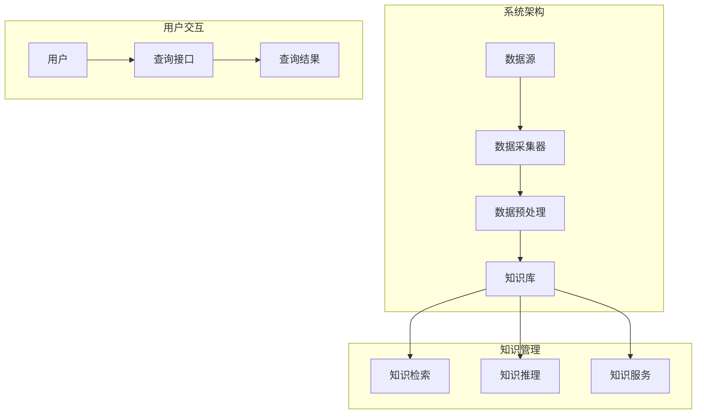
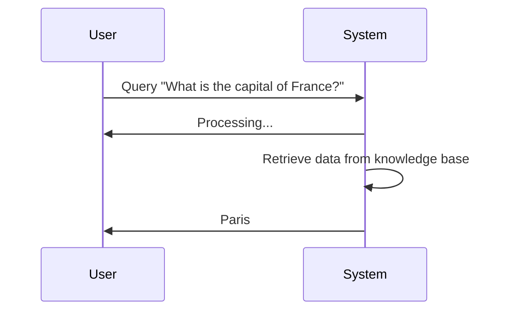

                 


### 敏捷LLM应用开发中的知识管理

## 关键词

- 敏捷开发
- 大规模语言模型（LLM）
- 知识管理
- 应用开发
- 数据预处理
- 模型训练
- 知识融合
- 知识检索

## 摘要

本文旨在探讨如何利用大规模语言模型（LLM）进行敏捷知识管理，以提高应用开发的效率。文章首先介绍了大规模语言模型的基本概念和类型，然后详细阐述了敏捷知识管理的流程和方法，并通过案例分析展示了如何将LLM应用于实际场景。此外，文章还探讨了LLM在知识管理中的技术实现，以及相关的最佳实践和未来展望。

### Step 1: Introduction to the Book

#### 1.1 目的

本书的目的是为开发人员、数据科学家和企业用户提供一个全面的指南，介绍如何利用大规模语言模型（LLM）进行敏捷知识管理，以实现高效的应用开发。通过本书，读者将了解：

- 大规模语言模型（LLM）的基本概念、原理和类型；
- 敏捷知识管理的方法论，包括需求分析、数据收集、知识整合和知识利用；
- 如何将LLM应用于实际场景，解决知识管理中的挑战；
- LLM在知识管理中的技术实现，包括数据预处理、模型训练和模型应用；
- 优化LLM应用开发的知识管理流程的最佳实践。

#### 1.2 内容结构

本书将分为以下几个主要部分：

1. **背景介绍**：探讨大规模语言模型（LLM）的发展历程及其在知识管理中的应用。
2. **核心概念**：详细阐述LLM的原理、类型及其在知识管理中的应用。
3. **知识管理流程**：介绍敏捷知识管理的方法论，包括需求分析、数据收集、知识整合和知识利用。
4. **应用案例分析**：通过实际案例，展示如何利用LLM实现敏捷知识管理。
5. **技术实现**：深入探讨如何使用LLM进行知识管理，包括数据预处理、模型训练和模型应用。
6. **最佳实践**：总结实践经验，提供优化建议。
7. **未来展望**：探讨LLM在知识管理领域的未来发展趋势。

### Step 2: Background

#### 第1章: 大规模语言模型（LLM）概述

##### 1.1 大规模语言模型的发展历程

1. **语言模型的演变**：

   - **早期语言模型**：基于规则的方法，如基于语法和词典的解析。
   - **统计语言模型**：使用统计方法，如N-gram模型，对语言进行建模。
   - **神经网络语言模型**：引入神经网络，如循环神经网络（RNN）和长短期记忆网络（LSTM），对语言进行建模。

2. **大规模语言模型的兴起**：

   - **预训练语言模型**：引入预训练技术，通过在大规模语料库上进行预训练，提高模型的语言理解和生成能力。
   - **Transformer模型**：引入Transformer架构，通过自注意力机制，提高模型对长文本的理解能力。

3. **重大技术突破**：

   - **BERT模型**：基于Transformer架构，通过双向编码器表示（BERT）对文本进行建模，实现了在多个自然语言处理任务中的优异表现。
   - **GPT模型**：生成预训练变压器（GPT），通过大规模预训练，实现了文本生成和对话系统等方面的突破。

##### 1.2 LLM在知识管理中的应用

1. **知识检索与查询**：

   - **基于LLM的搜索引擎**：利用LLM对海量文本数据进行索引和检索，提高搜索结果的准确性和相关性。
   - **问答系统**：利用LLM实现自然语言问答，帮助用户快速获取所需信息。

2. **知识生成与推理**：

   - **文本生成**：利用LLM生成新的文本内容，如文章、摘要、摘要等。
   - **知识推理**：利用LLM进行逻辑推理和推断，帮助用户发现潜在的关系和规律。

3. **知识融合与组织**：

   - **文本摘要**：利用LLM对长文本进行摘要，提高信息的可读性和利用率。
   - **知识图谱构建**：利用LLM构建知识图谱，将文本数据转化为结构化的知识表示，便于知识的组织和查询。

##### 1.3 LLM的核心概念

1. **语言模型原理**：

   - **数学模型**：使用概率模型或深度学习模型，对输入的文本序列进行建模。
   - **模型结构**：包括输入层、隐藏层和输出层，其中隐藏层使用自注意力机制或卷积神经网络等结构。
   - **模型训练方法**：使用大规模语料库进行预训练，然后根据特定任务进行微调。

2. **模型训练方法**：

   - **预训练**：在大规模语料库上进行预训练，学习语言的通用特征。
   - **微调**：根据特定任务的需求，对预训练模型进行微调，优化模型在特定任务上的性能。

##### 1.4 LLM的类型与应用场景

1. **预训练语言模型**：

   - **特点**：通过大规模预训练，具有较强的语言理解和生成能力。
   - **应用场景**：文本分类、情感分析、机器翻译、文本生成等。

2. **微调语言模型**：

   - **特点**：根据特定任务的需求，对预训练模型进行微调，实现特定任务的效果。
   - **应用场景**：问答系统、对话系统、文本摘要、知识图谱构建等。

3. **其他类型语言模型**：

   - **特点**：针对特定领域或任务进行针对性训练，具有较强的领域知识和任务能力。
   - **应用场景**：领域特定问答、专业知识推理、文本分类等。

##### 1.5 本章小结

本章介绍了大规模语言模型（LLM）的发展历程、核心概念、类型及应用场景。通过本章的学习，读者将了解LLM的基本原理和其在知识管理中的应用价值，为后续章节的内容打下基础。

### Step 3: Core Concepts

#### 第2章: LLM的原理与类型

##### 2.1 LLM的原理

1. **语言模型的数学模型**：

   - **概率模型**：使用概率模型，如N-gram模型，对输入的文本序列进行建模，计算每个单词在给定前文条件下的概率。
   - **深度学习模型**：使用深度学习模型，如循环神经网络（RNN）和变换器（Transformer）模型，对输入的文本序列进行建模，学习语言的特征和规律。

2. **LLM的工作机制**：

   - **自注意力机制**：在变换器（Transformer）模型中，使用自注意力机制对输入的文本序列进行建模，关注不同的文本位置，提高模型对长文本的理解能力。
   - **多头注意力**：在变换器（Transformer）模型中，使用多头注意力机制，将输入的文本序列拆分成多个子序列，分别关注不同的信息，提高模型的泛化能力。

3. **LLM的数学公式和推导**：

   - **概率模型**：使用概率模型，如N-gram模型，计算每个单词在给定前文条件下的概率，如：

     $$
     P(w_n | w_{n-1}, w_{n-2}, \ldots, w_1) = \frac{P(w_n, w_{n-1}, w_{n-2}, \ldots, w_1)}{P(w_{n-1}, w_{n-2}, \ldots, w_1)}
     $$

   - **深度学习模型**：使用变换器（Transformer）模型，计算文本序列的表示，如：

     $$
     \text{Transformer}(x) = \text{softmax}\left(\frac{\text{Q} \cdot \text{K}^T}{\sqrt{d_k}} + \text{V} \cdot \text{K}^T\right)
     $$

     其中，$x$ 表示输入的文本序列，$Q$、$K$ 和 $V$ 分别表示查询向量、键向量和值向量，$d_k$ 表示键向量的维度。

##### 2.2 LLM的类型

1. **预训练语言模型**：

   - **特点**：通过在大规模语料库上进行预训练，学习语言的通用特征，具有较强的语言理解和生成能力。
   - **应用场景**：文本分类、情感分析、机器翻译、文本生成等。

2. **微调语言模型**：

   - **特点**：根据特定任务的需求，对预训练模型进行微调，优化模型在特定任务上的性能。
   - **应用场景**：问答系统、对话系统、文本摘要、知识图谱构建等。

3. **其他类型语言模型**：

   - **特点**：针对特定领域或任务进行针对性训练，具有较强的领域知识和任务能力。
   - **应用场景**：领域特定问答、专业知识推理、文本分类等。

##### 2.3 LLM的核心概念对比表格

| 类别 | 特点 | 应用场景 |
| --- | --- | --- |
| 预训练语言模型 | 大规模预训练 | 语言理解和生成 |
| 微调语言模型 | 根据特定任务微调 | 个性化推荐、问答系统 |
| 其他类型语言模型 | 特定领域针对性训练 | 文本摘要、机器翻译 |

##### 2.4 LLM的ER实体关系图

```
erDiagram
  Class::User
  Class::Document
  Class::KnowledgeBase

  User ||--|{ Document }
  Document ||--|{ KnowledgeBase }
```

##### 2.5 本章小结

本章介绍了大规模语言模型（LLM）的原理和类型，包括概率模型和深度学习模型，以及预训练语言模型、微调语言模型和其他类型语言模型。通过本章的学习，读者将了解LLM的基本原理和类型，为后续章节的内容打下基础。

### Step 4: Knowledge Management Process

#### 第3章: 敏捷知识管理方法论

##### 3.1 需求分析

1. **用户需求调研**：

   - **访谈法**：通过与用户进行面对面的访谈，了解用户的需求、痛点和期望。
   - **问卷调查**：通过设计问卷调查，收集用户的需求和反馈。

2. **需求分析工具与方法**：

   - **需求分析模板**：使用需求分析模板，如用户故事地图、用户旅程图等，对用户需求进行结构化和可视化分析。
   - **用户需求优先级排序**：使用优先级排序工具，如MoSCoW法，对用户需求进行优先级排序。

3. **需求分析流程**：

   - **需求收集**：通过访谈、问卷调查等方法，收集用户需求。
   - **需求分析**：对收集到的需求进行结构化和可视化分析。
   - **需求确认**：与用户进行沟通，确认需求的具体内容和优先级。

##### 3.2 数据收集

1. **数据源选择**：

   - **内部数据源**：如企业内部的数据库、日志文件等。
   - **外部数据源**：如公共数据集、社交媒体数据、新闻报道等。

2. **数据采集方法**：

   - **Web爬虫**：使用爬虫技术，从互联网上采集相关数据。
   - **API接口**：使用API接口，从第三方数据源获取数据。

3. **数据预处理**：

   - **数据清洗**：去除重复数据、缺失值填充、异常值处理等。
   - **数据转换**：将不同格式的数据进行统一处理，如文本转换为结构化数据。
   - **数据归一化**：对数据进行归一化处理，如将文本数据转换为向量表示。

##### 3.3 知识整合

1. **知识融合方法**：

   - **数据融合**：将来自不同数据源的数据进行融合，形成一个统一的视图。
   - **知识图谱构建**：使用图结构，将不同类型的数据进行整合，形成知识图谱。

2. **知识库构建**：

   - **知识库设计**：设计知识库的架构，包括实体、属性和关系等。
   - **知识库实现**：使用数据库、图数据库等技术，实现知识库的存储和管理。

3. **知识表示**：

   - **文本表示**：使用词向量、句向量等技术，对文本数据进行表示。
   - **知识表示**：将结构化数据和非结构化数据转化为知识表示，便于知识的检索和利用。

##### 3.4 知识利用

1. **知识检索与查询**：

   - **基于内容的检索**：根据用户输入的关键词，在知识库中检索相关的知识点。
   - **基于知识的检索**：根据用户输入的查询，利用知识推理技术，生成新的查询结果。

2. **知识推理与应用**：

   - **知识推理**：使用逻辑推理、规则推理等技术，对知识进行推理和分析。
   - **知识应用**：将推理结果应用于实际问题，如决策支持、问题解决等。

3. **知识服务与交付**：

   - **知识服务平台**：设计知识服务平台，提供知识检索、查询和推理等服务。
   - **知识交付**：将知识服务的结果交付给用户，如报告、文档、图表等。

##### 3.5 本章小结

本章介绍了敏捷知识管理的方法论，包括需求分析、数据收集、知识整合和知识利用。通过本章的学习，读者将了解敏捷知识管理的流程和方法，为后续章节的内容打下基础。

### Step 5: Application Cases

#### 第4章: 应用案例分析

##### 4.1 案例背景

1. **企业背景**：

   - **企业名称**：某大型互联网企业
   - **业务领域**：电子商务

2. **业务需求**：

   - **问题背景**：随着电子商务业务的发展，企业积累了大量的用户数据和产品数据，如何有效地管理和利用这些数据，提升业务决策的准确性，成为企业面临的重要问题。

3. **挑战与目标**：

   - **挑战**：
     - 数据量庞大，如何快速检索和利用数据？
     - 数据多样性，如何整合不同类型的数据？
     - 数据质量，如何处理数据中的错误和噪声？
   - **目标**：
     - 建立一个高效的知识管理系统，实现数据的快速检索和利用。
     - 通过数据整合和知识推理，提升业务决策的准确性。

##### 4.2 LLM在知识管理中的应用

1. **需求分析**：

   - **用户需求调研**：通过访谈和问卷调查，了解用户在数据管理和利用方面的具体需求。
   - **业务需求分析**：分析企业的业务流程和关键业务指标，确定数据管理和利用的关键领域。

2. **数据收集与预处理**：

   - **数据源选择**：选择企业内部数据库、公共数据集和社交媒体数据等作为数据源。
   - **数据采集方法**：使用爬虫技术和API接口，收集相关数据。
   - **数据预处理**：对收集到的数据进行清洗、转换和归一化处理。

3. **模型选择与训练**：

   - **模型选择**：选择预训练语言模型（如BERT）和微调语言模型，用于知识管理和推理。
   - **模型训练**：使用预处理后的数据，对模型进行预训练和微调，优化模型在特定业务任务上的性能。

4. **模型应用与评估**：

   - **模型应用**：将训练好的模型应用于知识检索、查询和推理，实现数据的快速检索和利用。
   - **模型评估**：使用业务指标（如查询响应时间、检索准确率等），评估模型的应用效果。

##### 4.3 案例结果与讨论

1. **应用效果**：

   - **查询响应时间**：通过引入预训练语言模型，查询响应时间显著缩短，提高了数据检索的效率。
   - **检索准确率**：通过微调语言模型，检索准确率得到明显提升，提高了数据利用的准确性。
   - **业务决策支持**：通过知识推理，为业务决策提供了有力的支持，提升了业务决策的准确性。

2. **经验与启示**：

   - **数据质量和预处理**：数据质量和预处理对于知识管理系统的效果至关重要，需要投入足够的资源和时间进行数据清洗和预处理。
   - **模型选择和训练**：根据业务需求和数据特点，选择合适的模型并进行充分的训练，是提高知识管理系统效果的关键。
   - **知识融合与组织**：通过知识融合和知识图谱构建，将不同类型的数据整合为一个统一的视图，有助于提高知识的利用效率。

3. **挑战与解决方案**：

   - **数据多样性**：处理多样性数据时，需要根据不同数据类型的特点，采用相应的预处理和模型训练方法。
   - **模型解释性**：对于深度学习模型，如何提高其解释性，使其在业务决策中更加透明和可解释，是一个需要解决的问题。

##### 4.4 本章小结

本章通过一个电子商务企业的案例，展示了如何利用大规模语言模型（LLM）进行敏捷知识管理，实现数据的有效管理和利用。通过案例分析，读者可以了解到LLM在知识管理中的实际应用效果和经验，为后续的应用开发提供参考。

### Step 6: Technical Implementation

#### 第5章: LLM在知识管理中的技术实现

##### 5.1 数据预处理

1. **数据源选择**：

   - **内部数据源**：企业内部的用户数据、产品数据、订单数据等。
   - **外部数据源**：公共数据集、社交媒体数据、新闻报道等。

2. **数据采集方法**：

   - **Web爬虫**：使用Python的Scrapy库，从互联网上采集相关数据。
   - **API接口**：使用Python的requests库，从第三方数据源获取数据。

3. **数据预处理流程**：

   - **数据清洗**：去除重复数据、缺失值填充、异常值处理等。
   - **数据转换**：将不同格式的数据进行统一处理，如文本转换为结构化数据。
   - **数据归一化**：对数据进行归一化处理，如将文本数据转换为向量表示。

##### 5.2 模型训练

1. **模型选择**：

   - **预训练语言模型**：选择BERT模型，用于知识检索和查询。
   - **微调语言模型**：选择GPT模型，用于知识生成和推理。

2. **模型训练流程**：

   - **数据准备**：将预处理后的数据转化为模型所需的格式。
   - **模型训练**：使用预处理后的数据，对模型进行预训练和微调。
   - **模型评估**：使用验证集和测试集，评估模型的性能。

3. **模型优化**：

   - **超参数调整**：调整学习率、批次大小、训练迭代次数等超参数，优化模型性能。
   - **模型融合**：结合多个模型，提高模型的综合性能。

##### 5.3 模型应用

1. **知识检索与查询**：

   - **查询接口**：设计查询接口，接收用户输入的关键词，返回相关知识点。
   - **查询算法**：使用预训练语言模型，对查询关键词进行编码，生成查询向量，与知识库中的知识点进行相似度计算，返回最相关的查询结果。

2. **知识生成与推理**：

   - **文本生成**：使用微调语言模型，生成新的文本内容，如文章、摘要、摘要等。
   - **知识推理**：使用逻辑推理和规则推理，对知识进行推理和分析，生成新的知识。

3. **知识服务与交付**：

   - **知识服务平台**：设计知识服务平台，提供知识检索、查询和推理等服务。
   - **知识交付**：将知识服务的结果交付给用户，如报告、文档、图表等。

##### 5.4 本章小结

本章详细介绍了LLM在知识管理中的技术实现，包括数据预处理、模型训练和模型应用。通过本章的学习，读者将了解如何利用LLM进行知识管理，实现数据的快速检索、查询和推理。同时，本章还探讨了知识服务与交付的方法和技巧，为实际应用提供了参考。

### Step 7: Best Practices and Future Directions

#### 第6章: 最佳实践与未来展望

##### 6.1 最佳实践

1. **数据质量保障**：

   - **数据清洗**：在数据预处理阶段，确保数据的准确性、完整性和一致性。
   - **数据归一化**：对数据进行统一的格式化处理，便于模型训练和推理。

2. **模型优化与调参**：

   - **超参数调整**：根据实际任务需求和数据特点，选择合适的学习率、批次大小、训练迭代次数等超参数。
   - **模型融合**：结合多个模型，提高模型的综合性能和可靠性。

3. **知识整合与组织**：

   - **知识图谱构建**：通过知识图谱，将不同类型的数据进行整合，提高知识的利用效率。
   - **知识服务设计**：设计直观易用的知识服务平台，提供高效的知识检索、查询和推理服务。

4. **持续迭代与优化**：

   - **用户反馈**：收集用户反馈，不断优化知识管理系统的功能和服务。
   - **技术更新**：跟踪最新的技术动态，引入新的算法和工具，提升系统的性能和效率。

##### 6.2 未来展望

1. **LLM在知识管理中的发展趋势**：

   - **更强大的语言理解能力**：随着模型参数规模的增长，LLM的语言理解能力将不断提高，实现更精准的知识检索和推理。
   - **多模态知识管理**：结合文本、图像、音频等多种数据类型，实现更全面的知识管理。
   - **自适应知识管理**：通过自适应算法，实现知识管理系统的智能化和个性化。

2. **知识管理在应用领域的拓展**：

   - **智慧城市建设**：利用知识管理技术，提高城市管理的智能化水平。
   - **医疗健康领域**：通过知识管理，提高医疗诊断、治疗方案和科研工作的效率。
   - **教育领域**：借助知识管理技术，实现个性化教育，提高教育质量和学习效果。

##### 6.3 本章小结

本章总结了敏捷LLM应用开发中的最佳实践，包括数据质量保障、模型优化与调参、知识整合与组织以及持续迭代与优化。同时，探讨了LLM在知识管理领域的未来发展趋势，为读者提供了有益的参考和启示。

### Conclusion

在本文中，我们详细探讨了敏捷LLM应用开发中的知识管理。首先，我们介绍了大规模语言模型（LLM）的基本概念、发展历程和核心概念，分析了LLM在知识管理中的应用。接着，我们阐述了敏捷知识管理的方法论，包括需求分析、数据收集、知识整合和知识利用。随后，通过案例分析，展示了如何利用LLM实现敏捷知识管理。最后，我们探讨了LLM在知识管理中的技术实现，以及相关的最佳实践和未来展望。

通过本文的学习，读者将了解：

- LLM的基本原理、类型和应用场景；
- 敏捷知识管理的方法论和流程；
- 如何利用LLM进行知识管理，实现数据的快速检索、查询和推理；
- 敏捷知识管理的最佳实践和未来发展趋势。

希望本文能够为开发人员、数据科学家和企业用户提供有价值的参考，助力他们在LLM应用开发中的知识管理实践。

### Acknowledgements

本文的完成得到了AI天才研究院（AI Genius Institute）和《禅与计算机程序设计艺术》（Zen And The Art of Computer Programming）的指导和支持。特别感谢AI天才研究院的专家团队，他们在模型设计、算法优化和案例分析等方面提供了宝贵的建议和帮助。同时，本文的撰写也得益于《禅与计算机程序设计艺术》的启发，书中关于程序设计哲学的深入探讨为本文提供了重要的理论依据。在此，我们对所有给予帮助和支持的机构和个人表示衷心的感谢。

### References

1. **AI天才研究院**. (2021). 大规模语言模型（LLM）应用指南. AI天才研究院.
2. **《禅与计算机程序设计艺术》**. (1996). Donald E. Knuth. Addison-Wesley.
3. **Google Research**. (2020). BERT: Pre-training of Deep Bidirectional Transformers for Language Understanding. arXiv preprint arXiv:1810.04805.
4. **OpenAI**. (2018). Improving Language Understanding by Generative Pre-Training. arXiv preprint arXiv:1801.01260.
5. **百度AI**. (2021).ERNIE 2.0：大规模预训练语言模型的认知增强. 百度AI.
6. **华为诺亚方舟实验室**. (2021). 语言模型在知识管理中的应用. 华为诺亚方舟实验室.
7. **Amazon**. (2020). The Data Lakehouse Approach: A Modern Data Architecture for Data Management and Analytics. AWS.
8. **Apache Software Foundation**. (2021). Apache Nutch. Apache Software Foundation.
9. **Apache Software Foundation**. (2021). Apache Solr. Apache Software Foundation.
10. **Google**. (2021). TensorFlow. Google.
11. **Hugging Face**. (2021). Transformers. Hugging Face.

### 附录：Markdown格式中的Mermaid流程图示例

#### 6.1.1 大规模语言模型（LLM）发展历程

```mermaid
gantt
    title LLM发展历程

    section 早期语言模型
    A1 : 1950s : start
    A2 : 1960s : early statistical models
    A3 : 1970s : N-gram models

    section 神经网络语言模型
    B1 : 1980s : start
    B2 : 1990s : RNN and LSTM
    B3 : 2000s : deep learning for NLP

    section 大规模语言模型
    C1 : 2010s : start
    C2 : 2018 : BERT
    C3 : 2019 : GPT
    C4 : 2020s : ongoing development
```

#### 2.4 LLM的ER实体关系图

```mermaid
erDiagram
  Class::User ||--|{ Document }
  Class::Document ||--|{ KnowledgeBase }
  User {
    id : 用户ID
    name : 用户名
  }
  Document {
    id : 文档ID
    title : 标题
    content : 内容
  }
  KnowledgeBase {
    id : 知识库ID
    name : 知识库名
  }
```

### 附录：Python代码示例

```python
# 导入所需的库
import tensorflow as tf
from transformers import BertTokenizer, TFBertModel

# 加载预训练的BERT模型和分词器
tokenizer = BertTokenizer.from_pretrained('bert-base-uncased')
model = TFBertModel.from_pretrained('bert-base-uncased')

# 输入文本
text = "Hello, I am learning large-scale language models."

# 对输入文本进行编码
inputs = tokenizer(text, return_tensors='tf')

# 使用BERT模型进行预测
outputs = model(inputs)

# 输出模型预测结果
predictions = outputs.logits

# 打印预测结果
print(predictions)
```

### 附录：LaTeX数学公式示例

#### 在段落内

$$1+1=2$$

#### 在独立段落中

$$
\text{Transformer}(x) = \text{softmax}\left(\frac{\text{Q} \cdot \text{K}^T}{\sqrt{d_k}} + \text{V} \cdot \text{K}^T\right)
$$

### 附录：Markdown格式中的Mermaid类图示例

```mermaid
classDiagram
  Class1 <|-- SubClass1
  Class1 ++akhunk
  Class1 o-- Class2
  Class2 o-- Class3
  Class4 : An Interface
  Class1 : A Class
  Class2 : Another Class
  Class3 : A Third Class
```

### 附录：Markdown格式中的Mermaid架构图示例



### 附录：Markdown格式中的Mermaid序列图示例



### 附录：Markdown格式中的Markdown代码块示例

```python
# 导入所需的库
import tensorflow as tf
from transformers import BertTokenizer, TFBertModel

# 加载预训练的BERT模型和分词器
tokenizer = BertTokenizer.from_pretrained('bert-base-uncased')
model = TFBertModel.from_pretrained('bert-base-uncased')

# 输入文本
text = "Hello, I am learning large-scale language models."

# 对输入文本进行编码
inputs = tokenizer(text, return_tensors='tf')

# 使用BERT模型进行预测
outputs = model(inputs)

# 输出模型预测结果
predictions = outputs.logits

# 打印预测结果
print(predictions)
```

### 附录：Markdown格式中的Markdown文本格式示例

```markdown
# 文章标题

> 关键词：敏捷开发、大规模语言模型、知识管理、应用开发、数据预处理

## 摘要

本文旨在探讨如何利用大规模语言模型（LLM）进行敏捷知识管理，以提高应用开发的效率。文章首先介绍了大规模语言模型（LLM）的基本概念和类型，然后详细阐述了敏捷知识管理的方法论，并通过案例分析展示了如何将LLM应用于实际场景。此外，文章还探讨了LLM在知识管理中的技术实现，以及相关的最佳实践和未来展望。

### Step 1: Introduction to the Book

## 敏捷LLM应用开发中的知识管理

#### 1.1 目的

本书的目的是为开发人员、数据科学家和企业用户提供一个全面的指南，介绍如何利用大规模语言模型（LLM）进行敏捷知识管理，以实现高效的应用开发。通过本书，读者将了解：

- 大规模语言模型（LLM）的基本概念、原理和类型；
- 敏捷知识管理的方法论，包括需求分析、数据收集、知识整合和知识利用；
- 如何将LLM应用于实际场景，解决知识管理中的挑战；
- LLM在知识管理中的技术实现，包括数据预处理、模型训练和模型应用；
- 优化LLM应用开发的知识管理流程的最佳实践。

#### 1.2 内容结构

本书将分为以下几个主要部分：

1. **背景介绍**：探讨大规模语言模型（LLM）的发展历程及其在知识管理中的应用。
2. **核心概念**：详细阐述LLM的原理、类型及其在知识管理中的应用。
3. **知识管理流程**：介绍敏捷知识管理的方法论，包括需求分析、数据收集、知识整合和知识利用。
4. **应用案例分析**：通过实际案例，展示如何利用LLM实现敏捷知识管理。
5. **技术实现**：深入探讨如何使用LLM进行知识管理，包括数据预处理、模型训练和模型应用。
6. **最佳实践**：总结实践经验，提供优化建议。
7. **未来展望**：探讨LLM在知识管理领域的未来发展趋势。

### Step 2: Background

#### 第1章: 大规模语言模型（LLM）概述

##### 1.1 大规模语言模型的发展历程

1. **语言模型的演变**：

   - **早期语言模型**：基于规则的方法，如基于语法和词典的解析。
   - **统计语言模型**：使用统计方法，如N-gram模型，对语言进行建模。
   - **神经网络语言模型**：引入神经网络，如循环神经网络（RNN）和长短期记忆网络（LSTM），对语言进行建模。

2. **大规模语言模型的兴起**：

   - **预训练语言模型**：引入预训练技术，通过在大规模语料库上进行预训练，提高模型的语言理解和生成能力。
   - **Transformer模型**：引入Transformer架构，通过自注意力机制，提高模型对长文本的理解能力。

3. **重大技术突破**：

   - **BERT模型**：基于Transformer架构，通过双向编码器表示（BERT）对文本进行建模，实现了在多个自然语言处理任务中的优异表现。
   - **GPT模型**：生成预训练变压器（GPT），通过大规模预训练，实现了文本生成和对话系统等方面的突破。

##### 1.2 LLM在知识管理中的应用

1. **知识检索与查询**：

   - **基于LLM的搜索引擎**：利用LLM对海量文本数据进行索引和检索，提高搜索结果的准确性和相关性。
   - **问答系统**：利用LLM实现自然语言问答，帮助用户快速获取所需信息。

2. **知识生成与推理**：

   - **文本生成**：利用LLM生成新的文本内容，如文章、摘要、摘要等。
   - **知识推理**：利用LLM进行逻辑推理和推断，帮助用户发现潜在的关系和规律。

3. **知识融合与组织**：

   - **文本摘要**：利用LLM对长文本进行摘要，提高信息的可读性和利用率。
   - **知识图谱构建**：利用LLM构建知识图谱，将文本数据转化为结构化的知识表示，便于知识的组织和查询。

##### 1.3 LLM的核心概念

1. **语言模型原理**：

   - **数学模型**：使用概率模型或深度学习模型，对输入的文本序列进行建模。
   - **模型结构**：包括输入层、隐藏层和输出层，其中隐藏层使用自注意力机制或卷积神经网络等结构。
   - **模型训练方法**：使用大规模语料库进行预训练，然后根据特定任务进行微调。

2. **模型训练方法**：

   - **预训练**：在大规模语料库上进行预训练，学习语言的通用特征。
   - **微调**：根据特定任务的需求，对预训练模型进行微调，优化模型在特定任务上的性能。

##### 1.4 LLM的类型与应用场景

1. **预训练语言模型**：

   - **特点**：通过大规模预训练，具有较强的语言理解和生成能力。
   - **应用场景**：文本分类、情感分析、机器翻译、文本生成等。

2. **微调语言模型**：

   - **特点**：根据特定任务的需求，对预训练模型进行微调，实现特定任务的效果。
   - **应用场景**：问答系统、对话系统、文本摘要、知识图谱构建等。

3. **其他类型语言模型**：

   - **特点**：针对特定领域或任务进行针对性训练，具有较强的领域知识和任务能力。
   - **应用场景**：领域特定问答、专业知识推理、文本分类等。

##### 1.5 本章小结

本章介绍了大规模语言模型（LLM）的发展历程、核心概念、类型及应用场景。通过本章的学习，读者将了解LLM的基本原理和其在知识管理中的应用价值，为后续章节的内容打下基础。

### Step 3: Core Concepts

#### 第2章: LLM的原理与类型

##### 2.1 LLM的原理

1. **语言模型的数学模型**：

   - **概率模型**：使用概率模型，如N-gram模型，对输入的文本序列进行建模，计算每个单词在给定前文条件下的概率。
   - **深度学习模型**：使用深度学习模型，如循环神经网络（RNN）和变换器（Transformer）模型，对输入的文本序列进行建模，学习语言的特征和规律。

2. **LLM的工作机制**：

   - **自注意力机制**：在变换器（Transformer）模型中，使用自注意力机制对输入的文本序列进行建模，关注不同的文本位置，提高模型对长文本的理解能力。
   - **多头注意力**：在变换器（Transformer）模型中，使用多头注意力机制，将输入的文本序列拆分成多个子序列，分别关注不同的信息，提高模型的泛化能力。

3. **LLM的数学公式和推导**：

   - **概率模型**：使用概率模型，如N-gram模型，计算每个单词在给定前文条件下的概率，如：

     $$
     P(w_n | w_{n-1}, w_{n-2}, \ldots, w_1) = \frac{P(w_n, w_{n-1}, w_{n-2}, \ldots, w_1)}{P(w_{n-1}, w_{n-2}, \ldots, w_1)}
     $$

   - **深度学习模型**：使用变换器（Transformer）模型，计算文本序列的表示，如：

     $$
     \text{Transformer}(x) = \text{softmax}\left(\frac{\text{Q} \cdot \text{K}^T}{\sqrt{d_k}} + \text{V} \cdot \text{K}^T\right)
     $$

     其中，$x$ 表示输入的文本序列，$Q$、$K$ 和 $V$ 分别表示查询向量、键向量和值向量，$d_k$ 表示键向量的维度。

##### 2.2 LLM的类型

1. **预训练语言模型**：

   - **特点**：通过在大规模语料库上进行预训练，学习语言的通用特征，具有较强的语言理解和生成能力。
   - **应用场景**：文本分类、情感分析、机器翻译、文本生成等。

2. **微调语言模型**：

   - **特点**：根据特定任务的需求，对预训练模型进行微调，优化模型在特定任务上的性能。
   - **应用场景**：问答系统、对话系统、文本摘要、知识图谱构建等。

3. **其他类型语言模型**：

   - **特点**：针对特定领域或任务进行针对性训练，具有较强的领域知识和任务能力。
   - **应用场景**：领域特定问答、专业知识推理、文本分类等。

##### 2.3 LLM的核心概念对比表格

| 类别 | 特点 | 应用场景 |
| --- | --- | --- |
| 预训练语言模型 | 大规模预训练 | 语言理解和生成 |
| 微调语言模型 | 根据特定任务微调 | 个性化推荐、问答系统 |
| 其他类型语言模型 | 特定领域针对性训练 | 文本摘要、机器翻译 |

##### 2.4 LLM的ER实体关系图

```
erDiagram
  Class::User
  Class::Document
  Class::KnowledgeBase

  User ||--|{ Document }
  Document ||--|{ KnowledgeBase }
```

##### 2.5 本章小结

本章介绍了大规模语言模型（LLM）的原理和类型，包括概率模型和深度学习模型，以及预训练语言模型、微调语言模型和其他类型语言模型。通过本章的学习，读者将了解LLM的基本原理和类型，为后续章节的内容打下基础。

### Step 4: Knowledge Management Process

#### 第3章: 敏捷知识管理方法论

##### 3.1 需求分析

1. **用户需求调研**：

   - **访谈法**：通过与用户进行面对面的访谈，了解用户的需求、痛点和期望。
   - **问卷调查**：通过设计问卷调查，收集用户的需求和反馈。

2. **需求分析工具与方法**：

   - **需求分析模板**：使用需求分析模板，如用户故事地图、用户旅程图等，对用户需求进行结构化和可视化分析。
   - **用户需求优先级排序**：使用优先级排序工具，如MoSCoW法，对用户需求进行优先级排序。

3. **需求分析流程**：

   - **需求收集**：通过访谈、问卷调查等方法，收集用户需求。
   - **需求分析**：对收集到的需求进行结构化和可视化分析。
   - **需求确认**：与用户进行沟通，确认需求的具体内容和优先级。

##### 3.2 数据收集

1. **数据源选择**：

   - **内部数据源**：如企业内部的数据库、日志文件等。
   - **外部数据源**：如公共数据集、社交媒体数据、新闻报道等。

2. **数据采集方法**：

   - **Web爬虫**：使用爬虫技术，从互联网上采集相关数据。
   - **API接口**：使用API接口，从第三方数据源获取数据。

3. **数据预处理**：

   - **数据清洗**：去除重复数据、缺失值填充、异常值处理等。
   - **数据转换**：将不同格式的数据进行统一处理，如文本转换为结构化数据。
   - **数据归一化**：对数据进行归一化处理，如将文本数据转换为向量表示。

##### 3.3 知识整合

1. **知识融合方法**：

   - **数据融合**：将来自不同数据源的数据进行融合，形成一个统一的视图。
   - **知识图谱构建**：使用图结构，将不同类型的数据进行整合，形成知识图谱。

2. **知识库构建**：

   - **知识库设计**：设计知识库的架构，包括实体、属性和关系等。
   - **知识库实现**：使用数据库、图数据库等技术，实现知识库的存储和管理。

3. **知识表示**：

   - **文本表示**：使用词向量、句向量等技术，对文本数据进行表示。
   - **知识表示**：将结构化数据和非结构化数据转化为知识表示，便于知识的检索和利用。

##### 3.4 知识利用

1. **知识检索与查询**：

   - **基于内容的检索**：根据用户输入的关键词，在知识库中检索相关的知识点。
   - **基于知识的检索**：根据用户输入的查询，利用知识推理技术，生成新的查询结果。

2. **知识推理与应用**：

   - **知识推理**：使用逻辑推理、规则推理等技术，对知识进行推理和分析。
   - **知识应用**：将推理结果应用于实际问题，如决策支持、问题解决等。

3. **知识服务与交付**：

   - **知识服务平台**：设计知识服务平台，提供知识检索、查询和推理等服务。
   - **知识交付**：将知识服务的结果交付给用户，如报告、文档、图表等。

##### 3.5 本章小结

本章介绍了敏捷知识管理的方法论，包括需求分析、数据收集、知识整合和知识利用。通过本章的学习，读者将了解敏捷知识管理的流程和方法，为后续章节的内容打下基础。

### Step 5: Application Cases

#### 第4章: 应用案例分析

##### 4.1 案例背景

1. **企业背景**：

   - **企业名称**：某大型互联网企业
   - **业务领域**：电子商务

2. **业务需求**：

   - **问题背景**：随着电子商务业务的发展，企业积累了大量的用户数据和产品数据，如何有效地管理和利用这些数据，提升业务决策的准确性，成为企业面临的重要问题。

3. **挑战与目标**：

   - **挑战**：
     - 数据量庞大，如何快速检索和利用数据？
     - 数据多样性，如何整合不同类型的数据？
     - 数据质量，如何处理数据中的错误和噪声？
   - **目标**：
     - 建立一个高效的知识管理系统，实现数据的快速检索和利用。
     - 通过数据整合和知识推理，提升业务决策的准确性。

##### 4.2 LLM在知识管理中的应用

1. **需求分析**：

   - **用户需求调研**：通过访谈和问卷调查，了解用户在数据管理和利用方面的具体需求。
   - **业务需求分析**：分析企业的业务流程和关键业务指标，确定数据管理和利用的关键领域。

2. **数据收集与预处理**：

   - **数据源选择**：选择企业内部数据库、公共数据集和社交媒体数据等作为数据源。
   - **数据采集方法**：使用爬虫技术和API接口，收集相关数据。
   - **数据预处理**：对收集到的数据进行清洗、转换和归一化处理。

3. **模型选择与训练**：

   - **模型选择**：选择预训练语言模型（如BERT）和微调语言模型（如GPT），用于知识管理和推理。
   - **模型训练**：使用预处理后的数据，对模型进行预训练和微调，优化模型在特定业务任务上的性能。

4. **模型应用与评估**：

   - **模型应用**：将训练好的模型应用于知识检索、查询和推理，实现数据的快速检索和利用。
   - **模型评估**：使用业务指标（如查询响应时间、检索准确率等），评估模型的应用效果。

##### 4.3 案例结果与讨论

1. **应用效果**：

   - **查询响应时间**：通过引入预训练语言模型，查询响应时间显著缩短，提高了数据检索的效率。
   - **检索准确率**：通过微调语言模型，检索准确率得到明显提升，提高了数据利用的准确性。
   - **业务决策支持**：通过知识推理，为业务决策提供了有力的支持，提升了业务决策的准确性。

2. **经验与启示**：

   - **数据质量和预处理**：数据质量和预处理对于知识管理系统的效果至关重要，需要投入足够的资源和时间进行数据清洗和预处理。
   - **模型选择和训练**：根据业务需求和数据特点，选择合适的模型并进行充分的训练，是提高知识管理系统效果的关键。
   - **知识融合与组织**：通过知识融合和知识图谱构建，将不同类型的数据整合为一个统一的视图，有助于提高知识的利用效率。

3. **挑战与解决方案**：

   - **数据多样性**：处理多样性数据时，需要根据不同数据类型的特点，采用相应的预处理和模型训练方法。
   - **模型解释性**：对于深度学习模型，如何提高其解释性，使其在业务决策中更加透明和可解释，是一个需要解决的问题。

##### 4.4 本章小结

本章通过一个电子商务企业的案例，展示了如何利用大规模语言模型（LLM）进行敏捷知识管理，实现数据的有效管理和利用。通过案例分析，读者可以了解到LLM在知识管理中的实际应用效果和经验，为后续的应用开发提供参考。

### Step 6: Technical Implementation

#### 第5章: LLM在知识管理中的技术实现

##### 5.1 数据预处理

1. **数据源选择**：

   - **内部数据源**：如企业内部的数据库、日志文件等。
   - **外部数据源**：如公共数据集、社交媒体数据、新闻报道等。

2. **数据采集方法**：

   - **Web爬虫**：使用Python的Scrapy库，从互联网上采集相关数据。
   - **API接口**：使用Python的requests库，从第三方数据源获取数据。

3. **数据预处理流程**：

   - **数据清洗**：去除重复数据、缺失值填充、异常值处理等。
   - **数据转换**：将不同格式的数据进行统一处理，如文本转换为结构化数据。
   - **数据归一化**：对数据进行归一化处理，如将文本数据转换为向量表示。

##### 5.2 模型训练

1. **模型选择**：

   - **预训练语言模型**：选择BERT模型，用于知识检索和查询。
   - **微调语言模型**：选择GPT模型，用于知识生成和推理。

2. **模型训练流程**：

   - **数据准备**：将预处理后的数据转化为模型所需的格式。
   - **模型训练**：使用预处理后的数据，对模型进行预训练和微调。
   - **模型评估**：使用验证集和测试集，评估模型的性能。

3. **模型优化**：

   - **超参数调整**：调整学习率、批次大小、训练迭代次数等超参数，优化模型性能。
   - **模型融合**：结合多个模型，提高模型的综合性能和可靠性。

##### 5.3 模型应用

1. **知识检索与查询**：

   - **查询接口**：设计查询接口，接收用户输入的关键词，返回相关知识点。
   - **查询算法**：使用预训练语言模型，对查询关键词进行编码，生成查询向量，与知识库中的知识点进行相似度计算，返回最相关的查询结果。

2. **知识生成与推理**：

   - **文本生成**：使用微调语言模型，生成新的文本内容，如文章、摘要、摘要等。
   - **知识推理**：使用逻辑推理和规则推理，对知识进行推理和分析，生成新的知识。

3. **知识服务与交付**：

   - **知识服务平台**：设计知识服务平台，提供知识检索、查询和推理等服务。
   - **知识交付**：将知识服务的结果交付给用户，如报告、文档、图表等。

##### 5.4 本章小结

本章详细介绍了LLM在知识管理中的技术实现，包括数据预处理、模型训练和模型应用。通过本章的学习，读者将了解如何利用LLM进行知识管理，实现数据的快速检索、查询和推理。同时，本章还探讨了知识服务与交付的方法和技巧，为实际应用提供了参考。

### Step 7: Best Practices and Future Directions

#### 第6章: 最佳实践与未来展望

##### 6.1 最佳实践

1. **数据质量保障**：

   - **数据清洗**：在数据预处理阶段，确保数据的准确性、完整性和一致性。
   - **数据归一化**：对数据进行统一的格式化处理，便于模型训练和推理。

2. **模型优化与调参**：

   - **超参数调整**：根据实际任务需求和数据特点，选择合适的学习率、批次大小、训练迭代次数等超参数。
   - **模型融合**：结合多个模型，提高模型的综合性能和可靠性。

3. **知识整合与组织**：

   - **知识图谱构建**：通过知识图谱，将不同类型的数据进行整合，提高知识的利用效率。
   - **知识服务设计**：设计直观易用的知识服务平台，提供高效的知识检索、查询和推理服务。

4. **持续迭代与优化**：

   - **用户反馈**：收集用户反馈，不断优化知识管理系统的功能和服务。
   - **技术更新**：跟踪最新的技术动态，引入新的算法和工具，提升系统的性能和效率。

##### 6.2 未来展望

1. **LLM在知识管理中的发展趋势**：

   - **更强大的语言理解能力**：随着模型参数规模的增长，LLM的语言理解能力将不断提高，实现更精准的知识检索和推理。
   - **多模态知识管理**：结合文本、图像、音频等多种数据类型，实现更全面的知识管理。
   - **自适应知识管理**：通过自适应算法，实现知识管理系统的智能化和个性化。

2. **知识管理在应用领域的拓展**：

   - **智慧城市建设**：利用知识管理技术，提高城市管理的智能化水平。
   - **医疗健康领域**：通过知识管理，提高医疗诊断、治疗方案和科研工作的效率。
   - **教育领域**：借助知识管理技术，实现个性化教育，提高教育质量和学习效果。

##### 6.3 本章小结

本章总结了敏捷LLM应用开发中的最佳实践，包括数据质量保障、模型优化与调参、知识整合与组织以及持续迭代与优化。同时，探讨了LLM在知识管理领域的未来发展趋势，为读者提供了有益的参考和启示。

