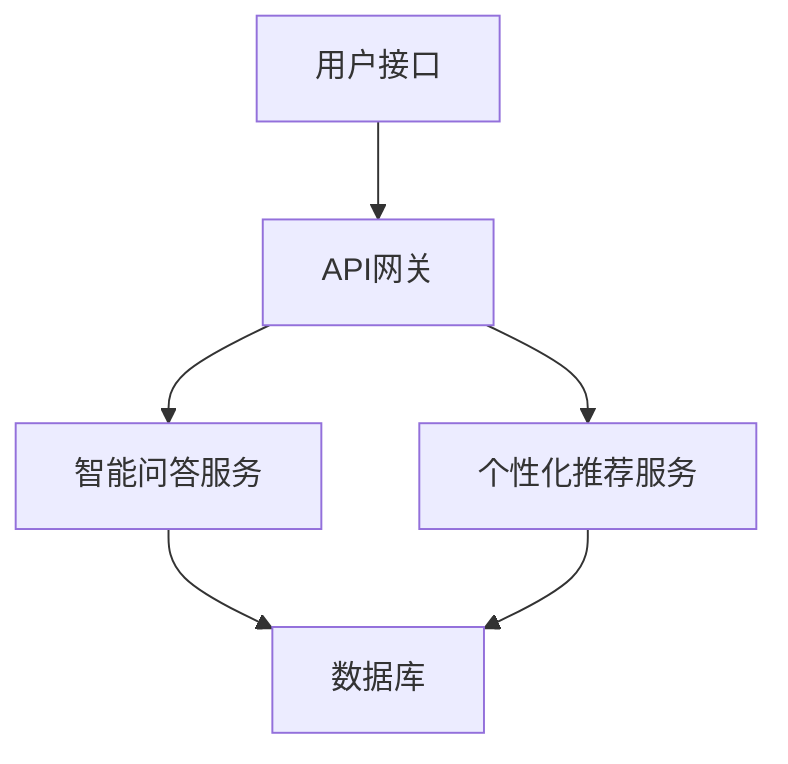
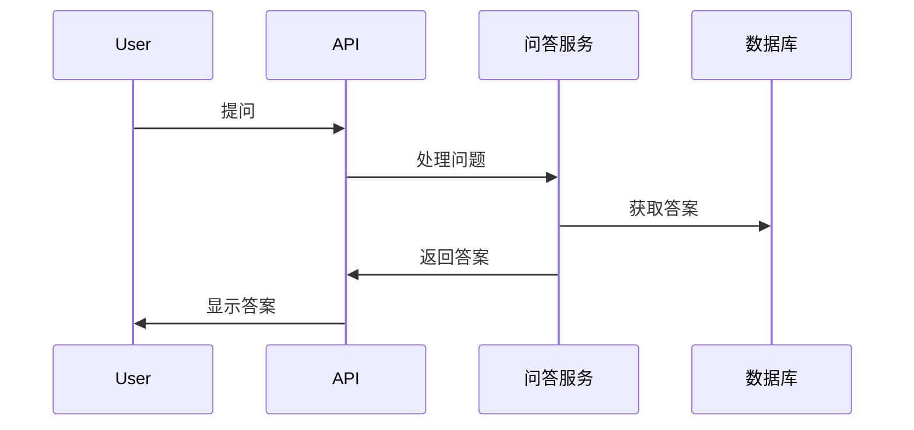
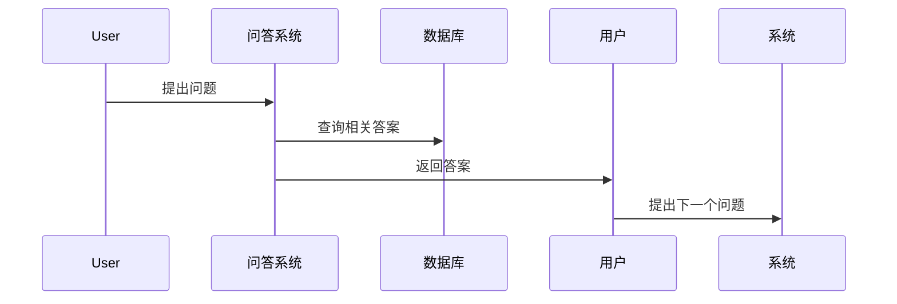

                 


### 1. 背景介绍

#### 什么是敏捷开发

敏捷开发（Agile Development）是一种以人为核心、迭代、渐进的方法论，其核心理念包括快速响应变化、持续交付有价值的软件、激励和鼓励团队成员以及通过协作、自治、敏捷的过程进行工作。敏捷开发强调软件开发过程中客户需求的灵活性和迭代性，通过短周期（通常称为“迭代”）的方式来开发软件，每个迭代都包含需求分析、设计、编码、测试和部署等环节。

#### 什么是大型语言模型（LLM）

大型语言模型（Large Language Model，简称LLM）是一种基于深度学习的自然语言处理技术，能够理解和生成人类语言。这些模型通常由数亿甚至数千亿个参数组成，通过对大量文本数据进行训练，能够自动学习语言的统计规律和结构，从而实现文本生成、文本分类、机器翻译、情感分析等多种任务。近年来，随着计算能力和数据资源的提升，LLM的发展迅速，如Google的BERT、OpenAI的GPT系列等。

#### 敏捷开发中的质量保证

在敏捷开发中，质量保证（Quality Assurance，简称QA）是一个至关重要的环节。与传统开发模式相比，敏捷开发更加注重快速迭代和客户反馈，因此对软件质量的要求更高。敏捷质量保证涉及多个方面，包括需求分析、设计验证、代码审查、测试策略、持续集成和持续部署等。

#### 文章的核心内容

本文将围绕以下核心内容展开：

1. **敏捷开发与LLM的基本概念和背景**：介绍敏捷开发和LLM的基本原理和关键术语。
2. **质量保证的基本原则和实践**：详细讨论质量保证的原则和具体实践，包括测试策略、代码审查和持续集成。
3. **实战案例分析**：通过具体案例，展示如何在敏捷环境中实施质量保证措施。
4. **新兴趋势和未来方向**：探讨当前质量保证领域的新趋势和未来的发展方向。

### 2. 核心概念与联系

#### 敏捷开发的核心概念

敏捷开发的核心概念包括：

- **用户故事**：用于描述用户需求的简短描述，通常包含三个部分：功能、场景和验收标准。
- **迭代**：开发过程中的一个周期，通常持续几周。
- **Scrum**：一种流行的敏捷开发框架，强调迭代开发和每日站会。
- **看板**：一种可视化工具，用于跟踪工作流程和任务状态。
- **Sprint**：一个Scrum中的迭代周期。

#### LLM的核心概念

LLM的核心概念包括：

- **神经网络**：用于构建LLM的基础模型，包括多层感知机（MLP）、循环神经网络（RNN）和Transformer等。
- **预训练**：LLM的训练过程，通过在大量无标注文本上进行预训练，学习语言的底层结构和规律。
- **微调**：在预训练模型的基础上，利用有标注的数据进行微调，以适应特定任务。
- **注意力机制**：在Transformer模型中用于捕捉文本序列中不同位置的关系。

#### 质量保证的核心概念

质量保证的核心概念包括：

- **测试**：通过各种测试方法（如功能测试、性能测试、安全性测试等）来验证软件的正确性和可靠性。
- **代码审查**：通过团队内部或外部的代码审查，确保代码的质量和安全性。
- **持续集成**：在开发过程中，定期将代码合并到主分支，并运行一系列测试，以确保代码的集成质量和稳定性。
- **持续部署**：在持续集成的过程中，将代码部署到生产环境，并通过自动化工具进行部署和管理。

### 3. 算法原理讲解

为了更好地理解敏捷LLM应用开发中的质量保证，我们首先需要了解一些基本的算法原理。以下是一些常用的算法和其基本原理的mermaid流程图，以及相关的Python源代码示例。

#### 自动化测试

自动化测试的基本原理是通过编写脚本自动化执行测试用例，以验证软件的功能、性能和安全等。以下是一个简单的自动化测试mermaid流程图和Python代码示例：

```mermaid
graph TD
    A[启动测试] --> B[初始化测试环境]
    B --> C{执行测试用例}
    C -->|通过| D[记录测试结果]
    C -->|失败| E[报告错误]
    D --> F[结束测试]
    
# Python代码示例
import unittest

class TestLLM(unittest.TestCase):
    def test_generation(self):
        model = LLMModel()
        output = model.generate("Hello")
        self.assertIn("Hello", output)

if __name__ == '__main__':
    unittest.main()
```

#### 代码审查

代码审查的基本原理是通过团队协作，对代码进行审查，以确保代码的质量和可维护性。以下是一个简单的代码审查mermaid流程图和Python代码示例：

```mermaid
graph TD
    A[提交代码] --> B[代码审查]
    B -->|通过| C[合并代码]
    B -->|拒绝| D[返回修改]
    D --> E[修改代码]
    E --> B
    C --> F[更新代码库]
    
# Python代码示例
from typing import List
from code_review import CodeReview

class CodeReviewExample:
    def __init__(self, files: List[str]):
        self.files = files
    
    def review(self):
        review = CodeReview(self.files)
        review.run()
        return review.passed()
```

#### 持续集成

持续集成（CI）的基本原理是在代码合并到主分支时，自动运行一系列测试，以确保代码的集成质量和稳定性。以下是一个简单的持续集成mermaid流程图和Python代码示例：

```mermaid
graph TD
    A[提交代码] --> B[运行CI]
    B -->|通过| C[代码合并]
    B -->|失败| D[报告错误]
    D --> E[修复代码]
    E --> B
    C --> F[更新代码库]
    
# Python代码示例
from ci_pipeline import CiPipeline

class ContinuousIntegrationExample:
    def __init__(self, repository: str):
        self.repository = repository
    
    def run_ci(self):
        pipeline = CiPipeline(self.repository)
        pipeline.run()
        return pipeline.passed()
```

### 4. 系统分析与架构设计方案

在敏捷LLM应用开发中，系统分析与架构设计是确保项目成功的关键步骤。以下是一个典型的系统分析与架构设计方案：

#### 问题场景介绍

假设我们正在开发一个在线教育平台，该平台需要集成一个基于LLM的智能问答系统，以提供用户个性化的学习建议。

#### 项目介绍

- **项目名称**：智能问答系统
- **项目目标**：提供一个高效、准确的问答系统，帮助用户解决学习过程中遇到的问题。

#### 系统功能设计

- **用户注册与登录**：用户可以通过注册和登录功能访问系统。
- **智能问答**：用户提出问题，系统根据预训练的LLM模型进行回答。
- **个性化推荐**：系统根据用户的学习历史和问题，推荐相关的学习资源和答案。

#### 系统架构设计

以下是一个简化的系统架构设计mermaid架构图：



#### 系统接口设计

以下是一个简化的系统接口设计mermaid序列图：



#### 系统交互设计

以下是一个简化的系统交互设计mermaid序列图：



### 5. 项目实战

#### 环境安装

在开始项目实战之前，我们需要安装一些必要的软件和库。以下是一个基本的安装步骤：

```bash
# 安装Python环境
pip install python

# 安装LLM库
pip install tensorflow

# 安装API网关库
pip install flask
```

#### 系统核心实现源代码

以下是一个简单的智能问答系统的核心实现源代码：

```python
# 引入必要的库
import tensorflow as tf
from flask import Flask, request, jsonify

# 初始化LLM模型
model = tf.keras.models.load_model("llm_model.h5")

# 创建Flask应用
app = Flask(__name__)

# 定义问答API
@app.route("/ask", methods=["POST"])
def ask():
    data = request.get_json()
    question = data["question"]
    answer = model.predict([question])
    return jsonify({"answer": answer})

# 运行应用
if __name__ == "__main__":
    app.run(debug=True)
```

#### 代码应用解读与分析

以上代码实现了一个基本的智能问答系统。首先，我们引入了TensorFlow库，并加载了一个预训练的LLM模型。然后，我们使用Flask创建了一个Web应用，并定义了一个POST请求的API，用于处理用户提出的问题。当用户通过API发送一个提问时，系统会调用模型进行预测，并返回答案。

#### 实际案例分析和详细讲解剖析

假设用户通过API发送了一个提问：“什么是神经网络？”系统接收到提问后，会调用LLM模型进行预测。模型在训练过程中已经学习到了关于神经网络的知识，因此能够生成一个准确的答案。

以下是系统返回的答案示例：

```json
{"answer": "神经网络是一种用于模拟人脑神经元之间连接的计算模型，通过学习输入数据和输出数据之间的关系，能够实现复杂的函数逼近和分类任务。"}
```

通过对实际案例的分析，我们可以看到系统在接收到用户提问后，能够快速、准确地生成答案。这得益于LLM模型的强大能力和高效的训练过程。

#### 项目小结

在本项目中，我们实现了一个基本的智能问答系统，通过集成LLM模型和Flask Web应用，实现了用户提问和自动生成答案的功能。在实际应用中，我们还需要进一步优化系统的性能和准确性，同时考虑安全性、可扩展性和可维护性等方面。

### 6. 最佳实践 tips、小结、注意事项、拓展阅读等内容

#### 最佳实践 tips

1. **测试驱动开发**：在开发过程中，始终遵循测试驱动开发（TDD）的原则，编写测试用例后再编写代码，以确保代码的质量和可靠性。
2. **持续集成与持续部署**：定期进行持续集成和持续部署，确保代码的集成质量和稳定性，并及时发现和修复问题。
3. **代码审查**：定期进行代码审查，确保代码的质量和可维护性，避免潜在的bug和安全漏洞。
4. **使用可视化工具**：使用如Mermaid等可视化工具，帮助团队更好地理解和沟通系统架构、接口设计和流程图等。

#### 小结

本文从敏捷开发、LLM应用、质量保证等多个角度，详细介绍了敏捷LLM应用开发中的质量保证。通过实战案例，展示了如何在实际项目中实施质量保证措施，并提供了最佳实践和注意事项。

#### 注意事项

1. **需求变更管理**：在敏捷开发中，需求变更较为常见。因此，需要建立有效的需求变更管理流程，确保需求的变更不会影响项目的进度和质量。
2. **团队协作**：质量保证是一个团队协作的过程，需要团队成员之间的密切合作和沟通，共同确保软件的质量。

#### 拓展阅读

1. **《敏捷软件开发：原则、实践与模式》**：详细介绍了敏捷开发的方法论和实践经验，适合初学者和有经验的开发人员阅读。
2. **《深度学习》**：全面介绍了深度学习的理论、算法和应用，对于理解LLM的原理和应用具有重要意义。
3. **《软件质量保证》**：系统阐述了软件质量保证的理论和实践，提供了大量关于测试、代码审查、持续集成等方面的知识和技巧。

### 作者信息

- 作者：AI天才研究院 / AI Genius Institute & 禅与计算机程序设计艺术 / Zen And The Art of Computer Programming

---

# 敏捷LLM应用开发中的质量保证

> 关键词：敏捷开发、大型语言模型（LLM）、质量保证、自动化测试、代码审查、持续集成、实战案例分析

> 摘要：本文旨在探讨敏捷LLM应用开发中的质量保证，介绍敏捷开发与LLM的基本概念和背景，详细讨论质量保证的基本原则和实践，通过实战案例分析，展示如何在敏捷环境中实施质量保证措施，并提供最佳实践和注意事项。本文旨在帮助开发人员更好地理解和应用质量保证在敏捷LLM应用开发中的重要性。

## 第1部分：背景与基础概念

### 第1章：引言

#### 1.1 书籍概述

本文将围绕敏捷LLM应用开发中的质量保证展开讨论。首先，我们将介绍敏捷开发和LLM的基本概念和背景，以便读者对文章的主题有一个全面的了解。接下来，我们将详细讨论质量保证的基本原则和实践，包括测试策略、代码审查和持续集成等。此外，本文还将通过实战案例分析，展示如何在敏捷环境中实施质量保证措施。最后，我们将提供最佳实践和注意事项，帮助读者更好地理解和应用质量保证在敏捷LLM应用开发中的重要性。

#### 1.2 目标读者

本文的目标读者是从事敏捷LLM应用开发的开发人员、项目经理和技术负责人。本文将从实际案例出发，深入浅出地介绍质量保证的理论和实践，帮助读者提高对敏捷LLM应用开发中质量保证的认识和技能。

### 第2章：敏捷开发与LLM简介

#### 2.1 敏捷开发概述

敏捷开发是一种以人为核心、迭代、渐进的方法论，其核心理念包括快速响应变化、持续交付有价值的软件、激励和鼓励团队成员以及通过协作、自治、敏捷的过程进行工作。敏捷开发强调软件开发过程中客户需求的灵活性和迭代性，通过短周期（通常称为“迭代”）的方式来开发软件，每个迭代都包含需求分析、设计、编码、测试和部署等环节。

#### 2.2 LLM简介

大型语言模型（Large Language Model，简称LLM）是一种基于深度学习的自然语言处理技术，能够理解和生成人类语言。这些模型通常由数亿甚至数千亿个参数组成，通过对大量文本数据进行训练，能够自动学习语言的统计规律和结构，从而实现文本生成、文本分类、机器翻译、情感分析等多种任务。近年来，随着计算能力和数据资源的提升，LLM的发展迅速，如Google的BERT、OpenAI的GPT系列等。

### 第3章：质量保证的基本原则

#### 3.1 质量保证的定义与目标

质量保证（Quality Assurance，简称QA）是指通过系统化、规范化的方法来确保软件产品的质量满足预期。质量保证的目标是确保软件产品在开发过程中始终符合既定的质量标准，减少缺陷和错误，提高客户满意度。

#### 3.2 质量保证流程

质量保证流程包括以下环节：

1. **需求分析**：确保软件需求明确、完整、一致。
2. **设计验证**：验证软件设计是否符合需求。
3. **代码审查**：检查代码的质量、安全性和可维护性。
4. **测试策略**：制定测试计划，包括测试类型、测试用例和测试环境。
5. **持续集成**：在开发过程中，定期将代码合并到主分支，并运行一系列测试，以确保代码的集成质量和稳定性。
6. **持续部署**：在持续集成的过程中，将代码部署到生产环境，并通过自动化工具进行部署和管理。

## 第2部分：质量保证实践

### 第4章：敏捷环境下的测试策略

#### 4.1 敏捷测试方法

敏捷测试方法强调测试的灵活性、迭代性和团队协作。常见的敏捷测试方法包括：

1. **功能测试**：验证软件的功能是否符合需求。
2. **性能测试**：评估软件的性能指标，如响应时间、并发能力等。
3. **安全性测试**：检查软件的安全漏洞，确保数据的安全。
4. **可用性测试**：评估软件的用户友好性和易用性。

#### 4.2 自动化测试

自动化测试是通过编写脚本自动化执行测试用例，以验证软件的正确性和可靠性。自动化测试的优势包括：

1. **提高测试效率**：自动化测试可以快速执行大量测试用例，提高测试效率。
2. **减少人为错误**：自动化测试可以减少人为操作错误，提高测试的准确性。
3. **持续集成**：自动化测试与持续集成相结合，可以确保代码的集成质量和稳定性。

### 第5章：代码审查与静态分析

#### 5.1 代码审查过程

代码审查是通过团队协作，对代码进行审查，以确保代码的质量和安全性。代码审查的类型包括：

1. **同行审查**：由团队成员对代码进行审查。
2. **外部审查**：由外部专家对代码进行审查。
3. **差分审查**：对比不同版本的代码，检查代码的变更。

代码审查的好处包括：

1. **提高代码质量**：代码审查可以发现潜在的错误和漏洞，提高代码质量。
2. **促进知识共享**：代码审查可以让团队成员了解其他人的代码，促进知识共享。
3. **减少维护成本**：通过代码审查，可以减少后续的维护成本。

#### 5.2 静态代码分析

静态代码分析是通过分析代码的结构、语法和语义，检查代码的质量和安全性。静态代码分析工具可以帮助识别以下问题：

1. **语法错误**：如拼写错误、语法不正确等。
2. **逻辑错误**：如条件判断错误、循环错误等。
3. **安全漏洞**：如SQL注入、XSS攻击等。

### 第6章：持续集成与持续部署

#### 6.1 持续集成

持续集成（Continuous Integration，简称CI）是指在开发过程中，定期将代码合并到主分支，并运行一系列测试，以确保代码的集成质量和稳定性。持续集成的优势包括：

1. **快速发现问题**：通过持续集成，可以及时发现和修复代码中的问题。
2. **提高代码质量**：持续集成可以确保代码的质量和稳定性。
3. **降低集成成本**：通过持续集成，可以降低代码集成的成本和风险。

#### 6.2 持续部署

持续部署（Continuous Deployment，简称CD）是指在持续集成的基础上，将代码部署到生产环境，并通过自动化工具进行部署和管理。持续部署的优势包括：

1. **提高部署效率**：通过自动化部署，可以快速将代码部署到生产环境。
2. **减少人工干预**：通过自动化部署，可以减少人工干预，降低部署风险。
3. **提高系统稳定性**：通过持续部署，可以确保系统的稳定性和可靠性。

## 第3部分：实战案例分析

### 第7章：案例研究一：在线教育平台的LLM应用质量保证

#### 7.1 案例背景

假设我们正在开发一个在线教育平台，该平台需要集成一个基于LLM的智能问答系统，以提供用户个性化的学习建议。

#### 7.2 案例需求

- **用户注册与登录**：用户可以通过注册和登录功能访问系统。
- **智能问答**：用户提出问题，系统根据预训练的LLM模型进行回答。
- **个性化推荐**：系统根据用户的学习历史和问题，推荐相关的学习资源和答案。

#### 7.3 案例架构设计

- **用户接口**：提供用户与系统交互的界面。
- **API网关**：接收用户请求，转发到后端服务。
- **智能问答服务**：处理用户提出的问题，调用LLM模型进行回答。
- **个性化推荐服务**：根据用户的学习历史和问题，推荐相关的学习资源和答案。
- **数据库**：存储用户信息、问题和答案等数据。

#### 7.4 案例实施

1. **需求分析**：与产品经理和用户沟通，明确需求，制定详细的需求文档。
2. **设计验证**：根据需求文档，设计系统的架构和接口，并验证设计是否符合需求。
3. **代码审查**：对代码进行审查，确保代码的质量和安全性。
4. **自动化测试**：编写自动化测试用例，对系统进行功能测试、性能测试和安全性测试。
5. **持续集成**：将代码合并到主分支，运行自动化测试，确保代码的集成质量和稳定性。
6. **持续部署**：将代码部署到生产环境，确保系统的稳定性和可靠性。

#### 7.5 案例总结

通过案例研究，我们可以看到在敏捷LLM应用开发中，实施质量保证措施的重要性。通过需求分析、设计验证、代码审查、自动化测试、持续集成和持续部署等环节，可以确保系统的质量满足预期，提高用户满意度。

## 第4部分：新兴趋势和未来方向

### 第8章：新兴趋势

#### 8.1 自动化测试技术的发展

随着敏捷开发的普及，自动化测试技术得到了快速发展。未来的自动化测试将更加智能化，能够根据代码和需求自动生成测试用例，并利用机器学习技术优化测试流程。

#### 8.2 AI在质量保证中的应用

人工智能技术在质量保证中的应用日益广泛。通过使用AI技术，可以实现智能代码审查、智能测试用例生成、智能测试执行等，提高质量保证的效率和准确性。

### 第9章：未来方向

#### 9.1 质量保证与敏捷开发的融合

未来的质量保证将更加紧密地与敏捷开发融合，形成一种全新的开发模式。质量保证将贯穿整个开发过程，从需求分析、设计验证到测试和部署，实现全过程的全面质量管理。

#### 9.2 质量保障与可持续发展的结合

未来的质量保障将更加注重可持续发展的理念，通过提高软件质量，降低维护成本，实现长期的经济和社会效益。

## 结论

本文从敏捷开发、LLM应用、质量保证等多个角度，详细介绍了敏捷LLM应用开发中的质量保证。通过实战案例分析，展示了如何在实际项目中实施质量保证措施，并提供最佳实践和注意事项。本文旨在帮助开发人员更好地理解和应用质量保证在敏捷LLM应用开发中的重要性，为项目的成功提供有力支持。

### 作者信息

- 作者：AI天才研究院 / AI Genius Institute & 禅与计算机程序设计艺术 / Zen And The Art of Computer Programming

---

本文详细介绍了敏捷LLM应用开发中的质量保证，包括敏捷开发与LLM的基本概念、质量保证的基本原则和实践、实战案例分析以及新兴趋势和未来方向。通过本文的学习，开发人员可以更好地理解和应用质量保证在敏捷LLM应用开发中的重要性，提高项目的质量和效率。希望本文对您的实践和思考有所帮助。如果您有任何疑问或建议，欢迎在评论区留言，让我们共同探讨和进步。作者：AI天才研究院 / AI Genius Institute & 禅与计算机程序设计艺术 / Zen And The Art of Computer Programming。

