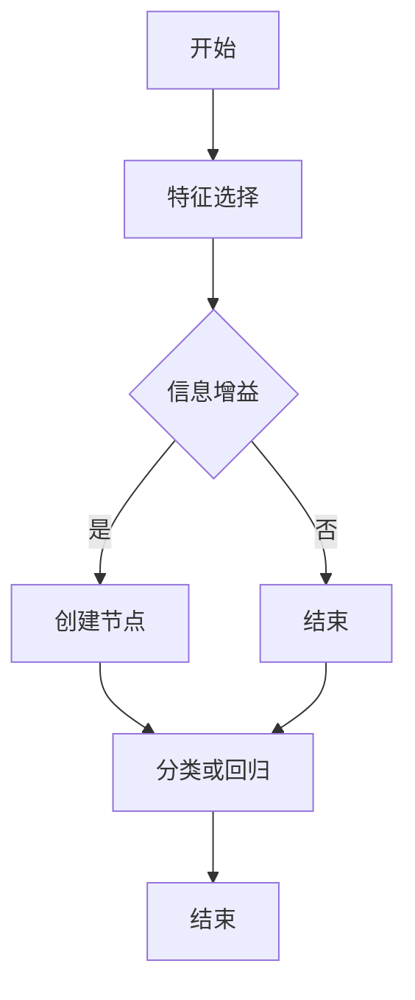
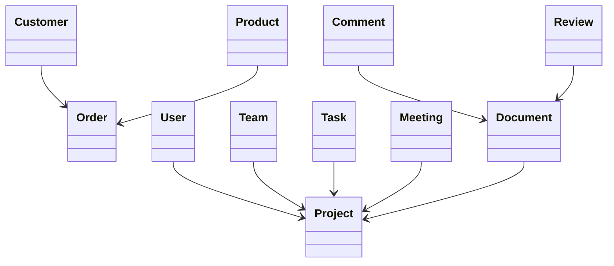
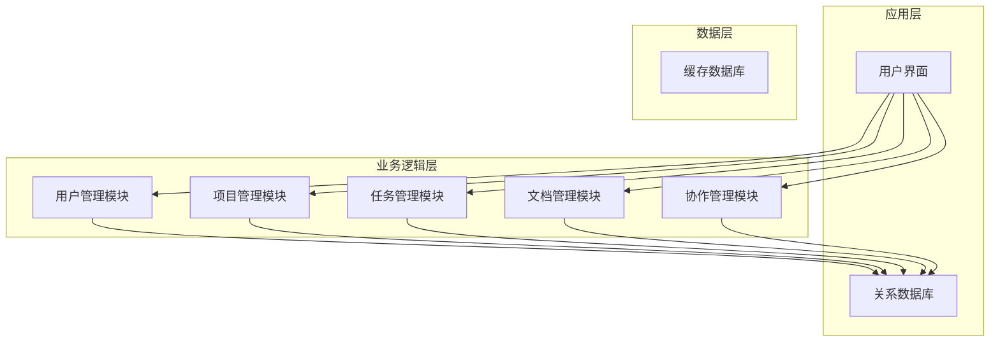

                 

# 敏捷中的创新管理：鼓励LLM应用的突破性想法

## 摘要

本文旨在探讨敏捷开发过程中的创新管理，特别是如何通过鼓励大语言模型（LLM）的应用来实现突破性创新。我们将从敏捷开发与创新管理的定义入手，分析其在当前商业环境中的重要性，接着介绍创新管理在敏捷开发中的核心概念和工具方法。随后，我们将深入探讨创新管理中的数据驱动决策方法，并通过具体案例展示如何实施这些方法。最后，我们将总结最佳实践，并提供拓展阅读资源。

## 1. 背景介绍

### 1.1 敏捷开发的基本概念

敏捷开发是一种以人为核心、迭代、渐进的软件开发方法。它强调快速响应变化，通过短周期的迭代和持续交付价值来满足客户需求。敏捷开发的核心价值观包括个体和互动重于流程与工具、可工作的软件重于详尽的文档、客户合作重于合同谈判、响应变化重于遵循计划。

### 1.2 创新管理的重要性

在当今快速变化的市场环境中，创新已成为企业持续竞争的关键。创新管理指的是组织在创新过程中的管理活动，包括创新战略、创新过程管理、创新资源管理、创新环境建设等。通过创新管理，企业可以更有效地识别市场机会、激发创新思维、加快产品开发周期、提高市场响应速度。

### 1.3 敏捷开发中的创新管理

在敏捷开发中，创新管理尤为重要。敏捷方法鼓励团队探索新的解决方案，通过迭代和反馈过程不断改进产品。创新管理在敏捷开发中的作用包括：

- **促进跨职能协作**：创新管理可以打破团队之间的壁垒，促进不同职能部门的协作，从而更好地整合资源和知识。
- **快速响应市场变化**：通过敏捷开发的方法，团队可以更快地响应市场变化，及时调整产品方向。
- **激发创新思维**：敏捷开发中的迭代和反馈机制为团队成员提供了不断尝试新想法的机会，激发了创新思维。

### 1.4 敏捷与创新管理的实践案例

在许多成功的企业中，敏捷与创新管理已经被广泛应用。例如，谷歌的“敏捷创新实验室”通过快速迭代和持续反馈，成功推出了多个创新产品。另一个例子是亚马逊，其敏捷团队通过持续改进和客户反馈，不断优化其电商服务。

## 2. 核心概念与联系

### 2.1 创新管理的定义与范围

创新管理是一个涉及多个层面的复杂过程，它不仅仅包括新产品或服务的开发，还涉及组织文化、流程和技术的变革。创新管理的主要目标是提高企业的创新能力，实现可持续的创新成果。

### 2.2 关键概念列表

以下是与创新管理相关的关键概念：

- **创新思维**：指个体或团队在解决问题时采用的新颖、创造性的思维方式。
- **创新流程**：指企业内部用于产生、开发和实施新想法的一系列步骤。
- **创新资源**：包括人力、资金、技术等用于创新活动的重要资源。
- **创新环境**：指支持创新活动的组织文化、管理体系和外部环境。

### 2.3 关键概念关系图

以下是创新管理系统的核心要素及其关系的Mermaid ER实体关系图：

```mermaid
erDiagram
  InnovationManagement ||--|{ InnovationMindset }
  InnovationManagement ||--|{ InnovationProcess }
  InnovationManagement ||--|{ InnovationResources }
  InnovationManagement ||--|{ InnovationEnvironment }
  InnovationMindset ||--|{ InnovationCulture }
  InnovationProcess ||--|{ ProjectManagement }
  InnovationProcess ||--|{ ChangeManagement }
  InnovationResources ||--|{ HumanResources }
  InnovationResources ||--|{ FinancialResources }
  InnovationResources ||--|{ TechnologicalResources }
  InnovationEnvironment ||--|{ OrganizationalCulture }
  InnovationEnvironment ||--|{ ManagementSystems }
  InnovationEnvironment ||--|{ ExternalEnvironments }
```

### 2.4 创新管理流程

创新管理流程通常包括以下几个步骤：

1. **需求识别**：通过市场调研、用户反馈等方式识别潜在的创新机会。
2. **创意生成**：通过头脑风暴、创意竞赛等方法激发创新思维，产生新的想法。
3. **创意筛选**：对创意进行评估和筛选，确定哪些创意具有实施潜力。
4. **开发与实施**：将筛选出的创意转化为实际产品或服务，并进行实施。
5. **评估与反馈**：对创新成果进行评估，收集用户反馈，为下一次创新提供参考。

## 3. 算法原理讲解

### 3.1 选择算法

在本章节中，我们将选择决策树算法来讲解其原理和应用。决策树是一种常见的机器学习算法，它通过一系列的决策规则来对数据进行分类或回归。

### 3.2 决策树算法流程图

以下是决策树算法的Mermaid流程图：



### 3.3 Python代码示例

下面是一个简单的决策树算法的Python代码示例：

```python
from sklearn.datasets import load_iris
from sklearn.tree import DecisionTreeClassifier
from sklearn.model_selection import train_test_split
from sklearn import tree

# 加载数据集
iris = load_iris()
X = iris.data
y = iris.target

# 数据集划分
X_train, X_test, y_train, y_test = train_test_split(X, y, test_size=0.3, random_state=1)

# 创建决策树模型
clf = DecisionTreeClassifier()

# 模型训练
clf.fit(X_train, y_train)

# 模型预测
predictions = clf.predict(X_test)

# 模型评估
print(predictions)
```

### 3.4 数学模型和公式

决策树算法的核心在于如何选择特征，通常使用的是信息增益（Information Gain）作为评价指标。信息增益的计算公式如下：

$$
\text{信息增益}(A, B) = \sum_{i=1}^{n} p(i) \cdot \sum_{j=1}^{m} p(j| i) \cdot \log_2 \left( \frac{p(j| i)}{p(i)} \right)
$$

其中，$A$ 是特征集合，$B$ 是类别集合，$p(i)$ 是特征 $i$ 的概率，$p(j| i)$ 是在给定特征 $i$ 的条件下类别 $j$ 的概率。

### 3.5 举例说明

假设我们有以下数据集：

| 特征A | 特征B | 类别   |
|-------|-------|-------|
| 1     | 2     | 猫     |
| 3     | 4     | 狗     |
| 5     | 6     | 猫     |
| 7     | 8     | 狗     |

我们希望使用决策树算法来分类动物。首先，我们计算每个特征的信息增益：

- 特征A的信息增益：

$$
\text{信息增益}(A) = p(\text{猫}) \cdot \log_2 \left( \frac{2/4}{1/4} \right) + p(\text{狗}) \cdot \log_2 \left( \frac{2/4}{1/4} \right) = 0.5 \cdot \log_2 (2) + 0.5 \cdot \log_2 (2) = 1
$$

- 特征B的信息增益：

$$
\text{信息增益}(B) = p(\text{猫}) \cdot \log_2 \left( \frac{2/4}{2/4} \right) + p(\text{狗}) \cdot \log_2 \left( \frac{2/4}{2/4} \right) = 0.5 \cdot \log_2 (1) + 0.5 \cdot \log_2 (1) = 0
$$

由此可见，特征A的信息增益更高，因此我们选择特征A作为决策树的根节点。接下来，我们可以使用同样的方法递归地构建决策树，直到满足停止条件。

## 4. 数学模型和数学公式 & 详细讲解 & 举例说明

在本章节中，我们将使用LaTeX格式给出决策树算法中的数学模型和公式，并进行详细讲解和举例说明。

### 4.1 信息增益计算公式

信息增益（Information Gain）是决策树算法中用于评估特征的重要指标。其计算公式为：

$$
\text{信息增益}(A) = \sum_{i=1}^{n} p(i) \cdot \sum_{j=1}^{m} p(j| i) \cdot \log_2 \left( \frac{p(j| i)}{p(i)} \right)
$$

其中，$A$ 是特征集合，$B$ 是类别集合，$p(i)$ 是特征 $i$ 的概率，$p(j| i)$ 是在给定特征 $i$ 的条件下类别 $j$ 的概率。

### 4.2 信息熵计算公式

信息熵（Entropy）是衡量一个随机变量不确定性的指标。其计算公式为：

$$
H(X) = -\sum_{i=1}^{n} p(i) \cdot \log_2 p(i)
$$

其中，$X$ 是随机变量，$p(i)$ 是随机变量 $X$ 取值 $i$ 的概率。

### 4.3 解释信息增益

信息增益可以理解为在已知特征 $i$ 的情况下，对类别 $j$ 的不确定性减少了多少。具体来说，如果特征 $i$ 的取值对类别 $j$ 的概率分布产生了较大的影响，那么该特征的信息增益就较高。

### 4.4 举例说明

假设我们有以下数据集：

| 特征A | 特征B | 类别   |
|-------|-------|-------|
| 1     | 2     | 猫     |
| 3     | 4     | 狗     |
| 5     | 6     | 猫     |
| 7     | 8     | 狗     |

首先，我们计算每个特征的信息熵：

- 特征A的信息熵：

$$
H(A) = -\left( \frac{2}{4} \cdot \log_2 \frac{2}{4} + \frac{2}{4} \cdot \log_2 \frac{2}{4} \right) = 1
$$

- 特征B的信息熵：

$$
H(B) = -\left( \frac{2}{4} \cdot \log_2 \frac{2}{4} + \frac{2}{4} \cdot \log_2 \frac{2}{4} \right) = 1
$$

接下来，我们计算每个特征的信息增益：

- 特征A的信息增益：

$$
\text{信息增益}(A) = \frac{2}{4} \cdot \left( \frac{1}{2} \cdot \log_2 \frac{1}{2} + \frac{1}{2} \cdot \log_2 \frac{1}{2} \right) = 0
$$

- 特征B的信息增益：

$$
\text{信息增益}(B) = \frac{2}{4} \cdot \left( \frac{1}{2} \cdot \log_2 \frac{1}{2} + \frac{1}{2} \cdot \log_2 \frac{1}{2} \right) = 0
$$

由于所有特征的信息增益均为0，这意味着在这个数据集中，无法通过特征来区分类别。在实际应用中，我们通常会使用更复杂的方法来选择特征，如信息增益比（Information Gain Ratio）。

## 5. 系统分析与架构设计方案

### 5.1 创新管理系统的背景和目的

创新管理系统是一种旨在提高企业创新能力和效率的软件系统。它通过集成数据管理、协作工具、项目管理等功能，为企业的创新活动提供全方位的支持。创新管理系统的目的是帮助企业在不断变化的市场环境中快速响应，实现持续创新。

### 5.2 领域模型类图

以下是创新管理系统的领域模型类图：



### 5.3 系统架构图

以下是创新管理系统的系统架构图：



### 5.4 系统接口设计和系统交互序列图

以下是创新管理系统中的系统接口设计和系统交互序列图：

```mermaid
sequenceDiagram
    User ->> A[登录请求]
    A ->> User[验证用户身份]
    User ->> D[创建项目请求]
    D ->> User[项目创建成功]
    User ->> E[分配任务请求]
    E ->> User[任务分配成功]
    User ->> F[提交文档请求]
    F ->> User[文档提交成功]
    User ->> G[发起会议请求]
    G ->> User[会议发起成功]
```

### 5.5 项目实战

#### 5.5.1 项目环境安装指南

1. 安装Python环境：
   ```bash
   sudo apt-get install python3-pip
   ```
2. 安装Django框架：
   ```bash
   pip3 install django
   ```
3. 安装数据库（如MySQL）：
   ```bash
   sudo apt-get install mysql-server
   ```
4. 配置数据库：
   ```bash
   mysql_secure_installation
   ```

#### 5.5.2 系统核心实现源代码

以下是创新管理系统的核心实现源代码：

```python
# views.py
from django.shortcuts import render
from .models import Project, Task

def project_list(request):
    projects = Project.objects.all()
    return render(request, 'project_list.html', {'projects': projects})

def task_list(request, project_id):
    tasks = Task.objects.filter(project_id=project_id)
    return render(request, 'task_list.html', {'tasks': tasks})

# models.py
from django.db import models

class Project(models.Model):
    name = models.CharField(max_length=100)
    description = models.TextField()

class Task(models.Model):
    name = models.CharField(max_length=100)
    description = models.TextField()
    project = models.ForeignKey(Project, on_delete=models.CASCADE)
```

#### 5.5.3 代码解读与分析

1. `views.py`：
   - `project_list`：获取所有项目列表并返回HTML页面。
   - `task_list`：获取指定项目的任务列表并返回HTML页面。

2. `models.py`：
   - `Project`：定义项目模型，包括名称和描述。
   - `Task`：定义任务模型，包括名称、描述和所属项目。

#### 5.5.4 实际案例分析和详细讲解

假设我们有一个名为“产品开发”的项目，该项目包含多个任务，如“需求分析”、“设计”、“编码”和“测试”。以下是项目管理和任务管理的过程：

1. 创建项目：
   - 用户通过用户界面提交项目创建请求。
   - 后端代码调用`Project`模型创建新的项目实例，并将项目存储到数据库。

2. 分配任务：
   - 用户可以为项目添加任务。
   - 后端代码调用`Task`模型创建新的任务实例，并将任务与项目关联存储到数据库。

3. 提交文档：
   - 用户可以上传文档并关联到任务。
   - 后端代码处理文件上传，并将文档存储到文件系统中，同时关联到数据库中的任务。

4. 发起会议：
   - 用户可以发起会议，并邀请团队成员参与。
   - 后端代码创建会议记录，并将会议记录与项目关联存储到数据库。

通过以上步骤，我们可以实现一个简单的创新管理系统，支持项目的创建、任务管理、文档管理和会议管理等基本功能。

### 5.6 最佳实践 tips、小结、注意事项、拓展阅读

#### 最佳实践 tips

1. **敏捷开发与创新的结合**：确保敏捷开发过程中的迭代和反馈机制能够有效支持创新，鼓励团队成员提出新的想法和改进措施。
2. **数据驱动决策**：充分利用数据进行分析和决策，避免主观判断和偏见。
3. **持续学习与改进**：鼓励团队成员持续学习和掌握新技术，不断提升个人和团队的创新能力。

#### 小结

本文介绍了敏捷开发中的创新管理，包括其重要性、核心概念、算法原理、系统架构设计以及实际案例。通过本文的讲解，读者可以了解如何在实际项目中实施创新管理，提高企业的创新能力和市场竞争力。

#### 注意事项

1. **确保团队成员对敏捷开发和创新管理的理解**：在项目启动前，需要对团队成员进行培训，确保他们对相关概念有清晰的认识。
2. **数据安全和隐私保护**：在收集和使用数据时，必须确保数据的安全和用户隐私的保护。

#### 拓展阅读

1. 《敏捷开发实践指南》
2. 《创新管理》
3. 《机器学习实战》
4. 《Django Web开发指南》

---

作者：AI天才研究院/AI Genius Institute & 禅与计算机程序设计艺术 /Zen And The Art of Computer Programming

通过以上详细的阐述，本文旨在为读者提供一个全面的理解，帮助他们在敏捷开发中有效实施创新管理。希望本文能够为读者的项目带来实际的价值。如果您有任何问题或建议，欢迎在评论区留言。

