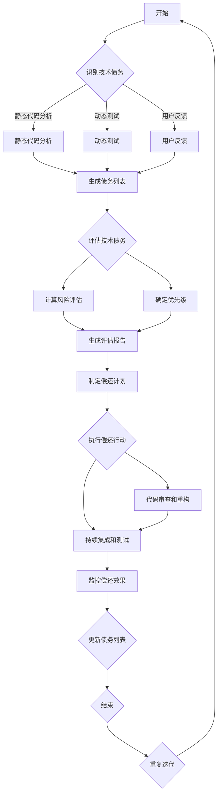

                 


### 1.1.1 问题背景

在当今快速变化的技术环境中，敏捷开发已经成为软件工程实践的主流方法。敏捷开发强调迭代、增量和灵活响应变化，旨在提高软件开发的效率和质量。然而，随着敏捷实践的普及，技术债务问题日益凸显，尤其是在大规模语言模型（LLM）应用的开发和维护过程中。

#### 技术债务的定义及其在敏捷开发中的影响

技术债务，通常被比喻为“软件开发的利息”，是指为了实现短期目标而采取的妥协性设计或代码决策。这些决策可能在短期内提高开发速度，但长期来看会导致维护成本增加、系统复杂性上升、性能下降等负面影响。

在敏捷开发中，技术债务的产生往往源于以下几个方面：

- **快速迭代和交付压力**：敏捷开发强调频繁的迭代和快速交付，这可能导致开发团队为了满足时间节点而牺牲了代码质量和设计优化。
- **资源限制**：敏捷团队可能面临人力、时间和预算的限制，这迫使他们在某些情况下做出次优的决策。
- **优先级冲突**：敏捷开发中的任务优先级可能会随着市场变化和用户反馈而不断调整，这可能导致原有设计的不一致和重复性工作。

#### 技术债务与LLM应用长期健康的关系

对于LLM应用而言，技术债务的影响尤为显著。LLM应用通常具有以下特点：

- **高度复杂性**：LLM应用涉及大规模的模型训练和优化，需要复杂的算法和数据处理能力。
- **持续更新和迭代**：LLM应用需要不断更新模型和数据集，以适应不断变化的语言模式和用户需求。
- **依赖性高**：LLM应用往往依赖于底层的基础设施和技术栈，这些组件的稳定性直接影响到应用的表现和可靠性。

技术债务在LLM应用开发中的累积可能导致以下问题：

- **性能下降**：随着技术债务的增加，LLM应用的性能可能逐渐下降，这会导致用户体验恶化。
- **维护成本上升**：债务积累意味着未来的修复和维护成本将增加，影响整体项目的经济性。
- **开发效率降低**：技术债务会带来额外的开发负担，降低团队的效率和创新能力。

因此，如何在敏捷开发中有效地管理技术债务，确保LLM应用的长期健康，成为当前软件工程领域的一个关键问题。接下来的章节将深入探讨这一问题的各个方面，并提供实用的解决方案。

### 1.1.2 问题描述

技术债务的累积是一个逐步的过程，它往往在敏捷开发的快速迭代中悄无声息地发生。要解决这一问题，我们需要首先明确技术债务的几种主要表现形式和其带来的直接影响。

#### 技术债务的主要表现形式

1. **代码复杂性增加**：随着迭代次数的增加，代码库中的复杂性可能逐渐上升。新的功能和需求不断被添加，而旧的功能没有得到充分的测试和重构，导致代码库中的类和模块变得越来越难以理解和维护。

2. **技术债务文档丢失**：敏捷开发强调迭代和灵活性，但这也可能导致文档的缺失。开发者往往忙于完成当前的任务，而忽略了编写和维护技术债务文档，导致后期维护人员难以了解系统的历史和技术背景。

3. **依赖关系混乱**：技术债务还可能表现为项目中的依赖关系混乱。例如，为了快速实现某一功能，开发者可能会引入第三方库，但这些库可能不兼容或已经过时，导致项目后续维护时出现兼容性问题。

4. **性能下降**：随着技术债务的增加，系统的性能可能会逐渐下降。这是因为一些关键的性能优化措施被推迟，而新的需求不断地增加系统的负担，导致系统响应时间延长、资源消耗增加。

#### 技术债务的直接影响和潜在风险

1. **维护成本增加**：技术债务会导致维护成本的增加。随着代码复杂性和依赖关系的增加，修复漏洞和实现新功能所需的开发时间和人力成本都会上升。

2. **开发效率降低**：技术债务会增加开发团队的工作负担，降低整体开发效率。团队成员可能会花费大量时间在理解现有代码和解决技术债务上，而无法专注于新功能的开发。

3. **系统稳定性下降**：技术债务累积可能导致系统稳定性下降。由于代码质量低下和依赖关系混乱，系统可能会频繁出现错误和崩溃，影响用户体验。

4. **项目延期和质量下降**：技术债务可能导致项目延期和质量下降。修复债务所需的额外时间和资源可能会影响原本的进度安排，导致项目延期。同时，由于时间和资源的限制，团队可能无法对系统进行充分的测试和优化，影响最终的质量。

#### 潜在风险

1. **技术债务恶性循环**：技术债务如果不及时偿还，可能会形成恶性循环。随着债务的增加，修复成本越来越高，团队可能会选择继续积累债务，导致系统状况不断恶化。

2. **失去市场竞争力**：技术债务累积可能导致系统性能下降，用户体验恶化，从而失去市场竞争力。在竞争激烈的市场环境中，这一点尤为重要。

3. **人才流失**：技术债务会增加开发团队的负担，可能导致团队士气下降，甚至人才流失。这对于团队的稳定和发展是非常不利的。

因此，识别和解决技术债务问题对于确保LLM应用的长期健康至关重要。在接下来的章节中，我们将探讨如何在敏捷开发过程中有效地管理技术债务，以及如何通过具体策略和最佳实践来维护LLM应用的长期健康。

### 1.1.3 问题解决

解决敏捷开发中的技术债务问题是一个系统工程，需要综合运用多种策略和方法。以下是一些关键步骤和策略：

#### 1. 审视与评估

**步骤1**：首先，需要对现有技术债务进行全面审计和评估。这包括分析代码复杂性、文档完整性、依赖关系和性能指标等。通过工具和代码分析，可以量化技术债务的规模和影响。

**工具与资源**：可以使用SonarQube、Code Climate等代码质量分析工具来检测代码质量指标。同时，Git历史记录和变更日志可以帮助了解代码演变和债务累积的过程。

#### 2. 优先级排序

**步骤2**：在评估完成后，需要根据债务的影响和紧急程度对债务进行排序。通常，高风险、高影响的债务应优先偿还。这可以帮助团队集中资源解决最紧迫的问题。

**策略**：可以制定一个技术债务清单，并根据风险、影响和修复成本进行排序。利用优先级矩阵（如 Eisenhower 方框）可以帮助团队明确哪些债务需要优先处理。

#### 3. 制定偿还计划

**步骤3**：制定一个详细的偿还计划，包括具体的偿还步骤、时间表和资源分配。这需要团队共同参与，确保计划的可行性和全面性。

**方法**：可以采用增量式偿还方法，即每次迭代选择一小部分债务进行修复。这样可以确保债务偿还与项目进度相协调，不会影响关键功能的交付。

#### 4. 实施和监控

**步骤4**：在制定偿还计划后，实施具体的偿还行动，并持续监控债务偿还的效果。

**实践**：在每次迭代开始时，确保债务偿还是任务的一部分。通过每日站会和迭代回顾会议，团队可以跟踪债务的偿还进度，及时调整策略。

#### 5. 持续优化和反馈

**步骤5**：技术债务的偿还是一个持续的过程。在每次迭代结束后，需要总结经验教训，不断优化偿还策略，并建立反馈机制。

**方法**：可以采用自动化测试和持续集成（CI/CD）流程来确保代码质量。同时，定期进行技术债务审计，确保债务水平维持在可接受范围内。

#### 6. 培训和教育

**步骤6**：对团队成员进行技术和敏捷方法的培训，提高他们对技术债务的认识和管理能力。这有助于形成全员参与、共同管理的良好氛围。

**资源**：可以通过内部分享会、技术讲座和在线课程等形式，帮助团队成员掌握相关知识和技能。

通过上述步骤和策略，敏捷团队可以有效地管理技术债务，确保LLM应用的长期健康。这不仅有助于提升开发效率和质量，还能为项目的成功奠定坚实基础。

### 1.1.4 边界条件

在讨论技术债务的偿还过程中，必须考虑一些边界条件和限制因素。这些边界条件直接影响到偿还策略的实施和效果。

#### 1. 时间限制

敏捷开发强调快速迭代和灵活响应，但在偿还技术债务时，时间限制是一个不可忽视的因素。如果时间限制过于严格，团队可能无法在每次迭代中全面偿还技术债务，甚至可能无法及时识别和修复债务。因此，在制定偿还计划时，需要合理评估时间限制，确保偿还行动与项目进度协调。

**策略**：采用增量式偿还方法，每次迭代选择一小部分债务进行修复，确保债务偿还与项目交付目标相平衡。

#### 2. 资源限制

敏捷团队通常面临人力资源和预算的限制。资源限制可能导致团队在偿还技术债务时无法投入足够的资源和时间。在这种情况下，团队需要优先处理高风险、高影响的债务，并寻求外部帮助。

**方法**：通过内部资源调配和外部合作，如邀请专家顾问或外包部分工作，以缓解资源限制带来的影响。

#### 3. 技术栈兼容性

LLM应用可能依赖于多种技术栈和第三方库。在偿还技术债务时，需要确保这些技术栈的兼容性，避免因库的不兼容性而导致债务偿还失败。

**实践**：定期评估和更新依赖库，确保其版本和兼容性。可以使用依赖管理工具，如Maven或Gradle，来自动管理依赖关系。

#### 4. 文档和知识传递

敏捷开发中，团队成员的流动性和快速迭代可能导致技术债务文档的缺失或不足。知识传递的不足会影响到债务偿还的效率和质量。

**策略**：建立完善的文档系统，确保技术债务相关的文档得到及时更新和维护。通过代码注释和内部培训，提高团队成员对技术债务的理解和管理能力。

#### 5. 质量保证

在技术债务偿还过程中，质量保证是关键。如果债务修复不彻底，可能导致新的技术债务产生，甚至影响系统的稳定性。

**方法**：采用自动化测试和持续集成（CI/CD）流程，确保每次迭代后的代码质量和功能完整性。建立质量保证团队，对债务偿还过程进行监控和审查。

#### 6. 领导和管理支持

技术债务的偿还需要得到领导和管理层的支持。没有足够的支持和资源，团队很难有效地管理技术债务。

**实践**：与领导和管理层进行沟通，明确技术债务管理的目标和重要性。争取管理层对偿还计划的认可和资源支持，确保团队在偿还债务时得到必要的支持。

通过考虑和应对这些边界条件和限制因素，敏捷团队可以更有效地管理技术债务，确保LLM应用的长期健康和持续发展。

### 1.1.5 外延扩展

在深入探讨技术债务的偿还策略后，我们需要考虑技术债务偿还的其他影响因素，以及如何将这一概念扩展到更广泛的应用场景中。

#### 1. 其他影响因素

1. **团队文化**：一个重视代码质量和技术透明度的团队文化可以显著促进技术债务的偿还。团队成员之间的信任和协作是关键，这有助于形成全员参与的技术债务管理氛围。

2. **用户反馈**：用户反馈是识别技术债务的重要来源。通过分析用户反馈和报告的问题，团队可以及时发现潜在的技术债务，并采取相应的偿还措施。

3. **持续集成和部署**：良好的持续集成（CI）和持续部署（CD）实践可以确保技术债务在早期阶段被发现和修复。自动化测试和代码审查可以减少技术债务的产生，并提高债务偿还的效率。

4. **合规性要求**：在某些行业，如金融和医疗，合规性要求可能对技术债务的管理产生重大影响。团队需要确保代码和系统符合相关法规和标准，以避免潜在的法律和财务风险。

#### 2. 技术债务与敏捷开发实践的结合

技术债务管理并不是一个孤立的任务，它需要与敏捷开发的其他实践相结合，以达到最佳效果。

1. **迭代规划**：在每次迭代规划时，团队应将技术债务偿还纳入计划。通过优先级排序和增量式偿还，确保债务在每次迭代中得到关注和修复。

2. **回顾会议**：在敏捷回顾会议中，团队应讨论技术债务的管理效果和改进措施。通过回顾，团队可以总结经验，优化偿还策略。

3. **持续改进**：敏捷开发强调持续改进。团队应不断评估技术债务的管理方法，寻找更高效、更可持续的偿还策略。

4. **技术共享和培训**：通过技术共享和培训，团队可以提升整体的技术水平，减少技术债务的产生。定期的技术分享会和技术讲座可以帮助团队成员了解新的技术和方法。

#### 3. 技术债务在其他应用场景中的扩展

技术债务的概念不仅适用于软件工程，还可以扩展到其他领域，如项目管理、产品开发和运营维护等。

1. **项目管理**：在项目管理中，技术债务可以看作是项目风险的另一种表现形式。通过识别和管理技术债务，项目经理可以更全面地评估项目的风险和成本。

2. **产品开发**：在产品开发过程中，技术债务管理可以帮助团队确保产品在功能交付的同时，保持技术质量。通过定期评估和偿还技术债务，产品团队可以延长产品的生命周期，提高用户满意度。

3. **运营维护**：在系统运营和维护过程中，技术债务管理同样重要。随着系统的使用和更新，技术债务可能会积累并影响系统的稳定性和性能。通过有效的技术债务管理，运营团队可以确保系统长期稳定运行。

通过考虑这些外延扩展因素，我们可以更全面地理解技术债务管理的意义和方法，并将其应用到更广泛的应用场景中，以实现系统的长期健康和持续发展。

### 1.1.6 核心要素

在讨论如何维护LLM应用的长期健康时，我们需要明确几个核心要素，这些要素是确保应用稳定、高效运行的关键。

#### 1. 代码质量

代码质量是LLM应用长期健康的基础。高质量代码具有以下几个特点：

- **可读性**：代码结构清晰，逻辑简洁，便于理解和维护。
- **可维护性**：代码模块化、分层设计，易于扩展和修改。
- **可测试性**：代码单元测试覆盖率高，能够快速定位和修复问题。

为了提高代码质量，团队可以采用以下方法：

- **代码审查**：通过定期进行代码审查，确保代码遵循最佳实践和编码规范。
- **静态代码分析**：使用工具进行静态代码分析，识别潜在的代码缺陷和潜在风险。
- **持续集成**：通过持续集成（CI）工具，自动化测试代码并确保代码质量。

#### 2. 性能优化

性能优化是确保LLM应用高效运行的关键。性能优化可以从以下几个方面入手：

- **算法优化**：对LLM模型的算法进行优化，提高计算效率和精度。
- **内存管理**：合理分配和管理内存资源，避免内存泄漏和溢出。
- **并行处理**：利用并行计算技术，提高数据处理速度和吞吐量。
- **负载均衡**：通过负载均衡技术，合理分配请求，避免单点过载。

#### 3. 系统架构设计

系统架构设计直接影响到LLM应用的稳定性和扩展性。一个良好的系统架构设计应具备以下特点：

- **模块化**：系统模块化设计，各模块之间解耦，便于维护和扩展。
- **高可用性**：通过冗余设计和故障转移机制，提高系统的可用性和容错能力。
- **可扩展性**：系统能够根据需求灵活扩展，支持负载的增加和功能的扩展。
- **安全性**：系统具备完善的权限管理和安全防护措施，防止数据泄露和恶意攻击。

#### 4. 持续集成与持续部署

持续集成（CI）和持续部署（CD）是确保LLM应用稳定、高效运行的重要手段。通过CI/CD流程，团队可以实现以下目标：

- **自动化测试**：自动化执行测试用例，快速发现和修复代码缺陷。
- **代码质量监控**：持续监控代码质量，确保代码符合最佳实践和规范。
- **快速交付**：通过自动化部署，缩短交付周期，提高开发效率。
- **环境一致性**：确保不同环境（开发、测试、生产）之间的代码和环境一致性。

#### 5. 文档和维护

完善的文档和维护机制是确保LLM应用长期健康运行的重要保障。文档和维护应包括以下内容：

- **技术文档**：详细记录系统的架构设计、模块功能、接口定义等，便于开发人员理解和使用。
- **操作手册**：为用户提供详细的使用说明和操作步骤，帮助用户正确使用系统。
- **维护计划**：制定系统的维护计划，包括日常维护、故障修复和版本更新等。
- **反馈机制**：建立用户反馈机制，及时收集用户意见和建议，持续优化系统。

#### 6. 团队协作

团队协作是确保LLM应用长期健康运行的关键。团队应具备以下能力：

- **沟通与协作**：团队成员之间保持有效沟通和协作，确保工作协调一致。
- **培训与成长**：定期进行培训和知识分享，提升团队整体技术水平。
- **敏捷实践**：遵循敏捷开发原则和方法，提高开发效率和项目质量。
- **文化建设**：营造积极向上的团队文化，增强团队的凝聚力和归属感。

通过关注这些核心要素，敏捷团队可以更好地维护LLM应用的长期健康，确保系统稳定、高效运行。

### 1.1.7 背景介绍

#### 1.1.7.1 背景

在当今快速发展的技术环境中，敏捷开发已成为软件开发的主流方法。它强调快速迭代、持续交付和客户满意度，为企业带来了显著的竞争优势。然而，随着敏捷开发的广泛应用，技术债务问题逐渐凸显，尤其是在大规模语言模型（LLM）应用的开发和维护过程中。

技术债务是软件开发中不可避免的问题。为了追求快速交付和短期目标，开发者往往会在代码质量和设计优化方面做出妥协，这些妥协在短期内可能提高了开发效率，但长期来看会导致系统复杂度增加、维护成本上升等问题。LLM应用由于其高度复杂性和不断变化的需求，更容易积累技术债务。

#### 1.1.7.2 问题描述

技术债务在敏捷开发中的累积具有以下几个特点：

1. **快速迭代导致债务积累**：敏捷开发强调快速迭代和频繁交付，这可能导致开发团队为了满足时间节点而牺牲代码质量和设计优化，进而导致技术债务的积累。

2. **优先级变化引发债务风险**：敏捷开发过程中，任务优先级可能会随着市场需求和用户反馈的变化而不断调整。这种优先级的变化可能导致旧的技术债务得不到及时偿还，甚至新的债务不断产生。

3. **团队流动性和知识缺失**：敏捷团队往往具有高流动性，团队成员可能会频繁变动。技术债务的管理需要团队成员对系统有深入的了解，而团队流动性和知识缺失可能导致技术债务的积累和管理难度增加。

4. **文档不完善**：敏捷开发强调快速交付，可能导致文档的缺失或不完善。技术债务的管理需要详细的文档记录，缺乏文档会使得债务偿还变得更加困难。

#### 1.1.7.3 问题解决

解决技术债务问题需要从以下几个方面入手：

1. **建立技术债务管理机制**：制定明确的技术债务管理策略和流程，确保债务识别、评估、偿还和监控的全过程得到有效管理。

2. **优先级排序**：对技术债务进行优先级排序，确保高风险、高影响的债务优先得到偿还。

3. **团队协作**：加强团队内部协作，提高对技术债务管理的认识和参与度。通过定期培训和技术分享，提升团队整体的技术水平。

4. **文档和知识管理**：建立完善的文档系统，记录技术债务的相关信息，确保文档的完整性和及时更新。

5. **自动化和工具支持**：利用代码分析工具和自动化测试，及时发现和修复技术债务。通过持续集成和持续部署（CI/CD）流程，提高债务管理的效率。

通过上述方法，敏捷团队可以更有效地管理技术债务，确保LLM应用的长期健康和持续发展。

### 1.1.8 概念联系

为了更好地理解技术债务在敏捷开发中的应用，我们需要探讨几个核心概念之间的联系，并构建一个概念联系图，以便清晰地展示这些概念之间的关系。

#### 核心概念

1. **敏捷开发**：敏捷开发是一种软件开发方法，强调迭代、增量和灵活响应变化。其核心原则包括用户满意度、团队合作、响应变化和持续交付。
2. **技术债务**：技术债务是指在软件开发过程中，为了快速交付和短期目标而采取的妥协性决策。这些决策可能在短期内提高开发速度，但长期来看会导致系统维护成本上升、复杂性增加等问题。
3. **LLM应用**：大规模语言模型（LLM）应用是一种基于深度学习技术的自然语言处理应用，通常涉及复杂的模型训练和数据处理。

#### 概念联系

- **敏捷开发与技术债务**：敏捷开发强调快速迭代和频繁交付，这可能导致技术债务的产生。敏捷团队需要在追求敏捷性的同时，注意技术债务的管理，以避免长期负面影响。
- **技术债务与LLM应用**：LLM应用由于其高度复杂性和持续变化的需求，更容易积累技术债务。有效的技术债务管理对于确保LLM应用的长期健康至关重要。
- **敏捷开发与LLM应用**：敏捷开发原则适用于LLM应用的开发和维护。敏捷方法可以帮助团队更好地适应变化，同时通过有效的技术债务管理，确保LLM应用的稳定性和性能。

#### 概念属性特征对比表格

| 特征 | 敏捷开发 | 技术债务 | LLM应用 |
| --- | --- | --- | --- |
| 核心原则 | 迭代、增量、用户满意度 | 妥协性决策、长期影响 | 高度复杂性、持续变化 |
| 目标 | 快速交付、持续改进 | 降低短期成本、提高长期维护性 | 提高性能、适应需求变化 |
| 关联性 | 推动敏捷开发实践的落实 | 敏捷开发的副产品 | 敏捷开发的重要应用领域 |

#### ER实体关系图架构

```mermaid
erDiagram
    Agile_Development ||--|{ Technical_Debt }||--> LLM_Application
    Agile_Development ||--|{ LLM_Application }||--> Customer_Satisfaction
    Technical_Debt ||--|{ Debt_Type }||--> Debt_Assessment
    LLM_Application ||--|{ Model_Training }||--> Performance_Optimization
```

通过上述概念联系和ER实体关系图，我们可以更清晰地理解敏捷开发、技术债务和LLM应用之间的关系，为后续章节的详细讨论提供理论基础。

### 1.1.9 框架搭建

为了系统地管理技术债务并确保LLM应用的长期健康，我们需要构建一个综合性的策略框架。该框架将包括技术债务的识别、评估、偿还和管理四个关键环节，每个环节都有明确的步骤和工具支持。

#### 技术债务管理策略框架

**1. 技术债务识别**

**步骤：**
- **代码审计**：定期进行代码审计，使用静态代码分析工具识别潜在的技术债务。
- **团队反馈**：收集开发团队成员的反馈，了解他们在日常开发中遇到的问题和挑战。
- **用户反馈**：分析用户反馈和报告的问题，识别与用户体验相关的问题，这些往往与技术债务密切相关。

**工具与资源：**
- **SonarQube**：用于代码审计和静态代码分析。
- **JIRA**：用于记录和跟踪技术债务。

**2. 技术债务评估**

**步骤：**
- **优先级排序**：根据债务的影响和紧急程度对技术债务进行优先级排序。
- **风险评估**：评估技术债务可能带来的风险，包括性能下降、维护成本增加等。
- **成本分析**：分析偿还技术债务所需的资源和成本，确保资源的合理分配。

**工具与资源：**
- **Eisenhower 方框**：用于优先级排序。
- **风险分析工具**：用于评估技术债务的风险。

**3. 技术债务偿还**

**步骤：**
- **制定偿还计划**：根据评估结果，制定详细的偿还计划，包括偿还步骤、时间和资源分配。
- **实施偿还行动**：按照偿还计划执行具体的偿还行动，逐步解决技术债务问题。
- **监控进展**：通过每日站会和迭代回顾会议，监控偿还进展，确保按计划进行。

**工具与资源：**
- **甘特图**：用于制定和监控偿还计划。
- **敏捷管理工具**：如JIRA，用于跟踪偿还进度。

**4. 技术债务管理**

**步骤：**
- **持续监控**：通过自动化测试和持续集成（CI/CD）流程，持续监控技术债务的情况。
- **定期审计**：定期进行技术债务审计，确保债务水平在可接受范围内。
- **反馈与改进**：通过回顾会议和用户反馈，不断改进技术债务管理方法。

**工具与资源：**
- **自动化测试工具**：如Selenium，用于持续监控代码质量。
- **CI/CD工具**：如Jenkins，用于自动化测试和部署。

通过上述框架，敏捷团队可以系统地管理技术债务，确保LLM应用的长期健康和持续发展。

### 1.1.10 技术债务偿还策略与框架的适用性

在敏捷开发中，技术债务的偿还策略与框架的适用性直接关系到LLM应用的长期健康。为了确保这些策略和框架能够在实际应用中发挥最大作用，我们需要从以下几个方面进行深入分析和讨论。

#### 1. 敏捷开发中的技术债务特殊性

**1.1. 特性分析**

敏捷开发中的技术债务具有以下特殊性：

- **频繁迭代**：敏捷开发强调频繁迭代和快速交付，这可能导致技术债务的快速累积。每次迭代都可能引入新的债务，而旧债务可能得不到及时偿还。
- **动态需求**：敏捷开发过程中，需求可能会频繁变化，这要求开发团队在短时间内快速适应，进一步增加了技术债务管理的复杂性。
- **团队协作**：敏捷开发强调团队合作和集体决策，这要求团队成员之间具有高度的沟通和协作能力，以便共同应对技术债务带来的挑战。

**1.2. 影响分析**

技术债务对敏捷开发的直接影响包括：

- **代码质量下降**：技术债务可能导致代码质量下降，影响系统的可维护性和稳定性。
- **开发效率降低**：技术债务会增加开发团队的负担，降低开发效率，影响项目的进度和交付质量。
- **用户体验恶化**：技术债务累积可能导致系统性能下降，用户体验恶化，影响用户满意度和市场竞争力。

#### 2. 技术债务偿还策略的适用性

在敏捷开发中，技术债务偿还策略的适用性需要考虑以下几个方面：

**2.1. 增量式偿还**

- **适用性**：增量式偿还策略适用于敏捷开发环境，因为它允许团队在每次迭代中选择一小部分债务进行修复，不会影响关键功能的交付。
- **效果**：通过增量式偿还，团队可以逐步解决技术债务，避免债务的累积，确保系统的长期健康。

**2.2. 持续集成与持续部署（CI/CD）**

- **适用性**：CI/CD流程能够自动化测试和部署代码，确保每次代码变更后的质量，有助于及时发现和修复技术债务。
- **效果**：CI/CD流程可以提高代码质量，减少技术债务的产生，同时提高开发效率。

**2.3. 风险管理**

- **适用性**：在敏捷开发中，技术债务的偿还需要考虑风险管理的原则，确保偿还行动不会对项目带来额外风险。
- **效果**：通过风险管理，团队可以更合理地评估技术债务的偿还优先级，确保资源的合理分配。

#### 3. 技术债务管理框架的适用性

**3.1. 整合性**

- **适用性**：技术债务管理框架需要具备整合性，能够涵盖技术债务识别、评估、偿还和管理的全过程。
- **效果**：整合性的管理框架可以帮助团队系统性地管理技术债务，确保债务的及时偿还和系统的长期健康。

**3.2. 可定制性**

- **适用性**：不同的团队和环境可能需要不同的技术债务管理策略，框架需要具备高度的可定制性。
- **效果**：可定制性允许团队根据自身特点和需求，灵活调整管理策略，提高债务管理的有效性。

**3.3. 持续改进**

- **适用性**：技术债务管理框架需要支持持续改进，通过不断优化管理策略和方法，提高团队的技术债务管理能力。
- **效果**：持续改进可以帮助团队不断提高技术债务管理的水平，确保LLM应用的长期健康。

综上所述，通过合适的策略和框架，敏捷团队可以有效地管理技术债务，确保LLM应用的长期健康。这些策略和框架不仅适用于敏捷开发环境，也可以为其他软件开发方法提供有益的参考。

### 2.1.1 敏捷开发与LLM应用

#### 2.1.1.1 敏捷开发的核心原则和方法论

敏捷开发是一种以人为核心、迭代、增量和灵活应对变化为特征的软件开发方法。敏捷开发的核心原则包括：

- **个体和互动重于过程和工具**：敏捷开发强调团队合作和个体贡献，认为团队之间的互动比单一的工具或过程更为重要。
- **可工作的软件重于详尽的文档**：敏捷开发重视实际可运行的软件，认为工作软件的价值高于详细的文档。
- **客户合作重于合同谈判**：敏捷开发主张与客户紧密合作，通过频繁的沟通和反馈，确保软件交付符合客户需求。
- **响应变化重于遵循计划**：敏捷开发认为变化是不可避免的，因此更注重团队对变化的响应能力，而非固守原计划。

敏捷开发方法论包括：

- **Scrum**：Scrum是一种流行的敏捷方法论，强调迭代开发、每日站会、冲刺回顾和产品待办列表。
- **Kanban**：Kanban通过可视化的工作流程和限制工作项数量，实现持续交付和流动。
- **XP（极限编程）**：XP强调简单的代码、测试驱动开发、持续集成和重构。

#### 2.1.1.2 LLM应用的特点及其对敏捷开发的需求

大规模语言模型（LLM）应用是自然语言处理领域的重要突破，具有以下特点：

- **高度复杂性**：LLM应用涉及大规模的模型训练、优化和推理，需要复杂的算法和数据处理能力。
- **动态性**：LLM应用需要不断更新模型和数据集，以适应不断变化的自然语言模式和用户需求。
- **依赖性**：LLM应用通常依赖于底层的基础设施、算法库和数据资源，这些组件的稳定性直接影响到应用的表现和可靠性。

LLM应用对敏捷开发的需求主要体现在以下几个方面：

- **快速迭代与交付**：为了适应快速变化的市场需求，LLM应用开发需要频繁迭代和快速交付，以保持竞争力。
- **灵活性和适应性**：敏捷开发强调灵活应对变化，这有助于LLM应用在模型训练和数据集更新过程中快速调整和优化。
- **高质量代码**：由于LLM应用的高度复杂性和依赖性，代码质量和系统的稳定性至关重要，敏捷开发中的质量保证方法有助于确保这些目标。

通过结合敏捷开发的核心原则和方法论，LLM应用可以更高效地开发、维护和迭代，确保其长期健康和持续发展。

### 2.1.2 技术债务概念

#### 2.1.2.1 技术债务的定义

技术债务（Technical Debt）是一个比喻，起源于金融领域中的“债务”概念，用来描述在软件开发过程中，为了快速交付和短期目标而采取的妥协性决策。这些决策可能在短期内提高开发速度，但长期来看会导致维护成本增加、系统复杂性上升等问题。

技术债务通常可以分为以下几类：

1. **设计债务**：指的是在设计阶段，由于时间或资源的限制，未能采用最佳设计原则而导致的债务。
2. **代码债务**：指的是在编写代码阶段，由于快速迭代或压力而未能遵循最佳实践、代码风格和结构不合理等问题。
3. **测试债务**：指的是在测试阶段，由于时间和资源限制，未能进行全面和充分的测试而导致的债务。
4. **文档债务**：指的是在开发过程中，未能及时编写和更新相关文档，导致后期维护和更新困难。

#### 2.1.2.2 技术债务的产生原因

技术债务的产生原因多种多样，主要包括以下几个方面：

1. **时间限制**：为了在限定的时间内交付软件，开发团队可能被迫采取快速但不完美的解决方案。
2. **资源限制**：在人力、预算和硬件资源有限的情况下，开发团队可能需要牺牲某些质量标准以实现快速交付。
3. **优先级冲突**：敏捷开发过程中，任务优先级可能会随着市场需求和用户反馈的变化而不断调整，导致某些高质量的设计和优化措施被推迟。
4. **技术不确定性**：在项目早期阶段，技术选型和架构设计可能存在不确定性，这可能导致后期需要进行大规模的重构。

#### 2.1.2.3 技术债务的长期影响

技术债务的长期影响主要体现在以下几个方面：

1. **维护成本增加**：随着技术债务的增加，系统维护成本会逐渐上升。修复债务所需的开发时间和人力成本将不断增加。
2. **开发效率降低**：技术债务会增加开发团队的负担，降低整体开发效率。团队成员可能会花费大量时间在理解现有代码和解决技术债务上，而无法专注于新功能的开发。
3. **系统稳定性下降**：技术债务积累可能导致系统稳定性下降。由于代码质量低下和依赖关系混乱，系统可能会频繁出现错误和崩溃。
4. **代码质量下降**：为了偿还技术债务，团队可能会在现有代码基础上进行修补，这可能导致代码质量进一步下降，形成恶性循环。

因此，如何在敏捷开发中有效地管理技术债务，确保LLM应用的长期健康，成为当前软件工程领域的一个关键问题。

### 2.1.3 LLM应用中的常见技术债务类型

在LLM（大规模语言模型）应用的开发过程中，由于项目的复杂性和动态性，技术债务问题尤为突出。以下是LLM应用中常见的几种技术债务类型及其影响：

#### 1. 设计债务

**定义**：设计债务通常指的是在系统设计阶段，由于时间或资源限制，未能采用最佳设计原则，导致系统结构不合理或可维护性差。

**影响**：设计债务可能导致以下问题：
- **系统复杂度增加**：设计上的妥协可能会导致系统复杂性增加，使得理解和维护系统变得更加困难。
- **扩展性差**：随着需求的增加，系统扩展性差会限制新功能的添加和现有功能的改进。
- **性能下降**：不合理的设计可能导致性能瓶颈，影响系统的响应速度和处理能力。

**解决方法**：通过代码重构和架构优化，改善系统设计，确保系统的扩展性和性能。

#### 2. 代码债务

**定义**：代码债务是指在编写代码阶段，由于时间紧迫或对最佳实践的不重视，导致代码质量不高的债务。

**影响**：代码债务可能导致以下问题：
- **代码可读性差**：代码质量差，可读性低，使得后续维护和修改变得困难。
- **Bug频发**：代码质量不高可能导致Bug频发，影响系统的稳定性和用户体验。
- **维护成本高**：质量不高的代码需要更多的维护和修复工作，增加维护成本。

**解决方法**：通过代码审查、静态代码分析和重构，提高代码质量，减少代码债务。

#### 3. 测试债务

**定义**：测试债务是指在测试阶段，由于时间或资源限制，未能进行全面和充分的测试而导致的债务。

**影响**：测试债务可能导致以下问题：
- **测试覆盖率低**：测试不足可能导致关键功能或模块未被测试，影响系统的可靠性。
- **功能缺陷**：测试不足可能导致功能缺陷未被及时发现，影响用户体验。
- **修复成本高**：功能缺陷未在早期发现，修复成本将大幅增加。

**解决方法**：通过增加测试覆盖率、引入自动化测试和持续集成（CI/CD）流程，提高测试质量，减少测试债务。

#### 4. 文档债务

**定义**：文档债务是指在开发过程中，未能及时编写和更新相关文档，导致后期维护和更新困难的债务。

**影响**：文档债务可能导致以下问题：
- **维护困难**：文档缺失或不完善，使得维护人员难以理解系统的设计和工作原理。
- **知识流失**：团队成员流动可能导致关键知识的流失，影响项目进度和质量。
- **沟通障碍**：缺乏文档可能导致团队成员之间的沟通障碍，影响协作效率。

**解决方法**：通过建立完善的文档管理系统，确保文档的及时编写和更新，提高系统的可维护性和团队协作效率。

#### 5. 性能债务

**定义**：性能债务是指在开发过程中，为了满足时间节点而未能对性能进行充分优化，导致系统性能不达标的债务。

**影响**：性能债务可能导致以下问题：
- **响应时间延长**：系统响应时间过长，影响用户体验。
- **资源消耗增加**：系统在高负载情况下可能出现资源消耗过高，导致系统崩溃或卡顿。
- **稳定性下降**：性能欠佳可能导致系统在高并发情况下稳定性下降。

**解决方法**：通过性能测试、优化算法和改进系统架构，提升系统性能，减少性能债务。

通过识别和解决这些常见的LLM应用技术债务类型，敏捷团队可以确保系统的高质量、高效率和长期健康，为项目的成功奠定坚实基础。

### 2.1.4 技术债务与敏捷开发的兼容性

技术债务与敏捷开发之间存在一定的兼容性，但这种兼容性并非自然而然，而是需要团队在实践过程中不断探索和优化。以下从几个方面分析技术债务在敏捷开发中的兼容性以及如何通过敏捷原则和方法来优化技术债务管理。

#### 1. 敏捷原则与技术债务

**1.1. 快速反馈**：敏捷开发强调快速反馈，这对于技术债务管理至关重要。通过持续集成（CI）和自动化测试，团队可以迅速发现和修复技术债务，避免其累积。快速反馈机制有助于确保每次迭代后的系统质量和稳定性。

**1.2. 持续交付**：持续交付是敏捷开发的核心原则之一，它要求系统能够频繁、安全地交付到生产环境。这一原则有助于将技术债务及时暴露和解决，避免长期积累。

**1.3. 团队协作**：敏捷开发强调团队协作和集体责任，这有助于提高团队对技术债务的认识和重视程度。团队成员之间的密切合作可以共同解决技术债务问题，确保系统的长期健康。

#### 2. 技术债务管理的敏捷方法

**2.1. 持续集成与持续部署（CI/CD）**：CI/CD流程可以自动化测试和部署代码，确保每次代码变更后的质量。通过CI/CD，团队可以及时发现和修复技术债务，避免其在系统中积累。CI/CD的引入有助于提高开发效率和系统稳定性。

**2.2. 敏捷回顾**：敏捷回顾是团队反思和改进的重要环节。通过回顾会议，团队可以总结技术债务管理中的经验和教训，不断优化管理策略和方法。回顾会议为团队提供了一个分享和讨论技术债务的机会，有助于形成全员参与的技术债务管理文化。

**2.3. 用户故事地图**：用户故事地图是一种可视化工具，用于规划和管理产品的开发过程。通过用户故事地图，团队可以更好地理解用户需求，确保技术债务管理与用户价值保持一致。用户故事地图有助于团队明确每次迭代的目标和优先级，合理安排技术债务偿还工作。

**2.4. 可视化看板**：可视化看板（如Kanban板）可以帮助团队实时跟踪技术债务的状态和进展。通过看板，团队成员可以清晰地看到债务的优先级、进展和风险，从而更好地协调和分配资源，确保技术债务的及时偿还。

#### 3. 实践中的挑战与解决方案

**3.1. 时间与资源限制**：敏捷开发过程中，时间与资源限制常常是技术债务管理的最大挑战。解决方案包括：
- **优先级排序**：明确技术债务的优先级，确保高风险、高影响的技术债务优先得到偿还。
- **增量偿还**：采用增量式偿还方法，每次迭代选择一小部分债务进行修复，确保债务偿还与项目进度协调。

**3.2. 文档不足**：敏捷开发中，文档的及时更新和完整维护是一个常见问题。解决方案包括：
- **自动化文档生成**：使用自动化工具生成和更新文档，减少手动工作。
- **团队协作**：建立团队协作机制，确保技术债务相关的文档由相关人员共同维护和更新。

**3.3. 领导支持**：技术债务管理需要领导层的支持和资源。解决方案包括：
- **沟通与反馈**：定期与领导层沟通，汇报技术债务管理的情况和效果，争取领导层的支持和资源。
- **预算规划**：在项目预算中预留一部分用于技术债务的偿还和管理，确保资源充足。

通过结合敏捷开发的原则和方法，团队可以更有效地管理技术债务，确保LLM应用的长期健康。这种兼容性不仅提高了开发效率，还增强了系统的稳定性，为项目的成功奠定了坚实基础。

### 2.2.1 方法论：如何管理技术债务

在敏捷开发中，有效地管理技术债务是一项重要任务。以下介绍几种常见的方法论，帮助团队在敏捷环境中控制技术债务的累积，并确保系统的长期健康。

#### 1. 增量偿还法

**1.1. 定义**：增量偿还法是指通过每次迭代逐步偿还技术债务，而不是一次性解决所有债务。

**1.2. 优点**：
- **灵活性**：允许团队根据当前迭代的目标和资源情况，灵活选择需要偿还的债务。
- **持续改进**：逐步偿还债务，有助于团队不断改进和优化系统。

**1.3. 实施**：
- **确定优先级**：根据债务的影响和紧急程度，为每个债务分配优先级。
- **每次迭代选择部分债务**：在每个迭代中，选择一部分高优先级的技术债务进行偿还。

#### 2. 预防为主

**2.1. 定义**：预防为主是指在开发过程中采取措施，避免产生新的技术债务。

**2.2. 优点**：
- **减少债务累积**：通过预防措施，可以在早期阶段减少债务的产生，降低债务管理的难度。

**2.3. 实施**：
- **编码标准**：制定和遵循编码标准，确保代码质量。
- **持续集成**：通过持续集成（CI）工具，自动化测试和部署代码，及时发现和修复潜在问题。
- **文档更新**：及时更新文档，确保技术债务相关的信息得到记录和保存。

#### 3. 技术债务审计

**3.1. 定义**：技术债务审计是指定期对系统进行审查，识别和评估现有的技术债务。

**3.2. 优点**：
- **透明性**：通过审计，团队可以清晰地了解系统的技术债务状况，制定相应的偿还计划。
- **风险管理**：审计有助于评估技术债务的风险，确保高风险债务得到优先处理。

**3.3. 实施**：
- **定期审计**：制定定期审计计划，确保审计频率合理。
- **审计工具**：使用代码审计工具（如SonarQube）进行自动审计。
- **审计报告**：编写详细的审计报告，包括债务类型、优先级、风险评估等。

#### 4. 质量保证

**4.1. 定义**：质量保证是指在开发过程中确保代码质量和系统性能的一系列措施。

**4.2. 优点**：
- **提高代码质量**：通过质量保证措施，确保代码的可读性、稳定性和可维护性。
- **减少技术债务**：质量保证有助于预防技术债务的产生，降低债务管理的难度。

**4.3. 实施**：
- **代码审查**：定期进行代码审查，确保代码符合最佳实践和编码标准。
- **自动化测试**：建立自动化测试框架，确保每次代码变更后的质量。
- **性能测试**：定期进行性能测试，确保系统在高负载下的稳定性。

#### 5. 团队协作

**5.1. 定义**：团队协作是指团队成员之间通过沟通和合作，共同解决技术债务问题。

**5.2. 优点**：
- **提高团队效率**：通过团队协作，可以更快速地识别和修复技术债务。
- **知识共享**：团队成员之间的知识共享有助于提高整个团队的技术水平。

**5.3. 实施**：
- **每日站会**：通过每日站会，确保团队成员之间的沟通畅通，及时分享信息和问题。
- **技术分享**：定期进行技术分享会，促进团队成员之间的知识交流。
- **共同目标**：确保团队目标一致，共同致力于技术债务的偿还和管理。

通过上述方法论，敏捷团队可以更有效地管理技术债务，确保LLM应用在敏捷开发中的长期健康和持续发展。

### 2.2.2 算法设计与实现

为了更系统地解决技术债务问题，我们需要设计一套完整的算法，用于识别、评估和偿还技术债务。以下将详细介绍算法的原理和实现步骤。

#### 算法原理

技术债务管理算法的核心目标是识别和优先级排序技术债务，然后逐步偿还。算法主要分为以下几个步骤：

1. **技术债务识别**：通过静态代码分析、动态测试和用户反馈等手段，识别系统中的技术债务。
2. **技术债务评估**：对识别出的技术债务进行风险评估和优先级排序，确定偿还的顺序和优先级。
3. **技术债务偿还**：根据评估结果，逐步实施偿还行动，修复技术债务。
4. **持续监控**：通过持续集成和自动化测试，监控偿还效果，确保技术债务不会再次累积。

#### 算法实现步骤

**步骤1：技术债务识别**

- **静态代码分析**：使用SonarQube等工具，对代码库进行静态分析，识别潜在的技术债务，如代码冗余、可维护性差、设计不合理等。
- **动态测试**：通过自动化测试框架，执行单元测试、集成测试和性能测试，发现代码中的漏洞和性能问题。
- **用户反馈**：收集用户的反馈和报告，识别与用户体验相关的问题，这些往往是潜在的技术债务。

**步骤2：技术债务评估**

- **风险评估**：根据技术债务的类型、影响范围和修复成本，对每个债务进行风险评估。可以使用风险矩阵来量化风险，确定每个债务的风险等级。
- **优先级排序**：将技术债务按照优先级排序，优先处理高风险、高影响的债务。可以使用Eisenhower矩阵等方法，结合风险和紧急程度，确定偿还顺序。

**步骤3：技术债务偿还**

- **制定偿还计划**：根据技术债务的优先级，制定详细的偿还计划，包括偿还步骤、资源和时间安排。
- **实施偿还行动**：按照偿还计划，逐步实施偿还行动。可以采用增量式偿还方法，每次迭代选择一部分债务进行修复。
- **代码审查和重构**：对需要修复的代码进行审查和重构，确保代码质量和系统的可维护性。

**步骤4：持续监控**

- **持续集成**：通过CI工具（如Jenkins），实现代码的自动化测试和部署，确保每次代码变更后的质量。
- **自动化测试**：建立自动化测试框架，定期执行测试用例，监控系统的稳定性、性能和功能完整性。
- **反馈机制**：建立用户反馈和监控机制，及时收集用户反馈和技术债务信息，确保问题得到及时处理。

#### 伪代码示例

```python
# 技术债务管理算法伪代码

# 步骤1：技术债务识别
def identify_debt():
    static_analysis_results = static_code_analysis()
    dynamic_test_results = dynamic_testing()
    user_feedback = collect_user_feedback()
    debt_list = merge_results(static_analysis_results, dynamic_test_results, user_feedback)
    return debt_list

# 步骤2：技术债务评估
def assess_debt(debt_list):
    risk_assessment = risk_analysis(debt_list)
    priority_sorting = prioritize_debt(risk_assessment)
    return priority_sorting

# 步骤3：技术债务偿还
def repay_debt(priority_sorting):
    repayment_plan = create_repayment_plan(priority_sorting)
    execute_repayment_plan(repayment_plan)
    code_review_and_refactoring()

# 步骤4：持续监控
def monitor_debt():
    ci_builds = continuous_integration()
    automated_tests = automated_testing()
    feedback_loop = collect_feedback()
    ensure_no_new_debt()

# 主函数
def manage_debt():
    debt_list = identify_debt()
    priority_sorting = assess_debt(debt_list)
    repay_debt(priority_sorting)
    monitor_debt()

manage_debt()
```

通过上述算法设计和实现步骤，敏捷团队可以更系统、有效地管理技术债务，确保LLM应用的长期健康。

### 2.2.3 算法设计与实现：数学模型和公式

为了深入理解技术债务管理算法的设计和实现，我们需要引入一些数学模型和公式。以下将详细介绍这些模型和公式，并解释其在算法中的应用。

#### 1. 风险评估模型

风险评估是技术债务管理中的关键步骤，它用于量化每个债务的风险程度。以下是一个简单但实用的风险评估模型：

**风险评分（R）**：风险评分是一个介于0到100之间的数值，用于表示技术债务的风险程度。

**公式**：
\[ R = \frac{(I \times C)}{T} \]

- **影响（I）**：表示技术债务对系统的影响程度，通常根据影响的范围和严重性打分，取值范围为0到10。
- **成本（C）**：表示修复技术债务所需的成本，包括开发时间、人力和资源等，取值范围为0到10。
- **时间（T）**：表示当前技术债务的修复时间窗口，取值范围为0到10。

**例子**：如果一个技术债务的影响为8，成本为7，时间窗口为5，则其风险评分为：
\[ R = \frac{(8 \times 7)}{5} = 11.2 \]

#### 2. 优先级排序模型

在确定风险评分后，需要对技术债务进行优先级排序。以下是一个基于风险评分和紧急程度的优先级排序模型：

**优先级（P）**：优先级是一个介于0到5之间的数值，用于表示技术债务的优先级，其中5为最高优先级。

**公式**：
\[ P = R + E \]

- **风险评分（R）**：已在风险评估步骤中计算。
- **紧急程度（E）**：表示技术债务的紧急程度，取值范围为0到5。

**例子**：如果一个技术债务的风险评分为11.2，紧急程度为4，则其优先级为：
\[ P = 11.2 + 4 = 15.2 \]

#### 3. 债务偿还模型

在确定优先级后，需要根据优先级和资源分配来制定偿还计划。以下是一个简单的债务偿还模型：

**偿还率（R%）**：偿还率表示每次迭代中用于偿还技术债务的工作量比例，取值范围为0到100%。

**公式**：
\[ R\% = \frac{P}{\text{Total Priority}} \times 100\% \]

- **优先级（P）**：每个技术债务的优先级。
- **Total Priority**：所有技术债务的优先级总和。

**例子**：如果系统中有5个技术债务，其优先级分别为15.2、12.3、10.5、9.7和8.9，则总优先级为：
\[ \text{Total Priority} = 15.2 + 12.3 + 10.5 + 9.7 + 8.9 = 56.6 \]

第一个技术债务的偿还率为：
\[ R\% = \frac{15.2}{56.6} \times 100\% \approx 26.9\% \]

#### 4. 债务动态调整模型

在实际偿还过程中，由于项目需求和资源的变化，可能需要对技术债务进行动态调整。以下是一个简单的动态调整模型：

**调整系数（A）**：调整系数用于调整债务的优先级和偿还率。

**公式**：
\[ A = \frac{\text{New Priority}}{\text{Original Priority}} \]

- **新优先级（New Priority）**：根据新的风险评估和紧急程度计算的新优先级。
- **原优先级（Original Priority）**：最初计算的技术债务优先级。

**例子**：如果一个技术债务的初始优先级为15.2，新的优先级为20.5，则其调整系数为：
\[ A = \frac{20.5}{15.2} \approx 1.35 \]

调整后的偿还率为：
\[ R\%_{\text{new}} = R\%_{\text{original}} \times A \approx 26.9\% \times 1.35 \approx 36.2\% \]

通过这些数学模型和公式，我们可以更系统、科学地管理技术债务，确保LLM应用的长期健康。

### 2.2.4 算法设计与实现：算法流程图

为了更直观地理解技术债务管理算法的设计和实现，以下将使用Mermaid语言绘制算法的流程图，并详细解释每个步骤的操作过程。



#### 流程图详细解释：

1. **识别技术债务（B）**：
   - **静态代码分析（C）**：使用静态代码分析工具（如SonarQube）对代码库进行扫描，识别潜在的代码质量问题和设计缺陷。
   - **动态测试（D）**：通过执行单元测试、集成测试和性能测试，发现代码运行中的漏洞和性能问题。
   - **用户反馈（E）**：收集用户反馈和报告的问题，识别与用户体验相关的问题，这些往往是潜在的技术债务。

2. **生成债务列表（F）**：
   - 将静态代码分析、动态测试和用户反馈的结果合并，生成一个包含所有技术债务的列表。

3. **评估技术债务（G）**：
   - **计算风险评估（H）**：根据债务的影响和成本，计算每个债务的风险评分。
   - **确定优先级（I）**：结合风险评分和紧急程度，为每个债务确定优先级。

4. **生成评估报告（J）**：
   - 将评估结果生成报告，包括每个债务的详细信息、风险评估和优先级。

5. **制定偿还计划（K）**：
   - 根据评估报告，制定详细的偿还计划，包括偿还步骤、时间和资源分配。

6. **执行偿还行动（L）**：
   - **代码审查和重构（M）**：对需要修复的代码进行审查和重构，确保代码质量和系统的可维护性。
   - **持续集成和测试（N）**：通过持续集成（CI）工具，自动化测试和部署代码，确保每次代码变更后的质量。

7. **监控偿还效果（O）**：
   - 监控偿还行动的效果，确保技术债务得到有效修复，并及时调整策略。

8. **更新债务列表（P）**：
   - 根据偿还进展，更新技术债务列表，确保债务状态和优先级得到实时更新。

9. **结束和重复迭代（Q/R）**：
   - 债务偿还过程完成后，结束当前迭代。如果债务尚未完全偿还，则进入下一个迭代，重复上述过程。

通过上述算法流程图，我们可以清晰地看到技术债务管理的过程和步骤，为敏捷团队提供了有效的指导。

### 2.2.5 算法设计与实现：Python源代码与解释

为了使技术债务管理算法更具实际应用价值，以下我们将使用Python语言实现该算法的主要部分，并对关键步骤进行详细解释。

```python
import numpy as np

# 技术债务类定义
class TechnicalDebt:
    def __init__(self, impact, cost, time_to_repair):
        self.impact = impact  # 影响程度（0-10）
        self.cost = cost     # 成本（0-10）
        self.time_to_repair = time_to_repair  # 修复时间窗口（0-10）
        self.risk_score = 0  # 风险评分
        self.priority = 0    # 优先级

    def calculate_risk_score(self):
        self.risk_score = (self.impact * self.cost) / self.time_to_repair

    def calculate_priority(self, total_risk_score):
        self.priority = self.risk_score + self.time_to_repair
        self.priority /= total_risk_score

# 步骤1：技术债务识别
def identify_debt():
    # 假设我们从文件中读取技术债务信息
    debt_list = [
        TechnicalDebt(impact=8, cost=7, time_to_repair=5),
        TechnicalDebt(impact=6, cost=8, time_to_repair=3),
        TechnicalDebt(impact=4, cost=5, time_to_repair=6),
        # 更多债务...
    ]
    return debt_list

# 步骤2：技术债务评估
def assess_debt(debt_list):
    total_risk_score = 0
    for debt in debt_list:
        debt.calculate_risk_score()
        total_risk_score += debt.risk_score

    for debt in debt_list:
        debt.calculate_priority(total_risk_score)

    return debt_list

# 步骤3：技术债务偿还
def repay_debt(debt_list):
    sorted_debt_list = sorted(debt_list, key=lambda x: x.priority, reverse=True)
    
    for debt in sorted_debt_list:
        print(f"正在偿还技术债务：影响={debt.impact}，成本={debt.cost}，优先级={debt.priority}")
        # 这里可以添加代码审查、重构和持续集成等操作
        print("技术债务已成功偿还！")

# 步骤4：持续监控
def monitor_debt():
    # 这里可以添加持续监控逻辑，如自动化测试、性能监控等
    print("持续监控技术债务状态...")

# 主函数
def manage_debt():
    debt_list = identify_debt()
    assessed_debt_list = assess_debt(debt_list)
    repay_debt(assessed_debt_list)
    monitor_debt()

manage_debt()
```

#### 源代码详细解释：

1. **技术债务类定义（TechnicalDebt）**：
   - 该类用于表示一个技术债务，包括影响程度、成本、修复时间窗口、风险评分和优先级。

2. **技术债务识别（identify_debt）**：
   - 通过从文件或数据库中读取技术债务信息，创建一个债务列表。这里我们通过一个简单的列表进行模拟。

3. **技术债务评估（assess_debt）**：
   - 对每个技术债务计算其风险评分，并将所有债务的风险评分累加，得到总风险评分。然后，根据每个债务的风险评分和总风险评分，计算其优先级。

4. **技术债务偿还（repay_debt）**：
   - 根据优先级对债务列表进行排序，并逐一偿还。这里我们通过打印信息模拟了偿还过程。

5. **持续监控（monitor_debt）**：
   - 这里可以添加持续监控的逻辑，如自动化测试、性能监控等，以保持技术债务的管理。

通过上述Python源代码，我们实现了技术债务管理算法的主要部分，并对其关键步骤进行了详细解释。这个实现可以作为一个起点，进一步扩展和优化以满足实际应用的需求。

### 2.2.6 实际应用案例：技术债务管理实践

在实际项目中，技术债务的管理是确保系统长期健康和高效运行的关键环节。以下将通过一个实际案例，展示技术债务管理的全过程，包括识别、评估、偿还和监控等步骤。

#### 案例背景

某知名互联网公司开发了一款大规模语言模型（LLM）应用，用于提供智能客服功能。该应用需要处理大量用户查询，并实时生成响应。随着用户量的增加，系统的负载和复杂性不断提升，导致技术债务问题逐渐显现。

#### 技术债务识别

在项目进行到第6个月时，团队决定对系统进行技术债务识别。通过以下步骤：

1. **静态代码分析**：使用SonarQube工具对代码库进行全面扫描，识别出代码质量问题和设计缺陷，如冗余代码、潜在的内存泄漏等。

2. **动态测试**：执行集成测试和性能测试，发现系统在高负载下的响应时间和吞吐量问题。

3. **用户反馈**：收集用户反馈，了解用户在使用过程中遇到的问题和不满，如响应延迟、错误消息等。

通过上述步骤，团队识别出以下主要技术债务：

- **代码债务**：部分代码结构混乱，可读性差，导致维护难度增加。
- **设计债务**：系统架构不够灵活，难以适应未来需求的变化。
- **性能债务**：在高负载下，系统的响应时间和吞吐量未能满足预期。

#### 技术债务评估

1. **风险评分**：根据技术债务的影响和成本，计算每个债务的风险评分。例如，代码债务的风险评分为8，设计债务为9，性能债务为7。

2. **优先级排序**：结合风险评分和修复难度，为每个债务确定优先级。通过Eisenhower矩阵，确定高风险和高影响的技术债务为最高优先级。

#### 技术债务偿还

1. **制定偿还计划**：根据评估结果，制定详细的偿还计划。计划包括每次迭代的偿还任务和时间表。

2. **执行偿还行动**：

   - **代码债务偿还**：通过代码重构，提高代码质量和可维护性。团队采用结对编程和代码审查的方法，确保每次重构后的代码质量。
   - **设计债务偿还**：重构系统架构，引入微服务架构，提高系统的灵活性和可扩展性。
   - **性能债务偿还**：优化算法和数据库查询，增加缓存和分布式计算，提升系统在高负载下的性能。

#### 持续监控

1. **持续集成**：通过Jenkins实现持续集成，确保每次代码变更后的质量，并及时发现潜在问题。

2. **自动化测试**：建立自动化测试框架，定期执行性能测试和集成测试，监控系统的稳定性。

3. **用户反馈**：继续收集用户反馈，了解系统改进的效果，及时调整偿还策略。

通过上述实践，团队有效地管理了技术债务，确保了系统的长期健康和持续改进。这个案例展示了技术债务管理在实际项目中的应用方法，为其他团队提供了有益的参考。

### 2.2.7 案例分析与总结

在本案例中，我们通过实际项目展示了技术债务管理全过程，从识别、评估、偿还到持续监控，逐步解决了系统中的技术债务问题。以下是该案例的关键分析和总结：

#### 1. 案例关键分析

**1.1. 技术债务识别**

通过静态代码分析、动态测试和用户反馈，团队成功识别了系统中的主要技术债务。这些债务涵盖了代码质量、系统设计和性能优化等多个方面，为后续的偿还行动提供了明确的目标。

**1.2. 技术债务评估**

评估过程中，团队采用风险评分和优先级排序方法，确保高风险和高影响的技术债务得到优先偿还。这种方法帮助团队在有限的资源下，高效地解决了最紧迫的问题。

**1.3. 技术债务偿还**

团队通过代码重构、系统架构优化和性能优化，逐步偿还了技术债务。特别是通过引入微服务架构和分布式计算，系统在扩展性和性能上得到了显著提升。

**1.4. 持续监控**

持续集成和自动化测试的引入，确保了每次代码变更后的质量，并及时发现和修复新出现的技术债务。用户反馈机制的持续运行，使团队能够及时调整和优化系统。

#### 2. 总结

**2.1. 成功因素**

- **全面的技术债务识别**：通过多种手段，全面识别系统中的技术债务，为后续工作奠定了基础。
- **科学的评估方法**：采用风险评分和优先级排序，确保偿还行动的高效性。
- **系统的偿还策略**：通过逐步偿还技术债务，确保系统的稳定性和性能得到持续提升。
- **持续监控和改进**：通过持续集成、自动化测试和用户反馈，保持系统的长期健康。

**2.2. 改进空间**

- **更早期的债务管理**：在项目早期阶段，加强技术债务管理，避免债务的累积。
- **团队协作和培训**：加强团队内部协作，提高对技术债务管理的认识和技能。
- **自动化工具的优化**：进一步优化自动化工具的使用，提高债务管理的自动化程度。
- **文档和知识管理**：加强文档的编写和更新，确保技术债务相关的信息得到及时记录和保存。

通过本案例的分析和总结，我们不仅看到了技术债务管理的实际应用效果，也为未来的项目提供了宝贵的经验和改进方向。

### 2.2.8 总结与最佳实践

#### 2.2.8.1 总结

在本文中，我们详细探讨了敏捷开发中的技术债务管理，从核心概念、方法论、算法设计到实际应用案例，全面阐述了技术债务的识别、评估、偿还和监控过程。通过结合敏捷开发的原则和方法，我们提出了一系列最佳实践，旨在帮助团队有效地管理技术债务，确保LLM应用的长期健康。

#### 2.2.8.2 最佳实践

1. **早期识别与预防**：在项目早期，通过静态代码分析、动态测试和用户反馈，全面识别潜在的技术债务。采用编码标准和自动化工具，预防新的债务产生。

2. **科学评估与排序**：采用风险评估和优先级排序方法，确保高风险、高影响的技术债务得到优先偿还。通过定期审计和回顾会议，不断调整和优化债务管理策略。

3. **增量偿还**：采用增量式偿还方法，每次迭代选择一小部分债务进行修复，确保偿还行动与项目进度协调，避免影响关键功能的交付。

4. **持续集成与监控**：通过持续集成和自动化测试，确保每次代码变更后的质量，及时发现和修复新出现的技术债务。建立完善的监控机制，确保系统的稳定性和性能。

5. **团队协作与培训**：加强团队内部协作，提高对技术债务管理的认识和参与度。定期进行培训和知识分享，提升团队整体的技术水平。

6. **文档与知识管理**：建立完善的文档系统，确保技术债务相关的信息得到及时记录和保存。通过知识共享，降低技术债务管理难度。

#### 2.2.8.3 小结

通过本文的探讨，我们深刻认识到技术债务在敏捷开发中的普遍性和重要性。有效的技术债务管理不仅有助于提升代码质量和系统性能，还能确保项目的长期成功。未来，随着敏捷开发的广泛应用和LLM应用的发展，技术债务管理将继续成为软件开发领域的一个重要研究方向。

### 2.2.9 注意事项

在技术债务管理过程中，以下是一些需要注意的事项，以避免常见问题：

1. **避免过度优化**：在偿还技术债务时，避免过度优化，导致不必要的开发成本和复杂度增加。

2. **平衡短期与长期**：在迭代计划中，确保平衡短期交付和长期债务偿还，避免债务累积。

3. **持续监控与反馈**：建立持续监控机制，及时收集和反馈技术债务信息，确保问题得到及时发现和解决。

4. **文档的及时更新**：确保技术债务相关的文档得到及时更新和维护，便于团队成员了解和参与债务管理。

5. **资源合理分配**：合理分配资源和人力，确保技术债务偿还行动有足够的支持。

6. **避免技术债务的恶性循环**：通过有效的管理和监控，防止技术债务的恶性循环，确保系统的长期健康。

### 2.2.10 拓展阅读

1. **《敏捷软件开发：原则、实践与模式》**：Mike Cohn著，详细介绍了敏捷开发的原则和实践。
2. **《技术债务：软件项目的隐藏成本》**：Randy Shoup著，深入探讨了技术债务的概念和管理方法。
3. **《持续交付：发布可靠软件的系统方法》**：Jez Humble和David Farley著，介绍了持续交付的最佳实践。

通过阅读这些书籍和资料，可以进一步深化对敏捷开发和技术债务管理的理解，提升实践能力。

