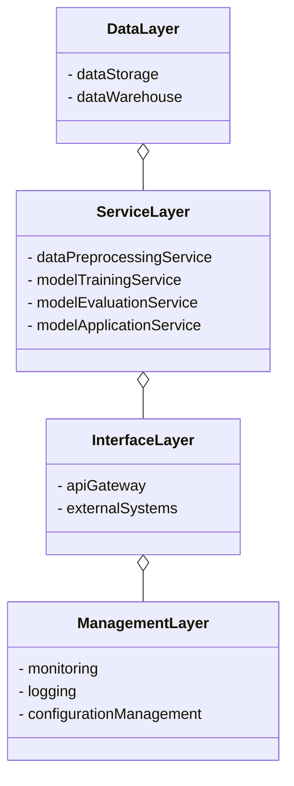
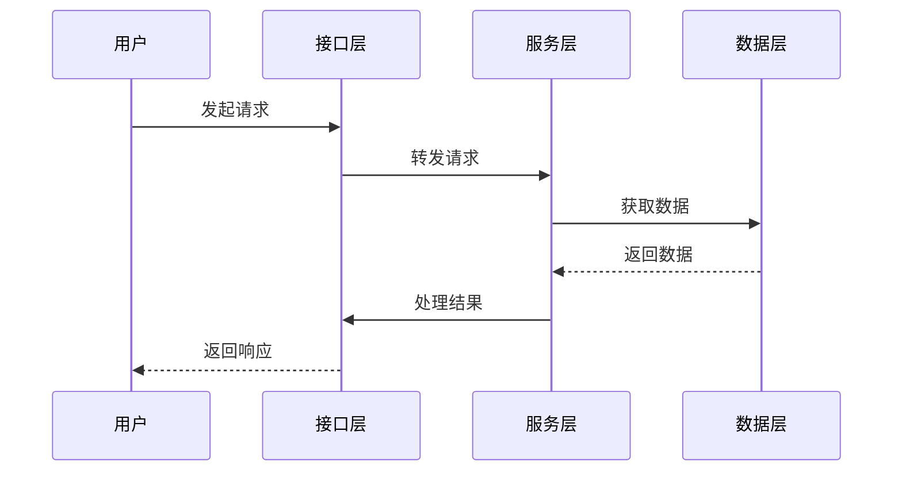

                 

### 引言：敏捷中的技术路线图：规划LLM应用的长期发展

在当今快速变化的技术环境中，如何确保长期发展战略的可行性和可持续性已成为企业和开发者面临的一大挑战。特别是对于大型语言模型（Large Language Model，简称LLM）这样高度复杂的技术应用，其开发过程不仅需要创新的思维，还需要系统化的规划和科学的管理。

**关键词：** 敏捷，技术路线图，LLM，长期发展，项目管理

**摘要：** 本文旨在探讨如何利用敏捷方法来规划LLM应用的长期发展。我们将详细分析敏捷原则在LLM项目中的适用性，阐述技术路线图的基本概念及其在项目规划中的重要性，并提供一系列实用策略来应对LLM开发过程中可能遇到的技术和管理挑战。

随着人工智能和机器学习技术的飞速发展，LLM作为一种强大的自然语言处理工具，正逐渐成为各类应用场景的关键技术。然而，LLM的应用不仅要求高水平的算法设计和数据处理能力，还需要在项目管理和战略规划方面进行深入考虑。敏捷开发（Agile Development）作为一种以人为核心、迭代和渐进的方式管理项目的开发方法，近年来在软件工程领域取得了显著成功。其灵活性和适应性使得敏捷方法在应对快速变化的需求和市场动态方面具有独特优势。

本文将首先介绍敏捷开发的基本原理，解释其核心理念和主要框架，并探讨这些理念如何与LLM开发相结合。接着，我们将详细阐述技术路线图的概念，并展示如何通过技术路线图来规划LLM项目的长期发展。最后，我们将分析LLM开发过程中可能遇到的技术挑战和管理难题，并提供一系列解决方案和最佳实践建议。

通过本文的探讨，我们希望能够为从事LLM开发的团队提供一套系统化的战略规划方法，帮助他们在快速变化的市场环境中保持竞争优势，实现长期的可持续发展。

### 敏捷开发的基本原理

敏捷开发是一种以人为核心、迭代和渐进的方法，它强调团队的合作、持续的交付、响应变化以及客户价值的最大化。敏捷开发的核心理念最初由《敏捷宣言》（Manifesto for Agile Software Development）提出，该宣言由17位软件工程师在2001年共同签署，标志着敏捷运动的诞生。

**核心原则：**

1. **个体和互动重于过程和工具：** 敏捷方法认为，软件开发的关键在于人的创造力、沟通和协作能力，而非单纯依赖工具或流程。因此，敏捷强调团队中个体的主动性、沟通和协作，鼓励团队成员之间的互动和合作。

2. **可工作的软件重于详尽的文档：** 敏捷开发重视实际可运行软件的价值，认为工作的软件是验证项目进展和客户需求的最有效方式。虽然文档也很重要，但敏捷更注重软件的实际功能，而不过分依赖详细的文档。

3. **客户合作重于合同谈判：** 敏捷方法主张与客户保持紧密的合作关系，通过频繁的沟通和反馈来确保项目方向与客户需求保持一致。这种客户导向的方法能够更好地满足客户需求，提高项目成功率。

4. **响应变化重于遵循计划：** 在敏捷开发中，需求的变化被视为项目的一部分，甚至是一种必然。敏捷团队更倾向于灵活应对变化，通过迭代和增量式开发来逐步完善项目，而不是僵化地遵循初始计划。

**主要框架：**

1. **Scrum：** Scrum是敏捷开发中最流行的框架之一，它通过将项目划分为一系列短周期（称为“冲刺”）来实现持续交付。Scrum强调透明度、检查点和调整，使得团队能够快速响应变化。

2. **Kanban：** Kanban侧重于通过可视化工作流程来提高效率和减少浪费。它使用看板（Kanban板）来跟踪工作流程，确保每个阶段都能清晰可见，从而实现流程的优化。

3. **Lean：** Lean开发源自丰田生产系统，它强调减少浪费、优化流程和最大化价值。Lean方法注重持续改进和精益制造，通过消除不必要的步骤和资源浪费来提高生产效率。

**敏捷与LLM开发的结合：**

敏捷原则在LLM开发中的适用性主要体现在以下几个方面：

1. **快速迭代：** LLM开发通常需要大量的试验和调整。敏捷方法中的迭代周期使得团队能够快速验证和调整模型，从而提高开发效率。

2. **灵活应对变化：** 在LLM项目中，需求可能会随着模型性能的改进而不断变化。敏捷方法强调灵活性和适应性，有助于团队快速响应这些变化。

3. **持续交付：** 敏捷方法中的持续交付确保了LLM模型在开发过程中能够不断进行测试和优化，从而提高模型的质量和可靠性。

4. **客户合作：** LLM项目通常与客户需求紧密相关。通过敏捷方法与客户的紧密合作，团队能够更好地理解客户需求，确保最终产品能够满足客户期望。

总之，敏捷开发为LLM项目提供了一种灵活、高效的管理方法，通过强调团队合作、快速迭代和客户合作，有助于实现LLM项目的长期成功。

### 技术路线图的基本概念

在软件工程和项目管理中，技术路线图（Technical Roadmap）是一种重要的战略工具，用于规划产品的长期开发路径。技术路线图不仅描述了项目的时间线和关键里程碑，还明确了项目的技术方向、关键任务和资源需求。通过技术路线图，团队能够清晰地了解项目的整体目标和发展方向，从而更有效地分配资源和管理工作。

**基本定义：**

技术路线图是一份详细描述产品开发路径的文档，它包括项目的关键里程碑、时间线、技术方向、资源需求和关键任务。技术路线图不仅用于项目管理，还帮助团队在开发过程中保持对目标的关注，确保项目按照预期进行。

**组成部分：**

1. **目标：** 技术路线图首先明确项目的总体目标，包括产品的功能、性能和用户体验等。

2. **时间线：** 技术路线图详细列出项目的关键里程碑和时间节点，通常包括产品的发布时间、中间检查点和关键开发阶段。

3. **技术方向：** 技术路线图描述了项目的技术方向和核心技术，包括将要使用的框架、工具、技术和开发方法。

4. **资源需求：** 技术路线图明确项目的资源需求，包括人力、资金、技术和基础设施等。

5. **关键任务：** 技术路线图列出实现目标所需的关键任务和活动，这些任务通常需要跨部门合作和协调。

**重要性：**

技术路线图在项目规划和管理中具有重要作用：

1. **明确目标：** 技术路线图帮助团队明确项目的目标和发展方向，确保所有团队成员对项目目标有共同的理解。

2. **资源分配：** 技术路线图帮助团队了解项目所需的资源，从而更好地进行资源分配和管理，避免资源浪费。

3. **进度监控：** 技术路线图提供项目的时间线和工作计划，帮助团队监控项目进度，及时发现和解决问题。

4. **风险识别：** 技术路线图通过列出关键任务和资源需求，帮助团队识别潜在的风险和挑战，提前制定应对策略。

5. **协作与沟通：** 技术路线图作为一份共享文档，有助于团队内部和跨部门之间的协作和沟通，确保项目按计划进行。

通过技术路线图，团队能够更好地规划和管理LLM项目，确保项目在复杂多变的技术环境中能够稳步推进，实现长期目标。

### 如何通过技术路线图规划LLM项目的长期发展

在LLM项目的长期发展中，技术路线图是不可或缺的规划工具。通过技术路线图，团队能够明确项目的方向和关键里程碑，从而更好地分配资源、管理进度并应对变化。以下是创建LLM项目技术路线图的详细步骤：

**步骤 1：确定项目目标和愿景**

在开始制定技术路线图之前，首先需要明确项目的目标和愿景。这些目标和愿景应该具有可衡量性和可实现性，以便团队在开发过程中能够清楚地了解项目的最终目标。例如，一个LLM项目的目标可能是开发一个能够提供高质量自然语言生成的工具，用于企业内部通信和文档自动生成。

**步骤 2：识别关键里程碑**

关键里程碑是项目开发过程中必须达到的重要节点，它们标志着项目的阶段性成果。在LLM项目中，关键里程碑可能包括：

- **原型开发完成**：在此阶段，团队需要构建一个初步的LLM模型，以验证核心算法的有效性。
- **内部测试完成**：在原型开发完成后，进行内部测试以确保模型的质量和性能。
- **公开测试完成**：在内部测试通过后，进行公开测试，收集用户反馈以进一步优化模型。
- **正式发布**：在所有测试和优化完成后，发布LLM产品。

**步骤 3：制定时间线**

在确定了关键里程碑后，下一步是制定时间线。时间线应详细列出每个里程碑的预计完成时间，以及各个阶段的工作计划。例如，原型开发可能需要2个月时间，内部测试可能需要1个月，公开测试可能需要3个月，最终发布可能需要1个月。

**步骤 4：确定技术方向和资源需求**

技术路线图需要明确项目的技术方向和所需的资源。在LLM项目中，这包括：

- **技术框架**：确定将使用的深度学习框架（如TensorFlow、PyTorch）和自然语言处理库（如NLTK、spaCy）。
- **硬件资源**：确保有足够的计算资源和存储资源来训练和部署LLM模型。
- **人员配置**：明确所需的技术专家、数据科学家、软件开发人员和测试人员的数量和职责。

**步骤 5：制定关键任务和活动**

在技术路线图中，需要详细列出实现目标所需的关键任务和活动。例如：

- **数据收集和预处理**：收集大量的文本数据，并进行数据清洗和预处理，以供训练使用。
- **模型训练和优化**：使用收集到的数据训练LLM模型，并通过迭代优化模型性能。
- **系统集成和测试**：将LLM模型集成到企业应用中，并进行全面测试，确保其功能稳定、性能优异。
- **用户反馈和优化**：在产品发布后，收集用户反馈，并根据反馈对模型进行持续优化。

**步骤 6：评估和调整**

技术路线图需要定期进行评估和调整，以应对项目过程中的变化和挑战。例如：

- **进度评估**：定期检查项目进度，确保所有任务按计划进行。
- **资源评估**：根据项目进展情况，调整资源分配，确保项目所需的资源得到充分利用。
- **风险评估**：识别潜在的风险和挑战，并制定应对策略。

通过上述步骤，团队可以创建一个全面、详细的技术路线图，从而为LLM项目的长期发展提供清晰的方向和有效的管理。技术路线图不仅帮助团队在开发过程中保持对目标的关注，还提供了应对变化和挑战的灵活性，确保项目能够成功实现。

### LLM项目中的技术挑战和管理难题

尽管敏捷方法和技术路线图为LLM项目的开发提供了有效的管理和规划工具，但在实际操作中，团队仍将面临一系列技术挑战和管理难题。以下是LLM项目中常见的一些挑战及其解决方案。

**数据质量和数据安全**

**挑战：** LLM模型的表现高度依赖于训练数据的质量。不完整、不准确或带有偏见的数据可能导致模型性能不佳，甚至产生错误的结果。此外，数据的隐私和安全问题也是一大挑战，特别是在涉及个人敏感信息的场景中。

**解决方案：** 首先，确保数据收集和预处理过程的标准化，使用多种来源的数据进行交叉验证。其次，对数据进行去识别化处理，以保护个人隐私。最后，建立严格的数据安全管理机制，包括数据加密、访问控制和权限管理，确保数据在整个生命周期中的安全性。

**计算资源需求**

**挑战：** LLM模型的训练和推理过程需要大量的计算资源，这可能导致资源不足的问题。特别是在使用大型预训练模型时，计算资源的需求尤为突出。

**解决方案：** 首先，采用分布式计算和并行处理技术，以提高计算效率。其次，利用云计算平台，如Google Cloud、AWS和Azure，获取可扩展的计算资源。最后，定期评估和调整资源需求，确保计算资源能够满足项目需求。

**模型性能优化**

**挑战：** LLM模型的性能优化是一个复杂的过程，涉及多个方面的调整。这包括算法优化、数据增强、超参数调整等。

**解决方案：** 首先，使用自动化工具和算法来优化模型训练过程，例如自动调参（AutoML）和分布式训练。其次，利用数据增强技术，如数据扩充、生成对抗网络（GAN）等，提高模型的泛化能力。最后，通过持续的迭代和测试，逐步优化模型性能。

**团队协作和沟通**

**挑战：** LLM项目通常涉及多个团队和成员，包括数据科学家、算法工程师、软件工程师和产品经理。不同角色的成员可能有不同的背景和专业知识，这可能导致沟通和协作上的障碍。

**解决方案：** 首先，建立统一的沟通渠道，如日常站会、项目会议和即时通讯工具，确保信息的及时传递。其次，采用敏捷框架，如Scrum或Kanban，来规范团队的协作流程和任务分配。最后，定期进行团队建设活动，增强团队成员之间的信任和合作。

**项目管理和技术路线图**

**挑战：** 在LLM项目的长期发展中，项目管理和技术路线图的制定和执行可能会遇到各种挑战，如需求变更、进度延误和资源分配不均。

**解决方案：** 首先，建立灵活的项目管理机制，允许在必要时调整计划和资源。其次，采用迭代和增量式开发方法，逐步实现项目目标，减少风险。最后，定期审查技术路线图，确保项目按计划进行，并及时调整策略以应对变化。

通过上述解决方案，团队可以更好地应对LLM项目中的技术挑战和管理难题，从而确保项目的成功实施和长期发展。

### 实施敏捷实践的详细指南

在LLM项目中，实施敏捷实践是实现高效开发的关键。以下将详细探讨如何运用迭代开发、持续集成、测试驱动开发和敏捷工具来提升项目效率。

**迭代开发（Iterative Development）：**

迭代开发是一种将项目分解为一系列较小的、可管理的部分，并逐步完成的开发方法。这种方法使得团队可以在每次迭代中不断改进和优化LLM模型。

1. **步骤：**
   - **需求分析：** 在每次迭代开始时，团队应分析并确定本次迭代的目标和需求。
   - **开发：** 团队根据需求进行开发，通常包括数据预处理、模型训练和集成。
   - **测试：** 完成开发后，对模型进行测试，确保其性能符合预期。
   - **反馈：** 通过用户反馈和内部评审，评估模型的效果，并进行必要的调整。

2. **优势：**
   - **快速响应变化：** 迭代开发允许团队快速调整模型，以应对需求变化。
   - **持续改进：** 每次迭代都是一次改进的机会，有助于逐步优化模型。

**持续集成（Continuous Integration，CI）：**

持续集成是一种软件开发实践，通过频繁地将代码合并到共享仓库中，并立即进行测试，以确保代码库的一致性和稳定性。

1. **步骤：**
   - **代码提交：** 开发者将代码提交到共享仓库。
   - **自动构建：** 持续集成工具自动构建代码，并进行编译、测试和部署。
   - **反馈：** 如果构建失败或测试不通过，开发人员会立即收到通知，并可以快速修复问题。

2. **优势：**
   - **早期发现问题：** 持续集成在早期阶段发现和修复问题，减少后续的修复成本。
   - **提高代码质量：** 持续集成确保代码库的一致性和稳定性，提高代码质量。

**测试驱动开发（Test-Driven Development，TDD）：**

测试驱动开发是一种通过编写测试用例来驱动开发的实践。这种方法确保每个功能点都经过测试，并且只有通过测试的功能才会被合并到代码库中。

1. **步骤：**
   - **编写测试：** 开发者编写测试用例，确保新功能的实现能够通过这些测试。
   - **编写代码：** 根据测试用例编写代码，以实现所需功能。
   - **测试运行：** 运行测试用例，确保所有测试都通过。
   - **重构：** 在代码通过测试后，进行重构，优化代码质量。

2. **优势：**
   - **代码质量保障：** 通过测试驱动开发，确保每个功能都是经过验证的，减少缺陷。
   - **设计优化：** 测试驱动开发鼓励编写简洁、可测试的代码，有助于优化系统设计。

**敏捷工具：**

多种敏捷工具可以帮助团队更好地管理项目，以下是几种常用的敏捷工具：

1. **Jira：** Jira是一种广泛使用的项目管理工具，支持任务跟踪、敏捷看板和迭代规划等功能。
2. **Trello：** Trello是一个直观的看板工具，适用于敏捷团队进行任务管理和跟踪。
3. **Confluence：** Confluence是一种知识共享和文档管理工具，有助于团队记录和共享项目文档。
4. **GitLab：** GitLab是一个基于Git的代码托管平台，支持持续集成和敏捷开发流程。

通过实施这些敏捷实践和工具，团队可以在LLM项目中实现更高效的开发和更高质量的产品交付。

### 系统分析与架构设计：LLM项目的详细方案

在LLM项目中，系统的分析与架构设计是确保项目成功的关键环节。以下将从项目背景、系统功能设计、系统架构设计、系统接口设计和系统交互等方面进行详细探讨。

#### 项目背景

LLM项目旨在开发一种能够提供高质量自然语言生成的工具，用于企业内部通信和文档自动生成。该项目涉及多个团队和角色的协作，包括数据科学家、算法工程师、软件开发人员和测试工程师。项目的目标是构建一个高效、稳定且易于扩展的LLM平台，以支持企业的多样化需求。

#### 系统功能设计

LLM系统的功能设计主要包括数据收集、预处理、模型训练、模型评估和模型应用。具体功能如下：

1. **数据收集**：收集来自企业内部的各种文本数据，包括邮件、文档、报告等。
2. **数据预处理**：对收集到的数据进行清洗、去噪和标注，为模型训练提供高质量的数据集。
3. **模型训练**：使用深度学习框架（如TensorFlow或PyTorch）训练LLM模型，包括预训练和微调。
4. **模型评估**：通过多种评估指标（如BLEU、ROUGE等）评估模型性能，确保模型达到预期效果。
5. **模型应用**：将训练好的模型集成到企业应用中，提供自动文本生成、摘要、问答等功能。

#### 系统架构设计

LLM项目的系统架构设计采用微服务架构，以提高系统的可扩展性和灵活性。以下是系统架构的详细设计：

1. **数据层**：数据层负责数据的存储和管理，包括数据存储（如HDFS、MongoDB）和数据仓库（如Redshift）。
2. **服务层**：服务层包括多个微服务，每个微服务负责不同的功能，如数据预处理服务、模型训练服务、模型评估服务、模型应用服务。
3. **接口层**：接口层提供与外部系统（如企业应用、API网关）的交互接口，支持RESTful API和WebSocket等协议。
4. **管理层**：管理层负责监控、日志记录和配置管理，确保系统的稳定运行。

以下是系统架构的Mermaid类图表示：



#### 系统接口设计

系统接口设计包括内部接口和外部接口。内部接口主要用于服务层之间的通信，外部接口用于与外部系统（如企业应用）的交互。

1. **内部接口**：内部接口采用RESTful API设计，支持JSON和XML数据格式。以下是部分内部接口的设计：

    ```mermaid
    sequenceDiagram
        participant Client as 客户端
        participant DataPreprocessingService as 数据预处理服务
        participant ModelTrainingService as 模型训练服务

        Client->>DataPreprocessingService: 发送数据预处理请求
        DataPreprocessingService->>Client: 返回预处理结果

        Client->>ModelTrainingService: 发送模型训练请求
        ModelTrainingService->>Client: 返回训练进度和结果
    ```

2. **外部接口**：外部接口通过API网关统一管理，支持多种认证机制和访问控制策略。以下是部分外部接口的设计：

    ```mermaid
    sequenceDiagram
        participant Client as 客户端
        participant APIGateway as API网关
        participant ExternalSystem as 外部系统

        Client->>APIGateway: 发送请求
        APIGateway->>ExternalSystem: 访问外部系统
        APIGateway->>Client: 返回响应
    ```

#### 系统交互设计

系统交互设计采用Mermaid序列图来表示，以下是一个示例：



通过详细的系统分析与架构设计，LLM项目能够实现高效、稳定和可扩展的系统架构，从而支持项目的长期发展。

### 项目实战：环境安装、核心实现与代码解析

在LLM项目的实施过程中，环境安装和核心实现是两个至关重要的环节。以下将详细介绍如何在Linux环境中安装和配置必要的软件和依赖项，并展示如何实现一个基本的LLM模型。

#### 环境安装

1. **安装Python**：首先，确保系统中安装了Python 3.8及以上版本。可以通过以下命令安装：

    ```bash
    sudo apt-get update
    sudo apt-get install python3.8
    ```

2. **安装pip**：pip是Python的包管理器，用于安装和管理Python库。可以通过以下命令安装：

    ```bash
    sudo apt-get install python3-pip
    ```

3. **安装TensorFlow**：TensorFlow是用于机器学习的开源框架，以下是安装TensorFlow的命令：

    ```bash
    pip3 install tensorflow
    ```

4. **安装其他依赖库**：除了TensorFlow，LLM项目还需要其他依赖库，如NumPy、Pandas等。可以通过以下命令安装：

    ```bash
    pip3 install numpy pandas scikit-learn
    ```

5. **安装Jupyter Notebook**：Jupyter Notebook是一个交互式的开发环境，常用于机器学习项目。可以通过以下命令安装：

    ```bash
    pip3 install notebook
    ```

6. **配置Jupyter Notebook**：启动Jupyter Notebook服务：

    ```bash
    jupyter notebook
    ```

在浏览器中打开Jupyter Notebook，即可开始编写代码。

#### 核心实现

以下是实现一个简单的LLM模型的基本步骤：

1. **数据收集和预处理**：收集文本数据，并进行清洗、去噪和标注。以下是一个简单的示例：

    ```python
    import pandas as pd

    # 读取数据
    data = pd.read_csv('data.csv')

    # 数据清洗
    data.dropna(inplace=True)
    data['text'] = data['text'].apply(lambda x: x.strip())

    # 数据标注
    data['label'] = data['text'].map({'label1': 1, 'label2': 0})
    ```

2. **模型训练**：使用TensorFlow训练一个简单的神经网络模型。以下是一个基本的模型实现：

    ```python
    import tensorflow as tf

    # 定义模型
    model = tf.keras.Sequential([
        tf.keras.layers.Dense(128, activation='relu', input_shape=(1000,)),
        tf.keras.layers.Dense(1, activation='sigmoid')
    ])

    # 编译模型
    model.compile(optimizer='adam', loss='binary_crossentropy', metrics=['accuracy'])

    # 训练模型
    model.fit(data['text'], data['label'], epochs=10, batch_size=32)
    ```

3. **模型评估**：评估模型性能，以下是一个简单的评估示例：

    ```python
    # 评估模型
    loss, accuracy = model.evaluate(data['text'], data['label'])

    print(f'损失：{loss}, 准确率：{accuracy}')
    ```

4. **模型应用**：使用训练好的模型进行预测，以下是一个预测示例：

    ```python
    # 预测
    prediction = model.predict(data['text'])

    # 输出预测结果
    print(prediction)
    ```

#### 代码应用解读与分析

以上代码展示了如何在LLM项目中实现数据收集、模型训练和模型评估的基本步骤。在实际项目中，数据预处理和模型训练的步骤会更加复杂，涉及更多的数据清洗、特征提取和模型调参等操作。

**代码应用解读：**

1. **数据收集和预处理**：数据收集和预处理是模型训练的基础。在上述示例中，我们首先读取CSV格式的数据，并进行基本的清洗和标注。这一步骤确保了模型训练的数据质量。
   
2. **模型训练**：模型训练是使用收集到的数据训练神经网络模型。在示例中，我们定义了一个简单的全连接神经网络（Dense layers），并使用二分类交叉熵损失函数和Adam优化器进行训练。训练过程通过fit方法完成，其中epochs指定训练轮数，batch_size指定每次训练的数据量。

3. **模型评估**：模型评估用于验证模型性能。在示例中，我们使用evaluate方法对模型进行评估，输出损失和准确率。

4. **模型应用**：模型应用是将训练好的模型用于实际预测。在示例中，我们使用predict方法对新的数据进行预测，并输出预测结果。

**实际案例分析和详细讲解：**

以下是一个实际案例：

假设我们有一个企业内部文档生成系统，需要使用LLM模型自动生成文档摘要。我们可以按照以下步骤进行：

1. **数据收集**：从企业内部系统中收集文档数据，包括文档标题、正文和关键词。
2. **数据预处理**：对收集到的文档进行清洗和标注，将文档标题和正文作为输入，摘要作为标签。
3. **模型训练**：使用预处理后的数据训练LLM模型，优化模型参数。
4. **模型评估**：评估模型性能，确保模型能够生成高质量的摘要。
5. **模型应用**：将训练好的模型部署到生产环境，实时生成文档摘要。

通过这个实际案例，我们可以看到LLM模型在企业应用中的强大能力。在实际项目中，团队需要根据具体业务需求进行定制化开发和优化，以确保模型在实际应用中的效果。

#### 项目小结

通过本次实战，我们了解了如何在Linux环境中安装和配置LLM项目所需的软件和依赖项，并实现了基本的数据收集、模型训练和模型评估过程。同时，我们也通过一个实际案例展示了LLM模型在企业应用中的潜在价值。在接下来的项目中，团队需要继续优化模型、提高生成质量，并确保系统能够稳定运行，为企业提供持续的价值。

### 最佳实践与注意事项

在LLM项目的开发和实施过程中，遵循最佳实践和注意事项是确保项目成功的关键。以下是一些最佳实践和注意事项：

**最佳实践：**

1. **数据预处理的重要性：** 确保数据预处理过程的标准化和高质量，避免数据质量问题影响模型性能。
2. **模型训练和调优：** 使用自动化工具和最佳实践进行模型训练和调优，提高模型性能和效率。
3. **持续集成与持续部署：** 实施持续集成和持续部署（CI/CD）流程，确保代码质量和部署效率。
4. **用户反馈和持续改进：** 定期收集用户反馈，并根据反馈进行持续改进，确保模型满足用户需求。

**注意事项：**

1. **资源分配与监控：** 确保项目资源（如计算资源、人力资源）的合理分配和监控，避免资源浪费和瓶颈。
2. **风险管理：** 识别潜在的风险和挑战，制定相应的应对策略，确保项目能够顺利推进。
3. **团队协作与沟通：** 建立有效的团队协作和沟通机制，确保团队成员之间的信息畅通和目标一致。
4. **项目监控与调整：** 定期评估项目进度和质量，根据实际情况进行必要调整，确保项目按计划进行。

通过遵循这些最佳实践和注意事项，团队可以更好地应对LLM项目中的各种挑战，确保项目的成功实施和长期发展。

### 拓展阅读

为了深入理解LLM项目开发和实施的关键技术和管理方法，以下推荐几本经典书籍和权威文章，供读者进一步学习和参考：

1. **《深度学习》（Deep Learning）**：作者Ian Goodfellow、Yoshua Bengio和Aaron Courville。这本书详细介绍了深度学习的基础理论和实践方法，包括神经网络、优化算法和数据分析等内容。

2. **《自然语言处理综论》（Speech and Language Processing）**：作者Daniel Jurafsky和James H. Martin。这本书全面覆盖了自然语言处理的基础知识，从语音识别到文本生成，深入浅出地讲解了相关技术和应用。

3. **《Scrum精髓》（Scrum: The Art of Doing Twice the Work in Half the Time）**：作者Jeff Sutherland。这本书是Scrum方法的权威指南，详细介绍了Scrum框架、实践和团队协作技巧。

4. **《持续集成：代码和基础设施的自动化实践》（Continuous Integration: Mainstreaming Continuous Delivery）**：作者Paul Duvall、Steve Matyas和Andrew Glover。这本书讲解了如何实施持续集成和持续部署，确保代码质量和交付效率。

5. **《人工智能的未来》（The Future of Humanity: Terraforming Mars, Interstellar Travel, Immortality, and Our Destiny Beyond Earth）**：作者Michio Kaku。这本书探讨了人工智能、星际旅行和人类未来的前沿话题，提供了对技术发展的深刻洞察。

通过阅读这些书籍和文章，读者可以更全面地了解LLM项目开发和实施的各个方面，从而在项目中取得更好的成效。希望这些资源能够为读者提供有价值的参考和启示。

