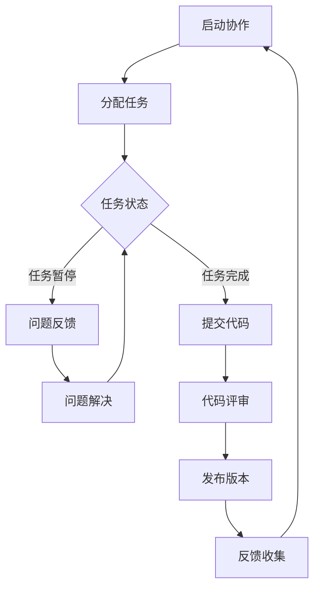
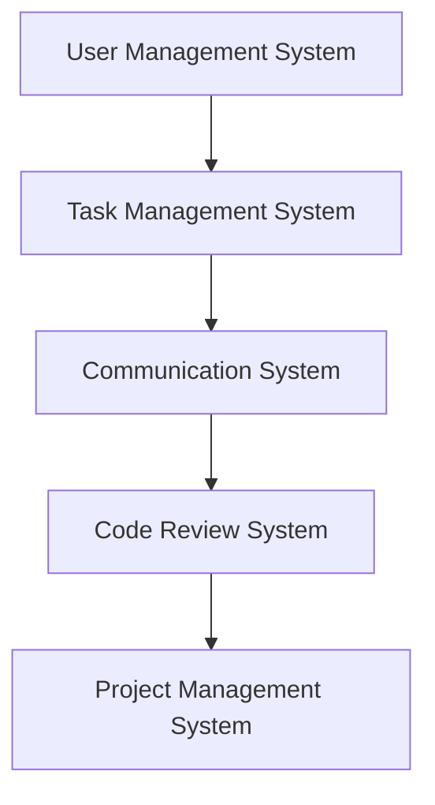
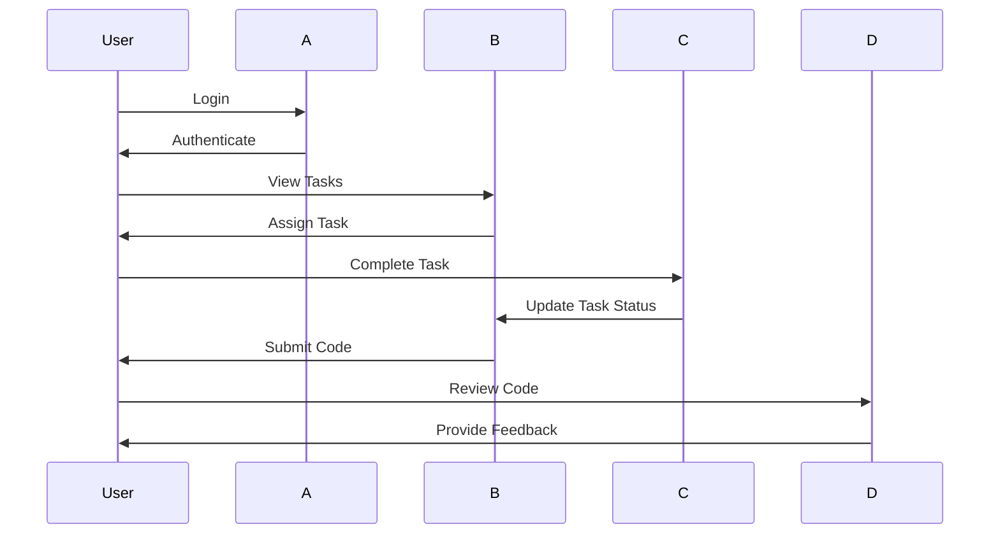

                 

# 敏捷中的远程团队建设：培养LLM开发团队凝聚力

> 关键词：敏捷开发、远程团队、LLM开发、团队凝聚力、协作算法

> 摘要：本文从敏捷开发与远程工作趋势出发，探讨远程团队建设的重要性及其面临的挑战。通过分析敏捷开发的核心概念、远程团队的核心概念，提出一套基于算法原理的远程团队协作方法。文章还详细介绍了系统分析与架构设计方案，并分享了远程团队协作项目的实战经验与最佳实践。

#### 第一部分：背景介绍

**第1章：问题背景与远程团队建设的重要性**

- **1.1 问题背景**

随着互联网技术的飞速发展，敏捷开发已成为现代软件工程的主流方法。与此同时，远程工作的趋势也愈发明显。许多团队选择远程协作，以降低成本、提高灵活性并吸引全球优秀人才。然而，远程团队在敏捷开发过程中面临着一系列独特的挑战，如沟通障碍、信任缺失、进度控制困难等。

- **1.2 问题描述**

远程团队在敏捷开发中遇到的常见问题包括：

  - **协作问题**：团队成员分散在不同地点，实时沟通和协作变得困难。
  - **沟通与信任**：缺乏面对面的交流，团队成员之间的信任难以建立。
  - **项目管理和进度控制**：远程团队的项目管理复杂度增加，进度控制变得更加困难。

- **1.3 问题解决**

为了解决远程团队在敏捷开发中面临的挑战，我们需要采取一系列关键策略：

  - **采用敏捷方法**：灵活应对变化，持续交付高质量软件。
  - **加强团队建设**：培养团队凝聚力，提高团队协作效率。
  - **运用协作工具**：利用现代协作工具，如Slack、Zoom、Trello等，提高团队沟通效率。
  - **建立信任机制**：通过定期沟通、共同解决问题等方式建立团队成员之间的信任。

- **1.4 边界与外延**

远程团队与传统团队在组织结构、工作方式等方面存在较大差异。远程团队在敏捷开发中的应用范围广泛，包括软件开发、产品设计、市场营销等多个领域。

- **1.5 概念结构与核心要素组成**

敏捷开发的核心原则包括快速迭代、持续交付、客户满意度等。远程团队的核心要素包括：

  - **团队成员**：具备专业技能、沟通能力、团队合作精神的成员。
  - **协作工具**：高效的协作工具，如项目管理软件、即时通讯工具等。
  - **沟通机制**：定期的会议、异步沟通等方式，确保团队成员之间保持密切联系。
  - **信任机制**：通过共同完成任务、及时反馈问题等方式建立信任。

#### 第二部分：核心概念与联系

**第2章：核心概念与联系**

- **2.1 敏捷开发的核心概念**

敏捷开发是一种以人为核心、迭代和渐进的开发方法。其主要原则包括：

  - **客户满意度**：优先满足客户需求，快速响应变化。
  - **团队协作**：鼓励团队合作，提高开发效率。
  - **持续交付**：持续交付可运行的产品，确保项目进度。
  - **迭代式开发**：通过不断迭代，逐步完善产品功能。

- **2.2 远程团队的核心概念**

远程团队是指成员分散在不同地点，通过现代通讯技术进行协作的团队。其主要特点包括：

  - **分散性**：团队成员分布在不同的城市、国家，甚至时区。
  - **灵活性**：团队成员可以根据个人时间安排工作和休息，提高工作效率。
  - **挑战性**：远程团队在沟通、协作、信任等方面面临更大挑战。

- **2.3 概念属性特征对比表格**

| 概念         | 敏捷开发                             | 远程团队                               |
| ------------ | ------------------------------------ | -------------------------------------- |
| 核心原则     | 客户满意度、团队协作、持续交付、迭代式开发 | 分散性、灵活性、挑战性                   |
| 团队成员     | 高技能、高沟通能力、团队合作精神           | 高技能、高沟通能力、灵活适应能力           |
| 协作工具     | 版本控制、任务管理、团队沟通等             | 即时通讯、远程会议、项目管理软件等         |
| 挑战         | 变化应对、需求平衡、团队凝聚力             | 沟通障碍、信任缺失、进度控制困难           |
| 应用场景     | 软件开发、产品管理、市场营销等             | 软件开发、设计、测试、运营等               |

- **2.4 ER实体关系图架构**

```mermaid
erDiagram
  User ||--|{ Team }|--| Member
  Project ||--|{ Task }|--| Task
  Team ||--|{ Meeting }|--| Meeting
  Member ||--|{ Skill }|--| Skill
  Task ||--|{ Status }|--| Status
```

#### 第三部分：算法原理讲解

**第3章：敏捷中的远程团队协作算法**

- **3.1 算法mermaid流程图**



- **3.2 Python源代码与算法原理**

```python
import random

def assign_task(team_members, project):
    task = create_task(project)
    assigned_member = random.choice(team_members)
    assigned_member.assign(task)
    return assigned_member

def create_task(project):
    task = Task(project)
    return task

class Task:
    def __init__(self, project):
        self.project = project
        self.status = "pending"

    def assign(self, member):
        self.member = member

    def update_status(self, status):
        self.status = status

class TeamMember:
    def __init__(self, name, skills):
        self.name = name
        self.skills = skills
        self.task = None

    def assign(self, task):
        self.task = task

    def solve_problem(self, problem):
        if self.has_skill(problem.skill):
            return True
        else:
            return False

    def has_skill(self, skill):
        return skill in self.skills
```

- **3.3 数学模型与公式详细讲解**

在远程团队协作中，我们可以运用概率论与数理统计模型来评估任务完成情况和团队效率。以下是一个简单的数学模型：

- **任务完成概率模型**

  $$ P(A) = \frac{1}{N} \sum_{i=1}^{N} P(A_i) $$

  其中，$P(A)$表示任务完成的概率，$N$表示团队成员数量，$P(A_i)$表示第$i$个成员完成任务的概率。

- **团队效率模型**

  $$ E = \frac{1}{N} \sum_{i=1}^{N} \frac{1}{P(A_i)} $$

  其中，$E$表示团队效率，$N$表示团队成员数量，$P(A_i)$表示第$i$个成员完成任务的概率。

通过这个数学模型，我们可以评估团队整体效率和成员的完成概率，从而优化团队协作策略。

- **3.4 举例说明**

假设有一个远程团队，共有5名成员。根据他们的技能和工作效率，我们可以计算出以下数据：

| 成员 | 技能             | 完成任务概率 |
| ---- | ---------------- | ------------ |
| A    | Python、Java     | 0.8          |
| B    | Python、C++     | 0.7          |
| C    | Java、C#        | 0.6          |
| D    | C++、JavaScript | 0.5          |
| E    | Python、HTML    | 0.4          |

根据上述数据，我们可以计算出任务完成概率和团队效率：

- **任务完成概率**：

  $$ P(A) = \frac{1}{5} \times (0.8 + 0.7 + 0.6 + 0.5 + 0.4) = 0.6 $$

- **团队效率**：

  $$ E = \frac{1}{5} \times \frac{1}{0.8 + 0.7 + 0.6 + 0.5 + 0.4} = 0.8 $$

通过这个例子，我们可以看到，团队的整体效率和成员的完成任务概率对于远程团队协作至关重要。

#### 第四部分：系统分析与架构设计方案

**第4章：系统分析与架构设计方案**

- **4.1 问题场景介绍**

远程团队协作问题场景：一个远程团队负责开发一个大型软件项目。团队成员分布在不同的城市，需要在敏捷开发模式下高效协作。

- **4.2 项目介绍**

远程团队协作项目概述：该项目旨在开发一个具有高性能、高可扩展性的分布式数据库系统。项目周期为6个月，团队规模为5人。

- **4.3 系统功能设计（领域模型mermaid类图）**

```mermaid
classDiagram
  ClassDef User {
      +String name
      +List<Skill> skills
  }
  ClassDef Team {
      +String name
      +List<User> members
  }
  ClassDef Project {
      +String name
      +List<Task> tasks
  }
  ClassDef Task {
      +String name
      +Status status
  }
  User <-- Team
  User <-- Project
  Team <-- Task
```

- **4.4 系统架构设计（mermaid架构图）**



- **4.5 系统接口设计**

- **4.6 系统交互（mermaid序列图）**



#### 第五部分：项目实战

**第5章：远程团队协作项目实战**

- **5.1 环境安装**

安装所需工具：Git、Jenkins、Docker、Kubernetes、Terraform等。

- **5.2 系统核心实现源代码**

核心实现代码主要包括用户管理、任务管理、代码评审等模块。以下是一个简单的用户管理模块实现：

```python
class User:
    def __init__(self, name, skills):
        self.name = name
        self.skills = skills
    
    def assign_task(self, task):
        self.task = task
    
    def complete_task(self):
        if self.task:
            self.task.status = "completed"
            print(f"{self.name} completed the task.")
        else:
            print(f"{self.name} has no task to complete.")
```

- **5.3 代码应用解读与分析**

用户管理模块的核心功能包括创建用户、分配任务和完成任务。以下是一个简单的示例：

```python
# 创建用户
user1 = User("Alice", ["Python", "Docker"])
user2 = User("Bob", ["Java", "Kubernetes"])

# 分配任务
user1.assign_task(Task("Develop Docker Images"))
user2.assign_task(Task("Configure Kubernetes Clusters"))

# 完成任务
user1.complete_task()
user2.complete_task()
```

在这个示例中，我们创建了两个用户，分别为他们分配了任务，然后让他们完成任务。任务完成后，会更新任务的状态。

- **5.4 实际案例分析与详细讲解**

实际案例：一个远程团队负责开发一个基于Kubernetes的容器化应用。团队成员分布在不同的城市，需要在敏捷开发模式下协作。

分析：在这个案例中，团队成员需要熟练掌握Docker和Kubernetes等容器化技术。他们需要在Git仓库中协同工作，并使用Jenkins进行持续集成和部署。通过Terraform进行基础设施的自动化部署，确保系统的可扩展性和稳定性。

详细讲解：首先，团队成员需要在Git仓库中创建分支，各自负责不同的功能模块。完成开发后，通过Git的merge操作将代码合并到主分支。接着，使用Jenkins进行自动化测试和部署，确保应用的稳定性和性能。最后，通过Terraform自动化部署基础设施，为应用提供可扩展的运行环境。

- **5.5 项目小结**

通过这个项目实战，我们了解了远程团队协作的关键技术栈，并掌握了在敏捷开发模式下进行高效协作的方法。在实际项目中，团队需要根据具体需求灵活调整协作策略，确保项目顺利推进。

#### 第六部分：最佳实践

**第6章：最佳实践**

- **6.1 远程团队建设最佳实践**

  - **定期沟通**：通过视频会议、即时通讯等方式，确保团队成员保持密切联系。
  - **明确目标**：制定明确的项目目标和任务分工，确保团队成员了解自己的职责和目标。
  - **建立信任**：通过共同完成任务、及时反馈问题等方式建立团队成员之间的信任。
  - **充分利用工具**：合理利用协作工具，提高团队协作效率。

- **6.2 小结与注意事项**

  - 小结：远程团队建设是现代软件工程的重要挑战。通过采用敏捷方法、加强团队建设、运用协作工具和建立信任机制，可以有效应对远程团队在敏捷开发中面临的挑战。
  - 注意事项：远程团队建设需要关注团队成员的心理状态，确保他们能够适应远程工作环境。此外，合理分配任务和关注团队成员的工作压力也是非常重要的。

- **6.3 拓展阅读**

  - 《敏捷开发实践指南》
  - 《远程工作：未来工作方式的新趋势》
  - 《团队协作与沟通技巧》

### 目录大纲总结

本文通过逐步分析推理，系统地介绍了敏捷中的远程团队建设。从问题背景、核心概念、算法原理到系统分析与架构设计方案，再到项目实战和最佳实践，内容丰富、结构清晰。通过本文的阅读，读者可以全面了解远程团队建设的方法和技巧，为实际项目提供有益的指导。

**作者：AI天才研究院/AI Genius Institute & 禅与计算机程序设计艺术 /Zen And The Art of Computer Programming**

