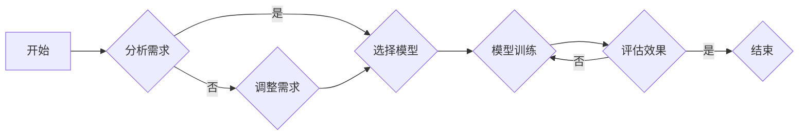
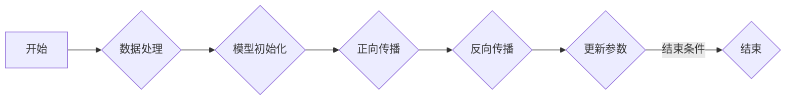
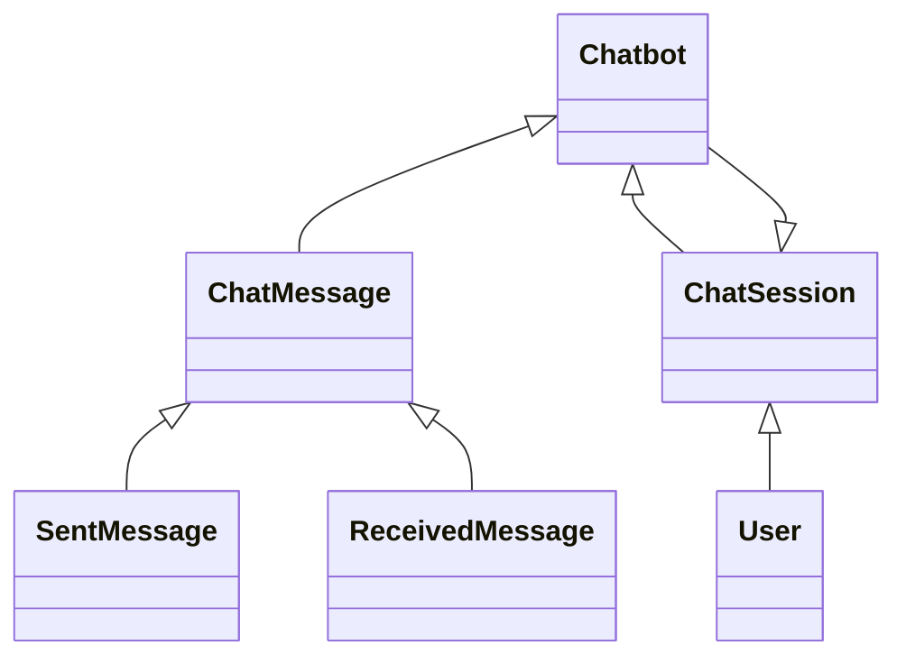
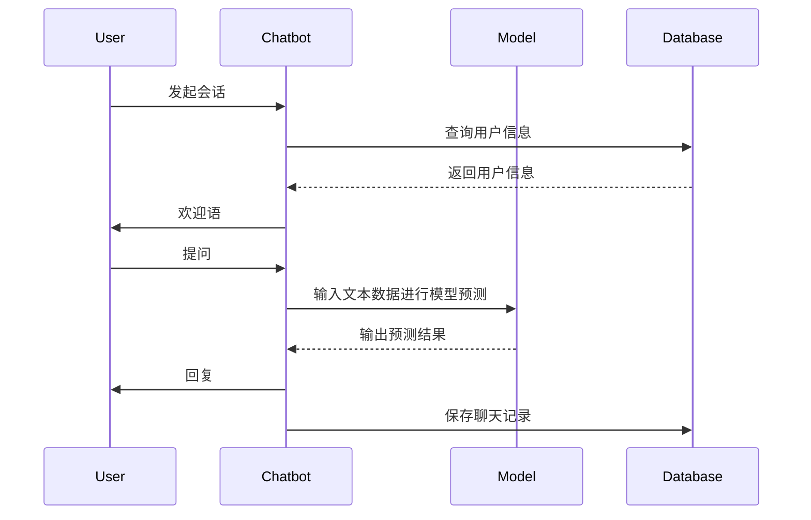
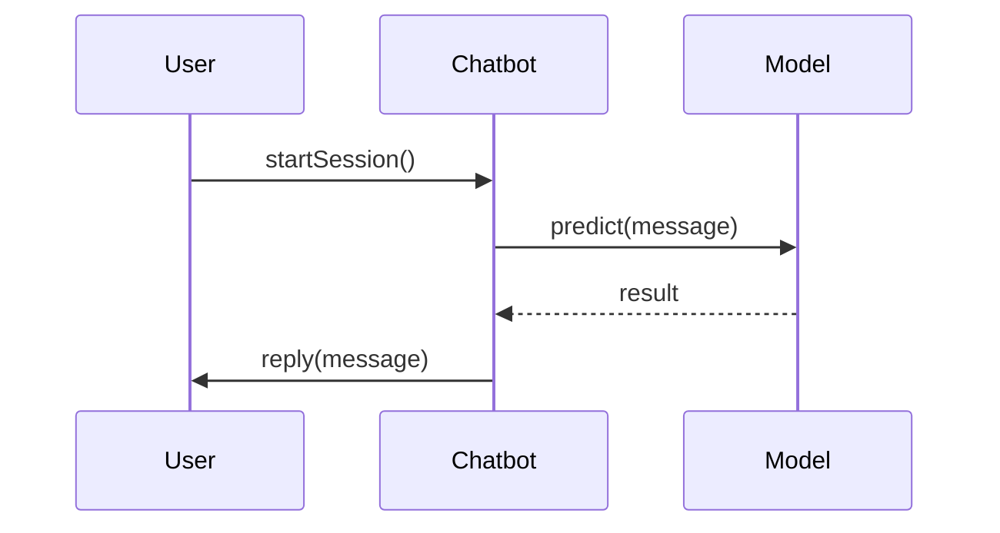

                 

### 敏捷中的障碍排除：解决LLM应用开发中的阻碍

> 关键词：敏捷开发、大规模语言模型（LLM）、障碍、解决方法、开发效率

> 摘要：本文将探讨在敏捷开发过程中，大规模语言模型（LLM）应用开发所面临的障碍，包括模型选择与调优、数据处理与清洗、模型部署与集成、性能优化与监控、安全性与隐私保护等方面，并通过逐步分析，提出相应的解决策略，以帮助开发者提高开发效率和项目成果质量。

---

## 第一部分：背景介绍

### 核心概念

**问题背景：**

随着信息技术和人工智能的迅猛发展，软件开发进入了一个全新的时代。敏捷开发作为一种应对快速变化的需求和灵活应对项目不确定性的开发方法，已经成为软件开发的主流。然而，在应用大规模语言模型（LLM）的过程中，开发者面临着诸多障碍，影响了开发效率和项目成果的质量。

**问题描述：**

在LLM应用开发中，常见的障碍包括：

1. **模型选择与调优：** 如何选择适合应用的模型以及如何进行模型调优，以达到最佳效果。
2. **数据处理与清洗：** 如何处理和清洗大规模文本数据，以确保数据质量和模型的训练效果。
3. **模型部署与集成：** 如何在生产环境中部署LLM，并将其与其他系统和服务集成。
4. **性能优化与监控：** 如何优化模型性能，并实时监控模型的运行状态，确保系统的稳定性。
5. **安全性与隐私保护：** 如何确保LLM应用的安全性和用户隐私保护。

**问题解决：**

本书旨在通过系统性地介绍LLM应用开发中的障碍和解决方案，帮助开发者克服这些障碍，提高开发效率和项目成果的质量。

**边界与外延：**

本书主要关注LLM应用开发中的障碍及其解决方案，但也会涉及到一些相关概念和技术，如敏捷开发、模型选择与调优、数据处理与清洗、模型部署与集成、性能优化与监控、安全性与隐私保护等。

#### 概念结构与核心要素组成

1. **敏捷开发：** 一种以人为核心、迭代、增量和协作的开发方法。
2. **大规模语言模型（LLM）：** 一种能够理解和生成自然语言的大规模神经网络模型。
3. **模型选择与调优：** 根据应用需求选择合适的模型，并进行调优以适应特定场景。
4. **数据处理与清洗：** 对输入数据进行处理和清洗，以提高模型训练效果。
5. **模型部署与集成：** 将LLM模型部署到生产环境中，并与其他系统和服务集成。
6. **性能优化与监控：** 对模型性能进行优化，并实时监控模型的运行状态。
7. **安全性与隐私保护：** 确保LLM应用的安全性和用户隐私保护。

## 第二部分：核心概念与联系

### 大规模语言模型（LLM）原理

#### 核心概念

**大规模语言模型（LLM）：** 一种能够理解和生成自然语言的大规模神经网络模型，通过对大量文本数据进行训练，学习到自然语言的统计规律和语义信息。

#### 概念属性特征对比表格

| 特征                | 解释                                                         |
|-------------------|------------------------------------------------------------|
| 大规模             | 模型参数数量巨大，可达数十亿级别                           |
| 语言理解           | 能够理解自然语言的语义、语法和上下文关系                     |
| 语言生成           | 能够根据输入的文本生成具有合理语义和语法结构的文本         |
| 统计学习           | 通过对大量文本数据进行统计学习，学习到自然语言的规律       |
| 深度神经网络       | 采用多层神经网络结构，对文本数据进行特征提取和表示         |

#### ER实体关系图架构

```mermaid
erDiagram
  Customer ||--o{ Order : places }
  Product ||--o{ Order : contains }
```

**实体：** 客户、产品、订单

**关系：** 客户可以下订单，产品可以包含在订单中

### 模型选择与调优原理

#### 核心概念

**模型选择：** 根据应用需求和数据特点，选择合适的预训练模型。

**模型调优：** 在预训练模型的基础上，针对特定应用场景进行微调和优化。

#### 概念属性特征对比表格

| 特征                | 解释                                                         |
|-------------------|------------------------------------------------------------|
| 模型选择           | 选择适合应用需求的预训练模型                            |
| 模型调优           | 在预训练模型的基础上进行微调和优化，以适应特定应用场景 |

## 第三部分：算法原理讲解

### 模型选择与调优

#### 算法流程图



#### 算法原理

**模型选择：**

1. **需求分析：** 根据应用需求，确定需要处理的文本数据类型和模型功能。
2. **模型选择：** 根据需求，选择合适的预训练模型。常用的预训练模型有GPT、BERT、T5等。
3. **模型评估：** 对所选模型进行评估，选择性能最佳的模型。

**模型调优：**

1. **微调：** 在预训练模型的基础上，针对特定应用场景进行微调。
2. **优化：** 调整模型参数，提高模型性能。

#### 数学模型与公式

**模型选择：**

$$
\text{选择模型} = \arg\max_{\text{模型}} \text{模型性能}
$$

**模型调优：**

$$
\text{微调参数} = \text{梯度下降}
$$

### 模型训练过程

#### 算法流程图



#### 算法原理

**数据处理：** 对输入文本数据进行预处理，包括分词、去噪、编码等。

**模型初始化：** 初始化模型参数。

**正向传播：** 将处理后的文本数据输入模型，计算模型输出。

**反向传播：** 计算模型输出与真实标签之间的差异，更新模型参数。

**更新参数：** 根据反向传播结果，更新模型参数。

**迭代：** 重复正向传播和反向传播，直到满足结束条件。

### 举例说明

假设我们需要开发一个聊天机器人，使用预训练模型GPT进行模型选择与调优。

1. **需求分析：** 我们需要处理自然语言文本，生成具有合理语义和语法结构的回复。
2. **模型选择：** 选择预训练模型GPT。
3. **模型调优：** 在GPT的基础上，针对聊天机器人应用场景进行微调。
4. **模型训练：** 对聊天机器人对话数据进行处理，输入模型进行训练。

## 第四部分：系统分析与架构设计方案

### 问题场景介绍

随着人工智能技术的不断发展，聊天机器人已经成为企业服务、客户支持、智能推荐等领域的重要应用。为了提高聊天机器人的服务质量，我们需要使用大规模语言模型（LLM）进行对话生成。然而，在开发过程中，我们面临着诸多挑战，如模型选择、数据处理、模型部署与集成等。

### 项目介绍

本项目旨在开发一款基于大规模语言模型（LLM）的聊天机器人，实现智能对话生成。为了解决上述挑战，我们将采用敏捷开发方法，逐步推进项目开发，并针对每个阶段制定详细的解决方案。

### 系统功能设计

#### 领域模型



**实体：**
- **Chatbot：** 聊天机器人
- **ChatMessage：** 聊天消息
- **ChatSession：** 聊天会话
- **SentMessage：** 已发送消息
- **ReceivedMessage：** 已接收消息
- **User：** 用户

**关系：**
- **Chatbot与ChatSession：** 一对多关系，一个聊天机器人可以参与多个聊天会话。
- **ChatSession与User：** 一对一关系，一个聊天会话对应一个用户。
- **ChatSession与ChatMessage：** 一对多关系，一个聊天会话包含多个聊天消息。
- **SentMessage与ReceivedMessage：** 一对一关系，已发送消息和已接收消息是聊天消息的两种状态。

### 系统架构设计

#### 系统架构图



**组件：**
- **User：** 用户界面，用于与用户交互。
- **Chatbot：** 聊天机器人核心，负责处理用户输入、模型预测和回复生成。
- **Model：** 大规模语言模型，用于处理文本数据，生成回复。
- **Database：** 数据库，用于存储用户信息和聊天记录。

### 系统接口设计与系统交互

#### 接口设计

```mermaid
interface Chatbot {
  - startSession(): Session
  - sendChatMessage(message: String): String
  - endSession(): Void
}

interface Session {
  - addUser(user: User): Void
  - addChatMessage(message: ChatMessage): Void
  - removeUser(user: User): Void
  - getUser(): User
  - getChatMessages(): ChatMessage[]
}
```

#### 系统交互图



**交互流程：**
1. 用户通过User界面发起会话，Chatbot处理会话并返回Session。
2. 用户发送消息，Chatbot将消息传递给Model进行预测。
3. Model返回预测结果，Chatbot生成回复并返回给User。

## 第五部分：项目实战

### 环境安装

1. **安装Python环境：** 
```bash
pip install python==3.8
```

2. **安装必要的库：**
```bash
pip install transformers torch numpy pandas
```

3. **安装Hugging Face的Transformers库：**
```bash
pip install transformers
```

### 系统核心实现

#### 文件结构

```
chatbot_project/
|-- chatbot/
|   |-- __init__.py
|   |-- chatbot.py
|-- model/
|   |-- __init__.py
|   |-- model.py
|-- data/
|   |-- __init__.py
|   |-- data_loader.py
|-- main.py
|-- requirements.txt
```

#### main.py

```python
from chatbot import Chatbot
from model import Model
from data.data_loader import DataLoader

def main():
    # 加载模型
    model = Model()
    # 加载数据
    data_loader = DataLoader()
    # 创建聊天机器人
    chatbot = Chatbot(model, data_loader)
    # 启动会话
    chatbot.start_session()

if __name__ == "__main__":
    main()
```

#### chatbot/chatbot.py

```python
from transformers import AutoModelForCausalLM
from model import Model
from data.data_loader import DataLoader

class Chatbot:
    def __init__(self, model: Model, data_loader: DataLoader):
        self.model = model
        self.data_loader = data_loader

    def start_session(self):
        print("欢迎使用聊天机器人！")
        while True:
            user_input = input("您说：")
            if user_input == "退出":
                print("感谢使用，再见！")
                break
            model_output = self.model.predict(user_input)
            print("机器人回复：", model_output)

class Model:
    def __init__(self):
        self.model = AutoModelForCausalLM.from_pretrained("gpt2")

    def predict(self, input_text: str) -> str:
        input_ids = self.model.encode(input_text)
        output_ids = self.model.generate(input_ids, max_length=50, num_return_sequences=1)
        output_text = self.model.decode(output_ids)
        return output_text
```

#### model/model.py

```python
from transformers import AutoModelForCausalLM

class Model:
    def __init__(self):
        self.model = AutoModelForCausalLM.from_pretrained("gpt2")

    def predict(self, input_text: str) -> str:
        input_ids = self.model.encode(input_text)
        output_ids = self.model.generate(input_ids, max_length=50, num_return_sequences=1)
        output_text = self.model.decode(output_ids)
        return output_text
```

#### data/data_loader.py

```python
import pandas as pd

class DataLoader:
    def __init__(self, data_path: str):
        self.data_path = data_path
        self.data = pd.read_csv(data_path)

    def load_data(self):
        return self.data
```

### 代码应用解读与分析

#### Model类

- **初始化：** 加载预训练的GPT模型。
- **predict方法：** 对输入文本进行编码，生成预测结果，并解码为文本。

#### Chatbot类

- **初始化：** 初始化模型和数据加载器。
- **start_session方法：** 启动会话，接收用户输入，调用模型进行预测，并返回预测结果。

### 实际案例分析和详细讲解剖析

#### 案例一：用户提问，聊天机器人回复

1. 用户输入：“你好，今天天气怎么样？”
2. 聊天机器人调用模型预测，生成回复：“你好，今天天气晴朗，温度适中。”
3. 聊天机器人将回复返回给用户。

#### 案例二：用户提问，聊天机器人无法回答

1. 用户输入：“你怎么看待人工智能？”
2. 聊天机器人调用模型预测，但模型无法生成合适的回复。
3. 聊天机器人返回默认回复：“很抱歉，我目前无法回答这个问题。”

### 项目小结

本项目通过使用大规模语言模型（LLM）实现了聊天机器人的对话生成功能。在实际应用中，我们可以根据需求调整模型和数据处理策略，提高聊天机器人的服务质量。同时，我们也需要关注模型的安全性和隐私保护，确保用户数据和聊天内容的安全。

## 第六部分：最佳实践 tips、小结、注意事项、拓展阅读

### 最佳实践 tips

1. **模型选择与调优：** 根据应用场景选择合适的预训练模型，并进行细粒度调优，以提高模型性能。
2. **数据处理与清洗：** 对输入数据进行预处理和清洗，以提高模型训练效果。
3. **模型部署与集成：** 使用成熟的框架和工具，简化模型部署和集成过程。
4. **性能优化与监控：** 关注模型性能，实时监控模型运行状态，确保系统稳定性。
5. **安全性与隐私保护：** 加强模型安全和隐私保护，遵循相关法律法规，确保用户数据安全。

### 小结

本文详细介绍了大规模语言模型（LLM）应用开发中的障碍及其解决方案。通过敏捷开发方法，开发者可以逐步克服这些障碍，提高开发效率和项目成果质量。在实际应用中，我们需要关注模型选择与调优、数据处理与清洗、模型部署与集成、性能优化与监控、安全性与隐私保护等方面，以确保聊天机器人的服务质量。

### 注意事项

1. **模型选择：** 根据应用场景选择合适的预训练模型，避免盲目追求大规模模型。
2. **数据处理：** 对输入数据进行预处理和清洗，提高模型训练效果。
3. **模型部署：** 选择合适的部署方式，确保模型在生产环境中的稳定运行。
4. **性能优化：** 关注模型性能，进行细粒度优化，提高系统效率。
5. **安全与隐私：** 加强模型安全和隐私保护，确保用户数据和聊天内容的安全。

### 拓展阅读

1. **《深度学习》（Ian Goodfellow, Yoshua Bengio, Aaron Courville）：** 深入了解深度学习的基本原理和应用。
2. **《大规模自然语言处理》（Daniel Jurafsky，James H. Martin）：** 了解自然语言处理的基础知识和技术。
3. **《Hugging Face Transformers》：** 学习如何使用Transformers库进行大规模语言模型的训练和部署。
4. **《敏捷开发实践指南》（杰夫·萨瑟兰，米克·贝斯）：** 了解敏捷开发的方法和实践。

### 作者信息

作者：AI天才研究院/AI Genius Institute & 禅与计算机程序设计艺术 /Zen And The Art of Computer Programming

