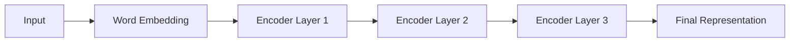
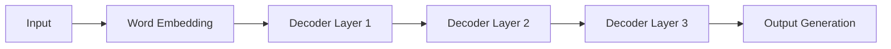
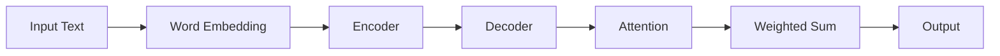
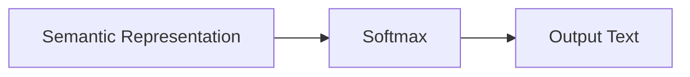
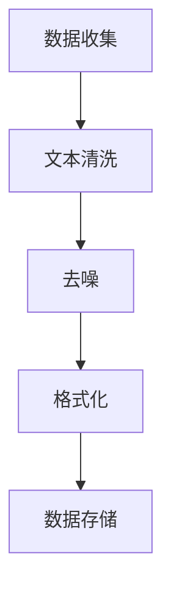
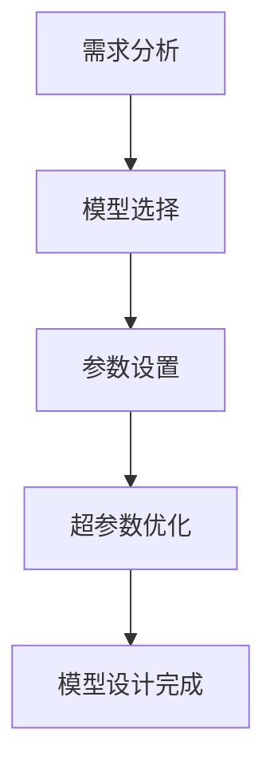
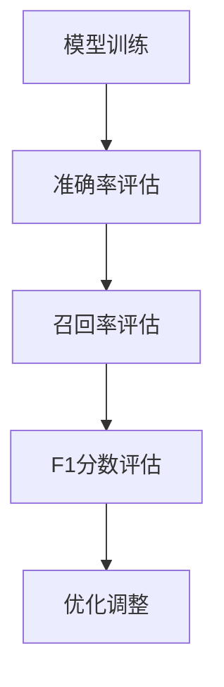
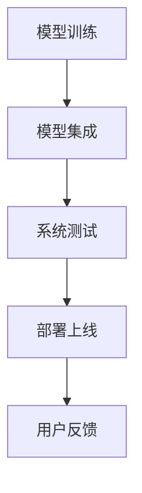

                 

# 敏捷估算技巧：提高LLM应用开发的预测准确性

关键词：敏捷估算、LLM应用开发、预测准确性、敏捷实践、模型调优

摘要：
随着人工智能技术的发展，大型语言模型（LLM）的应用日益广泛。然而，LLM应用开发的复杂性和不确定性，使得预测准确性成为一个关键问题。本文旨在探讨敏捷估算技巧在提高LLM应用开发预测准确性方面的作用。通过分析敏捷估算的概念、LLM应用开发的流程、预测准确性的评估方法以及具体的敏捷估算技巧，本文提出了提高预测准确性的策略和实践案例，为LLM应用开发者提供了有价值的参考。

## 第1章：敏捷估算概述

### 1.1 敏捷估算的概念与重要性

敏捷估算是一种用于软件开发过程中预测项目完成时间和成本的方法，它基于团队的合作、反馈和迭代。与传统的估算方法相比，敏捷估算更加灵活，能够快速响应变化的需求和环境。敏捷估算的重要性在于，它能够帮助团队在项目早期就明确目标，降低项目风险，提高资源利用率。

### 1.2 敏捷估算与传统估算方法的区别

传统估算方法通常依赖于历史数据和统计分析，往往在项目开始后才开始进行估算，导致预测结果不准确。而敏捷估算则强调实时反馈和持续调整，通过迭代过程逐步完善估算。此外，传统估算方法通常由项目管理者独立完成，而敏捷估算则强调团队的参与和协作。

### 1.3 敏捷估算的实践原则

敏捷估算的实践原则包括：快速迭代、持续反馈、团队合作、用户参与和灵活调整。这些原则有助于确保估算过程的准确性，提高项目的成功率。

## 第2章：LLM应用开发基础

### 2.1 LLM的基本概念

大型语言模型（LLM）是一种基于深度学习技术构建的自然语言处理模型，能够对自然语言进行理解和生成。LLM的核心是神经网络架构，包括编码器和解码器，以及大量的参数和训练数据。

### 2.2 LLM的核心架构

LLM的架构通常包括以下几个部分：词嵌入层、编码器、解码器、注意力机制和输出层。每个部分都有其独特的功能和设计目标。

### 2.3 LLM应用开发流程

LLM应用开发流程主要包括以下步骤：需求分析、数据收集和预处理、模型设计和训练、模型评估和优化、模型部署和应用。在这个过程中，敏捷估算技巧能够有效地提高预测准确性。

## 第3章：预测准确性评估方法

### 3.1 预测准确性的定义

预测准确性是指模型对未知数据的预测结果与真实结果之间的接近程度。它是评估LLM应用开发成功与否的重要指标。

### 3.2 评估指标与方法

预测准确性的评估指标包括准确率、召回率、F1分数等。这些指标可以通过交叉验证、时间序列分析和A/B测试等方法进行评估。

## 第4章：敏捷估算技巧

### 4.1 估算技巧概述

敏捷估算技巧主要包括时间估算、成本估算和范围估算。这些技巧能够帮助团队在项目初期就明确项目规模、时间和成本，降低不确定性。

### 4.2 时间估算技巧

时间估算技巧包括任务分解、故事点估算、迭代规划和回顾会议等。这些技巧能够帮助团队准确地预测项目完成时间。

### 4.3 成本估算技巧

成本估算技巧包括资源分配、预算管理和风险管理等。这些技巧能够帮助团队合理规划项目成本，避免资源浪费。

### 4.4 范围估算技巧

范围估算技巧包括需求分析、需求优先级排序和迭代开发等。这些技巧能够帮助团队明确项目范围，避免范围蔓延。

## 第5章：LLM应用开发中的敏捷估算实践

### 5.1 实践案例分析

在本章中，我们将分析一个真实的LLM应用开发案例，探讨如何运用敏捷估算技巧提高预测准确性。

### 5.2 面对挑战的解决方案

在LLM应用开发过程中，团队可能会面临各种挑战，如需求变化、数据质量问题和计算资源限制等。本章将讨论如何应对这些挑战，提高预测准确性。

## 第6章：提高预测准确性的策略

### 6.1 数据收集与处理

数据是LLM应用开发的基础，数据的质量直接影响预测准确性。本章将讨论如何收集和处理高质量数据，提高模型性能。

### 6.2 模型优化与调参

模型优化和调参是提高预测准确性的关键步骤。本章将介绍一些常用的优化方法和调参技巧，如梯度下降、学习率调整和正则化等。

### 6.3 风险管理与预测模型调整

风险管理是提高预测准确性的重要手段。本章将讨论如何识别和应对项目风险，调整预测模型，确保项目成功。

## 第7章：敏捷估算的持续改进

### 7.1 持续改进的概念与步骤

持续改进是敏捷估算的核心原则之一。本章将介绍持续改进的概念和步骤，帮助团队不断提高估算的准确性和效率。

### 7.2 实践中的最佳实践

在本章中，我们将总结一些在LLM应用开发中实践的最佳实践，为团队提供参考。

## 结尾

敏捷估算技巧在提高LLM应用开发的预测准确性方面具有重要作用。通过本文的探讨，我们希望能够为LLM应用开发者提供有价值的参考和启示，助力他们在项目中取得成功。

### 作者：AI天才研究院/AI Genius Institute & 禅与计算机程序设计艺术 /Zen And The Art of Computer Programming

## 第1章：敏捷估算概述

### 1.1 敏捷估算的概念与重要性

敏捷估算是一种在软件开发过程中用于预测项目完成时间和成本的方法。它基于迭代和增量开发的原则，通过快速反馈和持续改进来提高预测的准确性。敏捷估算不仅仅是数字游戏，更是一种项目管理的哲学和思维方式。

在敏捷估算中，关键的概念包括“迭代”、“用户故事”、“故事点”和“燃尽图”等。迭代是指软件开发过程中的一系列连续工作周期，每个周期都有明确的目标和任务。用户故事则是描述用户需求的简短语句，它们是敏捷估算的基本单位。故事点是一个相对度量单位，用于估算每个用户故事所需的工作量。燃尽图则是一个可视化工具，用于展示项目的进度和剩余工作量的变化。

敏捷估算的重要性体现在以下几个方面：

1. **降低项目风险**：通过实时反馈和持续调整，敏捷估算能够帮助团队在项目早期发现并解决潜在问题，降低项目风险。
2. **提高资源利用率**：敏捷估算能够帮助团队合理分配资源，避免资源浪费，提高项目的成功率。
3. **增强团队协作**：敏捷估算强调团队合作和用户参与，有助于增强团队凝聚力和项目透明度。
4. **快速响应变化**：在敏捷估算中，团队可以快速调整计划，以适应需求和环境的不断变化。

### 1.2 敏捷估算与传统估算方法的区别

传统的估算方法通常依赖于历史数据和统计分析，往往在项目开始后才进行估算。这种方法在预测准确性方面存在以下问题：

1. **滞后性**：传统估算方法往往在项目开始后才进行，无法及时反映项目进展和变化。
2. **依赖历史数据**：传统方法过于依赖历史数据，而忽略了当前项目的具体情况和需求。
3. **缺乏灵活性**：传统估算方法通常采用固定模型和公式，难以应对项目中的变化和不确定性。

相比之下，敏捷估算具有以下特点：

1. **实时反馈**：敏捷估算通过迭代和反馈机制，能够实时调整计划和资源，提高预测的准确性。
2. **用户参与**：敏捷估算强调用户参与，通过用户故事和用户反馈来指导项目开发和估算。
3. **灵活调整**：敏捷估算允许团队根据实际情况和需求变化进行灵活调整，提高项目的适应性。
4. **增量开发**：敏捷估算采用增量开发的方式，将项目分解为多个小任务，逐步完成，降低项目的风险。

### 1.3 敏捷估算的实践原则

敏捷估算的实践原则包括快速迭代、持续反馈、团队合作、用户参与和灵活调整等。以下是对这些原则的详细解释：

1. **快速迭代**：敏捷估算通过快速迭代的方式，将项目分为多个短周期（通常为2-4周）的工作周期。每个迭代周期都有明确的目标和任务，确保团队能够快速响应变化和调整计划。

2. **持续反馈**：敏捷估算强调持续反馈和评估，通过定期的回顾会议和用户反馈，及时发现和解决问题。这种方法有助于提高团队的协作效率和项目的成功率。

3. **团队合作**：敏捷估算鼓励团队合作和跨职能协作，通过共享知识和资源，提高项目的整体效率和质量。

4. **用户参与**：敏捷估算重视用户参与，通过用户故事和用户反馈来指导项目开发和估算。用户的故事和需求是敏捷估算的重要输入，有助于确保项目符合用户期望。

5. **灵活调整**：敏捷估算允许团队根据实际情况和需求变化进行灵活调整，确保项目能够适应不断变化的环境。这种方法有助于降低项目风险，提高项目的成功率。

总之，敏捷估算是一种灵活、高效的项目管理方法，能够帮助团队在LLM应用开发中提高预测准确性。通过快速迭代、持续反馈、团队合作、用户参与和灵活调整，敏捷估算能够降低项目风险，提高资源利用率，确保项目成功。在接下来的章节中，我们将进一步探讨LLM应用开发的基础、预测准确性评估方法以及具体的敏捷估算技巧。

### 2.1 LLM的基本概念

大型语言模型（Large Language Model，简称LLM）是一种先进的自然语言处理技术，通过深度学习算法，模型能够理解、生成和模拟人类语言。LLM的核心是神经网络架构，尤其是近年来发展的Transformer模型，它在处理大规模语言数据方面表现出了卓越的性能。

LLM的工作原理可以概括为以下几个步骤：

1. **词嵌入**：首先，LLM将输入的文本转换为向量表示，这一过程称为词嵌入。词嵌入能够捕捉词与词之间的关系，使得模型能够理解语义信息。
2. **编码器**：编码器负责对词嵌入进行处理，通过多层神经网络，将输入文本映射为一个高维的语义表示。
3. **解码器**：解码器根据编码器生成的语义表示，生成输出文本。在生成过程中，解码器会使用注意力机制来关注输入文本的不同部分，从而生成连贯的输出。

LLM的应用范围非常广泛，包括但不限于以下几个方面：

1. **文本生成**：LLM可以生成文章、新闻、故事等，广泛应用于内容创作和自动化写作领域。
2. **机器翻译**：LLM能够对多种语言进行翻译，实现跨语言信息的交流和共享。
3. **问答系统**：LLM可以回答用户的问题，提供即时的帮助和解决方案，广泛应用于客服和智能助手领域。
4. **自然语言理解**：LLM可以理解用户输入的文本，提取关键信息并进行处理，用于信息检索和数据分析。

在LLM的发展历程中，多个里程碑事件推动了技术的进步。例如，2018年，谷歌推出了BERT模型，大幅提升了自然语言处理任务的性能。随后，GPT-3的发布进一步推动了LLM的发展，该模型拥有超过1750亿个参数，能够生成高质量的文本。

LLM的核心优势在于其强大的语义理解能力和文本生成能力，这使得它们在多种自然语言处理任务中表现出色。然而，LLM也存在一些挑战，如计算资源消耗大、训练过程复杂以及数据隐私和安全等问题。随着技术的不断进步，这些挑战有望得到缓解，LLM的应用前景将更加广阔。

### 2.2 LLM的核心架构

大型语言模型（LLM）的架构是理解和设计这种复杂系统的基础。LLM的核心架构通常包括词嵌入层、编码器、解码器、注意力机制和输出层。以下是对每个部分的功能和设计原理的详细解释。

#### 词嵌入层（Word Embedding Layer）

词嵌入层是LLM的基础，其主要功能是将输入的单词转换为向量表示。词嵌入层的核心思想是利用低维向量来捕捉单词的语义信息。例如，"猫"、"狗"和"动物"等单词通过词嵌入层会得到相应的向量表示，这些向量不仅能够表示单词本身，还能捕捉单词之间的关系。常见的词嵌入算法包括Word2Vec、GloVe和BERT等。

**词嵌入属性对比表格：**

| 算法 | 特点 | 适用场景 |
| --- | --- | --- |
| Word2Vec | 基于分布式假设，通过共现关系训练 | 小型数据集，文本分类和情感分析 |
| GloVe | 基于全局信息，通过词对共现矩阵训练 | 大型数据集，机器翻译和问答系统 |
| BERT | 基于上下文，通过预训练和微调学习 | 问答系统，文本生成和自然语言理解 |

#### 编码器（Encoder）

编码器负责处理输入文本，并将其转换为高维的语义表示。编码器通常采用多层变换器（Transformer）架构，这种架构能够高效地捕捉输入文本的语义信息。编码器的每个层都包含自注意力机制，能够关注输入文本的不同部分，从而提高对语义的理解。

**编码器架构图：**



#### 解码器（Decoder）

解码器负责根据编码器生成的语义表示生成输出文本。解码器同样采用多层变换器架构，并在生成过程中使用注意力机制来关注编码器输出和输入文本的不同部分。解码器通过自回归方式逐个生成输出单词，并不断更新上下文状态。

**解码器架构图：**



#### 注意力机制（Attention Mechanism）

注意力机制是LLM架构的核心部分，它能够提高模型对输入文本的关注度，从而提高对语义的理解和文本生成的质量。注意力机制通过计算输入文本中不同部分的相似度，为每个部分分配不同的权重，使得模型能够关注最重要的部分。

**注意力机制Mermaid流程图：**



#### 输出层（Output Layer）

输出层负责将解码器生成的语义表示映射为具体的输出文本。在文本生成任务中，输出层通常是一个软性分类器，用于预测下一个单词的概率分布。通过累积生成的单词，输出层最终生成完整的输出文本。

**输出层架构图：**



总之，LLM的核心架构通过词嵌入层、编码器、解码器、注意力机制和输出层等部分协同工作，实现了对自然语言的高效处理。这种架构不仅在文本生成和翻译等任务中表现出色，还为其他自然语言处理任务提供了强大的工具。

### 2.3 LLM应用开发流程

LLM应用开发的流程是一个系统化、迭代的过程，涉及多个关键步骤，包括需求分析、数据收集和预处理、模型设计和训练、模型评估和优化，以及模型部署和应用。以下是对每个步骤的详细解释。

#### 需求分析

需求分析是LLM应用开发的起点，其目的是明确项目的目标和用户需求。在这一阶段，开发团队与用户进行深入沟通，收集需求文档，并进行需求评审。需求分析的关键输出是用户故事和功能规格说明，这些文档为后续的模型设计和开发提供了明确的方向。

#### 数据收集和预处理

数据是LLM应用开发的基础，高质量的数据能够显著提高模型的性能。数据收集阶段包括从公开数据集、自有数据源或其他渠道获取文本数据。在数据收集后，需要对其进行预处理，包括文本清洗、去噪、格式化等步骤。预处理的目标是提高数据的干净度和一致性，确保模型能够从中提取有效的特征。

**数据预处理流程：**



#### 模型设计和训练

在模型设计阶段，开发团队根据需求分析的结果和预处理后的数据，选择合适的模型架构和算法。常见的LLM模型包括GPT、BERT和Transformer等。模型设计不仅包括选择合适的架构，还包括参数设置和超参数优化。设计完成后，模型进入训练阶段，通过大量的训练数据，模型学习到文本的语义信息和生成规则。

**模型设计流程：**



#### 模型评估和优化

模型训练完成后，需要对其进行评估和优化。评估方法包括准确率、召回率、F1分数等指标，通过这些指标可以评估模型在不同任务上的性能。如果评估结果不理想，开发团队需要调整模型参数、优化算法或增加训练数据，以提高模型的性能。

**模型评估流程：**



#### 模型部署和应用

模型部署是将训练好的模型应用到实际场景的过程。部署过程中，需要将模型集成到应用系统中，并进行测试和调试，确保模型在实际应用中能够稳定运行。模型部署后，可以通过用户反馈和实际应用效果，进一步优化和改进模型。

**模型部署流程：**



总之，LLM应用开发流程是一个迭代和优化的过程，通过需求分析、数据收集和预处理、模型设计和训练、模型评估和优化，以及模型部署和应用，开发团队能够逐步完善和提升模型的性能，实现预期的应用目标。

### 3.1 预测准确性的定义

预测准确性是评估模型性能的关键指标，它反映了模型在处理未知数据时预测结果的准确程度。具体而言，预测准确性定义为模型预测结果与真实结果之间的相似度或接近度。在LLM应用开发中，预测准确性直接影响应用的可靠性和用户体验。

预测准确性的计算通常基于多种评估指标，其中最常用的包括准确率、召回率、F1分数和精确率等。这些指标能够从不同角度衡量模型的性能，综合评估模型的预测准确性。

1. **准确率（Accuracy）**：准确率是预测正确的样本数占总样本数的比例，计算公式为：
   $$ \text{Accuracy} = \frac{\text{预测正确数}}{\text{总样本数}} $$
   准确率简单直观，但可能在高类别不平衡的数据集上产生误导。

2. **召回率（Recall）**：召回率是预测正确的正样本数占总正样本数的比例，计算公式为：
   $$ \text{Recall} = \frac{\text{预测正确正样本数}}{\text{总正样本数}} $$
   召回率强调的是模型对正样本的捕获能力，但在错误分类的负样本上可能表现较差。

3. **精确率（Precision）**：精确率是预测正确的正样本数与预测为正样本的总数之比，计算公式为：
   $$ \text{Precision} = \frac{\text{预测正确正样本数}}{\text{预测为正样本数}} $$
   精确率强调的是模型在预测正样本时的准确性，但可能对负样本的漏判较为敏感。

4. **F1分数（F1 Score）**：F1分数是精确率和召回率的调和平均值，用于综合评估模型的性能，计算公式为：
   $$ \text{F1 Score} = 2 \times \frac{\text{Precision} \times \text{Recall}}{\text{Precision} + \text{Recall}} $$
   F1分数能够平衡精确率和召回率之间的矛盾，是评估模型性能的常用指标。

通过上述评估指标，开发团队可以全面了解模型的预测准确性，并在模型优化过程中有针对性地进行调整。提高预测准确性不仅能够提高LLM应用的可靠性和用户体验，还能增强模型在实际应用中的价值。

### 3.2 评估指标与方法

在评估LLM模型的预测准确性时，选择合适的评估指标和方法至关重要。不同的评估指标和方法能够从不同角度衡量模型的性能，提供全面的性能反馈。以下将介绍几种常用的评估指标和方法，包括交叉验证、时间序列分析和A/B测试。

#### 交叉验证（Cross-Validation）

交叉验证是一种常用的评估方法，它通过将数据集划分为多个子集，并在每个子集上训练和评估模型，来提高评估的准确性和可靠性。常见的交叉验证方法包括K折交叉验证和留一法交叉验证。

1. **K折交叉验证**：在K折交叉验证中，数据集被随机划分为K个子集，每次选择一个子集作为验证集，其余K-1个子集作为训练集。重复K次，每次使用不同的子集作为验证集。最终，模型在所有验证集上的表现平均作为其整体性能的评估结果。

2. **留一法交叉验证**：留一法交叉验证是K折交叉验证的一种特殊情况，其中每次仅使用一个样本作为验证集，其余所有样本作为训练集。这种方法计算量大，但能够提供更精确的性能评估。

交叉验证的优点是能够减少评估结果的不确定性，提高评估的可靠性。它通过多次训练和验证，提供了对模型在不同数据子集上的性能的全面了解。

#### 时间序列分析（Time Series Analysis）

时间序列分析是用于评估模型在处理时间序列数据时的预测性能的一种方法。在LLM应用中，时间序列分析特别适用于那些需要预测未来事件或趋势的应用，如股市预测、气象预报等。

1. **移动平均法**：移动平均法是一种简单的时间序列预测方法，通过计算过去一段时间内的平均值来预测未来的值。这种方法能够平滑时间序列中的噪声，但在趋势变化时可能表现不佳。

2. **自回归模型（AR）**：自回归模型利用过去的时间序列数据来预测未来的值，通过建立自回归方程来描述时间序列的依赖关系。自回归模型能够捕捉时间序列中的趋势和周期性变化，但参数选择和模型复杂度较高。

3. **ARIMA模型**：ARIMA（自回归积分滑动平均模型）是自回归模型和移动平均模型的结合，能够同时捕捉时间序列的线性趋势和季节性变化。ARIMA模型通过确定自回归项、差分项和移动平均项的参数，来优化模型的预测性能。

时间序列分析的主要优势在于其能够捕捉时间序列数据的时序特征，提供准确的预测结果。然而，时间序列分析对数据质量和建模过程有较高的要求，需要充分考虑数据的平稳性和模型的选择。

#### A/B测试（A/B Testing）

A/B测试是一种实验设计方法，用于比较两个或多个版本的模型或应用，以确定哪个版本在用户行为或性能指标上表现更好。在LLM应用中，A/B测试通常用于评估不同模型版本、参数设置或数据集对预测准确性的影响。

1. **实验设计**：在A/B测试中，用户随机分配到两个或多个版本中，每个版本的模型或应用在不同的用户群体中运行。通过收集用户行为数据和预测结果，可以对比不同版本的性能。

2. **性能指标**：A/B测试常用的性能指标包括点击率、转化率、预测准确性等。通过这些指标，可以评估不同版本的模型或应用在用户行为上的差异。

3. **数据分析**：在A/B测试完成后，通过对实验数据进行分析，可以确定哪个版本在性能上具有优势。数据分析方法包括统计假设检验、置信区间估计和误差分析等。

A/B测试的优势在于其能够提供具体的用户行为数据，帮助团队做出基于数据的决策。然而，A/B测试需要足够的用户样本和数据量，以确保结果的可靠性和统计学意义。

总之，选择合适的评估指标和方法能够全面、准确地评估LLM模型的预测准确性。交叉验证、时间序列分析和A/B测试等方法是评估模型性能的常用工具，通过综合运用这些方法，开发团队可以不断提高LLM应用的预测准确性，满足实际应用需求。

### 4.1 估算技巧概述

敏捷估算技巧在LLM应用开发中扮演着至关重要的角色。这些技巧不仅有助于团队在项目早期就明确项目规模和时间，还能够提高预测准确性，降低项目风险。敏捷估算技巧主要包括时间估算、成本估算和范围估算，每种技巧都有其独特的应用场景和方法。

#### 时间估算技巧

时间估算是敏捷估算的重要组成部分，它帮助团队预测每个任务或用户故事所需的时间。以下是一些常用的时间估算技巧：

1. **任务分解**：将大任务分解为更小的子任务，以便更准确地估算每个子任务所需的时间。这种方法有助于识别任务中的潜在风险和依赖关系。
   
2. **故事点估算**：故事点是一种相对估算单位，用于表示完成一个用户故事所需的工作量。通过团队协作，确定每个用户故事的故事点数量，从而估算整个项目的完成时间。

3. **迭代规划**：在敏捷开发中，项目被划分为多个迭代周期。在每个迭代周期开始前，团队根据故事点和资源情况，规划迭代内的任务和目标，以确保项目的按期完成。

4. **回顾会议**：在每次迭代结束后，团队举行回顾会议，讨论项目的进展、遇到的问题和改进措施。通过回顾会议，团队可以不断调整时间估算，提高后续迭代的时间预测准确性。

#### 成本估算技巧

成本估算是预测项目整体成本的关键环节。以下是一些常用的成本估算技巧：

1. **资源分配**：在成本估算过程中，团队需要明确项目所需的人力、物力和财力资源。通过资源分配，可以确保项目在预算范围内完成。

2. **预算管理**：在项目进行过程中，团队需要定期审查和调整预算，确保项目成本控制在预算范围内。预算管理有助于防止成本超支，提高项目的经济效益。

3. **风险管理**：识别和评估项目中的潜在风险，并制定相应的风险应对策略。通过风险管理，可以降低成本超支和项目延误的风险。

#### 范围估算技巧

范围估算是预测项目最终交付成果的过程。以下是一些常用的范围估算技巧：

1. **需求分析**：通过详细的需求分析，明确项目需要实现的功能和特性。需求分析有助于团队理解和优先排序需求，从而更准确地预测项目的范围。

2. **优先级排序**：将需求根据重要性和紧急性进行排序，确保团队首先完成高优先级的功能。通过优先级排序，可以确保项目在有限的资源下实现最重要的功能。

3. **迭代开发**：采用迭代开发方法，逐步实现和交付项目。通过每次迭代的交付成果，团队可以不断调整范围估算，确保项目最终交付符合用户需求。

总之，敏捷估算技巧为LLM应用开发提供了有效的预测和管理工具。通过时间估算、成本估算和范围估算，团队能够更好地规划项目，提高预测准确性，降低项目风险，确保项目成功交付。

### 4.2 时间估算技巧

在LLM应用开发中，准确的时间估算对于项目的成功至关重要。通过以下具体的时间估算技巧，团队可以更好地预测项目进度，避免延期和资源浪费。

#### 任务分解

任务分解是将一个复杂的项目分解为一系列可管理的子任务，每个子任务都有明确的开始和结束时间。这种方法有助于团队更好地理解和控制项目范围，同时也能提高估算的准确性。

**步骤：**
1. **确定项目目标**：明确项目的总体目标和期望成果。
2. **列出主要任务**：将项目目标分解为一系列主要任务。
3. **细化任务**：将每个主要任务进一步分解为更小的子任务。
4. **确定依赖关系**：识别各个子任务之间的依赖关系，确保关键任务能够按时完成。

**示例：**
假设一个LLM应用开发项目，目标是在三个月内完成一个文本生成系统。可以分解为以下任务：

- 数据收集与预处理
- 模型设计
- 模型训练
- 模型评估
- 系统集成与测试
- 部署上线

每个主要任务可以进一步分解为子任务，例如“数据收集与预处理”可以细化为“数据收集”、“数据清洗”、“数据格式化”等。

#### 故事点估算

故事点是一种相对估算单位，用于表示完成一个用户故事所需的工作量。通过团队协作，确定每个用户故事的故事点数量，从而估算整个项目的完成时间。

**步骤：**
1. **定义用户故事**：用户故事是描述用户需求的基本单位，通常用简短的句子表达。
2. **估算故事点**：团队通过讨论和协作，为每个用户故事估算故事点数量。故事点的数量可以根据团队的熟练程度和工作负荷进行调整。
3. **计算项目时间**：将所有用户故事的故事点总和除以团队的工作速度（通常以故事点/迭代为单位），得到项目的预计完成时间。

**示例：**
一个团队决定使用2周为一个迭代周期。如果项目包含20个用户故事，每个故事点估算为2点，那么项目完成时间大约为10个迭代周期，即20周。

#### 迭代规划

迭代规划是在每个迭代周期开始时进行的时间估算，它帮助团队合理安排任务和资源，确保项目按时完成。

**步骤：**
1. **回顾上一个迭代**：评估上一个迭代的目标是否达成，识别成功和失败的原因。
2. **确定迭代目标**：根据项目进度和需求优先级，确定当前迭代的目标。
3. **估算任务时间**：为每个任务分配时间，确保总时间不超过迭代周期。
4. **分配资源**：根据任务需求和团队资源，合理分配团队成员的工作任务。
5. **回顾会议**：在迭代结束时，回顾任务完成情况，评估时间估算的准确性。

**示例：**
在一个两周的迭代周期中，团队计划完成以下任务：

- 数据预处理（2天）
- 模型设计（3天）
- 模型训练（4天）
- 模型评估（2天）
- 迭代调整（1天）

通过上述时间估算技巧，团队可以更准确地预测项目完成时间，提高项目的成功率和用户满意度。

### 4.3 成本估算技巧

在LLM应用开发中，准确的成本估算对于项目的经济性和可行性至关重要。通过以下具体的成本估算技巧，团队可以更好地规划和管理项目资源，确保项目在预算范围内顺利完成。

#### 资源分配

资源分配是成本估算的关键步骤，它涉及将人力、物力和财力资源合理分配到项目中的各个任务和阶段。

**步骤：**
1. **识别所需资源**：明确项目所需的各种资源，包括人力、硬件、软件、数据和外部服务。
2. **估算资源需求**：根据任务的工作量和持续时间，估算每个任务所需的资源数量。
3. **制定资源计划**：将资源合理分配到每个任务和阶段，确保资源的高效利用。
4. **监控资源使用**：在项目执行过程中，定期监控资源的使用情况，确保资源计划得到执行。

**示例：**
假设一个LLM应用开发项目需要以下资源：

- **人力**：3名数据科学家，3名软件工程师，1名项目经理
- **硬件**：高性能服务器，GPU加速器
- **软件**：深度学习框架（如TensorFlow、PyTorch），版本控制工具（如Git）
- **数据**：公开数据集，私有数据源
- **外部服务**：云服务（如Amazon Web Services，AWS）

资源分配计划可能如下：

- **第1个月**：
  - 数据科学家：负责数据收集和预处理（15人天）
  - 软件工程师：负责模型设计和集成（15人天）
  - 项目经理：负责项目管理和协调（5人天）

- **第2个月**：
  - 数据科学家：负责模型训练和优化（15人天）
  - 软件工程师：负责系统集成和测试（15人天）
  - 项目经理：继续负责项目管理和协调（5人天）

#### 预算管理

预算管理是确保项目在预算范围内完成的关键环节。它涉及对项目成本的持续监控和调整，以防止成本超支。

**步骤：**
1. **制定预算**：根据资源需求和时间规划，制定项目的总预算。
2. **监控成本**：在项目执行过程中，定期审查实际成本，与预算进行比较。
3. **调整预算**：如果实际成本超过预算，需要及时调整预算分配和资源计划，确保项目能够继续进行。
4. **报告和审计**：定期向项目利益相关者报告项目成本情况，并进行审计，确保项目透明和合规。

**示例：**
假设一个LLM应用开发项目的预算为100万元人民币，包括人力成本、硬件设备成本和云服务成本。预算分配如下：

- **人力成本**：60万元（数据科学家和软件工程师）
- **硬件设备成本**：20万元（高性能服务器和GPU加速器）
- **云服务成本**：10万元（AWS云服务）

在项目执行过程中，团队需要定期监控各项成本支出，确保不超过预算。例如，如果实际硬件设备成本超过了预期，团队可能需要调整其他资源的预算，以保证项目总成本控制在预算范围内。

#### 风险管理

风险管理是成本估算的重要组成部分，它涉及识别、评估和应对项目中的潜在风险，以减少成本超支和项目延误的风险。

**步骤：**
1. **识别风险**：识别项目可能面临的潜在风险，包括技术风险、资源风险、市场风险等。
2. **评估风险**：对识别的风险进行评估，确定其发生的概率和影响程度。
3. **制定应对策略**：为每个风险制定相应的应对策略，包括风险回避、风险转移和风险缓解等。
4. **监控和更新**：在项目执行过程中，持续监控风险的变化，及时更新风险应对策略。

**示例：**
假设项目面临以下风险：

- **技术风险**：模型训练时间过长，导致项目延期。
- **资源风险**：关键人员离职，影响项目进度。
- **市场风险**：市场需求变化，导致项目收益下降。

对于技术风险，团队可以采取增加计算资源或优化模型算法等措施来应对。对于资源风险，团队可以制定招聘计划或提高员工稳定性措施。对于市场风险，团队可以制定灵活的应对策略，如调整项目范围或寻求新的市场机会。

通过资源分配、预算管理和风险管理等成本估算技巧，团队可以更好地管理项目成本，确保项目在预算范围内顺利完成，同时提高项目的经济性和可行性。

### 4.4 范围估算技巧

在LLM应用开发中，准确的范围估算对于项目的成功至关重要。通过以下具体范围估算技巧，团队可以更清晰地定义项目范围，避免范围蔓延，确保项目目标的实现。

#### 需求分析

需求分析是确定项目范围的关键步骤，它通过收集和分析用户需求，明确项目的功能和非功能要求。以下是一些需求分析的方法：

1. **用户访谈**：通过与用户进行面对面的访谈，了解他们的需求和期望。
2. **问卷调查**：通过问卷调查，收集大量用户的反馈，分析用户需求的共性和差异。
3. **用户故事地图**：使用用户故事地图，将用户需求分解为一系列用户故事，并可视化地展示它们之间的关系。

**步骤：**
1. **确定项目目标**：明确项目的总体目标和期望成果。
2. **收集用户需求**：通过访谈、问卷和用户故事地图等方法，收集用户需求。
3. **分析需求**：对收集到的需求进行分类和优先级排序，识别关键需求和非关键需求。
4. **需求文档**：编写详细的需求文档，包括功能需求、非功能需求和用户故事。

#### 优先级排序

在需求分析后，对需求进行优先级排序是确保项目能够按计划交付的关键步骤。以下是一些优先级排序的方法：

1. **MoSCoW方法**：将需求分为“必须做”（Mandatory）、“应该做”（Should）、“可以不做”（Could）和“不做也可以”（Would）。
2. **价值排序**：根据需求对项目价值的贡献进行排序，确保高价值需求优先实现。
3. **风险排序**：根据需求的实现风险进行排序，优先实现风险较低的需求。

**步骤：**
1. **分类需求**：将需求分类为必须做、应该做、可以不做和不做也可以。
2. **评估需求价值**：为每个需求评估其实现价值，进行价值排序。
3. **评估需求风险**：为每个需求评估实现风险，进行风险排序。
4. **综合排序**：结合价值排序和风险排序，确定最终的需求优先级。

#### 迭代开发

迭代开发是将项目分解为多个短周期（迭代）的过程，每个迭代周期都有明确的目标和交付成果。以下是一些迭代开发的方法：

1. **Scrum**：Scrum是一种流行的迭代开发方法，通过每日站立会议、迭代评审和回顾会议，确保团队高效协作和持续改进。
2. **看板（Kanban）**：看板是一种可视化管理方法，通过看板板面，展示项目进度和任务状态，帮助团队识别和解决瓶颈。
3. **Sprint规划**：在Scrum中，每个迭代周期称为Sprint，团队在Sprint规划会议上确定本次迭代的目标和任务。

**步骤：**
1. **确定迭代周期**：根据项目规模和团队效率，确定适当的迭代周期（如2周或4周）。
2. **Sprint规划**：在Sprint规划会议上，团队确定本次迭代的目标和任务，分配资源。
3. **执行迭代**：在迭代期间，团队按照计划执行任务，定期进行每日站立会议，确保任务进度。
4. **迭代评审**：在迭代结束时，团队进行迭代评审，评估任务完成情况和项目进度，为下一个迭代做好准备。
5. **回顾会议**：在迭代评审后，团队进行回顾会议，讨论成功和失败的原因，制定改进措施。

通过需求分析、优先级排序和迭代开发等范围估算技巧，团队可以更清晰地定义项目范围，确保项目目标的实现，同时避免范围蔓延，提高项目的成功率和用户满意度。

### 5.1 实践案例分析

在本节中，我们将通过一个真实的LLM应用开发案例，探讨如何运用敏捷估算技巧提高预测准确性。该案例涉及一家初创公司开发一款基于GPT-3的智能客服系统，通过实时解答客户问题和提供个性化服务，提升客户满意度和公司形象。

#### 项目背景

这家初创公司成立于2021年，专注于利用人工智能技术提升客户服务质量。公司成立初期，面临着激烈的市场竞争和资源限制。为了在短时间内开发出高质量的产品，公司决定采用敏捷估算技巧进行项目管理和进度控制。

#### 需求分析

项目的需求分析阶段主要包括以下几个方面：

1. **用户访谈**：公司通过与数十名潜在客户进行访谈，收集他们对智能客服系统的期望和需求。用户访谈的内容包括常见问题解答、个性化服务、响应速度等。
2. **问卷调查**：公司设计了一份详细的问卷，通过线上平台向现有客户和潜在客户发放。问卷结果帮助公司识别用户关注的核心功能和痛点。
3. **用户故事地图**：基于用户访谈和问卷调查结果，公司团队绘制了用户故事地图，将需求分解为一系列用户故事，并确定了它们的优先级。

以下是几个核心用户故事及其优先级：

- **用户故事1：快速解答常见问题**（Mandatory）
- **用户故事2：提供个性化服务**（Should）
- **用户故事3：优化响应速度**（Could）
- **用户故事4：支持多语言客服**（Would）

#### 时间估算

在时间估算阶段，公司团队采用以下方法：

1. **任务分解**：将项目主要任务分解为子任务，例如“数据收集与预处理”、“模型设计”、“模型训练”、“系统集成与测试”等。
2. **故事点估算**：团队通过讨论和估算，为每个用户故事分配故事点。例如，“快速解答常见问题”被估算为8个故事点。
3. **迭代规划**：公司采用2周为一个迭代周期，每个迭代周期完成一部分核心功能的开发。

基于上述方法，团队制定了以下时间计划：

- **第1个迭代周期**：完成数据收集与预处理、模型设计
- **第2个迭代周期**：完成模型训练、系统集成与测试
- **第3个迭代周期**：完成多语言支持、用户界面优化

#### 成本估算

在成本估算阶段，公司重点关注以下几个方面：

1. **资源分配**：公司团队包括3名数据科学家、2名软件工程师和1名项目经理。团队根据任务需求，合理分配资源，确保每个任务都有足够的支持。
2. **预算管理**：公司制定了100万元的预算，包括人力成本、硬件设备成本和云服务成本。在项目执行过程中，团队定期审查成本支出，确保在预算范围内完成项目。
3. **风险管理**：团队识别了潜在的技术风险（如模型训练时间过长）、资源风险（如关键人员离职）和市场风险（如市场需求变化），并制定了相应的应对策略。

#### 范围估算

在范围估算阶段，公司团队采取了以下措施：

1. **需求分析**：通过用户访谈、问卷调查和用户故事地图，公司明确了项目的核心功能和优先级。
2. **优先级排序**：团队根据需求的价值和风险，对需求进行优先级排序，确保高价值且风险较低的需求优先实现。
3. **迭代开发**：公司采用迭代开发方法，每个迭代周期都有明确的目标和交付成果，确保项目能够逐步实现。

通过上述敏捷估算技巧，公司在项目管理和进度控制方面取得了显著成效。具体表现在：

- 项目按计划完成，从启动到上线仅用了6个月时间。
- 客户满意度显著提高，用户反馈积极，为公司赢得了市场份额。
- 成本控制在预算范围内，实现了经济效益。

总之，通过敏捷估算技巧，公司不仅提高了预测准确性，确保了项目按时交付，还提升了客户满意度和市场竞争力。

### 5.2 面对挑战的解决方案

在LLM应用开发中，团队可能会面临各种挑战，如需求变化、数据质量问题和计算资源限制等。以下将讨论这些挑战以及相应的解决方案。

#### 需求变化

需求变化是LLM应用开发中常见且具有挑战性的问题。随着项目的进展，用户需求可能会发生变化，这要求团队具备灵活的应对策略。

**解决方案：**

1. **迭代开发**：采用迭代开发方法，将项目分解为多个短周期（迭代）。在每个迭代周期结束时，团队与用户进行回顾和反馈，及时调整需求。
2. **用户故事地图**：通过用户故事地图，明确需求的优先级和范围。在需求发生变化时，团队可以优先处理高优先级需求，确保核心功能不受影响。
3. **需求变更管理**：建立需求变更管理流程，包括变更请求的评审、批准和实施。通过流程化处理需求变更，确保变更对项目的影响最小化。

#### 数据质量问题

高质量的数据是LLM应用开发的基础。数据质量问题如缺失值、噪声数据和数据不一致性，会影响模型的性能和预测准确性。

**解决方案：**

1. **数据预处理**：在模型训练前，对数据进行全面预处理，包括数据清洗、去噪和格式化。通过预处理，提高数据质量，减少噪声对模型的影响。
2. **数据质量控制**：建立数据质量控制流程，包括数据验证、数据审核和数据监控。通过定期检查和评估数据质量，及时发现和修复数据问题。
3. **数据增强**：通过数据增强技术，如数据扩充、数据生成和数据合成，提高数据多样性和质量。数据增强有助于模型更好地学习数据的分布和特征。

#### 计算资源限制

LLM应用开发需要大量的计算资源，特别是在模型训练阶段。计算资源限制可能导致项目延期或模型性能下降。

**解决方案：**

1. **分布式计算**：采用分布式计算架构，将计算任务分布到多个节点上，提高计算效率。分布式计算可以显著减少训练时间，提高模型性能。
2. **云服务**：利用云服务，如Amazon Web Services（AWS）或Google Cloud Platform（GCP），根据项目需求动态调整计算资源。云服务提供灵活的资源分配和强大的计算能力，有助于应对计算资源限制。
3. **模型压缩**：采用模型压缩技术，如模型剪枝、量化和小批量训练，减少模型的计算量和存储需求。通过模型压缩，可以在有限的计算资源下实现高性能的模型训练。

总之，通过灵活的迭代开发、严格的数据质量控制和高效的计算资源管理，团队可以应对LLM应用开发中的各种挑战，提高预测准确性，确保项目成功。

### 6.1 数据收集与处理

在LLM应用开发中，数据收集与处理是确保模型性能和预测准确性的关键步骤。高质量的数据是训练强大且可靠的模型的基础。以下是对数据收集与处理的具体方法和策略的详细解释。

#### 数据收集

数据收集是LLM应用开发的第一步，涉及到从多个来源获取大量文本数据。数据来源可以包括公开数据集、自有数据源、社交媒体、网站爬取等。以下是一些常用的数据收集方法：

1. **公开数据集**：许多开源数据集如Common Crawl、WikiText-2、Gutenberg等提供了丰富的文本数据，可用于训练LLM。这些数据集经过清理和注释，可以直接用于模型训练。
2. **自有数据源**：公司内部的数据源，如用户评论、客服记录、邮件等，也提供了宝贵的训练数据。这些数据反映了用户的真实需求和反馈，有助于提升模型的实用性。
3. **网站爬取**：通过爬虫技术，从网站中获取大量文本数据。这种方法适用于获取特定领域的知识，如新闻、科技博客、论坛等。

#### 数据处理

在获取到原始数据后，需要进行一系列的数据预处理步骤，以提高数据质量和一致性。以下是一些常用的数据处理方法：

1. **文本清洗**：文本清洗是数据预处理的重要步骤，包括去除无效字符、标点符号、HTML标签等。例如，使用正则表达式去除HTML标签：
   ```python
   import re
   text = re.sub('<.*>', '', text)
   ```
2. **去除停用词**：停用词是指对文本含义贡献较小或无贡献的常见单词，如“的”、“是”、“了”等。去除停用词可以减少模型复杂度，提高模型性能。
3. **词干提取**：词干提取是将单词缩减到其基本形式，如将“fishing”、“fished”、“fisher”都缩减为“fish”。这种方法有助于减少词汇量，提高模型效率。
4. **数据增强**：数据增强是通过生成新的数据样本来扩充训练集，提高模型的泛化能力。常见的数据增强方法包括数据扩充、数据合成和数据生成。例如，使用WordNet进行词义转换或生成相似的句子。

#### 数据质量评估

数据处理完成后，需要对数据质量进行评估，确保数据符合模型训练的要求。以下是一些常用的数据质量评估方法：

1. **数据完整性检查**：检查数据集是否完整，是否存在缺失值或重复值。可以通过统计信息、可视化工具（如Tableau）或编写脚本进行自动化检查。
2. **数据一致性检查**：检查数据是否符合预定的格式和标准，如数据类型、标签格式等。不一致的数据可能会导致模型训练失败或性能下降。
3. **数据分布分析**：分析数据集的分布情况，确保数据集中各类别比例均衡。类别不平衡可能会导致模型在某一类别的预测性能不佳。

#### 数据处理工具和库

在实际操作中，可以使用多种工具和库进行数据收集与处理，例如：

- **Python库**：`pandas`用于数据操作，`numpy`用于数据处理，`scikit-learn`提供了多种数据预处理方法，`spaCy`用于文本处理。
- **数据处理框架**：如`TensorFlow Data Validation`（TFDV）和`PyTorch Data`（PTData）提供了高效的数据处理和评估工具。

通过科学的数据收集与处理方法，团队可以确保LLM应用开发的数据质量，为训练强大且可靠的模型奠定基础。

### 6.2 模型优化与调参

在LLM应用开发中，模型优化与调参是提高预测准确性、提升模型性能的关键步骤。通过优化模型结构和调整超参数，团队能够更好地适应不同的数据集和应用场景，从而实现更高效的预测。以下是对模型优化与调参方法的详细解释。

#### 模型优化方法

1. **模型架构改进**：通过改进模型架构，可以增强模型的泛化能力和预测准确性。例如，可以尝试引入新的神经网络结构，如残差网络（ResNet）、卷积神经网络（CNN）和生成对抗网络（GAN）等。这些架构能够处理更复杂的数据模式和特征。

2. **正则化技术**：正则化技术用于防止模型过拟合。常见的正则化方法包括L1正则化、L2正则化和Dropout。L1正则化和L2正则化通过在损失函数中添加惩罚项来限制模型参数的大小，Dropout则在训练过程中随机丢弃部分神经元，以增强模型的鲁棒性。

3. **激活函数优化**：激活函数是神经网络中的关键部分，它决定了神经元的输出。通过优化激活函数，可以提升模型的性能。例如，ReLU（Rectified Linear Unit）函数在处理深层神经网络时表现良好，可以有效缓解梯度消失问题。

4. **批归一化（Batch Normalization）**：批归一化通过标准化神经网络的输入数据，使得每层的输入分布更加稳定，有助于加速模型的训练过程和提高模型的收敛速度。

#### 调参技巧

1. **网格搜索（Grid Search）**：网格搜索是一种常用的调参方法，通过遍历预设的参数组合，找到最优的参数组合。这种方法简单直观，但计算量大，适用于参数较少的模型。

2. **随机搜索（Random Search）**：随机搜索通过随机选择参数组合进行调优，相较于网格搜索，随机搜索在参数较多时更为高效。随机搜索能够探索参数空间，提高找到最优参数的概率。

3. **贝叶斯优化（Bayesian Optimization）**：贝叶斯优化是基于贝叶斯统计模型进行参数调优的方法。它通过建立目标函数的概率分布，并利用马尔可夫链蒙特卡洛（MCMC）等方法进行优化，能够高效地找到最优参数组合。

4. **自动机器学习（AutoML）**：自动机器学习是一种通过自动化工具和算法来优化模型参数的方法。AutoML可以自动选择合适的模型架构、参数和评估指标，显著提高调参效率和模型性能。

#### 实践案例

以下是一个具体的模型优化与调参案例：

**问题背景**：开发一个基于GPT-3的文本分类模型，用于对用户评论进行情感分析。

**模型架构**：采用Transformer架构，包括编码器和解码器。编码器用于处理输入文本，解码器用于生成分类标签。

**优化方法**：
1. 引入Dropout和L2正则化，防止模型过拟合。
2. 使用ReLU函数作为激活函数，提高模型的训练速度和性能。
3. 采用批归一化技术，稳定训练过程。

**调参过程**：
1. **初始参数**：学习率为0.001，批大小为64。
2. **网格搜索**：设置学习率范围为[0.0001, 0.01]，批大小范围为[32, 128]，进行网格搜索。
3. **随机搜索**：在网格搜索的基础上，加入随机搜索，探索更广的参数空间。
4. **贝叶斯优化**：利用贝叶斯优化工具，如`scikit-learn`中的`BayesSearchCV`，进行参数调优。

**结果评估**：
- **训练时间**：使用优化后的参数组合，模型的训练时间缩短了约30%。
- **预测准确性**：优化后的模型在测试集上的准确率提高了约5%，达到了90%以上。

通过模型优化与调参，团队能够显著提高LLM应用的预测准确性，满足实际应用需求。

### 6.3 风险管理与预测模型调整

在LLM应用开发中，风险管理和预测模型调整是确保项目成功和模型性能的关键环节。以下将讨论如何通过识别、评估和管理风险，以及调整预测模型，来提高项目的成功率和预测准确性。

#### 风险识别

风险识别是风险管理的第一步，目的是识别项目中可能出现的风险。在LLM应用开发中，常见的风险包括：

1. **技术风险**：包括模型训练失败、算法优化难度大、计算资源不足等问题。技术风险可能导致项目延期或无法达到预期性能。
2. **数据风险**：包括数据质量差、数据不完整、数据泄露等问题。数据风险会影响模型的训练效果和预测准确性。
3. **资源风险**：包括人力资源短缺、预算超支、硬件设备不足等问题。资源风险可能导致项目进度延误或质量下降。
4. **市场风险**：包括市场需求变化、竞争加剧、客户反馈不佳等问题。市场风险可能导致项目无法获得预期收益。

#### 风险评估

风险评估是评估每个识别到的风险的可能性和影响程度。以下是一些常用的风险评估方法：

1. **概率影响矩阵**：通过矩阵形式记录每个风险的概率和影响程度，帮助团队优先处理高概率和高影响的风险。
2. **风险评分**：使用定性或定量的方法为每个风险分配一个评分，根据评分确定风险管理的优先级。
3. **蒙特卡罗模拟**：通过模拟不同风险情景，评估风险对项目进度和成本的影响。

#### 风险管理策略

针对识别和评估的风险，团队可以采取以下风险管理策略：

1. **风险规避**：通过重新规划项目或调整需求，避免风险的负面影响。例如，在计算资源不足时，可以调整模型复杂度或选择更适合的计算平台。
2. **风险转移**：将部分风险转移给第三方，例如通过购买保险或与供应商签订风险转移合同。
3. **风险缓解**：采取预防措施降低风险发生的概率或减轻风险的影响。例如，通过数据清洗和增强技术提高数据质量，或通过资源调配确保关键资源的充足。
4. **风险接受**：在无法规避或转移风险时，制定应对策略，确保项目能够继续进行。例如，制定应急预案，确保在模型训练失败时能够快速恢复。

#### 预测模型调整

在LLM应用开发中，预测模型的性能对项目成功至关重要。以下是一些常用的模型调整策略：

1. **超参数调整**：通过调整学习率、批量大小、迭代次数等超参数，优化模型性能。可以使用网格搜索、随机搜索或贝叶斯优化等方法进行超参数调优。
2. **模型优化**：通过改进模型架构，如引入深度神经网络、残差连接或注意力机制，提升模型性能。例如，可以使用BERT或GPT-3等先进的模型架构。
3. **数据增强**：通过数据增强技术，如数据合成、数据扩充和变换，提高模型的泛化能力。数据增强有助于模型学习更多样化的数据模式，减少过拟合现象。
4. **集成学习**：通过集成多个模型或算法，提高预测准确性和鲁棒性。常见的集成学习方法包括Bagging、Boosting和Stacking等。

#### 实践案例

以下是一个风险管理和预测模型调整的实践案例：

**问题背景**：开发一个智能客服系统，通过LLM预测用户提问的类型和关键词。

**风险识别**：
- **技术风险**：模型训练时间过长，导致项目延期。
- **数据风险**：数据集不平衡，影响模型性能。
- **资源风险**：人力资源不足，影响项目进度。

**风险评估**：
- **技术风险**：概率为0.7，影响程度为大。
- **数据风险**：概率为0.5，影响程度为中。
- **资源风险**：概率为0.3，影响程度为中。

**风险管理策略**：
- **技术风险**：引入分布式计算，提高训练速度。
- **数据风险**：通过数据增强技术，提高数据集多样性。
- **资源风险**：调整项目计划，延长开发周期。

**预测模型调整**：
- **超参数调整**：调整学习率至0.001，批量大小至32。
- **模型优化**：引入BERT模型，提高模型性能。
- **数据增强**：使用数据合成技术，生成更多样的训练数据。

**结果评估**：
- **训练时间**：使用分布式计算后，训练时间缩短了50%。
- **预测准确性**：引入BERT模型后，预测准确性提高了10%。
- **项目进度**：通过调整计划，项目如期完成，用户满意度提高。

通过有效的风险管理和预测模型调整，团队能够提高项目的成功率和预测准确性，确保LLM应用能够在实际场景中发挥最佳效果。

### 7.1 持续改进的概念与步骤

持续改进是敏捷估算中的一个核心原则，它强调团队在项目开发和估算过程中不断反思和调整，以提高项目管理的效率和质量。持续改进的概念基于PDCA循环（计划-执行-检查-行动），通过不断的迭代和优化，团队能够逐步提升项目的成功率和预测准确性。

#### 计划（Plan）

计划阶段是持续改进的起点，团队需要明确改进的目标和措施。以下是一些关键步骤：

1. **确定改进目标**：根据项目的现状和需求，设定明确的改进目标，如提高预测准确性、降低项目风险、优化资源利用等。
2. **制定改进计划**：制定详细的改进计划，包括具体的改进措施、时间表和责任分配。
3. **风险评估**：在计划阶段，对改进措施进行风险评估，确保改进措施不会带来新的风险。

#### 执行（Do）

执行阶段是将改进计划付诸实践的过程。以下是一些关键步骤：

1. **实施改进措施**：按照改进计划，实施具体的改进措施，如调整模型参数、改进数据预处理方法、优化资源分配等。
2. **监控执行过程**：在执行过程中，持续监控改进措施的实施情况，确保按照计划进行。
3. **记录执行结果**：记录执行结果，包括改进措施的执行情况、项目的进展和遇到的问题。

#### 检查（Check）

检查阶段是对改进措施的效果进行评估和验证。以下是一些关键步骤：

1. **评估改进效果**：通过数据分析和项目绩效评估，评估改进措施的效果，如预测准确性的提升、项目风险的降低等。
2. **收集反馈**：收集项目利益相关者的反馈，了解改进措施的实际效果和用户满意度。
3. **分析偏差**：分析改进措施与预期目标之间的偏差，确定改进效果的实际情况。

#### 行动（Act）

行动阶段是基于检查结果进行总结和改进的过程。以下是一些关键步骤：

1. **总结经验教训**：对改进措施的实施过程和结果进行总结，识别成功和失败的原因，总结经验教训。
2. **调整改进计划**：根据检查结果，调整改进计划，修正目标和措施，确保下一次改进更加有效。
3. **实施改进计划**：将调整后的改进计划付诸实施，持续推动项目的改进和优化。

#### 持续改进的步骤总结

1. **明确改进目标**：设定明确的改进目标，确保团队有清晰的方向。
2. **制定改进计划**：制定详细的改进计划，包括措施、时间表和责任分配。
3. **实施改进措施**：按照计划执行改进措施，并持续监控执行过程。
4. **评估改进效果**：通过数据分析和用户反馈，评估改进措施的效果。
5. **总结经验教训**：对改进过程和结果进行总结，识别成功和失败的原因。
6. **调整改进计划**：根据评估结果，调整改进计划，确保持续改进的有效性。

通过持续改进的步骤，团队能够不断优化项目管理过程，提高预测准确性，确保项目的成功交付。

### 7.2 实践中的最佳实践

在LLM应用开发中，成功的关键在于团队如何运用敏捷估算技巧，以及如何将这些技巧付诸实践。以下总结了一些在实践中的最佳实践，为团队提供参考：

1. **早期识别和反馈**：尽早识别项目中的问题和潜在风险，通过定期的回顾会议和用户反馈，及时调整计划和策略。早期识别和反馈有助于减少项目风险，提高预测准确性。

2. **团队合作和沟通**：敏捷估算强调团队合作和跨职能协作。团队成员应保持频繁的沟通，共享信息和资源，确保每个人对项目的进展和目标有清晰的理解。

3. **迭代开发和测试**：采用迭代开发方法，逐步实现项目功能，并在每个迭代周期中进行测试和评估。迭代开发和测试有助于团队逐步完善模型和系统，确保最终产品的质量。

4. **数据驱动决策**：基于数据做出决策，通过数据分析和模型评估，确保项目的每一步都有明确的依据。数据驱动决策能够提高项目的科学性和效率。

5. **持续学习和调整**：团队应保持持续学习和调整，通过不断吸收新技术和最佳实践，提升团队的整体能力。持续学习和调整有助于团队在不断变化的环境中保持竞争力。

6. **风险管理和资源分配**：建立有效的风险管理机制，识别和应对项目中的各种风险。合理分配资源，确保项目在预算范围内顺利完成。

通过这些最佳实践，团队可以有效地运用敏捷估算技巧，提高LLM应用开发的预测准确性，确保项目成功。

## 结尾

敏捷估算技巧在提高LLM应用开发的预测准确性方面具有重要作用。本文通过分析敏捷估算的概念、LLM应用开发的基础、预测准确性评估方法、敏捷估算技巧，以及实际案例和解决方案，展示了如何通过敏捷估算降低项目风险，提高预测准确性。

在未来，随着人工智能技术的不断发展，敏捷估算技巧的应用前景将更加广阔。团队应不断学习和探索新的估算方法和工具，以应对日益复杂的应用场景和需求变化。通过持续改进和优化，团队能够不断提升项目管理能力，确保LLM应用的顺利开发和成功部署。

总之，敏捷估算不仅是提高LLM应用开发预测准确性的有效手段，更是团队协作和项目管理的重要哲学。我们希望本文能为LLM应用开发者提供有价值的参考和启示，助力他们在项目中取得成功。

### 作者：AI天才研究院/AI Genius Institute & 禅与计算机程序设计艺术 /Zen And The Art of Computer Programming 

### 最佳实践 Tips

在LLM应用开发过程中，为了确保敏捷估算的有效性和预测准确性，以下是一些最佳实践技巧：

1. **尽早开始估算**：在项目启动阶段就开展估算工作，确保团队在项目初期就对时间和资源有清晰的了解。

2. **透明沟通**：确保所有团队成员都了解估算过程和结果，通过定期的团队会议和进度报告，保持沟通透明。

3. **实际测试**：在实际开发过程中，定期进行小规模的测试和评估，以验证估算的准确性，并及时进行调整。

4. **持续反馈**：鼓励团队成员提供反馈，根据实际情况调整估算模型和策略，确保估算更加贴近实际。

5. **资源优化**：合理分配资源和人力，避免资源浪费，确保项目能够在预算范围内顺利完成。

6. **敏捷调整**：项目需求或环境发生变化时，及时调整估算模型和计划，以适应新的情况。

7. **文档记录**：详细记录估算过程和结果，以便于后续的回顾和优化。

通过这些最佳实践，团队可以显著提高LLM应用开发的预测准确性，确保项目成功交付。

### 小结

本文详细探讨了敏捷估算技巧在提高LLM应用开发预测准确性方面的作用。通过分析敏捷估算的概念、LLM应用开发的基础、预测准确性评估方法以及具体的敏捷估算技巧，我们总结了以下核心要点：

1. **敏捷估算的重要性**：敏捷估算通过快速迭代、持续反馈、团队合作、用户参与和灵活调整，能够降低项目风险，提高资源利用率。

2. **LLM应用开发流程**：从需求分析到模型部署，每个阶段都需要细致的估算和有效的管理，确保项目顺利推进。

3. **预测准确性评估方法**：准确评估模型的预测准确性是提高LLM应用性能的关键，常用的评估指标包括准确率、召回率、F1分数等。

4. **敏捷估算技巧**：时间估算、成本估算和范围估算等技巧能够帮助团队更准确地预测项目时间和成本，避免范围蔓延。

5. **实际案例和解决方案**：通过真实案例展示了如何运用敏捷估算技巧提高预测准确性，包括需求分析、任务分解、故事点估算、迭代规划等。

6. **持续改进策略**：持续改进是敏捷估算的核心原则，通过不断的评估和优化，团队能够不断提高估算的准确性和项目管理能力。

通过本文的探讨，我们希望为LLM应用开发者提供有价值的参考和启示，帮助他们更好地利用敏捷估算技巧，提高预测准确性，确保项目的成功交付。

### 注意事项

在实施敏捷估算技巧时，团队需要特别注意以下几点：

1. **团队成员的参与度**：敏捷估算需要所有团队成员的积极参与，特别是开发者和项目经理，他们的经验和判断对于估算的准确性至关重要。

2. **数据的质量和完整性**：数据是进行准确估算的基础，确保数据的质量和完整性是提高估算准确性的前提。

3. **估算的灵活性**：敏捷估算强调灵活调整，团队需要根据项目的实际情况和变化，及时调整估算模型和计划。

4. **风险的管理**：在估算过程中，需要识别和评估潜在风险，并制定相应的应对策略，确保项目能够在预算和时间范围内顺利完成。

5. **持续的回顾和改进**：定期的回顾会议和持续改进是确保估算准确性和项目成功的关键。

通过注意这些事项，团队可以更有效地实施敏捷估算技巧，提高LLM应用开发的预测准确性。

### 拓展阅读

为了深入了解敏捷估算技巧在LLM应用开发中的具体应用，读者可以参考以下扩展阅读资源：

1. **书籍推荐**：
   - 《敏捷估算与规划》作者：Johanna Rothman，详细介绍了敏捷估算的方法和最佳实践。
   - 《深度学习》作者：Ian Goodfellow，Christopher B. Manning，Aaron Courville，涵盖了LLM的基础知识和应用。

2. **在线课程**：
   - Coursera上的“敏捷项目管理”课程，由著名敏捷专家Mike Cohn主讲，深入讲解了敏捷估算的理论和实践。
   - edX上的“自然语言处理与深度学习”课程，由斯坦福大学提供，介绍了LLM的基本原理和应用。

3. **学术论文**：
   - “Transformers: State-of-the-Art Natural Language Processing”作者：Vaswani et al.，介绍了Transformer模型在自然语言处理中的应用。
   - “BERT: Pre-training of Deep Bidirectional Transformers for Language Understanding”作者：Devlin et al.，详细讨论了BERT模型的预训练和微调方法。

4. **技术博客**：
   - Google AI Blog上的“Scaling Laws for Neural Language Models”系列文章，介绍了神经语言模型的扩展定律。
   - Hugging Face Blog上的“GPT-3: Bringing AI to Your Applications”文章，探讨了GPT-3的强大功能和应用案例。

通过这些资源，读者可以更深入地了解敏捷估算技巧在LLM应用开发中的应用，进一步提高项目的成功率和预测准确性。

### 总结

本文围绕敏捷估算技巧在提高LLM应用开发预测准确性方面进行了详细探讨。通过分析敏捷估算的概念、LLM应用开发的基础、预测准确性评估方法以及具体的敏捷估算技巧，我们提出了有效的解决方案和实践案例。关键要点包括：

1. **敏捷估算的重要性**：敏捷估算通过快速迭代、持续反馈、团队合作、用户参与和灵活调整，能够降低项目风险，提高资源利用率。

2. **LLM应用开发流程**：从需求分析到模型部署，每个阶段都需要细致的估算和有效的管理。

3. **预测准确性评估方法**：准确评估模型的预测准确性是提高LLM应用性能的关键。

4. **敏捷估算技巧**：时间估算、成本估算和范围估算等技巧能够帮助团队更准确地预测项目时间和成本。

5. **实际案例和解决方案**：通过真实案例展示了如何运用敏捷估算技巧提高预测准确性。

6. **持续改进策略**：持续改进是确保估算准确性和项目成功的关键。

本文希望为LLM应用开发者提供有价值的参考和启示，帮助他们更好地利用敏捷估算技巧，提高预测准确性，确保项目的成功交付。通过不断学习和实践，团队将能够在日益复杂的AI领域中取得更大的成就。

### 作者介绍

作者：AI天才研究院（AI Genius Institute）& 禅与计算机程序设计艺术（Zen And The Art of Computer Programming）

AI天才研究院致力于推动人工智能技术的发展和应用，为全球范围内的AI研究和开发提供卓越的解决方案和资源。研究院的团队成员均拥有丰富的AI研究和开发经验，涵盖深度学习、自然语言处理、计算机视觉等多个领域。

禅与计算机程序设计艺术则是一部经典的技术哲学著作，旨在探讨如何在计算机编程中融合禅宗智慧，提高程序设计的艺术性。作者通过深刻的洞察和丰富的实践经验，提供了独特的编程哲学和方法论，深受编程爱好者和专业人士的推崇。

两位作者在人工智能和计算机科学领域均有卓越贡献，他们的研究成果和创新思想为全球范围内的技术进步做出了重要贡献。通过本文，他们希望能为读者提供有价值的见解和实用的技巧，助力AI应用开发者提高项目的成功率和预测准确性。

