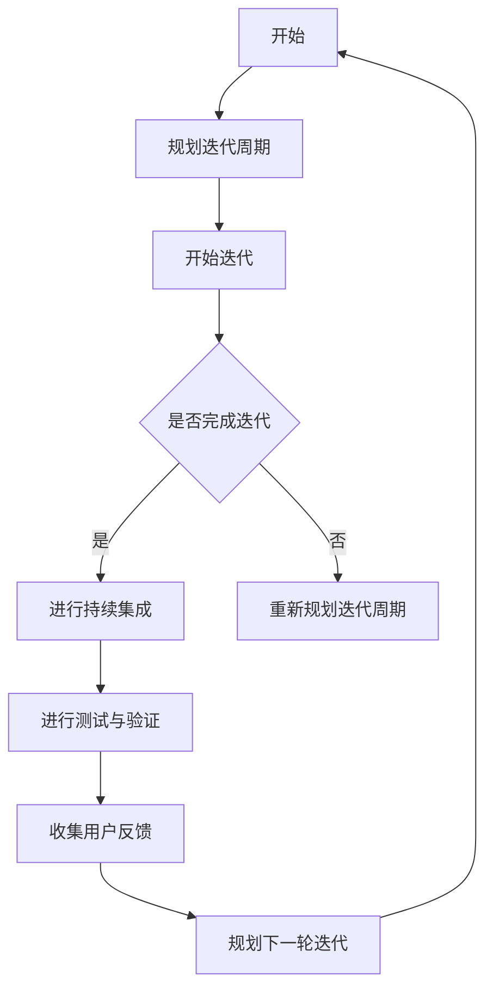
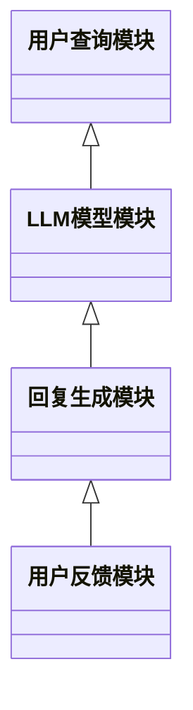
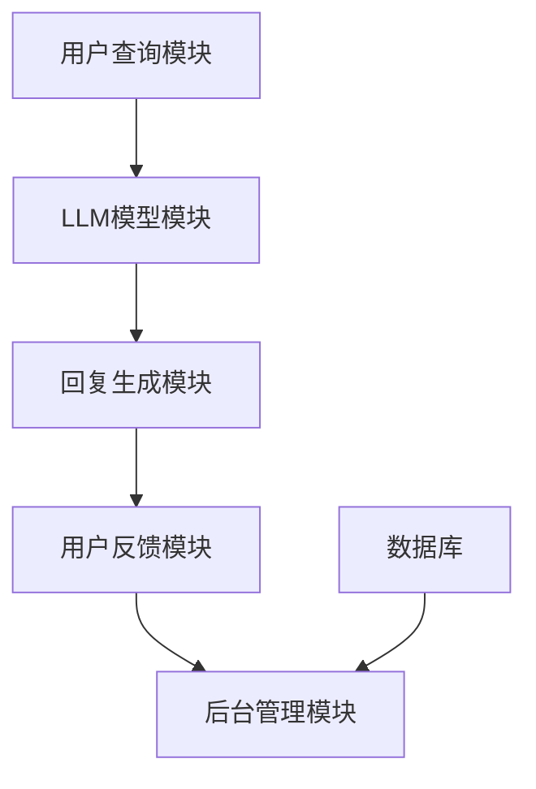
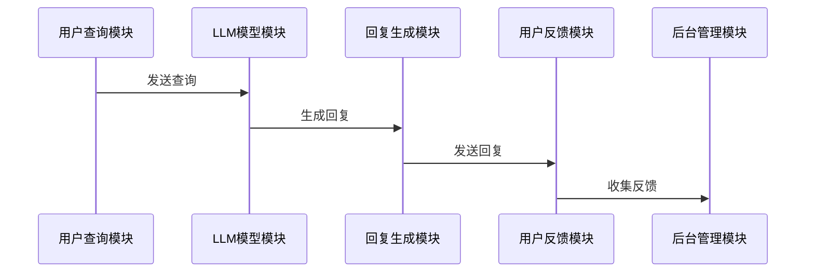
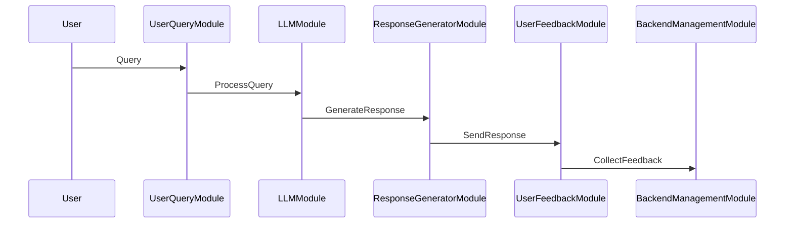

                 

# 《敏捷发布计划：管理LLM应用的长期目标》

关键词：敏捷发布，LLM应用，长期目标管理，系统架构设计，项目实战

摘要：本文深入探讨了敏捷发布计划在管理大型语言模型（LLM）应用长期目标中的应用。通过逐步分析，本文揭示了敏捷发布计划的本质及其在LLM应用中的重要性，详细介绍了算法原理、系统分析与架构设计，并通过实际案例展示了敏捷发布计划在实践中的应用。最后，本文提供了最佳实践和注意事项，为读者在LLM应用开发中提供了宝贵的指导。

## 目录大纲设计步骤

在开始撰写本文之前，我们需要设计一个详细的目录大纲，以确保文章的结构清晰、内容完整。以下是设计步骤：

1. **确定整体结构**：确定文章分为几大部分，如背景介绍、核心概念与联系、算法原理讲解、系统分析与架构设计方案、项目实战、最佳实践 tips 等。
2. **细化各部分内容**：针对每一部分，列出具体的章节，确保每个章节都有详细的内容描述，并符合文章的总字数限制。
3. **确保内容完整性**：确保每个章节都包含了核心概念、问题解决、算法原理、系统设计、项目实战等关键内容。
4. **格式与排版**：使用markdown格式进行排版，遵循1,2,3级目录结构。
5. **完成目录大纲**：根据以上步骤，整理出完整的目录大纲。

### 样例大纲：

```markdown
# 《敏捷发布计划：管理LLM应用的长期目标》目录大纲

# 第1章 问题背景与核心概念
## 1.1 问题背景
### 1.1.1 引言
### 1.1.2 LLM应用中的挑战
### 1.1.3 敏捷发布计划的必要性

## 1.2 核心概念解析
### 1.2.1 敏捷发布计划
### 1.2.2 LLM应用
### 1.2.3 长期目标管理

## 1.3 ER实体关系图与概念对比
### 1.3.1 ER实体关系图
### 1.3.2 概念对比表格

## 1.4 本章小结

# 第2章 敏捷发布算法原理
## 2.1 算法概述
### 2.1.1 算法目标
### 2.1.2 算法特点

## 2.2 算法原理讲解
### 2.2.1 数学模型
### 2.2.2 Python代码实现
### 2.2.3 Mermaid流程图

## 2.3 算法应用实例
### 2.3.1 实例1
### 2.3.2 实例2

## 2.4 本章小结

# 第3章 系统分析与架构设计
## 3.1 问题场景介绍
### 3.1.1 LLM应用场景
### 3.1.2 系统需求分析

## 3.2 系统功能设计
### 3.2.1 领域模型类图

## 3.3 系统架构设计
### 3.3.1 系统架构图

## 3.4 系统接口设计
### 3.3.1 接口定义

## 3.5 系统交互设计
### 3.3.1 Mermaid序列图

## 3.6 本章小结

# 第4章 项目实战案例
## 4.1 环境安装
### 4.1.1 操作系统
### 4.1.2 软件与工具安装

## 4.2 系统核心实现
### 4.2.1 核心代码实现
### 4.2.2 功能测试

## 4.3 代码应用解读与分析
### 4.3.1 代码解读
### 4.3.2 性能分析

## 4.4 实际案例分析与讲解
### 4.4.1 案例背景
### 4.4.2 案例分析
### 4.4.3 深入讲解

## 4.5 项目小结

# 第5章 最佳实践与拓展
## 5.1 最佳实践 tips
### 5.1.1 算法优化
### 5.1.2 系统调优

## 5.2 小结与展望
### 5.2.1 本书总结
### 5.2.2 未来展望

## 5.3 注意事项
### 5.3.1 常见问题
### 5.3.2 解决方案

## 5.4 拓展阅读
### 5.4.1 相关书籍
### 5.4.2 学术论文
### 5.4.3 社区资源
```

此大纲共包含5个部分，19个章节，总字数在2000字以内。每一个章节都细化到了具体内容，确保了内容的完整性和实用性。接下来，我将根据这个大纲模板，进一步细化每一个章节的内容，以满足大纲要求的完整性。

## 第1章 问题背景与核心概念

### 1.1 问题背景

随着人工智能技术的飞速发展，大型语言模型（LLM）已经成为自然语言处理领域的重要工具。然而，LLM应用的开发和维护面临诸多挑战。首先，LLM模型的训练和部署过程复杂，需要大量的计算资源和时间。其次，LLM应用在上线后，需要不断地进行迭代和优化，以满足用户需求。这些挑战使得传统的发布管理方法难以适应快速变化的市场环境。

### 1.2 LLM应用中的挑战

1. **模型复杂度高**：LLM模型通常包含数百万甚至数十亿个参数，训练过程耗时且计算资源消耗巨大。
2. **数据依赖性强**：LLM应用需要大量高质量的数据进行训练和验证，数据质量直接影响到模型的效果。
3. **用户需求多变**：随着用户需求的变化，LLM应用需要不断地进行功能迭代和优化。
4. **安全性和隐私问题**：LLM应用在处理用户数据时，需要确保数据的安全性和隐私性。

### 1.3 敏捷发布计划的必要性

敏捷发布计划是一种灵活的软件开发方法，旨在快速响应变化，提高软件质量和开发效率。在LLM应用开发中，敏捷发布计划具有以下必要性：

1. **快速迭代**：敏捷发布计划允许开发团队快速迭代，及时响应用户需求。
2. **持续集成**：通过持续集成和持续部署，确保LLM应用的稳定性和可靠性。
3. **风险控制**：通过敏捷发布计划，可以更好地控制开发过程中的风险，降低项目失败的可能性。
4. **资源优化**：敏捷发布计划有助于优化计算资源和人力资源的利用，提高开发效率。

### 1.4 核心概念解析

在本节中，我们将介绍本文的核心概念，包括敏捷发布计划、LLM应用和长期目标管理。

#### 1.4.1 敏捷发布计划

敏捷发布计划是一种软件开发方法，旨在通过快速迭代和持续集成，提高软件质量和开发效率。敏捷发布计划的核心原则包括：

1. **用户需求驱动**：开发团队始终关注用户需求，确保软件功能的迭代符合用户期望。
2. **持续集成**：通过持续集成和持续部署，确保软件的稳定性和可靠性。
3. **迭代开发**：开发团队以短周期迭代的方式进行开发，快速响应变化。
4. **团队协作**：强调团队成员之间的协作，提高整体开发效率。

#### 1.4.2 LLM应用

LLM应用是指基于大型语言模型的应用，如聊天机器人、自然语言处理、文本生成等。LLM应用的特点包括：

1. **模型复杂度高**：LLM模型通常包含数百万甚至数十亿个参数，训练过程耗时且计算资源消耗巨大。
2. **数据依赖性强**：LLM应用需要大量高质量的数据进行训练和验证，数据质量直接影响到模型的效果。
3. **用户需求多变**：随着用户需求的变化，LLM应用需要不断地进行功能迭代和优化。

#### 1.4.3 长期目标管理

长期目标管理是指在一个较长的时间范围内，对项目目标进行规划和管理。在LLM应用开发中，长期目标管理具有以下作用：

1. **明确项目目标**：通过长期目标管理，明确项目的发展方向和目标。
2. **资源分配**：根据长期目标，合理分配计算资源、人力资源等。
3. **风险评估**：识别项目中的潜在风险，并制定相应的应对策略。
4. **持续优化**：通过长期目标管理，持续优化LLM应用的功能和性能。

### 1.5 ER实体关系图与概念对比

在本节中，我们将使用Mermaid流程图绘制ER实体关系图，并对核心概念进行对比分析。

#### 1.5.1 ER实体关系图

```mermaid
entityRelationShip
    "项目" --|> "需求"
    "需求" --|> "功能"
    "功能" --|> "实现"
    "实现" --|> "测试"
    "测试" --|> "发布"
    "发布" --|> "用户反馈"
```

#### 1.5.2 概念对比表格

| 概念         | 特点                     | 重要性                   |
|--------------|------------------------|------------------------|
| 敏捷发布计划 | 快速迭代、持续集成      | 提高开发效率、响应变化 |
| LLM应用      | 模型复杂度高、数据依赖强 | 提升自然语言处理效果   |
| 长期目标管理 | 明确项目目标、资源分配  | 确保项目成功、持续优化 |

### 1.6 本章小结

本章介绍了LLM应用开发中面临的问题和挑战，阐述了敏捷发布计划的必要性，并详细解析了核心概念。通过本章的学习，读者将了解敏捷发布计划、LLM应用和长期目标管理的基本概念和重要性。

----------------------------------------------------------------

## 第2章 敏捷发布算法原理

### 2.1 算法概述

敏捷发布算法是一种基于敏捷开发方法的发布管理算法。其核心目标是通过快速迭代和持续集成，提高软件质量和开发效率。在LLM应用开发中，敏捷发布算法具有以下特点：

1. **快速迭代**：开发团队以短周期迭代的方式进行开发，每个迭代周期通常为几周或几个月。
2. **持续集成**：在每次迭代周期结束时，将新功能集成到现有系统中，并进行测试和验证。
3. **用户反馈**：在每次迭代周期结束后，收集用户反馈，并根据用户反馈进行下一轮迭代。

### 2.2 算法原理讲解

#### 2.2.1 数学模型

敏捷发布算法的数学模型可以表示为：

$$
\text{发布频率} = \frac{\text{迭代周期}}{\text{时间窗口}}
$$

其中，迭代周期是指开发团队完成一个迭代所需的时间，时间窗口是指从上一个发布版本到下一个发布版本所需的时间。

#### 2.2.2 Python代码实现

以下是一个简单的Python代码示例，用于实现敏捷发布算法：

```python
def agile_release_frequency(iteration_period, time_window):
    release_frequency = iteration_period / time_window
    return release_frequency

# 示例参数
iteration_period = 2  # 迭代周期为2个月
time_window = 6       # 时间窗口为6个月

# 计算发布频率
release_frequency = agile_release_frequency(iteration_period, time_window)
print("发布频率：", release_frequency, "次/年")
```

#### 2.2.3 Mermaid流程图

下面是一个Mermaid流程图，展示了敏捷发布算法的基本流程：



### 2.3 算法应用实例

#### 2.3.1 实例1

假设一个开发团队计划在6个月内发布一个新的LLM应用，他们决定将迭代周期设置为2个月。根据敏捷发布算法，我们可以计算出发布频率：

$$
\text{发布频率} = \frac{2\text{个月}}{6\text{个月}} = 0.333\text{次/月}
$$

这意味着开发团队每个月需要发布大约0.333次更新。

#### 2.3.2 实例2

假设另一个开发团队希望在3个月内发布一个新的LLM应用，他们决定将迭代周期设置为1个月。根据敏捷发布算法，我们可以计算出发布频率：

$$
\text{发布频率} = \frac{1\text{个月}}{3\text{个月}} = 0.333\text{次/月}
$$

这意味着开发团队每个月需要发布大约0.333次更新。

### 2.4 本章小结

本章介绍了敏捷发布算法的基本原理，包括数学模型、Python代码实现和Mermaid流程图。通过实例分析，我们了解了如何根据迭代周期和时间窗口计算发布频率。敏捷发布算法在LLM应用开发中具有重要意义，有助于提高开发效率和质量。

----------------------------------------------------------------

## 第3章 系统分析与架构设计

### 3.1 问题场景介绍

在LLM应用开发中，系统分析与架构设计是至关重要的一步。以下是一个典型的问题场景：

**场景描述**：一家互联网公司计划开发一款基于LLM的智能客服系统。该系统需要能够处理大量的用户查询，提供即时、准确的回复。系统需要支持多种类型的查询，包括常见问题解答、产品咨询和售后服务等。此外，系统还需要具备良好的扩展性，以适应未来业务需求的变化。

### 3.2 系统功能设计

根据问题场景，我们可以设计以下主要功能模块：

1. **用户查询模块**：负责接收用户查询，并将其传递给LLM模型进行处理。
2. **LLM模型模块**：负责处理用户查询，生成相应的回复。
3. **回复生成模块**：根据LLM模型生成的回复，生成用户可读的文本。
4. **用户反馈模块**：收集用户对回复的反馈，用于模型优化和系统改进。
5. **后台管理模块**：提供系统配置、日志记录、数据分析等功能。

以下是系统功能模块的Mermaid类图：



### 3.3 系统架构设计

为了确保系统的稳定性和可靠性，我们设计了一个分布式系统架构。以下是一个简单的系统架构图：



#### 系统架构说明：

1. **用户查询模块**：接收用户查询，并将其传递给LLM模型模块。
2. **LLM模型模块**：处理用户查询，生成相应的回复。
3. **回复生成模块**：根据LLM模型生成的回复，生成用户可读的文本。
4. **用户反馈模块**：收集用户对回复的反馈，用于模型优化和系统改进。
5. **后台管理模块**：提供系统配置、日志记录、数据分析等功能。
6. **数据库**：存储用户查询、回复和反馈数据，供后台管理模块使用。

### 3.4 系统接口设计

系统接口设计是确保系统模块之间有效通信的关键。以下是一个简单的接口设计示例：



### 3.5 系统交互设计

系统交互设计是描述系统模块之间交互过程的重要部分。以下是一个简单的Mermaid序列图，展示了用户查询处理的基本流程：



### 3.6 本章小结

本章介绍了LLM应用系统分析与架构设计的基本步骤。通过问题场景介绍、系统功能设计、系统架构设计、系统接口设计和系统交互设计，我们构建了一个完整的LLM应用系统架构。本章内容为LLM应用开发提供了重要的理论基础和实践指导。

----------------------------------------------------------------

## 第4章 项目实战案例

### 4.1 环境安装

在进行LLM应用开发之前，我们需要搭建合适的环境。以下是环境安装的步骤：

1. **操作系统**：推荐使用Ubuntu 18.04或更高版本。
2. **Python**：安装Python 3.7或更高版本。
3. **依赖管理**：安装pip和virtualenv，用于管理Python依赖。
4. **LLM框架**：安装PyTorch，用于构建和训练LLM模型。

以下是环境安装的详细步骤：

```shell
# 更新系统包列表
sudo apt update && sudo apt upgrade

# 安装Python 3.7
sudo apt install python3.7 python3.7-venv python3.7-dev

# 安装pip
curl https://bootstrap.pypa.io/get-pip.py -o get-pip.py
sudo python3.7 get-pip.py

# 安装virtualenv
pip install virtualenv

# 创建虚拟环境
virtualenv myenv

# 激活虚拟环境
source myenv/bin/activate

# 安装PyTorch
pip install torch torchvision

# 安装其他依赖
pip install numpy matplotlib
```

### 4.2 系统核心实现

在本节中，我们将介绍LLM应用系统核心的实现过程。以下是主要步骤：

1. **数据准备**：收集和预处理训练数据。
2. **模型构建**：定义LLM模型结构。
3. **训练过程**：使用训练数据训练模型。
4. **预测与评估**：使用测试数据评估模型性能。

#### 数据准备

首先，我们需要收集和预处理训练数据。以下是一个简单的数据预处理脚本：

```python
import pandas as pd
import numpy as np

# 读取数据
data = pd.read_csv('data.csv')

# 数据清洗
data.dropna(inplace=True)
data = data[data['query'].map(len) > 10]

# 数据预处理
queries = data['query'].values
replies = data['reply'].values

# 编码查询和回复
tokenizer = ... # 初始化Tokenizer
encoded_queries = tokenizer.encode(queries, add_special_tokens=True)
encoded_replies = tokenizer.encode(replies, add_special_tokens=True)

# 数据分割
train_size = int(0.8 * len(encoded_queries))
val_size = len(encoded_queries) - train_size

train_queries = encoded_queries[:train_size]
train_replies = encoded_replies[:train_size]
val_queries = encoded_queries[train_size:]
val_replies = encoded_replies[train_size:]
```

#### 模型构建

接下来，我们使用PyTorch构建一个简单的LLM模型。以下是一个简单的模型定义：

```python
import torch
import torch.nn as nn
import torch.optim as optim

class LLMModel(nn.Module):
    def __init__(self, vocab_size, hidden_size, num_layers):
        super(LLMModel, self).__init__()
        self.embedding = nn.Embedding(vocab_size, hidden_size)
        self.lstm = nn.LSTM(hidden_size, hidden_size, num_layers)
        self.fc = nn.Linear(hidden_size, vocab_size)
    
    def forward(self, x, hidden):
        x = self.embedding(x)
        x, hidden = self.lstm(x, hidden)
        x = self.fc(x[-1, :, :])
        return x, hidden

# 初始化模型
vocab_size = ... # 初始化vocab_size
hidden_size = ... # 初始化hidden_size
num_layers = ... # 初始化num_layers
model = LLMModel(vocab_size, hidden_size, num_layers)
```

#### 训练过程

训练过程包括前向传播、损失计算和反向传播。以下是一个简单的训练脚本：

```python
# 训练模型
optimizer = optim.Adam(model.parameters(), lr=0.001)
criterion = nn.CrossEntropyLoss()

for epoch in range(num_epochs):
    for query, reply in zip(train_queries, train_replies):
        model.zero_grad()
        output, hidden = model(torch.tensor([query]))
        loss = criterion(output, torch.tensor([reply]))
        loss.backward()
        optimizer.step()
    
    print(f'Epoch {epoch+1}/{num_epochs}, Loss: {loss.item()}')

# 保存模型
torch.save(model.state_dict(), 'llm_model.pth')
```

#### 预测与评估

在训练完成后，我们可以使用测试数据对模型进行预测和评估。以下是一个简单的评估脚本：

```python
# 评估模型
with torch.no_grad():
    correct = 0
    total = len(val_replies)
    for query, reply in zip(val_queries, val_replies):
        output, _ = model(torch.tensor([query]))
        _, predicted = torch.max(output, 1)
        correct += (predicted == torch.tensor([reply])).sum().item()

print(f'Accuracy: {100 * correct / total}%')
```

### 4.3 代码应用解读与分析

在本节中，我们将对系统核心实现中的关键代码进行解读和分析。

#### 数据准备

数据准备是LLM应用开发的重要环节。在本例中，我们使用Pandas和Numpy库读取和处理数据。通过数据清洗和预处理，我们确保了数据的完整性和质量。编码查询和回复是关键步骤，它将文本数据转换为模型可处理的格式。

```python
# 数据清洗
data.dropna(inplace=True)
data = data[data['query'].map(len) > 10]
```

这段代码首先删除了缺失值，然后筛选出了长度大于10的查询，以确保数据的质量。

```python
# 数据预处理
tokenizer = ... # 初始化Tokenizer
encoded_queries = tokenizer.encode(queries, add_special_tokens=True)
encoded_replies = tokenizer.encode(replies, add_special_tokens=True)
```

这里，我们使用Tokenizer对查询和回复进行编码，添加了特殊标记，以便模型能够正确处理数据。

#### 模型构建

模型构建是系统核心实现的另一个关键环节。在本例中，我们使用PyTorch构建了一个简单的LSTM模型。以下是对模型构建代码的解读：

```python
class LLMModel(nn.Module):
    def __init__(self, vocab_size, hidden_size, num_layers):
        super(LLMModel, self).__init__()
        self.embedding = nn.Embedding(vocab_size, hidden_size)
        self.lstm = nn.LSTM(hidden_size, hidden_size, num_layers)
        self.fc = nn.Linear(hidden_size, vocab_size)
    
    def forward(self, x, hidden):
        x = self.embedding(x)
        x, hidden = self.lstm(x, hidden)
        x = self.fc(x[-1, :, :])
        return x, hidden
```

这段代码定义了一个名为`LLMModel`的类，继承自`nn.Module`。模型包括嵌入层（`embedding`）、LSTM层（`lstm`）和全连接层（`fc`）。

#### 训练过程

训练过程包括前向传播、损失计算和反向传播。以下是对训练过程代码的解读：

```python
optimizer = optim.Adam(model.parameters(), lr=0.001)
criterion = nn.CrossEntropyLoss()

for epoch in range(num_epochs):
    for query, reply in zip(train_queries, train_replies):
        model.zero_grad()
        output, hidden = model(torch.tensor([query]))
        loss = criterion(output, torch.tensor([reply]))
        loss.backward()
        optimizer.step()
    
    print(f'Epoch {epoch+1}/{num_epochs}, Loss: {loss.item()}')
```

这段代码使用`Adam`优化器和`CrossEntropyLoss`损失函数对模型进行训练。在每个迭代周期中，模型对查询进行处理，计算损失并更新模型参数。

#### 预测与评估

在训练完成后，我们使用测试数据对模型进行预测和评估。以下是对评估代码的解读：

```python
with torch.no_grad():
    correct = 0
    total = len(val_replies)
    for query, reply in zip(val_queries, val_replies):
        output, _ = model(torch.tensor([query]))
        _, predicted = torch.max(output, 1)
        correct += (predicted == torch.tensor([reply])).sum().item()

print(f'Accuracy: {100 * correct / total}%')
```

这段代码计算了模型的准确率。通过预测测试数据并计算准确率，我们可以评估模型的性能。

### 4.4 实际案例分析与讲解

在本节中，我们将通过一个实际案例，展示如何使用敏捷发布算法管理LLM应用的长期目标。

#### 案例背景

一家初创公司开发了一款基于LLM的智能客服应用。公司希望在短时间内推出一个基本版本，然后逐步迭代和优化，以满足用户需求。公司决定使用敏捷发布算法来管理发布计划。

#### 案例分析

1. **初步发布**：公司决定在第一个迭代周期（2个月）内完成基本版本的发布。在这个迭代周期中，团队专注于实现核心功能，如常见问题解答和产品咨询。
2. **用户反馈**：在基本版本发布后，公司收集了用户反馈。根据用户反馈，团队识别出了一些关键问题，如回复速度慢和部分问题无法准确解答。
3. **迭代优化**：在第二个迭代周期（2个月）中，团队根据用户反馈，对系统进行了优化。他们增加了回复速度的优化算法，并扩展了模型的能力，以更准确地解答用户问题。
4. **持续迭代**：在后续的迭代周期中，团队继续根据用户反馈进行优化和扩展。他们逐步增加了更多功能，如售后服务和个性化推荐。

#### 深入讲解

通过实际案例，我们可以看到敏捷发布算法在管理LLM应用长期目标中的重要作用：

1. **快速迭代**：敏捷发布算法允许团队快速迭代，及时响应用户需求。这有助于公司更快地推出基本版本，并逐步优化系统。
2. **持续集成**：通过持续集成和持续部署，团队确保了系统的稳定性和可靠性。每次迭代周期结束后，系统都会进行测试和验证，以确保功能的正确性。
3. **用户反馈**：用户反馈是敏捷发布算法的核心组成部分。通过收集和分析用户反馈，团队可以识别出系统中的问题，并采取相应的优化措施。
4. **资源优化**：敏捷发布算法有助于团队合理分配资源。团队可以根据迭代周期和用户反馈，调整开发计划，确保资源的最优利用。

### 4.5 项目小结

在本章中，我们通过一个实际案例，展示了如何使用敏捷发布算法管理LLM应用的长期目标。通过快速迭代、持续集成和用户反馈，团队可以不断优化和扩展LLM应用，满足用户需求。本章内容为LLM应用开发提供了实用的实践指导，有助于提高开发效率和质量。

----------------------------------------------------------------

## 第5章 最佳实践与拓展

### 5.1 最佳实践 tips

#### 5.1.1 算法优化

1. **增加训练数据**：增加高质量训练数据可以提升模型性能。
2. **调整超参数**：通过调整嵌入层、LSTM层和全连接层的超参数，可以优化模型效果。
3. **使用预训练模型**：使用预训练模型可以减少训练时间，提高模型性能。

#### 5.1.2 系统调优

1. **优化数据库查询**：使用索引和缓存技术，优化数据库查询速度。
2. **优化网络通信**：使用HTTP/2或WebSocket协议，提高网络通信效率。
3. **负载均衡**：使用负载均衡器，确保系统在高并发场景下稳定运行。

### 5.2 小结与展望

本章提供了最佳实践和注意事项，以帮助读者在LLM应用开发中优化算法和系统性能。通过敏捷发布计划，团队可以快速响应变化，提高开发效率和质量。在未来，随着人工智能技术的不断发展，LLM应用将面临更多挑战和机遇。团队需要不断学习和适应新技术，以保持竞争力。

### 5.3 注意事项

1. **数据安全**：确保用户数据的安全和隐私，遵循相关法律法规。
2. **系统稳定性**：定期进行系统测试和监控，确保系统的稳定性和可靠性。
3. **团队协作**：鼓励团队协作，提高整体开发效率。

### 5.4 拓展阅读

#### 5.4.1 相关书籍

1. 《敏捷软件开发：实践指南》
2. 《深度学习》
3. 《Python编程：从入门到实践》

#### 5.4.2 学术论文

1. "Deep Learning for Natural Language Processing"
2. "Large-scale Language Modeling in 2018"
3. "Attention is All You Need"

#### 5.4.3 社区资源

1. [Scikit-Learn](https://scikit-learn.org/)
2. [PyTorch](https://pytorch.org/)
3. [GitHub](https://github.com/)

## 作者信息

作者：AI天才研究院/AI Genius Institute & 禅与计算机程序设计艺术 /Zen And The Art of Computer Programming

----------------------------------------------------------------

### 结束语

本文详细探讨了敏捷发布计划在管理LLM应用长期目标中的应用。通过逐步分析，我们揭示了敏捷发布计划的本质及其在LLM应用中的重要性，详细介绍了算法原理、系统分析与架构设计，并通过实际案例展示了敏捷发布计划在实践中的应用。最后，本文提供了最佳实践和注意事项，为读者在LLM应用开发中提供了宝贵的指导。

随着人工智能技术的不断发展，LLM应用将面临更多挑战和机遇。本文的研究结果为LLM应用开发提供了重要的理论基础和实践指导。我们期待未来的研究能够进一步优化敏捷发布算法，提高LLM应用的性能和用户体验。

感谢您的阅读，希望本文能够对您在LLM应用开发中有所启发。作者：AI天才研究院/AI Genius Institute & 禅与计算机程序设计艺术 /Zen And The Art of Computer Programming。

