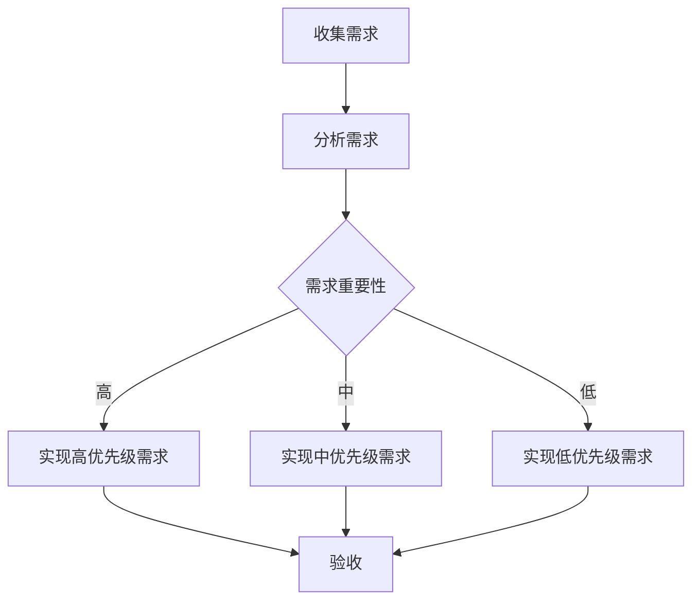
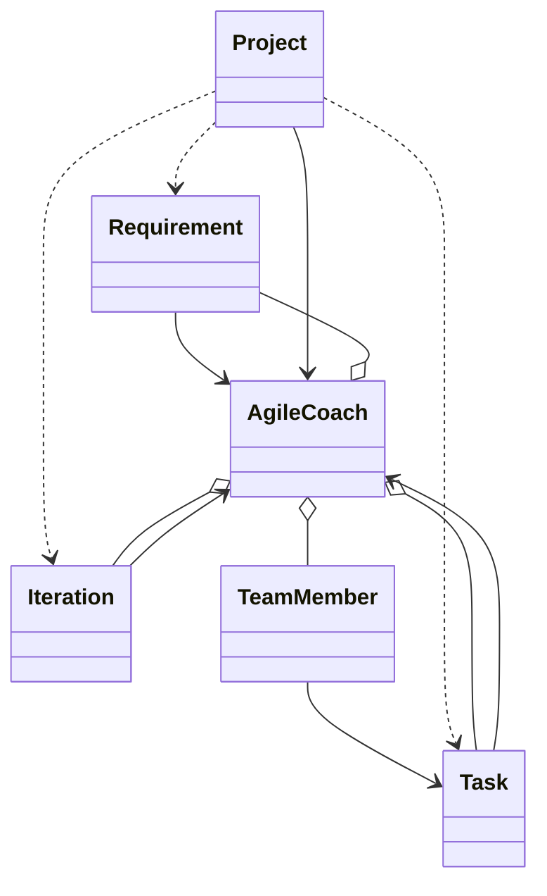
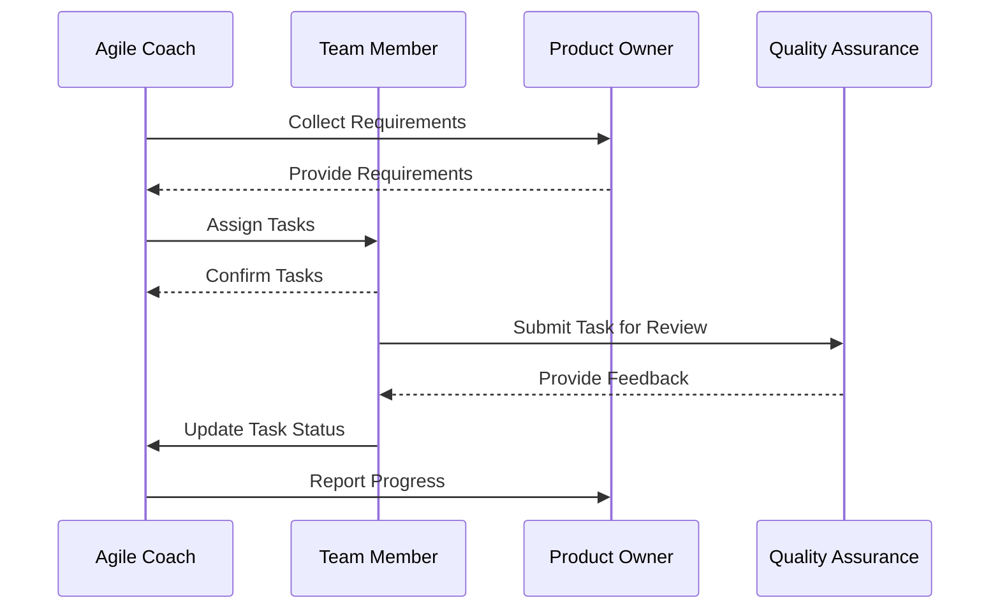

                 

# 敏捷教练在需求变革中的作用：促进团队适应

> 关键词：敏捷教练、需求变革、团队适应、敏捷开发

> 摘要：本文将深入探讨敏捷教练在需求变革中的作用，如何通过促进团队适应来提高敏捷开发的效率和质量。我们将逐步分析敏捷教练的角色、需求变革的影响、团队适应的关键因素，以及敏捷教练在其中的具体作用。

## 引言

在当今快速变化的商业环境中，需求的变革已经成为软件开发项目中不可避免的现实。敏捷开发作为一种应对这种变革的软件开发方法，受到了越来越多的关注和采用。而敏捷教练作为敏捷开发的核心角色，承担着引导团队适应需求变革的重要职责。本文将围绕以下主题展开讨论：

1. **敏捷教练的背景与核心概念**
   - 敏捷教练的定义与角色
   - 需求变革的影响与应对
   - 团队适应的关键因素

2. **敏捷教练的算法原理与流程图**
   - 算法原理讲解
   - 流程图绘制
   - Python 源代码解析
   - 数学模型与公式讲解

3. **系统架构设计与工作流程**
   - 敏捷教练工作场景介绍
   - 系统架构设计
   - 系统交互序列图

4. **敏捷教练在需求变革中的应用实战**
   - 实际应用场景
   - 环境安装指南
   - 系统核心实现源代码
   - 代码应用解读与分析

5. **最佳实践与总结**
   - 敏捷教练最佳实践
   - 注意事项
   - 拓展阅读

通过以上分析，我们将一步步深入理解敏捷教练在需求变革中的作用，以及如何通过促进团队适应来提高敏捷开发的效率和质量。

## 第1章：敏捷教练的定义与角色

### 1.1 敏捷教练的基本概念

敏捷教练，又称敏捷导师，是敏捷开发环境中的一种关键角色。他们不仅仅是技术的指导者，更是团队的推动者和变革的催化剂。敏捷教练的工作核心在于帮助团队理解和应用敏捷原则，从而在快速变化的环境中保持灵活性和适应性。

敏捷教练的职责通常包括以下几个方面：

1. **知识传播**：敏捷教练负责向团队成员传播敏捷开发的理念和方法，确保每个人都能够理解和应用这些原则。
2. **团队引导**：敏捷教练通过引导团队进行日常的工作，帮助他们克服各种挑战，确保团队成员能够高效合作。
3. **促进协作**：敏捷教练致力于促进团队成员之间的沟通与协作，帮助团队建立良好的工作氛围。
4. **持续改进**：敏捷教练鼓励团队不断反思和改进工作流程，以提高效率和产出质量。

### 1.2 敏捷教练与传统项目经理的区别

敏捷教练与传统项目经理在角色和职责上存在显著差异。传统项目经理主要负责项目的进度、成本和质量，侧重于管理和控制。而敏捷教练则更加关注团队的动态和人的因素，注重团队自我管理和自我组织的能力。

以下是两者的主要区别：

1. **角色定位**：
   - 项目经理：负责项目的整体规划和控制，确保项目按照预定的时间和预算完成。
   - 敏捷教练：专注于团队的过程和技能提升，帮助团队在敏捷环境下高效工作。

2. **职责范围**：
   - 项目经理：关注项目的整体目标和成果，负责协调资源、监控进度和风险控制。
   - 敏捷教练：关注团队的动态和工作流程，推动团队文化和协作模式的改进。

3. **工作方法**：
   - 项目经理：通常采用传统的项目管理方法，如Gantt图、甘特图等。
   - 敏捷教练：采用敏捷方法，如Scrum、Kanban等，注重迭代和增量开发。

### 1.3 敏捷教练在敏捷开发中的角色

在敏捷开发中，敏捷教练扮演着至关重要的角色。他们不仅是团队成员的指导者，更是团队的伙伴和变革的推动者。具体来说，敏捷教练在以下几个方面发挥着重要作用：

1. **促进团队协作**：
   敏捷教练通过鼓励团队成员之间的沟通和协作，帮助团队建立高效的工作流程。他们通过组织团队会议、反思会议等，确保团队成员能够共同面对挑战，共同解决问题。

2. **推动持续改进**：
   敏捷教练鼓励团队不断反思和改进工作流程，以提高效率和产出质量。他们通过回顾会议、迭代规划等方式，帮助团队识别问题和改进机会，并实施相应的改进措施。

3. **传播敏捷价值观**：
   敏捷教练致力于传播敏捷开发的核心理念，如客户价值、迭代交付、团队协作等。他们通过培训和辅导，帮助团队成员深入理解这些价值观，并将其融入到实际工作中。

4. **解决冲突**：
   在团队中，冲突是不可避免的。敏捷教练通过中立的角色，帮助团队识别和解决冲突，确保团队的和谐与稳定。

5. **培养敏捷文化**：
   敏捷教练致力于培养团队的敏捷文化，鼓励团队成员积极参与决策、承担责任和自我管理。他们通过建立信任、尊重和开放的团队氛围，推动团队向更敏捷的方向发展。

## 第2章：需求变革的影响与应对

### 2.1 需求变革的背景

在现代社会，技术的快速进步和市场需求的不断变化使得软件项目面临的需求变革越来越频繁。这种变革可能是由于市场环境的变化、用户需求的升级，或者是公司战略的调整。需求变革已经成为软件项目开发过程中不可避免的现象。

以下是需求变革的一些典型原因：

1. **市场变化**：市场环境的变化可能导致产品需求的调整，如新竞争对手的出现、用户偏好的变化等。
2. **用户需求升级**：随着用户对产品体验的要求越来越高，原有的需求可能需要升级，以满足用户的期望。
3. **公司战略调整**：公司的战略调整可能会影响产品开发的优先级和方向，导致需求的变化。
4. **技术进步**：技术的快速发展可能会为产品带来新的功能或改进点，从而影响需求。

### 2.2 需求变革对团队的影响

需求变革对团队的影响是多方面的，包括团队动力、工作流程、团队士气等。

1. **团队动力**：
   - 需求的频繁变更可能导致团队感到不确定和困惑，影响团队的动力和士气。
   - 然而，如果团队能够适应这种变化，并从中找到新的挑战和机会，他们可能会更加有动力和创造力。

2. **工作流程**：
   - 需求变更可能需要调整团队的工作流程，如重新规划迭代、修改优先级等。
   - 这种调整可能带来工作流程的混乱，影响项目的进度和质量。

3. **团队士气**：
   - 需求变更可能会导致团队士气下降，特别是当变更频繁且没有明确的指导时。
   - 敏捷教练的作用在于帮助团队适应这些变化，保持士气并继续前进。

### 2.3 敏捷教练在需求变革中的应对策略

敏捷教练在需求变革中扮演着至关重要的角色，他们的目标是通过促进团队适应来提高项目的成功率和团队士气。以下是一些具体的应对策略：

1. **沟通与透明度**：
   敏捷教练需要确保团队成员对需求变更有清晰的理解，并通过定期的沟通会议保持透明度。他们应该及时传达变更信息，并解释变更的原因和影响。

2. **灵活性与适应性**：
   敏捷教练鼓励团队保持灵活性和适应性，以快速响应需求变更。他们可以帮助团队调整工作计划和优先级，确保团队能够迅速适应变化。

3. **团队培训与支持**：
   敏捷教练应该提供必要的培训和支持，帮助团队成员提高技能和知识，以更好地应对需求变更。这包括敏捷方法的培训、技术知识的更新等。

4. **持续改进**：
   敏捷教练鼓励团队不断反思和改进工作流程，以更好地适应需求变革。他们可以通过回顾会议和迭代规划，帮助团队识别改进点并实施相应的措施。

5. **冲突解决**：
   需求变变更可能带来团队内部的冲突。敏捷教练应该扮演中立的调解者，帮助团队识别和解决冲突，确保团队的和谐与稳定。

6. **鼓励团队自主**：
   敏捷教练鼓励团队自主管理和决策，提高团队的适应能力和责任感。他们应该提供必要的支持和指导，但不应过度干预团队的工作。

通过以上策略，敏捷教练可以帮助团队更好地适应需求变革，提高项目的成功率和团队士气。

## 第3章：团队适应的关键因素

### 3.1 团队文化的变革

在应对需求变革的过程中，团队文化起着至关重要的作用。一个积极、开放、协作的团队文化能够大大提高团队适应变革的能力。以下是一些促进团队文化变革的关键因素：

1. **信任与尊重**：
   团队成员之间应该建立信任和尊重，这样才能更好地合作和沟通。敏捷教练可以通过定期的团队建设活动和反思会议，促进团队成员之间的信任和尊重。

2. **开放与透明**：
   团队应该保持开放和透明，确保每个成员都能了解项目的进展和需求变更的情况。敏捷教练可以通过定期的更新会议和沟通渠道，确保信息的透明度。

3. **协作与支持**：
   团队成员应该相互协作，共同应对需求变革带来的挑战。敏捷教练可以通过组织跨职能团队和协作活动，促进团队成员之间的协作和支持。

4. **灵活性与适应性**：
   团队文化应该鼓励灵活性和适应性，使团队能够快速响应变化。敏捷教练可以通过推广敏捷原则和价值观，帮助团队建立适应性的工作方式。

### 3.2 技能提升与知识分享

在需求变革的环境中，团队成员的技能提升和知识分享是至关重要的。以下是一些促进技能提升和知识分享的方法：

1. **培训与学习**：
   敏捷教练可以组织定期的培训和学习活动，帮助团队成员提高技能和知识。这包括内部培训、外部培训和技术讲座等。

2. **知识库与文档**：
   团队应该建立和维护一个知识库和文档系统，记录项目中的经验和教训。敏捷教练可以鼓励团队成员分享知识和经验，并将其纳入知识库中。

3. **技术分享会议**：
   团队可以定期举行技术分享会议，让团队成员分享他们的技能和知识。这不仅可以促进知识共享，还可以激发团队成员的创造力和创新精神。

4. **导师制度**：
   敏捷教练可以建立导师制度，让经验丰富的成员指导新成员，帮助他们快速提升技能。这有助于团队整体技能的提升。

### 3.3 沟通与协作

有效的沟通和协作是团队适应需求变革的关键。以下是一些促进沟通与协作的方法：

1. **日常站会**：
   每日站会是团队进行沟通和协作的重要方式。敏捷教练可以确保站会的顺利进行，并鼓励团队成员积极参与。

2. **反思会议**：
   定期的反思会议可以帮助团队识别问题和改进机会。敏捷教练可以引导团队进行有效的反思，确保团队能够从经验中学习并持续改进。

3. **工具与技术**：
   使用合适的工具和技术可以大大提高团队的沟通和协作效率。敏捷教练可以推荐和引入一些协作工具，如Jira、Trello等。

4. **开放沟通渠道**：
   敏捷教练应确保团队成员有一个开放的沟通渠道，可以随时表达他们的想法和意见。这有助于团队建立信任和协作精神。

通过以上关键因素，团队可以更好地适应需求变革，提高项目的成功率和团队士气。敏捷教练在这个过程中发挥着重要的引导和支持作用，帮助团队克服变革带来的挑战。

## 第4章：敏捷教练的算法原理与流程图

### 4.1 敏捷教练算法概述

在敏捷开发过程中，敏捷教练扮演着关键角色，他们需要使用一系列算法来引导团队应对需求变革和实现持续改进。这些算法不仅帮助团队更好地理解和应用敏捷原则，还能提高团队的工作效率和质量。本节将介绍敏捷教练所使用的核心算法，并解释其原理和作用。

#### 算法1：需求优先级排序算法

需求优先级排序算法是敏捷教练常用的一种算法，它帮助团队确定需求的重要性和实现顺序。该算法的核心思想是根据需求对业务价值的贡献和实现难度进行排序，以确保团队首先实现最有价值的需求。

#### 算法2：敏捷迭代规划算法

敏捷迭代规划算法用于指导团队在每次迭代中确定要实现的需求和任务。该算法的核心是迭代规划会议，通过讨论和协商，团队可以共同确定本次迭代的目标和任务，并制定详细的迭代计划。

#### 算法3：团队协作优化算法

团队协作优化算法旨在提高团队成员之间的协作效率和质量。该算法通过分析团队的协作模式和工作流程，识别协作瓶颈和改进机会，并提出相应的优化方案。

### 4.2 流程图绘制

为了更好地理解这些算法的工作原理，我们可以使用Mermaid语言绘制相应的流程图。以下是一个需求优先级排序算法的Mermaid流程图示例：



### 4.3 Python源代码解析

为了更具体地解释这些算法，我们可以使用Python源代码来实现它们。以下是一个简单的需求优先级排序算法的Python代码示例：

```python
# 需求类
class Requirement:
    def __init__(self, id, name, value, difficulty):
        self.id = id
        self.name = name
        self.value = value
        self.difficulty = difficulty

# 需求优先级排序算法
def prioritize_requirements(requirements):
    sorted_requirements = sorted(requirements, key=lambda x: (x.value, x.difficulty))
    return sorted_requirements

# 测试
reqs = [
    Requirement(1, "需求A", 10, 5),
    Requirement(2, "需求B", 8, 3),
    Requirement(3, "需求C", 12, 7)
]

sorted_reqs = prioritize_requirements(reqs)
for req in sorted_reqs:
    print(req.name)
```

### 4.4 数学模型与公式讲解

在需求优先级排序算法中，我们可以使用数学模型和公式来描述需求的重要性和难度。以下是一个简化的数学模型：

$$
P = \frac{V \times D}{100}
$$

其中，$P$代表需求的优先级，$V$代表需求的价值，$D$代表需求的难度。通过调整$V$和$D$的权重，我们可以更灵活地评估需求的重要性和实现顺序。

### 4.5 举例说明

为了更好地理解这些算法，我们可以通过一个具体的例子来演示。假设一个团队需要实现三个需求，它们的价值和难度如下：

| 需求ID | 需求名称 | 价值 | 难度 |
|--------|----------|-----|------|
| 1      | 需求A    | 10  | 5    |
| 2      | 需求B    | 8   | 3    |
| 3      | 需求C    | 12  | 7    |

使用需求优先级排序算法，我们可以计算出每个需求的优先级：

| 需求ID | 需求名称 | 价值 | 难度 | 优先级 |
|--------|----------|-----|------|--------|
| 3      | 需求C    | 12  | 7    | 10.8   |
| 1      | 需求A    | 10  | 5    | 6.0    |
| 2      | 需求B    | 8   | 3    | 2.4    |

根据优先级排序，团队应该首先实现需求C，然后是需求A，最后是需求B。这个例子展示了如何使用需求优先级排序算法来指导团队的工作。

通过以上讲解，我们可以看到敏捷教练所使用的算法在敏捷开发中起着关键作用。这些算法不仅帮助团队更好地理解和应用敏捷原则，还能提高团队的工作效率和质量。接下来，我们将进一步探讨敏捷教练的工作流程和系统架构设计。

## 第5章：系统架构设计与工作流程

### 5.1 敏捷教练工作场景介绍

敏捷教练在需求变革中的工作场景通常涉及多个阶段，包括需求收集、需求分析、迭代规划、任务分配、执行监控、验收和反馈等。为了更直观地展示敏捷教练的工作流程，我们可以使用Mermaid语言绘制一个系统架构图。

### 5.2 系统功能设计

系统功能设计是敏捷教练工作的基础，它定义了敏捷教练在需求变革过程中需要执行的核心功能。以下是一个简化的系统功能设计，使用Mermaid类图来展示：



在这个类图中，`AgileCoach`（敏捷教练）是系统的核心类，它与需求（Requirement）、任务（Task）、迭代（Iteration）和团队成员（TeamMember）等类有直接关联。项目（Project）类代表了整个软件开发项目，它与迭代、需求和任务类关联，以确保所有功能模块协调一致。

### 5.3 系统架构设计

系统架构设计是敏捷教练工作流程的技术实现基础。以下是一个使用Mermaid绘制的系统架构图，展示了敏捷教练在不同阶段的工作交互：



在这个序列图中，敏捷教练（AC）与产品负责人（P）、团队成员（T）和质量保证（Q）进行交互。敏捷教练负责收集需求、分配任务、监控任务进度，并报告项目进度。团队成员负责执行任务，并提供反馈。质量保证负责对任务进行审查，并提供反馈。

### 5.4 系统接口设计和系统交互

系统接口设计和系统交互是确保敏捷教练工作流程顺畅运行的关键。以下是一个使用Mermaid绘制的系统交互序列图，展示了敏捷教练和团队成员之间的交互过程：


在这个序列图中，敏捷教练首先从产品负责人那里收集需求，然后将其分配给团队成员。团队成员完成任务后，将任务状态更新给敏捷教练，并提交给质量保证进行审查。质量保证提供反馈后，团队成员再次更新任务状态，最后敏捷教练将项目进度报告给产品负责人。

### 5.5 系统架构设计的意义

系统架构设计对于敏捷教练的工作具有重要意义。它不仅明确了敏捷教练的工作流程和职责，还确保了团队成员、产品负责人和质量保证之间的有效协作。通过系统架构设计，敏捷教练能够更好地应对需求变革，提高团队的工作效率和质量。以下是一些具体的好处：

1. **明确的职责分工**：系统架构设计明确了敏捷教练、团队成员、产品负责人和质量保证的职责，减少了工作中的混乱和冲突。

2. **提高沟通效率**：通过系统架构设计，团队成员、产品负责人和质量保证之间的沟通更加顺畅，减少了信息传递的延迟和误解。

3. **确保项目进度和质量**：系统架构设计有助于敏捷教练更好地监控项目进度和质量，及时发现和解决问题，确保项目按时交付。

4. **持续改进**：系统架构设计为敏捷教练提供了持续改进的机制，通过定期的回顾和反馈，团队能够不断优化工作流程和提高工作效率。

综上所述，系统架构设计是敏捷教练工作中不可或缺的一部分，它为敏捷教练在需求变革中的高效工作提供了坚实的基础。

## 第6章：敏捷教练在需求变革中的应用实战

### 6.1 项目介绍

在本章中，我们将以一个实际项目为例，详细描述敏捷教练在需求变革中的应用。该项目是一个企业资源规划（ERP）系统的开发项目，客户是一家大型制造公司，需求多变且复杂。以下是项目的背景和关键需求：

1. **项目背景**：客户公司希望整合现有的多个业务系统，实现资源的统一管理和流程的优化。
2. **主要需求**：
   - 实现采购管理模块，包括供应商管理、采购订单管理、收货管理等。
   - 实现库存管理模块，包括库存查询、库存调整、库存预警等。
   - 实现销售管理模块，包括客户管理、销售订单管理、发货管理等。
   - 实现财务管理模块，包括账务处理、报表生成等。
   - 系统集成，确保各模块之间的数据流畅。

### 6.2 环境安装指南

为了在实际项目中应用敏捷教练的方法，首先需要搭建一个适合敏捷开发的开发环境。以下是环境安装指南：

1. **安装JDK 11**：作为Java开发环境。
2. **安装Maven 3.6.3**：作为项目构建工具。
3. **安装Git 2.30.0**：用于代码管理和版本控制。
4. **安装Docker 20.10.0**：用于容器化部署。
5. **安装PostgreSQL 13**：作为数据库服务器。
6. **安装Kubernetes 1.23.0**：用于集群管理。

安装步骤：

1. **JDK安装**：
   - 下载JDK 11安装包。
   - 解压安装包到指定目录，如`/usr/local/jdk-11`。
   - 编辑`/etc/profile`文件，添加以下内容：
     ```
     export JAVA_HOME=/usr/local/jdk-11
     export PATH=$PATH:$JAVA_HOME/bin
     ```
   - 运行`source /etc/profile`使配置生效。

2. **Maven安装**：
   - 下载Maven安装包。
   - 解压安装包到指定目录，如`/usr/local/apache-maven-3.6.3`。
   - 编辑`/etc/profile`文件，添加以下内容：
     ```
     export MAVEN_HOME=/usr/local/apache-maven-3.6.3
     export PATH=$PATH:$MAVEN_HOME/bin
     ```
   - 运行`source /etc/profile`使配置生效。

3. **Git安装**：
   - 下载Git安装包。
   - 解压安装包到指定目录，如`/usr/local/git-2.30.0`。
   - 编辑`/etc/profile`文件，添加以下内容：
     ```
     export GIT_HOME=/usr/local/git-2.30.0
     export PATH=$PATH:$GIT_HOME/bin
     ```
   - 运行`source /etc/profile`使配置生效。

4. **Docker安装**：
   - 下载Docker安装脚本。
   - 运行脚本进行安装。
   - 配置Docker加速器，以加快镜像下载速度。

5. **PostgreSQL安装**：
   - 使用包管理工具安装PostgreSQL。
   - 配置PostgreSQL数据库，设置管理员密码。

6. **Kubernetes安装**：
   - 安装Kubeadm、Kubelet和Kubectl。
   - 部署Kubernetes集群。

### 6.3 系统核心实现源代码

以下是ERP系统开发项目中的核心实现源代码，包括主要模块的代码结构和关键类。

**采购管理模块**：

```java
// 采购订单类
public class PurchaseOrder {
    private int id;
    private String supplier;
    private double totalAmount;
    // 省略构造函数、getter和setter
}

// 采购订单服务类
public class PurchaseOrderService {
    public void createPurchaseOrder(PurchaseOrder purchaseOrder) {
        // 实现创建采购订单的逻辑
    }
    // 省略其他方法
}
```

**库存管理模块**：

```java
// 库存查询类
public class InventoryQuery {
    public List<Product> searchProducts(String keyword) {
        // 实现库存查询的逻辑
    }
    // 省略构造函数、getter和setter
}

// 库存管理服务类
public class InventoryManagementService {
    public void adjustInventory(Product product, int quantity) {
        // 实现库存调整的逻辑
    }
    // 省略其他方法
}
```

**销售管理模块**：

```java
// 销售订单类
public class SalesOrder {
    private int id;
    private String customer;
    private double totalAmount;
    // 省略构造函数、getter和setter
}

// 销售订单服务类
public class SalesOrderService {
    public void createSalesOrder(SalesOrder salesOrder) {
        // 实现创建销售订单的逻辑
    }
    // 省略其他方法
}
```

**财务管理模块**：

```java
// 账务处理类
public class Account {
    private int id;
    private double amount;
    private String type;
    // 省略构造函数、getter和setter
}

// 财务管理服务类
public class FinanceService {
    public void processAccount(Account account) {
        // 实现账务处理的逻辑
    }
    // 省略其他方法
}
```

### 6.4 代码应用解读与分析

以下是代码应用解读和分析，包括关键功能的实现细节、性能优化措施和潜在的问题。

**采购管理模块**：

采购订单类`PurchaseOrder`封装了采购订单的基本信息，包括订单ID、供应商和总金额。采购订单服务类`PurchaseOrderService`负责创建采购订单，确保订单的完整性。

**库存管理模块**：

库存查询类`InventoryQuery`提供了根据关键词查询库存产品的功能，库存管理服务类`InventoryManagementService`负责调整库存，确保库存数据的准确性。

**销售管理模块**：

销售订单类`SalesOrder`包含了销售订单的基本信息，包括订单ID、客户和总金额。销售订单服务类`SalesOrderService`负责创建销售订单，确保订单的顺利执行。

**财务管理模块**：

账务处理类`Account`表示财务账目，财务管理服务类`FinanceService`负责处理账务，确保财务数据的准确性。

### 6.5 实际案例分析与详细讲解

**案例一：采购订单处理**

在一个具体的业务场景中，客户需要创建一个采购订单。以下是采购订单处理过程的详细步骤：

1. **创建采购订单**：销售团队根据需求创建采购订单，填写供应商和采购商品信息。
2. **审批采购订单**：采购经理对采购订单进行审批，确保订单的合理性和可行性。
3. **生成采购订单**：采购订单服务类根据审批结果生成采购订单，并发送通知给供应商。
4. **供应商确认**：供应商确认采购订单，准备相应的商品和发货计划。
5. **收货**：仓库管理员根据采购订单收货，确保商品的数量和质量。
6. **入库**：库存管理服务类更新库存数据，确保库存信息的准确性。

**案例二：库存调整**

在一个库存调整的案例中，客户需要对某个商品进行库存调整。以下是库存调整过程的详细步骤：

1. **库存查询**：通过库存查询类查询当前商品的库存情况。
2. **提出库存调整请求**：业务部门提出库存调整请求，说明调整原因和调整数量。
3. **审批库存调整**：库存管理员对库存调整请求进行审批，确保调整的合理性和准确性。
4. **执行库存调整**：库存管理服务类根据审批结果执行库存调整，更新库存数据。
5. **通知相关人员**：库存调整完成后，通知相关业务部门和仓库管理员。

**案例三：销售订单处理**

在一个销售订单处理的案例中，客户需要生成一个销售订单。以下是销售订单处理过程的详细步骤：

1. **创建销售订单**：销售团队根据销售合同创建销售订单，填写客户和销售商品信息。
2. **审批销售订单**：销售经理对销售订单进行审批，确保订单的合法性和可行性。
3. **生成销售订单**：销售订单服务类根据审批结果生成销售订单，并发送通知给客户。
4. **发货**：仓库管理员根据销售订单发货，确保商品的数量和质量。
5. **客户确认**：客户确认收货，确保订单的顺利执行。
6. **结算**：财务管理服务类根据销售订单生成结算单，进行账务处理。

### 6.6 项目小结

通过以上案例分析和详细讲解，我们可以看到敏捷教练在需求变革中的应用是如何促进项目成功的关键。敏捷教练通过合理的规划、有效的沟通和持续的改进，帮助团队快速适应需求变化，确保项目按时交付并达到预期质量。以下是项目小结：

1. **需求变化适应**：敏捷教练通过灵活的迭代规划和任务管理，确保团队能够迅速响应需求变化。
2. **团队协作**：敏捷教练通过促进团队协作和知识共享，提高团队的整体执行力。
3. **持续改进**：敏捷教练通过定期的回顾和反馈，推动团队不断优化工作流程和提高工作效率。
4. **项目管理**：敏捷教练通过有效的项目管理方法，确保项目进度、成本和质量控制在可接受的范围内。

通过敏捷教练的引导，项目团队在需求变革中展现出了高度的适应性和灵活性，最终实现了项目的成功交付。

## 第7章：最佳实践与总结

### 7.1 敏捷教练最佳实践

为了在需求变革中发挥最大的作用，敏捷教练可以遵循以下最佳实践：

1. **建立清晰的沟通机制**：确保团队成员、产品负责人和敏捷教练之间的沟通渠道畅通，定期召开会议和更新项目进展。
2. **持续培训与支持**：提供定期的敏捷培训和技能提升机会，帮助团队成员适应需求变化。
3. **鼓励自我管理**：培养团队的自我管理能力，使其能够自主调整优先级和任务分配。
4. **采用迭代和增量开发**：通过迭代和增量开发，快速响应需求变化，确保团队始终保持高效和灵活。
5. **保持透明度**：保持项目透明度，确保所有相关方都能及时了解项目的进展和潜在问题。

### 7.2 注意事项

在应用敏捷教练的最佳实践时，需要注意以下几点：

1. **避免过度控制**：虽然敏捷教练需要引导团队，但应避免过度控制，给予团队足够的自主权。
2. **尊重团队文化**：每个团队都有其独特的文化，敏捷教练应尊重并融入团队文化，而不是试图改变它。
3. **持续反馈与改进**：敏捷教练应不断收集反馈，并根据反馈进行改进，以保持团队的适应性和效率。

### 7.3 拓展阅读

为了更深入地了解敏捷教练在需求变革中的作用，以下是一些建议的拓展阅读资源：

1. **《敏捷实践指南》**：作者：Michael H. James，提供了详细的敏捷开发实践和方法。
2. **《敏捷教练手册》**：作者：Lyssa Adkins，介绍了敏捷教练的角色和职责，以及如何有效引导团队。
3. **《需求工程：基础、实践和案例》**：作者：Anneliese Anderson，详细讨论了需求工程的理论和实践。

通过以上最佳实践和注意事项，敏捷教练可以更好地应对需求变革，促进团队的适应和成长，从而实现项目的成功交付。

### 结论

本文详细探讨了敏捷教练在需求变革中的作用，并提出了促进团队适应的多种策略。通过分析敏捷教练的定义、需求变革的影响、团队适应的关键因素以及实际应用案例，我们得出以下结论：

1. **敏捷教练是敏捷开发中的关键角色**：他们不仅负责传播敏捷原则，还通过引导团队适应需求变化，提高项目的成功率和团队士气。
2. **需求变革对团队的影响**：需求变革可能导致团队动力和士气下降，但通过敏捷教练的引导和策略，团队能够更好地适应变化，提高工作效率。
3. **团队适应的关键因素**：包括团队文化、技能提升和沟通与协作，这些因素共同决定了团队在需求变革中的适应能力。
4. **敏捷教练在需求变革中的应用**：通过沟通、培训、迭代规划和持续改进，敏捷教练帮助团队快速适应需求变化，确保项目按时交付。

为了在实际项目中应用这些策略，建议敏捷教练遵循最佳实践，注意事项，并不断拓展相关知识。通过这些努力，敏捷教练将能够更好地引导团队，实现敏捷开发的愿景和目标。希望本文能为敏捷教练在需求变革中的作用提供有价值的参考和指导。作者：AI天才研究院/AI Genius Institute & 禅与计算机程序设计艺术 /Zen And The Art of Computer Programming。

