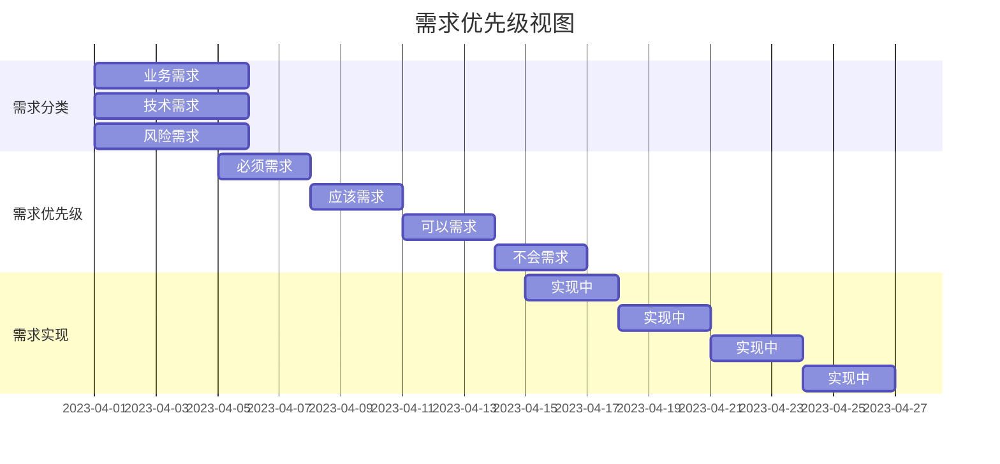

                 

# 敏捷研发模式下的需求优先级可视化工具应用

## 关键词
- 敏捷研发
- 需求优先级
- 可视化工具
- 需求管理
- 团队协作

## 摘要
本文深入探讨了敏捷研发模式下的需求优先级可视化工具的应用。首先，对敏捷研发模式进行了概述，包括其起源、核心原则和需求管理方法。接着，详细介绍了需求优先级的定义、评估方法和可视化工具的选择标准。随后，讨论了需求优先级可视化工具在敏捷团队内部协作、项目管理层决策和客户沟通中的应用场景。文章通过实际应用实例和敏捷团队需求优先级可视化实践，展示了工具的具体应用方法和效果。最后，对需求优先级可视化工具的优化与未来趋势进行了展望，总结了敏捷研发中的需求优先级管理经验，并提出了未来研究方向。

## 目录大纲

### 第一部分：背景与理论基础

#### 第1章：敏捷研发模式概述

1.1 什么是敏捷研发模式

1.2 敏捷研发模式的核心原则

1.3 敏捷研发模式下的需求管理

#### 第2章：需求优先级可视化理论

2.1 需求优先级定义与分类

2.2 需求优先级评估方法

2.3 可视化工具的重要性

#### 第3章：需求优先级可视化工具概述

3.1 常见可视化工具介绍

3.2 可视化工具的选择标准

#### 第4章：需求优先级可视化工具的应用场景

4.1 敏捷团队内部协作

4.2 项目管理层决策

4.3 客户沟通与反馈

### 第二部分：工具应用与实践

#### 第5章：可视化工具应用实例

5.1 选择合适的可视化工具

5.2 创建需求优先级视图

5.3 视图定制与优化

#### 第6章：敏捷团队需求优先级可视化实践

6.1 团队协作实践

6.2 项目管理实践

6.3 客户沟通实践

#### 第7章：需求优先级可视化工具优化与未来趋势

7.1 工具功能扩展

7.2 未来趋势展望

#### 第8章：总结与展望

8.1 敏捷研发中的需求优先级管理

8.2 需求优先级可视化工具的效能分析

8.3 未来研究方向

## 第一部分：背景与理论基础

### 第1章：敏捷研发模式概述

#### 1.1 什么是敏捷研发模式

敏捷研发模式起源于20世纪90年代，是为了应对快速变化的市场需求和客户需求而提出的一种软件开发方法论。与传统瀑布式研发模式不同，敏捷研发强调迭代、灵活和持续交付。

敏捷研发模式的起源可以追溯到2001年，当时一群软件开发专家在瑞士的智力峰会上共同起草了《敏捷宣言》。这份宣言主张“个体和互动重于过程与工具”，“工作的软件重于详尽的文档”，“客户合作重于合同谈判”，“响应变化重于遵循计划”。

#### 1.1.1 敏捷研发模式的起源与发展

敏捷研发模式的起源可以追溯到20世纪90年代，当时软件开发面临的问题主要包括：

1. 项目延迟：传统的瀑布式开发模式往往导致项目进度延误。
2. 需求变更：在项目进行过程中，客户需求经常发生变化，导致开发工作难以应对。
3. 质量问题：传统的开发方法往往注重文档和计划，而忽略了实际代码质量和用户体验。

为了解决这些问题，一些软件开发专家开始探索新的开发方法，最终形成了敏捷研发模式。

#### 1.1.2 敏捷研发模式与传统研发模式的对比

传统研发模式（如瀑布式）通常具有以下特点：

1. 线性顺序：开发过程按照需求分析、设计、编码、测试等顺序进行，每个阶段完成后才能进入下一个阶段。
2. 强调文档：详细的需求文档、设计文档和测试文档是开发的基础。
3. 预测性：项目开始前需要进行详细的计划，预测项目所需的时间和资源。

敏捷研发模式则具有以下特点：

1. 迭代开发：开发过程分为多个迭代周期，每个迭代周期完成一部分功能。
2. 灵活性：开发过程中可以灵活应对需求变更，确保项目能够快速响应市场需求。
3. 客户合作：客户全程参与开发过程，提供反馈和建议，确保最终产品符合客户需求。

### 1.2 敏捷研发模式的核心原则

敏捷研发模式的核心原则主要包括以下几点：

1. 用户需求为中心：用户的实际需求是开发的核心，所有工作都要围绕用户需求展开。
2. 快速迭代与持续交付：通过快速迭代和持续交付，确保项目能够快速响应市场需求。
3. 团队协作与透明沟通：强调团队协作和透明沟通，确保项目进展和问题能够及时得到解决。
4. 可持续发展：确保团队成员能够在长期项目中保持高效工作，避免过度劳累。

#### 1.2.1 用户需求为中心

敏捷研发模式强调以用户需求为中心，这意味着在开发过程中，用户的需求始终处于核心地位。具体来说，这包括以下几个方面的内容：

1. 需求收集：在项目开始前，通过与用户进行深入的沟通和交流，收集用户的需求和期望。
2. 需求分析：对收集到的需求进行分析和梳理，明确需求的重要性和优先级。
3. 需求实现：根据需求分析的结果，优先实现高优先级的需求，确保项目能够快速交付用户价值。

#### 1.2.2 快速迭代与持续交付

敏捷研发模式的核心之一是快速迭代与持续交付。这意味着开发过程不是一次性完成的，而是通过多个迭代周期逐步完成。每个迭代周期通常包括以下步骤：

1. 需求评审：确定本次迭代要实现的需求。
2. 设计与开发：根据需求评审的结果，进行系统设计和开发。
3. 测试与反馈：完成开发后，进行系统测试，并根据测试结果进行修改和优化。
4. 交付用户：将本次迭代实现的功能交付给用户，收集用户反馈。

#### 1.2.3 团队协作与透明沟通

敏捷研发模式强调团队协作和透明沟通，这是确保项目成功的重要因素。具体来说，这包括以下几个方面：

1. 自组织团队：团队成员应该具备跨职能的能力，能够独立完成项目中的各项任务。
2. 日常站立会议：每天进行站立会议，团队成员汇报项目进展和遇到的问题，确保问题能够及时得到解决。
3. 信息共享：确保团队成员之间能够及时共享信息，包括需求变更、进度更新和问题解决等。
4. 代码审查：通过代码审查，确保代码质量和协作效率。

#### 1.2.4 持续交付

持续交付是敏捷研发模式的一个重要原则，它意味着在开发过程中，每个迭代周期都要实现可交付的产品。具体来说，这包括以下几个方面的内容：

1. 自动化测试：通过自动化测试，确保每次交付的产品都是高质量的。
2. 快速部署：通过快速部署，确保每次交付的产品都能够快速上线。
3. 客户反馈：通过客户反馈，确保每次交付的产品都能够满足用户需求。

### 1.3 敏捷研发模式下的需求管理

在敏捷研发模式下，需求管理是一个持续的过程，贯穿于整个开发周期。以下是一些关键的需求管理方法：

1. 需求获取与验证：通过用户调研、访谈和用户故事地图等方法，获取用户需求，并对需求进行验证。
2. 需求优先级排序：根据业务价值和风险等因素，对需求进行优先级排序，确保高优先级需求先得到实现。
3. 需求变更管理：在开发过程中，需求可能会发生变化，敏捷研发模式强调通过协商和沟通，确保需求变更能够得到及时处理。

#### 1.3.1 需求获取与验证

需求获取是敏捷研发的重要环节，它决定了项目能否满足用户需求。以下是一些常用的需求获取方法：

1. 用户调研：通过与用户进行面对面访谈、问卷调查等方式，了解用户的需求和痛点。
2. 用户故事：通过编写用户故事，将用户需求转化为具体的功能需求。
3. 用户故事地图：通过用户故事地图，将用户需求按照场景和流程进行梳理，确保需求的全覆盖。

需求验证是确保需求可行性和合理性的关键步骤。以下是一些常用的需求验证方法：

1. 用户体验测试：通过实际用户的使用体验，验证需求是否符合用户的期望。
2. 技术可行性分析：通过技术评估，验证需求是否能够在现有技术条件下实现。
3. 评审会议：通过组织需求评审会议，对需求进行讨论和确认。

#### 1.3.2 需求优先级排序

在敏捷研发模式下，需求优先级排序是确保项目能够高效推进的关键。以下是一些常用的需求优先级排序方法：

1. 业务价值优先级：根据需求对业务价值的贡献程度，进行优先级排序。
2. 技术难度优先级：根据需求实现的技术难度，进行优先级排序。
3. 风险优先级：根据需求实现过程中的风险程度，进行优先级排序。

#### 1.3.3 需求变更管理

在敏捷研发模式下，需求变更是一个常见且必要的过程。以下是一些关键的需求变更管理方法：

1. 变更请求：在需求变更发生时，提出变更请求，并进行初步评估。
2. 变更评审：组织变更评审会议，对变更请求进行讨论和评估。
3. 变更实施：根据变更评审的结果，进行需求的调整和优化。

#### 1.3.4 敏捷研发模式下的需求管理工具

在敏捷研发模式下，需求管理工具可以显著提高团队的工作效率和项目成功率。以下是一些常用的需求管理工具：

1. Jira：一款功能强大的需求管理工具，支持需求收集、需求优先级排序、任务分配等功能。
2. Confluence：一款知识共享和协作工具，可以用于需求文档的编写和共享。
3. Trello：一款简单易用的项目管理工具，可以用于需求优先级排序和任务跟踪。

### 第2章：需求优先级可视化理论

#### 2.1 需求优先级定义与分类

需求优先级是指根据需求的紧急程度、重要性和业务价值等因素，对需求进行排序的过程。合理的需求优先级排序可以帮助团队明确开发重点，提高项目交付效率。

需求优先级可以根据不同的维度进行分类，常见的分类方法包括：

1. 业务价值优先级：根据需求对业务价值的贡献程度进行排序。
2. 技术难度优先级：根据需求实现的技术难度进行排序。
3. 风险优先级：根据需求实现过程中的风险程度进行排序。

#### 2.2 需求优先级评估方法

需求优先级评估是确保需求得到合理排序的关键步骤。以下是一些常用的需求优先级评估方法：

1. Kano模型：Kano模型将需求分为基本型需求、期望型需求、魅力型需求和反向型需求，根据不同类型的需求赋予不同的优先级。
2. MoSCoW方法：MoSCoW方法将需求分为必须的（Must）、应该的（Should）、可以的（Could）和不会的（Will not），根据需求的紧迫性和重要性进行排序。
3. RICE模型：RICE模型将需求分为影响力（Reach）、影响力（Impact）、信心（Confidence）和易用性（Ease），根据需求的影响范围、影响力、实现信心和实现难度进行排序。

#### 2.3 可视化工具的重要性

在敏捷研发模式下，需求优先级可视化工具具有重要作用。以下是一些关键的作用：

1. 提高团队协作效率：通过可视化工具，团队可以直观地了解需求优先级，提高协作效率。
2. 促进需求沟通与理解：可视化工具可以帮助团队成员更好地理解需求优先级，促进需求沟通。
3. 优化资源分配：通过可视化工具，团队可以更合理地分配资源，确保高优先级需求得到优先处理。
4. 支持决策制定：可视化工具可以帮助管理层快速了解项目状态，支持决策制定。

#### 2.4 可视化工具的选择标准

在选择需求优先级可视化工具时，需要考虑以下选择标准：

1. 功能丰富性：工具应具备丰富的功能，能够满足不同类型的需求可视化需求。
2. 易用性：工具应具有友好的用户界面，便于团队成员快速上手使用。
3. 交互性：工具应支持用户对需求优先级进行实时修改和调整，提高协作效率。
4. 扩展性：工具应具备良好的扩展性，能够适应团队规模和需求的变化。

### 第3章：需求优先级可视化工具概述

#### 3.1 常见可视化工具介绍

在敏捷研发中，常用的需求优先级可视化工具主要包括以下几种：

1. Gantt图：Gantt图是一种用于展示项目进度和时间安排的可视化工具。它可以清晰地展示每个任务的开始和结束时间，以及任务之间的依赖关系。
2. Kanban板：Kanban板是一种用于展示工作流程和任务状态的可视化工具。它通过看板（Kanban板）和卡片（任务）的形式，直观地展示任务的状态和进度。
3. Burndown图：Burndown图是一种用于展示项目进度和剩余工作量的可视化工具。它通过图表的形式，展示项目剩余工作量随时间的变化情况。

#### 3.2 可视化工具的选择标准

在选择需求优先级可视化工具时，需要考虑以下选择标准：

1. 功能丰富性：工具应具备丰富的功能，能够满足不同类型的需求可视化需求。
2. 易用性：工具应具有友好的用户界面，便于团队成员快速上手使用。
3. 交互性：工具应支持用户对需求优先级进行实时修改和调整，提高协作效率。
4. 扩展性：工具应具备良好的扩展性，能够适应团队规模和需求的变化。

### 第4章：需求优先级可视化工具的应用场景

#### 4.1 敏捷团队内部协作

需求优先级可视化工具在敏捷团队内部协作中具有重要作用，以下是一些应用场景：

1. 需求评审会议：在需求评审会议中，团队可以使用可视化工具展示需求优先级，便于团队成员共同讨论和确认。
2. 迭代计划会议：在迭代计划会议中，团队可以使用可视化工具展示当前迭代的需求优先级和任务分配情况，确保团队成员对项目有清晰的认识。
3. 持续改进会议：在持续改进会议中，团队可以使用可视化工具展示项目状态和问题清单，便于团队成员共同探讨和解决问题。

#### 4.2 项目管理层决策

需求优先级可视化工具在项目管理层决策中具有重要作用，以下是一些应用场景：

1. 项目启动与规划：在项目启动与规划阶段，管理层可以使用可视化工具展示项目需求优先级和任务分配情况，确保项目能够按计划推进。
2. 中期评估与调整：在中期评估与调整阶段，管理层可以使用可视化工具展示项目进度和需求变化情况，以便及时调整项目计划和资源分配。
3. 项目总结与回顾：在项目总结与回顾阶段，管理层可以使用可视化工具展示项目执行情况和需求实现情况，以便总结经验教训，为未来项目提供参考。

#### 4.3 客户沟通与反馈

需求优先级可视化工具在客户沟通与反馈中具有重要作用，以下是一些应用场景：

1. 需求验证与确认：在需求验证与确认阶段，团队可以使用可视化工具展示需求优先级和实现情况，与客户共同讨论和确认。
2. 用户体验反馈：在用户体验反馈阶段，团队可以使用可视化工具展示用户使用情况、问题和建议，以便及时调整需求优先级和优化产品设计。
3. 产品迭代优化：在产品迭代优化阶段，团队可以使用可视化工具展示产品迭代情况和需求变化情况，与客户共同讨论和优化产品。

## 第二部分：工具应用与实践

### 第5章：可视化工具应用实例

#### 5.1 选择合适的可视化工具

在选择需求优先级可视化工具时，需要考虑以下因素：

1. 团队规模：对于小型团队，可以选择简单易用的工具，如Trello或Asana。对于大型团队，可以选择功能更丰富的工具，如Jira或Microsoft Project。
2. 功能需求：根据团队的需求，选择具备所需功能的可视化工具。例如，如果团队需要实时协作和任务分配功能，可以选择Jira或Trello。
3. 预算：考虑团队的预算，选择性价比高的工具。开源工具如Trello和Asana可以免费使用，而商业工具如Jira和Microsoft Project可能需要付费。

#### 5.2 创建需求优先级视图

创建需求优先级视图是需求管理的重要环节。以下是一个简单的步骤：

1. 收集需求：首先，团队需要收集所有需求，包括业务需求和技术需求。
2. 筛选需求：对收集到的需求进行筛选，去除重复和无效的需求。
3. 评估需求优先级：根据业务价值、技术难度和风险等因素，对需求进行优先级评估。
4. 创建视图：使用可视化工具创建需求优先级视图，如Kanban板或Burndown图。

以下是一个示例：

#### 5.3 视图定制与优化

创建需求优先级视图后，团队可以根据需要对其进行定制和优化：

1. 视图定制：根据团队的需求，调整视图的布局和样式，使其更符合团队的工作流程和习惯。
2. 数据更新：定期更新视图中的数据，确保视图反映最新的需求状态和项目进度。
3. 视图优化：根据团队的工作反馈，对视图进行优化，提高视图的可读性和易用性。

### 第6章：敏捷团队需求优先级可视化实践

#### 6.1 团队协作实践

在敏捷团队中，需求优先级可视化工具可以帮助团队提高协作效率，以下是一些实践：

1. 视图共享：使用可视化工具，团队可以实时共享需求优先级视图，确保所有团队成员对需求有清晰的认识。
2. 视图更新：团队成员可以实时更新需求状态和项目进度，确保视图反映最新的信息。
3. 视图协作：团队成员可以共同讨论需求优先级和项目计划，提高协作效率。

#### 6.2 项目管理实践

在项目管理中，需求优先级可视化工具可以帮助管理者更好地掌握项目状态，以下是一些实践：

1. 项目进度监控：通过可视化工具，管理者可以实时监控项目进度，及时发现和解决问题。
2. 资源分配：根据需求优先级和项目进度，管理者可以合理分配资源，确保高优先级需求得到优先处理。
3. 风险管理：通过可视化工具，管理者可以识别和评估项目风险，采取相应措施进行风险管理。

#### 6.3 客户沟通实践

在客户沟通中，需求优先级可视化工具可以帮助团队更好地与客户沟通，以下是一些实践：

1. 需求展示：通过可视化工具，团队可以清晰地展示需求优先级和实现情况，与客户进行有效的沟通。
2. 用户体验反馈：通过可视化工具，团队可以收集和分析用户反馈，优化需求优先级和产品设计。
3. 产品迭代计划：通过可视化工具，团队可以与客户共同讨论和制定产品迭代计划，确保产品能够满足客户需求。

### 第7章：需求优先级可视化工具优化与未来趋势

#### 7.1 工具功能扩展

随着敏捷研发的不断发展，需求优先级可视化工具的功能也在不断扩展。以下是一些常见的功能扩展：

1. 自动化需求管理：通过集成自动化工具，实现需求收集、评估和排序的自动化，提高工作效率。
2. 需求变更跟踪：实时跟踪需求变更，确保需求变更能够及时反映在可视化视图中。
3. 多维度需求分析：支持从不同维度对需求进行分析，如业务价值、技术难度和风险等。

#### 7.2 未来趋势展望

随着技术的不断发展，需求优先级可视化工具的未来趋势包括：

1. 人工智能与可视化：利用人工智能技术，实现需求优先级的智能评估和预测，提高需求管理的智能化水平。
2. 云端部署与协作：通过云端部署，实现需求优先级可视化工具的远程协作和实时更新，提高团队协作效率。
3. 新型可视化技术：引入新型可视化技术，如3D可视化、大数据可视化等，提供更丰富、更直观的可视化效果。

### 第8章：总结与展望

#### 8.1 敏捷研发中的需求优先级管理

在敏捷研发中，需求优先级管理是确保项目成功的关键。以下是一些总结：

1. 确保需求收集的全面性：通过多种需求收集方法，确保需求的全面性和准确性。
2. 合理评估需求优先级：根据业务价值、技术难度和风险等因素，合理评估需求优先级。
3. 灵活应对需求变更：在开发过程中，灵活应对需求变更，确保项目能够持续交付价值。

#### 8.2 需求优先级可视化工具的效能分析

需求优先级可视化工具在敏捷研发中具有显著效能，以下是一些分析：

1. 提高团队协作效率：通过可视化工具，团队成员可以实时共享需求优先级信息，提高协作效率。
2. 优化资源分配：通过可视化工具，管理者可以合理分配资源，确保高优先级需求得到优先处理。
3. 提高项目成功率：通过可视化工具，团队可以更好地掌握项目状态，及时发现和解决问题，提高项目成功率。

#### 8.3 未来研究方向

未来需求优先级管理的研究方向包括：

1. 智能需求评估：利用人工智能技术，实现需求优先级的智能评估和预测，提高需求管理的智能化水平。
2. 多维度需求分析：从不同维度对需求进行分析，如业务价值、技术难度和风险等，提供更全面的需求分析。
3. 新型可视化技术：引入新型可视化技术，如3D可视化、大数据可视化等，提供更丰富、更直观的可视化效果，提高需求管理的用户体验。

## 参考文献

1. Beedle, M., & Duncun, J. (2002). *XP Explained: Embracing XP, Agile Processes, and eXtreme Programming*. Prentice Hall.
2. Beck, K. (2000). *Extreme Programming Explained: Embracing Change*. Addison-Wesley.
3. Schwaber, K., & Beedle, M. (2002). *Agile Project Management with Scrum*. Pearson Education.
4. Martin, R. C. (2010). *Agile Software Development: Principles, Patterns, and Practices*. Prentice Hall.
5. Kano, N. (1984). *The Quality Function Deployment*. North Holland.
6. MoSCoW Method. (n.d.). Retrieved from https://en.wikipedia.org/wiki/MoSCoW_method
7. RICE Model. (n.d.). Retrieved from https://www.atlassian.com/agile/guides/rice-model
8. Jira. (n.d.). Retrieved from https://www.atlassian.com/software/jira
9. Confluence. (n.d.). Retrieved from https://www.atlassian.com/software/confluence
10. Trello. (n.d.). Retrieved from https://trello.com/

### 作者

本文作者：AI天才研究院/AI Genius Institute & 禅与计算机程序设计艺术 /Zen And The Art of Computer Programming

（完）

