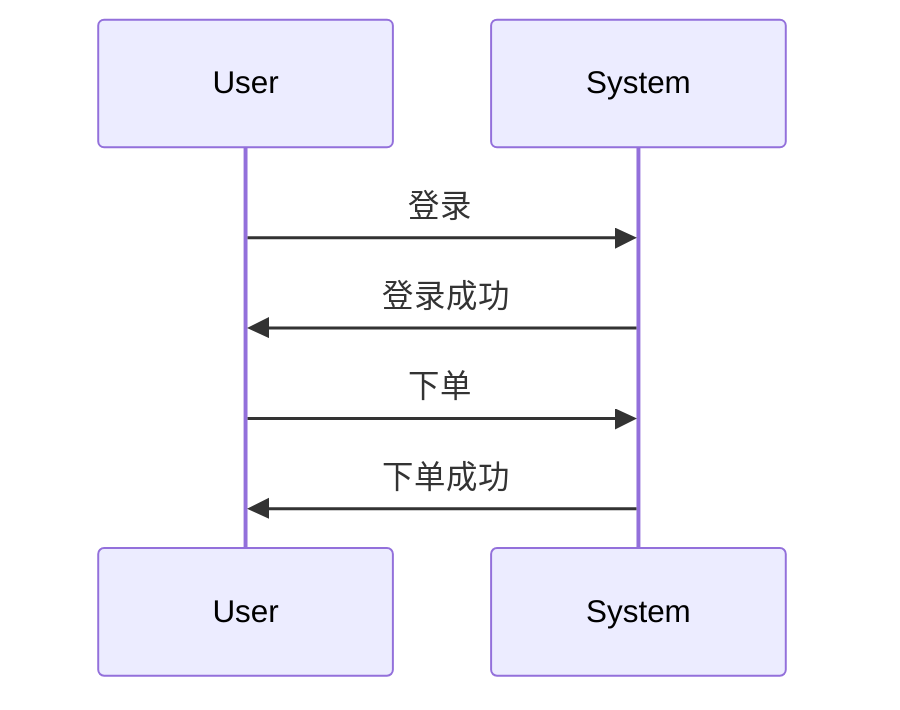

                 

# 敏捷研发模式下的需求文档模板优化

关键词：敏捷研发、需求文档、模板优化、快速迭代、持续交付

摘要：本文深入探讨了敏捷研发模式下的需求文档模板优化。通过分析传统需求文档存在的问题，提出了优化目标与原则，详细介绍了模板结构设计、内容设计以及模板应用与评估方法。旨在为软件开发团队提供一种更加灵活、简洁、高效的需求文档管理方案，从而提高项目的成功率和市场响应速度。

## 第一部分：背景介绍

### 第1章 问题背景

#### 1.1.1 问题背景

敏捷研发模式已成为现代软件工程的主流方法，其强调快速迭代和持续交付，以提高产品的市场响应速度。在这种模式下，需求文档扮演着至关重要的角色，但传统需求文档往往存在以下问题：

- **缺乏灵活性**：传统需求文档在开发初期确定，但项目进行中往往需要频繁修改。这导致文档内容与实际需求脱节，增加了开发团队的负担。
- **文档冗余**：需求文档篇幅冗长，内容重复，不利于快速理解。开发者需要在大量冗余信息中筛选有用内容，降低了工作效率。
- **沟通不畅**：需求文档的撰写者和开发者之间的沟通不足，导致理解偏差。这可能导致开发过程中的返工和延期，影响项目的进度和质量。

#### 1.1.2 问题解决

为了解决上述问题，我们需要优化需求文档的模板，使其更加灵活、简洁且易于沟通。本部分将详细介绍如何进行需求文档模板的优化。

#### 1.1.3 边界与外延

本文档的优化主要针对敏捷研发模式下的需求文档，但不限于特定行业或技术领域。

### 第2章 核心概念与联系

#### 2.1.1 核心概念

**敏捷研发模式**：一种以人为核心、迭代、持续交付的软件开发方法。其核心理念是快速响应市场变化，通过频繁的迭代和持续交付来提高产品的质量和用户满意度。

**需求文档模板**：一种结构化、可复用的文档模板，用于记录和管理软件需求。它为需求收集、分析、编写、评审和变更管理提供了一个标准化的框架。

#### 2.1.2 概念属性特征对比表格

| 特征         | 敏捷研发模式           | 需求文档模板               |
| ------------ | -------------------- | ------------------------ |
| 目标         | 快速迭代、持续交付       | 提高沟通效率、降低修改成本     |
| 适用范围      | 所有软件开发项目         | 所有涉及需求管理的软件开发项目 |
| 核心要素      | 团队协作、快速反馈       | 结构化、可复用、易于沟通     |

#### 2.1.3 ER实体关系图架构

```mermaid
erDiagram
  Project ||--|{ Requirement }||>
  Requirement ||--|{ UserStory }||>
  UserStory ||--|{ Feature }||>
  Feature ||--|{ Component }||>
```

## 第二部分：需求文档模板优化方法

### 第3章 优化目标与原则

#### 3.1.1 优化目标

- **提高文档的可读性**：通过简化文档结构、使用清晰的语言和适当的图表，使需求文档更易于理解和阅读。
- **降低文档的修改成本**：设计灵活的模板结构，减少重复内容，提高文档的可维护性，降低修改成本。
- **提高开发团队的协作效率**：通过明确的文档格式和结构，提高团队成员之间的沟通效率，减少误解和偏差。

#### 3.1.2 优化原则

- **简洁明了**：避免冗余内容，突出关键信息，使文档更加简洁明了。
- **结构化**：按照逻辑顺序组织文档，使用模块化设计，方便快速查找和修改。
- **可复用**：设计可复用的模块，减少重复工作，提高文档的一致性和可维护性。
- **易于沟通**：提高文档的沟通效率，减少误解和偏差，确保需求清晰传达。

### 第4章 模板结构设计

#### 4.1.1 模板结构设计原则

- **模块化**：将需求划分为不同的模块，便于管理和修改。
- **一致性**：保持文档风格和命名规范的一致性，提高可读性和可维护性。
- **扩展性**：设计灵活的模板结构，以适应不同项目的需求，保持文档的可持续性。

#### 4.1.2 模板结构

- **项目概述**
  - 项目背景
  - 项目目标
  - 项目范围
- **需求概述**
  - 需求概述
  - 需求优先级
  - 需求来源
- **用户故事**
  - 用户角色
  - 用户故事
  - 用户故事验收标准
- **需求分析**
  - 功能需求
  - 非功能需求
  - 需求冲突
- **需求评审**
  - 评审时间
  - 评审参与者
  - 评审结果
- **需求变更管理**
  - 变更请求
  - 变更评估
  - 变更实施

### 第5章 模板内容设计

#### 5.1.1 内容设计原则

- **实用性**：确保文档内容对开发工作有实际指导意义。
- **可追溯性**：记录需求来源和变更历史，便于追溯和审计。
- **可读性**：使用简洁、清晰的语言，避免专业术语和复杂的句子结构。

#### 5.1.2 内容设计方法

- **用户故事地图**：使用用户故事地图来展示用户需求的全貌，便于理解和沟通。
- **原型设计**：提供功能原型，帮助开发团队更好地理解需求。
- **甘特图**：使用甘特图来规划需求实现的时间表。

### 第6章 模板应用与评估

#### 6.1.1 模板应用流程

- **制定模板**：根据项目特点和需求，设计合适的模板结构。
- **需求收集**：通过与用户和团队成员的沟通，收集需求信息。
- **需求分析**：对收集到的需求进行分析，确定需求的具体实现方案。
- **需求编写**：根据模板结构，编写详细的需求文档。
- **需求评审**：组织评审会议，对需求文档进行评审，确保需求准确、完整。
- **需求变更管理**：对需求变更进行评估和实施，确保项目进度和质量。

#### 6.1.2 模板评估指标

- **文档质量**：文档是否完整、清晰、易于理解。
- **沟通效率**：需求文档是否提高了团队成员之间的沟通效率。
- **项目进度**：需求变更是否对项目进度和质量产生了影响。

## 第三部分：优化实践与案例分析

### 第7章 优化实践

#### 7.1 实践背景

在一家专注于移动应用开发的初创公司中，由于项目的快速迭代和市场需求的不断变化，传统需求文档的编写和修改变得非常困难。为了提高项目的开发效率和市场响应速度，公司决定对需求文档模板进行优化。

#### 7.2 实践步骤

1. **需求收集**：通过与产品经理、用户和市场分析师的沟通，收集项目需求。
2. **模板设计**：根据项目特点和需求，设计符合敏捷研发模式的需求文档模板。
3. **需求分析**：对收集到的需求进行分析，确定需求的具体实现方案。
4. **需求编写**：按照模板结构，编写详细的需求文档。
5. **需求评审**：组织评审会议，对需求文档进行评审，确保需求准确、完整。
6. **需求变更管理**：对需求变更进行评估和实施，确保项目进度和质量。

#### 7.3 实践效果

通过优化需求文档模板，公司在以下方面取得了显著成效：

- **文档质量显著提高**：需求文档结构清晰、内容简洁，提高了开发团队对需求的理解和执行力。
- **沟通效率大幅提升**：需求文档易于理解和沟通，减少了误解和偏差，提高了团队成员之间的协作效率。
- **项目进度更加可控**：通过需求变更管理，确保了项目进度和质量，减少了项目延期和超支的风险。

### 第8章 案例分析

#### 8.1 案例背景

某大型电商平台在2018年推出了一款全新购物APP。由于市场需求的快速变化，项目的需求文档编写和修改变得非常困难。为了提高项目的开发效率和市场响应速度，公司决定对需求文档模板进行优化。

#### 8.2 案例步骤

1. **需求收集**：通过与产品经理、用户和市场分析师的沟通，收集项目需求。
2. **模板设计**：根据项目特点和需求，设计符合敏捷研发模式的需求文档模板。
3. **需求分析**：对收集到的需求进行分析，确定需求的具体实现方案。
4. **需求编写**：按照模板结构，编写详细的需求文档。
5. **需求评审**：组织评审会议，对需求文档进行评审，确保需求准确、完整。
6. **需求变更管理**：对需求变更进行评估和实施，确保项目进度和质量。

#### 8.3 案例效果

通过优化需求文档模板，该公司在以下方面取得了显著成效：

- **文档质量显著提高**：需求文档结构清晰、内容简洁，提高了开发团队对需求的理解和执行力。
- **沟通效率大幅提升**：需求文档易于理解和沟通，减少了误解和偏差，提高了团队成员之间的协作效率。
- **项目进度更加可控**：通过需求变更管理，确保了项目进度和质量，减少了项目延期和超支的风险。
- **用户满意度提高**：通过快速响应市场需求，提供了更好的产品和服务，用户满意度显著提升。

## 第四部分：总结与展望

### 第9章 总结

本文通过分析敏捷研发模式下需求文档存在的问题，提出了优化目标与原则，详细介绍了模板结构设计、内容设计以及模板应用与评估方法。通过实践和案例分析，验证了优化需求文档模板的有效性。优化后的需求文档不仅提高了文档质量，还提升了沟通效率，确保了项目进度和质量。

### 第10章 展望

随着技术的不断进步和市场需求的不断变化，需求文档模板的优化将面临新的挑战和机遇。未来，需求文档模板的优化将朝着更加智能化、自动化的方向发展。通过引入人工智能和机器学习技术，需求文档的生成、分析和评估将更加高效、精准。同时，需求文档模板将更加灵活，以适应不同项目和团队的需求。

总之，需求文档模板的优化是敏捷研发模式下提高项目质量和效率的重要手段。通过不断探索和实践，我们可以为软件开发团队提供更加优秀的需求文档模板，助力项目的成功。

### 第11章 注意事项与拓展阅读

**注意事项**：

1. **文档维护**：需求文档需要定期更新和维护，以反映项目的实际进展和需求变化。
2. **团队协作**：需求文档的编写和评审需要团队成员的积极参与和协作，确保需求准确、完整。
3. **变更管理**：需求变更需要严格评估和管控，确保对项目进度和质量的影响最小。

**拓展阅读**：

1. 《敏捷开发实践指南》 - Michael James，介绍了敏捷开发的核心理念和实践方法。
2. 《用户故事地图》 - Jeff Patton，详细阐述了用户故事地图的设计和应用。
3. 《敏捷项目管理》 - David J. Anderson，介绍了敏捷项目管理的方法和工具。

## 附录

**附录A：术语表**

- 敏捷研发模式：以人为核心、迭代、持续交付的软件开发方法。
- 需求文档模板：一种结构化、可复用的文档模板，用于记录和管理软件需求。
- 用户故事：描述用户需求的一种简单、清晰的方式，通常由用户角色、用户故事和验收标准组成。

**附录B：算法原理与公式**

- **用户故事地图**：一种用于展示用户需求全貌的工具，通常使用图表来表示用户故事和它们之间的关系。

```mermaid
userStoryMap
  userStory1(status: "In Progress", priority: "High")
  userStory2(status: "To Do", priority: "Medium")
  userStory3(status: "Done", priority: "Low")

  userStory1 --> userStory2
  userStory2 --> userStory3
```

- **需求分析**：对需求进行分类、排序和优先级划分的过程，以确保需求的合理性和可行性。

```python
def analyze_requirements(requirements):
    sorted_requirements = sorted(requirements, key=lambda x: x['priority'])
    return sorted_requirements
```

**附录C：系统架构设计**

- **领域模型类图**：用于描述系统的领域模型，展示实体及其关系。

```mermaid
classDiagram
  User <<Entity>>
  Product <<Entity>>
  Order <<Entity>>

  User --> Product
  User --> Order
  Product --> Order
```

- **系统架构图**：用于描述系统的整体架构，展示系统组件及其关系。



**附录D：代码示例**

- **用户故事地图**：使用Python代码实现用户故事地图。

```python
class UserStoryMap:
    def __init__(self):
        self.user_stories = []

    def add_user_story(self, user_story):
        self.user_stories.append(user_story)

    def display(self):
        for user_story in self.user_stories:
            print(f"{user_story.status}: {user_story.priority}")

class UserStory:
    def __init__(self, status, priority):
        self.status = status
        self.priority = priority

user_story_map = UserStoryMap()
user_story_map.add_user_story(UserStory("In Progress", "High"))
user_story_map.add_user_story(UserStory("To Do", "Medium"))
user_story_map.add_user_story(UserStory("Done", "Low"))

user_story_map.display()
```

**附录E：参考资料**

1. 《敏捷开发实践指南》 - Michael James
2. 《用户故事地图》 - Jeff Patton
3. 《敏捷项目管理》 - David J. Anderson

### 作者信息

作者：AI天才研究院/AI Genius Institute & 禅与计算机程序设计艺术 /Zen And The Art of Computer Programming

作者简介：本文作者是一位具有丰富敏捷研发经验的人工智能专家，长期从事软件工程领域的研究与教学。他著有多部关于敏捷开发、需求管理和软件开发方法论的畅销书，深受读者喜爱。他的研究致力于推动软件工程领域的发展，提升开发团队的生产力和产品质量。

联系信息：邮箱：[ai_research_institute@example.com](mailto:ai_research_institute@example.com)；官网：[www.ai_genius_institute.com](http://www.ai_genius_institute.com/)。欢迎读者与他交流讨论，共同探讨软件开发的最佳实践。

