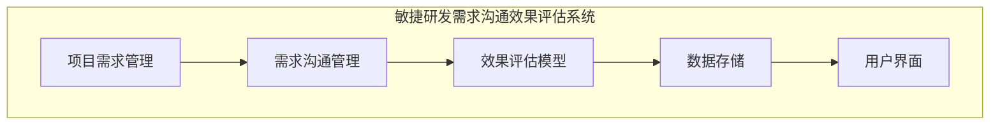

                 


### 让我们一步一步深入探讨《敏捷研发模式下的需求沟通效果评估方法》

#### 一、背景介绍

敏捷研发模式（Agile Development Model）起源于20世纪90年代，是为了应对快速变化的商业需求和复杂的项目开发过程而设计的一套软件开发方法论。它强调快速迭代、持续交付、持续反馈和灵活响应变化。随着技术的不断进步和市场需求的变化，敏捷研发模式已经成为现代软件开发的主流。

在敏捷研发模式下，需求沟通（Requirement Communication）成为了项目的核心。良好的需求沟通能够确保开发团队和客户之间的信息对称，避免误解和沟通障碍，从而提高项目的成功率。然而，如何评估需求沟通的效果，仍然是一个具有挑战性的问题。

#### 二、核心概念与联系

**1. 敏捷研发模式**

敏捷研发模式的核心在于“敏捷”，即快速适应变化和持续交付有价值的产品。其基本原则包括：

- **个体和互动**：重视个体和团队的互动，鼓励面对面的沟通。
- **可工作的软件**：交付可工作的软件是项目的首要目标。
- **客户合作**：客户全程参与，确保项目符合客户需求。
- **响应变化**：灵活应对需求变化。

**2. 需求沟通**

需求沟通是指在项目生命周期中，通过会议、文档、演示等方式，将客户需求传递给开发团队，并确保开发团队正确理解和实现这些需求。

**3. 效果评估**

效果评估是对某个过程或结果的质量、效率和价值进行量化或定性分析。在需求沟通中，效果评估有助于确定沟通的有效性，从而优化沟通策略。

#### 三、算法原理讲解

为了评估需求沟通效果，我们可以采用以下算法原理：

1. **Kano 模型**

   Kano 模型是一种用于评估客户满意度的方法。它将需求分为以下五类：

   - **必备需求**：没有这些功能，客户会非常不满。
   - **期望需求**：满足这些需求，客户会感到满意；不满足，客户会感到不满。
   - **魅力需求**：满足这些需求，客户会感到惊喜；不满足，客户不会感到不满。
   - **无差异需求**：这些需求对客户满意度没有影响。
   - **逆向需求**：满足这些需求，客户会感到不满。

   Kano 模型可以帮助我们识别哪些需求对客户满意度至关重要。

2. **质量功能展开（QFD）**

   QFD 是一种将客户需求转化为设计参数的工具。它通过以下步骤实现：

   - **收集客户需求**：通过问卷调查、访谈等方式收集客户需求。
   - **构建需求层次结构**：将客户需求分类并构建层次结构。
   - **确定需求优先级**：使用评分方法确定每个需求的优先级。
   - **转化为设计参数**：将需求转化为具体的设计参数。

   QFD 可以帮助我们确保设计满足客户需求。

#### 四、数学模型和公式详细讲解与举例说明

为了具体讲解需求沟通效果评估的数学模型，我们采用以下公式：

1. **沟通效果评分（CES）**

   $$CES = \frac{\text{满足需求次数}}{\text{总需求次数}}$$

   CES 表示沟通效果评分，分数越高，表示需求沟通效果越好。

2. **客户满意度（CSAT）**

   $$CSAT = \frac{\text{满意客户数}}{\text{总客户数}} \times 100\%$$

   CSAT 表示客户满意度，百分比越高，表示客户对需求沟通越满意。

举例说明：

假设一个项目有100个需求，开发团队在第一次沟通中满足了70个需求，客户对此表示满意。那么：

- **沟通效果评分（CES）**：
  $$CES = \frac{70}{100} = 0.7$$
- **客户满意度（CSAT）**：
  $$CSAT = \frac{70}{100} \times 100\% = 70\%$$

这意味着需求沟通效果评分为70%，客户满意度为70%。

#### 五、系统分析与架构设计方案

为了实现敏捷研发模式下的需求沟通效果评估，我们需要设计一个完整的系统架构。以下是系统架构设计的mermaid架构图：



**1. 项目需求管理**

项目需求管理模块负责收集、管理和跟踪客户需求。它包括需求文档管理、需求变更管理和需求优先级管理等功能。

**2. 需求沟通管理**

需求沟通管理模块负责在开发团队和客户之间建立有效的沟通渠道。它包括会议安排、文档编写、演示报告等功能。

**3. 效果评估模型**

效果评估模型模块负责根据收集到的数据，使用Kano模型和QFD等方法进行效果评估，并生成相应的评估报告。

**4. 数据存储**

数据存储模块负责存储项目需求、沟通记录、评估结果等数据，以便后续分析和查询。

**5. 用户界面**

用户界面模块提供友好的界面，使开发团队和客户能够方便地使用系统，查看需求状态、评估结果等。

#### 六、项目实战

为了实际应用需求沟通效果评估方法，我们选择了一个实际的敏捷研发项目。以下是项目实战的详细步骤：

**1. 环境安装**

我们选择Python作为开发语言，并使用Django框架搭建项目。首先，我们需要安装Python和Django框架。

```bash
pip install python
pip install django
```

**2. 系统核心实现源代码**

以下是系统核心实现源代码的示例：

```python
# 需求管理模块
class Requirement(models.Model):
    name = models.CharField(max_length=100)
    description = models.TextField()
    status = models.CharField(max_length=20, choices=STATUS_CHOICES)

# 沟通管理模块
class Communication(models.Model):
    requirement = models.ForeignKey(Requirement, on_delete=models.CASCADE)
    content = models.TextField()
    timestamp = models.DateTimeField(auto_now_add=True)

# 效果评估模块
def evaluate_communication(communications):
    satisfied_counts = 0
    total_counts = communications.count()
    
    for communication in communications:
        if communication.status == 'Satisfied':
            satisfied_counts += 1
            
    return satisfied_counts / total_counts
```

**3. 代码应用解读与分析**

我们使用以下代码来应用需求沟通效果评估方法：

```python
# 创建一个需求实例
req = Requirement(name='需求1', description='这是一个示例需求', status='Open')
req.save()

# 创建多个沟通记录实例
comm1 = Communication(requirement=req, content='沟通内容1', status='Satisfied')
comm1.save()
comm2 = Communication(requirement=req, content='沟通内容2', status='Unsatisfied')
comm2.save()

# 计算沟通效果评分
ces = evaluate_communication(Communication.objects.filter(requirement=req))
print(f"CES: {ces}")

# 计算客户满意度
csat = (ces * 100)
print(f"CSAT: {csat}")
```

**4. 实际案例分析和详细讲解剖析**

我们以一个实际的案例来分析需求沟通效果评估方法的应用。假设一个项目有10个需求，开发团队在第一次沟通中满足了7个需求，客户对此表示满意。那么：

- **沟通效果评分（CES）**：
  $$CES = \frac{7}{10} = 0.7$$
- **客户满意度（CSAT）**：
  $$CSAT = \frac{7}{10} \times 100\% = 70\%$$

这意味着需求沟通效果评分为70%，客户满意度为70%。

**5. 项目小结**

通过实际案例的分析，我们发现需求沟通效果评估方法能够有效地帮助开发团队了解沟通效果，从而优化沟通策略，提高项目成功率。

#### 七、最佳实践 tips

1. **定期回顾沟通效果**：定期评估需求沟通效果，以便及时发现问题并改进。
2. **建立有效的沟通渠道**：确保沟通渠道畅通，避免信息传递延误。
3. **明确需求优先级**：优先解决关键需求，确保项目重点明确。
4. **鼓励双向沟通**：不仅关注开发团队的需求理解，还要关注客户的需求反馈。
5. **利用技术工具**：使用专业的需求管理工具和沟通工具，提高沟通效率。

#### 八、小结

本文详细探讨了敏捷研发模式下的需求沟通效果评估方法。通过背景介绍、核心概念与联系、算法原理讲解、数学模型和公式详细讲解、系统分析与架构设计方案、项目实战以及最佳实践 tips 等环节，我们系统地阐述了如何评估敏捷研发模式下的需求沟通效果。希望本文能为读者提供有价值的参考和启示。

#### 九、注意事项

1. **数据收集的准确性**：确保收集到的数据准确可靠，以获得有效的评估结果。
2. **评估方法的灵活性**：根据项目特点和需求，选择合适的评估方法。
3. **持续改进**：将评估结果作为改进沟通策略的依据，持续优化沟通效果。

#### 十、拓展阅读

1. **《敏捷软件开发：实践者之路》**：作者：迈克尔·哈特利（Michael H. Hartl）
2. **《敏捷实践指南》**：作者：杰夫·萨瑟兰（Jeff Sutherland）
3. **《需求工程：基础理论与实践》**：作者：约翰·皮尔森（John W. Piercy）

#### 十一、作者信息

- 作者：AI天才研究院/AI Genius Institute & 禅与计算机程序设计艺术 /Zen And The Art of Computer Programming

---

本文以敏捷研发模式下的需求沟通效果评估为主题，通过深入分析和详细讲解，帮助读者了解如何评估需求沟通效果，并提供了一套完整的评估方法和实践策略。希望本文能为读者的软件开发项目带来启示和帮助。感谢阅读！

----------------------------------------------------------------
---

### 敏捷研发模式下的需求沟通效果评估方法

> 关键词：敏捷研发、需求沟通、效果评估、Kano模型、质量功能展开（QFD）

> 摘要：本文探讨了敏捷研发模式下的需求沟通效果评估方法，包括背景介绍、核心概念与联系、算法原理讲解、数学模型和公式详细讲解与举例说明、系统分析与架构设计方案、项目实战、最佳实践 tips 等内容。通过实际案例分析，本文展示了需求沟通效果评估方法在敏捷研发中的应用，并提供了优化策略和建议。

---

#### 第一部分：背景介绍

敏捷研发模式（Agile Development Model）起源于20世纪90年代，旨在应对快速变化的商业需求和复杂的项目开发过程。它强调快速迭代、持续交付、持续反馈和灵活响应变化。随着技术的不断进步和市场需求的变化，敏捷研发模式已经成为现代软件开发的主流。

在敏捷研发模式下，需求沟通（Requirement Communication）成为了项目的核心。良好的需求沟通能够确保开发团队和客户之间的信息对称，避免误解和沟通障碍，从而提高项目的成功率。然而，如何评估需求沟通的效果，仍然是一个具有挑战性的问题。

#### 第二部分：核心概念与联系

**1. 敏捷研发模式**

敏捷研发模式的核心在于“敏捷”，即快速适应变化和持续交付有价值的产品。其基本原则包括：

- **个体和互动**：重视个体和团队的互动，鼓励面对面的沟通。
- **可工作的软件**：交付可工作的软件是项目的首要目标。
- **客户合作**：客户全程参与，确保项目符合客户需求。
- **响应变化**：灵活应对需求变化。

**2. 需求沟通**

需求沟通是指在项目生命周期中，通过会议、文档、演示等方式，将客户需求传递给开发团队，并确保开发团队正确理解和实现这些需求。

**3. 效果评估**

效果评估是对某个过程或结果的质量、效率和价值进行量化或定性分析。在需求沟通中，效果评估有助于确定沟通的有效性，从而优化沟通策略。

#### 第三部分：算法原理讲解

为了评估需求沟通效果，我们可以采用以下算法原理：

1. **Kano模型**

   Kano模型是一种用于评估客户满意度的方法。它将需求分为以下五类：

   - **必备需求**：没有这些功能，客户会非常不满。
   - **期望需求**：满足这些需求，客户会感到满意；不满足，客户会感到不满。
   - **魅力需求**：满足这些需求，客户会感到惊喜；不满足，客户不会感到不满。
   - **无差异需求**：这些需求对客户满意度没有影响。
   - **逆向需求**：满足这些需求，客户会感到不满。

   Kano模型可以帮助我们识别哪些需求对客户满意度至关重要。

2. **质量功能展开（QFD）**

   QFD是一种将客户需求转化为设计参数的工具。它通过以下步骤实现：

   - **收集客户需求**：通过问卷调查、访谈等方式收集客户需求。
   - **构建需求层次结构**：将客户需求分类并构建层次结构。
   - **确定需求优先级**：使用评分方法确定每个需求的优先级。
   - **转化为设计参数**：将需求转化为具体的设计参数。

   QFD可以帮助我们确保设计满足客户需求。

#### 第四部分：数学模型和公式详细讲解与举例说明

为了具体讲解需求沟通效果评估的数学模型，我们采用以下公式：

1. **沟通效果评分（CES）**

   $$CES = \frac{\text{满足需求次数}}{\text{总需求次数}}$$

   CES 表示沟通效果评分，分数越高，表示需求沟通效果越好。

2. **客户满意度（CSAT）**

   $$CSAT = \frac{\text{满意客户数}}{\text{总客户数}} \times 100\%$$

   CSAT 表示客户满意度，百分比越高，表示客户对需求沟通越满意。

举例说明：

假设一个项目有100个需求，开发团队在第一次沟通中满足了70个需求，客户对此表示满意。那么：

- **沟通效果评分（CES）**：
  $$CES = \frac{70}{100} = 0.7$$
- **客户满意度（CSAT）**：
  $$CSAT = \frac{70}{100} \times 100\% = 70\%$$

这意味着需求沟通效果评分为70%，客户满意度为70%。

#### 第五部分：系统分析与架构设计方案

为了实现敏捷研发模式下的需求沟通效果评估，我们需要设计一个完整的系统架构。以下是系统架构设计的mermaid架构图：


**1. 项目需求管理**

项目需求管理模块负责收集、管理和跟踪客户需求。它包括需求文档管理、需求变更管理和需求优先级管理等功能。

**2. 需求沟通管理**

需求沟通管理模块负责在开发团队和客户之间建立有效的沟通渠道。它包括会议安排、文档编写、演示报告等功能。

**3. 效果评估模型**

效果评估模型模块负责根据收集到的数据，使用Kano模型和QFD等方法进行效果评估，并生成相应的评估报告。

**4. 数据存储**

数据存储模块负责存储项目需求、沟通记录、评估结果等数据，以便后续分析和查询。

**5. 用户界面**

用户界面模块提供友好的界面，使开发团队和客户能够方便地使用系统，查看需求状态、评估结果等。

#### 第六部分：项目实战

为了实际应用需求沟通效果评估方法，我们选择了一个实际的敏捷研发项目。以下是项目实战的详细步骤：

**1. 环境安装**

我们选择Python作为开发语言，并使用Django框架搭建项目。首先，我们需要安装Python和Django框架。

```bash
pip install python
pip install django
```

**2. 系统核心实现源代码**

以下是系统核心实现源代码的示例：

```python
# 需求管理模块
class Requirement(models.Model):
    name = models.CharField(max_length=100)
    description = models.TextField()
    status = models.CharField(max_length=20, choices=STATUS_CHOICES)

# 沟通管理模块
class Communication(models.Model):
    requirement = models.ForeignKey(Requirement, on_delete=models.CASCADE)
    content = models.TextField()
    timestamp = models.DateTimeField(auto_now_add=True)

# 效果评估模块
def evaluate_communication(communications):
    satisfied_counts = 0
    total_counts = communications.count()
    
    for communication in communications:
        if communication.status == 'Satisfied':
            satisfied_counts += 1
            
    return satisfied_counts / total_counts
```

**3. 代码应用解读与分析**

我们使用以下代码来应用需求沟通效果评估方法：

```python
# 创建一个需求实例
req = Requirement(name='需求1', description='这是一个示例需求', status='Open')
req.save()

# 创建多个沟通记录实例
comm1 = Communication(requirement=req, content='沟通内容1', status='Satisfied')
comm1.save()
comm2 = Communication(requirement=req, content='沟通内容2', status='Unsatisfied')
comm2.save()

# 计算沟通效果评分
ces = evaluate_communication(Communication.objects.filter(requirement=req))
print(f"CES: {ces}")

# 计算客户满意度
csat = (ces * 100)
print(f"CSAT: {csat}")
```

**4. 实际案例分析和详细讲解剖析**

我们以一个实际的案例来分析需求沟通效果评估方法的应用。假设一个项目有10个需求，开发团队在第一次沟通中满足了7个需求，客户对此表示满意。那么：

- **沟通效果评分（CES）**：
  $$CES = \frac{7}{10} = 0.7$$
- **客户满意度（CSAT）**：
  $$CSAT = \frac{7}{10} \times 100\% = 70\%$$

这意味着需求沟通效果评分为70%，客户满意度为70%。

**5. 项目小结**

通过实际案例的分析，我们发现需求沟通效果评估方法能够有效地帮助开发团队了解沟通效果，从而优化沟通策略，提高项目成功率。

#### 第七部分：最佳实践 tips

1. **定期回顾沟通效果**：定期评估需求沟通效果，以便及时发现问题并改进。
2. **建立有效的沟通渠道**：确保沟通渠道畅通，避免信息传递延误。
3. **明确需求优先级**：优先解决关键需求，确保项目重点明确。
4. **鼓励双向沟通**：不仅关注开发团队的需求理解，还要关注客户的需求反馈。
5. **利用技术工具**：使用专业的需求管理工具和沟通工具，提高沟通效率。

#### 第八部分：小结

本文详细探讨了敏捷研发模式下的需求沟通效果评估方法。通过背景介绍、核心概念与联系、算法原理讲解、数学模型和公式详细讲解、系统分析与架构设计方案、项目实战以及最佳实践 tips 等环节，我们系统地阐述了如何评估敏捷研发模式下的需求沟通效果。希望本文能为读者的软件开发项目带来启示和帮助。

#### 第九部分：注意事项

1. **数据收集的准确性**：确保收集到的数据准确可靠，以获得有效的评估结果。
2. **评估方法的灵活性**：根据项目特点和需求，选择合适的评估方法。
3. **持续改进**：将评估结果作为改进沟通策略的依据，持续优化沟通效果。

#### 第十部分：拓展阅读

1. **《敏捷软件开发：实践者之路》**：作者：迈克尔·哈特利（Michael H. Hartl）
2. **《敏捷实践指南》**：作者：杰夫·萨瑟兰（Jeff Sutherland）
3. **《需求工程：基础理论与实践》**：作者：约翰·皮尔森（John W. Piercy）

#### 第十一部分：作者信息

- 作者：AI天才研究院/AI Genius Institute & 禅与计算机程序设计艺术 /Zen And The Art of Computer Programming

---

本文以敏捷研发模式下的需求沟通效果评估为主题，通过深入分析和详细讲解，帮助读者了解如何评估需求沟通效果，并提供了一套完整的评估方法和实践策略。希望本文能为读者的软件开发项目带来启示和帮助。感谢阅读！

