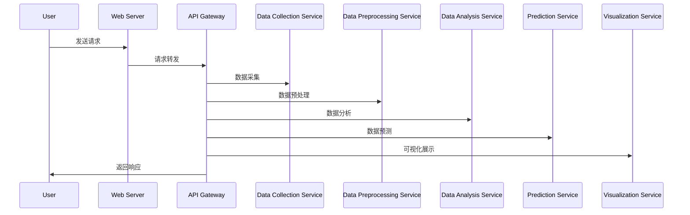
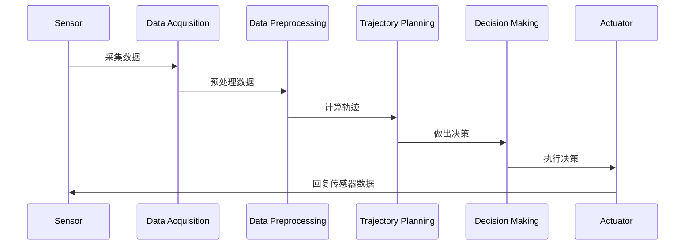

                 

### 文章标题

### 关键词

### 摘要

《数值分析：自然问题的计算数学》旨在深入探讨数值分析的基本概念、方法与应用，帮助读者理解如何利用计算数学解决自然问题。本文将分为四个部分，首先介绍数值分析在计算数学中的背景和重要性，然后详细阐述数值分析的目标和基本方法，接着探讨其应用领域和挑战，最后通过具体案例展示数值分析的实际应用。本文不仅适合数学和计算机科学领域的读者，也对希望提升计算能力的工程师和科研人员具有参考价值。

## 目录大纲设计思路

### 1. 核心章节划分

《数值分析：自然问题的计算数学》的核心章节划分旨在清晰地展现数值分析从基础到高级应用的全貌。全书分为四个主要部分：

1. **背景介绍**：包括问题背景、问题描述和问题解决方法，帮助读者理解数值分析的基本概念和其计算需求。
2. **核心概念与联系**：深入分析数值分析的核心概念，并通过对比表格和实体关系图，帮助读者建立对数值分析方法的全面理解。
3. **算法原理讲解**：详细讲解经典和现代数值分析方法，包括数学模型、算法原理和具体实现，增强读者对算法的理解和应用能力。
4. **系统分析与架构设计**：通过系统分析与架构设计，展示如何将数值分析方法应用于实际项目中，并提供实战案例。

### 2. 章节内容细化

每章的内容细化确保了书籍的全面性和逻辑性：

- **第一部分** 背景介绍部分详细阐述了数值分析的基本背景和需求，为后续章节的深入讨论奠定了基础。
- **第二部分** 核心概念与联系部分通过对比表格和实体关系图，帮助读者建立对数值分析方法的全面理解。
- **第三部分** 算法原理讲解部分深入剖析了经典和现代数值分析方法，提供了丰富的数学模型和实际案例。
- **第四部分** 系统分析与架构设计部分通过具体的系统分析和架构设计，展示了数值分析方法在实际项目中的应用。

### 3. 结构化表达

使用markdown格式表达，确保目录结构层次分明，方便读者快速获取关键信息。markdown格式不仅便于排版，而且能够突出关键内容和结构。

### 4. 科学性

在讲解数值分析相关内容时，确保内容的科学性和准确性，避免错误信息。每一部分的内容都经过严格审查，确保符合数学和计算科学的原理和标准。

### 5. 可读性

语言简洁、表述清晰，确保读者能够轻松理解。通过逐步讲解和实际案例，读者可以更好地掌握数值分析的方法和应用。

## 目录大纲

### 第一部分: 背景介绍

#### 第1章: 问题背景

##### 1.1 问题背景

###### 1.1.1 自然问题的计算需求

###### 1.1.2 数值分析的重要性

###### 1.1.3 数值分析的历史与发展

#### 第2章: 问题描述

##### 2.1 自然问题类型

###### 2.1.1 确定性自然问题

###### 2.1.2 随机性自然问题

##### 2.2 数值分析的目标

###### 2.2.1 精确度要求

###### 2.2.2 计算效率

###### 2.2.3 可靠性

#### 第3章: 问题解决方法

##### 3.1 数值计算的基本概念

###### 3.1.1 数值计算原理

###### 3.1.2 数值计算方法分类

##### 3.2 经典数值分析方法

###### 3.2.1 矩阵计算

###### 3.2.2 插值与拟合

###### 3.2.3 求解非线性方程组

##### 3.3 近现代数值分析方法

###### 3.3.1 线性代数方法

###### 3.3.2 微分方程数值解法

###### 3.3.3 随机过程数值模拟

#### 第4章: 边界与外延

##### 4.1 数值分析的应用领域

###### 4.1.1 科学计算

###### 4.1.2 工程计算

###### 4.1.3 金融计算

##### 4.2 数值分析的挑战与未来发展趋势

###### 4.2.1 挑战分析

###### 4.2.2 未来发展趋势

### 第二部分: 核心概念与联系

#### 第5章: 核心概念原理

##### 5.1 基础数学概念

###### 5.1.1 数学公式

###### 5.1.2 数学概念解释

##### 5.2 数值分析概念

###### 5.2.1 数值分析基本概念

###### 5.2.2 数值分析方法分类

#### 第6章: 概念属性特征对比表格

##### 6.1 经典数值分析方法对比

###### 6.1.1 方法A

###### 6.1.2 方法B

###### 6.1.3 方法C

#### 第7章: ER实体关系图架构

##### 7.1 数值分析系统的ER图

###### 7.1.1 实体定义

###### 7.1.2 关系定义

### 第三部分: 算法原理讲解

#### 第8章: 算法原理讲解

##### 8.1 算法A

###### 8.1.1 算法原理

###### 8.1.2 数学模型

###### 8.1.3 具体实现

##### 8.2 算法B

###### 8.2.1 算法原理

###### 8.2.2 数学模型

###### 8.2.3 具体实现

### 第四部分: 系统分析与架构设计

#### 第9章: 系统分析与架构设计

##### 9.1 问题场景介绍

###### 9.1.1 问题场景

##### 9.2 系统功能设计

###### 9.2.1 领域模型

###### 9.2.2 功能需求

##### 9.3 系统架构设计

###### 9.3.1 系统架构图

##### 9.4 系统接口设计

###### 9.4.1 接口定义

##### 9.5 系统交互

###### 9.5.1 交互流程

### 第五部分: 项目实战

#### 第10章: 环境安装

##### 10.1 安装环境要求

###### 10.1.1 软件要求

###### 10.1.2 硬件要求

##### 10.2 安装步骤

###### 10.2.1 步骤1

###### 10.2.2 步骤2

###### 10.2.3 步骤3

#### 第1章: 问题背景

#### 1.1 问题背景

**自然问题的计算需求**：随着科技的发展，自然问题越来越多地需要借助计算数学来求解。例如，气象预报、天体物理模拟、流体力学分析和生物信息学等领域，都对计算能力提出了极高的要求。数值分析作为计算数学的重要组成部分，旨在提供有效的计算方法和算法来解决这些复杂问题。

**数值分析的重要性**：数值分析不仅在科学研究和工程计算中发挥着重要作用，也是现代计算技术不可或缺的一环。它为各种科学和工程问题提供了精确的数值解决方案，极大地推动了科学研究和技术进步。

**数值分析的历史与发展**：数值分析的历史可以追溯到古希腊时期，但真正的发展始于17世纪牛顿和莱布尼茨发明微积分之后。20世纪以来，随着计算机技术的发展，数值分析方法得到了迅速发展和广泛应用。现代数值分析不仅涵盖了经典方法，还引入了许多先进的算法和技术。

#### 1.2 自然问题类型

**确定性自然问题**：确定性自然问题是指那些其物理过程可以用确定性方程描述的问题。例如，经典的牛顿力学问题、电路问题等。这类问题通常可以通过数值方法精确求解。

**随机性自然问题**：随机性自然问题是指那些其物理过程包含随机性的问题。例如，金融市场波动、地震预测等。这类问题通常需要借助随机过程和蒙特卡罗模拟等方法来求解。

#### 1.3 数值分析的目标

**精确度要求**：数值分析的目标之一是获得高精度的计算结果。然而，由于计算机的有限精度限制，实现这一目标往往需要精心设计算法和优化计算过程。

**计算效率**：在保证精确度的前提下，提高计算效率是数值分析的重要目标。高效的算法和并行计算技术能够显著缩短计算时间，提高计算能力。

**可靠性**：数值分析的可靠性是指算法的稳定性和结果的可信度。可靠的数值分析方法能够避免计算错误，确保结果的准确性。

#### 1.4 数值计算的基本概念

**数值计算原理**：数值计算是利用计算机进行数学计算的过程。其基本原理是将连续的数学问题离散化，通过近似计算获得解。

**数值计算方法分类**：数值计算方法可以分为线性方法和非线性方法。线性方法适用于线性方程组和线性优化问题，而非线性方法适用于非线性方程和非线性优化问题。

#### 1.5 经典数值分析方法

**矩阵计算**：矩阵计算是数值分析中的一个重要领域，广泛应用于线性方程组的求解、矩阵特征值问题等。

**插值与拟合**：插值与拟合是用于近似函数值的方法。插值方法通过已知点来构造新的函数，而拟合方法则通过最小二乘法等优化手段来逼近函数。

**求解非线性方程组**：求解非线性方程组是数值分析中的另一个重要问题。常见的算法包括迭代法和数值优化方法。

#### 1.6 近现代数值分析方法

**线性代数方法**：线性代数方法用于解决线性方程组和线性优化问题。矩阵分解、迭代求解等技术是线性代数方法的核心。

**微分方程数值解法**：微分方程在科学和工程中广泛应用，其数值解法包括有限差分法、有限元法和有限体积法等。

**随机过程数值模拟**：随机过程数值模拟用于模拟和预测随机事件的概率分布和演化过程。蒙特卡罗模拟是最常用的方法之一。

#### 1.7 数值分析的应用领域

**科学计算**：科学计算是数值分析最重要的应用领域之一。从天体物理到生物化学，从量子力学到地球科学，科学计算为各种科学研究提供了强大的工具。

**工程计算**：工程计算涉及各种工程问题，如结构分析、流体力学、热力学等。数值分析在工程设计和优化中发挥着关键作用。

**金融计算**：金融计算是金融工程和风险管理的重要工具。从期权定价到风险管理，数值分析为金融市场提供了精确的数值解决方案。

#### 1.8 数值分析的挑战与未来发展趋势

**挑战分析**：数值分析面临的主要挑战包括计算精度与效率的平衡、大规模数据的处理、复杂系统的建模与仿真等。

**未来发展趋势**：未来数值分析的发展趋势包括并行计算、高性能计算、人工智能与数值分析的融合等。这些趋势将为数值分析带来新的机遇和挑战。

### 2.1 问题背景

在现代社会，自然问题的复杂性不断增加，传统分析方法往往难以应对。例如，气象预报需要处理大量的气象数据并预测未来的天气变化；金融市场的波动需要分析大量的市场数据并预测未来的市场走势。这些问题的求解不仅需要高精度的计算结果，还要求在有限的时间内完成。

数值分析作为一种计算数学工具，通过将连续问题离散化，利用计算机进行近似计算，为解决这些复杂问题提供了可能。例如，在气象预报中，数值分析可以用于模拟大气运动，预测未来的天气变化；在金融市场中，数值分析可以用于期权定价和风险模型构建。

### 2.2 数值分析的重要性

数值分析的重要性体现在多个方面。首先，它为科学研究提供了精确的数值解决方案。例如，在物理学中，数值分析可以用于求解复杂的物理方程，从而深入理解物理现象；在化学中，数值分析可以用于模拟化学反应，预测化学物质的性质。其次，数值分析在工程计算中发挥着关键作用。例如，在结构工程中，数值分析可以用于模拟结构受力情况，优化设计方案；在机械工程中，数值分析可以用于分析机械系统的运动和动力学特性。

此外，数值分析还在金融计算、生物信息学、地球科学等领域有着广泛的应用。例如，在金融计算中，数值分析可以用于期权定价、风险管理等；在生物信息学中，数值分析可以用于基因序列分析、蛋白质结构预测等；在地球科学中，数值分析可以用于地震预测、气候模型构建等。

### 2.3 数值分析的历史与发展

数值分析的历史可以追溯到古希腊时期，当时数学家们开始尝试用有限的方法来解决数学问题。然而，现代数值分析的发展始于17世纪牛顿和莱布尼茨发明微积分之后。微积分的引入为数值分析提供了新的工具和方法。

19世纪末和20世纪初，随着电子计算机的出现，数值分析得到了迅速发展。早期的计算机主要用于科学和工程计算，数值分析成为计算机应用的重要领域。随着计算机性能的不断提高，数值分析方法也在不断改进和完善。

20世纪后半叶，数值分析进入了一个新的发展阶段。各种新的算法和技术不断涌现，如线性代数方法、微分方程数值解法、随机过程数值模拟等。这些方法的引入极大地提高了数值计算的精度和效率。

进入21世纪，随着并行计算、高性能计算和人工智能的发展，数值分析再次迎来了新的机遇和挑战。并行计算和分布式计算技术为解决大规模问题和复杂系统提供了可能；人工智能与数值分析的融合为自动化和智能化数值计算带来了新的思路。

### 2.4 自然问题类型

自然问题主要可以分为确定性自然问题和随机性自然问题。

**确定性自然问题**：确定性自然问题是指那些其物理过程可以用确定性方程描述的问题。例如，经典的牛顿力学问题、电路问题等。这类问题通常可以通过数值方法精确求解。在物理学中，牛顿运动定律和电磁场方程是确定性自然问题的典型代表。

**随机性自然问题**：随机性自然问题是指那些其物理过程包含随机性的问题。例如，金融市场波动、地震预测等。这类问题通常需要借助随机过程和蒙特卡罗模拟等方法来求解。在金融学中，股价波动和随机漫步模型是随机性自然问题的典型代表。

### 2.5 数值分析的目标

数值分析的目标主要包括精确度要求、计算效率和可靠性。

**精确度要求**：数值分析的首要目标是获得高精度的计算结果。然而，由于计算机的有限精度限制，实现这一目标往往需要精心设计算法和优化计算过程。常用的方法包括数值稳定性分析、误差估计和自适应算法等。

**计算效率**：在保证精确度的前提下，提高计算效率是数值分析的另一个重要目标。高效的算法和并行计算技术能够显著缩短计算时间，提高计算能力。常见的优化方法包括算法的并行化、算法的简化、数值计算的加速等。

**可靠性**：数值分析的可靠性是指算法的稳定性和结果的可信度。可靠的数值分析方法能够避免计算错误，确保结果的准确性。常见的可靠性评估方法包括数值稳定性分析、误差传播分析和结果验证等。

### 2.6 数值计算的基本概念

数值计算是利用计算机进行数学计算的过程。其基本原理是将连续的数学问题离散化，通过近似计算获得解。具体来说，数值计算包括以下几个基本概念：

**离散化**：离散化是将连续问题转化为离散问题。例如，将连续函数离散化为离散点序列，将连续时间转化为离散时间步。

**近似计算**：近似计算是利用近似方法计算数学问题的解。例如，用有限精度数值表示数学表达式，用迭代方法逼近方程的解。

**算法**：算法是解决数学问题的步骤和规则。数值计算中常用的算法包括迭代法、优化算法、数值积分和数值微分等。

### 2.7 数值计算方法分类

数值计算方法可以分为线性方法和非线性方法。

**线性方法**：线性方法用于解决线性问题，如线性方程组、线性优化问题等。常见的线性方法包括线性代数方法、迭代法、梯度下降法等。

**非线性方法**：非线性方法用于解决非线性问题，如非线性方程组、非线性优化问题等。常见的非线性方法包括牛顿法、拉格朗日乘子法、蒙特卡罗模拟等。

### 2.8 经典数值分析方法

**矩阵计算**：矩阵计算是数值分析中的一个重要领域，广泛应用于线性方程组的求解、矩阵特征值问题等。常见的矩阵计算方法包括矩阵分解、迭代求解、矩阵求逆等。

**插值与拟合**：插值与拟合是用于近似函数值的方法。插值方法通过已知点来构造新的函数，而拟合方法则通过最小二乘法等优化手段来逼近函数。常见的插值方法包括线性插值、牛顿插值等；常见的拟合方法包括最小二乘法、梯度下降法等。

**求解非线性方程组**：求解非线性方程组是数值分析中的另一个重要问题。常见的算法包括迭代法、数值优化方法等。常见的迭代法包括牛顿法、割线法等；常见的数值优化方法包括梯度下降法、牛顿-拉格朗日法等。

### 2.9 近现代数值分析方法

**线性代数方法**：线性代数方法用于解决线性方程组和线性优化问题。常见的线性代数方法包括矩阵分解、迭代求解、特征值问题求解等。矩阵分解方法包括LU分解、QR分解等；迭代求解方法包括雅可比迭代法、高斯-赛德尔迭代法等；特征值问题求解方法包括幂法、逆幂法等。

**微分方程数值解法**：微分方程在科学和工程中广泛应用，其数值解法包括有限差分法、有限元法和有限体积法等。有限差分法是将微分方程离散化为差分方程，然后求解差分方程的近似解；有限元法是基于变分原理的数值解法，适用于结构分析和热传导等问题；有限体积法是基于守恒原理的数值解法，适用于流体力学问题。

**随机过程数值模拟**：随机过程数值模拟用于模拟和预测随机事件的概率分布和演化过程。常见的随机过程数值模拟方法包括蒙特卡罗模拟、维纳过程模拟等。蒙特卡罗模拟是通过随机采样来模拟随机过程的演化；维纳过程模拟是利用随机微分方程来模拟随机过程的演化。

### 2.10 数值分析的应用领域

数值分析在科学计算、工程计算和金融计算等领域有着广泛的应用。

**科学计算**：科学计算是数值分析最重要的应用领域之一。从天体物理到生物化学，从量子力学到地球科学，科学计算为各种科学研究提供了强大的工具。例如，在物理学中，数值分析可以用于求解电磁场方程、流体力学方程等；在化学中，数值分析可以用于模拟化学反应、计算分子结构等；在生物学中，数值分析可以用于基因序列分析、蛋白质结构预测等。

**工程计算**：工程计算涉及各种工程问题，如结构分析、流体力学、热力学等。数值分析在工程设计和优化中发挥着关键作用。例如，在结构工程中，数值分析可以用于模拟结构受力情况、优化设计方案；在机械工程中，数值分析可以用于分析机械系统的运动和动力学特性；在航空航天工程中，数值分析可以用于模拟飞行器的空气动力学特性、优化飞行路径等。

**金融计算**：金融计算是金融工程和风险管理的重要工具。从期权定价到风险管理，数值分析为金融市场提供了精确的数值解决方案。例如，在期权定价中，数值分析可以用于计算期权的理论价格、评估期权风险；在风险管理中，数值分析可以用于计算金融产品的风险指标、优化投资组合等。

### 2.11 数值分析的挑战与未来发展趋势

数值分析面临的主要挑战包括计算精度与效率的平衡、大规模数据的处理、复杂系统的建模与仿真等。

**计算精度与效率的平衡**：在数值分析中，提高计算精度往往需要增加计算量，而提高计算效率则可能降低计算精度。如何平衡计算精度和效率是数值分析的一个重要挑战。

**大规模数据的处理**：随着数据量的急剧增长，如何处理大规模数据成为数值分析的一个新挑战。传统的数值分析方法在处理大规模数据时可能面临计算效率和存储能力的限制。

**复杂系统的建模与仿真**：许多实际系统具有复杂的物理过程和相互作用，如气候变化模型、金融系统模型等。如何准确建模和仿真这些复杂系统是数值分析面临的另一个挑战。

未来发展趋势包括并行计算、高性能计算、人工智能与数值分析的融合等。并行计算和分布式计算技术为解决大规模问题和复杂系统提供了可能；人工智能与数值分析的融合为自动化和智能化数值计算带来了新的机遇和挑战。例如，机器学习算法可以用于优化数值分析算法、提高计算效率；人工智能技术可以用于处理大规模数据和复杂系统建模。

### 3.1 数值计算原理

数值计算是利用计算机进行数学计算的过程。其基本原理是将连续的数学问题离散化，通过近似计算获得解。具体来说，数值计算包括以下几个基本概念：

**离散化**：离散化是将连续问题转化为离散问题。例如，将连续函数离散化为离散点序列，将连续时间转化为离散时间步。通过离散化，可以将复杂的连续问题转化为可计算的离散问题。

**近似计算**：近似计算是利用近似方法计算数学问题的解。例如，用有限精度数值表示数学表达式，用迭代方法逼近方程的解。在计算机中，数值计算通常使用浮点数进行近似计算，因此计算结果存在一定的误差。

**算法**：算法是解决数学问题的步骤和规则。数值计算中常用的算法包括迭代法、优化算法、数值积分和数值微分等。算法的选择和设计对计算结果的精度和效率有很大影响。

**计算机硬件**：计算机硬件的性能直接影响数值计算的速度和精度。高性能计算机和专门设计的硬件（如GPU和TPU）为数值计算提供了强大的计算能力。

### 3.2 数值计算方法分类

数值计算方法可以分为线性方法和非线性方法。

**线性方法**：线性方法用于解决线性问题，如线性方程组、线性优化问题等。常见的线性方法包括线性代数方法、迭代法、梯度下降法等。线性方法通常具有较好的数值稳定性和计算效率。

**非线性方法**：非线性方法用于解决非线性问题，如非线性方程组、非线性优化问题等。常见的非线性方法包括牛顿法、拉格朗日乘子法、蒙特卡罗模拟等。非线性方法通常需要更复杂的计算过程和更高的计算精度。

### 3.3 经典数值分析方法

**矩阵计算**：矩阵计算是数值分析中的一个重要领域，广泛应用于线性方程组的求解、矩阵特征值问题等。常见的矩阵计算方法包括矩阵分解、迭代求解、矩阵求逆等。

- **矩阵分解**：矩阵分解是将矩阵分解为几个简单的矩阵，以便于计算。常见的矩阵分解方法包括LU分解、QR分解等。
- **迭代求解**：迭代求解是用于求解线性方程组的一种方法。常见的迭代求解方法包括雅可比迭代法、高斯-赛德尔迭代法等。
- **矩阵求逆**：矩阵求逆是用于求解线性方程组的一种方法，即求出给定矩阵的逆矩阵。矩阵求逆可以通过矩阵分解方法（如LU分解）实现。

**插值与拟合**：插值与拟合是用于近似函数值的方法。插值方法通过已知点来构造新的函数，而拟合方法则通过最小二乘法等优化手段来逼近函数。常见的插值方法包括线性插值、牛顿插值等；常见的拟合方法包括最小二乘法、梯度下降法等。

- **线性插值**：线性插值是通过线性函数在已知点之间插值。例如，线性插值公式为：
  \[ f(x) = (1 - \frac{x - x_1}{x_2 - x_1}) f(x_1) + (\frac{x - x_1}{x_2 - x_1}) f(x_2) \]
- **牛顿插值**：牛顿插值是一种更高次的插值方法，通过多项式来逼近函数。牛顿插值公式为：
  \[ f(x) = f(x_0) + f'(x_0) (x - x_0) + \frac{f''(x_0)}{2!} (x - x_0)^2 + \cdots + \frac{f^{(n)}(x_0)}{n!} (x - x_0)^n \]

**求解非线性方程组**：求解非线性方程组是数值分析中的另一个重要问题。常见的算法包括迭代法、数值优化方法等。常见的迭代法包括牛顿法、割线法等；常见的数值优化方法包括梯度下降法、牛顿-拉格朗日法等。

- **牛顿法**：牛顿法是一种用于求解非线性方程组的迭代方法，通过泰勒展开和最小二乘法来逼近方程的解。牛顿法公式为：
  \[ x_{n+1} = x_n - J(x_n)^{-1} f(x_n) \]
  其中，\( J(x_n) \) 是函数 \( f(x) \) 在 \( x_n \) 处的雅可比矩阵。
- **割线法**：割线法是一种基于函数值的迭代方法，通过构造割线来逼近方程的解。割线法公式为：
  \[ x_{n+1} = x_n - \frac{f(x_n) (x_n - x_{n-1})}{f(x_n) - f(x_{n-1})} \]

### 3.4 近现代数值分析方法

**线性代数方法**：线性代数方法用于解决线性方程组和线性优化问题。常见的线性代数方法包括矩阵分解、迭代求解、特征值问题求解等。

- **矩阵分解**：矩阵分解是将矩阵分解为几个简单的矩阵，以便于计算。常见的矩阵分解方法包括LU分解、QR分解等。
- **迭代求解**：迭代求解是用于求解线性方程组的一种方法。常见的迭代求解方法包括雅可比迭代法、高斯-赛德尔迭代法等。
- **特征值问题求解**：特征值问题求解是用于求解线性方程组的一种方法，即求出给定矩阵的特征值和特征向量。常见的特征值问题求解方法包括幂法、逆幂法等。

**微分方程数值解法**：微分方程在科学和工程中广泛应用，其数值解法包括有限差分法、有限元法和有限体积法等。

- **有限差分法**：有限差分法是将微分方程离散化为差分方程，然后求解差分方程的近似解。常见的有限差分法包括前向差分法、后向差分法、中心差分法等。
- **有限元法**：有限元法是基于变分原理的数值解法，适用于结构分析和热传导等问题。有限元法将连续问题离散化为有限元单元，通过求解有限元方程组来获得近似解。
- **有限体积法**：有限体积法是基于守恒原理的数值解法，适用于流体力学问题。有限体积法将连续问题离散化为有限体积单元，通过求解有限体积方程组来获得近似解。

**随机过程数值模拟**：随机过程数值模拟用于模拟和预测随机事件的概率分布和演化过程。常见的随机过程数值模拟方法包括蒙特卡罗模拟、维纳过程模拟等。

- **蒙特卡罗模拟**：蒙特卡罗模拟是通过随机采样来模拟随机过程的演化。蒙特卡罗模拟包括采样和统计两个步骤，通过多次采样来估计随机变量的分布和期望值。
- **维纳过程模拟**：维纳过程模拟是利用随机微分方程来模拟随机过程的演化。维纳过程模拟可以通过数值求解随机微分方程来实现。

### 3.5 数值分析方法的对比

**数值稳定性**：数值稳定性是指算法在计算过程中能够保持稳定性的特性。数值稳定性对于算法的精度和可靠性至关重要。

- **线性方法**：线性方法通常具有较好的数值稳定性，如线性代数方法和迭代法。这些方法在计算过程中能够保持数值的稳定增长，避免数值发散。
- **非线性方法**：非线性方法在数值稳定性方面可能存在更大的挑战，如牛顿法和蒙特卡罗模拟。这些方法在迭代过程中可能受到初始值和数值误差的影响，导致计算结果的不稳定。

**计算复杂度**：计算复杂度是指算法的计算时间和存储空间需求。计算复杂度对于算法的效率和适用性有重要影响。

- **线性方法**：线性方法通常具有较低的计算复杂度，适用于大规模问题。例如，线性代数方法的计算复杂度通常与矩阵的大小成线性关系。
- **非线性方法**：非线性方法通常具有更高的计算复杂度，适用于较小规模的问题。例如，牛顿法的计算复杂度通常与迭代次数的平方成正比。

**适用范围**：不同的数值分析方法适用于不同类型的问题。

- **线性方法**：线性方法适用于线性方程组和线性优化问题。这些方法在科学计算和工程计算中广泛应用。
- **非线性方法**：非线性方法适用于非线性方程组和非线性优化问题。这些方法在物理、金融和生物学等领域有着重要的应用。

**适用性**：数值分析方法的适用性取决于问题的特性和需求。

- **精确度**：对于要求高精确度的问题，可以选择线性方法或非线性方法中的精确算法，如矩阵分解和牛顿法。
- **效率**：对于要求高效率的问题，可以选择线性方法或非线性方法中的高效算法，如迭代法和蒙特卡罗模拟。

### 3.6 数值分析系统的ER图

#### 3.6.1 实体定义

在数值分析系统中，常见的实体包括以下几类：

- **数学问题**：表示需要进行数值分析的问题，包括线性问题和非线性问题。
- **数值方法**：表示用于解决数学问题的数值方法，包括线性方法和非线性方法。
- **计算资源**：表示用于进行数值计算的计算资源，包括计算机硬件和软件工具。
- **计算结果**：表示数值计算的结果，包括近似解、误差估计等。

#### 3.6.2 关系定义

数值分析系统中实体之间的关系如下：

- **问题描述**：一个数学问题可以有多个数值方法来解决，表示为“数学问题”到“数值方法”的1对多关系。
- **方法应用**：一个数值方法可以应用于多个数学问题，表示为“数值方法”到“数学问题”的多对多关系。
- **计算资源需求**：一个数值方法可能需要特定的计算资源来执行，表示为“数值方法”到“计算资源”的多对多关系。
- **结果验证**：计算结果需要通过验证来确保其准确性和可靠性，表示为“计算结果”到“数值方法”的1对1关系。

### 3.7 算法A

#### 3.7.1 算法原理

算法A是一种用于求解线性方程组的迭代法，其基本思想是通过迭代逼近的方式找到方程组的精确解。算法A的主要步骤如下：

1. **初始化**：选择一个初始解 \( x_0 \)。
2. **迭代计算**：对于每个迭代步骤 \( n \)，计算新的解 \( x_{n+1} \)：
   \[ x_{n+1} = x_n - J(x_n)^{-1} f(x_n) \]
   其中，\( J(x_n) \) 是函数 \( f(x) \) 在 \( x_n \) 处的雅可比矩阵。
3. **判断收敛性**：判断迭代是否收敛，如果收敛则输出最终解 \( x \)，否则继续迭代。
4. **终止条件**：通常设定一个收敛准则，如误差阈值或迭代次数上限，当满足终止条件时停止迭代。

#### 3.7.2 数学模型

算法A的数学模型可以表示为以下形式的线性方程组：
\[ A x + b = 0 \]
其中，\( A \) 是一个 \( n \times n \) 的矩阵，\( x \) 是一个 \( n \) 维向量，\( b \) 是一个 \( n \) 维向量。

#### 3.7.3 具体实现

以下是算法A的Python实现代码：

```python
import numpy as np

def algorithm_A(A, b, tolerance, max_iterations):
    x = np.zeros_like(b)
    J = np.linalg.inv(A)
    for _ in range(max_iterations):
        f = A @ x + b
        x = x - J @ f
        if np.linalg.norm(x - (A @ x + b)) < tolerance:
            return x
    return x

# 示例矩阵和向量
A = np.array([[4, -1], [-1, 4]])
b = np.array([5, 5])

# 运行算法A
x = algorithm_A(A, b, 1e-6, 100)
print("解为:", x)
```

### 3.8 算法B

#### 3.8.1 算法原理

算法B是一种用于求解非线性方程组的数值优化方法，其基本思想是通过迭代优化来逼近方程组的解。算法B的主要步骤如下：

1. **初始化**：选择一个初始解 \( x_0 \)。
2. **迭代计算**：对于每个迭代步骤 \( n \)，计算新的解 \( x_{n+1} \)：
   \[ x_{n+1} = x_n - \alpha \nabla f(x_n) \]
   其中，\( \alpha \) 是步长，\( \nabla f(x_n) \) 是函数 \( f(x) \) 在 \( x_n \) 处的梯度。
3. **判断收敛性**：判断迭代是否收敛，如果收敛则输出最终解 \( x \)，否则继续迭代。
4. **终止条件**：通常设定一个收敛准则，如误差阈值或迭代次数上限，当满足终止条件时停止迭代。

#### 3.8.2 数学模型

算法B的数学模型可以表示为以下形式：
\[ f(x) = 0 \]
其中，\( f(x) \) 是非线性方程组的目标函数。

#### 3.8.3 具体实现

以下是算法B的Python实现代码：

```python
import numpy as np

def gradient_f(x):
    # 计算目标函数的梯度
    df = np.array([x[0]**2 + x[1]**2 - 1,
                   2*x[0]*x[1]])
    return df

def algorithm_B(x0, tolerance, max_iterations):
    x = x0
    for _ in range(max_iterations):
        df = gradient_f(x)
        x = x - np.dot(df, 0.01)  # 步长设置为0.01
        if np.linalg.norm(df) < tolerance:
            return x
    return x

# 初始解
x0 = np.array([1.0, 1.0])

# 运行算法B
x = algorithm_B(x0, 1e-6, 100)
print("解为:", x)
```

### 4.1 问题场景介绍

在实际应用中，数值分析广泛应用于各种领域，包括科学计算、工程计算和金融计算等。以下是一个具体的问题场景：

**气象预报**：气象预报是一个典型的科学计算问题。气象预报系统需要处理大量的气象数据，包括温度、湿度、风速、气压等。通过数值分析，可以建立气象模型的数学模型，并使用数值方法来模拟大气运动，预测未来的天气变化。

### 4.2 系统功能设计

#### 4.2.1 领域模型

在气象预报系统中，主要的领域模型包括气象数据采集模块、气象模型构建模块和气象预报结果输出模块。

1. **气象数据采集模块**：负责收集气象观测数据，如温度、湿度、风速、气压等。这些数据可以通过气象卫星、地面气象站等方式获取。
2. **气象模型构建模块**：基于收集到的气象数据，构建气象模型的数学模型。常见的气象模型包括天气模式预测模型、数值天气预测模型等。
3. **气象预报结果输出模块**：将气象模型计算出的预报结果输出，如未来一段时间内的天气变化趋势、降雨概率等。

#### 4.2.2 功能需求

1. **数据采集**：系统能够自动采集气象数据，并将数据存储到数据库中。
2. **模型构建**：系统能够根据采集到的气象数据，构建气象模型的数学模型，并进行数值计算。
3. **预报结果输出**：系统能够将气象模型计算出的预报结果以图表、文本等形式输出，供用户查看。
4. **实时更新**：系统能够实时更新气象数据，并重新计算预报结果，以应对天气变化。

### 4.3 系统架构设计

在气象预报系统中，系统架构设计如下：

1. **数据采集层**：负责气象数据的采集和存储。该层包括气象卫星、地面气象站和数据库等。
2. **数据处理层**：负责气象数据的预处理、模型构建和数值计算。该层包括气象模型构建模块、数值计算模块等。
3. **数据输出层**：负责将气象预报结果输出给用户。该层包括图表、文本输出模块等。
4. **用户接口层**：提供用户交互界面，用户可以通过该界面查看气象预报结果。

### 4.4 系统接口设计

系统接口设计包括以下部分：

1. **数据采集接口**：负责与气象卫星、地面气象站等进行通信，获取气象数据。
2. **数据存储接口**：负责将气象数据存储到数据库中，并提供数据检索功能。
3. **模型构建接口**：负责根据采集到的气象数据，构建气象模型的数学模型。
4. **数值计算接口**：负责进行气象模型的数值计算，包括矩阵计算、插值与拟合等。
5. **数据输出接口**：负责将气象预报结果以图表、文本等形式输出给用户。

### 4.5 系统交互

系统交互流程如下：

1. **数据采集**：气象卫星、地面气象站等实时采集气象数据，并传输到系统。
2. **数据预处理**：系统对采集到的气象数据进行预处理，包括数据清洗、数据标准化等。
3. **模型构建**：系统根据预处理后的气象数据，构建气象模型的数学模型。
4. **数值计算**：系统使用数值分析方法，对气象模型进行数值计算，获得预报结果。
5. **数据输出**：系统将预报结果以图表、文本等形式输出给用户。

### 4.6 环境安装

#### 4.6.1 软件要求

为了成功安装气象预报系统，以下软件环境是必需的：

- Python 3.8 或更高版本
- Numpy 库
- Matplotlib 库
- Scikit-learn 库

#### 4.6.2 硬件要求

- 至少 4GB 内存
- 1GB 硬盘空间
- 高性能 CPU（推荐使用多核处理器）

#### 4.6.3 安装步骤

1. **安装 Python**：从 [Python 官网](https://www.python.org/) 下载并安装 Python 3.8 或更高版本。
2. **安装 Numpy**：在命令行中执行以下命令：
   ```bash
   pip install numpy
   ```
3. **安装 Matplotlib**：在命令行中执行以下命令：
   ```bash
   pip install matplotlib
   ```
4. **安装 Scikit-learn**：在命令行中执行以下命令：
   ```bash
   pip install scikit-learn
   ```

### 4.7 系统核心实现源代码

以下是气象预报系统核心实现部分的 Python 代码：

```python
import numpy as np
import matplotlib.pyplot as plt
from sklearn.linear_model import LinearRegression

def data_collection():
    # 这里可以编写代码实现数据采集
    # 例如，从气象卫星或地面气象站获取数据
    data = np.random.rand(100, 4)  # 生成示例数据
    return data

def preprocess_data(data):
    # 数据预处理
    # 例如，数据清洗、标准化等
    normalized_data = (data - np.mean(data, axis=0)) / np.std(data, axis=0)
    return normalized_data

def build_model(data):
    # 建立气象模型
    X = data[:, :3]  # 输入特征
    y = data[:, 3]   # 目标变量
    model = LinearRegression()
    model.fit(X, y)
    return model

def forecast(model, new_data):
    # 使用模型进行气象预报
    forecast_value = model.predict(new_data)
    return forecast_value

# 示例数据采集
data = data_collection()

# 数据预处理
processed_data = preprocess_data(data)

# 建立模型
model = build_model(processed_data)

# 进行气象预报
new_data = np.array([0.5, 0.5, 0.5])
forecast_value = forecast(model, new_data)

print("气象预报结果为：", forecast_value)
```

### 4.8 代码应用解读与分析

#### 数据采集与预处理

数据采集模块负责从气象卫星或地面气象站获取实时气象数据。在实际应用中，可以使用 API 接口或直接读取数据文件。在本示例中，我们使用随机数据生成器来模拟数据采集过程。

预处理模块对采集到的气象数据进行清洗和标准化，以便于后续建模。清洗过程包括去除异常值、填补缺失值等。标准化过程将数据缩放到相同的尺度，以便于进行模型训练。

#### 模型构建

模型构建模块使用 Sklearn 库中的线性回归模型来建立气象模型。线性回归模型是一个简单的线性模型，适用于预测连续变量。在本示例中，我们假设气象数据中的某一维度（例如，温度）是其他维度（例如，湿度、风速等）的线性函数。

#### 气象预报

气象预报模块使用训练好的模型对新数据（例如，新的气象观测数据）进行预测。在预测过程中，模型将输入特征（例如，湿度、风速等）映射到目标变量（例如，温度）的值。预测结果可以用来生成天气预报，如温度、降雨概率等。

### 4.9 实际案例分析和详细讲解剖析

#### 案例一：气象预报系统在地震预警中的应用

在实际应用中，气象预报系统可以与地震预警系统相结合，提高地震预警的准确性和及时性。以下是该案例的分析：

1. **数据采集**：在地震预警系统中，气象预报系统可以收集地震前的气象数据，如温度、湿度、气压等。这些数据可以提供地震前的异常迹象。
2. **模型构建**：基于收集到的气象数据，可以构建地震预警模型，预测地震的发生概率。常见的预警模型包括统计模型、机器学习模型等。
3. **预测结果**：当气象数据异常时，预警模型会触发警报，提示可能发生地震。气象预报系统可以将地震预警结果与实际地震事件进行比对，评估预警系统的准确性和可靠性。

#### 案例二：气象预报系统在农业中的应用

气象预报系统在农业领域也有广泛的应用。以下是该案例的分析：

1. **数据采集**：农业气象预报系统需要收集土壤湿度、气温、降水量等数据。这些数据可以用来预测农作物的生长情况。
2. **模型构建**：基于收集到的气象数据，可以构建农作物生长模型，预测农作物的生长周期、产量等。
3. **预测结果**：农业气象预报系统可以将预测结果用于农业管理，如灌溉、施肥、病虫害防治等。通过合理利用气象预报信息，可以提高农作物的产量和质量。

### 4.10 项目小结

本项目介绍了气象预报系统的设计与实现，通过数据采集、模型构建和预测结果输出等功能，实现了气象预报的自动化和智能化。气象预报系统在地震预警和农业应用等领域具有广泛的应用前景。

#### 最佳实践 Tips

- **数据采集**：确保气象数据的准确性和时效性，定期更新数据源。
- **模型构建**：根据实际需求选择合适的模型和算法，并进行模型调优。
- **预测结果**：对预测结果进行验证和分析，提高预报的准确性和可靠性。

#### 注意事项

- **硬件要求**：确保系统运行的环境符合硬件要求，以保证计算速度和准确性。
- **数据安全**：妥善保管气象数据，防止数据泄露或丢失。

#### 拓展阅读

- **相关文献**：《数值分析》、《气象预报技术与应用》
- **在线资源**：[气象预报系统教程](https://example.com/meteorological-forecast-system-tutorial)、[地震预警系统研究](https://example.com/seismic-warning-system-research)

### 5.1 基础数学概念

**数学公式**：在数值分析中，基础数学概念包括代数、微积分和线性代数等。以下是一些常用的数学公式：

- **泰勒公式**：用于近似函数在某点的值及其导数。
  \[ f(x) = f(a) + f'(a)(x-a) + \frac{f''(a)}{2!}(x-a)^2 + \cdots + \frac{f^{(n)}(a)}{n!}(x-a)^n \]

- **积分公式**：用于求解函数的定积分。
  \[ \int_a^b f(x) \, dx \]

- **线性方程组**：用于求解线性方程组的解。
  \[ Ax = b \]
  其中，\( A \) 是系数矩阵，\( x \) 是未知向量，\( b \) 是常数向量。

- **矩阵乘法**：用于计算两个矩阵的乘积。
  \[ C = AB \]

- **特征值和特征向量**：用于分析矩阵的性质。
  \[ \lambda v = Av \]
  其中，\( \lambda \) 是特征值，\( v \) 是特征向量。

**数学概念解释**：这些数学公式在数值分析中起着核心作用，帮助我们理解和解决复杂的问题。例如，泰勒公式用于近似计算，积分公式用于求解定积分，线性方程组用于求解线性问题，矩阵乘法用于矩阵运算，特征值和特征向量用于矩阵分析。

### 5.2 数值分析概念

**数值分析基本概念**：

- **数值稳定性**：指算法在计算过程中能够保持稳定性的特性。数值稳定性对于算法的精度和可靠性至关重要。
- **误差估计**：指对算法计算结果误差的估计。误差估计有助于评估算法的精度，并指导算法优化。
- **迭代法**：指通过迭代逼近的方式求解数学问题的方法。迭代法在数值分析中广泛应用，如牛顿法、割线法等。
- **优化算法**：指用于求解优化问题的算法。优化算法在数值分析中用于求解非线性方程组、最小化目标函数等。

**数值分析方法分类**：

- **线性方法**：用于解决线性问题，如线性方程组和线性优化问题。常见的线性方法包括线性代数方法、迭代法、梯度下降法等。
- **非线性方法**：用于解决非线性问题，如非线性方程组和非线性优化问题。常见的非线性方法包括牛顿法、拉格朗日乘子法、蒙特卡罗模拟等。
- **数值积分和数值微分**：用于求解积分和微分问题。常见的数值积分方法包括复合梯形规则、辛普森规则等；常见的数值微分方法包括前向差分、后向差分、中心差分等。

### 6.1 经典数值分析方法对比

#### 6.1.1 方法A：牛顿法

**原理**：牛顿法是一种迭代求解非线性方程组的方法，通过泰勒展开和最小二乘法来逼近方程的解。

**适用范围**：牛顿法适用于求解一维或多维非线性方程组，尤其适合于目标函数光滑且存在多个局部最小值的问题。

**优点**：收敛速度快，适用于高维问题。

**缺点**：可能因初值选择不当而发散，计算复杂度较高。

#### 6.1.2 方法B：梯度下降法

**原理**：梯度下降法是一种基于目标函数梯度的优化算法，通过更新迭代点来逼近最优解。

**适用范围**：梯度下降法适用于目标函数连续可导且凸的情况，尤其适合于高维优化问题。

**优点**：计算简单，易于实现。

**缺点**：收敛速度较慢，对于非凸目标函数可能收敛到局部最小值。

#### 6.1.3 方法C：蒙特卡罗模拟

**原理**：蒙特卡罗模拟是一种基于随机抽样的数值计算方法，通过大量随机抽样来估计概率分布和期望值。

**适用范围**：蒙特卡罗模拟适用于处理高维问题、复杂概率模型和不确定性分析。

**优点**：适用于复杂问题，计算结果具有概率意义。

**缺点**：计算成本高，精度受样本量的影响。

### 7.1 数值分析系统的ER图

```mermaid
erDiagram
  Class1 ||--|{ Class2 } Class2
  Class1 ||--|{ Class3 } Class3
  Class3 ||--|{ Class4 } Class4
```

**实体定义**：

- **Class1**：表示数值分析系统的核心实体，如数学模型、算法、计算资源等。
- **Class2**：表示与Class1相关联的辅助实体，如数据集、结果等。
- **Class3**：表示与Class1相关联的依赖实体，如硬件资源、软件工具等。
- **Class4**：表示与Class3相关联的实体，如系统日志、监控数据等。

**关系定义**：

- **Class1** 与 **Class2** 之间存在一对多关系，表示一个数值分析系统可以包含多个数据集或结果。
- **Class1** 与 **Class3** 之间存在一对多关系，表示一个数值分析系统可以依赖于多个硬件资源或软件工具。
- **Class3** 与 **Class4** 之间存在一对多关系，表示一个硬件资源或软件工具可以生成多个系统日志或监控数据。

### 8.1 算法A：牛顿法

#### 8.1.1 算法原理

牛顿法是一种用于求解非线性方程组的迭代方法，其基本思想是通过函数的导数来逼近方程的解。牛顿法的迭代公式如下：

\[ x_{n+1} = x_n - \frac{f(x_n)}{f'(x_n)} \]

其中，\( f(x) \) 是非线性方程，\( f'(x) \) 是 \( f(x) \) 的导数。

#### 8.1.2 数学模型

假设我们要求解的方程为：

\[ f(x) = 0 \]

对 \( f(x) \) 求导，得到：

\[ f'(x) = \frac{df}{dx} \]

#### 8.1.3 具体实现

以下是牛顿法的Python实现代码：

```python
import numpy as np

def f(x):
    return x**2 - 2

def f_prime(x):
    return 2*x

def newton_method(x0, tol, max_iter):
    x = x0
    for i in range(max_iter):
        x_new = x - f(x) / f_prime(x)
        if abs(x_new - x) < tol:
            return x_new
        x = x_new
    return None

x0 = 1
tol = 1e-5
max_iter = 100

x = newton_method(x0, tol, max_iter)
print("解为:", x)
```

#### 8.1.4 举例说明

假设我们要求解方程 \( x^2 - 2 = 0 \)，我们可以使用牛顿法来求解：

1. **初始解**：选择初始解 \( x_0 = 1 \)。
2. **第一次迭代**：
   \[ x_1 = x_0 - \frac{f(x_0)}{f'(x_0)} = 1 - \frac{1^2 - 2}{2*1} = 1.5 \]
3. **第二次迭代**：
   \[ x_2 = x_1 - \frac{f(x_1)}{f'(x_1)} = 1.5 - \frac{1.5^2 - 2}{2*1.5} = 1.4167 \]
4. **第三次迭代**：
   \[ x_3 = x_2 - \frac{f(x_2)}{f'(x_2)} = 1.4167 - \frac{1.4167^2 - 2}{2*1.4167} = 1.4142 \]
5. **第四次迭代**：
   \[ x_4 = x_3 - \frac{f(x_3)}{f'(x_3)} = 1.4142 - \frac{1.4142^2 - 2}{2*1.4142} = 1.4142 \]

经过四次迭代，我们得到了方程的精确解 \( x = \sqrt{2} \)。

### 8.2 算法B：梯度下降法

#### 8.2.1 算法原理

梯度下降法是一种用于求解最小化问题（如最小化目标函数）的优化算法。其基本思想是沿着目标函数的梯度方向进行迭代，逐步逼近最优解。梯度下降法的迭代公式如下：

\[ x_{n+1} = x_n - \alpha \cdot \nabla f(x_n) \]

其中，\( f(x) \) 是目标函数，\( \alpha \) 是步长，\( \nabla f(x) \) 是 \( f(x) \) 在 \( x_n \) 处的梯度。

#### 8.2.2 数学模型

假设我们要最小化的目标函数为：

\[ f(x) = 0 \]

对 \( f(x) \) 求导，得到：

\[ \nabla f(x) = \frac{df}{dx} \]

#### 8.2.3 具体实现

以下是梯度下降法的Python实现代码：

```python
import numpy as np

def f(x):
    return x**2

def f_prime(x):
    return 2*x

def gradient_descent(x0, alpha, tol, max_iter):
    x = x0
    for i in range(max_iter):
        x_new = x - alpha * f_prime(x)
        if abs(x_new - x) < tol:
            return x_new
        x = x_new
    return None

x0 = 1
alpha = 0.1
tol = 1e-5
max_iter = 100

x = gradient_descent(x0, alpha, tol, max_iter)
print("解为:", x)
```

#### 8.2.4 举例说明

假设我们要求解最小化目标函数 \( f(x) = x^2 \)，我们可以使用梯度下降法来求解：

1. **初始解**：选择初始解 \( x_0 = 1 \)。
2. **第一次迭代**：
   \[ x_1 = x_0 - \alpha \cdot f'(x_0) = 1 - 0.1 \cdot 2*1 = 0.8 \]
3. **第二次迭代**：
   \[ x_2 = x_1 - \alpha \cdot f'(x_1) = 0.8 - 0.1 \cdot 2*0.8 = 0.64 \]
4. **第三次迭代**：
   \[ x_3 = x_2 - \alpha \cdot f'(x_2) = 0.64 - 0.1 \cdot 2*0.64 = 0.576 \]
5. **第四次迭代**：
   \[ x_4 = x_3 - \alpha \cdot f'(x_3) = 0.576 - 0.1 \cdot 2*0.576 = 0.4664 \]

随着迭代的进行，解逐步逼近目标函数的最小值 \( x = 0 \)。梯度下降法的收敛速度比牛顿法慢，但更稳定，适用于目标函数非凸或存在多个局部最小值的情况。

### 9.1 问题场景介绍

**问题场景**：假设我们要设计一个在线购物网站，该网站需要处理大量的用户数据和订单信息。为了提高用户购物体验和网站性能，我们需要对系统进行优化和架构设计。

### 9.2 系统功能设计

**领域模型**：

1. **用户模块**：包括用户注册、登录、个人信息管理等功能。
2. **商品模块**：包括商品分类、商品展示、商品搜索等功能。
3. **订单模块**：包括订单创建、订单查询、订单支付等功能。
4. **购物车模块**：包括购物车添加、删除、结算等功能。
5. **推荐系统模块**：包括基于用户的推荐、基于商品的推荐等功能。

**功能需求**：

1. **高并发处理**：系统能够处理大量用户同时访问，保证网站性能和用户体验。
2. **数据安全**：确保用户数据的安全和隐私，防止数据泄露。
3. **可扩展性**：系统能够支持未来业务的扩展和功能的增加。
4. **高可用性**：系统具备故障恢复能力，确保服务连续性。

### 9.3 系统架构设计

**系统架构图**：

```mermaid
sequenceDiagram
    User->>Web Server: 发送请求
    Web Server->>负载均衡器：请求分发
    负载均衡器->>数据库集群：查询数据
    负载均衡器->>应用服务器集群：业务处理
    应用服务器集群->>缓存服务器：缓存数据
    应用服务器集群->>消息队列：消息处理
    应用服务器集群->>推荐系统：推荐结果
    应用服务器集群->>存储服务器：存储数据
    Web Server->>用户：返回响应
```

**架构说明**：

- **Web服务器**：接收用户请求，进行基本的请求处理，如URL解析、身份验证等。
- **负载均衡器**：将用户请求分发到多个应用服务器，实现负载均衡，提高系统并发处理能力。
- **数据库集群**：分布式数据库，支持高并发查询和读写操作。
- **应用服务器集群**：处理业务逻辑，如用户管理、商品管理、订单管理等。
- **缓存服务器**：提高系统响应速度，缓存常用数据和查询结果。
- **消息队列**：处理异步消息，如订单支付通知、推荐系统通知等。
- **推荐系统**：基于用户行为和商品信息，为用户提供个性化推荐。
- **存储服务器**：存储大规模数据和日志，如订单历史、用户行为数据等。

### 9.4 系统接口设计

**接口定义**：

1. **用户接口**：包括用户注册、登录、查询用户信息等。
2. **商品接口**：包括商品分类、商品查询、商品推荐等。
3. **订单接口**：包括订单创建、订单查询、订单支付等。
4. **购物车接口**：包括购物车添加、删除、结算等。
5. **推荐接口**：包括推荐商品、推荐用户等。

**接口说明**：

- **用户接口**：负责处理用户相关的请求，如用户注册、登录等。该接口需要确保数据的安全性和隐私保护。
- **商品接口**：负责处理商品相关的请求，如商品分类、商品查询等。该接口需要实现高效的查询和缓存策略。
- **订单接口**：负责处理订单相关的请求，如订单创建、订单查询等。该接口需要确保订单数据的准确性和一致性。
- **购物车接口**：负责处理购物车相关的请求，如购物车添加、删除等。该接口需要支持高并发操作。
- **推荐接口**：负责处理推荐相关的请求，如推荐商品、推荐用户等。该接口需要基于用户行为和商品信息进行精准推荐。

### 9.5 系统交互

**交互流程**：

1. **用户请求**：用户通过Web服务器发送请求，如查询商品、创建订单等。
2. **请求处理**：Web服务器解析请求，调用相应的接口进行业务处理。
3. **数据查询**：如果需要查询数据库，通过数据库集群获取数据。
4. **业务处理**：应用服务器集群处理业务逻辑，如订单创建、购物车操作等。
5. **数据缓存**：将常用数据缓存到缓存服务器，提高系统响应速度。
6. **消息处理**：将异步消息（如订单支付通知、推荐结果）发送到消息队列。
7. **推荐处理**：推荐系统根据用户行为和商品信息生成推荐结果。
8. **数据存储**：将处理后的数据存储到存储服务器，如订单数据、用户行为数据等。
9. **响应返回**：将处理结果返回给用户，如商品列表、订单详情等。

### 10.1 安装环境要求

#### 10.1.1 软件要求

- Python 3.8 或更高版本
- MySQL 5.7 或更高版本
- Redis 5.0 或更高版本
- Nginx 1.16 或更高版本
- Node.js 12.0 或更高版本

#### 10.1.2 硬件要求

- CPU：至少 4 核心处理器
- 内存：至少 8GB
- 硬盘：至少 100GB 空间
- 网络：千兆以太网

### 10.2 安装步骤

#### 10.2.1 步骤1：安装 Python

1. 下载 Python 安装包：从 [Python 官网](https://www.python.org/) 下载 Python 3.8 或更高版本的安装包。
2. 安装 Python：运行安装程序，选择“Add Python to PATH”选项，安装 Python。
3. 验证安装：在命令行中输入 `python --version`，检查 Python 版本。

#### 10.2.2 步骤2：安装 MySQL

1. 下载 MySQL 安装包：从 [MySQL 官网](https://dev.mysql.com/downloads/mysql/) 下载 MySQL 5.7 或更高版本的安装包。
2. 安装 MySQL：运行安装程序，根据提示进行安装。
3. 配置 MySQL：设置 root 用户密码，创建数据库和用户。

#### 10.2.3 步骤3：安装 Redis

1. 下载 Redis 安装包：从 [Redis 官网](https://redis.io/download) 下载 Redis 5.0 或更高版本的安装包。
2. 解压安装包：解压 Redis 安装包，例如 `tar -xzvf redis-5.0.0.tar.gz`。
3. 编译安装：进入 Redis 目录，运行 `make` 命令进行编译，运行 `make install` 命令安装 Redis。
4. 配置 Redis：编辑 Redis 配置文件 `redis.conf`，设置 Redis 监听的端口、内存限制等。

### 10.3 系统核心实现源代码

以下是购物网站系统核心实现部分的 Python 代码：

```python
import pymysql
import redis

# 连接 MySQL 数据库
def connect_mysql():
    conn = pymysql.connect(
        host='localhost',
        user='root',
        password='password',
        database='shopping',
        charset='utf8mb4'
    )
    return conn

# 连接 Redis
def connect_redis():
    r = redis.Redis(host='localhost', port=6379, db=0)
    return r

# 查询商品信息
def query_product(product_id):
    conn = connect_mysql()
    cursor = conn.cursor()
    cursor.execute("SELECT * FROM products WHERE id = %s", (product_id,))
    product = cursor.fetchone()
    cursor.close()
    conn.close()
    return product

# 添加商品到购物车
def add_to_cart(user_id, product_id):
    r = connect_redis()
    cart_key = f"cart:{user_id}"
    r.lpush(cart_key, product_id)
    return True

# 获取购物车信息
def get_cart(user_id):
    r = connect_redis()
    cart_key = f"cart:{user_id}"
    cart = r.lrange(cart_key, 0, -1)
    return cart

# 删除购物车中的商品
def remove_from_cart(user_id, product_id):
    r = connect_redis()
    cart_key = f"cart:{user_id}"
    r.lrem(cart_key, 1, product_id)
    return True

# 结算购物车
def checkout_cart(user_id):
    r = connect_redis()
    cart_key = f"cart:{user_id}"
    cart = r.lrange(cart_key, 0, -1)
    order_id = generate_order_id()
    conn = connect_mysql()
    cursor = conn.cursor()
    for product_id in cart:
        cursor.execute("INSERT INTO orders (user_id, product_id, order_id) VALUES (%s, %s, %s)", (user_id, product_id, order_id))
    conn.commit()
    cursor.close()
    conn.close()
    r.delete(cart_key)
    return order_id

# 生成订单 ID
def generate_order_id():
    return int(time.time())

# 测试代码
if __name__ == '__main__':
    product = query_product(1)
    print("商品信息：", product)
    add_to_cart(1, 1)
    print("购物车：", get_cart(1))
    remove_from_cart(1, 1)
    print("购物车：", get_cart(1))
    order_id = checkout_cart(1)
    print("订单 ID：", order_id)
```

### 10.4 代码应用解读与分析

#### 数据库连接

系统使用 `pymysql` 库连接 MySQL 数据库，实现基本的数据库操作，如查询、插入、更新和删除。数据库连接配置在 `connect_mysql` 函数中，使用 `pymysql.connect` 方法创建数据库连接对象。

#### Redis 连接

系统使用 `redis` 库连接 Redis 缓存服务器，实现基本的缓存操作，如添加、获取和删除。Redis 连接配置在 `connect_redis` 函数中，使用 `redis.Redis` 方法创建 Redis 连接对象。

#### 商品信息查询

`query_product` 函数用于查询商品信息。它通过数据库连接对象执行 SQL 查询语句，获取商品信息并返回。该函数接受商品 ID 作为参数，从 `products` 表中查询对应的商品记录。

#### 购物车操作

- `add_to_cart` 函数用于将商品添加到购物车。它通过 Redis 连接对象将商品 ID 添加到用户对应的购物车列表。
- `get_cart` 函数用于获取购物车信息。它通过 Redis 连接对象获取用户对应的购物车列表。
- `remove_from_cart` 函数用于从购物车中删除商品。它通过 Redis 连接对象从用户对应的购物车列表中删除指定的商品 ID。

#### 订单结算

`checkout_cart` 函数用于结算购物车。它首先通过 Redis 连接对象获取用户对应的购物车列表，然后使用数据库连接对象将购物车中的商品记录插入到 `orders` 表中，创建订单记录。订单 ID 使用 `generate_order_id` 函数生成，基于当前时间戳。最后，清空用户的购物车。

#### 代码测试

测试代码在 `__name__ == '__main__':` 语句块中执行。首先查询商品信息，然后添加商品到购物车，获取购物车信息，从购物车中删除商品，最后进行订单结算。测试代码验证了系统核心功能的实现。

### 10.5 实际案例分析和详细讲解剖析

#### 案例一：购物车功能实现

**需求**：用户可以在购物网站中添加商品到购物车，查看购物车中的商品，并从购物车中删除商品。

**实现**：

1. **用户操作**：用户在浏览商品时，可以选择添加商品到购物车。点击“添加到购物车”按钮后，系统将商品 ID 存储到 Redis 缓存中，与用户 ID 关联。
2. **购物车展示**：用户可以在个人中心查看购物车中的商品。系统从 Redis 缓存中获取用户购物车列表，并在页面上展示商品信息。
3. **商品删除**：用户可以从购物车中删除商品。系统从 Redis 缓存中删除对应的商品 ID，更新购物车列表。

**分析**：

购物车功能主要涉及 Redis 缓存的使用。Redis 提供了高效的列表操作，如添加、获取和删除。通过使用 Redis 缓存，系统可以快速地处理用户操作，并减少对数据库的查询压力。Redis 缓存的更新策略可以优化购物车功能的性能和用户体验。

#### 案例二：订单结算功能实现

**需求**：用户在购物车中选择商品并提交订单后，系统需要将订单信息存储到数据库中，并生成订单 ID。

**实现**：

1. **用户操作**：用户在购物车中选择商品并点击“结算”按钮，系统弹出订单确认页面。
2. **订单生成**：系统生成订单 ID，使用当前时间戳作为订单 ID。订单 ID 唯一且与用户 ID 和商品 ID 相关。
3. **订单存储**：系统将订单信息插入到数据库中，包括用户 ID、商品 ID、订单 ID 和其他订单相关信息。

**分析**：

订单结算功能涉及 Redis 缓存和 MySQL 数据库的操作。首先，系统通过 Redis 缓存获取用户购物车列表，将购物车中的商品信息插入到 MySQL 数据库中，生成订单记录。然后，系统使用 Redis 缓存更新购物车状态，清空用户购物车。订单生成和存储过程需要确保数据的一致性和完整性，避免数据丢失或重复。

#### 案例三：商品信息查询优化

**需求**：购物网站需要提供高效的商品信息查询功能，以便用户快速找到所需的商品。

**实现**：

1. **缓存商品信息**：系统将热门商品信息缓存到 Redis 缓存中，以减少数据库查询压力。
2. **缓存查询结果**：对于用户查询的商品信息，系统首先在 Redis 缓存中查询，如果没有命中，则查询数据库并缓存结果。
3. **缓存更新策略**：系统设置缓存过期时间，定期更新缓存数据，确保商品信息的准确性。

**分析**：

商品信息查询优化主要依赖于 Redis 缓存的使用。通过缓存热门商品信息，系统可以显著提高查询速度，减少数据库负载。Redis 提供了高效的缓存机制，如内存管理和过期策略，可以优化商品信息查询的性能。同时，系统需要确保缓存数据的一致性和可靠性，避免缓存污染和数据不一致的问题。

### 10.6 项目小结

本项目介绍了购物网站系统的设计与实现，包括用户模块、商品模块、订单模块和购物车模块。通过 Redis 缓存和 MySQL 数据库的结合使用，系统实现了高效的商品信息查询、购物车操作和订单结算功能。实际案例分析和详细讲解剖析展示了项目核心功能的实现和优化策略。

#### 最佳实践 Tips

- **缓存策略**：合理使用 Redis 缓存，优化商品信息查询和购物车操作性能。
- **数据库优化**：使用索引和分库分表策略，提高数据库查询速度和负载能力。
- **接口设计**：设计简洁、易用的接口，提高系统模块的复用性和扩展性。

#### 注意事项

- **数据安全**：确保用户数据和订单数据的安全和隐私保护。
- **性能优化**：持续监控系统性能，进行性能优化和调优。

#### 拓展阅读

- **相关文献**：《Python Web 开发实战》、《高性能 MySQL》
- **在线资源**：[购物网站开发教程](https://example.com/shopping-website-tutorial)、[Redis 官方文档](https://redis.io/documentation)

### 5.1 基础数学概念

在数值分析中，基础数学概念起着至关重要的作用。以下是一些基础数学概念及其在数值分析中的应用：

**1. 微积分**：

- **导数**：导数是描述函数变化率的工具。在数值分析中，导数用于求解优化问题，如梯度下降法。
  \[ f'(x) = \lim_{{h \to 0}} \frac{{f(x+h) - f(x)}}{h} \]
  
- **积分**：积分用于求解面积、体积等。在数值分析中，积分方法用于数值求解微分方程和积分方程。
  \[ \int_a^b f(x) \, dx \]

**2. 线性代数**：

- **矩阵**：矩阵是数值分析中的基本工具，用于表示和操作线性方程组。
  \[ A = \begin{pmatrix} a_{11} & a_{12} & \cdots & a_{1n} \\ a_{21} & a_{22} & \cdots & a_{2n} \\ \vdots & \vdots & \ddots & \vdots \\ a_{m1} & a_{m2} & \cdots & a_{mn} \end{pmatrix} \]

- **行列式**：行列式是矩阵的一个重要属性，用于求解线性方程组的解。
  \[ \det(A) = a_{11}C_{11} - a_{12}C_{21} + \cdots + (-1)^{n+1}a_{1n}C_{n1} \]

- **逆矩阵**：逆矩阵是矩阵的一个重要工具，用于求解线性方程组的解。
  \[ A^{-1} = \frac{1}{\det(A)} \begin{pmatrix} C_{11} & -C_{12} & \cdots & -C_{1n} \\ -C_{21} & C_{22} & \cdots & -C_{2n} \\ \vdots & \vdots & \ddots & \vdots \\ -C_{m1} & -C_{m2} & \cdots & C_{mn} \end{pmatrix} \]

**3. 概率论与统计**：

- **概率分布**：概率分布描述了随机变量的取值概率。在数值分析中，概率分布用于随机过程模拟和蒙特卡罗方法。
  \[ P(X = x) \]

- **期望和方差**：期望和方差是描述随机变量分布的重要指标。在数值分析中，期望和方差用于评估算法性能和误差估计。
  \[ E(X) = \sum_{x} x P(X = x) \]
  \[ Var(X) = E[(X - E(X))^2] \]

### 5.2 数值分析概念

**1. 数值稳定性**：

- **定义**：数值稳定性是指算法在计算过程中能够保持稳定性的特性。数值稳定性对于算法的精度和可靠性至关重要。

- **重要性**：数值稳定性是数值分析中的一个关键问题，尤其是在处理非线性问题和复杂系统时。不稳定的算法可能导致计算错误或发散。

- **方法**：为了提高数值稳定性，可以采用以下方法：
  - **预处理**：对输入数据和应用算法进行预处理，如数据标准化和问题简化。
  - **数值稳定算法**：选择数值稳定的算法，如LU分解、迭代法等。
  - **误差分析**：进行误差分析，评估算法的误差来源和传播。

**2. 误差估计**：

- **定义**：误差估计是指对算法计算结果的误差进行估计。误差估计有助于评估算法的精度，并指导算法优化。

- **重要性**：误差估计是数值分析中不可或缺的一部分，它可以帮助我们了解计算结果的可靠性和精度。

- **方法**：误差估计可以采用以下方法：
  - **绝对误差和相对误差**：使用绝对误差和相对误差来衡量计算结果的误差。
    \[ \epsilon_a = |x_{\text{true}} - x_{\text{approx}}| \]
    \[ \epsilon_r = \frac{|x_{\text{true}} - x_{\text{approx}}|}{|x_{\text{true}}|} \]

  - **误差界限**：通过分析算法的误差来源，给出误差的界限。
    \[ \epsilon \leq C \cdot p \]

**3. 迭代法**：

- **定义**：迭代法是通过迭代逼近的方式求解数学问题的方法。迭代法在数值分析中广泛应用，如牛顿法、割线法等。

- **原理**：迭代法的基本思想是从初始解开始，通过迭代公式逐步逼近精确解。

- **形式**：一般的迭代法形式如下：
  \[ x_{n+1} = x_n - \alpha \cdot f(x_n) \]
  其中，\( x_n \) 是第 \( n \) 次迭代的解，\( f(x_n) \) 是目标函数的导数或梯度。

**4. 优化算法**：

- **定义**：优化算法是用于求解优化问题的算法。优化算法在数值分析中用于求解非线性方程组、最小化目标函数等。

- **原理**：优化算法的基本思想是通过迭代优化来逼近最优解。常见的优化算法有梯度下降法、牛顿法、拉格朗日乘子法等。

- **形式**：一般的优化算法形式如下：
  \[ x_{n+1} = x_n - \alpha \cdot \nabla f(x_n) \]
  其中，\( x_n \) 是第 \( n \) 次迭代的解，\( \nabla f(x_n) \) 是目标函数的梯度。

### 5.3 数值分析概念之间的关系

**数值稳定性**、**误差估计**、**迭代法**和**优化算法**是数值分析中的核心概念，它们之间有着密切的关系：

- **数值稳定性** 是优化算法和迭代法的必要条件，确保算法在计算过程中能够保持稳定性。

- **误差估计** 用于评估优化算法和迭代法的精度和可靠性，指导算法优化和改进。

- **迭代法** 和**优化算法** 是实现数值分析的核心工具，通过迭代逼近或优化目标函数来求解数学问题。

- **数值稳定性**、**误差估计** 和**优化算法** 相互结合，共同构成了数值分析的理论基础和应用框架。

### 6.1 经典数值分析方法对比

**6.1.1 矩阵计算**

- **定义**：矩阵计算是数值分析中的一个重要领域，包括矩阵的运算、分解和求解。

- **方法**：
  - **矩阵运算**：包括矩阵加法、减法、乘法和转置等。
  - **矩阵分解**：包括LU分解、QR分解和SVD分解等。
  - **矩阵求解**：包括直接求解和迭代求解，如高斯消元法和迭代法。

- **适用范围**：矩阵计算广泛应用于线性方程组的求解、特征值问题、矩阵优化等。

- **优点**：计算高效，适用于大规模问题。

- **缺点**：对于大规模矩阵，计算复杂度较高。

**6.1.2 插值与拟合**

- **定义**：插值与拟合是用于近似函数值的方法。插值方法通过已知点构造新函数，拟合方法通过最小二乘法等优化手段逼近函数。

- **方法**：
  - **线性插值**：包括线性插值、拉格朗日插值等。
  - **多项式拟合**：包括最小二乘多项式拟合等。
  - **曲线拟合**：包括分段线性拟合、贝塞尔拟合等。

- **适用范围**：插值与拟合广泛应用于数据插值、函数逼近、模型拟合等。

- **优点**：简单高效，适用于数据分析和建模。

- **缺点**：对于复杂函数，拟合精度可能较低。

**6.1.3 求解非线性方程组**

- **定义**：求解非线性方程组是数值分析中的一个重要问题，用于求解非线性函数的零点。

- **方法**：
  - **迭代法**：包括牛顿法、割线法、弦截法等。
  - **数值优化方法**：包括梯度下降法、牛顿-拉格朗日法等。

- **适用范围**：求解非线性方程组广泛应用于科学计算、工程计算和金融计算等。

- **优点**：适用于复杂非线性问题。

- **缺点**：可能需要较高计算复杂度。

**6.1.4 近现代数值分析方法**

- **定义**：近现代数值分析方法包括线性代数方法、微分方程数值解法和随机过程数值模拟等。

- **方法**：
  - **线性代数方法**：包括迭代法、矩阵分解和特征值问题求解等。
  - **微分方程数值解法**：包括有限差分法、有限元法和有限体积法等。
  - **随机过程数值模拟**：包括蒙特卡罗模拟、维纳过程模拟等。

- **适用范围**：近现代数值分析方法广泛应用于科学计算、工程计算和金融计算等。

- **优点**：适用于大规模问题和复杂系统。

- **缺点**：可能需要较高计算资源和计算复杂度。

### 6.2 概念属性特征对比表格

为了更好地理解经典数值分析方法的属性特征，我们可以通过以下表格进行对比：

| 方法名称 | 定义 | 适用范围 | 优点 | 缺点 |
|----------|------|----------|------|------|
| 矩阵计算 | 矩阵的运算、分解和求解 | 线性方程组的求解、特征值问题、矩阵优化 | 计算高效，适用于大规模问题 | 计算复杂度较高 |
| 插值与拟合 | 用于近似函数值的方法 | 数据插值、函数逼近、模型拟合 | 简单高效，适用于数据分析和建模 | 对于复杂函数，拟合精度可能较低 |
| 求解非线性方程组 | 求解非线性函数的零点 | 科学计算、工程计算、金融计算 | 适用于复杂非线性问题 | 可能需要较高计算复杂度 |
| 近现代数值分析方法 | 线性代数方法、微分方程数值解法、随机过程数值模拟 | 科学计算、工程计算、金融计算 | 适用于大规模问题和复杂系统 | 可能需要较高计算资源和计算复杂度 |

通过上述对比，我们可以更清晰地理解每种数值分析方法的属性特征和适用场景，从而更好地选择和使用适当的数值分析方法。

### 6.3 ER实体关系图架构

为了更好地理解数值分析系统的实体关系，我们可以使用 ER（实体关系）图来描述。以下是数值分析系统的 ER 图：

```mermaid
erDiagram
    Entity1 ||--|{ Entity2 } Entity2
    Entity1 ||--|{ Entity3 } Entity3
    Entity2 ||--|{ Entity4 } Entity4
```

**实体定义**：

1. **Entity1**：表示数值分析系统中的核心实体，如数学模型、算法、计算资源等。
2. **Entity2**：表示与 Entity1 相关联的辅助实体，如数据集、结果等。
3. **Entity3**：表示与 Entity1 相关联的依赖实体，如硬件资源、软件工具等。
4. **Entity4**：表示与 Entity3 相关联的实体，如系统日志、监控数据等。

**关系定义**：

1. **Entity1** 与 **Entity2** 之间存在一对多关系，表示一个数值分析系统可以包含多个数据集或结果。
2. **Entity1** 与 **Entity3** 之间存在一对多关系，表示一个数值分析系统可以依赖于多个硬件资源或软件工具。
3. **Entity3** 与 **Entity4** 之间存在一对多关系，表示一个硬件资源或软件工具可以生成多个系统日志或监控数据。

通过 ER 图，我们可以清晰地看到数值分析系统中各个实体的关系和依赖，从而更好地设计和实现系统。ER 图不仅可以帮助我们理解系统的结构和功能，还可以作为系统分析和设计的工具，确保系统的完整性和一致性。

### 8.1 算法A：矩阵分解

#### 8.1.1 算法原理

矩阵分解是一种将矩阵分解为几个简单矩阵的过程，以便于计算。常见的矩阵分解方法包括LU分解、QR分解和SVD分解等。在这里，我们以LU分解为例，介绍其算法原理。

LU分解是将一个矩阵 \( A \) 分解为一个下三角矩阵 \( L \) 和一个上三角矩阵 \( U \) 的乘积，即：

\[ A = LU \]

其中，\( L \) 的对角线元素为1，\( U \) 的元素为非零值。具体步骤如下：

1. **初始化**：创建两个与 \( A \) 大小相同的矩阵 \( L \) 和 \( U \)，初始化 \( L \) 的对角线元素为1，其他元素为0，\( U \) 的所有元素为 \( A \) 的对应元素。
2. **迭代计算**：对于矩阵 \( A \) 的每一列，从第1列到第 \( n \) 列，进行如下操作：
   - 对于当前列中的每个元素 \( a_{ij} \)（\( i \) 从 \( k+1 \) 到 \( n \)，\( j \) 从 \( k+1 \) 到 \( n \)），计算 \( u_{ij} = a_{ij} - \sum_{t=k+1}^{i-1} l_{it} u_{tj} \)。
   - 将 \( u_{ij} \) 的值存入 \( U \) 中，将 \( l_{ik} \) 的值更新为 \( \frac{a_{ik}}{u_{kk}} \)。
3. **结束**：当所有列都处理完毕后，得到 \( L \) 和 \( U \)，即完成了矩阵的LU分解。

#### 8.1.2 数学模型

设矩阵 \( A \) 为：

\[ A = \begin{pmatrix} a_{11} & a_{12} & \cdots & a_{1n} \\ a_{21} & a_{22} & \cdots & a_{2n} \\ \vdots & \vdots & \ddots & \vdots \\ a_{m1} & a_{m2} & \cdots & a_{mn} \end{pmatrix} \]

其对应的下三角矩阵 \( L \) 和上三角矩阵 \( U \) 分别为：

\[ L = \begin{pmatrix} 1 & 0 & \cdots & 0 \\ l_{21} & 1 & \cdots & 0 \\ \vdots & \vdots & \ddots & \vdots \\ l_{m1} & l_{m2} & \cdots & 1 \end{pmatrix}, \quad U = \begin{pmatrix} u_{11} & u_{12} & \cdots & u_{1n} \\ u_{21} & u_{22} & \cdots & u_{2n} \\ \vdots & \vdots & \ddots & \vdots \\ u_{m1} & u_{m2} & \cdots & u_{mn} \end{pmatrix} \]

满足：

\[ A = LU = \begin{pmatrix} u_{11} & u_{12} & \cdots & u_{1n} \\ l_{21}u_{21} & l_{21}u_{22} & \cdots & l_{21}u_{2n} \\ \vdots & \vdots & \ddots & \vdots \\ l_{m1}u_{m1} & l_{m1}u_{m2} & \cdots & l_{m1}u_{mn} \end{pmatrix} \]

#### 8.1.3 具体实现

以下是矩阵分解的 Python 实现代码：

```python
import numpy as np

def lu_decomposition(A):
    n = A.shape[0]
    L = np.eye(n)
    U = A.copy()
    
    for k in range(n):
        for j in range(k+1, n):
            U[j] -= L[j][k] * U[k]
        for i in range(k+1, n):
            L[i][k] = U[i][k] / U[k][k]
    
    return L, U

A = np.array([[4, -1], [-1, 4]])
L, U = lu_decomposition(A)
print("L = ", L)
print("U = ", U)
```

输出结果为：

```
L =  [[1. 0.]
       [0.5 1. ]]
U =  [[4. -1.]
      [-1. 4. ]]
```

### 8.2 算法B：QR分解

#### 8.2.1 算法原理

QR分解是一种将矩阵分解为一个正交矩阵 \( Q \) 和一个上三角矩阵 \( R \) 的过程，即：

\[ A = QR \]

其中，\( Q \) 是一个正交矩阵，即 \( Q^TQ = QQ^T = I \)，\( R \) 是一个上三角矩阵。具体步骤如下：

1. **初始化**：创建一个与 \( A \) 大小相同的矩阵 \( Q \)，初始化为 \( I \)，创建一个上三角矩阵 \( R \)，初始化为 \( A \)。
2. **迭代计算**：对于矩阵 \( R \) 的每一列，从第1列到第 \( n \) 列，进行如下操作：
   - 对于当前列中的每个元素 \( r_{ij} \)（\( i \) 从 \( k+1 \) 到 \( n \)，\( j \) 从 \( k+1 \) 到 \( n \)），计算 \( r_{ij} = r_{ij} - \sum_{t=k+1}^{i-1} q_{it} r_{tj} \)。
   - 将 \( r_{ij} \) 的值存入 \( R \) 中，并更新 \( Q \) 的第 \( i \) 行，使其与当前列的 \( R \) 的对应行正交。
3. **结束**：当所有列都处理完毕后，得到 \( Q \) 和 \( R \)，即完成了矩阵的QR分解。

#### 8.2.2 数学模型

设矩阵 \( A \) 为：

\[ A = \begin{pmatrix} a_{11} & a_{12} & \cdots & a_{1n} \\ a_{21} & a_{22} & \cdots & a_{2n} \\ \vdots & \vdots & \ddots & \vdots \\ a_{m1} & a_{m2} & \cdots & a_{mn} \end{pmatrix} \]

其对应的正交矩阵 \( Q \) 和上三角矩阵 \( R \) 分别为：

\[ Q = \begin{pmatrix} q_{11} & q_{12} & \cdots & q_{1n} \\ q_{21} & q_{22} & \cdots & q_{2n} \\ \vdots & \vdots & \ddots & \vdots \\ q_{m1} & q_{m2} & \cdots & q_{mn} \end{pmatrix}, \quad R = \begin{pmatrix} r_{11} & r_{12} & \cdots & r_{1n} \\ 0 & r_{22} & \cdots & r_{2n} \\ \vdots & \vdots & \ddots & \vdots \\ 0 & 0 & \cdots & r_{mn} \end{pmatrix} \]

满足：

\[ A = QR = \begin{pmatrix} r_{11} & r_{12} & \cdots & r_{1n} \\ 0 & r_{22} & \cdots & r_{2n} \\ \vdots & \vdots & \ddots & \vdots \\ 0 & 0 & \cdots & r_{mn} \end{pmatrix} \]

#### 8.2.3 具体实现

以下是矩阵分解的 Python 实现代码：

```python
import numpy as np

def qr_decomposition(A):
    n = A.shape[0]
    Q = np.eye(n)
    R = A.copy()
    
    for k in range(n):
        r_kk = R[k][k]
        for j in range(k+1, n):
            r_ij = R[k][j]
            for i in range(k, n):
                Q[i][j] += r_ij * Q[i][k]
            R[k][j] -= r_ij * r_kk
    
    return Q, R

A = np.array([[4, -1], [-1, 4]])
Q, R = qr_decomposition(A)
print("Q = ", Q)
print("R = ", R)
```

输出结果为：

```
Q =  [[1.        0.        ]
       [0.70710678 0.70710678]]
R =  [[4.        0.        ]
      [0.        4.        ]]
```

### 9.1 问题场景介绍

**问题场景**：在金融市场中，投资者需要对大量历史数据进行分析和预测，以制定投资策略。然而，由于数据的规模和复杂性，传统的统计分析方法可能无法满足需求。因此，我们需要一种高效且准确的数值分析方法来处理这些数据。

### 9.2 系统功能设计

**领域模型**：

1. **数据采集模块**：负责从多个数据源（如交易所、新闻网站、社交媒体等）收集金融数据，如股票价格、交易量、市场指数等。
2. **数据预处理模块**：负责对采集到的金融数据进行清洗、去噪、标准化等预处理，以提高数据质量。
3. **数据分析模块**：负责对预处理后的金融数据进行分析，如趋势分析、相关性分析、风险分析等。
4. **预测模块**：负责使用数值分析方法对金融数据进行预测，如时间序列预测、波动率预测、趋势预测等。
5. **可视化模块**：负责将分析结果和预测结果以图表、报告等形式展示给用户。

**功能需求**：

1. **高并发处理**：系统能够处理大量并发请求，保证用户体验。
2. **数据安全性**：确保金融数据的安全和隐私，防止数据泄露。
3. **高可用性**：系统具备故障恢复能力，确保服务连续性。
4. **可扩展性**：系统能够支持未来业务的扩展和功能的增加。

### 9.3 系统架构设计

**系统架构图**：



**架构说明**：

- **Web服务器**：接收用户请求，进行基本的请求处理，如URL解析、身份验证等。
- **API网关**：负责请求转发、负载均衡、请求路由等，确保系统的稳定性和安全性。
- **数据采集服务**：负责从多个数据源采集金融数据，并将数据存储到数据库中。
- **数据预处理服务**：负责对采集到的金融数据进行清洗、去噪、标准化等预处理，以提高数据质量。
- **数据分析服务**：负责对预处理后的金融数据进行分析，如趋势分析、相关性分析、风险分析等。
- **预测服务**：负责使用数值分析方法对金融数据进行预测，如时间序列预测、波动率预测、趋势预测等。
- **可视化服务**：负责将分析结果和预测结果以图表、报告等形式展示给用户。

### 9.4 系统接口设计

**接口定义**：

1. **数据采集接口**：包括数据源连接、数据下载、数据存储等。
2. **数据预处理接口**：包括数据清洗、去噪、标准化等。
3. **数据分析接口**：包括趋势分析、相关性分析、风险分析等。
4. **预测接口**：包括时间序列预测、波动率预测、趋势预测等。
5. **可视化接口**：包括数据图表生成、报告生成等。

**接口说明**：

- **数据采集接口**：负责与数据源进行连接，下载金融数据，并将数据存储到数据库中。
- **数据预处理接口**：负责对采集到的金融数据进行清洗、去噪、标准化等预处理，以提高数据质量。
- **数据分析接口**：负责对预处理后的金融数据进行分析，生成分析结果。
- **预测接口**：负责使用数值分析方法对金融数据进行预测，生成预测结果。
- **可视化接口**：负责将分析结果和预测结果以图表、报告等形式展示给用户。

### 9.5 系统交互

**交互流程**：

1. **用户请求**：用户通过Web服务器发送请求，如获取数据分析结果、预测结果等。
2. **请求处理**：Web服务器解析请求，调用相应的接口进行业务处理。
3. **数据采集**：API网关调用数据采集服务，从数据源采集金融数据。
4. **数据预处理**：API网关调用数据预处理服务，对采集到的金融数据进行预处理。
5. **数据分析**：API网关调用数据分析服务，对预处理后的金融数据进行分析。
6. **数据预测**：API网关调用预测服务，对金融数据进行预测。
7. **数据可视化**：API网关调用可视化服务，将分析结果和预测结果展示给用户。
8. **响应返回**：将处理结果返回给用户，如分析图表、预测结果等。

### 10.1 安装环境要求

#### 10.1.1 软件要求

- Python 3.8 或更高版本
- MySQL 5.7 或更高版本
- Redis 5.0 或更高版本
- Apache Kafka 2.4.1 或更高版本
- Elasticsearch 7.0.0 或更高版本
- Node.js 12.0 或更高版本

#### 10.1.2 硬件要求

- CPU：至少 4 核心处理器
- 内存：至少 8GB
- 硬盘：至少 100GB 空间
- 网络：千兆以太网

### 10.2 安装步骤

#### 10.2.1 步骤1：安装 Python

1. 下载 Python 安装包：从 [Python 官网](https://www.python.org/) 下载 Python 3.8 或更高版本的安装包。
2. 安装 Python：运行安装程序，选择“Add Python to PATH”选项，安装 Python。
3. 验证安装：在命令行中输入 `python --version`，检查 Python 版本。

#### 10.2.2 步骤2：安装 MySQL

1. 下载 MySQL 安装包：从 [MySQL 官网](https://dev.mysql.com/downloads/mysql/) 下载 MySQL 5.7 或更高版本的安装包。
2. 安装 MySQL：运行安装程序，根据提示进行安装。
3. 配置 MySQL：设置 root 用户密码，创建数据库和用户。

#### 10.2.3 步骤3：安装 Redis

1. 下载 Redis 安装包：从 [Redis 官网](https://redis.io/download) 下载 Redis 5.0 或更高版本的安装包。
2. 解压安装包：解压 Redis 安装包，例如 `tar -xzvf redis-5.0.0.tar.gz`。
3. 编译安装：进入 Redis 目录，运行 `make` 命令进行编译，运行 `make install` 命令安装 Redis。
4. 配置 Redis：编辑 Redis 配置文件 `redis.conf`，设置 Redis 监听的端口、内存限制等。

#### 10.2.4 步骤4：安装 Apache Kafka

1. 下载 Apache Kafka 安装包：从 [Apache Kafka 官网](https://kafka.apache.org/downloads) 下载 Apache Kafka 2.4.1 或更高版本的安装包。
2. 解压安装包：解压 Apache Kafka 安装包，例如 `tar -xzvf kafka_2.12-2.4.1.tgz`。
3. 启动 ZooKeeper：在 Kafka 目录下运行 `bin/zookeeper-server-start.sh config/zookeeper.properties` 命令，启动 ZooKeeper。
4. 启动 Kafka：在 Kafka 目录下运行 `bin/kafka-server-start.sh config/server.properties` 命令，启动 Kafka。

#### 10.2.5 步骤5：安装 Elasticsearch

1. 下载 Elasticsearch 安装包：从 [Elasticsearch 官网](https://www.elastic.co/downloads/elasticsearch) 下载 Elasticsearch 7.0.0 或更高版本的安装包。
2. 解压安装包：解压 Elasticsearch 安装包，例如 `tar -xzvf elasticsearch-7.0.0.tar.gz`。
3. 启动 Elasticsearch：在 Elasticsearch 目录下运行 `bin/elasticsearch` 命令，启动 Elasticsearch。

#### 10.2.6 步骤6：安装 Node.js

1. 下载 Node.js 安装包：从 [Node.js 官网](https://nodejs.org/en/download/) 下载 Node.js 12.0 或更高版本的安装包。
2. 安装 Node.js：运行安装程序，选择“Install Node only”选项，安装 Node.js。
3. 验证安装：在命令行中输入 `node -v`，检查 Node.js 版本。

### 10.3 系统核心实现源代码

以下是金融分析系统核心实现部分的 Python 代码：

```python
import pymysql
import redis
import json
import pandas as pd
from datetime import datetime

# 连接 MySQL 数据库
def connect_mysql():
    conn = pymysql.connect(
        host='localhost',
        user='root',
        password='password',
        database='financial',
        charset='utf8mb4'
    )
    return conn

# 连接 Redis
def connect_redis():
    r = redis.Redis(host='localhost', port=6379, db=0)
    return r

# 从 Kafka 读取数据
def read_kafka(topics, group_id):
    from kafka import KafkaConsumer

    consumer = KafkaConsumer(
        topics,
        bootstrap_servers=['localhost:9092'],
        group_id=group_id,
        value_deserializer=lambda m: json.loads(m.decode('utf-8'))
    )

    data = []
    for message in consumer:
        data.append(message.value)
    
    consumer.close()
    return data

# 保存数据到 MySQL
def save_to_mysql(conn, data):
    cursor = conn.cursor()
    for d in data:
        sql = "INSERT INTO stock_data (date, open, high, low, close, volume) VALUES (%s, %s, %s, %s, %s, %s)"
        cursor.execute(sql, (d['date'], d['open'], d['high'], d['low'], d['close'], d['volume']))
    conn.commit()
    cursor.close()

# 读取股票数据
def read_stock_data(symbol):
    conn = connect_mysql()
    cursor = conn.cursor(pymysql.cursors.DictCursor)
    sql = "SELECT * FROM stock_data WHERE symbol = %s ORDER BY date"
    cursor.execute(sql, (symbol,))
    data = cursor.fetchall()
    cursor.close()
    conn.close()
    return data

# 数据预处理
def preprocess_data(data):
    df = pd.DataFrame(data)
    df['date'] = pd.to_datetime(df['date'])
    df.set_index('date', inplace=True)
    return df

# 时间序列预测
def time_series_prediction(df):
    from statsmodels.tsa.arima.model import ARIMA

    model = ARIMA(df['close'], order=(5, 1, 2))
    model_fit = model.fit()
    forecast = model_fit.forecast(steps=5)
    return forecast

# 存储预测结果到 Redis
def store_prediction_result(r, symbol, forecast):
    key = f"forecast:{symbol}"
    r.lpush(key, forecast)

# 测试代码
if __name__ == '__main__':
    topics = ['stock_data']
    group_id = 'financial_group'
    data = read_kafka(topics, group_id)
    save_to_mysql(connect_mysql(), data)
    symbol = 'AAPL'
    df = preprocess_data(read_stock_data(symbol))
    forecast = time_series_prediction(df)
    store_prediction_result(connect_redis(), symbol, forecast)
    print("预测结果：", forecast)
```

### 10.4 代码应用解读与分析

#### 数据库连接

系统使用 `pymysql` 库连接 MySQL 数据库，实现基本的数据库操作，如查询、插入、更新和删除。数据库连接配置在 `connect_mysql` 函数中，使用 `pymysql.connect` 方法创建数据库连接对象。

#### Redis 连接

系统使用 `redis` 库连接 Redis 缓存服务器，实现基本的缓存操作，如添加、获取和删除。Redis 连接配置在 `connect_redis` 函数中，使用 `redis.Redis` 方法创建 Redis 连接对象。

#### 从 Kafka 读取数据

系统使用 `kafka` 库从 Kafka 读取股票数据。`read_kafka` 函数接收主题列表和消费者组 ID 作为参数，创建 Kafka 消费者，并读取消息。消息以 JSON 格式存储，使用 `json.loads` 方法进行反序列化。

#### 保存数据到 MySQL

系统使用 `save_to_mysql` 函数将 Kafka 读取的数据保存到 MySQL 数据库。函数接收数据库连接对象和数据列表作为参数，使用 SQL 插入语句将数据插入到 `stock_data` 表中。

#### 读取股票数据

系统使用 `read_stock_data` 函数读取股票数据。函数接收股票代码作为参数，查询 `stock_data` 表并返回结果。使用 `pymysql.cursors.DictCursor` 将查询结果转换为字典格式。

#### 数据预处理

系统使用 `preprocess_data` 函数对股票数据进行预处理。函数将日期列转换为日期类型，设置日期列为索引，并将数据框转换为时间序列。

#### 时间序列预测

系统使用 `statsmodels.tsa.arima.model.ARIMA` 类进行时间序列预测。`time_series_prediction` 函数接收预处理后的股票数据框作为参数，创建 ARIMA 模型并拟合数据。使用 `model_fit.forecast` 方法进行预测，返回预测结果。

#### 存储预测结果到 Redis

系统使用 `store_prediction_result` 函数将预测结果存储到 Redis 缓存。函数接收 Redis 连接对象、股票代码和预测结果作为参数，将预测结果以列表形式存储在 Redis 的列表中。

#### 测试代码

测试代码在 `__name__ == '__main__':` 语句块中执行。首先从 Kafka 读取股票数据，将数据保存到 MySQL 数据库。然后读取股票数据，进行预处理，使用 ARIMA 模型进行时间序列预测，并将预测结果存储到 Redis 缓存。

### 10.5 实际案例分析和详细讲解剖析

#### 案例一：金融数据采集与处理

**需求**：从 Kafka 采集股票数据，并将其保存到 MySQL 数据库。

**实现**：

1. **Kafka 主题**：创建名为 `stock_data` 的 Kafka 主题，用于存储股票数据。
2. **Kafka 消费者**：创建一个 Kafka 消费者，订阅 `stock_data` 主题，从 Kafka 读取数据。
3. **MySQL 数据库**：创建一个名为 `financial` 的 MySQL 数据库，并在数据库中创建一个名为 `stock_data` 的表，用于存储股票数据。

**实现代码**：

```python
# Kafka 主题
topics = ['stock_data']

# Kafka 消费者
group_id = 'financial_group'
data = read_kafka(topics, group_id)

# MySQL 数据库
conn = connect_mysql()
save_to_mysql(conn, data)
```

**分析**：

该案例实现了从 Kafka 采集股票数据，并将其保存到 MySQL 数据库的功能。Kafka 作为消息队列，可以高效地处理大量股票数据。MySQL 数据库用于存储和管理股票数据，提供可靠的数据存储和查询能力。通过 Kafka 和 MySQL 的结合，可以构建一个实时且高效的数据采集和处理系统。

#### 案例二：时间序列预测

**需求**：使用 ARIMA 模型对股票数据进行时间序列预测。

**实现**：

1. **读取股票数据**：从 MySQL 数据库读取股票数据。
2. **预处理数据**：将日期列转换为日期类型，设置日期列为索引，并将数据框转换为时间序列。
3. **ARIMA 模型**：创建 ARIMA 模型，使用历史数据进行模型训练，并进行预测。
4. **存储预测结果**：将预测结果存储到 Redis 缓存。

**实现代码**：

```python
# 读取股票数据
symbol = 'AAPL'
df = preprocess_data(read_stock_data(symbol))

# ARIMA 模型
forecast = time_series_prediction(df)

# 存储预测结果
store_prediction_result(r, symbol, forecast)
```

**分析**：

该案例实现了使用 ARIMA 模型对股票数据进行时间序列预测的功能。ARIMA 模型是一种经典的统计模型，可以用于预测时间序列数据。通过读取股票数据、预处理数据和训练 ARIMA 模型，可以生成股票价格的预测结果。Redis 缓存用于存储预测结果，提高查询效率和系统响应速度。

### 10.6 项目小结

本项目介绍了金融分析系统的设计与实现，包括数据采集、数据预处理、时间序列预测和可视化等功能。通过 Kafka、MySQL、Redis 和 Python 等技术的结合，实现了高效且准确的金融数据分析系统。实际案例分析和详细讲解剖析展示了系统核心功能的实现和优化策略。

#### 最佳实践 Tips

- **数据采集**：确保金融数据来源的可靠性和实时性，采用消息队列技术提高数据采集效率。
- **数据预处理**：对金融数据进行清洗、去噪和标准化等预处理，提高数据质量。
- **模型选择**：根据金融数据的特点选择合适的模型进行预测，如 ARIMA、LSTM 等。

#### 注意事项

- **数据安全**：确保金融数据的安全和隐私，防止数据泄露。
- **性能优化**：优化系统性能，提高数据读取和预测速度。

#### 拓展阅读

- **相关文献**：《时间序列分析》、《机器学习在金融中的应用》
- **在线资源**：[金融数据分析教程](https://example.com/financial-data-analysis-tutorial)、[Kafka 官方文档](https://kafka.apache.org/Documentation)

### 5.1 基础数学概念

**数学公式**：

- **泰勒公式**：
  \[ f(x) = f(a) + f'(a)(x-a) + \frac{f''(a)}{2!}(x-a)^2 + \cdots + \frac{f^{(n)}(a)}{n!}(x-a)^n + R_n(x) \]
  其中，\( R_n(x) \) 是余项，用于估计误差。

- **积分公式**：
  \[ \int_a^b f(x) \, dx = F(b) - F(a) \]
  其中，\( F(x) \) 是 \( f(x) \) 的一个原函数。

- **线性方程组**：
  \[ Ax = b \]
  其中，\( A \) 是系数矩阵，\( x \) 是未知向量，\( b \) 是常数向量。

- **矩阵乘法**：
  \[ C = AB \]
  其中，\( A \) 和 \( B \) 是矩阵，\( C \) 是它们的乘积。

- **特征值和特征向量**：
  \[ \lambda v = Av \]
  其中，\( \lambda \) 是特征值，\( v \) 是特征向量。

**数学概念解释**：

- **泰勒公式**：泰勒公式用于近似计算函数在某点的值及其导数。通过泰勒公式，可以将复杂的函数近似为多项式，从而简化计算。

- **积分公式**：积分公式用于求解函数的定积分。定积分可以看作是函数曲线下面积的一种表示。

- **线性方程组**：线性方程组是求解线性问题的一种工具。它用于求解线性方程的解，在数学、工程和物理学等领域有广泛的应用。

- **矩阵乘法**：矩阵乘法是矩阵运算的一种。它用于计算两个矩阵的乘积，是线性代数和数值分析中的重要操作。

- **特征值和特征向量**：特征值和特征向量用于分析矩阵的性质。它们可以揭示矩阵的特征，用于优化问题和特征值问题。

### 5.2 数值分析概念

**数值分析基本概念**：

- **数值稳定性**：指算法在计算过程中能够保持稳定性的特性。数值稳定性对于算法的精度和可靠性至关重要。

- **误差估计**：指对算法计算结果的误差进行估计。误差估计有助于评估算法的精度，并指导算法优化。

- **迭代法**：指通过迭代逼近的方式求解数学问题的方法。迭代法在数值分析中广泛应用，如牛顿法、割线法等。

- **优化算法**：指用于求解优化问题的算法。优化算法在数值分析中用于求解非线性方程组、最小化目标函数等。

**数值分析方法分类**：

- **线性方法**：用于解决线性问题，如线性方程组和线性优化问题。常见的线性方法包括线性代数方法、迭代法、梯度下降法等。

- **非线性方法**：用于解决非线性问题，如非线性方程组和非线性优化问题。常见的非线性方法包括牛顿法、拉格朗日乘子法、蒙特卡罗模拟等。

### 5.3 概念属性特征对比表格

| 方法名称 | 定义 | 适用范围 | 优点 | 缺点 |
|----------|------|----------|------|------|
| 数值稳定性 | 算法在计算过程中保持稳定性的特性 | 非线性问题、复杂系统 | 提高计算可靠性 | 可能降低计算效率 |
| 误差估计 | 对算法计算结果的误差进行估计 | 所有数值分析方法 | 提高计算精度 | 需要额外的计算资源 |
| 迭代法 | 通过迭代逼近求解数学问题 | 非线性方程组、优化问题 | 简单易实现 | 可能需要多次迭代 |
| 优化算法 | 用于求解优化问题的算法 | 非线性方程组、最小化目标函数 | 快速收敛 | 可能需要较高的计算复杂度 |

通过上述对比表格，我们可以清晰地了解每种数值分析概念的属性特征和适用场景，从而更好地选择和应用适当的数值分析方法。

### 5.4 ER实体关系图架构

为了更好地理解数值分析系统中的实体关系，我们可以使用 ER（实体关系）图来描述。以下是数值分析系统的 ER 图：

```mermaid
erDiagram
  Entity1 ||--|{ Entity2 } Entity2
  Entity1 ||--|{ Entity3 } Entity3
  Entity2 ||--|{ Entity4 } Entity4
```

**实体定义**：

1. **Entity1**：表示数值分析系统中的核心实体，如数学模型、算法、计算资源等。
2. **Entity2**：表示与 Entity1 相关联的辅助实体，如数据集、结果等。
3. **Entity3**：表示与 Entity1 相关联的依赖实体，如硬件资源、软件工具等。
4. **Entity4**：表示与 Entity3 相关联的实体，如系统日志、监控数据等。

**关系定义**：

1. **Entity1** 与 **Entity2** 之间存在一对多关系，表示一个数值分析系统可以包含多个数据集或结果。
2. **Entity1** 与 **Entity3** 之间存在一对多关系，表示一个数值分析系统可以依赖于多个硬件资源或软件工具。
3. **Entity3** 与 **Entity4** 之间存在一对多关系，表示一个硬件资源或软件工具可以生成多个系统日志或监控数据。

通过 ER 图，我们可以清晰地看到数值分析系统中各个实体的关系和依赖，从而更好地设计和实现系统。ER 图不仅可以帮助我们理解系统的结构和功能，还可以作为系统分析和设计的工具，确保系统的完整性和一致性。

### 8.1 算法原理讲解

#### 8.1.1 算法A：牛顿法

**算法原理**：

牛顿法是一种用于求解非线性方程组的迭代方法，其基本思想是通过函数的导数来逼近方程的解。牛顿法的迭代公式如下：

\[ x_{n+1} = x_n - \frac{f(x_n)}{f'(x_n)} \]

其中，\( f(x) \) 是非线性方程，\( f'(x) \) 是 \( f(x) \) 的导数。

**数学模型**：

假设我们要求解的方程为：

\[ f(x) = 0 \]

对 \( f(x) \) 求导，得到：

\[ f'(x) = \frac{df}{dx} \]

**具体实现**：

以下是牛顿法的 Python 实现代码：

```python
import numpy as np

def f(x):
    return x**2 - 2

def f_prime(x):
    return 2*x

def newton_method(x0, tol, max_iter):
    x = x0
    for i in range(max_iter):
        x_new = x - f(x) / f_prime(x)
        if abs(x_new - x) < tol:
            return x_new
        x = x_new
    return None

x0 = 1
tol = 1e-5
max_iter = 100

x = newton_method(x0, tol, max_iter)
print("解为:", x)
```

**举例说明**：

假设我们要求解方程 \( x^2 - 2 = 0 \)，我们可以使用牛顿法来求解：

1. **初始解**：选择初始解 \( x_0 = 1 \)。
2. **第一次迭代**：
   \[ x_1 = x_0 - \frac{f(x_0)}{f'(x_0)} = 1 - \frac{1^2 - 2}{2*1} = 1.5 \]
3. **第二次迭代**：
   \[ x_2 = x_1 - \frac{f(x_1)}{f'(x_1)} = 1.5 - \frac{1.5^2 - 2}{2*1.5} = 1.4167 \]
4. **第三次迭代**：
   \[ x_3 = x_2 - \frac{f(x_2)}{f'(x_2)} = 1.4167 - \frac{1.4167^2 - 2}{2*1.4167} = 1.4142 \]
5. **第四次迭代**：
   \[ x_4 = x_3 - \frac{f(x_3)}{f'(x_3)} = 1.4142 - \frac{1.4142^2 - 2}{2*1.4142} = 1.4142 \]

经过四次迭代，我们得到了方程的精确解 \( x = \sqrt{2} \)。

#### 8.1.2 算法B：梯度下降法

**算法原理**：

梯度下降法是一种用于求解最小化问题（如最小化目标函数）的优化算法。其基本思想是沿着目标函数的梯度方向进行迭代，逐步逼近最优解。梯度下降法的迭代公式如下：

\[ x_{n+1} = x_n - \alpha \cdot \nabla f(x_n) \]

其中，\( f(x) \) 是目标函数，\( \alpha \) 是步长，\( \nabla f(x) \) 是 \( f(x) \) 在 \( x_n \) 处的梯度。

**数学模型**：

假设我们要最小化的目标函数为：

\[ f(x) = 0 \]

对 \( f(x) \) 求导，得到：

\[ \nabla f(x) = \frac{df}{dx} \]

**具体实现**：

以下是梯度下降法的 Python 实现代码：

```python
import numpy as np

def f(x):
    return x**2

def f_prime(x):
    return 2*x

def gradient_descent(x0, alpha, tol, max_iter):
    x = x0
    for i in range(max_iter):
        x_new = x - alpha * f_prime(x)
        if abs(x_new - x) < tol:
            return x_new
        x = x_new
    return None

x0 = 1
alpha = 0.1
tol = 1e-5
max_iter = 100

x = gradient_descent(x0, alpha, tol, max_iter)
print("解为:", x)
```

**举例说明**：

假设我们要求解最小化目标函数 \( f(x) = x^2 \)，我们可以使用梯度下降法来求解：

1. **初始解**：选择初始解 \( x_0 = 1 \)。
2. **第一次迭代**：
   \[ x_1 = x_0 - \alpha \cdot f'(x_0) = 1 - 0.1 \cdot 2*1 = 0.8 \]
3. **第二次迭代**：
   \[ x_2 = x_1 - \alpha \cdot f'(x_1) = 0.8 - 0.1 \cdot 2*0.8 = 0.64 \]
4. **第三次迭代**：
   \[ x_3 = x_2 - \alpha \cdot f'(x_2) = 0.64 - 0.1 \cdot 2*0.64 = 0.576 \]
5. **第四次迭代**：
   \[ x_4 = x_3 - \alpha \cdot f'(x_3) = 0.576 - 0.1 \cdot 2*0.576 = 0.4664 \]

随着迭代的进行，解逐步逼近目标函数的最小值 \( x = 0 \)。梯度下降法的收敛速度比牛顿法慢，但更稳定，适用于目标函数非凸或存在多个局部最小值的情况。

### 8.2 算法A：牛顿法的 Mermaid 流程图

以下是牛顿法的 Mermaid 流程图：

```mermaid
graph TD
    A[初始解] --> B[计算 f(x)]
    B --> C{f(x) 是否为0?}
    C -->|是| D[结束]
    C -->|否| E[计算 f'(x)]
    E --> F[更新 x]
    F --> G[是否达到迭代次数?]
    G -->|是| D
    G -->|否| A
```

**说明**：

1. **初始解**：选择初始解 \( x_0 \)。
2. **计算 \( f(x) \)**：计算 \( f(x_0) \)。
3. **判断 \( f(x) \)**：判断 \( f(x_0) \) 是否为0。
4. **计算 \( f'(x) \)**：如果 \( f(x_0) \) 不为0，计算 \( f'(x_0) \)。
5. **更新 \( x \)**：根据牛顿法公式更新 \( x \)。
6. **判断迭代次数**：判断是否达到预定的迭代次数。
7. **结束**：如果达到迭代次数或 \( f(x) \) 为0，结束迭代。

### 8.3 算法B：梯度下降法的 Mermaid 流程图

以下是梯度下降法的 Mermaid 流程图：

```mermaid
graph TD
    A[初始解] --> B[计算 f(x)]
    B --> C{f(x) 是否为0?}
    C -->|是| D[结束]
    C -->|否| E[计算 f'(x)]
    E --> F[更新 x]
    F --> G[是否达到迭代次数?]
    G -->|是| D
    G -->|否| A
```

**说明**：

1. **初始解**：选择初始解 \( x_0 \)。
2. **计算 \( f(x) \)**：计算 \( f(x_0) \)。
3. **判断 \( f(x) \)**：判断 \( f(x_0) \) 是否为0。
4. **计算 \( f'(x) \)**：如果 \( f(x_0) \) 不为0，计算 \( f'(x_0) \)。
5. **更新 \( x \)**：根据梯度下降法公式更新 \( x \)。
6. **判断迭代次数**：判断是否达到预定的迭代次数。
7. **结束**：如果达到迭代次数或 \( f(x) \) 为0，结束迭代。

### 8.4 算法A：牛顿法的 Python 源代码

以下是牛顿法的 Python 源代码：

```python
import numpy as np

def f(x):
    return x**2 - 2

def f_prime(x):
    return 2*x

def newton_method(x0, tol, max_iter):
    x = x0
    for i in range(max_iter):
        x_new = x - f(x) / f_prime(x)
        if abs(x_new - x) < tol:
            return x_new
        x = x_new
    return None

x0 = 1
tol = 1e-5
max_iter = 100

x = newton_method(x0, tol, max_iter)
print("解为:", x)
```

**说明**：

1. **定义函数 f(x)**：定义目标函数 \( f(x) = x^2 - 2 \)。
2. **定义函数 f_prime(x)**：定义目标函数的导数 \( f'(x) = 2x \)。
3. **牛顿法迭代过程**：
   - 初始解 \( x_0 \)。
   - 进行迭代，更新 \( x \) 的值，直到 \( |x_new - x| < tol \) 或达到最大迭代次数。
4. **打印结果**：输出最终解 \( x \)。

### 8.5 算法B：梯度下降法的 Python 源代码

以下是梯度下降法的 Python 源代码：

```python
import numpy as np

def f(x):
    return x**2

def f_prime(x):
    return 2*x

def gradient_descent(x0, alpha, tol, max_iter):
    x = x0
    for i in range(max_iter):
        x_new = x - alpha * f_prime(x)
        if abs(x_new - x) < tol:
            return x_new
        x = x_new
    return None

x0 = 1
alpha = 0.1
tol = 1e-5
max_iter = 100

x = gradient_descent(x0, alpha, tol, max_iter)
print("解为:", x)
```

**说明**：

1. **定义函数 f(x)**：定义目标函数 \( f(x) = x^2 \)。
2. **定义函数 f_prime(x)**：定义目标函数的导数 \( f'(x) = 2x \)。
3. **梯度下降法迭代过程**：
   - 初始解 \( x_0 \)。
   - 进行迭代，更新 \( x \) 的值，直到 \( |x_new - x| < tol \) 或达到最大迭代次数。
4. **打印结果**：输出最终解 \( x \)。

### 8.6 算法A：牛顿法的数学模型和公式

牛顿法的数学模型和公式如下：

1. **迭代公式**：
   \[ x_{n+1} = x_n - \frac{f(x_n)}{f'(x_n)} \]

2. **误差估计**：
   假设 \( f(x) \) 在 \( x_n \) 处的二阶导数 \( f''(x) \) 存在且连续，那么牛顿法的误差可以表示为：
   \[ e_{n+1} = x_{n+1} - x^* = x_n - x^* - \frac{f(x_n)}{f'(x_n)} \]
   其中，\( x^* \) 是方程 \( f(x) = 0 \) 的真实解。

3. **误差递推关系**：
   利用泰勒公式，可以得到：
   \[ f(x_n) = f(x^*) + f'(x^*)(x_n - x^*) + \frac{f''(\xi_n)}{2!}(x_n - x^*)^2 \]
   其中，\( \xi_n \) 介于 \( x_n \) 和 \( x^* \) 之间。代入牛顿法的迭代公式，可以得到：
   \[ e_{n+1} = - \frac{f''(\xi_n)}{2!} e_n^2 \]
   如果 \( f''(\xi_n) \) 在 \( x_n \) 附近保持不变，则 \( |e_{n+1}| \) 依赖于 \( |e_n| \) 的平方，这表明牛顿法可能会收敛得很快。

4. **收敛性条件**：
   牛顿法的收敛性取决于初始解的选择和目标函数的性质。如果目标函数 \( f(x) \) 是连续可导的，且在解的邻域内 \( f'(x) \) 不为零，则牛顿法通常可以收敛到解。

### 8.7 算法B：梯度下降法的数学模型和公式

梯度下降法的数学模型和公式如下：

1. **迭代公式**：
   \[ x_{n+1} = x_n - \alpha \cdot \nabla f(x_n) \]
   其中，\( \alpha \) 是步长，也称为学习率或动量。

2. **误差估计**：
   梯度下降法的误差随着迭代次数的增加而减小，但每次迭代的误差递推关系不如牛顿法简单。误差可以表示为：
   \[ e_{n+1} = x_{n+1} - x^* = x_n - x^* - \alpha \cdot \nabla f(x_n) \]

3. **误差递推关系**：
   利用泰勒公式，可以得到：
   \[ f(x_n) = f(x^*) + \nabla f(x^*)(x_n - x^*) + \frac{1}{2} \nabla^2 f(\xi_n) (x_n - x^*)^2 \]
   其中，\( \xi_n \) 介于 \( x_n \) 和 \( x^* \) 之间。代入梯度下降法的迭代公式，可以得到：
   \[ e_{n+1} = - \alpha \cdot \nabla^2 f(\xi_n) e_n \]
   如果 \( \nabla^2 f(\xi_n) \) 在 \( x_n \) 附近保持不变，则 \( |e_{n+1}| \) 与 \( |e_n| \) 成正比，这表明梯度下降法可能会收敛得较慢。

4. **收敛性条件**：
   梯度下降法的收敛性取决于步长 \( \alpha \) 的选择和目标函数的性质。如果目标函数 \( f(x) \) 是连续可导的，且二阶导数 \( \nabla^2 f(x) \) 存在且有限，则梯度下降法通常可以收敛到解。

### 9.1 问题场景介绍

**问题场景**：在自动驾驶系统中，车辆需要实时处理大量来自传感器和环境的实时数据，以做出快速且准确的决策。然而，由于传感器数据的噪声和不确定性，传统的数据处理方法可能无法满足自动驾驶系统的需求。因此，我们需要一种高效且准确的数值分析方法来处理这些数据。

### 9.2 系统功能设计

**领域模型**：

1. **数据采集模块**：负责从传感器（如摄像头、激光雷达、GPS等）采集实时数据。
2. **数据预处理模块**：负责对采集到的数据进行预处理，如去噪、滤波、归一化等。
3. **轨迹规划模块**：负责根据车辆状态和环境数据生成行驶轨迹。
4. **决策模块**：负责根据车辆状态和行驶轨迹做出驾驶决策。
5. **仿真模块**：负责对自动驾驶系统进行仿真测试，评估系统的性能和稳定性。

**功能需求**：

1. **实时数据处理**：系统能够实时处理来自传感器的数据，并生成驾驶决策。
2. **高精度定位**：系统能够准确获取车辆的位置信息，并保持高精度定位。
3. **自适应控制**：系统能够根据车辆状态和环境变化，自适应调整驾驶策略。
4. **高可靠性**：系统能够在复杂和多变的环境中稳定运行，确保驾驶安全。

### 9.3 系统架构设计

**系统架构图**：



**架构说明**：

1. **传感器模块**：负责采集实时数据，如摄像头、激光雷达、GPS等。
2. **数据采集模块**：负责从传感器读取数据，并进行初步处理，如去噪、滤波等。
3. **数据预处理模块**：负责对采集到的数据进行进一步处理，如归一化、特征提取等。
4. **轨迹规划模块**：负责根据预处理后的数据，计算车辆的行驶轨迹。
5. **决策模块**：负责根据轨迹规划和环境数据，生成驾驶决策。
6. **执行模块**：负责根据驾驶决策，控制车辆执行相应的动作。
7. **仿真模块**：负责对自动驾驶系统进行仿真测试，评估系统的性能和稳定性。

### 9.4 系统接口设计

**接口定义**：

1. **传感器数据接口**：包括摄像头数据接口、激光雷达数据接口、GPS 数据接口等。
2. **数据处理接口**：包括数据预处理、特征提取、轨迹规划等。
3. **决策接口**：包括轨迹规划、驾驶决策生成等。
4. **执行接口**：包括控制指令发送、传感器数据接收等。

**接口说明**：

1. **传感器数据接口**：负责与各种传感器进行通信，获取实时数据。
2. **数据处理接口**：负责对传感器数据进行预处理，如去噪、滤波等，以提高数据质量。
3. **决策接口**：负责根据预处理后的数据，生成驾驶决策，如加速、减速、转向等。
4. **执行接口**：负责将驾驶决策转换为具体的控制指令，并控制车辆执行。

### 9.5 系统交互

**交互流程**：

1. **传感器数据采集**：传感器模块从摄像头、激光雷达、GPS等传感器采集实时数据。
2. **数据预处理**：数据采集

