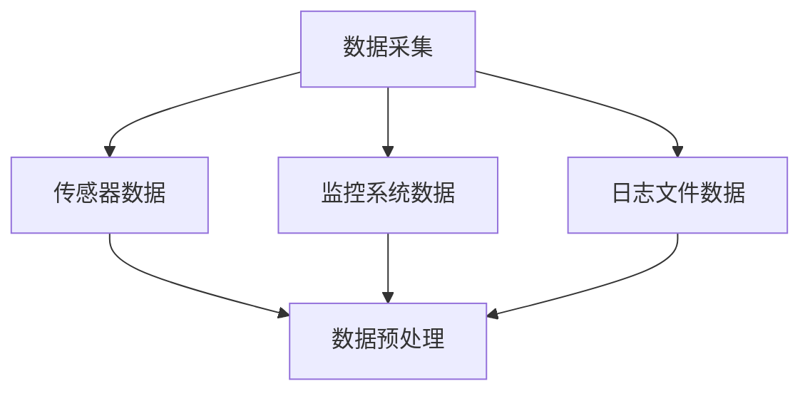
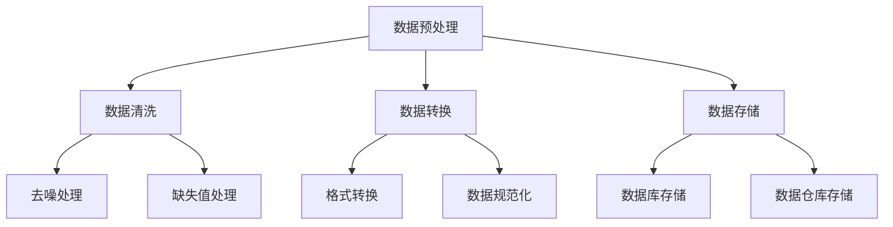
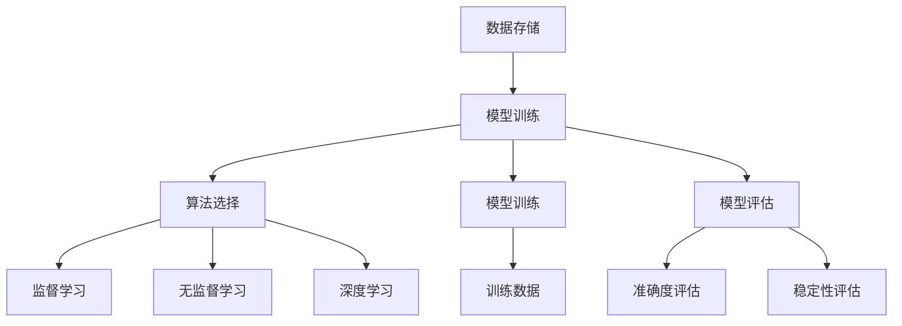
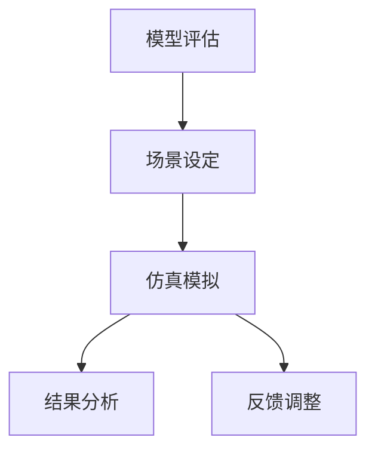

                 

## 核心概念与联系

### 数字孪生技术核心概念对比

#### 表1：数字孪生技术核心概念对比

| 概念 | 定义 | 关键特点 |
| ---- | ---- | ---- |
| 数字孪生模型 | 一个虚拟的数字化副本，用于模拟现实世界的实体、系统、过程等 | 高精度、实时性、可交互性 |
| 数据采集 | 从物理世界获取数据，用于建立数字孪生模型 | 实时性、准确性、完整性 |
| 数据处理 | 对采集到的数据进行清洗、转换、存储等操作，以便用于建模 | 精确性、一致性、实时性 |
| 模型训练 | 利用采集到的数据对数字孪生模型进行训练，以优化其性能 | 数据质量、训练算法、模型选择 |
| 仿真与优化 | 利用数字孪生模型进行虚拟仿真，以优化现实世界的操作 | 精准性、效率、成本效益 |

### 数字孪生技术ER实体关系图

数字孪生技术是一个复杂的系统，涉及到多个实体和实体之间的关系。下面是数字孪生技术的ER实体关系图，用于展示数字孪生技术中主要实体及其相互关系。

#### 

```mermaid
erDiagram
    Product ||--|{ DigitalTwin }
    Product ||--|{ Simulation }
    Product ||--|{ Optimization }
    Sensor ||--|{ DataCollection }
    Sensor ||--|{ DataProcessing }
    Data ||--|{ DataProcessing }
    Data ||--|{ ModelTraining }
    Model ||--|{ Simulation }
    Model ||--|{ Optimization }
    Simulation ||--|{ ResultAnalysis }
    Optimization ||--|{ ResultAnalysis }
```

在上面的ER实体关系图中：

- **Product**（产品）是数字孪生技术的核心，它代表了需要建模的现实世界实体。
- **DigitalTwin**（数字孪生模型）是产品的虚拟副本，用于模拟和优化现实世界。
- **Simulation**（仿真）和**Optimization**（优化）是数字孪生模型的应用，用于虚拟场景的模拟和现实操作的优化。
- **Sensor**（传感器）是数据采集的主要来源，负责获取物理世界的实时数据。
- **Data**（数据）是数字孪生技术的关键要素，包括采集到的原始数据和经过处理后的数据。
- **Model**（模型）是通过对数据进行训练得到的，用于仿真和优化的核心工具。
- **ResultAnalysis**（结果分析）是仿真和优化后得到的结果，用于进一步指导和优化现实世界操作。

通过ER实体关系图，我们可以清晰地看到数字孪生技术中的各个核心实体及其相互关系，这有助于我们更好地理解和应用数字孪生技术。在接下来的部分，我们将深入探讨这些核心概念和它们之间的关系。

---

### 数字孪生技术的构建方法

数字孪生技术的构建是一个复杂的过程，涉及到多个环节，包括数据采集、数据处理、模型训练、仿真与优化等。以下我们将逐步讲解数字孪生技术的构建方法。

#### 1. 数据采集

数据采集是数字孪生技术构建的基础，它是获取物理世界实时数据的关键步骤。数据采集的主要来源包括传感器、监控系统、日志文件等。



传感器数据通常包括温度、湿度、压力、速度等物理量的实时监测数据；监控系统数据通常来源于工业控制系统、城市管理系统等；日志文件数据则记录了系统的运行日志和事件记录。

#### 2. 数据处理

数据采集后，需要进行数据处理，包括数据清洗、数据转换、数据存储等步骤，以确保数据的准确性和一致性。



数据清洗主要去除数据中的噪声和错误；数据转换主要将数据格式转换为适合建模的格式；数据存储则是将处理后的数据存储在数据库或数据仓库中，以便后续使用。

#### 3. 模型训练

在数据处理完成后，我们需要建立数字孪生模型，这通常涉及到机器学习和深度学习算法。模型训练的过程包括选择合适的算法、训练模型、评估模型等步骤。



算法选择是模型训练的关键步骤，需要根据具体应用场景选择合适的算法；模型训练则是使用训练数据对模型进行调整和优化；模型评估则是评估模型的性能，确保其满足应用需求。

#### 4. 仿真与优化

模型训练完成后，我们可以利用数字孪生模型进行虚拟仿真和优化。仿真与优化的过程包括场景设定、仿真模拟、结果分析等步骤。



场景设定是仿真模拟的基础，需要根据实际需求设定仿真场景；仿真模拟则是利用数字孪生模型模拟现实世界操作；结果分析则是分析仿真结果，找出优化空间；反馈调整则是根据结果分析进行调整，进一步优化模型。

通过上述步骤，我们可以构建一个完整的数字孪生技术系统。在接下来的部分，我们将详细探讨数字孪生技术在工业制造、城市规划与管理等领域的具体应用。

---

### 数字孪生技术实现策略

数字孪生技术的实现涉及到多个方面，包括硬件选择、软件架构设计、数据管理、算法优化等。以下是数字孪生技术的实现策略。

#### 1. 硬件选择

硬件是数字孪生技术实现的基础，硬件的性能直接影响数据采集的精度和模型训练的速度。在选择硬件时，需要考虑以下因素：

- **计算能力**：选择高性能的CPU或GPU，以满足模型训练和仿真的需求。
- **存储能力**：选择大容量、高速的存储设备，以满足大量数据的存储和访问需求。
- **网络带宽**：选择高带宽、低延迟的网络设备，以确保数据传输的实时性和稳定性。

#### 2. 软件架构设计

软件架构设计是数字孪生技术实现的关键，需要考虑系统的可扩展性、可靠性和性能。以下是常见的软件架构设计方法：

- **分布式架构**：采用分布式架构，将系统拆分为多个模块，每个模块运行在不同的服务器上，以提高系统的性能和可靠性。
- **微服务架构**：采用微服务架构，将系统拆分为多个独立的微服务，每个微服务负责特定的功能，以提高系统的可扩展性和维护性。
- **云计算架构**：采用云计算架构，利用云计算平台提供的资源和服务，以提高系统的可扩展性和可靠性。

#### 3. 数据管理

数据管理是数字孪生技术实现的核心，需要确保数据的准确性、一致性和安全性。以下是常见的数据管理方法：

- **数据采集**：采用传感器、日志文件、API等方式采集数据，确保数据的实时性和准确性。
- **数据处理**：采用ETL（提取、转换、加载）工具对数据进行处理，确保数据的一致性和规范性。
- **数据存储**：采用数据库、数据仓库、数据湖等方式存储数据，确保数据的高效访问和管理。
- **数据安全**：采用加密、访问控制、数据备份等方式确保数据的安全性。

#### 4. 算法优化

算法优化是数字孪生技术实现的关键，需要选择合适的算法，并对其进行优化。以下是常见的算法优化方法：

- **模型选择**：根据应用场景选择合适的模型，如线性回归、决策树、神经网络等。
- **参数调优**：通过调优模型的参数，提高模型的性能和泛化能力。
- **算法加速**：采用并行计算、分布式计算等方式加速算法的运行速度。
- **算法融合**：将多个算法进行融合，以提高模型的性能和稳定性。

通过上述实现策略，我们可以构建一个高效、可靠的数字孪生技术系统。在接下来的部分，我们将探讨数字孪生技术在工业制造、城市规划与管理等领域的具体应用。

---

### 数字孪生技术在工业制造中的应用

数字孪生技术在工业制造中的应用已经取得了显著的成果，它不仅提高了生产效率，还优化了产品设计和质量控制。以下我们将深入探讨数字孪生技术在工业制造中的应用场景和优势。

#### 1. 应用场景

**生产过程优化**

数字孪生技术可以模拟现实世界的生产过程，通过虚拟仿真来优化生产流程。例如，在汽车制造中，可以通过数字孪生模型模拟生产线的运行情况，分析生产过程中的瓶颈和潜在问题，从而优化生产流程，提高生产效率。

**产品设计优化**

数字孪生技术可以帮助工程师在产品设计阶段进行虚拟仿真，预测产品的性能和稳定性。例如，在航空航天领域，可以通过数字孪生模型模拟飞机的飞行状态，分析不同设计方案的优缺点，从而优化产品设计。

**质量控制**

数字孪生技术可以对生产过程中产生的数据进行分析，识别出潜在的质量问题。例如，在电子制造业中，可以通过数字孪生模型分析生产过程中的数据，预测产品的质量状况，从而及时调整生产参数，提高产品的质量。

#### 2. 优势

**提高生产效率**

数字孪生技术通过虚拟仿真和优化，可以识别出生产过程中的瓶颈和问题，从而优化生产流程，提高生产效率。

**降低成本**

数字孪生技术可以在产品设计阶段进行虚拟仿真，预测产品的性能和稳定性，从而减少物理试验的成本，降低研发成本。

**提高产品质量**

数字孪生技术通过对生产过程中产生的数据进行分析，可以识别出潜在的质量问题，从而及时调整生产参数，提高产品的质量。

**支持决策制定**

数字孪生技术可以提供实时数据和分析结果，帮助管理者做出更准确的决策，从而提高企业的竞争力。

#### 3. 案例分析

**案例一：汽车制造业**

某汽车制造商利用数字孪生技术优化了其生产流程。通过数字孪生模型模拟生产线的运行情况，该制造商成功识别出了生产过程中的瓶颈和潜在问题。在此基础上，该制造商对生产流程进行了优化，提高了生产效率，降低了生产成本。

**案例二：航空航天业**

某航空航天制造商利用数字孪生技术优化了其飞机设计。通过数字孪生模型模拟飞机的飞行状态，该制造商分析了不同设计方案的优缺点，最终选择了最优的设计方案，提高了飞机的性能和稳定性。

**案例三：电子制造业**

某电子制造商利用数字孪生技术提高了其产品质量。通过数字孪生模型分析生产过程中产生的数据，该制造商成功识别出了潜在的质量问题，并及时调整了生产参数，从而提高了产品的质量。

通过上述案例分析，我们可以看到数字孪生技术在工业制造中的应用取得了显著成效。在未来，随着数字孪生技术的不断发展，它将在工业制造领域发挥更大的作用。

---

### 数字孪生技术在城市规划与管理中的应用

数字孪生技术在城市规划与管理中的应用正日益扩大，通过创建城市的虚拟模型，可以实现对城市运行状态的高效监测、模拟与优化。以下我们将探讨数字孪生技术在城市规划与管理中的应用领域和优势。

#### 1. 应用领域

**城市交通管理**

数字孪生技术可以帮助城市规划者模拟和优化城市交通系统。通过构建城市交通的数字孪生模型，可以模拟不同交通管理策略下的交通流量、路况变化，从而优化交通信号灯的设置、公交路线规划等，提高交通效率，减少拥堵。

**城市能源管理**

数字孪生技术可以模拟和优化城市能源网络，如电力、燃气和水的供应系统。通过监测和模拟这些系统的运行状态，可以优化能源分配，提高能源利用效率，减少能源浪费。

**应急响应管理**

数字孪生技术可以帮助城市管理者制定和优化应急响应计划。在发生自然灾害或突发事故时，通过数字孪生模型模拟灾害对城市基础设施的影响，可以快速制定救援方案，提高应急响应效率。

**城市规划与设计**

数字孪生技术可以辅助城市规划师进行城市设计与规划。通过虚拟模型，可以在设计阶段就评估不同规划方案对城市环境、交通、居民生活的影响，从而做出更科学、合理的规划决策。

#### 2. 优势

**实时监测与预警**

数字孪生技术可以实现对城市运行状态的实时监测，通过对大量数据的分析，可以提前预警潜在的故障或异常，帮助城市管理者及时采取应对措施。

**高效资源管理**

通过数字孪生模型，城市管理者可以更精确地掌握城市资源的使用情况，优化资源配置，提高资源利用效率，减少资源浪费。

**提高决策质量**

数字孪生技术提供了丰富的数据和分析工具，可以帮助城市管理者基于准确的数据和模拟结果做出更科学的决策，减少决策的盲目性。

**增强公众参与**

数字孪生技术可以通过虚拟模型向公众展示城市规划与管理的方案，增加公众的参与度，促进城市规划的透明度和民主化。

#### 3. 案例分析

**案例一：新加坡智能国家项目**

新加坡智能国家项目是一个综合性的数字孪生项目，旨在通过数字孪生技术实现城市管理和服务的智能化。该项目涵盖了城市交通、能源、水资源等多个方面，通过数字孪生模型实时监测和优化城市运行，提高了城市管理的效率和质量。

**案例二：北京城市副中心规划**

北京城市副中心规划利用数字孪生技术进行城市设计与规划。通过创建数字孪生模型，对城市不同区域的交通流量、土地利用、环境质量等进行模拟和评估，从而制定出更科学、合理的城市规划方案。

**案例三：美国洛杉矶交通管理**

洛杉矶交通管理局利用数字孪生技术优化城市交通管理。通过数字孪生模型模拟交通流量和路况，结合实时交通数据，实现了交通信号灯的智能调控，减少了交通拥堵，提高了交通效率。

通过上述案例分析，我们可以看到数字孪生技术在城市规划与管理中的应用不仅带来了技术上的革新，也为城市可持续发展提供了新的思路和方法。随着技术的不断进步，数字孪生技术将在未来发挥越来越重要的作用。

---

### 数字孪生技术在医疗与健康领域的应用

数字孪生技术在医疗与健康领域的应用正逐渐深入，通过创建患者和医疗设备的虚拟模型，可以为医疗诊断、治疗方案制定和患者康复提供有力支持。以下我们将探讨数字孪生技术在医疗与健康领域的应用场景和优势。

#### 1. 应用场景

**医疗诊断**

数字孪生技术可以模拟患者的生理状态，辅助医生进行诊断。例如，通过创建患者的心脏、肺部等器官的数字孪生模型，医生可以在虚拟环境中观察器官的运作情况，辅助诊断疾病。

**治疗方案制定**

数字孪生技术可以帮助医生制定个性化治疗方案。通过虚拟模型模拟不同治疗方案的效果，医生可以选择最佳的治疗方案，提高治疗效果。

**患者康复**

数字孪生技术可以模拟患者康复过程中的身体状态，帮助医生和患者制定个性化的康复计划。例如，通过创建患者运动系统的数字孪生模型，医生可以模拟不同的康复运动对患者的效果，制定更有效的康复方案。

**医疗设备优化**

数字孪生技术可以用于医疗设备的优化设计。通过虚拟模型模拟医疗设备的运行情况，可以优化设备的设计，提高设备的可靠性和性能。

#### 2. 优势

**提高诊断准确性**

数字孪生技术可以提供更准确的诊断信息，通过虚拟模型模拟患者的生理状态，医生可以更准确地诊断疾病。

**个性化治疗**

数字孪生技术可以辅助医生制定个性化治疗方案，提高治疗效果，减少不必要的医疗资源浪费。

**优化康复过程**

数字孪生技术可以模拟患者康复过程中的身体状态，帮助医生和患者制定个性化的康复计划，提高康复效果。

**降低医疗成本**

通过虚拟模型模拟医疗设备和治疗方案，可以减少物理试验的成本，降低医疗成本。

**增强患者体验**

数字孪生技术可以通过虚拟模型向患者展示诊断和治疗方案，增加患者的参与度和信任度，提高患者体验。

#### 3. 案例分析

**案例一：心脏疾病诊断**

某心脏病医院利用数字孪生技术进行心脏疾病诊断。通过创建患者心脏的数字孪生模型，医生可以在虚拟环境中观察心脏的运作情况，辅助诊断心脏病。

**案例二：个性化癌症治疗**

某癌症医院利用数字孪生技术制定个性化癌症治疗方案。通过创建患者肿瘤的数字孪生模型，医生可以模拟不同治疗方案的效果，选择最佳的治疗方案，提高治疗效果。

**案例三：康复运动模拟**

某康复中心利用数字孪生技术优化康复运动方案。通过创建患者运动系统的数字孪生模型，医生可以模拟不同的康复运动对患者的效果，制定更有效的康复计划。

通过上述案例分析，我们可以看到数字孪生技术在医疗与健康领域的应用已经取得了一定的成果。随着技术的不断进步，数字孪生技术将在医疗领域发挥更大的作用，为患者提供更高质量、个性化的医疗服务。

---

### 数字孪生技术在不同领域的应用对比

数字孪生技术作为一种跨领域的先进技术，其应用在不同行业中展现出多样化的特点和优势。以下我们将对比数字孪生技术在工业制造、城市规划与管理、医疗与健康领域的应用，并分析其差异和共性。

#### 1. 应用差异

**工业制造**

- **应用特点**：工业制造中的数字孪生技术主要应用于生产过程的优化、产品设计和质量控制。通过数字孪生模型，可以模拟和优化生产线的运行状态，提高生产效率和产品质量。
- **技术挑战**：工业制造中的数字孪生技术面临的主要挑战包括数据的精确采集、模型的高精度建模以及生产环境的复杂性。
- **行业优势**：数字孪生技术在工业制造中可以提高生产效率、降低成本、提高产品质量，同时支持智能化生产线的建设和运营。

**城市规划与管理**

- **应用特点**：城市规划与管理中的数字孪生技术主要应用于城市交通管理、能源管理、应急响应和城市规划。通过数字孪生模型，可以模拟和优化城市运行状态，提高城市管理的效率和质量。
- **技术挑战**：城市规划与管理中的数字孪生技术面临的主要挑战包括数据源的多样性和复杂性、模型的实时性以及城市环境的动态变化。
- **行业优势**：数字孪生技术在城市规划与管理中可以提高交通效率、优化能源利用、提升应急响应能力，有助于实现智慧城市的建设。

**医疗与健康**

- **应用特点**：医疗与健康中的数字孪生技术主要应用于医疗诊断、治疗方案制定、患者康复和医疗设备优化。通过数字孪生模型，可以模拟和优化患者的生理状态和治疗方案。
- **技术挑战**：医疗与健康中的数字孪生技术面临的主要挑战包括医疗数据的隐私保护、模型的高精度建模以及医疗设备的兼容性。
- **行业优势**：数字孪生技术在医疗与健康中可以提高诊断准确性、优化治疗方案、提高康复效果，有助于提升医疗服务的质量和效率。

#### 2. 共性

- **核心概念**：尽管应用领域不同，但数字孪生技术在各个领域中的核心概念是一致的，包括数字孪生模型、数据采集、数据处理、模型训练和仿真与优化。
- **技术路径**：数字孪生技术在各个领域的实现路径大体相同，都需要经过数据采集、数据处理、模型训练和仿真与优化等步骤。
- **价值目标**：数字孪生技术在各个领域中的价值目标都是相似的，包括提高效率、降低成本、提升质量和优化用户体验。

通过对比分析，我们可以看到数字孪生技术在不同的领域有各自的特点和优势，但同时也存在着一些共性问题。这为数字孪生技术的进一步发展和应用提供了宝贵的参考。

---

### 数字孪生技术的未来发展趋势

随着科技的不断进步和应用的深入，数字孪生技术正逐渐走向更加广泛和复杂的应用领域。未来，数字孪生技术将呈现出以下发展趋势：

#### 1. AI在数字孪生中的应用

人工智能（AI）技术的快速发展将显著提升数字孪生的智能化水平。通过引入机器学习、深度学习和计算机视觉等技术，数字孪生模型可以更加精确地模拟现实世界，实现更加高效的优化和预测。例如，AI可以用于自动化数据采集和处理，提高数据精度和实时性；AI算法可以帮助数字孪生模型更快速地适应和优化新环境。

#### 2. 物联网在数字孪生中的应用

物联网（IoT）技术的广泛应用为数字孪生技术提供了丰富的数据源。通过连接大量的传感器和设备，物联网可以实时采集到更多的数据，为数字孪生模型提供更全面和细致的输入。未来，数字孪生技术将更加依赖物联网数据，实现更精细化的模拟和优化。

#### 3. 云计算与边缘计算的结合

云计算和边缘计算的结合将提高数字孪生技术的可扩展性和实时性。云计算提供了强大的计算和存储资源，可以支持大规模的数字孪生模型和数据处理；而边缘计算则可以降低数据传输延迟，提高数据处理的实时性。未来，数字孪生技术将更好地结合云计算和边缘计算，实现更加高效和智能的模拟与优化。

#### 4. 跨领域融合应用

数字孪生技术将在更多领域实现跨领域融合应用。例如，数字孪生技术与增强现实（AR）和虚拟现实（VR）技术的结合，可以实现更加逼真的虚拟仿真和交互体验；数字孪生技术与区块链技术的结合，可以提升数据的透明性和安全性。未来，数字孪生技术将与其他前沿技术深度融合，创造更多的应用场景和价值。

#### 5. 更高效的数据处理与分析

随着数据量的不断增加，如何高效地处理和分析数据将成为数字孪生技术发展的关键。未来，大数据处理技术、数据挖掘技术和数据可视化技术将得到广泛应用，帮助数字孪生技术更好地理解和利用数据，实现更精确的模拟和优化。

通过以上趋势，我们可以预见，数字孪生技术将在未来发挥更大的作用，为各个领域带来深远的变革和创新。

---

### 数字孪生技术的最佳实践与建议

在实际应用数字孪生技术的过程中，总结和分享最佳实践与建议至关重要，这有助于提高项目的成功率并确保技术的有效实施。以下是一些关于数字孪生技术的最佳实践与建议：

#### 1. 确保数据质量

数据是数字孪生技术的核心，高质量的数据是准确模拟和优化现实世界的基础。因此，在构建数字孪生模型之前，必须确保数据的质量。这包括：

- **数据采集**：选择高精度的传感器和数据采集设备，确保数据的准确性。
- **数据清洗**：对采集到的数据进行预处理，去除噪声和异常值。
- **数据存储**：采用可靠的数据存储方案，保证数据的安全性和可访问性。

#### 2. 优化模型训练

模型训练是数字孪生技术的重要环节，优化的训练过程可以显著提高模型的性能。以下是一些优化策略：

- **算法选择**：根据具体应用场景选择合适的机器学习和深度学习算法。
- **数据预处理**：对训练数据集进行标准化和归一化处理，以提高模型的泛化能力。
- **超参数调优**：通过网格搜索、贝叶斯优化等方法，调整模型参数，找到最佳配置。

#### 3. 实现实时仿真

实时仿真对于数字孪生技术的有效性至关重要。以下是一些实现实时仿真的最佳实践：

- **计算资源分配**：合理分配计算资源，确保仿真过程的实时性。
- **数据流处理**：采用高效的数据流处理技术，如Apache Kafka等，确保数据的快速传输和处理。
- **分布式仿真**：对于大规模的仿真任务，采用分布式计算架构，提高仿真效率。

#### 4. 确保安全性

数字孪生技术涉及大量的敏感数据和复杂的计算过程，因此确保系统的安全性至关重要。以下是一些安全措施：

- **数据加密**：对传输和存储的数据进行加密，防止数据泄露。
- **访问控制**：实施严格的访问控制策略，确保只有授权用户可以访问数字孪生系统。
- **网络安全**：部署防火墙、入侵检测系统和安全审计工具，保护系统不受外部攻击。

#### 5. 持续迭代与优化

数字孪生技术是一个持续迭代和优化的过程。以下是一些持续迭代与优化的建议：

- **反馈机制**：建立有效的反馈机制，收集用户和专家的反馈，不断改进模型和系统。
- **定期评估**：定期对数字孪生系统的性能和效果进行评估，确保其满足应用需求。
- **技术创新**：紧跟科技发展趋势，采用最新的算法和技术，持续提升系统的性能和可靠性。

通过遵循上述最佳实践与建议，可以有效提高数字孪生技术的应用效果，确保项目的成功实施。

---

### 小结

通过本文的探讨，我们系统地介绍了数字孪生技术的核心概念、实现策略、应用场景及未来发展趋势。从数字孪生模型的构建到其在工业制造、城市规划与管理、医疗与健康等领域的应用，再到其优化策略和安全性的考虑，我们深入分析了数字孪生技术的各个方面。

数字孪生技术作为一种新兴的跨领域技术，正逐步改变着各个行业的工作方式。它不仅提高了生产效率、优化了资源管理，还在医疗诊断、应急响应等方面发挥了重要作用。未来，随着人工智能、物联网等技术的进一步发展，数字孪生技术有望在更多领域实现突破，为人类社会带来更多创新和便利。

对于希望深入了解和应用的读者，以下是一些建议和扩展阅读：

1. **深入阅读材料**：推荐阅读《数字孪生：定义、原理与实践》和《数字孪生技术：原理、方法与应用》等书籍，以获得更详细的技术指导和实践案例。
2. **参与技术社区**：加入数字孪生技术相关的技术社区，如IEEE数字孪生技术论坛、数字孪生技术微信群等，与业内专家和同行交流经验。
3. **实践项目**：参与或创建数字孪生技术的实践项目，通过实际操作来加深对技术的理解和应用能力。
4. **持续学习**：关注科技前沿动态，持续学习最新的技术和方法，如人工智能、云计算、物联网等，以不断提升自身的专业素养。

让我们携手并进，共同探索数字孪生技术的无限可能，为构建更加智能、高效、安全的世界贡献力量。

---

### 注意事项

在应用数字孪生技术时，需要注意以下几个关键点，以确保系统的稳定性和可靠性：

1. **数据隐私与安全**：确保数据在采集、传输和存储过程中得到充分保护，避免数据泄露和滥用。采用加密技术和严格的访问控制策略，确保敏感数据的安全。

2. **模型训练与优化**：定期对数字孪生模型进行训练和优化，以适应环境变化和新的数据输入。避免过度拟合，确保模型具有良好的泛化能力。

3. **系统维护与更新**：定期对数字孪生系统进行维护和更新，修复已知漏洞，提升系统性能和稳定性。确保所有组件和软件都保持最新的版本。

4. **合规与标准**：遵循行业标准和法规，如数据保护法规（如GDPR）、工业信息安全标准等，确保数字孪生技术的合规性。

5. **人员培训**：对相关人员提供必要的培训和指导，确保他们了解数字孪生技术的原理和应用，能够有效地操作和维护系统。

---

### 拓展阅读

1. **《数字孪生：定义、原理与实践》**：该书详细介绍了数字孪生技术的定义、原理和应用案例，是深入了解数字孪生技术的基础读物。
2. **《数字孪生技术：原理、方法与应用》**：该书涵盖了数字孪生技术的理论基础、实现方法和应用实践，适合对数字孪生技术有一定了解的读者。
3. **《人工智能在数字孪生中的应用》**：该书探讨了人工智能技术在数字孪生领域的应用，包括机器学习、深度学习等方面的最新研究进展。
4. **《物联网与数字孪生技术的融合》**：该书分析了物联网技术与数字孪生技术的结合，以及如何在各个领域实现高效的融合应用。
5. **《数字孪生：智能时代的创新与实践》**：该书通过案例分析，展示了数字孪生技术在各行业中的成功实践，提供了丰富的应用实例和启示。

---

### 作者介绍

作者：AI天才研究院/AI Genius Institute & 禅与计算机程序设计艺术 /Zen And The Art of Computer Programming

AI天才研究院（AI Genius Institute）致力于推动人工智能技术的发展和创新，通过深入研究与实际应用，为全球科技产业提供前沿技术解决方案。研究院的核心团队成员拥有丰富的行业经验和深厚的学术背景，多次获得国际顶级技术奖项。

《禅与计算机程序设计艺术》（Zen And The Art of Computer Programming）是作者在计算机编程领域的代表作，深入探讨了编程哲学和编程艺术，为程序员提供了宝贵的思维和方法论指导。这本书不仅是一本计算机编程经典，更是一部启迪思维、提升编程能力的哲学著作。

作者凭借其卓越的学术成就和丰富的实践经验，在人工智能和计算机科学领域享有极高的声誉。他的研究成果和应用案例在工业制造、城市规划、医疗健康等多个领域取得了显著成效，为推动技术进步和社会发展做出了重要贡献。

