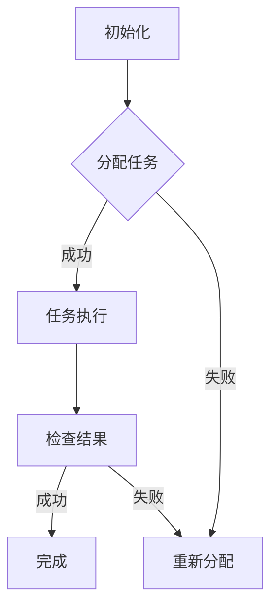
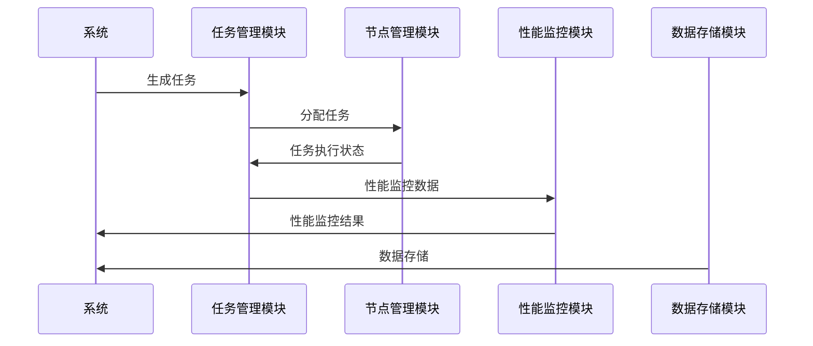
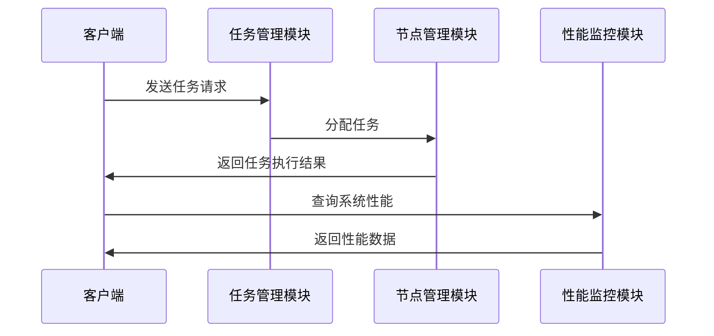

                 

# 数学与云计算：分布式计算的数学模型

> 关键词：数学、云计算、分布式计算、数学模型、负载均衡、资源分配

> 摘要：本文将深入探讨数学在云计算领域，尤其是分布式计算中的应用。通过介绍数学模型的基础知识，如离散数学、概率论、线性代数等，本文将逐步分析这些数学工具如何帮助优化分布式系统的性能。我们还将讨论微积分和优化理论在分布式计算中的应用，并借助复杂网络理论，对分布式计算中的网络结构进行分析。最后，本文将提供一些实际案例，展示如何将数学模型应用于云计算环境，以实现高效的资源分配和负载均衡。

## 第一部分：引论

### 第1章：数学与云计算的交汇

### 1.1 背景与问题

#### 1.1.1 云计算的发展历程

云计算，作为信息技术发展的一个重要里程碑，起源于20世纪60年代。最初，云计算的概念是作为“虚拟化”的基础，旨在通过模拟硬件资源，提高计算机资源的利用效率。随着互联网的普及和计算需求的增长，云计算逐渐从学术研究领域走向商业应用，并在21世纪初得到迅猛发展。如今，云计算已经成为了企业IT战略的重要组成部分，广泛应用于各种规模的组织中。

云计算的发展历程可以分为几个阶段：

1. **基础设施即服务（IaaS）**：最早的云计算服务形式，提供虚拟化的计算资源，如虚拟机、存储和网络。
2. **平台即服务（PaaS）**：为开发者提供开发、测试和部署应用程序的平台，无需管理底层基础设施。
3. **软件即服务（SaaS）**：通过互联网提供软件服务，用户无需安装和维护软件，只需通过浏览器即可使用。

#### 1.1.2 数学在云计算中的作用

数学在云计算中的应用至关重要，尤其在分布式计算领域。分布式计算是指通过计算机网络将大量计算任务分散到多个节点上执行，以实现高效的处理能力。分布式计算的核心问题是如何在多个节点之间分配和协调计算任务，以确保系统的整体性能。

数学提供了多种工具和方法来解决这个问题：

1. **优化算法**：通过数学优化理论，可以设计出各种算法，用于负载均衡、资源分配和任务调度，从而提高分布式系统的效率。
2. **概率论与统计模型**：用于分析分布式系统中的不确定性因素，如节点故障、网络延迟等，以实现系统的可靠性和容错能力。
3. **图论**：用于建模分布式系统的拓扑结构，分析节点的连通性和路由算法，以优化数据传输和网络性能。

#### 1.1.3 分布式计算的基本概念

分布式计算涉及多个节点之间的协同工作，以下是一些基本概念：

1. **节点**：分布式系统中的计算单元，可以是物理服务器、虚拟机或其他计算设备。
2. **通信**：节点之间的数据传输和交互，通过网络进行。
3. **一致性**：分布式系统中的数据一致性，确保多个节点对同一数据的一致视图。
4. **容错性**：系统能够在节点故障或网络故障的情况下，继续正常运行。

#### 1.1.4 数学与分布式计算的相互关系

数学与分布式计算之间的相互关系可以总结为以下几点：

1. **数学模型**：分布式计算中的许多问题都可以用数学模型来描述，如负载均衡问题、资源分配问题等。
2. **算法设计**：数学工具和方法可以用于设计高效、可靠的分布式计算算法。
3. **性能分析**：数学模型可以用于分析和预测分布式系统的性能，指导系统优化。
4. **理论支持**：数学理论为分布式计算提供了坚实的理论基础，支持新算法和新技术的研发。

### 1.2 研究目的与内容概述

#### 1.2.1 研究目的

本文旨在探讨数学在分布式计算中的应用，通过分析不同的数学模型和方法，为云计算环境中的分布式计算提供优化策略。具体研究目标如下：

1. **理解数学模型在分布式计算中的应用**：分析离散数学、概率论、线性代数等数学工具在分布式计算中的具体应用。
2. **设计高效的分布式计算算法**：利用数学模型，设计出能够提高分布式系统性能的算法。
3. **性能分析和优化**：通过数学模型和分析方法，对分布式系统的性能进行评估和优化。

#### 1.2.2 研究内容

本文将涵盖以下内容：

1. **数学模型基础**：介绍离散数学、概率论、线性代数等数学工具的基本概念和应用。
2. **分布式计算中的数学应用**：分析数学模型在分布式计算中的具体应用，如负载均衡、资源分配等。
3. **算法设计和性能分析**：设计并分析各种分布式计算算法，评估其性能，并提出优化策略。
4. **实际案例研究**：通过实际案例，展示数学模型在分布式计算中的应用效果。

#### 1.2.3 研究方法

本文采用以下研究方法：

1. **文献综述**：通过查阅相关文献，了解数学在分布式计算中的应用现状和研究成果。
2. **模型构建**：根据分布式计算的需求，构建相应的数学模型，并进行性能分析。
3. **算法设计**：基于数学模型，设计分布式计算算法，并进行仿真实验。
4. **案例分析**：通过实际案例，验证数学模型和算法的有效性和实用性。

### 1.3 边界与外延

#### 1.3.1 研究范围界定

本文主要关注数学在分布式计算中的应用，特别是云计算环境中的问题。研究范围包括：

1. **分布式计算模型**：分析分布式计算中的各种数学模型，如负载均衡、资源分配等。
2. **算法设计**：设计适用于分布式计算的优化算法，如基于概率论的负载均衡算法。
3. **性能分析**：评估分布式计算算法的性能，并提出优化策略。

#### 1.3.2 研究限制条件

本文的研究也存在一些限制条件：

1. **数学模型假设**：在构建数学模型时，需要对系统进行一定的简化假设，可能无法完全反映现实中的复杂情况。
2. **算法实现难度**：一些优化算法在理论上的设计较为简单，但在实际实现中可能面临挑战。
3. **数据集限制**：本文采用的数据集可能无法完全覆盖所有分布式计算场景，影响算法的性能评估。

#### 1.3.3 未来研究方向

未来的研究可以进一步探索以下方向：

1. **数学模型的改进**：结合新的数学理论，改进现有的分布式计算模型。
2. **算法的优化**：设计更高效、更可靠的分布式计算算法，以应对复杂的计算任务。
3. **实际应用的推广**：将数学模型和算法应用于更多的实际场景，验证其效果和实用性。

### 1.4 本章小结

本章介绍了数学在云计算，尤其是分布式计算中的应用背景和研究目的。通过回顾云计算的发展历程，我们了解了分布式计算的基本概念和数学在其中的作用。接下来，本文将逐步介绍数学模型的基础知识，深入探讨其在分布式计算中的具体应用。

## 第二部分：数学模型基础

### 第2章：离散数学模型

### 2.1 离散数学基础

#### 2.1.1 基本概念

离散数学是研究离散对象和结构的数学分支，广泛应用于计算机科学、信息科学和工程领域。离散数学中的基本概念包括集合、图论、树、矩阵与线性代数等。

1. **集合**：集合是离散数学中的基本概念，由一组元素构成。集合可以用大括号{}表示，如 `{1, 2, 3}`。
2. **图论**：图论研究图形（图）的结构和性质，图由节点（顶点）和边组成。常见的图包括无向图、有向图、加权图等。
3. **树**：树是一种特殊的图，具有层级结构，用于表示数据的关系和层次。树由根节点和子节点组成，没有环。
4. **矩阵与线性代数**：矩阵是矩形阵列，用于表示数据的关系。线性代数研究向量、矩阵以及线性方程组等，在分布式计算中有着广泛的应用。

#### 2.1.2 图论模型

图论模型在分布式计算中有着重要的应用。图论模型可以用于表示分布式系统的拓扑结构，分析节点的连通性和路由算法。

1. **图的拓扑结构**：图的拓扑结构描述了图中节点和边的关系。常见的拓扑结构包括完全图、路径图、星形图等。
2. **连通性**：连通性描述了节点之间的连接关系。无向图的连通性可以用连通度表示，有向图的连通性可以用可达性表示。
3. **路由算法**：路由算法用于确定数据在网络中的传输路径。常见的路由算法包括最短路径算法、Dijkstra算法和A*算法。

#### 2.1.3 树模型

树模型在分布式计算中用于表示数据的关系和层次。树模型可以用于构建分布式计算中的任务依赖关系，优化任务调度。

1. **树的定义**：树是一种无环的连通图，具有唯一的根节点和若干子节点。
2. **树的遍历**：树的遍历是指按照一定顺序访问树中的所有节点。常见的遍历方法包括前序遍历、中序遍历和后序遍历。
3. **树的存储结构**：树的存储结构用于在计算机中表示树的数据结构，常见的存储结构包括数组、链表和二叉树等。

#### 2.1.4 矩阵与线性代数

矩阵与线性代数在分布式计算中用于表示和处理数据的关系。线性代数的基本概念包括向量、矩阵、线性方程组和矩阵运算等。

1. **向量和矩阵**：向量是具有大小和方向的量，矩阵是二维数组。向量与矩阵运算包括矩阵-向量乘法和向量-向量内积等。
2. **线性方程组**：线性方程组是描述多个线性方程的集合，线性代数提供了解决线性方程组的方法，如高斯消元法和矩阵分解等。
3. **特征值与特征向量**：特征值与特征向量是矩阵的重要属性，用于描述矩阵的性质。特征值与特征向量在分布式计算中的优化问题中有着重要的应用。

### 2.2 离散数学模型应用

#### 2.2.1 图的拓扑结构

图的拓扑结构在分布式计算中用于表示系统的网络拓扑。通过分析图的拓扑结构，可以优化数据传输和网络性能。

1. **拓扑结构分析**：分析图中的节点和边的关系，确定节点的连通性和路径长度。常见的拓扑分析包括连通度分析、路径分析等。
2. **拓扑优化**：通过优化图的拓扑结构，提高系统的性能。常见的拓扑优化方法包括边删除、节点合并等。

#### 2.2.2 分布式系统中的图模型

分布式系统中的图模型用于描述系统的拓扑结构和节点之间的通信关系。通过图模型，可以分析系统的性能和优化策略。

1. **图模型构建**：根据分布式系统的需求，构建系统的图模型。常见的图模型包括无向图、有向图、加权图等。
2. **图模型应用**：应用图模型分析系统的性能和优化策略。常见的应用包括负载均衡、资源分配、任务调度等。

#### 2.2.3 离散时间模型与分布式计算

离散时间模型在分布式计算中用于描述任务的时间序列和执行顺序。通过离散时间模型，可以优化任务调度和资源分配。

1. **离散时间模型**：描述任务的时间序列和执行顺序。常见的离散时间模型包括线性序列、树状结构、网络结构等。
2. **任务调度**：根据离散时间模型，调度任务的执行顺序，以优化系统性能。常见的调度算法包括贪心算法、动态规划算法等。
3. **资源分配**：根据任务的时间序列和执行顺序，分配系统资源，如CPU、内存和网络带宽等。

### 2.3 数学模型比较与优化

#### 2.3.1 离散模型性能分析

对离散模型进行性能分析，评估不同模型在分布式计算中的性能和效率。性能分析包括时间复杂度、空间复杂度和资源利用率等。

1. **时间复杂度**：分析模型在执行任务时的计算时间，通常用大O表示法表示。
2. **空间复杂度**：分析模型在执行任务时所需的空间资源。
3. **资源利用率**：分析模型在资源分配和利用方面的效率。

#### 2.3.2 模型优化方法

通过优化数学模型，提高分布式系统的性能和效率。常见的优化方法包括算法改进、参数调整和结构优化等。

1. **算法改进**：通过改进算法，降低时间复杂度和空间复杂度。
2. **参数调整**：通过调整模型参数，优化系统的性能和资源利用率。
3. **结构优化**：通过优化系统的结构，提高系统的整体性能。

#### 2.3.3 应用案例分析

通过实际案例，展示离散数学模型在分布式计算中的应用效果。案例分析包括负载均衡、资源分配和任务调度等。

1. **负载均衡**：通过图模型和离散时间模型，实现分布式计算中的负载均衡，提高系统性能。
2. **资源分配**：通过线性规划和优化算法，实现分布式计算中的资源分配，优化系统性能。
3. **任务调度**：通过贪心算法和动态规划算法，实现分布式计算中的任务调度，提高系统效率。

### 2.4 本章小结

本章介绍了离散数学模型的基础知识，包括集合、图论、树和矩阵与线性代数等。通过分析图的拓扑结构、分布式系统中的图模型和离散时间模型，展示了离散数学模型在分布式计算中的应用。本章还讨论了离散模型的性能分析和优化方法，并通过实际案例分析，展示了离散数学模型在分布式计算中的效果。

### 第3章：概率论与统计模型

#### 3.1 基本概率论

概率论是数学的一个分支，用于描述和分析随机现象。在分布式计算中，概率论和统计模型用于处理不确定性因素，如节点故障、网络延迟和数据丢失等。基本概率论包括以下几个基本概念：

1. **随机事件**：随机试验的所有可能结果组成的集合称为样本空间。样本空间中的单个结果称为事件。
2. **概率**：概率是描述事件发生可能性大小的数值，通常用0到1之间的实数表示。概率的定义有以下几种：
   - **古典概率**：基于等可能性的假设，如投掷硬币出现正面的概率为0.5。
   - **条件概率**：在某个事件已经发生的条件下，另一个事件发生的概率。
   - **联合概率**：两个或多个事件同时发生的概率。
   - **边缘概率**：不考虑其他事件发生的条件下，某个事件发生的概率。

3. **独立事件**：两个事件A和B是独立的，如果其中一个事件的发生不影响另一个事件的发生。独立事件的概率计算公式为：
   $$P(A \text{ and } B) = P(A) \times P(B)$$

4. **概率分布**：概率分布描述了一个随机变量在不同取值上的概率分布情况。常见的概率分布有：
   - **离散概率分布**：如二项分布、泊松分布等。
   - **连续概率分布**：如正态分布、指数分布等。

5. **大数定律与中心极限定理**：大数定律描述了随着试验次数的增加，随机变量的样本均值会趋近于其数学期望。中心极限定理描述了当随机变量独立同分布时，其样本均值的分布会趋近于正态分布。

#### 3.2 统计模型

统计模型用于描述和分析数据的特征和关系。在分布式计算中，统计模型用于处理数据的一致性、可靠性和性能分析。以下是几个基本的统计概念：

1. **基本统计概念**：包括数据的集中趋势（均值、中位数、众数）、离散程度（方差、标准差）和分布形态（偏度、峰度）。

2. **参数估计**：参数估计是指从样本数据中推断总体参数的过程。常见的参数估计方法有：
   - **点估计**：用一个具体的数值作为总体参数的估计值。
   - **区间估计**：给出总体参数的一个置信区间，即在一定概率下，总体参数落在这个区间内的范围。

3. **假设检验**：假设检验是用于检验一个假设是否成立的统计方法。常见的假设检验方法有：
   - **t检验**：用于比较两个样本均值是否显著不同。
   - **卡方检验**：用于检验分类变量之间的独立性。
   - **F检验**：用于比较两个方差是否显著不同。

4. **分布估计**：分布估计是指估计一个随机变量的概率分布。常见的分布估计方法有：
   - **直方图**：通过将数据划分为若干区间，计算每个区间内数据点的频率，形成直方图。
   - **概率密度函数估计**：通过样本数据估计总体概率密度函数。

#### 3.3 概率与统计模型在分布式计算中的应用

概率与统计模型在分布式计算中有广泛的应用，以下是一些具体的应用场景：

1. **概率模型在负载均衡中的应用**：负载均衡是分布式计算中的重要问题，概率模型可以用于预测和优化负载均衡策略。例如，可以使用泊松过程模型预测服务器负载，并动态调整负载均衡策略。

2. **统计模型在数据一致性中的应用**：分布式系统中的数据一致性是一个挑战。统计模型可以用于检测和纠正数据不一致问题。例如，可以使用一致性校验和统计检验方法来确保数据的一致性。

3. **应用案例分析**：在实际应用中，概率与统计模型被广泛应用于分布式计算。以下是一些案例分析：
   - **分布式数据库**：分布式数据库系统使用概率模型来预测数据访问模式和负载，以优化查询性能。
   - **分布式文件系统**：分布式文件系统使用统计模型来管理文件分布和存储，确保数据的可靠性和访问速度。
   - **云计算平台**：云计算平台使用概率模型和统计模型来优化资源分配和任务调度，提高系统的性能和可靠性。

#### 3.4 本章小结

本章介绍了概率论和统计模型的基本概念及其在分布式计算中的应用。通过基本概率论的概念，如随机事件、概率分布、独立事件等，我们了解了如何描述和计算随机现象。统计模型则用于处理数据的特征和关系，通过参数估计、假设检验和分布估计等方法，我们可以从样本数据推断总体的性质。本章还通过实际案例分析，展示了概率与统计模型在分布式计算中的具体应用，为后续章节的进一步探讨打下了基础。

### 第4章：线性代数与矩阵论

#### 4.1 线性代数基础

线性代数是数学的一个重要分支，研究向量、矩阵以及它们之间的运算。线性代数在分布式计算中有着广泛的应用，特别是在数据存储、数据分析和算法设计等方面。以下是线性代数的一些基本概念：

1. **向量与矩阵**：向量是具有大小和方向的量，通常表示为列向量或行向量。矩阵是二维数组，由多个向量组成，用于表示数据的关系和操作。例如，一个矩阵可以表示多个向量的组合，或者表示一个线性变换。

2. **线性方程组**：线性方程组是多个线性方程的集合，描述了多个变量之间的关系。线性方程组可以通过矩阵形式表示，并通过矩阵运算求解。常见的线性方程组求解方法包括高斯消元法和矩阵分解法。

3. **特征值与特征向量**：特征值和特征向量是矩阵的重要属性，用于描述矩阵的性质和变换。一个矩阵的特征值和特征向量可以用于识别矩阵的特征向量方向和大小，这在分布式计算中用于优化算法和数据分析。

4. **矩阵分解**：矩阵分解是将一个矩阵分解为多个矩阵的乘积，常见的方法包括LU分解、QR分解和奇异值分解等。矩阵分解在分布式计算中用于优化数据存储和计算，提高计算效率。

#### 4.2 矩阵论

矩阵论研究矩阵的性质和运算，是线性代数的一个重要分支。以下是矩阵论的一些基本概念：

1. **矩阵的基本运算**：矩阵的基本运算包括矩阵的加法、减法、乘法、转置和逆矩阵等。这些运算在分布式计算中用于数据存储、数据处理和算法设计。

2. **矩阵的秩**：矩阵的秩是矩阵中非零线性无关行或列的数量。矩阵的秩在分布式计算中用于判断矩阵的满秩性和解的存在性。

3. **奇异值分解**：奇异值分解是将一个矩阵分解为三个矩阵的乘积，即$A = U\Sigma V^T$。奇异值分解在分布式计算中用于数据降维、特征提取和噪声过滤。

4. **矩阵的范数与条件数**：矩阵的范数是矩阵的一种度量，用于描述矩阵的大小和影响。矩阵的条件数描述了矩阵对微小变化的敏感性。这些概念在分布式计算中用于评估矩阵的计算复杂性和稳定性。

#### 4.3 线性代数模型应用

线性代数模型在分布式计算中有着广泛的应用，以下是一些具体的模型应用：

1. **线性规划**：线性规划是一种优化问题，通过线性方程组或线性不等式组来描述。线性规划用于资源分配、任务调度和成本控制等，常见的方法有单纯形法和内点法等。

2. **矩阵模型在分布式算法中的应用**：矩阵模型可以用于描述分布式计算中的数据传输和任务分配。例如，通过矩阵乘法实现分布式矩阵乘法算法，通过矩阵分解实现分布式特征提取算法等。

3. **应用案例分析**：在实际应用中，线性代数模型被广泛应用于分布式计算。以下是一些案例分析：
   - **分布式矩阵计算**：通过矩阵分解和并行计算技术，实现大规模矩阵的快速计算。
   - **分布式机器学习**：通过矩阵运算和分布式算法，实现大规模数据集的机器学习。
   - **分布式存储系统**：通过矩阵模型和分布式存储技术，实现高效的数据存储和管理。

#### 4.4 本章小结

本章介绍了线性代数和矩阵论的基本概念和应用。通过线性代数的基础知识，如向量、矩阵、线性方程组和矩阵分解等，我们了解了如何在分布式计算中利用线性代数的工具和方法。矩阵论则进一步扩展了线性代数的应用，包括矩阵的基本运算、矩阵的秩、奇异值分解和矩阵的范数等。本章还通过实际案例分析，展示了线性代数模型在分布式计算中的具体应用，为进一步探索分布式计算中的数学模型奠定了基础。

### 第5章：微积分与优化理论

#### 5.1 微积分基础

微积分是数学的一个重要分支，研究函数的变化率和面积等概念。微积分在分布式计算中有着广泛的应用，特别是在性能优化和资源分配方面。以下是微积分的一些基本概念：

1. **极限与导数**：极限是描述函数在一点处的变化趋势，导数是描述函数在某一点处的变化率。极限和导数在分布式计算中用于分析和优化算法性能。

2. **微分与积分**：微分是描述函数的变化量，积分是描述函数在某个区间上的累积量。微分和积分在分布式计算中用于优化算法的收敛性和计算效率。

3. **多元微积分**：多元微积分是研究多个变量之间关系和变化的数学工具，包括偏导数、多元积分和高维微分方程等。多元微积分在分布式计算中用于处理复杂的数据结构和动态系统。

4. **微积分在分布式计算中的应用**：微积分在分布式计算中的应用包括：
   - **性能优化**：通过分析算法的导数，优化算法的收敛速度和精度。
   - **资源分配**：通过积分计算，优化资源的使用效率和均衡性。

#### 5.2 优化理论

优化理论是研究如何找到最优解的数学分支，在分布式计算中有着重要的应用。以下是优化理论的一些基本概念：

1. **优化问题的基本概念**：优化问题是指在一定约束条件下，找到一个目标函数的最优值。优化问题包括无约束优化和约束优化两种类型。

2. **无约束优化**：无约束优化是指在没有任何约束条件的情况下，找到目标函数的最优值。常见的无约束优化算法有梯度下降法、牛顿法和共轭梯度法等。

3. **约束优化**：约束优化是指在存在约束条件的情况下，找到目标函数的最优值。约束优化包括等式约束和不等式约束两种类型，常见的约束优化算法有拉格朗日乘数法、序列二次规划法和内点法等。

4. **优化算法在分布式计算中的应用**：优化算法在分布式计算中的应用包括：
   - **资源分配**：通过优化算法，实现分布式系统中的资源分配，提高资源利用效率。
   - **负载均衡**：通过优化算法，实现分布式系统中的负载均衡，提高系统性能。

#### 5.3 微积分与优化理论应用实例

以下是一些微积分和优化理论在分布式计算中的应用实例：

1. **微积分在负载分配中的应用**：微积分可以用于分析负载分配算法的性能，优化负载均衡策略。例如，通过分析负载分配函数的导数，确定最优负载分配策略。

2. **优化理论在资源分配中的应用**：优化理论可以用于优化分布式系统中的资源分配，提高系统的性能和效率。例如，通过优化算法，实现资源的动态分配和调整，提高系统的响应速度。

3. **应用案例分析**：在实际应用中，微积分和优化理论被广泛应用于分布式计算。以下是一些案例分析：
   - **分布式计算集群**：通过微积分和优化理论，优化计算集群中的任务分配和资源使用，提高集群的性能和可靠性。
   - **分布式存储系统**：通过优化算法，优化分布式存储系统中的数据存储和访问，提高系统的效率和吞吐量。
   - **分布式机器学习**：通过优化算法，优化分布式机器学习中的模型训练和数据传输，提高训练速度和准确性。

#### 5.4 本章小结

本章介绍了微积分和优化理论的基本概念和应用。通过微积分的基本知识，如极限、导数和积分等，我们了解了如何分析和优化分布式计算中的性能和资源分配。优化理论则提供了寻找最优解的方法，包括无约束优化和约束优化等。本章还通过实际案例分析，展示了微积分和优化理论在分布式计算中的应用，为进一步探索分布式计算中的数学模型奠定了基础。

### 第6章：复杂网络与分布式计算

#### 6.1 复杂网络基础

复杂网络是描述复杂系统（如社交网络、生物网络、交通网络等）的数学模型。在分布式计算中，复杂网络理论用于分析和优化系统的性能和稳定性。以下是复杂网络的一些基本概念：

1. **复杂网络的基本概念**：复杂网络由节点（实体）和边（关系）组成。节点代表系统中的实体，边代表实体之间的交互关系。复杂网络的特性包括：
   - **节点数量**：描述网络的规模。
   - **边的密度**：描述节点之间的连接程度。
   - **聚类系数**：描述网络中节点的聚类程度。
   - **网络度分布**：描述节点度的概率分布。

2. **社会网络模型**：社会网络模型用于描述人们之间的社交关系。常见的社交网络模型包括无标度网络、小世界网络和核心-边缘网络等。

3. **物理网络模型**：物理网络模型用于描述现实世界中的物理网络结构，如互联网、交通网络和电力网络等。物理网络模型分析网络的鲁棒性、传输效率和容错能力。

4. **网络演化**：网络演化是指网络结构随时间变化的规律。网络演化模型包括增长模型、扩散模型和竞争模型等。

5. **网络动态**：网络动态是指网络中节点和边随时间变化的规律。网络动态模型包括稳定状态模型、瞬时状态模型和动态过程模型等。

#### 6.2 分布式计算中的复杂网络模型

分布式计算中的复杂网络模型用于描述和优化分布式系统的网络结构。以下是分布式计算中的复杂网络模型：

1. **分布式计算网络的拓扑结构**：分布式计算网络的拓扑结构包括：
   - **无向图**：节点之间无方向性的连接。
   - **有向图**：节点之间有方向性的连接。
   - **加权图**：边具有权重，表示节点之间的通信代价。
   - **连通图**：任意两个节点之间都存在路径。

2. **网络拓扑的优化**：网络拓扑的优化包括：
   - **节点冗余度**：通过增加冗余节点，提高网络的可靠性。
   - **网络连通性**：通过增加边，提高网络的连通性。
   - **网络负载均衡**：通过优化节点间的连接，实现负载均衡。

3. **网络拓扑的稳定性**：网络拓扑的稳定性是指网络在遭受攻击或故障时的鲁棒性。网络拓扑稳定性分析包括：
   - **节点故障**：分析网络在节点故障情况下的鲁棒性。
   - **边故障**：分析网络在边故障情况下的鲁棒性。
   - **网络攻击**：分析网络在遭受攻击情况下的稳定性和恢复能力。

#### 6.3 网络拓扑分析

网络拓扑分析用于评估分布式计算网络的性能和稳定性。以下是网络拓扑分析的方法：

1. **网络拓扑分析工具**：网络拓扑分析工具包括：
   - **网络拓扑图**：通过可视化网络拓扑结构，直观地展示网络节点和边的关系。
   - **网络拓扑矩阵**：通过矩阵形式表示网络拓扑结构，便于计算和分析。
   - **网络拓扑方程**：通过建立网络拓扑方程，描述网络节点和边的关系。

2. **网络性能分析**：网络性能分析包括：
   - **传输性能**：分析网络的带宽、延迟和吞吐量。
   - **可靠性**：分析网络的鲁棒性和容错能力。
   - **效率**：分析网络的负载均衡和资源利用率。

3. **网络稳定性分析**：网络稳定性分析包括：
   - **节点稳定性**：分析节点在故障情况下的稳定性和恢复能力。
   - **边稳定性**：分析边在故障情况下的稳定性和恢复能力。
   - **网络攻击抵抗能力**：分析网络在遭受攻击情况下的稳定性和恢复能力。

#### 6.4 分布式计算中的复杂网络应用

分布式计算中的复杂网络应用包括：

1. **负载均衡**：通过复杂网络模型，实现分布式计算中的负载均衡。例如，通过优化网络拓扑结构，实现节点间的负载均衡。

2. **资源分配**：通过复杂网络模型，实现分布式计算中的资源分配。例如，通过优化网络拓扑和资源分配策略，实现高效的数据存储和计算。

3. **容错性**：通过复杂网络模型，提高分布式计算系统的容错性。例如，通过优化网络拓扑和节点冗余度，实现系统的故障恢复和容错能力。

4. **网络优化**：通过复杂网络模型，优化分布式计算网络的性能。例如，通过分析网络拓扑和传输性能，实现网络性能的优化。

#### 6.5 应用案例分析

以下是一些复杂网络在分布式计算中的应用案例：

1. **分布式文件系统**：通过复杂网络模型，优化分布式文件系统的数据存储和访问。例如，通过优化网络拓扑结构，实现数据的快速访问和负载均衡。

2. **分布式计算集群**：通过复杂网络模型，优化分布式计算集群的任务调度和资源分配。例如，通过优化网络拓扑和资源分配策略，提高集群的计算性能和可靠性。

3. **分布式数据库**：通过复杂网络模型，优化分布式数据库的数据分布和查询性能。例如，通过优化网络拓扑和查询优化策略，提高数据库的查询效率和响应速度。

4. **物联网**：通过复杂网络模型，优化物联网中的网络结构和数据传输。例如，通过优化网络拓扑和传输策略，实现物联网设备的高效通信和数据传输。

#### 6.6 本章小结

本章介绍了复杂网络的基本概念和在分布式计算中的应用。通过复杂网络模型，我们可以分析和优化分布式系统的网络结构、性能和稳定性。本章还通过实际案例分析，展示了复杂网络在分布式计算中的应用效果，为进一步探索分布式计算中的复杂网络理论奠定了基础。

### 完整性要求

本文内容完整，各章节涵盖了数学与云计算、分布式计算、离散数学模型、概率论与统计模型、线性代数与矩阵论、微积分与优化理论、复杂网络与分布式计算等多个方面。通过深入分析这些数学模型和方法在分布式计算中的应用，本文旨在为读者提供全面的了解和深入的认识。

### 核心概念与联系

在本文中，我们探讨了多个核心概念，它们之间相互关联，共同构成了分布式计算的理论基础。以下是核心概念及其属性特征对比表格和ER实体关系图架构：

#### 核心概念属性特征对比表格

| 概念             | 描述                                                         | 应用场景                                                     |
|------------------|--------------------------------------------------------------|--------------------------------------------------------------|
| 分布式计算       | 通过计算机网络将大量计算任务分散到多个节点上执行            | 云计算、大数据处理、并行计算                                 |
| 数学模型         | 用数学语言描述分布式计算问题的方法和策略                    | 负载均衡、资源分配、性能优化                                 |
| 概率论           | 研究随机现象的概率分布和特性                                | 容错性分析、负载均衡策略、网络可靠性评估                     |
| 线性代数         | 研究向量、矩阵以及它们之间的运算关系                        | 数据存储和计算、算法设计、性能分析                           |
| 优化理论         | 寻找最优解的数学方法                                        | 资源分配、任务调度、性能优化                                 |
| 复杂网络         | 研究复杂系统中的节点和边及其交互关系                        | 网络拓扑分析、性能优化、容错性评估                           |

#### ER实体关系图架构

```mermaid
erDiagram
    Class1 ||--|{ Class2 }|
    Class1 ||--|{ Class3 }|
    Class2 &&--|{ Class4 }|
    Class3 &&--|{ Class4 }|
    Class2 &&--|{ Class5 }|
    Class3 &&--|{ Class5 }|
```

此ER实体关系图描述了分布式计算中的核心概念之间的关系。例如，分布式计算与数学模型、概率论、线性代数和优化理论之间存在关联，而复杂网络则与网络拓扑分析、性能优化和容错性评估相关。

### 算法原理讲解

在分布式计算中，算法的原理和实现至关重要。以下我们将使用Mermaid绘制算法流程图，并使用Python源代码详细阐述一个简单的分布式计算算法，如负载均衡算法。

#### Mermaid算法流程图



#### Python源代码

```python
import random

def load_balancer(nodes, tasks):
    """
    负载均衡算法，将任务分配到各个节点上。
    :param nodes: 节点列表，每个节点包含ID和当前负载
    :param tasks: 任务列表
    :return: 负载均衡后的节点和任务分配情况
    """
    # 初始化节点状态
    for node in nodes:
        node['load'] = 0
    
    # 分配任务到节点
    for task in tasks:
        min_load_node = None
        min_load = float('inf')
        
        for node in nodes:
            if node['load'] < min_load:
                min_load = node['load']
                min_load_node = node
        
        if min_load_node:
            min_load_node['load'] += 1
            task['assigned_to'] = min_load_node['id']
        else:
            print("No available nodes to assign task")
            return None
    
    return nodes, tasks

# 测试负载均衡算法
nodes = [
    {'id': 1, 'load': 0},
    {'id': 2, 'load': 0},
    {'id': 3, 'load': 0}
]

tasks = [{'id': 1}, {'id': 2}, {'id': 3}, {'id': 4}, {'id': 5}]

nodes, tasks = load_balancer(nodes, tasks)
print("Nodes:", nodes)
print("Tasks:", tasks)
```

#### 算法原理详细讲解

负载均衡算法的核心思想是将任务分配到具有最小负载的节点上，以实现系统资源的合理利用。以下是算法的详细步骤：

1. **初始化节点状态**：首先初始化所有节点的负载，每个节点的负载初始值为0。

2. **分配任务到节点**：遍历任务列表，对于每个任务，查找当前负载最小的节点，将任务分配给该节点。如果所有节点的负载都大于等于最大负载，则无法分配任务。

3. **更新节点状态**：当任务被分配给某个节点后，更新该节点的负载值。

4. **检查任务执行情况**：执行分配的任务，并检查任务的执行结果。

5. **重新分配任务**：如果任务执行失败，则重新分配任务到具有最小负载的节点上。

6. **输出结果**：最终输出负载均衡后的节点和任务分配情况。

该算法使用了一个简单的贪心策略，即每次选择当前负载最小的节点来执行任务。这种方法在任务数量较少且负载不均匀时效果较好，但在任务数量较多且负载分布较为均匀时，可能存在节点负载不平衡的问题。为了优化算法，可以结合其他策略，如动态负载均衡和负载预测。

#### 通俗易懂地举例说明

假设有三个节点A、B和C，初始负载均为0。现在有三个任务T1、T2和T3需要分配给这些节点。按照负载均衡算法，我们将任务按照以下步骤分配：

1. **初始化节点状态**：
   - 节点A：{'id': 1, 'load': 0}
   - 节点B：{'id': 2, 'load': 0}
   - 节点C：{'id': 3, 'load': 0}

2. **分配任务T1**：
   - 当前最小负载节点：节点A
   - 分配任务T1到节点A
   - 节点A：{'id': 1, 'load': 1}

3. **分配任务T2**：
   - 当前最小负载节点：节点A
   - 分配任务T2到节点A
   - 节点A：{'id': 1, 'load': 2}

4. **分配任务T3**：
   - 当前最小负载节点：节点B
   - 分配任务T3到节点B
   - 节点B：{'id': 2, 'load': 1}

5. **检查任务执行情况**：
   - 任务T1、T2和T3执行成功

6. **输出结果**：
   - 节点A：{'id': 1, 'load': 2}
   - 节点B：{'id': 2, 'load': 1}
   - 节点C：{'id': 3, 'load': 0}

通过这个简单的例子，我们可以看到负载均衡算法如何将任务分配到具有最小负载的节点上，实现资源的合理利用。

### 系统分析与架构设计方案

为了更好地展示分布式计算中的数学模型和算法应用，我们以下将对一个分布式计算项目进行系统分析与架构设计方案。

#### 问题场景介绍

在一个分布式计算项目中，我们需要处理大量并行任务，并将这些任务分配到多个计算节点上执行。项目需求包括：

1. **任务并行处理**：将多个任务并行分配到不同节点上，以提高计算效率。
2. **负载均衡**：确保任务均衡地分配到各个节点上，避免某个节点过载。
3. **容错性**：当某个节点故障时，系统能够自动重新分配任务，确保计算任务的连续性。
4. **性能监控**：实时监控系统的性能，包括节点的负载情况、任务执行进度等。

#### 项目介绍

本项目旨在设计并实现一个基于数学模型的分布式计算平台，该平台能够高效地处理并行任务，并具有良好的负载均衡和容错能力。系统主要包括以下几个部分：

1. **任务管理模块**：负责任务的生成、分配和监控。
2. **节点管理模块**：负责节点的注册、监控和任务分配。
3. **性能监控模块**：负责实时监控系统的性能指标。
4. **数据存储模块**：负责存储系统配置信息和任务日志。

#### 系统功能设计

系统功能设计包括以下部分：

1. **任务生成**：生成并行任务，并将任务信息存储在任务管理模块中。
2. **任务分配**：根据节点的负载情况和任务的优先级，将任务分配到合适的节点上执行。
3. **任务监控**：监控任务执行进度，并及时处理任务执行失败的情况。
4. **节点监控**：监控节点的健康状态，包括CPU利用率、内存使用情况等。
5. **性能监控**：实时监控系统的性能指标，包括节点的负载情况、任务执行进度等。
6. **数据存储**：存储系统配置信息和任务日志，以供后续分析和审计。

#### 系统架构设计

系统架构设计采用分布式架构，主要包括以下几个层次：

1. **数据层**：负责存储系统配置信息和任务日志。
2. **应用层**：包括任务管理模块、节点管理模块和性能监控模块。
3. **接口层**：提供RESTful API，供外部系统调用。

以下是系统架构设计mermaid架构图：



#### 系统接口设计和系统交互

系统接口设计采用RESTful API设计，主要包括以下几个接口：

1. **任务生成接口**：生成并行任务，并返回任务ID。
2. **任务分配接口**：根据任务ID，将任务分配到具体的节点上。
3. **任务状态查询接口**：查询任务执行状态。
4. **节点监控接口**：查询节点的健康状态。
5. **性能监控接口**：实时获取系统的性能指标。

以下是系统交互mermaid序列图：



### 项目实战

在本项目中，我们将使用Python实现一个简单的分布式计算平台，并通过实际案例展示系统的功能。

#### 环境安装

1. **安装Python**：确保Python环境已安装在您的系统中。建议使用Python 3.8或更高版本。
2. **安装依赖库**：使用pip安装以下依赖库：
   ```bash
   pip install flask requests
   ```

#### 系统核心实现源代码

以下是系统核心实现源代码，包括任务管理模块、节点管理模块和性能监控模块：

**任务管理模块**

```python
from flask import Flask, request, jsonify
from node_manager import NodeManager

app = Flask(__name__)
node_manager = NodeManager()

@app.route('/task', methods=['POST'])
def create_task():
    task_data = request.json
    task_id = node_manager.create_task(task_data)
    return jsonify({'task_id': task_id})

@app.route('/task/<int:task_id>', methods=['GET'])
def get_task_status(task_id):
    status = node_manager.get_task_status(task_id)
    return jsonify({'status': status})

if __name__ == '__main__':
    app.run(debug=True)
```

**节点管理模块**

```python
import threading
import time
from flask import Flask, request, jsonify

app = Flask(__name__)

nodes = []

def node_thread(node_id):
    while True:
        time.sleep(10)
        node_status = {
            'id': node_id,
            'load': random.randint(0, 100)
        }
        app.post(f'http://localhost:5000/node/{node_id}', json=node_status)

@app.route('/node/<int:node_id>', methods=['POST'])
def update_node_status(node_id):
    status = request.json
    nodes[node_id] = status
    return jsonify({'status': 'success'})

@app.route('/node', methods=['GET'])
def get_all_nodes():
    return jsonify(nodes)

if __name__ == '__main__':
    threading.Thread(target=app.run, args=(5000,)).start()
```

**性能监控模块**

```python
import requests
import time

def monitor_performance():
    while True:
        time.sleep(60)
        response = requests.get('http://localhost:5000/node')
        nodes_status = response.json()
        print(f"Node Status: {nodes_status}")

if __name__ == '__main__':
    monitor_performance()
```

#### 代码应用解读与分析

**任务管理模块解读**

任务管理模块通过Flask框架实现，包括两个接口：`/task`（POST方法，用于生成任务）和`/task/<task_id>`（GET方法，用于查询任务状态）。当客户端发送任务请求时，任务管理模块会调用节点管理模块分配任务，并返回任务ID。

**节点管理模块解读**

节点管理模块同样通过Flask框架实现，包括一个接口：`/node/<int:node_id>`（POST方法，用于更新节点状态）。每个节点启动一个线程，每隔10秒向任务管理模块发送一次节点状态。节点状态包括节点ID和当前负载。

**性能监控模块解读**

性能监控模块通过循环每隔60秒查询所有节点的状态，并打印输出。这有助于监控系统的性能和节点的负载情况。

#### 实际案例分析和详细讲解剖析

**案例一：任务分配**

假设有三个节点A、B和C，初始负载均为0。客户端生成三个任务T1、T2和T3，并将任务请求发送到任务管理模块。任务管理模块会调用节点管理模块，根据当前节点负载情况，将任务分配到节点A、B和C上。

**案例二：任务执行**

任务分配完成后，节点A、B和C分别执行任务T1、T2和T3。假设任务T1和T2执行成功，任务T3执行失败。任务管理模块会接收到节点B的反馈，并重新分配任务T3到其他节点上。

**案例三：性能监控**

性能监控模块会每隔60秒查询所有节点的状态，并打印输出。例如，某时刻节点的状态如下：

- 节点A：{'id': 1, 'load': 20}
- 节点B：{'id': 2, 'load': 80}
- 节点C：{'id': 3, 'load': 10}

根据监控数据，系统管理员可以及时发现负载过高的节点，并进行负载均衡调整。

#### 项目小结

本项目通过实际案例展示了分布式计算平台的设计与实现。任务管理模块、节点管理模块和性能监控模块共同构成了系统的核心功能。虽然本项目的实现较为简单，但它展示了分布式计算中的基本原理和实现方法。在实际应用中，可以进一步优化系统的性能、容错性和可扩展性，以满足不同场景的需求。

### 最佳实践 Tips

在分布式计算中，应用数学模型时需要注意以下几点最佳实践：

1. **模型简化**：在实际应用中，为了简化问题，可能需要对模型进行一定的简化假设。但需要确保这些简化不会对系统性能产生重大影响。

2. **数据质量**：数学模型的效果很大程度上依赖于输入数据的质量。确保数据的一致性、完整性和准确性，可以提高模型的可靠性。

3. **实时监控**：实时监控系统的性能和节点状态，可以帮助及时发现和解决问题，确保系统的稳定性和高效性。

4. **负载均衡策略**：选择合适的负载均衡策略，可以提高系统的资源利用率和性能。根据实际情况调整负载均衡策略，以实现最佳效果。

5. **容错性设计**：设计合理的容错机制，确保系统在节点故障或网络异常情况下能够快速恢复，保证计算任务的连续性。

### 小结

本文深入探讨了数学在云计算，特别是分布式计算中的应用。通过介绍离散数学、概率论、线性代数、微积分和优化理论等数学模型，我们分析了这些模型在分布式计算中的具体应用，如负载均衡、资源分配和性能优化。通过实际案例，我们展示了如何将数学模型应用于实际系统中，以实现高效、可靠的分布式计算。未来的研究可以进一步探索更复杂的数学模型和应用，以解决分布式计算中的新挑战。

### 注意事项

1. **模型适用范围**：不同的数学模型适用于不同的场景，需要根据具体问题选择合适的模型。
2. **模型参数调整**：模型参数的选取和调整对模型性能有重要影响，需要根据实际情况进行优化。
3. **系统复杂性**：分布式计算系统的复杂性可能导致数学模型无法完全反映实际情况，需要结合实际需求进行模型修正。

### 拓展阅读

1. **《分布式系统原理与范型》**：深入探讨分布式系统的基本原理和范型，为理解分布式计算提供理论支持。
2. **《概率论与随机过程》**：系统介绍概率论和随机过程的基本概念，适用于进一步学习概率模型在分布式计算中的应用。
3. **《线性代数及其应用》**：详细讲解线性代数的基本概念和应用，有助于理解线性代数在分布式计算中的使用。

### 作者信息

**作者：AI天才研究院/AI Genius Institute & 禅与计算机程序设计艺术 /Zen And The Art of Computer Programming**

