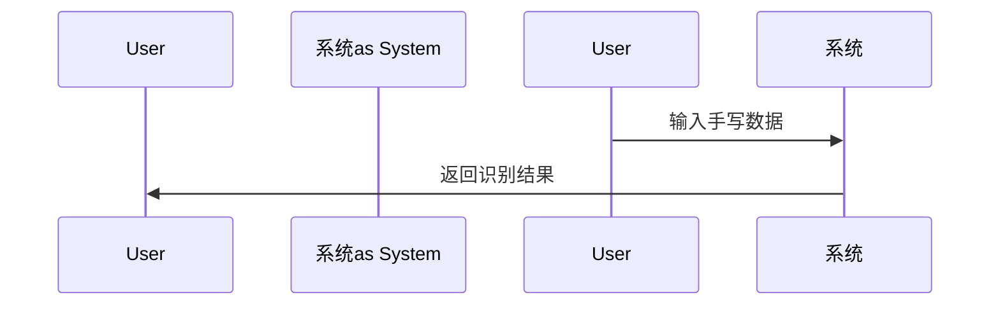

                 

# 数学与人因工程学在产品设计中的应用

## 关键词

数学、人因工程学、产品设计、用户体验、优化设计、人机交互

## 摘要

在当今快速发展的科技时代，产品设计正变得越来越复杂，要求工程师们不仅要有深厚的数学基础，还要有对人因工程学的深刻理解。本文将探讨如何将数学与人因工程学结合起来，以提升产品设计的科学性和实用性。通过具体案例和系统分析方法，我们将逐步揭示这两个领域在产品设计中的重要作用。

## 第一部分：数学与人因工程学概述

### 第1章：问题背景与引入

#### 1.1.1 问题背景

在产品设计过程中，设计师们经常面临着复杂的挑战，例如如何优化产品界面以提高用户体验，如何通过力学分析确保产品的安全性和可靠性等。这些挑战需要结合数学和人因工程学的知识来解决。

##### 1.1.1.1 设计与人类行为的交互

人类行为是产品设计中的重要考虑因素。理解人类行为模式和需求有助于设计师创造更加符合用户期望和使用习惯的产品。例如，在移动设备的设计中，如何确保触摸屏的响应速度和准确性，如何优化界面布局以减少用户的学习成本，都是设计过程中需要解决的问题。

##### 1.1.1.2 数学在产品设计中的应用

数学作为一门科学，在产品设计中有着广泛的应用。无论是力学分析、优化设计，还是统计测试，数学都提供了有力的工具。例如，在力学分析中，通过数学模型可以预测产品在不同压力和负载下的表现；在优化设计中，通过数学优化算法可以找到最佳的设计参数。

#### 1.1.2 问题描述

尽管数学和人因工程学在产品设计中都有重要地位，但它们往往被分开使用，缺乏一个综合的框架来指导产品设计和开发。如何将这两个领域结合起来，为产品设计提供一个全面的指导框架，是当前面临的一个重要问题。

#### 1.1.3 问题解决

本文将探讨如何将数学与人因工程学相结合，提供一个全面的框架，帮助产品设计师在产品设计和开发过程中更好地理解和使用这两个领域。我们将通过具体案例和系统分析方法，展示这两个领域在实际产品设计中的应用。

#### 1.1.4 边界与外延

本文主要关注物理产品设计，特别是交互式产品的设计，如电子设备、移动设备、计算机界面等。虽然文中提到的数学和人因工程学原理具有普遍性，但在具体应用时需要考虑产品的特点和用户的需求。

#### 1.1.5 概念结构与核心要素组成

- **数学**：基础数学知识，如代数、几何、微积分，以及在产品设计中的应用。
- **人因工程学**：人机交互、人体工程学、用户研究等。

### 第2章：核心概念与联系

#### 2.1.1 数学原理

数学在产品设计中扮演着核心角色，其基本原理包括：

##### 2.1.1.1 数学公式与模型

在力学分析中，牛顿第二定律（\( F = ma \)）是一个常用的公式，它描述了力、质量和加速度之间的关系。在优化设计中，线性规划（Linear Programming）和非线性规划（Nonlinear Programming）算法被广泛应用于寻找最优解。

##### 2.1.1.2 数学在人因工程学中的应用

- **力学分析**：计算人体在不同条件下承受的力，例如在长时间操作电脑时，如何设计键盘和鼠标以减少手腕的压力。
- **优化设计**：确定最佳设计参数，例如在电子设备中，如何设计电池容量和功率输出以最大化续航能力。

#### 2.1.2 人因工程学原理

人因工程学主要关注如何设计产品以满足人类的需求和行为习惯。其基本原理包括：

##### 2.1.2.1 人机交互

- **用户体验**：通过用户研究和测试，了解用户在使用产品时的感受和行为，以便优化产品设计。
- **界面设计**：设计直观、易于操作的界面，减少用户的学习成本和操作错误。

##### 2.1.2.2 人体工程学

- **人机工程学参数**：如操作距离、角度、力道等，确保产品在使用过程中符合人体工学原理，减少疲劳和伤害。

#### 2.1.3 概念属性特征对比表格

| 概念       | 特征1 | 特征2 | 特征3 |
|------------|-------|-------|-------|
| 数学       | 精确性 | 逻辑性 | 应用广泛 |
| 人因工程学 | 用户中心 | 实用性 | 人性化 |

### 第3章：数学与人因工程学的应用案例

#### 3.1.1 设计案例分析

##### 3.1.1.1 案例背景

以智能手机界面设计为例，分析如何结合数学和人因工程学原理来提升用户体验。

##### 3.1.1.2 数学在案例中的应用

- **用户行为分析**：通过数学模型分析用户在操作界面时的行为模式，以优化界面布局。
- **界面优化**：利用数学优化算法确定最佳界面元素的大小和位置，以提高操作效率和用户体验。

##### 3.1.1.3 人因工程学在案例中的应用

- **考虑用户使用习惯**：根据用户研究，设计符合用户使用习惯的界面元素和操作流程。
- **优化界面布局**：通过人因工程学原理，确保界面布局合理，操作简便，减少用户的学习成本。

## 第二部分：系统分析与架构设计

### 第4章：系统分析与架构设计方案

#### 4.1.1 问题场景介绍

以智能手写识别系统为例，描述一个具体的问题场景和系统设计需求。

#### 4.1.2 系统功能设计

使用Mermaid类图描述系统的功能模块：

```mermaid
classDiagram
HandWritingInput <<|-- ImageProcessing : 数据预处理
ImageProcessing o-- StrokeDetection : 笔画识别
StrokeDetection o-- CharacterRecognition : 字符识别
CharacterRecognition o-- ResultFeedback : 结果反馈
```

#### 4.1.3 系统架构设计

使用Mermaid架构图描述系统的整体架构：


#### 4.1.4 系统接口设计和系统交互

使用Mermaid序列图描述系统的接口设计和交互过程：



## 第三部分：项目实战

### 第5章：项目实战

#### 5.1.1 环境安装

介绍如何搭建项目开发环境，包括所需软件和工具的安装。

#### 5.1.2 系统核心实现源代码

提供系统核心实现的源代码，并进行详细解读和分析。

```python
# 伪代码示例
def hand_writing_recognition(data):
    # 识别手写数据
    pass
```

#### 5.1.3 代码应用解读与分析

分析代码的应用场景和实现原理，并结合数学和人因工程学原理进行详细讲解。

#### 5.1.4 实际案例分析和详细讲解剖析

通过实际案例来展示如何使用数学和人因工程学进行产品设计，并分析其效果。

#### 5.1.5 项目小结

总结项目的实施经验，提出改进建议，并对未来研究方向进行展望。

### 总结与展望

数学与人因工程学在产品设计中的应用具有重要意义。通过本文的探讨，我们不仅了解了这两个领域的核心概念和联系，还通过具体案例展示了其在实际产品设计中的应用效果。未来，随着科技的不断进步，数学与人因工程学的结合将为产品设计带来更多的创新和发展空间。作者：AI天才研究院/AI Genius Institute & 禅与计算机程序设计艺术 /Zen And The Art of Computer Programming

