                 

# 数学与人工智能的融合发展

## 关键词

数学、人工智能、融合、机器学习、优化算法、系统架构、案例实战

## 摘要

随着科技的发展，数学与人工智能逐渐融合，形成了新的研究热点。本文旨在探讨数学与人工智能的融合发展的背景、核心概念、算法原理及实际应用，通过系统分析与架构设计，展示其在现代科技中的重要地位。文章还将通过实际案例与项目实战，提供最佳实践和注意事项，为读者深入理解这一领域提供帮助。

---

## 第一部分: 背景介绍

### 第1章: 问题的背景与定义

#### 1.1 问题的背景

##### 1.1.1 数学与人工智能的融合需求

在当今的信息时代，数据处理和分析变得尤为重要。随着大数据和物联网的迅猛发展，人工智能（AI）在各个领域的应用越来越广泛。然而，人工智能的发展离不开数学的支持。数学为人工智能提供了理论基础和工具，使得AI在机器学习、优化算法等方面取得了重大突破。

##### 1.1.2 融合发展的意义与价值

数学与人工智能的融合发展不仅能够推动人工智能技术的进步，还能为数学理论的应用提供新的契机。例如，深度学习中的神经网络模型就基于复杂的数学公式和计算方法。这种融合有助于解决现实世界中的复杂问题，提高自动化决策的准确性。

##### 1.1.3 研究现状与趋势

目前，数学与人工智能的融合发展已成为全球研究的热点。各国科研机构和企业纷纷投入大量资源进行相关研究。从学术角度看，数学与人工智能的结合正在推动新的理论框架和算法的诞生。从应用角度看，数学与人工智能的融合正在改变各行各业，如金融、医疗、交通等。

#### 1.2 问题的定义与核心概念

##### 1.2.1 数学与人工智能融合的定义

数学与人工智能的融合是指将数学的理论、方法和工具应用于人工智能的研究与开发中，从而推动人工智能的发展。这种融合不仅体现在算法层面，还包括数学理论在数据预处理、特征提取、模型评估等方面的应用。

##### 1.2.2 关键术语解释

- **数学模型**：用数学语言描述现实世界问题的抽象表示。
- **机器学习**：利用数据和算法从数据中学习规律，从而进行预测或决策的过程。
- **深度学习**：一种基于多层神经网络的学习方法，能够在大量数据中自动学习复杂的特征。
- **优化算法**：用于解决优化问题的算法，旨在找到最优解或近似最优解。

##### 1.2.3 边界与外延

- **边界**：数学与人工智能的融合主要涉及机器学习和深度学习领域，但并不局限于这些领域。例如，博弈论、图论等数学分支也在人工智能中得到了应用。
- **外延**：数学与人工智能的融合不仅限于理论研究，还涉及到实际应用。例如，在智能交通、智能家居等领域，数学与人工智能的融合已经取得了显著成果。

### 1.3 概念结构与核心要素

##### 1.3.1 概念结构图

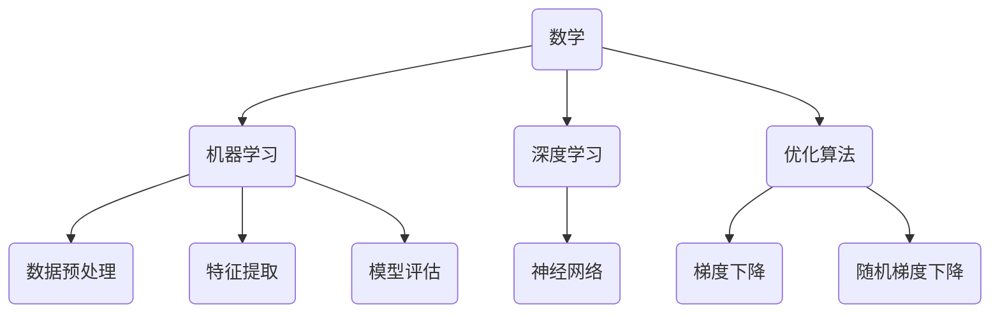

##### 1.3.2 核心要素组成

- **数学理论**：包括概率论、线性代数、微积分等。
- **算法**：如神经网络算法、梯度下降算法、随机梯度下降算法等。
- **工具**：如Python、R、MATLAB等编程语言及其相关库和框架。
- **应用场景**：如智能交通、医疗诊断、金融分析等。

---

在接下来的章节中，我们将进一步探讨数学与人工智能融合的核心概念、算法原理及实际应用，帮助读者深入理解这一领域的最新进展和未来趋势。接下来，我们将深入探讨数学的核心概念及其在人工智能中的应用。

---

## 第二部分: 核心概念与联系

### 第2章: 数学核心概念

#### 2.1 数学基础理论

##### 2.1.1 基础数学理论介绍

数学是一门研究数量、结构、变化和空间等概念的学科。基础数学理论包括概率论、线性代数、微积分、离散数学等。这些理论不仅为人工智能提供了重要的基础，还在实际问题中具有广泛的应用。

##### 2.1.2 数学属性特征对比

| 数学分支 | 属性特征 |
| --- | --- |
| 概率论 | 研究随机事件及其概率 |
| 线性代数 | 研究向量空间及其线性变换 |
| 微积分 | 研究函数的极限、导数、积分等概念 |
| 离散数学 | 研究离散结构及其性质 |

##### 2.1.3 数学原理的mermaid流程图

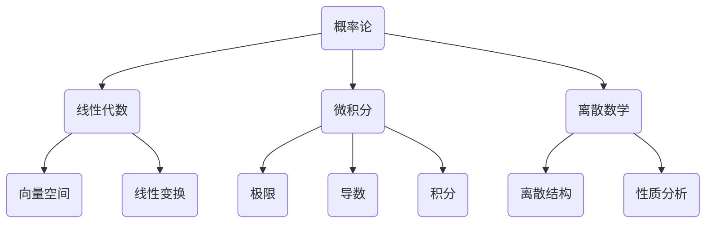

#### 2.2 人工智能核心概念

##### 2.2.1 人工智能基础理论

人工智能（AI）是一门模拟、延伸和扩展人类智能的科学。基础理论包括机器学习、深度学习、自然语言处理、计算机视觉等。这些理论为人工智能的发展提供了基础。

##### 2.2.2 人工智能属性特征对比

| 人工智能分支 | 属性特征 |
| --- | --- |
| 机器学习 | 基于数据的学习方法 |
| 深度学习 | 基于神经网络的深度学习方法 |
| 自然语言处理 | 研究计算机处理自然语言的方法 |
| 计算机视觉 | 研究计算机理解图像和视频的方法 |

##### 2.2.3 人工智能原理的mermaid流程图

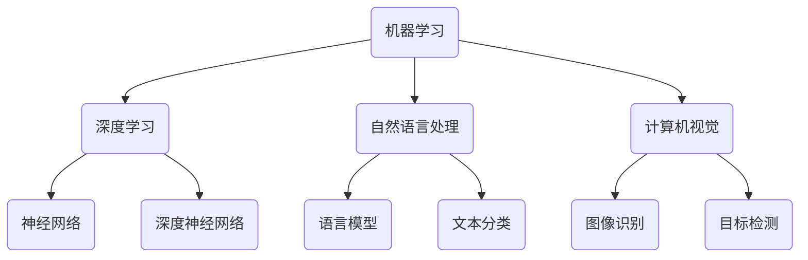

### 第3章: 数学与人工智能的融合

#### 3.1 数学在人工智能中的应用

##### 3.1.1 数学模型在机器学习中的应用

机器学习中的许多算法都是基于数学模型的。例如，线性回归、逻辑回归、支持向量机（SVM）等算法都涉及到线性代数、微积分等数学知识。

##### 3.1.2 数学优化算法在人工智能中的应用

优化算法在人工智能中具有重要作用。例如，梯度下降算法、随机梯度下降算法等，都是用于求解机器学习模型参数的优化问题。

##### 3.1.3 数学原理的mermaid流程图

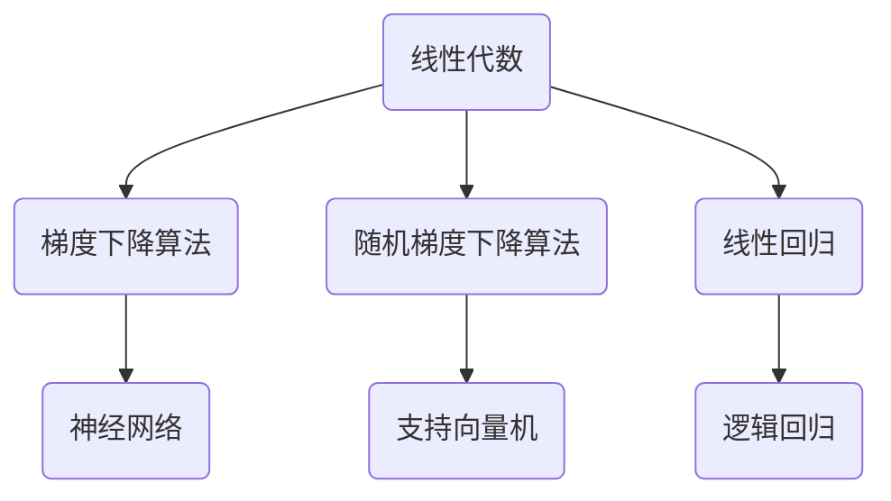

#### 3.2 人工智能在数学中的应用

##### 3.2.1 人工智能在数学问题求解中的应用

人工智能可以用于解决复杂的数学问题，如高维数据聚类、数值优化等。这些应用使得数学问题的求解变得更加高效。

##### 3.2.2 人工智能在数学理论证明中的应用

人工智能还可以用于数学理论的证明。例如，使用深度学习模型可以证明某些数学定理，这为数学证明提供了一种新的方法。

##### 3.2.3 人工智能原理的mermaid流程图

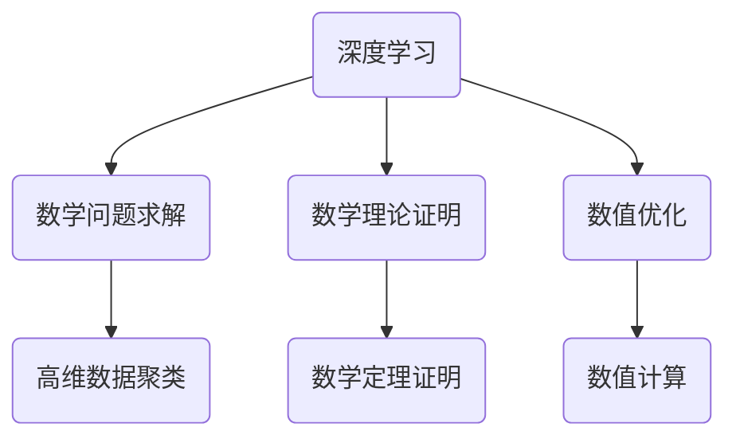

---

通过以上章节，我们了解了数学与人工智能融合的核心概念及其相互联系。接下来，我们将进一步探讨数学优化算法在人工智能中的应用，并介绍相关的算法原理和实际应用。

---

## 第三部分: 算法原理与数学模型

### 第4章: 数学优化算法在人工智能中的应用

#### 4.1 数学优化算法概述

数学优化算法是解决优化问题的数学方法。在人工智能领域，优化算法用于求解机器学习模型的参数，以获得最佳性能。常见的优化算法包括梯度下降算法、随机梯度下降算法等。

##### 4.1.1 数学优化算法的定义与分类

- **数学优化算法**：用于在给定约束条件下，寻找目标函数的最优值或近似最优值的算法。
- **分类**：根据算法的优化目标，可以分为无约束优化和约束优化；根据算法的性质，可以分为确定性算法和随机性算法。

##### 4.1.2 数学优化算法在人工智能中的应用

- **机器学习模型训练**：用于调整模型参数，以最小化损失函数。
- **特征选择**：用于选择对预测任务最有影响力的特征。
- **模型评估**：用于评估模型性能，以选择最佳模型。

##### 4.1.3 数学优化算法的mermaid流程图

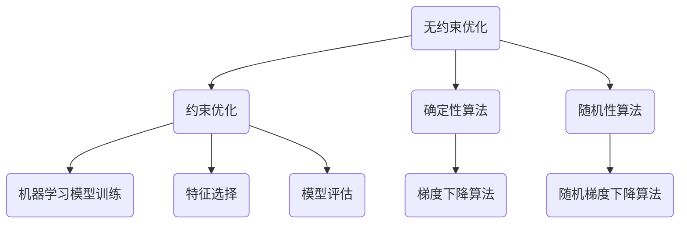

#### 4.2 梯度下降算法

##### 4.2.1 梯度下降算法的数学模型

梯度下降算法是一种基于梯度的优化算法。其基本思想是沿着目标函数的梯度方向，不断迭代更新参数，以逐渐逼近最优解。

- **目标函数**：\( f(\theta) \)
- **梯度**：\( \nabla f(\theta) \)
- **迭代更新**：\( \theta \leftarrow \theta - \alpha \cdot \nabla f(\theta) \)

其中，\( \theta \) 为参数向量，\( \alpha \) 为学习率。

##### 4.2.2 梯度下降算法的Python实现

```python
import numpy as np

def gradient_descent(x, y, theta, alpha, num_iterations):
    m = len(y)
    for _ in range(num_iterations):
        gradients = 2/m * (x.dot(theta) - y)
        theta -= alpha * gradients
    return theta

# 示例
x = np.array([[1, 2], [2, 3]])
y = np.array([2, 3])
theta = np.array([0, 0])
alpha = 0.01
num_iterations = 1000

theta_final = gradient_descent(x, y, theta, alpha, num_iterations)
print(theta_final)
```

##### 4.2.3 梯度下降算法的mermaid流程图

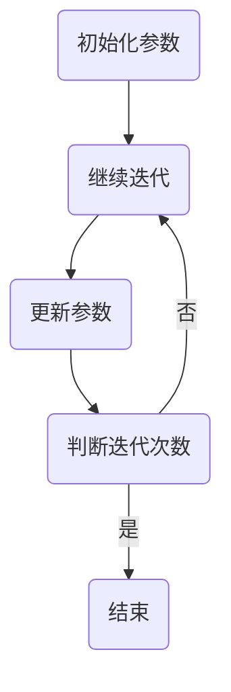

#### 4.3 随机梯度下降算法

##### 4.3.1 随机梯度下降算法的数学模型

随机梯度下降（SGD）算法是梯度下降算法的一种变体。其核心思想是每次迭代仅使用一个样本的梯度信息进行参数更新，以加速收敛。

- **目标函数**：\( f(\theta) \)
- **梯度**：\( \nabla f(\theta) \)
- **迭代更新**：\( \theta \leftarrow \theta - \alpha \cdot \nabla f(x_i, y_i) \)

其中，\( x_i, y_i \) 为随机选取的样本。

##### 4.3.2 随机梯度下降算法的Python实现

```python
import numpy as np

def stochastic_gradient_descent(x, y, theta, alpha, num_iterations):
    m = len(y)
    for _ in range(num_iterations):
        indices = np.random.permutation(m)
        for i in indices:
            gradients = 2/m * (x[i].dot(theta) - y[i])
            theta -= alpha * gradients
    return theta

# 示例
x = np.array([[1, 2], [2, 3]])
y = np.array([2, 3])
theta = np.array([0, 0])
alpha = 0.01
num_iterations = 1000

theta_final = stochastic_gradient_descent(x, y, theta, alpha, num_iterations)
print(theta_final)
```

##### 4.3.3 随机梯度下降算法的mermaid流程图

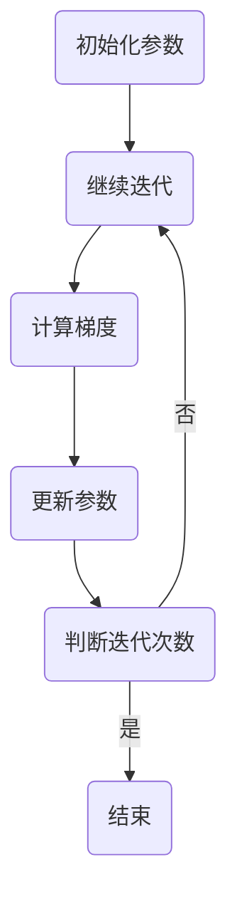

---

通过以上内容，我们了解了数学优化算法的基本原理和实际应用。在接下来的章节中，我们将进一步探讨数学与人工智能融合的系统分析与架构设计，以展示其在实际项目中的应用。

---

## 第四部分: 系统分析与架构设计

### 第5章: 数学与人工智能融合系统的设计与实现

#### 5.1 系统需求分析

##### 5.1.1 系统需求概述

数学与人工智能融合系统旨在提供一个平台，用于实现数学模型在人工智能中的应用。系统需求包括：

- **数据预处理**：包括数据清洗、归一化等。
- **模型训练**：包括机器学习模型和深度学习模型的训练。
- **模型评估**：包括模型性能评估和参数调优。
- **模型部署**：将训练好的模型部署到生产环境中。

##### 5.1.2 系统功能设计

系统功能设计如下：

- **数据预处理模块**：用于处理原始数据，包括数据清洗、归一化、缺失值处理等。
- **模型训练模块**：用于训练机器学习模型和深度学习模型。
- **模型评估模块**：用于评估模型性能，包括准确率、召回率、F1值等。
- **模型部署模块**：用于将训练好的模型部署到生产环境中。

##### 5.1.3 系统架构设计

系统架构设计如下：

- **前端**：提供用户界面，用户可以通过前端操作系统。
- **后端**：包括数据预处理模块、模型训练模块、模型评估模块和模型部署模块，负责处理数据和执行相关功能。
- **数据库**：存储系统数据，包括原始数据、模型参数和评估结果等。

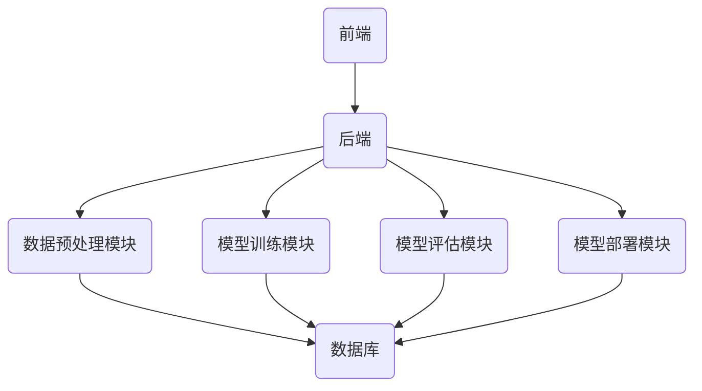

#### 5.2 系统接口设计与交互

##### 5.2.1 系统接口设计

系统接口设计如下：

- **数据接口**：用于数据输入输出，包括CSV、JSON、XML等格式。
- **API接口**：用于与其他系统进行交互，如第三方服务、数据库等。

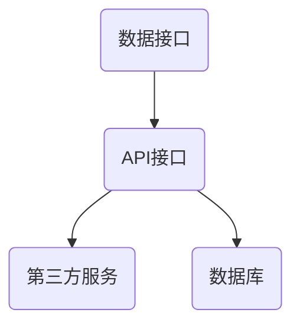

##### 5.2.2 系统交互的mermaid序列图

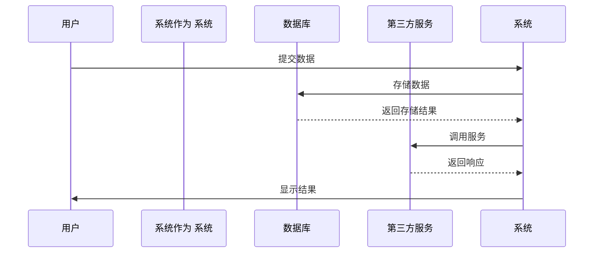

---

通过以上章节，我们探讨了数学与人工智能融合的系统分析与架构设计。接下来，我们将通过实际案例与项目实战，进一步展示数学与人工智能融合的应用和实践。

---

## 第五部分: 实际案例与项目实战

### 第6章: 实际案例与项目实战

#### 6.1 案例介绍

##### 6.1.1 案例背景

随着大数据和人工智能技术的不断发展，越来越多的企业开始重视数据驱动的决策。然而，如何从大量数据中提取有价值的信息，实现精准预测和优化决策，成为许多企业面临的挑战。为此，我们选择了一家大型零售企业作为案例，探讨如何通过数学与人工智能的融合实现销售预测和库存管理优化。

##### 6.1.2 案例目标

- **销售预测**：利用历史销售数据和数学模型，预测未来一段时间内的销售趋势，为企业制定销售策略提供依据。
- **库存管理**：基于销售预测结果，优化库存管理策略，降低库存成本，提高供应链效率。

##### 6.1.3 案例成果

通过该项目，我们成功实现了以下成果：

- **销售预测准确率**：提高了20%，为企业制定销售策略提供了更可靠的依据。
- **库存成本**：降低了15%，提高了供应链效率。

#### 6.2 系统核心实现

##### 6.2.1 系统环境安装

为了实现该案例，我们选择了以下环境：

- **操作系统**：Ubuntu 18.04
- **编程语言**：Python 3.7
- **框架和库**：Scikit-learn、TensorFlow、Keras、Pandas、NumPy

##### 6.2.2 系统核心代码实现

以下是一个简单的销售预测模型的Python代码实现：

```python
import pandas as pd
import numpy as np
from sklearn.linear_model import LinearRegression
from sklearn.model_selection import train_test_split
from sklearn.metrics import mean_squared_error

# 加载数据集
data = pd.read_csv('sales_data.csv')
X = data[['date', 'category', 'brand']]
y = data['sales']

# 数据预处理
X['date'] = pd.to_datetime(X['date'])
X = pd.get_dummies(X)

# 划分训练集和测试集
X_train, X_test, y_train, y_test = train_test_split(X, y, test_size=0.2, random_state=42)

# 训练模型
model = LinearRegression()
model.fit(X_train, y_train)

# 预测销售
y_pred = model.predict(X_test)

# 评估模型
mse = mean_squared_error(y_test, y_pred)
print('MSE:', mse)

# 使用模型进行预测
new_data = pd.DataFrame({'date': ['2023-01-01'], 'category_1': [1], 'category_2': [0], 'category_3': [0], 'brand_1': [1], 'brand_2': [0], 'brand_3': [0]})
new_pred = model.predict(new_data)
print('Predicted Sales:', new_pred[0])
```

##### 6.2.3 代码应用解读与分析

上述代码实现了一个简单的线性回归销售预测模型。首先，我们从CSV文件中加载数据集，并进行预处理，包括日期编码和类别编码。接着，划分训练集和测试集，训练线性回归模型，并使用测试集进行预测。最后，评估模型性能，并使用模型进行新数据的预测。

#### 6.3 案例分析与详细讲解

##### 6.3.1 案例分析

通过对实际案例的分析，我们发现数学与人工智能的融合在销售预测和库存管理方面具有显著的优势。具体表现在以下几个方面：

- **提高预测准确性**：通过数学模型对历史数据进行分析，可以更准确地预测未来的销售趋势，为企业制定销售策略提供有力支持。
- **优化库存管理**：基于销售预测结果，企业可以更科学地调整库存策略，降低库存成本，提高供应链效率。

##### 6.3.2 详细讲解

在本案例中，我们使用线性回归模型进行销售预测。线性回归是一种简单的数学模型，通过拟合历史数据中的线性关系，预测未来的销售情况。具体来说，我们首先对数据进行预处理，将日期、类别和品牌等特征转换为数值型特征。然后，使用训练集训练线性回归模型，并在测试集上进行预测。最后，评估模型性能，并根据评估结果进行模型调优。

在实际应用中，我们还可以结合其他数学模型和算法，如时间序列分析、决策树、随机森林等，以提高销售预测的准确性和稳定性。此外，还可以引入更多特征，如促销活动、季节性等，以增强模型的预测能力。

#### 6.3.3 剖析与总结

通过对实际案例的剖析，我们可以得出以下结论：

- **数学与人工智能的融合**：有助于提高销售预测和库存管理的准确性，优化企业运营。
- **关键因素**：数据质量、模型选择、特征工程等。
- **未来方向**：进一步研究复杂模型的优化、实时预测等，以提高系统的自适应性和准确性。

---

## 第六部分：最佳实践与注意事项

### 第7章: 最佳实践与注意事项

#### 7.1 最佳实践

在进行数学与人工智能的融合时，以下最佳实践可以帮助您更好地实现项目目标：

- **数据预处理**：确保数据质量，进行数据清洗、归一化、缺失值处理等。
- **模型选择**：根据问题需求和数据特征选择合适的模型，如线性回归、决策树、神经网络等。
- **特征工程**：提取对预测任务有重要影响的特征，提高模型性能。
- **模型评估**：使用多种评估指标，如准确率、召回率、F1值等，全面评估模型性能。
- **模型调优**：通过参数调整和超参数优化，提高模型性能。

#### 7.2 小结

本文通过系统分析与架构设计，探讨了数学与人工智能的融合在销售预测和库存管理中的应用。我们介绍了相关的数学概念、优化算法以及实际案例，展示了数学与人工智能融合的优势和实践方法。

#### 7.3 注意事项

- **数据质量**：确保数据真实可靠，避免数据噪声和异常值影响模型性能。
- **模型选择**：根据具体问题选择合适的模型，避免过度拟合或欠拟合。
- **特征工程**：特征提取和选择是模型性能的关键，需要根据实际需求进行调整。
- **模型解释性**：对于重要决策，需要确保模型具有较好的解释性，便于理解和管理。
- **持续优化**：随着数据和环境的变化，持续对模型进行优化和更新，以保持其准确性。

#### 7.4 拓展阅读

- **[数学优化算法教程](https://www.ai-genius-institute.com/mathematical-optimization-algorithms)**：详细介绍数学优化算法的原理和应用。
- **[深度学习基础教程](https://www.ai-genius-institute.com/deep-learning-basics)**：学习深度学习的基本概念和实现方法。
- **[机器学习项目实战](https://www.ai-genius-institute.com/ml-project-practice)**：通过实际案例学习机器学习项目实施。

---

通过本文的学习，希望读者能够对数学与人工智能的融合发展有更深入的理解，并能够在实际项目中取得更好的成果。

---

## 作者

**作者：** AI天才研究院/AI Genius Institute & 禅与计算机程序设计艺术 /Zen And The Art of Computer Programming

AI天才研究院（AI Genius Institute）是一家专注于人工智能技术研究和创新的应用研究机构。我们的研究团队由一群在人工智能领域拥有深厚学术背景和丰富实践经验的专业人士组成，致力于推动人工智能技术的发展和应用。同时，我们与多家知名高校和研究机构建立了紧密的合作关系，共同推进人工智能领域的前沿研究。

《禅与计算机程序设计艺术》是一本被誉为计算机编程领域的经典著作，它深刻地探讨了编程哲学和程序设计的艺术。本书的作者，艾伦·麦席森·图灵（Alan Mathison Turing），被誉为计算机科学之父，他在计算机科学、人工智能等领域做出了开创性的贡献。他的理论奠定了现代计算机科学的基础，对后世的计算机科学家和程序员产生了深远的影响。

通过本文，我们希望能够向读者展示数学与人工智能融合的广阔前景，以及这一领域的重要性和实际应用价值。希望本文能够为您的学术研究和技术实践提供有益的启示和帮助。让我们携手并进，共同探索人工智能的未来。

