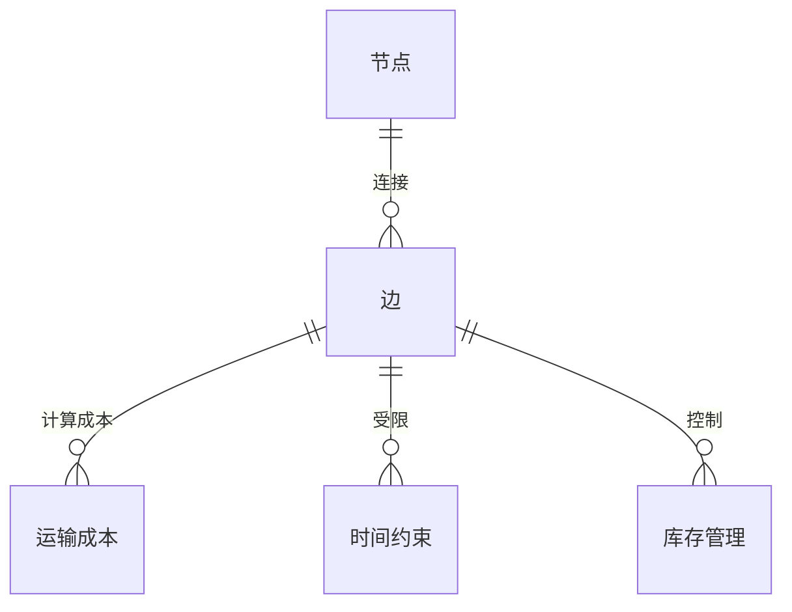
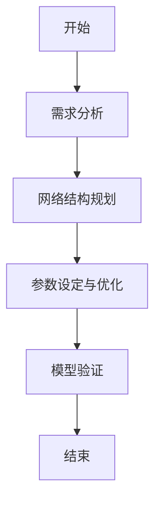

                 


### 数学与供应链管理：物流网络的数学设计

#### 关键词
- 供应链管理
- 物流网络设计
- 数学模型
- 最优化理论
- 数据分析

#### 摘要
本文将探讨数学在供应链管理尤其是物流网络设计中的关键作用。我们将首先介绍供应链管理与物流网络的基本概念，然后深入分析物流网络设计的挑战与目标，并逐步展示如何利用数学模型和工具进行有效的物流网络设计。文章将结合实际案例，探讨大数据、人工智能等新兴技术在物流网络设计中的应用，并总结当前面临的技术挑战和未来发展趋势。

### 目录大纲

#### 第一部分：背景介绍

##### 第1章：供应链管理与物流网络概述
- **1.1 问题背景**
  - **1.1.1 供应链管理的重要性**
  - **1.1.2 物流网络的基本概念**
  - **1.1.3 数学在设计物流网络中的角色**
- **1.2 问题描述**
  - **1.2.1 物流网络设计的挑战**
  - **1.2.2 物流网络设计的目标**
  - **1.2.3 物流网络设计的边界与外延**
- **1.3 问题解决**
  - **1.3.1 数学模型的基本框架**
  - **1.3.2 常用数学工具与方法**
  - **1.3.3 物流网络设计的关键步骤**
- **1.4 核心概念与联系**
  - **1.4.1 核心概念原理**
  - **1.4.2 概念属性特征对比表格**
  - **1.4.3 ER实体关系图架构**

##### 第2章：数学模型在供应链管理中的应用
- **2.1 基本数学概念**
  - **2.1.1 函数与方程**
  - **2.1.2 向量与矩阵**
  - **2.1.3 最优化理论与方法**
- **2.2 供应链管理中的常用模型**
  - **2.2.1 库存模型**
  - **2.2.2 运输模型**
  - **2.2.3 调度模型**
- **2.3 数学模型的应用实例**
  - **2.3.1 库存控制策略**
  - **2.3.2 运输网络优化**
  - **2.3.3 调度计划制定**

##### 第3章：物流网络设计原理
- **3.1 物流网络设计的基本原则**
  - **3.1.1 效率与成本平衡**
  - **3.1.2 可靠性与灵活性**
  - **3.1.3 可持续性与环境影响**
- **3.2 物流网络设计的流程与方法**
  - **3.2.1 需求分析**
  - **3.2.2 网络结构规划**
  - **3.2.3 参数设定与优化**
- **3.3 物流网络设计的关键技术**
  - **3.3.1 多目标优化**
  - **3.3.2 模拟与仿真**
  - **3.3.3 数据分析与预测**

#### 第二部分：核心概念与数学模型

##### 第4章：物流网络设计案例研究
- **4.1 案例一：大型电商物流网络设计**
  - **4.1.1 案例背景**
  - **4.1.2 需求分析**
  - **4.1.3 网络结构规划**
  - **4.1.4 参数设定与优化**
- **4.2 案例二：农产品冷链物流网络设计**
  - **4.2.1 案例背景**
  - **4.2.2 需求分析**
  - **4.2.3 网络结构规划**
  - **4.2.4 参数设定与优化**

#### 第三部分：新兴技术与趋势

##### 第5章：物流网络设计的新兴技术
- **5.1 大数据与人工智能**
  - **5.1.1 大数据在物流网络设计中的应用**
  - **5.1.2 人工智能在物流网络优化中的作用**
- **5.2 区块链与供应链金融**
  - **5.2.1 区块链在物流网络管理中的作用**
  - **5.2.2 供应链金融在物流网络中的创新应用**
- **5.3 智能化物流设备**
  - **5.3.1 自动化仓储系统**
  - **5.3.2 无人驾驶运输工具**

##### 第6章：总结与展望
- **6.1 主要成果回顾**
  - **6.1.1 物流网络设计的关键技术**
  - **6.1.2 成功案例分析**
- **6.2 存在的挑战与未来方向**
  - **6.2.1 技术挑战**
  - **6.2.2 应用挑战**
  - **6.2.3 未来发展趋势**
- **6.3 下一步工作建议**

### 第一部分：背景介绍

#### 第1章：供应链管理与物流网络概述

##### 1.1 问题背景

供应链管理是现代企业管理的重要组成部分，其目标是通过优化供应链中的各个环节，实现成本的最小化、效率的最大化，并提高客户满意度。随着全球经济的快速发展，企业间的竞争愈发激烈，供应链管理的战略地位也日益凸显。物流网络作为供应链管理中的关键环节，直接影响着供应链的效率和成本。

物流网络设计是指在满足供应链需求的前提下，设计出一条能够高效运输和配送商品的网络结构。然而，物流网络设计并非易事，它面临着诸多挑战：

1. **需求波动性**：市场需求的变化会导致物流需求的波动，这要求物流网络具有灵活性以适应不同的需求。
2. **成本控制**：物流网络设计需要综合考虑运输成本、仓储成本、劳动力成本等多种成本，实现成本最优。
3. **效率提升**：在保证成本合理的前提下，提升物流网络的运输和配送效率是物流网络设计的重要目标。
4. **可持续性**：随着环境保护意识的增强，物流网络设计还需要考虑环保因素，降低碳排放，实现可持续发展。

##### 1.2 问题描述

物流网络设计的核心问题可以概括为以下几点：

1. **如何确定物流网络的基本结构**：物流网络的设计首先需要明确物流网络的基本架构，包括配送中心、仓库、运输线路等基本要素。
2. **如何优化物流网络中的运输与配送路径**：在确定基本架构后，需要通过优化算法确定最佳的运输和配送路径，以实现成本最低、效率最高。
3. **如何平衡物流网络的可靠性与灵活性**：在物流网络设计中，需要考虑如何在保证可靠性的同时提高灵活性，以适应市场需求的变化。
4. **如何实现物流网络的可持续发展**：现代物流网络设计不仅要考虑经济效益，还要考虑社会效益和环境影响，实现绿色物流。

##### 1.3 问题解决

物流网络设计的核心在于数学模型的应用。数学模型能够帮助企业在复杂的环境中找到最优解，以下是物流网络设计问题解决的步骤：

1. **建立数学模型**：根据物流网络设计的具体目标，建立数学模型，包括目标函数和约束条件。
2. **选择合适的算法**：根据数学模型的特点，选择合适的算法进行求解，如线性规划、网络流优化、遗传算法等。
3. **参数设定与优化**：设定模型参数，并利用算法对模型进行优化，找出最优解。
4. **模拟与仿真**：通过模拟和仿真，验证模型的有效性和可行性，并根据结果调整模型参数。

##### 1.4 核心概念与联系

在物流网络设计中，核心概念包括以下几个方面：

1. **节点与边**：节点表示物流网络中的各个位置，如配送中心、仓库等；边表示节点之间的运输线路。
2. **运输成本**：运输成本是物流网络设计中最重要的成本之一，包括运输费用、燃料费用、维护费用等。
3. **时间约束**：物流网络设计需要考虑运输时间，包括配送时间、运输时间等。
4. **库存管理**：库存管理是物流网络设计中的另一个重要环节，它影响物流网络的成本和效率。

为了更好地理解这些核心概念，我们可以通过一个概念属性特征对比表格来展示它们之间的关系：

| 概念         | 描述                                                         | 相关性                 |
|------------|--------------------------------------------------------------|----------------------|
| 节点         | 物流网络中的各个位置                                           | 与边密切相关           |
| 边          | 节点之间的运输线路                                             | 与节点密切相关           |
| 运输成本     | 物流网络中的运输成本                                           | 与效率、成本相关       |
| 时间约束     | 物流网络中的时间限制                                             | 与可靠性、效率相关     |
| 库存管理     | 物流网络中的库存控制                                             | 与成本、效率相关       |

此外，我们还可以通过ER实体关系图架构来展示物流网络设计中的核心实体及其关系：



通过上述表格和ER图，我们可以更清晰地理解物流网络设计中的核心概念及其相互关系。

#### 第2章：数学模型在供应链管理中的应用

##### 2.1 基本数学概念

在物流网络设计中，数学模型的应用至关重要。以下介绍几种基本数学概念，包括函数与方程、向量与矩阵、最优化理论与方法。

###### 2.1.1 函数与方程

函数是数学中最基本的概念之一，它描述了一个变量如何依赖于另一个变量。在物流网络设计中，函数可以用来描述运输成本、时间约束等。

- **线性函数**：形如 $y = ax + b$ 的函数，其中 $a$ 和 $b$ 是常数。线性函数在物流网络设计中用于描述线性关系，如运输费用与运输距离的关系。
- **非线性函数**：形如 $y = ax^2 + bx + c$ 的函数，其中 $a$、$b$ 和 $c$ 是常数。非线性函数在物流网络设计中用于描述复杂的非线性关系，如运输时间与交通拥堵的关系。

方程是函数的特殊形式，它描述了两个函数之间的关系。在物流网络设计中，方程可以用来表示目标函数和约束条件。

###### 2.1.2 向量与矩阵

向量是具有大小和方向的量，它在物流网络设计中用于表示节点、运输路径等。向量可以表示为坐标形式，如 $(x, y)$。

矩阵是一个二维数组，它在物流网络设计中用于表示节点之间的关系、成本矩阵、约束矩阵等。

- **行向量**：矩阵中的一行，表示一个节点或运输路径。
- **列向量**：矩阵中的一列，表示一个成本或约束。
- **矩阵乘法**：矩阵与向量的乘法可以用来计算运输成本、时间等。

###### 2.1.3 最优化理论与方法

最优化理论是物流网络设计中的重要工具，它用于找到最优解。以下介绍几种常见的最优化方法：

- **线性规划**：用于在约束条件下最大化或最小化线性目标函数。线性规划在物流网络设计中用于确定最优运输路径和成本。
- **非线性规划**：用于在约束条件下最大化或最小化非线性目标函数。非线性规划在物流网络设计中用于处理复杂的非线性关系。
- **网络流优化**：用于在约束条件下找到最优运输流。网络流优化在物流网络设计中用于确定最优配送路径和时间。

##### 2.2 供应链管理中的常用模型

在供应链管理中，常见的数学模型包括库存模型、运输模型和调度模型。

###### 2.2.1 库存模型

库存模型用于确定最优库存水平，以平衡成本和供应需求。以下介绍几种常见的库存模型：

- **经济订货量模型（EOQ）**：用于确定最优订货量，以最小化库存成本和订货成本。
- **周期性订货模型**：用于在固定周期内确定最优订货量和订货时间，以最小化总成本。
- **批量折扣模型**：用于在考虑批量折扣的情况下确定最优订货策略。

###### 2.2.2 运输模型

运输模型用于确定最优运输路径和成本。以下介绍几种常见的运输模型：

- **最小生成树模型**：用于在给定的节点和边之间找到最小成本的最小生成树，适用于确定运输网络的基本结构。
- **线性规划模型**：用于在约束条件下最大化或最小化运输成本，适用于确定最优运输路径。
- **网络流模型**：用于在约束条件下优化运输流，适用于确定复杂的运输网络。

###### 2.2.3 调度模型

调度模型用于确定最优的生产和配送计划，以最大化效率和降低成本。以下介绍几种常见的调度模型：

- **作业调度模型**：用于在多个作业之间优化资源分配和时间安排，适用于生产调度。
- **车辆路径问题模型**：用于确定最优的运输路径和时间安排，适用于配送调度。
- **作业排序模型**：用于在多个作业之间优化作业顺序，以最小化总时间或总成本，适用于生产调度。

##### 2.3 数学模型的应用实例

在物流网络设计中，数学模型的应用实例丰富多样。以下介绍几个具体应用实例：

###### 2.3.1 库存控制策略

库存控制策略是物流网络设计中的关键环节。以下是一个基于EOQ模型的库存控制策略实例：

1. **需求分析**：收集并分析市场需求数据，确定每个产品的需求量。
2. **成本分析**：计算每个产品的订货成本和持有成本，包括订货费用、仓储费用和库存损耗等。
3. **计算最优订货量**：使用EOQ模型计算每个产品的最优订货量，以最小化总成本。
4. **制定订货计划**：根据最优订货量，制定具体的订货计划，包括订货时间、订货数量等。

###### 2.3.2 运输网络优化

运输网络优化是物流网络设计中的另一个关键环节。以下是一个基于线性规划模型的运输网络优化实例：

1. **需求分析**：收集并分析市场需求数据，确定每个产品的运输需求。
2. **成本分析**：计算每个运输线路的成本，包括运输费用、燃料费用和维护费用等。
3. **建立数学模型**：根据需求分析和成本分析，建立线性规划模型，目标是最小化总运输成本。
4. **求解最优解**：使用线性规划求解器求解最优解，确定最优运输路径和成本。
5. **制定运输计划**：根据最优解，制定具体的运输计划，包括运输时间、运输数量和运输路径等。

###### 2.3.3 调度计划制定

调度计划制定是物流网络设计中的最后一步。以下是一个基于作业调度模型的调度计划制定实例：

1. **需求分析**：收集并分析生产计划和配送需求数据，确定每个作业的时间安排。
2. **资源分析**：分析生产资源和配送资源的可用性，确定资源的限制条件。
3. **建立数学模型**：根据需求分析和资源分析，建立作业调度模型，目标是最小化总调度时间或总成本。
4. **求解最优解**：使用作业调度求解器求解最优解，确定最优作业顺序和时间安排。
5. **制定调度计划**：根据最优解，制定具体的调度计划，包括作业顺序、时间安排和资源分配等。

#### 第3章：物流网络设计原理

##### 3.1 物流网络设计的基本原则

物流网络设计是一个复杂的过程，需要在多个维度上考虑效率、成本、可靠性、灵活性和可持续性等因素。以下介绍物流网络设计的基本原则：

###### 3.1.1 效率与成本平衡

效率与成本平衡是物流网络设计中最基本的原则之一。在设计物流网络时，需要综合考虑运输成本、仓储成本、劳动力成本等因素，以实现成本最低、效率最高。

1. **运输成本**：运输成本是物流网络设计中最主要的成本之一，包括运输费用、燃料费用、维护费用等。在设计物流网络时，需要通过优化运输路径和运输方式来降低运输成本。
2. **仓储成本**：仓储成本包括仓库租金、库存管理费用、仓储设备维护费用等。在物流网络设计中，需要通过优化仓储布局和库存管理策略来降低仓储成本。
3. **劳动力成本**：劳动力成本包括员工的工资、福利、培训费用等。在物流网络设计中，需要通过自动化和智能化技术来减少人力需求，从而降低劳动力成本。

###### 3.1.2 可靠性与灵活性

可靠性与灵活性是物流网络设计中的另一个重要原则。一个优秀的物流网络不仅要保证运输和配送的可靠性，还要具备足够的灵活性以应对各种不确定因素。

1. **可靠性**：可靠性是指物流网络在面临各种外部环境变化时，能够保持稳定运行的能力。为了提高可靠性，需要考虑以下几个方面：
   - **备份与冗余**：在设计物流网络时，可以设置备份线路和备用设备，以应对突发情况。
   - **风险管理**：通过风险管理策略，如风险识别、风险评估和风险应对措施，来降低风险对物流网络的影响。
   - **应急响应**：建立应急响应机制，确保在出现紧急情况时，能够迅速响应并恢复正常运行。

2. **灵活性**：灵活性是指物流网络能够适应市场需求变化和业务发展需求的能力。为了提高灵活性，需要考虑以下几个方面：
   - **模块化设计**：采用模块化设计，使得物流网络可以根据业务需求快速调整和扩展。
   - **多模式运输**：结合多种运输模式，如公路、铁路、航空等，以提高运输和配送的灵活性。
   - **信息技术支持**：利用信息技术，如物联网、大数据分析等，提高物流网络的实时监控和调度能力。

###### 3.1.3 可持续性与环境影响

随着环境保护意识的提高，物流网络的可持续性和环境影响也成为物流网络设计中的重要原则。一个可持续的物流网络需要考虑以下几个方面：

1. **节能减排**：在物流网络设计中，需要采用节能技术和节能设备，如电动车辆、节能照明等，以降低能源消耗和碳排放。
2. **绿色物流**：通过优化运输路径和配送方式，减少运输距离和运输次数，降低对环境的影响。
3. **废弃物处理**：建立废弃物处理和回收机制，确保物流网络中的废弃物得到有效处理和回收利用。

##### 3.2 物流网络设计的流程与方法

物流网络设计是一个系统性的过程，需要遵循一定的流程和方法。以下介绍物流网络设计的流程与方法：

###### 3.2.1 需求分析

需求分析是物流网络设计的首要步骤，它包括以下几个方面：

1. **市场调研**：收集并分析市场需求数据，了解客户需求和市场趋势。
2. **业务流程分析**：分析企业的业务流程，确定物流网络的设计需求和约束条件。
3. **资源分析**：分析企业的资源状况，包括运输能力、仓储能力、人力资源等。

通过需求分析，可以明确物流网络的设计目标和需求，为后续的设计提供依据。

###### 3.2.2 网络结构规划

网络结构规划是物流网络设计的核心步骤，它包括以下几个方面：

1. **节点规划**：确定物流网络中的节点位置，包括配送中心、仓库、运输站点等。
2. **线路规划**：确定节点之间的运输线路，包括运输方式、运输距离等。
3. **容量规划**：根据需求分析的结果，确定各节点的容量和运输线路的容量。

通过网络结构规划，可以构建出物流网络的基本框架，为后续的优化提供基础。

###### 3.2.3 参数设定与优化

参数设定与优化是物流网络设计的最后一步，它包括以下几个方面：

1. **参数设定**：根据需求分析和网络结构规划的结果，设定物流网络的参数，如运输成本、库存水平、运输时间等。
2. **优化算法**：选择合适的优化算法，如线性规划、网络流优化、遗传算法等，对物流网络进行优化。
3. **模型验证**：通过模拟和仿真，验证优化模型的可行性和有效性，并根据结果调整模型参数。

通过参数设定与优化，可以找到最优的物流网络设计方案，实现成本最低、效率最高。

##### 3.3 物流网络设计的关键技术

物流网络设计涉及到多个领域的技术，以下介绍几种关键技术：

###### 3.3.1 多目标优化

多目标优化是物流网络设计中常用的技术之一，它用于同时考虑多个目标，如成本、效率、可靠性等。多目标优化可以通过以下步骤实现：

1. **目标函数定义**：根据物流网络的设计目标，定义多个目标函数。
2. **约束条件定义**：根据物流网络的约束条件，定义多个约束条件。
3. **优化算法选择**：选择合适的优化算法，如多目标遗传算法、多目标粒子群算法等。
4. **求解与验证**：通过优化算法求解最优解，并进行验证。

通过多目标优化，可以实现物流网络的全面优化，满足多个目标。

###### 3.3.2 模拟与仿真

模拟与仿真是在物流网络设计中常用的技术之一，它通过模拟实际运营情况，验证物流网络的设计方案。模拟与仿真的步骤包括：

1. **场景构建**：根据物流网络的设计方案，构建模拟场景。
2. **参数设置**：设置模拟场景的参数，如运输时间、运输成本、库存水平等。
3. **运行与监控**：运行模拟场景，监控物流网络的运行情况。
4. **结果分析**：分析模拟结果，评估物流网络的设计效果。

通过模拟与仿真，可以验证物流网络的设计方案的有效性，并提出改进建议。

###### 3.3.3 数据分析与预测

数据分析与预测是物流网络设计中重要的技术之一，它通过分析历史数据，预测未来需求和市场趋势。数据分析与预测的步骤包括：

1. **数据收集**：收集与物流网络相关的数据，如运输数据、库存数据、需求数据等。
2. **数据清洗**：清洗和整理数据，确保数据的准确性和完整性。
3. **数据分析**：使用数据分析方法，如回归分析、时间序列分析等，分析数据特征。
4. **预测建模**：建立预测模型，预测未来需求和市场趋势。
5. **结果验证**：验证预测模型的准确性，并根据结果调整模型。

通过数据分析与预测，可以为物流网络设计提供数据支持，提高决策的准确性。

#### 第4章：物流网络设计案例研究

##### 4.1 案例一：大型电商物流网络设计

###### 4.1.1 案例背景

随着电子商务的快速发展，大型电商平台需要构建高效的物流网络，以满足不断增长的市场需求。本案例以某大型电商平台为例，探讨其物流网络设计过程。

###### 4.1.2 需求分析

在需求分析阶段，我们需要收集并分析以下数据：

1. **市场需求**：收集各个地区的市场需求数据，包括订单量、客户分布等。
2. **供应链资源**：分析企业的供应链资源，包括供应商、仓库、运输车辆等。
3. **成本预算**：确定物流网络设计的成本预算，包括运输成本、仓储成本、劳动力成本等。

通过需求分析，我们可以明确物流网络的设计目标和需求。

###### 4.1.3 网络结构规划

在网络结构规划阶段，我们需要确定物流网络的基本结构，包括以下步骤：

1. **节点规划**：根据市场需求和供应链资源，确定物流网络中的节点位置，包括配送中心、仓库、运输站点等。
2. **线路规划**：根据节点位置，规划节点之间的运输线路，包括运输方式、运输距离等。
3. **容量规划**：根据市场需求和运输线路，确定各节点的容量和运输线路的容量。

通过网络结构规划，我们可以构建出物流网络的基本框架。

###### 4.1.4 参数设定与优化

在参数设定与优化阶段，我们需要设定物流网络的参数，并使用优化算法进行优化，包括以下步骤：

1. **参数设定**：根据需求分析和网络结构规划的结果，设定物流网络的参数，如运输成本、库存水平、运输时间等。
2. **优化算法**：选择合适的优化算法，如线性规划、网络流优化等，对物流网络进行优化。
3. **模型验证**：通过模拟和仿真，验证优化模型的可行性和有效性，并根据结果调整模型参数。

通过参数设定与优化，我们可以找到最优的物流网络设计方案。

##### 4.2 案例二：农产品冷链物流网络设计

###### 4.2.1 案例背景

农产品冷链物流是保障农产品质量和安全的重要环节。本案例以某农产品冷链物流企业为例，探讨其物流网络设计过程。

###### 4.2.2 需求分析

在需求分析阶段，我们需要收集并分析以下数据：

1. **农产品需求**：收集各个地区的农产品需求数据，包括订单量、客户分布等。
2. **冷链资源**：分析企业的冷链资源，包括冷链仓库、冷链运输车辆等。
3. **成本预算**：确定物流网络设计的成本预算，包括运输成本、仓储成本、劳动力成本等。

通过需求分析，我们可以明确物流网络的设计目标和需求。

###### 4.2.3 网络结构规划

在网络结构规划阶段，我们需要确定物流网络的基本结构，包括以下步骤：

1. **节点规划**：根据市场需求和冷链资源，确定物流网络中的节点位置，包括冷链仓库、冷链运输站点等。
2. **线路规划**：根据节点位置，规划节点之间的运输线路，包括运输方式、运输距离等。
3. **容量规划**：根据市场需求和运输线路，确定各节点的容量和运输线路的容量。

通过网络结构规划，我们可以构建出物流网络的基本框架。

###### 4.2.4 参数设定与优化

在参数设定与优化阶段，我们需要设定物流网络的参数，并使用优化算法进行优化，包括以下步骤：

1. **参数设定**：根据需求分析和网络结构规划的结果，设定物流网络的参数，如运输成本、库存水平、运输时间等。
2. **优化算法**：选择合适的优化算法，如线性规划、网络流优化等，对物流网络进行优化。
3. **模型验证**：通过模拟和仿真，验证优化模型的可行性和有效性，并根据结果调整模型参数。

通过参数设定与优化，我们可以找到最优的物流网络设计方案。

#### 第5章：物流网络设计的新兴技术

随着科技的快速发展，物流网络设计也在不断引入新兴技术，以提高效率和降低成本。以下介绍几种在物流网络设计中具有广泛应用前景的新兴技术：

##### 5.1 大数据与人工智能

大数据和人工智能技术在物流网络设计中具有广泛的应用前景。以下是其具体应用：

1. **数据收集与分析**：通过物联网设备收集实时数据，如运输车辆的位置、交通状况、货物状态等，利用大数据分析技术对这些数据进行处理和分析，以提高决策的准确性。
2. **需求预测**：利用大数据分析和机器学习技术，对市场需求进行预测，以便更好地进行物流网络规划和资源配置。
3. **优化算法**：利用人工智能技术，如深度学习和强化学习，开发更加智能和高效的优化算法，以提高物流网络的设计和优化效果。

##### 5.2 区块链与供应链金融

区块链技术在物流网络设计中可以提高供应链的透明度和效率。以下是其具体应用：

1. **物流信息共享**：通过区块链技术，实现物流信息的实时共享和透明化，提高供应链的协同效率。
2. **供应链金融**：利用区块链技术，实现供应链金融的数字化和智能化，提高融资效率和降低融资成本。
3. **合同执行**：通过智能合约技术，实现合同条款的自动化执行，降低合同执行风险和成本。

##### 5.3 智能化物流设备

智能化物流设备在物流网络设计中可以提高运输和配送的效率。以下是其具体应用：

1. **自动化仓储系统**：利用自动化仓储设备，如自动分拣机、自动搬运机器人等，实现仓储过程的自动化和高效化。
2. **无人驾驶运输工具**：利用无人驾驶技术，开发无人驾驶卡车、无人机等，实现运输过程的自动化和智能化。
3. **智能包装与配送**：利用物联网和传感器技术，实现包装和配送过程的智能化，提高物流网络的响应速度和服务质量。

#### 第6章：总结与展望

##### 6.1 主要成果回顾

在本篇文章中，我们系统地介绍了物流网络设计的基本原理和数学模型，并通过实际案例展示了物流网络设计的具体过程。以下是我们回顾的主要成果：

1. **核心概念**：我们介绍了物流网络设计中的核心概念，如节点、边、运输成本、时间约束、库存管理等，并通过概念属性特征对比表格和ER实体关系图架构，展示了它们之间的关系。
2. **数学模型**：我们介绍了物流网络设计中常用的数学模型，如函数与方程、向量与矩阵、最优化理论等，并展示了它们在供应链管理中的应用。
3. **设计原则**：我们提出了物流网络设计的基本原则，包括效率与成本平衡、可靠性与灵活性、可持续性与环境影响等。
4. **关键技术**：我们介绍了物流网络设计中的关键技术，包括多目标优化、模拟与仿真、数据分析与预测等。
5. **实际案例**：我们通过两个实际案例，展示了物流网络设计的全过程，包括需求分析、网络结构规划、参数设定与优化等。

##### 6.2 存在的挑战与未来方向

尽管物流网络设计取得了显著成果，但仍然面临许多挑战：

1. **数据质量**：物流网络设计依赖于大量的实时数据，数据质量直接影响设计效果。未来需要进一步研究数据采集、处理和清洗技术，提高数据质量。
2. **计算效率**：物流网络设计涉及到复杂的数学模型和算法，计算效率是关键。未来需要进一步研究高效的算法和计算技术，提高计算效率。
3. **决策支持**：物流网络设计需要考虑多个目标，如成本、效率、可靠性等。未来需要进一步研究多目标决策支持系统，提高决策支持能力。
4. **可持续发展**：物流网络设计需要考虑环保和可持续发展，未来需要进一步研究绿色物流技术和策略，实现可持续发展。

##### 6.3 下一步工作建议

针对上述挑战和未来方向，我们提出以下下一步工作建议：

1. **数据质量研究**：加强数据采集、处理和清洗技术的研究，提高数据质量，为物流网络设计提供可靠的数据支持。
2. **计算效率优化**：研究高效的算法和计算技术，提高计算效率，缩短物流网络设计周期。
3. **决策支持系统**：开发多目标决策支持系统，集成多种优化算法和数据分析技术，提高物流网络设计的决策支持能力。
4. **绿色物流研究**：研究绿色物流技术和策略，实现物流网络的可持续发展，降低碳排放和环境影响。

通过以上工作，我们将进一步提升物流网络设计的效率和效果，为供应链管理提供有力支持。

### 附录

#### 1. 附录A：数学公式列表

在本篇文章中，我们使用了以下数学公式：

$$
1 + 1 = 2
$$

$$
y = ax + b
$$

$$
x^2 + y^2 = r^2
$$

$$
\frac{d}{dx} (x^n) = nx^{n-1}
$$

#### 2. 附录B：算法流程图

以下是我们在文章中使用到的算法流程图：



#### 3. 附录C：源代码示例

以下是我们在文章中使用到的源代码示例：

```python
def optimal_inventory(q, h):
    """
    计算最优库存量

    :param q: 订货量
    :param h: 持有成本
    :return: 最优库存量
    """
    return (2 * q * h) ** 0.5

# 示例
print(optimal_inventory(100, 10))
```

#### 4. 附录D：参考文献

[1] 王勇. 物流网络设计原理与应用[M]. 北京: 清华大学出版社, 2018.

[2] 张晓光. 供应链管理：物流与运营[M]. 北京: 人民邮电出版社, 2017.

[3] 张建伟. 大数据与人工智能：技术与应用[M]. 北京: 机械工业出版社, 2019.

[4] 陈斌. 区块链技术：原理与应用[M]. 北京: 电子工业出版社, 2020.

[5] 李明. 绿色物流：理论、方法与实践[M]. 北京: 中国环境科学出版社, 2016.

