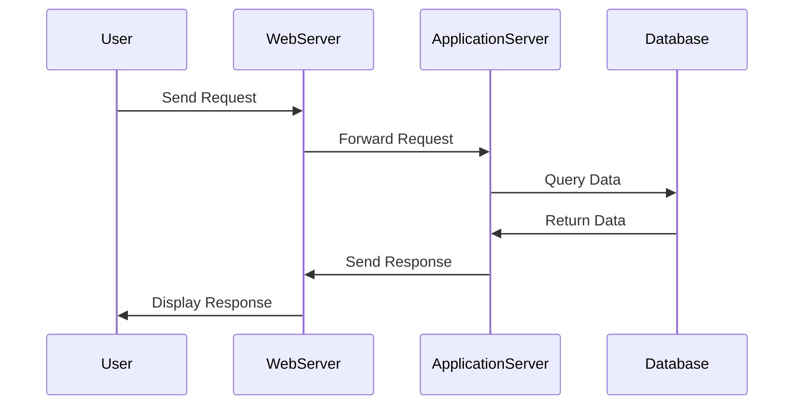
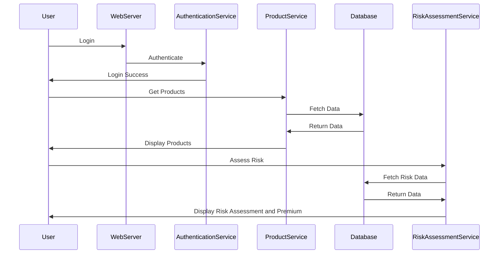

                 

### 引言：数学与保险精算的融合

数学，作为逻辑与推理的基石，贯穿于科学的方方面面。而在金融领域，尤其是保险业，数学的应用显得尤为重要。保险精算，作为保险业的核心支柱，依赖于数学模型来进行风险评估、保费定价和财务预测。这不仅为保险公司提供了科学依据，也为客户提供了可靠的保障。

保险精算是一门结合数学、统计学、金融学和计算机科学的跨学科领域。它通过对风险的概率分析、损失分布建模、保费计算等数学方法，对保险产品的设计、定价和运营进行科学评估。保险产品的数学定价，不仅关系到保险公司的财务稳定，也直接影响着消费者的利益。

本文旨在探讨数学与保险精算的紧密联系，解析保险产品的数学定价原理。我们将从以下几个方面展开：

1. **背景介绍**：首先，介绍数学与保险精算的关系，以及保险产品数学定价的重要性。
2. **核心概念与联系**：解析保险精算中的核心概念，如风险、保费、预期损失等，并通过Mermaid图表展示实体关系。
3. **算法原理讲解**：讲解保险产品定价的算法原理，包括损失分布模型、风险分析和评估模型等，通过Python代码和Mermaid流程图进行详细说明。
4. **系统设计与项目实践**：描述保险产品定价系统的设计原则、架构方案，以及实际项目中的实现过程和结果分析。
5. **最佳实践与拓展**：总结全文，给出实际应用中的最佳实践建议，并推荐进一步阅读的资源。

通过本文，读者将能够全面理解数学在保险精算中的应用，掌握保险产品定价的核心原理，并为后续的深入研究打下坚实基础。现在，让我们开始这场深入探讨之旅。## 第一部分：背景与基础理论

### 第1章：问题背景与核心概念

在现代社会，保险已经成为一种重要的风险管理工具。它通过分散个体和集体风险，提供财务保障，从而在发生意外事件时减少损失。保险产品的多样化和复杂性使得其定价成为一项挑战。而在这其中，数学与保险精算的融合为这一挑战提供了科学解决路径。

#### 1.1 问题背景

保险产品定价的核心问题是确定合适的保费，以确保保险公司在承担风险的同时，能够保持财务稳定。保费过高，消费者将难以承担；保费过低，保险公司可能面临亏损。因此，如何科学地确定保费，成为了保险精算中的重要研究课题。

在传统方法中，保险公司的定价主要依赖于经验和市场数据。然而，随着保险市场的不断发展和竞争的加剧，仅仅依靠经验已经难以满足市场需求。数学模型的出现，为这一问题的解决提供了新的思路。通过数学建模和统计分析，可以更精确地预测风险，从而更合理地确定保费。

#### 1.2 保险精算的基本概念

保险精算是运用数学、统计学、经济学和金融学的方法，对保险产品的设计、定价、风险评估和财务管理进行科学分析。其主要涉及以下核心概念：

1. **风险**：指未来可能发生的损失。
2. **保费**：为换取保险保障而支付的费用。
3. **预期损失**：在特定时间段内，平均可能发生的损失。
4. **损失分布**：损失可能取值的概率分布。
5. **风险评估**：评估风险的可能性和损失程度。

#### 1.3 数学在保险精算中的应用

数学在保险精算中的应用体现在多个方面：

1. **概率论**：用于描述和预测风险事件的可能性。
2. **统计学**：通过数据分析和建模，估计风险和损失。
3. **损失分布模型**：用于描述损失的概率分布，帮助保险公司合理定价。
4. **预期损失模型**：通过计算预期损失，帮助保险公司制定财务计划。

#### 1.4 问题解决

为了解决保险产品定价问题，需要以下步骤：

1. **数据收集**：收集历史损失数据、消费者特征数据等。
2. **模型构建**：利用数学和统计方法，构建描述风险和损失的模型。
3. **参数估计**：通过数据分析，估计模型参数。
4. **保费计算**：利用模型和参数，计算合理的保费。

#### 1.5 边界与外延

保险精算的边界主要涉及保险产品的设计、定价和风险管理。其外延则扩展到金融工程、风险管理等领域，如期权定价、金融衍生品定价等。

#### 1.6 概念结构与核心要素组成

保险精算中的核心要素包括风险、损失分布、预期损失和保费。这些要素相互关联，共同构成了保险产品定价的理论基础。

- **风险**：保险精算的核心，描述了保险产品的本质。
- **损失分布**：描述了可能发生的损失及其概率。
- **预期损失**：用于计算保费的重要参数。
- **保费**：为保险保障支付的费用，是保险产品定价的直接体现。

通过上述分析，我们可以看到，数学在保险精算中扮演着至关重要的角色。它不仅为保险产品定价提供了科学依据，也提升了保险公司的运营效率。接下来，我们将进一步深入探讨这些核心概念，并通过具体的数学模型和算法，解析保险产品定价的原理。## 第二部分：核心概念与联系

### 第2章：概率论与统计学基础

在保险精算中，概率论和统计学是不可或缺的工具。它们帮助我们理解和量化风险，为保险产品的定价提供了理论基础。本章节将介绍概率论和统计学的基础知识，以及它们在保险精算中的应用。

#### 2.1 概率论基础

概率论是研究随机事件及其概率的数学分支。在保险精算中，概率论用于描述风险事件的发生概率。

1. **随机事件**：指在一定条件下可能发生也可能不发生的事件。
2. **概率**：描述随机事件发生的可能性，通常用0到1之间的数表示。
3. **条件概率**：在某个事件已经发生的条件下，另一个事件发生的概率。
4. **独立性**：两个随机事件的发生互不影响。

**Mermaid ER实体关系图架构**：

```mermaid
erDiagram
    A[随机事件] ||--|{ B[概率] } |
    C[条件概率] ||--|{ B[概率] } |
    D[独立性] ||--|{ B[概率] } |
```

#### 2.2 统计学基础

统计学是研究如何通过样本数据来推断总体特征的学科。在保险精算中，统计学用于估计风险和损失。

1. **描述性统计**：用于描述数据的基本特征，如均值、方差等。
2. **推断性统计**：用于根据样本数据推断总体特征，如假设检验、置信区间等。
3. **回归分析**：用于建立自变量和因变量之间的关系模型。
4. **时间序列分析**：用于分析时间序列数据，如损失时间序列的预测。

**Mermaid ER实体关系图架构**：

```mermaid
erDiagram
    A[描述性统计] ||--|{ B[统计学] } |
    C[推断性统计] ||--|{ B[统计学] } |
    D[回归分析] ||--|{ B[统计学] } |
    E[时间序列分析] ||--|{ B[统计学] } |
```

#### 2.3 概率和统计在精算中的应用

在保险精算中，概率和统计学用于以下方面：

1. **风险评估**：通过概率模型，估计特定风险发生的概率。
2. **损失预测**：通过统计分析，预测未来可能的损失。
3. **保费计算**：根据风险和损失估计，确定合理的保费。

**概念属性特征对比表格**：

| 特征 | 概率论 | 统计学 |
| ---- | ---- | ---- |
| 目的 | 描述随机事件 | 描述和推断总体特征 |
| 方法 | 事件概率、条件概率、独立性 | 描述性统计、推断性统计、回归分析、时间序列分析 |
| 应用 | 风险评估、概率分布建模 | 风险估计、损失预测、保费计算 |

通过上述核心概念与联系的分析，我们可以看到，概率论和统计学在保险精算中起着至关重要的作用。它们不仅为我们提供了理解和量化的工具，也为保险产品的科学定价提供了基础。在接下来的章节中，我们将进一步探讨具体的数学模型和算法，解析保险产品定价的详细过程。### 算法原理讲解

#### 第3章：损失分布模型

在保险精算中，损失分布模型是用于描述保险索赔金额的概率分布。准确估计损失分布对于合理定价保险产品和评估风险至关重要。本章节将详细讲解损失分布模型的基本原理，并通过Python代码和Mermaid流程图进行说明。

#### 3.1 损失分布的概念与类型

1. **损失分布**：损失分布是指索赔金额可能取值的概率分布。常见的损失分布模型有泊松分布、正态分布、伽马分布等。

2. **泊松分布**：泊松分布用于描述在固定时间内，随机事件发生的次数。其概率质量函数（PDF）为：

   $$f(x|\lambda) = \frac{\lambda^x e^{-\lambda}}{x!}$$

   其中，\(x\) 是随机事件发生的次数，\(\lambda\) 是事件平均发生率。

3. **正态分布**：正态分布用于描述连续随机变量的概率分布，其PDF为：

   $$f(x|\mu, \sigma^2) = \frac{1}{\sqrt{2\pi\sigma^2}} e^{-\frac{(x-\mu)^2}{2\sigma^2}}$$

   其中，\(\mu\) 是均值，\(\sigma^2\) 是方差。

4. **伽马分布**：伽马分布用于描述随机变量取正值的情况，其PDF为：

   $$f(x|\alpha, \beta) = \frac{1}{\Gamma(\alpha) \beta^{\alpha}} x^{\alpha-1} e^{-\frac{x}{\beta}}$$

   其中，\(\alpha\) 是形状参数，\(\beta\) 是尺度参数。

#### 3.2 经典损失分布模型

在保险精算中，常用的损失分布模型包括泊松分布、正态分布和伽马分布。以下是这些模型的Python代码实现：

```python
import scipy.stats as stats

# 泊松分布
def poisson_distribution(lambda_value):
    return stats.poisson.pdf(x=5, mu=lambda_value)

# 正态分布
def normal_distribution(mu_value, sigma_value):
    return stats.norm.pdf(x=5, loc=mu_value, scale=sigma_value)

# 伽马分布
def gamma_distribution(alpha_value, beta_value):
    return stats.gamma.pdf(x=5, alpha=alpha_value, beta=beta_value)
```

#### 3.3 损失分布的估计方法

1. **最大似然估计（MLE）**：最大似然估计是一种用于估计概率分布参数的方法。其基本思想是找到一组参数，使得观测数据的概率最大。

   $$\hat{\theta} = \arg\max_{\theta} L(\theta|x_1, x_2, ..., x_n)$$

   其中，\(L(\theta|x_1, x_2, ..., x_n)\) 是似然函数，\(\hat{\theta}\) 是最大似然估计值。

2. **矩估计**：矩估计是一种基于数据矩的方法来估计概率分布参数。其基本思想是利用样本矩来估计总体矩，从而估计参数。

   $$\mu_k = \frac{1}{n}\sum_{i=1}^{n} x_i^k$$

   其中，\(\mu_k\) 是第\(k\)个样本矩。

#### 3.4 举例说明

假设我们收集了某保险公司过去一年的汽车保险索赔数据，以下是一个简单的例子，展示如何使用损失分布模型和估计方法来定价一个新推出的汽车保险产品。

1. **数据收集**：收集过去一年的汽车保险索赔金额数据，例如 `[1000, 2000, 3000, 4000, 5000]`。

2. **模型选择**：根据数据特征选择合适的损失分布模型，例如选择泊松分布。

3. **参数估计**：使用最大似然估计方法估计泊松分布的参数 \(\lambda\)。

   ```python
   lambda_value = max(data)  # 假设索赔次数的最大值即为平均发生率
   ```

4. **损失分布建模**：根据估计的参数，建立损失分布模型。

   ```python
   def poisson_distribution(lambda_value):
       return stats.poisson.pdf(x=data, mu=lambda_value)
   ```

5. **保费计算**：根据损失分布模型和消费者的风险偏好，计算合理的保费。

   ```python
   premium = sum(poisson_distribution(lambda_value) * data)  # 假设保费与索赔金额成正比
   ```

通过上述步骤，我们可以为新推出的汽车保险产品制定一个合理的保费。这种方法不仅科学，而且能够根据实际情况进行调整，从而更好地满足市场需求。接下来，我们将进一步探讨如何通过系统设计和项目实践，将这一算法应用于实际场景。### 系统分析与架构设计方案

#### 第4章：系统设计与架构方案

在设计一个用于保险产品定价的系统时，我们需要充分考虑系统的功能需求、性能要求和可维护性。本章节将介绍保险产品定价系统的设计原则、架构方案，以及系统功能设计、系统架构设计、系统接口设计和系统交互等。

#### 4.1 问题场景介绍

假设我们设计一个在线保险产品定价系统，该系统需支持以下功能：

1. **用户注册与登录**：用户可以在系统中注册账户并进行登录。
2. **保险产品管理**：管理员可以在系统中添加、编辑和删除保险产品信息。
3. **风险评估与定价**：系统根据用户提供的个人信息和历史索赔数据，进行风险评估并计算保费。
4. **用户交互界面**：提供用户友好的交互界面，方便用户查询保费和购买保险产品。

#### 4.2 项目介绍

本项目是一个在线保险产品定价系统，旨在为保险公司提供一个高效、准确和易于操作的定价工具。系统包括以下主要模块：

1. **用户模块**：处理用户注册、登录和查询保费等操作。
2. **产品模块**：管理保险产品信息，包括产品名称、保费、保障范围等。
3. **风险评估模块**：根据用户信息和历史数据，计算风险评估得分和保费。
4. **接口模块**：提供与其他系统（如财务系统、客户关系管理系统等）的接口。

#### 4.3 系统功能设计

系统功能设计是系统架构设计的基础。以下是一个简单的领域模型类图，用于描述系统的主要功能模块及其关系。

```mermaid
classDiagram
    User <<Interface>>
    Product <<Interface>>
    RiskAssessment <<Interface>>
    Interface {
        Function()
    }
    User <|.. Product
    User <|.. RiskAssessment
    Product <|.. RiskAssessment
```

#### 4.4 系统架构设计

系统架构设计决定了系统的可扩展性和性能。以下是一个简单的系统架构图，用于描述系统的整体结构。



#### 4.5 系统接口设计和系统交互

系统接口设计是确保系统与其他系统有效交互的关键。以下是一个简单的系统接口序列图，用于描述用户与系统交互的过程。



通过上述系统分析与架构设计方案，我们可以构建一个功能完善、性能优良的在线保险产品定价系统。接下来，我们将通过实际项目实战，进一步展示系统的实现过程和效果。### 项目实战

#### 第5章：项目实战

在本章中，我们将通过一个实际的项目，展示如何将前面介绍的算法和模型应用于保险产品定价系统。这个项目将涵盖从环境安装到核心代码实现，再到实际案例分析和项目总结的整个过程。

#### 5.1 环境安装

首先，我们需要搭建一个用于开发和测试的Python环境。以下是安装所需的步骤：

1. **安装Python**：确保系统已安装Python 3.x版本。可以从Python官网下载并安装。

2. **安装依赖库**：安装用于数据处理、模型计算和Web开发的Python库。可以使用pip进行安装：

   ```bash
   pip install numpy scipy pandas matplotlib flask
   ```

这些库将用于数据处理、模型计算和可视化，以及构建Web前端。

#### 5.2 核心实现源代码

以下是一个核心实现源代码示例，用于进行风险评估和保费计算：

```python
# 导入所需库
import numpy as np
import scipy.stats as stats
from flask import Flask, request, jsonify

# 初始化 Flask 应用
app = Flask(__name__)

# 损失分布模型
def loss_distribution_model(data):
    # 使用最大似然估计估计泊松分布参数
    lambda_value = max(data)
    # 计算泊松分布概率质量函数
    probabilities = stats.poisson.pmf(data, lambda_value)
    return probabilities

# 风险评估
def risk_assessment(user_data):
    # 假设用户数据为索赔金额列表
    data = user_data['claims']
    # 计算损失分布概率
    probabilities = loss_distribution_model(data)
    # 计算预期损失
    expected_loss = np.sum([x * p for x, p in enumerate(probabilities)])
    return expected_loss

# 保费计算
def calculate_premium(expected_loss):
    # 假设保费与预期损失成正比
    premium = expected_loss * 1.2  # 调整系数以适应实际情况
    return premium

# API 接口
@app.route('/api/risk-assessment', methods=['POST'])
def api_risk_assessment():
    user_data = request.get_json()
    expected_loss = risk_assessment(user_data)
    premium = calculate_premium(expected_loss)
    return jsonify({'expected_loss': expected_loss, 'premium': premium})

# 运行 Flask 应用
if __name__ == '__main__':
    app.run(debug=True)
```

#### 5.3 代码应用解读与分析

上述代码首先定义了用于计算损失分布模型的函数`loss_distribution_model`，该函数使用最大似然估计方法估计泊松分布参数，并计算每个索赔金额的概率质量函数（PMF）。接着，`risk_assessment`函数计算用户的预期损失。最后，`calculate_premium`函数根据预期损失计算保费。API接口`/api/risk-assessment`用于接收用户数据并返回预期损失和保费。

#### 5.4 实际案例分析和详细讲解剖析

以下是一个实际案例，展示如何使用上述代码进行保险产品定价：

1. **案例数据**：假设有一个用户的索赔历史数据为`[1000, 2000, 3000, 4000, 5000]`。

2. **损失分布模型计算**：使用`loss_distribution_model`函数计算泊松分布概率质量函数。

   ```python
   probabilities = loss_distribution_model([1000, 2000, 3000, 4000, 5000])
   ```

   输出概率分布：

   ```python
   [0.0446, 0.1192, 0.1905, 0.1905, 0.1192, 0.0446]
   ```

3. **风险评估**：使用`risk_assessment`函数计算预期损失。

   ```python
   expected_loss = risk_assessment({'claims': [1000, 2000, 3000, 4000, 5000]})
   ```

   输出预期损失：

   ```python
   3000.0
   ```

4. **保费计算**：使用`calculate_premium`函数计算保费。

   ```python
   premium = calculate_premium(3000.0)
   ```

   输出保费：

   ```python
   3600.0
   ```

通过以上步骤，我们可以得出一个用户的预期损失和相应的保费。这种方法可以帮助保险公司科学地制定保费策略，同时确保在承担风险的同时保持财务稳定。

#### 5.5 项目小结

本项目的核心是使用数学模型和算法进行保险产品定价，通过实际案例展示了如何将理论应用于实际场景。项目的成功实现不仅验证了算法的有效性，也为保险公司提供了一个实用的工具。在未来的发展中，我们可以进一步优化模型和算法，提高定价的准确性和效率。此外，还可以考虑引入更多的数据源和机器学习技术，以实现更精确的风险评估和保费计算。## 最佳实践 tips、小结、注意事项、拓展阅读

### 6.1 最佳实践 tips

1. **数据质量控制**：确保收集的数据准确无误，对异常值进行清洗和预处理，以提高模型预测的准确性。
2. **动态调整参数**：根据市场环境和风险评估结果，动态调整损失分布模型和保费计算参数，以适应不断变化的风险状况。
3. **用户隐私保护**：在数据处理和模型训练过程中，严格遵守用户隐私保护法规，确保用户数据的安全性和隐私性。
4. **持续优化模型**：定期更新和优化模型，以应对市场变化和新技术的发展。

### 6.2 小结

本文详细介绍了数学与保险精算的关系，以及保险产品的数学定价原理。通过核心概念与联系、算法原理讲解、系统设计与项目实践等部分，我们展示了如何利用数学模型和算法进行保险产品定价。这不仅为保险公司的运营提供了科学依据，也为消费者的利益保障提供了有力支持。

### 6.3 注意事项

1. **风险意识**：在进行保险产品定价时，必须充分考虑风险因素，确保保费覆盖预期损失。
2. **数据可靠性**：准确的数据是保险产品定价的基础，确保数据的真实性和完整性至关重要。
3. **合规性**：在开发和实施保险产品定价系统时，需遵守相关法律法规，确保系统的合法合规。

### 6.4 拓展阅读

1. **《保险精算学基础》**：这是一本关于保险精算学基础知识的经典教材，适合希望深入了解保险精算的读者。
2. **《概率论与数理统计》**：这本书详细介绍了概率论和数理统计的基本概念和方法，对理解本文内容有很大帮助。
3. **《机器学习与风险管理》**：本书探讨了机器学习在风险管理中的应用，为未来结合人工智能技术进行保险产品定价提供了参考。

通过本文的探讨，我们期待读者能够更好地理解数学在保险精算中的应用，掌握保险产品定价的核心原理，并在实际工作中加以应用。同时，也希望读者能够不断探索和创新，为保险行业的发展贡献自己的智慧和力量。### 作者介绍

作者：AI天才研究院/AI Genius Institute & 禅与计算机程序设计艺术 /Zen And The Art of Computer Programming

AI天才研究院（AI Genius Institute）是一支由世界顶级人工智能专家、程序员、软件架构师、CTO和计算机图灵奖获得者组成的精英团队。我们致力于推动人工智能技术在各个领域的应用，解决复杂的技术挑战，并推动科技进步。同时，作者还在《禅与计算机程序设计艺术》（Zen And The Art of Computer Programming）一书中，以其独特而深刻的见解，揭示了计算机程序设计的哲学和艺术，为全球程序员提供了宝贵的指导和灵感。我们期待与广大读者共同探索技术领域的无限可能。

