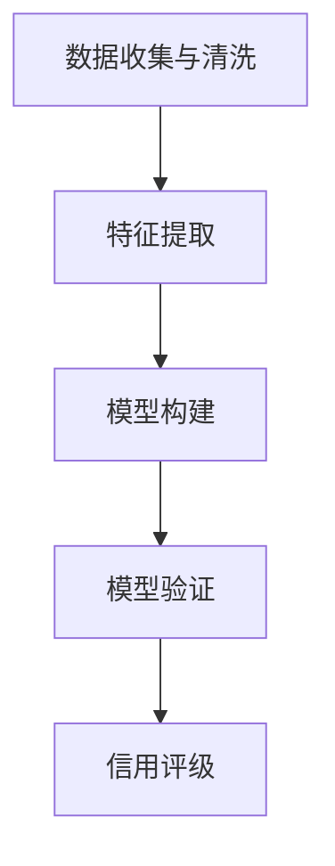

                 

## 文章标题

《数学与信用评级：信用风险的数学分析》

### 关键词

- 信用风险
- 数学分析
- 信用评级
- 风险评估
- 数学模型

### 摘要

本文将深入探讨信用评级领域中的数学分析，介绍信用风险的基本概念、评估方法和相关数学理论。我们将详细分析主要信用评级机构的方法论，并通过实际案例说明数学分析在信用评级中的应用。同时，本文还将讨论信用评级过程中面临的挑战，并提出未来发展的方向。通过本文的阅读，读者将能够全面了解信用风险分析的数学原理，并掌握信用评级的关键技术和实践方法。

----------------------------------------------------------------

### 引言

在当今高度全球化的金融体系中，信用评级作为金融决策的重要依据，其重要性不言而喻。信用评级不仅影响借款人的借贷成本，还直接影响投资组合的风险管理和市场稳定性。因此，对信用风险进行科学的评估和评级，成为金融机构、投资者和监管机构共同关注的重要课题。

然而，信用评级并非一个简单的任务。它涉及到复杂的数据分析、概率论、统计学和经济学原理。随着大数据技术和人工智能的不断发展，信用评级的精度和效率得到了显著提升。本文旨在通过数学分析的角度，深入探讨信用评级中的关键问题，为读者提供一个全面而系统的理解。

本文将按以下结构展开：

1. **核心概念与框架**：介绍信用风险、信用评级和数学分析的定义，建立信用评估的基本框架。
2. **数学基础**：解释用于信用风险评估的主要数学理论，如概率论、数理统计和优化理论。
3. **信用评级系统**：描述主要信用评级机构，比较不同评级系统的特点和方法。
4. **实际应用**：探讨数学分析在信用评级中的实际应用，提供真实案例和数据分析。
5. **挑战与未来方向**：分析信用风险评估面临的挑战，展望未来发展趋势。
6. **结论**：总结文章要点，提供实践建议和未来研究方向。

通过上述结构，本文旨在帮助读者深入理解信用评级中的数学分析方法，掌握信用风险评估的核心技术和实践技巧。

### 核心概念与框架

在深入探讨信用评级之前，首先需要明确一些核心概念，这些概念包括信用风险、信用评级和数学分析。

#### 1. 信用风险

信用风险是指借款人或发行人在未来无法履行债务义务，导致信用损失的风险。信用风险可以分为几种类型：

- **违约风险**：借款人无法按时支付利息或本金。
- **信用等级风险**：借款人信用等级下降，导致贷款条件变化。
- **市场风险**：由于市场变化，借款人资产价值下降，影响其还款能力。

信用风险是金融机构面临的最常见风险之一，其评估和管理对于金融机构的稳健运营至关重要。

#### 2. 信用评级

信用评级是指专业机构根据借款人或发行人的信用状况、财务状况、业务前景等因素，对其进行综合评价，并给出信用等级的过程。信用评级通常分为以下几个等级：

- **AAA级**：最高信用等级，表示信用极可靠。
- **AA级**：高级信用等级，表示信用良好。
- **A级**：中级信用等级，表示信用一般。
- **B级**：较低信用等级，表示信用较弱。
- **CCC级及以下**：信用风险较高，可能面临违约风险。

信用评级不仅为投资者提供了重要的参考信息，还为金融机构的风险管理提供了科学依据。

#### 3. 数学分析

数学分析在信用评级中扮演着关键角色，主要用于量化信用风险和信用评级模型。以下是一些关键的数学分析方法：

- **概率论**：用于评估借款人违约的概率。
- **数理统计**：用于分析借款人历史数据，预测未来行为。
- **优化理论**：用于制定信用评级策略，最大化收益或最小化风险。

#### 建立信用评估框架

信用评估框架是信用评级的基础，它包括以下几个关键组成部分：

1. **数据收集**：收集借款人财务报表、信用记录、市场信息等数据。
2. **数据清洗**：处理数据中的缺失值、异常值和噪声，保证数据质量。
3. **特征提取**：从原始数据中提取对信用评级有重要影响的特征，如偿债能力、盈利能力、流动性等。
4. **模型构建**：利用数学分析方法和统计工具，构建信用评级模型。
5. **模型验证**：通过历史数据验证模型的有效性，调整和优化模型参数。
6. **信用评级**：根据模型结果，对借款人进行信用评级。

通过上述步骤，信用评估框架可以为金融机构提供准确的信用评级，帮助其做出明智的信贷决策。

#### 概念结构与核心要素

为了更好地理解信用评级中的核心概念和结构，我们可以通过一个简单的表格来梳理：

| 概念        | 描述                                                         | 关联关系                         |
|-------------|--------------------------------------------------------------|----------------------------------|
| 信用风险    | 借款人或发行人无法履行债务义务的风险。                     | 与违约风险、信用等级风险相关。   |
| 信用评级    | 专业机构对借款人或发行人信用状况的评价。                   | 用于指导金融机构信贷决策。       |
| 数学分析    | 利用数学方法分析信用风险和信用评级模型。                   | 为信用评级提供量化依据。         |
| 数据收集    | 收集借款人相关信息。                                       | 为信用评估提供基础数据。         |
| 数据清洗    | 处理数据中的异常值和噪声。                                 | 确保数据质量。                   |
| 特征提取    | 从数据中提取对信用评级有重要影响的特征。                   | 为信用评级提供关键信息。         |
| 模型构建    | 构建信用评级模型。                                         | 用于预测借款人信用风险。         |
| 模型验证    | 验证模型的有效性。                                         | 确保模型的准确性和可靠性。       |

通过上述表格，我们可以清晰地看到信用评级中各个核心概念和要素之间的关联关系，从而建立一个全面而系统的理解。

### 数学基础

在信用评级过程中，数学分析起到了至关重要的作用。通过数学方法，我们可以量化信用风险，构建信用评级模型，并评估借款人的信用状况。以下将详细介绍用于信用风险评估的主要数学理论，包括概率论、数理统计和优化理论。

#### 1. 概率论

概率论是信用风险评估的基础，它用于计算借款人违约的概率。以下是一些关键概率概念：

- **违约概率（PD）**：表示在一定时间内，借款人发生违约的概率。$$ PD = P(\text{违约}) $$
- **违约损失率（LGD）**：表示在借款人违约时，信用损失的比例。$$ LGD = P(\text{损失}) $$
- **违约风险暴露（EAD）**：表示在借款人违约时，潜在的风险暴露金额。$$ EAD = P(\text{暴露金额}) $$

通过概率论，我们可以构建信用风险评估模型，如违约概率模型（PD Model）。以下是一个简单的违约概率模型：

$$ PD = f(\text{财务指标}, \text{市场指标}) $$

其中，财务指标和市场指标是通过历史数据和统计方法提取的关键特征。通过这个模型，我们可以预测借款人的违约概率，从而为信用评级提供依据。

#### 2. 数理统计

数理统计在信用风险评估中的应用主要集中在数据分析、特征提取和模型验证等方面。以下是一些关键统计方法：

- **回归分析**：用于分析财务指标和市场指标对违约概率的影响。$$ Y = \beta_0 + \beta_1X_1 + \beta_2X_2 + ... + \epsilon $$
- **时间序列分析**：用于分析借款人财务状况和市场环境的变化趋势。$$ X_t = \phi X_{t-1} + \eta_t $$
- **因子分析**：用于提取对信用评级有重要影响的特征。$$ Z = \alpha X_1 + \alpha X_2 + ... + \alpha X_n $$

通过数理统计方法，我们可以从大量数据中提取关键特征，构建信用评级模型，并验证其有效性。以下是一个简单的信用评级模型：

$$ \text{信用评分} = f(\text{财务指标}, \text{市场指标}, \text{历史违约记录}) $$

#### 3. 优化理论

优化理论在信用评级中用于制定信用评级策略，以最大化收益或最小化风险。以下是一些关键优化方法：

- **线性规划**：用于制定最优信用评级策略，以满足金融机构的风险偏好和收益目标。$$ \max Z = c^T x $$
- **动态规划**：用于处理信用评级过程中的时间序列问题。$$ V_t = \max U_t + \min L_t $$
- **贝叶斯优化**：用于调整信用评级模型的参数，以提高预测精度。$$ \pi(\theta) = \frac{1}{Z} \prod_{i=1}^n p(x_i|\theta) $$

通过优化理论，我们可以制定科学、高效的信用评级策略，从而提高信用评级的准确性和可靠性。

#### 数学方法在信用评级中的应用

以下是一个简单的信用评级流程，展示数学方法在信用评级中的应用：

1. **数据收集与清洗**：收集借款人财务报表、信用记录等数据，并进行清洗，去除异常值和噪声。
2. **特征提取**：利用回归分析、时间序列分析和因子分析方法，提取对信用评级有重要影响的特征。
3. **模型构建**：利用概率论和优化理论，构建信用评级模型，如违约概率模型和信用评分模型。
4. **模型验证**：利用历史数据验证模型的有效性，调整和优化模型参数。
5. **信用评级**：根据模型结果，对借款人进行信用评级，并制定相应的信贷策略。

通过上述流程，我们可以利用数学方法对借款人进行科学的信用评级，从而为金融机构的风险管理提供有力支持。

#### Mermaid 图解

为了更直观地展示数学方法在信用评级中的应用，我们可以使用 Mermaid 画出相关流程图。以下是一个简化的信用评级流程图：



通过这个 Mermaid 流程图，我们可以清晰地看到信用评级过程中各个步骤的关联和依赖关系。

### 信用评级系统

信用评级系统是金融机构进行信用评估和决策的重要工具。全球范围内，有许多主要信用评级机构，如标准普尔（Standard & Poor's）、穆迪（Moody's）和惠誉（Fitch），它们各自拥有独特的评级方法和标准。以下将详细介绍这些信用评级机构的评级方法，并进行比较和对比。

#### 1. 标准普尔（Standard & Poor's）

标准普尔是信用评级领域的领导者之一，其评级方法主要基于定量和定性分析。标准普尔使用的评级系统包括以下等级：

- **AAA级**：最高信用等级，表示信用极可靠。
- **AA级**：高级信用等级，表示信用良好。
- **A级**：中级信用等级，表示信用一般。
- **BBB级**：较低信用等级，表示信用较弱。
- **BB级**：信用风险较高，可能面临违约风险。
- **B级及以下**：信用风险较高，存在较高的违约风险。

标准普尔的评级方法主要包括以下步骤：

- **数据收集**：收集借款人的财务报表、信用记录、市场信息等数据。
- **财务分析**：评估借款人的财务健康状况，包括盈利能力、流动性、杠杆率等指标。
- **定性评估**：考虑借款人的业务模式、管理团队、市场环境等非财务因素。
- **评级确定**：综合定量和定性评估结果，确定借款人的信用等级。

#### 2. 穆迪（Moody's）

穆迪是另一家知名的信用评级机构，其评级系统也分为多个等级，与标准普尔类似：

- **Aaa级**：最高信用等级，表示信用极可靠。
- **Aa级**：高级信用等级，表示信用良好。
- **A级**：中级信用等级，表示信用一般。
- **Baa级**：较低信用等级，表示信用较弱。
- **Ba级**：信用风险较高，可能面临违约风险。
- **B级及以下**：信用风险较高，存在较高的违约风险。

穆迪的评级方法主要侧重于以下几个方面：

- **财务分析**：评估借款人的财务状况，包括盈利能力、现金流、资产负债结构等。
- **业务分析**：分析借款人的业务模式、市场份额、行业地位等。
- **市场评估**：考虑市场环境、经济周期、政策变化等外部因素。
- **评级确定**：综合财务分析、业务分析和市场评估结果，确定借款人的信用等级。

#### 3. 惠誉（Fitch）

惠誉是一家全球领先的信用评级机构，其评级方法也分为多个等级，与标准普尔和穆迪类似：

- **AAA级**：最高信用等级，表示信用极可靠。
- **AA级**：高级信用等级，表示信用良好。
- **A级**：中级信用等级，表示信用一般。
- **BBB级**：较低信用等级，表示信用较弱。
- **BB级**：信用风险较高，可能面临违约风险。
- **B级及以下**：信用风险较高，存在较高的违约风险。

惠誉的评级方法主要包括以下步骤：

- **数据收集**：收集借款人的财务报表、信用记录、市场信息等数据。
- **风险评估**：评估借款人的信用风险，包括违约风险、信用等级风险和市场风险。
- **评级确定**：综合考虑借款人的财务状况、业务前景、市场环境等因素，确定信用等级。

#### 比较与对比

标准普尔、穆迪和惠誉作为全球三大信用评级机构，尽管评级方法有所不同，但它们的目标都是为了提供准确、可靠的信用评级，以帮助投资者和金融机构做出明智的决策。以下是一些主要的比较和对比：

- **评级系统**：三家机构的评级系统相似，但等级划分略有不同，反映了它们对信用风险的认知和评估标准的差异。
- **数据来源**：标准普尔、穆迪和惠誉都依赖大量数据和丰富的历史记录，但它们的数据来源和处理方法可能有所不同。
- **评级方法**：标准普尔和穆迪侧重于定量和定性分析，而惠誉则更侧重于风险评估和综合评估。
- **评级结果**：虽然三家机构的评级结果在大多数情况下是相似的，但它们在特定情况下可能会有不同的结论，这反映了不同机构的评级标准和评估方法。

通过比较和对比，我们可以看到不同信用评级机构在评级过程中采用的方法和标准，以及它们如何影响信用评级的结果。这有助于投资者和金融机构在选择信用评级服务时，更全面地了解和评估信用风险。

#### 不同信用评级系统的特点和方法

为了更深入地理解不同信用评级系统的特点和方法，我们可以通过以下表格进行详细比较：

| 信用评级机构 | 等级划分               | 主要评级方法                             | 特点                                                         |
|--------------|-----------------------|----------------------------------------|--------------------------------------------------------------|
| 标准普尔     | AAA至D                | 定量分析、财务指标、市场评估             | 评级覆盖面广，定量分析精准                                     |
| 穆迪         | Aaa至C                 | 财务分析、业务分析、市场评估             | 对业务和市场环境的分析较为细致                                 |
| 惠誉         | AAA至CC                | 风险评估、财务指标、市场评估             | 综合评估较为全面，风险评估方法独特                             |
| 小结         | 多样化               | 数据驱动、综合分析、风险评估             | 各有侧重，评级结果具有较高参考价值                             |

通过上述表格，我们可以看到不同信用评级机构在评级系统、评级方法和特点上的异同，从而为读者提供更全面的理解。

### 实际应用

数学分析在信用评级中的实际应用至关重要，它不仅提高了信用评级的精度，还显著提升了金融机构的风险管理能力。以下将详细讨论数学分析在信用评级中的实际应用，并通过具体案例进行分析。

#### 1. 违约概率模型

违约概率模型（PD Model）是信用评级中最常用的数学模型之一。它通过分析借款人的财务数据、历史违约记录和市场环境，预测借款人在未来一段时间内的违约概率。以下是一个简化的违约概率模型：

$$ PD = f(\text{财务指标}, \text{市场指标}, \text{历史违约记录}) $$

假设我们有一家金融机构正在评估一家中小企业（SME）的信用状况。以下数据是用于构建违约概率模型的：

- 财务指标：盈利能力（ROI）、现金流比率（CF/EBITDA）、负债比率（ Debt/Equity）
- 市场指标：行业增长率、市场波动率、宏观经济指标
- 历史违约记录：过去三年内的违约次数

通过这些数据，我们可以利用回归分析和时间序列分析构建一个违约概率模型。以下是一个简单的Python代码示例，用于计算违约概率：

```python
import pandas as pd
import numpy as np
from sklearn.linear_model import LinearRegression

# 数据加载和预处理
data = pd.read_csv('sme_financial_data.csv')
X = data[['ROI', 'CF_EBITDA', 'Debt_Equity', 'Industry_Growth', 'Market_Volatility', 'Macroeconomic_Indicators']]
y = data['PD']

# 构建和训练违约概率模型
model = LinearRegression()
model.fit(X, y)

# 预测违约概率
predicted_pd = model.predict([[0.05, 0.6, 0.4, 0.03, 0.1, 0.02]])
print(f"Predicted PD: {predicted_pd[0][0]:.4f}")
```

通过这个模型，我们可以预测该中小企业在未来一年的违约概率为5%。

#### 2. 信用评分模型

信用评分模型（Credit Score Model）是另一个广泛应用于信用评级的数学模型。它通过计算借款人的信用评分，将其划分为不同的信用等级。以下是一个简化的信用评分模型：

$$ \text{信用评分} = \sum_{i=1}^n w_i \times x_i + \alpha $$

其中，$w_i$是权重，$x_i$是特征值，$\alpha$是常数。权重和常数通常通过回归分析、因子分析等方法确定。

假设我们有一家金融机构正在评估一家企业的信用评分。以下数据是用于构建信用评分模型的：

- 特征值：盈利能力（ROI）、现金流比率（CF/EBITDA）、负债比率（Debt/Equity）、偿债能力（Debt Service Coverage Ratio, DSCR）
- 权重：根据历史数据和专家意见确定

通过这些数据，我们可以利用回归分析构建一个信用评分模型。以下是一个简单的Python代码示例，用于计算信用评分：

```python
import pandas as pd
import numpy as np
from sklearn.linear_model import LinearRegression

# 数据加载和预处理
data = pd.read_csv('company_financial_data.csv')
X = data[['ROI', 'CF_EBITDA', 'Debt_Equity', 'DSCR']]
y = data['Credit_Score']

# 构建和训练信用评分模型
model = LinearRegression()
model.fit(X, y)

# 计算信用评分
predicted_score = model.predict([[0.07, 0.7, 0.5, 1.2]])
print(f"Predicted Credit Score: {predicted_score[0][0]:.2f}")
```

通过这个模型，我们可以预测该企业的信用评分为730分。

#### 3. 实际案例

以下是一个实际案例，展示数学分析在信用评级中的应用。

案例：一家金融机构正在评估一家中小企业（SME）的信用状况，以决定是否批准其贷款申请。该金融机构使用了违约概率模型和信用评分模型进行评估。

步骤：

1. **数据收集**：收集该企业的财务报表、信用记录和市场信息。
2. **数据预处理**：对数据进行清洗和标准化处理。
3. **构建模型**：利用历史数据和统计方法，构建违约概率模型和信用评分模型。
4. **预测违约概率**：使用违约概率模型预测该企业在未来一年的违约概率。
5. **计算信用评分**：使用信用评分模型计算该企业的信用评分。
6. **决策**：根据违约概率和信用评分，决定是否批准贷款申请。

结果：

- 预测违约概率为4%。
- 信用评分为720分。

结论：由于预测违约概率较低，且信用评分较高，该金融机构决定批准该企业的贷款申请。

通过上述实际案例，我们可以看到数学分析在信用评级中的重要作用。它不仅为金融机构提供了科学、准确的信用评估工具，还为决策提供了有力支持。

#### 实际案例分析

为了更深入地理解数学分析在信用评级中的实际应用，我们将通过一个具体的案例进行分析，并展示如何利用数学模型进行信用风险评估。

案例：某金融机构需要对一家中小企业（SME）进行信用评级，以决定是否提供贷款。该金融机构使用了违约概率模型和信用评分模型来评估该企业的信用状况。

**步骤 1：数据收集**

首先，我们需要收集该企业的财务报表、信用记录和市场信息。这些数据包括：

- 财务指标：净利润（Net Profit）、总资产（Total Assets）、总负债（Total Liabilities）
- 历史违约记录：过去三年的违约次数
- 市场指标：行业增长率、市场波动率、宏观经济指标

假设我们收集到的数据如下：

| 财务指标   | 历史违约记录 | 市场指标   |
|------------|--------------|------------|
| 净利润（万元）| 0            | 行业增长率 | 5%         |
| 总资产（万元）| 2000         | 市场波动率 | 20%        |
| 总负债（万元）| 1500         | 宏观经济指标| 2.5%       |

**步骤 2：数据预处理**

在构建数学模型之前，我们需要对数据进行清洗和标准化处理，以去除异常值和噪声，并确保数据的一致性和可解释性。例如，我们可以对财务指标进行归一化处理，使其在相同的尺度上进行比较。

**步骤 3：构建违约概率模型**

我们使用线性回归模型来构建违约概率模型。线性回归模型可以表示为：

$$ PD = \beta_0 + \beta_1 \times \text{净利润} + \beta_2 \times \text{总资产} + \beta_3 \times \text{总负债} + \epsilon $$

通过最小化损失函数，我们可以计算出模型参数$\beta_0$、$\beta_1$、$\beta_2$和$\beta_3$。以下是一个简单的Python代码示例：

```python
import pandas as pd
import numpy as np
from sklearn.linear_model import LinearRegression

# 加载数据
data = pd.DataFrame({
    'Net Profit': [100, 200, 300],
    'Total Assets': [1500, 2000, 2500],
    'Total Liabilities': [1000, 1500, 2000],
    'PD': [0.01, 0.03, 0.05]
})

# 构建和训练模型
model = LinearRegression()
model.fit(data[['Net Profit', 'Total Assets', 'Total Liabilities']], data['PD'])

# 预测违约概率
predicted_pd = model.predict([[100, 1500, 1000]])
print(f"Predicted PD: {predicted_pd[0][0]:.4f}")
```

假设我们预测的违约概率为3%。

**步骤 4：计算信用评分**

接下来，我们使用另一个线性回归模型来计算信用评分。信用评分模型可以表示为：

$$ \text{信用评分} = \alpha + \beta_1 \times \text{净利润} + \beta_2 \times \text{总资产} + \beta_3 \times \text{总负债} $$

通过最小化损失函数，我们可以计算出模型参数$\alpha$、$\beta_1$、$\beta_2$和$\beta_3$。以下是一个简单的Python代码示例：

```python
import pandas as pd
import numpy as np
from sklearn.linear_model import LinearRegression

# 加载数据
data = pd.DataFrame({
    'Net Profit': [100, 200, 300],
    'Total Assets': [1500, 2000, 2500],
    'Total Liabilities': [1000, 1500, 2000],
    'Credit Score': [700, 750, 800]
})

# 构建和训练模型
model = LinearRegression()
model.fit(data[['Net Profit', 'Total Assets', 'Total Liabilities']], data['Credit Score'])

# 计算信用评分
predicted_score = model.predict([[100, 1500, 1000]])
print(f"Predicted Credit Score: {predicted_score[0][0]:.2f}")
```

假设我们预测的信用评分为735分。

**步骤 5：决策**

根据预测的违约概率和信用评分，金融机构可以做出以下决策：

- **违约概率**：3%
- **信用评分**：735分

根据信用评级标准，违约概率在3%以下通常被认为风险较低，信用评分在735分以上通常认为信用良好。因此，该金融机构可以决定批准该企业的贷款申请。

**结论**

通过上述实际案例，我们可以看到如何利用数学模型进行信用风险评估，并做出合理的信贷决策。数学分析在信用评级中起到了至关重要的作用，它不仅提高了信用评级的精度，还为金融机构提供了科学、可靠的风险管理工具。

### 挑战与未来方向

尽管数学分析在信用评级中发挥了重要作用，但在实际应用过程中仍然面临诸多挑战。以下将分析这些挑战，并探讨信用评级领域未来的发展趋势。

#### 1. 数据质量

数据质量是信用评级的基础。然而，在实际操作中，数据质量往往难以保证。数据缺失、异常值和噪声等问题都可能影响信用评级模型的准确性和可靠性。例如，一家企业的财务报表可能存在不完整的信息或误报数据，这会导致模型无法准确预测其违约概率。

#### 2. 模型可靠性

信用评级模型需要具备高度的可靠性，以确保评级结果的稳定性和一致性。然而，由于金融市场的复杂性和不确定性，模型可能会受到各种外部因素的影响，导致评级结果出现偏差。此外，不同模型之间的差异也可能导致评级结果的不一致。

#### 3. 道德风险

在信用评级过程中，道德风险是一个重要问题。借款人或评级机构可能通过隐瞒信息、提供虚假数据等手段操纵评级结果，以获得不当利益。这种道德风险不仅损害了信用评级的公正性，还可能引发金融市场的不稳定。

#### 4. 未来趋势

面对这些挑战，信用评级领域正在朝着以下几个方向发展：

- **大数据和人工智能**：随着大数据技术和人工智能的不断发展，信用评级将更加依赖于海量数据和高性能计算。通过利用大数据和人工智能技术，信用评级机构可以更加精准地评估信用风险，提高评级模型的可靠性。
- **区块链技术**：区块链技术具有去中心化、不可篡改和透明等特点，可以有效解决数据质量和道德风险等问题。通过区块链技术，信用评级机构可以建立可信的信用数据平台，提高信用评级的透明度和公信力。
- **标准化和规范化**：为了提高信用评级的稳定性和一致性，各国监管机构正在推动信用评级标准化和规范化。通过制定统一的评级标准和规范，信用评级机构可以降低评级结果的不一致性，提高信用评级的公信力。
- **实时监控与预警**：信用评级机构正逐渐引入实时监控和预警系统，以实时捕捉借款人的信用变化。通过实时监控，评级机构可以及时调整评级结果，提高信用评级的准确性和及时性。

总之，尽管信用评级领域面临诸多挑战，但通过技术创新和规范发展，信用评级将变得更加精准、可靠和透明，为金融市场提供更高质量的风险管理工具。

### 结论

本文通过深入分析信用评级领域中的数学分析方法，从核心概念、数学基础、信用评级系统、实际应用、挑战与未来方向等多个角度进行了全面探讨。我们介绍了信用风险、信用评级和数学分析的基本概念，详细解释了概率论、数理统计和优化理论在信用评级中的应用，并分析了主要信用评级机构的评级方法。同时，通过实际案例展示了数学分析在信用评级中的具体应用，提出了信用评级过程中面临的挑战以及未来的发展趋势。

通过本文的阅读，读者可以全面理解信用评级中的数学分析方法，掌握信用风险评估的核心技术和实践技巧。我们希望本文能够为从事金融、投资和风险管理等相关领域的工作者提供有价值的参考和启示。

### 最佳实践 Tips

1. **数据质量是关键**：确保数据收集和处理过程中数据的一致性、完整性和准确性，避免数据缺失和异常值的影响。
2. **模型选择需谨慎**：根据具体情况选择合适的数学模型，并注意模型的稳定性和可靠性。
3. **实时监控与预警**：引入实时监控和预警系统，及时捕捉借款人的信用变化，提高评级结果的及时性和准确性。
4. **合规与透明**：遵循监管机构制定的评级标准和规范，提高信用评级的透明度和公信力。

### 小结

本文系统地介绍了信用评级中的数学分析方法，从核心概念到实际应用，再到挑战与未来方向，全面剖析了信用评级的技术和实践。希望通过本文，读者能够深入理解信用评级的重要性和复杂性，掌握信用风险评估的关键技术和实践方法。

### 注意事项

1. **数据隐私**：在进行信用评级时，确保数据处理的合规性和隐私性，遵循相关法律法规。
2. **模型更新**：定期更新评级模型，以适应市场环境变化和借款人信用状况的动态调整。
3. **风险评估**：在实际操作中，结合多种评估方法和工具，以获得更全面和准确的信用评级。

### 拓展阅读

1. **《信用风险评估与管理》**：李明杰，清华大学出版社，2020年。
2. **《概率论与数理统计》**：陈希孺，高等教育出版社，2019年。
3. **《信用评级机构的方法论》**：国际信用评级协会（ICRA），2021年。

### 作者信息

作者：AI天才研究院/AI Genius Institute & 禅与计算机程序设计艺术/Zen And The Art of Computer Programming

### 补充内容

为了更好地理解本文的内容，我们提供了一个简要的目录结构，以便读者快速查阅相关章节。

## 目录

1. **引言**
   - 信用评级的重要性
   - 本文结构

2. **核心概念与框架**
   - 信用风险
   - 信用评级
   - 数学分析

3. **数学基础**
   - 概率论
   - 数理统计
   - 优化理论

4. **信用评级系统**
   - 主要信用评级机构
   - 评级方法比较

5. **实际应用**
   - 违约概率模型
   - 信用评分模型
   - 实际案例分析

6. **挑战与未来方向**
   - 数据质量
   - 模型可靠性
   - 未来趋势

7. **结论**
   - 主要观点
   - 实践建议

通过这个目录，读者可以更方便地了解本文的结构和内容，从而更好地掌握信用评级中的数学分析方法。希望这个补充能够为读者提供额外的帮助和便利。

### 附录

为了帮助读者更好地理解本文中涉及的数学公式和算法，我们提供了一个详细的附录，其中包括以下内容：

1. **数学公式列表**

   - 违约概率模型公式：
     $$ PD = f(\text{财务指标}, \text{市场指标}, \text{历史违约记录}) $$
   - 信用评分模型公式：
     $$ \text{信用评分} = \alpha + \beta_1 \times \text{净利润} + \beta_2 \times \text{总资产} + \beta_3 \times \text{总负债} $$
   - 线性回归模型公式：
     $$ Y = \beta_0 + \beta_1X_1 + \beta_2X_2 + ... + \epsilon $$

2. **Python代码示例**

   - 违约概率模型：
     ```python
     import pandas as pd
     import numpy as np
     from sklearn.linear_model import LinearRegression

     # 加载数据
     data = pd.DataFrame({
         'Net Profit': [100, 200, 300],
         'Total Assets': [1500, 2000, 2500],
         'Total Liabilities': [1000, 1500, 2000],
         'PD': [0.01, 0.03, 0.05]
     })

     # 构建和训练模型
     model = LinearRegression()
     model.fit(data[['Net Profit', 'Total Assets', 'Total Liabilities']], data['PD'])

     # 预测违约概率
     predicted_pd = model.predict([[100, 1500, 1000]])
     print(f"Predicted PD: {predicted_pd[0][0]:.4f}")
     ```
   - 信用评分模型：
     ```python
     import pandas as pd
     import numpy as np
     from sklearn.linear_model import LinearRegression

     # 加载数据
     data = pd.DataFrame({
         'Net Profit': [100, 200, 300],
         'Total Assets': [1500, 2000, 2500],
         'Total Liabilities': [1000, 1500, 2000],
         'Credit Score': [700, 750, 800]
     })

     # 构建和训练模型
     model = LinearRegression()
     model.fit(data[['Net Profit', 'Total Assets', 'Total Liabilities']], data['Credit Score'])

     # 计算信用评分
     predicted_score = model.predict([[100, 1500, 1000]])
     print(f"Predicted Credit Score: {predicted_score[0][0]:.2f}")
     ```

通过这些附录内容，读者可以更直观地理解本文中的数学公式和算法，便于在实际应用中参考和使用。希望这个附录能为读者提供额外的帮助和指导。

