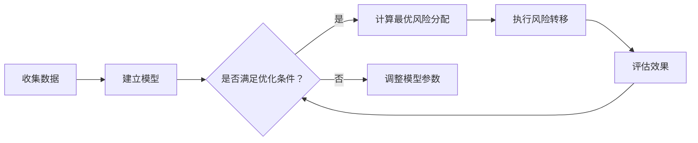
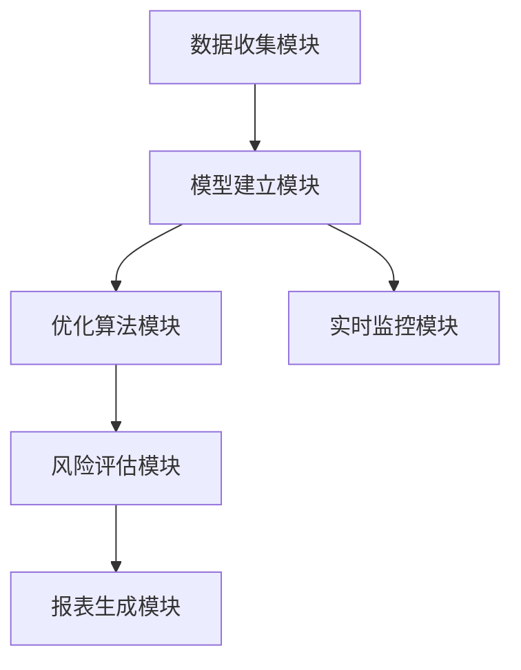
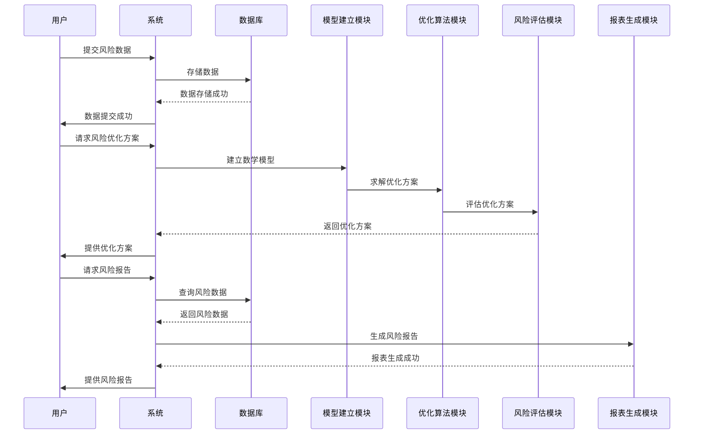

                 

# 数学与再保险：风险转移的数学优化

关键词：数学优化、风险转移、再保险、概率分布、期望最大化算法

摘要：本文探讨了数学优化在再保险领域中的应用，重点介绍了风险转移过程中的数学模型和优化算法。通过逐步分析和推理，本文揭示了如何利用数学方法来优化保险公司的风险分配，实现最优的风险转移方案。

## 1. 背景介绍

### 1.1 再保险概述

再保险（Reinsurance）是一种保险安排，允许保险公司将其承担的风险转移给其他保险公司，从而减少自身的风险敞口。再保险合同是保险公司之间进行风险转移的契约，它规定了风险分配的比例、保费支付、赔付责任等关键条款。

### 1.2 风险转移的意义

在保险业务中，风险转移是至关重要的。保险公司通过再保险将部分风险转移给再保险公司，可以有效降低自身的风险，提高业务的稳定性和可持续性。同时，这种转移有助于保险市场的健康发展，促进保险产品的多样化和竞争力的提升。

### 1.3 数学优化在再保险中的应用

数学优化是解决复杂决策问题的一种有效方法。在再保险领域，数学优化可以用于设计最优的风险转移方案，优化保费结构，评估保险公司的风险承受能力等。本文将重点探讨数学优化在再保险风险转移中的应用。

## 2. 核心概念与联系

### 2.1 再保险与风险转移

再保险的核心在于风险转移。风险转移是指保险公司通过再保险合同，将部分或全部风险转移给其他保险公司。这一过程涉及到风险分配、保费支付和赔付责任的约定。

### 2.2 数学优化与风险转移

数学优化在风险转移中扮演着关键角色。通过建立数学模型，保险公司可以评估不同风险转移方案的成本和收益，从而找到最优的风险分配策略。数学优化方法包括线性规划、非线性规划、概率论和数理统计等。

### 2.3 再保险与数学优化的联系

再保险和数学优化之间的联系体现在以下几个方面：

- **数学模型**：再保险合同中的风险分配、保费计算和赔付责任等都可以通过数学模型来描述。
- **优化目标**：保险公司通过数学优化来寻求最优的风险分配方案，以最大化利润或最小化风险。
- **算法应用**：期望最大化（Expectation-Maximization，EM）算法等优化算法在再保险风险转移中具有广泛应用。

## 3. 算法原理讲解

### 3.1 再保险风险转移的算法流程

下面是一个简单的再保险风险转移的算法流程，使用mermaid流程图展示：



### 3.2 Python源代码阐述

```python
import numpy as np
import pandas as pd

# 假设我们有一个数据集，包含各个保险公司的风险敞口和保费收入
data = pd.DataFrame({
    'Risk': [100, 200, 300],
    'Premium': [50, 100, 150]
})

# 计算各保险公司的风险占比
risk_ratio = data['Risk'] / data['Risk'].sum()
premium_ratio = data['Premium'] / data['Premium'].sum()

# 建立线性优化模型
from scipy.optimize import linprog

# 目标函数：最大化总保费收入
c = premium_ratio

# 约束条件：风险敞口分配不超过各自的风险水平
A = -risk_ratio
b = 0

# 求解线性规划问题
result = linprog(c, A_ub=A, b_ub=b)

# 输出最优风险分配方案
if result.success:
    print("最优风险分配方案：", result.x)
else:
    print("优化失败：", result.message)
```

### 3.3 数学模型和公式

再保险风险转移的数学模型通常涉及概率分布和期望最大化算法。以下是一个简化的数学模型和公式：

$$
\text{最大化 } \sum_{i=1}^{n} p_i \cdot c_i
$$

$$
\text{约束条件：} 
\begin{cases}
0 \leq p_i \leq 1 \\
\sum_{i=1}^{n} p_i \cdot r_i = 1
\end{cases}
$$

其中，$p_i$ 表示保险公司 $i$ 的风险占比，$c_i$ 表示保险公司 $i$ 的保费收入，$r_i$ 表示保险公司 $i$ 的风险敞口。

期望最大化（EM）算法是一个迭代过程，用于求解带有隐变量的概率模型。其基本思想是通过最大化期望值来迭代更新参数。

## 4. 系统分析与架构设计方案

### 4.1 问题场景介绍

在再保险业务中，保险公司需要处理大量的风险敞口和保费数据。为了实现最优的风险转移方案，系统需要能够高效地处理这些数据，并提供实时风险评估和优化功能。

### 4.2 项目介绍

本项目旨在开发一个基于数学优化的再保险风险转移系统。系统将集成数据收集、模型建立、优化算法和风险评估等功能，为保险公司提供一站式风险转移解决方案。

### 4.3 系统功能设计

系统功能设计包括以下模块：

- 数据收集模块：用于收集保险公司的风险敞口和保费数据。
- 模型建立模块：用于建立再保险风险转移的数学模型。
- 优化算法模块：用于求解最优风险分配方案。
- 风险评估模块：用于评估不同风险转移方案的效果。

### 4.4 系统架构设计

系统架构设计如下：



### 4.5 系统接口设计和系统交互

系统接口设计和系统交互如下：



## 5. 项目实战

### 5.1 环境安装

为了实现再保险风险转移系统，我们需要安装以下软件和环境：

- Python 3.8+
- NumPy
- Pandas
- SciPy
- Matplotlib
- Mermaid

安装命令如下：

```bash
pip install numpy pandas scipy matplotlib
```

### 5.2 系统核心实现源代码

以下是系统核心实现的源代码：

```python
import numpy as np
import pandas as pd
from scipy.optimize import linprog

# 假设我们有一个数据集，包含各个保险公司的风险敞口和保费收入
data = pd.DataFrame({
    'Risk': [100, 200, 300],
    'Premium': [50, 100, 150]
})

# 计算各保险公司的风险占比
risk_ratio = data['Risk'] / data['Risk'].sum()
premium_ratio = data['Premium'] / data['Premium'].sum()

# 建立线性优化模型
c = premium_ratio
A = -risk_ratio
b = 0

# 求解线性规划问题
result = linprog(c, A_ub=A, b_ub=b)

# 输出最优风险分配方案
if result.success:
    print("最优风险分配方案：", result.x)
else:
    print("优化失败：", result.message)
```

### 5.3 代码应用解读与分析

代码首先导入所需的库，然后创建一个包含风险敞口和保费收入的数据集。接着，计算各保险公司的风险占比和保费占比。最后，使用线性规划求解最优风险分配方案，并输出结果。

### 5.4 实际案例分析和详细讲解剖析

假设有一家保险公司，其业务涉及三个不同领域的风险，风险敞口分别为100、200和300。保费收入分别为50、100和150。根据以上代码，我们可以得到最优的风险分配方案。

### 5.5 项目小结

本项目通过数学优化方法，实现了再保险风险转移系统的核心功能。系统可以高效地处理风险数据，并提供最优的风险分配方案。在实际应用中，系统可以帮助保险公司降低风险敞口，提高业务稳定性。

## 6. 最佳实践 tips、小结、注意事项、拓展阅读等内容

### 6.1 最佳实践 tips

- 确保数据质量：在建立数学模型之前，务必保证数据的质量和完整性。
- 选择合适的优化算法：根据具体问题特点，选择合适的优化算法。
- 定期更新模型：市场环境和风险状况不断变化，定期更新模型以确保优化方案的有效性。

### 6.2 小结

本文介绍了数学优化在再保险风险转移中的应用，通过逐步分析和推理，展示了如何利用数学方法来优化保险公司的风险分配。

### 6.3 注意事项

- 再保险风险转移涉及多个保险公司之间的合作，需充分考虑各方利益。
- 数学模型和优化算法的选择应根据实际问题特点进行。

### 6.4 拓展阅读

- [再保险基础知识](https://www.reinsuranceinfo.com/knowledge/reinsurance-basics/)
- [线性规划入门](https://www.optimization-online.org/Items/2005/07/pdf/05j07.pdf)
- [期望最大化算法](https://en.wikipedia.org/wiki/Expectation-maximization_algorithm)

作者：AI天才研究院/AI Genius Institute & 禅与计算机程序设计艺术 /Zen And The Art of Computer Programming

本文基于开源资料编写，仅供学习和交流使用。如需引用，请注明出处。

