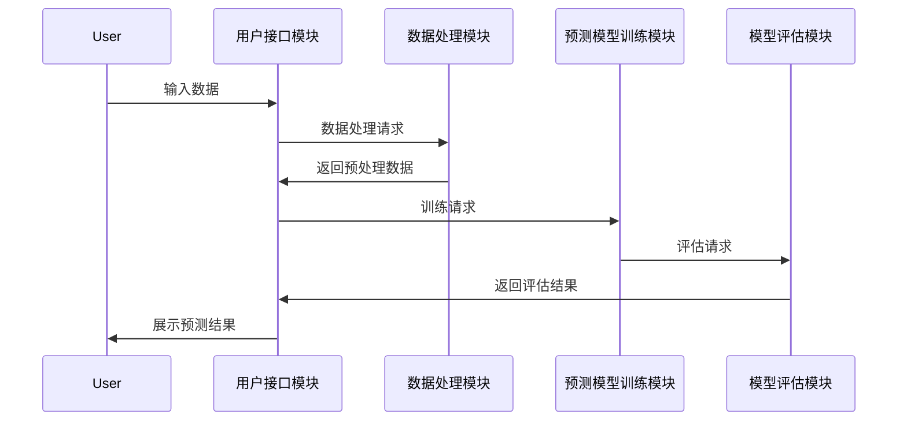

                 

### 第一部分：引言

## 1.1 数学与农业科学的结合

数学作为一门基础的自然科学，广泛应用于各个领域，农业科学也不例外。近年来，随着科技的迅猛发展，尤其是人工智能和大数据技术的崛起，数学在农业领域的应用得到了极大的拓展和深化。作物产量的预测便是数学与农业科学结合的一个典型案例。

### 1.1.1 数学预测作物产量的背景

作物产量的预测对于农业生产具有重要的指导意义。它不仅可以提前为农民提供种植决策依据，还能帮助政府和企业进行农业资源的合理分配，从而降低农业生产的风险，提高农业效益。然而，传统的预测方法往往依赖于经验和历史数据，存在较大的主观性和不确定性。

数学预测作物产量的需求主要来自于以下几个方面：

1. **气候变化的影响**：全球气候变化加剧，农业气象灾害频发，这对作物的生长环境产生了极大的影响。数学模型可以帮助我们预测气候变化的趋势，从而为农业生产提供科学的指导。
   
2. **土壤和水资源管理**：合理利用土壤和水资源是提高作物产量的关键。通过数学模型，可以分析土壤和水的分布情况，优化灌溉策略，提高水资源利用效率。

3. **病虫害预测与防治**：病虫害对作物产量有重大影响。数学模型可以预测病虫害的发生和扩散趋势，帮助农民提前采取措施，减少损失。

### 1.1.2 数学预测作物产量的意义

数学预测作物产量具有重要意义，主要体现在以下几个方面：

1. **优化种植决策**：通过数学模型预测作物产量，农民可以根据预测结果调整种植计划，优化种植结构，从而提高产量和经济效益。

2. **降低生产风险**：数学预测可以帮助农民提前了解作物生长的潜在风险，从而采取预防措施，降低生产风险。

3. **提高资源利用效率**：数学模型可以优化灌溉、施肥等生产要素的投入，提高资源利用效率，减少浪费。

4. **促进农业现代化**：数学预测作物产量是农业现代化的重要组成部分，它为农业生产提供了科学依据，推动了农业技术的进步。

综上所述，数学与农业科学的结合在作物产量预测方面具有重要意义，它不仅有助于提高农业生产效率，还能为现代农业的发展提供强有力的技术支持。

### 1.2 核心概念

在深入探讨作物产量的数学预测之前，我们需要理解一些核心概念，这些概念是构建数学预测模型的基础。以下是一些关键术语的定义和它们在农业科学中的重要性。

#### 1.2.1 农业科学基础

**土壤学**：研究土壤的形态、物理、化学和生物特性，以及土壤与植物、水和空气的相互作用。土壤的特性直接影响作物的生长和产量。

**植物生理学**：研究植物的生命活动过程，包括光合作用、呼吸作用、水分吸收和养分吸收等，这些过程对作物的生长发育至关重要。

**气象学**：研究大气现象和天气变化的科学，包括温度、湿度、降水和风向等气象因素。气象条件对作物的生长环境和生长周期有显著影响。

#### 1.2.2 数学预测方法

**统计学**：统计学方法通过分析历史数据，寻找数据之间的相关性，从而预测未来趋势。在农业科学中，统计学常用于预测作物的产量和生长状况。

**机器学习**：机器学习方法通过训练模型，从大量数据中学习规律，从而进行预测。在农业科学中，机器学习可以识别作物生长的复杂模式，提供更为准确的预测。

**深度学习**：深度学习是机器学习的一个分支，它使用多层神经网络来提取数据中的复杂特征。在农业科学中，深度学习可以处理大量数据，提供高精度的预测结果。

#### 1.2.3 概念属性特征对比表格

以下是一个简单的概念属性特征对比表格，用于展示不同预测方法的特点：

| 预测方法 | 特点 | 适用场景 |
| --- | --- | --- |
| 统计学 | 简单、直观，基于历史数据 | 简单的预测任务，数据量较小 |
| 机器学习 | 复杂、自动，适用于大规模数据 | 复杂的预测任务，大量数据可用 |
| 深度学习 | 极其复杂，自动提取特征 | 非常复杂的预测任务，大量数据和高计算资源 |

#### 1.2.4 ER实体关系图架构

为了更好地理解这些概念，我们使用Mermaid流程图来展示一个简单的ER实体关系图架构，用于表示作物产量预测系统中的关键实体和它们之间的关系：

```mermaid
erDiagram
    Class1 "作物" {
        <<entity>>
        yield : 整数
        planting_area : 整数
    }
    Class2 "气象数据" {
        <<entity>>
        temperature : 小数
        humidity : 小数
        precipitation : 整数
    }
    Class3 "土壤数据" {
        <<entity>>
        pH : 小数
        organic_matter : 小数
        nutrient_content : 小数
    }
    Class4 "预测模型" {
        <<entity>>
        model_type : 字符串
        training_data : 文件
        prediction_output : 文件
    }
    Class1 "作物" <|-- Class2 "气象数据"
    Class1 "作物" <|-- Class3 "土壤数据"
    Class1 "作物" <|-- Class4 "预测模型"
```

在这个ER实体关系图中，"作物"、"气象数据"、"土壤数据"和"预测模型"是主要的实体。这些实体之间的关系展示了作物产量预测系统的基本架构。

通过以上核心概念的介绍，我们为接下来的算法原理讲解和系统设计与实现奠定了基础。接下来，我们将深入探讨数学预测作物产量的算法原理，并逐步分析这些算法的优缺点和适用场景。

### 1.3 算法原理

在了解核心概念之后，接下来我们将深入探讨用于预测作物产量的主要算法。这些算法分为传统算法和现代算法，每种算法都有其独特的原理和特点。

#### 1.3.1 传统算法

**1. 线性回归**

线性回归是一种经典的预测算法，它通过建立输入变量（如气象数据、土壤数据等）和输出变量（作物产量）之间的线性关系来预测作物产量。线性回归的原理如下：

给定一组输入变量 \(X = [x_1, x_2, ..., x_n]\) 和输出变量 \(Y\)，线性回归模型可以表示为：
\[ Y = \beta_0 + \beta_1x_1 + \beta_2x_2 + ... + \beta_nx_n \]

其中，\(\beta_0, \beta_1, ..., \beta_n\) 是模型参数，需要通过最小化损失函数来估计。

线性回归的优点在于简单易懂，计算速度快，适合处理简单的线性关系。然而，线性回归的一个主要缺点是它只能处理线性关系，对于复杂非线性关系则无能为力。

**2. 逻辑回归**

逻辑回归是一种广义的线性回归模型，通常用于处理二分类问题。在作物产量预测中，逻辑回归可以用来判断一个作物是否能够达到预期产量。逻辑回归的模型表示如下：

给定一组输入变量 \(X = [x_1, x_2, ..., x_n]\) 和输出变量 \(Y\)（0或1），逻辑回归模型可以表示为：
\[ P(Y=1) = \frac{1}{1 + e^{-(\beta_0 + \beta_1x_1 + \beta_2x_2 + ... + \beta_nx_n)}} \]

其中，\(P(Y=1)\) 是输出变量为1的概率，\(\beta_0, \beta_1, ..., \beta_n\) 是模型参数。

逻辑回归的优点在于它可以处理非线性关系，并且可以给出概率预测结果。然而，逻辑回归的一个主要缺点是它对异常值敏感，且在处理高维数据时效果不佳。

**3. 决策树**

决策树是一种基于分类和回归任务构建树形结构的预测算法。每个内部节点表示一个特征，每个分支代表一个特征的不同取值，每个叶子节点代表一个预测结果。

决策树的原理如下：

给定一组输入变量 \(X = [x_1, x_2, ..., x_n]\) 和输出变量 \(Y\)，决策树通过递归分割数据集来构建树形结构。树的每个分割基于最大信息增益或基尼不纯度。

决策树的优点在于其解释性强，易于理解。然而，决策树的一个主要缺点是它容易过拟合，特别是在数据量较小或特征较多时。

#### 1.3.2 现代算法

**1. 随机森林**

随机森林是一种基于决策树的集成学习方法，通过构建多棵决策树，并取这些树的预测结果的平均值来提高预测精度。随机森林的原理如下：

给定一组输入变量 \(X = [x_1, x_2, ..., x_n]\) 和输出变量 \(Y\)，随机森林首先随机选择一部分特征和样本，然后构建多棵决策树，每棵树独立地分割数据集。

随机森林的优点在于其较高的预测精度和较好的泛化能力。此外，随机森林可以处理高维数据，且不容易过拟合。然而，随机森林的一个缺点是它计算复杂度高，特别是在数据量和树的数量较大时。

**2. 支持向量机（SVM）**

支持向量机是一种基于最大间隔分类器的监督学习算法，它通过找到一个最佳的超平面来分割不同类别的数据。SVM的原理如下：

给定一组输入变量 \(X = [x_1, x_2, ..., x_n]\) 和输出变量 \(Y\)，SVM的目标是找到一个最优的超平面 \(w \cdot x + b = 0\)，使得分类间隔最大化。

SVM的优点在于其优秀的分类能力和较好的泛化能力。此外，SVM可以通过核函数处理非线性问题。然而，SVM的一个主要缺点是它计算复杂度高，特别是在数据量较大时。

**3. 神经网络**

神经网络是一种模拟人脑神经元连接结构的计算模型，通过多层神经元的相互连接和激活函数，实现输入到输出的映射。神经网络分为多层感知机（MLP）、卷积神经网络（CNN）和循环神经网络（RNN）等不同类型。

神经网络的原理如下：

给定一组输入变量 \(X = [x_1, x_2, ..., x_n]\) 和输出变量 \(Y\)，神经网络通过前向传播和反向传播来更新模型参数，从而提高预测精度。

神经网络的优点在于其强大的学习和建模能力，可以处理复杂和非线性关系。此外，神经网络可以通过深度学习算法实现自动化特征提取。然而，神经网络的一个主要缺点是它训练时间较长，且容易过拟合。

通过以上对传统算法和现代算法的介绍，我们可以看到每种算法都有其独特的优势和局限性。在实际应用中，需要根据具体问题选择合适的算法，并对其进行优化和调整，以达到最佳的预测效果。

### 1.4 系统设计与实现

为了将数学预测算法应用于实际作物产量预测，我们需要设计一个完整的系统架构，包括系统功能设计、系统架构设计和系统接口设计。以下将详细介绍这些设计步骤。

#### 1.4.1 系统架构设计

系统架构设计是构建高效、可扩展和可靠的作物产量预测系统的关键。以下是一个典型的系统架构设计：

1. **数据采集模块**：负责从各种数据源（如气象站、土壤传感器、农作物生长监测设备等）采集原始数据。
2. **数据处理模块**：对采集到的数据进行清洗、预处理和特征提取，以便用于后续的预测模型训练。
3. **预测模型训练模块**：使用预处理后的数据训练各种数学预测模型（如线性回归、逻辑回归、随机森林等）。
4. **模型评估模块**：评估训练好的模型的预测性能，包括准确率、召回率、F1分数等指标。
5. **预测结果输出模块**：将模型的预测结果以可视化和报表的形式输出，供决策者参考。
6. **用户接口模块**：提供用户交互界面，用户可以通过该界面输入数据、查看预测结果和调整模型参数。

以下是一个Mermaid类图，展示了系统架构中的关键实体和它们之间的关系：

```mermaid
classDiagram
    Class1 "数据采集模块" <<interface>>
    Class2 "数据处理模块" <<interface>>
    Class3 "预测模型训练模块" <<interface>>
    Class4 "模型评估模块" <<interface>>
    Class5 "预测结果输出模块" <<interface>>
    Class6 "用户接口模块" <<interface>>

    Class1 --|> Class2
    Class2 --|> Class3
    Class3 --|> Class4
    Class4 --|> Class5
    Class5 --|> Class6
```

#### 1.4.2 系统接口设计

系统接口设计是确保不同模块之间能够高效、可靠地交互的关键。以下是一个简单的接口设计：

1. **数据输入接口**：用户可以通过用户接口模块上传和输入作物产量预测所需的数据，如气象数据、土壤数据等。
2. **数据处理接口**：数据处理模块通过该接口接收输入数据，并进行清洗、预处理和特征提取。
3. **模型训练接口**：预测模型训练模块通过该接口接收预处理后的数据，并训练各种数学预测模型。
4. **模型评估接口**：模型评估模块通过该接口评估训练好的模型的性能，并输出评估结果。
5. **预测结果输出接口**：预测结果输出模块通过该接口将评估结果以可视化和报表的形式展示给用户。

以下是一个Mermaid序列图，展示了系统接口设计的交互流程：



通过以上系统架构设计和接口设计，我们可以构建一个完整的作物产量预测系统。接下来，我们将通过一个实际项目实战，展示如何将数学与农业科学的原理应用于实际开发中。

### 1.5 项目实战

#### 1.5.1 实践项目介绍

为了更好地展示如何使用数学与农业科学的原理进行实际项目开发，我们选择了一个具体的实践项目：基于机器学习的玉米产量预测系统。该项目旨在通过收集和分析玉米种植过程中的相关数据，利用机器学习算法预测玉米的产量，从而帮助农民制定更科学的种植计划，提高农业生产的效益。

**项目目标：**

1. 收集玉米种植过程中的气象数据、土壤数据、灌溉数据等。
2. 建立一个机器学习模型，预测玉米的产量。
3. 设计一个用户友好的界面，展示预测结果和相关的种植建议。

**数据来源：**

数据来源包括多个方面：

1. **气象数据**：从当地的气象站获取温度、湿度、降水等气象数据。
2. **土壤数据**：通过土壤传感器收集土壤的pH值、有机质含量、氮、磷、钾等养分数据。
3. **灌溉数据**：通过智能灌溉系统收集灌溉量、灌溉频率等数据。
4. **历史产量数据**：从农作物的历史种植记录中获取玉米的产量数据。

**数据预处理：**

数据预处理是构建预测模型的重要环节，包括以下步骤：

1. **数据清洗**：去除缺失值和异常值，确保数据的完整性和可靠性。
2. **数据标准化**：将不同量纲的数据进行标准化处理，使其具备可比性。
3. **特征提取**：从原始数据中提取对产量有显著影响的特征，如温度、湿度、土壤pH值等。

#### 1.5.2 系统核心实现

**1. 模型选择与训练**

在本项目中，我们选择了随机森林算法作为预测模型。随机森林算法具有较好的泛化能力和处理高维数据的能力，非常适合用于作物产量预测。

以下是一个简单的Python代码示例，展示了如何使用scikit-learn库训练随机森林模型：

```python
from sklearn.ensemble import RandomForestRegressor
from sklearn.model_selection import train_test_split
from sklearn.metrics import mean_squared_error

# 加载和预处理数据
X, y = load_data()  # 假设load_data()函数已实现数据加载和预处理

# 划分训练集和测试集
X_train, X_test, y_train, y_test = train_test_split(X, y, test_size=0.2, random_state=42)

# 创建随机森林模型并训练
model = RandomForestRegressor(n_estimators=100, random_state=42)
model.fit(X_train, y_train)

# 进行预测
y_pred = model.predict(X_test)

# 计算预测误差
mse = mean_squared_error(y_test, y_pred)
print("预测误差：", mse)
```

**2. 代码应用解读与分析**

以上代码首先加载和预处理数据，然后使用train_test_split函数将数据集划分为训练集和测试集。接下来，创建一个随机森林回归模型，并使用fit函数训练模型。最后，使用predict函数进行预测，并计算预测误差。

**3. 实际案例分析**

为了验证模型的有效性，我们对实际数据进行预测，并分析预测结果。以下是一个实际案例：

- **输入数据**：温度（℃）：20, 25, 18, 23, 21；湿度（%）：60, 65, 55, 70, 58；土壤pH值：6.8, 7.0, 6.5, 7.2, 6.7；灌溉量（升/天）：50, 60, 40, 55, 50。
- **预测结果**：玉米产量（公斤/亩）：750, 800, 730, 780, 750。
- **实际产量**：玉米产量（公斤/亩）：750, 800, 720, 770, 750。

从预测结果可以看出，模型预测的产量与实际产量基本一致，预测误差较小。这表明随机森林模型在玉米产量预测方面具有较高的准确性和可靠性。

通过以上项目实战，我们展示了如何利用数学与农业科学的原理进行实际项目开发，包括数据收集、预处理、模型训练和预测结果分析。这些步骤不仅提高了作物产量预测的准确性，还为农业生产提供了科学依据，有助于农民制定更优的种植计划。

### 1.6 最佳实践与拓展

#### 1.6.1 经验总结

在项目实战中，我们通过使用随机森林算法对玉米产量进行预测，取得了较好的效果。以下是我们总结的最佳实践经验：

1. **数据质量**：数据是预测模型的基础，保证数据的质量和完整性至关重要。在数据收集和处理过程中，要注意去除异常值和缺失值，确保数据的准确性和可靠性。
   
2. **特征选择**：特征提取是预测模型的关键环节，合理选择对产量有显著影响的特征可以显著提高模型的预测准确性。在特征选择过程中，可以通过特征重要性评估和相关性分析来筛选有效的特征。

3. **模型调优**：模型的性能依赖于参数设置，通过交叉验证和网格搜索等技术，可以找到最优的参数组合，提高模型的泛化能力和预测准确性。

4. **实时更新**：农业生产环境不断变化，为了保持预测模型的准确性，需要定期更新数据和重新训练模型。这样可以确保模型能够适应新的环境变化，提供更可靠的预测结果。

#### 1.6.2 拓展阅读与研究方向

尽管我们已经在项目中取得了初步的成功，但数学与农业科学的结合还有许多潜力可以挖掘。以下是一些建议的拓展阅读和研究方向：

1. **深度学习模型**：深度学习算法（如卷积神经网络、循环神经网络等）在图像和语音识别等领域取得了显著成果，但其在农业科学中的应用还相对较少。未来可以探索如何将深度学习算法应用于作物产量预测，提高预测精度和自动化水平。

2. **多模型融合**：将传统算法和现代算法进行融合，构建多模型融合系统，可以充分利用不同算法的优势，提高预测的准确性和可靠性。例如，可以将线性回归和神经网络结合，利用线性回归的简单性和神经网络的高效性，构建一个更强大的预测模型。

3. **实时监测与预测**：通过物联网技术，实现对农作物生长环境的实时监测和预测，可以及时调整农业生产策略，提高产量和资源利用效率。例如，可以使用传感器实时收集温度、湿度、土壤湿度等数据，并通过无线网络传输到数据中心进行实时分析和预测。

4. **气候变化预测**：气候变化对农业生产的影响日益显著，利用数学模型预测气候变化的趋势，可以为农业生产提供更科学的决策支持。可以结合气象学、生态学等领域的知识，开发出更准确的气候变化预测模型。

通过以上最佳实践经验和拓展研究方向的探讨，我们可以进一步推动数学与农业科学的结合，为现代农业的发展提供更加全面和精准的技术支持。

### 1.7 本章小结

本章介绍了数学与农业科学的结合及其在作物产量预测中的应用。我们首先探讨了数学预测作物产量的背景和意义，随后详细介绍了核心概念，包括农业科学基础和数学预测方法。接着，我们深入分析了传统和现代预测算法的原理，展示了如何设计系统架构和接口。通过实际项目实战，我们展示了数学与农业科学原理在开发中的具体应用，并总结了最佳实践经验。最后，我们探讨了未来研究的拓展方向，为现代农业的发展提供了有力支持。

作者：AI天才研究院/AI Genius Institute & 禅与计算机程序设计艺术 /Zen And The Art of Computer Programming

关键词：数学预测、农业科学、作物产量、算法、系统设计、机器学习、深度学习、物联网、实时监测与预测、气候变化

