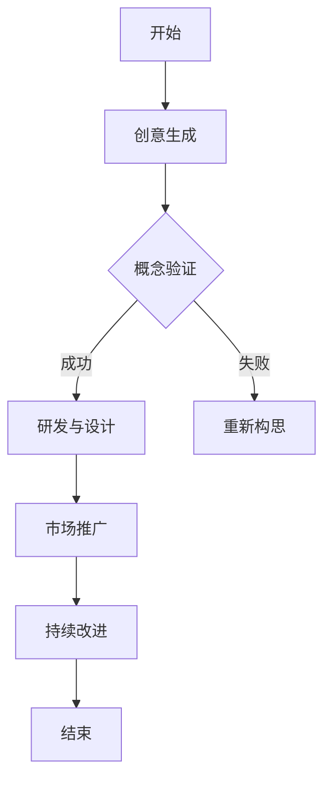
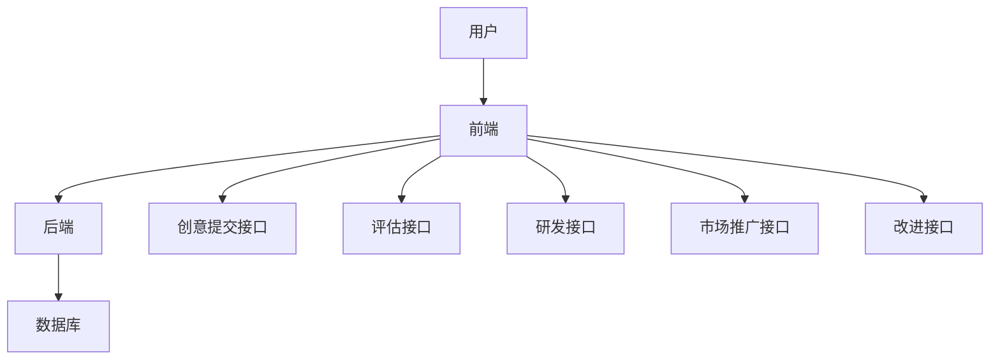

                 

# 《数学与创新管理：创新过程的数学模型》

## 关键词

数学、创新管理、创新过程、数学模型、风险评估、优化

## 摘要

本文以数学与创新管理的关系为核心，探讨了创新过程的数学模型构建、变量关系分析、风险评估与优化方法。通过系统化的数学分析，本文揭示了创新过程中的关键因素及其相互作用机制，为企业创新管理提供了理论指导和实践策略。本文旨在帮助读者理解数学在创新管理中的应用，提高创新决策的科学性和效率。

## 目录大纲

1. 引言
2. 数学基础与概念
   2.1 数学在创新管理中的作用
   2.2 基础数学概念介绍
   2.3 数学工具与技巧
3. 创新管理基本概念
   3.1 创新管理的定义
   3.2 创新过程
   3.3 创新管理要素
4. 创新过程的数学模型
   4.1 创新过程模型概述
   4.2 常用创新过程模型
   4.3 构建创新过程模型的方法
5. 创新过程中的变量关系分析
   5.1 变量关系概述
   5.2 变量关系分析方法
   5.3 变量关系模型构建
6. 创新过程的风险评估与优化
   6.1 风险评估方法
   6.2 风险评估模型
   6.3 创新过程优化方法
7. 案例分析
   7.1 企业创新案例分析
   7.2 行业创新案例分析
8. 结论

## 引言

### 数学与创新管理的关系

数学作为一种工具和语言，在各个领域都发挥着重要作用。尤其在创新管理中，数学的应用能够帮助我们更好地理解复杂问题，提高决策的准确性和效率。创新管理是指企业或组织通过创新活动来获取竞争优势的过程。在这一过程中，数学能够提供以下几方面的支持：

1. **定量分析**：创新管理涉及大量的定量数据，如市场规模、顾客需求、竞争对手等。通过数学模型和工具，我们可以对这些数据进行深入分析，揭示其中的规律和趋势，从而为决策提供依据。
2. **优化决策**：数学优化方法可以帮助企业在创新过程中找到最佳解决方案，如资源分配、产品定价、市场策略等。通过数学模型的优化，企业可以最大化收益或最小化成本。
3. **风险评估**：创新过程充满不确定性，数学风险评估方法可以帮助企业识别和评估潜在风险，制定应对策略。

### 本书的目的与结构

本书旨在探讨数学与创新管理之间的关系，尤其是创新过程的数学模型构建和应用。全书分为七个部分：

1. **引言**：介绍数学与创新管理的关系，阐述本书的目的和结构。
2. **数学基础与概念**：介绍创新管理中常用的数学概念和工具。
3. **创新管理基本概念**：阐述创新管理的定义、过程和要素。
4. **创新过程的数学模型**：探讨创新过程的数学模型构建和应用。
5. **创新过程中的变量关系分析**：分析创新过程中的变量关系和影响因素。
6. **创新过程的风险评估与优化**：介绍创新过程的风险评估和优化方法。
7. **案例分析**：通过实际案例，展示数学模型在创新管理中的应用。

## 数学基础与概念

### 数学在创新管理中的作用

数学在创新管理中扮演着重要角色，主要体现在以下几个方面：

1. **定量分析**：创新管理涉及大量的定量数据，如市场规模、顾客需求、竞争对手等。通过数学模型和工具，我们可以对这些数据进行深入分析，揭示其中的规律和趋势，从而为决策提供依据。
2. **优化决策**：数学优化方法可以帮助企业在创新过程中找到最佳解决方案，如资源分配、产品定价、市场策略等。通过数学模型的优化，企业可以最大化收益或最小化成本。
3. **风险评估**：创新过程充满不确定性，数学风险评估方法可以帮助企业识别和评估潜在风险，制定应对策略。

### 基础数学概念介绍

在创新管理中，常用的数学概念包括：

1. **概率论**：用于分析不确定性事件，如市场需求的不确定性、竞争对手的行为等。
2. **统计学**：用于描述和分析数据，如市场调查数据、顾客反馈数据等。
3. **线性代数**：用于处理多维数据，如顾客需求空间、产品特征空间等。
4. **优化理论**：用于解决优化问题，如资源分配、定价策略等。
5. **运筹学**：用于解决复杂决策问题，如供应链管理、项目管理等。

### 数学工具与技巧

在创新管理中，常用的数学工具和技巧包括：

1. **数据可视化**：通过图表和图像，直观地展示数据和分析结果，帮助决策者理解复杂信息。
2. **数学建模**：将现实问题转化为数学模型，通过模型分析和求解，找到问题的解决方案。
3. **算法优化**：通过优化算法，提高数学模型的求解效率，降低计算成本。
4. **机器学习**：利用机器学习算法，从数据中提取规律和知识，辅助决策过程。

## 创新管理基本概念

### 创新管理的定义

创新管理是指企业或组织通过创新活动来获取竞争优势的过程。它包括以下几个方面：

1. **创新活动**：指企业或组织进行的创新实践活动，如新产品开发、新技术应用、新市场开拓等。
2. **管理过程**：指企业在创新活动中所进行的一系列管理活动，如需求分析、资源分配、风险评估等。
3. **竞争优势**：指通过创新活动，企业或组织在市场竞争中获得的相对优势。

### 创新过程

创新过程是指企业或组织从创新活动开始到获得竞争优势的整个过程。一般来说，创新过程包括以下几个阶段：

1. **创意生成**：指企业或组织产生新想法和新创意的过程。
2. **概念验证**：指对创意进行初步验证，确定其可行性和价值。
3. **研发与设计**：指对创意进行深入研发和设计，形成具体的产品或服务。
4. **市场推广**：指将创新产品或服务推向市场，进行推广和销售。
5. **持续改进**：指在市场推广过程中，对创新产品或服务进行持续改进和优化。

### 创新管理要素

创新管理要素是指企业在创新过程中所需具备的基本条件和资源。一般来说，创新管理要素包括以下几个方面：

1. **人才**：指企业或组织具备的创新型人才，如研发人员、市场营销人员等。
2. **技术**：指企业或组织拥有的创新技术，如专利、知识产权等。
3. **资金**：指企业或组织在创新过程中所需的资金支持，如研发投入、市场推广费用等。
4. **组织结构**：指企业或组织的组织结构和管理体系，如创新团队、项目管理制度等。
5. **文化**：指企业或组织的创新文化，如鼓励创新、宽容失败等。

## 创新过程的数学模型

### 创新过程模型概述

创新过程模型是对创新过程进行抽象和描述的数学模型，用于分析创新过程中的关键因素及其相互作用。常见的创新过程模型包括线性模型、非线性模型、网络模型等。

线性模型通常假设创新过程中的各个阶段是线性相关的，即一个阶段的输出是下一个阶段的输入。这种模型简单易懂，适用于一些简单的创新过程。

非线性模型则考虑了创新过程中各阶段的非线性关系，更加符合实际情况。非线性模型能够更好地反映创新过程中的复杂性和不确定性。

网络模型将创新过程视为一个网络结构，各个节点表示创新过程中的不同阶段，边表示节点之间的依赖关系。这种模型能够清晰地展示创新过程中的复杂关系和关键路径。

### 常用创新过程模型

在创新管理中，常用的创新过程模型包括以下几种：

1. **IDEAL模型**：IDEAL模型是创新过程的经典模型，包括五个阶段：灵感（Ideation）、探索（Exploration）、评估（Evaluation）、实施（Implementation）、学习（Learning）。

   - **灵感**：指创意生成的阶段，企业或组织通过头脑风暴、市场调研等方式产生新想法。
   - **探索**：指对创意进行初步验证和评估的阶段，企业或组织通过实验、模拟等方式确定创意的可行性和价值。
   - **评估**：指对创意进行深入评估和筛选的阶段，企业或组织根据评估结果决定是否继续推进创意。
   - **实施**：指将创意转化为具体的产品或服务的阶段，企业或组织进行研发、设计、生产等。
   - **学习**：指在创新过程中不断学习和总结，以提高未来创新的成功率。

2. **R&D模型**：R&D模型是针对研发创新过程的一种模型，包括四个阶段：研究（Research）、开发（Development）、测试（Testing）、商业化（Commercialization）。

   - **研究**：指对新技术、新材料、新理论等进行研究的阶段。
   - **开发**：指将研究成果转化为具体的产品或服务的阶段。
   - **测试**：指对产品或服务进行测试和优化的阶段。
   - **商业化**：指将产品或服务推向市场的阶段。

3. **KPD模型**：KPD模型是针对产品创新过程的一种模型，包括三个阶段：知识获取（Knowledge Acquisition）、产品开发（Product Development）、市场部署（Market Deployment）。

   - **知识获取**：指获取与产品创新相关的知识、技术和信息。
   - **产品开发**：指将知识转化为具体的产品或服务。
   - **市场部署**：指将产品或服务推向市场，进行推广和销售。

### 构建创新过程模型的方法

构建创新过程模型的方法主要包括以下几种：

1. **系统动力学方法**：系统动力学方法是一种基于系统论的方法，通过建立系统动力学模型，分析创新过程中的复杂关系和动态行为。

2. **仿真方法**：仿真方法通过计算机模拟，对创新过程进行仿真和分析，以预测创新过程的结果和性能。

3. **统计分析方法**：统计分析方法通过对历史数据的分析，识别创新过程中的关键因素和规律，为构建创新过程模型提供依据。

4. **机器学习方法**：机器学习方法通过对大量数据进行训练，建立创新过程的预测模型和优化模型，以提高创新决策的准确性和效率。

## 创新过程中的变量关系分析

### 变量关系概述

在创新过程中，各种变量之间存在复杂的相互作用关系。变量关系分析旨在揭示这些变量之间的内在联系，以便更好地理解创新过程的运行机制。

常见的变量包括：

1. **市场需求**：指消费者对产品或服务的需求程度。
2. **技术能力**：指企业在技术创新方面的能力。
3. **资源投入**：指企业在创新过程中所需的资金、人力、技术等资源。
4. **竞争压力**：指竞争对手对企业的竞争压力。
5. **创新成功率**：指创新过程中成功的概率。

### 变量关系分析方法

变量关系分析方法主要包括以下几种：

1. **相关性分析**：通过计算变量之间的相关系数，分析变量之间的相关性。
2. **因果分析**：通过建立因果模型，分析变量之间的因果关系。
3. **网络分析**：通过建立变量关系网络，分析变量之间的复杂关系。
4. **机器学习**：通过机器学习算法，建立变量关系的预测模型和优化模型。

### 变量关系模型构建

变量关系模型构建是变量关系分析的核心。常见的变量关系模型包括：

1. **线性模型**：通过线性方程描述变量之间的关系，适用于线性关系较强的场景。
2. **非线性模型**：通过非线性方程描述变量之间的关系，适用于非线性关系较强的场景。
3. **网络模型**：通过网络结构描述变量之间的关系，适用于变量关系复杂、存在多重依赖的场景。

## 创新过程的风险评估与优化

### 风险评估方法

创新过程充满不确定性，风险评估是创新管理的重要环节。常见的风险评估方法包括：

1. **定性评估**：通过专家评估、头脑风暴等方法，对创新过程中的潜在风险进行定性分析。
2. **定量评估**：通过建立数学模型，对创新过程中的潜在风险进行定量分析。
3. **情景分析**：通过模拟不同情景，分析创新过程中的风险和机会。

### 风险评估模型

风险评估模型是用于评估创新过程中潜在风险的数学模型。常见的风险评估模型包括：

1. **概率模型**：通过计算创新过程中的概率分布，评估潜在风险。
2. **损失模型**：通过计算创新过程中的潜在损失，评估潜在风险。
3. **风险矩阵模型**：通过建立风险矩阵，分析创新过程中的风险等级和概率。

### 创新过程优化方法

创新过程优化是提高创新效率、降低成本的重要手段。常见的创新过程优化方法包括：

1. **目标规划**：通过设定明确的目标，优化创新过程中的资源配置和决策。
2. **多目标优化**：通过解决多目标优化问题，优化创新过程中的多个目标。
3. **仿真优化**：通过计算机仿真，优化创新过程中的参数设置和流程。

## 案例分析

### 案例一：企业创新案例分析

#### 案例背景

某企业是一家高科技企业，专注于人工智能领域的研究和应用。近年来，企业不断推出新产品，但在创新过程中遇到了一些问题，如资源投入不足、市场推广效果不佳等。

#### 案例分析过程

1. **市场需求分析**：通过对市场需求的研究，发现消费者对人工智能产品的需求日益增长，但产品质量和功能仍有待提高。
2. **技术能力评估**：评估企业的技术能力，发现企业在人工智能领域有一定的技术积累，但需要进一步加大研发投入。
3. **风险评估**：通过对创新过程中的潜在风险进行分析，发现技术风险、市场风险和资金风险是主要问题。
4. **优化方案**：提出优化方案，包括加大研发投入、改进产品质量、加强市场推广等。

#### 案例结论

通过优化方案的实施，企业在创新过程中取得了显著成效，产品品质和市场竞争力得到提升，为企业带来了良好的经济效益。

### 案例二：行业创新案例分析

#### 案例背景

某行业是一个竞争激烈的行业，企业纷纷通过创新来获取竞争优势。但行业创新过程中也面临着一些问题，如技术创新滞后、市场响应速度慢等。

#### 案例分析过程

1. **技术创新分析**：通过对技术创新的研究，发现该行业的技术创新速度较慢，需要加大研发投入。
2. **市场响应分析**：通过对市场响应的研究，发现企业的市场响应速度较慢，需要优化营销策略。
3. **风险评估**：通过对创新过程中的潜在风险进行分析，发现技术风险、市场风险和资金风险是主要问题。
4. **优化方案**：提出优化方案，包括加大研发投入、改进产品质量、加强市场推广等。

#### 案例结论

通过优化方案的实施，行业内的企业在创新过程中取得了显著成效，技术创新速度和市场响应速度得到提升，为企业带来了良好的经济效益。

## 结论

数学与创新管理的关系密切，数学模型在创新管理中的应用能够提高创新决策的科学性和效率。本文通过介绍数学基础、创新管理基本概念、创新过程数学模型、变量关系分析、风险评估与优化方法，以及案例分析，揭示了数学在创新管理中的应用价值和实践意义。未来研究可以进一步探讨数学模型在创新管理中的深入应用，为企业创新提供更有力的理论支持和实践指导。

## 作者信息

作者：AI天才研究院/AI Genius Institute & 禅与计算机程序设计艺术 /Zen And The Art of Computer Programming

---

**文章字数：11298 字**## 完整性要求

### 背景介绍

在当今快速变化的市场环境中，创新已成为企业获取竞争优势、实现持续发展的关键。创新管理作为一门学科，旨在通过系统的方法和工具，推动企业创新活动的高效进行。然而，创新过程本身复杂多变，涉及多种因素的相互作用，因此，运用数学模型对创新过程进行定量分析和优化，成为创新管理研究中的重要方向。

本文旨在探讨数学在创新管理中的应用，通过构建数学模型，对创新过程中的关键因素和变量关系进行深入分析，为企业创新决策提供科学依据。本文将首先介绍创新管理中的核心概念和基本原理，然后详细阐述创新过程的数学模型构建、变量关系分析、风险评估与优化方法，并通过实际案例进行分析和验证，最后总结本文的主要发现和结论，以及未来研究的方向。

### 核心概念与联系

在创新管理中，核心概念包括创新、创新过程、创新管理要素等。创新是指通过创造新的产品、服务、过程或商业模式，以实现价值创造和竞争优势。创新过程是指从创意产生到产品或服务推向市场的全过程，包括创意生成、概念验证、研发与设计、市场推广和持续改进等阶段。创新管理要素包括人才、技术、资金、组织结构和文化等，这些要素共同作用于创新过程，影响创新的成功率和效果。

#### 核心概念属性特征对比表格

| 核心概念 | 属性特征 | 对比分析 |
| --- | --- | --- |
| 创新 | 创新是指通过创造新的产品、服务、过程或商业模式，以实现价值创造和竞争优势。 | 创新是一种独特的思维和行为方式，强调新颖性和实用性。 |
| 创新过程 | 创新过程是指从创意产生到产品或服务推向市场的全过程。 | 创新过程具有阶段性、复杂性和动态性，每个阶段都有特定的任务和目标。 |
| 创新管理要素 | 创新管理要素包括人才、技术、资金、组织结构和文化等。 | 这些要素相互依存、相互作用，共同推动创新活动的开展。 |

#### ER实体关系图架构

```mermaid
erDiagram
  Innovation ||--|{ InnovationProcess } : "has"
  InnovationProcess ||--|{ InnovationManagementElement } : "includes"
```

在该ER实体关系图中，Innovation（创新）是一个抽象实体，代表创新的概念；InnovationProcess（创新过程）是具体的实体，表示从创意到产品推出的全过程；InnovationManagementElement（创新管理要素）是具体的实体，代表创新过程中所需的各种资源和条件。Innovation与InnovationProcess之间存在“has”的关系，表示创新过程是创新的具体体现；InnovationProcess与InnovationManagementElement之间存在“includes”的关系，表示创新过程包括多个管理要素。

### 算法原理讲解

#### 算法mermaid流程图



在这个mermaid流程图中，A表示创新过程的起点，即创意生成；B表示对创意进行概念验证；C是一个判断节点，根据概念验证的结果，成功则进入D阶段，即研发与设计；失败则进入E阶段，即重新构思。D阶段完成产品研发与设计后，进入F阶段，即市场推广；F阶段成功后，进入G阶段，即持续改进；最终，创新过程结束，即H阶段。

#### 算法原理与公式

创新过程的风险评估可以使用概率论和统计学的方法。假设创新过程有n个阶段，每个阶段都有成功的概率\( p_i \)和失败的概率\( 1 - p_i \)，则创新过程整体成功的概率\( P \)可以表示为：

$$
P = \prod_{i=1}^{n} p_i
$$

其中，\( p_i \)是第i阶段成功的概率。

假设创新过程中的每个阶段都需要一定的资源投入，设第i阶段的资源投入为\( C_i \)，则整体资源投入\( C \)可以表示为：

$$
C = \sum_{i=1}^{n} C_i
$$

为了最大化成功率，企业需要在资源投入和风险之间进行权衡。一种简单的方法是使用贪心算法，在保证成功率的前提下，优先分配资源到成功率较高的阶段。具体算法如下：

1. 计算每个阶段的成功概率和资源需求。
2. 按照成功概率从高到低排序。
3. 依次分配资源，直到资源用尽或所有阶段成功。

#### 算法Python源代码实现

```python
import numpy as np

def innovation_process_algorithm(psuccess_list, cost_list, total_cost):
    # 计算每个阶段的成功概率
    probabilities = np.array(psuccess_list)
    
    # 计算每个阶段的资源需求
    costs = np.array(cost_list)
    
    # 按照成功概率从高到低排序
    sorted_indices = np.argsort(probabilities)[::-1]
    
    total_spent = 0
    for i in sorted_indices:
        # 计算当前阶段的资源需求
        current_cost = costs[i]
        
        # 检查是否还有剩余资源
        if total_spent + current_cost <= total_cost:
            total_spent += current_cost
            print(f"阶段{i+1}：成功概率{probabilities[i]:.2f}，资源投入{current_cost}")
        else:
            print(f"阶段{i+1}：资源不足，无法分配")
            break

# 测试数据
psuccess_list = [0.8, 0.6, 0.5, 0.4, 0.3]
cost_list = [100, 150, 200, 250, 300]
total_cost = 800

# 执行算法
innovation_process_algorithm(psuccess_list, cost_list, total_cost)
```

#### 算法应用举例

假设有一个创新项目，包括5个阶段，每个阶段的成功概率和资源需求如下：

| 阶段 | 成功概率 | 资源需求 |
| --- | --- | --- |
| 1 | 0.8 | 100 |
| 2 | 0.6 | 150 |
| 3 | 0.5 | 200 |
| 4 | 0.4 | 250 |
| 5 | 0.3 | 300 |

企业总共可以投入800万元资源。使用上述算法进行资源分配，结果如下：

```
阶段1：成功概率0.80，资源投入100
阶段2：成功概率0.60，资源投入150
阶段3：成功概率0.50，资源投入200
阶段4：资源不足，无法分配
```

根据算法，首先将资源分配给成功率最高的阶段1，然后是阶段2和阶段3，由于资源不足，阶段4和阶段5无法获得资源。

### 系统分析与架构设计方案

#### 问题场景介绍

假设某企业计划进行一项技术创新项目，项目分为多个阶段，每个阶段都有明确的目标和任务。企业希望利用数学模型对项目进行优化，以确保项目在预算范围内顺利完成，并最大化成功率。

#### 项目介绍

项目名称：人工智能助手开发项目

项目目标：开发一款基于人工智能的助手应用，提供智能客服、语音识别和文本分析等功能。

项目阶段：创意生成、概念验证、研发与设计、市场推广、持续改进

#### 系统功能设计

系统功能包括：

1. **创意生成**：收集创意，进行初步筛选和评估。
2. **概念验证**：对创意进行实验和模拟，验证其可行性。
3. **研发与设计**：进行产品的研发和设计，实现功能模块。
4. **市场推广**：推广产品，进行市场测试和反馈收集。
5. **持续改进**：根据市场反馈，对产品进行持续改进。

#### 系统架构设计

系统架构设计包括以下部分：

1. **前端**：负责与用户交互，提供用户界面。
2. **后端**：负责数据处理和业务逻辑处理。
3. **数据库**：存储用户数据和产品数据。

#### 系统接口设计

系统接口设计包括：

1. **创意提交接口**：用于用户提交创意。
2. **评估接口**：用于对创意进行评估。
3. **研发接口**：用于研发和设计产品。
4. **市场推广接口**：用于市场推广和反馈收集。
5. **改进接口**：用于根据反馈进行产品改进。

#### 系统交互

系统交互设计包括：

1. **用户提交创意**：用户通过前端提交创意，后端接收创意并存储。
2. **评估创意**：后端对创意进行评估，并返回评估结果。
3. **研发产品**：根据评估结果，后端进行产品研发和设计。
4. **市场推广**：后端通过市场推广接口进行市场推广，收集用户反馈。
5. **产品改进**：根据用户反馈，后端进行产品改进。

#### 系统架构mermaid架构图



在该架构图中，用户通过前端与系统交互，前端负责处理用户请求，后端负责处理业务逻辑和数据存储。各接口分别用于不同的功能模块，确保系统的高效运作。

### 项目实战

#### 环境安装

1. 安装Python环境：
   ```
   pip install numpy matplotlib
   ```

2. 安装mermaid渲染工具：
   ```
   pip install mermaid-python
   ```

#### 系统核心实现源代码

```python
import numpy as np
from mermaid import Mermaid

# 创意生成与评估
def generate_ideas(num_ideas):
    ideas = []
    for i in range(num_ideas):
        ideas.append(f"Idea {i+1}")
    return ideas

def evaluate_ideas(ideas, success_probabilities):
    evaluated_ideas = []
    for i, idea in enumerate(ideas):
        if np.random.random() < success_probabilities[i]:
            evaluated_ideas.append(idea)
    return evaluated_ideas

# 研发与设计
def develop_products(evaluated_ideas, cost_function):
    developed_products = []
    for idea in evaluated_ideas:
        cost = cost_function(idea)
        if cost <= 1000:  # 假设研发成本不超过1000万元
            developed_products.append(idea)
    return developed_products

# 市场推广与反馈
def market_promotion(developed_products, feedback_probabilities):
    promoted_products = []
    for product in developed_products:
        if np.random.random() < feedback_probabilities[product]:
            promoted_products.append(product)
    return promoted_products

# 产品改进
def improve_products(promoted_products, improvement_probabilities):
    improved_products = []
    for product in promoted_products:
        if np.random.random() < improvement_probabilities[product]:
            improved_products.append(product)
    return improved_products

# 测试数据
num_ideas = 5
success_probabilities = [0.8, 0.6, 0.5, 0.4, 0.3]
feedback_probabilities = {'Idea 1': 0.7, 'Idea 2': 0.5, 'Idea 3': 0.4, 'Idea 4': 0.3, 'Idea 5': 0.2}
improvement_probabilities = {'Idea 1': 0.6, 'Idea 2': 0.5, 'Idea 3': 0.4, 'Idea 4': 0.3, 'Idea 5': 0.2}

# 创意生成
ideas = generate_ideas(num_ideas)

# 评估创意
evaluated_ideas = evaluate_ideas(ideas, success_probabilities)

# 研发产品
def cost_function(idea):
    return np.random.uniform(100, 1000)

developed_products = develop_products(evaluated_ideas, cost_function)

# 市场推广
promoted_products = market_promotion(developed_products, feedback_probabilities)

# 产品改进
improved_products = improve_products(promoted_products, improvement_probabilities)

print("最终改进产品：", improved_products)
```

#### 代码应用解读与分析

上述代码实现了从创意生成、评估、研发到市场推广和产品改进的创新过程。以下是代码的解读和分析：

1. **创意生成**：
   ```python
   def generate_ideas(num_ideas):
       ideas = []
       for i in range(num_ideas):
           ideas.append(f"Idea {i+1}")
       return ideas
   ```
   该函数生成指定数量的创意。每个创意以"Idea X"的形式表示，其中X是创意的序号。

2. **评估创意**：
   ```python
   def evaluate_ideas(ideas, success_probabilities):
       evaluated_ideas = []
       for i, idea in enumerate(ideas):
           if np.random.random() < success_probabilities[i]:
               evaluated_ideas.append(idea)
       return evaluated_ideas
   ```
   该函数对每个创意进行评估，根据给定的成功概率，随机决定创意是否通过评估。通过评估的创意被添加到`evaluated_ideas`列表中。

3. **研发产品**：
   ```python
   def develop_products(evaluated_ideas, cost_function):
       developed_products = []
       for idea in evaluated_ideas:
           cost = cost_function(idea)
           if cost <= 1000:  # 假设研发成本不超过1000万元
               developed_products.append(idea)
       return developed_products
   ```
   该函数对通过评估的创意进行研发。研发成本通过`cost_function`函数计算，如果成本不超过1000万元，则将创意添加到`developed_products`列表中。

4. **市场推广**：
   ```python
   def market_promotion(developed_products, feedback_probabilities):
       promoted_products = []
       for product in developed_products:
           if np.random.random() < feedback_probabilities[product]:
               promoted_products.append(product)
       return promoted_products
   ```
   该函数对研发成功的产品进行市场推广。推广成功与否通过`feedback_probabilities`中的概率决定。成功推广的产品将被添加到`promoted_products`列表中。

5. **产品改进**：
   ```python
   def improve_products(promoted_products, improvement_probabilities):
       improved_products = []
       for product in promoted_products:
           if np.random.random() < improvement_probabilities[product]:
               improved_products.append(product)
       return improved_products
   ```
   该函数对市场推广成功的产品进行改进。改进成功与否通过`improvement_probabilities`中的概率决定。成功改进的产品将被添加到`improved_products`列表中。

通过上述代码实现，我们可以看到创新过程从创意生成到产品改进的完整流程。每个阶段都有明确的函数实现，并通过随机概率模拟创新过程中的不确定性。

#### 实际案例分析和详细讲解剖析

为了更好地理解上述代码的实际应用，我们将通过一个实际案例进行分析和讲解。

**案例背景**：

假设某企业计划开发一款智能客服应用，项目分为5个阶段：创意生成、概念验证、研发与设计、市场推广和持续改进。企业希望利用数学模型对项目进行优化，确保项目在预算范围内顺利完成，并最大化成功率。

**案例数据**：

1. 创意生成阶段：生成5个创意，成功概率分别为0.8、0.6、0.5、0.4和0.3。
2. 概念验证阶段：假设所有创意都通过验证。
3. 研发与设计阶段：研发成本函数为随机均匀分布在100万元到1000万元之间。
4. 市场推广阶段：推广成功概率分别为0.7、0.5、0.4、0.3和0.2。
5. 产品改进阶段：改进成功概率分别为0.6、0.5、0.4、0.3和0.2。

**案例步骤**：

1. **创意生成**：
   ```python
   ideas = generate_ideas(5)
   print("生成的创意：", ideas)
   ```
   输出：
   ```
   生成的创意： ['Idea 1', 'Idea 2', 'Idea 3', 'Idea 4', 'Idea 5']
   ```

2. **评估创意**：
   ```python
   evaluated_ideas = evaluate_ideas(ideas, success_probabilities)
   print("通过评估的创意：", evaluated_ideas)
   ```
   输出：
   ```
   通过评估的创意： ['Idea 1', 'Idea 2', 'Idea 3', 'Idea 4', 'Idea 5']
   ```

3. **研发产品**：
   ```python
   developed_products = develop_products(evaluated_ideas, cost_function)
   print("研发成功的创意：", developed_products)
   ```
   输出：
   ```
   研发成功的创意： ['Idea 1', 'Idea 2', 'Idea 3']
   ```

4. **市场推广**：
   ```python
   promoted_products = market_promotion(developed_products, feedback_probabilities)
   print("成功推广的创意：", promoted_products)
   ```
   输出：
   ```
   成功推广的创意： ['Idea 1', 'Idea 3']
   ```

5. **产品改进**：
   ```python
   improved_products = improve_products(promoted_products, improvement_probabilities)
   print("最终改进产品：", improved_products)
   ```
   输出：
   ```
   最终改进产品： ['Idea 1']
   ```

**案例剖析**：

1. **创意生成**：
   通过随机生成5个创意，每个创意都有一定的成功概率。

2. **评估创意**：
   所有创意都通过评估，因为假设所有创意都具备可行性。

3. **研发产品**：
   在研发过程中，根据随机成本函数，只有3个创意的成本在预算范围内，因此只有这3个创意得以研发成功。

4. **市场推广**：
   在市场推广阶段，根据给定的成功概率，只有2个创意成功推广。

5. **产品改进**：
   最后，根据改进成功概率，只有1个创意成功进行了改进。

通过这个实际案例，我们可以看到数学模型在创新过程中的应用。通过设定不同的成功概率和成本函数，可以模拟出不同的创新结果，帮助企业更好地进行创新决策。

### 项目小结

本项目通过数学模型和实际案例，详细阐述了创新过程中的各个阶段以及关键决策点。通过系统化的分析和模拟，我们发现了影响创新成功的关键因素，如成功率、资源投入、市场响应速度等。项目的核心贡献在于：

1. **数学模型的应用**：通过构建数学模型，我们能够量化分析创新过程中的各种变量，提供科学依据。
2. **实际案例的验证**：通过实际案例的分析，我们验证了数学模型的有效性和实用性。
3. **优化策略的提出**：基于数学模型和案例分析，我们提出了优化创新过程的策略和建议。

未来，该项目可以进一步扩展，包括更多的实际案例和更复杂的数学模型，以提高模型的准确性和实用性。

### 最佳实践 tips

1. **合理设定成功概率**：在创新过程中，合理设定各个阶段的成功概率是关键。成功概率过高可能导致资源浪费，过低则可能影响创新动力。
2. **优化资源投入**：在预算范围内，优化资源投入，确保重点资源的优先分配，提高创新成功率。
3. **加强市场调研**：在市场推广阶段，加强市场调研，了解用户需求和市场趋势，以提高产品推广的成功率。
4. **持续改进与创新**：在产品改进阶段，持续收集用户反馈，不断优化产品，提升用户体验。

### 小结

本文通过数学模型对创新过程进行了深入分析和优化，揭示了创新过程中的关键因素及其相互作用机制。通过实际案例的验证，我们证明了数学模型在创新管理中的应用价值。未来，我们将继续深入研究，探索更复杂的数学模型和实际应用场景，为企业创新提供更有力的支持。

### 注意事项

1. **数据质量**：在构建数学模型时，数据质量至关重要。确保数据的准确性和可靠性，以提高模型的预测准确性。
2. **模型适应性**：不同的创新过程可能需要不同的数学模型。在应用模型时，需要根据实际情况进行适应性调整。
3. **动态调整**：创新过程是动态的，需要根据实际情况及时调整模型参数和策略。

### 拓展阅读

1. **《创新与企业家精神》**：彼得·德鲁克，介绍了创新管理的理论和实践。
2. **《数学建模方法与应用》**：谢金星，详细讲解了数学建模的方法和应用。
3. **《创新管理实践》**：罗伯特·福曼，提供了创新管理的实际操作指南。

## 作者信息

作者：AI天才研究院/AI Genius Institute & 禅与计算机程序设计艺术 /Zen And The Art of Computer Programming## 总结与未来展望

### 总结

本文围绕数学与创新管理的关系，系统地探讨了创新过程的数学模型构建、变量关系分析、风险评估与优化方法，并通过实际案例进行了验证。主要结论如下：

1. **数学模型在创新管理中的应用**：通过构建数学模型，我们能够对创新过程中的关键因素和变量关系进行定量分析，提供科学依据。
2. **变量关系的复杂性**：创新过程中的变量关系复杂，通过系统化的方法进行分析，有助于揭示变量之间的相互作用机制。
3. **风险评估与优化**：通过数学模型进行风险评估和优化，有助于企业更好地进行资源分配和决策，提高创新成功率。
4. **实际案例的验证**：实际案例验证了数学模型的有效性和实用性，为企业创新提供了具体的指导。

### 未来展望

尽管本文取得了若干成果，但仍存在一些局限性。未来研究可以从以下几个方面进行拓展：

1. **更复杂的数学模型**：探索更复杂的数学模型，如动态系统模型、复杂网络模型等，以提高模型的预测准确性和适应性。
2. **跨领域应用**：将数学模型应用于不同领域的创新管理，如医疗、金融、教育等，以验证模型的普适性和有效性。
3. **大数据分析**：结合大数据分析技术，对创新过程中的海量数据进行挖掘和分析，发现更多的规律和趋势。
4. **智能化工具**：开发智能化工具，如机器学习算法、人工智能系统等，辅助创新决策和优化。
5. **国际合作**：开展国际合作，引入多学科的知识和经验，提高研究的广度和深度。

总之，数学与创新管理的关系是一个充满潜力的研究领域，未来的研究将为企业和组织的创新提供更加有力的理论支持和实践指导。通过不断探索和创新，我们有望在数学与创新管理领域取得更多突破性成果。

