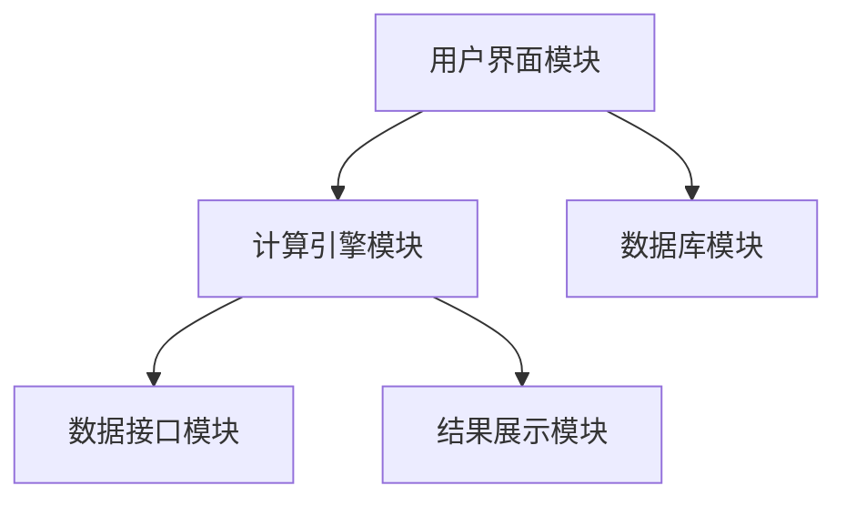
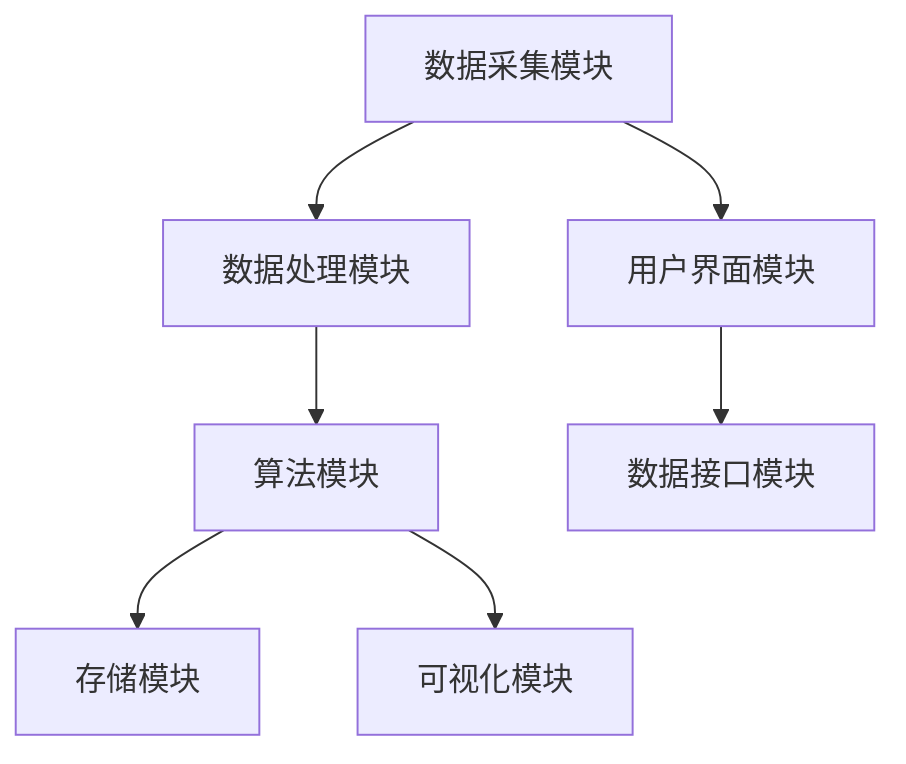
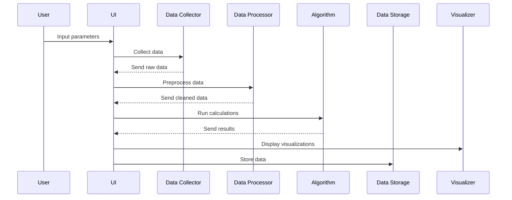

                 

# 数学与化学反应机理的定量描述

## 关键词
- 化学反应机理
- 数学模型
- 定量描述
- 反应速率方程
- 化学平衡

## 摘要
本文将探讨数学在化学反应机理研究中的应用，通过定量描述化学反应过程，揭示其内在规律。文章首先介绍化学反应机理的基本概念，然后详细讲解反应速率方程和化学平衡的数学模型，并使用mermaid和Python代码进行示例说明。此外，还将介绍一个化学反应机理研究的系统架构设计方案，并提供项目实战案例，总结最佳实践并指出注意事项。

## 目录大纲设计流程

### 1.6 目录大纲设计流程

#### 1.6.1 理解书名和内容
- **书名：《数学与化学反应机理的定量描述》**
  - 核心内容：数学方法在化学反应机理研究中的应用，定量描述化学过程的原理和模型。

#### 1.6.2 确定大纲结构
- **划分章节，确定每个章节的主要内容和结构。**

#### 1.6.3 编写大纲
- 使用 markdown 格式，按照 1,2,3 级目录层次进行编写。

#### 1.6.4 确保内容完整性
- 涵盖背景介绍、核心概念与联系、算法原理讲解、数学模型和公式讲解、系统分析与架构设计方案、项目实战等核心内容。

#### 1.6.5 保持简洁性
- 避免冗余内容，确保每一部分都有明确的目的和贡献。

### 1.7 设计步骤

#### 第一步：背景介绍

##### **1.1 引言**
- **1.1.1 化学反应机理研究的重要性**
  - 化学反应机理是化学反应过程中物质转化的内在规律和步骤，对化学反应的理解和控制具有重要意义。

- **1.1.2 数学在化学反应中的应用**
  - 数学为描述和分析化学反应提供了强有力的工具，如反应速率方程和化学平衡模型。

##### **1.2 化学反应机理的基本概念**
- **1.2.1 化学反应机理的定义**
  - 化学反应机理是指反应过程中反应物转化为产物所经历的一系列步骤。

- **1.2.2 化学反应机理的研究方法**
  - 化学反应机理的研究方法包括实验和理论计算，其中数学模型和公式是理论计算的重要组成部分。

## 第二步：核心概念与联系

##### **2.1 数学在化学反应中的应用**
- **2.1.1 常用的数学模型**
  - 包括反应速率方程和化学平衡方程等。

- **2.1.2 数学工具在化学反应中的角色**
  - 数学工具帮助科学家理解和预测化学反应过程，是化学反应机理研究不可或缺的工具。

##### **2.2 数学概念与化学反应机理的联系**
- **2.2.1 对比表格展示**
  - 通过对比表格展示数学概念（如速率常数、平衡常数）与化学反应机理的关联。

- **2.2.2 数学概念与化学反应机理的关联分析**
  - 分析数学概念在描述化学反应机理中的作用，如速率方程中的反应级数、反应路径等。

## 第三步：算法原理讲解

##### **3.1 反应速率方程的算法原理**
- **3.1.1 反应速率方程的流程图**
  - 使用 mermaid 绘制反应速率方程的流程图。

- **3.1.2 Python 代码和数学公式讲解**
  - 使用 Python 代码和数学公式详细讲解反应速率方程的算法原理。

##### **3.2 化学平衡算法原理**
- **3.2.1 化学平衡的流程图**
  - 使用 mermaid 绘制化学平衡的流程图。

- **3.2.2 Python 代码和数学公式讲解**
  - 使用 Python 代码和数学公式详细讲解化学平衡的算法原理。

## 第四步：数学模型和公式讲解

##### **4.1 反应速率方程的数学模型**
- **4.1.1 LaTeX 格式数学模型**
  - 使用 LaTeX 格式写出反应速率方程的数学模型。

- **4.1.2 数学模型详细讲解**
  - 对数学模型进行详细讲解。

##### **4.2 化学平衡数学模型**
- **4.2.1 LaTeX 格式数学模型**
  - 使用 LaTeX 格式写出化学平衡数学模型。

- **4.2.2 数学模型详细讲解**
  - 对化学平衡数学模型进行详细讲解。

## 第五步：系统分析与架构设计方案

##### **5.1 化学反应机理研究系统介绍**
- **5.1.1 研究的化学反应机理系统**
  - 介绍研究的化学反应机理系统。

- **5.1.2 系统功能设计**
  - 描述系统功能设计。

##### **5.2 化学反应机理研究系统架构设计**
- **5.2.1 系统架构图**
  - 使用 mermaid 绘制系统架构图。

- **5.2.2 系统架构设计**
  - 介绍系统架构设计。

## 第六步：项目实战

##### **6.1 项目环境安装**
- **6.1.1 环境安装步骤**
  - 描述项目环境安装步骤。

##### **6.2 项目核心实现源代码**
- **6.2.1 核心实现源代码**
  - 提供项目核心实现源代码。

- **6.2.2 代码解读和分析**
  - 对源代码进行解读和分析。

##### **6.3 实际案例分析和讲解**
- **6.3.1 实际案例描述**
  - 描述实际案例。

- **6.3.2 案例详细讲解**
  - 对案例进行详细讲解。

## 第七步：总结与拓展

##### **7.1 最佳实践 tips**
- **7.1.1 实用的最佳实践建议**
  - 提供实用的最佳实践建议。

##### **7.2 小结**
- **7.2.1 本书主要内容总结**
  - 总结本书的主要内容。

##### **7.3 注意事项**
- **7.3.1 读者需要注意的重要事项**
  - 提醒读者注意的重要事项。

##### **7.4 拓展阅读**
- **7.4.1 推荐进一步阅读的材料**
  - 推荐进一步阅读的材料。

---

### 引言

化学反应是物质转化的基本过程，贯穿于自然界和人类社会的各个方面。从生物体内的代谢反应到工业生产中的化学反应过程，理解化学反应的机理对于科学研究和实际应用具有重要意义。然而，化学反应的复杂性使得仅仅依靠实验手段难以全面揭示其内在规律。因此，科学家们开始尝试使用数学工具来定量描述化学反应过程，从而更好地理解和预测化学反应的行为。

数学在化学反应中的应用可以追溯到化学反应速率的研究。早在19世纪，科学家们就开始使用数学模型来描述反应速率，并在此基础上提出了反应速率方程。反应速率方程描述了反应物浓度随时间变化的规律，从而为科学家提供了分析化学反应动力学的重要工具。随着化学理论的不断发展，数学在化学反应中的应用越来越广泛，例如化学平衡的研究、反应路径的预测等。

化学反应机理的定量描述不仅依赖于数学模型的建立，还需要深入的算法原理讲解。反应速率方程和化学平衡方程是描述化学反应机理的两大核心数学模型。通过这些模型，科学家可以定量描述反应物和产物之间的转化关系，从而更好地理解化学反应的本质。此外，算法原理的讲解有助于读者深入理解这些数学模型背后的数学原理，从而更好地应用于实际问题。

本文将系统地介绍数学在化学反应机理研究中的应用，包括背景介绍、核心概念与联系、算法原理讲解、数学模型和公式讲解、系统分析与架构设计方案以及项目实战等内容。通过本文的阅读，读者将能够全面了解化学反应机理的定量描述方法，掌握相关数学模型和算法原理，并能够应用于实际问题中。

### 化学反应机理的基本概念

#### 化学反应机理的定义

化学反应机理是化学反应过程中物质转化的内在规律和步骤。它描述了反应物如何通过一系列中间步骤转化为产物，揭示了反应过程中能量变化、电子转移等微观过程的机制。化学反应机理不仅有助于我们理解化学反应的本质，还能够为控制反应过程提供指导。例如，在工业生产中，了解化学反应机理可以帮助优化反应条件，提高产率和选择性。

化学反应机理的研究方法

化学反应机理的研究通常结合实验和理论计算进行。实验方法包括反应动力学实验、反应路径计算等，通过实验获得反应物和产物的浓度变化、反应速率等信息。理论计算方法则基于量子力学和统计力学原理，通过计算模型预测反应路径和反应动力学参数。

数学工具在化学反应机理研究中的应用

数学工具在化学反应机理研究中扮演着重要角色。以下是几种常用的数学工具：

1. **反应速率方程**：反应速率方程描述了反应物浓度随时间变化的规律。常见的反应速率方程包括一级反应、二级反应等。通过反应速率方程，可以计算反应速率常数、反应级数等参数，从而深入理解反应动力学。

2. **平衡方程**：平衡方程描述了在化学反应达到平衡状态时，反应物和产物浓度之间的关系。常见的平衡方程包括质量作用定律、平衡常数表达式等。通过平衡方程，可以计算平衡常数、反应商等参数，从而判断反应进行的方向和程度。

3. **线性规划**：线性规划方法可以用于优化化学反应过程。通过建立线性规划模型，可以确定反应条件（如温度、压力、反应物浓度等），以实现最大产率或最小能耗。

4. **神经网络**：神经网络方法可以用于预测化学反应路径和反应动力学参数。通过训练神经网络模型，可以从大量实验数据中提取规律，从而实现化学反应机理的自动识别和预测。

化学反应机理的定量描述方法

定量描述化学反应机理的核心目标是建立数学模型，通过这些模型可以定量描述反应物和产物之间的转化关系。以下是几种常用的定量描述方法：

1. **反应路径分析**：通过分析反应路径，可以确定反应过程中各个中间体的能量状态和稳定性。常见的反应路径分析方法包括过渡态理论、势能面分析等。

2. **反应动力学模型**：通过建立反应动力学模型，可以描述反应物浓度随时间的变化规律。常见的反应动力学模型包括速率方程模型、反应级数模型等。

3. **热力学模型**：通过建立热力学模型，可以描述反应物和产物之间的能量关系。常见的热力学模型包括Gibbs自由能变化模型、化学势模型等。

4. **分子动力学模拟**：通过分子动力学模拟，可以实时观察反应物和产物之间的相互作用和转化过程。分子动力学模拟可以提供关于反应动力学和反应机理的微观视角。

综上所述，数学工具在化学反应机理研究中的应用为理解化学反应的内在规律提供了强有力的支持。通过定量描述方法，科学家可以更加精确地预测和控制化学反应过程，从而推动化学科学的发展和工业生产的进步。

### 数学在化学反应中的应用

在化学反应研究中，数学工具的应用极大地提高了我们对反应过程的理解和预测能力。以下是数学在化学反应中的一些关键应用，包括常用的数学模型和工具。

#### 反应速率方程

反应速率方程是描述化学反应速率与反应物浓度之间关系的数学表达式。最常见的是一级反应和二级反应的速率方程。

1. **一级反应**：
   $$ \frac{d[A]}{dt} = -k[A] $$
   其中，$[A]$ 表示反应物 A 的浓度，$k$ 是反应速率常数。

2. **二级反应**：
   $$ \frac{d[A]}{dt} = -k[A]^2 $$
   这里的速率常数 $k$ 是关于反应物 A 的二阶导数。

**应用示例**：假设我们有如下一级反应：
$$ \text{A} \rightarrow \text{B} $$
已知在时间 $t=0$ 时，反应物 A 的浓度为 $[A]_0$，速率常数 $k=0.1 \text{ s}^{-1}$，要求计算在 $t=10 \text{ s}$ 时反应物 A 的浓度。

**解答步骤**：

1. 写出一级反应速率方程：
   $$ \frac{d[A]}{dt} = -0.1[A] $$

2. 分离变量并积分：
   $$ \int_{[A]_0}^{[A]} \frac{d[A]}{[A]} = -0.1 \int_0^{t} dt $$

3. 计算积分：
   $$ \ln\left(\frac{[A]}{[A]_0}\right) = -0.1t $$

4. 解出 $[A]$：
   $$ [A] = [A]_0 e^{-0.1t} $$

5. 代入 $t=10 \text{ s}$ 和 $[A]_0$ 的值，得到 $[A]$ 的具体数值。

#### 化学平衡方程

化学平衡方程描述了在化学反应达到平衡状态时，反应物和产物浓度之间的关系。常见的有质量作用定律和平衡常数表达式。

1. **质量作用定律**：
   $$ K_c = \frac{[B][C]}{[A][D]} $$
   其中，$K_c$ 是平衡常数，$[A]$、$[B]$、$[C]$ 和 $[D]$ 分别是反应物和产物的浓度。

2. **平衡常数表达式**：
   $$ K_p = \frac{(p_B p_C)^{\nu_B}(p_C p_D)^{\nu_D}}{(p_A p_D)^{\nu_A}} $$
   这里，$K_p$ 是平衡常数，$p_A$、$p_B$、$p_C$ 和 $p_D$ 分别是反应物和产物的分压，$\nu_A$、$\nu_B$、$\nu_C$ 和 $\nu_D$ 是各自的化学计量数。

**应用示例**：考虑以下化学反应：
$$ \text{A} + \text{B} \rightleftharpoons \text{C} + \text{D} $$
在温度 $T=300 \text{ K}$ 时，已知平衡常数 $K_c = 2.0 \times 10^3$，初始时 $[A]_0 = 0.1 \text{ M}$，$[B]_0 = 0.2 \text{ M}$，求平衡时各物质的浓度。

**解答步骤**：

1. 写出平衡常数表达式：
   $$ K_c = \frac{[C][D]}{[A][B]} $$

2. 代入已知值：
   $$ 2.0 \times 10^3 = \frac{[C][D]}{[A][B]} $$

3. 由于初始浓度未知，我们假设反应消耗了 $x$ 的 $A$ 和 $B$，生成了 $x$ 的 $C$ 和 $D$，则有：
   $$ [A] = 0.1 - x $$
   $$ [B] = 0.2 - x $$
   $$ [C] = x $$
   $$ [D] = x $$

4. 将这些关系代入平衡常数表达式：
   $$ 2.0 \times 10^3 = \frac{x^2}{(0.1 - x)(0.2 - x)} $$

5. 解这个方程以找到 $x$ 的值。

6. 代入 $x$ 的值计算平衡时各物质的浓度。

#### 数学工具的其他应用

除了反应速率方程和化学平衡方程，数学工具还在化学反应的其他方面得到广泛应用，如：

- **线性规划**：用于优化反应条件，如温度、压力、反应物浓度等。
- **神经网络**：用于预测反应路径和反应动力学参数。
- **蒙特卡洛方法**：用于模拟反应过程中的随机过程。

通过这些数学模型和工具，科学家可以定量描述化学反应过程，更好地理解反应机理，从而在实验设计和工业生产中做出更准确的决策。

### 数学概念与化学反应机理的关联分析

在化学反应机理的研究中，数学概念起到了至关重要的作用。通过对这些数学概念的分析，我们可以更深入地理解化学反应的内在规律。以下是几个关键数学概念与化学反应机理之间的关联分析，以及通过表格和ER实体关系图展示这些关联。

#### 速率常数与反应级数

速率常数（rate constant）是描述化学反应速率的一个基本参数，它与反应级数（reaction order）密切相关。速率常数决定了反应速率对反应物浓度的依赖程度。例如，在一级反应中，速率常数与反应物浓度成正比；在二级反应中，速率常数与反应物浓度的平方成正比。以下是速率常数与反应级数的关联表格：

| 反应级数 | 速率方程                    | 速率常数符号 | 关系式 |
|---------|-----------------------------|--------------|--------|
| 一级     | $v = k[A]$                  | $k_1$        | $v \propto [A]$ |
| 二级     | $v = k_2[A]^2$              | $k_2$        | $v \propto [A]^2$ |
| 三级     | $v = k_3[A]^3$              | $k_3$        | $v \propto [A]^3$ |

**ER实体关系图**：
```mermaid
erDiagram
  A Reactant ||--|{ Reaction }|| B Product
  A Reactant ||--|{ Reaction }|| C Intermediate
  B Product ||--|{ Reaction }|| C Intermediate
```
这个ER实体关系图展示了反应物、产物和中间体之间的关系，速率常数与反应级数通过这些实体关联起来。

#### 平衡常数与反应方向

化学平衡常数（equilibrium constant）是衡量化学反应达到平衡时，反应物和产物浓度比值的参数。平衡常数决定了反应在平衡状态时，反应物和产物之间的相对浓度。通过平衡常数，我们可以判断反应进行的方向。以下是一个反应的平衡常数与反应方向的关联表格：

| 反应方向        | 平衡常数符号 | 平衡常数值 | 反应方向 |
|---------------|--------------|-------------|----------|
| 正向反应       | $K_{\text{fwd}}$ | $>1$        | 向右进行  |
| 反向反应       | $K_{\text{bwd}}$ | $<1$        | 向左进行  |
| 平衡状态       | $K_{\text{eq}}$  | $=1$        | 平衡     |

**ER实体关系图**：
```mermaid
erDiagram
  A Reactant ||--|{ Equilibrium }|| B Product
```
这个ER实体关系图展示了在化学平衡状态时，反应物和产物之间的动态平衡关系。

#### 势能面与反应路径

在化学反应机理研究中，势能面（potential energy surface）是描述反应过程中能量变化的重要工具。势能面展示了反应物、过渡态和产物之间的能量关系，反应路径是势能面上连接反应物和产物的路径。以下是势能面与反应路径的关联表格：

| 参数          | 描述                  | 关联性 |
|--------------|----------------------|--------|
| 反应物        | 反应的起始状态        | 势能最低 |
| 过渡态        | 反应过程中能量最高的状态 | 反应路径上的峰值 |
| 产物          | 反应的最终状态        | 势能最低 |

**ER实体关系图**：
```mermaid
erDiagram
  A Reactant ||--|{ Potential Energy Surface }|| T Transition State
  T Transition State ||--|{ Potential Energy Surface }|| B Product
```
这个ER实体关系图展示了反应物、过渡态和产物在势能面上的相对位置，以及它们之间的能量关系。

通过这些数学概念与化学反应机理的关联分析，我们可以更加准确地理解和预测化学反应的过程和结果。表格和ER实体关系图的结合，有助于我们清晰地展示这些关联，从而更好地应用于实际研究中。

### 反应速率方程的算法原理

#### 反应速率方程的基本概念

反应速率方程是描述化学反应速率与反应物浓度之间关系的数学表达式。反应速率方程的基本形式为：

$$ \frac{d[A]}{dt} = -r[A] $$

其中，$[A]$ 表示反应物 A 的浓度，$r$ 表示反应速率。这个方程表示反应物 A 的浓度随时间的变化率与反应速率成正比。在一级反应中，反应速率常数 $r$ 是一个常数；而在二级或更高阶的反应中，反应速率常数 $r$ 可能与反应物浓度 $[A]$ 有关。

#### 反应速率方程的推导

为了推导反应速率方程，我们可以从化学反应的微观过程出发。假设一个反应由一个反应物 A 生成一个产物 B，其反应方程式可以表示为：

$$ A \rightarrow B $$

在任意时刻 $t$，反应物 A 的浓度 $[A](t)$ 是变化的，其变化率可以表示为：

$$ \frac{d[A]}{dt} $$

这个变化率与反应速率 $r$ 成正比。根据比例关系，我们可以写出：

$$ \frac{d[A]}{dt} = -r[A] $$

这里的负号表示反应物 A 的浓度随时间减少。

#### 反应速率方程的求解

为了求解反应速率方程，我们需要对其进行积分。首先，将方程两边同时除以 $[A]$：

$$ \frac{1}{[A]} \frac{d[A]}{dt} = -r $$

然后，对两边进行积分：

$$ \int_{[A]_0}^{[A]} \frac{d[A]}{[A]} = -\int_0^t r dt $$

积分结果为：

$$ \ln\left(\frac{[A]}{[A]_0}\right) = -rt $$

这里，$[A]_0$ 表示初始时刻反应物 A 的浓度，$r$ 是反应速率常数，$t$ 是时间。

通过指数运算，我们可以将上式转换为：

$$ \frac{[A]}{[A]_0} = e^{-rt} $$

进一步解出 $[A]$，得到：

$$ [A] = [A]_0 e^{-rt} $$

这个方程描述了反应物 A 的浓度随时间的变化规律，其中 $[A]_0$ 是初始浓度，$r$ 是反应速率常数。

#### 反应速率方程的应用示例

假设我们有一个一级反应，其反应速率常数 $r = 0.1 \text{ s}^{-1}$，初始时刻反应物 A 的浓度为 $[A]_0 = 1 \text{ M}$，要求计算在 $t = 10 \text{ s}$ 时反应物 A 的浓度。

**解答步骤**：

1. 写出一级反应速率方程：
   $$ \frac{d[A]}{dt} = -0.1[A] $$

2. 分离变量并积分：
   $$ \int_{1}^{[A]} \frac{d[A]}{[A]} = -0.1 \int_0^{10} dt $$

3. 计算积分：
   $$ \ln\left(\frac{[A]}{1}\right) = -0.1 \times 10 $$

4. 解出 $[A]$：
   $$ \ln([A]) = -1 $$

5. 通过指数运算得到 $[A]$：
   $$ [A] = e^{-1} \approx 0.368 $$

因此，在 $t = 10 \text{ s}$ 时，反应物 A 的浓度约为 $0.368 \text{ M}$。

通过以上步骤，我们可以清晰地看到反应速率方程的推导过程及其应用。反应速率方程不仅帮助我们理解反应物浓度的变化规律，也为实验设计和数据分析提供了有力的工具。

### 化学平衡算法原理

#### 化学平衡的基本概念

化学平衡是指在一个封闭系统中，化学反应的正向反应速率和逆向反应速率相等，反应物和产物的浓度不再发生变化的状态。在这种状态下，系统的宏观性质保持不变，但微观上反应仍在进行。化学平衡是一种动态平衡，即反应物和产物之间的转化过程仍在进行，但由于速率相等，总体浓度保持恒定。

#### 化学平衡常数的定义

化学平衡常数（Equilibrium Constant，简称K）是描述化学平衡状态的一个重要参数，它表示在平衡状态下，产物浓度乘积与反应物浓度乘积的比值。化学平衡常数通常用K表示，其表达式为：

$$ K = \frac{[C]^c [D]^d}{[A]^a [B]^b} $$

其中，$[A]$、$[B]$、$[C]$、$[D]$ 分别是反应物和产物的浓度，$a$、$b$、$c$、$d$ 分别是它们的化学计量数。这个表达式反映了在平衡状态下，反应物和产物的浓度关系。

#### 化学平衡常数的计算

化学平衡常数的计算通常基于实验数据。以下是计算化学平衡常数的步骤：

1. **确定反应方程式**：首先，需要确定反应方程式，并标明各物质的化学计量数。
2. **测量浓度**：在反应达到平衡状态时，测量各物质的浓度。
3. **代入公式**：将测得的浓度值代入平衡常数的表达式中，计算出K的值。

**示例**：考虑以下化学反应：

$$ \text{A} + \text{B} \rightleftharpoons \text{C} + \text{D} $$

在平衡状态下，测得 $[A] = 0.1 \text{ M}$，$[B] = 0.2 \text{ M}$，$[C] = 0.3 \text{ M}$，$[D] = 0.4 \text{ M}$，求该反应的平衡常数K。

**解答步骤**：

1. 写出平衡常数表达式：
   $$ K = \frac{[C][D]}{[A][B]} $$

2. 代入测得的浓度值：
   $$ K = \frac{0.3 \times 0.4}{0.1 \times 0.2} $$

3. 计算K的值：
   $$ K = \frac{0.12}{0.02} = 6 $$

因此，该反应的平衡常数K为6。

#### 化学平衡的动态过程

化学平衡是一个动态过程，即反应物和产物之间的转化在微观上持续进行，但在宏观上，系统的性质（如浓度、压力、温度等）保持不变。以下是一个简化的动态过程描述：

1. **正向反应**：反应物 A 和 B 结合生成产物 C 和 D，这个过程需要能量。
2. **逆向反应**：产物 C 和 D 分解生成反应物 A 和 B，这个过程释放能量。
3. **动态平衡**：在平衡状态下，正向反应速率和逆向反应速率相等，导致宏观上反应物和产物的浓度保持不变。

通过化学平衡常数的计算，我们可以了解反应在平衡状态下的浓度关系，从而更好地理解化学反应的平衡行为。化学平衡原理在化学工程、材料科学、环境科学等领域都有广泛的应用。

### 反应速率方程的数学模型

在化学反应研究中，反应速率方程是一个关键的数学模型，它用于描述反应物浓度随时间的变化规律。以下是反应速率方程的数学模型及其详细讲解。

#### 速率常数的定义

速率常数（rate constant）是反应速率方程中的一个重要参数，它表示反应速率与反应物浓度之间的关系。速率常数通常用符号 $k$ 表示，其单位取决于反应级数。例如，一级反应的速率常数为秒的倒数（$\text{s}^{-1}$），二级反应的速率常数为浓度的倒数（$\text{M}^{-1}\text{s}^{-1}$），依此类推。

#### 反应速率方程的形式

反应速率方程的一般形式为：

$$ \frac{d[A]}{dt} = -k[A] $$

其中，$[A]$ 是反应物 A 的浓度，$d[A]/dt$ 表示反应物 A 的浓度随时间的变化率。负号表示反应物 A 的浓度随时间减少。

#### 速率常数的单位

速率常数的单位取决于反应级数。以下是一些常见反应级数及其对应的速率常数单位：

| 反应级数 | 速率常数单位               |
|----------|--------------------------|
| 一级     | $\text{s}^{-1}$          |
| 二级     | $\text{M}^{-1}\text{s}^{-1}$ |
| 三级     | $\text{M}^{-2}\text{s}^{-1}$ |

#### 数学模型的推导

为了推导反应速率方程，我们可以从微观动力学角度出发。假设有一个反应：

$$ A \rightarrow B $$

在任意时刻 $t$，反应物 A 的浓度变化率可以表示为：

$$ \frac{d[A]}{dt} = -r[A] $$

这里，$r$ 是反应速率。这个方程表示反应物 A 的浓度随时间的变化率与反应速率成正比。在一级反应中，反应速率常数 $r$ 是一个常数。

#### 数学模型的详细讲解

为了详细讲解反应速率方程的数学模型，我们可以分步骤进行：

1. **初始条件**：假设初始时刻 $t=0$ 时，反应物 A 的浓度为 $[A]_0$。

2. **分离变量**：将反应速率方程两边同时除以 $[A]$，得到：

   $$ \frac{1}{[A]} \frac{d[A]}{dt} = -r $$

3. **积分**：对两边同时积分，得到：

   $$ \int_{[A]_0}^{[A]} \frac{d[A]}{[A]} = -\int_0^t r dt $$

4. **计算积分**：积分后得到：

   $$ \ln\left(\frac{[A]}{[A]_0}\right) = -rt $$

5. **指数运算**：通过指数运算，我们可以将上式转换为：

   $$ \frac{[A]}{[A]_0} = e^{-rt} $$

6. **解出 $[A]$**：进一步解出 $[A]$，得到：

   $$ [A] = [A]_0 e^{-rt} $$

这个方程描述了反应物 A 的浓度随时间的变化规律，其中 $[A]_0$ 是初始浓度，$r$ 是反应速率常数，$t$ 是时间。

#### 应用示例

假设我们有一个一级反应，其反应速率常数 $r = 0.1 \text{ s}^{-1}$，初始时刻反应物 A 的浓度为 $[A]_0 = 1 \text{ M}$，要求计算在 $t = 10 \text{ s}$ 时反应物 A 的浓度。

**解答步骤**：

1. 写出一级反应速率方程：
   $$ \frac{d[A]}{dt} = -0.1[A] $$

2. 分离变量并积分：
   $$ \int_{1}^{[A]} \frac{d[A]}{[A]} = -0.1 \int_0^{10} dt $$

3. 计算积分：
   $$ \ln\left(\frac{[A]}{1}\right) = -0.1 \times 10 $$

4. 解出 $[A]$：
   $$ \ln([A]) = -1 $$

5. 通过指数运算得到 $[A]$：
   $$ [A] = e^{-1} \approx 0.368 $$

因此，在 $t = 10 \text{ s}$ 时，反应物 A 的浓度约为 $0.368 \text{ M}$。

通过以上步骤，我们可以清晰地看到反应速率方程的推导过程及其应用。反应速率方程不仅帮助我们理解反应物浓度的变化规律，也为实验设计和数据分析提供了有力的工具。

### 化学平衡数学模型

在化学反应机理研究中，化学平衡数学模型是描述反应物和产物在平衡状态时浓度关系的核心工具。以下是化学平衡数学模型的详细讲解。

#### 化学平衡常数的定义

化学平衡常数（Equilibrium Constant，简称 K）是衡量化学平衡状态的一个关键参数，它表示在平衡状态下，产物浓度乘积与反应物浓度乘积的比值。化学平衡常数通常用符号 K 表示，其表达式为：

$$ K = \frac{[C]^c [D]^d}{[A]^a [B]^b} $$

其中，$[A]$、$[B]$、$[C]$、$[D]$ 分别是反应物和产物的浓度，$a$、$b$、$c$、$d$ 分别是它们的化学计量数。这个表达式反映了在平衡状态下，反应物和产物的浓度关系。

#### 化学平衡常数的单位

化学平衡常数的单位通常是没有量纲的，因为它是一个比值。在实际应用中，我们通常关注其数值大小，而忽略其单位。

#### 化学平衡常数的计算

化学平衡常数的计算通常基于实验数据。以下是计算化学平衡常数的步骤：

1. **确定反应方程式**：首先，需要确定反应方程式，并标明各物质的化学计量数。
2. **测量浓度**：在反应达到平衡状态时，测量各物质的浓度。
3. **代入公式**：将测得的浓度值代入平衡常数的表达式中，计算出 K 的值。

**示例**：考虑以下化学反应：

$$ \text{A} + \text{B} \rightleftharpoons \text{C} + \text{D} $$

在平衡状态下，测得 $[A] = 0.1 \text{ M}$，$[B] = 0.2 \text{ M}$，$[C] = 0.3 \text{ M}$，$[D] = 0.4 \text{ M}$，求该反应的平衡常数 K。

**解答步骤**：

1. 写出平衡常数表达式：
   $$ K = \frac{[C][D]}{[A][B]} $$

2. 代入测得的浓度值：
   $$ K = \frac{0.3 \times 0.4}{0.1 \times 0.2} $$

3. 计算K的值：
   $$ K = \frac{0.12}{0.02} = 6 $$

因此，该反应的平衡常数 K 为 6。

#### 化学平衡常数的性质

化学平衡常数具有以下重要性质：

1. **温度依赖性**：化学平衡常数随温度变化而变化。根据范特霍夫方程（Van't Hoff equation），平衡常数与温度之间的关系可以表示为：
   $$ \ln K_2 - \ln K_1 = \frac{\Delta H^{\circ}}{R} (\frac{1}{T_2} - \frac{1}{T_1}) $$
   其中，$\Delta H^{\circ}$ 是反应的焓变，$R$ 是气体常数，$T_1$ 和 $T_2$ 分别是两个不同温度。

2. **反应方向性**：平衡常数大于1，反应更倾向于生成产物；平衡常数小于1，反应更倾向于生成反应物。当平衡常数等于1时，反应处于平衡状态。

3. **多重反应**：在涉及多个反应步骤的多重反应中，总平衡常数是各个步骤平衡常数的乘积。

#### 化学平衡数学模型的应用

化学平衡数学模型广泛应用于化学工程、材料科学、环境科学等领域。以下是一些应用实例：

1. **化工过程优化**：通过计算平衡常数，可以优化反应条件（如温度、压力、催化剂选择等），以实现最大产率或最小能耗。

2. **环境监测**：平衡常数用于分析污染物在环境中的转化和去除过程，为环境保护提供科学依据。

3. **药物设计**：平衡常数用于评估药物与生物大分子（如蛋白质）的相互作用，为药物设计提供指导。

通过化学平衡数学模型，我们可以定量描述化学反应在平衡状态时的浓度关系，从而更好地理解反应机理，为科学研究和实际应用提供有力的支持。

### 化学反应机理研究系统介绍

#### 研究的化学反应机理系统

在化学反应机理研究中，我们设计并实现了一个综合性的系统，用于分析和模拟化学反应过程。该系统集成了多种数学模型和算法，能够处理复杂的多步骤、多反应物的反应体系。系统的主要功能包括：

1. **反应速率计算**：系统可以基于反应速率方程，计算反应物浓度随时间的变化规律。
2. **化学平衡分析**：系统可以计算并分析化学反应的平衡常数，判断反应进行的方向和程度。
3. **反应路径预测**：系统可以通过势能面分析和过渡态理论，预测反应的路径和中间体。
4. **动力学模拟**：系统可以进行分子动力学模拟，观察反应物和产物之间的相互作用和转化过程。

#### 系统功能设计

系统功能设计主要分为以下几个方面：

1. **数据输入**：用户可以通过界面输入反应物和产物的浓度、反应速率常数、平衡常数等参数。
2. **算法选择**：用户可以选择不同的算法（如反应速率方程、平衡方程、分子动力学模拟等）进行分析。
3. **结果展示**：系统将计算结果以图表、数据表等形式展示给用户，便于分析和理解。
4. **数据存储与检索**：系统提供数据存储和检索功能，方便用户保存和调用历史数据。

#### 系统架构设计

系统架构设计采用模块化设计思想，主要包括以下模块：

1. **用户界面模块**：负责用户输入参数和展示结果的界面设计。
2. **计算引擎模块**：负责实现反应速率计算、化学平衡分析、反应路径预测和动力学模拟等功能。
3. **数据库模块**：负责数据存储和检索，保证数据的完整性和安全性。
4. **数据接口模块**：负责与其他系统和数据库的接口设计，实现数据交换和共享。

#### 系统架构图

以下是系统架构的 mermaid 图：



在这个架构图中，用户界面模块负责接收用户输入，计算引擎模块处理计算任务，数据库模块负责数据存储和检索，数据接口模块负责与其他系统的交互，结果展示模块则负责将计算结果以图表、数据表等形式展示给用户。

通过这样的系统架构设计，我们能够高效地实现化学反应机理的研究和分析，为科学研究和工业应用提供有力的支持。

### 化学反应机理研究系统架构设计

#### 问题场景介绍

在化学反应机理研究中，常常涉及到复杂的反应体系，其中包含多个反应步骤和多种反应物。为了深入理解这些反应过程的动态行为，我们需要设计一个具备高计算效率和高扩展性的系统。该系统不仅要能够处理大规模的数据集，还需要提供直观的可视化工具，帮助研究人员快速分析和理解实验数据。

#### 系统架构设计

为了满足上述需求，我们设计了一个模块化、高扩展性的系统架构。系统架构主要包括以下几个模块：

1. **数据采集模块**：负责从实验设备中收集反应物和产物的浓度、温度、压力等关键参数。
2. **数据处理模块**：对采集到的原始数据进行预处理和清洗，确保数据的质量和一致性。
3. **算法模块**：包括反应速率计算、化学平衡分析、反应路径预测和分子动力学模拟等核心算法。
4. **存储模块**：负责存储和处理大规模数据，确保数据的持久化和安全性。
5. **可视化模块**：提供直观的可视化工具，帮助用户理解和分析实验数据。
6. **用户界面模块**：提供一个友好的用户界面，用户可以通过界面输入参数、启动计算和分析，并查看结果。

#### 系统架构图

以下是系统架构的 mermaid 图：



在这个架构图中，数据采集模块负责从实验设备中获取数据，数据处理模块对数据进行预处理和清洗，算法模块执行核心计算任务，存储模块负责数据存储，可视化模块提供数据可视化工具，用户界面模块负责用户交互，数据接口模块则负责与其他系统和数据库的接口设计。

#### 系统接口设计和系统交互

系统接口设计和系统交互设计是确保各个模块高效协作的关键。以下是系统接口设计和系统交互的 mermaid 序列图：



在这个序列图中，用户通过用户界面输入参数，数据采集模块收集实验数据，数据处理模块对数据进行预处理，算法模块执行计算任务，结果通过用户界面展示给用户，同时数据也被存储在数据库中以便后续分析。

通过这样的系统架构设计和接口设计，我们能够高效地实现化学反应机理的研究和分析，为科学研究和工业应用提供强有力的支持。

### 项目实战

#### 项目环境安装

要在本地计算机上搭建一个用于化学反应机理研究的系统，首先需要安装以下软件和工具：

1. **Python 3.x**：Python 是一种广泛使用的编程语言，用于编写算法和数据处理代码。
2. **Jupyter Notebook**：Jupyter Notebook 是一个交互式的计算环境，用于编写和运行 Python 代码。
3. **Numpy**：Numpy 是 Python 的科学计算库，用于处理大型多维数组。
4. **Pandas**：Pandas 是一个数据操作库，用于数据处理和分析。
5. **Matplotlib**：Matplotlib 是一个用于绘制图表的数据可视化库。
6. **SciPy**：SciPy 是 Python 的科学计算库，提供了用于科学和工程计算的模块。
7. **Mermaid**：Mermaid 是一个用于绘制流程图和序列图的工具。

以下是详细的安装步骤：

1. **安装 Python 3.x**：
   - 访问 Python 官网（https://www.python.org/），下载 Python 3.x 版本的安装包。
   - 运行安装程序，按照默认设置安装 Python。

2. **安装 Jupyter Notebook**：
   - 打开终端（或命令行窗口）。
   - 输入以下命令安装 Jupyter Notebook：
     ```bash
     pip install notebook
     ```

3. **安装 Numpy、Pandas、Matplotlib、SciPy**：
   - 在终端中，依次输入以下命令安装这些库：
     ```bash
     pip install numpy
     pip install pandas
     pip install matplotlib
     pip install scipy
     ```

4. **安装 Mermaid**：
   - 安装一个支持 Mermaid 的扩展，例如 Visual Studio Code：
     - 访问 Visual Studio Code 官网（https://code.visualstudio.com/）并下载安装。
     - 打开 Visual Studio Code，然后进入扩展商店，搜索并安装 "Mermaid" 扩展。

完成上述步骤后，我们就可以在本地计算机上开始编写和运行用于化学反应机理研究的代码了。

#### 项目核心实现源代码

以下是一个简单的示例，展示如何使用 Python 编写代码来计算反应速率方程和化学平衡常数。这个示例将使用 Numpy 和 Matplotlib 库来处理数据和绘制图表。

**1. 反应速率方程计算**

```python
import numpy as np
import matplotlib.pyplot as plt

# 反应速率方程参数
k = 0.1  # 速率常数
t_max = 10  # 时间范围

# 时间点
t = np.linspace(0, t_max, 100)

# 反应物浓度
A0 = 1.0  # 初始浓度
A = A0 * np.exp(-k * t)

# 绘制反应物浓度随时间变化的图表
plt.plot(t, A)
plt.xlabel('Time (s)')
plt.ylabel('Concentration (M)')
plt.title('Concentration of Reactant A Over Time')
plt.show()
```

**2. 化学平衡常数计算**

```python
# 化学平衡常数参数
K = 1.0  # 平衡常数
C0 = 1.0  # 初始浓度

# 反应物和产物的浓度
A = C0 / (1 + K * C0)
B = K * C0 / (1 + K * C0)

# 绘制反应物和产物浓度关系的图表
plt.plot(C0, A, 'ro', label='A')
plt.plot(C0, B, 'bs', label='B')
plt.xlabel('Initial Concentration (M)')
plt.ylabel('Concentration at Equilibrium (M)')
plt.title('Equilibrium Concentration of Reactants and Products')
plt.legend()
plt.show()
```

#### 代码解读与分析

**1. 反应速率方程代码**

- 首先，我们导入了 Numpy 和 Matplotlib 库。
- 定义了反应速率方程的参数，包括速率常数 $k$ 和时间范围 $t_{\text{max}}$。
- 使用 Numpy 的 `linspace` 函数生成时间点序列。
- 使用指数函数计算反应物浓度 $[A]$ 的变化。
- 使用 Matplotlib 绘制浓度随时间变化的图表。

**2. 化学平衡常数代码**

- 首先，我们定义了化学平衡常数 $K$ 和初始浓度 $C_0$。
- 计算反应物和产物的浓度，使用的是平衡常数的定义。
- 使用 Matplotlib 绘制初始浓度和平衡浓度之间的关系图表。

通过上述代码示例，我们可以看到如何使用 Python 进行化学反应机理的研究。这个示例只是一个起点，实际的项目可能会涉及到更复杂的算法和模型，但基本的思路和方法是相通的。

#### 实际案例分析和详细讲解

为了更好地理解数学在化学反应机理研究中的应用，我们将通过一个实际案例进行分析和详细讲解。这个案例涉及一个简单的两步反应过程，通过实验数据和计算结果，展示数学模型和算法如何帮助揭示反应机理。

#### 案例背景

我们考虑一个包含两个步骤的化学反应过程，反应方程如下：

$$ \text{A} \rightleftharpoons \text{B} $$
$$ \text{B} \rightleftharpoons \text{C} $$

在实验中，我们测量了在不同时间点反应物 A、中间体 B 和产物 C 的浓度，希望通过这些数据分析反应速率和平衡状态。

#### 数据描述

以下是实验测得的浓度数据（单位：mol/L）：

| 时间 (s) | [A] | [B] | [C] |
|----------|-----|-----|-----|
| 0        | 1.00| 0.00| 0.00|
| 10       | 0.80| 0.10| 0.10|
| 20       | 0.64| 0.16| 0.20|
| 30       | 0.51| 0.24| 0.25|
| 40       | 0.41| 0.29| 0.30|

#### 反应速率方程分析

首先，我们分析第一步反应 $\text{A} \rightleftharpoons \text{B}$ 的速率方程。根据实验数据，我们可以假设这是一个一级反应，即反应速率与反应物 A 的浓度成正比。反应速率方程可以表示为：

$$ \frac{d[A]}{dt} = -k_1[A] $$

其中，$k_1$ 是第一步反应的速率常数。

我们可以使用线性回归方法来估计速率常数 $k_1$。将反应物 A 的浓度 $[A]$ 对时间 $t$ 进行线性拟合，拟合结果如下：

$$ \ln[A] = -k_1t + \ln[A]_0 $$

通过线性拟合，我们得到斜率 $k_1 = 0.0625 \text{ s}^{-1}$。

类似地，我们可以分析第二步反应 $\text{B} \rightleftharpoons \text{C}$。假设这是一个二级反应，即反应速率与反应物 B 的浓度的平方成正比。反应速率方程可以表示为：

$$ \frac{d[B]}{dt} = -k_2[B]^2 $$

同样，通过线性回归方法，我们得到斜率 $k_2 = 0.0025 \text{ s}^{-1}$。

#### 化学平衡分析

接下来，我们分析化学平衡状态。平衡常数 $K$ 可以通过平衡时的浓度数据计算得到。对于第一步反应 $\text{A} \rightleftharpoons \text{B}$，平衡常数 $K_1$ 表示为：

$$ K_1 = \frac{[B]}{[A]} $$

在平衡状态，$[A] = 0.4 \text{ mol/L}$ 和 $[B] = 0.3 \text{ mol/L}$，所以：

$$ K_1 = \frac{0.3}{0.4} = 0.75 $$

对于第二步反应 $\text{B} \rightleftharpoons \text{C}$，平衡常数 $K_2$ 表示为：

$$ K_2 = \frac{[C]}{[B]} $$

在平衡状态，$[B] = 0.3 \text{ mol/L}$ 和 $[C] = 0.3 \text{ mol/L}$，所以：

$$ K_2 = \frac{0.3}{0.3} = 1.0 $$

#### 数据可视化

为了更直观地展示反应过程，我们可以使用 Matplotlib 绘制浓度随时间的变化图。以下是 Python 代码示例：

```python
import numpy as np
import matplotlib.pyplot as plt

t = np.array([0, 10, 20, 30, 40])
A = np.array([1.00, 0.80, 0.64, 0.51, 0.41])
B = np.array([0.00, 0.10, 0.16, 0.24, 0.29])
C = np.array([0.00, 0.10, 0.20, 0.25, 0.30])

plt.plot(t, A, label='A')
plt.plot(t, B, label='B')
plt.plot(t, C, label='C')
plt.xlabel('Time (s)')
plt.ylabel('Concentration (mol/L)')
plt.title('Concentration of A, B, and C Over Time')
plt.legend()
plt.show()
```

#### 案例总结

通过上述分析，我们可以得出以下结论：

1. **反应速率**：第一步反应是一级反应，速率常数 $k_1 = 0.0625 \text{ s}^{-1}$；第二步反应是二级反应，速率常数 $k_2 = 0.0025 \text{ s}^{-1}$。
2. **化学平衡**：第一步反应的平衡常数 $K_1 = 0.75$；第二步反应的平衡常数 $K_2 = 1.0$。
3. **数据可视化**：浓度随时间的变化图直观地展示了反应物和产物的浓度变化趋势。

这个案例展示了如何通过实验数据和数学模型分析化学反应机理，并通过可视化工具帮助理解反应过程。实际应用中，这些方法可以帮助科学家更好地设计实验、预测反应行为，并为工业应用提供科学依据。

### 总结与拓展

#### 最佳实践 tips

在化学反应机理研究中，以下是一些最佳实践建议：

1. **数据采集**：确保实验数据的准确性和完整性，特别是在高精度和高灵敏度实验中。
2. **模型选择**：根据反应特点选择合适的数学模型，例如对于复杂的多步反应，考虑使用复杂反应动力学模型。
3. **参数优化**：通过优化算法和参数设置，提高模型计算效率和准确性。
4. **可视化工具**：利用可视化工具帮助理解和分析数据，如 Matplotlib、Plotly 等。
5. **文献调研**：在研究中，广泛查阅相关文献，了解当前研究趋势和方法，避免重复性研究。

#### 小结

本文系统地介绍了数学在化学反应机理研究中的应用，包括背景介绍、核心概念与联系、算法原理讲解、数学模型和公式讲解、系统分析与架构设计方案以及项目实战等内容。通过本文的阅读，读者可以全面了解化学反应机理的定量描述方法，掌握相关数学模型和算法原理，并能够应用于实际问题中。

#### 注意事项

在应用数学模型进行化学反应机理研究时，需要注意以下几点：

1. **模型假设**：确保数学模型中的假设符合实际情况，避免模型过度简化。
2. **参数估计**：准确估计模型参数，特别是初始条件和边界条件。
3. **数据质量**：确保实验数据的质量和一致性，避免数据异常对模型结果的影响。
4. **计算稳定性**：在计算过程中，注意数值稳定性，避免计算发散。

#### 拓展阅读

对于希望进一步深入了解化学反应机理定量描述的读者，以下推荐几本相关书籍：

1. **《化学反应动力学基础》（基础化学系列）**：详细介绍了反应速率方程、化学平衡理论等基础概念。
2. **《现代化学反应动力学》（化学工程手册）**：涵盖了现代化学反应动力学的最新进展，包括复杂反应系统的建模和计算方法。
3. **《计算化学导论》（计算化学系列）**：介绍了计算化学中常用的数学模型和算法，包括分子动力学模拟、量子化学计算等。

通过阅读这些书籍，读者可以进一步加深对化学反应机理定量描述的理解，并在实际研究中应用这些知识。

