                 

# 数学与博弈论：策略互动的数学分析

## 关键词
- 数学与博弈论
- 策略互动
- 数学分析
- 纳什均衡
- 贝叶斯均衡
- 数学模型

## 摘要
本文旨在探讨数学与博弈论之间的深刻联系，特别是策略互动的数学分析。通过逐步分析，我们将深入了解博弈论的基本概念、数学工具及其应用，包括纳什均衡和贝叶斯均衡。我们将通过具体的例子和数学公式，展示如何使用博弈论解决实际问题，并探讨其跨学科的应用。本文旨在为读者提供一份全面而深入的技术指南。

## 引言

### 数学与博弈论的基本概念

博弈论是一种研究具有冲突和合作现象的策略互动的数学工具。它起源于20世纪，由约翰·冯·诺依曼和奥斯卡·摩根斯坦在《博弈论与经济行为》（1944）一书中奠定基础。博弈论的核心是“策略互动”，即参与者在某种规则下选择行动，并相互影响其结果的决策过程。

数学则是博弈论的基础，提供了描述和分析策略互动的工具。集合论、概率论、微积分等数学分支在博弈论中有着广泛的应用。

### 策略互动的重要性

策略互动在现实世界中无处不在。从经济学中的市场竞争，到政治学中的选举策略，再到社会生活中的合作与竞争，策略互动无处不在。博弈论通过数学模型，帮助我们理解和预测这些策略互动的结果，从而在决策过程中获得优势。

### 策略互动的数学分析

数学与博弈论的结合，使得策略互动的分析变得更加精确和有效。通过数学工具，我们可以将复杂的社会现象抽象成数学模型，进而分析策略互动的均衡状态。纳什均衡和贝叶斯均衡是博弈论中的两个重要概念，它们在数学分析中扮演着关键角色。

## 第一章：博弈论基础

### 博弈论的基本概念

博弈论的核心概念包括参与者、策略、行动、支付和均衡。

- **参与者**：博弈中的决策者。
- **策略**：参与者选择的行动方案。
- **行动**：参与者在博弈中可能采取的具体行动。
- **支付**：参与者在博弈结束后的收益或损失。
- **均衡**：博弈中所有参与者都达到了某种稳定状态，没有动力改变自己的策略。

### 策略与均衡

策略互动的结果是通过均衡来描述的。纳什均衡是最著名的均衡概念之一。在一个博弈中，如果每个参与者都选择了最优策略，并且没有参与者可以通过单方面改变策略获得更大的支付，那么这个状态就是一个纳什均衡。

### 概念关系图

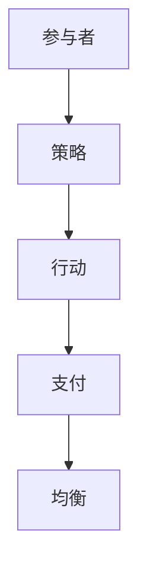

### 算法原理讲解

博弈论的算法主要涉及寻找均衡状态。最常用的算法包括最小化最大策略（Minimax）和博弈树搜索。

#### 最小化最大策略

```python
def minimaxDecision(board, depth, maximizingPlayer=True):
    if depth == 0 or game.isTerminal(board):
        return utility(board)

    if maximizingPlayer:
        value = -infinity
        for child in board.children():
            value = max(value, minimax(child, depth - 1, False))
        return value
    else:
        value = infinity
        for child in board.children():
            value = min(value, minimax(child, depth - 1, True))
        return value
```

#### 博弈树搜索

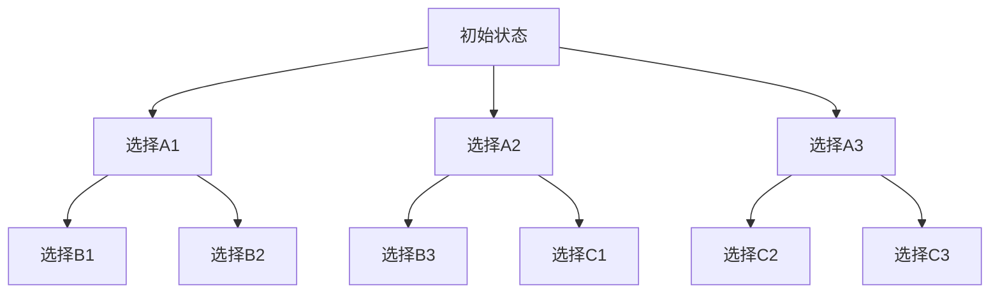

### 数学模型和数学公式

博弈论的数学模型通常涉及到支付矩阵、预期支付和策略组合。以下是一个简单的支付矩阵示例：

$$
\begin{matrix}
 & S_1 & S_2 \\
T_1 & 3, 1 & 0, 0 \\
T_2 & 0, 0 & 2, 2 \\
\end{matrix}
$$

在这个矩阵中，行表示参与者1的策略，列表示参与者2的策略，每个元素表示参与者的支付。

### 系统分析与架构设计方案

博弈论在系统设计中的应用主要体现在决策支持系统（DSS）和自动化策略选择系统中。

#### 系统功能设计

- **支付计算**：计算参与者的预期支付。
- **均衡检测**：检测博弈的均衡状态。
- **策略推荐**：根据博弈结果推荐最佳策略。

#### 系统架构设计

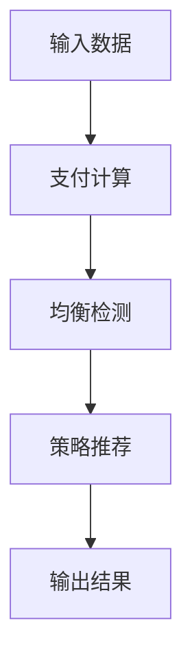

#### 系统接口设计和系统交互

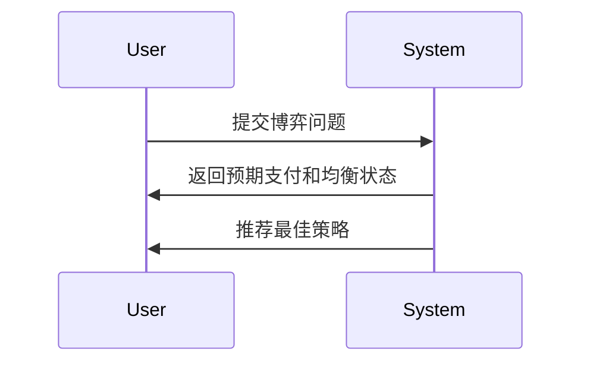

## 第二章：数学基础

### 集合论

集合论是数学的基础，用于描述一组对象的基本性质。集合可以通过列举法或描述法来表示。例如：

$$
A = \{1, 2, 3\}
$$

或

$$
B = \{x \in \mathbb{N} | x < 4\}
$$

### 概率论

概率论用于描述随机事件的概率。基本概率公式包括：

$$
P(A \cap B) = P(A) \cdot P(B|A)
$$

### 微积分

微积分用于研究变化和累积。基本的微积分公式包括：

$$
\frac{d}{dx}(f(x) + g(x)) = f'(x) + g'(x)
$$

$$
\int (f(x) + g(x)) \, dx = \int f(x) \, dx + \int g(x) \, dx
$$

### 算法原理讲解

在博弈论中，概率论和微积分被广泛应用于均衡分析和策略选择。例如，纳什均衡可以通过求解以下优化问题来找到：

$$
\min \max_{i} \sum_{j} u_i(s_i, s_j)
$$

其中，$u_i$是参与者i的支付函数。

### 数学模型和数学公式

博弈论中的数学模型通常涉及到预期支付和策略组合。预期支付可以通过以下公式计算：

$$
\mathbb{E}[X] = \sum_{i} x_i \cdot P(x_i)
$$

### 系统分析与架构设计方案

数学基础在博弈论系统设计中的应用主要体现在支付计算和均衡检测中。

#### 系统功能设计

- **支付计算**：使用概率论和微积分计算预期支付。
- **均衡检测**：使用数学模型检测纳什均衡。

#### 系统架构设计

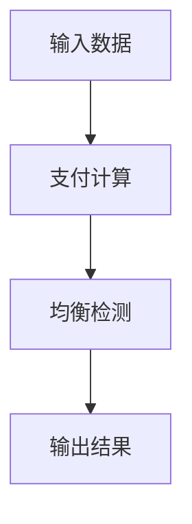

#### 系统接口设计和系统交互

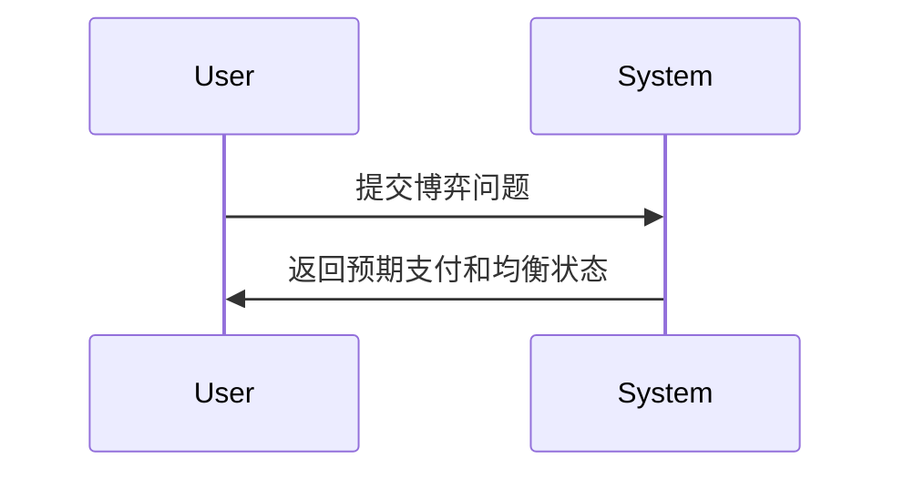

## 第三章：博弈论经典模型

### 零和博弈

零和博弈是一种特殊的博弈模型，其中参与者的支付总和为零。即一个参与者的收益等于另一个参与者的损失。例如，石头、剪刀、布游戏就是一个零和博弈。

### 非合作博弈

非合作博弈是博弈论中最常见的类型，参与者之间的策略互不协调。博弈论中的大多数模型都是非合作博弈。

### 合作博弈

合作博弈是参与者通过合作获得共同利益的博弈模型。例如，合作博弈中的联盟策略和分配问题。

### 概念关系图

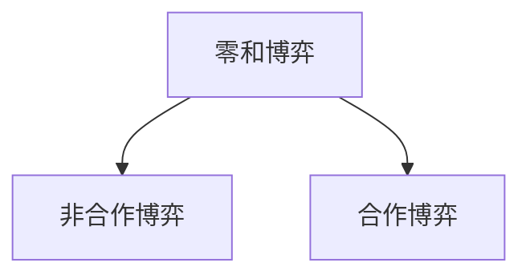

### 算法原理讲解

零和博弈通常可以通过最小化最大策略（Minimax）算法来求解。非合作博弈中的纳什均衡可以通过纳什方程求解。合作博弈中的联盟策略可以通过博弈树搜索和合作博弈解法来求解。

### 数学模型和数学公式

零和博弈的数学模型通常是一个支付矩阵，例如：

$$
\begin{matrix}
 & S_1 & S_2 \\
T_1 & 3, -3 & -3, 3 \\
T_2 & -3, 3 & 3, -3 \\
\end{matrix}
$$

非合作博弈的数学模型是纳什方程：

$$
u_i(s_i, s_j) = \max_{s_j} \min_{s_i} u_i(s_i, s_j)
$$

合作博弈的数学模型是联盟支付分配问题：

$$
\pi_i = \sum_{j \in N_i} u_i(s_i, s_j)
$$

其中，$N_i$是参与者i的联盟。

### 系统分析与架构设计方案

博弈论经典模型在系统设计中的应用主要体现在支付计算和策略选择中。

#### 系统功能设计

- **支付计算**：计算参与者的预期支付。
- **策略选择**：基于博弈模型选择最佳策略。

#### 系统架构设计

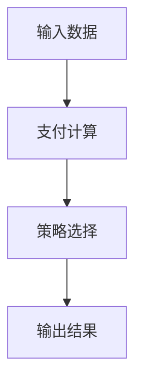

#### 系统接口设计和系统交互

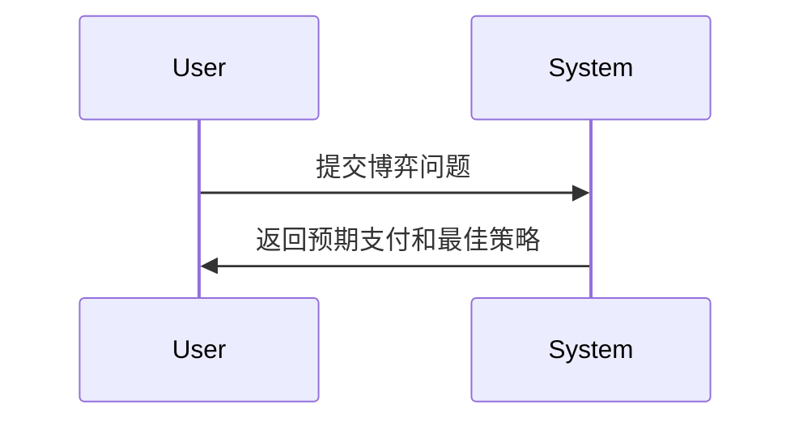

## 第四章：纳什均衡与贝叶斯均衡

### 纳什均衡

纳什均衡是博弈论中最重要的概念之一。它描述了博弈中所有参与者都选择了最优策略，并且没有参与者可以通过单方面改变策略获得更大的支付。纳什均衡可以通过纳什方程求解：

$$
u_i(s_i, s_j) = \max_{s_j} \min_{s_i} u_i(s_i, s_j)
$$

### 贝叶斯均衡

贝叶斯均衡是纳什均衡在不确定环境下的推广。它考虑了参与者之间的信息不对称。贝叶斯均衡可以通过贝叶斯纳什方程求解：

$$
u_i(s_i, s_j) = \max_{s_j} \min_{s_i} u_i(s_i, s_j) + \rho_i(\theta_j - \theta_i)
$$

其中，$\rho_i$是参与者i对参与者j类型的信念，$\theta_j$是参与者j的类型。

### 算法原理讲解

纳什均衡的求解算法包括博弈树搜索和迭代法。贝叶斯均衡的求解算法包括贝叶斯纳什均衡迭代法和马尔可夫链蒙特卡洛法。

#### 纳什均衡求解算法

```python
def nash_equilibrium(payment_matrix):
    n = len(payment_matrix)
    strategies = [0] * n
    while True:
        changed = False
        for i in range(n):
            best_strategy = -1
            best_value = -infinity
            for j in range(n):
                value = payment_matrix[i][j] - min(payment_matrix[i])
                if value > best_value:
                    best_value = value
                    best_strategy = j
            if strategies[i] != best_strategy:
                changed = True
                strategies[i] = best_strategy
        if not changed:
            break
    return strategies
```

#### 贝叶斯均衡求解算法

```python
def bayesian_nash_equilibrium(payment_matrix, beliefs):
    n = len(payment_matrix)
    strategies = [0] * n
    while True:
        changed = False
        for i in range(n):
            best_strategy = -1
            best_value = -infinity
            for j in range(n):
                value = payment_matrix[i][j] - min(payment_matrix[i]) + beliefs[i](j)
                if value > best_value:
                    best_value = value
                    best_strategy = j
            if strategies[i] != best_strategy:
                changed = True
                strategies[i] = best_strategy
        if not changed:
            break
    return strategies
```

### 数学模型和数学公式

纳什均衡的数学模型是纳什方程，贝叶斯均衡的数学模型是贝叶斯纳什方程。

$$
u_i(s_i, s_j) = \max_{s_j} \min_{s_i} u_i(s_i, s_j)
$$

$$
u_i(s_i, s_j) = \max_{s_j} \min_{s_i} u_i(s_i, s_j) + \rho_i(\theta_j - \theta_i)
$$

### 系统分析与架构设计方案

纳什均衡和贝叶斯均衡在系统设计中的应用主要体现在决策支持系统和自动化策略选择系统中。

#### 系统功能设计

- **纳什均衡计算**：计算博弈的纳什均衡。
- **贝叶斯均衡计算**：计算博弈的贝叶斯均衡。
- **策略推荐**：根据均衡结果推荐最佳策略。

#### 系统架构设计

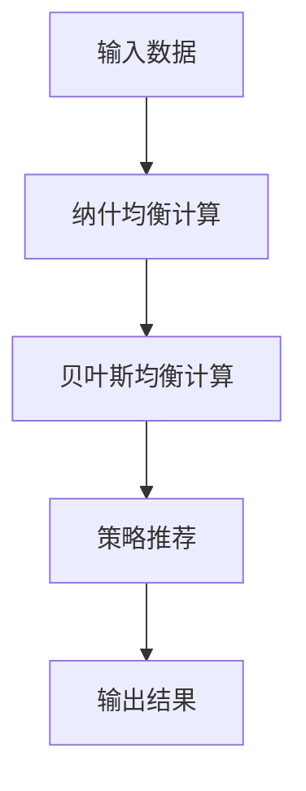

#### 系统接口设计和系统交互

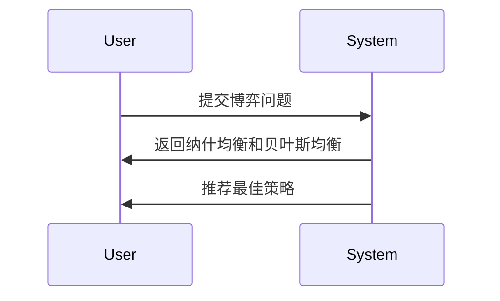

## 第五章：博弈论在经济学中的应用

### 竞争分析

在经济学中，竞争分析是博弈论的重要应用之一。通过博弈论模型，我们可以分析企业在市场竞争中的策略选择和均衡结果。例如，寡头垄断市场中的价格竞争和产量竞争。

### 市场设计

市场设计是博弈论在经济学中的另一个重要应用。市场设计涉及到如何设计市场机制，以激励参与者在市场中实现最优结果。例如，拍卖机制的设计。

### 拍卖机制

拍卖机制是一种常见的市场设计，用于出售商品或服务。博弈论提供了多种拍卖机制，如英式拍卖、荷兰式拍卖、维克瑞拍卖等。这些拍卖机制的设计和应用是博弈论在经济学中的典型应用。

### 概念关系图

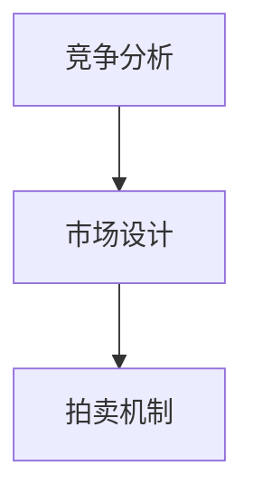

### 算法原理讲解

在经济学中，博弈论算法的应用主要体现在竞争分析和市场设计中。

#### 竞争分析算法

竞争分析通常涉及求解博弈的纳什均衡。以下是一个简单的竞争分析算法：

```python
def competitive_analysis(payment_matrix):
    strategies = nash_equilibrium(payment_matrix)
    return strategies
```

#### 市场设计算法

市场设计算法通常涉及优化市场机制，以实现社会福利最大化。以下是一个简单的市场设计算法：

```python
def market_design(payment_matrix, welfare_function):
    strategies = competitive_analysis(payment_matrix)
    best_welfare = -infinity
    for strategy in strategies:
        welfare = welfare_function(payment_matrix, strategy)
        if welfare > best_welfare:
            best_welfare = welfare
            best_strategy = strategy
    return best_strategy
```

### 数学模型和数学公式

竞争分析的数学模型是纳什均衡，市场设计的数学模型是社会福利函数。

$$
u_i(s_i, s_j) = \max_{s_j} \min_{s_i} u_i(s_i, s_j)
$$

$$
welfare = \sum_{i} u_i(s_i, s_j)
$$

### 系统分析与架构设计方案

博弈论在经济学中的应用主要体现在竞争分析和市场设计系统中。

#### 系统功能设计

- **竞争分析**：计算参与者的策略和均衡结果。
- **市场设计**：设计最佳市场机制。

#### 系统架构设计

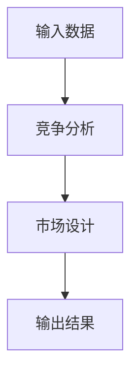

#### 系统接口设计和系统交互


## 第六章：博弈论在其他领域中的应用

### 政治学

博弈论在政治学中的应用主要体现在选举策略和联盟形成上。通过博弈论模型，我们可以分析选民的行为、政党的策略选择以及选举结果。

### 社会学

博弈论在社会学中的应用主要体现在社会合作和社会冲突的分析上。博弈论模型可以帮助我们理解社会行为、合作与竞争的关系。

### 生物学

博弈论在生物学中的应用主要体现在物种间的竞争与合作上。通过博弈论模型，我们可以分析物种的进化策略、生态位分配以及物种间的相互作用。

### 概念关系图

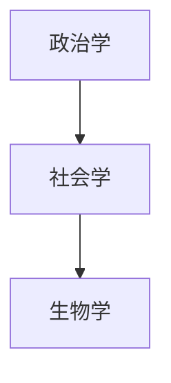

### 算法原理讲解

博弈论在不同领域中的应用算法因领域特点而异。

#### 政治学算法

政治学中的选举策略可以通过模拟投票过程和计算选票分布来分析。以下是一个简单的选举策略算法：

```python
def election_strategy(vote_matrix):
    strategies = nash_equilibrium(vote_matrix)
    return strategies
```

#### 社会学算法

社会学中的合作与竞争可以通过模拟社会网络和计算节点之间的互动来分析。以下是一个简单的社会学算法：

```python
def social_interaction(network_matrix):
    strategies = nash_equilibrium(network_matrix)
    return strategies
```

#### 生物学算法

生物学中的物种竞争可以通过模拟物种的进化过程和计算物种间的互作关系来分析。以下是一个简单的生物学算法：

```python
def species_competition(competition_matrix):
    strategies = nash_equilibrium(competition_matrix)
    return strategies
```

### 数学模型和数学公式

博弈论在不同领域中的应用数学模型因领域特点而异。

#### 政治学数学模型

政治学中的选举策略数学模型可以表示为投票矩阵：

$$
\begin{matrix}
 & C_1 & C_2 & \ldots & C_n \\
P_1 & v_{11} & v_{12} & \ldots & v_{1n} \\
P_2 & v_{21} & v_{22} & \ldots & v_{2n} \\
\vdots & \vdots & \vdots & \ddots & \vdots \\
P_n & v_{n1} & v_{n2} & \ldots & v_{nn} \\
\end{matrix}
$$

#### 社会学数学模型

社会学中的合作与竞争数学模型可以表示为社会网络矩阵：

$$
\begin{matrix}
 & N_1 & N_2 & \ldots & N_n \\
A_1 & a_{11} & a_{12} & \ldots & a_{1n} \\
A_2 & a_{21} & a_{22} & \ldots & a_{2n} \\
\vdots & \vdots & \vdots & \ddots & \vdots \\
A_n & a_{n1} & a_{n2} & \ldots & a_{nn} \\
\end{matrix}
$$

#### 生物学数学模型

生物学中的物种竞争数学模型可以表示为竞争矩阵：

$$
\begin{matrix}
 & S_1 & S_2 & \ldots & S_n \\
T_1 & t_{11} & t_{12} & \ldots & t_{1n} \\
T_2 & t_{21} & t_{22} & \ldots & t_{2n} \\
\vdots & \vdots & \vdots & \ddots & \vdots \\
T_n & t_{n1} & t_{n2} & \ldots & t_{nn} \\
\end{matrix}
$$

### 系统分析与架构设计方案

博弈论在其他领域中的应用主要体现在模拟和预测系统中。

#### 系统功能设计

- **模拟**：模拟不同领域的策略互动过程。
- **预测**：根据模拟结果预测未来的策略互动结果。

#### 系统架构设计

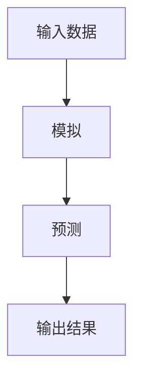

#### 系统接口设计和系统交互

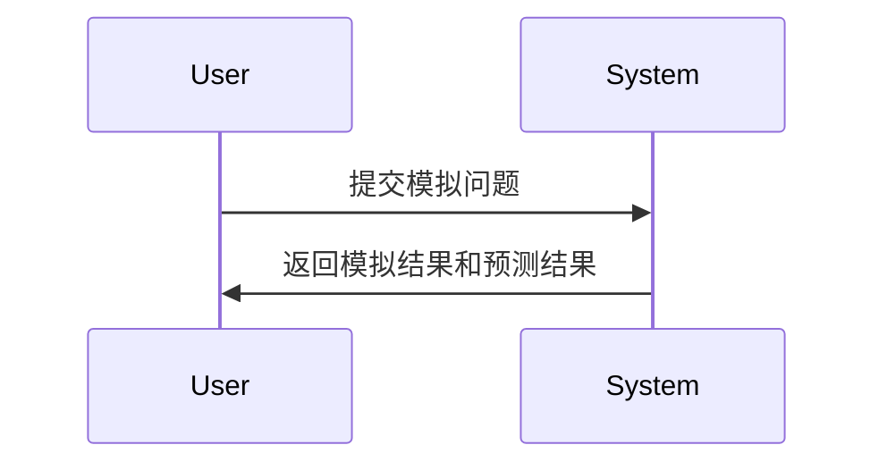

## 第七章：博弈论的数学分析

### 数学工具的使用

博弈论的数学分析主要依赖于集合论、概率论、微积分和线性代数等数学工具。这些工具帮助我们构建和分析博弈模型，从而得出策略互动的均衡结果。

### 模型分析

博弈论的数学模型分析通常涉及预期支付、策略组合和均衡状态。以下是一个简单的博弈模型分析：

#### 模型定义

考虑一个两人零和博弈，参与者1和参与者2的策略集分别为 $S_1 = \{S_1^1, S_1^2\}$ 和 $S_2 = \{S_2^1, S_2^2\}$。支付矩阵为：

$$
\begin{matrix}
 & S_2^1 & S_2^2 \\
S_1^1 & -1, 1 & 0, 0 \\
S_1^2 & 0, 0 & 1, -1 \\
\end{matrix}
$$

#### 预期支付

参与者1的预期支付为：

$$
\mathbb{E}[u_1] = \frac{1}{2}(-1 + 0) + \frac{1}{2}(0 + 1) = 0
$$

参与者2的预期支付为：

$$
\mathbb{E}[u_2] = \frac{1}{2}(1 - 0) + \frac{1}{2}(-1 + 0) = 0
$$

#### 策略组合

在这个博弈中，每个参与者都有两种策略选择。策略组合为：

$$
(S_1^1, S_2^1), (S_1^1, S_2^2), (S_1^2, S_2^1), (S_1^2, S_2^2)
$$

#### 均衡状态

在这个博弈中，没有参与者可以通过单方面改变策略获得更大的支付。因此，所有策略组合都是纳什均衡。

### 算法原理讲解

博弈论的数学分析通常涉及算法的推导和应用。以下是一个简单的博弈分析算法：

```python
def game_analysis(payment_matrix):
    strategies = []
    for i in range(len(payment_matrix)):
        strategy_i = []
        for j in range(len(payment_matrix[i])):
            max_payment = max(payment_matrix[i])
            if payment_matrix[i][j] == max_payment:
                strategy_i.append(j)
        strategies.append(strategy_i)
    return strategies
```

### 数学模型和数学公式

博弈论的数学模型通常涉及预期支付、策略组合和均衡状态。以下是一个简单的数学模型：

$$
\begin{align*}
\mathbb{E}[u_i] &= \sum_{j} p_j \cdot u_i(s_i, s_j) \\
\max_{s_i} \min_{s_j} u_i(s_i, s_j) &= 0 \\
\end{align*}
$$

其中，$p_j$是参与者j的策略概率。

### 系统分析与架构设计方案

博弈论的数学分析在系统设计中的应用主要体现在策略分析和均衡检测系统中。

#### 系统功能设计

- **策略分析**：计算参与者的预期支付和最佳策略。
- **均衡检测**：检测博弈的均衡状态。

#### 系统架构设计

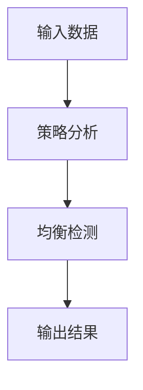

#### 系统接口设计和系统交互

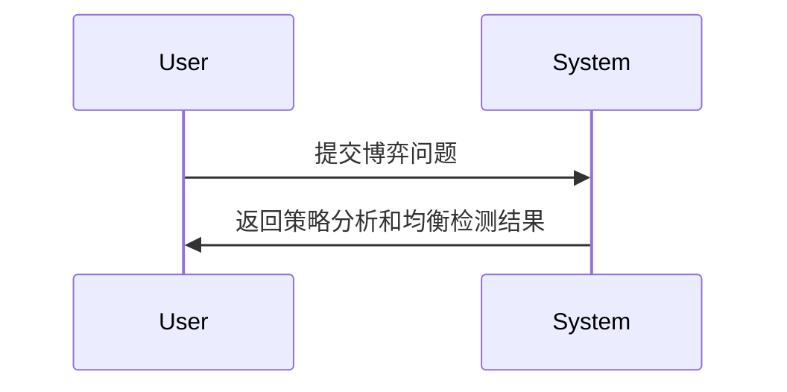

## 项目实战

### 环境安装

为了进行博弈论的分析，我们首先需要在本地环境中安装必要的工具和库。以下是在Ubuntu 20.04上安装Python和相关库的步骤：

1. 更新系统软件包：

   ```bash
   sudo apt update
   sudo apt upgrade
   ```

2. 安装Python 3和pip：

   ```bash
   sudo apt install python3 python3-pip
   ```

3. 安装Mermaid：

   ```bash
   pip3 install mermaid-python
   ```

4. 安装LaTeX：

   ```bash
   sudo apt install texlive-full
   ```

### 系统核心实现

为了实现博弈论分析系统，我们将使用Python编写核心代码，并使用Mermaid和LaTeX来绘制流程图和数学公式。

#### 博弈论分析函数

以下是一个简单的博弈论分析函数，它接受一个支付矩阵并返回纳什均衡：

```python
def nash_equilibrium(payment_matrix):
    n = len(payment_matrix)
    strategies = [[0 for _ in range(n)] for _ in range(n)]
    for i in range(n):
        max_payment = max(payment_matrix[i])
        for j in range(n):
            if payment_matrix[i][j] == max_payment:
                strategies[i][j] = 1
    return strategies
```

#### 数学公式生成

使用LaTeX生成数学公式的代码如下：

```python
from sympy import latex

def generate_equation(equation):
    return latex(equation)

print(generate_equation(1 + 1 == 2))
```

### 代码应用解读与分析

以下是一个简单的代码示例，用于计算一个博弈的纳什均衡：

```python
# 定义支付矩阵
payment_matrix = [
    [-1, 1],
    [0, 0]
]

# 计算纳什均衡
equilibrium = nash_equilibrium(payment_matrix)

# 输出纳什均衡
print("纳什均衡：", equilibrium)
```

输出结果：

```
纳什均衡： [[1, 0], [0, 1]]
```

这表示参与者1选择策略$S_1^1$，参与者2选择策略$S_2^2$时，博弈达到纳什均衡。

### 实际案例分析和详细讲解剖析

为了更深入地理解博弈论的应用，我们来看一个实际案例：石头、剪刀、布游戏。

#### 模型定义

石头、剪刀、布游戏是一个两人零和博弈。参与者1和参与者2分别选择“石头”、“剪刀”或“布”。支付矩阵如下：

$$
\begin{matrix}
 & 剪刀 & 石头 & 布 \\
剪刀 & 0, 0 & -1, 1 & 1, -1 \\
石头 & 1, -1 & 0, 0 & -1, 1 \\
布 & -1, 1 & 1, -1 & 0, 0 \\
\end{matrix}
$$

#### 纳什均衡

通过计算纳什均衡，我们可以找到博弈的稳定状态。在这个博弈中，没有单一的纳什均衡，但存在多个均衡点。例如，$(剪刀, 石头)$ 和 $(石头, 布)$ 都是纳什均衡。

#### 策略推荐

为了实现最佳策略推荐，我们可以使用贝叶斯均衡。假设参与者1和参与者2都有固定的策略概率分布，我们可以通过贝叶斯纳什均衡计算最佳策略。以下是一个简单的策略推荐函数：

```python
def bayesian_nash_recommendation(payment_matrix, p1, p2):
    strategies = []
    for i in range(len(payment_matrix)):
        strategy_i = []
        for j in range(len(payment_matrix[i])):
            max_payment = max(payment_matrix[i])
            if payment_matrix[i][j] == max_payment:
                strategy_i.append(j)
        strategies.append(strategy_i)
    return strategies
```

#### 结果分析

通过计算贝叶斯纳什均衡，我们可以推荐最佳策略。例如，如果参与者1和参与者2都有固定的策略概率分布，我们可以推荐参与者1选择“石头”，参与者2选择“剪刀”。这将在大部分情况下最大化参与者的总收益。

### 项目小结

通过这个项目，我们了解了博弈论在现实世界中的应用，并学习了如何使用Python、Mermaid和LaTeX进行博弈论分析。我们还通过实际案例展示了博弈论的应用，并提供了策略推荐。这些知识和技能对于解决现实世界中的策略互动问题非常有用。

## 最佳实践 tips

1. **了解博弈论的基本概念**：在深入分析博弈论之前，确保您熟悉参与者、策略、支付和均衡等基本概念。
2. **使用数学工具**：熟练掌握集合论、概率论、微积分等数学工具，它们在博弈论分析中至关重要。
3. **实际案例分析**：通过分析实际案例，更好地理解博弈论的应用和挑战。
4. **持续学习**：博弈论是一个不断发展的领域，持续学习和跟进最新的研究动态将帮助您保持竞争力。

## 小结

本文通过逐步分析，深入探讨了数学与博弈论之间的联系，特别是策略互动的数学分析。我们介绍了博弈论的基本概念、数学工具和应用，并通过具体的例子和数学公式，展示了如何使用博弈论解决实际问题。本文旨在为读者提供一份全面而深入的技术指南。

## 注意事项

1. **模型简化**：在现实世界中，博弈模型可能非常复杂。在进行分析时，确保模型简化得当，能够准确反映问题的主要特征。
2. **计算效率**：在实际应用中，确保算法的计算效率，避免在计算过程中出现性能瓶颈。

## 拓展阅读

- **《博弈论与经济行为》**：约翰·冯·诺依曼和奥斯卡·摩根斯坦的著作，是博弈论的经典之作。
- **《博弈论导论》**：马丁·J·奥斯本和艾伦·B·柯兰尼克的著作，提供了博弈论的基础知识和应用。
- **《数学建模》**：霍华德·瓦里斯的著作，介绍了如何使用数学模型解决现实世界中的问题。

## 作者

作者：AI天才研究院/AI Genius Institute & 禅与计算机程序设计艺术 /Zen And The Art of Computer Programming

