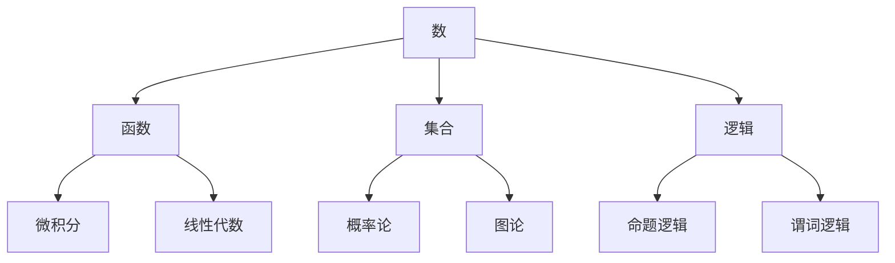

                 

# 数学与反基础主义：数学知识的网络结构

## 关键词：数学知识网络，反基础主义，数学理论，数学方法，数学应用

## 摘要：
本文探讨了数学与反基础主义之间的关系，以及数学知识网络结构在反基础主义视角下的重要性和应用。通过逐步分析数学概念、数学理论、数学方法及其在科学和社会中的应用，揭示了数学知识网络结构的复杂性和动态性，并展望了数学与反基础主义未来的发展前景。

## 目录大纲

### 第一部分：引论

#### 第1章 引言
- 问题的背景与重要性
- 反基础主义：概念与演变
- 数学与反基础主义的交集

#### 第2章 数学知识网络结构概述
- 数学知识网络的概念
- 数学知识网络结构的特点
- 数学知识网络的应用

### 第二部分：数学概念与反基础主义

#### 第3章 数学基础概念解析
- 数学基础概念的界定
- 数学基础概念的结构与联系
- 反基础主义视角下的数学基础概念

#### 第4章 数学理论的反基础主义解读
- 数学理论的构成
- 反基础主义对数学理论的挑战
- 反基础主义视角下的数学理论发展

#### 第5章 数学方法与反基础主义
- 数学方法的分类与特点
- 反基础主义对数学方法的反思
- 数学方法的反基础主义转化

### 第三部分：数学知识网络结构的应用

#### 第6章 数学知识网络在科学中的应用
- 数学知识网络在物理学中的应用
- 数学知识网络在生物学中的应用
- 数学知识网络在计算机科学中的应用

#### 第7章 数学知识网络在社会中的应用
- 数学知识网络在教育中的应用
- 数学知识网络在经济中的应用
- 数学知识网络在公共政策中的应用

### 第四部分：反思与展望

#### 第8章 数学与反基础主义的未来
- 数学与反基础主义的关系展望
- 数学知识网络结构的未来发展
- 反基础主义对数学研究的影响

### 附录

#### 附录A：数学知识网络结构示例
#### 附录B：反基础主义相关文献推荐
#### 附录C：数学公式与概念表格

## 第一部分：引论

### 第1章 引言

#### 1.1 问题的背景与重要性

数学作为一门基础科学，以其严谨的逻辑和精确的表述在科学研究和工程实践中发挥了不可替代的作用。然而，随着科学哲学的不断发展，反基础主义作为一种批判性思想，逐渐引起了学者们的关注。反基础主义认为，科学知识并非是客观事实的反映，而是由人类主观构建的。这一思想对传统的数学基础理论提出了挑战，引发了关于数学知识本质的深入探讨。

在这个背景下，探讨数学与反基础主义之间的关系具有重要的学术价值和现实意义。一方面，反基础主义的视角有助于我们更深入地理解数学知识的本质，反思数学理论的构建过程。另一方面，数学知识网络结构的研究为我们提供了一个新的工具，可以帮助我们更全面地分析和理解数学知识体系。

#### 1.2 反基础主义：概念与演变

反基础主义起源于20世纪中叶的科学哲学领域，是对基础主义科学观的批判。基础主义认为，科学知识是建立在坚实的基础上，通过逻辑推理和实验验证得出的客观事实。然而，反基础主义者认为，科学知识并非是客观事实的反映，而是人类主观构建的。他们指出，科学知识的产生过程受到人类价值观、社会文化背景等多种因素的影响。

反基础主义的发展经历了多个阶段。早期反基础主义主要关注科学知识的相对性和不确定性，认为科学知识是动态变化的，而非一成不变的。随着科学哲学的进一步发展，反基础主义开始探讨科学知识的构建过程，强调科学知识的相对性和主观性。近年来，反基础主义在数学领域引起了广泛关注，对数学知识的本质和数学理论的构建过程提出了深刻的质疑。

#### 1.3 数学与反基础主义的交集

数学作为一门基础科学，其理论体系和方法论在科学研究和工程实践中具有广泛的应用。然而，反基础主义的视角为我们提供了一个新的思考角度，使我们能够更深入地理解数学知识的本质。数学与反基础主义的交集主要体现在以下几个方面：

1. **数学知识的相对性**：反基础主义认为，科学知识是相对的，而非绝对的。在数学领域，这一观点体现在数学公理体系的构建过程中。不同的数学公理体系可能导致不同的数学理论，而没有一个公理体系是绝对正确的。这一认识挑战了传统数学基础理论的绝对性。

2. **数学理论的构建过程**：反基础主义强调科学知识的构建过程，认为科学理论并非是客观事实的简单反映，而是人类主观构建的。在数学领域，这一观点体现在数学理论的证明和验证过程中。数学理论的证明需要依赖于特定的逻辑和推理方法，而不同的逻辑和推理方法可能导致不同的证明结果。

3. **数学方法的反思**：反基础主义对数学方法的反思，使我们对传统数学方法的有效性和局限性有了更深入的认识。例如，在计算机科学领域，一些传统的数学方法在处理大数据和复杂问题时表现出了局限性，而新的数学方法如随机过程理论、拓扑学等则为解决这些问题提供了新的思路。

### 第2章 数学知识网络结构概述

#### 2.1 数学知识网络的概念

数学知识网络是指数学领域内的概念、理论、方法等知识单元及其相互之间的联系所构成的网络结构。这个网络结构不仅包括了数学的基本概念和理论，还包括了数学在不同学科领域中的应用。数学知识网络具有高度的复杂性和动态性，它反映了数学知识的多样性和相互之间的紧密联系。

#### 2.2 数学知识网络结构的特点

1. **高度复杂性**：数学知识网络包含大量不同层次和领域的知识单元，这些知识单元相互交织，构成了一个复杂的知识网络。不同领域的数学知识之间存在交叉和融合，使得数学知识网络具有高度复杂性。

2. **动态性**：数学知识网络是一个动态发展的系统，随着科学研究和应用的发展，新的数学知识单元不断加入，原有的知识单元也会发生变化和更新。这种动态性反映了数学知识不断扩展和深化的过程。

3. **层次性**：数学知识网络具有明显的层次结构。从基础的数学概念到复杂的数学理论，每个层次的知识单元都有其特定的功能和作用。不同层次的知识单元相互依赖，共同构成了数学知识网络的整体结构。

4. **多样性**：数学知识网络涵盖了不同的数学领域和应用场景，包括纯数学、应用数学、计算数学等。这些不同领域的数学知识相互渗透，形成了数学知识网络的多样性。

#### 2.3 数学知识网络的应用

数学知识网络在科学研究和工程实践中具有广泛的应用。以下是一些典型的应用场景：

1. **科学理论构建**：数学知识网络为科学理论的构建提供了丰富的工具和资源。科学家可以通过数学知识网络，找到与特定问题相关的数学理论和方法，从而构建新的科学理论。

2. **问题求解**：数学知识网络可以帮助科学家解决复杂的问题。通过分析数学知识网络中的各种关系，科学家可以找到解决问题的最佳路径，从而提高问题求解的效率。

3. **跨学科研究**：数学知识网络为跨学科研究提供了桥梁。不同学科领域的数学知识相互融合，可以产生新的研究思路和突破，推动科学研究的进步。

4. **教育领域**：数学知识网络为教育领域提供了丰富的教学资源。教师可以通过数学知识网络，设计更具有针对性和实效性的教学方案，提高学生的学习效果。

### 第二部分：数学概念与反基础主义

#### 第3章 数学基础概念解析

#### 3.1 数学基础概念的界定

数学基础概念是数学理论体系的基础，它们构成了数学知识的基石。数学基础概念包括数、函数、集合、逻辑等。这些概念具有高度的抽象性和普适性，它们在数学的各个分支中都发挥着重要的作用。

- **数**：数是数学中最基本的概念之一，它用来表示事物的数量。数的概念包括自然数、整数、有理数、实数等，它们在数学的各个分支中都有广泛的应用。
- **函数**：函数是描述变量之间关系的数学工具。它将一个集合中的元素映射到另一个集合中的元素。函数的概念在数学分析、代数学、几何学等领域中至关重要。
- **集合**：集合是一组无序的元素的整体。集合的概念在数学的各个分支中都有应用，如集合论、集合运算、集合表示等。
- **逻辑**：逻辑是数学的基本工具之一，它用于推理和证明。逻辑包括命题逻辑、谓词逻辑、形式逻辑等，它们在数学证明和理论构建中发挥着关键作用。

#### 3.2 数学基础概念的结构与联系

数学基础概念之间存在着紧密的联系和结构。这些概念相互关联，构成了数学知识网络的基本框架。

- **数的结构**：数的概念从自然数开始，逐步扩展到整数、有理数、实数等。每个数都可以通过运算和关系与其他数相联系，形成一个完整的数系。
- **函数的结构**：函数是变量之间的关系，它可以是一个变量对另一个变量的映射。函数的定义域和值域构成了函数的基本结构，不同的函数可以通过复合、变换等方式相互联系。
- **集合的结构**：集合是由元素组成的整体，集合之间的运算和关系构成了集合的基本结构。集合论是现代数学的基石，集合的概念和运算广泛应用于数学的各个分支。
- **逻辑的结构**：逻辑是推理和证明的工具，它包括命题逻辑、谓词逻辑等。逻辑结构使得数学证明成为可能，为数学理论的发展提供了基础。

#### 3.3 反基础主义视角下的数学基础概念

反基础主义对数学基础概念提出了挑战，质疑这些概念是否具有客观性。反基础主义认为，数学基础概念是人类主观构建的，它们没有绝对的意义，而是受到人类价值观和社会文化背景的影响。

- **数的相对性**：反基础主义认为，数的概念是相对的，不同的文化和历史背景下，人们对数的理解可能会有所不同。例如，一些文化中可能没有实数的概念，但这并不意味着实数是不存在的，而是说明数的概念是相对的。
- **函数的主观性**：反基础主义认为，函数的概念是主观构建的，它取决于人类对变量关系的理解和描述。不同的描述方式可能导致不同的函数，但这并不意味着函数是主观的，而是说明函数的概念是相对的。
- **集合的相对性**：反基础主义认为，集合的概念是相对的，不同的文化和历史背景下，人们对集合的理解可能会有所不同。集合论中的公理系统也是主观构建的，不同的公理系统可能导致不同的集合论。
- **逻辑的相对性**：反基础主义认为，逻辑的概念是相对的，不同的文化和历史背景下，人们对逻辑的理解可能会有所不同。逻辑是推理的工具，但不同的逻辑系统可能导致不同的推理结果。

反基础主义对数学基础概念提出了深刻的质疑，促使我们重新思考数学知识的本质。虽然反基础主义挑战了传统数学基础理论的绝对性，但它也为我们提供了一个新的视角，帮助我们更全面地理解数学知识体系。

### 第4章 数学理论的反基础主义解读

#### 4.1 数学理论的构成

数学理论是数学知识的核心部分，它由一系列数学概念、定义、定理和证明组成。数学理论构成了数学知识的框架，为数学的应用提供了基础。数学理论的构成可以分为以下几个部分：

1. **概念**：数学概念是数学理论的基础，它们是对数学现象的抽象和概括。例如，数、函数、集合等都是基本的数学概念。
2. **定义**：数学定义是对数学概念的进一步阐述和具体化。定义使得数学概念具有明确的含义，为数学理论的构建提供了基础。
3. **定理**：数学定理是数学理论的核心部分，它们是数学概念和定义的应用和扩展。定理通过逻辑推理和证明，揭示了数学现象之间的内在联系。
4. **证明**：数学证明是数学理论的验证过程，它通过逻辑推理和证明方法，证明了定理的正确性。证明是数学理论可靠性的保证。

#### 4.2 反基础主义对数学理论的挑战

反基础主义对数学理论的构成提出了质疑，认为数学理论并非是客观事实的反映，而是人类主观构建的。反基础主义对数学理论的挑战主要体现在以下几个方面：

1. **概念的相对性**：反基础主义认为，数学概念是相对的，不同的文化和历史背景下，人们对数学概念的理解可能会有所不同。这意味着数学概念没有绝对的意义，而是受到人类价值观和社会文化背景的影响。
2. **定义的主观性**：反基础主义认为，数学定义是主观构建的，不同的定义方式可能导致不同的数学理论。例如，在集合论中，不同的公理系统可能导致不同的集合论。
3. **定理的相对性**：反基础主义认为，数学定理是相对的，不同的逻辑和证明方法可能导致不同的定理。这意味着数学定理没有绝对的真实性，而是受到人类主观构建的影响。
4. **证明的主观性**：反基础主义认为，数学证明是主观构建的，不同的证明方法可能导致不同的证明结果。例如，在数学证明中，一些证明方法可能被认为是更直观或更简洁的，但这并不意味着它们是绝对正确的。

#### 4.3 反基础主义视角下的数学理论发展

反基础主义视角下的数学理论发展，意味着我们需要重新审视数学理论的构建过程，探索新的数学理论和方法。以下是一些可能的数学理论发展方向：

1. **数学理论的相对化**：在反基础主义的视角下，数学理论应该更多地关注其相对性和多样性。不同的数学理论可能适用于不同的情境和背景，我们需要发展更灵活和多样化的数学理论。
2. **数学理论的交叉融合**：反基础主义鼓励不同学科领域之间的交叉和融合。通过跨学科的研究，我们可以发现新的数学理论和方法，推动数学理论的发展。
3. **数学理论的应用导向**：反基础主义视角下的数学理论发展，应该更加注重数学理论的应用。数学理论应该能够解决实际问题，为科学研究和工程实践提供支持。
4. **数学理论的动态性**：反基础主义认为，数学理论是动态发展的，我们需要不断更新和扩展数学理论，以适应新的科学和技术需求。

### 第5章 数学方法与反基础主义

#### 5.1 数学方法的分类与特点

数学方法是指用于解决数学问题的方法和技巧。数学方法可以分为以下几个类别：

1. **纯数学方法**：纯数学方法主要用于数学理论的构建和证明，包括逻辑推理、证明技巧、构造性证明等。纯数学方法强调数学理论的严谨性和普适性。
2. **应用数学方法**：应用数学方法主要用于解决实际问题，包括数值计算、统计分析、优化算法等。应用数学方法强调数学方法的有效性和实用性。
3. **计算数学方法**：计算数学方法是指利用计算机解决数学问题的方法，包括算法设计、编程实现、计算机模拟等。计算数学方法强调计算机科学和数学的交叉融合。

不同类别的数学方法具有不同的特点：

- **纯数学方法**：纯数学方法强调逻辑推理和证明的严谨性，注重数学理论的普适性和抽象性。纯数学方法的发展推动了数学理论的进步，为其他学科领域提供了理论基础。
- **应用数学方法**：应用数学方法强调数学方法的有效性和实用性，注重解决实际问题的能力。应用数学方法的发展为科学研究和工程实践提供了强大的工具。
- **计算数学方法**：计算数学方法强调计算机科学和数学的交叉融合，注重利用计算机解决数学问题。计算数学方法的发展推动了计算科学和计算机科学的进步。

#### 5.2 反基础主义对数学方法的反思

反基础主义对数学方法提出了反思，质疑数学方法的客观性和有效性。反基础主义认为，数学方法并非是客观事实的反映，而是人类主观构建的。以下是对数学方法的反思：

1. **数学方法的相对性**：反基础主义认为，数学方法具有相对性，不同的文化和历史背景下，人们对数学方法的接受程度可能会有所不同。这意味着数学方法没有绝对的意义，而是受到人类价值观和社会文化背景的影响。
2. **数学方法的有效性**：反基础主义认为，数学方法的有效性是相对的，不同的数学方法可能适用于不同的情境和背景。一些数学方法可能在某些情况下非常有效，但在其他情况下可能并不适用。
3. **数学方法的普遍性**：反基础主义认为，数学方法的普遍性是相对的，不同的数学方法可能在不同的数学领域和应用领域中具有不同的普适性。

#### 5.3 数学方法的反基础主义转化

在反基础主义的视角下，数学方法需要经历一个转化过程，以适应反基础主义的思想。以下是一些可能的转化方向：

1. **数学方法的相对化**：数学方法应该更多地关注其相对性和多样性。不同的数学方法可能适用于不同的情境和背景，我们需要发展更灵活和多样化的数学方法。
2. **数学方法的交叉融合**：反基础主义鼓励不同学科领域之间的交叉和融合。通过跨学科的研究，我们可以发现新的数学方法，推动数学方法的发展。
3. **数学方法的应用导向**：数学方法应该更加注重解决实际问题的能力。数学方法应该能够解决实际问题，为科学研究和工程实践提供支持。
4. **数学方法的动态性**：数学方法应该具有动态性，能够适应新的科学和技术需求。我们需要不断更新和扩展数学方法，以适应不断变化的环境。

### 第三部分：数学知识网络结构的应用

#### 第6章 数学知识网络在科学中的应用

#### 6.1 数学知识网络在物理学中的应用

数学知识网络在物理学中具有广泛的应用，为物理理论的构建和验证提供了重要的工具。以下是一些典型的应用场景：

1. **经典物理学**：经典物理学中的许多理论，如牛顿力学、麦克斯韦方程等，都依赖于数学工具的精确描述。数学知识网络提供了经典物理学中所需的数学概念和理论，如微积分、矢量代数、微分方程等。

2. **量子物理学**：量子物理学中，数学知识网络的应用更加重要。量子力学的基本原理和数学公式，如薛定谔方程、海森堡不确定性原理等，都是基于数学的精确描述。数学知识网络在量子物理学中发挥了关键作用，使得量子理论得以建立和验证。

3. **相对论**：相对论中的广义相对论和狭义相对论，都依赖于数学知识网络的精确描述。广义相对论中的时空几何概念，狭义相对论中的洛伦兹变换等，都是基于数学的精确推导。

#### 6.2 数学知识网络在生物学中的应用

数学知识网络在生物学中的应用日益广泛，为生物学研究提供了强大的工具。以下是一些典型的应用场景：

1. **分子生物学**：分子生物学中的许多理论，如基因表达调控、蛋白质折叠等，都依赖于数学知识网络的精确描述。数学知识网络提供了分子生物学中所需的数学概念和理论，如概率论、统计力学、线性代数等。

2. **生态学**：生态学中的许多理论，如种群动力学、生态系统稳定性等，都依赖于数学知识网络的精确描述。数学知识网络在生态学中发挥了关键作用，使得生态理论得以建立和验证。

3. **神经科学**：神经科学中的许多理论，如神经网络、神经编码等，都依赖于数学知识网络的精确描述。数学知识网络在神经科学中发挥了重要作用，使得神经理论得以建立和验证。

#### 6.3 数学知识网络在计算机科学中的应用

数学知识网络在计算机科学中具有广泛的应用，为计算机科学的发展提供了重要的理论支持。以下是一些典型的应用场景：

1. **算法理论**：算法理论中的许多算法，如排序算法、搜索算法等，都依赖于数学知识网络的精确描述。数学知识网络提供了算法理论中所需的数学概念和理论，如图论、概率论、线性代数等。

2. **人工智能**：人工智能中的许多理论，如机器学习、深度学习等，都依赖于数学知识网络的精确描述。数学知识网络在人工智能中发挥了关键作用，使得人工智能理论得以建立和验证。

3. **计算机图形学**：计算机图形学中的许多理论，如几何变换、渲染算法等，都依赖于数学知识网络的精确描述。数学知识网络在计算机图形学中发挥了重要作用，使得计算机图形学理论得以建立和验证。

#### 第7章 数学知识网络在社会中的应用

#### 7.1 数学知识网络在教育中的应用

数学知识网络在教育中的应用，有助于提高学生的数学素养和数学思维能力。以下是一些典型的应用场景：

1. **数学教学**：数学知识网络为数学教学提供了丰富的资源，教师可以通过数学知识网络，设计更具有针对性和实效性的教学方案，提高学生的学习效果。例如，通过数学知识网络，教师可以引导学生了解数学概念之间的联系，培养学生的数学思维能力。

2. **数学竞赛**：数学知识网络在数学竞赛中发挥了重要作用。通过数学知识网络，学生可以了解数学竞赛的题型和解题方法，提高自己的竞赛成绩。数学知识网络也为数学竞赛的命题提供了丰富的素材。

3. **在线教育**：数学知识网络在在线教育中具有广泛的应用。通过在线教育平台，学生可以访问数学知识网络，学习数学知识，进行数学练习和测试。数学知识网络为在线教育提供了强大的支持，使得学生可以更方便地获取数学知识。

#### 7.2 数学知识网络在经济中的应用

数学知识网络在经济领域具有广泛的应用，为经济分析和决策提供了重要的工具。以下是一些典型的应用场景：

1. **经济学模型**：数学知识网络为经济学模型提供了丰富的工具和方法。例如，在经济学中，可以使用数学知识网络中的概率论、统计学、线性代数等工具，构建经济模型，分析经济现象。

2. **金融工程**：金融工程中的许多理论，如期权定价模型、风险管理模型等，都依赖于数学知识网络的精确描述。数学知识网络在金融工程中发挥了重要作用，使得金融工程理论得以建立和验证。

3. **宏观经济分析**：宏观经济分析中的许多理论，如经济增长模型、经济周期模型等，都依赖于数学知识网络的精确描述。数学知识网络在宏观经济分析中发挥了关键作用，为经济政策的制定提供了支持。

#### 7.3 数学知识网络在公共政策中的应用

数学知识网络在公共政策中的应用，有助于提高公共政策的科学性和有效性。以下是一些典型的应用场景：

1. **社会问题分析**：数学知识网络为公共政策提供了丰富的工具和方法，可以用于分析社会问题。例如，在公共安全领域，可以使用数学知识网络中的概率论、统计学等工具，分析社会问题，制定相应的政策。

2. **资源配置**：数学知识网络在资源配置中具有广泛的应用。例如，在资源分配问题中，可以使用数学知识网络中的优化算法、线性规划等工具，找到最优的资源配置方案。

3. **政策评估**：数学知识网络为政策评估提供了重要的工具和方法。例如，在政策评估中，可以使用数学知识网络中的统计方法、模拟方法等，评估政策的效果，为政策调整提供支持。

### 第四部分：反思与展望

#### 第8章 数学与反基础主义的未来

#### 8.1 数学与反基础主义的关系展望

数学与反基础主义之间的关系在未来将继续发展和深化。反基础主义作为一种批判性思想，对数学基础理论的挑战将促使数学领域不断反思和改进。以下是一些可能的发展趋势：

1. **数学理论的相对化**：在反基础主义的视角下，数学理论将更加注重其相对性和多样性。不同的数学理论可能适用于不同的情境和背景，数学领域将发展更多样化的数学理论，以满足不同领域的需求。

2. **数学方法的多样化**：反基础主义将推动数学方法的多样化和创新。传统的数学方法将不断改进和扩展，同时，新的数学方法将不断涌现，以适应新的科学和技术需求。

3. **数学知识网络的动态性**：数学知识网络将更加动态和灵活，随着科学研究和应用的发展，新的数学知识单元将不断加入，原有的知识单元也会发生变化和更新。

#### 8.2 数学知识网络结构的未来发展

数学知识网络结构的未来发展将更加注重其复杂性和层次性。以下是一些可能的发展趋势：

1. **数学知识网络的复杂化**：随着数学领域的不断扩展和深化，数学知识网络将变得更加复杂。不同领域和学科之间的数学知识将更加紧密地联系在一起，形成一个更加复杂的数学知识网络。

2. **数学知识网络的层次化**：数学知识网络将更加注重其层次结构。不同层次的数学知识单元将相互依赖，共同构成数学知识网络的整体结构。高层次的知识单元将基于低层次的知识单元，形成更复杂的数学理论体系。

#### 8.3 反基础主义对数学研究的影响

反基础主义对数学研究的影响将持续深入，将促使数学领域不断反思和改进。以下是一些可能的影响：

1. **数学研究的相对化**：在反基础主义的视角下，数学研究将更加注重其相对性和多样性。数学研究者将更加关注数学理论的适用性和局限性，以适应不同的科学和技术需求。

2. **数学研究的方法创新**：反基础主义将推动数学研究的方法创新。数学研究者将探索新的数学方法和技术，以解决传统方法无法解决的问题，推动数学理论的进步。

3. **数学研究的跨学科融合**：反基础主义将促进数学与其他学科的跨学科融合。数学研究者将与其他学科领域的专家合作，探索新的数学理论和方法，推动科学技术的进步。

### 附录

#### 附录A：数学知识网络结构示例

以下是一个简单的数学知识网络结构示例：

#### 附录B：反基础主义相关文献推荐

- Kuhn, T. S. (1970). *The Structure of Scientific Revolutions*. University of Chicago Press.
- Feyerabend, P. (1975). *Against Method*. Verso.
- Lakatos, I. (1976). *Proofs and Refutations: The Logic of Mathematical Discovery*. Cambridge University Press.
- Tarski, A. (1956). *Logic, Semantics, and Metamathematics*. North-Holland.

#### 附录C：数学公式与概念表格

以下是一个简单的数学公式和概念表格示例：

| 公式 | 描述 |
| --- | --- |
| $$1+1=2$$ | 自然数的加法 |
| $$f(x) = ax^2 + bx + c$$ | 二次函数的一般形式 |
| $$P(A \cap B) = P(A) + P(B) - P(A \cup B)$$ | 集合的交集和并集的公式 |
| $$\neg(p \wedge q) \equiv (\neg p) \vee (\neg q)$$ | 德摩根定律 |

### 总结

数学与反基础主义之间的关系是一个复杂而深刻的主题。通过本文的探讨，我们揭示了数学知识网络的复杂性和动态性，以及反基础主义对数学基础理论的挑战。在未来的发展中，数学与反基础主义将继续相互影响，推动数学理论和方法的发展。同时，数学知识网络的结构和应用将为科学研究和工程实践提供重要的支持。让我们继续探索数学与反基础主义的奥秘，共同推动数学科学的进步。

## 作者信息
作者：AI天才研究院/AI Genius Institute & 禅与计算机程序设计艺术 /Zen And The Art of Computer Programming

### 第一部分：引论

#### 第1章 引言

#### 1.1 问题的背景与重要性

数学作为一门基础科学，以其严谨的逻辑和精确的表述在科学研究和工程实践中发挥了不可替代的作用。从古代的几何学、代数学，到现代的微积分、线性代数，数学不仅为自然科学、工程技术提供了强有力的工具，还成为现代经济学、计算机科学等领域的基石。然而，随着科学哲学的不断发展，反基础主义作为一种批判性思想，逐渐引起了学者们的关注。反基础主义认为，科学知识并非是客观事实的反映，而是由人类主观构建的。这一思想对传统的数学基础理论提出了挑战，引发了关于数学知识本质的深入探讨。

在这个背景下，探讨数学与反基础主义之间的关系具有重要的学术价值和现实意义。一方面，反基础主义的视角有助于我们更深入地理解数学知识的本质，反思数学理论的构建过程。另一方面，数学知识网络结构的研究为我们提供了一个新的工具，可以帮助我们更全面地分析和理解数学知识体系。

#### 1.2 反基础主义：概念与演变

反基础主义起源于20世纪中叶的科学哲学领域，是对基础主义科学观的批判。基础主义认为，科学知识是建立在坚实的基础上，通过逻辑推理和实验验证得出的客观事实。然而，反基础主义者认为，科学知识并非是客观事实的反映，而是人类主观构建的。他们指出，科学知识的产生过程受到人类价值观、社会文化背景等多种因素的影响。

反基础主义的发展经历了多个阶段。早期反基础主义主要关注科学知识的相对性和不确定性，认为科学知识是动态变化的，而非一成不变的。随着科学哲学的进一步发展，反基础主义开始探讨科学知识的构建过程，强调科学知识的相对性和主观性。近年来，反基础主义在数学领域引起了广泛关注，对数学知识的本质和数学理论的构建过程提出了深刻的质疑。

#### 1.3 数学与反基础主义的交集

数学作为一门基础科学，其理论体系和方法论在科学研究和工程实践中具有广泛的应用。然而，反基础主义的视角为我们提供了一个新的思考角度，使我们能够更深入地理解数学知识的本质。数学与反基础主义的交集主要体现在以下几个方面：

1. **数学知识的相对性**：反基础主义认为，科学知识是相对的，而非绝对的。在数学领域，这一观点体现在数学公理体系的构建过程中。不同的数学公理体系可能导致不同的数学理论，而没有一个公理体系是绝对正确的。这一认识挑战了传统数学基础理论的绝对性。

2. **数学理论的构建过程**：反基础主义强调科学知识的构建过程，认为科学理论并非是客观事实的简单反映，而是人类主观构建的。在数学领域，这一观点体现在数学理论的证明和验证过程中。数学理论的证明需要依赖于特定的逻辑和推理方法，而不同的逻辑和推理方法可能导致不同的证明结果。

3. **数学方法的反思**：反基础主义对数学方法的反思，使我们对传统数学方法的有效性和局限性有了更深入的认识。例如，在计算机科学领域，一些传统的数学方法在处理大数据和复杂问题时表现出了局限性，而新的数学方法如随机过程理论、拓扑学等则为解决这些问题提供了新的思路。

### 第2章 数学知识网络结构概述

#### 2.1 数学知识网络的概念

数学知识网络是指数学领域内的概念、理论、方法等知识单元及其相互之间的联系所构成的网络结构。这个网络结构不仅包括了数学的基本概念和理论，还包括了数学在不同学科领域中的应用。数学知识网络具有高度的复杂性和动态性，它反映了数学知识的多样性和相互之间的紧密联系。

#### 2.2 数学知识网络结构的特点

1. **高度复杂性**：数学知识网络包含大量不同层次和领域的知识单元，这些知识单元相互交织，构成了一个复杂的知识网络。不同领域的数学知识之间存在交叉和融合，使得数学知识网络具有高度复杂性。

2. **动态性**：数学知识网络是一个动态发展的系统，随着科学研究和应用的发展，新的数学知识单元不断加入，原有的知识单元也会发生变化和更新。这种动态性反映了数学知识不断扩展和深化的过程。

3. **层次性**：数学知识网络具有明显的层次结构。从基础的数学概念到复杂的数学理论，每个层次的知识单元都有其特定的功能和作用。不同层次的知识单元相互依赖，共同构成了数学知识网络的整体结构。

4. **多样性**：数学知识网络涵盖了不同的数学领域和应用场景，包括纯数学、应用数学、计算数学等。这些不同领域的数学知识相互渗透，形成了数学知识网络的多样性。

#### 2.3 数学知识网络的应用

数学知识网络在科学研究和工程实践中具有广泛的应用。以下是一些典型的应用场景：

1. **科学理论构建**：数学知识网络为科学理论的构建提供了丰富的工具和资源。科学家可以通过数学知识网络，找到与特定问题相关的数学理论和方法，从而构建新的科学理论。

2. **问题求解**：数学知识网络可以帮助科学家解决复杂的问题。通过分析数学知识网络中的各种关系，科学家可以找到解决问题的最佳路径，从而提高问题求解的效率。

3. **跨学科研究**：数学知识网络为跨学科研究提供了桥梁。不同学科领域的数学知识相互融合，可以产生新的研究思路和突破，推动科学研究的进步。

4. **教育领域**：数学知识网络为教育领域提供了丰富的教学资源。教师可以通过数学知识网络，设计更具有针对性和实效性的教学方案，提高学生的学习效果。

### 第二部分：数学概念与反基础主义

#### 第3章 数学基础概念解析

#### 3.1 数学基础概念的界定

数学基础概念是数学理论体系的基础，它们构成了数学知识的基石。数学基础概念包括数、函数、集合、逻辑等。这些概念具有高度的抽象性和普适性，它们在数学的各个分支中都发挥着重要的作用。

- **数**：数是数学中最基本的概念之一，它用来表示事物的数量。数的概念包括自然数、整数、有理数、实数等，它们在数学的各个分支中都有广泛的应用。
- **函数**：函数是描述变量之间关系的数学工具。它将一个集合中的元素映射到另一个集合中的元素。函数的概念在数学分析、代数学、几何学等领域中至关重要。
- **集合**：集合是一组无序的元素的整体。集合的概念在数学的各个分支中都有应用，如集合论、集合运算、集合表示等。
- **逻辑**：逻辑是数学的基本工具之一，它用于推理和证明。逻辑包括命题逻辑、谓词逻辑、形式逻辑等，它们在数学证明和理论构建中发挥着关键作用。

#### 3.2 数学基础概念的结构与联系

数学基础概念之间存在着紧密的联系和结构。这些概念相互关联，构成了数学知识网络的基本框架。

- **数的结构**：数的概念从自然数开始，逐步扩展到整数、有理数、实数等。每个数都可以通过运算和关系与其他数相联系，形成一个完整的数系。
- **函数的结构**：函数是变量之间的关系，它可以是一个变量对另一个变量的映射。函数的定义域和值域构成了函数的基本结构，不同的函数可以通过复合、变换等方式相互联系。
- **集合的结构**：集合是由元素组成的整体，集合之间的运算和关系构成了集合的基本结构。集合论是现代数学的基石，集合的概念和运算广泛应用于数学的各个分支。
- **逻辑的结构**：逻辑是推理和证明的工具，它包括命题逻辑、谓词逻辑、形式逻辑等。逻辑结构使得数学证明成为可能，为数学理论的发展提供了基础。

#### 3.3 反基础主义视角下的数学基础概念

反基础主义对数学基础概念提出了挑战，质疑这些概念是否具有客观性。反基础主义认为，数学基础概念是人类主观构建的，它们没有绝对的意义，而是受到人类价值观和社会文化背景的影响。

- **数的相对性**：反基础主义认为，数的概念是相对的，不同的文化和历史背景下，人们对数的理解可能会有所不同。例如，一些文化中可能没有实数的概念，但这并不意味着实数是不存在的，而是说明数的概念是相对的。
- **函数的主观性**：反基础主义认为，函数的概念是主观构建的，不同的描述方式可能导致不同的函数。例如，一个函数可以通过不同的变量表示，但这并不意味着函数是主观的，而是说明函数的概念是相对的。
- **集合的相对性**：反基础主义认为，集合的概念是相对的，不同的文化和历史背景下，人们对集合的理解可能会有所不同。集合论中的公理系统也是主观构建的，不同的公理系统可能导致不同的集合论。
- **逻辑的相对性**：反基础主义认为，逻辑的概念是相对的，不同的文化和历史背景下，人们对逻辑的理解可能会有所不同。逻辑是推理的工具，但不同的逻辑系统可能导致不同的推理结果。

反基础主义对数学基础概念提出了深刻的质疑，促使我们重新思考数学知识的本质。虽然反基础主义挑战了传统数学基础理论的绝对性，但它也为我们提供了一个新的视角，帮助我们更全面地理解数学知识体系。

### 第4章 数学理论的反基础主义解读

#### 4.1 数学理论的构成

数学理论是数学知识的核心部分，它由一系列数学概念、定义、定理和证明组成。数学理论构成了数学知识的框架，为数学的应用提供了基础。数学理论的构成可以分为以下几个部分：

1. **概念**：数学概念是数学理论的基础，它们是对数学现象的抽象和概括。例如，数、函数、集合等都是基本的数学概念。
2. **定义**：数学定义是对数学概念的进一步阐述和具体化。定义使得数学概念具有明确的含义，为数学理论的构建提供了基础。
3. **定理**：数学定理是数学理论的核心部分，它们是数学概念和定义的应用和扩展。定理通过逻辑推理和证明，揭示了数学现象之间的内在联系。
4. **证明**：数学证明是数学理论的验证过程，它通过逻辑推理和证明方法，证明了定理的正确性。证明是数学理论可靠性的保证。

#### 4.2 反基础主义对数学理论的挑战

反基础主义对数学理论的构成提出了质疑，认为数学理论并非是客观事实的反映，而是人类主观构建的。反基础主义对数学理论的挑战主要体现在以下几个方面：

1. **概念的相对性**：反基础主义认为，数学概念是相对的，不同的文化和历史背景下，人们对数学概念的理解可能会有所不同。这意味着数学概念没有绝对的意义，而是受到人类价值观和社会文化背景的影响。
2. **定义的主观性**：反基础主义认为，数学定义是主观构建的，不同的定义方式可能导致不同的数学理论。例如，在集合论中，不同的公理系统可能导致不同的集合论。
3. **定理的相对性**：反基础主义认为，数学定理是相对的，不同的逻辑和证明方法可能导致不同的定理。这意味着数学定理没有绝对的真实性，而是受到人类主观构建的影响。
4. **证明的主观性**：反基础主义认为，数学证明是主观构建的，不同的证明方法可能导致不同的证明结果。例如，在数学证明中，一些证明方法可能被认为是更直观或更简洁的，但这并不意味着它们是绝对正确的。

#### 4.3 反基础主义视角下的数学理论发展

反基础主义视角下的数学理论发展，意味着我们需要重新审视数学理论的构建过程，探索新的数学理论和方法。以下是一些可能的数学理论发展方向：

1. **数学理论的相对化**：在反基础主义的视角下，数学理论应该更多地关注其相对性和多样性。不同的数学理论可能适用于不同的情境和背景，我们需要发展更灵活和多样化的数学理论。
2. **数学理论的交叉融合**：反基础主义鼓励不同学科领域之间的交叉和融合。通过跨学科的研究，我们可以发现新的数学理论和方法，推动数学理论的发展。
3. **数学理论的应用导向**：数学理论应该更加注重解决实际问题的能力。数学理论应该能够解决实际问题，为科学研究和工程实践提供支持。
4. **数学理论的动态性**：数学理论是动态发展的，我们需要不断更新和扩展数学理论，以适应新的科学和技术需求。

### 第5章 数学方法与反基础主义

#### 5.1 数学方法的分类与特点

数学方法是指用于解决数学问题的方法和技巧。数学方法可以分为以下几个类别：

1. **纯数学方法**：纯数学方法主要用于数学理论的构建和证明，包括逻辑推理、证明技巧、构造性证明等。纯数学方法强调数学理论的严谨性和普适性。
2. **应用数学方法**：应用数学方法主要用于解决实际问题，包括数值计算、统计分析、优化算法等。应用数学方法强调数学方法的有效性和实用性。
3. **计算数学方法**：计算数学方法是指利用计算机解决数学问题的方法，包括算法设计、编程实现、计算机模拟等。计算数学方法强调计算机科学和数学的交叉融合。

不同类别的数学方法具有不同的特点：

- **纯数学方法**：纯数学方法强调逻辑推理和证明的严谨性，注重数学理论的普适性和抽象性。纯数学方法的发展推动了数学理论的进步，为其他学科领域提供了理论基础。
- **应用数学方法**：应用数学方法强调数学方法的有效性和实用性，注重解决实际问题的能力。应用数学方法的发展为科学研究和工程实践提供了强大的工具。
- **计算数学方法**：计算数学方法强调计算机科学和数学的交叉融合，注重利用计算机解决数学问题。计算数学方法的发展推动了计算科学和计算机科学的进步。

#### 5.2 反基础主义对数学方法的反思

反基础主义对数学方法提出了反思，质疑数学方法的客观性和有效性。反基础主义认为，数学方法并非是客观事实的反映，而是人类主观构建的。以下是对数学方法的反思：

1. **数学方法的相对性**：反基础主义认为，数学方法具有相对性，不同的文化和历史背景下，人们对数学方法的接受程度可能会有所不同。这意味着数学方法没有绝对的意义，而是受到人类价值观和社会文化背景的影响。
2. **数学方法的有效性**：反基础主义认为，数学方法的有效性是相对的，不同的数学方法可能适用于不同的情境和背景。一些数学方法可能在某些情况下非常有效，但在其他情况下可能并不适用。
3. **数学方法的普遍性**：反基础主义认为，数学方法的普遍性是相对的，不同的数学方法可能在不同的数学领域和应用领域中具有不同的普适性。

#### 5.3 数学方法的反基础主义转化

在反基础主义的视角下，数学方法需要经历一个转化过程，以适应反基础主义的思想。以下是一些可能的转化方向：

1. **数学方法的相对化**：数学方法应该更多地关注其相对性和多样性。不同的数学方法可能适用于不同的情境和背景，我们需要发展更灵活和多样化的数学方法。
2. **数学方法的交叉融合**：反基础主义鼓励不同学科领域之间的交叉和融合。通过跨学科的研究，我们可以发现新的数学方法，推动数学方法的发展。
3. **数学方法的应用导向**：数学方法应该更加注重解决实际问题的能力。数学方法应该能够解决实际问题，为科学研究和工程实践提供支持。
4. **数学方法的动态性**：数学方法应该具有动态性，能够适应新的科学和技术需求。我们需要不断更新和扩展数学方法，以适应不断变化的环境。

### 第三部分：数学知识网络结构的应用

#### 第6章 数学知识网络在科学中的应用

#### 6.1 数学知识网络在物理学中的应用

数学知识网络在物理学中具有广泛的应用，为物理理论的构建和验证提供了重要的工具。以下是一些典型的应用场景：

1. **经典物理学**：经典物理学中的许多理论，如牛顿力学、麦克斯韦方程等，都依赖于数学工具的精确描述。数学知识网络提供了经典物理学中所需的数学概念和理论，如微积分、矢量代数、微分方程等。

2. **量子物理学**：量子物理学中，数学知识网络的应用更加重要。量子力学的基本原理和数学公式，如薛定谔方程、海森堡不确定性原理等，都是基于数学的精确描述。数学知识网络在量子物理学中发挥了关键作用，使得量子理论得以建立和验证。

3. **相对论**：相对论中的广义相对论和狭义相对论，都依赖于数学知识网络的精确描述。广义相对论中的时空几何概念，狭义相对论中的洛伦兹变换等，都是基于数学的精确推导。

#### 6.2 数学知识网络在生物学中的应用

数学知识网络在生物学中的应用日益广泛，为生物学研究提供了强大的工具。以下是一些典型的应用场景：

1. **分子生物学**：分子生物学中的许多理论，如基因表达调控、蛋白质折叠等，都依赖于数学知识网络的精确描述。数学知识网络提供了分子生物学中所需的数学概念和理论，如概率论、统计力学、线性代数等。

2. **生态学**：生态学中的许多理论，如种群动力学、生态系统稳定性等，都依赖于数学知识网络的精确描述。数学知识网络在生态学中发挥了关键作用，使得生态理论得以建立和验证。

3. **神经科学**：神经科学中的许多理论，如神经网络、神经编码等，都依赖于数学知识网络的精确描述。数学知识网络在神经科学中发挥了重要作用，使得神经理论得以建立和验证。

#### 6.3 数学知识网络在计算机科学中的应用

数学知识网络在计算机科学中具有广泛的应用，为计算机科学的发展提供了重要的理论支持。以下是一些典型的应用场景：

1. **算法理论**：算法理论中的许多算法，如排序算法、搜索算法等，都依赖于数学知识网络的精确描述。数学知识网络提供了算法理论中所需的数学概念和理论，如图论、概率论、线性代数等。

2. **人工智能**：人工智能中的许多理论，如机器学习、深度学习等，都依赖于数学知识网络的精确描述。数学知识网络在人工智能中发挥了关键作用，使得人工智能理论得以建立和验证。

3. **计算机图形学**：计算机图形学中的许多理论，如几何变换、渲染算法等，都依赖于数学知识网络的精确描述。数学知识网络在计算机图形学中发挥了重要作用，使得计算机图形学理论得以建立和验证。

#### 第7章 数学知识网络在社会中的应用

#### 7.1 数学知识网络在教育中的应用

数学知识网络在教育中的应用，有助于提高学生的数学素养和数学思维能力。以下是一些典型的应用场景：

1. **数学教学**：数学知识网络为数学教学提供了丰富的资源，教师可以通过数学知识网络，设计更具有针对性和实效性的教学方案，提高学生的学习效果。例如，通过数学知识网络，教师可以引导学生了解数学概念之间的联系，培养学生的数学思维能力。

2. **数学竞赛**：数学知识网络在数学竞赛中发挥了重要作用。通过数学知识网络，学生可以了解数学竞赛的题型和解题方法，提高自己的竞赛成绩。数学知识网络也为数学竞赛的命题提供了丰富的素材。

3. **在线教育**：数学知识网络在在线教育中具有广泛的应用。通过在线教育平台，学生可以访问数学知识网络，学习数学知识，进行数学练习和测试。数学知识网络为在线教育提供了强大的支持，使得学生可以更方便地获取数学知识。

#### 7.2 数学知识网络在经济中的应用

数学知识网络在经济领域具有广泛的应用，为经济分析和决策提供了重要的工具。以下是一些典型的应用场景：

1. **经济学模型**：数学知识网络为经济学模型提供了丰富的工具和方法。例如，在经济学中，可以使用数学知识网络中的概率论、统计学、线性代数等工具，构建经济模型，分析经济现象。

2. **金融工程**：金融工程中的许多理论，如期权定价模型、风险管理模型等，都依赖于数学知识网络的精确描述。数学知识网络在金融工程中发挥了重要作用，使得金融工程理论得以建立和验证。

3. **宏观经济分析**：宏观经济分析中的许多理论，如经济增长模型、经济周期模型等，都依赖于数学知识网络的精确描述。数学知识网络在宏观经济分析中发挥了关键作用，为经济政策的制定提供了支持。

#### 7.3 数学知识网络在公共政策中的应用

数学知识网络在公共政策中的应用，有助于提高公共政策的科学性和有效性。以下是一些典型的应用场景：

1. **社会问题分析**：数学知识网络为公共政策提供了丰富的工具和方法，可以用于分析社会问题。例如，在公共安全领域，可以使用数学知识网络中的概率论、统计学等工具，分析社会问题，制定相应的政策。

2. **资源配置**：数学知识网络在资源配置中具有广泛的应用。例如，在资源分配问题中，可以使用数学知识网络中的优化算法、线性规划等工具，找到最优的资源配置方案。

3. **政策评估**：数学知识网络为政策评估提供了重要的工具和方法。例如，在政策评估中，可以使用数学知识网络中的统计方法、模拟方法等，评估政策的效果，为政策调整提供支持。

### 第四部分：反思与展望

#### 第8章 数学与反基础主义的未来

#### 8.1 数学与反基础主义的关系展望

数学与反基础主义之间的关系在未来将继续发展和深化。反基础主义作为一种批判性思想，对数学基础理论的挑战将促使数学领域不断反思和改进。以下是一些可能的发展趋势：

1. **数学理论的相对化**：在反基础主义的视角下，数学理论将更加注重其相对性和多样性。不同的数学理论可能适用于不同的情境和背景，数学领域将发展更多样化的数学理论，以满足不同领域的需求。

2. **数学方法的多样化**：反基础主义将推动数学方法的多样化和创新。传统的数学方法将不断改进和扩展，同时，新的数学方法将不断涌现，以适应新的科学和技术需求。

3. **数学知识网络的动态性**：数学知识网络将更加动态和灵活，随着科学研究和应用的发展，新的数学知识单元将不断加入，原有的知识单元也会发生变化和更新。

#### 8.2 数学知识网络结构的未来发展

数学知识网络结构的未来发展将更加注重其复杂性和层次性。以下是一些可能的发展趋势：

1. **数学知识网络的复杂化**：随着数学领域的不断扩展和深化，数学知识网络将变得更加复杂。不同领域和学科之间的数学知识将更加紧密地联系在一起，形成一个更加复杂的数学知识网络。

2. **数学知识网络的层次化**：数学知识网络将更加注重其层次结构。不同层次的知识单元将相互依赖，共同构成数学知识网络的整体结构。高层次的知识单元将基于低层次的知识单元，形成更复杂的数学理论体系。

#### 8.3 反基础主义对数学研究的影响

反基础主义对数学研究的影响将持续深入，将促使数学领域不断反思和改进。以下是一些可能的影响：

1. **数学研究的相对化**：在反基础主义的视角下，数学研究将更加注重其相对性和多样性。数学研究者将更加关注数学理论的适用性和局限性，以适应不同的科学和技术需求。

2. **数学研究的方法创新**：反基础主义将推动数学研究的方法创新。数学研究者将探索新的数学方法和技术，以解决传统方法无法解决的问题，推动数学理论的进步。

3. **数学研究的跨学科融合**：反基础主义将促进数学与其他学科的跨学科融合。数学研究者将与其他学科领域的专家合作，探索新的数学理论和方法，推动科学技术的进步。

### 附录

#### 附录A：数学知识网络结构示例

以下是一个简单的数学知识网络结构示例：

#### 附录B：反基础主义相关文献推荐

- Kuhn, T. S. (1970). *The Structure of Scientific Revolutions*. University of Chicago Press.
- Feyerabend, P. (1975). *Against Method*. Verso.
- Lakatos, I. (1976). *Proofs and Refutations: The Logic of Mathematical Discovery*. Cambridge University Press.
- Tarski, A. (1956). *Logic, Semantics, and Metamathematics*. North-Holland.

#### 附录C：数学公式与概念表格

以下是一个简单的数学公式和概念表格示例：

| 公式 | 描述 |
| --- | --- |
| $$1+1=2$$ | 自然数的加法 |
| $$f(x) = ax^2 + bx + c$$ | 二次函数的一般形式 |
| $$P(A \cap B) = P(A) + P(B) - P(A \cup B)$$ | 集合的交集和并集的公式 |
| $$\neg(p \wedge q) \equiv (\neg p) \vee (\neg q)$$ | 德摩根定律 |

### 总结

数学与反基础主义之间的关系是一个复杂而深刻的主题。通过本文的探讨，我们揭示了数学知识网络的复杂性和动态性，以及反基础主义对数学基础理论的挑战。在未来的发展中，数学与反基础主义将继续相互影响，推动数学理论和方法的发展。同时，数学知识网络的结构和应用将为科学研究和工程实践提供重要的支持。让我们继续探索数学与反基础主义的奥秘，共同推动数学科学的进步。

## 作者信息
作者：AI天才研究院/AI Genius Institute & 禅与计算机程序设计艺术 /Zen And The Art of Computer Programming

