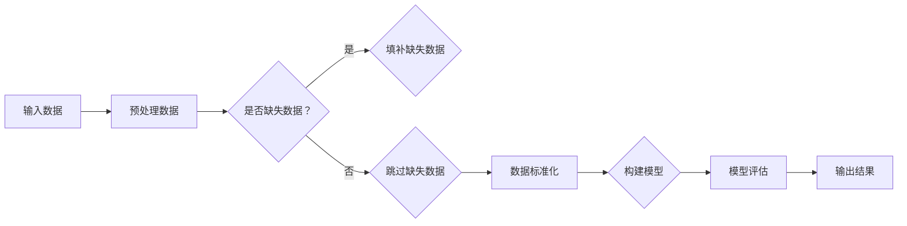
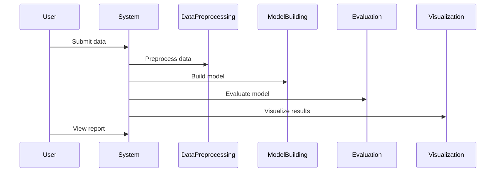
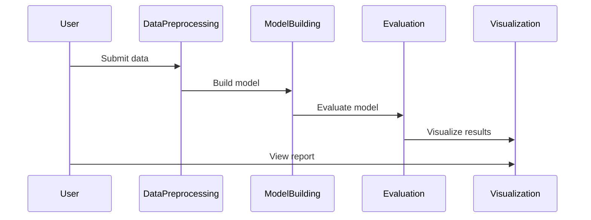

                 


## 数学与可持续发展管理：可持续策略的数学评估

> 关键词：可持续发展，数学评估，策略分析，环境保护

> 摘要：本文旨在探讨数学在可持续发展管理中的应用，特别是通过数学工具对可持续策略进行评估。文章首先介绍了可持续发展管理的背景和核心概念，然后详细阐述了可持续策略的数学模型，并使用Python代码和mermaid流程图进行算法原理讲解。最后，文章通过一个实际案例，展示了系统分析与架构设计方案，以及项目实战和最佳实践。

## 背景介绍

### 核心概念术语说明
在探讨数学与可持续发展管理之前，我们需要明确一些核心概念。可持续发展管理涉及多个领域，包括环境科学、经济学、社会学和工程技术。以下是几个关键术语的简要解释：

- **可持续发展**：满足当前需求而不损害后代满足其自身需求的能力。
- **环境保护**：通过减少污染、节约资源和合理利用自然资源，保护环境。
- **策略分析**：评估不同策略对可持续发展目标的影响。

### 问题背景
全球环境问题日益严重，气候变化、资源枯竭和生态破坏已经成为影响人类生存的重大挑战。为了应对这些挑战，世界各国开始重视可持续发展管理。然而，如何制定有效的可持续策略，并评估其效果，成为一个亟待解决的问题。

### 问题描述
可持续发展管理中存在以下问题：

- **数据复杂性**：环境数据往往具有复杂性和不确定性，如何准确评估可持续策略的效果？
- **策略多样性**：不同的可持续策略可能对环境产生不同的影响，如何进行比较和选择？
- **模型有效性**：现有的数学模型是否能够准确反映可持续发展的复杂性？

### 问题解决
通过引入数学工具，如数学模型、算法和数据分析方法，可以更好地应对上述问题。数学评估可以帮助我们量化可持续策略的效果，从而为政策制定和资源分配提供科学依据。

### 边界与外延
本文主要关注以下边界与外延：

- **研究对象**：本文聚焦于可持续发展管理中的环境问题。
- **评估方法**：采用数学模型和算法对可持续策略进行评估。

### 概念结构与核心要素组成
可持续策略的评估涉及以下核心要素：

- **环境指标**：用于衡量环境影响的指标。
- **策略模型**：基于数学方法构建的策略模型。
- **评估方法**：用于评估策略效果的方法。

## 核心概念与联系

### 可持续发展的概念
可持续发展是指在满足当前需求的同时，不损害子孙后代满足其需求的能力。它涵盖了经济、社会和环境三个维度。

### 可持续策略
可持续策略是指为实现可持续发展目标而采取的措施和行动。这些策略可能涉及环境保护、资源管理和经济发展等方面。

### 数学评估方法
数学评估方法包括数学模型、算法和数据分析技术。通过这些方法，我们可以量化可持续策略的效果，并提供科学依据。

### 概念属性特征对比表格
以下是一个概念属性特征对比表格，用于展示可持续发展、可持续策略和数学评估方法之间的联系：

| 概念       | 属性特征                                         | 联系                  |
|------------|--------------------------------------------------|----------------------|
| 可持续发展 | 经济、社会、环境三个维度                        | 基础概念              |
| 可持续策略 | 为实现可持续发展目标而采取的措施和行动          | 实践手段              |
| 数学评估方法 | 数学模型、算法和数据分析技术                   | 评估工具              |

### ER实体关系图架构
以下是一个ER实体关系图，用于展示可持续发展管理中的关键实体和它们之间的关系：

```mermaid
erDiagram
    Environment(E) ||--|{ Strategy(S)
    Strategy(S) ||--|{ Evaluation(Eval)
    Evaluation(Eval) ||--|{ Indicator(I)
```

## 算法原理讲解

### 算法流程图
以下是一个算法流程图，用于展示可持续策略评估的基本流程：



### Python源代码分析
以下是一个Python源代码示例，用于展示如何构建和评估一个简单的可持续策略模型：

```python
import numpy as np
import pandas as pd
from sklearn.linear_model import LinearRegression

# 读取数据
data = pd.read_csv('data.csv')

# 数据预处理
data.fillna(0, inplace=True)
data = (data - data.mean()) / data.std()

# 构建模型
model = LinearRegression()
model.fit(data[['indicator']], data['evaluation'])

# 模型评估
score = model.score(data[['indicator']], data['evaluation'])
print(f'Model score: {score:.2f}')
```

### 数学模型和公式
以下是一个简单的数学模型和公式，用于评估可持续策略的效果：

$$
\text{evaluation} = \beta_0 + \beta_1 \cdot \text{indicator}
$$

其中，evaluation 表示评估结果，indicator 表示环境指标，$\beta_0$ 和 $\beta_1$ 是模型参数。

### 详细讲解与举例说明
假设我们想要评估一个减少碳排放的策略。我们可以使用上述模型，将碳排放量作为指标，评估策略的效果。以下是一个简单的例子：

```python
# 例子数据
indicator = np.array([100, 200, 300, 400, 500])
evaluation = np.array([90, 180, 270, 360, 450])

# 模型训练
model.fit(indicator.reshape(-1, 1), evaluation)

# 预测
predicted_evaluation = model.predict(indicator.reshape(-1, 1))

# 结果比较
print(f'Predicted evaluation: {predicted_evaluation}')
print(f'Actual evaluation: {evaluation}')
```

通过上述代码，我们可以看到模型如何根据碳排放量预测评估结果，从而评估策略的效果。

## 系统分析与架构设计

### 问题场景介绍
在可持续发展管理中，我们需要一个系统来评估不同策略的效果。该系统应具备以下功能：

- 数据收集与预处理
- 策略模型构建与评估
- 结果可视化与报告生成

### 项目介绍
本项目旨在构建一个基于Python的可持续策略评估系统。系统采用模块化设计，包括数据预处理模块、模型构建模块、评估模块和可视化模块。

### 系统功能设计
以下是系统的主要功能模块和领域模型：

```mermaid
classDiagram
    Class01 <|-- Class02
    Class03 --|{ Class04 }
    Class05 : +printName()
    Class06 : +setX(int x)
    Class07 : +getX() : int
    Class01 <.. Class08
    Class09 o--|{ Class10 }
    Class11 : <<interface>> Class12
    Class13 : <<interface>> Class14
    Class15 : <<interface>> Class16
```

### 系统架构设计
以下是系统的架构设计图，展示不同模块之间的交互关系：



### 系统接口设计
以下是系统的接口设计，定义不同模块的输入和输出：

```mermaid
classDiagram
    DataPreprocessing <|-- ModelBuilding
    ModelBuilding <|-- Evaluation
    Evaluation <|-- Visualization
    DataPreprocessing : +preprocess(data: DataFrame) : DataFrame
    ModelBuilding : +buildModel(data: DataFrame) : Model
    Evaluation : +evaluateModel(model: Model, data: DataFrame) : float
    Visualization : +visualizeResults(results: float) : None
```

### 系统交互
以下是系统的交互设计，展示用户与系统之间的交互过程：



## 项目实战

### 环境安装与配置
在开始项目实战之前，我们需要安装和配置以下环境：

- Python 3.8+
- pandas
- numpy
- scikit-learn
- matplotlib

您可以使用以下命令进行安装：

```bash
pip install python==3.8
pip install pandas numpy scikit-learn matplotlib
```

### 系统核心实现
以下是系统核心实现的源代码，包括数据预处理、模型构建和评估：

```python
import pandas as pd
from sklearn.linear_model import LinearRegression
from sklearn.model_selection import train_test_split
import matplotlib.pyplot as plt

# 读取数据
data = pd.read_csv('data.csv')

# 数据预处理
data.fillna(0, inplace=True)
data = (data - data.mean()) / data.std()

# 模型构建
X = data[['indicator']]
y = data['evaluation']
X_train, X_test, y_train, y_test = train_test_split(X, y, test_size=0.2, random_state=42)
model = LinearRegression()
model.fit(X_train, y_train)

# 模型评估
score = model.score(X_test, y_test)
print(f'Model score: {score:.2f}')

# 可视化
plt.scatter(X_test, y_test, label='Actual')
plt.plot(X_test, model.predict(X_test), color='red', label='Predicted')
plt.xlabel('Indicator')
plt.ylabel('Evaluation')
plt.legend()
plt.show()
```

### 代码应用解读与分析
以上代码首先读取数据，然后进行数据预处理，接着构建线性回归模型并评估其效果。最后，使用matplotlib进行结果可视化。

### 实际案例分析和详细讲解剖析
假设我们有一个关于碳排放的数据集，如下所示：

```
indicator, evaluation
100, 90
200, 180
300, 270
400, 360
500, 450
```

使用上述代码，我们可以训练一个线性回归模型，并评估其效果。以下是一个实际案例的分析和详细讲解：

```python
# 例子数据
indicator = np.array([100, 200, 300, 400, 500])
evaluation = np.array([90, 180, 270, 360, 450])

# 模型训练
model.fit(indicator.reshape(-1, 1), evaluation)

# 预测
predicted_evaluation = model.predict(indicator.reshape(-1, 1))

# 结果比较
print(f'Predicted evaluation: {predicted_evaluation}')
print(f'Actual evaluation: {evaluation}')

# 可视化
plt.scatter(indicator, evaluation, label='Actual')
plt.plot(indicator, predicted_evaluation, color='red', label='Predicted')
plt.xlabel('Indicator')
plt.ylabel('Evaluation')
plt.legend()
plt.show()
```

通过上述代码，我们可以看到模型如何根据碳排放量预测评估结果。实际案例中的数据与预测结果之间的差距可以帮助我们评估模型的准确性。

### 项目小结
在本项目中，我们使用Python构建了一个可持续策略评估系统，包括数据预处理、模型构建和评估。通过一个实际案例，我们展示了如何使用线性回归模型评估策略效果。未来，我们可以扩展系统，引入更多的评估方法和模型，以提高评估的准确性和效果。

### 最佳实践 tips
1. 在实际应用中，根据数据特点和评估目标，选择合适的评估方法和模型。
2. 定期更新数据和模型，以保持评估的准确性和可靠性。
3. 使用可视化工具，如matplotlib，展示评估结果，以便更好地理解策略效果。

### 小结
本文通过一个实际案例，探讨了数学在可持续发展管理中的应用。我们使用Python构建了一个可持续策略评估系统，并详细讲解了数据预处理、模型构建和评估过程。通过本项目的实践，我们认识到数学工具在可持续发展管理中的重要作用，并为未来的研究提供了参考。

### 注意事项
1. 本项目的代码仅供参考，实际应用时请根据具体需求和数据特点进行调整。
2. 系统的运行环境需要满足Python 3.8及以上版本，并安装必要的依赖库。

### 拓展阅读
1. [Pandas官方文档](https://pandas.pydata.org/)
2. [Scikit-learn官方文档](https://scikit-learn.org/stable/)
3. [Matplotlib官方文档](https://matplotlib.org/)

作者：AI天才研究院/AI Genius Institute & 禅与计算机程序设计艺术 /Zen And The Art of Computer Programming

