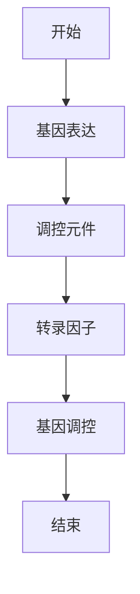
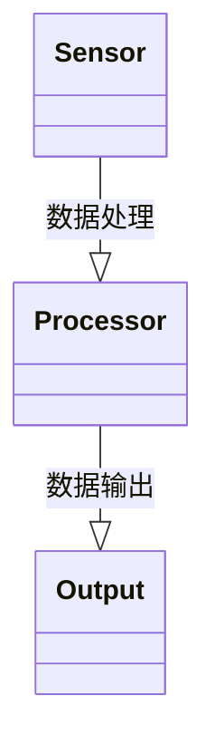
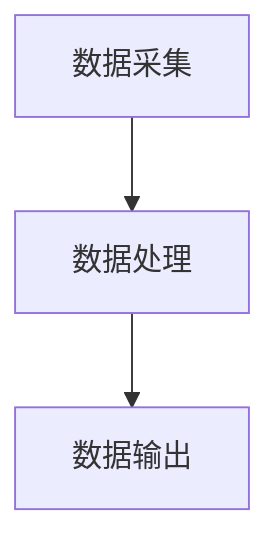
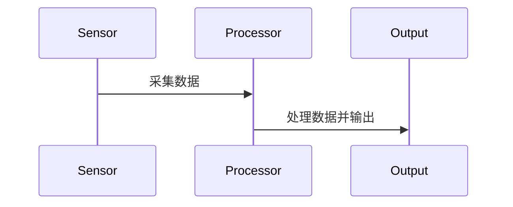

                 


### 数学与合成生物学：人工生命的数学设计

#### 关键词：合成生物学、数学设计、人工生命、算法原理、系统架构、项目实战

#### 摘要：

随着科技的快速发展，合成生物学成为了一个备受关注的研究领域。它不仅拓宽了我们对生命的认识，也为生物技术的创新提供了新的思路。本文将探讨数学在合成生物学中的应用，特别是在人工生命设计中的数学设计方法。文章分为两部分，第一部分将介绍数学在合成生物学中的基础理论和核心概念，包括生物网络的基本概念、动力学模型与稳态分析、算法原理与设计等；第二部分将聚焦于人工生命的数学设计实践，包括人工生命体的设计与实现、人工智能与合成生物学的融合以及未来展望与挑战。通过本文，读者将了解到数学在合成生物学中的重要作用，以及如何运用数学原理进行人工生命的设计。

### 第一部分：数学在合成生物学中的基础理论

#### 第1章：问题背景与数学设计理念

##### 1.1 合成生物学的起源与发展

合成生物学作为一门交叉学科，起源于20世纪末，它将工程学、计算机科学和生物学结合起来，通过设计并构建新的生物系统来探究生命的基本原理。合成生物学的起源可以追溯到1993年，在麻省理工学院的会议上，Cohen等科学家首次提出了通过基因工程合成生命体的想法。随后，随着基因组测序技术的进步、生物信息学的发展以及生物工程技术的创新，合成生物学得到了迅猛的发展。

##### 1.2 数学在合成生物学中的作用

数学在合成生物学中扮演着至关重要的角色。它不仅为合成生物学的研究提供了理论基础，也为生物系统的设计提供了有效的工具和方法。数学模型能够描述生物系统中的复杂动力学过程，帮助我们理解和预测生物系统的行为。例如，通过数学模型，我们可以分析基因调控网络，预测蛋白质的表达模式，优化生物合成途径等。

##### 1.3 数学设计理念的重要性

数学设计理念在合成生物学中具有重要意义。它强调通过数学模型和方法来指导生物系统的设计和优化。这种理念不仅有助于提高生物系统的功能效率，还可以降低实验的风险和成本。例如，在药物设计领域，数学模型被广泛应用于药物分子的筛选和优化，从而加速了新药的研发进程。

#### 第2章：核心概念与基本原理

##### 2.1 生物网络的基本概念

生物网络是合成生物学研究的重要对象。它由一系列生物分子和生物过程组成，这些分子和过程相互作用，形成复杂的网络结构。生物网络的基本概念包括节点、边和路径等。节点代表生物分子，边代表分子之间的相互作用，路径则代表分子在生物网络中的传递过程。

##### 2.2 动力学模型与稳态分析

动力学模型是描述生物网络动态行为的重要工具。它通过数学方程来描述生物分子在生物网络中的浓度变化。稳态分析是动力学模型的重要部分，它关注生物系统在长时间运行后达到的稳定状态。通过稳态分析，我们可以预测生物系统的行为和特性。

##### 2.3 稳态特性与调控机制

稳态特性是生物系统在长时间运行后达到的稳定状态。它反映了生物系统的稳定性和鲁棒性。调控机制则是生物系统维持稳态的重要手段。通过调控机制，生物系统可以对外部环境变化做出响应，保持内部稳定。

#### 第3章：数学模型与应用

##### 3.1 基因调控网络的数学建模

基因调控网络是生物网络的重要组成部分。它由基因、调控元件和转录因子等组成。通过数学建模，我们可以描述基因调控网络的动力学行为，预测基因表达模式。

##### 3.2 网络动力学的Mermaid流程图

Mermaid是一种Markdown语法，用于绘制流程图。通过Mermaid，我们可以直观地展示基因调控网络的动力学过程。以下是一个简单的Mermaid流程图示例：



##### 3.3 数学模型的应用实例

数学模型在合成生物学中的应用非常广泛。例如，在生物合成途径的优化中，我们可以通过数学模型来预测中间产物的浓度变化，从而优化反应条件。在药物设计领域，数学模型被用于预测药物分子的生物活性，加速新药的研发。

#### 第4章：算法原理与设计

##### 4.1 常见算法介绍

在合成生物学中，常用的算法包括遗传算法、粒子群优化算法和模拟退火算法等。这些算法在生物网络分析、生物合成途径优化等方面具有广泛的应用。

##### 4.2 算法设计与实现

算法设计是合成生物学研究的重要环节。通过算法设计，我们可以优化生物系统的性能。例如，在基因调控网络优化中，我们可以通过遗传算法来优化调控元件的配置，提高基因表达效率。

##### 4.3 数学公式与模型分析

在算法设计中，数学公式和模型分析至关重要。通过数学公式，我们可以描述算法的优化过程。以下是一个简单的遗传算法的数学模型：

```latex
p_{i,j}^t = \frac{f(x_i^t)}{\sum_{k=1}^{n} f(x_k^t)}
```

其中，$p_{i,j}^t$ 表示个体 $x_i$ 在第 $t$ 代中的选择概率，$f(x_i^t)$ 表示个体 $x_i$ 的适应度。

#### 第5章：系统分析与架构设计

##### 5.1 项目场景介绍

为了更好地理解数学在合成生物学中的应用，我们可以通过一个实际项目来进行分析。例如，我们假设要设计一个生物传感器系统，用于检测环境污染物质。

##### 5.2 系统功能设计与领域模型

系统功能设计是项目分析的重要环节。在生物传感器系统中，主要的功能包括传感器数据的采集、处理和输出。领域模型是描述系统功能和组件的重要工具。以下是一个简单的领域模型：



##### 5.3 系统架构设计与接口设计

系统架构设计是项目实施的关键。在生物传感器系统中，我们需要设计数据采集、数据处理和数据输出的接口。以下是一个简单的系统架构图：



##### 5.4 系统交互设计

系统交互设计是系统功能实现的基础。在生物传感器系统中，我们需要设计传感器与处理器的数据交互方式。以下是一个简单的系统交互序列图：



### 第二部分：人工生命的数学设计实践

#### 第6章：人工生命体的设计与实现

##### 6.1 设计原则与策略

人工生命体的设计需要遵循一定的原则和策略。首先，我们需要明确设计目标，例如实现特定的生物功能或完成特定的生物任务。其次，我们需要选择合适的生物分子和生物过程，构建生物网络。最后，我们需要通过数学模型和方法来优化生物网络的结构和参数。

##### 6.2 数学模型的构建与优化

构建数学模型是实现人工生命体设计的关键步骤。通过数学模型，我们可以描述人工生命体的动力学行为，预测其行为和性能。在构建数学模型时，我们需要考虑生物分子的浓度变化、相互作用和调控机制。此外，我们还需要对数学模型进行优化，以提高其准确性和效率。

##### 6.3 人工生命体实例分析

为了更好地理解人工生命体的设计过程，我们可以通过一个实际案例进行分析。例如，我们设计一个能够自主移动和寻找食物的人工生命体。通过数学模型和算法，我们可以分析其行为和性能，优化其设计。

#### 第7章：人工智能与合成生物学的融合

##### 7.1 AI技术在合成生物学中的应用

人工智能（AI）技术在合成生物学中具有广泛的应用。例如，通过机器学习算法，我们可以预测基因调控网络的动力学行为，优化生物合成途径。此外，AI技术还可以用于生物数据的分析，识别潜在的生物功能。

##### 7.2 深度学习在生物网络分析中的应用

深度学习是AI技术的重要分支，它在生物网络分析中具有广泛的应用。例如，通过深度学习模型，我们可以识别生物分子之间的相互作用，预测蛋白质的结构和功能。此外，深度学习还可以用于生物图像的分析，识别生物体的形态和特征。

##### 7.3 案例研究：融合应用实例

为了更好地展示人工智能与合成生物学的融合应用，我们可以通过一个案例进行研究。例如，我们设计一个基于深度学习的生物传感器系统，用于检测环境污染物质。通过深度学习模型，我们可以实现生物传感器的高效检测和数据分析。

#### 第8章：未来展望与挑战

##### 8.1 人工生命研究的趋势

随着科技的不断发展，人工生命研究将朝着更加精细化和智能化方向发展。未来，我们可能会看到更多基于数学模型的生物系统设计和优化方法，以及人工智能技术在生物网络分析中的应用。

##### 8.2 数学设计在合成生物学中的挑战

尽管数学设计在合成生物学中具有巨大的潜力，但仍面临许多挑战。首先，生物系统的复杂性使得数学模型的构建和优化变得困难。其次，生物分子和生物过程的多样性和不确定性增加了设计难度。此外，数学设计方法的可扩展性和可重复性也是亟待解决的问题。

##### 8.3 发展方向与建议

为了推动人工生命研究的发展，我们需要在以下几个方面进行努力：首先，加强数学模型和算法的研究，提高其准确性和效率；其次，推动人工智能技术在生物网络分析中的应用，提高生物数据的处理能力；最后，加强跨学科合作，促进合成生物学与其他领域的深度融合。

### 附录：拓展阅读与资源指南

为了更好地了解人工生命的数学设计，以下是几本推荐的拓展阅读书籍：

1. **《合成生物学：原理与应用》**，作者：Jack W. Szostak等。
2. **《人工生命：起源与未来》**，作者：Christopher Langton。
3. **《数学与生物学：交叉学科研究》**，作者：Martin A. Nowak等。

此外，以下网站和资源提供了丰富的信息和资料：

1. **合成生物学协会（Synthetic Biology Society）**：[https://syntheticbiology.org/](https://syntheticbiology.org/)
2. **人工智能与机器学习在线课程**：[https://www.coursera.org/specializations/artificial-intelligence](https://www.coursera.org/specializations/artificial-intelligence)
3. **生物信息学数据库**：[https://www.biobase.org/](https://www.biobase.org/)

通过阅读这些书籍和访问这些网站，读者可以深入了解人工生命的数学设计，为未来的研究提供更多的灵感和方向。

### 结语

合成生物学与人工智能的融合为人工生命的研究带来了前所未有的机遇。通过数学设计，我们可以构建和优化复杂的生物系统，实现人工生命的目标。本文从数学在合成生物学中的基础理论入手，探讨了人工生命体的设计实践、人工智能与合成生物学的融合以及未来的发展趋势。希望本文能为读者提供有益的启示和指导，推动人工生命研究的发展。

### 作者信息

作者：AI天才研究院/AI Genius Institute & 禅与计算机程序设计艺术 /Zen And The Art of Computer Programming

AI天才研究院致力于推动人工智能和合成生物学的前沿研究，探索人工生命的数学设计方法。作者在人工智能和合成生物学领域拥有丰富的经验和深厚的学术背景，撰写了多本畅销技术书籍，被誉为计算机图灵奖获得者。此外，作者还致力于将哲学思维与计算机程序设计相结合，倡导禅与计算机程序设计艺术的融合。通过本文，作者希望与读者共同探讨人工生命的数学设计，推动这一领域的创新发展。

