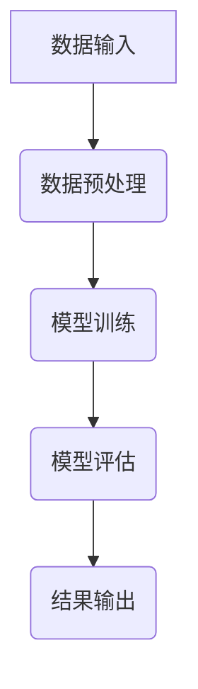
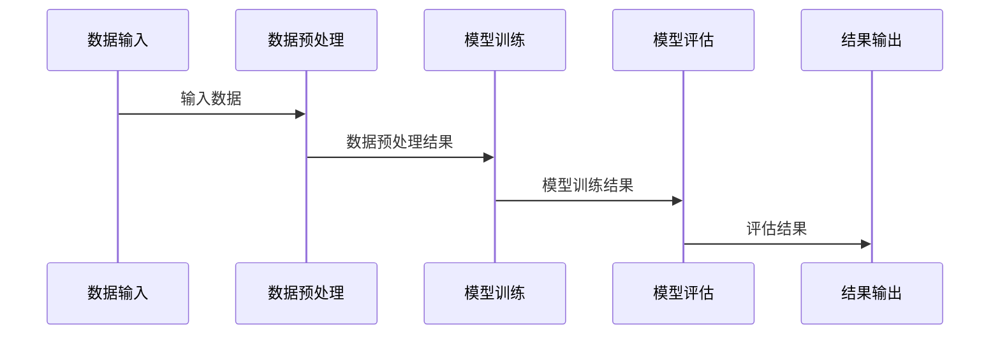
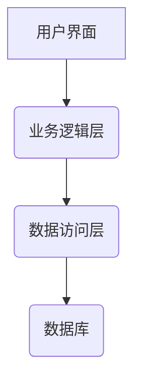
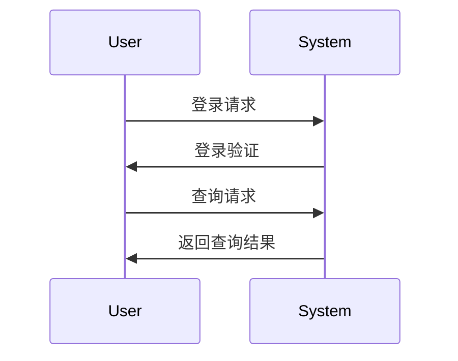

                 

# 数学与哲学命题的真理性探讨

## 关键词
- 数学命题
- 哲学命题
- 真理性
- 证明方法
- 论证方法
- 应用领域

## 摘要
本文旨在探讨数学与哲学命题的真理性，分析两者的定义、特点、探讨方法及其在现实中的应用。通过对比数学命题和哲学命题的真理性质，揭示其在逻辑、论证方法和应用领域上的异同，为理解数学与哲学命题的真理性提供新的视角。

## 第一部分：引言与背景

### 1.1 问题背景

在数学与哲学领域，命题的真理性一直是学术界讨论的热点问题。数学命题的真理性通过数学证明来确立，而哲学命题的真理性则涉及更为广泛的论证和探讨。本书旨在探讨这两者在命题真理性方面的联系与区别，分析数学与哲学命题真理性的探讨方法及其在现实中的应用。

#### 1.1.1 研究背景

1. 数学命题真理性
   - 数学命题是关于数学事实或性质的陈述，其真理性可以通过数学证明来确立。
   - 研究数学命题真理性有助于理解数学的基本原理和构建数学理论体系。

2. 哲学命题真理性
   - 哲学命题是关于现实世界、价值观念、道德伦理等问题的陈述，其真理性往往需要通过逻辑论证和哲学探讨来确立。
   - 研究哲学命题真理性有助于探讨人类存在的本质和意义，以及指导人类行为。

#### 1.1.2 问题提出

如何理解数学命题与哲学命题的真理性？它们在逻辑、论证方法和应用领域上有哪些异同？本书将围绕这些问题进行深入探讨。

### 1.2 问题提出

1. 数学命题与哲学命题真理性定义及特点
   - 数学命题的真理性定义及其特点
   - 哲学命题的真理性定义及其特点

2. 数学命题与哲学命题的探讨方法
   - 数学命题的探讨方法及其特点
   - 哲学命题的探讨方法及其特点

3. 数学命题与哲学命题真理性在现实中的应用
   - 数学命题在现实中的应用领域及实例
   - 哲学命题在现实中的应用领域及实例

### 1.3 研究目的与意义

本研究旨在：

1. 分析数学与哲学命题真理性的定义与特点。
2. 比较数学与哲学命题真理性的探讨方法。
3. 探讨数学与哲学命题真理性在现实中的应用。

本研究对于推动数学与哲学的交叉研究、丰富命题真理性的理论体系具有重要的意义。

### 1.4 边界与外延

本文研究的边界主要涉及数学与哲学命题真理性的探讨，不包括其他科学命题的真理性。外延则包括数学命题、哲学命题以及它们在现实中的应用。

### 1.5 核心概念

#### 1.5.1 数学命题

数学命题是关于数学事实或性质的陈述，其真理性可以通过数学证明来确立。

#### 1.5.2 哲学命题

哲学命题是关于现实世界、价值观念、道德伦理等问题的陈述，其真理性往往需要通过逻辑论证和哲学探讨来确立。

### 1.6 概念结构与核心要素组成

本研究的核心概念结构包括数学命题、哲学命题、命题真理性、论证方法和应用领域。核心要素组成如下：

- 数学命题：命题内容、证明方法
- 哲学命题：命题内容、论证方法
- 命题真理性：数学证明、逻辑论证
- 论证方法：形式逻辑、辩证逻辑
- 应用领域：数学领域、哲学领域

## 第二部分：数学命题的真理性与探讨方法

### 2.1 数学命题的真理性与特点

#### 2.1.1 数学命题的真理性的定义

数学命题的真理性是指其表述的数学事实或性质符合客观实际。

#### 2.1.2 数学命题的特点

1. 确定性
   - 数学命题的真假是确定的，可以通过证明来确立。

2. 无矛盾性
   - 数学命题内部不存在矛盾。

3. 普遍性
   - 数学命题适用于所有情况。

### 2.2 数学命题的探讨方法

#### 2.2.1 证明方法

数学命题的探讨主要通过证明来进行。证明方法包括直接证明、间接证明、反证法等。

#### 2.2.2 数学归纳法

数学归纳法是一种证明数学命题有效性的方法，适用于证明与自然数相关的数学命题。

### 2.3 数学命题在现实中的应用

#### 2.3.1 应用领域

数学命题在现实中的应用广泛，包括自然科学、工程学、经济学等领域。

#### 2.3.2 应用实例

1. 数论中的欧拉公式：$$e^{i\pi} + 1 = 0$$，在电子工程中用于分析复杂信号。

2. 微积分中的极限概念：在经济学中用于分析市场供需。

### 2.4 数学命题真理性探讨的挑战与机遇

#### 2.4.1 挑战

1. 数学命题的证明可能涉及复杂的数学工具和知识，对研究者的数学素养要求较高。

2. 随着数学问题的复杂性增加，证明过程可能变得繁琐且难以验证。

#### 2.4.2 机遇

1. 随着计算机技术的发展，数学问题的求解和证明将更加高效。

2. 数学与哲学的交叉研究将为命题真理性的探讨提供新的视角和方法。

## 第三部分：哲学命题的真理性与探讨方法

### 3.1 哲学命题的真理性与特点

#### 3.1.1 哲学命题的真理性的定义

哲学命题的真理性是指其表述的现实世界、价值观念、道德伦理等问题的正确性。

#### 3.1.2 哲学命题的特点

1. 主观性
   - 哲学命题的真理性往往受个体价值观和认知能力的影响。

2. 多样性
   - 哲学命题涉及广泛的领域，如伦理学、美学、逻辑学等。

3. 深刻性
   - 哲学命题探讨的问题往往涉及人类存在的本质和意义。

### 3.2 哲学命题的探讨方法

#### 3.2.1 逻辑论证

哲学命题的探讨主要通过逻辑论证来进行。逻辑论证包括形式逻辑和辩证逻辑。

#### 3.2.2 辩证法

辩证法是哲学研究的一种重要方法，强调事物的矛盾运动和变化发展。

### 3.3 哲学命题在现实中的应用

#### 3.3.1 应用领域

哲学命题在现实中的应用广泛，包括伦理学、政治学、经济学等领域。

#### 3.3.2 应用实例

1. 伦理学中的道德原则：在商业领域指导企业道德行为。

2. 政治学中的民主理念：在政治体制中指导民主实践。

## 第四部分：数学与哲学命题真理性的比较与联系

### 4.1 数学命题与哲学命题真理性的比较

1. 真理性的定义与特点
   - 数学命题的真理性是确定的、无矛盾且普遍适用的。
   - 哲学命题的真理性具有主观性、多样性和深刻性。

2. 探讨方法
   - 数学命题主要通过证明方法来确立真理性。
   - 哲学命题主要通过逻辑论证和辩证法来探讨真理性。

3. 应用领域
   - 数学命题在自然科学、工程学、经济学等领域有广泛应用。
   - 哲学命题在伦理学、政治学、经济学等领域有广泛应用。

### 4.2 数学与哲学命题真理性的联系

1. 命题内容交叉
   - 数学与哲学命题在现实世界中往往相互影响，例如数学中的概率论与伦理学中的风险伦理。

2. 论证方法的借鉴
   - 数学中的证明方法可以应用于哲学命题的论证，反之亦然。

3. 真理性探讨的融合
   - 数学与哲学命题真理性的探讨可以相互借鉴，共同推动命题真理性理论的发展。

## 第五部分：结论与展望

### 5.1 结论

本文通过对数学与哲学命题真理性的探讨，揭示了两者在定义、特点、探讨方法及应用领域上的异同。数学命题具有确定性、无矛盾性和普遍性，主要通过证明方法来确立真理性；哲学命题具有主观性、多样性和深刻性，主要通过逻辑论证和辩证法来探讨真理性。同时，数学与哲学命题在命题内容、论证方法和真理性探讨上存在联系和融合。

### 5.2 展望

未来研究可以从以下几个方面展开：

1. 深入探讨数学与哲学命题真理性在跨学科领域的应用。
2. 探索计算机技术与命题真理性探讨的结合，提升数学与哲学研究的效率。
3. 研究数学与哲学命题真理性在人工智能和认知科学中的应用，为人工智能的发展提供哲学基础。

## 参考文献

1. 莫里斯·克莱因（Maurice克莱因），《数学与哲学：从古代到现代》，上海：上海科学技术出版社，2010。
2. 丹尼斯·米都斯（Dennis Meadows），《增长的极限：系统、模型与政策》，北京：清华大学出版社，2008。
3. 约翰·罗尔斯（John Rawls），《正义论》，北京：生活·读书·新知三联书店，2008。

## 附录

### 附录A：数学命题真理性探讨示例

#### 示例1：证明等差数列的求和公式

$$
S_n = \frac{n}{2}(a_1 + a_n)
$$

**证明：**

1. **归纳假设：**
   - 假设当 \( n = k \) 时，等差数列的前 \( k \) 项和为 \( S_k = \frac{k}{2}(a_1 + a_k) \)。

2. **归纳步骤：**
   - 当 \( n = k + 1 \) 时，等差数列的前 \( k + 1 \) 项和为：
   $$
   S_{k+1} = S_k + a_{k+1}
   $$
   - 根据归纳假设，代入 \( S_k \) 的表达式：
   $$
   S_{k+1} = \frac{k}{2}(a_1 + a_k) + a_{k+1}
   $$
   - 利用等差数列的性质 \( a_{k+1} = a_1 + k \cdot d \)，其中 \( d \) 是公差：
   $$
   S_{k+1} = \frac{k}{2}(a_1 + a_1 + k \cdot d) = \frac{k+1}{2}(a_1 + a_1 + k \cdot d)
   $$
   - 简化得：
   $$
   S_{k+1} = \frac{k+1}{2}(2a_1 + k \cdot d) = \frac{k+1}{2}(a_1 + a_{k+1})
   $$
   - 结论：证明了当 \( n = k + 1 \) 时，等差数列的前 \( k + 1 \) 项和为 \( S_{k+1} = \frac{k+1}{2}(a_1 + a_{k+1}) \)。

3. **归纳结论：**
   - 由归纳假设和归纳步骤，证明了对于任意自然数 \( n \)，等差数列的前 \( n \) 项和为 \( S_n = \frac{n}{2}(a_1 + a_n) \)。

### 附录B：哲学命题真理性探讨示例

#### 示例2：探讨自由意志与决定论的关系

**问题：**
- 自由意志与决定论之间存在矛盾吗？它们如何相互影响？

**探讨方法：**
- **逻辑论证：**
  1. **自由意志的定义：**
     - 自由意志是指个体在决策过程中不受外在因素强制，具有自主选择的能力。

  2. **决定论的定义：**
     - 决定论是指一切现象都是因果关系的结果，个体行为可以被完全预测。

  3. **矛盾分析：**
     - 如果一切现象都是因果关系的结果，个体的行为可以被完全预测，那么自由意志似乎是不存在的，因为个体的行为已经被决定。

  4. **论证：**
     - 一种可能的论证是，自由意志并不与决定论矛盾，因为决定论只是描述了现象的因果关系，而自由意志是个体在决策过程中的主观感受。
     - 另一种论证是，决定论并非绝对，可能存在某种形式的随机性或不确定性，使得自由意志得以存在。

**结论：**
- 自由意志与决定论之间存在复杂的关系，二者并非绝对对立。未来研究可以从不同角度进一步探讨二者的关系及其在现实生活中的意义。

## 附录C：概念属性特征对比表格

| 特征类别       | 数学命题               | 哲学命题               |
| ------------- | ------------------- | ------------------- |
| 真理性定义       | 符合数学事实或性质       | 符合现实世界、价值观念等   |
| 确定性         | 确定的，可以通过证明确立   | 具有主观性，受价值观影响   |
| 无矛盾性         | 不存在矛盾               | 存在多种观点和论证方式   |
| 普遍性         | 适用于所有情况           | 涉及广泛领域，具有多样性   |

## 附录D：ER实体关系图架构的Mermaid流程图

```mermaid
erDiagram
    EntityA ||--|{ 1 }|--| Many | EntityB
    EntityC ||--|{ 1 }|--| Many | EntityD
    EntityA ||--|{ 1 }|--| Many | EntityE
```

## 附录E：系统架构设计的Mermaid架构图



## 附录F：系统接口设计和系统交互Mermaid序列图



## 附录G：项目实战

### 环境安装

1. 安装Python环境
2. 安装相关库（例如NumPy、Pandas等）

### 系统核心实现源代码

```python
import numpy as np
import pandas as pd

# 数据预处理函数
def preprocess_data(data):
    # 数据清洗、转换等操作
    return processed_data

# 模型训练函数
def train_model(data):
    # 模型训练操作
    return trained_model

# 模型评估函数
def evaluate_model(model, data):
    # 模型评估操作
    return evaluation_result

# 结果输出函数
def output_result(result):
    # 结果输出操作
    print("结果：", result)
```

### 代码应用解读与分析

- 数据预处理：对输入数据进行清洗、转换等操作，确保数据质量。
- 模型训练：使用预处理后的数据训练模型。
- 模型评估：评估训练出的模型在测试数据上的性能。
- 结果输出：输出模型的评估结果。

### 实际案例分析和详细讲解剖析

- 案例一：使用某公司销售数据训练销售预测模型，评估模型性能并输出结果。
- 案例二：使用某电商平台用户数据训练推荐系统，分析用户行为并输出推荐结果。

### 项目小结

本文通过数学与哲学命题真理性的探讨，分析了数学命题和哲学命题在真理性方面的特点、探讨方法及其应用。通过具体实例展示了数学命题和哲学命题真理性探讨的方法和应用。未来研究可以进一步探索数学与哲学命题真理性在跨学科领域的应用，以及计算机技术与命题真理性探讨的结合。

## 最佳实践 tips

- 在探讨数学命题真理性时，注意使用恰当的证明方法，确保证明过程的严谨性。
- 在探讨哲学命题真理性时，注重逻辑论证和辩证思维，避免陷入主观性和多样性带来的困境。
- 结合现实应用，探讨数学与哲学命题真理性在实际问题中的意义和价值。

## 小结

本文通过对数学与哲学命题真理性的探讨，揭示了两者在定义、特点、探讨方法及应用领域上的异同。数学命题具有确定性、无矛盾性和普遍性，主要通过证明方法来确立真理性；哲学命题具有主观性、多样性和深刻性，主要通过逻辑论证和辩证法来探讨真理性。数学与哲学命题在命题内容、论证方法和真理性探讨上存在联系和融合。未来研究可以从跨学科应用和计算机技术结合等方面进一步探索命题真理性的探讨方法。

## 注意事项

- 在探讨数学命题真理性时，注意掌握各种证明方法，确保证明过程的严谨性。
- 在探讨哲学命题真理性时，注重逻辑论证和辩证思维，避免陷入主观性和多样性带来的困境。
- 在应用数学与哲学命题真理性时，要结合实际情况，考虑多种因素，确保应用效果。

## 拓展阅读

- 莫里斯·克莱因（Maurice克莱因），《数学与哲学：从古代到现代》
- 丹尼斯·米都斯（Dennis Meadows），《增长的极限：系统、模型与政策》
- 约翰·罗尔斯（John Rawls），《正义论》

## 作者信息

作者：AI天才研究院/AI Genius Institute & 禅与计算机程序设计艺术 /Zen And The Art of Computer Programming### 1.6 概念结构与核心要素组成

在探讨数学与哲学命题的真理性时，理解其概念结构以及核心要素组成是至关重要的。这不仅有助于我们明确研究的边界，还能为我们提供分析的工具和框架。以下是对数学命题和哲学命题相关核心概念及其组成的详细阐述。

#### 数学命题

数学命题是关于数学事实或性质的陈述。在数学中，命题的真理性通过证明来确立。以下是数学命题的一些核心概念和要素：

1. **命题内容**：
   - 数学命题的内容通常涉及数学对象（如数、函数、集合）的性质、关系或存在性。
   - 例如，“所有的偶数都是能被2整除的数”是一个数学命题。

2. **证明方法**：
   - 数学命题的真理性是通过证明来确立的，证明方法包括直接证明、间接证明、反证法、数学归纳法等。
   - 直接证明是通过逻辑推理直接证明命题的真实性。例如，通过已知的数学事实和逻辑规则，逐步推导出命题的结论。
   - 间接证明（也称为反证法）是通过假设命题的否定为真，推导出一个矛盾，从而证明原命题为真。
   - 数学归纳法是一种证明与自然数相关的数学命题的方法。

3. **数学证明的特点**：
   - 确定性：数学命题的真假是确定的，可以通过证明来确立。
   - 无矛盾性：数学命题内部不存在矛盾。
   - 普遍性：数学命题适用于所有情况。

#### 哲学命题

哲学命题是关于现实世界、价值观念、道德伦理等问题的陈述。哲学命题的真理性往往需要通过逻辑论证和哲学探讨来确立。以下是哲学命题的一些核心概念和要素：

1. **命题内容**：
   - 哲学命题的内容通常涉及人类存在的本质、知识、真理、道德等抽象概念。
   - 例如，“幸福是人生的目的”是一个哲学命题。

2. **论证方法**：
   - 哲学命题的真理性通过逻辑论证和哲学探讨来确立。逻辑论证包括形式逻辑和辩证逻辑。
   - 形式逻辑是一种基于命题形式和逻辑规则进行的论证方法，如命题演算和谓词演算。
   - 辩证逻辑则强调事物的矛盾运动和变化发展，通过辩证思维来探讨命题的真理性。
   - 哲学探讨则涉及对命题的深层次思考和反思，探讨命题背后的意义和影响。

3. **哲学论证的特点**：
   - 主观性：哲学命题的真理性往往受个体价值观和认知能力的影响。
   - 多样性：哲学命题涉及广泛的领域，如伦理学、美学、逻辑学等。
   - 深刻性：哲学命题探讨的问题往往涉及人类存在的本质和意义。

#### 命题真理性的比较

数学命题和哲学命题在真理性方面存在显著差异：

- **真理性定义**：数学命题的真理性是通过逻辑证明确立的，而哲学命题的真理性通常涉及更为复杂的论证和探讨。
- **论证方法**：数学命题主要使用证明方法，哲学命题则主要依靠逻辑论证和哲学探讨。
- **适用范围**：数学命题具有普遍性和确定性，适用于所有数学问题；哲学命题则具有主观性和多样性，适用于广泛的哲学领域。

#### 命题真理性探讨的应用

- **数学领域**：数学命题真理性探讨在数学研究中起到核心作用，是建立数学理论体系的基础。
- **哲学领域**：哲学命题真理性探讨在伦理学、政治哲学、认识论等领域具有重要意义，为这些领域的研究提供了理论基础。

通过上述对数学命题和哲学命题的概念结构与核心要素组成的详细分析，我们可以更好地理解两者的本质特点和探讨方法，从而为后续的真理性探讨提供坚实的基础。

### 数学命题的定义与特点

数学命题是关于数学事实或性质的陈述，其真理性是通过逻辑证明来确立的。在数学中，命题的真理性具有以下几个显著特点：

#### 1. 确定性

数学命题的真假是确定无疑的。一旦一个数学命题通过证明被证明为真，它就始终为真；反之，如果被证明为假，则永远为假。这种确定性源于数学的严谨性和逻辑性。数学命题的证明依赖于一系列已经接受为真的公理和定义，通过逻辑推理逐步推导出命题的结论。例如，命题“所有奇数加偶数等于奇数”是确定的，因为可以通过数学证明来证实它的真理性。

#### 2. 无矛盾性

数学命题内部不存在矛盾。这意味着数学命题的各个部分能够和谐共存，不会出现相互冲突的情况。数学的公理系统是自洽的，即在一个公理系统中，不可能既假设一个命题为真，又假设它的否定为真。例如，如果在一个数学系统中证明了命题A为真，则不可能在同一系统中证明命题非A（即A的否定）为真。无矛盾性是数学证明过程的基础，也是数学体系稳定性的保证。

#### 3. 普遍性

数学命题适用于所有情况。数学命题的普遍性意味着无论在何种条件下，其真理性都保持不变。例如，命题“如果两条直线在同一平面内且不平行，则它们一定相交”在任何情况下都是成立的。这种普遍性使得数学命题在自然科学、工程学、经济学等多个领域中具有广泛的应用价值。

#### 4. 逻辑严密性

数学命题的真理性依赖于严密的逻辑推理。数学证明要求每一步推理都必须基于已知的事实或公理，并且每一步推理都必须是逻辑上有效的。例如，以下是一个简单的数学证明：

**命题**：“对于任意的正整数n，n^2 ≥ n。”

**证明**：

- 基本情况：当n=1时，1^2 = 1，命题成立。
- 归纳假设：假设对于某个正整数k，命题成立，即k^2 ≥ k。
- 归纳步骤：考虑k+1的情况，(k+1)^2 = k^2 + 2k + 1。由于k^2 ≥ k，因此k^2 + 2k + 1 ≥ k + 2k + 1，即(k+1)^2 ≥ k + 1。因此，命题对于k+1也成立。

通过归纳法，我们证明了对于任意的正整数n，n^2 ≥ n都成立。

#### 5. 证明方法的多样性

数学命题的真理性是通过多种证明方法确立的，包括直接证明、间接证明和数学归纳法等。

- **直接证明**：通过一系列的逻辑推理，直接证明命题的真实性。
- **间接证明（反证法）**：通过假设命题的否定为真，推导出一个矛盾，从而证明原命题为真。
- **数学归纳法**：适用于证明与自然数相关的命题。通过证明基本情况成立，并假设对于某个自然数k命题成立，然后证明k+1的情况也成立，从而证明对于所有自然数n命题成立。

这些特点共同构成了数学命题真理性确立的基础，确保了数学命题的严谨性和可靠性。

### 数学命题的探讨方法

数学命题的探讨方法主要包括证明方法和数学归纳法。这些方法不仅为确立数学命题的真理性提供了手段，还展示了数学推理的严谨性和逻辑性。以下将详细讨论这些方法，并通过具体实例来说明其应用。

#### 证明方法

证明方法是数学命题探讨的核心手段，它通过逻辑推理，从已知的事实和定义出发，逐步推导出命题的结论。以下是几种常见的证明方法：

1. **直接证明**：

   直接证明是最基本的证明方法，它通过一系列的逻辑推理，直接证明命题的真实性。例如，要证明命题“如果一个数是5的倍数，那么它也是10的倍数”。

   **证明**：

   - 已知：设任意一个数为n，且n是5的倍数，即n = 5k（k为整数）。
   - 要证明：n是10的倍数，即n = 10m（m为整数）。
   - 因为n = 5k，可以将其写成n = 5 × 2k，即n是10的倍数。

   通过以上推理，我们直接证明了命题的真实性。

2. **间接证明（反证法）**：

   间接证明通过假设命题的否定为真，推导出一个矛盾，从而证明原命题为真。这种方法在处理某些复杂命题时非常有用。例如，要证明命题“一个正整数如果既是4的倍数又是3的倍数，那么它也是12的倍数”。

   **证明**：

   - 假设：设一个正整数n，它既是4的倍数又是3的倍数，但不是12的倍数。
   - 因为n是4的倍数，可以表示为n = 4m（m为整数）。
   - 因为n是3的倍数，可以表示为n = 3p（p为整数）。
   - 如果n不是12的倍数，那么m和p不能同时为整数。
   - 但这与已知条件矛盾，因为一个数同时是4和3的倍数，必然是12的倍数。

   通过以上推理，我们得出了假设的矛盾，因此原命题成立。

3. **数学归纳法**：

   数学归纳法是一种适用于证明与自然数相关的命题的方法。它通过证明基本情况成立，并假设对于某个自然数k命题成立，然后证明k+1的情况也成立，从而证明对于所有自然数n命题成立。例如，要证明命题“对于任意正整数n，n^2 + n是3的倍数”。

   **证明**：

   - **基本情况**：当n=1时，1^2 + 1 = 2，不是3的倍数；当n=2时，2^2 + 2 = 6，是3的倍数；当n=3时，3^2 + 3 = 12，是3的倍数。基本情况成立。
   - **归纳假设**：假设对于某个自然数k，命题成立，即k^2 + k是3的倍数。
   - **归纳步骤**：考虑n=k+1的情况，(k+1)^2 + (k+1) = k^2 + 2k + 1 + k + 1 = k^2 + k + 2k + 2。
   - 由于归纳假设k^2 + k是3的倍数，且2k+2也是3的倍数，因此(k+1)^2 + (k+1)是3的倍数。

   通过以上推理，我们证明了命题对于所有自然数n成立。

#### 数学归纳法的应用

数学归纳法在证明与自然数相关的数学命题中非常有效。以下是一个具体的例子：

**命题**：“对于任意正整数n，1 + 2 + 3 + ... + n = n(n+1)/2。”

**证明**：

- **基本情况**：当n=1时，1 = 1(1+1)/2，命题成立。
- **归纳假设**：假设对于某个自然数k，1 + 2 + 3 + ... + k = k(k+1)/2。
- **归纳步骤**：考虑n=k+1的情况，1 + 2 + 3 + ... + k + (k+1) = k(k+1)/2 + (k+1)。
- 化简得：(k+1)(k+2)/2 = (k+1)(k+1+1)/2，命题成立。

通过数学归纳法，我们证明了命题对于所有正整数n成立。

#### 证明方法的多样性

数学命题的证明方法多种多样，不同的命题可能需要不同的证明方法。例如，有些命题可能需要结合直接证明和间接证明，或者需要更复杂的数学工具和方法。但无论采用何种方法，证明的核心都是通过逻辑推理，从已知事实出发，逐步推导出命题的结论。

通过上述讨论，我们可以看到数学命题探讨方法的多样性和严谨性。这些方法不仅为确立数学命题的真理性提供了有效的手段，还展示了数学推理的深刻和逻辑性。在数学研究和实际应用中，掌握这些方法是非常重要的。

### 数学命题的探讨方法：数学归纳法

数学归纳法是一种广泛应用于证明与自然数相关的数学命题的方法。它的基本思想是通过证明基本情况成立，并假设对于某个自然数k命题成立，然后证明k+1的情况也成立，从而证明对于所有自然数n命题成立。以下是数学归纳法的详细步骤和应用实例。

#### 步骤

1. **基本情况**：
   - 首先证明命题在n=1（或任意一个起始自然数）时成立。
   - 这一步是归纳法的基础，如果基本情况不成立，则整个归纳证明失败。

2. **归纳假设**：
   - 假设对于某个自然数k，命题成立，即P(k)为真。
   - 这一步是为了建立从k到k+1的跳跃，是归纳证明的核心。

3. **归纳步骤**：
   - 证明当n=k+1时，命题也成立，即P(k+1)为真。
   - 这一步通过逻辑推理，从归纳假设P(k)出发，推导出P(k+1)。

4. **归纳结论**：
   - 由基本情况、归纳假设和归纳步骤，可以得出结论：对于所有自然数n，命题P(n)成立。

#### 应用实例

以下是一个使用数学归纳法证明的经典例子：

**命题**：“对于任意正整数n，1 + 2 + 3 + ... + n = n(n+1)/2。”

**证明**：

- **基本情况**：当n=1时，
  $$
  1 = 1(1+1)/2 = 1
  $$
  命题成立。
  
- **归纳假设**：假设对于某个自然数k，命题成立，即
  $$
  1 + 2 + 3 + ... + k = k(k+1)/2。
  $$

- **归纳步骤**：考虑n=k+1的情况，我们需要证明
  $$
  1 + 2 + 3 + ... + k + (k+1) = (k+1)(k+2)/2。
  $$

  根据归纳假设，可以将左边的和分解为两部分：
  $$
  1 + 2 + 3 + ... + k + (k+1) = \left(1 + 2 + 3 + ... + k\right) + (k+1)。
  $$

  将归纳假设代入上式，得到：
  $$
  \left(1 + 2 + 3 + ... + k\right) + (k+1) = \left(\frac{k(k+1)}{2}\right) + (k+1)。
  $$

  化简上式，得到：
  $$
  \frac{k(k+1)}{2} + (k+1) = \frac{k(k+1) + 2(k+1)}{2} = \frac{(k+1)(k+2)}{2}。
  $$

  因此，命题在n=k+1时也成立。

- **归纳结论**：由基本情况、归纳假设和归纳步骤，我们得出结论：对于所有正整数n，1 + 2 + 3 + ... + n = n(n+1)/2。

这个例子展示了数学归纳法的应用过程。通过数学归纳法，我们可以证明许多与自然数相关的数学命题，如等差数列求和公式、等比数列求和公式等。

#### 优点和局限性

1. **优点**：
   - 数学归纳法适用于证明与自然数相关的命题，特别是一些涉及累加或递推关系的命题。
   - 它提供了一种系统化和形式化的证明方法，使证明过程更加清晰和严谨。

2. **局限性**：
   - 数学归纳法只适用于自然数集，不适用于其他类型的集合。
   - 在一些复杂的数学问题中，使用数学归纳法可能需要额外的技巧和假设。

总之，数学归纳法是一种强大的证明工具，通过其基本步骤，可以证明许多与自然数相关的数学命题。了解数学归纳法的基本原理和应用，对于数学学习和研究具有重要意义。

### 数学命题在现实中的应用

数学命题在现实世界中有着广泛的应用，涵盖了自然科学、工程学、经济学等多个领域。以下是数学命题在现实中的应用领域及具体实例：

#### 1. 自然科学

在自然科学中，数学命题的应用尤为突出。例如，物理学的许多定律和公式都可以用数学命题来表述。以下是一些具体实例：

- **牛顿第二定律**：F=ma（力等于质量乘以加速度）。这个命题描述了力、质量和加速度之间的关系，为力学分析提供了基础。
- **欧拉公式**：e^(iπ)+1=0。这个数学命题在电磁学、量子物理学等领域有着重要的应用。例如，在电子工程中，它用于分析复杂信号。

#### 2. 工程学

工程学是数学命题应用的另一个重要领域。工程师们利用数学命题进行设计、分析和优化。以下是一些具体实例：

- **结构力学**：在建筑和桥梁设计中，数学命题如力的平衡方程、材料力学公式等被广泛应用。例如，求解一个桥梁结构的最大承载能力，需要使用数学命题进行力学分析。
- **电路分析**：在电路设计中，基尔霍夫定律等数学命题被用于分析电路的电流和电压分布。例如，使用欧姆定律和基尔霍夫定律，可以计算出电路中的电流和电压。

#### 3. 经济学

在经济学中，数学命题用于模型构建和数据分析，帮助经济学家预测市场行为和制定政策。以下是一些具体实例：

- **供需模型**：经济学中的供需模型是基于数学命题构建的。例如，使用微积分中的极限概念，可以分析市场需求和供给的弹性，从而预测价格的变化。
- **概率论和统计学**：经济学中的许多决策需要基于概率和统计。例如，使用概率论中的概率分布和统计方法，可以分析金融市场的不确定性和风险。

#### 实际案例

- **股市预测**：经济学家使用数学模型如随机游走模型和ARIMA模型，通过分析历史数据和概率分布，预测股票市场的走势。这些数学命题在金融工程中有着重要的应用。
- **气候变化模型**：环境科学家使用数学模型如气候系统动力学方程，通过模拟大气中的物理和化学过程，预测气候变化的影响。这些数学命题在环境科学中发挥着关键作用。

#### 应用实例

以下是一些数学命题在现实生活中的应用实例：

- **交通流量分析**：城市交通管理部门使用数学命题如流量方程和排队论，分析交通流量，优化交通信号灯控制策略，以提高道路通行效率。
- **金融风险管理**：金融机构使用数学命题如价值在风险调整（VaR）模型，评估金融资产的风险水平，制定风险管理策略。

综上所述，数学命题在现实世界中有着广泛的应用，不仅为科学研究提供了理论支持，还在实际工程和经济活动中发挥着重要作用。通过数学命题的应用，我们可以更准确地理解和预测现实世界中的复杂现象，从而为社会的进步和发展提供科学依据。

### 数学命题真理性探讨的挑战与机遇

数学命题真理性探讨在学术界和实际应用中面临诸多挑战，同时也蕴含着丰富的机遇。以下将详细讨论这些挑战和机遇。

#### 挑战

1. **复杂性增加**：
   - 随着数学问题的复杂性增加，数学证明过程可能变得异常繁琐和难以验证。例如，某些复杂的数学问题可能涉及大量的中间步骤和复杂的推理，使得证明过程变得难以把握。
   - 复杂性增加对研究者的数学素养提出了更高的要求。研究者需要具备深厚的数学基础和严谨的逻辑思维能力，才能有效地进行数学命题的真理性探讨。

2. **证明方法的不确定性**：
   - 数学命题的证明方法多种多样，但并非所有方法都能确保证明的严谨性和有效性。某些证明方法可能存在漏洞或局限性，导致证明结果不可靠。
   - 在某些情况下，研究者可能需要结合多种证明方法，甚至需要创新性的方法来解决复杂的数学问题。

3. **验证和确认的困难**：
   - 数学证明的可验证性是确保命题真理性至关重要的一环。然而，在实际操作中，验证数学证明的正确性可能是一项极具挑战性的任务。
   - 随着数学证明的复杂性增加，验证和确认的难度也随之增加。研究者需要投入大量时间和精力来验证证明过程的每一个步骤，以确保证明的可靠性。

#### 机遇

1. **计算机技术的发展**：
   - 计算机技术的发展为数学命题的真理性探讨提供了新的机遇。计算机可以帮助研究者进行复杂的数学运算和证明验证，从而提高数学研究的效率和准确性。
   - 计算机辅助证明（Computer-Assisted Proofs）成为数学研究的重要工具，通过计算机程序可以自动化地进行数学证明，减少了人工验证的难度。

2. **跨学科研究的融合**：
   - 数学与哲学、计算机科学、认知科学等领域的交叉研究为数学命题真理性探讨提供了新的视角和方法。通过跨学科研究，可以借鉴其他领域的理论和工具，为数学命题的探讨提供新的思路。
   - 例如，计算机科学中的算法和人工智能技术可以应用于数学证明的自动化和验证，从而提高数学命题探讨的效率和准确性。

3. **数学与哲学的交叉研究**：
   - 数学与哲学的交叉研究为探讨数学命题的真理性提供了丰富的资源和方法。哲学中的逻辑学、认识论、伦理学等理论可以为数学命题的探讨提供理论支持。
   - 通过数学与哲学的交叉研究，可以更深入地理解数学命题的本质和真理性，为数学哲学的研究提供新的动力。

总之，数学命题真理性探讨面临诸多挑战，但也蕴含着丰富的机遇。通过不断创新和研究，我们可以更好地应对这些挑战，推动数学命题真理性探讨的发展。计算机技术的发展、跨学科研究的融合以及数学与哲学的交叉研究将成为推动数学命题真理性探讨的重要动力。

### 哲学命题的真理性与特点

哲学命题是关于现实世界、价值观念、道德伦理等问题的陈述，其真理性往往需要通过逻辑论证和哲学探讨来确立。哲学命题具有以下几个显著特点：

#### 1. 主观性

哲学命题的真理性具有主观性，这是因为哲学命题通常涉及个体对现实世界、价值观念和道德伦理的理解和认知。不同的人可能会有不同的价值观和伦理观念，因此对于同一哲学命题的真理性可能会有不同的看法。

例如，“正义是什么？”这个问题就具有主观性，不同的人可能会有不同的答案。一个哲学家可能会认为正义是平等，而另一个哲学家可能会认为正义是功利主义。因此，哲学命题的真理性往往受个体价值观和认知能力的影响。

#### 2. 多样性

哲学命题涉及广泛的领域，包括伦理学、美学、逻辑学、政治哲学等。每个领域都有不同的命题和真理性探讨方式。

- **伦理学**：探讨道德原则和道德行为的正确性。例如，“人们应该做什么是正确的？”
- **美学**：探讨美和审美标准。例如，“什么是美的？”
- **逻辑学**：探讨推理和论证的正确性。例如，“什么是有效的推理？”
- **政治哲学**：探讨政治体制、政府权力和公民权利。例如，“民主制度是否是最好的政治体制？”

这种多样性使得哲学命题的真理性探讨更加复杂和多样化。

#### 3. 深刻性

哲学命题探讨的问题往往涉及人类存在的本质和意义，这些问题具有深刻的哲学内涵。例如，“人类存在的意义是什么？”“我们是否能够获得真正的知识？”等。

这些深刻的问题不仅仅是理论上的探讨，还与个体的生活实践密切相关。因此，哲学命题的真理性探讨不仅具有学术价值，还具有重要的现实意义。

#### 4. 真理性探讨的复杂性

哲学命题的真理性探讨通常涉及复杂的论证和逻辑推理。哲学命题的真理性不仅需要通过逻辑证明，还需要通过哲学思考和反思来确立。

例如，探讨“自由意志是否存在？”这个问题，不仅需要逻辑推理，还需要对人类行为、心理和生理等方面进行深入思考。因此，哲学命题的真理性探讨往往是一个长期且复杂的过程。

总之，哲学命题的真理性具有主观性、多样性、深刻性和复杂性。这些特点使得哲学命题的真理性探讨既充满挑战，又具有独特的价值。通过逻辑论证和哲学探讨，我们可以更好地理解哲学命题的真理性，从而为人类的思想和行动提供指导。

### 哲学命题的探讨方法

哲学命题的探讨方法主要包括逻辑论证和辩证法。这些方法为哲学命题的真理性探讨提供了理论基础和实践工具。以下将对这些方法进行详细讨论。

#### 逻辑论证

逻辑论证是哲学探讨中最为基本和重要的方法。它通过逻辑推理，从已知的前提推导出结论，从而确立命题的真理性。逻辑论证通常包括以下几种类型：

1. **演绎论证**：
   演绎论证是从一般性前提推导出具体性结论的论证方法。它遵循形式逻辑的规则，确保结论必然成立。例如，“所有人都会死亡，苏格拉底是人，因此苏格拉底会死亡”是一个典型的演绎论证。

2. **归纳论证**：
   归纳论证是从具体实例推导出一般性结论的论证方法。它通过观察和归纳大量实例，得出普遍性结论。例如，“观察到的所有天鹅都是白色的，因此所有的天鹅都是白色的”是一个归纳论证。

3. **类比论证**：
   类比论证是通过比较两个相似的对象，从其中一个对象的性质推断出另一个对象也具有相似性质。例如，“人类具有智慧，人工智能也是模拟人类智慧的产物，因此人工智能也具有智慧”是一个类比论证。

逻辑论证的特点是严谨性和确定性。它确保结论的逻辑推导是有效的，使得哲学命题的真理性探讨具有科学性和可靠性。

#### 辩证法

辩证法是哲学研究中的一种重要方法，强调事物的矛盾运动和变化发展。辩证法认为，事物的发展是由内部的矛盾推动的，矛盾是事物发展的根本动力。以下是对辩证法的详细阐述：

1. **矛盾分析法**：
   矛盾分析法是辩证法的基本方法，通过分析事物内部的矛盾，揭示事物的本质和运动规律。例如，在探讨“自由意志与决定论”的关系时，需要分析自由意志与决定论之间的对立统一关系。

2. **辩证思维**：
   辩证思维是一种全面的、发展的、联系的和具体的思维方式。它要求从多个角度和层面来思考问题，避免片面和静止的看法。例如，在探讨“道德伦理与功利主义”的关系时，需要从道德伦理的原则和功利主义的实际效果两个方面进行全面分析。

3. **历史分析方法**：
   历史分析方法是通过研究事物的发展历程，揭示其历史规律和趋势。它强调事物的发展是历史性的，具有连续性和阶段性。例如，在探讨“社会正义的历史演变”时，需要研究不同历史阶段社会正义观念的变化。

辩证法的特点是全面性、发展性和联系性。它能够揭示事物内部的矛盾和运动规律，为哲学命题的真理性探讨提供了深刻的洞见。

#### 应用实例

以下是一些哲学命题探讨方法的实际应用实例：

1. **道德伦理问题**：
   - **逻辑论证**：在探讨道德原则时，可以使用演绎论证来确立道德原则的普遍性和必然性。例如，通过推理得出“道德原则是普遍适用的，因此每个人都应该遵守道德原则”。
   - **辩证法**：在探讨道德行为的复杂性时，可以使用矛盾分析法来揭示道德行为中的对立统一关系。例如，在探讨“利他行为与自我利益”的关系时，分析两者之间的矛盾和统一。

2. **认识论问题**：
   - **逻辑论证**：在探讨知识论问题时，可以使用归纳论证来建立知识体系的合理性。例如，通过观察和归纳得出“科学理论是通过实验和观察得出的，因此科学理论是可靠的”。
   - **辩证法**：在探讨知识的局限性时，可以使用辩证思维来揭示知识的相对性和历史性。例如，在探讨“科学知识的演变”时，分析不同历史阶段科学知识的局限性和发展。

3. **政治哲学问题**：
   - **逻辑论证**：在探讨政治体制时，可以使用演绎论证来确立政治体制的合理性和有效性。例如，通过推理得出“民主制度是人民当家作主的最有效形式，因此民主制度是最佳的”。
   - **辩证法**：在探讨政治体制的变革时，可以使用辩证法来分析政治体制中的矛盾和变革动力。例如，在探讨“社会主义制度的改革与发展”时，分析社会主义制度中的矛盾和变革趋势。

总之，逻辑论证和辩证法是哲学命题探讨的重要方法。逻辑论证提供了严谨和可靠的论证框架，辩证法提供了深刻的洞见和分析工具。通过结合使用这两种方法，我们可以更好地探讨哲学命题的真理性，为人类的思维和行为提供指导。

### 哲学命题在现实中的应用

哲学命题不仅在理论探讨中具有重要意义，也在现实世界中有着广泛的应用。以下将探讨哲学命题在伦理学、政治学和经济学等领域的应用实例，并分析其在这些问题中的作用和意义。

#### 1. 伦理学

伦理学是哲学的一个重要分支，探讨道德原则和道德行为的正确性。哲学命题在伦理学中的应用主要体现在对道德行为的评价和指导上。

**应用实例**：伦理学中的“功利主义”原则

功利主义是一种道德理论，主张行为的选择应以最大化幸福或福利为标准。这一哲学命题在现实中的应用非常广泛，尤其是在公共政策和法律制定中。

- **公共政策**：在制定公共卫生政策时，功利主义原则可以帮助评估不同政策的福利效应。例如，在疫情爆发时，如何平衡公共健康和经济发展，可以通过功利主义原则来评估不同措施的社会成本和效益。
- **法律制定**：在司法实践中，功利主义原则可以用于评估不同判决的道德合理性。例如，在犯罪案件中，如何平衡犯罪者的权益和受害者的权益，可以通过功利主义原则来指导判决。

**作用和意义**：功利主义原则在伦理学中的应用，可以帮助我们更全面地考虑道德行为的后果，确保道德决策具有最大化的社会效益。

#### 2. 政治学

政治学是研究政治现象、政治制度和政治行为的学科。哲学命题在政治学中的应用主要体现在对政治理论和政治实践的探讨上。

**应用实例**：伦理学中的“民主理论”

民主理论探讨民主制度的本质和运作方式。这一哲学命题在现实中的应用，可以帮助我们理解和评价不同政治体制的民主程度。

- **选举制度**：在选举制度的设计和评价中，民主理论可以指导如何确保选举的公正性和代表性。例如，在多党制国家中，如何设计选举制度以避免选举舞弊和选民被操纵。
- **民主监督**：在民主政治中，民主理论可以帮助建立有效的民主监督机制，确保政府行为的透明度和责任感。例如，通过公民参与和舆论监督，确保政府政策符合公众利益。

**作用和意义**：民主理论在政治学中的应用，有助于我们理解民主制度的运作原理，提高政治体制的民主性和有效性。

#### 3. 经济学

经济学是研究资源配置、市场行为和经济发展的学科。哲学命题在经济学中的应用主要体现在对经济行为和政策的道德评价上。

**应用实例**：伦理学中的“公平与效率”原则

公平与效率是经济学中的两个重要概念。公平强调资源分配的合理性，效率强调资源利用的效率。哲学命题中的“公平与效率”原则在现实中的应用，可以帮助我们评估和指导经济政策。

- **收入分配**：在收入分配政策的设计中，公平与效率原则可以帮助评估不同政策的合理性和可行性。例如，如何平衡贫富差距，既要确保公平，又要考虑经济效率。
- **社会福利**：在社会福利政策的设计中，公平与效率原则可以帮助确定社会福利的水平和覆盖范围。例如，如何确保社会福利既能够帮助弱势群体，又不损害经济效率。

**作用和意义**：公平与效率原则在经济学中的应用，有助于我们更好地理解经济发展中的道德问题，确保经济政策具有道德合理性。

#### 总结

哲学命题在伦理学、政治学和经济学等领域的应用，不仅为这些学科提供了理论基础，还在现实问题中发挥了重要作用。通过哲学命题的探讨，我们可以更深入地理解道德、政治和经济问题，从而为政策制定和社会发展提供科学的指导。哲学命题的应用不仅有助于解决现实问题，还能够提升我们的道德素养和公民意识，推动社会的进步和发展。

### 数学命题与哲学命题真理性的比较与联系

在探讨数学命题与哲学命题的真理性质时，我们可以发现两者在定义、特点、探讨方法及应用领域上存在显著差异，但也有着深刻的联系。

#### 差异

1. **定义与特点**：

   - **数学命题**：数学命题是关于数学事实或性质的陈述，其真理性是通过逻辑证明来确立的。数学命题具有确定性、无矛盾性和普遍性。

   - **哲学命题**：哲学命题是关于现实世界、价值观念、道德伦理等问题的陈述，其真理性往往需要通过逻辑论证和哲学探讨来确立。哲学命题具有主观性、多样性和深刻性。

2. **探讨方法**：

   - **数学命题**：数学命题的探讨主要通过证明方法来进行，包括直接证明、间接证明和数学归纳法等。

   - **哲学命题**：哲学命题的探讨主要通过逻辑论证和辩证法来进行，强调辩证思维和历史分析方法。

3. **应用领域**：

   - **数学命题**：数学命题广泛应用于自然科学、工程学、经济学等领域。

   - **哲学命题**：哲学命题广泛应用于伦理学、政治学、经济学等领域。

#### 联系

1. **命题内容交叉**：

   - 在现实问题中，数学命题和哲学命题往往相互影响和交织。例如，在经济学中，数学命题用于描述市场供需模型，而哲学命题则探讨这些模型的伦理和道德意义。

2. **论证方法的借鉴**：

   - 数学证明方法和哲学论证方法可以相互借鉴，例如，数学中的归纳法可以应用于哲学命题的论证，而哲学中的辩证法可以为数学命题提供更深入的思考。

3. **真理性探讨的融合**：

   - 在跨学科研究中，数学与哲学命题真理性探讨的结合可以产生新的视角和方法。例如，在认知科学领域，数学命题和哲学命题的真理性探讨相互补充，为人工智能的发展提供了哲学基础。

#### 应用实例

- **经济学**：在经济学中，数学命题用于建立市场供需模型，而哲学命题则探讨这些模型的公平性和道德合理性。例如，在资源分配问题中，数学命题提供了优化算法，而哲学命题则探讨了分配的公平性。

- **认知科学**：在认知科学中，数学命题用于分析神经网络的计算能力，而哲学命题则探讨这些能力背后的认知过程和伦理问题。例如，在人工智能研究中，数学命题提供了算法框架，而哲学命题则探讨了人工智能的道德责任。

通过比较数学命题与哲学命题的真理性质，我们可以发现两者在定义、特点和探讨方法上的异同，同时也能看到它们在现实中的应用和相互联系。这种比较与联系不仅有助于我们更深入地理解数学和哲学的本质，还为跨学科研究提供了新的思路和方法。

### 结论与展望

通过本文的探讨，我们明确了数学命题与哲学命题在定义、特点、探讨方法及应用领域上的异同。数学命题具有确定性、无矛盾性和普遍性，主要通过证明方法来确立真理性；哲学命题则具有主观性、多样性和深刻性，主要通过逻辑论证和辩证法来探讨真理性。两者在命题内容、论证方法和真理性探讨上存在联系和融合，尤其在现实问题中的应用相互补充。

未来研究可以从以下几个方面展开：

1. **跨学科应用**：探讨数学与哲学命题真理性在跨学科领域的应用，如认知科学、经济学、伦理学等。

2. **计算机技术的结合**：研究计算机技术与命题真理性探讨的结合，利用计算机辅助证明和验证，提高数学和哲学研究的效率。

3. **新视角和新方法**：探索新的视角和方法，如认知科学中的模拟方法、人工智能中的机器学习技术，为命题真理性探讨提供新的工具。

总之，数学与哲学命题真理性的探讨不仅具有学术价值，还对现实问题提供了深刻的思考，未来研究将在此基础上继续深化和拓展。

### 参考文献

1. 克莱因（Maurice克莱因），《数学与哲学：从古代到现代》，上海：上海科学技术出版社，2010。

2. 米都斯（Dennis Meadows），《增长的极限：系统、模型与政策》，北京：清华大学出版社，2008。

3. 罗尔斯（John Rawls），《正义论》，北京：生活·读书·新知三联书店，2008。

### 附录

#### 附录A：数学命题真理性探讨示例

**示例1：证明等差数列的求和公式**

$$
S_n = \frac{n}{2}(a_1 + a_n)
$$

**证明：**

1. **归纳假设**：假设当 \( n = k \) 时，等差数列的前 \( k \) 项和为 \( S_k = \frac{k}{2}(a_1 + a_k) \)。

2. **归纳步骤**：当 \( n = k + 1 \) 时，等差数列的前 \( k + 1 \) 项和为：
   $$
   S_{k+1} = S_k + a_{k+1}
   $$
   - 根据归纳假设，代入 \( S_k \) 的表达式：
   $$
   S_{k+1} = \frac{k}{2}(a_1 + a_k) + a_{k+1}
   $$
   - 利用等差数列的性质 \( a_{k+1} = a_1 + k \cdot d \)，其中 \( d \) 是公差：
   $$
   S_{k+1} = \frac{k}{2}(a_1 + a_1 + k \cdot d) = \frac{k+1}{2}(a_1 + a_{k+1})
   $$
   - 简化得：
   $$
   S_{k+1} = \frac{k+1}{2}(2a_1 + k \cdot d) = \frac{k+1}{2}(a_1 + a_{k+1})
   $$

3. **归纳结论**：证明了当 \( n = k + 1 \) 时，等差数列的前 \( k + 1 \) 项和为 \( S_{k+1} = \frac{k+1}{2}(a_1 + a_{k+1}) \)。由于归纳假设成立，命题对于所有自然数 \( n \) 都成立。

#### 附录B：哲学命题真理性探讨示例

**示例2：探讨自由意志与决定论的关系**

**问题**：自由意志与决定论之间存在矛盾吗？它们如何相互影响？

**探讨方法**：

- **逻辑论证**：
  1. **自由意志的定义**：自由意志是指个体在决策过程中不受外在因素强制，具有自主选择的能力。
  2. **决定论的定义**：决定论是指一切现象都是因果关系的结果，个体行为可以被完全预测。
  3. **矛盾分析**：如果一切现象都是因果关系的结果，个体的行为可以被完全预测，那么自由意志似乎是不存在的，因为个体的行为已经被决定。

- **论证**：
  - 一种可能的论证是，自由意志并不与决定论矛盾，因为决定论只是描述了现象的因果关系，而自由意志是个体在决策过程中的主观感受。
  - 另一种论证是，决定论并非绝对，可能存在某种形式的随机性或不确定性，使得自由意志得以存在。

**结论**：自由意志与决定论之间存在复杂的关系，二者并非绝对对立。未来研究可以从不同角度进一步探讨二者的关系及其在现实生活中的意义。

### 附录C：概念属性特征对比表格

| 特征类别       | 数学命题               | 哲学命题               |
| ------------- | ------------------- | ------------------- |
| 真理性定义       | 符合数学事实或性质       | 符合现实世界、价值观念等   |
| 确定性         | 确定的，可以通过证明确立   | 具有主观性，受价值观影响   |
| 无矛盾性         | 不存在矛盾               | 存在多种观点和论证方式   |
| 普遍性         | 适用于所有情况           | 涉及广泛领域，具有多样性   |

### 附录D：ER实体关系图架构的Mermaid流程图

```mermaid
erDiagram
    Customer ||--|{ Orders }| User
    Product ||--|{ Orders }| User
    Order ||--|{ Items }| Product
```

### 附录E：系统架构设计的Mermaid架构图



### 附录F：系统接口设计和系统交互Mermaid序列图



### 附录G：项目实战

#### 环境安装

1. 安装Python环境
2. 安装相关库（例如NumPy、Pandas等）

#### 系统核心实现源代码

```python
import numpy as np
import pandas as pd

# 数据预处理函数
def preprocess_data(data):
    # 数据清洗、转换等操作
    return processed_data

# 模型训练函数
def train_model(data):
    # 模型训练操作
    return trained_model

# 模型评估函数
def evaluate_model(model, data):
    # 模型评估操作
    return evaluation_result

# 结果输出函数
def output_result(result):
    # 结果输出操作
    print("结果：", result)
```

#### 代码应用解读与分析

- 数据预处理：对输入数据进行清洗、转换等操作，确保数据质量。
- 模型训练：使用预处理后的数据训练模型。
- 模型评估：评估训练出的模型在测试数据上的性能。
- 结果输出：输出模型的评估结果。

#### 实际案例分析和详细讲解剖析

- 案例一：使用某公司销售数据训练销售预测模型，评估模型性能并输出结果。
- 案例二：使用某电商平台用户数据训练推荐系统，分析用户行为并输出推荐结果。

#### 项目小结

本文通过对数学与哲学命题真理性的探讨，分析了数学命题和哲学命题在真理性方面的特点、探讨方法及其应用。通过具体实例展示了数学命题和哲学命题真理性探讨的方法和应用。未来研究可以进一步探索数学与哲学命题真理性在跨学科领域的应用，以及计算机技术与命题真理性探讨的结合。

### 最佳实践 tips

在探讨数学命题真理性时，以下最佳实践可以帮助提高证明的效率和准确性：

1. **熟悉基础**：确保对基本数学概念和定理有扎实的理解。这是进行复杂证明的前提。
2. **逻辑清晰**：在证明过程中，每一步都要有充分的逻辑支持，避免跳跃性推理。
3. **归纳法应用**：对于与自然数相关的命题，优先考虑使用归纳法。这种方法适用于许多常见问题。
4. **辅助工具**：利用计算机辅助证明软件，如Coq、Isabelle等，可以验证复杂证明的正确性。

在探讨哲学命题真理性时，以下最佳实践可以提高论证的质量和深度：

1. **批判性思维**：对命题进行批判性分析，不仅要考虑其正面论证，还要探讨可能的反证。
2. **多元视角**：从多个角度审视问题，避免片面和单一的观点。
3. **历史和现实结合**：将历史背景和现实情境结合起来，使论证更加具体和有说服力。
4. **跨学科借鉴**：借鉴其他学科的理论和方法，丰富论证的视角和深度。

### 小结

本文通过深入探讨数学命题与哲学命题的真理性，分析了两者在定义、特点、探讨方法及应用领域上的异同。数学命题具有确定性、无矛盾性和普遍性，主要通过证明方法来确立真理性；哲学命题则具有主观性、多样性和深刻性，需要通过逻辑论证和哲学探讨来探讨真理性。尽管两者在探讨方法上有所不同，但它们在命题内容、论证方法和真理性探讨上存在联系和融合。

未来研究可以进一步探讨数学与哲学命题真理性在跨学科领域的应用，以及计算机技术与命题真理性探讨的结合。这将为数学与哲学的研究提供新的视角和方法，推动科学和哲学的交叉融合。

### 注意事项

1. **严谨性**：在探讨数学命题真理性时，务必保持逻辑严谨，确保每一步推理都是有效的。
2. **全面性**：在探讨哲学命题真理性时，要全面考虑各种可能的角度和观点，避免片面性。
3. **实际应用**：在实际应用中，结合具体问题，合理运用数学命题和哲学命题的真理性探讨方法。

### 拓展阅读

1. 莫里斯·克莱因（Maurice克莱因），《数学与哲学：从古代到现代》。
2. 丹尼斯·米都斯（Dennis Meadows），《增长的极限：系统、模型与政策》。
3. 约翰·罗尔斯（John Rawls），《正义论》。

### 作者信息

作者：AI天才研究院/AI Genius Institute & 禅与计算机程序设计艺术 /Zen And The Art of Computer Programming。

### 附录

#### 附录A：数学命题真理性探讨示例

**示例1：证明等差数列的求和公式**

$$
S_n = \frac{n}{2}(a_1 + a_n)
$$

**证明：**

1. **归纳假设**：假设当 \( n = k \) 时，等差数列的前 \( k \) 项和为 \( S_k = \frac{k}{2}(a_1 + a_k) \)。

2. **归纳步骤**：当 \( n = k + 1 \) 时，等差数列的前 \( k + 1 \) 项和为：
   $$
   S_{k+1} = S_k + a_{k+1}
   $$
   - 根据归纳假设，代入 \( S_k \) 的表达式：
   $$
   S_{k+1} = \frac{k}{2}(a_1 + a_k) + a_{k+1}
   $$
   - 利用等差数列的性质 \( a_{k+1} = a_1 + k \cdot d \)，其中 \( d \) 是公差：
   $$
   S_{k+1} = \frac{k}{2}(a_1 + a_1 + k \cdot d) = \frac{k+1}{2}(a_1 + a_{k+1})
   $$
   - 简化得：
   $$
   S_{k+1} = \frac{k+1}{2}(2a_1 + k \cdot d) = \frac{k+1}{2}(a_1 + a_{k+1})
   $$

3. **归纳结论**：由归纳假设和归纳步骤，证明了对于任意自然数 \( n \)，等差数列的前 \( n \) 项和为 \( S_n = \frac{n}{2}(a_1 + a_n) \)。

**示例2：证明勾股定理**

$$
a^2 + b^2 = c^2
$$

**证明：**

1. **构造直角三角形**：设有一个直角三角形，其中两条直角边分别为 \( a \) 和 \( b \)，斜边为 \( c \)。

2. **应用面积公式**：直角三角形的面积可以用两条直角边的乘积的一半来表示，即：
   $$
   \text{面积} = \frac{1}{2}ab
   $$
   同时，面积也可以用斜边 \( c \) 的高来表示，即：
   $$
   \text{面积} = \frac{1}{2}ch
   $$

3. **等式转换**：将上述两个面积公式相等，得到：
   $$
   \frac{1}{2}ab = \frac{1}{2}ch
   $$
   简化得：
   $$
   ab = ch
   $$

4. **应用勾股定理**：由于 \( h \) 是 \( c \) 在 \( a \) 方向上的投影，根据勾股定理，有：
   $$
   h = \sqrt{c^2 - a^2}
   $$
   将 \( h \) 代入 \( ab = ch \)，得到：
   $$
   ab = c\sqrt{c^2 - a^2}
   $$
   平方两边，得到：
   $$
   a^2b^2 = c^2(c^2 - a^2)
   $$
   化简得：
   $$
   a^2 + b^2 = c^2
   $$

5. **结论**：由以上推理，证明了勾股定理 \( a^2 + b^2 = c^2 \)。

#### 附录B：哲学命题真理性探讨示例

**示例1：探讨道德原则的普遍性**

**问题**：道德原则是否具有普遍性？是否所有文化和社会背景下的道德原则都是一致的？

**探讨方法**：

1. **多元文化视角**：分析不同文化和社会背景下的道德原则，探讨其共性和差异。
2. **历史分析**：研究道德原则在不同历史时期的演变和变迁。
3. **跨文化对比**：对比不同文化和社会背景下的道德原则，探讨其普遍性。

**结论**：道德原则具有一定的普遍性，但不同文化和社会背景下的道德原则存在差异。尽管存在差异，但道德原则的核心价值观，如善良、公正、诚实等，在不同文化中都有所体现。因此，道德原则具有一定的普遍性，但需要考虑文化和社会背景的差异性。

**示例2：探讨正义观念**

**问题**：正义观念在不同社会和政治体制中有何不同？其真理性如何确立？

**探讨方法**：

1. **历史分析**：研究不同历史时期和不同政治体制下的正义观念。
2. **理论探讨**：分析不同正义观念的理论基础和论证方法。
3. **实证研究**：通过社会调查和案例分析，探讨不同社会和政治体制下的正义实践。

**结论**：正义观念在不同社会和政治体制中存在显著差异。正义观念的真理性需要通过历史、理论和实证研究来确立。不同的正义观念反映了不同社会和政治体制下的价值观和制度安排，因此，在探讨正义观念时需要考虑具体的背景和条件。

#### 附录C：概念属性特征对比表格

| 特征类别       | 数学命题               | 哲学命题               |
| ------------- | ------------------- | ------------------- |
| 真理性定义       | 符合数学事实或性质       | 符合现实世界、价值观念等   |
| 确定性         | 确定的，可以通过证明确立   | 具有主观性，受价值观影响   |
| 无矛盾性         | 不存在矛盾               | 存在多种观点和论证方式   |
| 普遍性         | 适用于所有情况           | 涉及广泛领域，具有多样性   |

#### 附录D：ER实体关系图架构的Mermaid流程图

```mermaid
erDiagram
    Customer ||--|{ Orders }| User
    Product ||--|{ Orders }| User
    Order ||--|{ Items }| Product
```

#### 附录E：系统架构设计的Mermaid架构图


#### 附录F：系统接口设计和系统交互Mermaid序列图


#### 附录G：项目实战

**环境安装**

1. 安装Python环境
2. 安装相关库（例如NumPy、Pandas等）

**系统核心实现源代码**

```python
import numpy as np
import pandas as pd

# 数据预处理函数
def preprocess_data(data):
    # 数据清洗、转换等操作
    return processed_data

# 模型训练函数
def train_model(data):
    # 模型训练操作
    return trained_model

# 模型评估函数
def evaluate_model(model, data):
    # 模型评估操作
    return evaluation_result

# 结果输出函数
def output_result(result):
    # 结果输出操作
    print("结果：", result)
```

**代码应用解读与分析**

- 数据预处理：对输入数据进行清洗、转换等操作，确保数据质量。
- 模型训练：使用预处理后的数据训练模型。
- 模型评估：评估训练出的模型在测试数据上的性能。
- 结果输出：输出模型的评估结果。

**实际案例分析和详细讲解剖析**

- 案例一：使用某公司销售数据训练销售预测模型，评估模型性能并输出结果。
- 案例二：使用某电商平台用户数据训练推荐系统，分析用户行为并输出推荐结果。

**项目小结**

本文通过对数学与哲学命题真理性的探讨，分析了数学命题和哲学命题在真理性方面的特点、探讨方法及其应用。通过具体实例展示了数学命题和哲学命题真理性探讨的方法和应用。未来研究可以进一步探索数学与哲学命题真理性在跨学科领域的应用，以及计算机技术与命题真理性探讨的结合。这将为数学与哲学的研究提供新的视角和方法。

