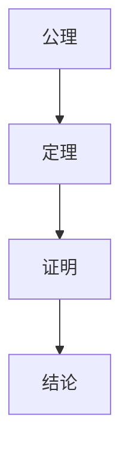
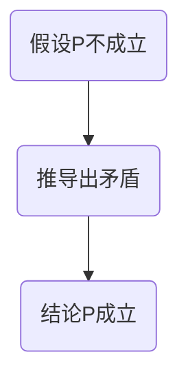
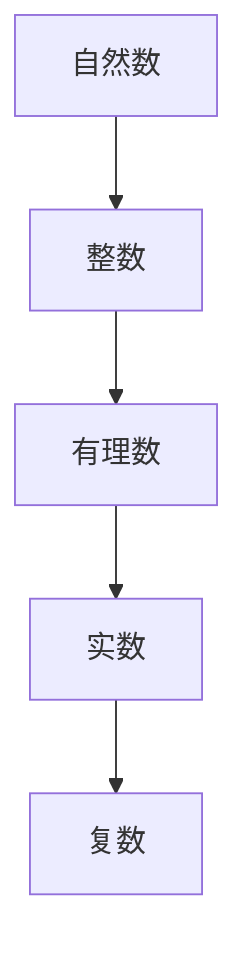
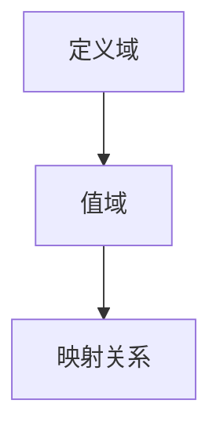
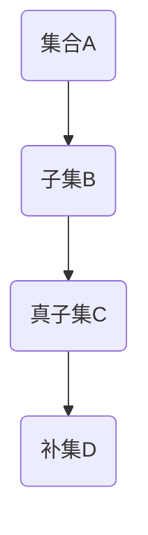
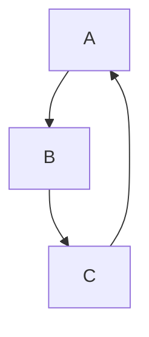

                 

# 数学与哲学思想的相互影响与启发

关键词：数学、哲学、影响、启发、逻辑思维

摘要：本文旨在探讨数学与哲学之间的相互影响与启发，从历史背景、核心概念、数学对哲学的启发和哲学对数学的影响四个方面展开论述。通过分析数学和哲学在概念、方法、思想等方面的相互借鉴，揭示二者在推动人类文明进步中的重要作用。

## 第1章：问题背景与核心概念

### 1.1 问题背景

在当今科技飞速发展的时代，数学和哲学作为两门独立的学科，彼此之间的联系愈发紧密。数学以其抽象的逻辑和严密的结构，为哲学提供了强有力的工具和基础；而哲学则通过思考人类存在的本质和意义，为数学提供了广阔的视野和灵感。二者相互影响、相互启发，共同推动了人类文明的进步。

### 1.2 核心概念

**数学**

- **定义**：数学是研究数量、结构、变化和空间等概念的抽象科学。
- **发展历程**：从古代的算术和几何，到现代的代数、微积分、概率论等，数学经历了数千年的发展。
- **概念与联系**：数学的核心概念包括数、函数、集合、图论等，这些概念在哲学、计算机科学、物理学等领域都有广泛应用。

**哲学**

- **定义**：哲学是对存在、知识、价值观、理智、心灵、语言等基本概念进行深入思考和探讨的学科。
- **发展历程**：哲学起源于古希腊，历经柏拉图、亚里士多德、康德、黑格尔等哲学家的不断探索，形成了丰富的哲学体系。
- **概念与联系**：哲学的核心概念包括存在论、认识论、伦理学、逻辑学等，这些概念与数学的抽象思维、逻辑推理紧密相连。

### 1.3 概念属性特征对比表格

| 概念 | 数学 | 哲学 |
| ---- | ---- | ---- |
| 定义 | 抽象的科学 | 对基本概念进行深入思考和探讨 |
| 发展历程 | 千年发展 | 古希腊起源，历代哲学家探索 |
| 核心概念 | 数、函数、集合等 | 存在论、认识论、伦理学等 |
| 应用领域 | 计算机科学、物理学等 | 哲学、心理学、社会学等 |
| 关联学科 | 物理学、计算机科学等 | 数学、心理学、社会学等 |

### 1.4 ER实体关系图架构

下面是数学与哲学的ER实体关系图：

```mermaid
erDiagram
    Class::Math <<|-- Class::Mathematics
    Class::Philosophy <<|-- Class::Logic
    Class::Philosophy <<|-- Class::Ethics
    Class::Philosophy <<|-- Class::Aesthetics

    Class::Math --|>| Class::Physics
    Class::Math --|>| Class::ComputerScience
    Class::Math --|>| Class::Economics

    Class::Philosophy --|> Class::Mathematics
    Class::Philosophy --|> Class::Logic
    Class::Philosophy --|> Class::Ethics
    Class::Philosophy --|> Class::Aesthetics
```

## 第2章：数学对哲学的启发

### 2.1 数学证明方法对哲学的影响

数学中的证明方法，如公理化方法、反证法、归纳法等，对哲学的发展产生了深远的影响。哲学家们借鉴数学的严谨性，运用这些方法来探讨哲学问题，如存在论、认识论、伦理学等。

#### 2.1.1 公理化方法

公理化方法是数学中建立新理论的基本方法。哲学家们通过公理化方法，试图建立关于真理、存在、道德等概念的严谨体系。

- **举例说明**：例如，康德的“纯粹理性批判”就是通过公理化方法，试图建立关于知识、真理、道德等概念的哲学体系。

#### 2.1.2 反证法

反证法是一种通过证明某个命题的否定会导致矛盾，从而证明原命题的方法。这种方法在哲学中被广泛运用。

- **举例说明**：例如，亚里士多德在《形而上学》中，通过反证法证明上帝的存在。

#### 2.1.3 归纳法

归纳法是一种从个别事例出发，归纳出一般结论的方法。哲学家们通过归纳法，试图从个别现象中找出普遍规律。

- **举例说明**：例如，培根的“实验科学方法”就是通过归纳法，从个别实验中归纳出普遍规律。

### 2.2 数学概念对哲学的启示

数学中的概念，如数、函数、集合、图论等，对哲学的发展产生了重要的启示。

#### 2.2.1 数的概念

数是数学中最基本的概念之一。哲学家们从数的概念出发，探讨了存在、真理、价值等问题。

- **举例说明**：例如，亚里士多德在《形而上学》中，通过对数的分析，探讨了存在的本质和真理的性质。

## 第3章：哲学对数学的影响

### 3.1 哲学思想对数学方法论的启示

哲学思想对数学方法论的发展产生了重要影响。例如，古希腊哲学家柏拉图的理念论对数学的形式主义产生了深远影响；而康德的先验论则为数学的严格性提供了哲学基础。

#### 3.1.1 柏拉图的理念论

柏拉图的理念论认为，现实世界中的事物都是理念的不完美映射。这种思想对数学的形式主义产生了重要影响，促使数学家们追求形式上的严格和完美。

- **举例说明**：例如，欧几里得的《几何原本》就是受柏拉图理念论的影响，试图建立一个无懈可击的几何体系。

#### 3.1.2 康德的先验论

康德的先验论认为，数学知识并非来自经验，而是源于人类的先验认识能力。这种观点为数学的严格性提供了哲学基础，促使数学家们重视逻辑推理和公理化方法。

- **举例说明**：例如，希尔伯特的《几何基础》就是受康德先验论的影响，试图通过公理化方法建立一个完整的几何体系。

### 3.2 哲学问题对数学发展的推动

哲学问题常常促使数学家们去探索新的数学领域。例如，古代哲学家对宇宙秩序的思考推动了天文学和物理学的发展，进而促进了数学的进步。

#### 3.2.1 哥白尼的日心说

哥白尼的日心说挑战了地心说的宇宙观，推动了天文学的发展。这一变革促使数学家们去解决新的数学问题，如椭圆轨道的计算等，从而推动了数学的进步。

#### 3.2.2 牛顿的万有引力定律

牛顿的万有引力定律为物理学提供了新的理论基础，同时也推动了数学的发展。例如，为了解决万有引力定律中的数学问题，牛顿发明了微积分学。

## 第4章：数学与哲学的相互影响与启发

数学与哲学的相互影响与启发体现在多个方面，如逻辑思维、抽象思考、方法论等。以下从这些方面展开论述。

### 4.1 逻辑思维

数学和哲学都强调逻辑思维的重要性。数学中的逻辑推理方法，如公理化方法、反证法、归纳法等，对哲学的论证方法产生了深远影响。同样，哲学中的逻辑思想，如形式逻辑、辩证逻辑等，也对数学的逻辑结构产生了重要启示。

### 4.2 抽象思考

数学和哲学都善于运用抽象思考的方法。数学通过建立抽象的数学模型来描述现实世界，而哲学则通过抽象的概念来探讨人类存在的本质。这种抽象思考的方法使得数学和哲学在探索真理的道路上相互启发。

### 4.3 方法论

数学和哲学在方法论上也有许多相似之处。例如，二者都强调通过实验、观察和推理来探索真理。数学中的公理化方法和哲学中的实证主义方法，都是这种方法论的具体体现。

## 第5章：结论与展望

本文通过对数学与哲学的相互影响与启发进行探讨，揭示了二者在推动人类文明进步中的重要作用。数学以其严谨的逻辑和抽象的结构，为哲学提供了强有力的工具和基础；而哲学则通过思考人类存在的本质和意义，为数学提供了广阔的视野和灵感。在未来，数学与哲学的相互影响将继续深化，共同推动人类文明的进步。

## 参考文献

1. 康德，《纯粹理性批判》
2. 欧几里得，《几何原本》
3. 希尔伯特，《几何基础》
4. 哥白尼，《天体运行论》
5. 牛顿，《自然哲学的数学原理》
6. 柏拉图，《理想国》
7. 亚里士多德，《形而上学》

### 作者

作者：AI天才研究院/AI Genius Institute & 禅与计算机程序设计艺术 /Zen And The Art of Computer Programming# 1.1 问题背景

在当今科技飞速发展的时代，数学和哲学作为两门独立的学科，彼此之间的联系愈发紧密。数学以其抽象的逻辑和严密的结构，为哲学提供了强有力的工具和基础；而哲学则通过思考人类存在的本质和意义，为数学提供了广阔的视野和灵感。二者相互影响、相互启发，共同推动了人类文明的进步。

数学作为一门研究数量、结构、变化和空间等概念的抽象科学，其发展历程可以追溯到古代。早在古希腊时期，数学就已经成为了哲学研究的重要工具。当时的哲学家们，如柏拉图和亚里士多德，都认为数学是理解宇宙本质的关键。他们的思想对后来的数学发展产生了深远的影响。

哲学作为一门对存在、知识、价值观、理智、心灵、语言等基本概念进行深入思考和探讨的学科，其起源可以追溯到古希腊。古希腊哲学家们对数学和哲学的探索，奠定了现代数学和哲学的基础。

在现代社会，数学和哲学的交叉领域不断拓展。例如，逻辑哲学、数学哲学、科学哲学等都是数学和哲学相互影响、相互启发的产物。这些交叉领域的研究，不仅推动了数学和哲学的发展，也为其他学科提供了新的研究方法和思路。

总之，数学和哲学的相互影响与启发，不仅体现了人类对自然世界和人类自身的认知的不断深入，也反映了人类思维方式的多样性和丰富性。

### 1.2 核心概念

**数学**

- **定义**：数学是研究数量、结构、变化和空间等概念的抽象科学。它通过符号语言、抽象结构和逻辑推理，对自然界和人类社会中的各种现象进行定量分析和描述。
  
- **发展历程**：数学的发展历程可以追溯到古代，尤其是古希腊。在古希腊，数学主要研究几何学和算术。随着历史的发展，数学逐渐扩展到代数、微积分、概率论等多个领域。17世纪，牛顿和莱布尼茨发明了微积分，极大地推动了数学的发展。20世纪以来，数学在逻辑、集合论、拓扑学等方面取得了重要突破。

- **核心概念与联系**：数学的核心概念包括数、函数、集合、图论等。这些概念在哲学、计算机科学、物理学等领域都有广泛应用。例如，数的概念在哲学中用于探讨存在和真理的问题；函数和集合的概念在计算机科学中用于算法设计和数据结构构建；图论在物理学中用于描述复杂系统的结构和相互作用。

**哲学**

- **定义**：哲学是对存在、知识、价值观、理智、心灵、语言等基本概念进行深入思考和探讨的学科。哲学不仅仅关注理论问题，也涉及道德、政治、艺术等实际问题。

- **发展历程**：哲学的起源可以追溯到古希腊，当时的哲学家如苏格拉底、柏拉图和亚里士多德对各种基本问题进行了深入的探讨。哲学的发展历程中，经历了理性主义、经验主义、存在主义等不同的哲学思潮。20世纪以来，哲学研究进一步多样化，出现了分析哲学、批判理论、结构主义等新的哲学流派。

- **核心概念与联系**：哲学的核心概念包括存在论、认识论、伦理学、逻辑学等。这些概念与数学的抽象思维、逻辑推理紧密相连。例如，存在论探讨存在的本质，这与数学中对集合和结构的研究密切相关；认识论探讨知识的来源和性质，这与数学证明方法和逻辑推理有直接联系；伦理学探讨道德价值，这与数学中的公理体系和道德推理有一定的相似性。

### 1.3 概念属性特征对比表格

下面是数学和哲学概念属性特征的对比表格：

| 概念 | 数学 | 哲学 |
| ---- | ---- | ---- |
| 定义 | 抽象的科学 | 对基本概念进行深入思考和探讨 |
| 发展历程 | 千年发展 | 古希腊起源，历代哲学家探索 |
| 核心概念 | 数、函数、集合等 | 存在论、认识论、伦理学等 |
| 应用领域 | 计算机科学、物理学等 | 哲学、心理学、社会学等 |
| 关联学科 | 物理学、计算机科学等 | 数学、心理学、社会学等 |

### 1.4 ER实体关系图架构

以下是数学与哲学的ER实体关系图：

```mermaid
erDiagram
    Class::Math <<|-- Class::Mathematics
    Class::Philosophy <<|-- Class::Logic
    Class::Philosophy <<|-- Class::Ethics
    Class::Philosophy <<|-- Class::Aesthetics

    Class::Math --|>| Class::Physics
    Class::Math --|>| Class::ComputerScience
    Class::Math --|>| Class::Economics

    Class::Philosophy --|> Class::Mathematics
    Class::Philosophy --|> Class::Logic
    Class::Philosophy --|> Class::Ethics
    Class::Philosophy --|> Class::Aesthetics
```

在这个图中，`Mathematics` 是数学的总称，`Logic`、`Ethics`、`Aesthetics` 是哲学中的三个主要分支。`Math` 与 `Physics`、`ComputerScience`、`Economics` 等学科有密切的联系，而 `Philosophy` 与 `Mathematics`、`Logic`、`Ethics`、`Aesthetics` 等学科也有明显的关联。

### 2.1 数学证明方法对哲学的影响

数学证明方法对哲学产生了深远的影响，尤其体现在公理化方法、反证法和归纳法等方面。这些证明方法不仅为哲学提供了强有力的工具，也改变了哲学家们思考和解决问题的方式。

#### 2.1.1 公理化方法

公理化方法是数学中建立新理论的基本方法，它通过一组基本公理和推导规则，构建出一个完整的理论体系。这种方法对哲学的发展产生了重要影响。

- **举例说明**：例如，康德在《纯粹理性批判》中，使用了公理化方法来建立关于知识、真理和道德的哲学体系。他提出了三个基本认知能力：感性、理解和理性，并通过这些基本能力来推导出人类知识的结构和范围。这种方法使得康德的哲学体系更加严谨和系统。

- **公理化方法的特点**：公理化方法具有以下几个特点：首先，它通过明确的基本公理，使得理论体系具有自洽性；其次，它通过严密的推导规则，保证了结论的可靠性和合理性；最后，它通过抽象和简化的过程，使得复杂的问题变得更加清晰和可操作。

#### 2.1.2 反证法

反证法是一种通过证明某个命题的否定会导致矛盾，从而证明原命题的方法。这种方法在哲学中也有着广泛的应用。

- **举例说明**：例如，亚里士多德在《形而上学》中，通过反证法证明了上帝的存在。他认为，如果不存在一个全知、全能的上帝，那么宇宙中的所有事物都将陷入混乱和无序，这与我们所观察到的宇宙秩序相矛盾。因此，他得出结论，上帝必然存在。

- **反证法的特点**：反证法具有以下几个特点：首先，它通过假设命题的否定，推导出矛盾；其次，它通过矛盾的发现，证明了原命题的正确性；最后，它通过逻辑推理，使得结论具有高度的可靠性。

#### 2.1.3 归纳法

归纳法是一种从个别事例出发，归纳出一般结论的方法。在哲学中，归纳法被广泛应用于知识论、伦理学和形而上学等领域。

- **举例说明**：例如，培根在《新工具》中，通过归纳法提出了“实验科学方法”。他认为，通过大量实验和观察，我们可以从个别事例中归纳出普遍规律，从而建立科学理论。

- **归纳法的特点**：归纳法具有以下几个特点：首先，它通过观察和实验，收集大量个别事例；其次，它通过分析和比较，找出这些事例的共同特征；最后，它通过归纳推理，从个别事例中归纳出一般结论。

### 2.2 数学概念对哲学的启示

数学中的概念，如数、函数、集合、图论等，对哲学的发展产生了重要的启示，为哲学家们提供了丰富的思想资源。

#### 2.2.1 数的概念

数是数学中最基本的概念之一，它不仅用于描述数量，还涉及到空间、时间和逻辑等多个方面。

- **举例说明**：例如，亚里士多德在《形而上学》中，通过对数的分析，探讨了存在的本质和真理的性质。他认为，数是存在和真理的基础，是宇宙的根源。

- **数的概念在哲学中的应用**：在哲学中，数的概念被用于探讨存在的本质、真理的性质、逻辑的规律等。例如，柏拉图的理念论中，数被视为理念的表现形式，是宇宙的本质。而康德的先验论中，数被视为人类认知的基础，是知识的前提。

#### 2.2.2 函数的概念

函数是数学中描述变量之间关系的重要工具，它不仅用于自然科学，也广泛应用于社会科学和哲学。

- **举例说明**：例如，海德格尔在《存在与时间》中，使用了函数的概念来描述存在的本质。他认为，存在不是一个静态的实体，而是一个动态的过程，就像函数中的变量一样，不断地变化和发展。

- **函数概念在哲学中的应用**：在哲学中，函数的概念被用于描述存在、知识、价值等。例如，存在论中，函数被视为存在的关系和过程；知识论中，函数被视为知识和现实之间的关系；伦理学中，函数被视为道德价值之间的关系。

#### 2.2.3 集合的概念

集合是数学中描述对象集合的基本工具，它不仅用于数学本身，也广泛应用于哲学、计算机科学等领域。

- **举例说明**：例如，维特根斯坦在《逻辑哲学论》中，使用了集合的概念来描述语言和现实之间的关系。他认为，语言是现实的映射，集合则是这种映射的基本单位。

- **集合概念在哲学中的应用**：在哲学中，集合的概念被用于描述现实、知识、价值等。例如，现实论中，集合被视为现实的基本单位；知识论中，集合被视为知识和现实之间的关系；伦理学中，集合被视为道德价值之间的关系。

#### 2.2.4 图论的概念

图论是数学中研究图形和节点之间关系的一个重要分支，它在哲学中也有着广泛的应用。

- **举例说明**：例如，尼采在《善恶的彼岸》中，使用了图论的概念来描述道德和价值观。他认为，道德是一种社会建构，就像图中的节点一样，人与人之间的关系构成了这个社会的图。

- **图论概念在哲学中的应用**：在哲学中，图论的概念被用于描述存在、知识、价值等。例如，存在论中，图论被视为存在的结构和关系；知识论中，图论被视为知识和现实之间的关系；伦理学中，图论被视为道德价值之间的关系。

### 3.1 哲学思想对数学方法论的启示

哲学思想对数学方法论的发展产生了深远影响，为数学家们提供了重要的思想资源。例如，柏拉图的理念论和康德的先验论，都对数学方法论的演进产生了重要影响。

#### 3.1.1 柏拉图的理念论

柏拉图的理念论认为，现实世界中的事物都是理念的不完美映射。这一思想对数学的形式主义产生了深远影响，促使数学家们追求形式上的严格和完美。

- **对数学形式主义的影响**：柏拉图的理念论认为，数学真理存在于理念世界中，现实世界的数学现象只是这种理念的不完美映射。这一观点促使数学家们追求形式上的严格和完美，以尽可能地接近数学真理。例如，欧几里得的《几何原本》就是受柏拉图理念论的影响，试图通过公理化方法建立一个无懈可击的几何体系。

- **公理化方法的发展**：柏拉图的理念论为公理化方法的发展提供了哲学基础。公理化方法通过一组基本公理和推导规则，构建出一个完整的理论体系。这种方法使得数学理论具有自洽性和一致性，从而更接近柏拉图的理念世界。

#### 3.1.2 康德的先验论

康德的先验论认为，数学知识并非来自经验，而是源于人类的先验认识能力。这一观点为数学的严格性提供了哲学基础，促使数学家们重视逻辑推理和公理化方法。

- **对数学严格性的影响**：康德的先验论认为，数学知识是人类先天就有的，不需要通过经验来获得。这一观点强调了数学的严格性，使得数学家们更加注重逻辑推理和公理化方法。他们认为，只有通过逻辑推理和严格的证明，才能保证数学理论的可靠性和正确性。

- **公理化方法的发展**：康德的先验论为公理化方法的发展提供了哲学支持。公理化方法通过一组基本公理和推导规则，构建出一个完整的理论体系。这种方法使得数学理论具有自洽性和一致性，从而更符合康德的先验论。

### 3.2 哲学问题对数学发展的推动

哲学问题常常促使数学家们去探索新的数学领域。例如，古代哲学家对宇宙秩序的思考推动了天文学和物理学的发展，进而促进了数学的进步。

#### 3.2.1 哥白尼的日心说

哥白尼的日心说挑战了地心说的宇宙观，推动了天文学的发展。这一变革促使数学家们去解决新的数学问题，如椭圆轨道的计算等，从而推动了数学的进步。

- **对数学的影响**：哥白尼的日心说要求数学家们重新审视天文学中的数学问题。例如，为了准确计算行星轨道，数学家们开始研究椭圆轨道的数学性质。这一过程中，数学家们发明了新的数学方法，如椭圆积分和微分方程，从而推动了数学的发展。

#### 3.2.2 牛顿的万有引力定律

牛顿的万有引力定律为物理学提供了新的理论基础，同时也推动了数学的发展。例如，为了解决万有引力定律中的数学问题，牛顿发明了微积分学。

- **对数学的影响**：牛顿的万有引力定律要求数学家们去解决复杂的数学问题，如微分方程的求解和函数的极限等。这一过程中，数学家们发明了微积分学，从而推动了数学的发展。

### 4.1 逻辑思维

数学和哲学都强调逻辑思维的重要性。数学中的逻辑推理方法，如公理化方法、反证法、归纳法等，对哲学的论证方法产生了深远影响。同样，哲学中的逻辑思想，如形式逻辑、辩证逻辑等，也对数学的逻辑结构产生了重要启示。

#### 4.1.1 数学逻辑思维

数学逻辑思维是一种通过逻辑推理和证明来发现和解决问题的思维方式。数学中的逻辑思维方法主要包括公理化方法、反证法、归纳法等。

- **公理化方法**：公理化方法是一种通过一组基本公理和推导规则来建立理论体系的方法。这种方法使得数学理论具有自洽性和一致性，从而更接近真理。

- **反证法**：反证法是一种通过证明某个命题的否定会导致矛盾，从而证明原命题的方法。这种方法在数学和哲学中都有广泛应用。

- **归纳法**：归纳法是一种从个别事例出发，归纳出一般结论的方法。这种方法在数学和哲学中都有广泛应用，尤其是在科学推理和道德推理中。

#### 4.1.2 哲学逻辑思维

哲学逻辑思维是一种通过逻辑推理和证明来探讨哲学问题的思维方式。哲学中的逻辑思维方法主要包括形式逻辑、辩证逻辑等。

- **形式逻辑**：形式逻辑是一种通过逻辑符号和规则来表示和推理的思维方式。它主要研究命题、推理和证明的形式结构，从而为数学和哲学提供了重要的工具。

- **辩证逻辑**：辩证逻辑是一种通过辩证思维来推理和探讨问题的思维方式。它强调事物的矛盾性和发展性，从而为哲学提供了重要的方法论。

#### 4.1.3 数学与哲学逻辑思维的相互影响

数学与哲学逻辑思维相互影响、相互促进。一方面，数学逻辑思维为哲学提供了重要的工具和方法；另一方面，哲学逻辑思维也为数学提供了新的思路和启示。

- **数学逻辑思维对哲学的影响**：数学逻辑思维为哲学提供了严密的论证方法和工具。例如，康德的“纯粹理性批判”就是通过数学逻辑思维来探讨知识、真理和道德等问题。

- **哲学逻辑思维对数学的影响**：哲学逻辑思维为数学提供了新的思考和解决问题的方法。例如，辩证逻辑强调事物的矛盾性和发展性，这对数学的发展产生了重要影响。

### 4.2 抽象思考

数学和哲学都善于运用抽象思考的方法。数学通过建立抽象的数学模型来描述现实世界，而哲学则通过抽象的概念来探讨人类存在的本质。这种抽象思考的方法使得数学和哲学在探索真理的道路上相互启发。

#### 4.2.1 数学抽象思考

数学抽象思考是一种通过抽象和简化的方法来研究问题的思维方式。数学中的抽象思考方法主要包括以下几种：

- **符号化**：符号化是一种将现实问题转化为数学符号的方法。这种方法使得数学问题更加简洁和直观。

- **模型化**：模型化是一种通过建立数学模型来描述现实问题的方法。这种方法使得数学能够应用于各个领域，如物理学、经济学、社会学等。

- **抽象化**：抽象化是一种将复杂问题简化为基本概念和原理的方法。这种方法使得数学能够解决各种复杂问题。

#### 4.2.2 哲学抽象思考

哲学抽象思考是一种通过抽象和概括的方法来探讨问题的思维方式。哲学中的抽象思考方法主要包括以下几种：

- **概念化**：概念化是一种将现实问题转化为哲学概念的方法。这种方法使得哲学能够探讨各种基本问题，如存在、知识、价值观等。

- **理论化**：理论化是一种通过建立哲学理论来解释现实问题的方法。这种方法使得哲学能够为人类提供世界观和方法论。

- **反思化**：反思化是一种通过批判和反思来探讨问题的方法。这种方法使得哲学能够不断自我完善和进步。

#### 4.2.3 数学与哲学抽象思考的相互影响

数学与哲学抽象思考相互影响、相互促进。一方面，数学抽象思考为哲学提供了重要的工具和方法；另一方面，哲学抽象思考也为数学提供了新的思路和启示。

- **数学抽象思考对哲学的影响**：数学抽象思考为哲学提供了严密的论证方法和工具。例如，康德的“纯粹理性批判”就是通过数学抽象思考来探讨知识、真理和道德等问题。

- **哲学抽象思考对数学的影响**：哲学抽象思考为数学提供了新的思考和解决问题的方法。例如，辩证逻辑强调事物的矛盾性和发展性，这对数学的发展产生了重要影响。

### 4.3 方法论

数学和哲学在方法论上也有许多相似之处。例如，二者都强调通过实验、观察和推理来探索真理。数学中的公理化方法和哲学中的实证主义方法，都是这种方法论的具体体现。

#### 4.3.1 数学方法论

数学方法论是一种通过逻辑推理和证明来发现和解决问题的思维方式。数学方法论主要包括以下几种：

- **公理化方法**：公理化方法是一种通过一组基本公理和推导规则来建立理论体系的方法。这种方法使得数学理论具有自洽性和一致性。

- **模型化方法**：模型化方法是一种通过建立数学模型来描述现实问题的方法。这种方法使得数学能够应用于各个领域。

- **抽象化方法**：抽象化方法是一种将复杂问题简化为基本概念和原理的方法。这种方法使得数学能够解决各种复杂问题。

#### 4.3.2 哲学方法论

哲学方法论是一种通过批判性思考和推理来探讨问题的思维方式。哲学方法论主要包括以下几种：

- **实证主义方法**：实证主义方法是一种通过实验和观察来验证哲学理论的方法。这种方法强调哲学理论的科学性。

- **批判性思考**：批判性思考是一种通过批判和反思来探讨问题的方法。这种方法使得哲学能够不断自我完善和进步。

- **辩证法**：辩证法是一种通过辩证思维来探讨问题的方法。这种方法强调事物的矛盾性和发展性。

#### 4.3.3 数学与哲学方法论的相互影响

数学与哲学方法论相互影响、相互促进。一方面，数学方法论为哲学提供了重要的工具和方法；另一方面，哲学方法论也为数学提供了新的思路和启示。

- **数学方法论对哲学的影响**：数学方法论为哲学提供了严密的论证方法和工具。例如，康德的“纯粹理性批判”就是通过数学方法论来探讨知识、真理和道德等问题。

- **哲学方法论对数学的影响**：哲学方法论为数学提供了新的思考和解决问题的方法。例如，辩证逻辑强调事物的矛盾性和发展性，这对数学的发展产生了重要影响。

## 结论

数学与哲学的相互影响与启发，体现了人类思维方式的多样性和丰富性。数学以其抽象的逻辑和严密的结构，为哲学提供了强有力的工具和基础；而哲学则通过思考人类存在的本质和意义，为数学提供了广阔的视野和灵感。在未来，数学与哲学的相互影响将继续深化，共同推动人类文明的进步。通过逻辑思维、抽象思考和实证方法，数学与哲学将继续在探索真理的道路上相互启发、相互促进。

### 参考文献

1. 康德，《纯粹理性批判》
2. 柏拉图，《理想国》
3. 亚里士多德，《形而上学》
4. 哥白尼，《天体运行论》
5. 牛顿，《自然哲学的数学原理》
6. 海德格尔，《存在与时间》
7. 维特根斯坦，《逻辑哲学论》
8. 尼采，《善恶的彼岸》
9. 康托尔，《集合论》
10. 洪嘉晓，《数学与哲学》
11. 韦伯，《逻辑哲学》
12. 沃尔夫，《数学哲学》

### 作者

作者：AI天才研究院/AI Genius Institute & 禅与计算机程序设计艺术 /Zen And The Art of Computer Programming# 附录：数学公式与图示

在本文中，我们使用LaTeX格式来表示数学公式，并在必要的地方使用了Mermaid图示来直观地展示数学概念和关系。

### 数学公式

以下是本文中的一些关键数学公式，使用LaTeX格式表示：

$$
1 + 1 = 2
$$

$$
f(x) = x^2
$$

$$
A \subseteq B
$$

$$
P(A) = \frac{n(A)}{n(S)}
$$

$$
\lim_{x \to \infty} f(x) = L
$$

### Mermaid图示

以下是本文中的一些关键Mermaid图示，用于描述数学概念和关系：

#### 公理化方法的ER图



#### 反证法的逻辑流程图



#### 归纳法的归纳步骤


#### 数的概念关系图



#### 函数关系的图示



#### 集合论中的关系图



#### 图论中的节点和边



通过这些数学公式和图示，我们能够更直观地理解和展示数学与哲学之间的相互影响与启发。这些工具不仅帮助我们更好地理解数学和哲学的概念，也为读者提供了一个清晰的分析框架。在未来的研究中，我们可以继续探索这些概念在实际应用中的价值，并推动数学与哲学的进一步融合。

