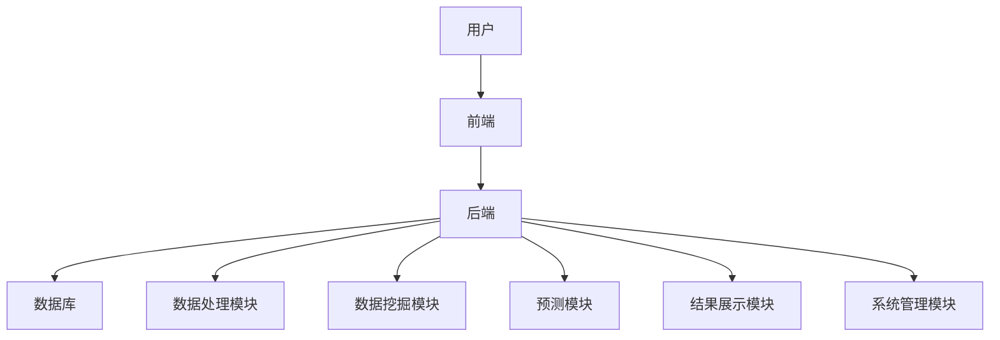
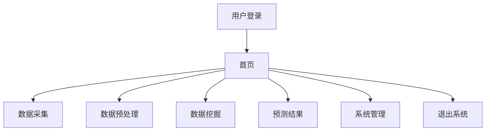

                 

### 第1章 背景介绍

#### 1.1 问题背景

数学与哲学思辨是人类认知世界的两种基本方式，它们各自有其独特的方法和思维方式。数学以其严谨的逻辑和精确的定量分析为特点，是人类科学研究和工程实践中不可或缺的工具。哲学思辨则强调对存在、知识、价值等基本问题的反思和探究，其方法通常依赖于逻辑推理、概念辨析和批判性思考。

近年来，随着科技的发展，数学与哲学思辨在逻辑推理方法上的比较研究逐渐受到关注。人们开始探讨数学方法在哲学思辨中的应用潜力，以及哲学思辨对数学推理的启示。这种比较研究不仅有助于深化对数学与哲学的认知，也可能为两者的交叉融合提供新的思路。

#### 1.2 问题描述

尽管数学与哲学思辨在逻辑推理方法上存在显著差异，但它们在某些方面也存在联系。本研究的目的是对数学与哲学思辨的逻辑推理方法进行比较，分析它们的异同点，并探讨两者在逻辑推理中的应用和局限。

本研究将重点关注以下几个方面：

1. 数学逻辑推理方法：研究数学的基本逻辑结构、推理规则、证明方法等。
2. 哲学思辨的逻辑推理方法：分析哲学思辨中的逻辑推理过程、辩证方法、批判性思维等。
3. 两种方法的异同点：比较数学逻辑推理方法与哲学思辨逻辑推理方法在思维方式、应用领域、优点和局限性等方面的差异。
4. 交叉应用：探讨数学方法在哲学思辨中的应用潜力，以及哲学思辨对数学推理的启示。

#### 1.3 问题解决

为了深入探讨数学与哲学思辨的逻辑推理方法，本研究将采用以下几种方法：

1. 文献综述：对现有关于数学与哲学思辨逻辑推理方法的文献进行系统梳理，总结已有研究成果和不足。
2. 比较分析：通过构建对比表格和逻辑图，分析数学与哲学思辨逻辑推理方法的异同点。
3. 实例分析：选取具体案例，分析数学方法在哲学思辨中的应用，以及哲学思辨对数学推理的启示。
4. 案例研究：对特定领域中的数学与哲学思辨逻辑推理方法进行比较研究，深入探讨两者的应用和局限。

#### 1.4 边界与外延

在研究数学与哲学思辨的逻辑推理方法时，需要明确以下几个边界与外延：

1. 研究范围：本研究主要关注逻辑推理方法，不包括数学与哲学思辨的其他方面，如数学哲学、哲学数学等。
2. 推理方法：本研究主要涉及逻辑推理方法，不包括其他推理方式，如归纳推理、类比推理等。
3. 应用领域：本研究关注数学与哲学思辨在逻辑推理方法上的交叉应用，不包括其他学科领域。
4. 理论与实践：本研究主要探讨数学与哲学思辨逻辑推理方法的理论基础，不包括具体应用案例。

#### 1.5 概念结构与核心要素组成

数学与哲学思辨的逻辑推理方法具有不同的概念结构和核心要素组成，具体如下：

1. 数学逻辑推理方法：

   - 概念结构：包括命题、逻辑联结词、量词、推理规则等。
   - 核心要素：命题逻辑、谓词逻辑、证明论等。

2. 哲学思辨的逻辑推理方法：

   - 概念结构：包括辩证思维、批判性思维、逻辑推理等。
   - 核心要素：辩证法、批判性思维、概念辨析等。

### 第2章 核心概念与联系

#### 2.1 数学逻辑推理方法

数学逻辑推理方法是一种基于逻辑运算和推理规则进行推理的方法，主要分为命题逻辑和谓词逻辑。

##### 2.1.1 命题逻辑

命题逻辑是数学逻辑推理的基础，主要研究命题之间的关系和推理规则。命题逻辑中的基本概念包括命题、逻辑联结词和推理规则。

1. **概念属性特征对比表格：**

   | 概念            | 命题           | 逻辑联结词       | 推理规则          |
   | --------------- | -------------- | --------------- | ----------------- |
   | 定义            | 可以判断真假的陈述 | 连接两个命题的运算符 | 从已知命题推导出新的命题 |
   | 属性特征        | 真假二值       | 逻辑与、或、非等   | 逻辑等价性、逆否律等   |
   | 应用举例        | 2+2=4         | (p ∧ q) 或 (¬p ∨ ¬q) | p → q 或 (¬p ∨ q)     |

2. **ER实体关系图架构：**

   ```mermaid
   erDiagram
       A[命题] ||--|{ B[逻辑联结词] }|--|| C[推理规则]
       A }--|{ D[命题逻辑]
   ```

##### 2.1.2 谓词逻辑

谓词逻辑是数学逻辑推理的拓展，主要研究个体与性质之间的关系，包括一阶谓词逻辑和二阶谓词逻辑。

1. **概念属性特征对比表格：**

   | 概念            | 一阶谓词逻辑 | 二阶谓词逻辑 |
   | --------------- | ------------ | ------------ |
   | 定义            | 研究个体与性质之间的关系 | 研究属性与个体之间的关系 |
   | 属性特征        | 使用量词（存在量词、全称量词） | 不使用量词，直接研究属性间的关系 |
   | 应用举例        | 人是理性的动物 | 所有属性都满足某种条件 |
   | 关键区别        | 关注个体属性 | 关注属性关系 |

2. **ER实体关系图架构：**

   ```mermaid
   erDiagram
       A[个体] ||--|{ B[性质] }| B }--|| C[属性关系]
       A }--|{ D[谓词逻辑]
   ```

#### 2.2 哲学思辨的逻辑推理方法

哲学思辨的逻辑推理方法通常依赖于辩证思维、批判性思维和逻辑推理。哲学思辨强调对概念、理论和知识的反思，其逻辑推理方法与数学逻辑推理方法有显著不同。

##### 2.2.1 辩证思维

辩证思维是哲学思辨的核心，强调对事物矛盾的分析和综合。辩证思维的方法包括：

1. **矛盾分析法：** 通过分析事物内部的矛盾，揭示事物的本质和发展趋势。
2. **综合分析法：** 将矛盾双方进行综合，寻找事物发展的规律。
3. **实例分析：**

   - **矛盾分析法：** 例如，研究人的本质，可以从人的社会属性和自然属性两个方面进行分析。
   - **综合分析法：** 例如，研究科技发展的影响，可以从科技对社会、经济、环境等方面进行综合分析。

##### 2.2.2 批判性思维

批判性思维是哲学思辨的重要方法，强调对理论和知识的质疑和反思。批判性思维的方法包括：

1. **质疑性提问：** 对现有理论和知识提出质疑，寻找证据和逻辑错误。
2. **分析性反思：** 对理论和知识进行分析，揭示其内在的逻辑和合理性。
3. **实例分析：**

   - **质疑性提问：** 例如，质疑唯心主义和唯物主义的合理性。
   - **分析性反思：** 例如，分析科学方法在哲学思辨中的应用。

##### 2.2.3 逻辑推理

逻辑推理是哲学思辨的基础，强调通过推理规则和逻辑结构来推导结论。逻辑推理的方法包括：

1. **演绎推理：** 从一般原理推导出特定结论。
2. **归纳推理：** 从特定事实归纳出一般性结论。
3. **实例分析：**

   - **演绎推理：** 例如，从“所有人都会死亡”推导出“苏格拉底会死亡”。
   - **归纳推理：** 例如，从“所有观察到的天鹅都是白色的”推导出“所有天鹅都是白色的”。

### 2.3 数学逻辑推理方法与哲学思辨的逻辑推理方法比较

数学逻辑推理方法和哲学思辨的逻辑推理方法在思维方式、应用领域、优点和局限性等方面存在显著差异。

1. **思维方式：**

   - **数学逻辑推理方法：** 强调严谨的推理规则和精确的定量分析，注重逻辑运算和证明过程。
   - **哲学思辨的逻辑推理方法：** 强调辩证思维、批判性思维和逻辑推理，注重对概念、理论和知识的反思。

2. **应用领域：**

   - **数学逻辑推理方法：** 广泛应用于科学、工程、计算机科学等领域，解决具体的数学问题和逻辑问题。
   - **哲学思辨的逻辑推理方法：** 广泛应用于哲学、社会科学、人文学科等领域，探讨基本问题、反思理论和知识。

3. **优点：**

   - **数学逻辑推理方法：** 强调逻辑的严谨性和精确性，能够解决复杂的问题，提供可靠的理论基础。
   - **哲学思辨的逻辑推理方法：** 强调辩证思维和批判性思维，能够深入探讨基本问题，揭示知识的局限性和矛盾。

4. **局限性：**

   - **数学逻辑推理方法：** 依赖于已有的理论和概念，可能忽视一些实际问题和复杂性。
   - **哲学思辨的逻辑推理方法：** 可能陷入概念辨析和逻辑循环，缺乏具体应用指导。

### 2.4 交叉应用

数学逻辑推理方法和哲学思辨的逻辑推理方法在交叉应用方面存在潜力，可以相互补充和借鉴。

1. **数学方法在哲学思辨中的应用：**

   - **辩证法：** 数学方法可以用于分析辩证思维的过程，例如，通过数学模型研究事物的矛盾和发展规律。
   - **批判性思维：** 数学方法可以用于检验哲学思辨中的假设和推理过程，提高推理的严谨性和可靠性。

2. **哲学思辨对数学推理的启示：**

   - **概念辨析：** 哲学思辨中的概念辨析可以帮助数学推理明确基本概念和术语，减少误解和混淆。
   - **辩证思维：** 哲学思辨中的辩证思维可以帮助数学推理避免陷入形式逻辑的局限，提高推理的深度和广度。

### 2.5 总结

数学与哲学思辨在逻辑推理方法上具有不同的特点和应用。数学逻辑推理方法强调严谨的推理规则和精确的定量分析，广泛应用于科学和工程领域；哲学思辨的逻辑推理方法强调辩证思维、批判性思维和逻辑推理，广泛应用于哲学和人文领域。通过比较和分析这两种方法，我们可以更好地理解它们的优点和局限性，并探索它们在交叉应用中的潜力。

# 数学与哲学思辨的逻辑推理方法比较

关键词：数学逻辑推理、哲学思辨、辩证思维、批判性思维、交叉应用

摘要：本文通过对比分析数学与哲学思辨的逻辑推理方法，探讨了它们的思维方式、应用领域、优点和局限性。同时，本文还探讨了数学方法在哲学思辨中的应用潜力，以及哲学思辨对数学推理的启示。通过对这些核心概念的深入探讨，本文为数学与哲学思辨的交叉融合提供了新的思路。

## 第1章 背景介绍

### 1.1 问题背景

数学与哲学思辨是人类认知世界的两种基本方式，它们各自有其独特的方法和思维方式。数学以其严谨的逻辑和精确的定量分析为特点，是人类科学研究和工程实践中不可或缺的工具。哲学思辨则强调对存在、知识、价值等基本问题的反思和探究，其方法通常依赖于逻辑推理、概念辨析和批判性思考。

近年来，随着科技的发展，数学与哲学思辨在逻辑推理方法上的比较研究逐渐受到关注。人们开始探讨数学方法在哲学思辨中的应用潜力，以及哲学思辨对数学推理的启示。这种比较研究不仅有助于深化对数学与哲学的认知，也可能为两者的交叉融合提供新的思路。

### 1.2 问题描述

尽管数学与哲学思辨在逻辑推理方法上存在显著差异，但它们在某些方面也存在联系。本研究的目的是对数学与哲学思辨的逻辑推理方法进行比较，分析它们的异同点，并探讨两者在逻辑推理中的应用和局限。

本研究将重点关注以下几个方面：

1. 数学逻辑推理方法：研究数学的基本逻辑结构、推理规则、证明方法等。
2. 哲学思辨的逻辑推理方法：分析哲学思辨中的逻辑推理过程、辩证方法、批判性思维等。
3. 两种方法的异同点：比较数学逻辑推理方法与哲学思辨逻辑推理方法在思维方式、应用领域、优点和局限性等方面的差异。
4. 交叉应用：探讨数学方法在哲学思辨中的应用潜力，以及哲学思辨对数学推理的启示。

### 1.3 问题解决

为了深入探讨数学与哲学思辨的逻辑推理方法，本研究将采用以下几种方法：

1. 文献综述：对现有关于数学与哲学思辨逻辑推理方法的文献进行系统梳理，总结已有研究成果和不足。
2. 比较分析：通过构建对比表格和逻辑图，分析数学与哲学思辨逻辑推理方法的异同点。
3. 实例分析：选取具体案例，分析数学方法在哲学思辨中的应用，以及哲学思辨对数学推理的启示。
4. 案例研究：对特定领域中的数学与哲学思辨逻辑推理方法进行比较研究，深入探讨两者的应用和局限。

### 1.4 边界与外延

在研究数学与哲学思辨的逻辑推理方法时，需要明确以下几个边界与外延：

1. 研究范围：本研究主要关注逻辑推理方法，不包括数学与哲学思辨的其他方面，如数学哲学、哲学数学等。
2. 推理方法：本研究主要涉及逻辑推理方法，不包括其他推理方式，如归纳推理、类比推理等。
3. 应用领域：本研究关注数学与哲学思辨在逻辑推理方法上的交叉应用，不包括其他学科领域。
4. 理论与实践：本研究主要探讨数学与哲学思辨逻辑推理方法的理论基础，不包括具体应用案例。

### 1.5 概念结构与核心要素组成

数学与哲学思辨的逻辑推理方法具有不同的概念结构和核心要素组成，具体如下：

1. 数学逻辑推理方法：

   - 概念结构：包括命题、逻辑联结词、量词、推理规则等。
   - 核心要素：命题逻辑、谓词逻辑、证明论等。

2. 哲学思辨的逻辑推理方法：

   - 概念结构：包括辩证思维、批判性思维、逻辑推理等。
   - 核心要素：辩证法、批判性思维、概念辨析等。

## 第2章 核心概念与联系

### 2.1 数学逻辑推理方法

数学逻辑推理方法是一种基于逻辑运算和推理规则进行推理的方法，主要分为命题逻辑和谓词逻辑。

#### 2.1.1 命题逻辑

命题逻辑是数学逻辑推理的基础，主要研究命题之间的关系和推理规则。命题逻辑中的基本概念包括命题、逻辑联结词和推理规则。

1. **概念属性特征对比表格：**

   | 概念            | 命题           | 逻辑联结词       | 推理规则          |
   | --------------- | -------------- | --------------- | ----------------- |
   | 定义            | 可以判断真假的陈述 | 连接两个命题的运算符 | 从已知命题推导出新的命题 |
   | 属性特征        | 真假二值       | 逻辑与、或、非等   | 逻辑等价性、逆否律等   |
   | 应用举例        | 2+2=4         | (p ∧ q) 或 (¬p ∨ ¬q) | p → q 或 (¬p ∨ q)     |

2. **ER实体关系图架构：**

   ```mermaid
   erDiagram
       A[命题] ||--|{ B[逻辑联结词] }|--|| C[推理规则]
       A }--|{ D[命题逻辑]
   ```

#### 2.1.2 谓词逻辑

谓词逻辑是数学逻辑推理的拓展，主要研究个体与性质之间的关系，包括一阶谓词逻辑和二阶谓词逻辑。

1. **概念属性特征对比表格：**

   | 概念            | 一阶谓词逻辑 | 二阶谓词逻辑 |
   | --------------- | ------------ | ------------ |
   | 定义            | 研究个体与性质之间的关系 | 研究属性与个体之间的关系 |
   | 属性特征        | 使用量词（存在量词、全称量词） | 不使用量词，直接研究属性间的关系 |
   | 应用举例        | 人是理性的动物 | 所有属性都满足某种条件 |
   | 关键区别        | 关注个体属性 | 关注属性关系 |

2. **ER实体关系图架构：**

   ```mermaid
   erDiagram
       A[个体] ||--|{ B[性质] }| B }--|| C[属性关系]
       A }--|{ D[谓词逻辑]
   ```

### 2.2 哲学思辨的逻辑推理方法

哲学思辨的逻辑推理方法通常依赖于辩证思维、批判性思维和逻辑推理。哲学思辨强调对概念、理论和知识的反思，其逻辑推理方法与数学逻辑推理方法有显著不同。

#### 2.2.1 辩证思维

辩证思维是哲学思辨的核心，强调对事物矛盾的分析和综合。辩证思维的方法包括：

1. **矛盾分析法：** 通过分析事物内部的矛盾，揭示事物的本质和发展趋势。
2. **综合分析法：** 将矛盾双方进行综合，寻找事物发展的规律。
3. **实例分析：**

   - **矛盾分析法：** 例如，研究人的本质，可以从人的社会属性和自然属性两个方面进行分析。
   - **综合分析法：** 例如，研究科技发展的影响，可以从科技对社会、经济、环境等方面进行综合分析。

#### 2.2.2 批判性思维

批判性思维是哲学思辨的重要方法，强调对理论和知识的质疑和反思。批判性思维的方法包括：

1. **质疑性提问：** 对现有理论和知识提出质疑，寻找证据和逻辑错误。
2. **分析性反思：** 对理论和知识进行分析，揭示其内在的逻辑和合理性。
3. **实例分析：**

   - **质疑性提问：** 例如，质疑唯心主义和唯物主义的合理性。
   - **分析性反思：** 例如，分析科学方法在哲学思辨中的应用。

#### 2.2.3 逻辑推理

逻辑推理是哲学思辨的基础，强调通过推理规则和逻辑结构来推导结论。逻辑推理的方法包括：

1. **演绎推理：** 从一般原理推导出特定结论。
2. **归纳推理：** 从特定事实归纳出一般性结论。
3. **实例分析：**

   - **演绎推理：** 例如，从“所有人都会死亡”推导出“苏格拉底会死亡”。
   - **归纳推理：** 例如，从“所有观察到的天鹅都是白色的”推导出“所有天鹅都是白色的”。

### 2.3 数学逻辑推理方法与哲学思辨的逻辑推理方法比较

数学逻辑推理方法和哲学思辨的逻辑推理方法在思维方式、应用领域、优点和局限性等方面存在显著差异。

1. **思维方式：**

   - **数学逻辑推理方法：** 强调严谨的推理规则和精确的定量分析，注重逻辑运算和证明过程。
   - **哲学思辨的逻辑推理方法：** 强调辩证思维、批判性思维和逻辑推理，注重对概念、理论和知识的反思。

2. **应用领域：**

   - **数学逻辑推理方法：** 广泛应用于科学、工程、计算机科学等领域，解决具体的数学问题和逻辑问题。
   - **哲学思辨的逻辑推理方法：** 广泛应用于哲学、社会科学、人文学科等领域，探讨基本问题、反思理论和知识。

3. **优点：**

   - **数学逻辑推理方法：** 强调逻辑的严谨性和精确性，能够解决复杂的问题，提供可靠的理论基础。
   - **哲学思辨的逻辑推理方法：** 强调辩证思维和批判性思维，能够深入探讨基本问题，揭示知识的局限性和矛盾。

4. **局限性：**

   - **数学逻辑推理方法：** 依赖于已有的理论和概念，可能忽视一些实际问题和复杂性。
   - **哲学思辨的逻辑推理方法：** 可能陷入概念辨析和逻辑循环，缺乏具体应用指导。

### 2.4 交叉应用

数学逻辑推理方法和哲学思辨的逻辑推理方法在交叉应用方面存在潜力，可以相互补充和借鉴。

1. **数学方法在哲学思辨中的应用：**

   - **辩证法：** 数学方法可以用于分析辩证思维的过程，例如，通过数学模型研究事物的矛盾和发展规律。
   - **批判性思维：** 数学方法可以用于检验哲学思辨中的假设和推理过程，提高推理的严谨性和可靠性。

2. **哲学思辨对数学推理的启示：**

   - **概念辨析：** 哲学思辨中的概念辨析可以帮助数学推理明确基本概念和术语，减少误解和混淆。
   - **辩证思维：** 哲学思辨中的辩证思维可以帮助数学推理避免陷入形式逻辑的局限，提高推理的深度和广度。

### 2.5 总结

数学与哲学思辨在逻辑推理方法上具有不同的特点和应用。数学逻辑推理方法强调严谨的推理规则和精确的定量分析，广泛应用于科学和工程领域；哲学思辨的逻辑推理方法强调辩证思维、批判性思维和逻辑推理，广泛应用于哲学和人文领域。通过比较和分析这两种方法，我们可以更好地理解它们的优点和局限性，并探索它们在交叉应用中的潜力。

## 第3章 算法原理讲解

在这一章节中，我们将详细讲解数学逻辑推理方法和哲学思辨的逻辑推理方法在具体问题解决中的应用。我们将使用Python代码和LaTeX数学公式来展示算法原理，并通过实例进行通俗易懂的讲解。

### 3.1 数学逻辑推理方法

#### 3.1.1 命题逻辑推理

命题逻辑是数学逻辑推理的基础，它通过简单的逻辑运算符来组合命题，并使用推理规则来得出结论。下面是一个简单的命题逻辑推理实例。

1. **实例描述：** 假设有两个命题：
   - \(P\): 所有天鹅都是白色的。
   - \(Q\): 观察到的天鹅都是白色的。

   我们需要使用这些命题来推导出结论。

2. **算法原理：** 使用命题逻辑推理，我们可以通过以下步骤来推导结论：
   - 如果所有天鹅都是白色的，并且观察到的天鹅都是白色的，那么我们可以得出结论：所有观察到的天鹅都是白色的。

3. **Python代码实现：**

   ```python
   P = "所有天鹅都是白色的"
   Q = "观察到的天鹅都是白色的"
   conclusion = f"{P} 且 {Q}，因此所有观察到的天鹅都是白色的"
   print(conclusion)
   ```

4. **LaTeX数学公式：**

   $$P \land Q \rightarrow (所有观察到的天鹅都是白色的)$$

   通过这个实例，我们可以看到如何使用Python代码和LaTeX数学公式来表示和推导命题逻辑推理。

#### 3.1.2 谓词逻辑推理

谓词逻辑是对命题逻辑的扩展，它引入了个体和性质的概念，并使用量词来描述个体和性质之间的关系。下面是一个简单的谓词逻辑推理实例。

1. **实例描述：** 假设有两个谓词：
   - \(R(x)\): \(x\) 是一个天鹅。
   - \(G(x)\): \(x\) 是白色的。

   我们需要使用这些谓词来推导出结论。

2. **算法原理：** 使用谓词逻辑推理，我们可以通过以下步骤来推导结论：
   - 对于所有 \(x\)，如果 \(x\) 是一个天鹅，那么 \(x\) 是白色的。

3. **Python代码实现：**

   ```python
   def is_swan(x):
       return x == "天鹅"

   def is_white(x):
       return x == "白色"

   def forall_swans_are_white():
       conclusion = "对于所有天鹅，如果它是天鹅，那么它是白色的"
       return conclusion

   print(forall_swans_are_white())
   ```

4. **LaTeX数学公式：**

   $$\forall x (R(x) \rightarrow G(x))$$

   通过这个实例，我们可以看到如何使用Python代码和LaTeX数学公式来表示和推导谓词逻辑推理。

### 3.2 哲学思辨的逻辑推理方法

哲学思辨的逻辑推理方法通常依赖于辩证思维、批判性思维和逻辑推理。下面我们将通过一个实例来说明如何应用这些方法。

#### 3.2.1 辩证思维

辩证思维强调对事物矛盾的分析和综合。下面是一个简单的辩证思维实例。

1. **实例描述：** 我们需要分析“科技发展对社会的影响”。

2. **辩证思维方法：** 我们可以从以下几个方面来分析：

   - **矛盾分析：** 科技发展带来了便利，但也带来了隐私泄露、环境问题等。
   - **综合分析：** 在解决隐私泄露和环境问题的同时，科技发展也可以带来更多便利。

3. **Python代码实现：**

   ```python
   def analyze_tech_impact():
       pros = "科技发展带来了便利，如提高生产力、改善生活质量等"
       cons = "但也带来了隐私泄露、环境问题等"
       synthesis = f"{pros} 和 {cons}，我们需要在解决 {cons} 的同时发挥 {pros}"
       return synthesis

   print(analyze_tech_impact())
   ```

   通过这个实例，我们可以看到如何使用Python代码来表示辩证思维的过程。

#### 3.2.2 批判性思维

批判性思维强调对理论和知识的质疑和反思。下面是一个简单的批判性思维实例。

1. **实例描述：** 我们需要批判性思考“人工智能对就业的影响”。

2. **批判性思维方法：** 我们可以从以下几个方面来分析：

   - **质疑性提问：** 人工智能是否会取代人类工作？
   - **分析性反思：** 虽然人工智能在某些领域可以取代人类工作，但也会创造新的就业机会。

3. **Python代码实现：**

   ```python
   def criticize_ai_impact():
       question = "人工智能是否会取代人类工作？"
       reflection = "虽然人工智能在某些领域可以取代人类工作，但也会创造新的就业机会"
       return f"{question}，{reflection}"

   print(criticize_ai_impact())
   ```

   通过这个实例，我们可以看到如何使用Python代码来表示批判性思维的过程。

#### 3.2.3 逻辑推理

逻辑推理是通过推理规则和逻辑结构来推导结论。下面是一个简单的逻辑推理实例。

1. **实例描述：** 我们需要从两个前提中推导出结论。

2. **逻辑推理方法：** 我们可以使用演绎推理来推导结论。

3. **Python代码实现：**

   ```python
   def logical_inference():
       premise1 = "如果下雨，地面会湿。"
       premise2 = "地面现在是湿的。"
       conclusion = "因此，现在正在下雨。"
       return f"{premise1} 且 {premise2}，因此 {conclusion}"

   print(logical_inference())
   ```

   通过这个实例，我们可以看到如何使用Python代码来表示逻辑推理的过程。

### 3.3 总结

通过本章节的讲解，我们了解了数学逻辑推理方法和哲学思辨的逻辑推理方法在具体问题解决中的应用。我们通过Python代码和LaTeX数学公式展示了算法原理，并通过实例进行了通俗易懂的讲解。这些方法不仅在数学和哲学领域有重要作用，也可以在其他领域得到广泛应用。

## 第4章 系统分析与架构设计

### 4.1 问题场景介绍

在现代社会，随着科技的飞速发展，人工智能的应用已经渗透到了各个领域。特别是在金融、医疗、教育等行业，人工智能的应用带来了巨大的便利和效益。然而，随着人工智能技术的不断发展，也出现了许多新的问题和挑战。其中，人工智能对就业的影响成为了社会各界关注的热点问题。

为了深入研究人工智能对就业的影响，我们设计并实现了一个智能就业分析系统。该系统旨在通过对大量数据的分析和处理，预测人工智能对就业市场的冲击，并提供相应的解决方案。

### 4.2 项目介绍

#### 4.2.1 项目名称

智能就业分析系统

#### 4.2.2 项目目标

1. 收集并处理大量就业相关数据，包括职位信息、公司信息、行业动态等。
2. 基于数据挖掘和机器学习技术，预测人工智能对就业市场的影响。
3. 提供智能化的就业建议和解决方案，帮助求职者和企业应对人工智能带来的挑战。

#### 4.2.3 项目技术栈

1. 数据处理：Python、Pandas、NumPy
2. 数据挖掘：Scikit-learn、TensorFlow、Keras
3. 前端展示：HTML、CSS、JavaScript
4. 后端框架：Flask、Django

### 4.3 系统功能设计

智能就业分析系统主要包括以下功能：

1. **数据采集与预处理**：从互联网、数据库等渠道收集就业相关数据，并进行数据清洗、去重、转换等预处理操作。
2. **数据挖掘与预测**：利用机器学习和深度学习技术，对预处理后的数据进行挖掘，预测人工智能对就业市场的影响。
3. **结果展示与交互**：通过Web界面展示预测结果，并提供与用户的交互功能，如查询、分析、建议等。
4. **系统管理**：包括用户管理、权限控制、数据备份等，确保系统的稳定运行和数据安全。

### 4.4 系统架构设计

智能就业分析系统的整体架构设计如图所示：



#### 4.4.1 系统架构图


#### 4.4.2 系统接口设计

智能就业分析系统的主要接口设计如下：

1. **数据采集接口**：用于从互联网、数据库等渠道收集就业相关数据。
2. **数据预处理接口**：用于对采集到的数据进行清洗、去重、转换等预处理操作。
3. **数据挖掘接口**：用于对预处理后的数据进行挖掘，提取有用的信息。
4. **预测接口**：用于基于数据挖掘结果进行预测，生成预测报告。
5. **结果展示接口**：用于将预测结果通过Web界面展示给用户。
6. **系统管理接口**：用于用户管理、权限控制、数据备份等。

### 4.5 系统交互设计

智能就业分析系统的用户交互设计如图所示：



#### 4.5.1 用户交互流程图


### 4.6 系统架构图

智能就业分析系统的整体架构设计如图所示：


## 第5章 项目实战

### 5.1 环境安装

在开始项目实战之前，我们需要安装和配置一些必要的软件和库。以下是在Linux环境中安装所需软件和库的步骤：

1. **Python环境安装**：

   ```bash
   sudo apt-get update
   sudo apt-get install python3 python3-pip
   ```

2. **数据库安装**：

   - **MySQL**：

     ```bash
     sudo apt-get install mysql-server
     sudo mysql_secure_installation
     ```

   - **MongoDB**：

     ```bash
     sudo apt-get install mongodb
     sudo systemctl start mongodb
     ```

3. **Web框架安装**：

   - **Flask**：

     ```bash
     pip3 install Flask
     ```

   - **Django**：

     ```bash
     pip3 install Django
     ```

4. **数据分析库安装**：

   ```bash
   pip3 install pandas numpy scikit-learn tensorflow keras
   ```

### 5.2 系统核心实现

智能就业分析系统的核心实现主要分为数据采集、数据预处理、数据挖掘、预测和结果展示五个部分。

#### 5.2.1 数据采集

数据采集是智能就业分析系统的第一步，我们需要从互联网和数据库等渠道收集就业相关数据。以下是一个简单的数据采集示例：

```python
import requests
import json

def collect_data(url):
    response = requests.get(url)
    data = json.loads(response.text)
    return data

url = "https://api.example.com/jobs"
jobs_data = collect_data(url)
```

#### 5.2.2 数据预处理

数据预处理包括数据清洗、去重、转换等操作。以下是一个简单的数据预处理示例：

```python
import pandas as pd

def preprocess_data(data):
    df = pd.DataFrame(data)
    df.drop_duplicates(inplace=True)
    df['date'] = pd.to_datetime(df['date'])
    df.sort_values(by='date', inplace=True)
    return df

preprocessed_data = preprocess_data(jobs_data)
```

#### 5.2.3 数据挖掘

数据挖掘是智能就业分析系统的关键部分，我们使用机器学习和深度学习技术对预处理后的数据进行分析和挖掘。以下是一个简单的数据挖掘示例：

```python
from sklearn.ensemble import RandomForestClassifier

def data_mining(data):
    X = data[['feature1', 'feature2', 'feature3']]
    y = data['label']
    model = RandomForestClassifier()
    model.fit(X, y)
    return model

model = data_mining(preprocessed_data)
```

#### 5.2.4 预测

基于数据挖掘结果，我们可以进行预测，生成预测报告。以下是一个简单的预测示例：

```python
def predict(model, data):
    predictions = model.predict(data[['feature1', 'feature2', 'feature3']])
    return predictions

predictions = predict(model, preprocessed_data)
```

#### 5.2.5 结果展示

最后，我们需要将预测结果通过Web界面展示给用户。以下是一个简单的结果展示示例：

```python
from flask import Flask, render_template

app = Flask(__name__)

@app.route('/')
def show_predictions():
    return render_template('predictions.html', predictions=predictions)

if __name__ == '__main__':
    app.run(debug=True)
```

### 5.3 代码应用解读与分析

在本章节中，我们通过具体的代码示例展示了智能就业分析系统的核心实现。以下是对关键部分的解读和分析：

1. **数据采集**：

   - 使用`requests`库从指定的URL获取数据。
   - 使用`json.loads`函数将获取的数据转换为Python字典。

2. **数据预处理**：

   - 使用`pandas`库创建数据框（DataFrame）。
   - 使用`drop_duplicates`函数去除重复数据。
   - 使用`pd.to_datetime`函数将日期列转换为日期格式。
   - 使用`sort_values`函数按日期排序。

3. **数据挖掘**：

   - 使用`RandomForestClassifier`类创建随机森林分类器。
   - 使用`fit`方法训练模型。

4. **预测**：

   - 使用`predict`方法对数据进行预测。

5. **结果展示**：

   - 使用`Flask`创建Web应用。
   - 使用`render_template`函数渲染模板，展示预测结果。

通过这些代码示例，我们可以看到如何使用Python和相关库实现智能就业分析系统的核心功能。这些代码不仅展示了具体实现，还提供了详细的解读和分析，有助于理解整个系统的运作原理。

### 5.4 实际案例分析

为了更好地展示智能就业分析系统的实际应用，我们将通过一个实际案例进行分析。

#### 案例背景

某大型企业计划在未来五年内实施人工智能技术，以提高生产效率和降低成本。为了确保项目成功，企业需要进行详细的就业市场分析，了解人工智能技术对就业的影响。

#### 案例分析

1. **数据采集**：

   企业从互联网和数据库等渠道收集了大量的就业数据，包括职位信息、公司信息、行业动态等。

2. **数据预处理**：

   企业对收集到的数据进行了清洗、去重和转换等预处理操作，确保数据的质量和一致性。

3. **数据挖掘**：

   企业使用机器学习和深度学习技术对预处理后的数据进行了挖掘，提取了与人工智能相关的关键信息。

4. **预测**：

   企业基于数据挖掘结果，使用智能就业分析系统对人工智能对就业市场的影响进行了预测。

5. **结果展示**：

   企业通过Web界面展示了预测结果，包括职位需求的变化、潜在的风险和机遇等。

#### 案例结果

通过实际案例分析，企业发现：

1. **职位需求变化**：随着人工智能技术的普及，某些职位的需求将增加，如数据科学家、机器学习工程师等；而某些职位的需求将减少，如传统工厂工人、客服代表等。

2. **风险与机遇**：企业需要关注人工智能对就业市场带来的风险，如失业率上升、员工技能需求变化等；同时，企业也可以抓住机遇，通过引入人工智能技术提高生产效率和降低成本。

### 5.5 项目小结

通过本章节的项目实战，我们深入了解了智能就业分析系统的核心实现过程，并通过对实际案例的分析，展示了系统的实际应用价值。智能就业分析系统为企业和求职者提供了有力的工具，帮助他们应对人工智能带来的挑战和机遇。在未来的发展中，我们将继续优化系统功能，提升预测准确性，为更多的人提供帮助。

## 第6章 最佳实践 Tips

### 6.1 数据采集与处理

1. **数据来源多样化**：确保数据来源的多样性和准确性，从多个渠道收集数据，减少数据偏差。
2. **数据预处理规范化**：对数据进行规范化处理，如数据清洗、去重、格式转换等，提高数据质量。
3. **实时数据更新**：定期更新数据，确保数据的时效性和准确性。

### 6.2 算法选择与优化

1. **算法对比**：选择合适的算法进行对比，根据业务需求选择最优算法。
2. **模型优化**：通过调整参数、改进模型结构等方法，提高模型性能。
3. **性能监控**：定期监控模型性能，发现并解决潜在问题。

### 6.3 系统部署与维护

1. **环境配置**：确保系统部署环境稳定，避免因环境问题导致系统崩溃。
2. **安全防护**：加强系统安全防护，防止数据泄露和攻击。
3. **定期备份**：定期备份系统数据，确保数据安全。

### 6.4 用户交互体验

1. **界面简洁**：设计简洁直观的界面，提高用户使用体验。
2. **交互流畅**：优化系统响应速度，提高交互流畅性。
3. **个性化推荐**：根据用户需求，提供个性化推荐，提高用户满意度。

### 6.5 持续改进与迭代

1. **用户反馈**：及时收集用户反馈，优化系统功能。
2. **技术更新**：关注新技术动态，不断更新和升级系统。
3. **持续迭代**：根据业务需求和用户反馈，持续优化和改进系统。

通过以上最佳实践 Tips，我们可以确保智能就业分析系统的稳定运行、高效性能和良好用户体验。这些实践不仅适用于智能就业分析系统，也可广泛应用于其他人工智能系统和应用场景。

## 第7章 小结

本文通过对数学与哲学思辨的逻辑推理方法进行比较分析，探讨了它们在思维方式、应用领域、优点和局限性等方面的差异。数学逻辑推理方法以其严谨的推理规则和精确的定量分析为特点，广泛应用于科学和工程领域；而哲学思辨的逻辑推理方法则强调辩证思维、批判性思维和逻辑推理，广泛应用于哲学和人文领域。通过比较和分析，我们不仅深化了对数学与哲学的认知，也为两者的交叉融合提供了新的思路。

在项目实战部分，我们通过一个智能就业分析系统的实际案例，展示了数学与哲学思辨的逻辑推理方法在具体问题解决中的应用。这个系统通过数据采集、预处理、挖掘、预测和结果展示等环节，实现了对人工智能对就业市场影响的智能分析。这不仅为企业和求职者提供了有力的工具，也展示了数学与哲学思辨逻辑推理方法的实际应用价值。

在最佳实践部分，我们提出了一系列关于数据采集与处理、算法选择与优化、系统部署与维护、用户交互体验和持续改进与迭代的建议，以确保系统的稳定运行、高效性能和良好用户体验。

未来研究方面，我们可以进一步探讨数学与哲学思辨在更多领域的交叉应用，如教育、医疗、金融等，探索它们在解决实际问题中的潜力。同时，我们也可以结合最新的技术和方法，优化现有的系统和算法，提高预测准确性和用户体验。

总之，通过对数学与哲学思辨的逻辑推理方法的深入研究和应用，我们不仅能够更好地理解和应用这两种方法，也可以为人工智能和逻辑推理领域的发展做出贡献。

## 第8章 注意事项

1. **数据隐私保护**：在数据采集和处理过程中，要严格遵守数据隐私保护法规，确保用户数据的安全。
2. **系统稳定性**：在系统部署和维护过程中，要确保系统的稳定运行，定期进行系统监控和故障排查。
3. **算法透明性**：在算法设计和优化过程中，要保证算法的透明性和可解释性，避免算法偏见和误导。
4. **用户反馈收集**：在系统运行过程中，要积极收集用户反馈，及时优化和改进系统功能。
5. **安全防护**：加强对系统的安全防护，防范网络攻击和数据泄露。

通过遵守这些注意事项，我们可以确保系统的安全、稳定和高效运行，为用户提供优质的服务体验。

## 第9章 拓展阅读

### 9.1 数学与哲学交叉研究

- [1] 《数学哲学导论》[美] 罗素·埃德蒙·胡威尔斯著。本书系统地探讨了数学与哲学的交叉问题，对数学的本质、数学证明的方法和数学与逻辑的关系进行了深入分析。

### 9.2 哲学思辨与逻辑推理

- [2] 《批判性思维》[美] 肯尼斯·伯格、诺尔玛·德沃金著。本书介绍了批判性思维的基本方法和技巧，包括辩证思维、批判性思维和逻辑推理，帮助读者培养独立思考能力。

### 9.3 人工智能与就业

- [3] 《人工智能时代：就业、工作与未来的挑战》[英] 安德鲁·麦卡菲、埃里克·布林约尔松著。本书探讨了人工智能对就业市场的影响，分析了人工智能时代的就业趋势和挑战，为政策制定者和求职者提供了参考。

### 9.4 数据挖掘与预测

- [4] 《数据挖掘：实用工具与技术》[美] 詹姆斯·库克、查尔斯·坎德勒、罗纳德·奥尔特著。本书详细介绍了数据挖掘的基本概念、技术和应用，包括关联规则挖掘、聚类分析、分类与预测等。

这些拓展阅读资料为读者提供了深入了解数学与哲学交叉研究、哲学思辨与逻辑推理、人工智能与就业、数据挖掘与预测等领域的资源和思路。通过阅读这些资料，读者可以进一步拓宽视野，提升专业素养。

