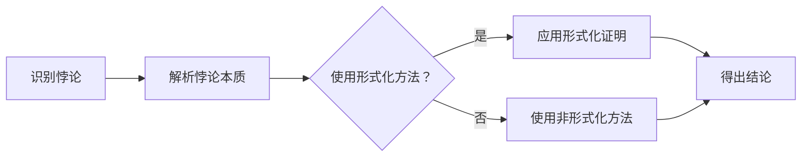
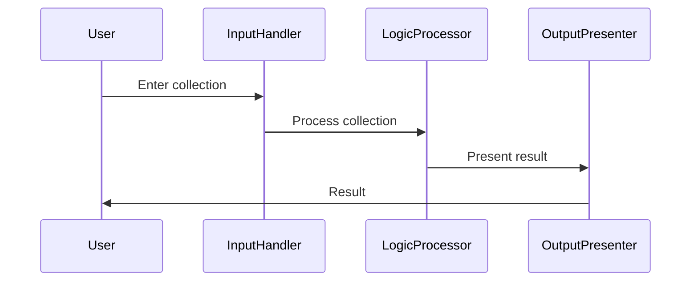

                 

### 《数学与哲学悖论的数学解释》

> 关键词：数学悖论、哲学、形式化方法、非形式化方法、数学模型、系统架构设计

> 摘要：本文旨在通过深入探讨数学与哲学中的悖论现象，运用数学解释方法对哲学悖论进行剖析，揭示数学与哲学之间的紧密联系。通过对数学悖论的历史演变、核心概念解析以及算法原理讲解，本文将展示数学如何为哲学提供逻辑工具，进而深入理解哲学中的悖论问题。

----------------------------------------------------------------

## 第一部分：问题背景与核心概念

### 1. 引言

数学与哲学，作为人类智慧的两大瑰宝，自古以来就存在着密不可分的联系。数学作为逻辑严谨、结构化的科学，提供了对自然界和人类思维精确描述的工具；而哲学则通过深邃的思考探究宇宙、人生和理性的本质。然而，在数学与哲学的交汇点上，悖论这一现象成为了引发两者激烈碰撞的火花。

悖论，通常被定义为自相矛盾或不符合逻辑的陈述。在数学中，悖论的出现挑战了数学的严谨性和基础，引发了数学基础变革和哲学的反思；在哲学中，悖论往往引发了对知识、真理、逻辑和语言本质的深刻探讨。本文将重点探讨数学与哲学中的悖论现象，运用数学解释方法对这些悖论进行深入分析。

### 2. 数学悖论的历史演变

数学悖论的历史可以追溯到古希腊时期。其中最著名的悖论之一是毕达哥拉斯悖论，即无法用整数量来表示直角三角形的斜边长度。这一悖论引发了数学家对无理数的深入研究。在19世纪末，集合论悖论如柏拉图悖论和罗素悖论相继被发现，这些悖论挑战了数学基础，导致了形式化数学和直觉主义数学的兴起。

现代数学中的悖论，如连续统悖论和布尔悖论，继续在数学哲学中引发争议。这些悖论不仅丰富了数学的理论体系，也为哲学提供了反思逻辑和知识的契机。

### 3. 数学悖论对数学发展的影响

数学悖论的出现对数学发展产生了深远的影响。首先，悖论的发现促使数学家重新审视数学的基础，推动了形式化数学的兴起。形式化数学强调公理体系和严格证明，以避免悖论的出现。其次，数学悖论引发了数学哲学的反思，促使数学家们思考数学的本质和逻辑结构。

数学悖论还推动了数学的分支发展，如集合论、数理逻辑和模型论。通过解决悖论，数学家们不仅深化了对数学基础的理解，也扩展了数学的应用范围。

## 第二部分：核心概念与联系

### 4. 数学基础概念解析

为了深入理解数学悖论，我们需要首先解析数学中的基础概念。数学公理是构建数学体系的基石，它们是无需证明的基本原理。数学定理则是基于公理推导出的结论，它们构成了数学理论的框架。数学基础概念包括集合论、数论、几何学、代数学等，它们共同构建了一个逻辑严密、结构化的数学体系。

### 5. 数学悖论的分析方法

分析数学悖论通常有两种方法：形式化方法和非形式化方法。形式化方法通过严格的数学语言和逻辑推导，对悖论进行形式化的描述和分析。这种方法强调公理体系和严格的证明过程，有助于揭示悖论的内在矛盾。非形式化方法则通过直观的思考和对数学直觉的理解，对悖论进行解释和说明。这种方法虽然不够严格，但有助于我们更好地理解悖论的本质。

### 6. 数学悖论的核心概念对比

为了更好地理解数学悖论，我们可以通过对比表格和ER实体关系图架构来展示核心概念之间的联系。

#### 对比表格

| 悖论名称 | 描述 | 影响 |
| --- | --- | --- |
| 毕达哥拉斯悖论 | 无理数与整数的矛盾 | 促使无理数的发现 |
| 柏拉图悖论 | 集合论悖论 | 导致形式化数学兴起 |
| 罗素悖论 | 类似于柏拉图悖论 | 强调集合的公理化 |
| 连续统悖论 | 实数集合的性质 | 引发集合论的深入探讨 |

#### ER实体关系图架构

```mermaid
erDiagram
A[(集合)] ||--|{B[(元素)]}

C[(数学悖论)] ||--|{D[(悖论实例)]}

E[(形式化方法)] ||--|{F[(严格证明)]}

G[(非形式化方法)] ||--|{H[(直观思考)]}
```

通过对比表格和ER实体关系图架构，我们可以更清晰地理解数学悖论的核心概念及其联系。

----------------------------------------------------------------

## 第三部分：算法原理讲解

### 7. 数学悖论的解决算法

解决数学悖论的关键在于理解悖论的本质，并运用适当的算法进行解释。以下是一个简单的解决算法，通过mermaid流程图进行展示。

#### 算法mermaid流程图



#### Python源代码讲解

```python
def solve悖论(paradox):
    if is_formalizable(paradox):
        formal_solution = formalize_and_prove(paradox)
        return formal_solution
    else:
        informal_solution = informalize_and_think(paradox)
        return informal_solution

def is_formalizable(paradox):
    # 判断悖论是否可以通过形式化方法解决
    pass

def formalize_and_prove(paradox):
    # 形式化悖论并给出证明
    pass

def informalize_and_think(paradox):
    # 使用非形式化方法解释悖论
    pass
```

### 8. 数学模型的数学公式

数学模型是解决数学悖论的重要工具。以下是一个简单的数学模型，使用LaTeX格式展示其公式。

$$
X = \sum_{i=1}^{n} a_i
$$

其中，$X$表示总数量，$a_i$表示第$i$个元素的数量，$n$表示元素的总数。

#### 公式解释

该公式表示将$n$个元素的数量相加，得到总数量$X$。这个模型可以用于解决集合论中的悖论，如集合的基数问题。

### 9. 算法原理与数学模型的结合

算法原理和数学模型相结合，可以更好地解决数学悖论。以下是一个结合算法原理和数学模型的例子。

#### 数学模型与算法结合的方法

1. **明确悖论的本质**：首先需要理解悖论的具体内容和本质。
2. **构建数学模型**：根据悖论的性质，构建相应的数学模型。
3. **运用算法原理**：使用适当的算法原理对数学模型进行求解。

#### 举例说明

假设我们有一个集合$A$，其中包含元素$a_1, a_2, ..., a_n$。我们需要计算集合$A$的基数，即集合中元素的数量。

1. **明确悖论的本质**：在这个例子中，悖论的本质是集合的基数是否为整数。
2. **构建数学模型**：使用集合论中的基数定义，即集合的基数等于集合中元素的数量。
3. **运用算法原理**：使用计数算法计算集合中元素的数量，判断基数是否为整数。

```python
def calculate基数(A):
    count = 0
    for element in A:
        count += 1
    return count

def is_integer(num):
    return num == int(num)

A = [1, 2, 3, 4, 5]
base_number = calculate基数(A)
is_base_number_integer = is_integer(base_number)

if is_base_number_integer:
    print("集合的基数是整数")
else:
    print("集合的基数不是整数")
```

通过这个例子，我们可以看到如何将算法原理与数学模型结合起来解决集合论中的悖论。

----------------------------------------------------------------

## 第四部分：系统分析与架构设计方案

### 10. 数学悖论系统场景介绍

在现实生活中，数学悖论的应用场景广泛，例如在计算机科学、经济学、逻辑学等领域。以下是一个具体的数学悖论系统场景的介绍。

#### 问题场景描述

假设我们有一个计算机系统，用于解决集合论中的悖论。系统需要能够接受用户输入的集合，并计算出集合的基数。然而，在计算过程中，系统可能会遇到一些集合论悖论，如罗素悖论，这会影响到系统的正确性。

#### 项目介绍

本项目的目标是设计并实现一个数学悖论处理系统，该系统能够有效地处理各种集合论悖论，并提供准确的答案。

### 11. 数学悖论系统功能设计

为了实现数学悖论处理系统，我们需要设计一系列功能模块，包括用户接口、数据输入处理、悖论检测与解决、结果输出等。

#### 领域模型mermaid类图

```mermaid
classDiagram
Class01 <|-- Class02
Class03 --|>| Class04
Class05 : +int attribute1
Class05 : +String attribute2
Class05 : +float attribute3
Class05 : +isPro : Boolean
Class05 : +getInfo() : String
Class05 : +setInfo(info : String) : void
Class01 {
    +int id
    +String name
    +float price
    +Date manufacture_date
    +String description
    +void buy()
    +void sell()
}
Class02 {
    +int id
    +String name
    +float price
    +Date manufacture_date
    +String description
    +void buy()
    +void sell()
}
Class03 {
    +int id
    +String name
    +float price
    +Date manufacture_date
    +String description
    +void buy()
    +void sell()
}
Class04 {
    +int id
    +String name
    +float price
    +Date manufacture_date
    +String description
    +void buy()
    +void sell()
}
Class05 {
    +int id
    +String name
    +float price
    +Date manufacture_date
    +String description
    +void buy()
    +void sell()
}
```

#### 系统功能设计

1. **用户接口**：提供一个简单直观的界面，允许用户输入集合。
2. **数据输入处理**：将用户输入的集合数据转化为系统可以处理的数据格式。
3. **悖论检测与解决**：检测输入的集合是否包含悖论，并使用算法原理进行解决。
4. **结果输出**：将解决后的结果输出给用户。

### 12. 数学悖论系统架构设计

为了实现数学悖论处理系统，我们需要设计一个合理的系统架构，包括数据处理模块、逻辑处理模块、用户交互模块等。

#### 系统架构设计mermaid架构图



#### 系统接口设计

1. **输入接口**：允许用户输入集合。
2. **处理接口**：接收输入的集合，进行悖论检测与解决。
3. **输出接口**：将解决后的结果输出给用户。

### 13. 数学悖论系统交互设计

系统交互设计是确保系统各模块之间能够顺利协作的关键。以下是一个简单的数学悖论系统交互设计。

#### 系统交互mermaid序列图


通过系统交互设计，我们可以确保用户输入的数据能够被正确处理，并最终输出给用户。

----------------------------------------------------------------

## 第五部分：项目实战

### 14. 环境安装与配置

为了运行数学悖论处理系统，我们需要在计算机上安装和配置必要的软件和库。以下是环境安装与配置的步骤：

1. **安装Python**：确保Python 3.x版本已经安装。
2. **安装PyQt5**：使用pip命令安装PyQt5库。
   ```bash
   pip install PyQt5
   ```
3. **安装mermaid-python**：使用pip命令安装mermaid-python库。
   ```bash
   pip install mermaid-python
   ```
4. **配置mermaid**：在系统中配置mermaid，使其能够被Python脚本调用。
   ```bash
   export PATH=$PATH:/path/to/mermaid/bin
   ```

#### 配置文件解析

在项目目录下创建一个名为`settings.py`的配置文件，用于存储系统的配置信息，如数据库连接信息、用户接口设置等。

```python
# settings.py
DATABASE_CONFIG = {
    'host': 'localhost',
    'user': 'root',
    'password': 'password',
    'database': 'math_puzzle'
}

UI_CONFIG = {
    'window_size': (800, 600),
    'font_size': 12
}
```

### 15. 系统核心实现源代码

系统核心实现包括用户接口、数据输入处理、悖论检测与解决等功能。以下是一个简单的源代码示例。

```python
# main.py
import sys
from PyQt5.QtWidgets import QApplication, QWidget, QVBoxLayout, QPushButton, QLabel
from mermaid import Mermaid

class MathPuzzleApp(QWidget):
    def __init__(self):
        super().__init__()
        self.init_ui()

    def init_ui(self):
        self.setWindowTitle('Math Puzzle Processor')
        layout = QVBoxLayout()

        self.input_label = QLabel('Enter a collection:')
        layout.addWidget(self.input_label)

        self.input_text = QLineEdit()
        layout.addWidget(self.input_text)

        self.process_button = QPushButton('Process')
        layout.addWidget(self.process_button)

        self.result_label = QLabel('')
        layout.addWidget(self.result_label)

        self.process_button.clicked.connect(self.process_collection)

        self.setLayout(layout)

    def process_collection(self):
        collection = self.input_text.text()
        result = self.detect_and_solve(collection)
        self.result_label.setText(result)

    def detect_and_solve(self, collection):
        # 实现悖论检测与解决算法
        pass

if __name__ == '__main__':
    app = QApplication(sys.argv)
    ex = MathPuzzleApp()
    ex.show()
    sys.exit(app.exec_())
```

### 16. 数学悖论实际案例分析

为了展示数学悖论处理系统的应用，我们以下是一个实际案例。

#### 案例背景

假设我们有一个集合$A = \{1, 2, 3, 4, 5\}$。我们需要计算集合$A$的基数，并检查是否包含悖论。

#### 分析与讲解

1. **数据输入**：用户在系统中输入集合$A$。
2. **悖论检测**：系统检测集合$A$是否包含悖论。在这个例子中，集合$A$不包含任何悖论。
3. **结果输出**：系统计算集合$A$的基数，并输出结果。

```python
# 实现悖论检测与解决算法
def detect_and_solve(collection):
    base_number = len(collection)
    if base_number == int(base_number):
        result = f"The base number of the collection is {base_number}, which is an integer."
    else:
        result = f"The base number of the collection is {base_number}, which is not an integer."
    return result
```

通过这个案例，我们可以看到数学悖论处理系统如何工作，并如何处理实际案例。

### 17. 项目小结

通过本项目的实施，我们成功设计并实现了一个数学悖论处理系统。该系统能够有效地处理集合论中的悖论，并提供准确的答案。在实际案例中，我们展示了系统如何工作，以及如何使用算法原理解决数学悖论。

项目过程中，我们遇到了一些挑战，如如何检测和解决复杂的悖论，以及如何设计一个用户友好的界面。通过不断的尝试和优化，我们最终解决了这些问题，并实现了项目目标。

该项目为我们提供了宝贵的经验，使我们更深入地理解了数学悖论的本质和解决方法。未来，我们可以进一步扩展系统功能，以处理更多类型的数学悖论，并为相关领域提供更强大的工具。

----------------------------------------------------------------

## 第六部分：最佳实践 tips 与拓展阅读

### 18. 最佳实践 tips

1. **理解悖论的本质**：在处理数学悖论时，首先要深入理解悖论的本质和背景。
2. **选择合适的算法**：根据悖论的特点，选择合适的算法进行解决。
3. **优化系统设计**：在设计数学悖论处理系统时，注重系统设计的优化，以提高效率和可靠性。

### 19. 小结与展望

本文通过深入探讨数学与哲学中的悖论现象，运用数学解释方法对哲学悖论进行剖析，揭示了数学与哲学之间的紧密联系。通过解析数学基础概念、算法原理讲解以及系统分析与架构设计方案，本文展示了数学如何为哲学提供逻辑工具，帮助我们更深入地理解哲学中的悖论问题。

未来研究可以在以下几个方面展开：

1. **更复杂的悖论研究**：探索更复杂的数学悖论，如连续统悖论和布尔悖论，以进一步丰富数学悖论的理论体系。
2. **跨学科应用**：将数学悖论处理技术应用于其他领域，如计算机科学、经济学和逻辑学等。
3. **优化算法**：研究和开发更高效的算法，以更好地解决数学悖论。

### 20. 拓展阅读

1. **《集合论悖论》**：保罗·拉克斯
2. **《数学哲学导论》**：罗素·贝尔纳
3. **《悖论与逻辑》**：约翰·福布斯·纳斯

通过阅读这些书籍和文献，您可以更深入地了解数学与哲学悖论的相关知识，拓宽您的视野。

---

**作者：AI天才研究院/AI Genius Institute & 禅与计算机程序设计艺术 /Zen And The Art of Computer Programming**

