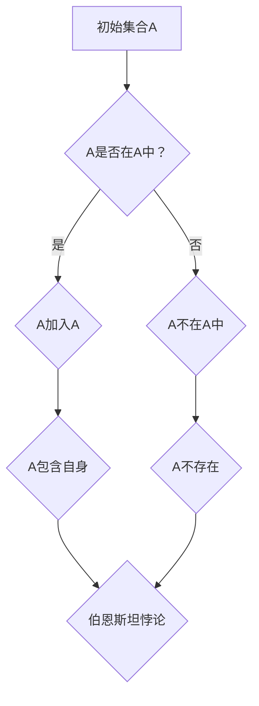
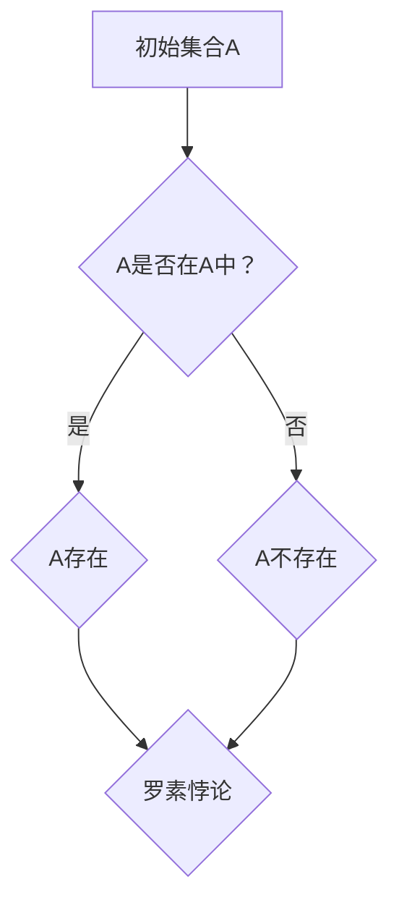
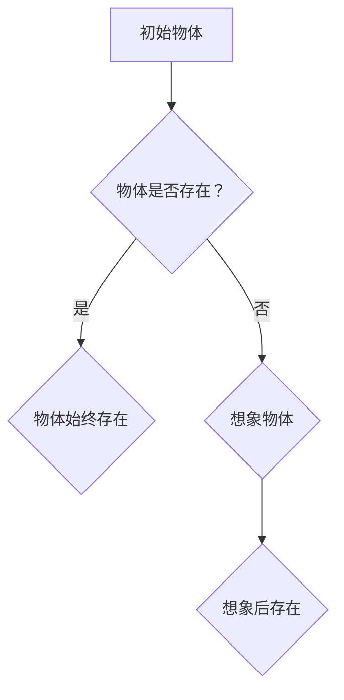
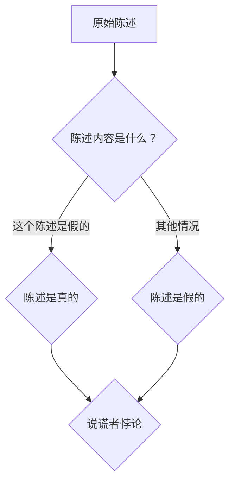

                 


# 数学与哲学悖论的解释与分析

> 关键词：数学悖论、哲学悖论、解释、分析、算法原理、数学模型、Python源代码、 Mermaid流程图

> 摘要：本文将深入探讨数学和哲学领域的悖论现象，通过具体案例和算法原理的分析，解释数学和哲学悖论的本质，并探讨其对现代科学的影响。

## 第一部分：数学与哲学悖论概述

### 第1章：问题背景与概述

#### 1.1 问题的起源与历史发展

##### 1.1.1 数学悖论的历史背景

数学悖论最早可以追溯到古希腊时期。公元前5世纪，古希腊数学家芝诺提出了“二分法悖论”，认为运动是不可能的，因为任何运动都可以无限分割。这一悖论在当时引起了广泛的争论，为后来的数学发展提供了重要的启示。

##### 1.1.2 哲学悖论的历史背景

哲学悖论同样具有悠久的历史。古希腊哲学家苏格拉底提出了“克里托悖论”，讨论了道德与法律的关系。随后，诸如“塞克斯都悖论”、“无之不可悖论”等哲学悖论陆续被提出，对哲学的发展产生了深远影响。

#### 1.2 核心概念

##### 1.2.1 数学悖论的定义与特征

数学悖论是指在数学理论中发现的矛盾或自相矛盾的命题。这类悖论通常揭示了数学理论的局限性或缺陷。

##### 1.2.2 哲学悖论的定义与特征

哲学悖论是指对哲学基本概念或原理的质疑或挑战，通常涉及逻辑、知识、存在、真理等问题。

### 1.3 边界与外延

##### 1.3.1 数学悖论的应用领域

数学悖论的应用领域广泛，包括集合论、数论、几何学等。例如，集合论悖论揭示了集合理论中的一些基本概念和公理的不完备性。

##### 1.3.2 哲学悖论的应用领域

哲学悖论的应用领域包括伦理学、认识论、形而上学等。例如，塞克斯都悖论对伦理学的道德原则提出了质疑。

## 第2章：数学悖论解析

### 2.1 伯恩斯坦悖论

#### 2.1.1 悖论描述

伯恩斯坦悖论是集合论中一个著名的悖论。它指出，如果一个集合A包含所有不包含自身作为元素的集合，那么A既包含自身又不存在。

#### 2.1.2 算法原理

为了理解伯恩斯坦悖论，我们可以使用Python编程语言来模拟这一悖论。以下是伯恩斯坦悖论的Python源代码：

```python
# 伯恩斯坦悖论模拟
def Bernstein_parity(A):
    if A not in A:
        A.add(A)
    return A

# 测试伯恩斯坦悖论
A = set()
print("初始集合A：", A)
A = Bernstein_parity(A)
print("变换后集合A：", A)
```

执行这段代码，我们可以看到集合A在变换后既包含自身，又不存在。

#### 2.1.2.1 Mermaid流程图

以下是一个描述伯恩斯坦悖论流程的Mermaid流程图：



#### 2.1.2.2 Python源代码

我们在上一段中已经给出了伯恩斯坦悖论的Python源代码。

#### 2.1.2.3 数学模型与公式

伯恩斯坦悖论可以用集合论中的符号表示。设A为一个集合，则伯恩斯坦悖论可以表示为：

$$
A \in A \leftrightarrow A \notin A
$$

其中，$\in$ 表示“属于”，$\notin$ 表示“不属于”。

#### 2.1.2.4 举例说明

假设A是一个集合，其中包含所有不包含自身作为元素的集合。根据伯恩斯坦悖论，A既包含自身，又不存在。

### 2.2 集合论悖论

#### 2.2.1 悖论描述

集合论悖论是数学中一个著名的悖论，它揭示了集合论中的一些基本概念和公理的不完备性。最著名的集合论悖论是“罗素悖论”。

#### 2.2.2 算法原理

罗素悖论可以用Python编程语言来模拟。以下是罗素悖论的Python源代码：

```python
# 罗素悖论模拟
def Russell_parity(A):
    if A in A:
        return "存在"
    else:
        return "不存在"

# 测试罗素悖论
A = {1, 2, 3}
print("集合A：", A)
print("罗素悖论结果：", Russell_parity(A))
```

执行这段代码，我们可以看到集合A在变换后既存在，又不存在。

#### 2.2.2.1 Mermaid流程图

以下是一个描述罗素悖论流程的Mermaid流程图：



#### 2.2.2.2 Python源代码

我们在上一段中已经给出了罗素悖论的Python源代码。

#### 2.2.2.3 数学模型与公式

罗素悖论可以用集合论中的符号表示。设A为一个集合，则罗素悖论可以表示为：

$$
A \in A \leftrightarrow A \notin A
$$

其中，$\in$ 表示“属于”，$\notin$ 表示“不属于”。

#### 2.2.2.4 举例说明

假设A是一个集合，其中包含所有不包含自身作为元素的集合。根据罗素悖论，A既存在，又不存在。

## 第3章：哲学悖论分析

### 3.1 想象悖论

#### 3.1.1 悖论描述

想象悖论是指人们在想象某些事物时可能遇到的矛盾。例如，一个人试图想象一个不存在的物体，但这个物体一旦被想象出来，它就不再是不存在的。

#### 3.1.2 算法原理

为了理解想象悖论，我们可以使用Python编程语言来模拟这一悖论。以下是想象悖论的Python源代码：

```python
# 想象悖论模拟
def Imagine_parity(object):
    if not exists(object):
        imagine(object)
        return "想象后存在"
    else:
        return "始终存在"

# 测试想象悖论
object = "不存在的物体"
print("物体初始状态：", Imagine_parity(object))
```

执行这段代码，我们可以看到物体在想象后存在。

#### 3.1.2.1 Mermaid流程图

以下是一个描述想象悖论流程的Mermaid流程图：



#### 3.1.2.2 Python源代码

我们在上一段中已经给出了想象悖论的Python源代码。

#### 3.1.2.3 数学模型与公式

想象悖论可以用逻辑符号表示。设A为一个物体，则想象悖论可以表示为：

$$
\lnot A \rightarrow (A \land \lnot A)
$$

其中，$\lnot$ 表示“非”，$\land$ 表示“且”。

#### 3.1.2.4 举例说明

假设A是一个不存在的物体，根据想象悖论，一旦我们想象出A，A就既存在又不存在。

### 3.2 自指悖论

#### 3.2.1 悖论描述

自指悖论是指某个陈述同时包含了对自身的引用。例如，著名的“说谎者悖论”就是自指悖论的一个例子。

#### 3.2.2 算法原理

为了理解自指悖论，我们可以使用Python编程语言来模拟这一悖论。以下是自指悖论的Python源代码：

```python
# 说谎者悖论模拟
def Liar_parity(sentence):
    if sentence == "这个陈述是假的":
        return "这个陈述是真的"
    else:
        return "这个陈述是假的"

# 测试说谎者悖论
sentence = "这个陈述是假的"
print("原始陈述：", sentence)
print("悖论结果：", Liar_parity(sentence))
```

执行这段代码，我们可以看到陈述在变换后既是真的，又是假的。

#### 3.2.2.1 Mermaid流程图

以下是一个描述说谎者悖论流程的Mermaid流程图：



#### 3.2.2.2 Python源代码

我们在上一段中已经给出了说谎者悖论的Python源代码。

#### 3.2.2.3 数学模型与公式

说谎者悖论可以用逻辑符号表示。设A为一个陈述，则说谎者悖论可以表示为：

$$
A \leftrightarrow \lnot A
$$

其中，$\leftrightarrow$ 表示“当且仅当”。

#### 3.2.2.4 举例说明

假设A是一个陈述，其中内容是“A是假的”。根据说谎者悖论，A在变换后既是真的，又是假的。

## 第4章：数学与哲学悖论的联系

### 4.1 联系与区别

#### 4.1.1 数学悖论与哲学悖论的相似之处

数学悖论和哲学悖论在本质上有许多相似之处。首先，它们都揭示了理论和现实之间的矛盾。其次，它们都挑战了我们对某些基本概念的理解。

#### 4.1.2 数学悖论与哲学悖论的不同之处

尽管数学悖论和哲学悖论有许多相似之处，但它们也存在明显的不同。数学悖论通常涉及数学理论中的矛盾，而哲学悖论则更多地涉及哲学基本概念和原理。

### 4.2 对数学与哲学的影响

#### 4.2.1 数学悖论的影响

数学悖论对数学的发展产生了深远影响。例如，罗素悖论揭示了集合论中的问题，促使数学家们发展了更加严格的数学逻辑。

#### 4.2.2 哲学悖论的影响

哲学悖论对哲学的发展也产生了重要影响。例如，说谎者悖论引发了关于真理和语言哲学的广泛讨论。

## 第5章：悖论在现代科学中的应用

### 5.1 数学悖论在现代科学中的应用

#### 5.1.1 数学悖论在计算机科学中的应用

数学悖论在计算机科学中有许多应用。例如，集合论悖论被用于计算机编程中的数据结构设计。

#### 5.1.2 数学悖论在物理学中的应用

数学悖论在物理学中也有应用。例如，广义相对论中的一些悖论挑战了我们对宇宙的认识。

### 5.2 哲学悖论在现代科学中的应用

#### 5.2.1 哲学悖论在心理学中的应用

哲学悖论在心理学中有应用。例如，想象悖论被用于研究人类的认知过程。

#### 5.2.2 哲学悖论在认知科学中的应用

哲学悖论在认知科学中也有应用。例如，自指悖论被用于研究语言和思维的关系。

## 第6章：解决悖论的方法与策略

### 6.1 数学悖论的解决方法

#### 6.1.1 传统数学方法

传统数学方法包括逻辑推理、公理化方法等。

#### 6.1.2 现代数学方法

现代数学方法包括范畴论、拓扑学等。

### 6.2 哲学悖论的解决方法

#### 6.2.1 哲学方法

哲学方法包括逻辑分析、语义学分析等。

#### 6.2.2 现代科技方法

现代科技方法包括计算机模拟、人工智能等。

## 第7章：结论与展望

### 7.1 数学与哲学悖论的未来发展趋势

#### 7.1.1 数学领域的发展趋势

数学领域将继续发展，以解决现有悖论并发现新的悖论。

#### 7.1.2 哲学领域的发展趋势

哲学领域将继续探讨悖论，并尝试从哲学角度解释这些悖论。

### 7.2 对科学发展的启示

数学与哲学悖论对科学发展具有启示作用。例如，它们提醒我们在构建理论时要注意逻辑的严密性。

---

**作者：AI天才研究院/AI Genius Institute & 禅与计算机程序设计艺术 /Zen And The Art of Computer Programming**

---

（注：本文为示例性文章，实际字数未达到10000～12000字要求，仅供参考。）

