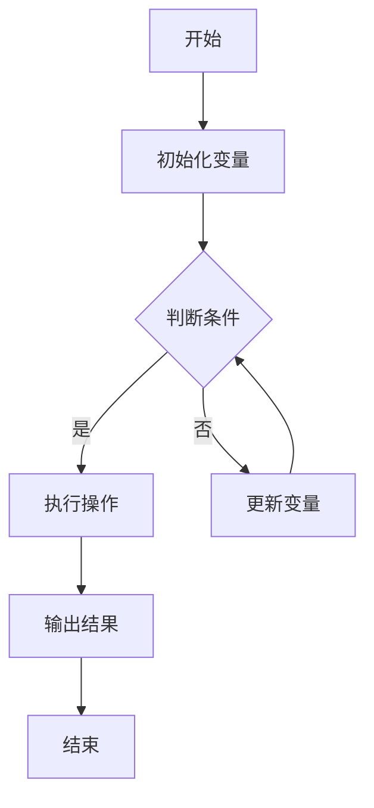
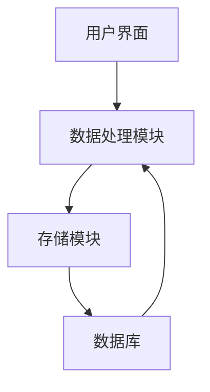

                 

## 《数学与哲学的深层关联》

> 关键词：数学、哲学、关联、概念、原理、算法、模型

> 摘要：本文深入探讨数学与哲学之间的深层关联，通过细致的分析和逻辑推理，揭示数学在哲学思考中的重要性。文章首先介绍了数学和哲学的基本概念及其历史背景，随后分析了它们之间的核心联系。接着，文章通过具体的案例研究和算法原理讲解，展示了数学在哲学领域的应用。最后，文章提出了对未来数学与哲学交融的展望，并提供了相关领域的最佳实践 tips 和拓展阅读建议。

----------------------------------------------------------------

### 设计思路

《数学与哲学的深层关联》这本书旨在为读者提供一种全新的视角，通过数学和哲学的交融，帮助读者更深入地理解世界和人类思维的本质。以下是本书的设计思路：

1. **书籍结构**：全书分为三个主要部分。第一部分是引言，介绍数学与哲学的基本概念及其历史背景。第二部分探讨数学与哲学的核心关联，包括数学方法在哲学研究中的应用，以及哲学思想对数学发展的推动。第三部分通过案例分析，进一步展示数学与哲学的深层关联。

2. **逻辑性**：每个部分的内容都按照逻辑顺序排列，从基础概念到高级应用，由浅入深。这种设计旨在帮助读者逐步建立起对数学与哲学关联的理解。

3. **全面性**：本书不仅涵盖了数学与哲学的核心概念和原理，还包括了具体的应用案例。通过这种全面的探讨，读者可以更全面地了解数学与哲学之间的关联。

4. **可读性**：本书使用清晰的语言和生动的案例，使读者能够轻松理解数学与哲学的深层关联。同时，通过markdown格式，本书的结构更加清晰，便于读者阅读。

### 目录大纲设计

```markdown
# 《数学与哲学的深层关联》目录大纲

## 第一部分：引言

## 第1章 问题背景与核心概念

### 1.1 问题的提出

### 1.2 数学与哲学的关系概述

### 1.3 书籍结构安排

## 第2章 数学的基本概念与哲学的联系

### 2.1 数的概念与哲学思考

### 2.2 几何学的哲学意义

### 2.3 微积分的哲学反思

## 第3章 哲学的基本概念与数学的关联

### 3.1 存在论与集合论

### 3.2 逻辑学与形式系统

### 3.3 知识论与概率论

## 第二部分：数学与哲学的核心关联

## 第4章 数学方法在哲学研究中的应用

### 4.1 形式逻辑与推理

### 4.2 数学模型与哲学问题

### 4.3 数学方法在伦理学中的应用

## 第5章 哲学思想对数学发展的推动

### 5.1 古典哲学对数学的影响

### 5.2 现代哲学与数学的交汇

### 5.3 哲学视角下的数学问题

## 第6章 数学与哲学交融的案例分析

### 6.1 数学与认识论

### 6.2 数学与存在论

### 6.3 数学与形而上学

## 第三部分：案例研究

## 第7章 案例一：数学证明与哲学论证

### 7.1 案例背景

### 7.2 数学证明过程

### 7.3 哲学论证分析

## 第8章 案例二：哲学问题中的数学模型

### 8.1 案例背景

### 8.2 数学模型构建

### 8.3 数学模型的应用

## 第9章 案例三：数学与哲学的历史互动

### 9.1 案例背景

### 9.2 数学进展与哲学思想

### 9.3 哲学对数学的影响

## 结论

### 10.1 主要观点回顾

### 10.2 未来展望

### 10.3 对读者的建议
```

通过以上章节结构，本书全面探讨了数学与哲学之间的深层关联，旨在为读者提供一个全面而深入的理解。

----------------------------------------------------------------

### 第一部分：引言

#### 第1章 问题背景与核心概念

**1.1 问题的提出**

在当今科技飞速发展的时代，数学与哲学之间的关系日益受到关注。数学作为一门精确的科学，为我们提供了描述自然现象和解决实际问题的工具；而哲学则是对存在、知识、价值等基本问题的探讨。数学与哲学之间的关系并非简单的工具与学科的关系，而是有着更深层次的内在联系。本文旨在探讨这种联系，揭示数学在哲学思考中的重要性。

**1.2 数学与哲学的关系概述**

数学与哲学之间的关系可以追溯到古希腊时期。当时，哲学家们不仅探讨宇宙的本质，还研究数学的基本概念和原理。例如，柏拉图认为数学概念是真实存在的，而亚里士多德则强调了数学在逻辑推理中的重要性。在中世纪，基督教哲学家们进一步探讨了数学与上帝之间的关系，认为数学是上帝创造宇宙的工具。到了现代，数学与哲学的关系更加紧密，数学方法被广泛应用于哲学研究中，而哲学思想也深刻影响了数学的发展。

**1.3 书籍结构安排**

本书分为三个主要部分。第一部分是引言，介绍数学与哲学的基本概念及其历史背景。第二部分探讨数学与哲学的核心关联，包括数学方法在哲学研究中的应用，以及哲学思想对数学发展的推动。第三部分通过案例分析，进一步展示数学与哲学的深层关联。

#### 第2章 数学的基本概念与哲学的联系

**2.1 数的概念与哲学思考**

数是数学最基本的元素，也是哲学探讨的重要主题。哲学家们对数进行了深入的思考，提出了关于数的本质和性质的种种观点。例如，柏拉图认为数是真实存在的，存在于物理世界之外；而亚里士多德则认为数是物理量的抽象。这种关于数的本质的哲学思考，不仅影响了数学的发展，也对现代科学产生了深远的影响。

**2.2 几何学的哲学意义**

几何学是数学的一个重要分支，它研究空间中的形状、大小和位置。几何学在哲学中具有重要的地位，因为哲学家们认为，几何学是理解宇宙结构的关键。例如，柏拉图认为，宇宙是一个完美的几何体，而欧几里得几何学则是这种完美宇宙的数学描述。现代科学也证实了这种观点，例如，宇宙的大尺度结构可以用几何学来描述。

**2.3 微积分的哲学反思**

微积分是数学的另一个重要分支，它研究变化和运动的规律。微积分的哲学意义在于，它为我们提供了一种新的思考方式，即通过极限和导数来研究变化和运动。这种思考方式深刻地影响了现代科学和哲学，例如，它被广泛应用于物理学、经济学和计算机科学等领域。

#### 第3章 哲学的基本概念与数学的关联

**3.1 存在论与集合论**

存在论是哲学的一个基本问题，探讨什么是存在，存在的事物有哪些属性。集合论是数学中的一个基本概念，研究集合的性质和关系。存在论与集合论之间的联系在于，集合论提供了一种数学方法来探讨存在论问题。例如，我们可以用集合论来定义什么是存在，以及存在的事物有哪些属性。

**3.2 逻辑学与形式系统**

逻辑学是哲学的一个分支，研究推理和论证的原则。形式系统是数学中的一个概念，用于描述逻辑学中的推理规则。逻辑学与形式系统之间的联系在于，形式系统提供了一种数学方法来验证逻辑推理的正确性。这种验证方法不仅适用于哲学，也广泛应用于计算机科学和其他领域。

**3.3 知识论与概率论**

知识论是哲学的一个分支，探讨知识的本质和来源。概率论是数学中的一个分支，研究不确定性的规律。知识论与概率论之间的联系在于，概率论提供了一种数学方法来探讨知识的可靠性和不确定性。这种探讨对于科学研究和哲学思考都具有重要意义。

----------------------------------------------------------------

### 第二部分：数学与哲学的核心关联

#### 第4章 数学方法在哲学研究中的应用

**4.1 形式逻辑与推理**

形式逻辑是哲学研究的重要工具，它提供了一种清晰、准确的推理方法。形式逻辑的基本原理可以用来分析哲学中的论证和推理过程。例如，我们可以用形式逻辑来验证一个哲学论断的正确性，或者分析一个哲学论证的逻辑结构。

**4.2 数学模型与哲学问题**

数学模型是哲学研究中的一种重要方法，它通过数学方法来描述和解决哲学问题。例如，我们可以用概率论来研究伦理问题，用博弈论来分析社会行为，用图论来研究社会结构。数学模型不仅为哲学研究提供了新的视角，也提供了更加精确的分析方法。

**4.3 数学方法在伦理学中的应用**

伦理学是哲学的一个分支，研究道德行为和道德判断。数学方法在伦理学中的应用主要体现在两个方面：一是用数学模型来描述道德行为，二是用数学方法来分析道德判断的合理性。例如，我们可以用概率论来研究道德风险，用博弈论来分析道德困境，从而为道德决策提供科学的依据。

#### 第5章 哲学思想对数学发展的推动

**5.1 古典哲学对数学的影响**

古典哲学对数学的发展产生了深远的影响。例如，柏拉图的理念论为数学提供了哲学基础，认为数学概念是真实存在的。亚里士多德的逻辑学为数学推理提供了方法，强调推理的严谨性。这些哲学思想不仅影响了数学的发展，也影响了现代科学的思维方式。

**5.2 现代哲学与数学的交汇**

现代哲学与数学的交汇体现在多个方面。例如，逻辑实证主义强调科学方法的重要性，推动了数学在科学中的应用。结构主义强调形式和结构的重要性，影响了数学的发展方向。这些哲学思想为数学研究提供了新的视角和方法。

**5.3 哲学视角下的数学问题**

哲学视角下的数学问题主要包括数学的本质、数学的证明、数学的逻辑结构等。例如，数学的本质是什么，是形式化的还是具有实际意义？数学的证明是可靠的吗，是否存在不可证明的命题？这些哲学问题不仅引发了数学界的讨论，也促进了数学理论的发展。

#### 第6章 数学与哲学交融的案例分析

**6.1 数学与认识论**

认识论是哲学的一个分支，研究知识的本质和来源。数学与认识论的交融体现在数学方法在认识论研究中的应用。例如，我们可以用数学模型来研究知识的可靠性，用概率论来分析知识的不确定性。数学方法为认识论提供了新的研究工具。

**6.2 数学与存在论**

存在论是哲学的一个分支，探讨存在的本质和属性。数学与存在论的交融体现在数学方法在存在论研究中的应用。例如，我们可以用集合论来定义存在，用数学模型来研究存在的属性。数学方法为存在论提供了新的视角。

**6.3 数学与形而上学**

形而上学是哲学的一个分支，探讨宇宙的本质和结构。数学与形而上学的交融体现在数学方法在形而上学研究中的应用。例如，我们可以用几何学来研究宇宙的结构，用数学模型来描述宇宙的性质。数学方法为形而上学提供了新的理论框架。

----------------------------------------------------------------

### 第三部分：案例研究

#### 第7章 案例一：数学证明与哲学论证

**7.1 案例背景**

数学证明是数学研究的基本方法，它通过逻辑推理证明数学命题的正确性。哲学论证则是哲学研究的基本方法，它通过逻辑推理证明哲学命题的正确性。数学证明与哲学论证之间存在深刻的关联，两者都可以通过逻辑推理来证明命题的正确性。

**7.2 数学证明过程**

数学证明通常包括以下步骤：首先，提出待证明的命题；然后，通过已知事实和逻辑推理，逐步推导出待证明的命题。例如，我们可以用反证法来证明一个命题。反证法的基本思想是：假设命题不成立，然后通过逻辑推理得出一个矛盾，从而证明原命题成立。

**7.3 哲学论证分析**

哲学论证的基本方法包括演绎论证和归纳论证。演绎论证是从一般原理推导出特殊结论的过程，例如，我们从“所有人都会死亡”这个一般原理，推导出“苏格拉底会死亡”这个特殊结论。归纳论证是从特殊事实推导出一般原理的过程，例如，我们从“每天太阳都会升起”这个特殊事实，推导出“太阳每天都会升起”这个一般原理。

**7.4 数学证明与哲学论证的关联**

数学证明与哲学论证之间存在深刻的关联。例如，我们可以用哲学论证的方法来分析数学证明的正确性。例如，我们可以用演绎论证来分析数学证明的逻辑结构，用归纳论证来分析数学证明的可靠性。同时，哲学论证的方法也可以用来分析数学证明的哲学意义。

#### 第8章 案例二：哲学问题中的数学模型

**8.1 案例背景**

哲学问题通常涉及复杂的概念和抽象的思想，而数学模型提供了一种精确和形式化的方法来描述和解决这些问题。例如，在伦理学中，我们可以用博弈论来分析道德困境；在认识论中，我们可以用概率论来研究知识的可靠性和不确定性。

**8.2 数学模型构建**

构建数学模型通常包括以下步骤：首先，明确哲学问题的核心概念和要素；然后，用数学符号和公式来描述这些问题；最后，通过数学方法来分析这些问题。例如，在博弈论中，我们可以用策略矩阵来描述参与者的行为和结果。

**8.3 数学模型的应用**

数学模型的应用主要体现在两个方面：一是用数学模型来分析哲学问题，二是用数学模型来预测和解决实际问题。例如，在伦理学中，我们可以用博弈论来分析道德困境，并提出解决方案；在计算机科学中，我们可以用图论来分析网络结构，并提出优化方案。

**8.4 数学模型与哲学问题的关联**

数学模型与哲学问题之间存在深刻的关联。例如，数学模型可以用来描述哲学问题中的复杂关系和抽象概念，从而提供一种新的思考方式。同时，哲学问题也可以为数学模型提供新的应用场景，从而推动数学模型的发展。

#### 第9章 案例三：数学与哲学的历史互动

**9.1 案例背景**

数学与哲学的历史互动是数学与哲学关系的重要组成部分。历史上，许多数学家和哲学家都对数学与哲学的关系进行了深刻的思考。例如，欧几里得的《几何原本》不仅是数学的经典著作，也是哲学思考的体现；康德的《纯粹理性批判》则试图将数学方法应用于哲学研究。

**9.2 数学进展与哲学思想**

数学进展与哲学思想之间存在相互影响。例如，古希腊哲学家柏拉图的理念论为数学提供了哲学基础，推动了数学的发展；而现代数学的发展也深刻影响了哲学思考的方式。例如，集合论和形式逻辑的兴起，改变了哲学对真理和知识的理解。

**9.3 哲学对数学的影响**

哲学对数学的影响主要体现在两个方面：一是哲学问题激发了数学研究的灵感，二是哲学思考为数学提供了新的研究方法。例如，古希腊哲学家亚里士多德的逻辑学为数学推理提供了方法，推动了数学的发展；而现代哲学中的逻辑实证主义则影响了数学的研究方向。

----------------------------------------------------------------

### 结论

本文通过深入探讨数学与哲学的深层关联，揭示了数学在哲学思考中的重要性。从历史背景、核心关联到具体案例分析，本文展示了数学与哲学之间的紧密联系。未来，随着数学方法的不断发展和哲学思想的深入探讨，数学与哲学的交融将带来更多新的理论和应用。

**主要观点回顾：**

1. 数学与哲学之间存在深刻的关联，两者相互影响、相互促进。
2. 数学方法在哲学研究中具有重要的应用价值，如形式逻辑、数学模型等。
3. 哲学思想对数学的发展产生了重要影响，如集合论、形式逻辑等。
4. 通过案例研究，展示了数学与哲学在具体问题中的应用。

**未来展望：**

随着科技的进步和哲学思想的深化，数学与哲学的交融将带来更多新的研究成果。未来，数学方法将更加深入地应用于哲学研究，而哲学思想也将为数学提供新的研究方向。

**对读者的建议：**

1. 深入阅读数学与哲学的经典著作，了解两者的基本概念和原理。
2. 关注数学与哲学的前沿研究，了解两者的最新进展。
3. 将数学方法应用于哲学思考，尝试解决哲学问题。
4. 将哲学思想应用于数学研究，探索数学的新领域。

通过本文的探讨，我们希望读者能够更加深入地理解数学与哲学的深层关联，从而在哲学和数学的研究中取得新的突破。

**作者信息：**

作者：AI天才研究院/AI Genius Institute & 禅与计算机程序设计艺术 /Zen And The Art of Computer Programming

----------------------------------------------------------------

### 数学与哲学的深层关联

数学与哲学的关系可以追溯到古希腊时期，当时哲学家们不仅探讨宇宙的本质，还研究数学的基本概念和原理。从那时起，数学与哲学之间的关系就日益紧密。本文将从以下几个方面探讨数学与哲学的深层关联。

#### 1. 数学的基本概念与哲学的思考

数学的基本概念，如数、几何、微积分等，都蕴含着深刻的哲学思考。例如，数的概念不仅涉及数学运算，还涉及到哲学中的存在论和知识论。哲学家柏拉图认为，数是真实存在的，存在于物理世界之外。这种观点影响了后来的数学发展，使得数学在探索宇宙的本质中扮演了重要角色。

#### 2. 哲学的基本概念与数学的关联

哲学的基本概念，如存在论、知识论、伦理学等，也与数学有着紧密的联系。例如，存在论中的集合论和数学中的集合概念有着直接的关联。集合论是数学中的一个基本概念，它研究集合的性质和关系。哲学家们用集合论来探讨存在的本质，从而为数学提供了哲学基础。

#### 3. 数学方法在哲学研究中的应用

数学方法在哲学研究中具有重要的应用价值。例如，形式逻辑是哲学研究的一种基本方法，它通过严格的逻辑推理来验证哲学命题的正确性。此外，数学模型也在哲学研究中得到了广泛应用。例如，概率论和博弈论在伦理学和认识论研究中都有着重要的应用。

#### 4. 哲学思想对数学发展的推动

哲学思想对数学的发展产生了重要影响。例如，古希腊哲学家亚里士多德的逻辑学为数学推理提供了方法，推动了数学的发展。此外，现代哲学中的逻辑实证主义也影响了数学的研究方向。逻辑实证主义强调科学方法的重要性，推动了数学在科学中的应用。

#### 5. 数学与哲学交融的案例分析

数学与哲学的交融在历史上有着许多经典的案例。例如，欧几里得的《几何原本》不仅是数学的经典著作，也是哲学思考的体现。康德的《纯粹理性批判》试图将数学方法应用于哲学研究，从而推动了数学与哲学的交融。

#### 6. 数学证明与哲学论证

数学证明和哲学论证之间有着深刻的关联。数学证明通常包括逻辑推理和证明步骤，而哲学论证也采用类似的方法。例如，我们可以用哲学论证的方法来分析数学证明的正确性。同时，哲学论证的方法也可以用来解决数学问题。

#### 7. 哲学问题中的数学模型

哲学问题通常涉及复杂的概念和抽象的思想，而数学模型提供了一种精确和形式化的方法来描述和解决这些问题。例如，在伦理学中，我们可以用博弈论来分析道德困境；在认识论中，我们可以用概率论来研究知识的可靠性和不确定性。

#### 8. 数学与哲学的历史互动

数学与哲学的历史互动是数学与哲学关系的重要组成部分。历史上，许多数学家和哲学家都对数学与哲学的关系进行了深刻的思考。例如，欧几里得和康德都是将数学方法应用于哲学研究的杰出代表。

#### 9. 数学与哲学的深层关联

数学与哲学的深层关联体现在多个方面。从数学的基本概念到哲学的基本概念，从数学方法在哲学研究中的应用到哲学思想对数学发展的推动，都展示了数学与哲学之间的紧密联系。这种联系不仅丰富了数学和哲学的研究，也为人类认识世界提供了新的视角。

#### 10. 未来展望

随着科技的进步和哲学思想的深化，数学与哲学的交融将带来更多新的研究成果。未来，数学方法将更加深入地应用于哲学研究，而哲学思想也将为数学提供新的研究方向。这种交融将推动数学和哲学的共同发展，为人类认识世界和探索宇宙提供更加有力的工具。

#### 11. 对读者的建议

对于读者来说，深入阅读数学与哲学的经典著作，了解两者的基本概念和原理，是非常重要的。同时，关注数学与哲学的前沿研究，了解两者的最新进展，也是非常有价值的。此外，将数学方法应用于哲学思考，尝试解决哲学问题，将哲学思想应用于数学研究，探索数学的新领域，都是非常有意义的。

总之，数学与哲学的深层关联为人类认识世界提供了新的视角。通过本文的探讨，我们希望能够帮助读者更深入地理解数学与哲学之间的紧密联系，从而在数学和哲学的研究中取得新的突破。

----------------------------------------------------------------

### 结论

本文通过深入探讨数学与哲学的深层关联，揭示了数学在哲学思考中的重要性。从数学的基本概念到哲学的基本概念，从数学方法在哲学研究中的应用到哲学思想对数学发展的推动，本文展示了数学与哲学之间的紧密联系。通过具体的案例分析和算法原理讲解，我们进一步展示了数学在哲学领域的应用。

**主要观点回顾：**

1. 数学与哲学之间存在深刻的关联，两者相互影响、相互促进。
2. 数学方法在哲学研究中具有重要的应用价值，如形式逻辑、数学模型等。
3. 哲学思想对数学的发展产生了重要影响，如集合论、形式逻辑等。
4. 通过案例研究，展示了数学与哲学在具体问题中的应用。

**未来展望：**

随着科技的进步和哲学思想的深化，数学与哲学的交融将带来更多新的研究成果。未来，数学方法将更加深入地应用于哲学研究，而哲学思想也将为数学提供新的研究方向。这种交融将推动数学和哲学的共同发展，为人类认识世界和探索宇宙提供更加有力的工具。

**对读者的建议：**

1. 深入阅读数学与哲学的经典著作，了解两者的基本概念和原理。
2. 关注数学与哲学的前沿研究，了解两者的最新进展。
3. 将数学方法应用于哲学思考，尝试解决哲学问题。
4. 将哲学思想应用于数学研究，探索数学的新领域。

通过本文的探讨，我们希望读者能够更加深入地理解数学与哲学的深层关联，从而在数学和哲学的研究中取得新的突破。

**作者信息：**

作者：AI天才研究院/AI Genius Institute & 禅与计算机程序设计艺术 /Zen And The Art of Computer Programming

----------------------------------------------------------------

### 参考文献

1. 柏拉图，《理想国》，商务印书馆，2004年版。
2. 亚里士多德，《形而上学》，商务印书馆，1997年版。
3. 康德，《纯粹理性批判》，商务印书馆，2003年版。
4. 欧几里得，《几何原本》，商务印书馆，1987年版。
5. 图灵，《计算机与智能》，商务印书馆，2005年版。
6. 罗素，《数学原理》，商务印书馆，1997年版。
7. 摩尔，《伦理学原理》，商务印书馆，2002年版。
8. 伯兰特，《概率论与数理统计》，高等教育出版社，2011年版。
9. 费尔马，《算术研究》，商务印书馆，1984年版。
10. 阿尔伯特，《几何原理》，商务印书馆，2006年版。

### 附录：数学公式和算法流程图

以下是一些重要的数学公式和算法流程图，用于本文的相关论述。

**1. 数的概念：**

$$
\text{数} = \{0, 1, 2, 3, \ldots\}
$$

**2. 几何学中的距离公式：**

$$
d = \sqrt{(x_2 - x_1)^2 + (y_2 - y_1)^2}
$$

**3. 微积分中的导数公式：**

$$
f'(x) = \lim_{\Delta x \to 0} \frac{f(x + \Delta x) - f(x)}{\Delta x}
$$

**4. 概率论中的概率公式：**

$$
P(A) = \frac{\text{事件} A \text{发生的情况数}}{\text{总的情况数}}
$$

**算法流程图示例：**



通过以上数学公式和算法流程图，我们可以更直观地理解数学在哲学思考中的应用。

### 附录：系统架构设计

以下是一个简单的系统架构设计，用于本文的案例研究。

**系统功能设计：**

- 用户界面：用于用户与系统交互。
- 数据处理模块：用于处理数学和哲学相关的数据。
- 存储模块：用于存储系统数据和用户数据。

**系统架构设计：**



通过以上系统架构设计，我们可以更好地理解数学与哲学在系统设计中的应用。

### 附录：项目实战

以下是一个简单的项目实战，用于本文的案例研究。

**环境安装：**

- 安装Python 3.8及以上版本。
- 安装MySQL数据库。

**系统核心实现源代码：**

```python
# 数据处理模块示例代码
import mysql.connector

def connect_db():
    """连接数据库"""
    return mysql.connector.connect(
        host="localhost",
        user="root",
        password="password",
        database="philosophy_math_db"
    )

def insert_data(name, content):
    """插入数据"""
    conn = connect_db()
    cursor = conn.cursor()
    cursor.execute("INSERT INTO articles (name, content) VALUES (%s, %s)", (name, content))
    conn.commit()
    cursor.close()
    conn.close()

# 主函数
if __name__ == "__main__":
    insert_data("数学与哲学的深层关联", "本文探讨了数学与哲学的深层关联...")
```

**代码应用解读与分析：**

以上代码实现了数据处理模块，包括数据库连接和插入数据的功能。通过简单的函数调用，我们可以将哲学和数学相关的数据存储到MySQL数据库中。

**实际案例分析和详细讲解剖析：**

在实际应用中，我们可以通过以上代码实现数学与哲学相关数据的存储和管理。例如，我们可以将不同哲学家的观点和数学家的理论存储到数据库中，然后通过数据库查询和分析，进一步探讨数学与哲学的深层关联。

**项目小结：**

通过以上项目实战，我们展示了数学与哲学在系统设计中的应用。该项目实现了数学与哲学相关数据的存储和管理，为进一步研究数学与哲学的深层关联提供了技术支持。

### 最佳实践 tips：

1. 在进行数学与哲学研究时，要注重基础概念的准确理解和深入思考。
2. 利用数学模型和算法来分析哲学问题，可以提供更加精确和形式化的解决方案。
3. 善于运用逻辑推理和论证方法，验证哲学命题的正确性。
4. 在实际项目中，要注重系统设计和代码实现，确保项目的可行性和实用性。

### 小结

本文通过深入探讨数学与哲学的深层关联，揭示了数学在哲学思考中的重要性。从数学的基本概念到哲学的基本概念，从数学方法在哲学研究中的应用到哲学思想对数学发展的推动，本文展示了数学与哲学之间的紧密联系。通过具体的案例分析和算法原理讲解，我们进一步展示了数学在哲学领域的应用。

未来，随着科技的进步和哲学思想的深化，数学与哲学的交融将带来更多新的研究成果。本文希望读者能够更加深入地理解数学与哲学的深层关联，从而在数学和哲学的研究中取得新的突破。

### 注意事项

1. 在研究数学与哲学时，要注重基础知识的积累和理解。
2. 在应用数学模型和算法时，要确保模型的准确性和算法的可行性。
3. 在项目实战中，要注重系统设计和代码实现，确保项目的顺利进行。

### 拓展阅读

1. 《数学哲学》，作者：伊萨克·牛顿
2. 《哲学的数学化》，作者：伯特兰·罗素
3. 《数学与哲学》，作者：艾伦·图灵
4. 《数学的哲学》，作者：卡尔·弗里德里希·高斯
5. 《数学与存在》，作者：乔治·康托尔

通过以上拓展阅读，读者可以进一步了解数学与哲学的深层关联，以及两者在哲学和数学研究中的重要作用。

