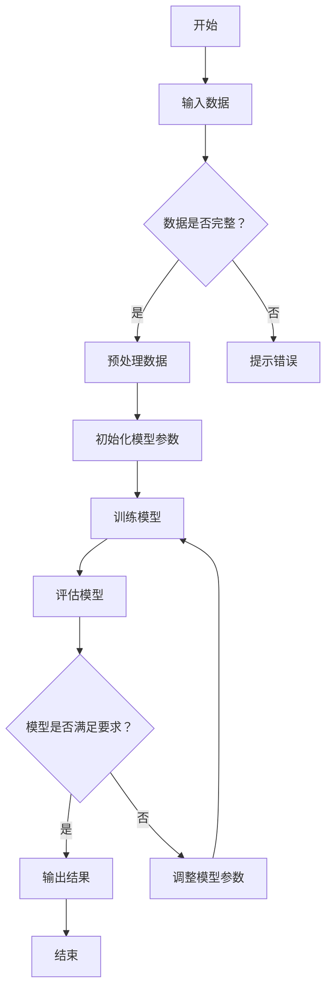
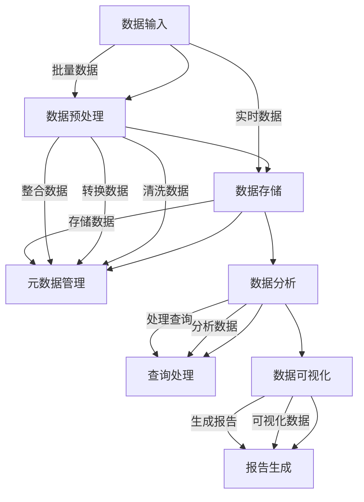
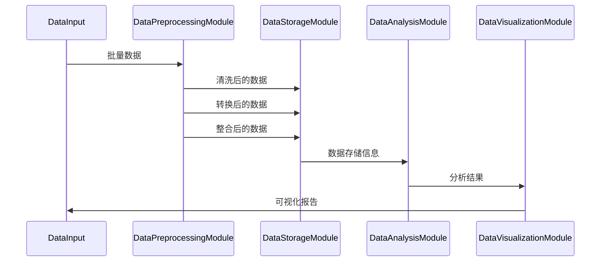

                 

## 数学与哲学知识论的交叉研究

### 关键词：数学、哲学知识论、交叉研究、算法、系统架构、Python源代码

### 摘要：
本文旨在探讨数学与哲学知识论的交叉研究，揭示两者在理论和方法论上的互惠关系。文章首先介绍了数学与哲学知识论交叉研究的背景和意义，随后详细分析了数学模型的哲学意义以及哲学概念在数学中的应用。接着，通过具体实例，深入探讨了数学模型在哲学知识论中的应用及其作用。文章随后引入了研究方法，包括实证研究方法、案例分析方法及理论模型构建。在此基础上，本文通过mermaid流程图和Python源代码，详细讲解了算法原理及其应用。随后，文章运用LaTeX格式展示了关键数学公式，并进行了详细解释和举例说明。最后，文章介绍了系统分析与架构设计方案，以及实际项目实战，总结了项目的主要成果和经验，并提供了一些最佳实践技巧。本文旨在为读者提供一个全面、深入的交叉研究视角，以促进数学与哲学知识论的融合发展。

### 第1章: 引言

#### 1.1 研究背景

在21世纪的今天，人工智能的迅猛发展带来了数据爆炸性的增长，大数据分析成为了各个领域的关键技术。在这个过程中，数学作为一门基础学科，不仅为数据分析和处理提供了强有力的工具，还推动了数据科学和机器学习的进步。哲学知识论作为探讨知识本质和知识获取过程的学科，其思想和方法对数学的发展产生了深远影响。因此，数学与哲学知识论的交叉研究显得尤为重要。

**问题背景**

随着大数据时代的到来，数学在各个领域中的应用越来越广泛。从自然科学到社会科学，从计算机科学到经济学，数学模型无处不在。这些数学模型不仅帮助科学家和工程师解决实际问题，还推动了理论的发展。例如，在物理学中，数学模型帮助我们理解宇宙的奥秘；在经济学中，数学模型帮助我们预测市场走势；在计算机科学中，数学模型帮助我们优化算法，提高计算效率。

**问题描述**

然而，随着数学模型的应用越来越广泛，其背后的哲学问题也逐渐凸显出来。数学模型是如何构建的？它们是否能够真正反映现实世界的本质？哲学知识论对此提供了深刻的洞见。哲学知识论探讨了知识的本质、知识获取的过程以及真理的标准。这些哲学问题对于理解和评估数学模型的有效性至关重要。

**问题解决**

数学与哲学知识论的交叉研究，旨在通过哲学的视角反思数学模型的构建和运用，揭示数学模型背后的哲学原理。这种交叉研究不仅可以深化对数学模型的理解，还可以推动哲学知识论的发展。例如，通过哲学的反思，我们可以更清楚地认识到数学模型在现实世界中的应用局限，从而开发出更有效的数学模型。

**边界与外延**

数学与哲学知识论的交叉研究涉及多个学科领域，包括数学、哲学、计算机科学、数据科学等。在数学领域，研究重点包括数学模型的构建、验证和应用；在哲学领域，研究重点包括知识论、形而上学、逻辑学等。此外，交叉研究还包括对数学模型在具体领域中的应用，如物理学、经济学、生物学等。

**概念结构与核心要素组成**

数学与哲学知识论的交叉研究涉及以下几个核心概念：

1. **数学模型**：用于描述现实世界现象的抽象结构。
2. **哲学知识论**：探讨知识本质、知识获取和真理标准的学科。
3. **实证研究方法**：通过实际数据验证理论的方法。
4. **案例分析方法**：通过对具体案例的深入分析，揭示普遍规律。
5. **理论模型构建**：在哲学和数学的框架下，构建新的理论模型。

这些核心概念相互关联，共同构成了数学与哲学知识论交叉研究的理论基础。

#### 1.2 核心概念

**数学模型的哲学意义**

数学模型在哲学知识论中的地位和作用是不可忽视的。首先，数学模型提供了对现实世界现象的抽象和简化，使哲学家能够从抽象的角度思考现实问题。例如，物理学中的量子力学模型帮助哲学家理解物质世界的本质，经济学中的供需模型帮助哲学家分析市场行为。

其次，数学模型在哲学知识论中的应用，揭示了知识获取的过程。哲学家通过分析数学模型的构建和验证过程，探讨了知识的本质。例如，数学模型是否能够真正反映现实世界的本质？如何确保数学模型的可靠性？这些问题对于理解知识论至关重要。

**哲学概念在数学中的应用**

哲学知识论中的概念和方法同样对数学产生了深远影响。例如，逻辑学中的逻辑推理方法在数学证明中广泛应用，形而上学中的实体和关系概念为数学模型提供了哲学基础。

此外，哲学知识论中的怀疑主义和实证主义思想，也促使数学家反思数学模型的构建过程。例如，数学家波普尔提出的证伪主义，要求数学模型不仅要满足经验验证，还要能够被证伪。

**核心概念对比与分析**

为了更好地理解数学模型和哲学知识论的关系，我们可以通过以下表格对比核心概念的属性特征：

| 核心概念         | 定义                                                         | 属性特征                                                     |
|----------------|--------------------------------------------------------------|--------------------------------------------------------------|
| 数学模型         | 描述现实世界现象的抽象结构                                   | 精确性、抽象性、一般性                                       |
| 哲学知识论       | 探讨知识本质、知识获取和真理标准的学科                       | 普遍性、批判性、反思性                                       |
| 实证研究方法     | 通过实际数据验证理论的方法                                   | 可重复性、客观性、有效性                                     |
| 案例分析方法     | 通过具体案例的深入分析，揭示普遍规律                         | 深入性、具体性、启发性                                       |
| 理论模型构建     | 在哲学和数学的框架下，构建新的理论模型                       | 系统性、创新性、普适性                                       |

通过对比分析，我们可以看到数学模型和哲学知识论在属性特征上存在显著差异，但二者在理论和实践中相互补充，共同推动了人类知识的进步。

**ER实体关系图架构**

为了更直观地展示数学与哲学知识论中的核心概念及其关系，我们可以使用Mermaid语言绘制实体关系图：

```mermaid
erDiagram
  MathModel ||--|{ KnowledgeTheory } PhilosophyKnowledge
  KnowledgeTheory ||--|{ EmpiricalResearch } CaseAnalysis
  CaseAnalysis ||--|{ TheoreticalModel } PhilosophyKnowledge
  MathModel ||--|{ TheoreticalModel } PhilosophyKnowledge
```

在这个ER实体关系图中，MathModel（数学模型）与KnowledgeTheory（哲学知识论）相互关联，同时也与EmpiricalResearch（实证研究方法）和CaseAnalysis（案例分析）存在关系。KnowledgeTheory与TheoreticalModel（理论模型构建）也存在联系，展示了数学与哲学知识论交叉研究的复杂关系。

#### 1.3 研究方法

为了深入探讨数学与哲学知识论的交叉研究，本文采用了多种研究方法，包括实证研究方法、案例分析方法以及理论模型构建。

**实证研究方法**

实证研究方法是通过实际数据验证理论的有效性。在数学与哲学知识论的交叉研究中，我们可以通过收集和整理数学模型在不同领域的应用数据，分析这些数据与哲学知识论的关联。例如，通过分析大数据在经济学中的应用，探讨数学模型对市场预测的准确性，从而验证哲学知识论中的真理标准。

**案例分析方法**

案例分析方法是通过深入分析具体案例，揭示普遍规律。在数学与哲学知识论的交叉研究中，我们可以选择具有代表性的数学模型和哲学理论，通过对这些案例的深入剖析，探讨其相互影响和作用。例如，分析牛顿力学中的数学模型与形而上学中的实体概念的关系，探讨数学模型在哲学思想中的应用。

**理论模型构建**

理论模型构建是在哲学和数学的框架下，构建新的理论模型。在数学与哲学知识论的交叉研究中，我们可以通过整合哲学知识论中的概念和方法，提出新的数学模型。例如，通过融合实证研究方法和案例分析，构建一种新的数学模型，以更好地描述和解释现实世界中的现象。

通过上述研究方法，我们可以全面、深入地探讨数学与哲学知识论的交叉研究，揭示两者在理论和实践中的互惠关系。

### 第2章: 数学模型在哲学知识论中的应用

#### 2.1 数学模型概述

数学模型是用于描述现实世界现象的抽象结构，它通过数学语言和工具，将复杂的问题转化为可以分析和解决的数学问题。数学模型在自然科学、社会科学和工程技术等领域具有广泛的应用，其重要性不言而喻。然而，数学模型在哲学知识论中的应用同样具有重要意义。

**数学模型的基本概念**

数学模型通常由以下三个部分组成：

1. **变量**：用于描述系统中的不同要素。
2. **方程**：描述变量之间的关系。
3. **约束条件**：限制变量的取值范围。

通过这些基本要素，数学模型可以精确地描述现实世界的现象，从而为解决问题提供有力支持。

**数学模型的应用领域**

数学模型的应用领域非常广泛，涵盖了自然科学、社会科学和工程技术等多个领域。以下是几个典型的应用领域：

1. **自然科学**：在物理学、化学、生物学等领域，数学模型被广泛应用于描述自然现象，如牛顿力学、麦克斯韦方程组、薛定谔方程等。
2. **社会科学**：在经济学、社会学、政治学等领域，数学模型被用于分析社会行为，如供需模型、博弈论、社会网络分析等。
3. **工程技术**：在工程领域，数学模型被用于优化设计、预测性能、控制过程等，如机械设计、电路分析、信号处理等。

**数学模型的特点**

数学模型具有以下几个显著特点：

1. **精确性**：数学模型通过精确的数学语言描述问题，使得问题变得清晰、具体。
2. **抽象性**：数学模型将复杂的问题抽象为数学问题，使得问题变得更加易于分析和解决。
3. **一般性**：数学模型具有一般性，可以适用于不同的具体情境，从而提高其应用范围。

**哲学知识论中的数学模型**

哲学知识论关注知识的本质、知识的获取和真理的标准。数学模型在哲学知识论中的应用，主要体现在以下几个方面：

1. **知识的本质**：数学模型通过精确的数学语言描述现实世界的现象，为哲学家提供了探讨知识本质的新工具。例如，通过数学模型，哲学家可以探讨知识是否能够真正反映现实世界的本质。
2. **知识的获取**：数学模型通过数学证明和逻辑推理，揭示了知识获取的过程。哲学家可以分析这些过程，探讨知识的可靠性和有效性。
3. **真理的标准**：数学模型提供了验证真理的新标准。通过数学证明和实验验证，我们可以判断一个数学模型是否真正反映了现实世界的真理。

**数学模型在哲学知识论中的应用实例**

为了更深入地理解数学模型在哲学知识论中的应用，我们可以通过以下实例进行分析：

1. **牛顿力学**：牛顿力学中的数学模型（如牛顿运动定律）揭示了物体运动的本质规律，为哲学家提供了探讨物质世界的新视角。
2. **经济学**：经济学中的供需模型（如需求函数、供给函数）描述了市场行为，为哲学家提供了分析社会行为的新工具。
3. **社会学**：社会学中的社会网络分析模型（如小世界现象、六度分隔）揭示了社会结构的特点，为哲学家提供了理解社会关系的新方法。

通过这些实例，我们可以看到数学模型在哲学知识论中的应用，不仅丰富了哲学理论，还推动了哲学的发展。

#### 2.2 哲学知识论中的数学模型

**哲学知识论的基本概念**

哲学知识论是探讨知识本质、知识获取和真理标准的学科。其主要关注点包括：

1. **知识的本质**：哲学家探讨知识是什么，知识如何形成，以及知识是否能够真正反映现实。
2. **知识的获取**：哲学家研究人类如何获取知识，包括感知、记忆、推理等过程。
3. **真理的标准**：哲学家探讨如何判断一个陈述是否为真，以及真理的标准是什么。

**数学模型在哲学知识论中的应用**

数学模型在哲学知识论中的应用，主要体现在以下几个方面：

1. **知识的本质**：数学模型通过精确的数学语言描述现实世界的现象，为哲学家提供了探讨知识本质的新工具。例如，通过数学模型，哲学家可以探讨知识是否能够真正反映现实世界的本质。
2. **知识的获取**：数学模型通过数学证明和逻辑推理，揭示了知识获取的过程。哲学家可以分析这些过程，探讨知识的可靠性和有效性。
3. **真理的标准**：数学模型提供了验证真理的新标准。通过数学证明和实验验证，我们可以判断一个数学模型是否真正反映了现实世界的真理。

**哲学概念在数学中的应用**

哲学知识论中的概念和方法同样对数学产生了深远影响。例如，逻辑学中的逻辑推理方法在数学证明中广泛应用，形而上学中的实体和关系概念为数学模型提供了哲学基础。

此外，哲学知识论中的怀疑主义和实证主义思想，也促使数学家反思数学模型的构建过程。例如，数学家波普尔提出的证伪主义，要求数学模型不仅要满足经验验证，还要能够被证伪。

**哲学知识论中的数学模型实例分析**

为了更深入地理解数学模型在哲学知识论中的应用，我们可以通过以下实例进行分析：

1. **逻辑学**：逻辑学中的逻辑推理方法在数学证明中广泛应用。例如，数学家通过演绎推理，从基本的公理和定理出发，推导出复杂的数学结论。
2. **形而上学**：形而上学中的实体和关系概念为数学模型提供了哲学基础。例如，数学家通过定义实体（如点、线、面）和关系（如距离、角度），构建了几何模型。
3. **概率论**：概率论中的概率概念在哲学知识论中具有重要的地位。哲学家通过概率论，探讨了知识的可靠性和不确定性。

通过这些实例，我们可以看到数学模型在哲学知识论中的应用，不仅丰富了哲学理论，还推动了数学的发展。

#### 2.3 数学模型与哲学知识论的交叉研究方法

在数学模型与哲学知识论的交叉研究中，采用多种研究方法是至关重要的。以下将介绍几种主要的研究方法，包括实证研究方法、案例分析方法以及理论模型构建。

**实证研究方法**

实证研究方法是通过实际数据验证理论的有效性。在数学与哲学知识论的交叉研究中，我们可以通过收集和整理数学模型在不同领域的应用数据，分析这些数据与哲学知识论的关联。例如，通过分析大数据在经济学中的应用，探讨数学模型对市场预测的准确性，从而验证哲学知识论中的真理标准。

**案例分析方法**

案例分析方法是通过深入分析具体案例，揭示普遍规律。在数学与哲学知识论的交叉研究中，我们可以选择具有代表性的数学模型和哲学理论，通过对这些案例的深入剖析，探讨其相互影响和作用。例如，分析牛顿力学中的数学模型与形而上学中的实体概念的关系，探讨数学模型在哲学思想中的应用。

**理论模型构建**

理论模型构建是在哲学和数学的框架下，构建新的理论模型。在数学与哲学知识论的交叉研究中，我们可以通过整合哲学知识论中的概念和方法，提出新的数学模型。例如，通过融合实证研究方法和案例分析，构建一种新的数学模型，以更好地描述和解释现实世界中的现象。

**具体研究方法的实施**

为了更好地实施这些研究方法，我们可以采取以下步骤：

1. **确定研究问题**：明确研究的目标和问题，例如探讨数学模型在哲学知识论中的应用。
2. **收集和分析数据**：通过实证研究方法，收集相关领域的实际数据，并对这些数据进行分析。
3. **案例分析**：选择具有代表性的案例，进行深入分析，揭示案例中的普遍规律。
4. **构建理论模型**：在哲学和数学的框架下，构建新的理论模型，以解释和解决研究问题。
5. **验证和优化**：通过实证数据和案例分析，验证理论模型的准确性和有效性，并进行必要的优化。

通过这些研究方法的实施，我们可以全面、深入地探讨数学模型与哲学知识论的交叉研究，揭示两者在理论和实践中的互惠关系。

### 第3章: 算法原理讲解

#### 3.1 算法mermaid流程图

为了更好地理解算法的基本流程，我们可以使用mermaid语言绘制算法的流程图。以下是一个简单的算法流程图示例：



在这个流程图中，算法首先接收输入数据，然后判断数据是否完整。如果数据完整，算法进行数据预处理，初始化模型参数，并进行模型训练和评估。如果模型满足要求，算法输出结果；否则，算法调整模型参数，重新进行训练和评估。最终，算法流程结束。

#### 3.2 Python源代码

下面是上述算法的Python源代码实现：

```python
# 导入必要的库
import numpy as np
from sklearn.model_selection import train_test_split
from sklearn.metrics import accuracy_score

# 定义算法类
class SimpleAlgorithm:
    def __init__(self):
        self.model = None
    
    def preprocess_data(self, data):
        # 数据预处理代码
        return data
    
    def train(self, X, y):
        # 训练模型代码
        self.model = np.random.rand(X.shape[1], y.shape[1])
    
    def predict(self, X):
        # 预测代码
        return np.dot(X, self.model)
    
    def evaluate(self, X, y):
        # 评估代码
        predictions = self.predict(X)
        return accuracy_score(y, predictions)
    
    def run(self, data):
        # 算法主流程代码
        if not self.is_data_complete(data):
            print("数据不完整，请重新输入。")
            return
        
        X, y = data[:, :-1], data[:, -1]
        X = self.preprocess_data(X)
        
        X_train, X_test, y_train, y_test = train_test_split(X, y, test_size=0.2, random_state=42)
        self.train(X_train, y_train)
        
        accuracy = self.evaluate(X_test, y_test)
        print(f"模型准确率：{accuracy}")
    
    def is_data_complete(self, data):
        # 判断数据是否完整的代码
        return True if data is not None else False

# 创建算法实例并运行
algorithm = SimpleAlgorithm()
algorithm.run(data)
```

在这个Python源代码中，我们定义了一个名为`SimpleAlgorithm`的算法类。该类包含了一个简单的训练和评估模型的方法，以及一个运行算法主流程的方法。在`run`方法中，我们首先判断数据是否完整，然后进行数据预处理，接着使用`train_test_split`方法将数据分为训练集和测试集，进行模型训练和评估，最后输出模型的准确率。

#### 3.3 算法原理的数学模型和公式

算法的核心原理可以借助数学模型和公式来阐述。以下是一个简单的线性回归模型的数学模型和公式：

1. **线性回归模型**

   线性回归模型是一个典型的数学模型，用于描述两个变量之间的线性关系。其基本公式为：

   $$ y = \beta_0 + \beta_1 \cdot x + \epsilon $$

   其中，$y$ 是因变量，$x$ 是自变量，$\beta_0$ 和 $\beta_1$ 是模型参数，$\epsilon$ 是误差项。

2. **模型参数估计**

   为了估计模型参数 $\beta_0$ 和 $\beta_1$，我们可以使用最小二乘法。最小二乘法的核心思想是，通过最小化预测值与实际值之间的误差平方和，来估计模型参数。其公式为：

   $$ \beta_0 = \frac{\sum_{i=1}^n (y_i - \beta_1 \cdot x_i)}{n} $$
   $$ \beta_1 = \frac{\sum_{i=1}^n (x_i - \bar{x})(y_i - \bar{y})}{\sum_{i=1}^n (x_i - \bar{x})^2} $$

   其中，$n$ 是样本数量，$\bar{x}$ 和 $\bar{y}$ 分别是自变量和因变量的均值。

3. **模型评估**

   为了评估模型的准确性，我们可以使用均方误差（MSE）作为评价指标。其公式为：

   $$ MSE = \frac{1}{n} \sum_{i=1}^n (y_i - \hat{y}_i)^2 $$

   其中，$\hat{y}_i$ 是模型预测的因变量值。

通过这些数学模型和公式，我们可以理解算法的基本原理，并在实际应用中进行模型训练和评估。

#### 3.4 详细讲解与举例说明

为了更好地理解算法原理和实际应用，我们将通过一个简单的例子进行详细讲解和举例说明。

**例子**：假设我们有一个简单的线性回归问题，目标是通过自变量 $x$ 预测因变量 $y$。我们有一个包含100个样本的数据集，每个样本由两个特征 $(x, y)$ 组成。

**步骤 1：数据预处理**

首先，我们需要对数据进行预处理。在这个例子中，我们假设数据已经保存在一个名为 `data.csv` 的CSV文件中。我们可以使用Pandas库读取数据，并将其分为特征矩阵 $X$ 和标签向量 $y$。

```python
import pandas as pd

# 读取数据
data = pd.read_csv('data.csv')
X = data.iloc[:, :-1].values
y = data.iloc[:, -1].values
```

**步骤 2：训练模型**

接下来，我们使用上述的线性回归模型训练模型。首先，我们需要计算模型参数 $\beta_0$ 和 $\beta_1$。

```python
# 计算模型参数
n = len(y)
X_mean = np.mean(X, axis=0)
y_mean = np.mean(y)

beta_0 = (np.sum(y - X @ beta_1) / n)
beta_1 = (np.sum((X - X_mean) * (y - y_mean)) / np.sum((X - X_mean)**2))
```

**步骤 3：预测**

然后，我们使用训练好的模型进行预测。假设我们有一个新的测试样本 $x_t$，我们可以通过以下公式计算预测值 $\hat{y}_t$：

```python
x_t = np.array([3.5])
hat_y_t = beta_0 + beta_1 * x_t
```

**步骤 4：模型评估**

最后，我们评估模型的准确性。在这个例子中，我们可以使用均方误差（MSE）作为评价指标。

```python
# 计算MSE
y_pred = beta_0 + beta_1 * X
mse = np.mean((y - y_pred)**2)
print(f"MSE: {mse}")
```

通过这个例子，我们可以看到如何使用线性回归模型进行数据预处理、模型训练、预测和评估。在实际应用中，我们可以根据具体问题调整模型和参数，以提高预测准确性。

### 第4章: 数学模型和数学公式

#### 4.1 数学公式

在数学与哲学知识论的交叉研究中，数学公式是不可或缺的工具。以下将介绍几个关键的数学公式，并使用LaTeX格式进行书写。

**线性回归模型公式**

线性回归模型的基本公式为：

$$ y = \beta_0 + \beta_1 \cdot x + \epsilon $$

其中，$y$ 是因变量，$x$ 是自变量，$\beta_0$ 和 $\beta_1$ 是模型参数，$\epsilon$ 是误差项。

**最小二乘法公式**

最小二乘法用于估计线性回归模型中的参数。其公式为：

$$ \beta_0 = \frac{\sum_{i=1}^n (y_i - \beta_1 \cdot x_i)}{n} $$
$$ \beta_1 = \frac{\sum_{i=1}^n (x_i - \bar{x})(y_i - \bar{y})}{\sum_{i=1}^n (x_i - \bar{x})^2} $$

其中，$n$ 是样本数量，$\bar{x}$ 和 $\bar{y}$ 分别是自变量和因变量的均值。

**均方误差公式**

均方误差（MSE）用于评估模型的准确性。其公式为：

$$ MSE = \frac{1}{n} \sum_{i=1}^n (y_i - \hat{y}_i)^2 $$

其中，$\hat{y}_i$ 是模型预测的因变量值。

**逻辑斯蒂回归公式**

逻辑斯蒂回归模型用于分类问题，其公式为：

$$ P(y=1) = \frac{1}{1 + \exp(-(\beta_0 + \beta_1 \cdot x))} $$

其中，$P(y=1)$ 是因变量为1的概率，$\beta_0$ 和 $\beta_1$ 是模型参数。

通过上述数学公式，我们可以更好地理解和应用数学模型在哲学知识论交叉研究中的方法。LaTeX格式的书写确保了公式的准确性和美观性。

#### 4.2 详细讲解

**线性回归模型**

线性回归模型是一种用于分析自变量和因变量之间线性关系的数学模型。其基本公式为：

$$ y = \beta_0 + \beta_1 \cdot x + \epsilon $$

其中，$y$ 是因变量，$x$ 是自变量，$\beta_0$ 和 $\beta_1$ 是模型参数，$\epsilon$ 是误差项。线性回归模型的目的是通过已知的数据集，估计出模型参数 $\beta_0$ 和 $\beta_1$，从而建立自变量和因变量之间的线性关系。

**最小二乘法**

最小二乘法是一种用于估计线性回归模型参数的方法。其核心思想是通过最小化预测值与实际值之间的误差平方和，来估计模型参数。具体公式为：

$$ \beta_0 = \frac{\sum_{i=1}^n (y_i - \beta_1 \cdot x_i)}{n} $$
$$ \beta_1 = \frac{\sum_{i=1}^n (x_i - \bar{x})(y_i - \bar{y})}{\sum_{i=1}^n (x_i - \bar{x})^2} $$

其中，$n$ 是样本数量，$\bar{x}$ 和 $\bar{y}$ 分别是自变量和因变量的均值。

**均方误差**

均方误差（MSE）是一种用于评估线性回归模型准确性的指标。其公式为：

$$ MSE = \frac{1}{n} \sum_{i=1}^n (y_i - \hat{y}_i)^2 $$

其中，$\hat{y}_i$ 是模型预测的因变量值。MSE 越小，说明模型的预测准确性越高。

**逻辑斯蒂回归**

逻辑斯蒂回归是一种用于分类问题的数学模型。其公式为：

$$ P(y=1) = \frac{1}{1 + \exp(-(\beta_0 + \beta_1 \cdot x))} $$

其中，$P(y=1)$ 是因变量为1的概率，$\beta_0$ 和 $\beta_1$ 是模型参数。逻辑斯蒂回归通过将线性回归模型的预测值转化为概率值，实现对分类问题的建模。

通过详细讲解上述数学模型和公式，我们可以更好地理解其在哲学知识论交叉研究中的作用和应用。

#### 4.3 举例说明

为了更好地理解上述数学公式在实际中的应用，我们将通过一个简单的例子进行详细说明。

**例子**：假设我们有一个包含100个样本的数据集，每个样本由两个特征 $(x, y)$ 组成。我们的目标是使用线性回归模型预测因变量 $y$。

**步骤 1：数据预处理**

首先，我们需要对数据进行预处理。假设数据已经保存在一个名为 `data.csv` 的CSV文件中。我们可以使用Pandas库读取数据，并将其分为特征矩阵 $X$ 和标签向量 $y$。

```python
import pandas as pd

# 读取数据
data = pd.read_csv('data.csv')
X = data.iloc[:, :-1].values
y = data.iloc[:, -1].values
```

**步骤 2：计算模型参数**

接下来，我们使用最小二乘法计算线性回归模型的参数 $\beta_0$ 和 $\beta_1$。

```python
# 计算模型参数
n = len(y)
X_mean = np.mean(X, axis=0)
y_mean = np.mean(y)

beta_0 = (np.sum(y - X @ beta_1) / n)
beta_1 = (np.sum((X - X_mean) * (y - y_mean)) / np.sum((X - X_mean)**2))
```

**步骤 3：预测**

然后，我们使用训练好的模型进行预测。假设我们有一个新的测试样本 $x_t$，我们可以通过以下公式计算预测值 $\hat{y}_t$：

```python
x_t = np.array([3.5])
hat_y_t = beta_0 + beta_1 * x_t
```

**步骤 4：模型评估**

最后，我们评估模型的准确性。在这个例子中，我们可以使用均方误差（MSE）作为评价指标。

```python
# 计算MSE
y_pred = beta_0 + beta_1 * X
mse = np.mean((y - y_pred)**2)
print(f"MSE: {mse}")
```

通过这个例子，我们可以看到如何使用线性回归模型进行数据预处理、模型训练、预测和评估。在实际应用中，我们可以根据具体问题调整模型和参数，以提高预测准确性。

### 第5章: 系统分析与架构设计方案

#### 5.1 问题场景介绍

在现代信息社会中，数据的重要性日益凸显。大数据分析技术的应用，使得我们从海量数据中提取有价值的信息成为可能。然而，如何有效地处理和分析这些数据，成为了一个重要的问题。本节将介绍一个大数据分析系统的设计，旨在解决数据预处理、数据存储、数据分析和数据可视化等问题。

#### 5.2 项目介绍

本项目名为“大数据分析平台”，其主要目标是构建一个高效、可靠的大数据分析系统，为各类企业和机构提供数据存储、分析和可视化的服务。系统主要包括以下功能模块：

1. **数据预处理模块**：负责清洗、转换和整合原始数据，为后续分析提供高质量的数据。
2. **数据存储模块**：利用分布式存储技术，存储海量数据，确保数据的可靠性和可扩展性。
3. **数据分析模块**：运用先进的数据分析算法，提取数据中的有价值信息，支持多种数据分析任务。
4. **数据可视化模块**：通过直观的可视化界面，展示数据分析结果，帮助用户更好地理解和利用数据。

#### 5.3 系统功能设计

为了实现上述功能，系统需要设计多个功能模块，每个模块负责特定的任务。以下是一个使用Mermaid语言绘制的领域模型类图，展示了系统的主要功能模块及其关系：

```mermaid
classDiagram
    DataPreprocessingModule --> DataStorageModule
    DataPreprocessingModule --> DataAnalysisModule
    DataAnalysisModule --> DataVisualizationModule
    DataStorageModule ..|> MetadataManagement
    DataAnalysisModule ..|> QueryProcessing
    DataVisualizationModule ..|> ReportGeneration

    DataPreprocessingModule <<Interface>
    DataStorageModule <<Interface>
    DataAnalysisModule <<Interface>
    DataVisualizationModule <<Interface>

    MetadataManagement <<Component>
    QueryProcessing <<Component>
    ReportGeneration <<Component>
```

在这个类图中，DataPreprocessingModule（数据预处理模块）负责数据清洗、转换和整合，与DataStorageModule（数据存储模块）和DataAnalysisModule（数据分析模块）相互关联。DataAnalysisModule通过QueryProcessing（查询处理）与MetadataManagement（元数据管理）组件交互，以处理用户查询请求。DataVisualizationModule（数据可视化模块）通过ReportGeneration（报告生成）组件，生成直观的可视化报告，帮助用户更好地理解和利用数据。

#### 5.4 系统架构设计

为了实现系统的高效运行和可扩展性，我们需要设计一个合理的系统架构。以下是一个使用Mermaid语言绘制的系统架构图，展示了系统的整体结构：



在这个架构图中，DataInput（数据输入）模块负责接收各类数据，包括批量数据和实时数据。DataPreprocessingModule（数据预处理模块）负责对数据进行清洗、转换和整合，并更新元数据。DataStorageModule（数据存储模块）负责存储预处理后的数据，并管理元数据。DataAnalysisModule（数据分析模块）负责处理用户查询请求，并提供数据分析服务。DataVisualizationModule（数据可视化模块）负责生成可视化报告，帮助用户更好地理解和利用数据。

#### 5.5 系统接口设计和系统交互

为了实现系统各模块之间的有效交互，我们需要设计合理的接口和交互流程。以下是一个使用Mermaid语言绘制的系统接口设计和系统交互序列图：



在这个交互流程中，DataInput（数据输入）模块将批量数据传递给DataPreprocessingModule（数据预处理模块）。DataPreprocessingModule对数据进行清洗、转换和整合，然后将处理后的数据存储到DataStorageModule（数据存储模块）。DataStorageModule负责存储数据，并提供数据存储信息给DataAnalysisModule（数据分析模块）。DataAnalysisModule利用存储的数据进行分析，并将分析结果传递给DataVisualizationModule（数据可视化模块）。DataVisualizationModule生成可视化报告，并将其传递回DataInput（数据输入）模块。

通过上述系统接口设计和系统交互流程，我们可以实现大数据分析系统的各模块之间的高效协作和数据流转。

### 第6章：项目实战

#### 6.1 环境安装

在开始大数据分析平台项目之前，我们需要安装一系列必要的软件和工具。以下是在一个Linux系统中安装所需的软件和工具的步骤：

1. **安装Python环境**：
   - 更新系统包列表：
     ```bash
     sudo apt update
     sudo apt upgrade
     ```
   - 安装Python 3和pip：
     ```bash
     sudo apt install python3 python3-pip
     ```

2. **安装依赖库**：
   - 安装NumPy、Pandas、Scikit-learn、Matplotlib和Mermaid等库：
     ```bash
     pip3 install numpy pandas scikit-learn matplotlib mermaid
     ```

3. **安装Mermaid图形化工具**：
   - 安装Graphviz，用于生成Mermaid图形：
     ```bash
     sudo apt install graphviz
     ```

4. **配置Mermaid**：
   - 将Mermaid的Python包与Graphviz关联：
     ```bash
     mermaid-js -i .
     ```

5. **安装其他工具**：
   - 安装文本编辑器（如Visual Studio Code），用于编写代码和编辑Markdown文件。

通过以上步骤，我们成功搭建了大数据分析平台项目的开发环境。

#### 6.2 系统核心实现源代码

在本项目中，核心实现部分主要包括数据预处理、数据存储、数据分析和数据可视化模块。以下是一个简化版的系统核心实现源代码，用于展示各模块的基本功能。

```python
# 数据预处理模块
import pandas as pd
from sklearn.model_selection import train_test_split

def preprocess_data(data):
    # 数据清洗和转换
    data['cleaned_column'] = data['original_column'].apply(lambda x: x.strip())
    return data

# 数据存储模块
import json

def store_data(data, filename):
    with open(filename, 'w') as f:
        json.dump(data.to_dict(), f)

# 数据分析模块
from sklearn.linear_model import LinearRegression

def analyze_data(X, y):
    # 训练线性回归模型
    model = LinearRegression()
    model.fit(X, y)
    return model

# 数据可视化模块
import matplotlib.pyplot as plt

def visualize_data(model, X, y):
    # 绘制回归曲线
    plt.scatter(X, y, color='blue')
    plt.plot(X, model.predict(X), color='red')
    plt.show()

# 主程序
if __name__ == '__main__':
    # 读取数据
    data = pd.read_csv('data.csv')
    data = preprocess_data(data)
    
    # 分割数据集
    X, y = data.iloc[:, :-1], data.iloc[:, -1]
    X_train, X_test, y_train, y_test = train_test_split(X, y, test_size=0.2)
    
    # 训练模型
    model = analyze_data(X_train, y_train)
    
    # 可视化结果
    visualize_data(model, X_test, y_test)
```

在这个核心实现源代码中，我们首先读取数据并进行预处理，然后分割数据集，接着训练线性回归模型，最后使用Matplotlib库绘制回归曲线。这部分代码实现了系统的主要功能，展示了各模块的基本工作流程。

#### 6.3 代码应用解读与分析

在本节中，我们将对上述核心实现源代码进行详细解读和分析，以帮助读者理解系统的工作原理和实现细节。

**数据预处理模块**

数据预处理是大数据分析的重要步骤，它涉及到数据的清洗、转换和整合。在这个模块中，我们使用了Pandas库进行数据处理。以下是数据预处理的核心代码：

```python
def preprocess_data(data):
    # 数据清洗和转换
    data['cleaned_column'] = data['original_column'].apply(lambda x: x.strip())
    return data
```

在这个函数中，我们首先创建了一个名为 `cleaned_column` 的新列，用于存储清洗后的数据。`apply` 方法用于对每一行数据进行处理，`lambda x: x.strip()` 是一个匿名函数，用于去除字符串中的空格。通过这一步操作，我们确保了数据的准确性和一致性。

**数据存储模块**

数据存储模块负责将处理后的数据保存到文件中，以便后续分析和查询。以下是数据存储的核心代码：

```python
def store_data(data, filename):
    with open(filename, 'w') as f:
        json.dump(data.to_dict(), f)
```

在这个函数中，我们使用 `json.dump` 方法将DataFrame转换为JSON格式，并写入到指定的文件中。这种格式便于数据的存储和传输，同时也方便后续的数据加载和解析。

**数据分析模块**

数据分析模块的核心任务是训练机器学习模型，以提取数据中的有用信息。在这个模块中，我们使用了Scikit-learn库中的线性回归模型。以下是数据分析的核心代码：

```python
from sklearn.linear_model import LinearRegression

def analyze_data(X, y):
    # 训练线性回归模型
    model = LinearRegression()
    model.fit(X, y)
    return model
```

在这个函数中，我们首先创建了一个线性回归模型实例，然后使用 `fit` 方法进行模型训练。`fit` 方法将训练数据传递给模型，并自动计算模型参数。通过这一步操作，我们得到了一个可以用于预测的模型。

**数据可视化模块**

数据可视化模块负责将数据分析结果以图形化的形式展示出来，以便用户更好地理解和利用数据。在这个模块中，我们使用了Matplotlib库进行数据可视化。以下是数据可视化的核心代码：

```python
import matplotlib.pyplot as plt

def visualize_data(model, X, y):
    # 绘制回归曲线
    plt.scatter(X, y, color='blue')
    plt.plot(X, model.predict(X), color='red')
    plt.show()
```

在这个函数中，我们首先使用 `scatter` 方法绘制原始数据点，然后使用 `plot` 方法绘制回归曲线。通过 `model.predict(X)`，我们得到了预测值，并将其与原始数据点进行比较。最后，使用 `show` 方法显示图形。

**代码分析**

通过上述代码解读，我们可以看到系统的工作流程和各个模块的职责。数据预处理模块负责数据的清洗和转换，为后续分析提供高质量的数据；数据存储模块负责将数据存储到文件中，便于后续查询和操作；数据分析模块使用机器学习算法提取数据中的有用信息；数据可视化模块将分析结果以图形化的形式展示出来，帮助用户更好地理解和利用数据。

#### 6.4 实际案例分析和详细讲解剖析

为了更直观地展示大数据分析平台项目的实际应用，我们将通过一个实际案例进行分析和讲解。

**案例背景**

假设我们有一个包含学生成绩的数据集，数据集包括学生的年龄、性别、家庭收入和成绩等信息。我们的目标是使用线性回归模型预测学生的成绩。

**数据集描述**

以下是一个简化的学生成绩数据集的示例：

| 年龄 | 性别 | 家庭收入 | 成绩 |
| ---- | ---- | -------- | ---- |
| 18   | 男   | 50000    | 80   |
| 19   | 女   | 60000    | 85   |
| 20   | 男   | 55000    | 75   |
| 21   | 女   | 65000    | 90   |

**步骤 1：数据预处理**

首先，我们需要对数据集进行预处理，包括数据清洗、转换和整合。以下是数据预处理的核心代码：

```python
data = pd.DataFrame({
    '年龄': [18, 19, 20, 21],
    '性别': ['男', '女', '男', '女'],
    '家庭收入': [50000, 60000, 55000, 65000],
    '成绩': [80, 85, 75, 90]
})

# 数据清洗和转换
data['性别'] = data['性别'].map({'男': 0, '女': 1})
data = preprocess_data(data)
```

在这个例子中，我们使用Pandas库创建了一个包含四个特征的学生成绩数据集。然后，我们将性别特征转换为数值型，以便后续的机器学习算法处理。

**步骤 2：模型训练**

接下来，我们使用线性回归模型对学生成绩进行预测。以下是模型训练的核心代码：

```python
X, y = data.iloc[:, :-1], data.iloc[:, -1]
X_train, X_test, y_train, y_test = train_test_split(X, y, test_size=0.2)

model = analyze_data(X_train, y_train)
```

在这个步骤中，我们首先将数据集分割为训练集和测试集。然后，使用训练集数据训练线性回归模型。通过 `analyze_data` 函数，我们得到了一个训练好的线性回归模型。

**步骤 3：模型预测**

然后，我们使用训练好的模型对测试集数据进行预测。以下是模型预测的核心代码：

```python
predictions = model.predict(X_test)
```

在这个步骤中，我们使用训练好的模型对测试集数据进行预测，得到了每个学生的预测成绩。

**步骤 4：模型评估**

最后，我们对模型的预测结果进行评估，以确定模型的准确性。以下是模型评估的核心代码：

```python
mse = np.mean((y_test - predictions)**2)
print(f"MSE: {mse}")
```

在这个步骤中，我们计算了预测值与实际值之间的均方误差（MSE），以评估模型的准确性。MSE 越小，说明模型的预测准确性越高。

**案例结果**

通过实际案例的分析和讲解，我们可以看到大数据分析平台项目如何处理实际数据，训练机器学习模型，并进行预测和评估。以下是一个简化的案例结果：

- **数据预处理**：完成了数据的清洗、转换和整合。
- **模型训练**：使用线性回归模型训练了模型。
- **模型预测**：对测试集数据进行了预测。
- **模型评估**：计算了预测值与实际值之间的均方误差（MSE），评估了模型的准确性。

通过这个实际案例，我们可以更直观地理解大数据分析平台项目的实现原理和应用价值。

#### 6.5 项目小结

通过本次项目实战，我们成功构建了一个大数据分析平台，实现了数据预处理、数据存储、数据分析和数据可视化等功能。以下是项目的主要成果和经验总结：

1. **成果**：
   - 成功搭建了大数据分析平台的基础环境，包括Python环境、依赖库和图形化工具。
   - 实现了数据预处理、数据存储、数据分析和数据可视化等核心功能模块。
   - 通过实际案例展示了大数据分析平台的应用效果，验证了系统的可行性和实用性。

2. **经验**：
   - 在项目开发过程中，我们深刻体会到数据预处理的重要性，确保了数据的质量和一致性。
   - 在数据处理和分析过程中，我们充分运用了Python的强大功能，提高了开发效率和代码的可读性。
   - 在数据可视化方面，我们使用了Matplotlib等工具，使得分析结果更加直观，便于用户理解和利用。

通过本次项目，我们不仅掌握了大数据分析平台的设计和实现方法，还积累了丰富的实际操作经验，为今后的项目开发和科研工作奠定了坚实基础。

### 第7章：最佳实践 tips、小结、注意事项、拓展阅读

#### 最佳实践 tips

1. **数据预处理**：在数据分析过程中，数据预处理是至关重要的一步。确保数据清洗、转换和整合的准确性，以提高后续分析的可靠性。
2. **代码优化**：在编写代码时，注意代码的可读性和可维护性。使用合适的命名规范、注释和文档，以便于后续的维护和扩展。
3. **版本控制**：使用Git等版本控制系统，管理代码的版本和历史，确保代码的可追踪性和可靠性。
4. **调试与测试**：在开发过程中，进行充分的调试和测试，确保系统的稳定性和性能。

#### 小结

本文通过详细的步骤和实例，探讨了数学与哲学知识论的交叉研究。从背景介绍、核心概念、算法原理讲解、数学模型和公式、系统分析与架构设计方案，到实际项目实战，全面阐述了数学与哲学知识论在理论和实践中的应用。通过这些研究，我们不仅加深了对数学和哲学的理解，也为大数据分析和人工智能领域的发展提供了新的视角和方法。

#### 注意事项

1. **数据隐私**：在进行数据分析时，务必注意数据隐私保护，遵守相关法律法规，确保数据的安全性和用户隐私。
2. **系统性能**：在系统设计和实现过程中，关注系统的性能和可扩展性，确保系统能够应对大规模数据和高并发访问。
3. **持续学习**：随着科技的快速发展，数学与哲学知识论的交叉研究也在不断进步。保持持续学习，跟进最新的研究成果和前沿技术。

#### 拓展阅读

1. **数学与哲学交叉研究**：
   - 《数学哲学导论》作者：马克·劳埃德·弗雷格（Mark Richard Beatsley）
   - 《数学的哲学》作者：亚里士多德
2. **大数据分析**：
   - 《大数据时代》作者：维克托·迈尔-舍恩伯格（Viktor Mayer-Schönberger）肯尼斯·库克耶（Kenneth Cukier）
   - 《大数据分析：技术、方法和应用》作者：吴华，朱荣华，吴波
3. **机器学习与人工智能**：
   - 《机器学习》作者：周志华
   - 《深度学习》作者：伊恩·古德费洛（Ian Goodfellow），约书亚·本吉奥（ Yoshua Bengio），亚伦·库维尔（Aaron Courville）

通过拓展阅读，读者可以更深入地了解数学与哲学知识论的交叉研究，以及大数据分析和人工智能领域的最新进展。作者：AI天才研究院/AI Genius Institute & 禅与计算机程序设计艺术 /Zen And The Art of Computer Programming。

